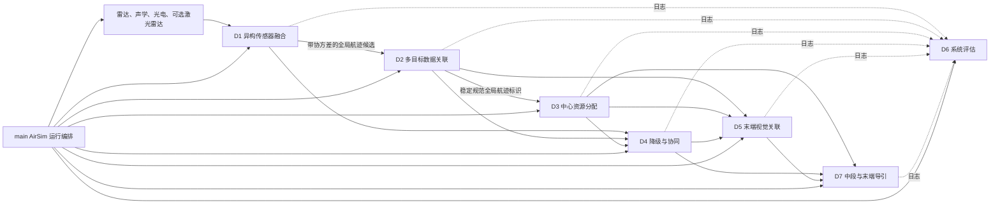
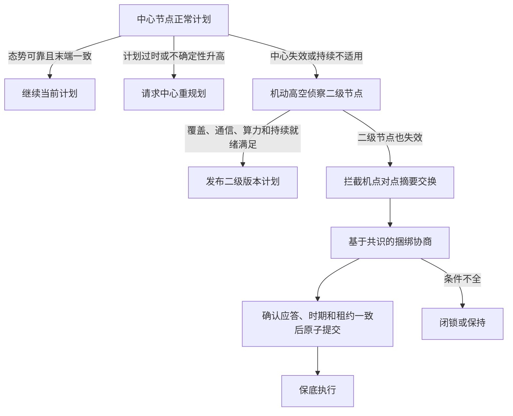
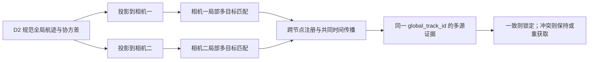

# 反无人机多无人机拦截系统 D1-D7 模块原理汇总

> 文档日期：2026-07-13
>
> 文档性质：由 D1-D7 模块所有者分别编写模块原理文档后，由 main 全局编排智能体汇总。
>
> 适用范围：科研仿真、算法验证、接口联调和工程方案论证。本文不构成实装处置授权、飞行安全批准或武器使用规则。

## 1. 文档目的

本项目研究一个由中心节点、机动高空侦察二级节点和多架拦截无人机组成的反无人机系统
（Counter-Unmanned Aircraft System，C-UAS）。系统要解决的不是单一导引算法问题，而是从
异构探测、全局航迹、身份连续性、资源分配、故障降级、末端视觉配准到导引执行和离线评估的
完整闭环问题。

本文集中说明：

1. 七个研究模块分别解决什么问题；
2. 每个模块采用什么数学模型和默认算法；
3. 模块之间通过什么数据合同连接；
4. 正常、主动降级、被动降级和完全分布式条件下如何运行；
5. 多资源对少目标的协同拦截如何表示和约束；
6. 当前代码已经验证了什么，尚未证明什么；
7. 默认在线能力、可选离线对照和未实现能力之间的边界。

七份模块所有者原始文档保留全部公式、字段和测试证据，本文是面向系统集成和工程汇报的
统一解释，不替代模块详细设计。

## 2. 关键术语

| 中文名称 | 英文全称与缩写 | 在本项目中的含义 |
| --- | --- | --- |
| 反无人机系统 | Counter-Unmanned Aircraft System，C-UAS | 面向低空无人机探测、跟踪、分配、拦截和评估的体系 |
| 指挥控制 | Command and Control，C2 | 维护规范航迹、当前计划和全局任务所有权的中心能力 |
| 北-东-地坐标系 | North-East-Down，NED | 融合、跟踪、分配和导引的本地工作坐标系，向下为正 |
| 世界大地测量系统 1984 | World Geodetic System 1984，WGS84 | 对外地理参考，进入融合前转换为北-东-地坐标 |
| 扩展卡尔曼滤波 | Extended Kalman Filter，EKF | D1 默认的非线性递推状态估计方法 |
| 无迹卡尔曼滤波 | Unscented Kalman Filter，UKF | 非线性较强时的可选研究路线，当前不是默认主线 |
| 乱序量测 | Out-of-Sequence Measurement，OOSM | 到达顺序与物理量测时间顺序不一致的观测 |
| 全局最近邻 | Global Nearest Neighbor，GNN | D2 默认的一对一硬关联策略 |
| 联合概率数据关联 | Joint Probabilistic Data Association，JPDA | 密集目标下的软关联研究对照，当前仅轻量实现 |
| 多假设跟踪 | Multiple Hypothesis Tracking，MHT | 保留多个关联历史的研究路线，当前仅有界对照 |
| 身份切换 | Identity Switch，IDSW | 同一真实目标的代表全局航迹发生错误变化 |
| 基于共识的捆绑算法 | Consensus-Based Bundle Algorithm，CBBA | D4 完全分布式阶段的轻量任务协商基线 |
| 确认应答 | Acknowledgement，ACK | 联盟成员对同一版本、时期和租约的确认 |
| 多目标跟踪 | Multi-Object Tracking，MOT | 在单个相机内维持多个局部视觉目标的短时身份 |
| 只看一次目标检测 | You Only Look Once，YOLO | 可选真实图像目标检测路线，尚未替代默认检测元数据 |
| 透视多点位姿求解 | Perspective-n-Point，PnP | 由三维点与像素对应估计相机位姿的方法 |
| 比例导引 | Proportional Navigation，PN | D7 中段位置导引基线 |
| 比例导航制导 | Proportional Navigation Guidance，PNG | D7 末端视觉导引；与图像文件格式 PNG 无关 |
| 便携式网络图形文件格式 | Portable Network Graphics，PNG | 图像文件格式，默认 AirSim 运行不保存此类截图 |
| 视线 | Line of Sight，LOS | 拦截机或相机指向目标的方向 |
| 预计碰撞时间 | Time to Collision，TTC | 由检测框面积扩张等信息形成的末端接近时间代理量 |
| 速度倍增 | Velocity Multiplication，VM | 根据像面偏差调整速度方向的视觉导引路径 |
| 均方根误差 | Root Mean Square Error，RMSE | 几何估计误差指标 |
| 归一化创新平方 | Normalized Innovation Squared，NIS | 不依赖真值的滤波创新一致性指标 |
| 归一化估计误差平方 | Normalized Estimation Error Squared，NEES | 需要离线真值的状态估计一致性指标 |
| 第九十五百分位 | 95th Percentile，P95 | 时延等长尾指标的百分位统计 |
| 视场 | Field of View，FOV | 相机可见角范围 |
| 交并比 | Intersection over Union，IoU | 预测框和真值框重叠程度 |

产品和软件名称说明：

- 微软空中信息与机器人仿真器（Aerial Informatics and Robotics Simulation，AirSim）用于
  ComputerVision 计算机视觉模式和 SimpleFlight 简化飞行控制模式的仿真；
- 开源计算机视觉库（Open Source Computer Vision Library，OpenCV）用于相机投影、标定和
  可选位姿求解；
- SciPy 科学计算库用于匈牙利线性分配求解；
- NumPy 数值计算库用于矩阵和状态运算；
- 机器人操作系统第二版（Robot Operating System 2，ROS 2）、坐标变换库 tf2 和数据分发
  服务安全机制（Data Distribution Service Security，DDS Security）属于后续工程集成路线，
  不是当前 AirSim 默认运行依赖；
- 微型飞行器链路协议（Micro Air Vehicle Link，MAVLink）和远程身份广播（Remote
  Identification，Remote ID）属于后续合作身份和实机通信路线。

## 3. 总体体系

### 3.1 节点分层

系统按能力和失效层次分为三层：

1. **中心节点**：汇总广域雷达和各类传感器信息，维护规范全局航迹，执行中心化资源分配，
   发布带版本的计划。
2. **机动高空侦察二级节点**：与拦截机同步出动，利用较高分辨率光电云台获取局部全局视野；
   正常时提供图像和粗指向，中心失效时接管小范围融合和重分配。
3. **拦截无人机资源节点**：接收中心或二级节点计划，进行本地相机多目标跟踪、末端配准和
   导引；在中心与二级节点均失效时交换摘要并参与完全分布式协商。

允许的通信关系包括：中心与二级节点、中心与拦截机、二级节点与拦截机、拦截机之间的数据
通信；中心与二级节点、二级节点与小范围拦截机之间还可传输视频或图像摘要。通信可用不代表
任何节点拥有改写规范目标身份的权限。

### 3.2 七模块闭环



### 3.3 统一数据原则

整个系统遵守以下硬性合同：

1. 每条观测同时携带 `measurement_timestamp`，即物理量测时刻，以及
   `arrival_timestamp`，即消息到达处理节点的时刻。
2. 每条观测和航迹必须携带协方差；只有均值而没有不确定性的记录不能直接用于严格门控。
3. 融合工作空间统一使用北-东-地坐标；世界大地坐标只作为外部参考。
4. `global_track_id` 是规范全局航迹标识，由中心 D2 或当前合法所有者维护。D5 和 D7 只能
   比较与引用，不能本地改写或重新绑定。
5. 每份分配计划包含计划标识、版本、所有者、有效期和授权状态；旧版本必须拒绝。
6. 在线算法不能使用 AirSim actor 名称、对象名称或真值身份进行目标绑定；真值只能在结果
   写盘后由 D6 离线评分。
7. 资源数和目标数由输入数组决定，2 对 2、5 对 5、5 资源对 2 目标只是试验配置，不是代码
   上限。
8. 任何授权、身份、版本、友方冲突或证据新鲜度检查失败时，执行链按保守原则闭锁。

## 4. main 全局编排器

main 不是第八个算法模块，而是全局运行和集成责任主体。它负责：

- 生成 AirSim 配置、启动一次 Blocks 场景并在实验回合之间重置；
- 按 `--drone-count N` 创建资源、相机和移动 actor 目标；
- 统一实验时钟、随机种子、场景几何和日志目录；
- 调用 D1-D7 的公开接口，路由版本化数据合同；
- 在 SimpleFlight 场景中实际调用高层速度与高度接口；
- 写出控制命令、拦截摘要、模块日志和 D6 统一报告；
- 保证异常模块不会绕过 D3、D4、D5 的合同门控直接驱动 D7。

当前推荐运行方式是只启动一个 AirSim Blocks 进程，在同一固定场景中用 reset 分隔实验回合。
这种方式减少端口冲突和多实例帧率不稳定，同时保留每个阶段独立复位和日志隔离。

## 5. D1 异构传感器融合与目标配准

### 5.1 模块目标

D1 把雷达、声学、光电和可选合成激光雷达的异步观测转换到同一北-东-地坐标和时间基准，
输出带六维状态、完整协方差和质量证据的全局航迹候选。D1 解决“观测如何融合”，但不决定
“这个目标的规范身份是谁”。后一个问题属于 D2。

### 5.2 输入和输出

统一输入 `SensorObservation` 至少包含：

- 观测标识、传感器标识和传感器模态；
- 量测时刻与到达时刻；
- 坐标框架、量测向量和量测协方差；
- 类别提示、置信度和遮挡/小框等质量标志；
- 来源节点、链路、中继、消息序号和过期预算等来源谱系。

各传感器量测语义为：

- 雷达：距离、方位角、俯仰角和径向速度；
- 声学：粗方位角，可附带声纹类别提示，但不能单独确定距离；
- 光电：检测框中心像素和检测框尺寸，配合相机内参、外参使用；
- 激光雷达：北-东-地三维位置，当前仅作为合成可选输入。

输出状态为：

\[
\mathbf{x}=[p_N,p_E,p_D,v_N,v_E,v_D]^\mathsf{T},
\]

并携带 6×6 状态协方差、航迹时间、质量等级、来源支持、最近创新和时延审计。

### 5.3 默认运动和滤波模型

D1 默认采用常速度运动模型和扩展卡尔曼滤波。时间间隔为 \(\Delta t\) 时：

\[
\mathbf{x}_{k|k-1}=\mathbf{F}\mathbf{x}_{k-1|k-1},\qquad
\mathbf{P}_{k|k-1}=\mathbf{F}\mathbf{P}_{k-1|k-1}\mathbf{F}^{\mathsf T}+\mathbf{Q}.
\]

状态转移矩阵把速度积分为位置；过程噪声按白加速度模型随时间增长。非线性量测使用数值
雅可比、卡尔曼增益和 Joseph 稳定协方差更新形式。选择轻量 NumPy 扩展卡尔曼滤波的原因是
依赖少、公式可审计、乱序回放容易控制，适合当前科研基线。无迹卡尔曼滤波和交互多模型
（Interacting Multiple Model，IMM）保留为后续对照，没有进入默认运行路径。

### 5.4 传感器模型

雷达根据目标相对传感器的位置和速度预测距离、方位、仰角和径向速度。默认雷达距离误差和
径向速度误差随距离增大；这是一条仿真标定曲线，不代表具体雷达型号。

声学只更新水平方位。没有阵列时差和环境模型时，D1 不从单个声学方位伪造三维位置。声学
更适合低空告警、类别提示和对雷达航迹的弱方向约束。

光电使用针孔相机模型：先由相机外参把北-东-地目标位置转换到相机坐标，再由焦距和主点投影
到像素平面。置信度下降、遮挡和小检测框都会放大量测协方差。

### 5.5 时间处理和不确定性治理

D1 按到达顺序接收消息，但按量测时刻更新状态。迟到量测被插入固定滞后历史窗口，从最早
受影响状态重新预测和更新，再传播到当前发布时刻。这避免把 1 秒前的量测错误当成当前量测。

处理步骤为：观测检查、推进融合时钟、时延审计、航迹预测、来源去重、量测时刻关联、初始化
或更新、固定滞后回放、协方差限制和发布。相同观测经中继重复到达时按谱系去重，不能重复
收敛协方差。

只有雷达能够初始化新的三维航迹。声学和光电在没有雷达或既有深度先验时只能提供约束，不能
凭单次方位或像素创建虚假三维轨迹。

### 5.6 航迹质量

D1 输出粗略、稳定、可交接和丢失等质量语义。当前默认分类主要使用二维 95% 误差半径、
累计命中数、传感器来源数和创新通过率：

- 粗略航迹可用于搜索和传感器指向；
- 稳定航迹可供 D2 和 D3 形成较可靠态势；
- 可交接航迹要求较小误差、较多命中和多源支持，可供 D5 做末端投影候选；
- 质量摘要只是证据，D1 不自行触发分配或降级。

### 5.7 当前实现和结果

已实现常速度扩展卡尔曼滤波、距离/质量相关协方差、双时间戳、固定滞后乱序回放、来源去重、
质量分级、区域质量摘要、传感器健康摘要、侦察相机粗指向和受治理回放。跨节点独立估计可用
协方差交集进行保守融合，但只有 D2 先确认规范身份后才允许使用。

当前真实 AirSim 密集交叉数据已经以在线真值隔离方式进入 D1/D2 校准。主要剩余问题是真实
雷达、声学和相机长期混合时延数据不足，高机动模型仍由过程噪声吸收，真实传感器协方差曲线
尚未由设备标定冻结。

## 6. D2 多目标跟踪与数据关联

### 6.1 模块目标

D2 在目标交叉、密集编队、漏检和虚警条件下，决定“哪条新观测属于哪条已有航迹”，维护
规范 `global_track_id` 的连续性，并显式记录身份切换。它是全系统身份权威，D3、D4、D5 和
D7 都只能消费其规范身份。

### 6.2 默认关联模型

D2 默认使用二维北-东平面常速度状态：

\[
\mathbf{x}=[p_N,p_E,v_N,v_E]^\mathsf{T}.
\]

对航迹 \(i\) 与观测 \(j\)，创新和创新协方差为：

\[
\mathbf{r}_{ij}=\mathbf{z}_j-\mathbf{H}\hat{\mathbf{x}}^-_i,\qquad
\mathbf{S}_{ij}=\mathbf{H}\mathbf{P}^-_i\mathbf{H}^{\mathsf T}+\mathbf{R}_j.
\]

马氏平方距离为：

\[
d^2_{ij}=\mathbf{r}_{ij}^{\mathsf T}\mathbf{S}_{ij}^{-1}\mathbf{r}_{ij}.
\]

门外候选被拒绝；门内总代价由马氏距离、可选特征距离和运动一致性组成。运动一致性比较速度
方向、历史运动方向和异常加速度，防止交叉时航迹吸附到运动方向相反的观测。

### 6.3 全局最近邻与匈牙利求解

D2 构造航迹到观测的完整代价矩阵，用 SciPy 的线性和分配函数求解一对一最小总代价。约束是
每条航迹最多匹配一个观测，每个观测最多匹配一条航迹。该硬关联方法计算稳定、可解释，复杂度
约随最大矩阵维数的三次方增长，适合作为当前实时默认基线。

质量感知门控会根据航迹协方差、命中、年龄、漏检、局部目标密度和上一帧风险在上下界内调整
门限。它是一条可解释工程规则，不是已经对所有场景统计最优的通用门控。

### 6.4 生命周期和身份安全

航迹状态机为：

```text
暂定 -> 已确认 -> 可执行
  |        |         |
  +--------+--漏检--> 丢失 --持续漏检--> 删除
                         |
                         +--重新命中--> 已确认或可执行
```

默认连续命中 2 次确认，命中不少于 4 次且协方差足够小时进入可执行状态；连续漏检 2 次进入
丢失，5 次删除。不同进入和退出阈值形成生命周期迟滞，避免单帧漏检立即删轨。

仿真 actor 名、单帧检测标识、本地视觉标识和离线真值都没有改写规范全局航迹标识的权限。
D2 关联完成后，离线评估器才可读取真值计算身份切换和连续性。

### 6.5 关联风险和指标

D2 输出歧义分数、候选重叠、最优与次优代价间隔、航迹质量、漏检风险和滑窗风险。硬风险包括
身份切换增量、错误重复解释和可用身份连续性下降；软风险表示需要继续观察、增加证据或提高
D3 迟滞。D2 只发布风险，不直接触发重规划或降级。

核心指标包括：

- `id_switch_count`：身份切换次数；
- 身份连续性和覆盖连续性；
- 重复分配或同一真值被多航迹解释的次数；
- 位置均方根误差；
- 归一化创新平方和离线归一化估计误差平方；
- 单循环时延及第九十五百分位时延。

### 6.6 可选关联路线

轻量联合概率数据关联可以枚举小规模联合假设并输出边缘概率，但当前跟踪器仍对单个最终匹配
执行普通卡尔曼更新，没有完整概率混合状态和协方差。轻量多假设跟踪只保留有限分支和短历史，
没有生产级剪枝、分簇和长期假设管理。两者只用于离线对照，不能描述为完整实现。

Stone Soup 多目标跟踪研究框架和 FilterPy 滤波算法库尚未进入默认端到端路径。当前证据没有
证明增加依赖会在实时预算内稳定优于本地全局最近邻基线。

### 6.7 当前验证结果

严格密集交叉实验使用 5 个目标、4 米和 2 米相邻间距、每组 20 个随机种子，共 40 个真实
AirSim 计算机视觉实验和 10200 条仅评估器可见真值样本。在线真值泄漏为 0。

最佳全局最近邻候选把平均身份切换从 1.3583 降至 0.6167，下降 54.6%；身份连续性从
0.9810 提高到 0.9840，绝对增益只有 0.0030；第九十五百分位循环时延为 24 毫秒。由于连续性
增益未达到预冻结准入条件，候选没有替换默认配置。轻量联合概率数据关联在同输入下退化。

结论是：默认全局最近邻与匈牙利主线保持，身份切换问题得到改善但没有完全解决。

## 7. D3 集中式资源-目标分配

### 7.1 模块目标

D3 根据规范全局航迹、目标威胁、航迹不确定性、资源状态、拦截可行性和冲突风险，生成带版本
的资源-目标分配计划。它既支持普通一资源对一目标，也支持高威胁目标需要多个主用资源和一个
待命备用资源的多对少分配。

### 7.2 数据模型

目标输入包含全局航迹标识、位置、速度、协方差、威胁度、质量、需求资源数和任务窗口。资源
输入包含位置、速度、可用性、续航/能量、机动裕度、相机能力、当前任务和通信状态。

输出 `AssignmentPlan` 包含：

- 计划标识、计划版本、所有者和生成时刻；
- 每个资源到规范全局航迹的绑定；
- 单边代价和拒绝原因；
- 人工授权状态；
- 联盟标识、成员角色、波次、激活状态和到达窗口；
- 计划有效期及与上一版本的变化原因。

### 7.3 优化模型

设资源 \(i\) 分配给目标需求槽 \(j\) 的二元变量为 \(x_{ij}\)：

\[
\min \sum_{i,j} x_{ij} C_{ij}.
\]

普通约束为每个资源最多一个任务、每个需求槽最多一个资源。代价 \(C_{ij}\) 由以下分量组成：

1. 接近和拦截窗口代价；
2. 航迹协方差和质量惩罚；
3. 目标威胁权重；
4. 资源能量、健康和当前负载惩罚；
5. 相机视场和末端确认难度；
6. 多资源航迹冲突与安全间隔风险；
7. 切换现有任务所产生的迟滞代价。

每个分量保留解释值，便于 D6 判断计划变化来自威胁、几何、不确定性还是资源状态。

### 7.4 一对一与多资源需求

普通目标用一个需求槽表示，SciPy 匈牙利求解器给出最低总代价分配。高威胁目标可展开为多个
有角色的需求槽，例如两个已激活主成员和一个待命备用成员。联盟采用全有或全无准入：必要
主成员不齐时不能把不完整联盟当成已授权协同计划。

当前策略不要求多个主成员同时到达。各主成员可按计划波次独立进入 5 米物理成功范围；共同
到达时间、撞击时间一致性和协同导引控制尚未实现。

### 7.5 滚动重规划和迟滞

D3 周期性重算候选计划，但不会因微小代价变化立即切换。基本规则为：新计划相对当前计划有
足够收益，并且当前计划已经保持最小驻留时间，才接受新版本。目标出现/丢失、资源失效、威胁
变化或 D4 明确请求重规划可触发特殊路径。

D5 的末端反馈不能直接改写分配。持续模糊、友方冲突、失锁或重获取失败会映射成下一轮视觉
确认代价和风险；单帧异常通过驻留和主资源保护逻辑吸收。

### 7.6 版本和执行安全

计划版本必须单调增加。D7 只接受当前、授权、未过期且资源-目标绑定一致的计划。资源、目标、
所有者、联盟角色或版本发生不兼容变化时，原导引上下文失效。备用资源即使看到目标也不能在
没有新版本显式激活时自行接管。

### 7.7 当前能力边界

当前已经实现 SciPy 匈牙利分配、可解释代价、动态资源/目标规模、滚动版本、迟滞、末端反馈、
多资源需求槽、主用/备用角色和 D7 绑定门控。最小费用流工具 OR-Tools 只作为复杂容量约束的
预留路线，尚未进入默认主线。

现阶段仍缺长期真实多随机种子下的权重冻结和完整逐时刻计划历史；高威胁联盟的计划合同已经
接通，但整体完成率受 D5 第二主成员视觉获取限制。

## 8. D4 分布式协同、主动降级和被动接管

### 8.1 模块目标

D4 判断当前计划应继续由中心执行、请求中心重规划、交给机动高空侦察二级节点接管，还是在
中心和二级节点均失效后进入完全分布式协商。它既处理节点被摧毁或通信中断造成的被动降级，
也处理中心仍在线但态势质量和计划时效已经不足的主动降级。

### 8.2 分层接管架构



二级节点不是固定高空系留节点的单一假设，而是当前方案中的机动高空侦察无人机。它可以根据
D1 雷达粗指向调整高性能光电云台，以较窄视场获得更大目标像素，而不强求单相机始终覆盖全部
目标。中心可用时它提供局部图像和线索；中心失效后才在持续就绪条件下成为新计划所有者。

### 8.3 中心健康状态机

中心健康状态为：

```text
正常 -> 退化 -> 可疑 -> 失效
```

判定证据包括心跳年龄、航迹更新时间、分配更新时间和通信质量。进入和恢复采用不同阈值，
防止短时抖动导致所有权来回切换。中心恢复后也不立即夺权，而是与当前二级或分布式态势并行
校验，确认版本和航迹兼容后再迁移。

### 8.4 主动降级仲裁

主动降级综合以下证据：

- D1 航迹协方差、量测年龄、来源缺口和区域质量；
- D2 关联歧义、身份切换、重复解释和身份连续性；
- D3 当前计划年龄、迟滞、资源可行性和高威胁目标需求满足情况；
- D5 末端关联是否与当前中心/二级分配一致、是否持续模糊、友方冲突或重获取失败；
- 二级节点覆盖、云台指向、通信、算力和计划生成能力。

如果 D5 与当前分配一致，航迹和计划仍满足质量门限，则继续执行，不因存在二级节点而降级。
如果风险只是暂时升高，优先请求中心发布新版本；只有风险持续、旧计划明显失效且二级节点
持续就绪时才转移所有权。D4 不把“看不见”简单等同于“中心失效”，也不要求远距离雷达误差
已经足够小时必须二次分配。

### 8.5 二级接管和完全分布式协商

二级节点按覆盖质量、数据新鲜度、通信可达性、计算余量和持续就绪时间评分。只有就绪条件连续
满足，才能发布所有者、时期、版本和租约严格更新的计划。

中心和二级节点都失效后，资源节点交换压缩的航迹摘要和资源摘要，使用轻量基于共识的捆绑
算法或拍卖式逻辑选择任务。高威胁目标需要多个资源时，仅选出成员还不够，必须形成：

```text
提议 -> 收集确认应答 -> 已提交 -> 执行
                     \-> 重构或中止
```

全部必要成员必须对同一联盟标识、联盟版本、计划版本、时期和有效租约确认，才原子提交。缺少
确认、旧时期、过期租约或网络分区均按保守原则闭锁。这样可以避免两个分区同时认为自己拥有
同一任务。

### 8.6 当前验证结果

D4 在正常、中心失效、中心和二级同时失效、0.5 秒延迟、30% 丢包和网络分区恢复六类场景中
各运行 10 个随机种子，共 60 个案例。实验时钟下安全结果 60/60 通过，错误降级、重复所有者和
脑裂防护失败均为 0；30% 丢包下 7/10 按合同闭锁。

这证明时期、租约、确认应答和闭锁逻辑能够运行，不代表真实无线电链路、硬件时钟漂移、带宽
竞争和加密认证已经完成。当前轻量基于共识的捆绑算法是保底协商基线，不是生产级麻省理工
学院（Massachusetts Institute of Technology，MIT）航空控制实验室代码的直接部署。

## 9. D5 末端视觉配准与身份认证

### 9.1 模块目标

D5 解决“相机里当前这个检测框，是否就是 D3 分配给本机的规范全局目标”。末端视场可能同时
出现多个入侵目标、友方资源和未知飞行物；画面中最近、最大或最居中的目标都不必然是分配
目标，因此禁止本地节点按视觉直觉自行换绑全局航迹标识。

### 9.2 三层身份

D5 明确区分：

1. **规范全局航迹标识**：由 D2 维护，跨传感器和跨节点使用；
2. **本地视觉航迹标识**：由每个相机的多目标跟踪器维护，只在该相机和本地时期内有效；
3. **离线真值标识**：只供 D6 评分，不能进入在线关联。

不同相机中的局部编号即使相同也没有任何天然关系。例如相机一看到局部目标 1、2、3，相机二
看到局部目标 2、3、4，不能根据数字相同认定它们是同一目标。两侧都必须独立投影回同一组
规范全局航迹候选，再由中心或合法二级节点注册对应关系。

### 9.3 全局航迹投影到图像

首先把 D2 航迹从自身有效时刻预测到相机量测时刻：

\[
\mathbf{p}(t_c)=\mathbf{p}(t_t)+\mathbf{v}(t_t)(t_c-t_t).
\]

然后利用相机位置和姿态把世界点转换到相机坐标：

\[
\mathbf{P}_c=\mathbf{R}_{cw}(\mathbf{P}_w-\mathbf{C}_w).
\]

针孔投影为：

\[
u=f_x X_c/Z_c+c_x,\qquad v=f_y Y_c/Z_c+c_y.
\]

同时用投影雅可比把三维航迹协方差传播到二维像素协方差：

\[
\mathbf{S}_{uv}=\mathbf{J}\mathbf{P}_{xyz}\mathbf{J}^{\mathsf T}+\mathbf{R}_{pixel}.
\]

相机内参包括分辨率、焦距和主点；外参包括机体在北-东-地坐标中的位置姿态以及相机相对机体
的安装位姿。当前仿真相机可前移约 0.5 米以减少机架遮挡，云台或相机姿态根据 D1 粗指向朝向
任务目标。真实工程还需标定镜头畸变、滚动快门、安装变形和时间同步误差。

### 9.4 单相机多目标关联

每个相机先形成 `LocalVisualTrack`，记录本地编号、检测框、置信度、像面运动、框面积历史、
多目标跟踪历史长度和候选全局航迹列表。

对每个全局投影与本地视觉轨迹计算候选代价：

- 像素马氏距离；
- 检测框中心和面积变化一致性；
- 方位角速度或像面速度一致性；
- 时间戳新鲜度；
- 类别一致性；
- 遮挡、边缘框和小框质量惩罚；
- 友方身份冲突惩罚；
- 二级侦察线索一致性。

默认用一对一匈牙利分配消除同一相机内多个框争抢同一规范目标。候选接近时输出高歧义，不
强行锁定。联合概率数据关联接口可用于研究密集模糊场景，但不是当前默认在线路径。

### 9.5 跨相机关联

跨视角的核心不是直接比较两个相机中的局部编号，而是建立共同规范锚点：



相机一和相机二各自把局部轨迹关联到同一中心航迹；再按来源节点、相机标识、本地时期和局部
轨迹标识组成唯一键。跨视角注册使用共同时间传播、几何门控、运动和类别一致性，并保证同一
来源内一对一。未知跨节点相关性存在时，D1 可在 D2 确认同一规范身份后用保守协方差交集融合，
不能简单重复使用两份相关观测使协方差过小。

完全无中心时，拦截机可以交换局部轨迹摘要、像素位置、检测框面积历史、方位变化和相机位姿，
形成临时共同证据；但 D5 仍不能自行生成永久规范身份。临时结果必须绑定 D4 的时期、联盟版本
和租约，中心恢复后再与规范航迹保守合并。

### 9.6 友方和合作身份

合作身份遵循“正向确认”原则：远程身份广播、经签名的微型飞行器链路消息、中间件安全认证或
近距视觉标签可以证明“这是已验证友方”；没有合作身份只能说明未知，不能反向证明敌对。

身份声明状态分为已验证、陈旧、未验证和疑似欺骗。友方声明与分配目标投影重叠、身份来源
冲突或认证过期时，D5 输出保持或中止，并上报中心/二级节点复核。

### 9.7 决策状态和迟滞

末端决策为：

- `locked`：唯一匹配、置信度足够、身份/版本一致且连续稳定；
- `ambiguous`：多个候选代价接近，不能安全区分；
- `hold`：友方冲突、授权或版本问题，需要停止视觉接管；
- `reacquire`：原目标证据暂时丢失，只允许在同一身份和短时窗口内重获取。

锁定需要连续证据，不因单帧大框立即成立；释放和重获取也使用独立阈值。D5 输出
`TerminalAssociation` 和 `IdentityClaim`，但不输出车辆控制命令。

### 9.8 检测和多目标跟踪后端

当前默认 AirSim 在线路径仍使用 `simGetDetections` 检测元数据形成检测框，但在线关联不读取
其中的真实 actor 身份。YOLOv8 无人机权重、ByteTrack 多目标跟踪和增强型在线实时跟踪器
（Bag of Tricks for Simple Online and Realtime Tracking，BoT-SORT）已经接线并进行真实
AirSim 筛选；它们尚未达到替换默认路径的检测准确性门限。

OpenCV 相机标定和位姿求解对照已隔离实现，但真实外参漂移、时间偏差和畸变下的工程闭环仍需
专门标定。AprilTag 视觉标签可用于近距合作试验，不能作为非合作目标的通用身份方案。

### 9.9 当前验证结果

五资源对二目标协同视觉闭环中，两个高威胁目标主成员等共形成 120 个有效机会：完成关联和
锁定 74/120，合同允许 35/120，最终控制允许 7/120。主要断点是第二主成员未锁定、末端检测
获取超时和少量检测框过小。

原生多目标跟踪筛选使用 1920×1080 分辨率、90 度视场、20/30/50 米距离、3 组置信度和
2 个跟踪后端，共 18 个真实 AirSim 案例。20 米时两种后端连续率为 1、身份切换为 0，
第九十五百分位时延约 7.4/16.2 毫秒；但交并比 0.5 口径下精确率和召回率仅约 0.30-0.32
与 0.26-0.33，30/50 米无有效接受检测，因此 18 个候选均未准入。

结论是：几何投影、身份隔离、版本门控和多相机证据结构已经接通；真实图像检测精度、远距离
尺度、跨视角稳定注册和第二主成员锁定仍是当前最关键的性能缺口。

## 10. D6 系统级评估

### 10.1 模块目标

D6 是只读离线评估模块。它消费 D1-D7 和 main 写盘日志，计算指标、可用性、统计区间、失败
原因和中文图表，不参与在线控制，也不能用离线真值反向修正 D1、D2 或 D5。

### 10.2 评估维度

指标按系统链路分组：

1. **探测**：探测概率、虚警率、漏检率、覆盖范围和证据新鲜度；
2. **融合与跟踪**：位置/速度均方根误差、连续性、身份切换、重复航迹、归一化创新平方和
   归一化估计误差平方；
3. **分配**：未分配高威胁目标、错误重复分配、需求满足、计划变化和迟滞拒绝；
4. **降级**：故障转移时间、二级接管率、共识轮数、确认应答、租约、脑裂和闭锁；
5. **末端配准**：终端关联准确率、末端身份切换、模糊视场事件、友方重叠保持和锁定时间；
6. **导引执行**：合同允许、控制允许、模式切换和物理进入拦截半径四层漏斗；
7. **安全**：全局身份改写、在线真值使用、备用成员越权、约束违规和人工覆盖；
8. **性能**：循环均值、长尾时延、计算量、丢包和通信摘要。

### 10.3 多层分母

D6 严格区分帧、资源-目标对、目标、联盟、实验回合和随机种子。一个资源进入 5 米不能推导
整个多资源联盟完成；合同允许也不能推导控制允许或物理成功。

对每项指标采用三态：

- 可用：必要字段和分母完整，数值可以为零；
- 不可用：缺真值、协方差、时间戳、事件或分母，不能填零；
- 不适用：当前场景本来没有该概念。

这种处理防止“没有记录到”被误解释成“事件没有发生”。

### 10.4 统计和来源治理

D6 保存场景版本、随机种子、源文件路径、生产者、运行标识和安全散列算法 256 位摘要。多随机
种子报告可输出均值、标准差、中位数、百分位和固定 2000 次自助重采样 95% 置信区间。

输出包括逐实验逗号分隔值文件、聚合 JavaScript 对象表示法文件、中文 Markdown 报告和二维
曲线。主总线执行后指标优先表示实际行为；合同诊断和集成回放保留独立口径，不合并成单一
“命中率”。

### 10.5 当前能力和结果

D6 默认主线已实现通用记录模型、七源适配、探测/跟踪/分配/联盟/降级/末端/通信/导引/物理/
安全指标、中文报告和图表。py-motmetrics 多目标跟踪评估库已有隔离适配，可输出身份调和评分、
多目标跟踪准确率和多目标跟踪精度；TrackEval 评估库、高阶跟踪准确度、最优子模式分配距离和
广义最优子模式分配距离尚未接入。

2026-07-13 统一报告消费 D1 汇总 1 条、D2 难度记录 3660 条、D3 协同案例 40 条、D4 通信故障
案例 60 条、D5 主资源记录 160 条、D5 原生多目标跟踪记录 18 条和 D7 资源对/配置记录 164 条。
合同允许 35、控制允许 7、模式切换 9、资源对物理成功 62，这四个数分别来自各自证据层，不能
相互替代。在线真值使用、全局身份改写和备用成员越权均为 0。

## 11. D7 比例导引和末端视觉导引

### 11.1 模块目标

D7 把 D3 当前分配、D4 所有权许可、D5 末端关联和目标/资源运动状态转换为导引速度候选。它
负责导引律和模式切换门控，不负责生成分配、修改身份、决定敌我或直接管理 AirSim 生命周期。
实际 SimpleFlight 高层速度命令由 main 下发。

### 11.2 中段位置比例导引

对资源位置 \(\mathbf{p}_m\)、目标位置 \(\mathbf{p}_t\)、相对位置
\(\mathbf{r}=\mathbf{p}_t-\mathbf{p}_m\) 和相对速度
\(\mathbf{v}_r=\mathbf{v}_t-\mathbf{v}_m\)，计算视线角速度和闭合速度。比例导引的核心是
让横向指令与闭合速度和视线角速度成比例：

\[
a_n=N V_c \dot{\lambda},
\]

其中 \(N\) 是导航系数，\(V_c\) 是闭合速度，\(\dot{\lambda}\) 是视线角速度。当前在线主线
主要在水平面执行位置比例导引，并用有界纯追踪作为中段重获取对照。比例导引相对纯追踪更
关注消除视线旋转，通常能减少追尾式大弯路。

### 11.3 视觉比例导航制导

末端视觉路径吸收了 `png_guidance_delivery` 交付包中的两类算法思想：

1. **速度倍增路径**：把检测框中心相对图像主点的像素偏差转换成归一化视线偏差，在保持前向
   速度的同时调整水平和垂直速度方向；
2. **检测框面积与预计碰撞时间路径**：检测框面积持续增大表示目标接近，用面积变化率构造预计
   碰撞时间代理，并结合视线变化和闭合速度形成末端指令。

检测框中心、宽高和面积先经过图像卡尔曼滤波。视线质量检查包括检测框置信度、面积下限、
边缘裁切、创新跳变、视线抖动和连续稳定帧。预计碰撞时间路径还要求面积扩张方向正确、时间
范围合理且闭合速度满足门限。

### 11.4 雷达中段到视觉末段的切换

状态机为：

```text
雷达中段
  -> 交接等待
  -> 视觉驻留或重获取宽限
  -> 视觉末段

任一合同或质量检查失败
  -> 继续雷达中段、保持、重获取或撤销中止
```

切换不是只看距离。即使约 30 米或更近，也必须同时满足：

- D3 计划当前、授权、未过期，资源和目标绑定一致；
- D4 所有者、模式、二级就绪或分布式提交一致；
- D5 为同一规范全局航迹提供锁定，且无友方冲突和重复锁风险；
- 相机分辨率、目标像素尺寸、视场边缘、图像稳定性和检测连续性合格；
- 拦截机速度、闭合速度、转弯/加速度裕度和剩余距离允许完成机动；
- 多资源联盟中的成员角色、激活状态、联盟版本和视觉授权范围一致。

当前 main AirSim 受控拦截的默认视觉距离门约为 8 米，可由命令行覆盖；30 米是前期分析和
标定候选，不是硬编码最终值。离线质点模型曾使用更大的 250 米切换距离，只适用于对应抽象
模型，不能与真实图像交接距离混用。

### 11.5 短时丢测和外推

D7 为每个“资源到规范目标”控制上下文独立保存图像滤波器、真实锁定、丢帧计数、命令窗口和
模式迟滞。已有真实锁定后发生短时丢帧，可在最多 0.25 秒内使用图像卡尔曼预测；满足更严格
条件时可对最后有效命令做指数衰减的短时保持。超过硬上限、身份/版本变化、友方冲突或 D4/D5
安全失败立即清空状态。

短时外推只用于同一目标暂时丢测，不能用于首次视觉切换，不能把旧检测框借给新目标，也不能
绕过 D3、D4、D5 合同。

### 11.6 多资源状态隔离

每个资源-目标对使用独立控制上下文。因此两个主成员拦截同一高威胁目标时，一个成员丢锁不会
污染另一个成员的滤波器。备用成员在未激活时保持待命，即使本地检测质量很好也不能输出视觉
执行命令。

多个独立比例导引控制器同时指向同一目标不等于真正协同导引。当前没有共同预计到达时间、
共同撞击时刻、成员间预测避碰和协同终端扇区控制，报告必须把“联盟合同”与“协同控制律”
区分开。

### 11.7 当前验证结果

2 对 2 的视觉预计碰撞时间路径覆盖 10 个随机种子、20 个资源-目标对，5 米物理成功 20/20，
视觉控制允许样本 84，模式切换 20，在线真值使用 0。该结果证明当前几何和时限下接口、门控、
面积质量治理和 SimpleFlight 执行闭合，不证明视觉导引优于位置比例导引。

五资源对二目标的 40 个 SimpleFlight 实验中，基线联盟完成 0/10；20 米交接、3 秒窗口、
40 度扇区配置完成 5/10；5 秒和 8 秒窗口配置分别为 2/10 与 1/10。最佳结果未达到 8/10 准入
门限，主要失败来自 D5 未锁定和检测获取超时。待命备用越权、全局身份改写和在线真值使用均为
0。

三维比例导引、真实比例导引、增广比例导引和模糊/鲁棒比例导引近似已经作为隔离式离线基准，
没有注册为在线控制路径，也没有修改经过多轮测试的 `png_guidance_delivery` 核心公式。

## 12. 端到端运行流程

### 12.1 正常中心化流程

1. 雷达提供可初始化三维位置，声学和光电提供辅助约束。
2. D1 按量测时刻融合并发布带协方差的航迹候选。
3. D2 进行全局最近邻关联，维护规范全局航迹标识。
4. D3 根据威胁、几何、资源和不确定性发布版本化分配。
5. D4 判断中心、计划和态势仍可靠，输出继续当前计划。
6. D7 使用位置比例导引执行中段接近。
7. D5 把规范航迹投影到每个相机，关联本地视觉轨迹并验证友方冲突。
8. D3、D4、D5 合同和视觉/机动质量全部通过后，D7 切换视觉比例导航制导。
9. main 下发 SimpleFlight 高层命令，D6 离线评估所有层级结果。

### 12.2 主动降级流程

1. 中心仍在线，但 D1 不确定性升高、D2 身份风险上升、D3 计划过时或 D5 与当前分配持续不一致。
2. D4 先要求继续观察或请求中心重规划，不立即移交所有权。
3. 若新计划恢复一致性，继续中心化执行。
4. 若风险持续且机动高空侦察二级节点具备覆盖、通信和计算能力，D4 发布严格更新的二级计划。
5. D5 重新核对计划所有者、版本和全局身份；D7 在新合同生效前不延续旧视觉许可。

### 12.3 被动降级流程

1. 中心心跳、航迹或分配更新超过阈值，健康状态进入失效。
2. 就绪的二级节点以新时期、版本和租约接管。
3. 二级节点也失效时，拦截机交换压缩摘要并运行轻量分布式协商。
4. 全部必要成员确认同一联盟后原子提交；条件不齐则保持或闭锁。
5. 中心恢复后先双轨比对，不立即夺权。

### 12.4 完全分布式末端流程

完全分布式不等于各无人机自由选择画面目标。资源之间交换本地视觉轨迹摘要、像素/框面积历史、
相机位姿、时间戳、协方差和合作身份声明；D5 形成受 D4 时期与租约约束的临时跨视角证据；D4
完成联盟提交；D7 只对已提交成员执行当前目标。任一节点不得把自己的本地视觉编号升级为永久
全局航迹标识。

## 13. 多资源对少目标协同拦截

高威胁目标可要求 3 架无人机，其中 2 架为已激活主成员，1 架为待命备用。当前实现采用混合
主备策略：

1. D3 把目标需求展开成角色化资源槽并形成联盟标识；
2. 主成员分别获得自己的资源-目标绑定、波次和允许窗口；
3. 备用成员只监视，不在旧版本下执行；
4. D5 对每个主成员独立验证同一规范目标，不要求本地视觉编号一致；
5. D4 在中心失效后要求全部必要主成员确认同一联盟版本；
6. D7 为每个主成员独立运行位置比例导引和视觉比例导航制导；
7. 当前完成判据为每个已激活主成员分别进入目标 5 米北-东-地三维范围，不要求同时到达；
8. 一个主成员失败时，必须由 D3/D4 发布新版本激活备用成员，备用不能自行补位。

当前已经实现的是多资源合同、主备角色、独立末端门控和物理完成统计。尚未实现的是共同到达
时间优化、协同定位闭环、成员间避碰、协同终端角约束和真正的联盟级导引控制律。

## 14. 当前验证结论

| 验证项 | 当前证据 | 可以得出的结论 | 不能得出的结论 |
| --- | --- | --- | --- |
| D1/D2 密集交叉 | 40 个真实 AirSim 回合，在线真值泄漏 0 | 受治理回放和硬关联标定链可运行 | 身份切换已完全解决 |
| D2 候选关联 | 身份切换下降 54.6%，连续性仅提高 0.0030 | 候选有局部改善但不准入 | 联合概率数据关联优于默认路径 |
| D4 故障矩阵 | 60/60 安全结果通过，错误降级和脑裂失败为 0 | 实验时钟下时期/租约/确认闭锁有效 | 真实无线网络已经验证 |
| D5 原生多目标跟踪 | 20 米连续率 1、身份切换 0，但检测精确率/召回率低 | 跟踪器可运行，检测前端仍不足 | ByteTrack 或 BoT-SORT 可替换默认检测 |
| D7 2 对 2 | 20/20 进入 5 米 | 当前固定几何下物理闭环完成 | 视觉导引普遍优于位置比例导引 |
| 5 资源对 2 目标 | 最佳联盟完成 5/10 | 多资源合同和执行链已接通 | 多资源协同拦截已经稳定成熟 |
| 系统安全项 | 在线真值使用、全局身份改写、备用越权均为 0 | 当前回放中关键安全不变式保持 | 已完成实机安全认证 |

## 15. 默认、可选和未实现能力

| 领域 | 默认在线主线 | 已实现的可选或离线对照 | 未实现或未晋级 |
| --- | --- | --- | --- |
| D1 融合 | NumPy 常速度扩展卡尔曼滤波、乱序回放 | 协方差交集、无迹滤波隔离基准 | 真实设备协方差冻结、完整交互多模型 |
| D2 关联 | 全局最近邻、匈牙利、质量门控 | 轻量联合概率数据关联、有界多假设跟踪 | 完整联合概率更新、生产级多假设树、自动算法切换 |
| D3 分配 | SciPy 匈牙利、版本、迟滞、多资源需求槽 | 增量候选、复杂约束接口 | OR-Tools 最小费用流主线、稳定协同到达优化 |
| D4 降级 | 中心、机动二级、完全分布式三级仲裁 | 轻量基于共识的捆绑算法、离线代价差距 | 真实网络认证、生产级分布式协调器 |
| D5 末端 | AirSim 检测元数据、几何投影、匈牙利、保守状态机 | YOLOv8、ByteTrack、BoT-SORT、OpenCV 标定对照 | 远距真实检测准入、完整合作身份栈、长期跨视角稳定注册 |
| D6 评估 | 本地七源指标、可用性、中文报告和图表 | py-motmetrics 隔离适配 | TrackEval、高阶跟踪准确度、集合距离指标 |
| D7 导引 | 位置比例导引、中段重捕、视觉速度倍增 | 视觉预计碰撞时间、三维/真实/增广/鲁棒比例导引离线基准 | 联盟级协同导引、底层姿态推力和实机飞控 |

## 16. 当前优先问题

1. **D5 第二主成员末端获取**：检测框尺度、视场边缘、相机姿态、外参和锁定连续性仍限制
   五资源对二目标联盟完成率。
2. **真实图像检测准入**：YOLOv8 和两种多目标跟踪后端已经运行，但 30/50 米检测和边界框
   准确性不足，默认仍需使用 AirSim 检测元数据。
3. **D2 身份连续性**：身份切换明显下降，但连续性增益不足，候选配置不能替换默认关联器。
4. **D3 长期动态标定**：不同资源/目标数量、资源失效、威胁变化和末端反馈权重需要更多真实
   多随机种子历史。
5. **D4 网络真实性**：现有验证使用实验时钟故障注入，尚需真实丢包、时钟偏差、带宽限制和
   认证链测试。
6. **D7 协同能力边界**：多个独立控制器不等于协同导引；共同到达、避碰和终端角约束仍需
   单独研究。
7. **D6 长期趋势**：需要持续保存跨提交、跨场景和跨阈值的多随机种子趋势，而不是只看单批
   报告。

## 17. 模块详细文档

| 模块 | 原理综述 | 算法与实施文档 |
| --- | --- | --- |
| D1 异构传感器融合 | [模块原理](research_modules/d1_sensor_fusion/docs/MODULE_PRINCIPLES_CN.md) | [算法与实施](research_modules/d1_sensor_fusion/docs/ALGORITHM_AND_IMPLEMENTATION.md) |
| D2 多目标数据关联 | [模块原理](research_modules/d2_data_association/docs/MODULE_PRINCIPLES_CN.md) | [算法与实施](research_modules/d2_data_association/docs/ALGORITHM_AND_IMPLEMENTATION.md) |
| D3 集中式资源-目标分配 | [模块原理](research_modules/d3_assignment_planner/docs/MODULE_PRINCIPLES_CN.md) | [算法与实施](research_modules/d3_assignment_planner/docs/ALGORITHM_AND_IMPLEMENTATION.md) |
| D4 分布式协同与降级接管 | [模块原理](research_modules/d4_distributed_fallback/docs/MODULE_PRINCIPLES_CN.md) | [算法与实施](research_modules/d4_distributed_fallback/docs/ALGORITHM_AND_IMPLEMENTATION.md) |
| D5 末端视觉关联与身份认证 | [模块原理](research_modules/d5_terminal_association/docs/MODULE_PRINCIPLES_CN.md) | [算法与实施](research_modules/d5_terminal_association/docs/ALGORITHM_AND_IMPLEMENTATION.md) |
| D6 系统级离线评估 | [模块原理](research_modules/d6_evaluation_metrics/docs/MODULE_PRINCIPLES_CN.md) | [算法与实施](research_modules/d6_evaluation_metrics/docs/ALGORITHM_AND_IMPLEMENTATION.md) |
| D7 比例导引与末端视觉导引 | [模块原理](research_modules/d7_proportional_guidance/docs/MODULE_PRINCIPLES_CN.md) | [算法与实施](research_modules/d7_proportional_guidance/docs/ALGORITHM_AND_IMPLEMENTATION.md) |

## 18. 总结

当前项目已经形成一条可运行、可审计的科研仿真闭环：D1 统一异构观测和不确定性，D2 维护
全局身份，D3 生成带版本的普通和多资源分配，D4 在中心、机动二级和完全分布式之间保守仲裁，
D5 用几何、时间、运动和合作身份完成末端视觉配准，D7 在全部合同通过后执行位置比例导引和
视觉比例导航制导，D6 对每一层分别统计而不以单一命中率掩盖问题。

体系当前的强项是数据合同、版本和身份边界清楚，在线真值隔离、备用资源越权防护和降级闭锁
已有回归证据。主要性能瓶颈不在“是否有一个导引公式”，而在真实视觉检测、跨视角稳定注册、
第二主成员末端获取和真实通信条件下的长期标定。后续工程推进应在不放宽身份、版本和友方
安全门控的前提下，优先补齐这些证据。
