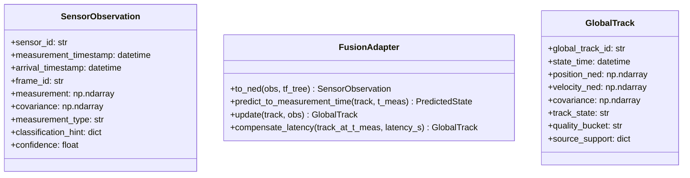
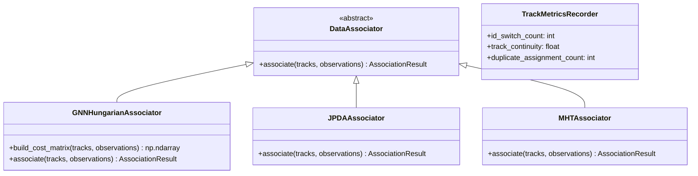
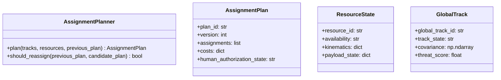
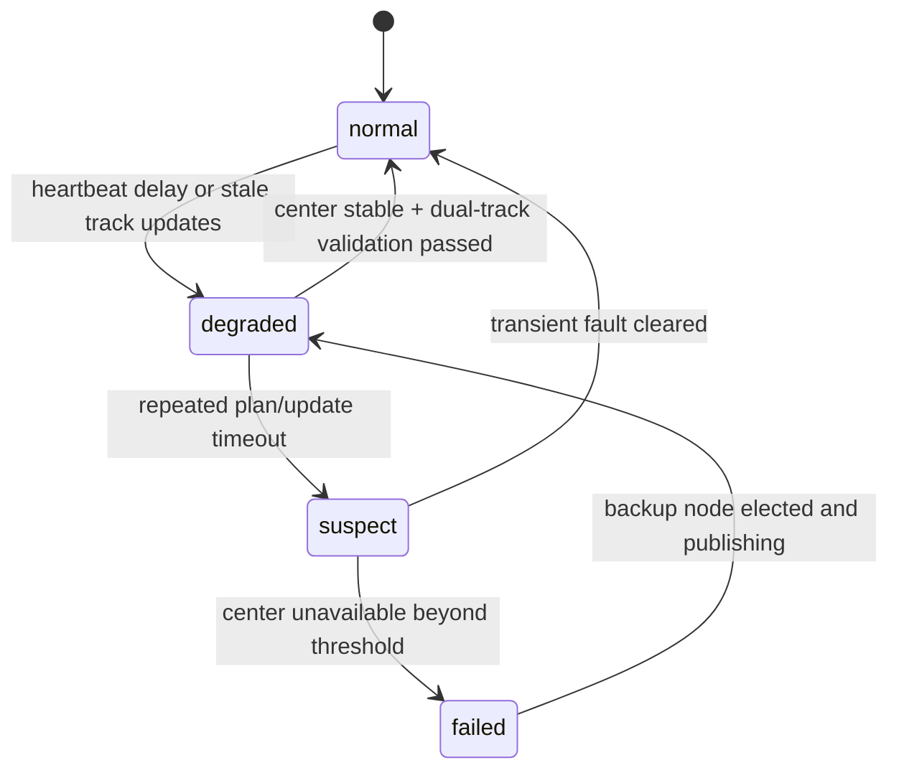
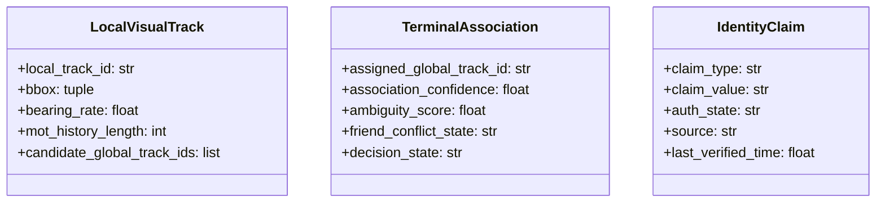
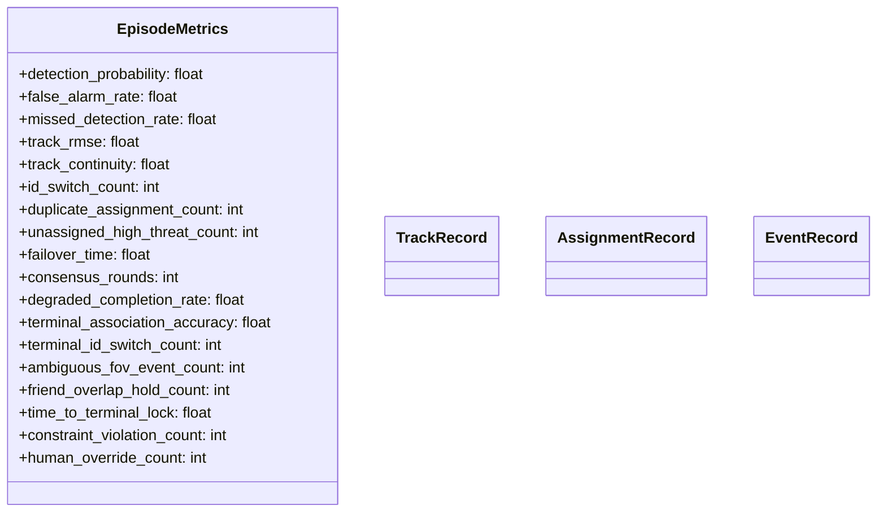
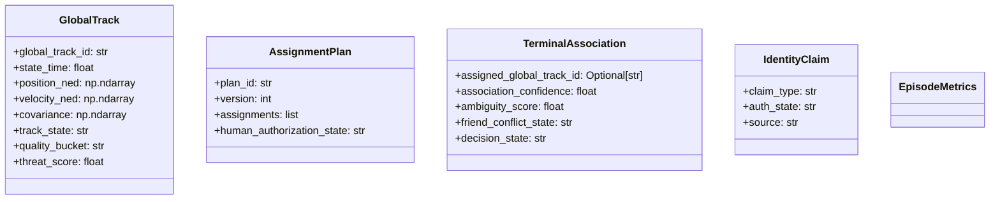

# Deep Research Synthesis for a Six-Agent Counter-UAS Tracking, Assignment, Failover, Terminal Registration, and Evaluation Stack

This report synthesizes public literature and mature open-source materials from roughly 2015–2026 into a single engineering plan for six cooperating agents: heterogeneous sensor fusion and registration, multi-target data association, centralized assignment, distributed failover, terminal visual registration and identity assurance, and system evaluation. The central design stance is to treat **measurement time** and **arrival time** as distinct first-class fields, to carry **covariance explicitly** throughout every transformation, and to forbid local terminal nodes from silently rewriting `global_track_id`. Those choices are consistent with the tracking literature on asynchronous and out-of-sequence measurements, with ROS 2’s stamped-message and transform model, and with the capabilities exposed by Stone Soup, FilterPy, SciPy, OR-Tools, OpenCV, and CBBA-family software. citeturn9search0turn21view1turn22view1turn19view0turn19view1turn24view0

The most important architectural conclusion is that the six agents should **not** be built as six independent optimizers. They should be built as one covariance-aware, time-aware pipeline with a unified bus: D1 owns state estimation and covariance-consistent `GlobalTrack`; D2 owns durable `global_track_id`; D3 owns tasking decisions and hysteresis; D4 owns failover and degraded consensus; D5 owns terminal projection, local MOT, cooperative identity claims, and conservative authorization; D6 consumes logs only and never mutates the live control loop. This separation matches the strengths and limitations of the surveyed libraries: Stone Soup is strong for tracker experimentation and benchmarking but explicitly prioritizes flexibility over optimized production throughput; FilterPy is ideal for prototyping EKF/UKF math but leaves system integration to the user; ROS 2 `tf2` and `message_filters` are the natural glue for frame and timestamp alignment; SciPy’s rectangular assignment is an excellent centralized baseline; OR-Tools becomes valuable once capacities, conflicts, and flow-style constraints matter; and CBBA-family approaches are appropriate only after centralized state quality has degraded enough that optimality must be traded for continuity. citeturn22view1turn0search7turn0search3turn21view1turn19view0turn19view1turn24view0turn29view1

## Fusion and Global Track Registration

### Research synthesis

For D1, the core technical challenge is not “fusion” in the abstract. It is **fusing asynchronous, differently framed, differently informative measurements without inventing false certainty**. The literature and tools consistently support three engineering rules.

First, **measurement timestamp must dominate state update logic**, while **arrival timestamp** is needed for queueing, latency statistics, and OOSM handling. MathWorks’ sensor fusion documentation explicitly distinguishes the time a sensor generated a measurement from the later time it arrives for processing, defining delayed arrivals after a later update as out-of-sequence measurements. Stone Soup separately includes OOSM examples and predictors for accumulated-state handling, which is strong evidence that delayed or re-ordered observations should be treated as a first-order design concern rather than an exception path. citeturn9search0turn23search1turn23search4turn23search13

Second, the fusion frame should be a **global geodetic anchor plus a local tangent plane**. WGS84 geodetic coordinates remain the external reference, while an ENU or NED tangent frame is the correct computational workspace for local tracking and assignment. ESA Navipedia gives the ECEF↔ENU relationship; MathWorks’ UAV documentation identifies WGS84 geodetic coordinates as the Earth reference and explains UAV-oriented coordinate systems; and multiple robotics/UAV references note that ENU and NED are both right-handed local tangent frames with a simple axis swap and sign change when origins coincide. In practice, for your use case, **NED** is the better operational fusion frame because it aligns naturally with airborne guidance and many flight/control stacks. citeturn9search18turn9search22turn18search0turn18search6

Third, covariance must be **sensor-native before it is global**. A radar measurement begins naturally in polar or spherical coordinates, an acoustic observation is often bearing-only or coarse bearing-plus-classification, and an EO pixel box is fundamentally an image-plane observation, not a true 3D point. OpenCV’s calibration and PnP tooling, ROS 2 `tf2`, and standard tracking practice all point to the same correct pattern: express uncertainty in the sensor’s observation space first, transform it with Jacobians or sigma-point propagation, and only then inject it into the global track filter. For monocular EO, the safe observation is usually a **bearing/elevation ray with image-derived covariance**, unless depth is available from geometry, stereo, range cueing, or an existing track prior. citeturn6search0turn21view1turn23search14turn2search8

The open literature also supports **adaptive covariance inflation** under quality degradation. Radar clutter and range-dependent degradation are long-standing realities; recent passive acoustic work explicitly uses adaptive EKF-style covariance estimation to cope with changing measurement quality; and visual tracking papers continue to use occlusion or response-quality signals to change update behavior. These are different communities, but their shared lesson is that sensor covariance should vary with **range, clutter, occlusion, SNR proxy, and time freshness**, not remain a compile-time constant. citeturn9search15turn17search2turn17search6turn17search3

### Practical implications for radar, acoustic, and EO

For your specific sensor set, the most robust interpretation is:

| Modality | Native observation | Recommended update model | What not to do | Evidence |
|---|---|---|---|---|
| Radar with delay and range-varying error | Range, azimuth, elevation, Doppler/range-rate when available | Keep `R_radar` in polar/spherical space; scale range and angular variances with distance/clutter; transform through EKF/UKF or measurement Jacobian | Do not flatten radar to fixed Cartesian covariance independent of range | citeturn2search8turn9search15turn17search21 |
| Acoustic with coarse bearing and voiceprint | Bearing, sometimes multiple-node triangulation; classification/audio embedding | Model as bearing-only wedge unless multistatic geometry exists; store `classification_hint` from acoustic signature separately from kinematics | Do not invent precise Cartesian position from one coarse bearing line | citeturn17search6turn17search14turn26search16 |
| EO with pixel box | Bounding box, pixel centroid, maybe local MOT velocity | Convert box center and size to image-plane bearing/elevation covariance using calibrated intrinsics/extrinsics; use track prior or stereo/range cue for depth | Do not publish 3D point position from monocular pixel box without geometry/prior | citeturn6search0turn21view1turn26search0 |

The subtle but important point is that **GlobalTrack need not mean every sensor directly emits a 3D position measurement**. It means the fusion system maintains a global state estimate. Some sensors contribute full-state updates, while others contribute partial or nonlinear observations. That design is fully consistent with EKF/UKF-based tracking and with Stone Soup and FilterPy’s model structures. citeturn0search7turn0search3turn22view1

### Open-source selection and integration effort

The strongest reusable stack for D1 is: **Stone Soup for tracker composition and fusion benchmarking**, **FilterPy for rapid EKF/UKF prototyping**, and **ROS 2 `tf2` plus `message_filters` for runtime spatiotemporal alignment**.

| Component | Best use in D1 | Strengths | Limits | Estimated integration effort |
|---|---|---|---|---|
| Stone Soup | Fusion algorithm evaluation, OOSM experiments, covariance-intersection or track-fusion prototypes | Rich examples for track fusion, OOSM, GNN/JPDA/MHT, and metrics; flexible framework for algorithm choice | Documentation itself says it prioritizes flexibility and development/testing rather than highly optimized production implementations | **Medium**. About 3–5 engineer-weeks to adapt examples into project-specific components and data adapters. This estimate is an engineering inference from the framework scope and example breadth. citeturn22view1turn22view0turn23search5 |
| FilterPy | Fast mathematical prototypes for EKF/UKF and covariance propagation | Lightweight, easy to inspect, explicit EKF/UKF classes | Low-level; user must set state variables and problem logic correctly; no bus, no track lifecycle, no ROS frame plumbing | **Low**. About 1–2 engineer-weeks for prototype filters, then more if promoted to production. This is an engineering inference from the minimal API surface. citeturn0search7turn0search3 |
| ROS 2 `tf2` + `message_filters` | Runtime frame transforms, stamping, callback synchronization, transform-aware buffering | `tf2_ros::MessageFilter` caches stamped messages until transform becomes available; ApproximateTime helps align disparate streams | Requires disciplined frame tree, clock source policy, and explicit timeout/back-pressure design | **Medium**. About 2–4 engineer-weeks for robust integration and test harnesses. This is an engineering inference from the official tutorial scope and required ROS graph dependencies. citeturn21view1turn0search2turn0search18 |

My recommendation is to **prototype filter math in FilterPy**, **validate target-level behavior in Stone Soup**, and **ship the runtime chain in ROS 2**. That splits research velocity from runtime hygiene cleanly. citeturn22view1turn0search7turn21view1

### Proposed track quality bucketing

The literature does not provide a universal standard for your requested `coarse_track / stable_track / handover_track` bins, so the following should be treated as a **proposed engineering baseline**, justified by the surveyed range-dependent radar uncertainty, the positional blow-up of bearing-only sensing at long range, and the need to narrow EO cueing gates before handover. These thresholds should be tuned with D6 logs against mission geometry. citeturn17search6turn17search2turn26search0

| Bucket | Proposed entry condition | Intended use |
|---|---|---|
| `coarse_track` | Position 95% ellipse major axis > 60 m **or** age > 2 sensor periods **or** only one weak modality supports the state | Situational awareness only; not reliable for terminal slew |
| `stable_track` | Position 95% ellipse major axis 15–60 m, velocity covariance bounded, fresh within 1 sensor period, at least two consistent updates or one strong radar update | Eligible for association and central assignment |
| `handover_track` | Position 95% ellipse major axis < 15 m, velocity 95% bound tight enough for camera gate prediction, fresh < 0.5 s, no unresolved association ambiguity | Eligible for terminal projection, cueing, and engagement authorization preparation |

This bucket logic should operate on covariance eigenvalues, latency freshness, and association ambiguity together, not on a single scalar confidence. A track can be geometrically precise but association-ambiguous, in which case it should **not** be promoted to `handover_track`. That directly reduces downstream ID-switch and terminal misbind risk. citeturn27view0turn29view2

### Proposed D1 architecture



### Core interface pseudocode

The pseudocode below implements the design choice that **all updates happen at `measurement_timestamp`**, while publication and consumers see a latency-compensated present-time state.

```python
from dataclasses import dataclass
from typing import Any, Dict, Optional
import numpy as np

@dataclass
class SensorObservation:
    sensor_id: str
    measurement_timestamp: float
    arrival_timestamp: float
    frame_id: str
    measurement: np.ndarray
    covariance: np.ndarray
    measurement_type: str           # radar_polar | acoustic_bearing | eo_bbox | ...
    classification_hint: Dict[str, Any]
    confidence: float

@dataclass
class GlobalTrack:
    global_track_id: str
    state_time: float
    x: np.ndarray                   # [px, py, pz, vx, vy, vz] in NED
    P: np.ndarray
    track_state: str                # tentative | confirmed | engageable | lost | dropped
    quality_bucket: str             # coarse_track | stable_track | handover_track
    metadata: Dict[str, Any]

class FusionAdapter:
    def __init__(self, motion_model, transforms, meas_models):
        self.motion_model = motion_model
        self.transforms = transforms
        self.meas_models = meas_models

    def normalize_observation(self, obs: SensorObservation) -> SensorObservation:
        # sensor_frame -> NED; preserve covariance in native space until model update
        obs.frame_id = "ned"
        return obs

    def predict_track(self, track: GlobalTrack, target_time: float) -> GlobalTrack:
        dt = max(0.0, target_time - track.state_time)
        x_pred, P_pred = self.motion_model.predict(track.x, track.P, dt)
        return GlobalTrack(track.global_track_id, target_time, x_pred, P_pred,
                           track.track_state, track.quality_bucket, dict(track.metadata))

    def update_at_measurement_time(self, track: GlobalTrack, obs: SensorObservation) -> GlobalTrack:
        obs = self.normalize_observation(obs)
        track_t = self.predict_track(track, obs.measurement_timestamp)
        meas_model = self.meas_models[obs.measurement_type]
        x_upd, P_upd = meas_model.update(track_t.x, track_t.P, obs.measurement, obs.covariance)
        quality_bucket = self._bucket(P_upd, obs.confidence)
        return GlobalTrack(track.global_track_id, obs.measurement_timestamp, x_upd, P_upd,
                           track_t.track_state, quality_bucket, track_t.metadata)

    def compensate_latency(self, updated_track: GlobalTrack, publish_time: float) -> GlobalTrack:
        dt = max(0.0, publish_time - updated_track.state_time)
        x_pub, P_pub = self.motion_model.predict(updated_track.x, updated_track.P, dt)
        track_state = self._state_from_quality(x_pub, P_pub)
        return GlobalTrack(updated_track.global_track_id, publish_time, x_pub, P_pub,
                           track_state, updated_track.quality_bucket, updated_track.metadata)

    def _bucket(self, P: np.ndarray, confidence: float) -> str:
        posP = P[:3, :3]
        eig = np.linalg.eigvals(posP).real
        major95 = 2.4477 * np.sqrt(float(np.max(eig)))  # approx 95% major axis scale in 3D heuristic
        if major95 > 60 or confidence < 0.35:
            return "coarse_track"
        if major95 > 15:
            return "stable_track"
        return "handover_track"
```

## Multi-Target Association and ID Stability

### Research synthesis

For D2, the best baseline remains exactly what your prompt requests: **hard association with GNN/Hungarian as the default**, with **JPDA and MHT as plug-in upgrades** for specific density and ambiguity regimes, and with **IMM-EKF/UKF** orthogonalized as motion-modeling choices rather than data-association substitutes.

Stone Soup’s own tutorials frame GNN as a method for finding a **globally consistent collection of hypotheses**. That makes it an excellent default when the scene is not too ambiguous, when latency matters, and when the system must stay explainable. citeturn16search0turn16search8

JPDA, by contrast, performs **soft association** by weighting multiple plausible track-measurement pairings. The recent review by Kropfreiter and coauthors is especially important here: it states that JPDA and MHT are widely used, but in close-proximity scenarios JPDA is prone to **track coalescence** while MHT is prone to **track repulsion**. That is precisely the failure mode landscape relevant to dense crossings and formation flight. JPDA does not magically solve ID maintenance; it trades one class of errors for another. citeturn27view0

MHT remains the strongest classical option when ambiguity must be deferred across multiple scans, but its hypothesis growth and operational complexity are higher. Stone Soup includes MHT examples for cluttered scenarios, which makes it useful for algorithm studies and offline tuning, but it is not the right default for a first production version unless the crossing density demonstrably exceeds what GNN plus motion/appearance/context cues can handle. citeturn16search5turn10search11

IMM-EKF and IMM-UKF answer a different question: they help the tracker stay stable when targets maneuver. They do **not** solve identity by themselves. The classical comparison literature still supports a practical boundary: **IMM-EKF is cheaper and acceptable for mildly nonlinear models**, while **IMM-UKF is preferable when nonlinear measurement/state mappings are stronger and maneuver changes are sharper**. More recent adaptive IMM-UKF papers continue that trend for maneuvering aerial targets. citeturn10search2turn28search3turn28search7

### Algorithm comparison

| Approach | Association style | Strengths | Failure mode in crossings | Latency/complexity profile | Best use |
|---|---|---|---|---|---|
| GNN + Hungarian | Hard one-to-one assignment | Fast, deterministic, explainable, easy to test | Can switch IDs when targets cross closely and kinematics alone are insufficient | Low online latency; good default baseline | Default online associator for most scenes citeturn16search0turn19view0 |
| JPDA | Soft probabilistic association | More graceful under ambiguous one-frame ambiguity; reduces brittle winner-take-all errors | Track coalescence in close proximity is a known issue | Heavier than GNN; runtime can expand sharply with target count | Dense scenes where ambiguity is transient and soft evidence helps citeturn16search12turn27view0 |
| MHT | Multi-scan deferred hard decisions | Strong when ambiguity must be resolved over several scans | Track repulsion and large management overhead | Highest management burden among the three classical options | Offline analysis, very dense clutter, or specialized upgrade path citeturn16search5turn27view0 |
| IMM-EKF / IMM-UKF | Motion-model adaptation, not DA | Better maneuver handling, improves gating and therefore association stability indirectly | Does not itself prevent ID switches | EKF cheaper; UKF better under stronger nonlinearities | Pair with GNN by default; escalate to UKF for highly nonlinear sensing citeturn10search2turn28search3turn28search7 |

A particularly useful operational observation comes from the 2023 analysis paper’s runtime table: JPDA-family solutions can grow very quickly with target count in close-proximity scenarios, while other approximations behave differently. For a counter-UAS control loop with real-time command implications, that favors **GNN as the always-on baseline**, with JPDA enabled only when local ambiguity metrics cross a threshold and compute headroom exists. citeturn27view0turn30view1

### Open-source reuse and development advice

| Project | Reusable pieces | Recommendation |
|---|---|---|
| Stone Soup | GNN tutorial/components, JPDA tutorial, MHT examples, metric tooling | Reuse as the algorithm laboratory and regression benchmark suite, not as the final runtime kernel without profiling and simplification. citeturn16search0turn16search12turn16search5turn22view2 |
| FilterPy | EKF/UKF building blocks for custom motion/measurement models | Use for lightweight custom filters in unit tests and microservices. Keep association policy outside FilterPy. citeturn0search7turn0search3 |

The best development path is therefore: implement a **project-native `DataAssociator` interface**, back it first with a GNN/Hungarian implementation, benchmark against Stone Soup, and only then add `JPDAAssociator` and `MHTAssociator` as optional strategy objects. That keeps the API stable while preventing the whole stack from becoming hypothesis-tree software on day one. citeturn16search0turn16search12turn16search5

### Proposed D2 architecture



### Core associator pseudocode and crossing test

```python
class GNNHungarianAssociator(DataAssociator):
    def __init__(self, gate_mahalanobis: float = 9.21):
        self.gate_mahalanobis = gate_mahalanobis

    def build_cost_matrix(self, tracks, observations):
        M = np.full((len(tracks), len(observations)), fill_value=1e6, dtype=float)
        for i, trk in enumerate(tracks):
            for j, obs in enumerate(observations):
                d2 = mahalanobis_distance_squared(trk.predicted_measurement, obs.measurement,
                                                 trk.innovation_covariance + obs.covariance)
                if d2 <= self.gate_mahalanobis:
                    kin_cost = d2
                    cls_cost = classification_penalty(trk, obs)
                    time_cost = abs(trk.state_time - obs.measurement_timestamp)
                    M[i, j] = kin_cost + 0.5 * cls_cost + 0.2 * time_cost
        return M

    def associate(self, tracks, observations):
        C = self.build_cost_matrix(tracks, observations)
        rows, cols = linear_sum_assignment(C)
        matches, unassigned_tracks, unassigned_obs = [], set(range(len(tracks))), set(range(len(observations)))
        for r, c in zip(rows, cols):
            if C[r, c] < 1e5:
                matches.append((tracks[r].global_track_id, observations[c]))
                unassigned_tracks.discard(r)
                unassigned_obs.discard(c)
        return matches, [tracks[i] for i in unassigned_tracks], [observations[i] for i in unassigned_obs]
```

```python
def test_crossing_tracks_id_stability():
    # Simulate two crossing targets with equal speed and partial occlusion/noisy updates.
    truth = simulate_crossing_targets(num_steps=80, crossing_step=40)
    tracker = Tracker(associator=GNNHungarianAssociator(), motion_model="IMM-UKF")
    logs = run_tracker(tracker, truth, clutter=True)

    assert logs.metrics.track_continuity > 0.9
    assert logs.metrics.id_switch_count <= 1
    assert logs.metrics.duplicate_assignment_count == 0
```

The enforcement point is simple: every state update that changes track ownership semantics must pass through the metrics recorder, and `id_switch_count` must be incremented from truth-aligned evaluation or from authoritative delayed labels in replay mode. If you do not make this counter non-optional, it will disappear the first time the team optimizes only for hit rate. That is exactly the failure D6 is meant to prevent. citeturn15search14turn22view2

## Centralized Assignment and Reallocation

### Research synthesis

For D3, the right mental model is not “one Hungarian solve and done.” It is **rolling assignment with controlled reallocation**. The literature on multi-UAV task assignment in dynamic environments repeatedly emphasizes re-planning, partial reassignment, and communication-aware refresh under new tasks or changing costs. The 2025 review of dynamic multi-UAV task assignment highlights market-based methods as common in distributed settings, but it also surveys repeated extensions that reduce disruption and communication load during replanning. That directly supports your requested **hysteresis** and **rolling reallocation** design. citeturn29view1

For a centralized stack, the simplest and most defensible policy is:

- Use **rectangular linear assignment** as the baseline solver when assignments are one-resource-to-one-target with soft penalties.
- Move to **minimum-cost flow** when you need explicit capacities, supply-demand constraints, team quotas, or conflict arcs.
- Wrap both in a **rolling planner with versioning and hysteresis** so the system does not thrash on small cost oscillations. citeturn19view0turn19view1turn19view2

SciPy’s `linear_sum_assignment` is especially attractive because it implements a modified Jonker–Volgenant algorithm, supports rectangular cost matrices, and is frictionless in Python. OR-Tools’ `SimpleMinCostFlow` is the logical next step once you need flow structure, and Google’s own documentation explicitly shows assignment as min-cost flow and notes that min-cost flow can be a fast solver for assignment-style problems, while also being able to express richer constraints than plain LAP. citeturn19view0turn19view1turn19view2

### Tooling choice and expected workload

| Solver | When to use | Why it fits | When it stops fitting |
|---|---|---|---|
| SciPy `linear_sum_assignment` | Baseline 1:1 target-resource matching, rectangular costs, frequent replans | Very low integration overhead; deterministic; robust baseline for 5v5 and larger if the cost matrix is the main constraint object | No native support for capacity chains, flow conservation, or explicit conflict/route resources beyond cost hacks | citeturn19view0 |
| OR-Tools `SimpleMinCostFlow` | Capacities, role constraints, quotas, conflict arcs, multiple resources per target, or staged handover channels | Native graph/capacity model, explicit supplies/demands, easy extension to team constraints | More graph-modeling overhead and more code than LAP for trivial cases | citeturn19view1turn19view2turn3search13 |

For your “5 vs 5 or more” requirement, the practical recommendation is **ship Hungarian/JV first**, because at this scale the computational burden is trivial and the real difficulty lies in cost design and anti-jitter logic, not in raw solver performance. Introduce OR-Tools when the assignment state gains structural constraints such as “one sensor may verify multiple tracks but only one engage window may be active,” “paired resources require coupling,” or “one high-threat track can reserve multiple downstream actions.” citeturn19view0turn19view2

### Cost function and hysteresis design

The cost function should be an additive composition of operationally meaningful terms:

\[
J(r, t) =
w_d C_{\text{intercept-window}}
+ w_u C_{\text{track-uncertainty}}
+ w_h C_{\text{threat-priority}}
+ w_s C_{\text{resource-state}}
+ w_f C_{\text{fov-confirmation}}
+ w_c C_{\text{inter-resource-conflict}}
\]

A defensible interpretation of each term is:

- `C_intercept-window`: time-to-window or miss-distance-to-window.
- `C_track-uncertainty`: penalty from covariance volume or projected miss ellipse.
- `C_threat-priority`: inverse reward for high-threat targets, so high threat reduces total cost.
- `C_resource-state`: fuel, battery, ammunition, readiness, cooldown, comms quality.
- `C_fov-confirmation`: expected difficulty for D5 to acquire and keep the target.
- `C_inter-resource-conflict`: penalty when two assignments create mutual interference or duplicate commitment. citeturn29view1turn19view2

Your proposed hysteresis rule, “reassign only if new cost is at least 20% better,” is well aligned with the replan literature’s emphasis on disruption control. I recommend formalizing it as:

\[
\text{switch only if } J_{\text{new}} < (1-\delta) J_{\text{current}}
\quad\text{with}\quad \delta = 0.20
\]

and adding two more guards:

- `min_dwell_time_s`: do not reassign the same resource before a minimum dwell unless safety requires it.
- `critical_override`: bypass hysteresis only when current assignment violates a safety constraint or leaves a high-threat target unassigned. citeturn29view1turn29view2

### Proposed D3 architecture and pseudocode



```python
from scipy.optimize import linear_sum_assignment

class AssignmentPlanner:
    def __init__(self, hysteresis_ratio: float = 0.20, min_dwell_s: float = 2.0):
        self.hysteresis_ratio = hysteresis_ratio
        self.min_dwell_s = min_dwell_s

    def build_cost(self, track, resource):
        return (
            intercept_window_cost(track, resource)
            + uncertainty_penalty(track.covariance)
            + threat_weight_penalty(track.threat_score)
            + resource_state_penalty(resource)
            + fov_confirmation_penalty(track, resource)
            + conflict_risk_penalty(track, resource)
        )

    def plan(self, tracks, resources, previous_plan=None):
        C = np.array([[self.build_cost(t, r) for t in tracks] for r in resources], dtype=float)
        row_ind, col_ind = linear_sum_assignment(C)

        assignments = []
        total_cost = 0.0
        for r_idx, t_idx in zip(row_ind, col_ind):
            assignments.append({
                "resource_id": resources[r_idx].resource_id,
                "global_track_id": tracks[t_idx].global_track_id,
                "pair_cost": float(C[r_idx, t_idx]),
            })
            total_cost += float(C[r_idx, t_idx])

        candidate = {
            "version": 1 if previous_plan is None else previous_plan["version"] + 1,
            "assignments": assignments,
            "total_cost": total_cost,
            "human_authorization_state": "pending" if requires_human(assignments) else "auto_allowed",
        }

        if previous_plan and not self.should_reassign(previous_plan, candidate):
            return previous_plan
        return candidate

    def should_reassign(self, current, candidate):
        if violates_safety(current):
            return True
        if candidate["total_cost"] < (1.0 - self.hysteresis_ratio) * current["total_cost"]:
            if reassignments_respect_dwell(current, self.min_dwell_s):
                return True
        return False
```

This planner should publish **monotonic `version` numbers** and require all downstream nodes to reject stale plan versions. That single rule prevents a large class of multi-node race conditions during degraded networking and failover. OR-Tools becomes valuable when you need to express those version-validity or capacity constraints as graph structure rather than as post-hoc filtering. citeturn19view1turn19view2

## Distributed Failover and Degraded Coordination

### Research synthesis

D4 should not try to reproduce centralized optimality after the center fails. It should maximize **task continuity under partial information**. That is exactly where CBBA, auction, and contract-net style approaches fit.

MIT’s Aerospace Controls Laboratory describes CBBA as a decentralized, market-based protocol with a **bundle-building phase** and a **consensus phase**, producing provably good approximate solutions for heterogeneous multi-agent multi-task allocation. The same page also documents asynchronous and constrained variants, which is directly relevant to degraded communications. citeturn24view0

The 2025 survey of dynamic multi-UAV task assignment similarly identifies market-based methods as common because their distributed behavior matches distributed multi-UAV structure. It explicitly identifies auction algorithms and contract net protocol as standard market mechanisms, and surveys multiple CBBA extensions for new-task insertion, partial reassignment, and asynchronous operation. citeturn29view1

Communication-constrained variants matter in your scenario. The CA-CBBA paper reports improved convergence time and conflict-resolution characteristics over baseline CBBA in communication-constrained settings, which supports the recommendation that **degraded mode should prefer “small-scope, communication-aware replanning” over “global exactness.”** citeturn2search2

### Code maturity and suitability

| Project | Maturity view | Suitability for D4 |
|---|---|---|
| MIT CBBA project page and MATLAB time-window software | Algorithmically authoritative; software material exists but is more reference-grade than modern production infrastructure | Best source for conceptual correctness and variant taxonomy. Use it as the specification reference. citeturn24view0 |
| `CBBA-Python` | Small, readable, MIT-licensed Python implementation oriented toward examples and visualization | Good for fast experiments and adaptation into a degraded-mode prototype. Needs hardening, message schema design, and tests for production. citeturn12search1 |
| CA-CBBA research implementation lineage | Strong algorithmic idea for constrained comms; public code visibility is much weaker than the paper visibility | Treat as an algorithmic upgrade target, not as a current drop-in dependency. citeturn2search2 |

The engineering consequence is that D4 should be built as a **project-native failover coordinator** that borrows **CBBA mechanics**, not as a thin wrapper around a single public repo. Public CBBA code is good enough to guide the negotiation logic, but state management, version control, bus integration, and security posture need to be yours. citeturn24view0turn12search1

### Proposed failover state machine and handover rules

The proposed `C2Health` state machine is:



The trigger inputs should be:

- heartbeat age,
- time since last `GlobalTrack` batch,
- time since last `AssignmentPlan`,
- bus partition evidence,
- backup-node liveliness. citeturn24view0turn29view1

The takeover priority you proposed is sound and should be encoded literally:

1. ground backup node,  
2. airborne reconnaissance/relay node,  
3. resource-cluster representative,  
4. distributed auction/CBBA floor mode.

The key refinement I recommend is that **only levels 1–2 may attempt near-full-plan continuation**. Levels 3–4 should execute **continuity-only minimum viable tasking**, such as preserving current assignments where safe, preventing duplicate engagement, and covering only the highest-threat or already-engaged tracks. That is the realistic operating boundary of degraded coordination. citeturn24view0turn29view1turn2search2

### Proposed D4 negotiation pseudocode

```python
@dataclass
class TrackSummary:
    global_track_id: str
    state_time: float
    position_ned: np.ndarray
    covariance_trace: float
    threat_score: float
    track_state: str

@dataclass
class ResourceSummary:
    resource_id: str
    role: str
    availability: str
    local_health: str

class FailoverCoordinator:
    def __init__(self):
        self.c2_state = "normal"
        self.current_leader = None

    def evaluate_health(self, heartbeat_age, track_age, plan_age):
        if heartbeat_age < 1.0 and track_age < 1.0 and plan_age < 2.0:
            self.c2_state = "normal"
        elif heartbeat_age < 3.0:
            self.c2_state = "degraded"
        elif heartbeat_age < 6.0:
            self.c2_state = "suspect"
        else:
            self.c2_state = "failed"
        return self.c2_state

    def elect_leader(self, candidates):
        # ordered by priority class then freshness then health
        return sorted(
            candidates,
            key=lambda c: (c.priority_rank, -c.health_score, c.clock_skew_abs)
        )[0]

    def degraded_plan(self, track_summaries, resource_summaries):
        # preserve safe existing assignments first
        # then run lightweight auction / CBBA on top threats only
        return run_cbba_floor(track_summaries, resource_summaries)

    def merge_on_recovery(self, center_tracks, degraded_tracks):
        # dual-track validation; do not immediately revoke degraded authority
        return reconcile_tracks(center_tracks, degraded_tracks, require_overlap_seconds=3.0)
```

The “dual-track validation” rule on recovery is essential. The MIT CBBA family and the broader dynamic-assignment literature support asynchronous and partial-replanning approaches, not abrupt global rewrites. Therefore, when the center returns, the correct behavior is **shadow compare first, authority restore second**. citeturn24view0turn29view1

## Terminal Vision Registration and Cooperative Identity

### Research synthesis

D5 is the place where many systems quietly fail, because it combines three problems that are individually hard and jointly unforgiving:

- local visual MOT in cluttered small-target video,
- projection of global tracks into image space under latency and calibration error,
- cooperative versus non-cooperative identity evidence. citeturn20search1turn20search8turn21view1turn4search0

For local MOT, the public evidence suggests a practical ranking rather than a universal winner. ByteTrack’s key contribution is to associate **every detection box, not only high-score ones**, recovering true objects from lower-score detections and improving IDF1. BoT-SORT extends the ByteTrack family with appearance, camera-motion compensation, and an improved Kalman state. Deep SORT remains the classic appearance-driven baseline and still matters because appearance cues reduce identity switches through longer occlusions. Recent UAV/thermal evaluations suggest BoT-SORT often has a modest accuracy edge over ByteTrack, while ByteTrack often remains attractive for speed and implementation simplicity. citeturn20search13turn20search1turn20search0turn20search8turn20search2turn2search3turn2search11

For projection, ROS 2 `tf2` already gives the transform framework, and OpenCV’s calibration/PnP tooling remains the standard geometric basis for projecting 3D state into image space. The correct terminal association pipeline is therefore **GlobalTrack prediction at camera exposure time → transform into camera frame → project to image plane → build geometric gates around predicted pixels → associate against local visual tracks**. Crucially, the geometric gate needs the full **projected covariance**, not just the projected mean. citeturn21view1turn6search0turn26search0

For cooperative identity, the public standards and software strongly support your “positive confirmation” requirement. FAA Remote ID requires broadcast capability for many drones outside FRIAs; Open Drone ID provides open-source broadcast and receiver implementations for ASTM-style direct remote ID; MAVLink 2 signing authenticates message origin but does not encrypt payload; and DDS Security standardizes authentication, access control, and cryptographic plugin interfaces. All of that points to the same operational rule: **verified cooperative evidence can support friend recognition; missing cooperative evidence is not enough to classify hostile intent.** citeturn4search0turn3search2turn20search3turn20search7turn4search1turn4search5turn4search2turn4search10

AprilTag is also a practical local cooperative visual tag for short-range or controlled environments. Its current library supports fast detection and pose estimation and is suitable for calibration, fiducials, and close-in positive marking, though it is obviously not a substitute for long-range airspace identity systems. citeturn4search3turn4search11

### Recommended tool roles

| Tool | Best role in D5 | Main caution |
|---|---|---|
| ByteTrack | Fast baseline MOT; good at recovering low-confidence detections | Weaker than appearance-heavy trackers when occlusion/re-identification dominates | citeturn20search13turn20search1 |
| BoT-SORT | Default high-quality MOT for difficult camera motion/occlusion scenes | More moving parts and heavier integration than ByteTrack | citeturn20search0turn20search8 |
| Deep SORT | Secondary benchmark emphasizing ReID stability | Older and often human-centric; may need retrained descriptors for UAV/thermal domains | citeturn20search2turn20search6 |
| OpenCV calibration / PnP | Camera intrinsics/extrinsics and pose geometry | Needs disciplined calibration lifecycle and timestamped camera pose | citeturn6search0 |
| ROS 2 `tf2` | Transform tree and time-aware projection inputs | Must guarantee transform availability at the camera timestamp | citeturn21view1 |
| OpenDroneID-Core / receiver | Cooperative Remote ID parsing and test support | Only positive evidence; absence is not hostility | citeturn20search3turn20search7turn4search0 |
| AprilTag | Near-field positive cooperative visual tag | Limited range and operational visibility constraints | citeturn4search3turn4search11 |

### Proposed D5 data model



### Conservative association and authorization logic

```python
def associate_terminal(global_tracks, local_visual_tracks, camera_model, tf_tree, now):
    projected = []
    for gt in global_tracks:
        gt_pred = predict_to_time(gt, now)
        pix_mean, pix_cov = project_track_to_image(gt_pred, camera_model, tf_tree)
        projected.append((gt.global_track_id, pix_mean, pix_cov, gt.metadata))

    cost = np.full((len(projected), len(local_visual_tracks)), 1e6, dtype=float)
    for i, (gid, pix_mean, pix_cov, meta) in enumerate(projected):
        for j, lvt in enumerate(local_visual_tracks):
            reproj = mahalanobis_bbox_center(lvt.bbox, pix_mean, pix_cov)
            ang_rate = angular_rate_penalty(lvt, meta)
            cls = class_penalty(lvt, meta)
            friend = friend_conflict_penalty(lvt, meta)
            timep = timestamp_penalty(now, meta["state_time"])
            cost[i, j] = reproj + ang_rate + cls + friend + timep

    rows, cols = linear_sum_assignment(cost)
    results = []
    for r, c in zip(rows, cols):
        conf = confidence_from_cost(cost[r, c])
        ambiguous = neighbor_margin_ambiguity(cost, r, c)
        friend_conflict = detect_friend_overlap(projected[r], local_visual_tracks[c])

        if conf > 0.85 and ambiguous < 0.15 and not friend_conflict:
            state = "locked"
            assigned_gid = projected[r][0]
        elif friend_conflict:
            state = "hold"
            assigned_gid = None
        elif conf > 0.5:
            state = "ambiguous"
            assigned_gid = None
        else:
            state = "reacquire"
            assigned_gid = None

        results.append({
            "local_track_id": local_visual_tracks[c].local_track_id,
            "assigned_global_track_id": assigned_gid,
            "association_confidence": conf,
            "ambiguity_score": ambiguous,
            "friend_conflict_state": "conflict" if friend_conflict else "clear",
            "decision_state": state,
        })
    return results
```

The single most important D5 policy is this: **terminal nodes may emit `candidate_global_track_ids`, `assigned_global_track_id`, and `decision_state`, but they may not mint or remap canonical `global_track_id`.** That authority belongs to D2. This prevents the common “camera sees nearest blob, silently relabels it, and poisons the whole command chain” failure. The design is fully compatible with the reviewed MOT and identity tools, because those tools provide evidence, not sovereignty. citeturn20search1turn20search8turn4search0turn4search1turn4search2

### Failure cases that must explicitly drive `hold`

The most important failed-terminal cases are:

- two or more projected `GlobalTrack` gates overlap the same local visual track;
- a local visual track overlaps a verified friendly identity claim;
- image conditions drive projection uncertainty too wide for unique match;
- terminal MOT ID is stable locally, but the global candidate set is not unique. citeturn20search2turn20search8turn17search3turn29view2

In all four cases, the correct state is **`hold` or `ambiguous`**, not confident rebinding.

## Evaluation and Batch Experimentation

### Why D6 must be independent

The 2025 standardized counter-drone evaluation work is very clear that structured scenarios, quantitative metrics, logging, and standardized reporting are required for meaningful comparison across systems. It explicitly emphasizes metrics such as detection accuracy, tracking stability, response time, and false alarm rates, along with structured data collection and reporting. This supports making D6 a **read-only, independent evaluator** rather than a performance counter inside the live pipeline. citeturn29view2

Stone Soup already provides metric generators, a `MetricManager`, OSPA, CLEAR MOT, and related evaluation tools. AirSim provides recording and synchronized image/ground-truth APIs and can log pose, orientation, velocity, and images. SCRIMMAGE supports multi-agent simulation, logs summary CSV output, and metrics plugins with aggregate scoring. Together, these are enough to create a public, reproducible evaluation harness for the six-agent architecture. citeturn22view2turn13search2turn13search6turn25search0turn25search1turn25search6turn14search0turn14search4

### Proposed metric system

The requested metric families can be cleanly formalized as follows. Standard formulas are given where conventional; proposed system-specific formulas are marked as such.

| Metric family | Metric | Formula |
|---|---|---|
| Detection | `detection_probability` | \( P_D = \frac{TP}{TP + FN} \) |
| Detection | `false_alarm_rate` | \( FAR = \frac{FP}{T} \) or per hour / per scene-normalized denominator |
| Detection | `missed_detection_rate` | \( MDR = \frac{FN}{TP + FN} = 1 - P_D \) |
| Tracking | `track_rmse` | \( \sqrt{\frac{1}{N}\sum_k \| \hat{x}_k - x_k \|^2} \) |
| Tracking | `track_continuity` | proposed: fraction of truth lifespan covered by the dominant track identity |
| Tracking | `id_switch_count` | count of truth-to-track identity changes under standard MOT alignment |
| Assignment | `duplicate_assignment_count` | number of time steps where more than one resource is assigned to one target without authorization |
| Assignment | `unassigned_high_threat_count` | count of high-threat tracks with no assignment over threshold dwell |
| Degraded mode | `failover_time` | \( t_{\text{first valid backup plan}} - t_{\text{failure detect}} \) |
| Degraded mode | `consensus_rounds` | message/round count until conflict-free degraded allocation |
| Degraded mode | `degraded_completion_rate` | completed minimum-continuity tasks / required minimum-continuity tasks |
| Terminal | `terminal_association_accuracy` | correct terminal-global bindings / all evaluable terminal binding decisions |
| Terminal | `terminal_id_switch_count` | count of terminal-local to global identity changes while truth identity is unchanged |
| Terminal | `ambiguous_fov_event_count` | count of FOV windows where no unique safe association exists |
| Terminal | `friend_overlap_hold_count` | count of hold events due to verified/suspected friendly overlap |
| Terminal | `time_to_terminal_lock` | \( t_{\text{locked}} - t_{\text{first in-FOV}} \) |
| Safety | `constraint_violation_count` | count of formal safety rule violations |
| Safety | `human_override_count` | count of operator overrides |

These formulas are consistent with the standardized DTI evaluation emphasis on detection probability, false alarms, tracking quality, latency, and structured scenario reporting, while extending the evaluation space to assignment, degraded collaboration, terminal registration, and safety policy observance. citeturn29view2turn15search14turn22view2

### Proposed evaluation data classes



### Logging contract and report generation

D6 should consume three append-only record streams:

- `TrackRecord`: creation, state change, covariance change, ID event, lost/drop event.
- `AssignmentRecord`: plan create, replan, handoff, duplicate prevention, withdraw.
- `EventRecord`: C2 health transition, failover, hold/lock/abort authorization changes, identity verification changes.

AirSim can provide the simulated camera/pose replay substrate; Stone Soup can compute classical tracking metrics; and SCRIMMAGE can run multi-agent scenarios with metrics plugins and aggregate scoring. That combination gives you a feasible batch-experiment path without having to invent the whole experimentation layer from zero. citeturn25search0turn25search1turn22view2turn14search4

A good default experiment table should look like this:

| Assigner | Tracker associator | Mean hit-rate proxy | ID switches | Reassignments | Failover time | Terminal lock time |
|---|---:|---:|---:|---:|---:|---:|
| Hungarian | GNN | … | … | … | … | … |
| Hungarian + hysteresis | GNN | … | … | … | … | … |
| Min-cost flow + hysteresis | GNN | … | … | … | … | … |
| Hungarian + hysteresis | JPDA | … | … | … | … | … |
| Degraded CBBA floor mode | GNN | … | … | … | … | … |

This is exactly the kind of cross-module reporting that prevents “hit rate only” optimization from hiding ID instability or unsafe reassignment patterns. citeturn29view2turn22view2

## Unified Data Bus and Delivery Roadmap

### Unified bus contract

The six agents should be connected by a small number of strongly typed topics or streams rather than a sprawling event graph.



Recommended bus flow:

- **D1 → D2/D3/D5:** `GlobalTrack`
- **D2 → D3/D5:** stabilized `global_track_id`, association ambiguity, ID event logs
- **D3 → D5/D4:** `AssignmentPlan`
- **D5 → D2/D3:** `TerminalAssociation`, `IdentityClaim`, terminal conflict events
- **All live modules → D6:** append-only logs and scenario metadata

That partition preserves a single source of truth for state estimate, identity, tasking, and evaluation. It also naturally supports failover, because D4 can reuse the same summaries and plan versions rather than inventing an alternate schema. citeturn24view0turn29view2

### Cross-agent design rules

The following rules should be treated as hard requirements.

| Rule | Why it matters |
|---|---|
| Carry both `measurement_timestamp` and `arrival_timestamp` everywhere | OOSM handling, latency statistics, and correct retrodiction/fast-forward logic depend on both. citeturn9search0turn23search8 |
| Carry covariance on every observation and track | Assignment, terminal gating, handover readiness, and safety all depend on uncertainty, not just means. citeturn22view2turn29view2 |
| Use NED as the fusion workspace, WGS84 as the external reference | This keeps local tracking stable while preserving geodetic interoperability. citeturn18search0turn9search18 |
| Forbid local rewriting of canonical `global_track_id` | Prevents terminal-camera misbinds from corrupting the global tactical picture. Supported as a system-design necessity by the known MOT ID-switch problem and cooperative-ID caution. citeturn20search2turn4search0 |
| Version every assignment plan and reject stale versions | Necessary for degraded operations and asynchronous failover. citeturn24view0turn29view1 |
| Make `id_switch_count` mandatory in both D2 and D6 | Forces the system to optimize identity continuity explicitly, not implicitly. citeturn15search14turn22view2 |

### Consolidated implementation recommendation

The most credible integrated software path is:

| Layer | Recommendation | Reason |
|---|---|---|
| Runtime messaging and transforms | ROS 2 with `tf2`, `message_filters`, stamped messages | Mature frame/time semantics; transform-aware message buffering; strong fit for heterogeneous sensors. citeturn21view1turn0search2 |
| Tracker/fusion research harness | Stone Soup | Broad coverage of fusion, association, OOSM, and metrics in one framework. citeturn22view1turn22view0turn23search5 |
| Mathematical prototype filters | FilterPy | Fast EKF/UKF custom experiments. citeturn0search7turn0search3 |
| Centralized assignment | SciPy first, OR-Tools second | Lowest-friction baseline first; flow solver when constraints outgrow LAP. citeturn19view0turn19view1turn19view2 |
| Degraded distributed coordination | Native CBBA-style coordinator informed by MIT CBBA and CA-CBBA | Public code is useful but not sufficient as the production coordinator. citeturn24view0turn12search1turn2search2 |
| Terminal MOT | BoT-SORT default, ByteTrack fallback, Deep SORT benchmark | Best balance of robustness, simplicity, and benchmarking clarity. citeturn20search0turn20search8turn20search13turn20search2 |
| Cooperative identity | Remote ID / OpenDroneID + MAVLink signing + DDS Security + optional AprilTag | Positive confirmation stack across broadcast, command, middleware, and local visual tag layers. citeturn4search0turn20search3turn4search1turn4search2turn4search3 |
| Evaluation | Stone Soup metrics + AirSim replay + SCRIMMAGE scenario scoring | Mature combination for batch experiments and cross-algorithm reports. citeturn22view2turn25search0turn25search1turn14search4 |

### Final integrated judgment

If these six agents are implemented as proposed, the highest-value sequence is to build **D1 and D2 first**, because poor uncertainty handling and weak identity stability will contaminate every downstream module. Then build **D3** with hysteresis-aware centralized planning, then **D5** so assignments can be verified against actual camera geometry, then **D4** for continuity under center loss, and keep **D6** independent from day one so every experiment produces comparable, audit-friendly evidence. That ordering follows directly from the dependencies in your architecture and from the maturity profile of the surveyed public tools and literature. citeturn22view1turn16search0turn19view0turn24view0turn22view2

The single-sentence summary is this: **build a covariance-aware, timestamp-correct, ID-disciplined `GlobalTrack` backbone first; let everything else consume that backbone without ever pretending that local confidence is the same thing as global truth.** That is the shared lesson of the asynchronous fusion literature, classical multi-target association research, dynamic assignment work, CBBA-style degraded coordination, terminal MOT practice, and standardized counter-UAS evaluation frameworks. citeturn9search0turn27view0turn29view1turn24view0turn20search1turn29view2