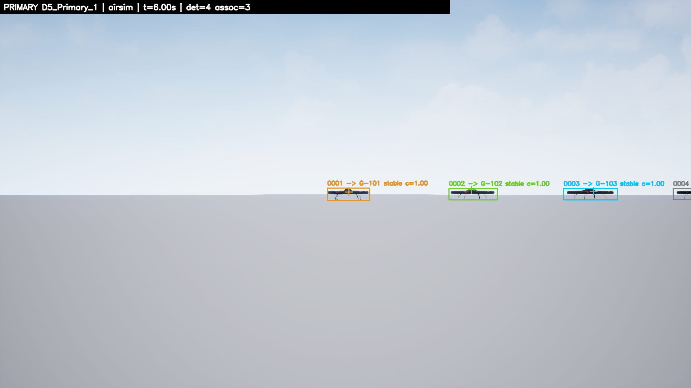
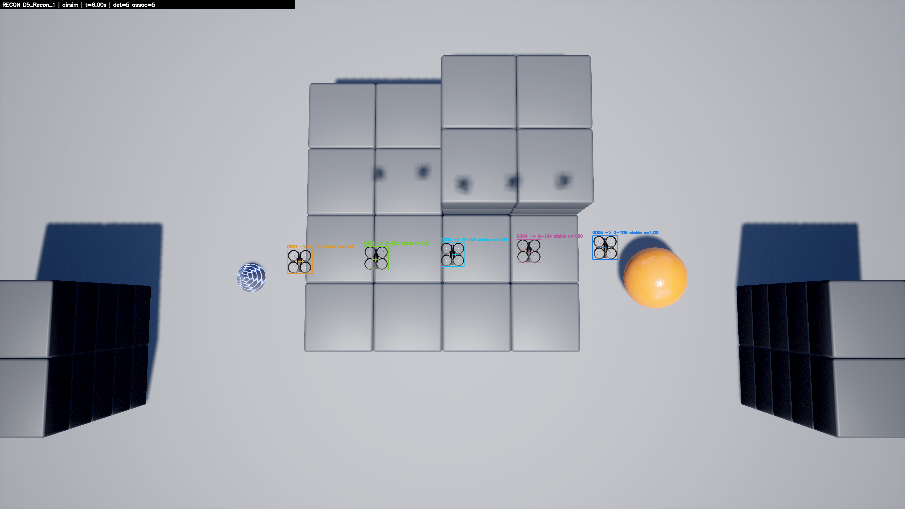
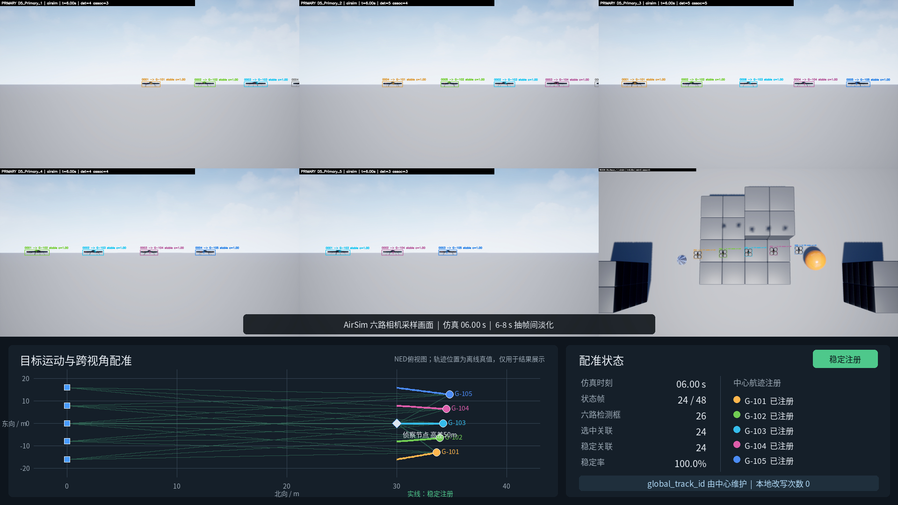
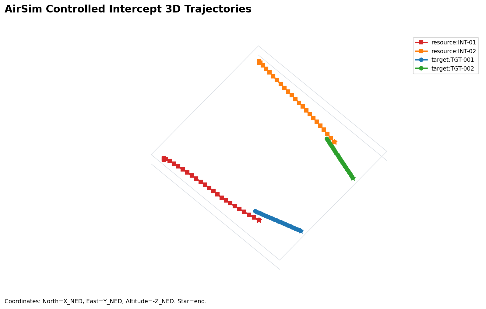

# 大规模无人机群协同探测与拦截仿真方案

## 报告要点

1. 已完成200个来袭目标、200架拦截无人机和8个高空侦察节点的三维软件回合，七个分系统能够在同一流程内交换观测、航迹、计划、视觉和控制信息。
2. 当前成果属于体系架构和软件接口验证。10秒规模化回合没有形成5米以内的物理接近，不能写成“完成200对200拦截”。
3. 现阶段主要问题是运行速度不足、严格身份评价未闭合、二级节点跨视角注册不稳定，以及真实目标识别数据不足。
4. 强化学习、图神经网络和本地大模型已经预留接口，现阶段只开展离线或独立对照试验，不参与在线计划发布和飞行控制。

本报告中的数据来自软件测试、三维质点仿真和AirSim受控试验，不能替代真实设备试验、硬件在环试验和飞行试验。文中涉及速度、距离、相机和通信的数值，除明确标注试验结果外，均为当前仿真条件或后续建议值。

# 第一章 项目背景与建设目标

## 1.1 任务背景

无人机集群来袭时，防御系统首先面对的是目标多、方向散、批次密集。雷达能够提供较远距离的位置线索，但存在测量误差和传输时延；光电设备识别能力较强，视场和天气条件限制明显；声学设备只能提供较粗的方位提示。各类传感器如果各自工作，会形成多套目标编号，难以保证前后环节指向同一个目标。

目标数量增加后，拦截任务也从“一架拦截一架”转为多区域、多批次、多类型资源的持续调度。高威胁目标可能需要两架主用无人机和一架备用无人机。资源故障、通信中断和目标机动都会使原计划失效，系统需要及时重算，同时控制换绑次数，防止多架无人机重复追逐同一目标。

末端阶段的风险更集中。拦截无人机相机中可能同时出现多个来袭目标和友方无人机。局部检测框只能说明“画面里有目标”，不能直接确认该目标就是中心分配的对象。中心航迹、相机标定、图像轨迹和当前任务计划需要在同一时间基准下核对，确认无误后再进入视觉导引。

## 1.2 核心问题

项目集中解决四个工程问题。

1. **多源信息能否形成一套统一航迹。** 雷达、声学和光电的时间、坐标和精度不同。系统需要保留测量时刻、到达时刻和误差范围，在北—东—地坐标系内形成可供后续使用的三维位置与速度。
2. **大规模资源能否稳定分配。** 目标和资源数量可以不相等，高威胁目标可以占用多架资源。分配结果需要考虑距离、威胁、航迹质量、剩余能源、视场和冲突，计划变化还要受到版本和驻留时间约束。
3. **中心能力下降后任务能否继续。** 正常情况下由中心统一规划；中心失效或计划持续不适用时，由高空侦察节点承担局部协调；中心和高空节点均失效时，拦截无人机之间开展有限协商。
4. **末端目标能否核对准确。** 相机只能看到局部目标，且不同相机的局部编号互不相同。系统需要用中心航迹、相机几何和局部运动历史完成配准，避免错误换绑和重复锁定。

## 1.3 总体判断

当前已经形成一套可运行的软件仿真底座。200个来袭目标、200架拦截无人机和8个高空侦察节点可以在统一三维场景中推进，多传感器观测、航迹、分配、相机指向、导引命令和离线评估已经接入同一回合流程。

这项结果解决了“各模块能否串起来”的问题。物理拦截、真实目标识别和实时运行仍需继续验证。现有10秒规模化回合中，拦截资源与目标的初始距离中位数约3.1千米，回合结束时没有形成5米以内的物理接近；10秒仿真消耗约80秒实际时间，实时运行能力尚未达到要求。

| 判断事项 | 当前状态 | 说明 |
| --- | --- | --- |
| 200目标、200资源状态推进 | 已完成 | 完整回合能够运行并产生日志 |
| 多源观测到统一航迹 | 已接通 | 严格身份连续性仍需多回合校准 |
| 200资源到200航迹分配 | 已完成单回合验证 | 已形成200个唯一资源和200个唯一航迹绑定 |
| 中心、二级、分布式三级组织 | 已实现流程 | 二级节点视觉注册尚未形成稳定接管证据 |
| 末端视觉配准 | 已完成小规模受控验证 | 真实可见光、红外和复杂遮挡仍待试验 |
| 位置导引与视觉导引接口 | 已接通 | 200对200长时物理闭环未完成 |
| 强化学习和图神经网络 | 离线或独立对照验证 | 当前不进入在线计划和飞行控制 |

## 1.4 建设目标

第一阶段建立统一仿真环境和接口，保证七个分系统使用同一套时间、坐标、航迹编号和计划版本。场景规模由运行参数设定，程序不固化为2对2、5对5或200对200。

第二阶段完成确定性算法基线。系统在没有学习模型的条件下，能够完成融合、关联、分配、降级、视觉配准、导引和评估，并给出每次拒绝、重算和模式切换的原因。

第三阶段开展规模、实时性和鲁棒性试验。重点覆盖密集交叉、漏检、虚警、通信退化、中心失效、资源故障和高威胁多资源任务，形成多随机种子的统计结果。

第四阶段评估学习算法。强化学习用于区域调度、分配代价修正和主动观察，图神经网络用于跨相机轨迹相似度，大模型用于离线日志整理。只有在相同场景下稳定优于规则基线，并且不降低身份和安全指标，才考虑进入有限辅助。

# 第二章 总体方案

## 2.1 总体思路

系统主线可以概括为七个步骤：

```text
远程发现 → 统一航迹 → 稳定编号 → 分层指挥 → 资源分配 → 末端确认 → 导引拦截
                                      ↑                         ↓
                              降级接管与重规划 ← 结果反馈 ← 过程评估
```

雷达承担远程位置感知，声学提供方向和类别辅助，光电承担识别与末端确认。融合模块先给出带误差范围的三维航迹，关联模块维持目标编号，分配模块将拦截资源绑定到具体航迹。末端相机确认分配目标后，导引模块从雷达航迹引导转入视觉引导。任何环节发现计划过期、身份冲突或资源不可用，都回到重规划或降级流程。

## 2.2 分层任务空间

三维场景分为外层发现区、中间协调区和末端处置区。来袭目标从外层向保护区运动，拦截资源从内层起动，高空侦察节点在较高位置提供区域观察。当前仿真将水平面划分为8个区域，用于统计威胁压力、资源余量和通信状态。


*图2-1 200目标、200拦截资源和8个高空侦察节点的三维场景。图中位置来自随机种子1000的离线回合。*

区域层只决定“哪个区域需要多少资源”，目标层再决定“哪架无人机执行哪条航迹”。这样可以避免200架资源全部参加一次无差别全局比较，也便于在通信受限时由二级节点处理本区域任务。

## 2.3 指挥组织

**中心统一模式。** 中心节点接收全局航迹和资源状态，发布带版本和有效期的任务计划。该模式信息最完整，作为正常运行方式。

**二级协调模式。** 高空侦察无人机随拦截资源同步出动，具备较高位置和较大观察范围。中心正常时，它向局部无人机发送图像、检测框和目标线索；中心失效或计划持续不适用时，符合条件的二级节点接替本区域规划。接替前要确认覆盖范围、目标注册、通信和计划连续性。

**分布式保底模式。** 中心和二级节点均不可用时，拦截无人机交换航迹摘要、资源状态和任务意向。节点通过拍卖或捆绑协商形成局部计划。该模式只维持最低任务连续性，不能重新创建全局目标编号，也不能绕过友方冲突和计划有效期检查。

主动降级与设备失效有所区别。设备失效可以根据心跳和通信超时判断；主动降级用于中心仍在线，但航迹误差、身份歧义、计划时延或末端视觉冲突持续增大。系统先请求中心重算，仍无法恢复时再考虑二级节点接替。

## 2.4 数据与接口

各分系统通过统一数据总线交换信息。在线数据沿“观测—航迹—计划—视觉—控制”方向流动，执行结果反向回传给关联、分配和降级模块。仿真真实位置和真实身份单独保存，只在回合结束后用于评分。


*图2-2 在线任务数据和离线评估数据的关系。局部相机和导引模块只能使用中心已经发布的航迹编号。*

统一接口重点保留六类信息。

| 信息 | 处理要求 | 直接用途 |
| --- | --- | --- |
| 时间 | 同时记录测量时刻和到达时刻 | 延迟补偿、乱序更新和新鲜度判断 |
| 坐标 | 融合计算使用北—东—地坐标系 | 统一雷达、平台和相机位置 |
| 误差 | 观测和航迹均携带协方差 | 关联门限、分配风险和视觉投影 |
| 身份 | 全局航迹编号由中心身份链维护 | 防止局部相机自行换绑 |
| 计划 | 每份计划带版本和有效期 | 拒绝旧计划和异步执行 |
| 结果 | 区分计划允许、控制执行和物理接近 | 防止把中间事件写成拦截结果 |

## 2.5 仿真条件

当前三维环境采用六维质点状态，记录北向、东向、地向位置和三个方向的速度。来袭目标采用常速度或转弯模型，拦截无人机受速度、加速度和高度限制，高空侦察节点执行观察和区域协调，不直接参与拦截。

| 项目 | 当前设置 | 性质 |
| --- | ---: | --- |
| 来袭目标 | 200个 | 名义规模，可调整 |
| 拦截资源 | 200架 | 可与目标数量不相等 |
| 高空侦察节点 | 8架 | 对应8个区域 |
| 场景水平半边长 | 6000米 | 仿真范围 |
| 保护区半径 | 1000米 | 仿真判定区域 |
| 目标初始水平距离 | 约4328至5399米 | 随机种子1000 |
| 拦截资源初始水平距离 | 约1304至1994米 | 随机种子1000 |
| 目标速度 | 3.5至4.7米/秒 | 当前质点参数 |
| 拦截资源速度上限 | 14米/秒 | 当前质点参数 |
| 物理接近判定 | 5米以内 | 离线统计口径 |

传感器周期和时延分别设置。雷达名义周期为0.2秒，距离噪声随距离增加；声学名义周期为0.5秒，只提供粗方位；光电名义周期为0.1秒，通过相机内外参生成像素框。通信队列加入时延、抖动、丢包和网络分区，用于检查计划在异步条件下能否正确执行。

## 2.6 回合流程

每个仿真回合从统一场景开始。运行程序创建目标、拦截资源、侦察节点、传感器和通信状态，清空上一个回合的航迹、计划和相机历史。

世界模型按固定步长推进。传感器按各自周期产生匿名观测，通信队列按到达时刻释放消息。融合和关联模块形成全局航迹后，区域协调和目标分配按较低频率滚动更新计划。

相机依据当前分配调整指向，视觉配准在图像到达时执行。导引模块只消费当前有效计划。回合结束后，评估模块才读取真实位置和真实身份，计算误差、身份连续性、分配、降级、视觉和最近距离。

# 第三章 分系统方案

## 3.1 多传感器融合

多传感器融合模块（D1）负责把雷达距离和角度、声学方位、光电像素框以及可选激光雷达位置，转换成同一坐标系下的目标位置和速度。输出包括六维状态、误差协方差、状态时刻、航迹质量和观测来源。

系统默认采用扩展卡尔曼滤波。目标短时间内按常速度预测，新观测到达后根据传感器精度修正状态。雷达距离越远，测量误差越大；光电受目标框大小、遮挡和相机标定影响；声学只有方位信息，因此在融合中权重较低。

量测时间和到达时间分开处理。迟到观测在原量测时刻参与更新，再将状态预测到当前发布时刻。短时乱序通过固定时间窗回放，超出窗口的旧观测不再强行写入当前航迹。


*图3-1 雷达、声学、光电和可选激光雷达进入统一状态估计的过程。*

航迹按粗航迹、稳定航迹和可交接航迹分级。粗航迹用于继续积累观测；稳定航迹可以进入关联；可交接航迹还要满足位置误差、连续更新和时延要求，才能交给分配和末端视觉使用。

## 3.2 多目标轨迹关联

多目标轨迹关联模块（D2）负责保持目标编号连续。融合模块每个周期可能产生多个航迹候选，关联模块判断新候选应延续哪条既有航迹，并记录新建、确认、丢失和删除过程。

默认方法是马氏距离筛选加全局最近邻匹配。系统先根据预测位置和协方差删除明显不可能的配对，再使用匈牙利算法在剩余候选中寻找整体代价最小的一一对应。代价包含运动差异、时间差、类别线索和必要的视觉提示。

目标密集交叉时，单帧最近位置容易发生编号交换。程序保留航迹生命周期、连续性和身份切换计数，并在候选接近时输出歧义风险。联合概率数据关联和多假设跟踪作为后续对照方法，当前主线仍使用计算量较低的全局匹配。


*图3-2 航迹预测、误差范围筛选、全局匹配和生命周期管理。*

全局航迹编号由该身份链维护。末端相机可以对已有编号提供支持或提出冲突，不能自行创建一个新的全局编号替换中心结果。

## 3.3 区域调度与目标分配

目标分配模块（D3）分两级工作。区域层根据目标数量、威胁、航迹误差、可用资源和通信状态，计算各区域需要保留或调入的资源数量；目标层再把具体拦截无人机分配给具体全局航迹。

每条候选分配边计算一项规则代价，主要考虑预计接近时间、目标威胁、航迹误差、资源剩余能力、相机视场、友方冲突和换绑成本。不可达、资源故障、身份冲突和计划过期的候选直接删除。剩余候选使用匈牙利算法求解。

高威胁目标按所需资源数量设置任务名额。例如，两个主用资源和一个备用资源对应三个分配名额。主用资源数量不足时，该目标不能标记为分配完成；备用资源在新版计划明确启用前保持待命。当前不要求多个主用资源同时到达，各资源按同一目标的任务要求独立执行。


*图3-3 普通目标、高威胁目标的需求展开和确定性分配。图中学习修正属于可选研究接口。*

滚动规划设置改善门限和最小驻留时间。新方案只有在成本明显改善、旧方案失效或高威胁任务未满足时才发布，避免目标状态轻微变化引起频繁换绑。每份计划记录资源、目标、角色、波次、版本和有效期。

## 3.4 分布式协同与降级接管

分布式协同与降级接管模块（D4）管理三种指挥状态。正常状态由中心统一分配；中心失效后，由满足覆盖、通信和注册条件的高空侦察节点接替本区域任务；二级节点也不可用时，拦截无人机开展有限协商。

中心健康由心跳、航迹更新和计划更新共同判断。主动降级还要结合融合误差、身份歧义、计划年龄和末端视觉冲突。视觉结果与中心计划一致时继续执行；持续不一致时，系统先请求中心重算，再判断是否需要二级辅助或接管。

高空侦察节点正常运行时提供局部图像和目标线索。成为二级协调节点前，需要完成目标可见、跨视角注册、通信就绪和计划连续性检查。单纯看见目标不足以接替中心，因为图像中的局部目标还没有和全局航迹稳定对应。

完全分布式状态下，各无人机交换资源能力、航迹摘要和任务意向。多资源任务只有在必要成员均确认后才提交。通信分区、成员缺失或计划过期时保持现状，不发布不完整协同任务。


*图3-4 中心重规划、二级节点接替和完全分布式保底的状态关系。*

## 3.5 末端视觉配准

末端视觉配准模块（D5）解决图像局部目标与中心全局航迹的对应问题。每台相机先完成本视场内的目标检测和短时跟踪，得到局部轨迹。相机之间可以看到不同的目标子集，局部轨迹编号只在本相机内有效。

中心航迹先预测到图像的测量时刻，再根据无人机位置、相机安装关系和相机内参投影到像素平面。航迹位置误差同步投影成图像误差椭圆。局部轨迹与中心投影之间计算像素马氏距离，并检查目标框大小、角速度、类别、画面边缘和友方重叠。

同一相机内使用一一匹配。多相机条件下，系统利用时间接近、视线交会、重投影误差、目标框尺度和运动历史形成跨视角候选。多个候选差距过小时输出“模糊”，友方冲突或任务版本不一致时输出“保持”，短时漏检进入“重捕获”。只有唯一候选连续稳定，才输出锁定。


*图3-5 中心三维航迹投影到多个相机图像，并与匿名局部轨迹核对。*

AirSim检测接口目前用于受控场景基线。无人机目标识别权重和多目标跟踪链路已经接入试验，但真实目标外观数据不足，尚未达到替换基线的条件。在线配准不使用AirSim对象真实名称；对象名称只在回合结束后参与评分。

## 3.6 比例导引

比例导引模块（D7）负责把当前合法分配转成导航命令。中段使用融合后的目标位置和速度计算三维位置比例导引，末端在视觉锁定稳定后使用检测框中心和框面积变化计算视觉比例导引。

距离只用于打开视觉尝试窗口。真正切换还要检查当前计划、目标编号、视觉稳定帧、目标框边缘、通信时延、闭合速度和平台机动余量。视觉证据不足时继续使用雷达航迹，不强制转入视觉模式。

视觉链路短时漏检时允许有限外推。每个资源—目标对独立保存视线滤波、检测框历史和模式迟滞。任务版本、目标编号或执行角色发生变化时，旧的视觉历史立即清空。


*图3-6 雷达航迹中段导引、视觉确认和末段导引的交接条件。*

当前5米以内记为物理接近成功。统计时区分计划已经下达、控制已经执行、视觉模式已经切换和实际进入5米范围，防止把中间状态当成最终结果。

## 3.7 系统评估

系统评估模块（D6）消费各分系统日志，计算感知误差、身份连续性、分配质量、降级时间、视觉配准、导引执行和最近距离。无法计算的指标标记为“不可用”，保留缺少的数据和原因，不用零值代替。

仿真真实位置和真实身份与在线链路分开保存。回合结束后，评估模块才把在线航迹与真实目标对应，用于统计均方根误差、身份切换和物理接近。这样可以检查算法是否真正依靠观测工作。

单回合输出明细记录和指标，多回合输出均值、分位数、置信区间和失败原因。报告同时保留场景配置、随机种子、软件版本和指标口径，便于复算。

# 第四章 当前仿真进展

## 4.1 规模化回合

2026年7月28日完成了一次200目标、200拦截资源、8个高空侦察节点的10秒确定性回合，随机种子为1000。强化学习和图神经网络在该回合中均关闭。

| 项目 | 结果 |
| --- | ---: |
| 在线匿名观测 | 12087条 |
| 融合航迹 | 回合末201条 |
| 关联后的可用映射 | 回合末200条 |
| 分配计划确认 | 10次 |
| 资源—航迹绑定确认 | 1978次 |
| 相机命令下发 / 确认 | 18928 / 18928 |
| 在线使用真实位置或真实身份 | 0 |
| 实际运行时间 | 80.198秒 |
| 仿真时长 | 10秒 |
| 实时因子 | 0.1247 |
| 5米内唯一接近目标 | 0 |

这次回合说明200规模的状态、消息、计划、相机命令和导引命令可以连续推进。它没有形成拦截结果。主要原因是初始距离为数千米，目标与资源速度差有限，10秒只够检查信息链和计算链。

## 4.2 融合结果

回合末共有200个真实目标和201条融合航迹。离线最近邻几何配对的距离中位数为6.56米，95分位为24.92米；位置协方差综合标准差中位数为8.65米。归一化创新统计均值为1.0479，99.29%的创新样本落在当前门限内。


*图4-1 回合末融合航迹与离线真实位置。右图用于检查误差尺度和空间覆盖。*

上述几何配对只能说明融合航迹覆盖了目标空间。当前仍有一条额外航迹，且完整时间序列的严格身份映射尚未闭合。因此，正式位置均方根误差暂不作为可用结论。

## 4.3 轨迹关联结果

轨迹关联评价比较两套编号。在线系统使用全局航迹编号维持目标身份，离线评估使用仿真真实目标编号核对结果。在线算法不读取真实编号；回合结束后，评估程序根据观测来源记录建立“全局航迹—真实目标”映射。

**末帧映射。** 回合末共有200个真实目标和201条在线全局航迹。其中200条航迹获得单一真实目标映射，1条航迹处于歧义状态。200条可用映射只覆盖199个不同的真实目标：真实目标`TGT-0048`同时对应两条可用航迹，`TGT-0013`没有形成唯一可用映射。歧义航迹`GT3D-000013`同时包含来自`TGT-0013`和`TGT-0176`的观测证据。因此，末帧位置覆盖接近完整，但尚未达到严格的200目标与200航迹一一对应。

| 末帧项目 | 数量 | 含义 |
| --- | ---: | --- |
| 真实目标 | 200 | 离线评分基准 |
| 在线全局航迹 | 201 | 包含1条额外航迹 |
| 可用航迹映射 | 200 | 航迹具有单一真实目标证据 |
| 可用映射覆盖的不同真实目标 | 199 | 存在一个重复映射目标 |
| 歧义航迹映射 | 1 | 同一航迹含两个真实目标的证据 |

**关联帧。** 10秒回合保存了48次关联快照，约每0.2秒形成一次。这里的“帧”指D2多目标关联结果，与相机视频帧的含义不同。全回合累计形成9652条航迹映射记录，其中9248条属于新建或匹配状态并进入身份评分。进入评分的记录中，9230条具有唯一真实目标证据，18条存在歧义；单条映射的可评估覆盖率为99.81%。其余404条为丢失、未分配等生命周期记录，不进入该项身份评分。

**帧覆盖率。** 一帧只有在全部参评航迹都具有唯一、有效的真实目标映射时，才记为完整可评估帧。本回合35帧满足条件，计算结果为：

$$
\frac{35}{48}=72.92\%
$$

13帧至少出现过一条歧义映射。该口径按整帧检查，即使一帧中的其余航迹均可确定，只要有一条参评航迹身份不清，该帧就不进入严格身份连续性计算。这解释了单条映射覆盖率接近100%，整帧覆盖率仍只有72.92%的原因。

**相邻帧转移覆盖率。** 200个目标在48个关联帧中持续存在，每个目标有47次相邻帧身份转移机会，总计9400次。前后两帧都完整可评估，且该目标在两帧中均只对应一条全局航迹时，这次转移才可以评分。本回合共有4818次满足条件：

$$
\frac{4818}{9400}=51.26\%
$$

一个歧义帧会同时影响它之前和之后的相邻转移，因此转移覆盖率低于帧覆盖率。该结果表明当前约一半的相邻身份变化能够直接核对，剩余区间缺少完整证据。

**身份切换下界。** 评估程序在完整可评估帧中，为每个真实目标提取唯一全局航迹作为可靠锚点。若同一目标在前后两个可靠锚点中的全局航迹编号不同，至少发生过一次身份切换。例如，目标A在较早可靠帧对应`G01`，在较晚可靠帧对应`G17`，即使中间帧证据不完整，也可以确认两者之间至少换过一次编号。

本回合形成6473个可比较的锚点区间，其中48个区间的全局航迹编号发生变化。48次变化分布在19个真实目标上：16个目标各出现1次，1个目标出现2次，2个目标各出现15次。后两个目标贡献了30次变化，表现为一对目标编号反复交换，需要重点检查交叉几何、关联门限和重复航迹。

48只表示目前证据能够证明的最少切换数。若某目标在两个可靠锚点之间先由`G01`换成`G17`，随后又换回`G01`，两个端点编号相同，下界不会增加，但中间实际发生了两次切换。因此，实际身份切换数不小于48，当前证据不能给出可靠上界。


*图4-2 关联航迹、真实位置和逐帧映射可用情况。*

**严格指标不可用的原因。** 严格身份切换总数要求每个真实目标在连续帧中具有完整、唯一的航迹对应。当前数据同时存在一条航迹混入多个真实目标证据、一个真实目标对应多条航迹以及部分相邻帧证据缺失。评估程序没有从歧义候选中人为选择代表航迹，因此严格身份切换总数保持不可用，只发布48次保守下界。

这组结果说明单帧空间覆盖和大部分单条映射已经可用，时间连续身份仍是当前短板。下一步需要补齐完整的观测来源记录，压制重复航迹，专项回放反复换号的目标对，再计算严格身份切换、连续率、错误合并和遮挡恢复时间。

## 4.4 目标分配结果

第8版计划在200架资源与200条关联航迹之间形成200个唯一绑定，没有重复目标和缺失目标。10秒内发布并确认10份计划，1978次绑定被控制链采用。目标分配单次平均耗时221.7毫秒，95分位为284.3毫秒。


*图4-3 第8版计划的资源—航迹绑定。连线长度反映初始场景距离。*

分配距离中位数约3114米，95分位约3771米。该数值反映“目标在外层、资源在内层”的场景布置，不作为分配位置误差。分配完整只说明每条任务都有资源接收，不能直接说明资源能够在规定时间内到达。

## 4.5 运行时间

当前单次调用中，目标分配平均耗时最高，其次为多目标关联、主动视觉、导引和融合。各模块调用频率不同，单次耗时不能直接相加。完整回合还包含传感器生成、通信队列、对象构造和日志写盘。


*图4-4 随机种子1000回合的模块单次平均耗时。完整回合实时因子为0.1247。*

实时性优化需要先做分段计时，再处理批量矩阵、空间索引、稀疏候选、历史窗口和日志分级。双时间戳、协方差、航迹编号和计划版本属于基础数据，不能通过删除这些信息换取表面速度。

## 4.6 AirSim小规模试验

AirSim试验采用Blocks固定场景，用于检查相机成像、目标可见性、多视角几何配准和拦截无人机运动控制。每个回合开始前重置场景，并重新初始化相机历史、目标航迹和分配计划，避免上一回合的状态进入后续试验。

试验分为视觉专项和控制专项。视觉专项使用计算机视觉模式，设置5个局部相机节点、1个宽视场侦察相机节点和5个无人机外形的移动目标。局部相机分辨率为1920×1080，水平视场60度；侦察相机分辨率为3840×2160，水平视场75度。目标距局部相机约30米，横向间隔8米，侦察相机比局部相机高约50米。五个目标由脚本控制作水平运动，本次固定场景速度为0.60至0.80米/秒。回合时长12秒，采样间隔0.25秒，共49帧，随机种子为7。

视觉专项以AirSim检测接口作为受控基线。在线配准只使用检测框、中心全局航迹、相机参数、时间戳和协方差，不读取AirSim目标真实编号。目标真实编号只在回合结束后用于离线评分。该专项没有在线运行完整的雷达融合和多目标跟踪链路，中心航迹由场景运动学生成，用于单独检查几何投影和跨视角注册。



*图4-5 局部相机在6秒时的观测画面。该相机检出4个目标，其中3个完成稳定注册，说明单架局部相机只需处理当前视场内的目标子集。*

图4-5中的彩色框表示已通过投影门限和稳定窗口的注册结果，灰色框表示当前已检出但证据尚不充分的目标。局部节点不会因为目标离开视场就自行更换全局航迹编号，后续重获取仍受中心分配结果约束。



*图4-6 侦察相机在同一时刻的观测画面。5个目标全部进入视场，并分别注册到G-101至G-105。*

侦察相机画面用于提供较宽的视觉线索，弥补局部相机之间的视场缺口。本图反映的是50米高差、75度视场的固定场景结果。高度、镜头焦距、大气透过率和目标尺寸变化后，全目标可见性需要重新测定。



*图4-7 六路相机与五个移动目标的配准过程。上部为各相机画面，下部为北东地坐标系下的几何关系和注册状态。*

在6秒时，六路相机共形成26个检测框，系统选中24个关联，24个均达到稳定注册条件。不同局部相机观测到的目标数量不同，但注册后仍使用中心维护的同一组全局航迹编号。这张图展示的是一个时刻的过程截面，正式指标仍由49帧全部记录计算。

控制专项使用AirSim内置飞行控制模式（SimpleFlight）控制拦截无人机，来袭目标由场景运动脚本控制。2对2固定回合中，两架拦截无人机的命令速度为6米/秒，控制步长0.1秒，最大试验时间8秒。系统按三维距离判定拦截结果，资源与已分配目标进入5米范围即记为完成一次近距离拦截。



*图4-8 2对2单回合三维轨迹。方形点为两架拦截无人机，圆形点为两个脚本控制目标，星号为轨迹终点。*

该回合中，两个活动资源对均进入5米范围，离线计算的最小三维距离分别为4.85米和4.86米，用时均为2.7秒。在线控制使用融合后的估计航迹，真实位置只在回合结束后核算物理距离。该结果来自单一随机种子和简化脚本目标，只能说明当前控制链能在这一受控条件下闭合。

| 场景 | 已有结果 | 仍需解决 |
| --- | --- | --- |
| 5主相机、1侦察相机、5目标，12秒 | AirSim检测召回1.000，严格配准准确率1.000，稳定配准率0.975 | 中心航迹由场景运动学合成，尚非完整雷达到视觉链路 |
| 同场景目标识别加多目标跟踪 | 检测召回0.622，严格配准准确率0.966，稳定配准率0.955，局部身份切换25次 | 目标数据、尺度、遮挡和跟踪参数不足，未达到采用条件 |
| 2资源对2目标物理试验 | 活动资源对2/2进入5米范围 | 样本少，视觉模式没有稳定切换 |
| 5资源对2目标物理试验 | 3个活动资源对中2个进入5米范围 | 第二主资源最近约11.02米，需继续校准机动和视觉门限 |
| 二级侦察节点5对5试验 | 正常中心场景形成4条跨视角关联 | 主动降级和完全分布式场景尚未形成稳定注册正例 |

当前结果支持小规模相机几何、局部视场互补、任务绑定和部分位置导引的后续联调。AirSim检测接口适合用于验证几何和数据接口，不代表已经解决真实背景下的目标识别问题。自训练目标识别、多目标跟踪、视觉导引切换和二级接管仍处于专项试验阶段。这些小规模结果不能直接外推为200对200物理拦截能力。

## 4.7 阶段成果

当前完成的工作可以归纳为五项。

1. 建立200目标、200资源和8个侦察节点的三维质点环境，支持目标与资源数量不相等。
2. 打通七个分系统的统一运行流程，完成观测、航迹、计划、视觉、控制和评估数据联接。
3. 形成确定性算法基线，包括异步融合、轨迹关联、规则分配、三级降级、几何视觉配准和比例导引。
4. 建立在线数据与离线评分数据分离的评估口径，当前规模化回合在线真实信息使用为0。
5. 完成AirSim小规模相机与控制试验，为后续真实目标识别和物理闭环提供接口基础。

# 第五章 学习算法增强

## 5.1 使用原则

大规模场景中，规则算法的主要优点是边界清楚、结果可复算。它的不足集中在多周期资源保留、密集跨视角候选和主动观察的长期收益。学习算法适合补充这些难以用固定权重完整描述的部分。

当前方案保留完整规则路径。学习模型只处理合法候选，输出代价修正、边概率或观察建议。模型缺失、超时、低置信或输入超出训练范围时，系统继续执行规则结果。任务发布和飞行控制不由学习模型直接决定。

## 5.2 区域调度与分配修正

区域调度先处理八个区域之间的资源平衡。输入包括各区域的目标数量、高威胁任务积压、航迹误差、可用与备用资源、侦察覆盖、通信状态和中心节点状态。强化学习结合本区和相邻区域连续多个周期的变化，给出下一周期的资源增减、邻区转移数量、备用比例、侦察关注顺序以及是否请求重新规划。

学习模型只生成区域级建议，不指定具体无人机和具体目标。规则程序继续检查区域相邻关系、通信、机动范围、最低备用量、已分配资源和计划版本。输入不完整、可信度低于0.60或单次计算超过50毫秒时，系统直接采用现有规则方案。


*图5-1 区域资源学习调度流程。学习模型提出资源增减建议，规则程序负责检查并选择具体资源。*

区域调度强化学习主要面向目标流量变化快、资源明显不足、一次调动会影响后续多个周期的场景。它可以研究何时提前跨区、何时保留高机动资源，以及如何减少短期调动对后续任务的影响。区域固定、资源充足时，规则调度更直接，学习模型可能增加训练和复核工作，却不产生实际收益。当前已有区域建议接口，保留试验中被实际采用的学习计划为0，尚未证明任务收益。

区域资源名额确定后，目标分配再决定具体无人机执行哪条航迹。规则分配先计算距离、威胁、航迹误差、资源能力、视场和换绑成本。强化学习根据多个周期的任务结果，对合法候选给出有限幅度的代价修正，随后仍由匈牙利算法完成一一分配。


*图5-2 规则代价、学习修正和确定性求解的关系。*

这种安排保留不可达、友方冲突、资源唯一性和计划版本等必要条件。学习部分主要研究对现有代价的调整，避免短期最优分配造成后续资源紧张。

当前20个保留随机种子中，学习修正量20次都改变了代价矩阵，最终离散绑定变化为0。接口已经工作，尚未形成任务收益。下一轮要扩大规则代价接近的困难样本，并以高威胁满足率、换绑次数和物理接近结果作为联合评价。

## 5.3 跨视角图神经网络

不同相机中的局部轨迹可以组成一张稀疏无向图。每个节点代表一段匿名局部轨迹，边只连接时间接近且通过相机几何预筛的跨相机候选。图神经网络根据像素位置、目标框尺度、运动方向、视线交会和重投影误差，估计两段轨迹属于同一目标的概率。


*图5-3 多相机匿名局部轨迹的候选图。颜色只用于离线说明，在线输入不含真实身份。*

模型概率先经过同相机互斥和几何复核，再与中心全局航迹匹配。正确候选如果在几何预筛阶段被删除，图网络无法补回。因此，候选召回率、相机标定和时间同步仍是首要条件。

冻结合成候选图采用20个未见随机种子、900帧、13344个节点和74024条边，边分类精确率、召回率和调和平均均为1.000，中央处理器推理95分位为0.913毫秒。该结果只适用于合成候选图。真实相机目标外观、遮挡、标定漂移和困难负样本尚未验证。

## 5.4 主动观察

主动观察决定相机下一时刻看哪个目标、搜索哪个扇区以及使用广角还是变焦。输入包括中心航迹、目标威胁、当前可见情况、最后可见位置、相机姿态和任务有效期。规则方法按威胁和任务顺序观察，强化学习用于研究多台相机如何减少重复观察，并提高高威胁目标的持续可见时间。


*图5-4 主动观察过程。相机先按融合航迹开展广角搜索，再指向已分配的高威胁目标并收窄视场。*

图5-4左侧表示融合航迹给出的目标大致方向，中间画面用广角搜索保持目标覆盖，右侧画面指向高威胁目标并收窄视场，便于获得更大的目标像素框。图中目标框根据距离和视场模拟，用于说明观察流程，不作为真实目标检测结果。

学习模型只能从预先检查过的有限动作中选择。云台转速、机械限位、友方观察冲突和计划有效期仍由规则程序检查，最终目标核对仍由末端视觉配准模块完成。当前数据集含900个仿真回合和1153242个样本，总体动作准确率约0.956，但“重新捕获”样本占92.16%，关键“观察目标”动作在测试集上的召回为0。当前数据不支持将该模型接入在线观察流程。

## 5.5 本地大模型评估

本地大模型用于离线整理日志、归并失败现象和草拟报告。正式指标由确定性程序计算，模型只读取已经生成的证据包。报告中的数字必须能够回到原始记录，缺失指标不能由模型补写。

首期可在隔离网络内部署70亿至140亿参数的量化模型，重点验证中文报告、结构化输出、数字复制和证据引用。推理与仿真、视觉训练错峰安排，避免争用图形处理器。该能力目前属于建设方案，还没有形成正式验收数据。

## 5.6 当前取舍

| 增强方向 | 当前证据 | 现阶段安排 |
| --- | --- | --- |
| 区域调度强化学习 | 已有接口，实际计划采用为0 | 继续独立对照 |
| 分配代价修正 | 改变代价，未改变最终绑定 | 补充困难样本，不进入主线 |
| 跨视角图神经网络 | 合成图表现良好 | 转入真实相机数据验证 |
| 主动观察强化学习 | 样本严重不平衡 | 重做数据和评价口径 |
| 本地大模型评估 | 方案已形成 | 先建设证据包和固定模板 |

现阶段应把主要力量放在确定性基线、多随机种子、实时性和真实视觉链路。学习算法按单模块开展对照，暂不同时开启多个模型，以免无法判断收益来源。

# 第六章 主要问题与后续安排

## 6.1 主要问题

**实时性不足。** 10秒仿真需要约80秒实际时间。当前耗时来自融合、关联、分配、主动视觉、消息构造和日志写出。需要完成分段计时后逐项优化，目标是在同等数据口径下提高实时因子。

**严格身份指标未闭合。** 融合航迹已经覆盖200个目标，但完整时间序列仍存在一条航迹对应多个真实目标的证据。该问题会影响位置误差、身份切换和末端配准评价，必须先补齐航迹来源与变化记录、遮挡恢复记录。

**二级视觉注册不稳定。** 高空侦察节点能够发现目标，网络联合覆盖约为0.65至0.72，主动降级和完全分布式场景还没有形成稳定跨视角注册。需要调整节点几何、云台指向、时间同步和外参误差，不能单靠扩大视场解决。

**长时物理闭环未完成。** 当前200对200回合主要用于接口和容量检查。后续需要延长仿真时间，采用断点恢复和分批推进，统计目标级、资源对级和高威胁多资源任务的5米接近结果。

**真实视觉数据不足。** AirSim检测接口在受控场景表现较好，自训练目标识别和多目标跟踪仍有漏检和身份切换。需要补充可见光、红外、不同距离、姿态、背景和遮挡数据，并完成相机内外参及时间偏差标定。

## 6.2 实施步骤

**第一步，冻结规则基线。** 在20、50、100和200规模下运行固定场景和多随机种子，统一保存匿名在线日志与离线真实数据。补齐严格身份、分配、降级、视觉和5米结果。该阶段学习模型全部关闭。

**第二步，解决计算瓶颈。** 对传感器生成、通信、融合、关联、分配、视觉和日志分别计时。融合和关联采用批量运算与空间索引，分配限制候选边，视觉限制相机对和候选数，日志按在线必需、离线明细和调试信息分级。

**第三步，完成AirSim专项。** 按“视觉几何—目标识别—多目标跟踪—跨视角配准—视觉导引—二级接管”的顺序验证。场景从2对2、5对5逐步扩大，每项试验固定相机标定、目标尺寸、速度、视场和抽帧间隔。

**第四步，开展学习算法对照。** 每次只启用一个学习模块，与同一规则回合对比。分配看高威胁满足率和换绑，图网络看严格身份和跨视角配准，主动观察看持续可见和重捕获。没有形成任务收益的模型继续作为独立对照项目。

**第五步，转入硬件在环和封闭场地试验。** 先接入真实雷达和相机回放，检查时间同步、外参和通信。随后开展硬件在环，最后在封闭区域进行分阶段飞行试验。仿真参数不能直接替代设备指标。

## 6.3 验收重点

| 阶段 | 重点指标 | 验收方法 |
| --- | --- | --- |
| 感知融合 | 位置误差、创新一致性、航迹连续时间 | 多随机种子与独立真实数据对比 |
| 轨迹关联 | 身份切换、错误合并、遮挡恢复 | 完整时间序列一一对应 |
| 任务分配 | 高威胁满足率、重复分配、换绑次数、计算时延 | 等量与非等量场景对照 |
| 降级接管 | 接管时间、计划一致性、冲突数 | 中心和二级节点故障注入 |
| 视觉配准 | 严格配准准确率、稳定锁定率、重捕获时间 | 多相机可见光与红外回放 |
| 导引拦截 | 最近距离、5米进入率、视觉切换率 | 长时质点、AirSim和硬件在环 |
| 系统运行 | 实时因子、带宽、丢包后恢复 | 20至200规模容量试验 |

验收报告要同时列出样本数、场景版本、随机种子、指标可用率和失败原因。没有完整分母的比例不进入正式结论，单次成功案例只作为现象记录。

## 6.4 需协调条件

第一，需要确定真实传感器和平台的接口资料，包括雷达测量精度与延时、相机内参和安装外参、云台角度反馈、无人机速度和加速度限制。没有这些参数，仿真只能继续使用建议值。

第二，需要建立目标图像数据。数据应覆盖可见光和红外、不同距离和角度、复杂背景、遮挡、运动模糊及友方交错。数据采集和标注要区分训练、参数选择和独立测试。

第三，需要明确计算与通信条件。200机规模不适合持续集中上传全部原始视频。建议在机载或二级节点完成检测、局部跟踪和特征提取，只上传轨迹摘要、关键帧和异常证据。中心侧需要并行计算和分层日志存储。

第四，需要安排封闭场地、硬件在环和飞行试验计划。各阶段先验证感知和身份，再验证分配和控制。安全边界、人工接管和试验终止条件应在飞行前单独审查。

## 6.5 阶段结论

项目已经完成200目标与200拦截资源三维全流程的软件贯通。统一航迹、稳定编号、分层分配、三级降级、末端视觉核对、比例导引和离线评估已经形成明确接口。该底座可以继续承载多随机种子、AirSim专项和后续硬件接入。

当前最急迫的工作是补齐严格身份评价、提高运行速度、完成二级节点跨视角注册，并通过长时仿真检查5米物理接近。强化学习、图神经网络和本地大模型继续保留研究接口，现阶段不承担在线计划发布和飞行控制。

# 技术附件

## A.1 融合模型

系统状态由三维位置和三维速度组成：

$$
\mathbf{x}=[p_n,p_e,p_d,v_n,v_e,v_d]^\mathsf{T}
$$

常速度预测根据时间间隔推进位置，过程噪声吸收目标加速和转弯。扩展卡尔曼滤波的核心更新关系为：

$$
\mathbf{y}=\mathbf{z}-h(\mathbf{x}^{-}),\quad
\mathbf{S}=\mathbf{H}\mathbf{P}^{-}\mathbf{H}^{\mathsf T}+\mathbf{R}
$$

其中，创新向量表示观测与预测的差，创新协方差同时考虑航迹误差和传感器误差。后续关联使用同一误差尺度，避免把远距离低精度观测当成确定位置。

## A.2 关联与分配

观测与航迹之间使用马氏距离进行筛选：

$$
d^2=(\mathbf{z}-\mathbf{H}\mathbf{x})^\mathsf{T}
\mathbf{S}^{-1}(\mathbf{z}-\mathbf{H}\mathbf{x})
$$

目标分配在合法候选中最小化总代价：

$$
\min \sum_{i,j} C_{ij}x_{ij}
$$

约束为每个资源最多执行一项任务，每个任务名额最多分配一个资源。高威胁多资源任务按主用和备用数量设置多个任务名额，并在求解后检查主用成员是否齐全。

## A.3 相机投影

全局航迹先转换到相机坐标系，再投影到像素平面：

$$
u=f_x\frac{x_c}{z_c}+c_x,\qquad
v=f_y\frac{y_c}{z_c}+c_y
$$

三维位置协方差通过投影雅可比转换为像素协方差，并叠加检测框中心误差和相机外参误差。目标位于相机后方、超出视场、投影误差过大或候选差距过小时，系统不输出强制锁定。

## A.4 比例导引

设目标与拦截无人机的相对位置为\(\mathbf{r}\)，相对速度为\(\mathbf{v}_r\)。闭合速度和视线角速度为：

$$
V_c=-\frac{\mathbf{r}^{\mathsf T}\mathbf{v}_r}{\|\mathbf{r}\|},\qquad
\boldsymbol{\omega}_{LOS}=\frac{\mathbf{r}\times\mathbf{v}_r}{\|\mathbf{r}\|^2}
$$

中段导引根据闭合速度和视线角速度形成横向加速度建议。末端视觉导引使用检测框中心的角度变化，并以目标框面积变化辅助判断接近趋势。命令最终受平台速度、加速度、高度和当前任务计划约束。

## A.5 术语说明

| 术语 | 含义 |
| --- | --- |
| 北—东—地坐标系 | 以北、东、向下为三个坐标方向的局部导航坐标系 |
| 协方差 | 表示位置、速度或像素估计误差范围的矩阵 |
| 马氏距离 | 同时考虑位置差异和误差范围的统计距离 |
| 匈牙利算法 | 求解一一任务分配的确定性优化方法 |
| 扩展卡尔曼滤波 | 处理轻度非线性观测的递推状态估计方法 |
| 比例导引 | 根据视线角速度和闭合速度生成导航指令的方法 |
| 图神经网络 | 在节点和边组成的图结构上学习关系的模型 |
| 实时因子 | 仿真时长与实际运行耗时之比，达到1表示等速运行 |
