# 200对200三维全流程程序综合方案

**版本日期：2026年7月29日**

## 1. 方案范围

本方案面向200个来袭目标与200架拦截无人机的三维科研仿真。系统以北-东-地
（North-East-Down，NED）坐标系中的质点运动为主场景，串联多传感器融合、轨迹关联、
区域资源调度、资源目标分配、降级接管、末端视觉配准、主动视觉、比例导引和离线评估。

方案由两条路线组成。

1. **确定性基线。** 使用扩展卡尔曼滤波、马氏距离门控、全局最近邻与匈牙利算法、
   规则区域压力、需求槽线性指派、版本化降级状态机、几何视觉配准和比例导引。该路线
   是当前默认可执行路径。
2. **学习增强。** 在确定性基线上增加D4区域图策略、D3有界代价残差、D5跨视角图神经
   网络和主动视觉策略。学习模型只输出建议、概率或有界修正，不能取得全局身份、计划
   发布、降级所有权或飞行控制权限。

本文中的“已验证”只指软件单元测试、三维质点仿真、AirSim计算机视觉模式或
SimpleFlight受控仿真。没有实飞和硬件在环证据。期望效果图用于说明算法目标，不能解释
为实测增益。

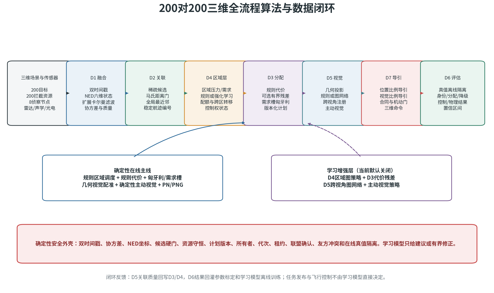

*图1 200对200三维全流程。上方为确定性在线链路，下方紫色部分为默认关闭的学习增强层。*

## 2. 总体判断

200对200不要求用强化学习替换全部规则算法。标准200阶线性指派矩阵只有4万项，经过候选
稀疏化和向量化后，确定性求解仍具备工程可行性。当前独立D3基准中，200个目标、
200个资源和6400条候选边的向量化路径约85.4毫秒；旧逐边Python路径约1904.3毫秒。
主要瓶颈是候选生成、代价构造、对象物化和证据写出，不是匈牙利求解器本身。

强化学习适合解决固定权重难以表达的多周期问题：

- 区域之间提前调动多少资源；
- 哪些高机动、高续航资源应保留；
- 在规则代价相近时如何修正候选排序；
- 哪台侦察相机应观察哪个目标或扇区；
- 何时保持现有计划，何时请求重规划。

图神经网络适合处理多相机候选之间的非线性关系和邻域竞争。它不替代相机标定、时间同步、
几何候选生成或中心全局航迹。正确边未进入候选图时，图网络无法恢复；检测器没有输出目标
框时，图网络也没有可处理的节点。

当前建议保持以下控制边界：

```text
确定性候选与硬门
        ↓
规则代价或几何相似度
        ↓
学习模型给出有界修正、同目标概率或观察建议
        ↓
线性指派、最小费用流或受约束聚类
        ↓
迟滞、计划版本、所有者、代次、租约、联盟和友方冲突复核
        ↓
版本化计划、末端关联或相机命令
```

## 3. 证据边界

### 3.1 200对200三维回合

2026年7月28日的名义回合使用随机种子1000，运行10秒。D1至D7确定性模块栈启用，D3代价
残差、D4区域学习策略、D5图网络和主动视觉学习模型均关闭。

| 项目 | 数值 |
| --- | ---: |
| 来袭目标 | 200 |
| 拦截资源 | 200 |
| 高空侦察节点 | 8 |
| 区域数量 | 8 |
| 仿真时长 | 10.0秒 |
| 物理步长 | 0.05秒 |
| 在线匿名观测 | 12087条 |
| 雷达观测 | 9608条 |
| 视觉观测 | 2479条 |
| 分配计划确认 | 10次 |
| 分配绑定确认 | 1978次 |
| 相机指令下发/执行 | 18928/18928次 |
| 在线真值使用 | 0次 |
| D1平均归一化创新平方 | 1.0479 |
| D2末帧可用/歧义映射 | 200/1 |
| D3第8版唯一资源/目标绑定 | 200/200 |
| 有限状态检查 | 通过 |
| 墙钟耗时 | 80.198秒 |
| 实时因子 | 0.1247 |
| 五米内唯一接近目标 | 0 |

目标初始水平距离场景中心约4328至5399米，高度约102至350米，速度约3.5至4.7米每秒。
拦截资源初始水平距离中心约1304至1994米，高度约61至160米。侦察节点位于约2500米半径、
500米高度。10秒时长不足以形成五米物理接近，因此该回合证明的是200对200状态推进、
匿名观测、模块接口、分配确认、相机调度和导引命令链能够运行，不证明物理拦截或学习收益。

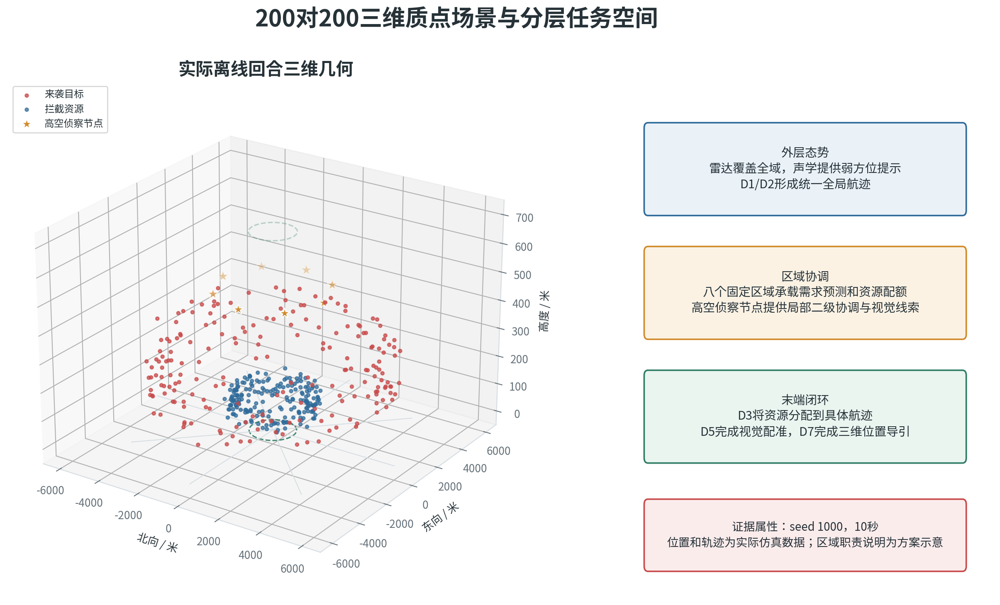

*图2 200对200三维场景。轨迹来自随机种子1000的实际离线回合，右侧分层职责为方案说明。*

### 3.2 AirSim小规模证据

AirSim结果用于校验坐标、相机、检测框、时序、计划和SimpleFlight控制接口，不能直接
外推为200对200性能。

- D5的5个主相机加1个侦察相机计算机视觉专项中，AirSim detect基线的离线检测召回、
  严格配准准确率和主相机联合覆盖均为1.000，稳定配准率为0.975，侦察相机全覆盖帧率
  为0.918，本地身份切换为0。
- 同一专项的YOLOv8加ByteTrack候选检测召回为0.622，严格配准准确率为0.966，稳定配准率
  为0.955，本地身份切换为25，未通过候选准入门。
- D4/D5的5v5机动高空侦察单种子测试中，正常中心场景形成4条跨视角关联；主动降级到
  二级和完全分布式场景均为0。主要断点为并非所有目标同时可见，说明“有检测框”仍未
  自动形成可接管的全局注册。
- D7当前actual-v2单种子证据中，2v2物理成功为2/2；5资源对2目标的活动资源对成功为2/3，
  第二主资源最近约11.02米。该结果不是多种子性能结论。


*图3 D5 AirSim实际后端对比。该结果只覆盖5个目标、5个主相机和1个侦察相机的独立专项。*

### 3.3 图件分类

本文图件分为三类。

- **实际结果图。** 图2、图3、图5-1、图6-1、图11-1和D6阶段耗时图读取已写盘
  仿真产物。
- **算法机制图。** 用于说明输入、处理、输出和门控关系。
- **期望效果图。** 用实际空间位置或受控小样例演示学习策略可能产生的作用，不代表模型
  已在线采用或已经改善任务指标。

## 4. 三维场景

### 4.1 状态模型

来袭目标、拦截资源和侦察节点统一使用六维质点状态：

\[
\mathbf{x}=[p_n,p_e,p_d,v_n,v_e,v_d]^\mathsf{T}.
\]

其中 \(p_n,p_e,p_d\) 是NED位置，\(v_n,v_e,v_d\) 是对应速度。当前名义目标采用常速度
运动，场景生成器还支持转弯、编队、分裂、遮挡、通信退化和故障注入。拦截资源接收D7
三维导航命令并在速度、加速度、最高和最低高度约束下推进。

### 4.2 名义配置

| 配置 | 当前值 | 用途 |
| --- | ---: | --- |
| 世界半边长 | 6000米 | 生成目标、资源和区域 |
| 保护区半径 | 1000米 | 威胁和任务结果参考 |
| 高度范围 | 30至1500米 | 质点状态边界 |
| 目标速度 | 3.5至4.7米每秒 | 名义来袭运动 |
| 拦截器配置速度 | 14米每秒 | 导航能力上限参数 |
| 目标代理尺寸 | 2.0米×0.8米 | 视觉投影尺寸 |
| 主相机 | 1920×1080，90度水平视场 | 拦截资源视觉 |
| 侦察相机 | 3840×2160，70度水平视场 | 高空侦察视觉 |
| 雷达周期/时延 | 0.2秒/0.2秒 | 三维融合输入 |
| 视觉周期/时延 | 0.1秒/0.08秒 | D5与主动视觉输入 |
| 声学周期/时延 | 0.5秒/0.35秒 | 弱方位输入 |
| D2关联周期 | 0.2秒 | 身份更新 |
| D3分配周期 | 1.0秒 | 滚动规划 |
| D4区域周期 | 5.0秒 | 区域资源建议 |
| 五米拦截半径 | 5.0米 | 离线物理判定 |

这些数值是仿真参数，不是设备指标。真实雷达精度、相机检测距离、网络时延和平台机动能力
需要由硬件试验重新辨识。

### 4.3 区域空间

名义场景将水平平面划分为8个扇区。固定区域用于稳定统计口径和控制权边界，区域层不直接
改变目标身份。每个区域维护：

- 目标需求、高威胁积压和未来进入概率；
- D1不确定度、D2歧义、D5可见率与一致性；
- 可用、备用、已承诺和故障资源；
- 中心、二级或分布式控制权；
- 区域邻接、跨区距离、带宽、时延、丢包和分区状态。

后续可以在固定原子网格上研究区域合并与拆分。现阶段不让强化学习直接生成任意区域边界，
避免同时改变通信拓扑、资源守恒和评估分母。

## 5. 统一数据合同

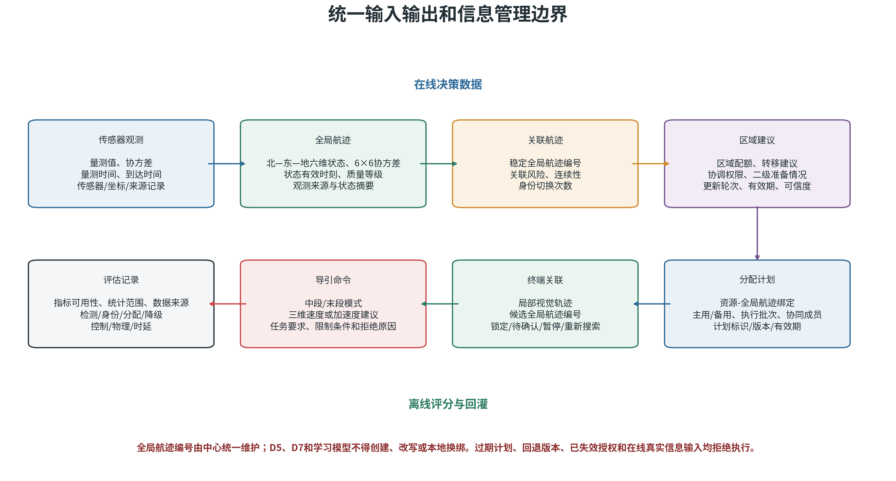

*图4 D1至D7统一输入输出合同。下行是在线决策数据，上行是离线评分和参数回灌。*

### 5.1 强制字段

所有观测必须同时携带：

- `measurement_timestamp`：物理量测时刻；
- `arrival_timestamp`：消息到达当前处理节点的时刻；
- 与量测维数一致的协方差；
- 传感器、坐标系、来源节点、谱系和新鲜度；
- 不包含AirSim actor名称或离线真实目标编号的匿名观测标识。

所有航迹必须携带NED六维状态、6×6协方差、状态有效时刻、质量和来源证据。外部WGS84
（世界大地测量系统1984）只作为地理参考，进入算法前转换为本地NED。

### 5.2 身份权威

`global_track_id`是中心身份链维护的规范全局航迹编号。D5局部视觉轨迹、D7控制上下文、
强化学习策略和图神经网络不能创建、重写或本地换绑该编号。D5只能从当前上游全局航迹
集合中选择候选，并报告锁定、模糊、保持或重捕获。

### 5.3 计划权威

每个分配计划携带计划标识、严格单调版本、所有者、领导者代次、有效期和可选租约。旧版本
即使仍在有效期内，也不能覆盖当前版本。中心转二级或转完全分布式时，必须形成新的权威
谱系或受审计的联盟提交。

### 5.4 真值隔离

仿真真实位置和真实身份只写入D6离线旁路。D1至D5在线算法不得读取真实目标编号来融合、
关联或配准；D7不得读取真实目标状态来生成控制命令。D6在回合结束后将在线记录与真值
侧车联接，计算均方根误差、身份切换和五米接近结果。

## 6. D1多传感器融合

### 6.1 输入与输出

| 项目 | 内容 |
| --- | --- |
| 输入 | 雷达球坐标、声学方位、光电像素框、可选激光雷达位置；双时间戳、协方差、传感器位姿、来源谱系 |
| 输出 | NED六维`GlobalTrack`、6×6协方差、质量等级、创新统计、时延与传感器健康摘要 |
| 默认算法 | 常速度扩展卡尔曼滤波、基础一对一门控、固定滞后乱序量测回放 |
| 执行方式 | 传感器事件到达时触发，先按量测时刻更新，再补偿到发布时刻 |
| 当前状态 | 200对200模块栈已接通；正式真实传感器精度和系统实时性仍未闭合 |

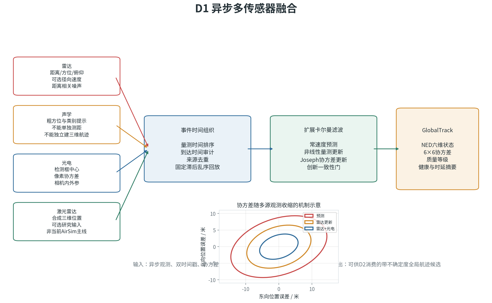

*图5 D1异步融合机制。协方差椭圆为算法示意，不是本回合的实测误差椭圆。*

### 6.2 预测模型

常速度状态转移为：

\[
\mathbf{x}_k=
\begin{bmatrix}
\mathbf{I}_3 & \Delta t\mathbf{I}_3\\
\mathbf{0}_3 & \mathbf{I}_3
\end{bmatrix}
\mathbf{x}_{k-1}+\mathbf{w}_k.
\]

实际程序使用等价的矩阵乘法。白加速度过程噪声为：

\[
\mathbf{Q}(\Delta t)=q
\begin{bmatrix}
\frac{\Delta t^4}{4}\mathbf{I}_3 & \frac{\Delta t^3}{2}\mathbf{I}_3\\
\frac{\Delta t^3}{2}\mathbf{I}_3 & \Delta t^2\mathbf{I}_3
\end{bmatrix}.
\]

当前默认过程噪声吸收目标转弯和加速。交互多模型、常加速度和协调转弯仍是可选对照，
未替换默认路径。

### 6.3 量测模型

**雷达。** 目标与雷达相对向量为 \(\mathbf{r}=\mathbf{p}-\mathbf{s}\)，输出距离、
方位、俯仰和可选径向速度：

\[
\rho=\|\mathbf{r}\|,\quad
\alpha=\operatorname{atan2}(r_e,r_n),\quad
\beta=\operatorname{atan2}(-r_d,\sqrt{r_n^2+r_e^2}),
\]

\[
\dot\rho=\mathbf{v}^{\mathsf T}\frac{\mathbf{r}}{\|\mathbf{r}\|}.
\]

距离标准差由基础项和每公里增长项组成；当前200对200场景使用3米基础距离标准差和每公里
增加1.5米，角度标准差为0.2度。该配置用于仿真，不是雷达采购指标。

**声学。** 当前二维声学观测只给出水平方位。单节点方位没有距离和高度信息，不能独立
初始化三维航迹，只能对雷达已建立航迹形成弱约束。声纹只作为类别提示。

**光电。** 将NED目标位置通过世界到相机旋转和平移投影到像素平面：

\[
\mathbf{p}_c=\mathbf{R}_{cw}(\mathbf{p}_{ned}-\mathbf{t}_{wc}),\quad
u=f_x\frac{x_c}{z_c}+c_x,\quad
v=f_y\frac{y_c}{z_c}+c_y.
\]

像素框面积、置信度、遮挡和小目标标志用于生成或放大像素协方差。

### 6.4 扩展卡尔曼滤波

对非线性观测 \(\mathbf{z}=h(\mathbf{x})+\mathbf{v}\)，D1计算创新、创新协方差、增益和
Joseph形式的后验协方差：

\[
\mathbf{y}=\mathbf{z}-h(\mathbf{x}^-),\quad
\mathbf{S}=\mathbf{H}\mathbf{P}^-\mathbf{H}^{\mathsf T}+\mathbf{R},
\]

\[
\mathbf{K}=\mathbf{P}^-\mathbf{H}^{\mathsf T}\mathbf{S}^{-1},\quad
\mathbf{x}^+=\mathbf{x}^-+\mathbf{K}\mathbf{y}.
\]

归一化创新平方
\(\mathrm{NIS}=\mathbf{y}^{\mathsf T}\mathbf{S}^{-1}\mathbf{y}\)
用于在线一致性门控，不需要真值。归一化估计误差平方和均方根误差由D6在离线真值可用时
计算。

### 6.5 乱序量测

D1按到达顺序接收消息，但在量测时刻执行状态更新。迟到量测插入固定滞后历史后，从受影响
检查点重新预测和更新，再将后验传播到当前发布时刻。默认滞后窗口为6秒，时间桶为0.1秒。
来源谱系相同的中继重复消息只增加审计计数，不重复更新协方差。

```text
观测到达
  -> 检查双时间戳、协方差、坐标和来源
  -> 拒绝重复谱系
  -> 在measurement_timestamp处关联和更新
  -> 乱序时回放受影响后缀
  -> 传播到当前发布时刻
  -> 发布GlobalTrack和质量摘要
```

### 6.6 200对200执行方式

场景按传感器节拍生成`OnlineSensorBatch`，通信队列模拟0.04秒时延、0.01秒抖动和1%丢包。
D1扫描组织器按事件时间水位释放批次，融合器输出匿名全局航迹候选。随机种子1000回合中
D1融合调用784次，单次平均29.1毫秒，P95约154.5毫秒，总计约22.8秒。该结果尚未达到
实时因子1，性能优化仍是系统级缺口。

### 6.7 三维实验结果

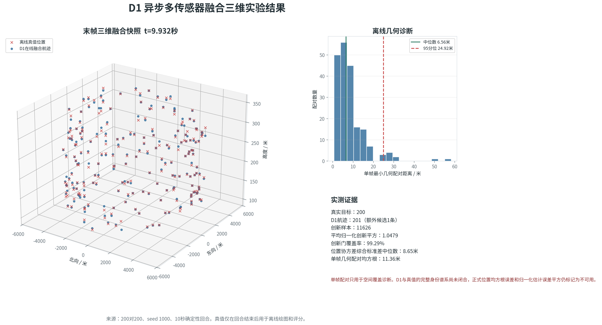

*图5-1 D1末帧三维融合结果。蓝点是在线融合航迹，红叉是回合结束后读取的离线真值；
灰线是单帧最小几何配对抽样，不参与在线融合和身份生成。*

随机种子1000的末帧状态有效时刻为9.932秒。D1输出201条三维航迹，对应200个真实目标，
存在1条额外候选。末帧使用匈牙利算法对估计位置和离线真值做一次性最小距离配对，只用于
观察空间覆盖。200对配对距离的中位数为6.56米，95分位为24.92米，几何配对均方根为
11.36米，最大值为58.18米。位置协方差综合标准差的中位数为8.65米，95分位为10.18米。

D1在线一致性指标不依赖真实身份。11626个创新样本的平均创新平方为2.9888，平均归一化
创新平方为1.0479；9407个具有门限信息的样本中，99.29%位于配置门内。该结果说明本回合
大部分融合航迹在三维空间与目标群重合，创新尺度与协方差量级基本一致。同时仍存在尾部
几何误差和额外航迹。

上述11.36米不能写成正式位置均方根误差。当前D1航迹到真实目标的完整身份谱系缺少可消费
的D2映射，D6因此继续将正式位置均方根误差、速度均方根误差和归一化估计误差平方标记为
不可用。后续需要先闭合唯一身份映射，再按多个随机种子计算连续时序误差。

### 6.8 当前限制

- 当前默认常速度模型对持续转弯和加速目标会产生滞后；
- 声学噪声、漏检、虚警和真实阵列几何没有完成工程标定；
- 相机动态外参仍依赖仿真配置，尚未接入真实坐标变换树；
- 200对200单回合没有形成正式多种子均方根误差、NIS和NEES结论；
- 受治理输入、真值隔离和固定滞后合同已实现，不等于真实传感器精度已经满足拦截要求。

## 7. D2多目标轨迹关联

### 7.1 输入与输出

| 项目 | 内容 |
| --- | --- |
| 输入 | D1六维航迹/观测、协方差、双时间戳、活动航迹、类别和来源信息 |
| 输出 | 稳定`global_track_id`、航迹生命周期、关联日志、歧义摘要、连续性和显式`id_switch_count` |
| 默认算法 | 稀疏全局最近邻、马氏距离门、匈牙利一对一求解、卡尔曼更新 |
| 可选算法 | 轻量联合概率数据关联、有界多假设跟踪、第三方框架离线对照 |
| 当前状态 | 六维规模化路径已接通；真实200目标严格身份质量和长期时延仍需多种子评估 |

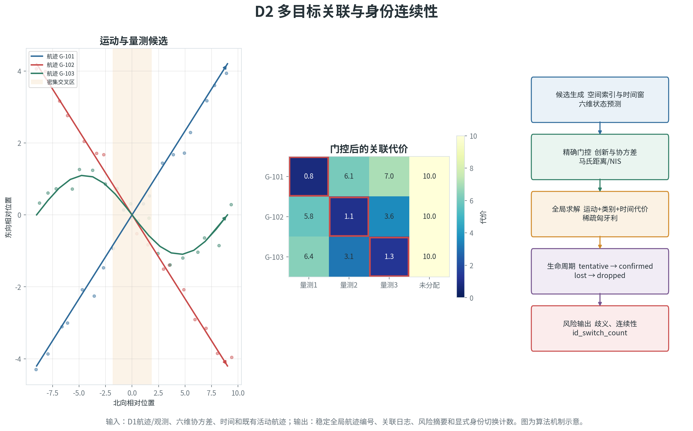

*图6 D2密集交叉关联。轨迹、量测和代价矩阵为算法机制示意。*

### 7.2 状态预测和创新

D2将活动航迹预测到当前量测时刻。对候选航迹 \(i\) 和量测 \(j\)，创新和协方差为：

\[
\boldsymbol{\nu}_{ij}=\mathbf{z}_j-\mathbf{H}\hat{\mathbf{x}}_i,\quad
\mathbf{S}_{ij}=\mathbf{H}\mathbf{P}_i\mathbf{H}^{\mathsf T}+\mathbf{R}_j.
\]

马氏距离为：

\[
d^2_{ij}=
\boldsymbol{\nu}_{ij}^{\mathsf T}\mathbf{S}_{ij}^{-1}\boldsymbol{\nu}_{ij}.
\]

超过卡方门限的候选边被删除。协方差越大，几何门越宽，但D2不会把高不确定性解释为高
置信度；风险摘要会保留创新、门限、航迹年龄和协方差质量。

### 7.3 稀疏全局最近邻

本文中的全局最近邻
（Global Nearest Neighbour，GNN）是确定性关联算法，不是图神经网络。执行步骤为：

1. 用空间索引、量测时间窗、类别和覆盖信息生成稀疏候选；
2. 对候选计算六维创新、马氏距离和质量感知门限；
3. 构造运动、类别、时间、来源和历史代价；
4. 增加虚拟未分配列；
5. 用匈牙利算法求解全局一对一匹配；
6. 对匹配航迹执行卡尔曼更新；
7. 对未匹配量测执行受控建轨，对未匹配航迹执行预测、丢失或删除；
8. 输出关联风险和身份连续性记录。

关联代价可写为：

\[
C_{ij}^{assoc}=
w_m d^2_{ij}
+w_c C_{ij}^{class}
+w_t C_{ij}^{time}
+w_s C_{ij}^{source}
+w_h C_{ij}^{history}.
\]

硬门先删除不可行边，代价只在合法候选中排序。类别提示不能覆盖运动和协方差门。

### 7.4 生命周期

航迹状态按暂定、确认、可执行、丢失和删除推进。确认需要满足命中次数、时间和风险条件；
短时漏检允许有界预测，长时无新量测进入丢失或删除。重复后验和重放消息不能刷新真实
命中次数。

`global_track_id`在规范身份链内保持稳定。局部相机编号、仿真目标编号和检测序号都不能
直接写入该字段。

### 7.5 软关联和多假设

联合概率数据关联
（Joint Probabilistic Data Association，JPDA）可在密集交叉时为多条候选边分配概率，
减少一次硬选择造成的身份交换。多假设跟踪
（Multiple Hypothesis Tracking，MHT）保留多帧假设后再决策。两者计算量、状态数量和
延迟高于全局最近邻。

当前主线继续使用稀疏GNN/匈牙利。建议在以下条件下启动JPDA或MHT离线对照：

- 多条航迹的协方差椭球持续重叠；
- 单帧歧义无法在下一帧消除；
- 密集交叉场景的身份切换成为主要任务损失；
- 可用计算预算能够覆盖候选分量复杂度。

### 7.6 200对200执行方式

随机种子1000回合中，D2关联调用47次并在结束时再完成一次收尾。常规调用平均约70.0毫秒，
P95约76.4毫秒。末态D1/D2航迹数量均为201，超过真实目标数200，说明当前回合仍存在至少
一个额外航迹候选。单回合没有形成严格身份映射统计，不能把额外航迹直接等价为一次身份
切换或虚警。

### 7.7 三维实验结果

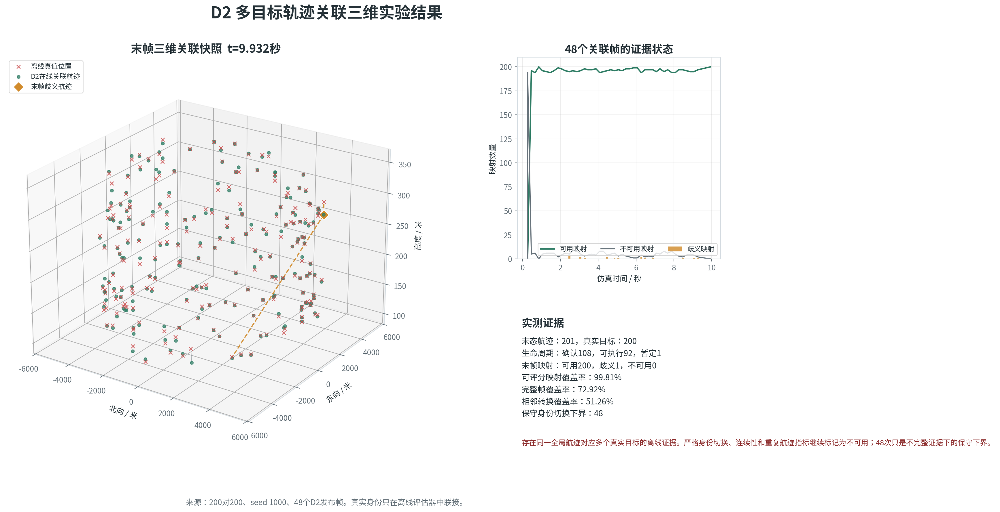

*图6-1 D2末帧三维航迹与48个关联帧的离线身份证据。橙色菱形和虚线表示同一全局航迹
存在两个真实目标候选，不能按多数票强制判定身份。*

末帧D2保留201条三维航迹，其中108条为确认状态、92条为可执行状态、1条为暂定状态。
离线谱系评估在末帧得到200条可用映射、1条歧义映射和0条不可用映射。全部48个关联帧中，
可评分映射覆盖率为99.81%，完整帧覆盖率为72.92%，相邻身份转换覆盖率为51.26%。

不完整证据可确认的身份切换下界为48次，锚点区间为6473个。该数字只表示至少发生了48次
全局航迹编号变化，不能作为严格身份切换总数。当前有18条受评分映射包含多个真实目标候选，
严格身份切换、身份连续性、航迹连续性和重复航迹指标均按合同标记为不可用。

三维图说明D2可以在200规模上维持接近完整的空间航迹集合，也暴露了融合谱系污染对身份
评估的影响。当前优先工作是减少D1跨模态混轨并补齐全时序标签，而不是通过降低分母或选择
单帧最近目标得到更好看的身份指标。

### 7.8 当前限制

- 200目标严格身份切换和连续性需要离线真值标签完整联接后按多种子计算；
- 固定门限在不同雷达周期、距离、遮挡和虚警水平下仍需标定；
- 可选JPDA候选只形成研究准入材料，未替换默认GNN/匈牙利；
- D2处理时延在当前三维运行中接近70毫秒，完整控制周期还要叠加其他模块和消息发布；
- 图神经网络跨视角配准属于D5，不应与D2的全局最近邻缩写混淆。

## 8. 区域调度的确定性方案

### 8.1 任务边界

区域层回答“未来一段时间每个区域需要多少资源、从哪些区域调入多少资源”。它不决定某架
无人机最终拦截哪个目标，也不处理像素配准和导引。D3在区域配额形成后完成具体资源目标
分配。

| 项目 | 内容 |
| --- | --- |
| 输入 | D1/D2航迹与不确定性、目标威胁和需求、区域资源、通信、D5可见率、D4控制权 |
| 输出 | 区域需求、保障量、备用量、跨区转移数量、具体可释放资源候选 |
| 默认算法 | 区域压力规则、邻区贪心转移、资源守恒投影 |
| 完整对照 | 区域最小费用流、具体资源到区域槽位线性指派、滚动时域重规划 |
| 执行周期 | 名义5秒；重大故障、资源失效或高威胁突发可事件触发 |

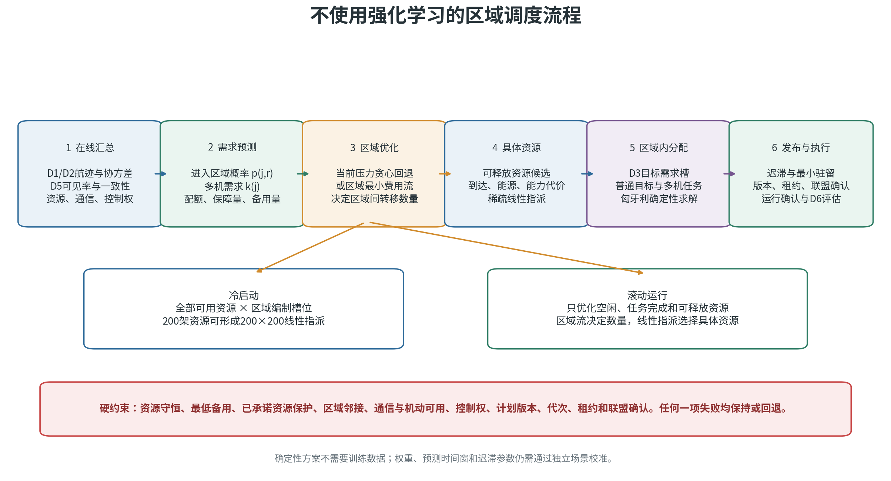

*图7 不使用强化学习的区域调度。该流程已经具备规则基线，最小费用流属于完整确定性扩展。*

### 8.2 当前规则压力

设区域 \(r\) 的目标需求为 \(d_r\)，高威胁积压为 \(h_r\)，D1和D2不确定度为
\(u_r^{D1}\) 和 \(u_r^{D2}\)，D5可见率和一致性为 \(v_r,c_r\)，通信丢包率和时延为
\(l_r,\tau_r\)，可用和备用资源为 \(a_r,b_r\)。当前区域压力为：

\[
P_r=
\frac{
d_r+2h_r+
0.5(u_r^{D1}+u_r^{D2}+1-v_r+1-c_r)
+l_r+\min(1,\tau_r)
}{
\max(1,a_r-b_r)
}.
\]

区域资源缺口为：

\[
G_r=
\max\left[
0,\left\lceil d_r+2h_r\right\rceil-\max(0,a_r-b_r)
\right].
\]

只有相邻、通信可用、允许机动且没有网络分区的区域边进入转移候选。若目标区域压力比来源
区域高0.05以上，一次转移数量为：

\[
n_{rs}=\min(B_r,G_s,C_{rs}),
\]

其中 \(B_r\) 是来源区域扣除已承诺资源和最低备用后的可转移预算，\(G_s\) 是目标区域缺口，
\(C_{rs}\) 是区域边容量。默认最低备用比例为10%，每个区域至少保留1个资源。

### 8.3 未来需求预测

完整确定性方案采用长度为 \(H\) 的滚动预测窗。目标 \(j\) 在预测窗内进入区域 \(r\)
的概率为 \(p_{jr}(H)\)，资源需求为 \(k_j\)，威胁和紧迫系数为 \(s_j\)，则：

\[
D_r(H)=\sum_j p_{jr}(H)k_js_j.
\]

配额由预测需求、最低保障和备用组成：

\[
Q_r=
\max\left(
Q_r^{min},
\left\lceil D_r(H)+B_r^{local}\right\rceil
\right).
\]

若 \(\sum_r Q_r\) 超过资源总数，先满足高威胁保障量，再按边际威胁、预计到达时间和资源
稀缺性分配剩余配额。无法满足的需求必须显式记录，不能通过让同一资源重复计入多个区域
来补足。

### 8.4 区域槽位

不能直接把200架资源和8个区域做一对一匈牙利匹配，因为一个区域需要多架资源。确定性
方案将每个区域配额展开为多个“区域资源槽位”。

例如8个区域需求为：

```text
[20, 34, 41, 21, 21, 21, 20, 22]
```

总数为200。R1展开20个槽位，R2展开34个槽位，R3展开41个槽位，依次类推。由此形成
200架资源乘200个区域槽位的代价矩阵。某架资源匹配到R3的任意槽位，就表示它下一周期
归入R3。相同区域的槽位可以具有不同边际价值：

- 前若干槽位对应高威胁最低保障，未满足惩罚最高；
- 中间槽位对应普通任务需求；
- 后续槽位对应备用和弹性容量；
- 超过预测配额的槽位不生成，避免无依据扩张。

资源 \(i\) 到区域 \(r\) 的代价可写为：

\[
C_{ir}^{region}=
w_tT_{ir}
+w_eE_{ir}
+w_cC_{ir}^{comm}
+w_aC_{ir}^{ability}
+w_sC_{ir}^{switch}
+w_qC_{r}^{slot}.
\]

其中包括到达时间、能源、通信、能力匹配、当前任务释放和槽位边际优先级。已承诺给有效
计划的资源默认不可释放；任务完成、资源空闲、新版本撤销或权威节点明确释放后才进入候选。

### 8.5 两级确定性求解

推荐执行顺序为：

```text
区域需求预测
  -> 区域配额和最低保障
  -> 最小费用流决定每条区域边转移多少资源
  -> 线性指派选择具体调动的资源
  -> D3在目标需求槽上完成区域内分配
  -> 迟滞、版本、租约和运行确认
```

最小费用流适合同时考虑多个来源区竞争、跨多条区域边和边容量。当前规则贪心路径计算量小、
可解释，适合作为失败回退。两者必须使用同一资源守恒、备用、已承诺资源保护和控制权门。

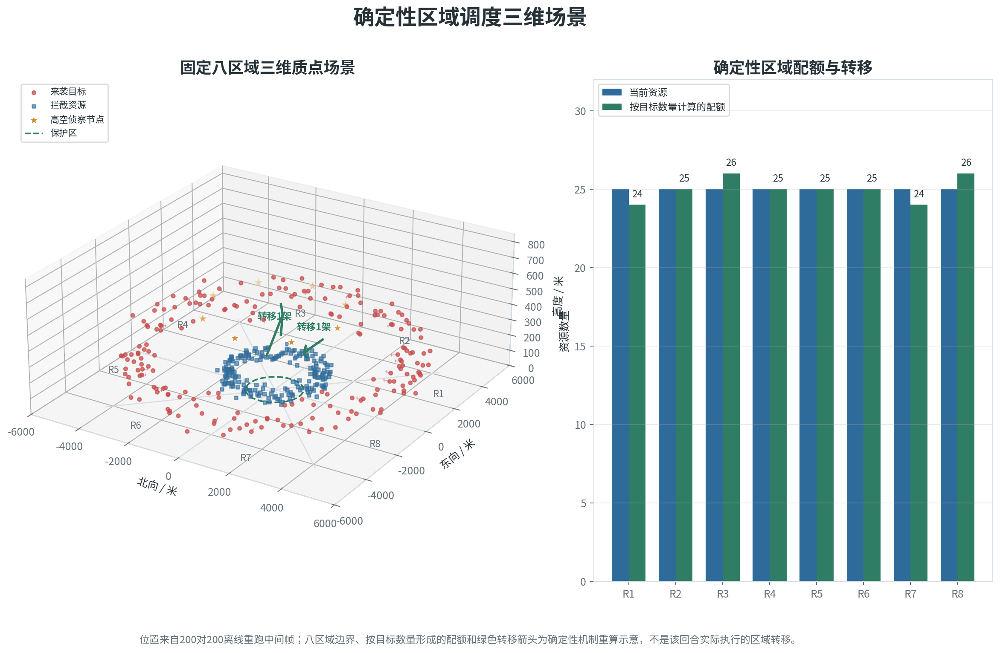

*图8 确定性区域调度三维示意。空间位置来自历史回合，区域压力和转移箭头为受控机制示意。*

### 8.6 优点与限制

确定性区域方案不需要训练数据，单步原因可追溯，分布外场景仍能给出可行结果。主要限制是
固定权重对多周期资源价值表达不足，贪心转移可能在多个区域竞争同一来源时形成局部最优，
预测窗和权重仍需多种子校准。

## 9. 区域调度的强化学习方案

### 9.1 作用位置

强化学习不输出200架资源的目标编号，也不直接改变区域边界。它读取区域图，输出区域配额、
备用、侦察优先级、保持、重规划和邻区转移建议。确定性投影器复核建议，后续求解器选择
具体资源。

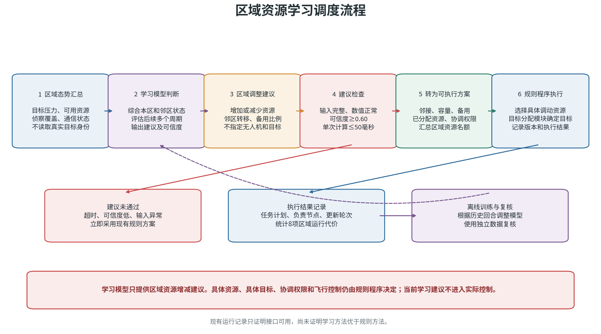

*图9 使用强化学习的区域调度。模型超时、低置信、分布外或输出非法时立即回退规则策略。*

### 9.2 观察空间

D4将区域表示为节点，将允许通信和机动的相邻区域表示为有向边。节点维数为24，边维数
为7，区域和边数量可变。

| 观察组 | 变量 | 维数 |
| --- | --- | ---: |
| 需求与感知 | 目标需求、高威胁积压、D1不确定度、D2不确定度、D5可见率、D5一致性 | 6 |
| 区域资源 | 可用、备用、已承诺资源占比 | 3 |
| 二级与通信 | 二级覆盖、二级就绪、通信容量、时延、丢包 | 5 |
| 控制权与安全 | 中心/二级/分布式/保持独热、租约剩余、联盟确认、owner有效、故障隔离 | 8 |
| 异常 | 分配冲突比例、降级失败标志 | 2 |
| 区域边 | 可转移资源比例、距离、转移时间、带宽、通信可用、机动可用、网络分区 | 7 |

距离、时间、容量和不确定度使用压缩与归一化。在线观察不包含真实目标编号、真实未来位置或
未来任务结果。图策略采用共享节点和边编码、64维隐状态和两轮消息传递；全局价值与置信度
通过区域隐状态池化得到。

### 9.3 动作空间

每个区域节点输出5维动作，每条有向边输出1维动作。

| 动作 | 数值形式 | 含义 |
| --- | --- | --- |
| 配额增减建议 | 连续值 | 该区域下一周期资源倾向 |
| 备用比例 | 0至1 | 建议保留比例 |
| 侦察优先级 | 0至1 | 高空侦察和相机关注程度 |
| 保持 | 二值 | 保持当前区域计划 |
| 请求重规划 | 二值 | 请求当前合法权威产生后继计划 |
| 邻区转移比例 | 每条有向边0至1 | 该边建议转移的资源比例 |

边动作 \(z_e\) 转换为资源数量：

\[
f_e=\max(0,\tanh z_e),\quad
n_e=\min(c_e,\operatorname{round}(f_ec_e)).
\]

区域配额变化由流入减流出形成：

\[
\Delta q_r=
\sum_{e:e\rightarrow r}n_e-
\sum_{e:r\rightarrow e}n_e.
\]

这种定义保证配额变化对应明确的区域边，确定性投影器可以复算资源守恒。策略不输出具体
资源编号、具体目标编号或全局航迹编号。

### 9.4 奖励函数

当前第一版奖励把8项非负成本按证据分母归一化：

\[
\bar c_k=\min(c_k/d_k,1),\quad
J_t=\frac{\sum_kw_k\bar c_k}{\sum_kw_k},\quad
r_t=-J_t.
\]

| 成本 | 权重 | 目的 |
| --- | ---: | --- |
| 高威胁积压 | 3.0 | 优先覆盖高威胁需求 |
| 配额满足缺口 | 2.0 | 减少建议与实际资源差 |
| 转移完成缺口 | 1.0 | 避免下发不能执行的跨区动作 |
| 备用资源缺口 | 2.0 | 保持区域恢复能力 |
| 通信负载 | 0.5 | 控制消息和视频摘要开销 |
| 分配冲突 | 3.0 | 抑制重复占用和联盟冲突 |
| 降级失败 | 5.0 | 惩罚非法或未完成接管 |
| 计划抖动 | 1.0 | 抑制反复换区和重规划 |

权重和为17.5。过期版本、错误控制权、过期租约、通信分区、承诺资源被移出、最低备用破坏
和资源不守恒属于硬约束，不允许通过奖励权衡。

当前奖励是结果时间窗归因，不是严格因果反事实。只有新计划被运行时确认，计划、所有者、
代次、租约和联盟在结果窗内一致，且8项成本全部可用，才能形成候选回报。相邻状态变化
不能自动归因给学习动作。

### 9.5 执行与回退

```text
区域快照和邻接图
  -> 图策略推理
  -> 有限值、分布外、置信度和50毫秒截止门
  -> 确定性投影检查容量、备用、承诺资源和控制权
  -> 生成有效期1秒的区域建议
  -> main/D3选择具体资源并发布版本化计划
  -> 运行确认和D6结果窗口
```

当前最低置信度为0.60，最低备用比例为10%，每个区域至少保留1个备用。任一门失败都回退
D4规则区域策略。辅助、分配、接管和控制权限当前均关闭。

### 9.6 当前证据

D4冻结候选使用1000个仿真回合和2098帧复合视图。八区域预检中只有1/3帧进入训练分布，
通过全部权限门的实际执行为0。主要分布外特征是二级节点就绪度：训练范围固定为1.0，
运行范围为0至1。项目已补充100个运行形态回合和199帧，但尚未完成重新训练和独立准入。

315个验证样本中有51个高置信动作与规则标签不一致，说明置信门和动作校准尚未闭合。当前
不能宣称区域学习优于规则基线。

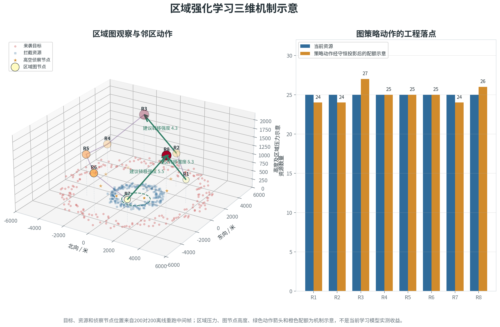

*图10 强化学习区域三维预期效果。区域压力、绿色转移和橙色配额是期望动作，不是在线实测。*

## 10. D3确定性目标分配

### 10.1 输入与输出

| 项目 | 内容 |
| --- | --- |
| 输入 | D2关联航迹、资源状态、目标多机需求、D4区域/权威约束、D5反馈、精确前序计划 |
| 输出 | 版本化分配计划、资源-全局航迹绑定、角色、波次、联盟、D7绑定和D6记录 |
| 默认算法 | 可解释规则代价、稀疏候选、匈牙利算法、需求槽全有或全无准入 |
| 稳定机制 | 20%相对改善迟滞、2秒最小驻留、换绑惩罚、联盟成员迟滞 |
| 执行周期 | 名义1秒，资源失效、需求变化或权威切换时事件触发 |

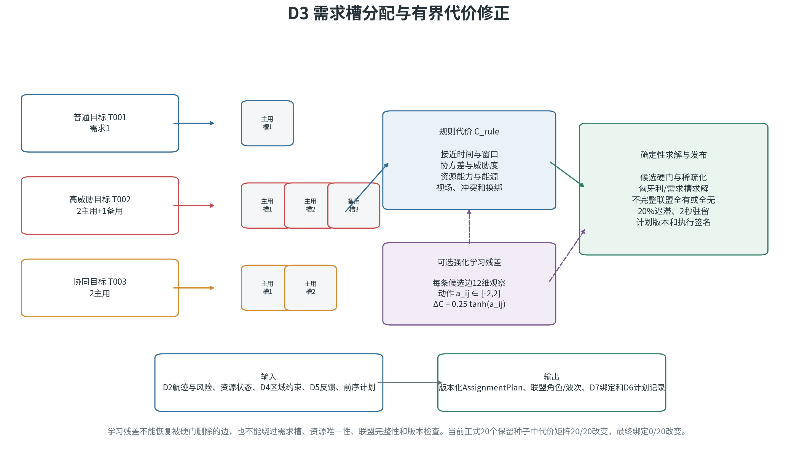

*图11 D3需求槽、规则代价和可选有界残差。*

### 10.2 规则代价

资源 \(i\) 分配给目标需求槽 \(j\) 的规则代价为：

\[
C_{ij}^{rule}=
w_tC_{ij}^{window}
+w_pC_{ij}^{cov}
+w_hC_j^{threat}
+w_rC_i^{resource}
+w_fC_{ij}^{fov}
+w_cC_{ij}^{conflict}
+w_sC_{ij}^{switch}.
\]

各项分别表示：

- 预计接近时间、闭合速度和任务窗口；
- 航迹位置/速度协方差和量测年龄；
- 目标威胁度和高威胁多机需求；
- 资源速度、机动、能源、可用性和历史故障；
- 末端相机视场、检测框和D5重捕获难度；
- 友方冲突、重复分配、能力不匹配和禁配；
- 相对上一计划的换绑成本。

不可达、失效、友方冲突、版本冲突和硬时间窗不满足的边在构造矩阵前删除，不依靠大代价
“软惩罚”模拟硬禁配。

### 10.3 普通一对一

普通目标每个只需要一个主资源：

\[
\min_{\mathbf{x}}\sum_{i,j}C_{ij}x_{ij}
\]

满足：

\[
\sum_jx_{ij}\leq1,\quad
\sum_ix_{ij}\leq1,\quad
x_{ij}\in\{0,1\}.
\]

目标和资源数量不相等时增加虚拟未分配行或列。未分配目标保留明确原因和代价，不能从
统计分母中删除。

### 10.4 多资源需求槽

高威胁目标需要多架资源时，D3先展开角色和波次槽。例如“2主用+1备用”形成三个槽：

```text
T001-primary-wave0-slot1
T001-primary-wave0-slot2
T001-reserve-wave1-slot1
```

每个槽继承目标威胁、能力和时间窗口，并增加角色成本。求解后如果目标只得到部分必要槽，
D3将低优先级不完整联盟整目标退出活动集合并重新求解，直到剩余联盟全部完整。发布层执行
全有或全无准入，不能让一个“需要3架”的任务在只得到1架时伪装成已满足。

当前高威胁默认是2个活动主资源加1个待命备用。两个主资源独立通过D4、D5和D7门控，不要求
同时到达。备用资源只有新版本显式激活后才能执行。

### 10.5 滚动规划

普通换配需满足：

\[
J_{new}<(1-\delta)J_{old},\quad
T_{dwell}\geq T_{min},
\]

当前 \(\delta=0.2\)，\(T_{min}=2.0\) 秒。旧边不可行、资源失效、目标需求改变或高威胁
未满足显著改善时可以释放普通迟滞。多资源联盟另有成员迟滞，避免主用和备用角色反复旋转。

D5短时失锁、普通模糊或重捕获首先触发视觉反馈驻留，保护仍然可行的主资源；友方冲突、
重复锁定、明确错配和资源不可用可以立即绕过驻留并阻断对应边。

### 10.6 计划版本

规划器是单回合有状态对象。首次计划从版本1开始，后续必须传入精确前序计划。计划标识、
版本和期望前序版本不匹配时硬拒绝。执行签名覆盖资源、目标、联盟、角色、波次、所有者、
授权和租约；签名变化时发布严格连续的新版本。

### 10.7 200对200执行结果

随机种子1000回合中，D3调用10次，平均约221.7毫秒，P95约284.3毫秒；每次发布200项
分配，运行时形成10次计划确认和1978次绑定确认。该时延包含当时的成本、对象和证据路径，
高于独立向量化稀疏基准的85.4毫秒，说明集成路径仍有对象物化和日志开销。

### 10.8 三维实验结果

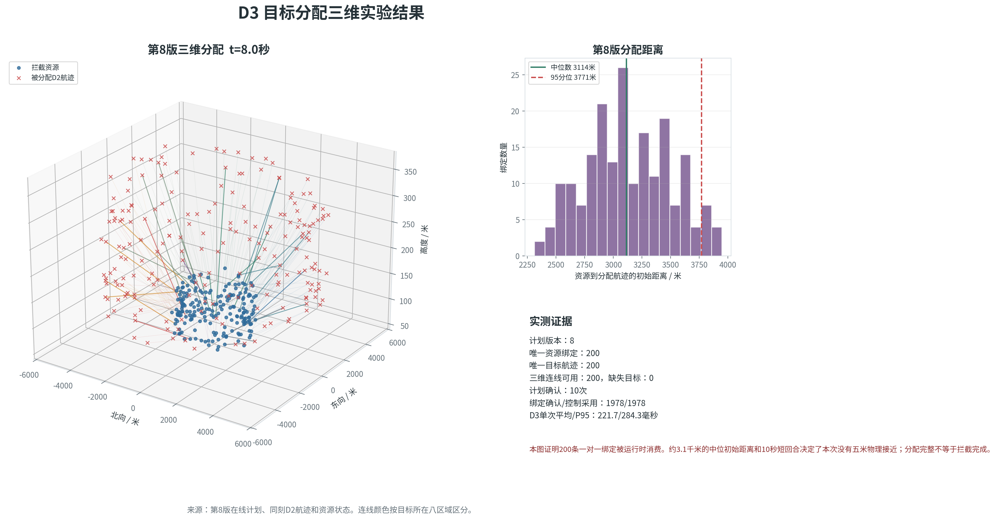

*图11-1 D3第8版计划的三维分配。蓝点是拦截资源，红叉是同刻D2航迹，连线表示实际被
运行时消费的资源到航迹绑定；颜色按目标所在八区域区分。*

第8版计划在8.0秒形成200个唯一资源绑定，对应200条唯一D2全局航迹。三维联接没有缺失
目标或重复目标绑定。资源到所分配航迹的初始距离中位数为3114米，95分位为3771米，最大值
为3948米。该距离反映场景中拦截资源位于内层、目标位于外层的初始几何，不是算法误差。

整个10秒回合形成10次计划确认、1978次绑定确认和1978次控制采用。D3集成路径单次平均
221.7毫秒，P95为284.3毫秒。独立向量化稀疏基准的中位耗时为85.4毫秒，两者差异来自
集成路径中的对象构造、版本证据和日志发布，不能用独立基准替代端到端时延。

该结果证明200对200唯一分配、版本消费和三维几何联接已经跑通。约3.1千米的中位初始距离
和10秒仿真时长决定了本回合没有目标进入五米范围。分配完整性不能推导为导引成功或物理
拦截成功。第8版计划使用确定性规则代价和匈牙利求解，强化学习代价残差保持关闭。

## 11. D3强化学习代价残差

### 11.1 设计原则

强化学习不替换匈牙利算法。它对通过硬门的稀疏候选边输出有界代价修正：

\[
C_{ij}^{final}=C_{ij}^{rule}+0.25\tanh(a_{ij}).
\]

单条边最大修正约0.25。学习模型可以改变接近的候选排序，不能生成被硬门删除的边，也不能
绕过资源唯一性、需求槽、迟滞和计划版本。

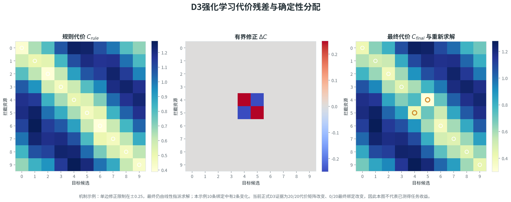

*图12 D3代价残差期望作用。小矩阵用于解释排序变化，不代表正式保留集已改变最终绑定。*

### 11.2 观察空间

每条有效候选边使用12维观察：

1. 规则总代价；
2. 目标威胁度；
3. 拦截窗口代价；
4. 协方差代价；
5. 可达性代价；
6. 区域代价；
7. 资源状态代价；
8. 视场代价；
9. 冲突代价；
10. 目标总资源需求；
11. 主资源需求；
12. 前序绑定标志。

输入形状为 \(E_t\times12\)，\(E_t\) 是当前稀疏候选边数。它不构造固定200×200神经网络
动作头，目标和资源数量变化时仍使用同一边模型。

### 11.3 动作空间

策略对每条候选边输出连续动作 \(a_{ij}\in[-2,2]\)。另有低频`neutral`、`hold`和
`replan`建议，每5个规划帧最多输出一次。当前离线环境只对保持形成了独立状态处理，
重规划建议尚未完成因果环境转移，不应声称策略已经学会重规划时机。

### 11.4 奖励函数

当前D3离线评分为：

\[
R=2H-0.05C-2U-0.5Q-2X-2S,
\]

其中：

- \(H\)：高威胁需求覆盖率；
- \(C\)：所选边规则成本和未分配惩罚；
- \(U\)：未满足需求槽数量；
- \(Q\)：相对上一计划的换绑量；
- \(X\)：计划过期指示；
- \(S\)：安全拒绝数量。

该奖励在同一冻结帧内重算确定性求解结果，尚未包含实际运行确认、下一时刻状态、D5末端
结果、D7导引和五米物理结果。它适合开发，不足以证明在线收益。

### 11.5 执行和当前结果

正式数据含900个仿真回合、1604个规划帧、100个随机种子和3658815条候选边，训练、验证
和测试按随机种子隔离。200规模模型推理P95约2.793毫秒。

20个正式保留种子结果为：

- 学习模型进入隔离影子路径：20/20；
- 代价矩阵发生变化：20/20；
- 最终离散绑定变化：0/20；
- 规则组与处理组平均分配成本均为17.056026；
- 重复分配、硬约束违规和高威胁未满足均为0。

当前结果证明模型、残差、求解和回退链路可以运行，没有证明任务质量改善。辅助和在线计划
权限保持关闭。

## 12. D4降级与权威接管

### 12.1 输入与输出

| 项目 | 内容 |
| --- | --- |
| 输入 | D1不确定度、D2身份风险、D3计划有效性、D5末端证据、中心健康、二级节点与通信状态 |
| 输出 | 继续中心、中心重规划、二级辅助、二级接管、完全分布式、保持复核；权威、租约和联盟记录 |
| 被动降级 | 中心心跳硬超时、摘要冲突、网络分区或法定多数判失效 |
| 主动降级 | 中心在线但计划持续不适用，D1/D2/D3/D5证据跨窗口累积 |
| 安全边界 | D4提出仲裁，main/D3发布新计划；D4不改写全局航迹，不直接发控制命令 |

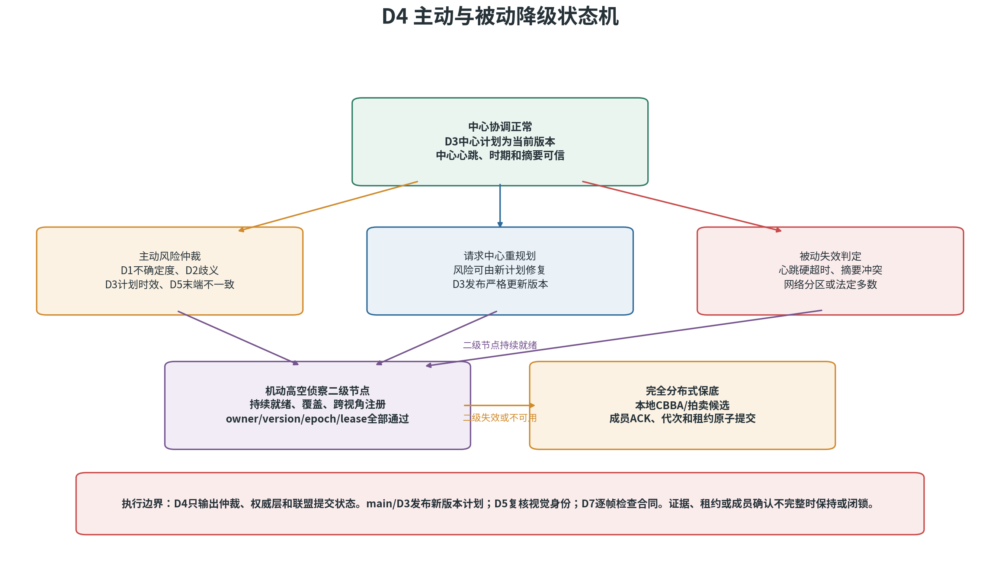

*图13 D4主动与被动降级。二级和分布式模式共用版本、代次、租约和成员确认门。*

### 12.2 中心健康

中心健康状态为正常、降质、可疑和失效。心跳滑窗、摘要校验、中心代次和状态驻留共同决定
迁移。单个迟到心跳不能直接判定中心被摧毁。中心恢复后先进入可疑状态，只有双轨计划校验
通过并显式接受后才恢复正常，避免旧中心计划覆盖降级期间的新版本。

### 12.3 主动风险融合

D4按资源-航迹对维护风险窗口。主要证据包括：

- D1位置协方差、量测年龄、协方差增长和来源缺口；
- D2歧义、显式身份切换、重复航迹和连续性；
- D3计划是否当前、计划年龄、资源可行性和代价裕度；
- D5当前绑定、友方冲突、重复锁定、持续错配和末端适用性。

当前D1位置标准差约20米和50米作为中高风险仿真分档。门限必须随雷达精度、目标距离和
场景配置标定，不是通用工程阈值。

动作选择采用递进顺序：

```text
风险低
  -> 继续中心计划
软风险或需要补充视角
  -> 请求二级观测辅助，不转移owner
中心可修复的计划问题
  -> 请求中心重规划
计划持续失效且二级持续就绪
  -> 提出二级接管候选
友方/身份/联盟冲突
  -> 保持并复核
```

`request_secondary_assist`只表示图像或线索辅助，不能解释为二级已经取得分配权。

### 12.4 机动高空侦察二级节点

二级节点是机动高空侦察无人机，与拦截资源同步出动但不参与拦截。正常时接收D1/D2粗指向，
控制高性能光电云台，向局部拦截资源发送图像、检测框、特征摘要和跨视角证据；降级时可在
覆盖区域内成为候选协调者。

二级就绪分为：

1. `not_ready`：心跳、链路、云台、覆盖、注册或租约不足；
2. `visible_only`：看见目标但没有稳定全局注册；
3. `registration_usable`：跨视角证据可辅助，仍不能接管；
4. `takeover_ready`：覆盖、联合视野、注册、新鲜度、通信和租约均通过。

当前基线要求综合评分不低于0.70、覆盖率不低于0.65、二级网络同帧全覆盖不低于0.80，
并至少有3个不同时间戳、持续0.2秒的连续就绪证据。数值属于仿真门限。

二级计划可执行条件为：

\[
E_{sec}=
I_{active}I_{source}I_{ready}I_{epoch}I_{lease}I_{version}.
\]

缺计划激活、来源不一致、就绪回落、代次回退、租约过期或版本未更新时，二级计划保持待
生效，D7不能执行旧视觉合同。

### 12.5 完全分布式保底

中心和二级均不可用时，D4使用本地轻量基于共识的捆绑算法
（Consensus-Based Bundle Algorithm，CBBA）或拍卖候选。基础出价综合航迹质量、资源
可用性、通信、能力匹配、来源支持、航迹年龄和D5分布式视觉证据：

\[
s_{ij}=
2.0q_j+1.4a_i+0.5c_i+1.2m_{ij}
+b_{source}-0.8p_{age}+\Delta s_{D5}.
\]

每个节点建立本地任务束，广播获胜者、出价、代次和约束摘要，按更高出价或更新代次更新
本地视图。多资源联盟必须形成`CoalitionMemberAck`和`CoalitionCommitState`：

```text
proposed
  -> collecting_acks
  -> committed
  -> executing
  -> reconfiguring / aborted
```

只有全部必要成员确认、代次一致、租约有效和计划版本一致时才原子提交。网络分区、缺确认、
旧代次或过期租约均失败关闭。当前实现是研究级轻量CBBA，不是生产无线网络协议。

### 12.6 当前AirSim现象

5v5机动高空侦察单种子测试中：

- 正常中心场景跨视角关联为4；
- 主动降级到二级场景跨视角关联为0；
- 完全分布式场景跨视角关联为0；
- 三类场景的单二级全局同帧视野均为0；
- 网络联合覆盖均值约0.65至0.72；
- 主要断点均为`not_all_targets_visible`。

这组结果说明D4状态机可以进入目标模式，但二级视觉证据还没有稳定形成可接管注册。不能
为了制造接管正例而降低全局身份、版本、租约或成员确认门。

## 13. D5确定性视觉配准

### 13.1 输入与输出

| 项目 | 内容 |
| --- | --- |
| 输入 | D1/D2全局航迹、协方差、双时间戳、相机内外参、匿名局部视觉轨迹、D3分配、D4权威 |
| 输出 | `TerminalAssociation`、候选全局航迹编号、局部轨迹编号、置信度、锁定/模糊/保持/重捕获 |
| 默认算法 | 航迹时间预测、针孔投影、协方差传播、几何与运动门控、匈牙利、稳定窗口 |
| 检测/局部跟踪 | AirSim主线当前可用detect；YOLOv8、ByteTrack和BoT-SORT为可选路径 |
| 身份边界 | 只选择上游已有`global_track_id`，不创建、改写或本地换绑 |

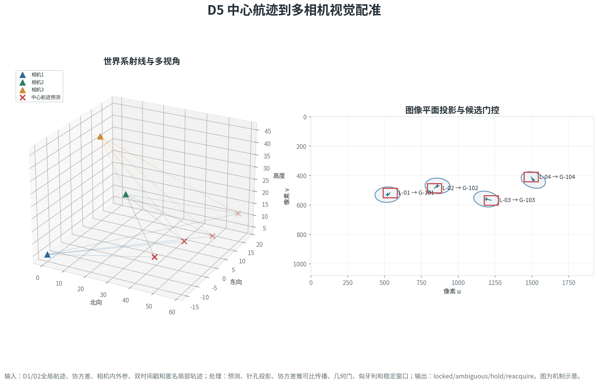

*图14 D5从中心三维航迹到多相机像面的几何配准。图中射线和像素框为机制示意。*

### 13.2 局部视觉轨迹

每台相机独立运行检测和局部多目标跟踪。局部轨迹只在相机内部保持连续：

```text
camera_id + local_track_id + measurement_timestamp
```

它不是全局身份。相机1可以看到目标1、2、3，相机2只看到目标2、3、4；两台相机先分别
维护自己的局部轨迹，再由跨视角和中心投影判断哪些局部轨迹支持同一个上游全局航迹。
某台相机看不到目标不会自动导致全局航迹删除。

当前AirSim detect路径使用匿名检测框、中心距离、交并比、卡尔曼外推和稳定窗口形成局部
轨迹。YOLOv8加ByteTrack已经接线，但当前5+1专项的检测召回和本地身份连续性未达到准入门。

### 13.3 时间预测

中心航迹在量测时间 \(t_m\) 的预测为：

\[
\hat{\mathbf{x}}(t_m)=
\mathbf{F}(t_m-t_0)\hat{\mathbf{x}}(t_0),
\]

\[
\mathbf{P}(t_m)=
\mathbf{F}\mathbf{P}(t_0)\mathbf{F}^{\mathsf T}+\mathbf{Q}.
\]

D5使用局部视觉量测的`measurement_timestamp`，不能用当前到达时刻或整个序列最后一帧
替代。到达时间用于判断证据新鲜度和通信延迟。

### 13.4 相机投影

世界点到相机坐标：

\[
\mathbf{p}_c=\mathbf{R}_{cw}\mathbf{p}_{ned}+\mathbf{t}_{cw}.
\]

针孔投影：

\[
\mathbf{z}_{pix}=
\begin{bmatrix}
f_xx_c/z_c+c_x\\
f_yy_c/z_c+c_y
\end{bmatrix}.
\]

状态协方差通过投影雅可比传播：

\[
\mathbf{S}_{pix}=
\mathbf{J}_{proj}\mathbf{P}_{pos}\mathbf{J}_{proj}^{\mathsf T}
+\mathbf{R}_{bbox}
+\mathbf{R}_{extrinsic}.
\]

\(\mathbf{R}_{bbox}\) 表示检测框中心误差，\(\mathbf{R}_{extrinsic}\) 表示相机位置和姿态不确定度。
外参误差不能被当作零，否则远距离小目标会产生虚假精确的像素门。

### 13.5 几何门控

局部轨迹 \(l\) 与全局航迹 \(g\) 的候选依次通过：

1. 量测和到达时间窗；
2. 相机视场、正深度和图像边界；
3. 像素马氏距离；
4. 检测框尺度及历史变化率；
5. 像面角速度一致性；
6. 类别和置信度；
7. 友方身份、重复锁定和计划版本；
8. 多相机时的极线、射线最近距离、交会角和重投影误差。

像素马氏距离为：

\[
d_{lg}^{2}=
(\mathbf{z}_l-\hat{\mathbf{z}}_g)^{\mathsf T}
(\mathbf{S}_g+\mathbf{R}_l)^{-1}
(\mathbf{z}_l-\hat{\mathbf{z}}_g).
\]

候选总代价为：

\[
C_{lg}^{D5}=
w_p d_{lg}^{2}
+w_\omega C_{lg}^{rate}
+w_b C_{lg}^{bbox}
+w_c C_{lg}^{class}
+w_h C_{lg}^{history}
+w_f C_{lg}^{friend}
+w_s C_{lg}^{secondary}.
\]

几何、时间和身份硬门先删除不可行候选，总代价只对剩余候选排序。

### 13.6 匹配与状态机

同一相机内使用一对一匈牙利匹配。跨相机轨迹先形成匿名簇，再将簇与中心航迹做匈牙利
绑定。候选裕量不足或多个候选接近时输出模糊，不强行选择。

状态为：

- `locked`：唯一候选、置信度和稳定帧满足，且身份与计划合同一致；
- `ambiguous`：多个候选或跨视角证据冲突；
- `hold`：友方重叠、重复锁定、版本/联盟不完整或需要人工复核；
- `reacquire`：历史绑定存在，但当前检测短时丢失或质量下降。

进入`locked`需要连续稳定帧。单帧失锁不能立即换绑；重捕获只能恢复同一资源、同一局部
轨迹谱系、同一全局航迹和单调版本。

### 13.7 二级与分布式配准

二级侦察节点正常时提供宽视场锚点和高质量外参。D5将主相机局部轨迹、侦察相机局部轨迹
和中心投影组织为跨视角候选。二级节点不可用时，拦截资源之间交换带时间戳、相机位姿、
检测框历史和候选全局航迹的摘要；多视角证据可以提高或降低既有候选支持，但不能自行创建
中心身份。

完全无中心时，如果所有资源仍持有一致的最后有效全局航迹集合，可以在D4联盟版本内形成
临时视觉假设。`hypothesis_only`不等于规范身份，不能驱动本地换绑。中心恢复后按时间重叠、
几何一致性和版本进行保守合并。

### 13.8 当前AirSim结果

5主相机加1侦察相机、5个目标、12秒、seed 7的专项结果如下。

| 后端 | 检测召回 | 严格配准准确率 | 稳定配准率 | 主相机联合覆盖 | 侦察全覆盖 | 本地身份切换 |
| --- | ---: | ---: | ---: | ---: | ---: | ---: |
| AirSim detect | 1.000 | 1.000 | 0.975 | 1.000 | 0.918 | 0 |
| YOLOv8+ByteTrack | 0.622 | 0.966 | 0.955 | 1.000 | 0.878 | 25 |

detect结果证明“局部子集视场+侦察锚点+中心投影+匈牙利+稳定窗口”在该受控专项可闭合。
该专项没有运行完整D1/D2，中心航迹由main根据actor运动学合成，不能解释为真实雷达到视觉
全链路已经闭合。YOLOv8候选未通过召回、侦察覆盖和身份切换门。

### 13.9 当前限制

- 真实可见光、红外和雷达联合标定尚未形成统一回放；
- 外参漂移、时钟偏差、滚动快门和运动模糊需要独立压力测试；
- 真实目标外观特征尚未进入默认跨视角代价；
- 200路相机必须使用视锥索引、时间窗和节点度上限，不能构造完全相机图；
- 二级节点“看见目标”与“形成全局注册”仍存在明显差距。

## 14. D5图神经网络配准

### 14.1 作用边界

图神经网络不直接输出目标编号。D5先用时间、视场和几何门生成稀疏候选图，模型只为候选边
输出“两个匿名局部轨迹属于同一物理目标”的概率。后处理仍执行同相机互斥、受约束聚类和
中心匈牙利绑定。

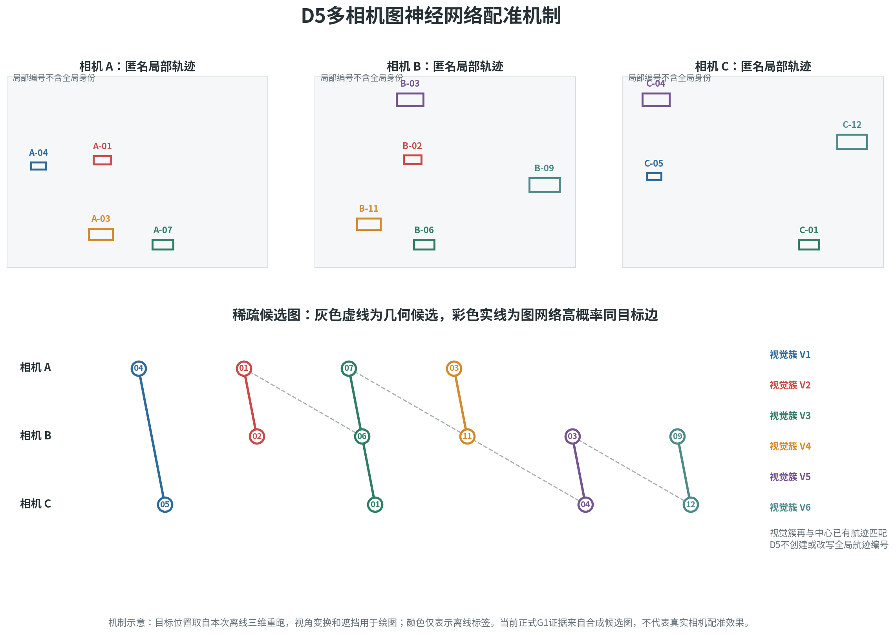

*图15 图神经网络跨视角配准期望效果。图网络输出边概率，不能创建全局航迹编号。*

在线图不保存仿真真实目标编号、Actor名称和全局航迹编号。离线真实身份只在候选图冻结后
生成边标签和评估结果。中心航迹只作为投影假设进入候选生成，并在模型评分之后参与最终
一对一绑定。

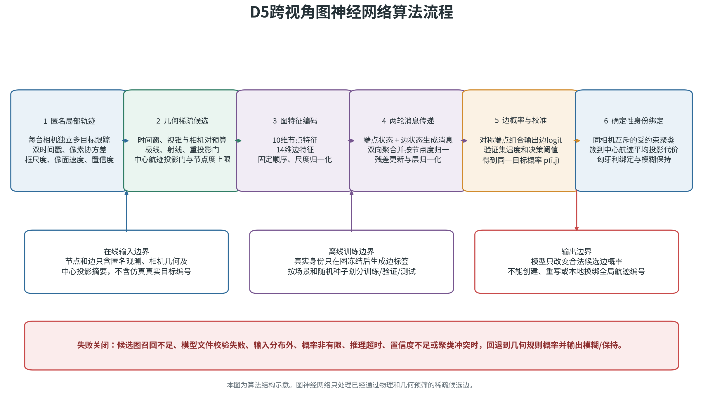

*图16 图神经网络程序链路。候选生成、模型评分、约束聚类和中心绑定保持分层，任一模型异常均可回退几何规则。*

### 14.2 稀疏图构建

每帧图表示为

\[
\mathcal{G}_k=(\mathcal{V}_k,\mathcal{E}_k,\mathbf{X}_k,\mathbf{Z}_k).
\]

节点集合\(\mathcal{V}_k\)来自各相机局部多目标跟踪。边集合\(\mathcal{E}_k\)不采用完全
连接。构图先按量测时间对齐，再用截断视锥空间索引选相机对，随后执行共享中心投影、
极线、射线正深度、交会角、射线最近距离和重投影门。通过几何门的候选按共享中心支持、
投影误差、时间差和置信度排序，最后由相机对预算和每节点度上限截断。

候选召回必须独立统计。正确边在构图阶段被预算或几何门删除后，分类模型无法补回。程序
应同时输出全部相机对、索引后相机对、实际检查相机对、门控拒绝数、节点度截断数和最终边数。

### 14.3 节点与边特征

每个节点是一段匿名相机局部轨迹。当前10维节点特征包括：归一化框中心横纵坐标、框面积
对数、宽高比对数、横纵像面角速度、尺度变化率、检测置信度、归一化像素协方差迹和轨迹
持续时间。

候选边只连接不同相机节点。当前14维边特征为：

1. 时间差；
2. 像素马氏距离；
3. 重投影误差；
4. 两射线最近距离；
5. 检测框对数尺度差；
6. 尺度变化率差；
7. 像面角速度差；
8. 相机基线；
9. 外参协方差迹；
10. 极线误差；
11. 交会角；
12. 中心投影马氏距离；
13. 置信度乘积；
14. 共享中心候选数量。

特征名、顺序、数据类型、归一化尺度和版本写入数据及模型manifest。运行图与模型声明
不一致时，模型评分失败关闭，不能尝试按维数相同静默加载。

### 14.4 消息传递与边分类

节点编码器和边编码器将特征映射到统一隐空间：

\[
\mathbf{h}_i^{(0)}=\phi_v(\mathbf{x}_i),\qquad
\mathbf{e}_{ij}=\phi_e(\mathbf{z}_{ij}).
\]

每轮消息传递使用两个端点状态和边状态生成消息，并按节点度归一化聚合：

\[
\mathbf{m}_{ij}^{(l)}
=\phi_m(\mathbf{h}_i^{(l)},\mathbf{h}_j^{(l)},\mathbf{e}_{ij}),
\]

\[
\mathbf{a}_i^{(l)}
=\frac{1}{\max(1,|\mathcal{N}(i)|)}
\sum_{j\in\mathcal{N}(i)}\mathbf{m}_{ij}^{(l)},
\]

\[
\mathbf{h}_i^{(l+1)}
=\operatorname{LayerNorm}
\left[\mathbf{h}_i^{(l)}+
\phi_u(\mathbf{h}_i^{(l)},\mathbf{a}_i^{(l)})\right].
\]

当前实现使用两轮消息传递和原生PyTorch的`index_add_`双端点聚合。边分类器使用端点
隐状态之和、绝对差、逐元素乘积和边状态：

\[
\mathbf{q}_{ij}=
[\mathbf{h}_i+\mathbf{h}_j,\quad
|\mathbf{h}_i-\mathbf{h}_j|,\quad
\mathbf{h}_i\odot\mathbf{h}_j,\quad
\mathbf{e}_{ij}],
\]

\[
p_{ij}=\operatorname{sigmoid}(\phi_o(\mathbf{q}_{ij})/T).
\]

端点对称组合使无向边不受输入顺序影响。邻域聚合使一条边的判断能够参考同节点的其他竞争
候选。输出\(p_{ij}\)只表示候选边同目标概率。

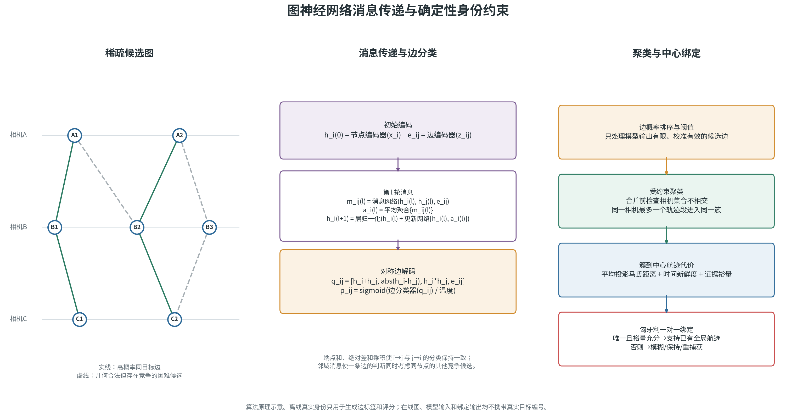

*图17 消息传递、边分类、受约束聚类和中心绑定。图网络提供概率，确定性后处理维护身份约束。*

### 14.5 训练与模型制品

候选图先冻结，再与独立离线真实身份侧车连接。相同真实身份的跨相机边标为正类，不同身份
标为负类。所有正边保留；负边按几何门分数从小到大选择，优先使用位置接近、运动相似的
困难负样本。每个图使用带正类权重的二元交叉熵，正类权重由训练图正负样本比例计算。

数据按场景版本和随机种子组切分，同组数据不能跨训练、验证和测试。验证集只用于模型选择、
标量温度和概率阈值；测试集不参与选择。模型bundle保存manifest、权重和校验清单，并绑定
图模式、节点和边特征版本、隐藏维数、消息轮数、数据切分摘要、温度、阈值和训练实现版本。
加载使用只读权重模式，任一摘要、结构、维数或非有限参数异常均拒绝模型。

### 14.6 聚类与中心绑定

候选边按校准概率降序尝试合并。每次合并检查两个簇的相机集合是否相交，确保同一相机最多
一个轨迹段进入同一簇。匿名簇形成后，计算簇内节点到每条中心全局航迹的平均投影马氏代价，
并加入时间新鲜度和候选裕量。匈牙利算法完成簇到中心航迹的一对一绑定。

唯一候选、代价门和裕量均通过时输出对已有全局航迹的支持；候选相近时输出模糊；友方重叠、
计划版本错误或联盟不完整时保持；短时检测中断时进入重捕获。输出全局航迹编号必须是中心
输入集合的子集。

### 14.7 运行回退

模型缺失、文件校验失败、图结构不匹配、输入非有限、概率形状错误、推理超时、平均确定度
不足或输入分布外时，程序丢弃整批模型概率，使用几何规则概率执行相同的聚类和中心绑定。
模型不能绕过时间、视场、极线、射线、重投影、中心投影、同相机互斥、友方冲突、计划版本
和全局身份所有权约束。

### 14.8 当前证据

冻结合成候选图使用20个未见随机种子、900帧、13344个匿名节点和74024条候选边：

| 指标 | 当前结果 |
| --- | ---: |
| 边级精确率 | 1.000 |
| 边级召回率 | 1.000 |
| F1 | 1.000 |
| 候选召回率 | 1.000 |
| 错误合并率 | 0 |
| 中央处理器推理P95 | 0.913毫秒 |
| 最高单特征曲线下面积 | 0.720073 |

规则对照的边级F1为0.367980，簇对级F1为0.239234。两臂使用同一不可变候选图，离线真值
只在输出形成后评分。D6外部审计和装配后审计通过。

满分只适用于当前冻结合成候选图。它没有覆盖真实可见光、红外、复杂遮挡、外参漂移、
多相机异步和相似运动困难负样本。图模型辅助、在线身份和控制权限仍关闭。

### 14.9 200规模复杂度

当前结构测试中：

- 200台相机共有19900个可能相机对，只检查400对，约59.2毫秒；
- 800个匿名节点的压力图形成1923条最终边，构图与处理约0.442秒；
- 每节点最大度为6，图密度约0.006。

这些结果证明稀疏结构可运行，不证明200路真实视频检测和特征提取满足实时预算。候选预算
删除正确边的比例必须由D6单独统计。固定消息轮数下，推理复杂度近似随节点数和候选边数
线性增长；检测、局部多目标跟踪、外观特征和视频传输仍可能成为主要算力与带宽开销。

## 15. 侦察主动视觉的确定性方案

### 15.1 任务定义

主动视觉决定“下一时刻哪台相机观察哪个目标、搜索哪个扇区、使用广角还是变焦”。它不决定
目标身份、不发布分配计划，也不输出飞行控制。确定性规则是当前默认路径。

| 项目 | 内容 |
| --- | --- |
| 输入 | 当前计划、全局航迹投影、相机姿态与机械限位、可见性、遮挡、通信、友方观察预留 |
| 输出 | 相机目标、方位/俯仰增量、广角/变焦、有效期、版本和执行原因 |
| 默认算法 | 已分配目标优先、短时重捕获、确定性扇区轮转、友方冲突保持 |
| 执行边界 | 云台限速、限位、视场和版本复核；不输出车辆导航命令 |

### 15.2 规则优先级

1. 相机不可用、执行器忙或友方独占冲突时保持；
2. 已分配目标存在新鲜、可见、低遮挡且高置信投影时观察该目标；
3. 已分配目标短时丢失时按最后投影进入重捕获并切广角；
4. 无可用目标时按计划和相机编号确定性扫描扇区；
5. 多台相机竞争同一目标时使用观察租约和友方预留分工；
6. 所有候选都冲突或版本陈旧时保持。

云台命令先裁剪单步角度，再检查方位/俯仰速率、合成转动速度、机械限位和命令有效期。
main在下一视觉帧应用命令并写入执行确认。

### 15.3 200对200执行结果

随机种子1000回合中，确定性主动视觉调用91次，单次平均约38.7毫秒；下发18928条相机
命令并全部确认执行。回合末主动视觉指令数为208。该结果证明相机调度和确认链能承载规模化
命令，不证明可见率、首次锁定或重捕获时间相对固定相机得到改善。

## 16. 侦察主动视觉强化学习

### 16.1 适用问题

多目标、多相机、遮挡和带宽受限时，下一步观察动作会改变后续检测和配准质量。规则容易
重复观察容易目标，或在多个相机之间产生振荡。强化学习可以利用延迟结果选择目标、扇区和
视场模式，但必须通过同一确定性云台安全投影。

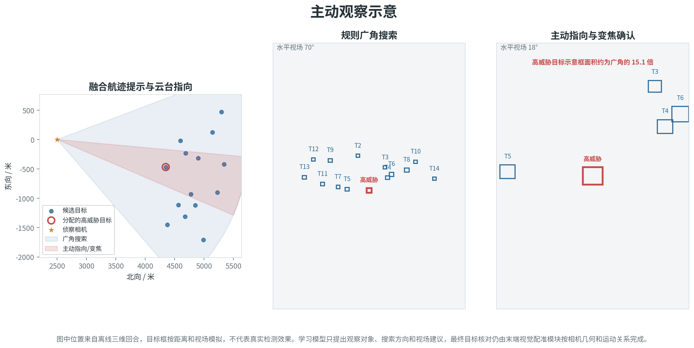

*图18 主动视觉预期效果。相机位置取自历史回合，视场、遮挡和动作是机制示意。*

### 16.2 观察空间

当前`ActiveVisionSnapshotV1`按相机、全局航迹候选和投影证据组织，不使用真值。结构化观察
包括：

- 相机方位、俯仰、角速度、机械限位、可用转速、执行器忙闲和当前视场模式；
- 候选全局航迹版本、计划成员、威胁、分配角色和当前相机责任；
- 目标投影方位/俯仰误差、2×2投影协方差、可见概率、遮挡比例、关联置信度、证据年龄
  和是否在视场内；
- 其他相机数量、候选目标数量、友方观察预留、计划/联盟/通信版本和通信健康。

当前模型对每个安全候选动作构造35维状态-动作特征。前16项描述相机、目标数量、计划和
通信；中间9项描述动作意图、视场和角度增量；后10项描述目标投影、可见性、遮挡、置信度、
新鲜度和友方预留。模型对有限候选打分，不输出无界连续控制。

### 16.3 动作空间

每台相机的离散意图为：

- `observe_target`：观察当前计划中的指定全局航迹；
- `search_sector`：扫描指定方位/俯仰扇区；
- `hold`：保持当前姿态和视场；
- `reacquire`：按最后合法投影重捕获同一目标。

每个动作还携带：

- 有界方位和俯仰增量；
- `wide`或`zoom`视场；
- 目标全局航迹或搜索扇区；
- 计划、联盟和通信版本；
- 下发时刻和过期时刻。

策略只能从`enumerate_safe_action_candidates()`生成的有限集合中选择。相机机械范围、
最大角速度、友方冲突、目标成员、证据年龄和版本在模型打分前后各检查一次。

### 16.4 奖励函数

当前软件合同要求奖励在 \([-1,1]\) 内，并且只有离线结果证据完整时才可用。建议采用以下
可归因时间窗奖励：

\[
\begin{aligned}
r_t=\operatorname{clip}_{[-1,1]}(&
w_v\Delta V_{threat}
+w_l\Delta L_{lock}
+w_r\Delta R_{reacquire}
+w_g\Delta G_{crossview}\\
&-w_mM_{gimbal}
-w_bB_{comm}
-w_dD_{duplicate}
-w_eE_{wrong}
-w_sS_{violation}).
\end{aligned}
\]

各项含义为：

- \(\Delta V_{threat}\)：高威胁已分配目标有效可见时间增量；
- \(\Delta L_{lock}\)：首次锁定时间改善；
- \(\Delta R_{reacquire}\)：遮挡后重捕获时间改善；
- \(\Delta G_{crossview}\)：跨视角候选召回和稳定配准改善；
- \(M_{gimbal}\)：云台总运动量和方向反复切换；
- \(B_{comm}\)：图像或特征传输带宽占用；
- \(D_{duplicate}\)：多个相机无必要重复观察；
- \(E_{wrong}\)：错误目标支持或旧计划观察；
- \(S_{violation}\)：友方冲突、版本、限位或越权动作。

奖励必须联接实际相机命令确认、后续观察帧、D5配准结果和计划版本。没有离线结果或因果
窗口时，奖励状态为`unavailable`，禁止补零训练。

### 16.5 训练与执行

初期使用确定性规则生成行为克隆数据，随后只在奖励完整的离线回合上研究近端策略优化。
训练、验证和测试按`scenario_version + seed`整体切分，共享随机种子的跨场景样本不得进入
不同集合。

运行模式分为：

- `disabled`：只执行规则动作；
- `shadow`：记录模型建议，实际仍执行规则动作；
- `assist`：模型通过正式准入后，可在安全候选中选择；任一门失败回退规则。

模型文件、特征顺序、归一化范围、训练数据摘要和权重摘要必须一致。分布外、低置信、超时、
非有限输出和版本不匹配全部回退。

### 16.6 当前证据

主动视觉数据含900个仿真回合和1153242个样本。总体测试精确动作准确率约0.956，但：

- `reacquire`占92.16%；
- `observe_target`只占1.72%，测试召回率为0；
- `hold`没有正样本；
- 侦察相机准确率约0.622，明显低于拦截相机约0.970。

总体准确率被类别不平衡放大。当前没有证据证明学习策略改善可见率、锁定时间、重捕获、
配准或五米接近，主动视觉辅助和相机执行权限保持关闭。

## 17. D7比例导引与末端交接

### 17.1 输入与输出

| 项目 | 内容 |
| --- | --- |
| 输入 | D3资源-航迹绑定、D4权威和联盟许可、D5末端关联、目标与资源估计状态、平台机动能力 |
| 输出 | 每个资源-目标对的导引模式、三维导航命令、合同/控制许可、拒绝原因和状态记录 |
| 三维质点主线 | 三维位置-速度比例导引 |
| AirSim主线 | 位置比例导引，中段重捕获，末端`png_vm`视觉比例导引 |
| 可选候选 | `png_ttc`、三维真比例导引、增广比例导引和鲁棒近似离线对照 |

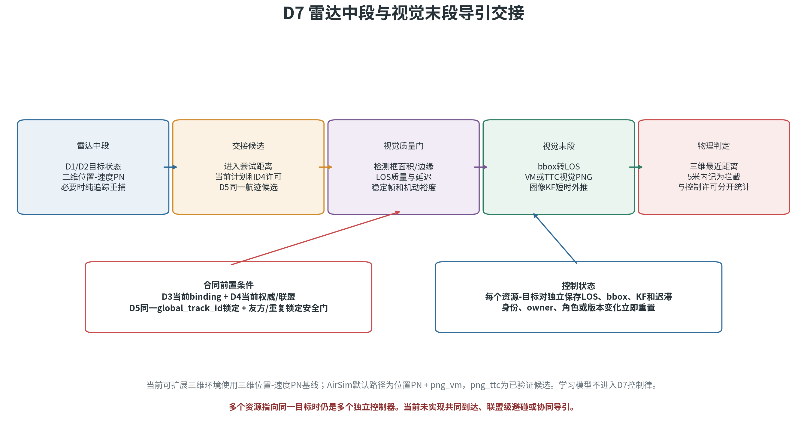

*图19 D7雷达中段到视觉末段交接。多个资源对同一目标仍使用独立控制上下文。*

### 17.2 三维位置比例导引

设拦截资源位置和速度为 \(\mathbf{p}_m,\mathbf{v}_m\)，目标估计为
\(\mathbf{p}_t,\mathbf{v}_t\)。相对状态：

\[
\mathbf{r}=\mathbf{p}_t-\mathbf{p}_m,\quad
\mathbf{v}_r=\mathbf{v}_t-\mathbf{v}_m.
\]

闭合速度为：

\[
V_c=-\frac{\mathbf{r}^{\mathsf T}\mathbf{v}_r}{\|\mathbf{r}\|}.
\]

视线角速度向量为：

\[
\boldsymbol{\omega}_{LOS}=
\frac{\mathbf{r}\times\mathbf{v}_r}{\|\mathbf{r}\|^2}.
\]

比例导引横向加速度可写为：

\[
\mathbf{a}_{cmd}=
N V_c
\left(
\boldsymbol{\omega}_{LOS}\times
\frac{\mathbf{r}}{\|\mathbf{r}\|}
\right),
\]

其中 \(N\) 是导航系数。程序还对速度、加速度、高度和数值状态做裁剪。目标状态必须来自
D1/D2估计，不能读取仿真真实状态。

### 17.3 视觉比例导引

检测框中心转换为归一化像面角：

\[
\theta_x=\arctan\frac{u-c_x}{f_x},\quad
\theta_y=\arctan\frac{v-c_y}{f_y}.
\]

相邻帧角差形成视线角速度，并经过指数滤波、尖峰检查、方差门和限幅。默认`png_vm`
使用相对速度尺度形成固定增益视觉比例导引；`png_ttc`根据检测框面积增长估算碰撞时间：

\[
\tau_{bbox}\approx\frac{2A}{\dot A},
\]

再按碰撞时间调度增益。面积没有稳定扩张、检测框裁切、跳变或碰撞时间无效时，保持雷达
中段，不强行切换。

### 17.4 图像滤波与短时外推

图像卡尔曼滤波状态为：

\[
\mathbf{x}_{img}=
[\theta_x,\theta_y,\dot\theta_x,\dot\theta_y]^\mathsf{T}.
\]

当前最长图像预测和盲推时间均为0.25秒，连续丢失阈值为3帧。只有该资源-目标对曾建立真实
量测锁定、D5明确进入同一身份重捕获、D3/D4/D5版本仍一致且视觉模式已经锁存时，才允许
短时预测。任何资源、全局航迹、owner、角色、版本或安全状态变化立即清空滤波历史。

### 17.5 交接门

视觉切换不是“距离达到30米必切”。距离只打开尝试窗口，最终切换要求：

1. D3当前绑定、授权、有效期和版本通过；
2. D4当前所有者、二级接管或分布式联盟提交通过；
3. D5锁定同一全局航迹，无友方或重复锁定风险；
4. 当前资源是活动主资源，备用未越权；
5. 检测框面积、边缘、稳定帧、延迟和视线质量通过；
6. 目标正在闭合，平台转率和横向加速度仍有至少15%机动裕度；
7. 模式切入迟滞和重捕获条件通过。

D7分开记录：

- 合同允许；
- 控制允许；
- 模式切换；
- 实际执行导引律；
- 三维五米物理结果。

这些层级不能相互推断。进入五米不表示一定使用视觉比例导引；合同通过也不表示控制和物理
结果通过。

### 17.6 多资源任务

每个资源-目标对使用独立`control_context_id`，一个成员丢锁不能污染其他成员。当前
“2主用+1备用”任务的两个主资源分别执行位置或视觉比例导引，不要求同时到达。联盟合同只
决定谁可以执行，不改变单机导引公式。

当前未实现：

- 联盟共同剩余飞行时间；
- 共同到达时刻和撞击角分配；
- 成员间预测避碰；
- 邻机状态交换下的协同控制律。

因此当前能力应称为“多资源合同化独立导引”，不能称为协同到达导引。

### 17.7 当前证据

随机种子1000的200对200回合中，D7调用185次，平均约30.7毫秒；回合末生成200条命令。
目标和拦截资源初始距离较大，10秒内五米接近为0。

AirSim actual-v2单种子中，2v2物理成功2/2；5资源对2目标活动资源对成功2/3，第二主资源
最近约11.02米，视觉控制和模式切换为0。历史迁移前2v2 `png_ttc` 10个随机种子曾达到
20/20资源对五米结果，但当时没有独立审计在线真实目标状态，不能替代当前真值隔离证据。

## 18. D6系统评估

### 18.1 输入与输出

| 项目 | 内容 |
| --- | --- |
| 输入 | D1-D7记录、main场景与通信日志、离线真值侧车、配置、seed和来源摘要 |
| 输出 | 逐seed CSV、聚合JSON、中文Markdown、曲线、失败原因、置信区间和准入结论 |
| 数据原则 | 在线真值隔离；指标携带可用、部分可用或不可用状态 |
| 统计原则 | 相同初态配对、独立保留种子、均值/标准差/Bootstrap置信区间 |
| 当前状态 | 大量离线适配器和审计已实现；200对200单回合尚不是正式多种子任务验收 |

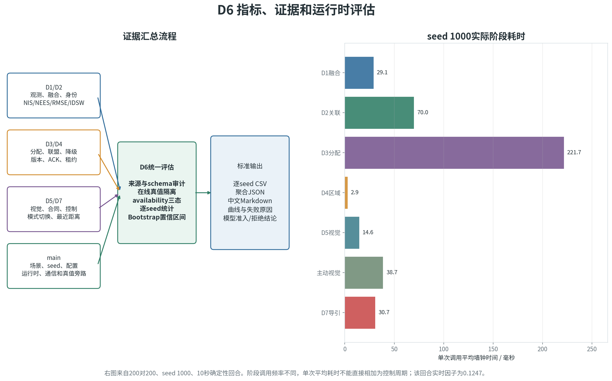

*图20 D6证据流和seed 1000实际模块阶段耗时。不同阶段调用频率不同，不能直接相加。*

### 18.2 感知与跟踪指标

有正确身份映射的航迹位置均方根误差：

\[
\mathrm{RMSE}_{pos}=
\sqrt{
\frac{1}{K}
\sum_{k=1}^{K}
\|\hat{\mathbf{p}}_k-\mathbf{p}_k^{truth}\|^2
}.
\]

归一化创新平方不需要真值，用于检查量测模型和协方差：

\[
\mathrm{NIS}_k=
\boldsymbol{\nu}_k^\mathsf{T}
\mathbf{S}_k^{-1}
\boldsymbol{\nu}_k.
\]

归一化估计误差平方需要真值：

\[
\mathrm{NEES}_k=
(\hat{\mathbf{x}}_k-\mathbf{x}_k^{truth})^\mathsf{T}
\mathbf{P}_k^{-1}
(\hat{\mathbf{x}}_k-\mathbf{x}_k^{truth}).
\]

身份指标至少包括：

- `id_switch_count`：同一真实目标映射的规范航迹编号变化次数；
- 航迹连续率：真实目标存在期间被同一航迹持续覆盖的时间比例；
- 虚假航迹数量与寿命；
- 重复航迹、错误合并和遮挡恢复时间；
- CLEAR MOT、OSPA、IDF1或HOTA等可选离线指标。

指标真值或映射不完整时必须标为不可用，不能填0。

### 18.3 分配与区域指标

- 高威胁需求满足率；
- 普通目标分配率和未分配原因；
- 多资源联盟完整率；
- 主用/备用越权计数；
- 总规则代价、跨区转移成本和能源代理；
- 重分配次数、成员变化、区域变更和计划抖动；
- 计划版本回退、过期计划接受和重复分配；
- 区域配额缺口、备用缺口和转移完成率。

学习策略必须与规则基线在相同初态、相同传感器随机流和相同故障时间表上配对，不能比较
两个不同场景的总分。

### 18.4 降级指标

- 中心故障检测时间；
- 二级就绪形成时间和接管时间；
- 主动降级正确率、误触发和漏触发；
- 控制权双主冲突；
- owner、代次、租约和版本不一致；
- 完全分布式共识轮数、消息量、冲突和联盟确认完成率；
- 中心恢复后双轨合并成功率。

主动降级必须有离线复核标签。中心计划仍有效时的二级辅助不能统计为接管成功。

### 18.5 视觉和主动视觉指标

- 检测召回、误检和框质量；
- 局部身份切换；
- 几何候选召回和跨视角边精确率/召回率；
- 匿名簇错误合并率；
- 中心全局航迹绑定正确率；
- 锁定、模糊、保持和重捕获分布；
- 首次锁定和遮挡后重捕获时间；
- 高威胁目标有效可见率；
- 单位带宽有效线索；
- 云台运动量、重复观察率和命令拒绝原因。

### 18.6 导引与物理指标

D6按以下漏斗分开统计：

```text
assigned
 -> active
 -> radar state available
 -> D5 visible
 -> associated
 -> locked
 -> contract allowed
 -> control allowed
 -> visual mode switched
 -> physical five-meter result
```

物理结果至少包括目标成功数、活动资源对成功数、联盟完成数、最近距离、首次进入五米时刻、
控制努力和峰值加速度。当前不要求多主资源同时到达。

### 18.7 200对200当前评估

随机种子1000只完成单回合描述性评估。当前可以确认：

- 状态有限；
- 在线真值使用为0；
- D1-D7模块均有在线发布；
- D3计划和绑定被运行时消费；
- 相机命令全部确认；
- 五米内唯一接近目标为0；
- 实时因子为0.1247。

单回合不能形成置信区间，也不能比较规则与学习收益。目标级身份、严格RMSE、NEES、区域
学习动作采用和主动视觉收益在该回合均不具备正式结论。

## 19. 程序运行架构

### 19.1 Episode状态机

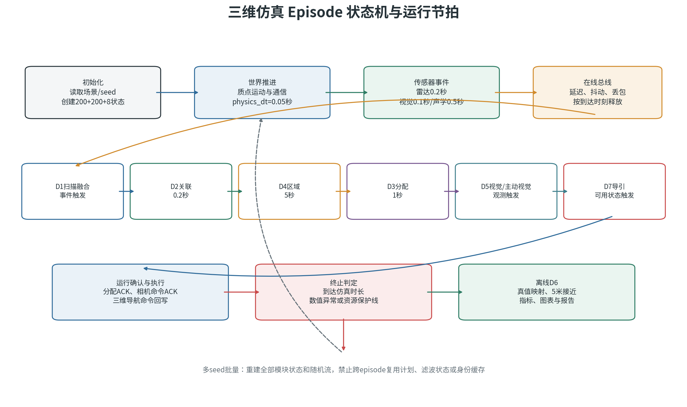

*图21 三维Episode状态机。各模块按自己的节拍或事件触发，不要求每个物理步全部运行。*

单个回合执行顺序为：

```text
读取场景配置和随机种子
  -> 创建目标、资源、侦察节点和区域
  -> 创建D1-D7模块实例并清空历史状态
  -> 按0.05秒推进三维世界
  -> 按传感器周期生成匿名观测
  -> 通信队列按到达时刻释放
  -> D1融合，D2关联
  -> 到期时运行D4区域建议和D3分配
  -> D5几何配准和主动视觉
  -> D7生成三维导航命令并回写世界
  -> 写入在线日志和离线真值侧车
  -> 回合终止后由D6联接和评估
```

多随机种子运行必须为每个回合重新创建规划器、滤波器、关联器、联盟状态、相机历史和导引
上下文。禁止跨回合复用全局航迹编号、前序计划或模型隐藏状态。

### 19.2 更新节拍

| 组件 | 名义节拍 | 触发方式 |
| --- | ---: | --- |
| 世界动力学 | 0.05秒 | 固定步长 |
| 雷达 | 0.2秒 | 周期 |
| 视觉 | 0.1秒 | 周期与主动视觉指向 |
| 声学 | 0.5秒 | 周期 |
| D1 | 观测到达 | 事件时间水位 |
| D2 | 0.2秒 | 周期和D1后验 |
| D3 | 1.0秒 | 周期、需求/资源/权威事件 |
| D4区域 | 5.0秒 | 周期、故障和风险事件 |
| D5 | 视觉帧到达 | 事件 |
| D7 | 状态与合同可用 | 控制节拍 |
| D6 | 回合后 | 离线 |

高频D1/D2/D5/D7和低频D3/D4必须使用状态有效时刻和版本联接，不能假定同一循环内数据天然
同步。

### 19.3 主运行时职责

main只做组合与编排：

- 场景创建、时钟和动力学；
- 传感器、通信和在线总线；
- D1-D7类型适配和调用顺序；
- 计划、相机和控制执行确认；
- 故障注入、回合重置和制品写盘；
- 离线真值隔离和D6入口。

模块算法仍由各D模块实现。main不能用仿真真实目标编号修补D1、D2或D5的在线结果。

### 19.4 当前代码映射

| 层 | 主要位置 | 当前职责 |
| --- | --- | --- |
| 三维世界 | `research_modules/scalable_3d_simulation/dynamics.py` | 质点状态推进和边界 |
| 场景与合同 | `models.py`、`runtime_ports.py`、`episode_bus.py` | 配置、在线批次和运行时端口 |
| 合成传感器 | `sensors.py`、`camera_projection.py` | 雷达、声学、视觉投影 |
| 通信 | `communication.py` | 时延、抖动、丢包和带宽 |
| 模块栈 | `module_stack.py` | D1-D7真值无关适配 |
| 编排 | `orchestrator.py` | 回合循环、状态回写和制品 |
| 学习运行 | `learning_runtime.py`、各D模块学习文件 | 默认关闭的模型加载、影子和回退 |
| 离线评估 | `offline_evaluation.py`、`d6_integration.py` | 真值联接、指标和报告 |

### 19.5 核心伪代码

```python
for tick in world_clock:
    world_state = dynamics.step(previous_commands)
    sensor_batches = sensors.generate(world_state, tick)
    communication.enqueue(sensor_batches)
    arrived = communication.release(tick)

    fused_tracks = d1.process(arrived)
    associated_tracks = d2.update(fused_tracks, tick)

    if region_policy_due(tick):
        regional_advice = d4.region_advice(
            associated_tracks, resources, communication_state
        )

    if assignment_due(tick) or replan_requested:
        assignment_plan = d3.plan(
            associated_tracks,
            resources,
            regional_advice,
            terminal_feedback,
            previous_plan,
        )

    terminal_associations = d5.associate(
        associated_tracks, camera_frames, assignment_plan, authority_state
    )
    camera_actions = d5.active_vision(
        associated_tracks, cameras, assignment_plan, communication_state
    )
    guidance_commands = d7.step(
        associated_tracks,
        assignment_plan,
        authority_state,
        terminal_associations,
    )

    runtime.apply_camera_actions(camera_actions)
    runtime.apply_guidance(guidance_commands)
    evidence_bus.publish_all()

d6.evaluate(online_records, offline_truth_sidecar)
```

伪代码只说明调用关系。实际实现按事件和不同节拍运行，不会在每个物理步强制执行全部模块。

## 20. 学习增强的统一安全外壳

四类学习能力共用以下规则。

### 20.1 输入检查

- 双时间戳、状态有效时刻和协方差完整；
- 计划、联盟和通信版本连续；
- 模型特征顺序、归一化、权重摘要和数据摘要匹配；
- 在线输入不含真值、actor或对象身份；
- 非有限、过期、缺失或分布外输入拒绝。

### 20.2 候选检查

- D3不可达边、失效资源、友方冲突和硬时间窗边先删除；
- D4只允许邻接、通信和机动可用的区域边；
- D5只允许不同相机、时间和几何门内的候选边；
- 主动视觉只从版本正确、机械可达的有限动作中选择。

### 20.3 动作投影

- D3残差幅度限制为 \(0.25\tanh(a)\)；
- D4区域转移不超过边容量和可释放资源；
- D5图概率仍受同相机互斥和中心绑定约束；
- 主动视觉动作受角速度、限位、视场、带宽和友方预留约束。

### 20.4 权威复核

学习输出不能改变：

- `global_track_id`所有权；
- D3需求槽、资源唯一性和计划版本；
- D4所有者、代次、租约和联盟提交；
- D5友方、重复锁定和末端状态机；
- D7导引合同和飞行控制安全门。

### 20.5 回退

模型不可用、超时、低置信、分布外、输出非法、连续拒绝或通信模式变化时，立即使用完整
规则代价、规则区域调度、几何边概率或确定性相机策略。回退原因写入D6。

## 21. 预期效果与当前结果

### 21.1 当前学习证据

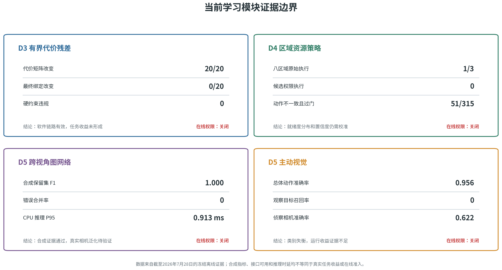

*图22 当前学习证据边界。模型接口和离线证据已形成，在线计划与控制权限仍关闭。*

| 能力 | 已完成 | 当前结论 |
| --- | --- | --- |
| D3有界代价残差 | 数据、模型、影子推理、确定性求解和回退 | 20/20改变代价，0/20改变绑定，未证明收益 |
| D4区域图策略 | 变长区域图、策略、补充数据和安全投影 | 分布外和动作一致性未闭合，实际采用0 |
| D5图神经网络 | 稀疏图、模型、冻结保留集和D6审计 | 合成图满分，真实相机泛化未验证 |
| D5主动视觉 | 规则示范、行为克隆、影子动作和回退 | 类别失衡，关键动作召回不足 |

### 21.2 期望改善

**区域强化学习。** 期望减少高威胁积压、跨区调动滞后和计划抖动，同时保持备用与通信
约束。主要对照是固定权重规则和确定性最小费用流，不是无调度基线。

**D3代价残差。** 期望在规则代价接近时保留高机动资源、减少短视换绑和改善多周期任务
成本。若最终绑定始终不变，则模型没有任务级作用。

**图神经网络。** 期望在密集交叉、相似运动、遮挡和多候选情况下减少错误合簇和身份切换。
候选召回不足或标定错误时不应期望模型恢复。

**主动视觉。** 期望提高高威胁目标有效可见率、缩短首次锁定和重捕获时间、减少重复观察
与无效带宽。模型不能补偿检测器完全漏检或相机分辨率不足。

### 21.3 不承诺的效果

当前不能承诺：

- 200个目标的实时因子达到1；
- 200个目标全部在五米内被拦截；
- 学习策略优于规则基线；
- 图神经网络在真实可见光和红外中达到冻结合成图满分；
- 二级节点在所有场景中形成全局视野和稳定接管；
- 多资源同时到达或完成协同避碰。

## 22. 实验设计

### 22.1 基线矩阵

每类场景至少20个未见随机种子：

1. 名义200对200；
2. 目标密集交叉；
3. 编队分裂和转弯；
4. 雷达延迟、漏检和虚警；
5. 相机遮挡、外参漂移和时钟偏差；
6. 高威胁多资源需求；
7. 资源失效和非等量200对160、160对200；
8. 中心失效、二级失效和网络分区；
9. 区域威胁突发和资源跨区不足；
10. 计算超时和通信带宽下降。

### 22.2 配对算法组

| 研究项 | 规则组 | 候选组 |
| --- | --- | --- |
| 区域调度 | 压力规则/最小费用流 | D4图策略+确定性投影 |
| 目标分配 | 规则代价+匈牙利 | 有界残差+同一匈牙利 |
| 跨视角配准 | 几何边概率 | 图网络边概率+同一聚类绑定 |
| 主动视觉 | 确定性观察/重捕/扫描 | 学习候选+同一云台投影 |
| 导引 | 当前三维PN | P2导引只做隔离对照 |

所有配对使用相同初态、传感器随机流、故障时刻和通信随机流。模型组必须记录实际采用，
不能把“模型成功加载”当作“动作已执行”。

### 22.3 建议验收条件

**共同安全条件：**

- 在线真值使用、全局航迹改写、过期计划接受、重复分配、备用越权和双主冲突均为0；
- 数值有限，所有拒绝有稳定原因；
- 模型失败全部回退规则路径。

**任务条件：**

- 高威胁需求满足率不低于规则组；
- 身份切换、错误合并和虚假航迹不恶化；
- 区域配额缺口、计划抖动、首次锁定或重捕获至少一项形成稳定改善；
- 200规模推理和完整路径满足预注册周期预算；
- 置信区间和失败原因支持结论，不按单个最佳种子晋级。

### 22.4 计算性能

当前seed 1000单次平均阶段耗时为：

| 阶段 | 平均耗时 |
| --- | ---: |
| D1融合 | 29.1毫秒 |
| D2关联 | 70.0毫秒 |
| D3分配 | 221.7毫秒 |
| D4区域建议 | 2.9毫秒 |
| D5终端配准 | 14.6毫秒 |
| D5主动视觉 | 38.7毫秒 |
| D7导引 | 30.7毫秒 |

调用频率不同，不能直接把这些平均值相加。完整回合墙钟80.198秒，仿真时长10秒。下一步
应分别测量观测生成、通信、模块发布、日志和D6写盘，形成端到端周期预算。

## 23. 实施阶段

### 23.1 第一阶段 确定性基线冻结

- 固定200对200三维场景、传感器和通信配置；
- 完成20个未见随机种子的D1-D7规则回合；
- 冻结在线JSONL、真值侧车、计划、相机、控制和D6 schema；
- 形成严格身份、区域、分配、降级、视觉和五米结果；
- 先达到数值稳定、身份安全和可复现，不以学习收益为目标。

### 23.2 第二阶段 规则性能和容量

- D1/D2使用空间索引、批量数值和有界历史；
- D3完成区域槽、稀疏候选和向量化代价；
- D5完成视锥索引、相机对预算和节点度治理；
- D6拆分计算、消息和写盘耗时；
- 在固定硬件上形成20、50、100、200规模曲线。

### 23.3 第三阶段 单学习模块影子

依次启动D3残差、D4区域策略、D5图网络和主动视觉，每次只开放一个影子模型。其余模块保持
规则，避免多个学习策略同时改变输入分布。每个候选先证明实际输出非空和安全，再讨论收益。

### 23.4 第四阶段 有限辅助

达到预注册门限后，仅允许：

- D3有界代价修正；
- D4有限区域配额建议；
- D5图边概率；
- 主动视觉有限候选选择。

最终计划、身份、联盟和导引仍由确定性合同决定。辅助阶段不执行在线探索训练。

### 23.5 第五阶段 AirSim与真实回放

- 在AirSim中用较小规模复核相机、坐标、遮挡、检测和SimpleFlight接口；
- 用真实可见光、红外、雷达和通信日志重新辨识噪声与时延；
- 将真实分布回灌三维场景生成器；
- 经过软件在环和硬件在环后再评估影子部署；
- 任何真实输入分布外情况保持规则回退。

## 24. 主要风险

### 24.1 实时性

当前200对200实时因子0.1247，D3集成分配、模块发布和D1融合是主要开销。学习推理本身并非
唯一瓶颈。通过降低传感器频率或删除审计字段可以得到更快数字，但会改变任务和安全口径，
不能作为主要优化手段。

### 24.2 身份误差放大

D1协方差过小、D2身份交换或D5错误高置信边都会向后影响分配和导引。学习模型可能放大上游
错误。所有模块必须保留不确定性、歧义和可用性，不能只传均值和单一置信度。

### 24.3 奖励偏差

只奖励平均拦截数会鼓励放弃困难高威胁目标；过度惩罚换绑会使旧计划失效后仍不调整；
只奖励可见率会持续观察容易目标。奖励必须分解高威胁、未满足、能量、抖动、身份、安全和
物理结果，并保留硬约束。

### 24.4 仿真到实装差异

质点动力学、合成雷达、针孔相机和独立噪声比真实系统简单。距离增大通常同时导致雷达角误差
增加、检测框变小、漏检上升和通信时延增长。训练随机化应保留这些相关性，不能把每项误差
独立均匀采样。

### 24.5 通信与分区

200架资源集中上传原始视频不可取。建议在相机节点完成检测、局部跟踪和轻量特征，只上传
候选、关键帧和证据摘要。中心、二级和完全分布式三种模式的信息量不同，应分别建立模型和
规则配置，不能直接复用中心全局观察策略。

## 25. 交付物

本方案对应的程序交付应包含：

1. 版本化200对200三维场景配置；
2. D1-D7统一Episode运行入口；
3. 确定性规则基线；
4. D3、D4、D5学习模型的默认关闭适配器；
5. 在线匿名日志和离线真值侧车；
6. 多随机种子运行脚本和断点恢复；
7. D6逐seed与聚合报告；
8. 图件生成脚本和证据清单；
9. AirSim小规模复核配置；
10. 模型准入、回退和版本治理说明。

## 26. 文件索引

### 26.1 综合资料

- `deliverables/background/200V200_强化学习与图神经网络能力增强综合方案.md`
- `deliverables/background/figures/200v200_learning_gnn/`
- `deliverables/background/figures/200v200_full_stack_3d/`

### 26.2 三维运行

- `research_modules/scalable_3d_simulation/README.md`
- `research_modules/scalable_3d_simulation/PLAN.md`
- `research_modules/scalable_3d_simulation/module_stack.py`
- `research_modules/scalable_3d_simulation/orchestrator.py`
- `research_modules/scalable_3d_simulation/configs/nominal_200v200.json`
- `research_modules/scalable_3d_simulation/docs/SCALABLE_3D_CAPACITY_AND_RUNTIME_REPORT_CN.md`

### 26.3 本文实际回合

- `research_modules/scalable_3d_simulation/outputs/200v200_learning_gnn_report_seed1000_20260728/summary.json`
- `research_modules/scalable_3d_simulation/outputs/200v200_learning_gnn_report_seed1000_20260728/scenario_config.json`
- `research_modules/scalable_3d_simulation/outputs/200v200_learning_gnn_report_seed1000_20260728/offline_truth_state.npz`
- `research_modules/scalable_3d_simulation/outputs/200v200_learning_gnn_report_seed1000_20260728/SCALABLE_3D_EPISODE_REPORT_CN.md`
- `deliverables/background/figures/200v200_full_stack_3d/d1_d3_3d_experiment_metrics.json`

### 26.4 模块依据

- `research_modules/d1_sensor_fusion/docs/ALGORITHM_AND_IMPLEMENTATION.md`
- `research_modules/d2_data_association/docs/ALGORITHM_AND_IMPLEMENTATION.md`
- `research_modules/d3_assignment_planner/docs/ALGORITHM_AND_IMPLEMENTATION.md`
- `research_modules/d4_distributed_fallback/docs/ALGORITHM_AND_IMPLEMENTATION.md`
- `research_modules/d5_terminal_association/docs/ALGORITHM_AND_IMPLEMENTATION.md`
- `research_modules/d6_evaluation_metrics/docs/ALGORITHM_AND_IMPLEMENTATION.md`
- `research_modules/d7_proportional_guidance/docs/ALGORITHM_AND_IMPLEMENTATION.md`
- `subagent_reviews/MAIN_IMPLEMENTATION_GAP_AUDIT.md`
- `subagent_reviews/D1_IMPLEMENTATION_GAP_AUDIT.md`至
  `subagent_reviews/D7_IMPLEMENTATION_GAP_AUDIT.md`

## 27. 结论

当前项目已经具备一套可运行的200对200三维确定性模块栈：异步观测可以进入D1，D2输出稳定
身份候选，D4形成区域和权威状态，D3发布200项版本化分配，D5处理几何配准和相机观察，
D7输出三维导航命令，D6保存在线真值隔离的评估证据。随机种子1000的10秒回合完成了规模化
接口闭环，尚未完成实时、严格身份和物理拦截验收。

强化学习和图神经网络已经具有数据、模型、影子推理、安全回退和部分冻结证据。D3残差尚未
改变正式保留集绑定；D4区域策略尚未形成实际采用；D5图网络只在合成候选图上通过；主动
视觉数据存在明显类别失衡。近期工作应先闭合确定性多种子基线和实时瓶颈，再逐个开放影子
候选。学习模型不应同时进入在线链路，也不应取得身份、权威或飞行控制权限。
