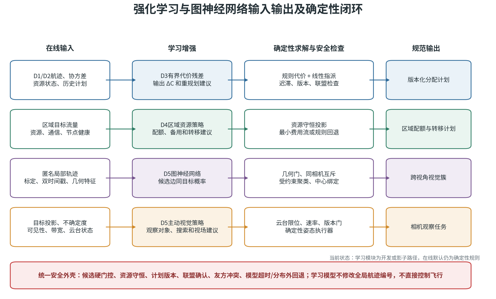
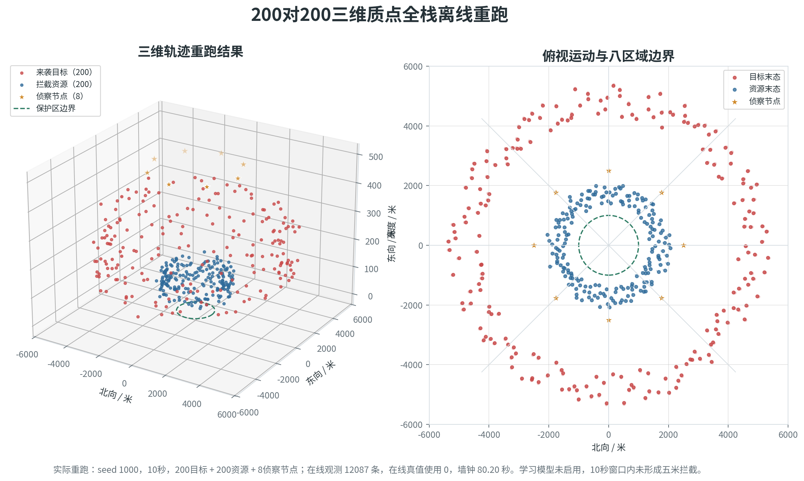
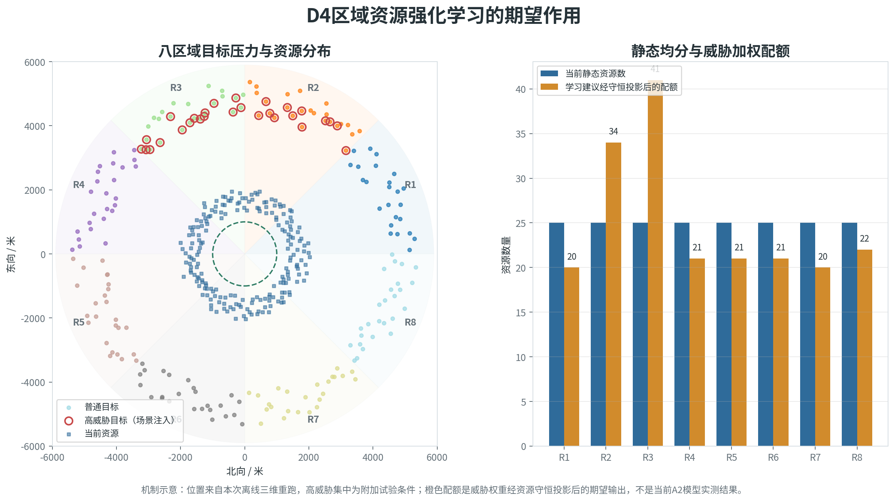

# 200对200强化学习与图神经网络能力增强综合方案

**资料截止日期：2026年7月28日**

本文合并说明200架拦截资源对200个来袭目标条件下的确定性基线、强化学习增强位置、
跨视角图神经网络、主动视觉、当前验证状态和实施边界。文中的结果均来自科研仿真、
离线重放或软件审计，不代表实飞性能。未获得真实相机、真实目标或物理闭环证据的能力
明确标为待验证。

## 1. 结论

200架拦截无人机对200个来袭目标的规模，没有使强化学习天然优于匈牙利算法。对标准
一对一分配，200乘200代价矩阵只有4万条边，成熟的线性指派求解器能够处理。当前项目的
独立D3基准中，经过向量化和稀疏候选优化后，200个目标、200个资源、6400条候选边可在
约85.4毫秒内完成200项分配。旧的逐边Python规则路径约为1904.3毫秒。性能差距主要来自
代价构造和解释信息物化，不是匈牙利求解本身。

强化学习的价值集中在三个方面：根据场景动态修正规则代价、考虑多周期资源保留、进行
区域级资源调度。它适合放在匈牙利算法之前形成有界代价修正，或放在更上层输出区域
配额和重规划建议。直接让强化学习输出200架资源的最终目标编号，会形成大动作空间、
约束难满足和结果难解释等问题，现阶段不适合作为主线。

D5跨视角配准中的图神经网络具有明确的研究价值。现有几何方法能处理标定准确、时间
同步、候选唯一的场景；目标密集、遮挡、视角差异和多个候选同时成立时，图神经网络
可以联合使用节点、边和邻域上下文，学习非线性同目标概率。但图网络不能恢复被几何门
提前删除的正确候选，也不能替代相机标定、时间同步和检测器。

当前D5冻结证据使用20个未见随机种子、45个场景规模单元和900个匿名候选图帧，
包含13344个局部航迹节点与74024条候选边。模型在该组合成保留集上的精确率、召回率和
F1均为1.0，错误合并率为0，中央处理器推理P95为0.913毫秒；最高单特征曲线下面积为
0.720073，低于预设的0.98捷径上限。D6外部审计和装配后审计均通过。该结果仍不能外推
为真实相机泛化、中心航迹绑定正确率或物理拦截能力，因此图模型辅助、在线身份权限和
控制权限保持关闭。

D5主动视觉强化学习用于选择观察目标、搜索扇区、云台动作和视场模式。它不负责目标
身份绑定，也不直接输出飞行控制。现有1153242条行为克隆样本存在明显类别不平衡，
`reacquire`占主导，`observe_target`召回率为0，侦察相机精确动作准确率约0.621823。
这套链路已具备数据、模型、影子建议和失败回退接口，但尚未证明可见率、重捕获时间或
后续配准质量得到改善。

面向当前项目，建议保持以下主线：

```text
硬约束和候选门控
        ↓
规则代价或几何相似度
        ↓
学习模型给出有界修正或同目标概率
        ↓
匈牙利、最小费用流或受约束聚类
        ↓
迟滞、版本、联盟、友方冲突和机动能力检查
        ↓
规则回退或版本化执行计划
```



*图1 强化学习与图神经网络增强体系。该图说明各算法的输入、输出和确定性安全边界，属于体系结构示意。*

本文图件按证据性质分为三类。图2来自本次200对200离线重跑，是实际仿真输出；图10汇总
项目已经冻结的离线证据；其余图件用于说明体系结构、算法原理或期望作用，不是学习模型
收益的实测结果。图5、图7、图8、图9和图11复用离线位置时，只把实际空间几何作为底图，
区域配额、转移箭头、相机变换、遮挡、威胁集中或学习动作均为受控示意。

## 2. 当前方案

### 2.1 未使用强化学习时的分配方法

当前D3采用“规则代价、稀疏候选、匈牙利求解、迟滞发布”的确定性方案。

规则代价综合以下信息：

- 预计接近时间、闭合速度和拦截时间窗口；
- D1、D2输出的航迹位置、速度和协方差；
- 目标威胁度和多机需求槽位；
- 资源位置、速度、能量、可用性、负载和历史失败率；
- 相机视场难度、末端视觉状态和D5反馈；
- 友方冲突、重复分配和不可达边；
- 计划换绑惩罚、最小驻留时间和重分配迟滞。

一对一任务使用科学计算库SciPy中的`linear_sum_assignment`线性指派求解器。该实现属于改进的Jonker-Volgenant路线，项目文档沿用“匈牙利算法”作为线性指派基线的统称。目标与资源数量不相等时增加未分配虚拟列。高威胁目标需要多架资源时，D3先把任务展开为主机、备用机和波次需求槽，再使用需求槽线性指派求解，并在求解后执行联盟完整性检查。资源不足时不发布不完整联盟为可执行计划。

动态场景中还使用两类补充机制：

1. 保守增量规划只重解与变化目标、资源连通的候选分量。需求、版本或全局约束变化时回退全量求解。
2. D4在中心失效时优先使用二级节点，二级节点失效后使用拍卖或基于共识的分布式保底方法。该路径解决控制权和通信退化，不替代中心正常时的匈牙利分配。

### 2.2 未使用图神经网络时的跨视角配准方法

当前D5默认路径以中心全局航迹和相机几何为主：

1. 将D1、D2的六维全局航迹按量测时间预测到每个相机。
2. 使用相机内参、外参和针孔模型投影到图像平面，并通过雅可比传播像素协方差。
3. 当前AirSim在线主线以`simGetDetections`输出的匿名检测框为输入，结合卡尔曼外推、框交并比和稳定窗口形成相机内局部轨迹。YOLO、ByteTrack和BoT-SORT适配器已经接线，但真实多随机种子准入尚未通过，不能视为默认在线能力。
4. 跨相机候选依次通过时间窗、视场、极线、射线交会、重投影、像素马氏距离、框尺度、角速度和类别门限。
5. 使用匈牙利算法完成一对一候选选择，经过连续帧稳定窗口后汇总跨视角支持。
6. 匿名视觉簇只能绑定到中心输入中已有的全局航迹编号，D5不能创建、改写或换绑全局航迹编号。

该方案可解释、容易失败关闭。它对外参误差、时间偏差、候选门限和检测召回较敏感。多个候选同时落入门内时，逐边规则难以利用整个多相机候选图的上下文。

## 3. 匈牙利算法在200对200条件下的表现

### 3.1 计算规模

标准线性指派问题为：

\[
\min_x \sum_{i=1}^{N}\sum_{j=1}^{M} C_{ij}x_{ij}
\]

其中每个资源最多选择一个目标，每个目标最多选择一个主资源。匈牙利类算法的典型复杂度为三次量级。200阶问题远低于现代线性指派求解器的能力上限。4万项浮点代价矩阵的内存也很小。

项目现有证据如下。

| 试验 | 输入 | 结果 | 解释 |
| --- | --- | ---: | --- |
| 200对200功能样本 | 每目标保留4条候选，共800条动作 | 200/200完成分配，单次约0.621秒 | 单样本，无预热和置信区间 |
| 旧参考路径 | 4万条Python逐边规则，保留6400条候选 | 中位1904.3毫秒 | 代价和完整解释逐边构造 |
| 向量化稀疏路径 | 规则特征向量化，6400条候选 | 中位85.4毫秒，200/200分配 | 比旧路径快22.3倍 |
| 规模化集成早期测量 | D1至D7统一episode | D3累计约1970.7毫秒 | 包含当时尚未完成的前处理优化，不能与独立85.4毫秒直接等同 |

这些结果表明，200对200的第一性能问题是候选生成、规则代价、Python对象创建和审计数据写出。用强化学习替换匈牙利求解器无法自动消除这些开销。先完成特征向量化、空间索引、候选稀疏化和局部增量重解，收益更确定。

### 3.2 分配质量

匈牙利算法对给定代价矩阵给出全局最优的一对一匹配。其质量上限由代价函数和候选集合决定。规则代价准确时，强化学习很难取得稳定优势；规则代价没有表达未来资源价值时，匈牙利仍会精确求出一个短视方案。

当前200对200名义样本已得到200项分配，但不能证明以下困难条件已经闭合：

- 密集交叉和编队分裂中的身份不确定性；
- 唯一高速或高续航资源的提前保留；
- 高威胁目标多机需求与普通目标竞争；
- 新目标出现、资源失效和通信分区；
- 多周期能量、位置和后续任务价值；
- D5视觉模糊反馈引起的持续重规划。

因此，匈牙利算法适合作为200对200的默认求解器。它不能单独承担威胁预测、未来资源价值估计和区域调度。

### 3.3 200对200离线重跑

2026年7月28日按名义200对200配置重新运行三维质点集成环境，随机种子为1000。该回合
启用了D1至D7确定性模块栈，没有启用D3代价残差、D4区域资源策略、D5图神经网络或主动
视觉学习模型。离线真值只用于轨迹绘图和D6评估标签，在线模块读取次数为0。

| 项目 | 本次结果 |
| --- | ---: |
| 场景 | 200个目标、200个拦截资源、8个侦察节点 |
| 仿真时长 | 10.0秒 |
| 在线观测 | 12087条 |
| 雷达观测 | 9608条 |
| 视觉观测 | 2479条 |
| 分配计划确认 | 10次 |
| 绑定及控制确认 | 1978次 |
| 相机指令下发/执行 | 18928/18928次 |
| 状态数值有效 | 是 |
| 在线真值使用 | 0次 |
| 墙钟运行时间 | 80.198秒 |
| 实时因子 | 0.1247 |
| 五米内拦截目标 | 0个 |

目标初始距场景中心约4328至5399米，拦截资源初始距中心约1304至1994米。10秒时长不足以
形成五米物理接近，因此本次结果只证明200对200状态推进、在线观测、模块接口、分配确认
和相机指令链路能够完成一轮规模化运行。它不证明强化学习、图神经网络或物理拦截收益。



*图2 200对200三维质点离线重跑。轨迹和统计来自随机种子1000的确定性基线回合。*

## 4. 强化学习的适用位置

### 4.1 D3代价修正

推荐保持以下结构：

\[
C_{ij}^{final}=C_{ij}^{rule}+\alpha\tanh(\Delta C_{ij})
\]

当前D3学习接口采用稀疏候选边，不构造固定的200乘200神经网络动作头。每个规划时刻只保留通过可达性、能力和版本检查的候选边，观察量为：

\[
O_t\in\mathbb{R}^{E_t\times 12}
\]

其中，\(E_t\)为当前时刻的有效候选边数，可随目标数量、资源数量和门控结果变化。12维特征均来自在线可获得数据，不含仿真真值。

| 序号 | 候选边特征 | 作用 |
| ---: | --- | --- |
| 1 | 规则总代价压缩值 | 保留当前确定性代价的总体排序 |
| 2 | 目标威胁度 | 区分普通目标与高威胁需求 |
| 3 | 拦截窗口代价 | 表示预计到达和任务窗口匹配程度 |
| 4 | 协方差代价压缩值 | 表示航迹不确定性和预测风险 |
| 5 | 可达性代价压缩值 | 表示速度、距离和机动能力约束 |
| 6 | 区域代价压缩值 | 表示跨区机动和区域负载 |
| 7 | 资源状态代价压缩值 | 表示能源、可用性和当前任务状态 |
| 8 | 视场代价压缩值 | 表示末端视觉获取难度 |
| 9 | 冲突代价压缩值 | 表示友方、重复分配和安全冲突风险 |
| 10 | 需求资源数量 | 表示该目标所需的总资源槽位 |
| 11 | 主拦截资源数量 | 表示联盟中的主资源需求 |
| 12 | 前序绑定标志 | 表示该边是否属于上一版计划 |

策略对每条有效边输出连续残差\(a_{ij}\)，名义范围为\([-2,2]\)。当前默认缩放系数\(\alpha=0.25\)，实际送入确定性求解器的代价为：

\[
C_{ij}^{final}=C_{ij}^{rule}+0.25\tanh(a_{ij})
\]


*图3 D3代价残差与确定性分配。图中小规模矩阵用于解释有界残差改变候选排序的机制，不代表当前正式保留集已经改变最终绑定。*

这一设计把单条边的最大修正限制在约0.25以内。学习模型可以改变候选排序，不能生成被硬门删除的边。策略还预留 `neutral`、`hold` 和 `replan` 三种低频建议，每5个规划帧允许输出一次。当前离线评分器只对 `hold` 实现了与保持旧计划不同的处理；`replan` 尚未对应独立的环境状态转移，因此不能据此声称已学会重规划时机。

当前原生近端策略优化接口使用以下离线评分：

\[
R=2H-0.05C-2U-0.5Q-2X-2S
\]

其中，\(H\)为高威胁需求覆盖率，\(C\)为所选边的原始规则成本与未分配惩罚之和，\(U\)为未满足需求槽数，\(Q\)为相对上一计划的换绑量，\(X\)为计划过期指示量，\(S\)为安全拒绝数。该评分在同一帧内将候选动作送回确定性求解器后计算，属于离线反事实近似。它没有包含动作执行确认、下一时刻真实状态、D5末端关联结果、D7导引结果和物理接近结果，也没有因果归因。现阶段只能用于算法开发，不能作为在线策略有效性的正式回报。

规则代价继续表达明确工程约束，学习模型只输出有界修正。不可达、版本冲突、友方冲突和资源容量通过确定性掩码删除。最终匹配仍由匈牙利或最小费用流完成。

该方法可能改善：

- 在目标接近保护区前保留高机动资源；
- 根据任务阶段改变时间、能量、威胁和视觉质量的相对权重；
- 识别固定权重下容易反复换绑的状态组合；
- 在资源失效、新目标出现和非等量任务中改善候选排序；
- 根据后续几秒的累计收益选择保持或重规划。

它不会改变：

- 匈牙利算法的一对一可行性；
- 多机需求槽和联盟原子提交；
- 计划版本、迟滞和过期计划拒绝；
- D5身份门和D7导引授权。

### 4.2 不使用强化学习的区域调度

区域调度可以完全采用规则、预测和组合优化实现。强化学习在该层不是必要条件。当前
项目已经有可运行的D4规则策略和确定性安全投影；更完整的确定性方案还可以增加区域需求
预测、最小费用流和滚动时域规划。两者应作为学习策略的正式对照基线。

#### 4.2.1 当前规则基线

当前D4先对每个区域计算资源压力。设区域 \(r\) 的目标需求为 \(d_r\)，高威胁积压为
\(h_r\)，D1和D2不确定度为 \(u_r^{D1}\) 和 \(u_r^{D2}\)，D5可见率和一致性为
\(v_r\) 和 \(c_r\)，丢包率为 \(l_r\)，通信时延为 \(\tau_r\)，可用和备用资源为
\(a_r\) 和 \(b_r\)。现有规则压力为：

\[
P_r=
\frac{
d_r+2h_r+
0.5\left(u_r^{D1}+u_r^{D2}+1-v_r+1-c_r\right)
+l_r+\min(1,\tau_r)
}{
\max(1,a_r-b_r)
}
\]

该式提高高威胁积压、感知不确定、视觉质量下降和通信退化区域的优先级，同时用可调资源
数量对压力归一化。当前区域缺口计算为：

\[
G_r=
\max\left[
0,
\left\lceil d_r+2h_r\right\rceil-
\max(0,a_r-b_r)
\right]
\]

D4只检查相邻且允许通信、允许机动、没有网络分区的区域边。当目标区域与来源区域的压力
差大于0.05时形成转移候选，并按压力差从大到小处理。一次转移数量取以下三项的最小值：

\[
n_{rs}=\min
\left(
B_r,\ G_s,\ C_{rs}
\right)
\]

其中 \(B_r\) 是来源区域扣除已承诺资源和最低备用量后的可转移预算，\(G_s\) 是目标区域
剩余缺口，\(C_{rs}\) 是区域边容量。当前最低备用比例为10%，且每个区域至少保留1个备用
资源。已经承诺给有效计划或联盟的资源不能被区域规则移出。

该方法计算量小、原因可追溯，适合作为失败回退。它属于按压力排序的邻区贪心转移，不是
全局最小费用流。多个区域同时竞争同一来源资源、目标需要跨越多条区域边或需要考虑未来
多周期成本时，贪心结果不保证全局最优。

#### 4.2.2 完整确定性架构

不使用强化学习的完整方案采用两级优化：

```text
D1、D2航迹和协方差，D5可见率，D4控制权状态
                         ↓
预测未来时间窗内各区域目标需求
                         ↓
计算区域配额、最低保障量和全局备用量
                         ↓
区域最小费用流确定各区域之间转移多少资源
                         ↓
线性指派选择具体调动的无人机
                         ↓
D3在区域内分配具体目标和多机需求槽
                         ↓
迟滞、版本、租约、联盟和运行确认
```

区域层回答“每个区域需要多少资源、从哪些区域调入多少资源”。资源选择层回答“具体调动
哪几架无人机”。D3目标层回答“每架无人机拦截哪个目标”。三层职责分开后，区域求解器
不需要处理像素配准、末端导引或具体飞行控制。


*图4 不使用强化学习的区域调度流程。冷启动可以执行资源到区域槽位的全量指派，滚动运行只优化可释放资源；两种路径共用确定性安全约束。*

#### 4.2.3 区域需求和配额

使用长度为 \(H\) 的滚动预测时间窗。目标 \(j\) 在时间窗内进入区域 \(r\) 的概率为
\(p_{jr}(H)\)，该目标需要的资源数量为 \(k_j\)，威胁和紧迫系数为 \(s_j\)。区域预测
需求可写为：

\[
D_r(H)=\sum_j p_{jr}(H)\,k_j\,s_j
\]

区域配额为：

\[
q_r=
\max\left(
q_r^{min},
\left\lceil D_r(H)\right\rceil+b_r^{reserve}
\right)
\]

其中 \(q_r^{min}\) 是区域最低保障量，\(b_r^{reserve}\) 是备用量。\(p_{jr}(H)\)不能只
根据航迹均值计算。目标协方差跨越区域边界时，应按预测分布把需求概率分配到多个相邻
区域。高威胁目标需要三架资源时，\(k_j=3\)，其需求在区域配额中自然形成三个资源需求。

如果全部区域配额小于可用资源总数，剩余资源进入全局备用池。如果配额总和超过资源总数，
不能按比例平均削减。应先满足高威胁和最短到达窗口需求，再按威胁、预计到达时间和最低
保障量分配剩余资源，同时显式记录未满足需求。

#### 4.2.4 资源到区域的代价

资源 \(i\) 调往区域 \(r\) 的确定性代价采用统一归一化分项：

\[
C_{ir}^{region}
=G_{ir}
+w_T\hat T_{ir}
+w_E\hat E_{ir}
+w_M\hat M_{ir}
+w_P\hat P_{ir}
+w_C\hat C_{ir}
+w_S\hat S_{ir}
-w_D\hat D_{ir}
\]

其中：

- \(G_{ir}\)是硬门。无法按时到达、能源不足、区域不兼容、通信不可用或资源已被不可
  中断任务占用时取无穷大，否则取0；
- \(\hat T_{ir}\)是到达区域预置点或候选拦截窗口的预计时间；
- \(\hat E_{ir}\)是跨区机动能耗和到达后的剩余续航风险；
- \(\hat M_{ir}\)是速度、升限、传感器、载荷和任务角色不匹配程度；
- \(\hat P_{ir}\)是航迹协方差、漏检、视觉覆盖不足和预测失效风险；
- \(\hat C_{ir}\)是通信时延、丢包、带宽和控制节点不可用风险；
- \(\hat S_{ir}\)是离开当前区域、打断任务、近期已换区和计划抖动的惩罚；
- \(\hat D_{ir}\)是资源对区域缺口、高威胁积压和最短到达窗口的边际补偿收益。

\(\hat D_{ir}\)是收益，所以在最小化代价时使用负号。其他分项均为非负成本。连续分项可
根据独立规则校准场景进行0至1归一化：

\[
\hat z=
\operatorname{clip}
\left(
\frac{z-z_{min}}{z_{max}-z_{min}+\epsilon},
0,1
\right)
\]

权重由场景试验和敏感性分析确定，并随配置版本发布。不能在同一批测试数据上反复调权后
再把该批数据作为独立验证结果。

#### 4.2.5 区域求解方式

冷启动时，可以把区域配额展开为区域资源槽位。若8个区域的示例配额为：

```text
[20, 34, 41, 21, 21, 21, 20, 22]
```

则R1展开20个槽位，R2展开34个槽位，依次形成200个槽位。200架资源与200个区域槽位构成
200乘200代价矩阵。线性指派求解器为每架资源选择一个区域槽位。槽位是区域编制名额，
不是目标编号或物理航点。若需要保留20架全局备用资源，则建立180个区域槽位和20个备用
槽位。

滚动运行更适合先解区域最小费用流。设区域 \(r\) 当前可用于区域调度的资源为 \(N_r\)，
目标配额为 \(q_r\)，区域边允许的转移量为 \(C_{rs}\)，未满足配额为 \(u_r\)。求解：

\[
\min_{f,u}
\left[
\sum_{(r,s)}c_{rs}f_{rs}
+\sum_r p_ru_r
\right]
\]

满足：

\[
0\le f_{rs}\le C_{rs},\qquad
N_r+\sum_s f_{sr}-\sum_s f_{rs}+u_r=q_r,
\qquad
0\le u_r\le\max(0,q_r-N_r)
\]

其中 \(p_r\) 是区域缺口惩罚，高威胁区域取更大值。资源充足时令 \(u_r=0\)；资源不足
时保留 \(u_r\) 才能显式记录未满足需求。配额总和小于资源总数时增加一个全局备用虚拟
区域吸收剩余资源。上述节点流量守恒也允许资源经过中间区域转移。区域流只决定每条区域
边转移多少架。得到转移数量后，再建立“可释放无人机到目标区域
槽位”的稀疏代价矩阵，使用线性指派选择具体资源。这样不必每次让全部200架资源重新
竞争。当前项目的OR-Tools最小费用流仍是可选对照接口，默认确定性目标分配继续使用
SciPy线性指派。

资源到达区域后，D3把普通目标展开为一个主资源槽，高威胁目标展开为多个主资源和备用
资源槽，再在区域授权、可达性和身份门内执行稀疏线性指派。区域配额不能绕过D3的多机
联盟完整性、友方冲突和版本检查。


*图5 确定性区域调度三维场景。目标、资源和侦察节点位置来自离线重跑中间帧；配额按目标数量重算，区域边界和绿色转移箭头为机制示意，并非该回合实际执行记录。*

#### 4.2.6 滚动重规划和稳定性

确定性区域调度不应每个周期重排全部资源。每次更新先把资源分为三类：

1. 有效计划中的已承诺资源保持锁定，除非目标丢失、资源故障或计划硬失效。
2. 空闲、任务完成和过剩区域中的可释放资源进入候选集。
3. 能源不足、通信不可用或不满足机动条件的资源退出候选集。

新区域方案只有在旧方案不可行，或者新方案收益超过迟滞门且满足最小驻留时间时才发布。
还应限制每周期最大跨区数量、单架资源单位时间内最大换区次数和全局计划换绑预算。突发
高威胁目标、资源故障、中心失效和租约到期属于硬事件，可以绕过普通成本迟滞，但仍不能
绕过身份、联盟和控制权检查。

建议按不同频率运行各层：区域需求与跨区调度使用低频滚动周期，区域内D3目标分配使用
较高频率，D1和D2继续按传感器与跟踪周期更新。具体频率需要根据目标速度、通信时延和
处理器实测时间标定，不在当前软件结果中预设为实装指标。

#### 4.2.7 降级执行

规则区域策略不能自行决定控制权。D4先根据中心、二级节点、区域通信和联盟确认形成正式
区域控制权裁决，再允许合法所有者计算区域资源建议：

- 中心正常时，由中心维护全局区域配额和跨区计划；
- 中心失效时，由具备覆盖和租约的二级节点管理其授权区域；
- 中心和二级节点均失效时，各分布式区域只使用本地可见状态和已确认邻区信息；
- 网络分区、联盟确认不完整或所有者冲突时保持当前安全计划，不发布跨区执行建议。

每份建议携带快照、计划、所有者、区域层级、版本、代次和租约。D3消费前再次检查来源
计划和资源守恒，main记录运行确认。旧版本、过期租约、重复消费和控制权变化均失败关闭。

#### 4.2.8 当前能力和局限

当前已经实现区域压力规则、相邻区域转移、备用和已承诺资源保护、确定性投影、版本化
建议以及D3区域提示消费合同。全局区域需求预测、正式区域最小费用流和多周期滚动优化
仍属于确定性增强方案，不应写成当前默认能力。

确定性方案的主要不足是模型误差和权重维护。未来威胁、稀缺资源价值和多周期耦合没有
进入预测或代价时，求解器会准确得到一个短视方案。可以通过10至30秒滚动预测、鲁棒
协方差成本、全局备用池、高机动资源保留、场景分档权重和模型预测控制缓解。若这些方法
已经在独立多随机种子中稳定满足高威胁任务，强化学习没有进入在线主线的必要。

#### 4.2.9 验证方法

确定性方案应在相同初态和随机种子下依次比较当前压力贪心、区域槽位线性指派、区域最小
费用流和滚动时域方案。D6至少记录高威胁需求满足率、全部配额缺口、未分配目标数量、
跨区资源数量、累计转移时间、预计能耗、计划换绑次数、区域备用裕度、通信负载和每周期
求解时间。重复资源占用、旧版本采用、错误所有权、承诺资源越权转移和全局航迹编号改写
必须为0。

性能结论需要覆盖目标流量突变、资源失效、中心失效、二级接管、完全分布式、通信分区和
资源不足场景。确定性滚动方案只有在独立多随机种子中相对当前贪心基线降低高威胁缺口，
且不增加安全违规和不可接受的计划抖动时，才适合替换现有规则回退。具体收益门限应根据
场景库和计算平台标定，当前不写成已达到指标。

### 4.3 强化学习在区域调度中的优势

强化学习的优势不在于替代线性指派求解器，也不在于200阶矩阵计算更快。它主要用于估计当前调动对未来多个周期的影响，并处理难以用固定权重表达的状态依赖关系。

第一项优势是未来资源价值。高速、长续航或高性能传感器资源具有稀缺性。强化学习可以从连续任务中学习何时保留这些资源，何时提前向潜在高威胁区域机动，以及何时接受当前局部代价以换取后续任务能力。规则方法也能表达这些要求，但通常需要准确的未来模型和大量人工约束。

第二项优势是动态权重。同一组区域代价权重很难同时适应资源充足、能源紧张、通信退化、航迹不确定和高威胁突发等状态。学习策略可以根据全局状态修正规则代价、区域配额和备用比例。例如资源充足时优先缩短到达时间，能源不足时提高续航权重，航迹不确定时增加备用量，通信退化时降低跨区转移幅度。

第三项优势是主动预置。确定性单周期分配通常响应已经形成的区域缺口。强化学习可以根据目标流量、进入方向、历史队形和资源恢复时间，提前给出低频区域转移建议。该能力只有在训练环境能够覆盖真实变化规律时才成立；场景生成器存在固定模式时，模型可能只记住仿真规律。

第四项优势是多周期耦合。一次跨区调动会同时改变剩余能源、通信覆盖、二次分配能力、多机联盟形成和末端视觉接管条件。强化学习能够用累计回报近似这些长期影响，减少把所有未来因素手工压缩进单帧代价的难度。

第五项优势是策略推理成本稳定。完成训练后，区域配额或代价残差可以通过一次前向推理生成。当前项目的D3影子模型已经证明200规模推理耗时不是首要障碍。该结果只证明运行可行，不代表任务收益；现有行为克隆在规则成本、需求满足和重分配抖动上尚未优于规则路径。

区域强化学习适合输出以下低风险动作：

- 各区域下一周期建议资源配额；
- 全局和区域备用资源比例；
- 邻接区域之间允许转移的资源数量；
- 规则代价的有界修正；
- 保持现计划或请求重规划的低频建议。

具体资源编号和目标编号仍由线性指派、最小费用流或约束规划确定。飞行时间、能源、通信链路、联盟版本、计划有效期和最低备用量继续由确定性规则检查。

强化学习只有在以下条件同时出现时才可能形成稳定优势：目标流量变化快、资源明显稀缺、当前决策影响后续多个周期、固定权重在不同场景中持续失效，并且具备覆盖故障与通信退化的训练数据。场景规律固定、资源充足、区域划分稳定时，规则区域调度通常更可靠，学习模型可能增加训练、审计和回退成本而不带来收益。

### 4.4 区域划分与资源强化学习设计

当前D4学习模块使用上游给定的固定区域和邻接关系，不让策略直接改变地理边界。学习
对象是区域资源配额、邻区转移、备用比例、侦察优先级和重规划建议。区域合并、拆分和
原子网格边界移动尚未实现。这样可以先验证资源调度收益，不同时改变通信拓扑、计划
所有权和指标口径。

#### 4.4.1 观察空间

D4把每个区域表示为节点，把允许跨区机动且具备通信关系的相邻区域表示为边。双向邻接
边在策略输入中展开成两个有向边。当前节点为24维，边为7维，区域数量和边数量均可变。

| 观察对象 | 当前输入 | 维数 |
| --- | --- | ---: |
| 需求与感知 | 目标需求、高威胁积压、D1不确定度、D2不确定度、D5可见率、D5一致性 | 6 |
| 区域资源 | 可用资源、备用资源、已承诺资源，均按全局资源总数归一化 | 3 |
| 二级节点与通信 | 二级覆盖率、二级就绪度、通信容量、通信时延、丢包率 | 5 |
| 控制权与安全 | 中心/二级/分布式/保持层独热编码、租约剩余时间、联盟确认、所有者有效、故障隔离 | 8 |
| 异常状态 | 分配冲突比例、降级失败标志 | 2 |
| 区域转移边 | 可转移资源比例、距离、转移时间、带宽、通信可用、机动可用、网络分区 | 7 |

距离、时间、容量和不确定度使用对数压缩；资源数量按当前总资源数归一化。在线快照不携带
目标真值编号、目标真实位置或未来结果。当前网络没有独立的全局观察向量，价值头和置信
度头通过所有区域隐状态的均值池化获得全局摘要。未来若补充目标流量预测、资源能源分布
和全局计算负载，需要升级特征规范并重新生成训练与保留数据，不能直接塞入现有模型。

图策略默认使用64维隐状态和两轮消息传递。节点编码器提取区域状态，边编码器提取转移
条件，相邻节点通过边交换信息。网络同时输出动作均值、动作方差、状态价值和整图置信度。
区域数量从2、5或8变化时可以复用同一组参数，不需要建立固定长度的200资源动作头。

#### 4.4.2 动作空间

当前每个区域节点输出5维动作，每条有向转移边输出1维动作：

| 动作 | 输出和转换 | 实际作用 |
| --- | --- | --- |
| 区域配额增减 | 训练目标中按区域可用资源归一化 | 表示该区域下一周期应增加或减少的资源 |
| 备用比例 | 经逻辑函数压缩到0至1 | 建议该区域保留的资源比例 |
| 侦察优先级 | 经逻辑函数压缩到0至1 | 建议二级侦察节点和相机资源的关注程度 |
| 保持 | 概率不低于0.5时为真 | 保持当前区域计划，不主动换绑 |
| 请求重规划 | 概率不低于0.5时为真 | 请求D3或当前合法控制节点生成后继计划 |
| 邻区转移比例 | 每条有向边经双曲正切压缩并截断为非负 | 转换为该边建议转移的整数资源数量 |

当前运行推荐器不独立执行节点配额头。它先根据边动作计算各有向边的资源转移数，再按
流入减流出汇总各区域配额变化：

\[
\Delta q_r=\sum_{e:\,e\rightarrow r}n_e-\sum_{e:\,r\rightarrow e}n_e
\]

边动作 \(z_e\) 转为资源数量的计算为：

\[
f_e=\max(0,\tanh z_e),\qquad
n_e=\min\left(c_e,\operatorname{round}(f_ec_e)\right)
\]

其中 \(c_e\) 是该边允许转移的最大资源数。这一处理使配额变化来自明确的邻区转移，
总量可以由确定性投影器复核。学习策略不输出具体无人机编号、具体目标编号和新的
`global_track_id`。具体调动哪架无人机由后续最小费用流或线性指派决定；进入区域后，
D3继续执行资源到目标及多机需求槽的分配。

#### 4.4.3 奖励函数

当前项目已经冻结第一版区域观测回报合同。它把8项非负成本分别按证据中声明的分母归一化：

\[
\bar c_k=\min\left(\frac{c_k}{d_k},1\right)
\]

再计算加权成本和奖励：

\[
J_t=\frac{\sum_k w_k\bar c_k}{\sum_k w_k},
\qquad r_t=-J_t
\]

| 成本项 | 权重 | 含义 |
| --- | ---: | --- |
| 高威胁积压 | 3.0 | 结果窗口内仍未得到资源覆盖的高威胁需求 |
| 配额满足缺口 | 2.0 | 实际区域资源与建议配额之间的缺口 |
| 转移完成缺口 | 1.0 | 已建议但未在结果窗口内完成的跨区转移 |
| 备用资源缺口 | 2.0 | 低于区域最低备用要求的程度 |
| 通信负载 | 0.5 | 调度引起的区域通信占用 |
| 分配冲突 | 3.0 | 重复占用、计划冲突和联盟冲突 |
| 降级失败 | 5.0 | 中心、二级或分布式接管未形成合法执行状态 |
| 计划抖动 | 1.0 | 短时间内反复换区、换绑或重规划 |

八项权重之和为17.5。全部归一化成本为0时奖励为0，成本增加时奖励向负方向变化。该定义
避免目标数量从20增加到200后仅因规模变大而产生更大的回报绝对值。过期版本、错误控制
权、失效租约、通信分区、承诺资源被移出、最低备用量破坏和资源不守恒属于硬约束，不能
通过奖励权衡。

这套回报必须绑定实际运行确认和不重叠结果窗口。只有新执行计划已经被运行时确认，八项
成本全部可用，计划、所有者、代次、租约和联盟绑定在窗口内保持一致时，才能形成时间窗
归因奖励。只刷新评估而没有改变执行计划时可以计算观测成本，不能把它归因给策略动作。
当前合同明确属于非因果时间窗归因，不代表强化学习相对规则路径的反事实收益。

#### 4.4.4 执行方式

```text
D1、D2、D5摘要与D4控制权状态
                ↓
无真值区域快照和邻接图
                ↓
图策略输出节点动作、边动作、价值和置信度
                ↓
有限值、分布外、置信度和50毫秒时延门
                ↓
确定性投影器检查邻接、通信、机动、备用量和承诺资源
                ↓
生成带快照、计划、所有者、代次和租约的建议合同
                ↓
main和D3验证版本并选择具体资源，D4记录运行确认
                ↓
结果窗口和D6评估；失败时使用规则区域策略
```

当前默认投影要求区域备用比例不低于10%，且至少保留1个资源；建议有效期为1秒。模型
推理时限为50毫秒，最低置信度门为0.60，并检查分布外输入、非有限输出、模型指纹和规则
动作一致性。任一检查失败都返回确定性规则建议。开发、影子和辅助三种运行接口已经存在，
当前正式证据只允许开发或影子使用，辅助、分配、接管、联盟和控制权限均未开放。


*图6 使用强化学习的区域资源调度流程。学习模型只生成区域级候选，候选失败时立即回退D4规则策略；具体资源与目标仍由确定性求解器选择。*


*图7 区域强化学习三维机制示意。实际离线位置作为场景底图，节点高度和颜色表示构造的区域压力，绿色箭头和橙色配额表示期望动作，不是当前模型的在线输出或实测收益。*

#### 4.4.5 当前边界

已经实现的部分包括变长区域图、共享图策略网络、规则行为克隆、近端策略优化更新原语、
分布外检测、置信门、确定性安全投影、版本化建议、运行确认和观测回报证据接口。当前
训练数据仍以规则教师为主，正式保留样本没有学习动作被安全采用；真实区域结果窗口和
同条件规则组对照尚未闭合，因此不能启动正式在线近端策略优化，也不能宣称区域调度收益。

动态区域边界仍是后续研究项。建议先将北东地坐标系划分为固定原子网格，只允许确定性
算法在邻接、连通和禁入区约束下合并或拆分区域。学习策略最多输出合并、拆分或边界调整
评分，不能直接生成任意多边形。固定区域配额策略通过独立多随机种子对照后，再评估该项。



*图8 区域资源策略作用示意。底图复用本次离线位置，并人为设置高威胁集中区；橙色配额是经过资源守恒投影的期望输出，不是D4学习模型的实测动作。*

### 4.5 D5主动视觉强化学习

D5现有确定性主动视觉链路根据融合航迹预测目标方向，选择观察对象并调整相机云台。
单相机只需跟踪一个明确目标时，规则指向通常足够。多目标、多相机、遮挡和带宽受限
场景中，相机的下一步观察会改变后续检测、跨视角配准和末端锁定质量。这类带有延迟
收益的观测管理问题适合研究强化学习。

策略输入分为四类：

- **相机状态**：相机位置、姿态、云台方位与俯仰、视场角、变焦倍率、云台速度和
  机械限位；
- **目标状态**：中心航迹预测像素、投影协方差、威胁度、分配角色、检测框面积、
  检测置信度、连续观测帧数和遮挡时长；
- **协同状态**：其他相机对各目标的覆盖、跨视角支持、侦察节点提示、当前计划版本和
  联盟成员状态；
- **运行状态**：通信带宽、图像处理队列、指令时效、历史观察结果和当前控制权模式。

初期动作采用有限离散集合：观察指定目标、保持当前目标、进入重捕获、扫描指定扇区、
选择广角或变焦、请求其他相机线索、选择上传目标框或特征摘要。连续方位、俯仰和变焦
设定值应在离散动作形成稳定收益后再研究。策略只给出高层观察建议，确定性云台控制器
负责限速、限位、视场投影和姿态执行。

策略输出不能直接形成目标身份。D5仍通过中心航迹投影、时间一致性、几何门控、外观
相似度、匈牙利匹配或联合概率数据关联完成配准。局部视觉编号只能表示相机内轨迹，
不得创建、改写或换绑中心所有的全局航迹编号。

建议奖励同时考虑：

- 高威胁分配目标的有效可见时间和检测框质量；
- 首次锁定时间、遮挡后重捕获时间和跨视角一致性；
- 重复观察、无效扫描、云台总运动量和运动模糊风险；
- 单位带宽提供的有效线索数；
- 错误目标支持、友方冲突、旧计划观察和越权命令。

检测缺失、外参错误、时钟偏差和分辨率不足不能通过强化学习自动修复。只奖励可见率会
鼓励策略持续观察容易目标，忽略高威胁困难目标。多相机同时调整也可能造成观察资源
振荡，因此策略需要相机角色、观察租约、最小保持时间和每周期动作预算。

实施顺序为规则示范、观察目标选择、有限云台动作、视场模式、带宽动作和多相机协同。
每一步先进行影子运行，再比较同初态规则组。准入指标包括目标有效可见率、目标框质量、
首次锁定时间、重捕获时间、重复观察率、云台运动量、单位带宽有效线索和错误绑定数。
当前链路仍处于开发和影子阶段。


*图9 D5主动视觉侦察作用示意。相机位置取自离线回合，视场、检测框和云台动作是机制示意，未调用真实检测器，也不代表可见率已经提高。*

### 4.6 不推荐的直接端到端分配

直接让策略为每架资源输出目标编号，会面对约201的200次方组合空间。即使采用自回归策略，也会出现以下问题：

- 难以保证资源唯一、容量和联盟完整性；
- 目标数量变化时动作头和模型部署复杂；
- 训练奖励稀疏，信用分配跨越多个决策周期；
- 输出顺序影响结果，容易产生资源竞争；
- 很难解释某次具体换绑原因；
- 分布外场景不能保证返回可行解。

端到端方法可作为离线研究对照，不宜替换当前混合主线。

## 5. 当前证据

### 5.1 D3代价残差

D3已完成学习残差、行为克隆、影子模式、分布外回退和原生近端策略优化研究接口。正式
数据包含900个实际仿真回合、1604个规划帧、100个数值随机种子和3658815条候选边，
训练、验证和测试按随机种子隔离。200规模独立开发基准中的模型推理P95约2.793毫秒，
只说明推理预算可控。

当前20个正式保留随机种子结果如下：

| 指标 | 当前结果 | 证据解释 |
| --- | ---: | --- |
| 学习处理组实际应用 | 20/20 | 模型进入隔离影子路径 |
| 有效代价矩阵改变 | 20/20 | 有界残差确实作用于候选边 |
| 最终离散绑定改变 | 0/20 | 修正没有越过线性指派决策边界 |
| 规则组平均分配成本 | 17.0560260319065 | 同帧规则评分 |
| 处理组平均分配成本 | 17.0560260319065 | 与规则组完全相同 |
| 重复分配 | 0 | 安全合同未退化 |
| 硬约束违规 | 0 | 安全合同未退化 |
| 高威胁需求未满足 | 0 | 当前样本内未退化 |

这批结果证明有界代价修正和规则回退能够运行，不能证明学习策略带来任务收益。正式证据
没有运行确认、干预后物理状态、D5末端结果或D7五米接近结果，也没有生产准入。近端策略
优化所需的可归因回报仍不可用。

### 5.2 D4区域资源策略

D4当前冻结候选使用1000个仿真回合和2098帧复合视图，数字随机种子按70/15/15全局
原子切分，外部评估种子1000至1019未进入训练、验证和内部测试。两区域预检的3帧均为
分布外，原始模型执行0次；八区域预检中1/3帧进入分布，原始模型执行1次，但通过全部
候选权限门的执行仍为0。

主要分布外特征是二级节点就绪度。训练范围固定为`[1.0, 1.0]`，运行范围为
`[0.0, 1.0]`。为补足这一分布，项目已经生成100个真实运行形态的补充仿真回合和199帧，
包含1592个区域就绪度值，其中1572个为0，完整范围为`[0.0, 1.0]`。全部帧仍由规则标注，
在线真值使用为0，脏回合为0。该补充数据已经生成并审计，尚未用于重新训练或准入候选。

置信度校准仍是独立阻断项。315个验证样本高于0.60门限，其中51个动作与规则标签不一致。
候选权限因此保持关闭。D4已有区域建议、运行确认和结果窗口合同，但当前没有学习动作
实际采用、联盟执行确认和干预后物理结果，不能从相邻状态变化推断策略收益。

### 5.3 D5跨视角图网络

2026年7月27日重建的D5图模型证据使用20个未见随机种子、900个匿名图帧、
13344个局部航迹节点和74024条候选边。规则组和模型组使用相同的候选图，离线真值只在
概率输出和受约束聚类完成后用于评分。

| 指标 | 当前结果 |
| --- | ---: |
| 保留集精确率 | 1.000000 |
| 保留集召回率 | 1.000000 |
| 保留集F1 | 1.000000 |
| 候选召回率 | 1.000000 |
| 错误合并率 | 0.000000 |
| 中央处理器推理P95 | 0.913毫秒 |
| 最高单特征曲线下面积 | 0.720073 |

最高单特征曲线下面积低于0.98捷径上限，修正了旧模型依赖单一边界框尺度线索的主要
风险。D6外部审计和装配后审计均通过，在线真值特征、同相机候选边、全局航迹编号创建
或换绑均为0。

这些数据仍是合成候选图。真实相机泛化、中心全局航迹绑定正确率和物理拦截结果均不可用。
图模型只能继续用于开发和影子评估，不能取得身份所有权、分配、接管或控制权限。

### 5.4 D5主动视觉

D5主动视觉正式行为克隆数据包含900个仿真回合和1153242个样本。总体测试精确动作
准确率约0.955978，但样本分布严重不均衡：`reacquire`占92.16%，`observe_target`
占1.72%，`hold`没有正样本。测试集中`observe_target`召回率为0；侦察相机精确动作
准确率约0.621823，低于拦截相机约0.970229。

项目已经实现真值隔离观察、有限动作、安全投影、影子建议、规则回退、运行命令和结果
证据合同。现有数据尚不能证明模型改善目标可见率、重捕获时间、跨视角配准或物理接近。
至少还需要补采真实规则示范中的少数动作，形成20个独立未见、非合成随机种子的同配置
规则组与学习组对照，并获得实际动作确认和后续结果窗口。主动视觉辅助和相机命令权限
保持关闭。

### 5.5 技术状态

| 研究项 | 已完成 | 当前边界 |
| --- | --- | --- |
| D3有界代价残差 | 数据、模型、影子推理、确定性求解和失败回退 | 20/20改变代价矩阵，0/20改变最终绑定，无物理收益证据 |
| D4区域资源策略 | 区域观察、候选策略、补充就绪度数据和安全门 | 校准与动作一致性未通过，实际采用为0 |
| D5跨视角图网络 | 匿名候选图、模型、保留集配对和两级D6审计 | 合成证据通过，真实相机与中心航迹绑定待验证 |
| D5主动视觉 | 行为克隆、影子动作、规则回退和证据合同 | 类别不平衡，关键动作召回不足，无运行收益证据 |

当前没有学习模型进入默认在线执行路径。模型文件存在、单元测试通过或推理时延较低，
只能证明软件链路可运行。正式准入必须证明模型被实际采用，在同条件独立样本中相对规则
基线非退化，全部身份与安全计数为0，并具备可审计的运行确认和结果窗口。


*图10 当前学习能力证据边界。图中指标取自已经冻结的D3、D4和D5离线证据，在线身份、分配和控制权限仍保持关闭。*

### 5.6 公开研究中的相似证据

公开研究能够说明强化学习适合处理带长期影响、部分可观测和连续决策的问题，但不能直接
证明本项目中的学习模块优于规则主线。任务定义、传感器条件、约束和评价口径不同，仍需
使用本项目同初态、同随机流的配对试验形成证据。

主动视觉方面，Luo等人在主动目标跟踪研究中让智能体直接根据相机图像选择相机运动。
试验覆盖目标急转弯、干扰物、短时离开视场和重新捕获等情形。该研究表明，相机动作会
影响后续观测质量时，学习策略能够利用时间累积回报优化跟踪过程。它没有处理本项目的
多相机全局航迹绑定、计划版本、友方冲突和末端导引，因此只能支持“主动视觉值得开展
对照研究”，不能作为本项目准入证据。

区域调度方面，Lin等人在大规模车队管理中采用多智能体深度强化学习估计区域长期价值，
再由线性规划生成满足约束的资源调动。公开论文给出的一个考虑调动成本的试验中，规则
方法的标准化收益、响应率和投资回报分别为106.21、90.00%和1.4868，学习价值函数加
线性规划的方法分别为113.60、95.27%和4.4633。该案例最接近本项目“学习长期区域价值，
确定性求解具体调动”的结构。车队订单不具备拦截任务的身份、安全、机动和联盟约束，
这些数值不能移用为本项目指标。

动态任务分配方面，Liu等人的异构无人机研究覆盖10至180架无人机，使用多智能体强化学习
处理动态任务到达和重分配。该工作说明变规模、多资源异构和持续任务环境可以采用学习
策略，但其动作、动力学和通信假设与本项目不同。Bello等人的神经组合优化研究则说明
强化学习可用于学习组合优化启发式。对本项目而言，这类工作适合作为离线算法对照，不足
以支持直接替换线性指派、最小费用流和安全投影。

上述案例共同具备三个条件：当前动作影响后续多个周期，固定局部规则无法完整表达未来
价值，学习输出仍受到优化器或控制边界约束。本项目只有在相同条件下获得独立保留场景
的配对结果，才能形成强化学习优于规则方法的项目内证据。

## 6. 强化学习可能带来的问题

### 6.1 奖励偏差

若奖励只强调平均拦截数，策略可能放弃困难高威胁目标；若过度惩罚换绑，策略可能在旧计划失效后仍不调整；若强调快速接近，策略可能过度消耗高速资源。奖励必须分别记录高威胁需求满足、未分配、能量、抖动、重复分配、约束拒绝和最终五米接近结果，不能只给一个总分。

### 6.2 仿真分布偏差

质点模型中的运动、通信和传感器误差比真实系统简单。策略可能学习某个场景生成器的固定规律。目标队形、速度、噪声、漏检、资源故障和通信退化必须跨种子、跨参数组合划分，保留种子不能参与训练和门限选择。

### 6.3 计划抖动

边代价修正会改变整个全局匹配。单条边的小变化可能触发多条资源目标关系同时变化。学习输出需要幅度限制、时间平滑、最小驻留和全局换绑预算，不能绕过现有迟滞。

### 6.4 分布外误判

200规模图中候选边数量增大，采用“任一边任一特征超过阈值则整帧回退”的检测方法会
随边数增加而更容易误触发。D3曾把二元历史绑定特征当作连续高斯特征处理，D4当前又
存在二级节点就绪度训练范围未覆盖运行范围的问题。异常检测应区分连续、二元、类别和
集合特征，使用按特征、按分位数和按局部子图的统计，同时保留整帧安全回退。

### 6.5 可解释性和维护成本

规则代价可以直接说明时间、能量、威胁或冲突分项。学习修正需要额外记录输入版本、模型哈希、候选边修正、置信度、回退原因和最终求解结果。模型、归一化参数和门限必须独立版本化。不同模型版本不能混入同一实验统计。

### 6.6 系统耦合

D1协方差偏小、D2身份交换或D5短时误锁都会改变学习输入。模型可能放大上游错误。D3学习策略、D4区域策略和D5主动视觉策略的运行频率需要分开，避免三个策略在同一周期同时调整。

## 7. 图神经网络配准

### 7.1 任务与边界

图神经网络用于判断不同相机中的两段匿名局部轨迹是否来自同一物理目标。它处理的是跨视角
相似度，不承担目标检测、相机内多目标跟踪、中心航迹生成和全局身份管理。模型输出每条
合法候选边的同目标概率，不直接输出目标编号。

输入图中不保存仿真真实目标编号、AirSim Actor名称或全局航迹编号。中心全局航迹仅作为
几何投影假设参与候选生成和最终绑定。离线真实身份在候选图冻结后生成边标签，只用于训练
和D6评分。该隔离防止模型通过编号或场景命名获得虚假高分。


*图11 D5跨视角图神经网络算法流程。在线图只含匿名观测和几何摘要，模型只调整候选边概率，最终身份由确定性聚类和中心绑定给出。*

### 7.2 稀疏候选图

设一个时刻的跨视角图为

$$
\mathcal{G}_k=(\mathcal{V}_k,\mathcal{E}_k,\mathbf{X}_k,\mathbf{Z}_k)
$$

其中，\(\mathcal{V}_k\)是匿名局部轨迹节点集合，\(\mathcal{E}_k\)是跨相机候选边集合，
\(\mathbf{X}_k\)和\(\mathbf{Z}_k\)分别为节点和边特征。系统不构造所有相机和所有轨迹段
之间的完全图。候选生成按以下顺序执行：

1. 使用量测时间对局部轨迹和中心航迹做时刻对齐，到达时间用于检查通信时延和信息新鲜度。
2. 用相机内参、外参和外参协方差建立截断视锥，空间索引只保留视锥相交且时间接近的相机对。
3. 对轨迹段执行共享中心投影、极线、射线正深度、交会角、射线最近距离和重投影门。
4. 对通过几何门的候选按共享中心支持、投影误差、时间差和置信度排序。
5. 使用相机对预算和每节点度上限截断图规模，并记录被预算删除的候选数量。

候选图召回率决定图模型召回率的上限。正确边在预筛阶段被删除后，图网络不能恢复。因此，
几何门和节点度上限必须单独做召回校准，不能只看模型分类指标。

### 7.3 节点特征

一个节点对应某台相机中的一段局部轨迹，不对应中心身份。当前节点特征共10维：

1. 归一化检测框中心横坐标和纵坐标；
2. 检测框面积相对图像面积的对数；
3. 检测框宽高比的对数；
4. 横向和纵向像面角速度；
5. 检测框尺度变化率；
6. 检测置信度；
7. 归一化像素协方差迹；
8. 局部轨迹持续时间。

检测框中心描述目标在当前视场中的位置，面积和尺度变化反映相对距离及接近趋势，像面角速度
反映运动方向，协方差和置信度描述观测可靠性。局部轨迹持续时间用于区分刚起始的短轨迹和
已稳定跟踪的轨迹。所有量采用固定顺序和固定尺度，模型文件同时绑定特征版本和顺序。

### 7.4 边特征

候选边只连接不同相机节点。当前边特征共14维：

1. 两节点量测时间差；
2. 像素马氏距离；
3. 双目重投影误差；
4. 两条世界射线的最近距离；
5. 检测框对数尺度差；
6. 检测框尺度变化率差；
7. 像面角速度差；
8. 相机基线长度；
9. 外参协方差迹；
10. 极线误差；
11. 三角交会角；
12. 中心航迹投影马氏距离；
13. 两节点置信度乘积；
14. 两节点共享的中心航迹候选数量。

这些特征覆盖时间一致性、二维投影、三维交会、运动趋势、成像尺度、标定质量和中心航迹支持。
固定规则通常把各项独立加权。图网络可以学习“较大重投影误差在外参协方差也较大时仍可能
成立”“尺度相近但角速度和邻域竞争不一致时应拒绝”等非线性关系。

### 7.5 消息传递

节点编码器和边编码器先将原始特征映射到统一隐空间：

$$
\mathbf{h}_i^{(0)}=\phi_v(\mathbf{x}_i),\qquad
\mathbf{e}_{ij}=\phi_e(\mathbf{z}_{ij})
$$

第\(l\)轮消息由两个端点和边状态共同产生：

$$
\mathbf{m}_{ij}^{(l)}
=\phi_m\left(
\mathbf{h}_i^{(l)},\mathbf{h}_j^{(l)},\mathbf{e}_{ij}
\right)
$$

同一节点相邻边的消息相加并按节点度归一化：

$$
\mathbf{a}_i^{(l)}
=\frac{1}{\max(1,|\mathcal{N}(i)|)}
\sum_{j\in\mathcal{N}(i)}\mathbf{m}_{ij}^{(l)}
$$

节点状态采用残差更新和层归一化：

$$
\mathbf{h}_i^{(l+1)}
=\operatorname{LayerNorm}\left[
\mathbf{h}_i^{(l)}
+\phi_u\left(\mathbf{h}_i^{(l)},\mathbf{a}_i^{(l)}\right)
\right]
$$

当前实现使用两轮消息传递和原生PyTorch的`index_add_`聚合。两轮传播使一条边的判断能够
使用相邻候选的竞争关系。例如，节点A同时连接B和C时，模型不再只看A-B的局部误差，还能
比较A-C及B、C各自的其他跨视角支持。

### 7.6 对称边分类

消息传递后，边分类器使用端点状态之和、绝对差、逐元素乘积和边状态：

$$
\mathbf{q}_{ij}=
\left[
\mathbf{h}_i+\mathbf{h}_j,\quad
|\mathbf{h}_i-\mathbf{h}_j|,\quad
\mathbf{h}_i\odot\mathbf{h}_j,\quad
\mathbf{e}_{ij}
\right]
$$

$$
p_{ij}=
\operatorname{sigmoid}\left(
\frac{\phi_o(\mathbf{q}_{ij})}{T}
\right)
$$

该组合对端点交换保持对称，避免同一无向边因输入顺序不同得到不同结果。\(T\)为验证集上
选择的标量温度，用于校准概率。模型输出的\(p_{ij}\)表示边存在于当前候选图条件下的
同目标概率，不表示目标类别、威胁度或敌我属性。


*图12 图神经网络消息传递和身份约束。邻域消息用于处理竞争候选，边概率经过同相机互斥聚类和中心匈牙利绑定后才形成终端关联证据。*

### 7.7 训练与概率校准

训练集在候选图冻结后与独立真值侧车连接。若一条边两端的离线真实身份相同，标签为1；
否则标签为0。所有正边进入训练，负边按几何门分数由难到易选择，优先保留“几何上相似但
实际不同”的困难负样本。每个图使用带正类权重的二元交叉熵：

$$
\mathcal{L}=
-w_+y\log p-(1-y)\log(1-p)
$$

其中\(w_+\)根据当前训练图的正负样本比例计算。数据按场景版本和随机种子分组切分，
同一组的图不得跨训练、验证和测试集合。验证集用于模型选择、标量温度和决策阈值，
测试集不参与模型、温度或阈值选择。

训练报告必须记录数据清单、特征版本、随机种子、困难负样本来源、类别比例、模型结构、
温度、阈值和文件摘要。模型加载时校验manifest、权重摘要、特征顺序和参数有限性。

### 7.8 聚类与中心航迹绑定

边概率不能直接作为全局身份。后处理先按概率从高到低尝试合并匿名节点簇。每次合并前检查
两个簇的相机集合是否相交；若同一相机已有轨迹段，禁止合并，防止一台相机中的两个不同
目标被归为同一身份。

匿名簇形成后，对簇内节点与每条中心全局航迹计算平均投影马氏距离，并加入时间新鲜度和
证据裕量。簇到中心航迹的代价矩阵由匈牙利算法一对一求解。只有唯一候选、代价门通过且
第一、第二候选裕量充分时，D5才输出对已有`global_track_id`的支持。候选接近时输出
`ambiguous`，友方重叠或计划版本冲突时输出`hold`，短时丢失时进入`reacquire`。

这一设计保留中心身份所有权。图模型、匿名簇和本地相机都不能创建、修改或换绑规范
全局航迹编号。

### 7.9 失败回退与计算规模

模型文件校验失败、输入含非有限值、推理超时、概率维数错误、平均确定度不足或输入分布外
时，系统丢弃整批模型概率，使用几何规则概率重新执行相同聚类和中心绑定。候选图为空时
保持单例轨迹或输出重捕获，不构造虚假关联。

设节点数为\(V\)、候选边数为\(E\)、隐层维数为\(d\)，固定消息传递轮数下推理复杂度近似为
\(O(Vd^2+Ed^2)\)。工程重点是让\(E\)随每节点度上限线性增长。200台相机共有19900个可能
相机对，当前结构测试只检查400对；800个匿名节点最终形成1923条边，图密度约0.006。
这证明稀疏构图能够运行，不代表200路真实视频的检测、特征提取和通信满足实时要求。

### 7.10 能力作用与限制

相对逐边规则，图网络主要处理五类问题：

1. 联合表示几何误差、时间差、尺度、运动和外参不确定性的非线性关系；
2. 利用同一节点的多条候选边识别邻域竞争；
3. 通过多视角消息传播增强遮挡前后和间接视角的一致性；
4. 对多项特征同时接近硬门的情况输出连续概率；
5. 从困难负样本中学习位置接近、运动相似但身份不同的模式。

图网络不能弥补检测漏失、候选边漏召回、错误时间戳、严重标定偏差和不可观测几何。当前14维
边特征以几何和运动为主，尚未形成真实可见光和红外跨视角外观特征。错误高置信边可能合并
两个身份簇，风险高于单帧漏配，因此错误合并率和全局身份交换必须作为硬门。

### 7.11 当前项目证据

| 项目 | 当前状态 |
| --- | --- |
| 200相机结构测试 | 19900个可能相机对中检查400对，约59.2毫秒；仅证明稀疏结构可运行 |
| 800节点压力图 | 1923条最终边，约0.442秒；属于合成结构测试 |
| 正式配对影子范围 | 20个保留随机种子、45个场景规模单元、900帧 |
| 图规模 | 13344个匿名节点、74024条已标注候选边 |
| 同图对照 | 规则臂和模型臂使用同一不可变图、候选边和离线标签，900/900帧一致 |
| 冻结图模型结果 | 边级F1和簇对级F1均为1.0，错误合并率为0，CPU评分P95为0.913毫秒 |
| 规则对照 | 边级F1为0.367980，簇对级F1为0.239234 |
| 单特征捷径检查 | 最高单特征曲线下面积为0.720073，低于0.98上限 |
| D6独立审计 | 外部审计和模型装配后审计均通过 |
| 真值和身份安全 | 在线真值特征、同相机候选边、未标注边和全局航迹编号改写均为0 |
| 在线权限 | G1、辅助关联和控制权限均关闭，规则回退保持启用 |

满分只适用于当前冻结合成候选图。新证据已经降低旧版本中单一边界框尺度线索的可分性，
但仍没有覆盖真实可见光、红外、多相机异步、外参漂移和复杂遮挡。当前结果证明同图评估、
真值隔离、模型装配和安全回退可工作，没有证明真实部署中的身份连续性。

下一步应保留同一候选图配对方法，增加独立相机噪声、时间偏差、外参漂移、同运动困难
负样本和真实图像外观。评估应同时报告候选召回、边精确率与召回率、错误合并率、簇级
身份一致性、中心绑定正确率、身份交换、推理时延和规则回退率。只有最终中心绑定继续保持
身份安全并在真实回放中优于规则臂，图模型才具备进入有限辅助模式评审的条件。

## 8. 其他可选方案

### 8.1 分配层

| 方法 | 适用问题 | 对200对200的判断 |
| --- | --- | --- |
| 匈牙利算法 | 一对一或需求槽线性分配 | 保留为默认基线，规模可控、可解释 |
| 最小费用流 | 资源容量、目标需求量、跨区流动 | 多容量和多需求时优于简单槽复制 |
| 混合整数规划或约束规划 | 同步窗口、复杂联盟、逻辑约束 | 表达能力强，适合低频滚动或离线，不宜未经预算测试进入高频主线 |
| 滚动时域优化 | 多周期位置、能量和任务窗口 | 可解释，模型准确时适合中期规划，计算量高于单帧分配 |
| 拍卖和基于共识的分配 | 中心失效、通信受限 | 用于D4降级保底，通常不追求中心全局最优 |
| 强化学习加匈牙利 | 动态权重和未来资源价值 | 当前最合适的学习增强路径 |
| 端到端多智能体强化学习 | 完全分布式复杂策略 | 研究风险高，暂不作为执行主线 |

### 8.2 配准层

| 方法 | 优势 | 局限 |
| --- | --- | --- |
| 几何门控加匈牙利 | 可解释、低风险、无需训练 | 多候选和标定漂移下易受固定门限影响 |
| 外观重识别加几何 | 可处理视角变化和短时遮挡 | 小目标、红外和低分辨率下特征可能退化 |
| 联合概率数据关联 | 保留多个软关联假设 | 密集场景计算量增加，长期身份管理有限 |
| 多假设跟踪或广义标记多伯努利 | 能表达多目标不确定性和假设延续 | 实现、参数和计算复杂度较高 |
| 三角化和因子图优化 | 直接利用多视角三维几何和协方差 | 依赖同步、基线和标定，可观测性不足时退化 |
| 图神经网络 | 联合使用图上下文和非线性特征 | 依赖标注、概率校准和候选召回，错误合并风险高 |
| 跨视角Transformer | 适合融合图像外观和全局上下文 | 算力、训练数据和部署成本高于当前图网络 |

当前项目适合采用“几何候选、图网络打分、受约束聚类、中心绑定”的组合。真实图像数据充分后，可在边特征中增加轻量外观嵌入。外观特征只能增加证据，不能绕过几何、友方冲突和计划版本门。

## 9. 面向200对200的推荐架构

### 9.1 分层决策

```text
全局低频层（1至5秒）
区域目标流量、威胁和资源余量
  -> 规则或强化学习区域配额
  -> 确定性资源守恒和邻区转移检查

区域分配层（0.2至1秒）
稀疏候选和规则代价
  -> 学习残差影子/辅助
  -> 匈牙利或最小费用流
  -> 迟滞、版本和联盟检查

末端视觉层（图像帧率）
本地检测与跟踪
  -> 规则或学习型观察目标与云台建议
  -> 几何稀疏跨视角图
  -> 图网络同目标概率
  -> 受约束聚类和中心航迹绑定
```

全局层不处理具体目标编号，区域层不直接控制飞行，D5不修改全局航迹编号，D7继续使用
确定性比例导引。全局资源策略、区域分配和主动视觉采用不同运行周期，避免多个学习模块
在同一时刻大幅改变资源、计划和观测方向。

### 9.2 计算和通信

200对200不应把全部原始视频送到中心。中心处理航迹、协方差、威胁、资源摘要和候选边；图像检测、局部多目标跟踪和轻量外观特征尽量在相机节点完成。高空侦察节点可以汇总局部跨视角图和关键帧，中心只接收候选关联和证据摘要。

建议将D3候选边限制为每目标有限邻居，使用区域索引和可达性先筛选。D5使用相机视锥索引、时间窗和每节点度上限生成稀疏图。强化学习和图网络都应按候选边数量线性扩展，避免构造200乘200或全部相机对的深度网络动作张量。

### 9.3 统一安全外壳

三类强化学习能力和跨视角图网络共用确定性安全外壳：

1. **输入检查。** 拒绝过期航迹、异常协方差、缺失双时间戳、未知相机标定、失效资源和
   不连续计划版本。
2. **候选检查。** 删除不可达资源目标边、跨越禁区的区域调动、同相机互斥边、友方冲突
   和越权节点提案。
3. **动作投影。** 限制代价残差、区域配额增量、单周期跨区数量、云台速度、视场模式和
   带宽预算。
4. **计划检查。** 复算资源守恒、目标需求槽、联盟成员确认、计划版本、所有者、领导
   代次、租约和有效期。
5. **运行回退。** 模型超时、非有限输出、低置信度、分布外、连续拒绝或通信模式变化时，
   使用完整规则代价、几何门控和当前有效计划。

全局航迹编号、任务发布、联盟提交和D7导引授权始终由确定性合同管理。学习模型只能在
已授权的作用域内提供建议或有限修正，不能自行取得身份、分配、接管或飞行控制权限。

## 10. 验收方法

### 10.1 分配学习模型

建议至少使用20个完全未见随机种子，对规则R0和学习候选A1使用相同初始状态、传感器随机流和故障时间表。以下为建议准入条件，不是当前已完成指标：

- 硬约束违规、重复分配、过时计划接受和非法全局编号改写均为0；
- 高威胁需求满足率不得低于规则基线；
- 未分配高威胁目标比例不得恶化；
- 重分配次数和计划抖动不得恶化；
- 至少一个主要任务指标取得统计稳定改善，例如累计规则成本、任务窗口满足或资源消耗；
- 200规模模型推理和总路径满足规划周期预算；
- 分布外、超时和非有限输出全部回退规则路径；
- 影子对照通过后才能讨论辅助模式，辅助模式通过后仍不得取得最终授权权力。

### 10.2 跨视角图模型

当前项目已有建议门限：内部测试精确率不低于0.95、召回率不低于0.90、F1不低于0.92、错误合并率不高于0.01、候选召回率不低于0.95、期望校准误差不高于0.05、推理P95不高于100毫秒。

这些门限还需补充最终任务指标：

- 全局航迹绑定正确率和身份交换次数；
- 遮挡后恢复时间；
- 同一目标跨相机簇完整率；
- 不同目标错误合簇率；
- 规则与图模型在相同候选图上的差异；
- 相机标定漂移、时钟偏差和漏检条件下的退化曲线；
- 候选图预算导致的正确边丢失比例；
- 图模型错误被安全外壳拒绝的比例和原因。

### 10.3 主动视觉策略

主动视觉必须使用相同目标运动、检测随机流、通信故障和初始相机状态比较规则组与学习组。
建议准入条件如下：

- 高威胁分配目标的有效可见率和首次锁定时间不得恶化；
- 遮挡后重捕获时间、重复观察率和云台运动量至少一项稳定改善；
- `observe_target`、`hold`、`reacquire`和`search_sector`均有足够独立正样本，逐类召回
  达到预注册门限；
- 侦察相机和拦截相机分别报告，不用总体准确率掩盖相机角色差异；
- 错误目标锁定、友方冲突放行、旧计划命令、越权相机动作和全局编号改写均为0；
- 实际相机命令、执行确认、姿态变化、后续观察和配准结果能够按时间与版本联接；
- 超时、低置信度、分布外和通信模式变化全部回退确定性观察策略。

这些条件是后续建议值。当前主动视觉证据尚未达到准入要求。

### 10.4 强化学习优势验证场景

强化学习不适合在静态、全可见、资源充足的2对2或5对5场景中验证优势。这类场景中，
最近距离、最高威胁和固定权重已经能够得到稳定结果，学习模型增加了不确定性和维护成本。
建议建立一个有多周期资源价值、区域负载突变、视觉动作延迟收益和局部信息缺失的
200对200三维质点场景。以下参数均为建议试验配置，不是已经完成的项目指标。

#### 10.4.1 空间与时间

试验空间采用北东地坐标系，水平范围12千米乘6千米，高度范围0至1.5千米。水平空间划分
为4列2行共8个固定区域，每个区域约3千米乘3千米，编号R0至R7。相邻区域允许资源转移，
非相邻区域必须经过中间区域。禁入区、通信盲区和区域边界在每个回合开始时固定，学习组
和规则组使用完全相同的地图。

单回合建议运行120秒。质点动力学步长为0.05秒，D1融合和D2关联以5赫兹更新，D3资源到
目标分配以2赫兹更新，D4区域资源调度以1赫兹更新，D5相机观测和局部跟踪以5赫兹更新。
D7继续使用现有确定性比例导引，不调整导引公式。该运行周期使区域调动、目标波次和
相机重捕获都能产生跨多个决策周期的结果。

#### 10.4.2 目标波次

200个目标分四批进入。每个回合对进入时刻、区域、速度和编队形态做小范围随机化，避免
策略记住固定时间表。

| 波次 | 建议进入时间 | 数量 | 主要区域 | 场景作用 |
| --- | --- | ---: | --- | --- |
| 第一批 | 0至25秒 | 50 | R0、R1 | 形成早期中威胁压力，吸引附近资源 |
| 第二批 | 15至45秒 | 60 | R2、R3 | 低威胁诱导群，检验是否过度消耗高性能资源 |
| 第三批 | 30至70秒 | 70 | R5、R6 | 高威胁主波，早期航迹置信度低，形成提前预置需求 |
| 第四批 | 50至90秒 | 20 | R4、R7 | 交叉、分裂和跨区机动，检验重规划与身份稳定 |

第三批高威胁目标在完整确认前只提供低置信度雷达迹象，例如协方差增大、间歇检测和可能
进入方向。规则组和学习组都能读取这些在线迹象，均不能读取未来真实位置、真实波次标签
或目标真实编号。学习策略若能利用历史趋势提前预置资源，其收益来自多周期状态估计；
若仅记住固定进入时间，则应在时间和方向发生结构变化的保留场景中失效。

目标速度、转弯率、编队间距、分裂时刻、漏检和虚警应按回合随机化。训练集可保留较稳定
的波次相关性，最终保留集需要包含提前、延后、方向互换、诱导群取消和主波数量变化，
用于检查策略是否只记住场景脚本。

#### 10.4.3 资源配置

200架拦截资源的初始区域数量建议设为：

| 区域 | R0 | R1 | R2 | R3 | R4 | R5 | R6 | R7 |
| --- | ---: | ---: | ---: | ---: | ---: | ---: | ---: | ---: |
| 初始资源 | 35 | 35 | 30 | 30 | 20 | 15 | 20 | 15 |

这一分布能够处理早期目标，但高威胁主波所在的R5和R6缺少充足资源。跨越一个或多个区域
的调动时间设置为25至60秒。等到第三批目标完全确认后再调动，部分资源会错过任务窗口；
根据低置信度趋势提前调动，又可能在主波没有出现时造成其他区域缺口。这一取舍构成区域
强化学习可能优于单周期规则的主要条件。

资源应包含至少三类能力档。高机动资源数量较少，适合处理高速或晚发现目标；标准资源
构成主体；长续航资源适合跨区预置和持续搜索。每种资源携带剩余能量、最大速度、最大
加速度、相机能力和通信状态。具体能力值由当前质点模型的机动包线确定，各对照组使用
同一资源表。高性能资源充足或所有资源完全同质时，学习长期资源价值的必要性会明显下降。

#### 10.4.4 感知与通信

D1继续模拟距离相关雷达协方差、漏检、虚警和量测到达延迟。量测同时保留量测时间和到达
时间，在线策略只读取D1和D2发布的航迹、协方差、威胁摘要及短时历史。真值位置、真实
编号和未来目标轨迹只供D6离线评分。

场景配置8架高空侦察节点。每个节点具有100度广角、60度中焦和30度窄角三种视场模式，
云台最大角速度建议为60度每秒，变焦切换耗时0.6秒。广角覆盖范围大但目标框小，中焦和
窄角能提高目标框质量但会减少同帧覆盖。视场模式之间存在明确取舍，主动视觉策略不能
通过固定使用最大视场获得全部收益。

40至70秒期间，在部分相机视场中安排8至15个目标密集交叉，并设置0.5至2秒遮挡。困难
窗口中的短时漏检率建议为20%至35%。相机不能同时上传全部原始图像，只允许按带宽预算
上传有限图像、检测框或特征摘要。相机动作因此同时影响可见率、重捕获、跨视角支持和
通信负载。

#### 10.4.5 三类学习任务

**D3代价修正。** 固定权重在四批目标中会发生冲突。早期阶段需要控制能量和换绑，中期
需要保留高机动资源，主波到达后需要提高威胁和任务窗口权重，视觉模糊时又需要提高协方差
及末端接管风险。学习模型只对已经通过硬门控的候选边输出有界修正：

\[
C_{\mathrm{final}}=C_{\mathrm{rule}}+\alpha\tanh(\Delta C)
\]

修正幅度建议不超过规则代价有效尺度的20%。最终资源编号仍由线性指派或最小费用流
确定。不可达、资源容量、联盟完整性、计划版本和友方冲突继续由确定性规则处理。

**D4区域调度。** 策略读取8个区域的目标压力、威胁、航迹不确定度、资源余量、通信状态、
二级节点覆盖和最近若干周期趋势。动作是下一周期区域配额、备用比例、相邻区域允许转移
数量和保持或请求重规划建议。策略不输出具体无人机编号。确定性投影器检查资源守恒、
邻接关系、调动能力、最低备用、租约和控制权，再由D3选择具体资源。

**D5主动视觉。** 策略读取相机姿态、视场模式、候选目标投影、协方差、遮挡时长、其他
相机覆盖、分配角色和带宽余量。动作限制为观察目标、保持、重捕获、扫描扇区、切换视场
和请求其他相机线索。确定性云台控制器执行限速、限位和姿态命令。目标身份仍由几何投影、
局部跟踪、跨视角关联和中心航迹绑定确定，主动视觉策略没有全局航迹编号写权限。

### 10.5 对照组与判定方法

试验不能只比较当前简单规则与组合学习系统。应设置逐级增强的确定性基线和单模块消融，
判断收益来自哪个环节。

| 组别 | 方法 | 作用 |
| --- | --- | --- |
| R0 | 当前固定权重、规则区域配额、规则云台 | 保留现有工程基线 |
| R1 | 规则加短时趋势预测、迟滞和资源保留 | 排除简单规则未充分调优造成的虚假优势 |
| R2 | 滚动时域优化或最小费用流、确定性相机调度 | 检查学习方法是否优于较强组合优化基线 |
| A1 | R1加D3有界代价修正 | 单独评价动态代价 |
| A2 | R1加D4区域资源策略 | 单独评价多周期区域预置 |
| A3 | R1加D5主动视觉策略 | 单独评价观察动作 |
| C1 | A1、A2和A3组合 | 检查模块组合后的净收益和耦合风险 |

所有组别必须使用相同初始状态、目标运动、传感器随机流、通信故障、资源故障和计算时延。
每个随机种子采用配对运行。R0用于回归，R1是最低有效比较对象，R2用于判断强化学习相对
滚动优化的实际必要性。学习方法只击败R0，不能证明其优于经过合理增强的规则方案。

建议先使用20对20和50对50完成训练稳定性检查，再扩展到100对100和200对200。最终报告
至少使用30个完全未见随机种子。训练、置信度校准、参数选择和最终保留种子相互隔离。
最终保留场景至少包含以下变化：

- 主波提前或延后15至25秒；
- 主波从R5、R6改到其他区域；
- 低威胁诱导群取消或数量翻倍；
- 跨区调动时间增加30%；
- 高机动资源随机失效10%；
- 侦察节点局部失效、带宽下降或遮挡时间增加；
- 雷达协方差和到达延迟超出训练标称范围；
- 目标数量在160至240之间变化。

建议将下列条件作为研究阶段晋级门，不写成当前已经实现的性能：

1. A1或A2相对R1的高威胁未分配率下降至少15%，高威胁任务窗口满足率不下降。
2. 区域资源平均响应时间相对R1下降至少15%，跨区调动和能耗没有不可接受增长。
3. A3相对规则相机的高威胁目标有效可见率提高至少10个百分点，遮挡后重捕获时间下降
   至少20%。
4. 身份交换、错误合簇、重复分配、联盟不完整执行、过期版本接受和全局航迹编号改写
   均不得恶化，硬约束违规必须为0。
5. 计划换绑、区域往返调动、云台无效运动和通信负载不得通过牺牲系统稳定性换取平均
   收益。
6. 主要差值给出配对均值、标准差、95%置信区间和失败原因分布。关键收益的置信区间不
   跨0，且不能由少数随机种子主导。

结果分析应区分候选建议、确定性门通过、计划采用、控制采用和五米物理接近。若A1只改变
代价矩阵而不改变离散绑定，说明场景没有形成有效干预；若A2提前调动但高威胁覆盖没有
改善，说明奖励或趋势信号无效；若A3提高可见率但增加错误绑定，不能进入辅助模式；若C1
低于最佳单模块组，说明多个学习策略之间发生耦合，应保持分阶段开放。

该场景增加了学习方法可能发挥作用的必要条件，没有预设学习方法必胜。R1或R2达到相同
性能且更稳定时，应继续使用确定性方案。只有学习组在未见场景中稳定改善任务结果，并
保持安全、身份和版本合同不退化，才有理由进入影子运行后的有限辅助阶段。

## 11. 实施判断

### 11.1 近期主线

1. 继续使用向量化稀疏规则代价和匈牙利算法作为200对200默认分配。
2. D3构造能够稳定改变部分离散绑定的预注册场景，接通实际计划采用、运行确认、D5结果、
   D7物理窗口和同初态规则组对照。缺少这些证据时不开放辅助模式。
3. D4使用二级节点就绪度补充数据重新训练，在独立校准集上修复51/315个动作不一致样本
   越过0.60门限的问题，不使用外部保留种子降低门限。
4. D5图网络转入真实多相机回放、外参漂移、时间偏差、遮挡和相似运动测试，并对最终中心
   航迹绑定进行离线真值评分。
5. D5主动视觉补采`observe_target`、`hold`等少数动作和侦察相机样本，建立实际相机命令、
   执行确认、后续可见性和配准结果的完整联接。
6. 完成固定原子网格、确定性区域配额和最小费用流基线。区域学习先输出权重和配额建议，
   不直接调整边界。
7. 建立质点、AirSim、真实日志重放、软件在环和影子运行的统一数据版本与评估口径。

### 11.2 中期升级

1. 当高威胁未满足、资源跨区不足或固定权重失效成为主要问题时，启用D3有界残差和区域配额学习影子模式。
2. 当多相机候选歧义、遮挡恢复和错误合簇成为主要问题时，评估图网络辅助概率。
3. 当多资源容量、波次和时间窗口超过需求槽表达能力时，增加最小费用流或约束规划对照。
4. 当真实图像数据具备足够规模时，增加可见光、红外轻量外观嵌入，并保持几何与身份安全门。
5. 当规则云台在遮挡重捕获、重复观察或带宽调度上形成稳定瓶颈时，评估主动视觉有限辅助。
6. 只有区域配额策略在独立场景中形成稳定收益后，才开展相邻区域拆分、合并和有限边界网格转移研究。

### 11.3 不建议当前投入的路线

- 直接用端到端强化学习替代全部分配、联盟和安全检查；
- 让图网络直接生成或修改全局航迹编号；
- 在没有保留种子和配对基线时根据训练损失晋级模型；
- 通过降低几何候选门限获得表面召回率；
- 在200路相机上集中传输全部原始视频并构造完全图；
- 同时开放D3、D4和D5三个学习策略的在线控制权限。

## 12. 仿真到实装迁移方案

仿真到实装迁移差距（Simulation-to-Reality Gap，Sim2Real）不只来自动力学误差。对本项目，主要误差来自目标运动分布、雷达和视觉偏差、时间戳与到达延迟、通信退化、计算负载、资源机动能力以及中心与二级节点切换。只随机化质点加速度或相机噪声，不能覆盖分配策略实际面对的状态变化。

### 12.1 先辨识后随机化

域随机化应建立在系统辨识结果上。初期测试需要分别估计：

- 雷达距离、方位和速度误差随距离、信噪比和遮挡的变化；
- 相机内外参、检测召回率、检测框抖动和跨视角误差随距离、视角和光照的变化；
- 量测时间、到达时间、网络延迟、丢包和乱序的联合分布；
- 拦截资源的速度、加速度、转弯率、能耗和控制指令响应延迟；
- D1至D7各阶段在不同目标数量下的计算耗时和排队时延；
- 中心、二级节点和完全分布式模式下可见信息与通信拓扑的差异。

辨识结果给出随机化中心值、范围和相关关系。真实系统中，距离增大通常会同时引起检测框变小、测角误差增大和漏检率上升；网络拥塞会同时增加时延、丢包和数据陈旧度。这类相关误差不能拆成彼此独立的均匀噪声，否则策略会学到现实中不存在的组合。

### 12.2 训练信息与部署信息隔离

训练可采用非对称行动者—评价者结构。行动者只读取部署时能够实时获得的航迹、协方差、资源状态、通信摘要、计划版本和短时历史。评价者在仿真训练阶段可以额外读取目标真实位置、完整故障状态和未来目标流量，用于降低价值估计方差。特权信息不得进入行动者输入、模型归一化统计或在线异常门。

区域策略和D3残差策略都应使用最近若干规划帧的历史摘要。历史可以表达传感器延迟、计划抖动、目标流量趋势和资源调动结果。部署输入仍保留量测时间与到达时间，不能用仿真同步时钟替代真实异步过程。

### 12.3 定向域随机化

建议按以下六类参数建立课程，而不是一次性扩大所有范围：

1. **运动和资源。** 随机化目标速度、转向、编队分裂、机动持续时间、资源速度和加速度误差、能耗、控制延迟及个体能力差异。
2. **感知。** 随机化雷达偏差和协方差、漏检和虚警、相机标定漂移、检测框尺度、遮挡、光照、红外与可见光质量以及局部跟踪中断。
3. **时间。** 随机化量测延迟、到达延迟、时钟偏差、乱序、计算排队和不同模块更新频率。
4. **通信。** 随机化带宽、丢包、突发阻塞、链路分区、二级节点覆盖范围和节点间信息不对称。
5. **计算。** 随机化推理耗时、超时、队列积压、模型不可用和处理器降频。
6. **任务与故障。** 随机化目标流向、高威胁比例、资源失效、中心失效、二级节点失效、计划过期和联盟成员退出。

随机化范围分为标称、边界和超界三档。标称档用于训练主要策略，边界档用于鲁棒性训练，超界档用于验证异常检测和规则回退。不能通过扩大训练范围掩盖模型辨识错误；过宽随机化会使策略过度保守，并降低正常条件下的任务质量。

### 12.4 分阶段迁移

建议采用以下顺序：

```text
三维质点大规模并行训练
        ↓
AirSim跨模型和传感器时序复验
        ↓
真实日志离线重放与参数再辨识
        ↓
软件在环和硬件在环闭环
        ↓
实装影子运行，只记录建议
        ↓
有限权重或配额辅助
        ↓
按场景和控制权分级准入
```

质点环境用于覆盖200对200的大量随机组合，AirSim用于检查坐标、相机、时序和控制接口。真实日志重放用于识别仿真没有覆盖的输入分布。软件在环和硬件在环用于测量处理器、网络、时间戳和执行确认。影子阶段不得改变计划，只比较规则方案和学习建议。有限辅助阶段只允许有界代价修正或有限区域配额调整，最终计划仍经过确定性求解和安全投影。

### 12.5 模型治理与回退

训练数据版本、场景版本、特征顺序、归一化参数、模型权重、阈值和推理后端必须冻结并计算摘要。模型与归一化参数不匹配时拒绝加载。部署端需要本地分布外检测、非有限值检查、置信度门、推理截止时间和固定规则回退，不能依赖云端服务。

中心正常、二级节点接管和完全分布式三种模式的信息量不同，应分别建立准入配置。中心模型不能在缺少全局航迹和资源摘要时直接用于分布式节点。节点切换后若输入缺失、版本不连续、租约过期或模型分布外，系统继续执行当前有效计划或回退确定性区域规则。

实装阶段不进行在线近端策略优化探索。新增数据先离线回放，经过重新训练、独立保留测试、模型版本发布和影子复验后再更新。任务发布、全局航迹编号、联盟提交、D7导引和安全控制始终由确定性合同约束。

## 13. 人形机器人实施经验

人形机器人与200对200资源调度的任务不同，但两者都面对模型误差、传感器延迟、执行器差异和安全约束。可借鉴的是迁移流程和分层控制方法，不能直接复制人形机器人的策略结构、奖励权重或零样本迁移结论。

### 13.1 Humanoid-Gym

Humanoid-Gym在英伟达Isaac Gym中使用近端策略优化训练XBot-S和XBot-L人形机器人，并在MuJoCo中进行跨仿真器复验，再迁移到真实机器人。训练采用非对称行动者—评价者。评价者可以读取摩擦、质量、基座速度和外力等特权状态，部署行动者只读取关节、姿态、指令和历史动作等可测观察。论文还使用多帧观察处理部分可观测和延迟问题。

控制策略以100赫兹运行，内部比例—微分控制器以1000赫兹运行。学习策略输出较低层的运动目标，快速确定性控制器维持稳定执行。训练随机化包括0至10毫秒系统延迟、0.1至2.0的摩擦范围、95%至105%的电机强度、正负5千克载荷以及关节和姿态传感器误差。项目先用关节正弦响应校准MuJoCo，再比较Isaac Gym、MuJoCo和真实机器人响应。论文报告XBot-S和XBot-L完成零样本迁移；这一结果来自特定机器人、控制器和实验条件，不能直接推断到本项目。

### 13.2 OP3机器人足球

Google DeepMind的OP3机器人足球工作先训练起身、行走、转向、踢球等技能，再通过技能蒸馏和自博弈形成一对一策略。团队用不同频率的正弦控制信号辨识执行器模型参数，随后定向随机化地面摩擦、关节零偏、惯性测量单元位置和姿态、躯干附加质量以及10至50毫秒观察延迟，并在训练中施加外部推力。

策略以40赫兹输出20个关节位置设定值，动作经过限幅和低通处理。默认驱动存在不确定时延，团队改写了与舵机和惯性测量单元直接通信的驱动程序。该工作还通过动作正则和安全奖励降低跌倒损伤。其足球状态依赖外部动作捕捉系统提供机器人和球的位置，并非完全依靠机载视觉完成迁移。这个限制说明：仿真策略成功迁移的前提是部署端能够提供与训练一致的状态估计。

### 13.3 Cassie双足机器人

Cassie工作使用循环神经网络和近端策略优化学习站立、行走、跑、跳和多种步态切换。策略以40赫兹输出10个关节位置目标和10组比例—微分增益，机器人内部比例—微分环以2000赫兹运行。循环状态用于吸收短时历史和未建模动力学。

训练随机化策略执行频率、关节质量和阻尼、地面摩擦、地面坡度以及编码器噪声。参数在每次训练轨迹开始时采样，并在该轨迹内保持固定，使策略面对不同但内部一致的机器人实例。该案例说明，低频学习策略与高频确定性控制器可以分层工作；学习模型不必直接产生电机力矩。

### 13.4 共同做法

三项案例反复采用六个做法：先做系统辨识；只随机化有实际依据的参数；用观察历史处理延迟和部分可观测；将学习策略置于更快的确定性控制环之外；使用跨仿真器或实物日志检查模型依赖；在真实系统上保持限幅、滤波、正则和安全监督。

这些案例也保留明显边界。人形机器人通常在固定硬件上学习连续运动策略，本项目同时处理变长目标、组合分配、多节点权限和身份连续性。MSM应借鉴其工程流程，不应把零样本迁移作为项目验收要求。

## 14. MSM可借鉴方案

### 14.1 方法映射

| 人形机器人做法 | MSM对应实施 |
| --- | --- |
| 执行器系统辨识 | 标定雷达误差、相机检测和外参、通信延迟、资源机动包线及计算时延 |
| 非对称行动者—评价者 | 训练评价者可读仿真真值，D3和区域行动者只读在线航迹、协方差、资源和通信摘要 |
| 关节目标而非直接电机力矩 | 学习模型输出D3有界代价修正、D4区域权重或配额建议，不直接输出飞行控制量 |
| 高频比例—微分安全环 | 匈牙利或最小费用流、计划版本、联盟租约、身份门和D7确定性导引继续执行硬约束 |
| 多帧观察和循环状态 | D1至D5保留双时间戳、协方差、短时历史、计划变化和通信状态 |
| Isaac Gym到MuJoCo复验 | 三维质点到AirSim，再到真实日志重放、软件在环和硬件在环 |
| 动作限幅和安全正则 | 代价残差限幅、区域单周期调动预算、最小驻留、异常回退和过时版本拒绝 |

### 14.2 实施顺序

第一阶段建立固定原子网格和确定性区域基线。区域配额由规则、最小费用流或滚动优化产生，完整记录高威胁需求、资源余量、跨区调动、能耗、计划抖动和通信负载。没有这一基线，强化学习收益无法归因。

第二阶段完成D3有界残差的有效干预复验。现有正式20个保留随机种子已证明代价矩阵发生
变化，但最终绑定未变。下一步增加200规模、非等量、高威胁多资源、通信退化和资源故障
场景，要求部分安全候选稳定越过离散决策边界。影子模型只记录代价修正和替代计划，不
改变在线计划。

第三阶段修复区域权重和配额策略的数据分布。将二级节点未就绪、部分就绪和可接管样本
纳入训练，在独立校准集上解决置信度与动作一致性问题。动作先限制为有界权重修正和守恒
配额增量。确定性投影器复算区域连通、最低备用、调动预算、计划版本、控制权、代次和
租约。区域拆分、合并与边界网格转移继续关闭。

第四阶段补齐D5视觉数据。跨视角图网络增加真实多相机回放、外参漂移、时间偏差、遮挡
和相似运动困难负样本；主动视觉增加少数动作、侦察相机和实际结果窗口。两个模型保持
独立准入，不能用图网络结果替代主动视觉结果。

第五阶段建立独立校准和保留数据。训练随机种子、置信度校准随机种子、准入随机种子和
最终报告随机种子相互隔离。D6使用同初态、同传感器随机流和同故障日程比较规则与学习
候选，并分别报告候选提出、门控通过、计划采用、控制采用和物理结果。

第六阶段接入真实日志重放。日志需要包含双时间戳、协方差、计划版本、动作建议、拒绝
原因、运行确认、资源状态和结果窗口。没有真实目标真值时，可先评价输入分布、时延、
约束违规、计划抖动和人工复核一致性；不能据此计算物理成功率或因果收益。

第七阶段进行实装影子和有限辅助。影子阶段持续运行规则主线。有限辅助只开放已经在
独立场景中通过非退化门的动作类型，并限制最大代价修正、最大配额变化、相机动作和
运行时间。任何异常、超时、低置信度、过期版本、失效租约或通信模式变化立即回退规则
路径。动态区域边界在固定区域配额策略取得稳定收益后另行评估。

### 14.3 验收重点

强化学习准入应回答三个问题。第一，学习建议是否在独立数据上改善高威胁需求、资源消耗或计划稳定性。第二，改善是否来自实际采用后的结果，而非同帧规则评分或训练教师一致性。第三，模型失败时是否能够在截止时间内回到完整的确定性方案。

图神经网络准入还需检查候选召回和错误合并。真实多相机数据不足时，合成满分不能替代外部泛化。D3、D4和D5学习模块不得同时首次开放，避免多个策略共同改变输入分布后无法定位收益和失败原因。

## 15. 总体判断

在200对200场景中，匈牙利算法仍然有效。经过稀疏化和向量化后，其计算规模不是引入强化学习的充分理由。强化学习的优势取决于场景是否具有明显的多周期资源价值、区域负载不均、动态威胁和固定权重失效。当前项目最合理的路径是学习代价修正加确定性求解，而不是学习最终分配。

图神经网络比固定逐边规则更适合处理密集多视角候选和复杂特征耦合。它的收益上限受
检测召回、几何候选召回、标定和时间同步约束。当前冻结模型已经完成合成数据上的20个
未见随机种子配对影子和D6两级审计，单特征捷径检查通过。真实多相机外部泛化、中心
航迹绑定和物理结果仍未验证。后续应以困难数据上的错误合并、身份交换、候选召回和
标定漂移结果决定是否进入辅助模式。

主动视觉具有独立研究价值，但当前训练数据受多数动作支配，关键观察动作和侦察相机
表现不足。其近期任务是补齐规则示范和结果联接，不是开放云台权限。

最终系统应保持确定性算法为安全基础，学习模型负责估计难以人工表达的代价、区域资源
价值、观察收益和跨视角相似度。人形机器人项目证明了系统辨识、定向随机化、跨仿真器
复验、观察历史和分层控制的工程价值；这些方法需要按本项目的异步感知、组合分配和多级
控制权重新实现。模型失败、超时、分布外或置信度不足时，系统立即回到规则代价、几何门
和版本化计划。

## 参考资料

1. Kuhn, H. W. The Hungarian Method for the Assignment Problem. *Naval Research Logistics Quarterly*, 1955.
2. Jonker, R., Volgenant, A. A Shortest Augmenting Path Algorithm for Dense and Sparse Linear Assignment Problems. *Computing*, 1987.
3. Choi, H.-L., Brunet, L., How, J. P. Consensus-Based Decentralized Auctions for Robust Task Allocation. *IEEE Transactions on Robotics*, 2009.
4. Dai, H., Khalil, E. B., Zhang, Y., Dilkina, B., Song, L. Learning Combinatorial Optimization Algorithms over Graphs. *NeurIPS*, 2017.
5. Bello, I., Pham, H., Le, Q. V., Norouzi, M., Bengio, S. Neural Combinatorial Optimization with Reinforcement Learning. *ICLR Workshop*, 2017.
6. Kool, W., van Hoof, H., Welling, M. Attention, Learn to Solve Routing Problems. *ICLR*, 2019.
7. Gilmer, J., Schoenholz, S. S., Riley, P. F., Vinyals, O., Dahl, G. E. Neural Message Passing for Quantum Chemistry. *ICML*, 2017.
8. Brasó, G., Leal-Taixé, L. Learning a Neural Solver for Multiple Object Tracking. *CVPR*, 2020.
9. Weng, X., Wang, Y., Man, Y., Kitani, K. GNN3DMOT: Graph Neural Network for 3D Multi-Object Tracking with 2D-3D Multi-Feature Learning. *ECCV*, 2020.
10. Sarlin, P.-E., DeTone, D., Malisiewicz, T., Rabinovich, A. SuperGlue: Learning Feature Matching with Graph Neural Networks. *CVPR*, 2020.
11. Tobin, J., Fong, R., Ray, A., Schneider, J., Zaremba, W., Abbeel, P. Domain Randomization for Transferring Deep Neural Networks from Simulation to the Real World. *IROS*, 2017. arXiv:1703.06907.
12. Peng, X. B., Andrychowicz, M., Zaremba, W., Abbeel, P. Sim-to-Real Transfer of Robotic Control with Dynamics Randomization. *ICRA*, 2018. DOI: 10.1109/ICRA.2018.8460528.
13. Gu, X., Wang, Y.-J., Chen, J. Humanoid-Gym: Reinforcement Learning for Humanoid Robot with Zero-Shot Sim2Real Transfer. *ICRA 2024 Workshop on Agile Robotics*, 2024. arXiv:2404.05695.
14. Haarnoja, T. et al. Learning Agile Soccer Skills for a Bipedal Robot with Deep Reinforcement Learning. *Science Robotics*, 2024. DOI: 10.1126/scirobotics.adi8022；arXiv:2304.13653.
15. Siekmann, J., Godse, Y., Fern, A., Hurst, J. Sim-to-Real Learning of All Common Bipedal Gaits via Periodic Reward Composition. *ICRA*, 2021. DOI: 10.1109/ICRA48506.2021.9561814；arXiv:2011.01387.
16. Schulman, J., Wolski, F., Dhariwal, P., Radford, A., Klimov, O. Proximal Policy Optimization Algorithms. arXiv:1707.06347, 2017.
17. RobotEra. Humanoid-Gym开源实现. https://github.com/roboterax/humanoid-gym ，访问日期：2026-07-21.
18. Luo, W., Sun, P., Zhong, F., Liu, W., Zhang, T., Wang, Y. End-to-End Active Object Tracking via Reinforcement Learning. *ICML*, 2018. PMLR 80:3286-3295. https://proceedings.mlr.press/v80/luo18a.html ；扩展版DOI: 10.1109/TPAMI.2019.2899570.
19. Lin, K., Zhao, R., Xu, Z., Zhou, J. Efficient Large-Scale Fleet Management via Multi-Agent Deep Reinforcement Learning. *KDD*, 2018. DOI: 10.1145/3219819.3219993.
20. Liu, D., Dou, L., Zhang, R., Zhang, X., Zong, Q. Multi-Agent Reinforcement Learning-Based Coordinated Dynamic Task Allocation for Heterogenous UAVs. *IEEE Transactions on Vehicular Technology*, 2023. DOI: 10.1109/TVT.2022.3228198.

## 项目证据索引

- `research_modules/scalable_3d_simulation/README.md`
- `research_modules/scalable_3d_simulation/docs/SCALABLE_3D_CAPACITY_AND_RUNTIME_REPORT_CN.md`
- `research_modules/scalable_3d_simulation/outputs/200v200_learning_gnn_report_seed1000_20260728/summary.json`
- `research_modules/d3_assignment_planner/docs/EXPERIMENT_REPORT.md`
- `research_modules/d3_assignment_planner/README.md`
- `research_modules/d3_assignment_planner/src/d3_assignment_planner/learning.py`
- `research_modules/d3_assignment_planner/src/d3_assignment_planner/native_ppo.py`
- `research_modules/d4_distributed_fallback/reports/EXPERIMENT_REPORT.md`
- `research_modules/scalable_3d_simulation/outputs/d4_readiness_supplement_20v20_8region_q2_seed0_99_20260728/generation_summary.json`
- `research_modules/d5_terminal_association/docs/ALGORITHM_AND_IMPLEMENTATION.md`
- `research_modules/d5_terminal_association/reports/D5_ACTIVE_VISION_BC_FORMAL_20260720.md`
- `research_modules/scalable_3d_simulation/docs/SCALABLE_3D_D5_G1_V5_FORMAL_EVIDENCE_20260727_CN.md`
- `research_modules/d6_evaluation_metrics/README.md`
- `subagent_reviews/D3_IMPLEMENTATION_GAP_AUDIT.md`
- `subagent_reviews/D4_IMPLEMENTATION_GAP_AUDIT.md`
- `subagent_reviews/D5_IMPLEMENTATION_GAP_AUDIT.md`
- `subagent_reviews/D6_IMPLEMENTATION_GAP_AUDIT.md`
- `deliverables/background/figures/200v200_learning_gnn/figure_manifest.json`
