# 无人机拦截无人机技术现状调研

> 调研截止：2026年8月3日
>
> 调研范围：无人机作为空中效应器，对另一架或一组无人机实施跟踪、捕获、碰撞、携载效应或护送脱离。地面炮、导弹、激光、微波和纯电子干扰只在其与拦截无人机形成系统接口时作为背景，不作为本文主体。
>
> 证据边界：公开资料无法还原全部作战参数和交战规则。军方战报、采购公告和厂商演示分别标明来源，不将厂商最大指标写成独立验证结果，不将群控演示写成集群拦截。

## 一、结论

无人机拦截无人机已经从实验室目标追踪进入实际部署。成熟度最高的是单架拦截单个目标。网捕、碰撞式拦截、高速携载效应器和带末端自主的拦截机均有公开实飞、采购或作战应用证据。乌克兰国防部在2026年公开了拦截无人机的大规模供应、采购和月度战果数据，美联社也以“乌克兰方面称”的口径报道了相关数字。这些材料能够证明无人机拦截器已经形成规模化作战用途，但不能据此认定每次交战均为全自主，也不能推导单型装备的独立成功率。[G1][G2][G3][G4]

驱动这一路线的是成本交换关系，而不是新的飞行控制方法。用百万美元级防空导弹消耗两万美元级攻击无人机在弹药和预算两端都不可持续，两千至一万五千美元级的拦截无人机把交换比拉回可承受区间。[N3][N6] 由此形成的分工也比较清晰：人群密集区和需要取证的场合使用网捕，战场高速目标使用碰撞或破片处置，两者不是替代关系。

多个拦截无人机协同对付一个目标已有小规模硬件试验。主要形态包括多机共同携网、多个独立拦截器组成主备或分波次队形，以及围捕和护送。公开证据仍以同行评议外场试验为主，产品级批量部署资料较少。该方向的主要难点已经从单机导引转向共同目标身份、成员避碰、到达时序、共享载荷动力学和成员失效后的重组。[P3][P6][P7] 德国MIDRAS项目在2020年完成双机共同携网的实飞演示后，后续工程项目IDAS在与警方协商后改回单架较大平台，理由是更符合实际使用需求。[P24] 这条工程路径值得单独记录：多机协同携网在技术上可行，但相对定位、气动耦合和故障传播带来的复杂度，未必优于一架能力更强的单机。

多个拦截无人机对多个目标方面，Fortem Technologies于2026年2月公布的5架DroneHunter F700对5架来袭无人机实飞，是目前检索到最直接的公开多对多案例。其SkyDome系统完成任务规划、排序和冲突消解，公告称5个目标均被网捕且交战过程无人干预。该结果由厂商发布，尚无公开的军方独立试验报告、逐架轨迹和重复试验统计。[V1] RTX公布的Coyote试验也覆盖单目标和群目标，但没有公开拦截器数量、目标数量和逐目标分配过程，不能据此认定已经完成同等意义的多拦截器对多目标自主闭环。[V3][V4]

无人机集群拦截无人机集群仍处于研究和有限演示阶段。检索范围内唯一一次双方均为空中集群的公开实飞对抗，是DARPA与美国三所军事院校2017年在Camp Roberts举办的Service Academies Swarm Challenge，其防御科目要求参赛方为保护高价值单元的己方无人机群设计对抗来袭集群的战术。[G8] 该赛事之后，DARPA的集群项目重心转向进攻侧和跨域编排。“进攻性集群使能战术”项目验证了数百个空中和地面平台的群体自治、开放架构和人群协同，但任务不是空中集群拦截。[G5][G6] 同行评议文献已研究防御集群、自组织围捕、深度多智能体强化学习和多目标追逃，部分工作使用小型无人机完成实验室追踪；公开资料尚未证明百级双方集群在真实空域中完成感知、身份维护、动态分配、避碰和物理处置的闭环。[P12][P13][P14]

学术和工程上的稳定共识是分层解决问题：先建立多传感器态势和统一航迹，再完成目标身份关联、威胁排序和资源分配，随后由每个拦截器执行局部导引与避碰，末端处置保留身份和授权门控。比例导引、线性指派、滚动重规划、拍卖或共识协商均是成熟构件。它们解决的是不同层次的子问题，不能单独等同于集群拦截能力。端到端强化学习直接控制大规模交战、所有拦截器强制同时到达、完全无中心身份重建等路线尚未形成工程共识。

一项在多个来源之间反复出现的经验判断需要单独记下：末端制导必须依靠机载感知。MIDRAS未能完成捕获的直接原因就是没有机载探测、完全依赖外部传感器定位。[P24] 捷克理工大学和后续的机载激光雷达加视觉融合工作也得到相同结论，即地基传感器精度不足以支撑网捕级别的终端接近。[P16][P17]

## 二、项目内已有材料

本项目已有材料对算法体系的覆盖较完整：

| 材料 | 已覆盖内容 | 本次补充内容 |
|---|---|---|
| `C_UAS_MAINSTREAM_SOLUTIONS_AND_DIFFICULTIES.md` | 多传感器融合、数据关联、资源分配、分布式协商、视觉配准、比例导引及开源工具 | 公开拦截无人机装备、作战应用和实飞成熟度横向比较 |
| `subagent_reviews/MAIN_M_TO_N_COOPERATIVE_INTERCEPTION_SYNTHESIS.md` | 多资源对多目标合同、多机定位、联盟分配、共同到达和评估方法 | 将论文算法与公开硬件、厂商演示和实战证据分层；补充阿波罗尼奥斯圆几何方法及其争议 |
| `deliverables/background/无人机反制无人机总体思路与方案.md` | 本项目三级指挥、感知决策闭环和模块关系 | 国际代表系统、四类交战规模、成本交换关系和公开验证边界 |
| `deliverables/background/无人机群反群问题与总体解决方案.md` | 百级感知、图神经网络、强化学习和分层调度方案 | 说明百级群控证据不等于百级群间物理拦截证据；补充唯一一次公开的双方集群实飞对抗 |
| `deliverables/background/无人机综合反制装备能力与发展现状项目申报调研.md` | 综合反无人机装备、采购和能力发展 | 聚焦“空中无人平台作为效应器”的专项现状 |

现有材料的主要空白不是算法思路，而是公开证据的成熟度分类。同一个“反集群”表述可能分别指雷达看到了多个目标、单个非动能平台产生区域效应、多架拦截器分别攻击多个目标，或真正具有动态重组能力的防御集群。本文按交战拓扑和验证类型重新拆分。

## 三、定义和证据方法

### 3.1 四类交战拓扑

设拦截资源数量为 `M`，来袭目标数量为 `N`。本文采用以下定义：

1. **单个拦截单个目标**：一次交战由一架拦截无人机对应一个目标。一个区域同时发生许多独立的一对一交战，仍属于规模化一对一，不自动升级为集群对抗。
2. **多个拦截单个目标**：同一目标在同一计划版本下由两架或以上拦截无人机协同。成员可以共同携网、同时从不同方向进入，也可以采用主拦截、备用和分波次策略。
3. **多个拦截多个目标**：系统在同一态势图中维护多个目标和多个资源，完成目标排序、资源分配和冲突消解。其最小形式可以是中心节点生成若干一对一配对，也可以包含一个高威胁目标需要多个资源的联盟。
4. **集群拦截集群**：双方均具有群体行为。防御方需要在成员损失、目标分裂合并、通信变化和局部视野不完整时动态重组感知、分配和协同策略。固定的5组一对一任务虽然属于多对多，但不充分证明集群自治。

### 3.2 处置方式

无人机拦截器的公开技术路线主要有五类：

- **网捕和拖带**：拦截器发射或携带网具，捕获后降落、拖带或释放。优点是附带损伤较低并可保留目标取证；局限是有效捕获包线、网具再装填、目标尺寸和风场影响。
- **直接碰撞或动能撞击**：利用拦截器机体或专用碰撞部件使目标失效。结构简单、末端时间短，拦截器通常不可回收，落区和目标碎片需要单独评估。部分产品刻意采用无装药的纯碰撞方案以降低监管和落区约束，例如MARSS以钛合金机头承担偏心撞击，俄方Yolka不携带战斗部。[N6][N16]
- **高速携载效应器**：高速无人平台接近目标后使用经授权的动能或其他载荷。其飞行形态接近可巡飞、可回收或一次性的小型防空效应器。
- **非动能载荷平台**：无人平台携带电子或其他区域效应载荷，对一个目标或一组目标产生作用。该形态可能表现为单平台对多目标，不等同于多拦截器对多目标。
- **多机张网、围捕和护送**：多架无人机共同形成物理捕获面或空间约束，将目标捕获、限制或引导离开保护区。它对协同定位、编队控制和载荷耦合要求最高。

处置方式与交战模式在产品层面已经细分。Fortem公开的DroneHunter交战模式分为跟踪观察、捕获拖带、拦阻缠绕和自主带离四类，由机载雷达判读的目标尺寸和速度决定采用哪一种。[V2]

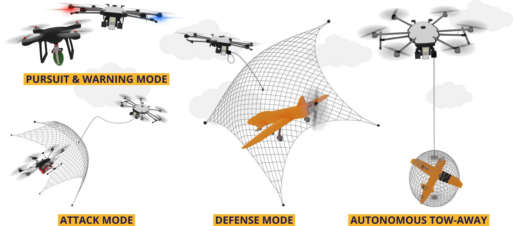

*图13 DroneHunter公开的四类自主交战模式。来源：Fortem产品页。[V2] 该图为厂商信息图，说明产品设计的处置分支逻辑，不代表各分支的实测成功率。*

### 3.3 公开证据分级

| 等级 | 定义 | 能说明什么 | 不能自动说明什么 |
|---|---|---|---|
| A | 政府或军方采购、试验、列装或作战通报 | 已进入官方试验、采购或任务使用 | 通报数字已经第三方复核；全部任务全自主；性能适用于其他场景 |
| B | 厂商公开实飞、交付或部署声明 | 产品或系统至少完成厂商所述演示 | 重复成功率、对抗条件和独立验收结果 |
| C | 同行评议硬件、室内或外场试验 | 算法在真实飞行器和受控环境中可运行 | 产品化、复杂气象、强对抗和规模化能力 |
| D | 数值仿真、软件仿真、概念设计或发展计划 | 理论可行性、算法趋势和测试方法 | 真实传感器、通信、飞行动力学和处置效果 |

证据等级描述公开验证阶段，不是对来源绝对可信度的排名。战时官方统计和厂商公告均可能缺少原始数据。本文对这类数字保留来源限定。国防媒体转述厂商参数时按其原始来源定级，不因转述而升级。公开百科条目转引的装备参数在文中单独标明，不与政府或厂商原文并列。

## 四、单个拦截单个无人机

### 4.1 工程流程

单拦单的典型链路已经稳定：区域传感器发现目标，指挥系统建立航迹并选择拦截器，拦截器按外部航迹完成中段接近，机载雷达或相机在末段重新确认目标，再实施捕获或经授权处置。工程难点集中在四个交接点：

1. 地面航迹的量测时间、通信到达时间和拦截器本机时间必须统一，否则高速闭合时会形成明显预测误差。
2. 中段航迹编号需要与末端视觉目标保持一致，局部相机不能因为看到邻近目标而自行改绑任务。
3. 拦截器需要同时满足速度、爬升率、转弯能力、相机视场和剩余能源约束，单纯追逐当前位置容易进入不可达尾追。
4. 捕获或碰撞后的坠落区域、目标载荷和友方平台需要纳入任务授权，命中不能代替安全结果。

比例导引及其改进形式仍是中高速截获的常用基线。低速网捕也会采用轨迹预测、领先点追踪和视觉伺服。学习算法更多用于目标检测、末端特征和参数修正，公开产品通常仍保留确定性的飞行约束与人工授权。

拦截器的设计取向与巡飞弹相反。巡飞弹优先续航和气动效率，拦截器优先速度、爬升率和机动性，其可用性又受限于提供目标提示的传感器和指挥链路质量。[N6] 这一取向解释了为什么多数拦截器航时很短却仍能形成有效防区：真正决定作用范围的是外部航迹质量，而不是平台自身续航。

电子干扰效果下降是拦截无人机存在的直接原因。目标一旦采用自主视觉导航并关闭无线电，射频干扰不产生作用，物理处置成为可行手段，拦截器本质上是一枚可机动的智能弹丸。[N6]

### 4.2 作战和部署证据

乌克兰的公开资料表明，单拦单已经从零散试验进入大规模消耗型防空。乌克兰国防部在2026年3月公布JEDI Shahed Hunter已交付部队，并称系统从雷达接收目标数据，拦截器速度可达350千米/小时、飞行高度可达6千米；这些性能为官方产品介绍，缺少第三方统一靶试数据。[G4] 2026年4月，乌方宣布采购8000架带自动末制导的Octopus拦截器，并称其已有作战使用。[G3]

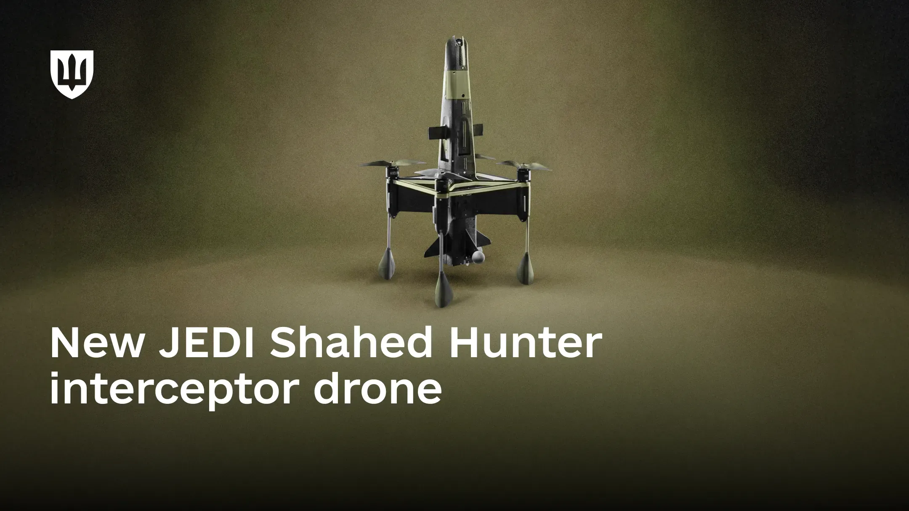

*图1 乌克兰国防部发布的JEDI Shahed Hunter产品图。[G4] 该图用于识别平台外形，不代表第三方靶场验证或具体作战批次。*

2026年6月，乌克兰国防部披露一套下一代拦截系统已在哈尔科夫地区完成作战测试。公开流程仍保留操作员选择目标并下达发射和交战命令，系统随后自主识别、跟踪和接近目标；公告称约95%的拦截周期已实现自动化。[G1] 这说明末端自主和人在监督回路中的组合已经进入作战测试，不等于系统可以脱离外部态势和交战授权独立作战。

乌克兰国防部称拦截无人机在2026年3月击落超过33000架不同类型无人机，美联社随后以“乌克兰方面称”的方式报道了这一数字。[G2][N1] 该数据证明拦截无人机的生产和运用规模已经显著扩大。公开资料没有给出每一型拦截器的出动数、逐目标成功率、重复交战和天气分布，因此不能用33000直接计算单机拦截概率，也不能据此认定存在统一自主多目标分配系统。

在具体型号层面，Wild Hornets的Sting是公开资料最完整的一型志愿者众筹拦截器。厂商称单价约2100至2500美元、月产约1万架，飞行画面上的速度读数曾达到315千米/小时，商业内幕在报道时明确说明无法独立核实该数值。[V10][N11] 厂商另称平均命中率在80%至90%之间。这类数字由生产方发布，没有公开的出动架次基数和判定口径，只能作为量级参考。

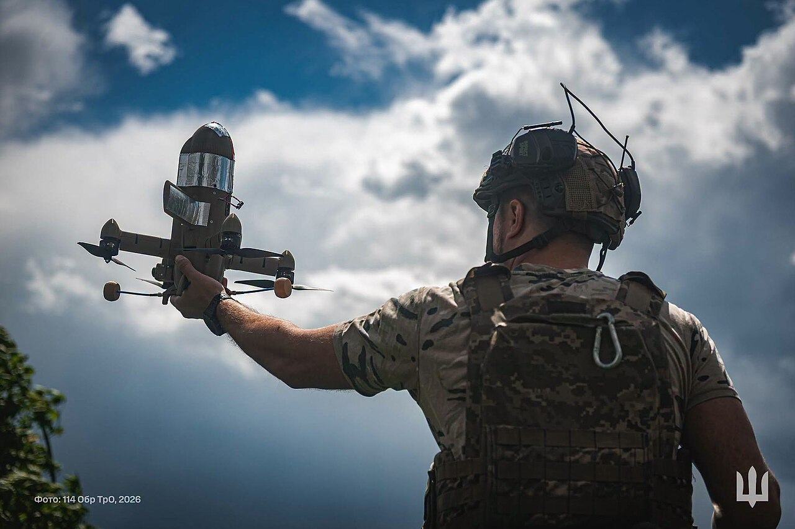

*图7 乌军部队发射Sting拦截无人机。摄影：乌克兰武装力量总参谋部，知识共享署名4.0许可，经维基共享资源转载。[N17] 画面能够说明发射方式和平台外形，不对应特定交战结果。*

由Perennial Autonomy研制、在乌克兰实战使用的Surveyor固定翼拦截器（系统名Merops）是北约东翼采购的直接对象。公开报道称单价约14500至15000美元，速度超过280千米/小时，可直接碰撞或携带小型战斗部，未交战时可伞降回收；在乌克兰累计拦截数超过1900次。[N3][N4] 2025年9月约20架无人机进入波兰空域、数日后又有一次进入罗马尼亚之后，波兰和罗马尼亚采购了该系统，美波罗三方于2025年11月在波兰东南部靶场完成联合训练。[N4] 美国陆军部长在国会证词中称已采购13000架低成本拦截无人机。[N5]

该系统的公开局限同样值得记录。北约演示中出现过一次未命中：Surveyor伞降落地，Shahed靶机继续飞行。报道还指出其对贴地飞行的超小型第一视角四旋翼效果明显弱于对较大的螺旋桨或喷气型目标。分析人士的判断是，应将其视为分层防空体系中的初始作战工具，而不是完整解决方案。[N4]

俄方在2025年列装了名为Yolka的单兵便携拦截器。公开百科条目转引的参数为质量1.3千克、作用距离3千米、速度230千米/小时、不携带战斗部、采用光电加人工智能的发射后不管制导，单价约500美元。[N16] 该条目未给出原始试验报告，本文仅将其作为“低成本纯碰撞路线已进入实际使用”的量级证据。

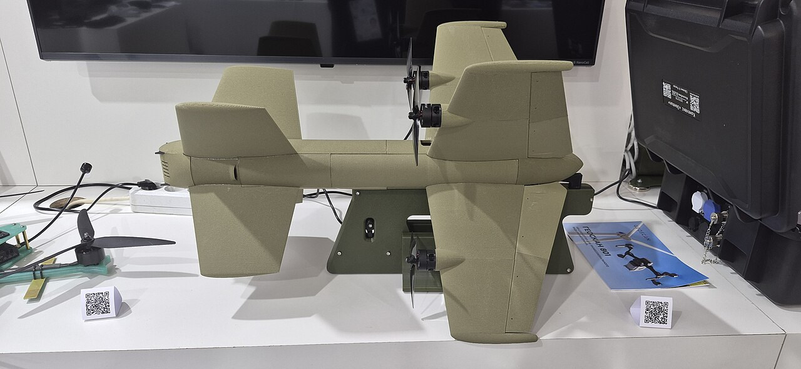

*图9 Yolka便携拦截无人机侧视。摄影：F.Alexsandr，知识共享署名4.0许可，经维基共享资源转载。[N16] 图片能够说明平台构型和尺度，不能证明公开参数已经过独立测量。*

欧洲方向上，德国联邦国防军采办局在2025年10月7日与TYTAN Technologies签订了金额为数亿欧元级别的反无人机系统合同，主要针对北约二类无人机的动能处置。[N14] 该公司的拦截器采用增材制造，公开参数为起飞质量5千克、含1千克载荷、作用距离超过15千米、巡航速度超过250千米/小时；Janes报道的数字为最高300千米/小时、作用距离15至20千米。厂商另公布EOS短程多旋翼与METIS远程固定翼两条产品线，并称目标产能为每月3000架。[V11][N15]

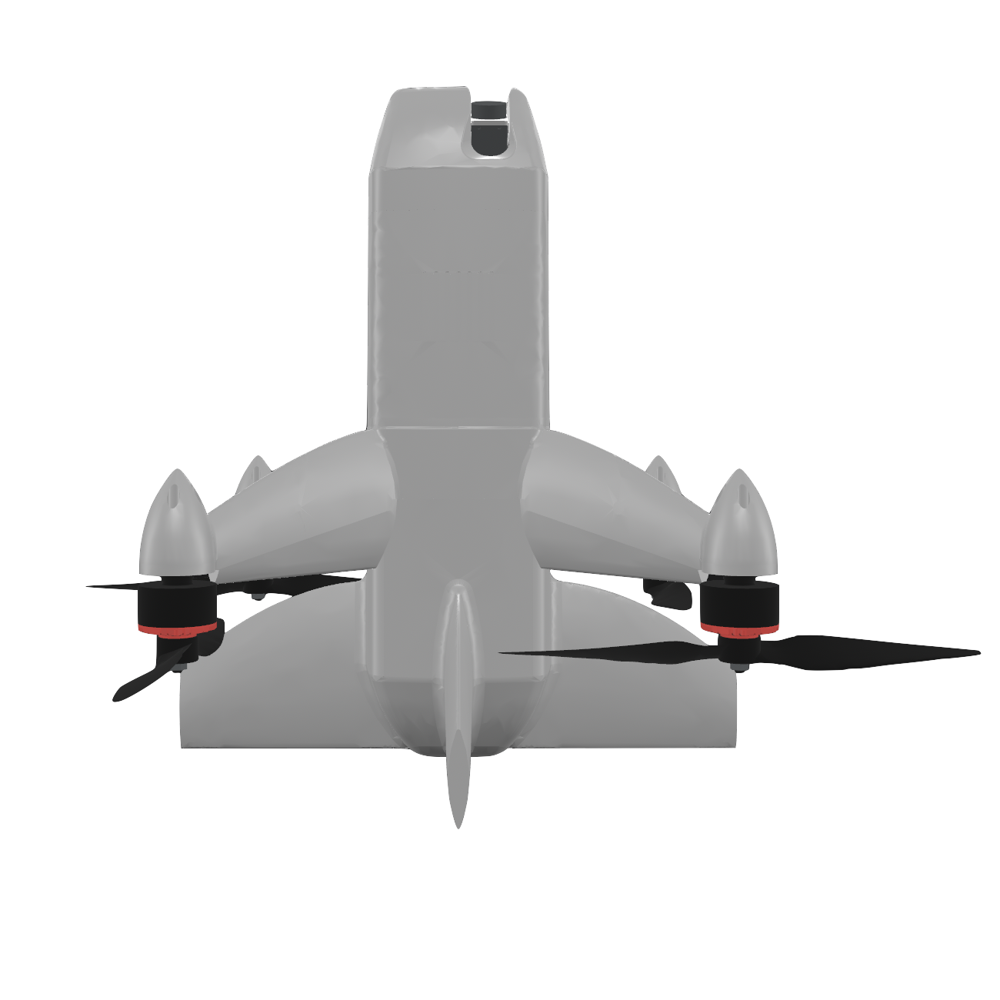

*图10 TYTAN EOS短程拦截无人机。来源：TYTAN官网。[V11] 该图为厂商产品图，用于说明短程多旋翼拦截器的构型选择。*

### 4.3 产品和演示证据

Fortem DroneHunter F700采用机载雷达和网捕路线。厂商产品页称累计完成超过4500次捕获，单机可自主工作，多机也可在同一系统下协同。[V2] 这些数字来自厂商，公开页面没有给出独立试验日志。其价值在于证明网捕路线已经超出单次原型演示，并形成了持续迭代的产品系统。

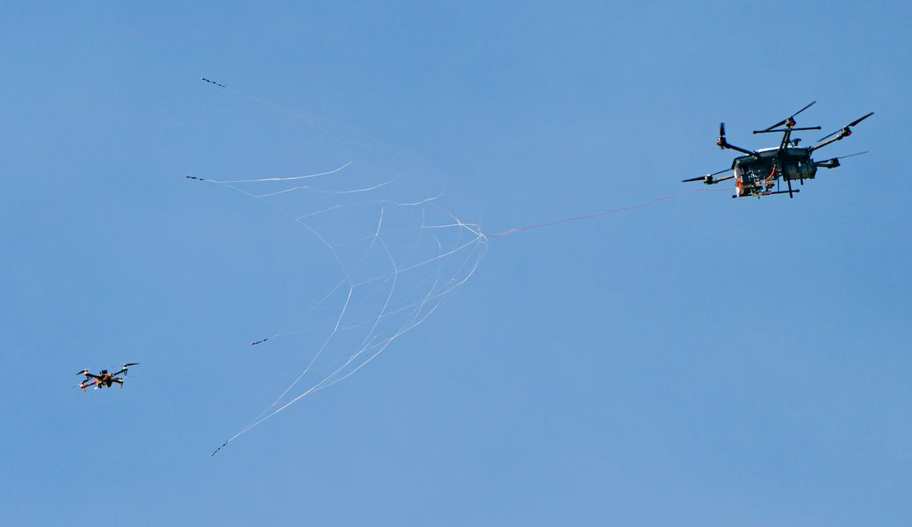

*图2 DroneHunter在空中发射网具。来源：Fortem产品页。[V2] 画面由厂商发布，属于产品动作实拍。*

Anduril Anvil由Lattice指挥控制系统提供航迹提示，自主飞向小型无人机，并向操作员回传图像进行正向识别；最终动能处置需要人工授权。Anvil-M是面向更大、更快目标的弹药型变体，增加高爆载荷和火控模块，采用地面发射的旋翼构型和一体化发射箱。[V5][V16] 厂商公开的质量约为11.6磅，发射箱运输状态约253磅，机载计算运行NixOS并支持边缘视觉算法。设计上将飞行关键部件尽量远离撞击点布置，电池和电机按短时高速飞行优化。公开资料证明了“外部态势提示、末端图像确认、人工授权”的产品架构，没有公开多架Anvil同时自主完成多目标拦截的逐目标数据。

Anduril在Falcon Peak 25.2活动中还公布了由Mobile Sentry、Wisp、Pulsar、Anvil和Lattice组成的移动式反无人机套件，并称该套件已交付美国北方司令部。[V7][G9] 该材料支持传感器、指挥控制和空中拦截器已经进行系统级集成，不能单独证明多机多目标自主交战。

MARSS INTERCEPTOR-MR采用机载图像和自主追踪。厂商公开参数包括超过80米/秒、最高约2千米，并于2025年宣布完成飞行测试、准备接受北约成员国评估。[V8] 国防媒体转述的补充参数为质量8千克、机长80厘米、翼展90厘米、作用距离5千米以上、单价3万至4万美元，采用尾坐式垂直起飞、碳纤维机体加钛合金机头的纯动能方案，未交战时可返场或伞降回收。[N6] 这些材料支持其处于产品试验阶段，不能替代军方验收结论。同系列的INTERCEPTOR-SR于2023年9月发布，公开质量1.5千克、作用距离1千米，面向班排级便携使用。

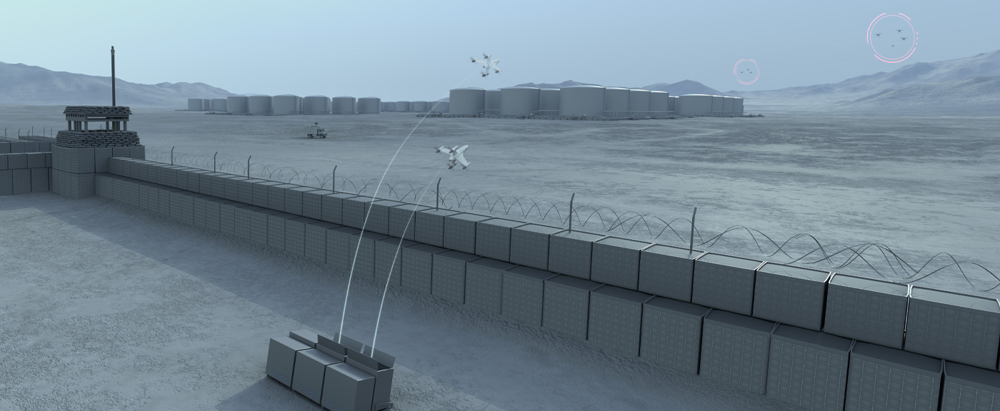

*图3 MARSS INTERCEPTOR-MR垂直发射场景。来源：MARSS产品页。[V8] 该图为厂商场景渲染，不作为实飞证据。*

以色列Robotican的Goshawk同样采用网捕和回收路线。厂商称平台能够自主完成跟踪、发射、捕获和着陆，并将被捕目标带到指定区域。[V9] 公开产品页没有给出重复试验数量和多机任务结果，本文将其列为单拦单产品路线，不列为多拦多证据。

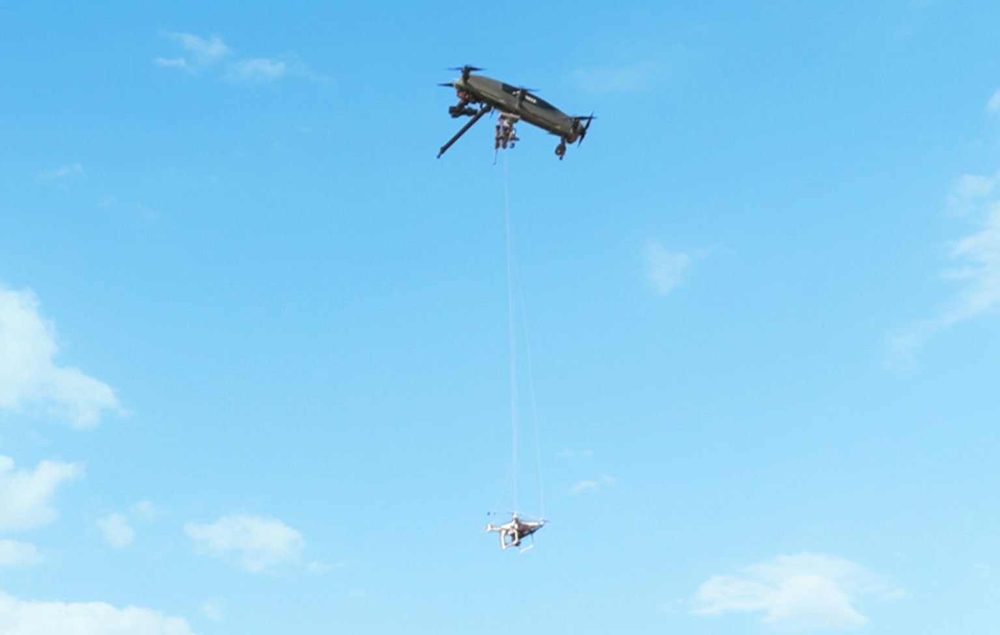

*图4 Goshawk捕获并吊运目标。来源：Robotican产品页。[V9] 画面由厂商发布，能够说明网捕和受控转移的产品形态，不能给出重复成功率。*

RTX Coyote是介于无人机和防空拦截弹之间的巡飞效应器。2024年RTX称美国陆军年度试验中，Ku波段雷达跟踪了无人机群，Coyote Block 2动能型和Block 3非动能型对单目标和群目标进行了测试。[V3] 公告未公开单次任务中效应器数量和每个目标的分配关系。国防媒体转述的Block 2参数为空中平台约13磅、战斗部约1.8千克、火箭助推后转涡喷、速度约555至595千米/小时、作用距离10至15千米、单价约10万美元，采用射频导引头加破片战斗部并具备再攻击能力。[N6]

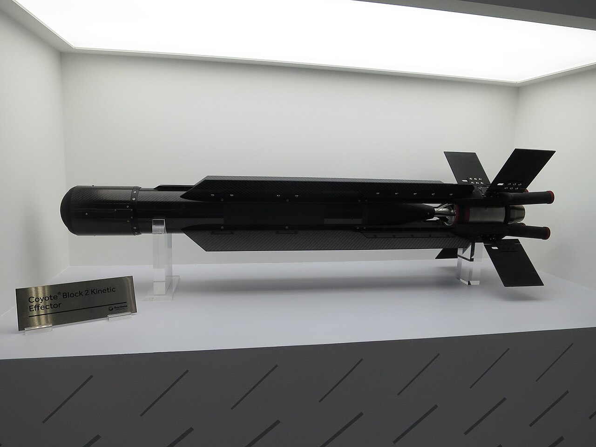

*图8 Coyote Block 2在IDEX 2025的展出实物。摄影：Mztourist，知识共享署名4.0许可，经维基共享资源转载。[N18] 展会实物可用于识别外形和尺度，不代表任何一次试验的配置。*

中国2024年航展公开材料重点展示了雷达、光电、电子侦测和“弹、炮、光、波、扰”组成的综合反无人机体系，强调分布式探测、协同火力和自动作战加人工干预。[G7][N2] 本次检索没有在这些官方材料中找到可复核的空中拦截无人机对无人机实飞数据，因此不将综合体系展示折算为无人机拦截器的单拦单或多拦多成熟度。

### 4.4 公开产品参数

表1列出能够从政府或厂商原始页面核对的参数。空白项统一写为“未公开”，不采用型号相近产品或媒体估算值替代。作用距离可能是体系保护半径、迎头交战距离或厂商定性的远程能力，三者不能直接横向比较。

| 产品 | 平台及质量或载荷 | 最大公开速度 | 最大公开高度 | 作用距离或保护范围 | 感知与制导 |
|---|---|---:|---:|---|---|
| JEDI Shahed Hunter | 垂直起飞四旋翼；总重略高于4千克；载荷上限500克 | 超过350千米/小时 | 最高6千米 | 系统保护半径最高40千米；不等于单架拦截器航程 | 自动接收雷达数据；可见光和热成像相机；自动获取、跟踪和归向目标 [G4] |
| DroneHunter F700 | 多旋翼网捕平台；质量和有效载荷未公开 | 未公开 | 未公开 | 厂商称具备远距处置能力，未给出统一数值 | 机载TrueView R20雷达；可与SkyDome及外部指挥控制系统集成 [V2] |
| MARSS INTERCEPTOR-MR | 固定翼速度特性与多旋翼机动特性结合的混合布局；厂商页面未公开质量尺寸 | 超过80米/秒 | 最高约2千米 | 厂商称可在5千米以上迎头处置Ⅰ、Ⅱ类无人机 | NiDAR体系提供任务信息；机载人工智能图像获取和自主追踪 [V8] |
| Robotican Goshawk | 网捕和回收平台；质量及载荷未公开 | 未公开 | 未公开 | 未公开 | 厂商称具备自主跟踪、捕获和着陆能力；具体传感器参数未公开 [V9] |
| Coyote Block 3非动能型 | 可巡飞、回收和再次部署的平台；质量及载荷参数未在本次引用页面公开 | 未公开 | 未公开 | 厂商仅称作用距离和高度高于同类效应器，未给出数值 | 公开演示与Ku波段射频传感器及低慢小无人机综合防御系统配套；单机传感器未公开 [V3][V4] |
| Anduril Anvil / Anvil-M | 电动旋翼拦截器；厂商公开质量约11.6磅；发射箱运输状态约253磅 | 未公开 | 未公开 | 未公开 | Lattice提供航迹提示；机载边缘视觉识别；操作员正向确认后授权处置 [V5][V16] |
| TYTAN Interceptor（EOS / METIS） | 增材制造；起飞质量5千克，含1千克载荷 | 超过250千米/小时（厂商）；Janes转述最高300千米/小时 | 未公开 | 超过15千米（厂商）；Janes转述15至20千米 | 厂商未公开导引头细节；产品线区分短程旋翼与远程固定翼 [V11][N14] |
| Alpine Eagle Sentinel | 空基传感与拦截网络；拦截弹装药约300克；集成于DeltaQuad Evo | 未公开 | 未公开 | 厂商以“地基探测200至500米、现代无人机在5千米外活动”说明空基必要性，未给出自身作用距离数值 | 机载雷达形成航迹后交由拦截弹，摄像头人工智能完成锁定 [V12] |

国防媒体转述的参数另列于表1附表，避免与厂商原文混排。

| 产品 | 媒体转述参数 | 转述来源 | 使用限制 |
|---|---|---|---|
| MARSS INTERCEPTOR-MR | 质量8千克；机长80厘米；翼展90厘米；速度288千米/小时；单价3万至4万美元 | [N6] | 国防媒体依据厂商简报整理，厂商页面未同时公开这些数值 |
| RTX Coyote Block 2 | 空中平台约13磅；战斗部约1.8千克；速度555至595千米/小时；作用距离10至15千米；单价约10万美元 | [N6] | 同上；不同批次和构型可能差异明显 |
| Wild Hornets Sting | 单价约2100至2500美元；月产约1万架；速度读数315千米/小时；作用距离40千米 | [V10][N11] | 速度来自厂商发布的机载画面读数，报道方明确无法独立核实 |
| Perennial Autonomy Surveyor | 单价约14500至15000美元；速度超过280千米/小时；乌克兰累计拦截超过1900次 | [N3][N4] | 战时统计，未见逐次交战记录 |
| Yolka | 质量1.3千克；作用距离3千米；速度230千米/小时；单价约500美元；无战斗部 | [N16] | 公开百科条目转引，无原始试验报告 |

表2补充处置方式、反应时间、自动化和公开验证阶段。表中“完成”只指来源明确披露的单次或累计结果，不代表已经通过统一第三方条件下的对比试验。

| 产品 | 公开目标类别 | 处置方式 | 反应与重复使用 | 自动化和人工权限 | 公开验证阶段及限制 |
|---|---|---|---|---|---|
| JEDI Shahed Hunter | Shahed型攻击无人机 | 携带不超过500克任务载荷；具体末端作用方式未完整公开 | 未公开发射准备和再出动时间 | 接收雷达提示后自动获取、跟踪和归向；交战授权流程未在产品介绍中展开 | 乌克兰国防部称已获准使用并交付部队；性能仍属官方产品口径 [G4] |
| DroneHunter F700 | Ⅰ类无人机及较大的Ⅱ类目标 | 小、中型系留网；较大目标使用带降落伞网具 | 数秒内发射；完整再装填低于3分钟 | 可自主执行；操作员可随时接管 | 厂商称累计捕获超过4500次；未公开统一目标速度、天气和逐次成功率 [V2] |
| MARSS INTERCEPTOR-MR | Ⅰ、Ⅱ类无人机 | 高速迎头接近并实施低附带损伤处置；国防媒体称以钛合金机头承担偏心撞击 | 自动垂直发射；未交战时可返场或伞降回收；周转时间未公开 | 操作员下达部署命令，平台使用机载图像自主获取和追踪 | 2025年完成厂商飞行测试；北约成员国评估结论未公开 [V8][N6] |
| Robotican Goshawk | 敌对小型无人机；更细分类未公开 | 网捕、回收并转移到指定区域 | 厂商称支持全天候值守和移动部署；周转时间未公开 | 厂商称飞行、捕获和着陆自主完成 | 厂商产品展示；速度、航程、续航、试验次数和独立验收结果未公开 [V9] |
| Coyote Block 3非动能型 | 小型至较大型无人机及无人机群 | 非动能区域载荷 | 可巡飞、召回、回收并再次部署；具体周转时间未公开 | 任务级控制和交战授权细节未公开 | RTX称在美国陆军演示中处置多批无人机群；目标数、效应器数和逐目标结果未公开 [V4] |
| Anduril Anvil / Anvil-M | Ⅰ、Ⅱ类旋翼与固定翼目标；Anvil-M面向更快的Ⅱ、Ⅲ类目标 | Anvil为纯碰撞；Anvil-M增加高爆载荷与火控模块 | 一次性使用；发射箱可移动部署 | 自主接近，操作员正向识别后授权处置 | Falcon Peak 25.2完成演示并向美国北方司令部交付；未公开多机多目标逐项结果 [V5][V7][V16][G9] |
| TYTAN Interceptor | 北约Ⅰ、Ⅱ类无人机；针对Shahed-136及Geran-2类目标研制 | 动能弹头或近炸破片 | 便携式与车载式两种发射方式；周转时间未公开 | 未公开自主等级细节 | 德国联邦国防军采办局2025年10月签订数亿欧元级合同；未见公开靶试报告 [V11][N14][N15] |
| Alpine Eagle Sentinel | 小型无人机、微型无人机和巡飞弹 | 载机携带拦截弹，雷达航迹交班后摄像头锁定 | 厂商称近期试验中2分钟内完成部署 | 单名操作员管理由传感器与拦截器组成的防御编队 | 德国联邦国防军为2024年首发用户；未公开逐目标试验数据 [V12] |

### 4.5 成本交换关系

拦截无人机的技术选择很大程度上由成本交换关系决定，而不是由单项性能指标决定。下表按公开单价和Shahed类目标2万至5万美元的常见估值给出量级对照。该表用于说明数量级差异，不能作为采办决策依据：单价未计入发射装置、传感器、指挥系统、训练和保障，交换比也不等于作战效费比。

| 处置手段 | 公开单发成本 | 对2万至5万美元级目标的量级关系 | 说明 |
|---|---:|---|---|
| 高端地空导弹 | 约100万美元 | 明显不利 | 弹药和预算两端均不可持续，是各国转向拦截无人机的直接原因 [N3][N6] |
| RTX Coyote Block 2 | 约10万美元 | 接近持平或不利 | 换取的是10至15千米作用距离和对高速机动目标的能力 [N6] |
| MARSS INTERCEPTOR-MR | 3万至4万美元 | 大致持平至有利 | 未交战时可回收复用，单次实际成本低于单价 [N6] |
| Perennial Autonomy Surveyor | 约1.5万美元 | 有利 | 未交战时伞降回收 [N3][N4] |
| Wild Hornets Sting | 约2500美元 | 明显有利 | 一次性使用，依赖飞手与外部提示 [V10] |
| Yolka | 约500美元 | 明显有利 | 作用距离仅3千米，只能用于末端补漏 [N16] |

公开材料中反复出现的一条判断是按威胁分层选择最便宜的有效手段：小口径火炮与高功率微波对付廉价第一视角蜂群，中口径可编程弹药与拦截无人机对付Shahed级目标，导弹留给巡航导弹和高端无人机。没有任何单一手段能在全威胁谱上同时保持有效性和成本可承受。[N6]

### 4.6 学术硬件证据

2020年穆罕默德·本·扎耶德国际机器人挑战赛要求无人机自主发现、跟踪并捕捉快速移动目标。捷克理工大学团队和东京大学JSK团队分别公开了视觉检测、轨迹估计、快速截获规划和外场试验结果。[P4][P5] JSK论文指出，32支决赛队伍中只有4支成功完成拦截。该竞赛说明受控外场中的单拦单仍对视觉、轨迹预测和飞行控制提出较高要求。比赛目标和安全环境经过专门设计，不能直接等同于复杂背景下对未知无人机的处置。

捷克理工大学多机器人系统组随后把工作推进到对非合作机动目标的网捕。其2024年发表于IEEE机器人与自动化快报的工作提出快速响应比例导引，只依赖机载状态估计，在100条不同难度的目标轨迹、累计约14小时飞行数据的仿真对比中取得最短响应时间和最高拦截次数；状态估计采用交互式多模型滤波并配合新的量测模型，在一般轨迹上优于标准卡尔曼滤波基线。实机一次拦截机动约耗时2秒。[P16] 该工作的价值在于把“目标不可预测”作为设计前提，而不是依靠对目标外形和轨迹的强先验，这是从竞赛条件走向实际条件的关键一步。

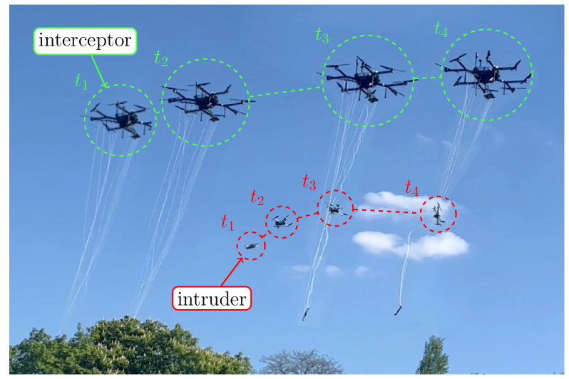

*图12 捷克理工大学多机器人系统组的网捕拦截平台与试验场景。来源：论文公开插图。[P16] 图片对应同行评议试验，能够说明平台构型和试验组织，不代表产品化能力。*

2026年发表于《Drones》的工作把机载激光雷达探测与视觉校验结合用于网捕拦截，报告动态拦截过程中目标定位精度优于0.4米、可靠跟随距离达到60米，并完成多次真实环境全自主拦截任务。作者明确指出该工作的核心是在严格受限的空中平台上完成双传感器实际集成，而不是仿真验证。[P17] 机载激光雷达增加质量和功耗、远距点云稀疏，但在数十米量级的末端制导上难以替代，这一取舍与其60米工作距离一致。

萨格勒布大学的工作走了另一条路线，使用双目立体相机重构入侵者轨迹，以速度较低的平台拦截更快的目标。[P18] 该结果说明末端能力不完全由平台速度决定，轨迹预测质量可以部分补偿速度劣势。

产品化研究方面，荷兰Delft Dynamics的DroneCatcher在雷达、视觉或声学交班后由机载多传感器锁定目标，发射网具后用缆绳拖带，目标过重时改为伞降以限制落地冲击，项目由荷兰皇家宪兵队、国家警察和安全与司法部支持。德国维尔茨堡大学的IDAS项目由MIDRAS发展而来，采用可展开网具并完全自主运行，面向机场、体育场和监狱等场所。[P24] 苏黎世联邦理工学院的全向多旋翼把平移与旋转解耦，机体运动时网可保持静止，对末端捕获精度是构型层面的改善，目前仍属机构学研究。

### 4.7 成熟度判断

单拦单已具备实际应用基础，当前提升重点不再是证明“无人机能追上无人机”，而是扩大作用包线、降低单次任务成本、提高夜间和不良天气能力、稳定雷达至视觉交接，并形成可审计的授权与效果评估。对小型低速目标，网捕和碰撞式方案成熟度较高；对高速固定翼和喷气式目标，高速拦截器仍在快速演进，公开数据不足以形成统一性能结论。

实战验证的分布存在明显不对称。乌克兰和俄罗斯的拦截器有大量作战使用记录，而在本次检索范围内，没有查到美国或北约自研消耗型拦截器的确认实战使用记录。[N6] 这意味着西方产品的成熟度判断主要依赖演习和厂商试验，与乌方装备不在同一证据类别上。

## 五、多个拦截无人机拦截单个目标

### 5.1 使用场景

多拦单不是单拦单的简单数量叠加。采用多架资源通常有四个原因：扩大物理捕获面积、从不同方向限制目标逃逸、为高威胁目标提供任务冗余、通过首批结果决定备用资源是否继续进入。常见组织方式包括：

- 多机共同携带一张网，整个编队作为一个捕获器；
- 两架主拦截器从分离方向进入，一架资源保持备用；
- 多架拦截器分波次进入，上一波失败或目标状态变化后再激活下一波；
- 多机形成围捕或护送队形，将目标限制在可控空域。

同时到达只适合逃逸窗口很短、成员性能接近、通信和时钟可靠、终端进入方向已经分离的场景。其代价是最慢成员拖累全组，并增加成员碰撞、相互遮挡和末端传感器干扰。对多数未知目标，主资源加备用或分波次方案更容易保持安全和资源效率。

### 5.2 公开硬件试验与一次工程回退

Rothe等人在2025年发表的“自主多无人机空中网捕防御系统”是较直接的多拦单硬件证据。系统由多架无人机编队携带一张网，采用中心路径规划、分布式编队控制和共享载荷阻尼。论文摘要报告了对最高约30米/秒目标的捕获，并覆盖捕获、运输和受控释放。[P3] 该工作证明多机共同载网在受控条件下可行。公开摘要不能回答复杂风场、网具寿命、目标规避、重复试验次数和大规模部署成本。

这一路线的完整历史更有参考价值。德国联邦教研部“民用安全研究”计划在2017至2020年资助的MIDRAS项目建立了多机协同网捕的基本构型：两架无人机协同吊运一张公用网，在空中合拢捕获入侵机，厘米级实时相对定位由FARN框架提供，2020年夏完成面向安全部门评审团的实飞演示。该计划下的十个协作项目合计投入超过2100万欧元。MIDRAS的关键失败点是没有机载目标探测，完全依赖外部传感器提供目标定位，末制导精度不足以完成捕获。后续工程化项目IDAS在与作为最终用户的警方密切协商后，改用单架更大的无人机，放弃多机协同飞行。[P24]

这条从双机吊网回到单机大网的路径说明，多拦单的工程价值需要逐场景论证，不能默认成立。在目标尺寸有限、可用平台载荷可以做大的场合，一架能力更强的单机在相对定位、气动耦合和故障传播三个方面都更简单。多拦单的合理适用条件是目标尺寸超出单机捕获面、需要从多方向封堵逃逸，或必须为高威胁目标提供冗余。

### 5.3 协同导引与几何方法

多机协同导引文献已经把到达时间和避碰作为独立问题。Jha等研究多个追踪者的协同导引，在多对多场景中同时考虑目标截获、追踪者碰撞避免和团队控制代价，并给出仿真及实验验证。[P6] Yu等提出基于邻居通信的预计到达时间共识和带偏置比例导引，使用等效实验平台验证。[P7] Ma和Guo研究间歇通信下的多无人机规定时间协同导引，采用“一致性阶段加比例导引阶段”，但证据为数值仿真。[P8]

这些论文形成了三项稳定认识：多个成员共享同一目标时必须显式处理成员间安全；到达时间协调位于单机导引之上；通信中断、成员能力差异和目标机动会使严格同步失效。论文中的导引对象、动力学和实验平台与多旋翼拦截无人机并不完全相同，工程使用前仍需按平台重新标定。

在几何工具层面，追逃博弈文献基本以阿波罗尼奥斯圆为共同基础。该方法按追逃双方速度比构造分界面，圆内为可截获域；多个追捕者的协同条件通常表述为相邻成员的阿波罗尼奥斯圆两两相交，从而维持封闭包围。《Connection Science》2023年的工作把任务拆为编队合围与追逃两个阶段，并给出对单个速度占优逃逸者的捕获条件。[P22] 《航空学报（英文版）》2025年的工作把该几何嵌入任务分配：以追捕机航向与视线夹角、双方最大机动角构造截获性能函数，由阿波罗尼奥斯圆性质得到可截获区域，目标机动时触发任务重分配，各机更新截获点并在预定时间内到达。[P21] Springer在ICGNC 2024论文集中的工作研究了基于该几何的最优部署，用不同尺度固定翼无人机的数值仿真验证。[P20] IEEE《航空航天与电子系统汇刊》2025年第4期发表了慢速无人机群在三维空间截获单个更快入侵者的协同捕获策略。[P25] 仅用测距信息完成三维围捕并带真实无人机飞行验证的工作也已出现。[P23]

学习方法在该方向的落点是把几何信息注入策略而非替代几何。EO-MADDPG通过一致性算法把阿波罗尼奥斯圆信息引入追捕者控制输入，并在集中训练分散执行框架下加入对手建模；SA-DSM-MADDPG在三对一障碍环境围捕中采用自注意力评论家、双筛经验回放和课程学习，报告的协同捕获成功率高于MADDPG基线。[P26][P27] 两者证据均为仿真。

### 5.4 未解决问题

多拦单的公开产品证据少于单拦单。真正的难点是确保所有成员锁定同一个规范目标，而不是各自在局部图像中选择相似目标。系统还需要版本化联盟、成员确认、任务有效期、进入扇区、最小间距和备用激活条件。共同携网还会引入绳网柔性、载荷摆动和单机故障向全队传播的问题。现阶段适合先验证两主一备和多机携网两条路线，不宜默认所有成员必须同时到达。

理论层面存在一处尚未收敛的分歧，直接影响大量多拦单方案的前提。已有研究给出了反例，说明即使形成完美包围队形，逃逸者仍可能存在逃脱策略，因此有工作改用重叠阿波罗尼奥斯圆的协同追捕策略。[P19注] 这意味着以“形成包围即完成捕获”为捕获判据的方案，其充分性需要重新验证，不能直接作为工程指标。

## 六、多个拦截无人机拦截多个目标

### 6.1 系统结构

多拦多要求系统维护统一的目标集合和资源集合。典型闭环为：

```text
雷达、光电和其他传感器
          ↓
带时间戳和协方差的统一航迹
          ↓
目标身份、威胁排序和可达性判断
          ↓
资源分配、主备关系、计划版本和有效期
          ↓
各拦截器独立中段导引与末端确认
          ↓
处置结果回传、释放资源和滚动重规划
```

目标与资源一一对应时，可用全局最近邻和匈牙利线性指派形成实时基线。高威胁目标需要多个资源时，需要把目标需求展开为多个资源槽，或采用最小费用流、整数规划和联盟形成方法。分配结果还要经过迟滞和最小保持时间，避免目标短时机动引起频繁换绑。[P9][P10][P11]

中心化分配便于维护唯一目标编号、全局资源约束和可审计计划。通信退化时，可由区域节点接管；完全无中心时，拍卖和共识束算法能够形成冲突较少的分布式任务集合。[P9] 基础共识束算法主要解决单赢家任务分配，不能直接保证一个高威胁目标的多个必要成员同时确认。多资源联盟还需要成员确认、计划时期、租约和失败关闭规则。

### 6.2 Fortem 5对5实飞

Fortem在2026年2月4日公布了一次5对5实飞：5架DroneHunter F700在一个SkyDome系统指挥下，对5架执行预编程任务的来袭无人机实施拦截。厂商称系统自动完成规划、排序和协同，5个目标均被安全网捕，过程中没有人工介入。[V1]

公告披露的技术要点有两项可用于工程参考。一是SkyDome路径规划引擎的升级方向是处理复杂空域约束并对多架拦截器做动态解冲突，采用的是空域分离手段的组合而非统一优化。二是第五代DroneHunter增加了双机载相机和机载算力，厂商把“在复杂或对抗环境中自主交战多个目标”归因于机载能力提升而非中心算法。该型于2026年1月20日开始交付，并被美国国防部反无人机任务部队选为Replicator-2计划下的首个作战采购项目。[V13]

这项演示直接覆盖了多目标探测、五机任务分配、并行交战和冲突消解，是目前公开资料中最接近完整多拦多闭环的案例。证据仍有四个限制：来源为厂商；来袭任务为预编程；没有公开目标交叉、诱饵、漏检、通信丢包和拦截器故障条件；没有公开多随机场次统计。它证明5对5在规定场景中完成过，不证明任意5对5或更大规模已经成熟。

同期的采办动向可作为该产品线成熟度的旁证：2026年2月美国国土安全部授出用于2026年世界杯场馆防护的合同，2026年2月26日美国陆军授出为期三年、金额1800万美元的反无人机合同。[V14][V15] 采购发生不等于独立试验结论公开，两者仍需分别对待。

### 6.3 Coyote群目标试验

RTX在2024年美国陆军试验公告中称KuRFS雷达跟踪了无人机群，Coyote对单目标和群目标完成处置。[V3] 2026年，RTX又公布Coyote Block 3非动能型在美国陆军演示中应对多批无人机群，并展示发射、飞行、拦截、回收和再次部署。[V4]

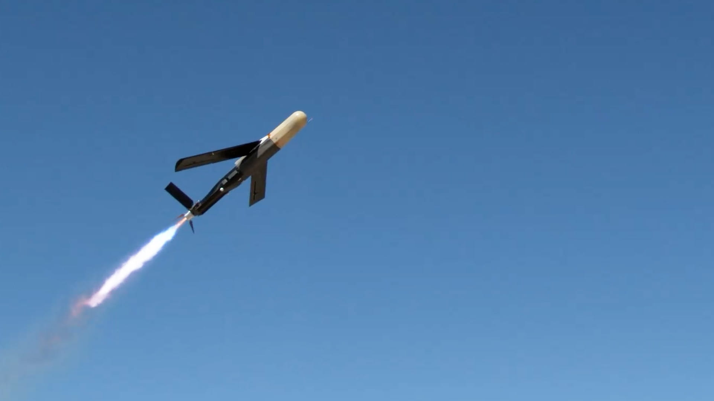

*图5 Coyote Block 3非动能型发射。来源：RTX 2026年公告。[V4] 该图为美国陆军演示的厂商发布画面，公告未披露画面对应批次的目标数量。*

这类结果证明巡飞非动能平台可能用较少架次对群目标产生区域效果。公开资料没有说明是一架还是多架Coyote、每批目标数量、目标间距、效应范围和逐目标结果。它应归入“单平台或少量平台对群目标产生效应”，不能与5架拦截器分别完成5个目标配对混为一类。

在体系结构上，Coyote由KuRFS提供火控级航迹、由前沿区域防空指挥控制系统编排探测决策交战闭环，公开描述为顺序处理多个威胁。[N6] 顺序处理与并行分配是两种不同的多目标能力，评估时应分开记录。

### 6.4 战场规模化交战的正确解释

乌克兰在多个区域同时部署大量拦截无人机，已经形成多资源对多批目标的总体作战规模。[G2][N1] 公开信息更接近地面态势系统、操作员和拦截小组组织的大量一对一任务。它能证明生产、训练、目标提示和战术组织可以扩展到很大数量，尚不能证明拦截无人机之间形成了自主联盟，也不能证明目标身份和分配由同一个全局算法实时管理。

判断多拦多成熟度时，应分别统计四件事：同时维护了多少稳定目标航迹；多少拦截器收到不冲突的任务；多少任务完成末端目标确认；多少目标形成可核实的处置结果。只公布总出动数或总击落数，无法判断身份交换、重复拦截、漏分配和资源消耗。

### 6.5 空基传感与拦截层

德国Alpine Eagle的Sentinel代表另一种多对多组织方式：把传感器和拦截器整体搬到空中，由单名操作员管理一个由空中传感节点和拦截节点组成的防御编队。其技术论点是地基反无人机传感器受地形和建筑遮蔽，探测距离在200至500米量级，而现代无人机在5千米外活动，空基视线不受此限制，可以发现贴地突防目标。效应器由载机携带，继承雷达航迹后由摄像头人工智能完成锁定，装药约300克。[V12]

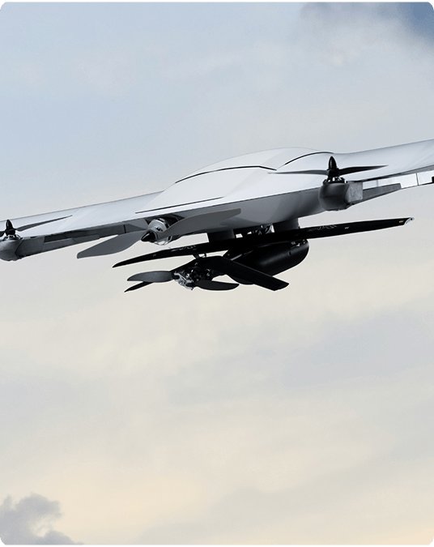

*图11 Alpine Eagle Sentinel空基反无人机系统。来源：Alpine Eagle官网。[V12] 该图为厂商产品图，用于说明空基传感与拦截一体化的构型，不代表已公开的试验结果。*

该路线的公开证据仍为厂商材料和融资扩产信息，没有逐目标试验数据。其价值在于提出了一个与地基雷达加地面发射拦截器不同的架构选择：把探测基线抬高以换取对低空突防的可见性，代价是空中节点的持续在空成本和空域管理复杂度。

### 6.6 学术状态

多无人机任务分配已经有成熟理论基础。Beard等较早提出分层处理任务分配、协同截获、路径规划和可飞轨迹。[P10] 共识束算法给出了通信网络下的去中心化拍卖和冲突消解机制。[P9] 一对多二部匹配研究把多个机器人分配给同一任务，说明高威胁目标的资源需求不能只用普通一一匹配表达。[P11]

近两年的新增工作集中在决策层而不是飞控层。一项面向低成本自杀式无人机集群威胁的研究构建了含真实作战约束的高保真仿真环境，用决策级强化学习智能体协调多个效应器完成拦截排序，并与规则式基线对比。[P19] 该工作的定位值得注意：学习方法用于“先打哪个、派谁去”，而不是接管飞行控制或末端处置。IEEE《自动控制汇刊》2025年5月发表的异构多方追逃最小完工时间分布式任务分配，以及关于多无人机群协同拦截中群位置最优部署的研究，也属于同一层次的问题。[P28][P29]

这些算法在物流、巡检、搜索和协同任务中已有大量研究，迁移到拦截场景仍需增加航迹不确定性、时间窗、成员避碰、任务授权和末端身份。学术上已经认可“分配与导引分层”，尚未形成一个适用于所有目标规模、通信条件和处置方式的统一求解器。

## 七、无人机集群拦截无人机集群

### 7.1 能力判据

集群对集群应至少满足以下条件：

1. 防御方不是预先固定若干一对一配对，而是根据目标分裂、合并、机动和成员损失在线重组任务。
2. 多个节点共享或融合局部观测，目标身份在跨节点和跨视角条件下保持连续。
3. 指挥结构能在中心可用、区域节点接管和局部自治之间切换，并避免新旧计划并行生效。
4. 成员之间处理通信拥塞、碰撞风险、视场遮挡和资源竞争。
5. 评估同时覆盖目标处置率、身份交换、漏分配、重复分配、成员损失、通信负荷和附带风险。

只有“大量无人机同场飞行”或“一个系统宣称反蜂群”不足以证明上述能力。

### 7.2 唯一一次公开的双方集群实飞对抗

DARPA与西点军校、海军学院、空军学院联合举办的Service Academies Swarm Challenge是检索范围内唯一一次双方均为无人机集群的公开实飞对抗。竞赛在加州国民警卫队Camp Roberts训练场进行，为期三天，参加人数超过40名学员，任务是开发小型无人机集群的进攻与防御战术。项目经理明确把它定位为集群对集群演练，并强调关注点不是平台或链路而是群体行为，即把集群战术当作一项可训练的作战技能。防御科目要求参赛方为保护高价值单元的友方无人机群设计对抗来袭集群的战术，最早被开发出来的算法是让防御机去攻击距离最近的攻击者。[G8]

该赛事的规模和条件都有限，但它是目前唯一能够直接支持“集群对集群”这一表述的实飞材料。此后公开的相关活动重心转向单侧集群规模和跨域编排，防御侧没有出现可比量级的公开实飞。这一空白本身就是重要结论：现有的“反集群”能力大多是体系对集群，而不是集群对集群。

### 7.3 单侧群控与相关演示

DARPA OFFSET项目面向城市任务中的大规模空中和地面无人集群。项目目标规模为最多约250个平台，2021年最终外场试验综合使用了300多个实体和虚拟平台，验证群体自治、人群协同、开放架构和战术组合。[G5][G6] 该项目证明了百级任务编排、群体接口和物理试验床的可行性。任务本身不是双方空中集群追逃与物理拦截，不能作为百级集群拦集群的完成证据。

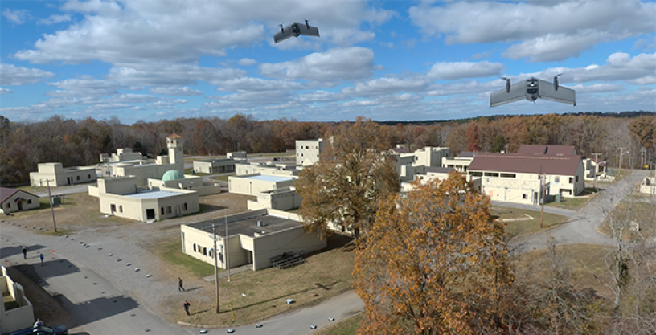

*图6 DARPA OFFSET最终外场试验。来源：DARPA。[G6] 画面用于说明百级群控试验床，不是无人机集群拦截集群的现场。*

DARPA的其他相关项目分别覆盖不同侧面。移动兵力防护项目采用发射流带缠绕目标螺旋桨和舵面的非爆炸处置方式，由车载发射的拦截器在埃格林空军基地完成测试，属于反集群但不是集群对抗。[N10] 自主多域自适应“集群的集群”项目面向数千架异构无人机的战区级编排，按任务目标、优先级、风险、资源、集群能力和时序做优化分配，目前为发展计划。拒止环境协同作战项目验证了六架RQ-23在通信中断和卫星导航不可用条件下完成任务，指向的是通信退化下的协同保底能力。

Anduril Roadrunner公开页面称单个操作员可以监督多个可回收高速平台，平台支持垂直起降、巡飞、回收和再使用。[V6] 这说明多平台监督和可回收效应器是明确发展方向。公开页面没有给出多架Roadrunner对多个机动目标完成自主动态分配的试验数据。

### 7.4 演习与体系验证

美国北方司令部主办的Falcon Peak 25.2于2025年9月在埃格林空军基地举行，为第二届，在最终科目前的数日内测试了20套反无人机系统。指挥官在对比前一年结果时给出的评价是：上一年美方对各类无人机的探测能力尚可，跟踪其机动和高度变化的能力一般，摧毁能力很差，尤其是仅靠非动能手段时；本年三方面均有明显改善。[G9][N9] 演习中Fortem完成了网捕拦截演示，Anduril完成了移动式套件加Anvil动能拦截的演示并交付装备，Squarehead提供声学探测以弥补低空地杂波中雷达的探测困难。[V7][G9]

美国联合反小型无人机办公室的反集群演示采用成群和分波次两种来袭方式，测试对象包括制导火箭、动能拦截无人机、光电红外设备、射频侦测与干扰。[G10] 北约2024年9月在荷兰举行的反无人机技术互操作演习有19个盟国和3个伙伴国共450人参加，测试系统超过60套，覆盖传感器、效应器、干扰机和靶机。[N19] 这两项活动的价值在于提供跨系统互操作数据，而不是单型装备性能。

### 7.5 中国方向

中国公开的反集群路线以地面手段为主，检索范围内没有找到可复核的空中拦截无人机对无人机实飞数据。相关材料仍有参考价值，因为它们说明了另一种应对集群饱和的成本结构。

北方工业公开的反无人机“弹幕”系统由16根紧密排列的炮管组成，向来袭方向抛射大量弹丸形成覆盖面。其总师将其描述为区别于多数“点对点”拦截武器的“面对点”武器，强调机动、可远征、装填快、火力密度高、弹幕尺寸可控，并称亦可拦截巡航导弹、火箭弹、迫击炮弹和飞机。[N7] 航天科工的FK-3000在2022年珠海航展亮相，底盘搭载无人炮塔、速射炮、搜索与跟踪雷达、无线电干扰机和光电火控，配备反弹药导弹与反集群小型导弹两型拦截弹；2025年8月出现的服役型仅装小型拦截弹，总数达96枚，弹药基数显著提升。[N20]

在集群运用方面，2026年1月的公开报道显示单名操作员可在数分钟内齐射放飞200架无人机，2026年3月公布了“Atlas”集群作战系统的首次全流程演示；2026年1月的演练模拟大量低空攻击无人机试图突破海上资产防护圈，使用导弹实施拦截。[N12][N13] 官方媒体画面为能力展示，不记录失败条件，各国自主系统在演示条件与实战条件之间历来存在差距，本文不据此推断实际拦截概率。

### 7.6 学术研究

Brust等提出自组织防御无人机群，通过聚类、拦截和捕获编队对来袭无人机实施围控，并研究通信丢失下的韧性。该工作实现了原型仿真器并进行了仿真实验，没有公开真实飞行集群处置结果。[P12]

“Game of Drones”研究多无人机追逃和受损成员条件下的深度强化学习策略，主要证据来自带物理引擎的仿真环境。[P13] 2023年的异构无人机群多目标追踪工作采用多智能体深度强化学习，先在仿真中训练，再部署到Crazyflie小型无人机系统验证多目标搜索和跟踪。[P14] 该实验有真实飞行器，但任务目标是持续发现和跟踪多个逃逸目标，不是物理捕获或处置。

图神经网络适合把目标、拦截器和通信关系表示为稀疏图，并输出候选关联、区域配额或分配代价。多智能体强化学习适合研究局部信息下的搜索、追逃和资源调度。当前共识是将学习结果放在确定性约束内使用，例如修正候选代价、提出局部动作或主动调整视场。公开研究不足以支持学习模型直接拥有目标身份、任务授权和末端处置权。

### 7.7 成熟度判断

公开证据支持“百级群控组件可实现”和“小规模多目标追踪可在真实无人机上实现”。公开证据尚不支持“百级双方集群已经完成真实空中物理拦截闭环”。当前瓶颈不是单一飞行控制算法，而是感知和通信随规模增长后，目标身份、资源计划和执行状态能否保持一致。

现有多对多演示的编制上限也说明了这一点。Fortem的公开上限是5架拦截器对5个目标，且已把空域动态解冲突列为该规模下的主要工程内容。[V1] 从5扩展到20或100，受限的是身份维护、通信负荷和空域分离，而不是单机拦截能力。

航空集群综述也把通信、碰撞避免、可扩展控制、能源和真实试验不足列为共同问题。[P15] 这些问题在双方均机动、双方均使用局部信息时会叠加，不会因为单侧群控规模已经达到百级而自动消失。

## 八、代表系统和研究成熟度矩阵

### 8.1 能力矩阵

| 系统或研究 | 交战拓扑 | 处置或任务 | 公开证据 | 已证明能力 | 尚未证明能力 |
|---|---|---|---|---|---|
| 乌克兰拦截无人机体系 | 大规模一对一为主；总体呈多资源对多批目标 | 碰撞、携载效应、自动末制导 | A，军方采购与作战通报；美联社转述 | 规模化供应、任务使用、部分型号自动末制导 | 单型独立成功率、统一自主多目标分配、逐目标完整数据 |
| Wild Hornets Sting | 一对一 | 高速碰撞 | B，厂商与媒体报道；乌方总量通报为A级 | 低成本量产与大量作战使用 | 独立核实的速度、命中率与出动基数 |
| Perennial Autonomy Surveyor（Merops） | 一对一 | 碰撞或小型战斗部，可伞降回收 | A，波兰罗马尼亚采购与美军训练；B，性能口径 | 实战拦截规模、盟国采购与联合训练 | 逐次交战记录；对超小型低空目标的有效性 |
| Fortem DroneHunter F700 | 一对一；公开5对5 | 雷达引导网捕、拖带 | B，厂商产品和实飞公告；A，Replicator-2采购与陆军合同 | 单机捕获、多机同场规划、规定场景5对5 | 独立复测、复杂对抗和更大规模 |
| Anduril Anvil / Anvil-M | 一对一 | 末端视觉确认、经授权动能处置 | B，厂商产品与系统演示；A，向北方司令部交付 | 外部航迹提示、自主接近、人工正向确认 | 公开多机多目标逐项结果 |
| Robotican Goshawk | 一对一 | 网捕、回收和受控处置 | B，厂商产品资料 | 产品化自主跟踪和网捕路线 | 独立复测、多机协同和公开部署数据 |
| RTX Coyote Block 2/3 | 单目标和群目标；数量关系未公开 | 动能或非动能载荷 | B，厂商披露的美陆军试验 | 雷达跟踪群目标、对单体和群体进行试验 | 效应器数量、目标数量、分配逻辑和独立结果 |
| MARSS INTERCEPTOR-MR/SR | 一对一为主 | 图像制导高速碰撞，可回收 | B，完成厂商飞行测试 | 原型飞行和目标追踪 | 北约评估结论、多机协同和作战数据 |
| TYTAN Interceptor | 一对一 | 动能或近炸破片 | A，德国联邦国防军采办合同；B，性能口径 | 国家级采购与产能建设 | 公开靶试报告、自主等级细节 |
| Alpine Eagle Sentinel | 空基传感加拦截编队 | 载机携带拦截弹 | B，厂商资料；A，德军首发用户 | 空基探测与拦截一体化的产品形态 | 逐目标试验数据、编队规模上限 |
| Yolka | 一对一 | 纯碰撞、无战斗部 | D，公开百科条目转引 | 极低成本便携拦截器已进入使用 | 原始试验条件与实际命中率 |
| MBZIRC 2020团队 | 一对一 | 自主视觉追踪与受控捕获 | C，竞赛外场和同行评议 | 受控外场自主检测、预测和截获 | 复杂背景、未知目标和作战处置 |
| 捷克理工大学快速响应比例导引 | 一对一 | 机载激光雷达加网捕 | C，同行评议加实机试验 | 对非合作机动目标的实机拦截，单次机动约2秒 | 产品化、复杂气象与批量部署 |
| 机载激光雷达加视觉融合拦截 | 一对一 | 网捕 | C，同行评议硬件试验 | 动态拦截中优于0.4米的定位精度、60米可靠跟随 | 更远作用距离与对抗条件 |
| MIDRAS 与 IDAS | 多对一转为一对一 | 双机共同携网转为单机可展开网 | C，政府资助项目与实飞演示 | 双机协同携网可行；工程上回退为单机 | 多机路线在何种场景下优于单机 |
| Rothe多机网防御系统 | 多对一 | 多机共同携网捕获 | C，同行评议硬件试验 | 编队携网、捕获、运输和释放 | 大规模、复杂风场、规避目标和产品部署 |
| Jha协同导引 | 多对多 | 协同截获与成员避碰 | C，仿真及等效实验验证 | 多成员协同和避碰方法 | 无人机产品化、多传感器身份链和实际处置 |
| 阿波罗尼奥斯圆协同围捕 | 多对一 | 几何捕获条件与任务重分配 | C与D，含仿真与地面机器人试验 | 可截获域的解析描述与分配耦合 | 完美包围的充分性存在反例；三维实飞证据少 |
| 决策级强化学习拦截排序 | 多对多 | 效应器分配与拦截优先级 | D，高保真仿真 | 学习方法在分配层优于规则基线 | 真实传感器噪声、通信退化与授权链 |
| 异构无人机群多目标追踪 | 多对多追踪 | 搜索与持续跟踪 | C，Crazyflie实验 | 学习策略从仿真部署到小型无人机 | 捕获、末端授权和安全处置 |
| 防御集群自组织围控 | 集群对目标群 | 拦截、捕获编队和护送概念 | D，原型仿真器 | 自组织编队和通信损失研究 | 真实飞行和物理处置 |
| DARPA Service Academies Swarm Challenge | 集群对集群 | 集群进攻与防御战术 | A，政府组织的实飞竞赛 | 双方集群实飞对抗的组织方式与基础战术 | 规模有限；无物理处置与作战条件 |
| DARPA OFFSET | 单侧百级群控 | 城市侦察和群体战术 | A，政府外场项目 | 数百实体与虚拟平台编排、人群协同、开放架构 | 双方空中集群追逃和物理拦截 |

### 8.2 公开试验配置

表3按公开原文能够核对的范围列出试验配置。未披露的地点、架次、重复次数和成功率不作推断。不同试验的任务定义差异很大，不能按“目标数量最多”直接排序技术水平。

| 试验或演示 | 时间和地点 | 防御方与目标规模 | 感知、分配和控制 | 公开结果 | 证据边界 |
|---|---|---|---|---|---|
| 乌克兰下一代自主拦截作战测试 | 2026年；哈尔科夫地区 | 拦截器数量和试验架次未公开；目标为Shahed型攻击无人机 | 操作员实时跟踪、选择目标并下达交战命令；系统随后自主导引、识别、跟踪和接敌 | 乌克兰国防部称拦截周期约95%自动化，并已完成作战条件测试 [G1] | 政府作战通报；未公开逐架轨迹、目标机动、天气、总架次和重复成功率 |
| Merops系统北约东翼联合训练 | 2025年11月；波兰东南部靶场 | 拦截器与靶机数量未公开 | 拦截器可自主或遥控运行，机载传感器跟踪目标，可在卫星导航与通信受扰时继续工作 | 美方指挥官称该系统在乌克兰对单向攻击无人机高度有效；演示中出现一次未命中 [N4] | 演习报道；未公开架次统计与目标类型分布 |
| Fortem 5对5实飞 | 2026年；地点未公开 | 5架DroneHunter F700对5架执行预编程攻击任务的来袭无人机 | 单套SkyDome自动规划、排序、协调并进行空域冲突消解 | 厂商称5个目标全部安全网捕，交战过程无人介入 [V1] | 厂商单次演示；未公开目标交叉、诱饵、漏检、通信丢包、成员故障和重复场次 |
| RTX KuRFS与Coyote年度试验 | 2024年；美国亚利桑那州尤马试验场 | Coyote和目标数量未公开；目标包括单机和无人机群 | KuRFS持续360度检测和跟踪；Coyote Block 2动能型与Block 3非动能型实施处置 | RTX称雷达完成群目标压力测试，Coyote处置了不同尺寸和机动性的多个目标 [V3] | 美国陆军年度试验的厂商公告；无逐目标数量、分配关系和独立结果表 |
| Coyote Block 3非动能演示 | 2026年；美国陆军演示，地点未公开 | 效应器数量、每批目标数量和批次数未公开 | 非动能型平台完成发射、巡飞、拦截、回收和再次部署 | RTX称处置了多批无人机群 [V4] | 厂商公告；无法判断是单平台区域效应还是多平台多目标分配 |
| Falcon Peak 25.2 | 2025年9月；美国佛罗里达州埃格林空军基地 | 最终科目前数日内测试20套反无人机系统；靶机由特种部队提供 | 覆盖探测、跟踪、识别与处置全链路，含雷达、声学、射频与动能拦截器 | 指挥官称探测、跟踪、处置三方面较上一年均有明显改善 [G9][N9] | 演习性质为技术验证；未公开各系统逐项成绩与对比条件 |
| 北约反无人机技术互操作演习 | 2024年9月；荷兰 | 19个盟国与3个伙伴国共450人；测试系统超过60套 | 传感器、效应器、干扰机与靶机的跨系统互操作 | 完成互操作测试 [N19] | 演习目标为互操作，不产出单型装备性能结论 |
| Rothe多机携网试验 | 2025年；公开摘要未说明地点 | 多架无人机共同携带一张网，对一个最高约30米/秒的目标 | 中心路径规划、分布式编队控制和共享载荷阻尼 | 论文报告完成捕获、运输和受控释放 [P3] | 同行评议硬件试验；公开摘要未给出风场、规避强度、重复次数和网具寿命 |
| MIDRAS双机携网演示 | 2020年夏；德国 | 两架无人机共同吊运一张网，对一个入侵目标 | FARN框架提供厘米级实时相对定位；目标定位依赖外部传感器 | 完成面向安全部门评审团的实飞演示；因缺少机载探测，末制导精度不足 [P24] | 项目结题材料；未公开重复试验次数与捕获成功率 |
| 捷克理工大学快速响应比例导引试验 | 2024年；仿真加实机 | 单拦截器对单个机动目标；仿真含100条轨迹、约14小时飞行数据 | 机载激光雷达探测，交互式多模型滤波，快速响应比例导引 | 响应时间最短、拦截次数最高；实机一次拦截机动约2秒 [P16] | 同行评议；实机试验的场次数与气象条件未在摘要中给出 |
| 机载激光雷达加视觉融合拦截试验 | 2026年；真实环境 | 单拦截器对单目标 | 机载激光雷达探测加定制YOLO视觉校验，网捕处置 | 定位精度优于0.4米，可靠跟随距离达60米，完成多次全自主拦截 [P17] | 同行评议；作用距离限于数十米量级 |
| 穆罕默德·本·扎耶德国际机器人挑战赛空中拦截任务 | 2020年；阿联酋阿布扎比 | 各队使用自主无人机拦截一个快速飞行目标；32支决赛队伍参赛 | 机载视觉检测、轨迹估计、截获规划和自主飞行控制 | JSK论文记载仅4支队伍成功完成拦截 [P4][P5] | 受控竞赛外场；目标、飞行区域和安全条件经过设计，不等同于未知对抗目标 |
| DARPA Service Academies Swarm Challenge | 2017年；美国加州Camp Roberts | 双方均为小型无人机集群；参加学员超过40名 | 学员自研的集群进攻与防御战术；防御科目保护高价值单元 | 完成为期三天的实飞竞赛 [G8] | 竞赛规模有限，无物理处置；不能外推到百级作战条件 |
| DARPA OFFSET第六次外场试验 | 2021年；美国肯塔基州坎贝尔堡 | 两套试验床合计300多个实体和虚拟空中、地面平台 | 开放群控架构、群体自治、人群协同、虚实结合和战术组合 | 完成最终外场综合演示 [G5][G6] | 政府群控项目；任务不是双方无人机集群追逃和物理拦截 |

### 8.3 图片资料属性

表4用于区分现场实拍、产品图和渲染图。图片只能支持其画面直接呈现的结论，产品性能和试验结果仍以对应文字来源为准。

| 图号 | 内容 | 资料属性 | 原发布单位或作者 | 可以说明 | 不能据此说明 |
|---:|---|---|---|---|---|
| 图1 | JEDI Shahed Hunter平台 | 官方产品展示图 | 乌克兰国防部 [G4] | 平台外形和公开产品身份 | 交付数量、作战地点、命中效果和独立性能 |
| 图2 | DroneHunter发射网具 | 厂商发布的产品动作实拍 | Fortem [V2] | 空中网具发射的处置形态 | 捕获成功率、目标速度、风场和多机协调效果 |
| 图3 | INTERCEPTOR-MR垂直发射 | 厂商场景渲染 | MARSS [V8] | 厂商设计的发射构型和使用概念 | 已经完成图示条件下的实飞或作战部署 |
| 图4 | Goshawk捕获并转移目标 | 厂商发布的产品动作实拍 | Robotican [V9] | 网捕后吊运和受控转移形态 | 重复成功率、最大载荷、航程和全天候能力 |
| 图5 | Coyote Block 3非动能型发射 | 厂商发布的美国陆军演示画面 | RTX [V4] | 发射构型及演示环境 | 单次效应器数量、目标批次、效应范围和逐目标结果 |
| 图6 | OFFSET最终外场试验 | 政府群控外场画面 | DARPA [G6] | 大规模虚实结合群控试验环境 | 百级空中集群已经完成对抗拦截 |
| 图7 | Sting发射 | 部队实拍，知识共享署名4.0许可 | 乌克兰武装力量总参谋部 [N17] | 发射方式与平台外形 | 对应哪一次交战、命中结果与出动规模 |
| 图8 | Coyote Block 2实物 | 展会实拍，知识共享署名4.0许可 | 摄影Mztourist [N18] | 外形、尺度与展出构型 | 任一次试验的实际配置与性能 |
| 图9 | Yolka便携拦截器 | 实物照片，知识共享署名4.0许可 | 摄影F.Alexsandr [N16] | 平台构型与尺度 | 公开参数是否经过独立测量 |
| 图10 | TYTAN EOS | 厂商产品图 | TYTAN [V11] | 短程多旋翼拦截器的构型选择 | 交付状态、靶试结果与实际作用距离 |
| 图11 | Alpine Eagle Sentinel | 厂商产品图 | Alpine Eagle [V12] | 空基传感与拦截一体化的产品形态 | 编队规模、拦截成功率与部署数量 |
| 图12 | 捷克理工大学网捕拦截平台 | 同行评议论文插图 | 论文作者 [P16] | 试验平台构型与试验组织 | 产品化能力、复杂气象与批量部署 |
| 图13 | DroneHunter四类交战模式 | 厂商信息图 | Fortem [V2] | 产品设计的处置分支逻辑 | 各分支的实测成功率与切换判据阈值 |

## 九、学术和工程共识

### 9.1 已形成共识的方案

**分层感知和统一航迹。** 雷达、无线电、光电、红外和声学各有盲区。工程系统需要把观测转换为统一时空基准，并在航迹上携带协方差、量测时间和数据到达时间。多传感器融合、指挥控制和处置是反无人机系统的标准分层结构。[P1][P2]

**目标身份先于资源分配。** 多目标场景中，系统必须先确定哪些观测属于同一个目标，再发布资源计划。局部相机的目标框和局部编号只能作为证据，不能直接替代全局目标身份。密集交叉、漏检和遮挡时，需要显式记录身份交换和重复航迹。

**末制导必须依靠机载感知。** MIDRAS完全依赖外部传感器定位导致捕获失败，捷克理工大学和机载激光雷达加视觉融合的工作则说明地基传感器精度不足以支撑网捕级终端接近。[P24][P16][P17] 地基雷达负责发现和中段引导、机载传感器负责末段确认，这一分工在产品和论文中一致。

**中心化主线和分布式降级。** 目标和资源状态较完整时，中心化滚动分配更容易满足全局约束。网络退化时，区域节点或拍卖、共识类算法用于保底。完全分布式长期运行会增加身份分叉、重复授权和通信一致性成本。[P9]

**线性指派是实时基线，复杂联盟另行建模。** 一对一任务可使用匈牙利算法。高威胁目标需要多个资源、能力组合或波次时，需要需求槽、最小费用流、整数规划或联盟形成，不能把多个独立一对一结果当作已形成联盟。[P10][P11]

**单机导引和协同到达分层。** 每架拦截器可以采用比例导引、领先点追踪或视觉伺服。共同到达时间、进入方向和成员间距是联盟上层约束。成员避碰必须单独检查，不能假设共同追向同一目标自然安全。[P6][P7][P8] 比例导引族仍是基线，近年的改进集中在响应时间和状态估计而不是替换制导律本身。[P16]

**追逃几何以阿波罗尼奥斯圆为共同语言。** 可截获域、包围条件和任务重分配的触发判据都可由该几何导出，并与分配层耦合。[P20][P21][P22]

**混合方法优于纯端到端学习。** 反无人机视觉基准的近期结果显示，竞争力最强的跟踪器仍是学习式检测加运动感知关联的混合系统，而不是端到端流水线。[P30]

**末端自主保留确定性安全外壳。** 目标检测和末端跟踪可以使用学习模型，执行仍需检查目标唯一性、当前计划、视场、闭合状态、机动余量、友方冲突和授权状态。Anduril和乌克兰公开的架构均保留了操作员选择或授权环节。[V5][G1]

**评价必须分离规模、自动化和效果。** 同时管理目标数量、实际出动资源数量、末端锁定数量和可核实处置数量是不同指标。群体飞行规模、雷达群目标跟踪和实际多目标拦截不能互相替代。

**成本交换关系是设计约束而非附带指标。** 处置手段的选择首先由目标价值与单发成本的比值决定，其次才是性能包线。[N3][N6]

### 9.2 尚未形成共识的方案

1. **所有成员严格同时到达。** 同时到达适用于有限场景，主备和分波次方案在通信退化、成员性能差异和目标身份不确定时更稳妥。
2. **以完美包围作为捕获判据。** 已有工作给出反例，说明完美包围队形下逃逸者仍可能存在逃脱策略，重叠阿波罗尼奥斯圆等修正方案尚未统一。[P19注]
3. **端到端强化学习直接控制交战。** 多智能体强化学习在追逃仿真和小型追踪实验中有效，训练分布、可解释性、约束满足和故障回退仍限制其进入任务授权与末端处置链。目前学习方法较稳妥的落点是决策层的拦截排序与资源分配。[P13][P14][P19]
4. **完全分布式全局身份重建。** 分布式节点可以交换局部航迹和出价，但在公共信息相关、通信分区和跨相机匿名目标条件下，规范身份仍难以无中心长期一致。
5. **百级集群物理拦截。** 群控、仿真和小规模硬件各有成果，公开资料没有给出百级双方集群物理闭环的可复核试验。现有多对多演示的公开上限为5对5。[V1]
6. **单一处置方式解决全部目标。** 网捕、碰撞、高速携载和非动能载荷的作用包线、附带风险和成本不同。公开系统普遍向分层、多效应器组合发展。
7. **多机协同携网优于单机大网。** MIDRAS到IDAS的工程回退说明该结论至少不普遍成立，适用条件需按目标尺寸和逃逸封堵需求单独论证。[P24]

## 十、发展趋势

### 10.1 高速和自动末制导

来袭无人机速度提高、通信静默和喷气式型号出现后，人工第一视角追逐的反应和视距受到限制。公开产品正在增加雷达提示、机载图像识别、自动目标锁定和末端导引。乌克兰2026年的公开资料已经将高速拦截器、雷达数据接入和自动末制导列为规模化方向。[G1][G3][G4]

### 10.2 一名操作员监督多架平台

多目标威胁使逐架人工遥控难以扩展。Fortem的5对5演示、Roadrunner的多平台监督描述、Alpine Eagle的单操作员管理防御编队和Coyote非动能型的回收再用均指向“任务级指挥、平台级自主”。操作员更多负责交战规则、目标确认和异常处理，而不是持续输出每架无人机的姿态指令。[V1][V4][V6][V12]

### 10.3 可回收和低附带损伤

网捕、拖带和可回收巡飞平台用于改善成本交换和落区安全。该趋势不会消除高速目标的动能处置需求。系统需要根据目标类别、保护区域和剩余时间选择处置方式，而不是只比较单个平台最高速度。MARSS的可返场与伞降回收、Surveyor未交战时的伞降回收属于同一思路：把单发成本从采购价改写为采购价除以平均使用次数。

### 10.4 产能而非单项性能成为竞争焦点

公开的产能目标已经进入月产千架量级：乌克兰2025年生产约10万架拦截无人机并提出日产1000架的目标，TYTAN公布的目标是每月3000架。[N6][N15] 这一取向决定了设计约束向增材制造、简化供应链和降低单机成本倾斜，也意味着单项性能指标在采办决策中的权重相对下降。

### 10.5 分层反集群

短期内更现实的反集群体系是传感器和指挥系统集中形成态势，区域节点分担目标簇，多架拦截器在局部执行确定性任务。单个平台非动能区域效应、多个低成本一对一拦截器和少量高性能高速拦截器可以组合使用。真正全分布式的防御集群更适合作为通信受损后的降级能力。空基传感层是另一个正在出现的分支，用于解决地形遮蔽条件下地基雷达探测距离不足的问题。[V12]

### 10.6 仿真、硬件在环和小规模实飞递进

大规模集群物理试验成本高、风险大，研究通常先在仿真中验证规模和策略，再用小型无人机验证通信、感知和控制，最后进入受控空域实飞。仿真真值需要与在线算法隔离，避免目标真实编号直接进入关联和分配。公开研究的主要证据断层也位于“小型追踪实验”与“多机实弹或物理处置”之间。

### 10.7 出口管制与技术扩散

拦截无人机已经成为受控技术。乌克兰禁止本国企业出口Shahed拦截无人机，同时向中东多国派出拦截小组；北约东翼国家转向采购已在乌克兰验证的系统。[N4][N5] 技术扩散路径正在从“西方研制、他国采购”转为“战场验证、反向采购”，对本项目意味着技术对标的参照系需要同时覆盖两类来源。

## 十一、主要技术难点

### 11.1 目标身份和跨传感器交接

单拦单可以依靠一个目标窗口工作，多拦多和集群场景必须长期保持目标身份。雷达航迹、区域光电、拦截器相机和不同节点的局部轨迹具有不同时间、坐标和误差。目标交叉或遮挡后，错误身份会直接转化为重复分配、漏分配和末端错绑。

### 11.2 动态分配和联盟原子性

目标数、资源数和目标威胁持续变化。计划既要快速响应，又要避免频繁切换。一个目标需要多架资源时，部分成员收到新计划、另一部分仍执行旧计划会形成危险的半联盟。计划所有者、版本、有效期和必要成员确认是工程能力，不是文档字段。

### 11.3 通信容量和时延

百级平台不能持续向中心发送全部原始视频。系统需要以航迹摘要、协方差、任务状态和异常事件为主，图像按需发送。通信中断后，平台需要知道是保持原计划、退回本地安全航线，还是进入区域协商。消息丢失和计划过期必须产生可审计状态。

### 11.4 多机避碰和终端空间分离

多架拦截器追向同一目标时，目标附近天然形成航迹汇聚。共同到达、视场保持和安全间距可能互相冲突。系统需要为成员分配不同进入方向、高度层或时间窗，并在机动能力不足时取消联盟目标，而不是继续追求几何上的同时到达。Fortem把空域动态解冲突列为5对5演示的主要工程内容，说明该问题在很小的编制下就已经成为约束。[V1]

### 11.5 机载末端感知的资源约束

机载激光雷达提升终端精度，同时增加质量和功耗，远距点云稀疏。视觉方案质量功耗更低，但受光照、背景和目标尺度影响。公开工作的作用距离普遍在数十米量级。[P17] 在拦截器总重只有数千克的前提下，感知载荷、电池和机动余量三者互相挤占，这是网捕类平台难以提速的根本原因。

### 11.6 效果评估

实战和厂商资料通常只给总击落数或演示结果。科研评估还需要目标真值或独立参考、逐时刻航迹、资源计划、视觉绑定、控制许可和最终距离。无真值外场可以使用独立高精度参考传感器、合作靶标遥测、事件录像和多源人工复核建立有限真值，不能把系统自己的判断同时作为答案。

### 11.7 安全、法规和授权

网捕后的坠落、碰撞碎片、携载效应、频谱影响和友方无人机混行均受任务区域约束。产品公开资料中常见的人在监督回路并非单纯技术保守，而是身份不确定、附带风险和交战规则共同决定的系统边界。部分产品采用无装药纯碰撞方案，直接目的就是降低本土使用的监管门槛。

## 十二、对本项目的启示

本项目现有“多传感器融合、统一航迹、稳定身份、版本化分配、三级协同、末端视觉配准、比例导引和独立评估”总体结构与公开工程路线一致。后续验证应按成熟度递进，不宜直接以200对200仿真替代小规模物理闭环。

1. **单拦单基线**：分别验证外部雷达航迹接近、末端视觉交接、目标丢失回退和5米仿真成功判据。结果需要同时报告任务授权、控制切换和实际最近距离。制导律以比例导引族为基线，改进方向优先放在响应时间和状态估计滤波，可直接对标快速响应比例导引在100条轨迹上的对比方法。[P16]
2. **多拦单专项**：优先采用两主一备或分波次，验证共同目标身份、成员进入扇区、最小间距和备用激活。共同携网作为独立动力学课题，不与普通独立拦截器混合评价。立项前应先论证多机方案相对单机大载荷方案的收益，避免重复MIDRAS到IDAS的回退路径。[P24]
3. **多拦多专项**：先以5对5验证统一航迹、身份连续、线性指派、版本拒绝和冲突消解，再增加资源目标不等量、高威胁多资源需求、漏检和通信退化。空域动态解冲突应作为独立指标记录，而不是并入分配算法的成功率。
4. **集群对集群研究**：20、50、100和200规模优先验证稀疏感知、区域划分、通信负荷、动态重组和安全约束。图神经网络与强化学习只作为候选关联或代价修正，确定性分配和安全门控保留最终权限。学习方法可优先用于决策层的拦截排序，该落点已有公开工作支持。[P19]
5. **捕获判据复核**：若方案中使用“形成包围即判定捕获”，需要按已公开的反例重新验证充分性，或改用重叠阿波罗尼奥斯圆等修正条件。[P19注][P22]
6. **证据分层**：质点仿真、AirSim、室内小型无人机和外场靶试分别形成报告。仿真成功率不得写成实飞能力，厂商目标尺寸和速度不得直接写成本项目已达到指标。

当前最需要补充的不是新的端到端算法，而是统一场景定义和证据链。每次试验应固定目标数量、资源数量、目标机动、感知条件、通信条件、计划模式和处置判据，并保存逐目标和逐资源结果。只有这样，单拦单、多拦单、多拦多和集群对集群的能力才能在同一口径下比较。

## 十三、参考资料

### 13.1 政府、军方和独立报道

- **[G1]** Ministry of Defence of Ukraine, *Next-generation interceptors: Ukrainian drones already autonomously take down Shahed-type UAVs*, 2026-06-08. <https://mod.gov.ua/en/news/next-generation-interceptors-ukrainian-drones-already-autonomously-take-down-shahed-type-ua-vs>
- **[G2]** Ministry of Defence of Ukraine, *A record 33,000 enemy UAVs were destroyed by interceptor drones in March*, 2026-04-08. <https://mod.gov.ua/en/news/a-record-33-000-enemy-ua-vs-were-destroyed-by-interceptor-drones-in-march-double-the-number-recorded-in-the-previous-month>
- **[G3]** Ministry of Defence of Ukraine, *Ministry of Defence procures 8,000 Octopus interceptors for the Defence Forces of Ukraine*, 2026-04-30. <https://mod.gov.ua/en/news/ministry-of-defence-procures-8-000-octopus-interceptors-for-the-defence-forces-of-ukraine>
- **[G4]** Ministry of Defence of Ukraine, *Defence Forces of Ukraine receive new high-speed JEDI Shahed Hunter interceptor drones*, 2026-03-23. <https://mod.gov.ua/en/news/defence-forces-of-ukraine-receive-new-high-speed-jedi-shahed-hunter-interceptor-drones-to-counter-shahed-type-threats>
- **[G5]** DARPA, *OFFensive Swarm-Enabled Tactics (OFFSET)*. <https://www.darpa.mil/research/programs/offensive-swarm-enabled-tactics>
- **[G6]** DARPA, *OFFSET Swarms Take Flight in Final Field Experiment*, 2021-12-10. <https://www.darpa.mil/news/2021/offset-swarms-take-flight>
- **[G7]** 国家国防科技工业局，中国航天科工反无人机体系航展资料，2024-11-12. <https://www.sastind.gov.cn/n10086200/n10086331/c10627687/content.html>
- **[G8]** DARPA, *Service Academies Swarm Challenge Live-Fly Competition Begins*, 2017. 检索范围内唯一的双方集群实飞对抗竞赛。<https://www.darpa.mil/news/2017/swarm-challenge-live-fly>
- **[G9]** U.S. Northern Command, *Falcon Peak highlights need to counter UAS threat*, 2025. <https://www.northcom.mil/Newsroom/News/Article/Article/4315312/falcon-peak-highlights-need-to-counter-uas-threat/>
- **[G10]** U.S. Army, *Joint Counter-Small UAS Office conducts successful counter drone-swarm demonstration*. <https://www.army.mil/article/278404/joint_counter_small_uas_office_conducts_successful_counter_drone_swarm_demonstration>
- **[N1]** Associated Press, *Ukraine says it shot down 33,000 Russian drones in March, a monthly record*, 2026-04-28. 报道明确将数字归于乌克兰官方。<https://apnews.com/article/russia-ukraine-war-drone-attacks-oil-06edbc9666fe0681fa0930affc475e9b>
- **[N2]** 新华网，*反无人机方案在珠海大放光彩*，2024-11-15. <https://www.news.cn/milpro/20241115/61ab8209f8b949ef996445e2d0120b1d/c.html>
- **[N3]** The War Zone, *Cheap Interceptor Drones Proven In Ukraine Protected U.S. Troops Against Iranian Shaheds*. <https://www.twz.com/land/cheap-interceptor-drones-proven-in-ukraine-protected-u-s-troops-against-iranian-shaheds>
- **[N4]** Stars and Stripes, *After drone breaches, NATO turns to Merops system for eastern flank defense*, 2025-11-18. <https://www.stripes.com/branches/army/2025-11-18/poland-merops-counter-drone-19809718.html>
- **[N5]** Defense News, *US Army turns to Ukraine-tested drones to counter Iranian UAV threat*, 2026-04-20. <https://www.defensenews.com/unmanned/2026/04/20/us-army-turns-to-ukraine-tested-drones-to-counter-iranian-uav-threat/>
- **[N6]** Unmanned Airspace, *Faster, further, more lethal: comparing kinetic intercept drone capabilities from around the world*. 国防媒体依据厂商简报整理的横向参数比较。<https://www.unmannedairspace.info/counter-uas-systems-and-policies/faster-further-more-lethal-comparing-kinetic-intercept-drone-capabilities-from-around-the-world/>
- **[N7]** South China Morning Post, *Chinese weapons giant develops anti-drone barrage system to counter wartime swarm tactics*. <https://www.scmp.com/news/china/military/article/3306199/chinese-weapons-giant-develops-anti-drone-barrage-system-counter-wartime-swarm-tactics>
- **[N8]** South China Morning Post, *Swarming drones and counter-drone systems dazzle at China's Zhuhai air show*. <https://www.scmp.com/news/china/military/article/3286520/swarming-drones-and-counter-drone-systems-dazzle-chinas-zhuhai-air-show>
- **[N9]** Breaking Defense, *As drones plague US bases, the military tests its defenses*, 2025-10. <https://breakingdefense.com/2025/10/drone-incursions-us-military-falcon-peak-2025-cuas/>
- **[N10]** New Atlas, *DARPA shoots streamers to counter drone swarms in urban areas*. <https://newatlas.com/military/darpa-streamers-counter-drone-swarms-urban-areas/>
- **[N11]** Business Insider, *A $2,500 interceptor drone built to destroy Iranian Shaheds was recorded flying at the speed of a bullet train*, 2025-08. 报道明确说明无法独立核实速度读数。<https://www.aol.com/news/2-500-interceptor-drone-built-034112966.html>
- **[N12]** DroneXL, *China's PLA Demos 200-Drone Swarm Controlled By Single Soldier*, 2026-01-23. <https://dronexl.co/2026/01/23/china-pla-200-drone-swarm/>
- **[N13]** Interesting Engineering, *China conducts anti-drone drills, uses missiles to neutralize swarm*. <https://interestingengineering.com/military/china-military-drills-against-drone-swarms>
- **[N14]** Defence Industry Europe, *Germany awards multi-hundred-million-euro contract to TYTAN Technologies for interceptor drones*, 2025-10. <https://defence-industry.eu/germany-awards-multi-hundred-million-euro-contract-to-tytan-technologies-for-interceptor-drones/>
- **[N15]** Army Recognition, *Germany Ramps Up TYTAN Counter-Drone Production to 3,000 Interceptors per Month*, 2026. <https://www.armyrecognition.com/news/aerospace-news/2026/germany-ramps-up-tytan-counter-drone-production-to-3-000-interceptors-per-month>
- **[N16]** Wikipedia, *Yolka (drone interceptor)*. 公开百科条目，转引俄方公开资料，无原始试验报告。图9摄影：F.Alexsandr，知识共享署名4.0许可。<https://en.wikipedia.org/wiki/Yolka_(drone_interceptor)>
- **[N17]** Wikimedia Commons, *File:Sting launch 114th tobr.jpg*. 摄影：乌克兰武装力量总参谋部，知识共享署名4.0许可。<https://commons.wikimedia.org/wiki/File:Sting_launch_114th_tobr.jpg>
- **[N18]** Wikimedia Commons, *File:Raytheon Coyote Block 2 at IDEX 2025.jpg*. 摄影：Mztourist，知识共享署名4.0许可。<https://commons.wikimedia.org/wiki/File:Raytheon_Coyote_Block_2_at_IDEX_2025.jpg>
- **[N19]** 北约反无人机技术互操作演习（2024年9月，荷兰），19个盟国与3个伙伴国共450人参加，测试系统超过60套。经国防媒体转述，未见公开的完整测试报告。
- **[N20]** Wikipedia, *FK-3000*. 公开百科条目，用于说明中方反集群防空系统的弹药配置变化。<https://en.wikipedia.org/wiki/FK-3000>

### 13.2 厂商和产品资料

- **[V1]** Fortem Technologies, *Fortem's AI-powered SkyDome Neutralizes Drone Swarm With Zero Collateral Damage*, 2026-02-04. <https://fortemtech.com/press-releases/2026-02-04-fortem-s-ai-powered-skydome-neutralizes-drone-swarm-with-zero-collateral-damage/>
- **[V2]** Fortem Technologies, *DroneHunter F700*. <https://fortemtech.com/products/dronehunter-f700/>
- **[V3]** RTX, *Raytheon demos KuRFS and Coyote performance against complex UAS threats*, 2024-10-14. <https://www.rtx.com/news/news-center/2024/10/14/rtxs-raytheon-demos-kurfs-and-coyote-performance-against-complex-uas-threats>
- **[V4]** RTX, *Non-kinetic Coyote variant defeats multiple drone swarms*, 2026-02-11. <https://www.rtx.com/news/news-center/2026/02/11/rtxs-raytheons-non-kinetic-coyote-variant-defeats-multiple-drone-swarms>
- **[V5]** Anduril, *Anvil*. <https://www.anduril.com/anvil>
- **[V6]** Anduril, *Roadrunner*. <https://www.anduril.com/roadrunner>
- **[V7]** Anduril, *Counter-UAS capabilities at Falcon Peak 25.2*. <https://www.anduril.com/news/anduril-demonstrates-and-delivers-counter-uas-capabilities-to-usnorthcom-at-falcon-peak-25-2>
- **[V8]** MARSS, *INTERCEPTOR-MR*. <https://marss.com/products/interceptor-mr/>（数据手册：<https://marss.com/media/sxnibxfe/interceptor-mr.pdf>；短程型：<https://marss.com/products/interceptor-sr/>）
- **[V9]** Robotican, *Goshawk autonomous drone interceptor*. <https://robotican.net/goshawk/>
- **[V10]** Wild Hornets, *STING – Shahed Interceptor*. <https://wildhornets.com/en/sting-interceptor>
- **[V11]** TYTAN Technologies. <https://www.tytan-technologies.com/>
- **[V12]** Alpine Eagle. <https://alpineeagle.com/>
- **[V13]** Fortem Technologies, *Begins Deliveries of Next-Generation DroneHunter 5.0, Advancing Counter-Swarm Defense*, 2026-01-20. <https://fortemtech.com/press-releases/2026-01-20-fortem-technologies-begins-deliveries-of-next-generation-dronehunter-5-0-advancing-counter-swarm-defense/>
- **[V14]** Fortem Technologies, *Receives Multimillion-dollar Order to Defend 2026 FIFA World Cup Venues From Drone Threats*, 2026-02-12. <https://www.businesswire.com/news/home/20260212003799/en/Fortem-Receives-Multimillion-dollar-Order-to-Defend-2026-FIFA-World-Cup-Venues-From-Drone-Threats>
- **[V15]** Fortem Technologies, *Awarded 3-Year, $18M U.S. Army Contract for Counter-Drone Solutions*, 2026-02-26. <https://www.businesswire.com/news/home/20260226465227/en/Fortem-Technologies-Awarded-3-Year-$18M-U.S.-Army-Contract-for-Counter-Drone-Solutions>
- **[V16]** Anduril, *Anduril Announces Anvil-M Munition Variant Of Interceptor Platform*. <https://www.anduril.com/news/anvil-m-launch>

### 13.3 同行评议论文

- **[P1]** Park et al., *Survey on Anti-Drone Systems: Components, Designs, and Challenges*, IEEE Access, 2021. <https://doi.org/10.1109/ACCESS.2021.3065926>
- **[P2]** Kang et al., *Protect Your Sky: A Survey of Counter Unmanned Aerial Vehicle Systems*, IEEE Access, 2020. <https://doi.org/10.1109/ACCESS.2020.3023473>
- **[P3]** Rothe, Strohmeier, Montenegro, *Autonomous Multi-UAV Net Defense System for Aerial Drone Interception*, 2025. <https://doi.org/10.1109/ICCRE65455.2025.11093305>
- **[P4]** Vrba et al., *Autonomous capture of agile flying objects using UAVs: The MBZIRC 2020 challenge*, Robotics and Autonomous Systems, 2021/2022. <https://doi.org/10.1016/j.robot.2021.103970>
- **[P5]** Zhao et al., *Team JSK at MBZIRC 2020: Interception of Fast Flying Target using Multilinked Aerial Robot*, Field Robotics, 2021. <https://doi.org/10.55417/fr.2021003>
- **[P6]** Jha et al., *Cooperative Guidance and Collision Avoidance for Multiple Pursuers*, Journal of Guidance, Control, and Dynamics, 2019. <https://doi.org/10.2514/1.G004139>
- **[P7]** Yu et al., *Impact Time Consensus Cooperative Guidance Against the Maneuvering Target: Theory and Experiment*, IEEE Transactions on Aerospace and Electronic Systems, 2023. <https://doi.org/10.1109/TAES.2023.3243154>
- **[P8]** Ma, Guo, *Prescribed-Time Cooperative Guidance Law for Multi-UAV with Intermittent Communication*, Drones, 2024. <https://doi.org/10.3390/drones8120748>
- **[P9]** Choi, Brunet, How, *Consensus-Based Decentralized Auctions for Robust Task Allocation*, IEEE Transactions on Robotics, 2009. <https://doi.org/10.1109/TRO.2009.2022423>
- **[P10]** Beard et al., *Coordinated target assignment and intercept for unmanned air vehicles*, IEEE Transactions on Robotics and Automation, 2002. <https://doi.org/10.1109/TRA.2002.805653>
- **[P11]** Dutta, Asaithambi, *One-to-many bipartite matching based coalition formation for multi-robot task allocation*, ICRA, 2019. <https://doi.org/10.1109/ICRA.2019.8793855>
- **[P12]** Brust et al., *Swarm-based counter UAV defense system*, Discover Internet of Things, 2021. <https://doi.org/10.1007/s43926-021-00002-x>
- **[P13]** Wan et al., *Game of Drones: Multi-UAV Pursuit-Evasion Game With Online Motion Planning by Deep Reinforcement Learning*, IEEE Transactions on Neural Networks and Learning Systems, 2022. <https://doi.org/10.1109/TNNLS.2022.3146976>
- **[P14]** Betti Sorbelli et al., *Multi-Target Pursuit by a Decentralized Heterogeneous UAV Swarm using Deep Multi-Agent Reinforcement Learning*, ICRA, 2023. <https://doi.org/10.1109/ICRA48891.2023.10160919>
- **[P15]** Campion et al., *Aerial Swarms: Recent Applications and Challenges*, Current Robotics Reports, 2021. <https://doi.org/10.1007/s43154-021-00063-4>
- **[P16]** Pliska, Vrba, Báča, Saska, *Towards Safe Mid-Air Drone Interception: Strategies for Tracking & Capture*, IEEE Robotics and Automation Letters, 9(10):8810–8817, 2024. <https://doi.org/10.1109/LRA.2024.3451768>（预印本：<https://arxiv.org/abs/2405.13542>；项目页与数据集：<https://mrs.fel.cvut.cz/towards-interception>）
- **[P17]** *Autonomous Drone-on-Drone Interception Using an Integrated LiDAR–Vision Detection System for High-Precision Capture*, Drones, 10(6):420, 2026. <https://doi.org/10.3390/drones10060420>
- **[P18]** Barišić, Petric, Bogdan, *Brain over brawn: Using a stereo camera to detect, track, and intercept a faster UAV by reconstructing the intruder's trajectory*, Field Robotics, 2(1):222–240, 2022.
- **[P19]** Palmas, *Reinforcement Learning for Decision-Level Interception Prioritization in Drone Swarm Defense*, arXiv:2508.00641, 2025. <https://arxiv.org/abs/2508.00641>
- **[P19注]** 关于“完美包围不保证捕获”的反例与重叠阿波罗尼奥斯圆修正，见Journal of Guidance, Control, and Dynamics上关于多追捕者协同追捕策略的讨论。该结论目前散见于多篇论文的相关工作评述，本文按其转述记录，使用前应回溯原始反例论文。
- **[P20]** Wu, Yu, Wang, Zheng, *Optimal Deployment in Pursuit-Evasion Game Based on Apollonius Circle for Multi-UAV System*, Advances in Guidance, Navigation and Control (ICGNC 2024), Lecture Notes in Electrical Engineering vol. 1349, Springer, 2025. <https://doi.org/10.1007/978-981-96-2248-1_1>
- **[P21]** *Dynamic task assignment for multi-UAV system in pursuit-evasion game with evolving performance evaluation model*, Chinese Journal of Aeronautics, 2025. <https://www.sciencedirect.com/science/article/pii/S1000936125005412>
- **[P22]** *Collaborative pursuit-evasion game of multi-UAVs based on Apollonius circle in the environment with obstacle*, Connection Science, 2023. <https://doi.org/10.1080/09540091.2023.2168253>
- **[P23]** Liu, Yuan, Nguyen, Su, *Autonomous 3D Moving Target Encirclement and Interception with Range Measurement*, arXiv:2506.13106, 2025. 含真实无人机飞行验证。<https://arxiv.org/abs/2506.13106>
- **[P24]** MIDRAS（Micro Drone Protection System，德国联邦教研部“民用安全研究”计划，2017–2020）项目资料，Fraunhofer HHI项目页。后续工程项目IDAS由维尔茨堡大学承担。<https://www.hhi.fraunhofer.de/en/departments/wn/projects/archive/midras.html>
- **[P25]** *Cooperative Capture Strategy for a Group of Slower UAVs to Intercept One Faster Intruder in 3-D Space*, IEEE Transactions on Aerospace and Electronic Systems, 61(4), 2025-08.
- **[P26]** *EO-MADDPG: An Improved Reinforcement Learning Approach for Multi-UAV Pursuit–Evasion Games*, Aerospace, 13(3):296. <https://doi.org/10.3390/aerospace13030296>
- **[P27]** *SA-DSM-MADDPG for Multi-UAV Cooperative Encirclement in Obstacle-Rich Pursuit–Evasion Scenarios*, Drones, 10(5):360. <https://doi.org/10.3390/drones10050360>
- **[P28]** *Distributed Task Allocation With Minimum Makespan for Heterogeneous Multiplayer Pursuit–Evasion Games*, IEEE Transactions on Automatic Control, 2025-05.
- **[P29]** *Optimal deployment of swarm positions in cooperative interception of multiple UAV swarms*. <https://www.sciencedirect.com/science/article/pii/S2352864822000517>
- **[P30]** CVPR Anti-UAV基准2025年评测结果：竞争力最强的跟踪器仍为学习式检测加运动感知关联的混合系统，而非端到端流水线。该结论经综述文献转述，使用前应回溯官方榜单原文。

## 十四、资料限制

本文只使用能够定位到政府、军方、厂商原文或数字对象标识符的资料。部分装备的速度、距离、捕获次数和作战数据没有公开原始试验条件。报告因此只判断公开成熟度，不评价未公开型号，也不推导真实火控参数、毁伤概率和单位成本。

本次合并新增的内容中，以下几类需要单独提醒：国防媒体的横向参数比较依据厂商简报整理，与厂商页面口径可能不一致，已在表1附表中单列；公开百科条目转引的Yolka与FK-3000参数没有原始试验报告，只作量级参考；关于“完美包围不保证捕获”的反例和反无人机视觉基准的评测结论，本文按转述记录并已在参考条目中标注需回溯原文；北约2024年互操作演习的参与规模来自国防媒体转述，未见完整测试报告。成本交换关系一表只计入单发成本，未计发射装置、传感器、指挥系统、训练和保障，不能作为采办依据。

对“目前最早”“首次”和“规模最大”等表述，本文采用“在本次检索到的公开资料中”这一限定。厂商公告中的“首次”“全自主”宣称，如Fortem的5对5，未经独立核实，且其来袭目标飞行预编程航线而非对抗机动，正文中已标出。后续若获得军方验收报告、第三方靶试数据或逐目标作战记录，应优先替换相应厂商和战时通报口径。

文中图片版权归原发布单位或摄影者，仅用于技术调研中的来源说明。图片已经按官方产品图、厂商动作实拍、厂商场景渲染、展会与部队实拍、论文插图和政府外场画面分类；图7、图8、图9采用知识共享署名4.0许可，已在图注和参考条目中标明作者。图片本身不替代性能数据、验收记录或第三方试验结论。

## 十五、公开视频资料

以下链接均来自原发布单位的产品页面、视频账号或研究团队账号，核对日期为2026年8月3日。视频用于观察平台构型、飞行过程和试验组织方式。经过剪辑的宣传视频不能替代原始遥测、逐目标日志和第三方验收报告。

| 视频 | 发布单位 | 主要内容 | 链接 | 使用边界 |
|---|---|---|---|---|
| *DroneHunter Takes Aim at Dangerous Group 2 UAVs* | Fortem Technologies | DroneHunter针对较大无人机目标的搜索、接近和网具处置产品演示 | [YouTube视频](https://www.youtube.com/watch?v=q85RA5aNAJw) | 能够观察产品动作和处置形态；不是2026年5对5试验的完整录像，不能据此判断多机冲突消解效果 |
| Fortem Technologies频道 | Fortem Technologies | 各代DroneHunter产品与演示合集 | [YouTube频道](https://www.youtube.com/channel/UCe_KW3k17jzh4N26_csZ7GA) | 内容由厂商自行编辑发布；未找到5对5试验的完整连续录像 |
| *MARSS INTERCEPTOR-MR*产品视频 | MARSS | 垂直发射、混合布局、高速接近和机载图像追踪的产品说明 | [厂商直接视频](https://marss.com/media/lgrbn2mt/marss-interceptor.mp4) | 视频包含产品说明和场景化画面；不能替代北约成员国评估结果或第三方性能测试 |
| *Goshwak by Robotican* | Robotican | Goshawk起飞、跟踪、网捕、吊运和受控着陆过程 | [YouTube视频](https://www.youtube.com/watch?v=wscMOwEOp0Q) | 能够说明单机网捕和转移流程；未提供统一目标速度、风场、重复次数和成功率 |
| *Coyote Block 3 Non-Kinetic Summary* | RTX Raytheon | Coyote Block 3非动能型的发射、飞行、群目标处置、回收和再次部署演示 | [厂商直接视频](<https://prd-sc102-cdn.rtx.com/-/media/project/raytheon-technologies/shared/c/coyote/coyote-b3nk-summary-video.mp4?rev=9ed386feecf74665971face3ff602650&rid=7e4407dbb72d4644a9ebd89d5c4b9275>) | 厂商发布的美国陆军演示摘要；没有公开效应器数量、每批目标数量和逐目标分配过程 |
| *Anvil-M takes down Group 3 UAS* | Anduril | Anvil-M对Ⅲ类无人机的处置试验录像，由Sentry提供视觉确认 | [厂商发布](https://x.com/anduriltech/status/1940788891377979830) | 短片经过剪辑；未公开试验条件、目标机动和重复次数 |
| STING拦截器研制与作战使用 | Wild Hornets | 拦截器研制过程、测试与作战画面 | [YouTube视频](https://www.youtube.com/watch?v=9BW9UGX7dl4) | 由生产方发布；画面中的速度与命中判定无独立核实 |
| STING击落Shahed实拍 | Censor.NET转载 | 拦截器视角的交战画面 | [视频页](https://censor.net/en/videonews/3608548/sting-interceptors-from-the-wild-hornets-shot-down-a-russian-shahed) | 单次交战画面；不能推导成功率 |
| *OFFensive Swarm-Enabled Tactics Sixth Field Experiment* | DARPA | OFFSET第六次外场试验中的空地平台编组、虚实结合和人群协同 | [YouTube视频](https://www.youtube.com/watch?v=W34NPbGkLGI) | 能够说明百级群控试验组织和平台规模；任务不是无人机集群之间的物理拦截 |
| *Team JSK at MBZIRC 2020: Interception with Fast Flying Target* | 东京大学DRAGON Lab | 多连杆无人机在竞赛外场中检测、追踪和截获快速飞行目标 | [YouTube视频](https://www.youtube.com/watch?v=s7TGY9uXLK8) | 与同行评议论文[P5]对应，能够观察受控外场硬件流程；不能直接外推到未知目标、复杂背景和作战处置 |
| 捷克理工大学多机器人系统组频道 | 捷克理工大学 | 快速响应比例导引拦截试验的解说视频 | [YouTube频道](https://www.youtube.com/channel/UCfkC5R-RITKtnXedYGpUS8g) | 与论文[P16]对应；具体场次的气象与目标机动条件需查论文与数据集 |
| 中国无人机与反无人机作战演示 | South China Morning Post | 演习画面剪辑 | [视频页](https://www.scmp.com/video/china/3319119/china-stages-drone-and-counter-drone-warfare-demonstration) | 媒体转载的官方画面；不记录失败条件，不能推导拦截概率 |

本次检索未找到由独立试验机构公开的Fortem 5对5完整连续录像，也未找到带逐架遥测的乌克兰拦截作战原始视频。DARPA Service Academies Swarm Challenge的防御科目同样没有公开完整对抗录像。相关产品短片和新闻剪辑不用于补齐这三项证据缺口。
