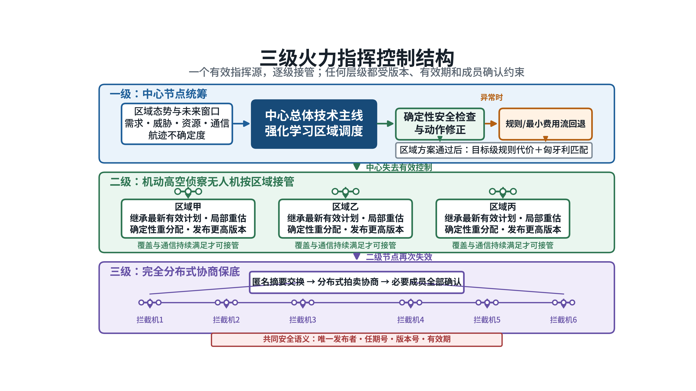
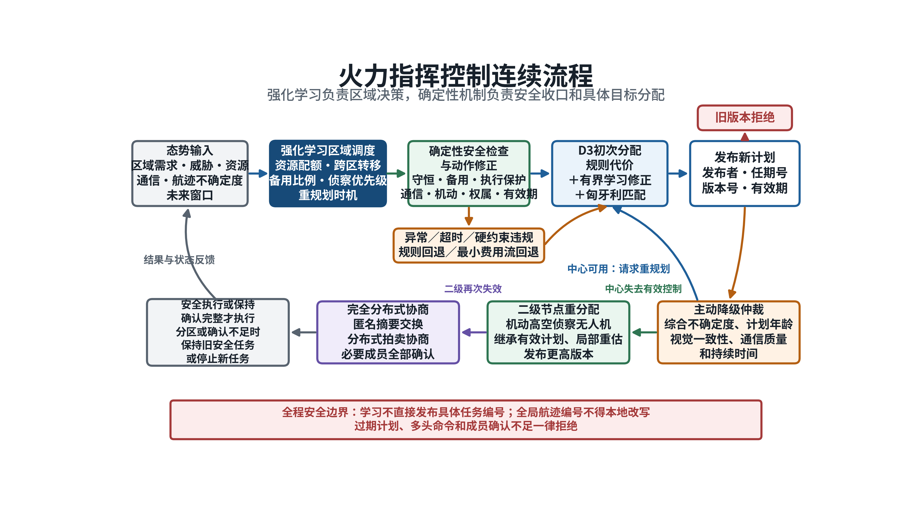
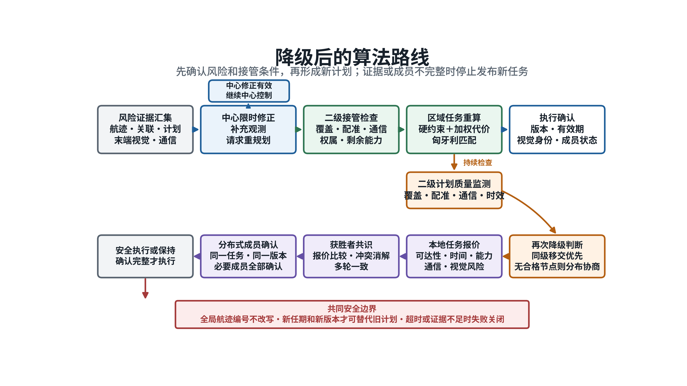
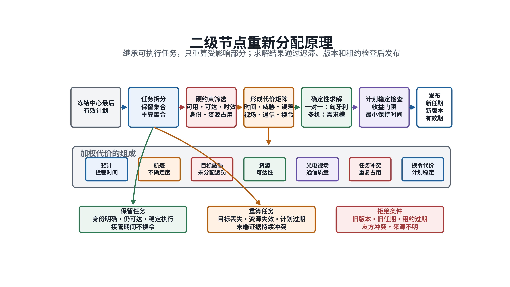
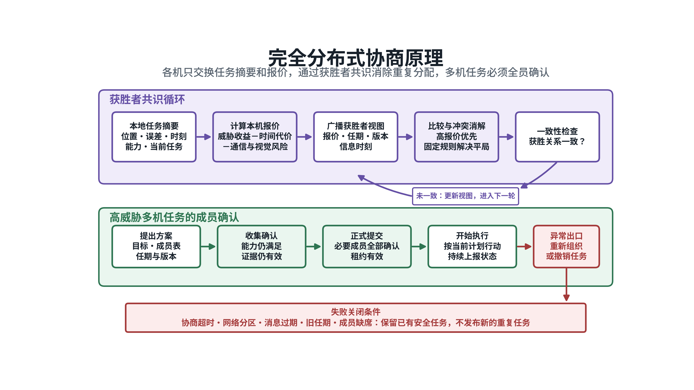

# 主动降级与分级目标分配方案

## 一、任务背景

多无人机拦截过程中，中心节点可能保持通信和计算能力，但其掌握的态势已经落后。雷达航迹误差扩大、目标关联不稳定、原分配计划过期、资源机动条件变化，以及末端视觉结果与原任务不一致，都会使既有计划失去执行价值。继续等待中心节点完全失效，会错过重新组织任务的时间窗口。

本项目采用中心节点、二级高空侦察节点和拦截无人机分布式协同三级结构。中心计划质量持续下降时，系统先请求中心限时重规划，并调用二级节点补充观测。中心不能在计划有效期内恢复时，控制权转交给满足接管条件的二级节点。二级节点接管后只处理其覆盖区域内的受影响任务，继承仍然有效的任务关系并重新分配。二级节点继续工作但已经无法维持有效计划时，系统再次主动降级，由拦截无人机完成分布式协商。

主动降级与被动降级采用同一套计划标识和安全约束。被动降级由节点失联、心跳超时或设备故障触发；主动降级由任务质量下降触发。两类流程都要求系统中同一时刻只有一个有效指挥来源，所有计划带有发布者、任期号、版本号和有效期。

## 二、总体方案

三级结构按照“中心统筹、区域接管、分布协商”运行。中心节点负责全局态势、区域资源调度和初次目标分配。二级节点由随队出动的机动高空侦察无人机承担，配备较大视场光电载荷、稳定通信链路和独立计算单元。其主要任务是监视重点区域、转发目标信息、辅助末端配准，并在中心计划失效时接管局部任务。完全分布式阶段由拦截无人机交换航迹摘要、资源状态和任务报价，不再依赖固定中心。

二级节点不承担全域持续观察。接管判定以受影响区域和受影响任务为范围。雷达航迹仍满足分配要求、现有任务关系仍可执行时，系统继续使用中心计划或请求中心重规划，不启动二次分配。只有中心计划失去有效性，且二级节点对相关区域具备足够覆盖、目标配准和通信能力时，才转交控制。

*图意：中心节点负责全局统筹，二级高空侦察节点按区域接管，二级节点无法继续承担任务时转入完全分布式协商。*

整个流程保持五项共同约束。第一，全局航迹编号由中心航迹体系产生，末端相机和分布式节点不得自行改写。第二，观测和航迹保留量测时刻、到达时刻和协方差。第三，新计划必须比被替代计划具有更高版本和有效任期。第四，正在安全执行的任务前缀原则上保留，避免接管瞬间发生大范围换令。第五，证据不足、版本冲突或成员确认不完整时停止发布新任务，保留仍然安全的旧任务。

## 三、首次主动降级

### （一）判定依据

主动降级仲裁同时读取五类信息。融合航迹给出位置误差、协方差和信息年龄；目标关联给出身份交换、重复航迹、歧义程度和航迹连续性；分配模块给出计划年龄、资源可达性、代价余量和当前版本；末端视觉给出锁定、模糊、保持、重新搜索、友方冲突和跨视角一致性；通信模块给出中心、二级节点和拦截无人机之间的链路时效。

单次检测失败或单帧视觉不一致不构成移交依据。目标短时出画、检测框抖动和通信延迟均可能造成瞬时异常。系统对风险持续时间和连续帧数进行检查，并设置最小保持时间。末端视觉处于模糊或重新搜索状态，但当前资源与全局航迹关系没有冲突时，优先请求二级节点提供新的观测提示。末端视觉持续指向其他目标、出现重复锁定、友方重叠或当前资源已经不可达时，原计划进入重规划或保持状态。

### （二）处置顺序

首次主动降级按以下顺序执行：

1. **保持中心控制。** 航迹、关联、计划和末端视觉一致，或者风险仅为短时轻微波动时，继续执行当前计划。
2. **补充观测。** 目标关系仍可信但视觉质量下降时，请求二级节点调整云台，向受影响无人机发送目标方位、图像框和轨迹摘要。该动作不改变计划发布者。
3. **请求中心重规划。** 当前计划过期、资源不可达、重复锁定或持续目标不一致时，向中心提交带风险原因和有效期的重规划请求。重复请求在冷却时间内合并，防止中心连续生成相同计划。
4. **转交二级节点。** 中心重规划超时、返回结果仍不能执行，或者剩余任务时间不足，而二级节点已经持续满足接管条件时，启动控制权移交。
5. **保持或转入分布式。** 没有合格二级节点时，不产生名义上的二级计划。中心仍能安全维持时继续请求重规划；中心已不能提供有效控制时，按分布式分配条件处理。

友方身份冲突单独处理。系统立即停止该任务的继续授权，保留证据并进入人工复核，不通过自动重新分配绕过身份确认。

### （三）二级节点准入

二级节点必须同时满足可用性、时效、感知、通信和权属五类条件。节点心跳和通信记录必须新鲜；计划租约在预计执行期间有效；光电云台已经指向受影响区域；目标提示和跨视角配准结果处于有效时间窗内；覆盖范围能够支撑本区域任务；接管状态持续达到规定观察次数。多台二级节点同时可用时，按照区域覆盖、通信质量、目标配准稳定性、剩余任务能力和既定优先级选择接管者。

当前科研仿真使用的位置误差、计划年龄、视觉置信度、覆盖率和持续帧数门限只用于软件验证。真实系统门限需要根据雷达误差、光电吊舱视场、通信时延和拦截机动能力重新标定，不能直接作为装备指标。

*图意：中心计划先接受限时重规划；中心失去有效控制后由二级节点重新分配；二级节点无法继续维持有效计划时转入分布式协商。所有结果经过版本、有效期和成员确认检查。*

## 四、二级节点目标重新分配

### （一）接管数据

二级节点接管前先冻结中心最后一份有效计划，读取未完成任务、已执行状态、资源位置和剩余能力。输入航迹保留全局航迹编号、量测时刻、到达时刻、位置速度和协方差。二级节点同时接收本机光电观测、拦截无人机上报的局部视觉轨迹、通信状态和末端关联结果。原始视频按需要传输，常态运行优先交换目标框、视线、轨迹摘要和质量信息，以降低带宽占用。

二级节点只重新评估受影响区域。已经进入稳定末段、任务关系明确且继续执行更安全的资源予以保留。目标丢失、资源失效、计划过期或末端证据持续冲突的任务进入重新分配集合。该处理能够减少接管期间的计划抖动，也避免把局部异常扩展成全局换令。

### （二）分配方法

二级节点采用确定性方法形成具体目标分配。系统根据拦截时间窗、航迹不确定度、目标威胁、资源可达性、视场条件、通信质量、冲突风险和当前任务负荷计算资源与目标之间的代价。普通一对一任务使用匈牙利匹配求取总体代价较小的组合。高威胁目标需要多架无人机协同时，先展开主任务成员和备用成员需求，再检查资源容量、成员角色和任务冲突；约束复杂时可使用最小费用流进行对照。

重新分配设置收益门限和最小保持时间。新方案只有在原计划已经不可执行，或者综合代价改善达到规定幅度时才替换旧方案。目标短时机动、单次漏检和轻微代价变化不会触发反复换令。末端视觉结果作为计划质量反馈使用，不能单独创建任务，也不能把本地目标改写为另一个全局航迹编号。

### （三）计划发布

二级计划由具体二级节点发布，记录新的任期号、计划编号、版本号、发布时间和有效期。新计划明确替代哪一份中心计划，版本严格递增。接收端先核对发布者、任期、版本和有效期，再核对本机是否属于该任务。过期计划、旧任期计划和来源不明的计划一律拒绝。

二级计划生效前，拦截无人机保持原安全任务或进入保持状态。二级计划生效后，末端视觉仍需确认当前所见目标与分配的全局航迹一致，导引模块才可继续进入末段控制。二级节点在其任期内滚动更新计划，每次更新都沿用同一发布者并递增版本；覆盖或通信条件不再满足时停止续租。

## 五、再次主动降级

### （一）触发条件

二级节点计划因目标出区、配准长期不稳定、通信超窗、计划到期、资源机动条件改变或末端视觉持续不一致而无法继续执行时，系统先要求二级节点限时修正或完成同级移交。二级节点物理失效、租约到期、链路中断，或者在规定时间内仍不能形成有效计划时，触发第二次降级。区域内拦截无人机随后推举一架临时中心机，接替二级节点的状态汇总、目标配准、任务分配和计划发布功能。

### （二）临时中心机接管

临时中心机的推举综合考虑通信覆盖、计算能力、剩余航时、位置条件、航迹质量和当前任务负荷。各机交换候选得分和最后有效计划摘要，候选得分相同时按照预设优先级和无人机编号确定唯一结果。只有可通信成员确认同一任期、同一临时中心和同一成员表后，临时中心机才能生效；确认不足、任期冲突或通信分区无法形成多数确认时按失败关闭处理，防止多个临时中心同时发布计划。

临时中心机收集各机的目标位置与协方差、信息时刻、局部视觉摘要、资源状态、通信状态和最后有效计划，按照目标可达性、预计拦截时间、剩余能力及冲突风险重新分配任务。普通目标形成一对一任务；高威胁多机任务继续执行“提出方案、收集成员确认、正式提交、开始执行”四阶段确认。所有必要成员必须确认同一目标、角色、成员表、任期、版本和有效期后才能执行，成员确认不完整时不得进入末段。

临时中心机失联时，剩余成员在更高任期重新推举，旧任期计划停止续租。网络分区中的少数成员只能维持分区前已经确认且仍然安全的任务，不得重新占用同一全局目标。发现旧版本消息、重复资源占用、目标身份冲突或成员退出后，临时中心机撤销受影响计划并重新计算；新计划完成确认前不得抢先执行。

### （三）恢复处理

中心或二级节点恢复后，不立即覆盖临时中心机发布的计划。系统在一段重叠时间内并行核对恢复节点与临时中心机的航迹摘要、计划摘要和已执行状态，检查目标对应、资源占用和版本关系。结果一致时，由恢复节点发布更高任期的恢复计划并完成控制权交接；存在目标身份冲突、资源重复占用或已执行状态不明时保持降级状态，并提交人工复核。

## 六、降级后的算法与技术路径

### （一）总体算法路线

降级后的处理分为风险确认、控制权转交、任务重算、执行确认和恢复合并五个环节。系统先汇集全局航迹、目标关联、现行计划、末端视觉和通信状态，对异常的持续时间、影响范围和剩余处置时间进行判断。中心仍能在规定时间内给出可执行计划时，继续由中心控制；中心计划已经失效，且二级节点具备区域态势和通信条件时，由二级节点接管受影响任务；没有合格二级节点时，拦截无人机转入分布式协商。

二级节点和完全分布式阶段均采用确定性算法。中心层可使用强化学习形成低频区域资源建议，处理大规模资源预置和区域间调度；具体到某一架无人机执行某一条航迹，仍需通过可达性、身份一致性、计划版本和安全约束检查。降级阶段信息不完整、通信条件变化快，强化学习结果不直接发布任务编号。后续研究可将学习算法用于离线参数校准或有界代价修正，修正结果仍须经过确定性求解和安全门控。

*图意：中心计划先接受限时修正；中心计划无效后由合格二级节点重算受影响任务；二级计划继续失效时转入分布式报价、共识和成员确认。*

### （二）二级节点分配算法

二级节点首先继承中心最后一份有效计划，将任务划分为保留集合和重算集合。已经进入稳定末段、目标身份明确、资源仍可达的任务保持不变。目标丢失、资源失效、计划过期、末端视觉持续冲突以及受影响区域内的新目标进入重算集合。该方法保留安全执行前缀，只对实际受影响的部分重新求解。

重算前执行硬约束筛选。候选资源必须处于可用状态，能够在剩余时间内到达目标区域，通信和任务信息没有过期，所需传感器与机动能力满足任务要求。存在友方身份冲突、全局航迹编号不一致、旧版本计划或资源已被有效任务占用时，对应组合直接排除，不进入代价比较。

通过硬约束的资源—目标组合进入加权代价计算。综合代价由预计拦截时间、航迹协方差、目标威胁、资源可达性、光电视场、通信质量、冲突风险和换令代价组成。各项先按规定范围归一化，再按任务阶段配置权重。目标威胁较高时，提高未分配惩罚；航迹误差增大时，提高不确定度和观测条件的权重；任务已经稳定执行时，提高换令代价。这样可以把威胁处置、可执行性和计划稳定性放入同一评价尺度。

普通一对一任务使用匈牙利算法求解。该算法在资源—目标代价矩阵上寻找总体代价较小的一组一对一关系，计算量可控，结果可复核，适合二级节点的区域规模。高威胁目标需要多架无人机协同时，将该目标展开为若干需求槽，分别表示主拦截成员和备用成员，再进行统一匹配。任务存在复杂容量、跨区域流量或多阶段资源约束时，最小费用流作为预留求解方法，不替换当前默认路径。

新计划还要经过迟滞检查。原计划仍可执行时，只有新计划综合代价改善超过设定收益门限，并且当前计划已经满足最小保持时间，系统才允许换令；原计划已经不可执行时，直接进入安全重算。通过迟滞可以减少目标短时机动、单帧漏检和轻微代价波动造成的反复切换。发布结果必须写明接管节点、新任期、递增版本、有效期和被替代计划，拦截无人机只接受当前任期内的最新有效版本。

*图意：二级节点继承中心最后有效计划，通过任务拆分、硬约束筛选、代价计算和确定性匹配形成新方案，再用迟滞、任期、版本和租约完成发布前检查。*

### （三）分布式协商算法

完全分布式阶段采用基于共识的分布式捆绑拍卖。每架拦截无人机根据本地航迹摘要和邻机信息，计算执行各项任务的收益。收益考虑目标威胁、预计拦截时间、剩余机动能力、航迹不确定度、通信条件、视觉关联风险、当前任务保持收益和冲突代价。不可达、信息过期、视觉身份冲突或资源能力不满足的任务不产生有效报价。

各机先建立本地候选任务包，再广播任务获胜者、报价、任期、计划版本和信息时刻。收到邻机消息后，各节点合并获胜者视图。同一任务存在多个获胜者时，先比较报价；报价相同或接近时，按预先规定的节点优先级和编号顺序消解，保证不同节点在相同输入下得到相同结果。节点持续交换和修正结果，直至获胜者关系一致，或者达到允许的最大协商轮数。当前科研基线按每架无人机一次承担一个主要任务、最多二十轮协商进行验证，后续再根据通信周期和任务规模标定。

高威胁目标的多机任务增加原子成员确认。协同任务依次经过“提出方案、收集成员确认、正式提交、开始执行”四个状态。所有必要成员必须确认同一目标、同一成员表、同一任期、同一计划版本和同一有效期，任务才可正式提交。任一成员缺席、退出或能力下降时，任务进入重新组织；重新组织无法在有效期内完成时撤销该任务。该约束防止部分成员已经执行、其余成员仍在竞价所造成的任务分裂。

网络分区、消息过期、旧任期和协商超时均按失败关闭处理。节点可以继续执行分区前已经确认且仍安全的任务，不得在证据不足时重新占用同一全局任务。协商消息不创建新的全局航迹编号，也不修改末端视觉与中心航迹之间的关系。网络恢复后，各节点先交换获胜者摘要和已执行状态，再由更高任期的有效计划完成统一。

*图意：各机独立计算报价并交换获胜者视图，通过确定性冲突消解形成一致结果；高威胁多机任务只有在必要成员全部确认后才进入执行。*

### （四）工程技术路径

1. **信息接入。** 多源融合模块提供带协方差的全局航迹，目标关联模块提供稳定航迹编号，中心分配模块提供最后有效计划，末端视觉模块提供锁定和冲突证据，通信模块提供节点健康、时延和邻接关系。各类信息统一保留量测时刻、到达时刻、来源和有效期。
2. **风险判定。** 主动降级模块按任务持续评估航迹质量、身份稳定性、计划时效、资源可达性、末端一致性和链路状态。风险未持续达到门限时保持现行计划；风险持续存在时先请求中心限时重规划，并向二级节点申请补充观测。
3. **二级接管。** 中心重规划超时或仍不可执行后，系统从候选二级节点中选择区域覆盖、目标配准、通信和剩余能力均满足要求的节点。接管者获得新任期，冻结中心最后有效计划，并确定保留任务和重算任务。
4. **区域重分配。** 二级节点执行硬约束筛选、加权代价计算和匈牙利匹配。高威胁目标按主成员和备用成员需求展开。结果通过迟滞、版本和租约检查后发布，未通过检查的任务保持或停止，不生成临时绑定。
5. **执行确认。** 拦截无人机核对发布者、任期、版本、有效期和本机任务。末端视觉确认所见目标与分配的全局航迹一致后，导引模块才获得末段控制许可。目标模糊、友方冲突和成员确认不完整时保持搜索或退出任务。
6. **再次降级。** 二级节点持续监测覆盖、配准、通信和计划质量。存在另一台合格二级节点时进行同级移交；没有合格节点时，将最后有效计划、任务进度和航迹摘要交给拦截无人机，启动分布式捆绑拍卖。
7. **分布式执行。** 各机计算本地报价，交换获胜者视图并消解冲突。普通任务在获胜关系一致后生效；多机任务必须完成全成员原子确认。协商超时、网络分区和版本冲突时失败关闭。
8. **恢复与评估。** 中心或二级节点恢复后，与分布式结果并行核对一段时间，再以更高任期发布恢复计划。评估模块记录降级原因、接管时延、计划变化、协商轮数、旧版本拒绝、任务冲突、成员退出和最终执行结果，为门限标定和故障复盘提供依据。

这条技术路径保持感知、分配、视觉确认和导引之间的责任边界。感知结果提供位置和不确定度，分配算法确定任务关系，末端视觉验证目标身份，导引模块执行已确认任务。任何单一模块均不能绕过版本、身份和有效期检查直接改变任务。

## 七、信息关系

多源融合与航迹管理提供带协方差的全局航迹，目标关联模块维护稳定的全局航迹编号。中心目标分配模块发布初次计划和中心重规划结果。末端视觉模块提供锁定、模糊、保持、重新搜索、友方冲突和跨视角一致性证据。主动降级模块综合上述信息，决定继续中心控制、请求补充观测、请求中心重规划、转交二级节点或进入分布式协商。导引模块只执行当前有效计划，分配关系未确认时不进入末段视觉导引。评估模块独立记录降级原因、计划变化、接管时延、任务冲突和执行结果。

通信按任务需要分层组织。中心与二级节点之间传输全局航迹、计划、健康状态和必要的视频信息；二级节点与拦截无人机之间传输区域航迹、目标框、任务计划和末端结果；拦截无人机之间传输分布式协商摘要、报价和成员确认。所有消息带发送时刻、接收时刻、来源和有效期，接收端按到达时刻判断是否已经过期。

## 八、当前进展

现有软件已经具备主动降级风险汇总、中心重规划请求、二级节点选择、二级计划版本管理、租约检查、分布式拍卖、协同成员确认和恢复合并等基础功能。主流程能够把融合航迹、稳定目标编号、分配计划、末端视觉结果和通信状态送入同一仿真时钟，并由评估模块统一记录。

2026年7月完成的受控 2 对 2 AirSim 多组仿真中，10组场景均形成二级版本计划，20个资源—目标配对中有18个达到5米以内的科研仿真拦截判据。该结果说明二级计划发布、末端门控和执行链路可以贯通，不代表真实二级节点已经具备自主接管能力。

故障注入试验覆盖正常、中心失效、中心与二级同时失效、消息延迟、30%丢包和网络分区恢复六类场景，共60个用例。60个用例均满足预设安全约束，未出现误降级、重复发布者和分区双主。30%丢包条件下有7/10用例按设计进入失败关闭。试验使用仿真时钟和软件网络模型，尚未覆盖真实无线链路、加密认证和机载设备负载。

严格隔离仿真真值的 5 对 5 AirSim 试验已经验证中心保持和完全分布式出口。二级接管正例尚未闭合。二级侦察网络能够看到并注册多数目标，但同一同步时间窗内的受影响目标证据仍不完整，当前安全门拒绝发布二级接管计划。增加二级节点后联合平均覆盖达到约0.80，完整同步覆盖仍未形成。现阶段主要限制在二级感知证据和跨视角配准完整性，不在分配求解速度。

第二次主动降级的状态、版本、租约和分布式协商约束已经具备软件测试基础。由“二级计划质量持续下降”触发、贯穿目标重分配和物理执行的多组端到端试验尚未完成。该能力仍属于待验证方案。

## 九、后续工作

1. **完成区域级接管标定。** 二级节点准入由“看全全部目标”调整为“覆盖受影响区域并掌握受影响任务”，同时保留目标配准、通信时效和计划权属检查。使用雷达航迹即可维持安全分配的场景不启动二次分配。
2. **完成两次主动降级连续试验。** 构造中心计划失效、二级接管、二级计划质量下降和分布式协商连续场景，分别注入目标出区、配准不稳定、通信延迟、资源故障和租约到期。每类场景采用多组随机种子，统计误触发、漏触发、接管时延、计划变化次数和任务冲突。
3. **验证真实通信条件。** 在限带宽、时变时延、丢包和网络分区条件下测量轨迹摘要、目标框、视频和协商消息的带宽占用，验证消息认证、来源校验和过期拒绝。原始视频传输与摘要传输分别评估。
4. **建立工程验收口径。** 主动降级正确率、二级计划激活时间、旧版本拒绝率、重复发布者次数、分布式收敛轮数、任务冲突次数和恢复合并正确率均需形成可复现实验。仿真门限与设备指标分开管理。

## 十、结论

本方案形成了从中心计划质量下降、二级节点区域接管到完全分布式协商的连续处理流程。首次主动降级保留中心限时修正机会，避免单次感知异常造成控制权频繁切换；二级节点在明确范围内继承有效任务并重新分配；再次主动降级把超出二级节点能力边界的任务交给分布式协商。计划发布者、任期、版本、有效期和成员确认贯穿全过程。

当前软件接口、状态管理和安全约束已经形成，受控 2 对 2 和故障矩阵已有仿真证据。严格 5 对 5 二级接管以及第二次主动降级的连续物理闭环仍需补齐。下一阶段工作应集中在区域级二级感知证据、跨视角配准完整性和真实通信条件，不宜通过降低安全门限换取表面上的接管成功率。
