# MSM 反无人机多无人机协同拦截体系

**体系方案与阶段进展｜2026 年 7 月**

> 本报告围绕体系构想、闭环原理、关键技术和阶段进展展开。正文不展开底层代码；设备性能和平台能力尚无实测数据支撑的，均按设计建议表述。

<!-- PAGEBREAK -->

## 目录

1. 第一部分 体系架构
2. 第二部分 关键技术
3. 第三部分 主要方案
4. 第四部分 当前进展与下一步计划
5. 结论与需协调事项
6. 附录：数学说明、资料索引和平台资料待补表

<!-- PAGEBREAK -->

# 第一部分 体系架构

## 1.1 任务需求

低空小型无人机具有雷达散射弱、飞行高度低、目标数量多、运动状态变化快等特点。单一雷达能够提供距离、角度和径向速度，却难以单独完成类别和末端身份确认；单一光电能够提供纹理和角度信息，却受视场、天气、遮挡和测距能力限制。因此，现有方案采用“**雷达构成全局航迹骨架、地面和高空光电完成识别补盲、机载视觉完成末端确认**”的分层思路。

任务输入是带噪声、延迟、漏检和身份混淆风险的连续观测，不能按准确坐标处理。通信链路还可能退化，资源状态也会随执行过程变化。整条链路始终要回答四个问题：**看见的是谁、估计有多准、当前计划是否仍有效、执行资源是否仍被授权。** 任一问题证据不足，末端执行就转入等待、重捕或重规划。

背景材料给出的威胁型号、探测距离、12 秒 OODA、天气衰减和拦截窗口，现阶段用于体系设计和仿真设参。正式样机指标仍要经过雷达实测、光电标定和平台飞行数据校准后冻结。

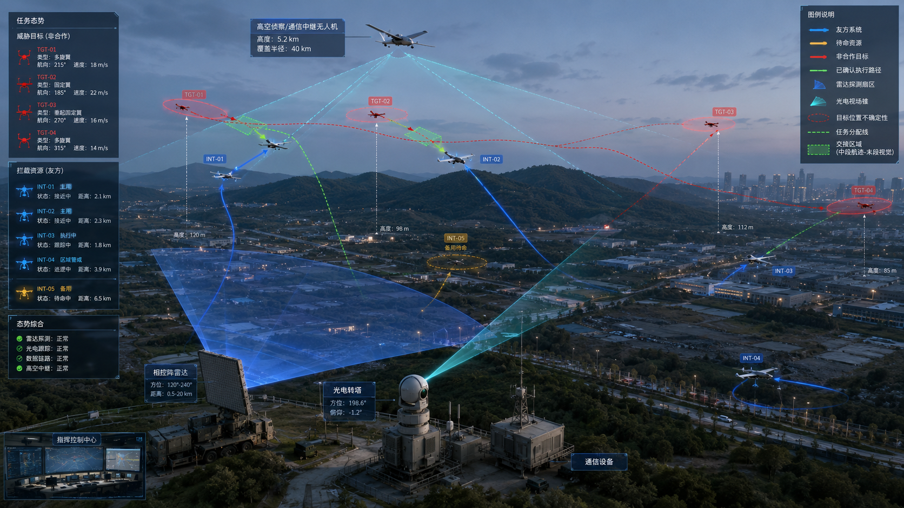

全景图把地面雷达、光电、指挥中心、高空节点、拦截资源和非合作目标放在同一任务空间。蓝色和青色表示友方探测与任务链，红色表示目标航迹，黄色表示备用资源。

## 1.2 三层节点体系

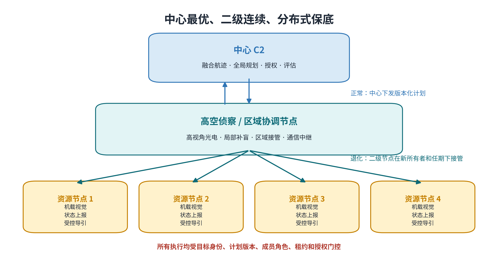

### 第一层 中心 C2

中心节点汇聚雷达、地面光电、高空节点和资源状态，维护全局目标表，生成版本化计划，记录人工授权和系统评估。正常状态下由中心负责全局优化，中心异常时由第二层节点按规则接管。

### 第二层 高空侦察与区域协调节点

高空节点利用俯视视角减轻地物遮挡，向指定区域提供光电引导线索、局部航迹摘要和通信中继。中心健康但航迹不确定度升高时，高空节点提供观测辅助，计划所有权仍保留在中心；只有中心健康状态进入失效后，满足持续就绪和合同条件的二级节点才可在受控区域接管。远距目标仍以雷达航迹和中心计划为主，无需全部经过高空节点处理。

### 第三层 拦截资源节点

拦截无人机接收中心维护的全局航迹编号和当前计划版本，执行中段位置比例导引；进入末端后，由机载相机确认本地视觉目标是否与中心分配目标一致。拦截资源无权自行重写全局身份，也不能使用过期计划继续执行。

## 1.3 完整拦截流程

一次完整任务由发现、融合、关联、研判、规划、导引、末端确认和结果回流八个环节组成。前一环节不仅向后一环节传递目标状态，还要同步传递时间、误差、身份和授权信息。

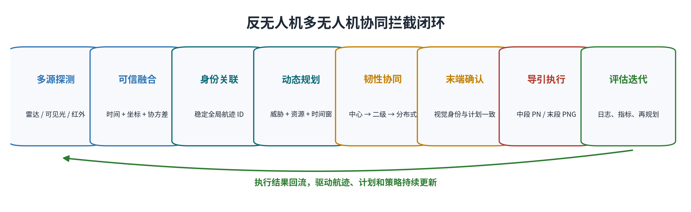

1. 雷达、地面光电和高空节点发现目标，形成带量测时刻、到达时刻和误差描述的观测。
2. 中心统一时间与坐标，融合目标位置、速度和协方差，形成全局航迹。
3. 多目标关联使用统计门控和全局匹配维持身份连续，并输出歧义与风险摘要；来源冲突或同源统计大跳先隔离。完整 JPDA/MHT 多假设保持和高歧义跨节点多帧延迟裁决尚未实现。
4. 指控系统结合威胁、剩余窗口和资源状态进行排序，滚动生成带版本、角色和有效期的计划。
5. 拦截资源按当前计划执行雷达中段比例导引，高空节点提供补盲、指向和通信中继。
6. 进入末段后，D5 将中心航迹投影到相机像面，与本地视觉轨迹核对；身份、版本、角色和证据时效全部通过后输出交接建议，D7 和运行时仍需独立检查相机、视线角速率、机动能力与导引门控。
7. D7 根据同一目标身份执行视觉末段比例导航；短时丢测有限外推，持续丢测或身份冲突立即回退。
8. 拦截结果、资源状态和视觉证据回流中心，触发任务结束、重捕、资源补位或新一轮规划。

流程包含三类保守分支：中心异常时由高空二级节点在限定区域接管；证据不足时保持中段、等待或重捕；计划过期、身份冲突或备用资源未获激活时拒绝末端执行。信息不完整时仍有明确动作，禁止依据最近目标继续追击。

## 1.4 雷达探测需求

雷达选型要从闭环误差预算反推。当前方案建议更新率达到 10 Hz 左右或更高，角精度达到 0.5° 级，距离误差控制在 1—6 m 量级，端到端时延控制在 100—200 ms，并同步输出时间戳、协方差、质量状态和来源信息。这些数值是下一步设备比选和联试的起点，尚未作为本项目设备验收结论。

### 1.4.1 探测距离与目标特性

单站雷达方程可概括为：

$$
P_r=\frac{P_tG_tG_r\lambda^2\sigma}{(4\pi)^3R^4L}
$$

其中，目标雷达散射截面积为 $\sigma$，距离为 $R$。接收功率按 $R^{-4}$ 衰减，意味着距离增加一倍，其他条件不变时回波功率下降到原来的十六分之一。小型复合材料目标的 $\sigma$ 较小，雨雾、地杂波和低仰角多径又会进一步降低有效信噪比，因此探测距离必须按目标类型和天气分档实测。

### 1.4.2 角精度与横向误差

小角度条件下，角误差导致的横向误差近似为：

$$
\sigma_y\approx R\sigma_\theta
$$

若角误差为 0.5°，在 1 km 处就对应约 8.7 m 横向误差。距离继续增大时，光电指向门、航迹关联门和末端交接区域都必须随协方差扩大，不能把雷达输出当作真值坐标。

### 1.4.3 雷达数据输出

严格闭环至少需要：量测时刻、到达时刻、距离/角度/速度或三维状态、协方差、航迹质量、传感器标识和消息谱系。缺少时间戳无法补偿延迟；缺少协方差无法设置合理门限；缺少谱系会把同一观测经中继重复融合，造成虚假的高置信度。

## 1.5 光电系统分工

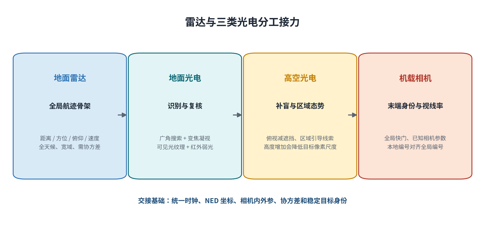

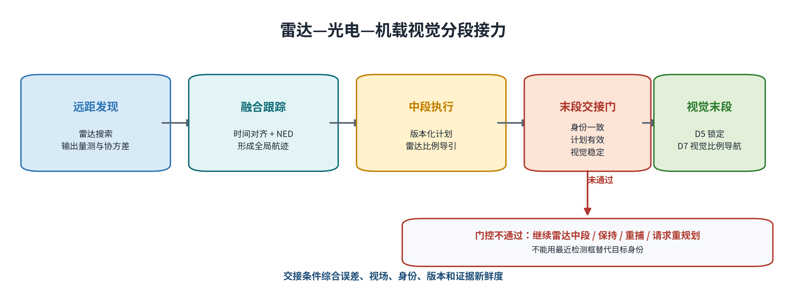

### 地面光电

地面光电应包含广角搜索与变焦凝视能力，日间可见光承担纹理和外形识别，热红外承担夜间与弱光补充。能力评估重点看目标在指定距离上的有效像素数、帧率、稳定精度、曝光时延和可复现的检测召回率。

### 高空光电

高空视角能够减少建筑和地形遮挡，但目标在画面中的像素尺度会随高度迅速减小。现有试验已经出现二级网络具备区域覆盖、单帧全目标可见性和跨视角注册仍不足的情况。任务高度、镜头、云台指向、推理尺寸和同步门限必须一起标定，单独增加视野覆盖解决不了目标像素不足和同帧配准问题。

### 机载相机

末端相机应优先采用全局快门、已知内外参和可靠时间戳，避免高速机动时滚动快门产生几何畸变。相机不仅要检测出框，还要把本地视觉编号与中心全局航迹编号建立受约束的临时对应，并保持多帧连续性。

## 1.6 无人机系统组成

一个可进入工程样机验证的资源节点至少包含：飞行平台、飞控、机载计算、全局快门相机、时间同步、通信链路、任务安全状态机和完整日志。项目已经在 AirSim SimpleFlight 中接通高层速度和高度控制接口；真实 PX4 低层姿态、推力响应和结构机动包线还需要台架和试飞数据支撑。

平台选型需要同时满足：

- 速度和加速度有足够接近余量，而非只比较最大速度；
- 相机视轴与机体机动协调，目标不会因转弯长期离开视场；
- 机载计算能够稳定处理视觉和门控，不因瞬时满载造成过期数据；
- 通信优先保障计划、身份和状态元数据，视频仅定向传输；
- 电池、链路、飞控和传感器故障均能进入明确的保持、重捕、重规划或中止状态。

## 1.7 观测与航迹计算

系统内部采用 NED 作为融合工作坐标。目标状态可写为：

$$
x_k=[p_x,p_y,p_z,v_x,v_y,v_z]^T
$$

常速度预测为：

$$
x_{k|k-1}=F_kx_{k-1|k-1},\qquad
P_{k|k-1}=F_kP_{k-1|k-1}F_k^T+Q_k
$$

量测到达后，使用量测模型 $h(\cdot)$、雅可比 $H_k$ 和量测协方差 $R_k$ 更新：

$$
K_k=P_{k|k-1}H_k^T(H_kP_{k|k-1}H_k^T+R_k)^{-1}
$$

$$
x_{k|k}=x_{k|k-1}+K_k[z_k-h(x_{k|k-1})]
$$

每次滤波更新同时给出目标状态和这份状态的可信程度。协方差 $P$ 随航迹一起向后传递，直接影响目标关联范围、资源分配代价、光电投影区域和导引切换条件。

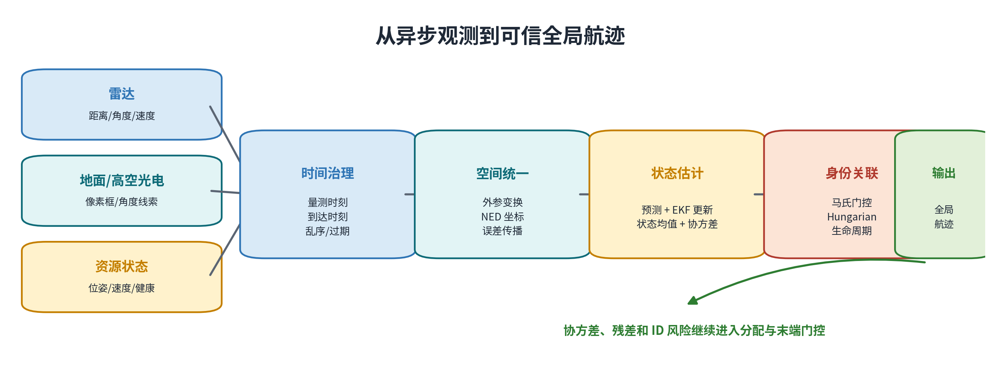

### 双时间戳

系统同时保留量测时刻（`measurement_timestamp`）和到达时刻（`arrival_timestamp`）。二者之差包含传感器处理和网络延迟。若把迟到量测直接当作当前量测，高速目标的估计位置会持续落后。历史签入的三目标、8 秒、`dt=0.5`、seed 7 合成基线中，延迟补偿位置 RMSE 为 2.200 m，未补偿为 7.732 m；当前分支同参数复算为 2.024 m 和 7.607 m。两组结果均为合成实验，改善方向一致，实际收益仍需真实雷达数据复核。

<!-- PAGEBREAK -->

# 第二部分 关键技术

现有方案归纳为可信航迹、身份连续、滚动规划、韧性接管和中末段协同五项关键技术。它们按任务时序衔接，质点模型、AirSim 和统一评估贯穿全程，用于复现问题、比较方案和积累工程数据。

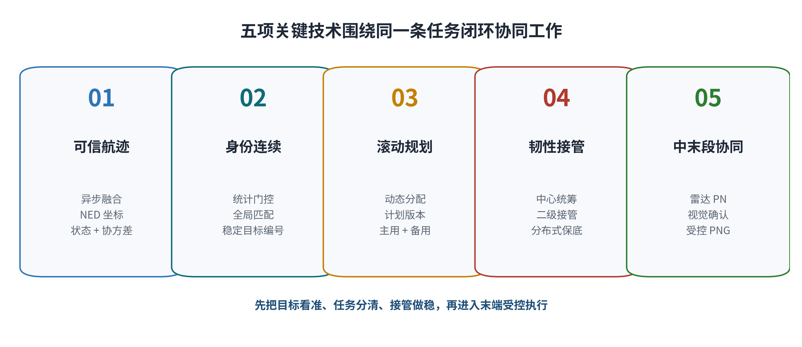

本章依次说明五项技术的原理、当前做法和已有仿真效果。

## 2.1 多源异步融合

雷达、声学和光电观测具有不同采样率与到达顺序。上游先完成外部坐标和传感器位姿规范化；雷达、声学和可选合成 LiDAR 以 NED 几何输入，光电观测保留像素坐标并携带相机模型。D1 按到达时刻接收，在固定滞后窗口内按量测时刻回放更新六状态 NED 航迹。


上图为 D1 现有仿真结果。三条实线是目标真实轨迹，散点是估计结果。蓝色散点采用延迟补偿，能更紧地贴近真实运动；橙色散点未补偿时，在快速运动段出现更明显的滞后。该结果说明时间治理会直接改变航迹几何，进而影响后面的身份关联、资源分配和光电指向。

当前算法已经支持双时间戳、协方差传播、乱序回放和重复来源抑制。下一步需要完成真实 producer 接线、传感器与相机标定、像素协方差标定、按传感器统计的归一化创新平方与一致性验证，并关闭融合链路 100 ms 运行预算。

## 2.2 多目标身份连续

多目标靠近或交叉时，最近的量测未必属于原来的目标。项目先用预测状态和协方差形成统计门，再在所有候选之间做全局匹配。常用判据是马氏距离：

$$
d_{ij}^2=(z_j-Hx_i)^TS_{ij}^{-1}(z_j-Hx_i),\qquad S_{ij}=HP_iH^T+R_j
$$

预测越不确定，合理搜索范围越大；残差超出统计范围的量测不进入匹配。

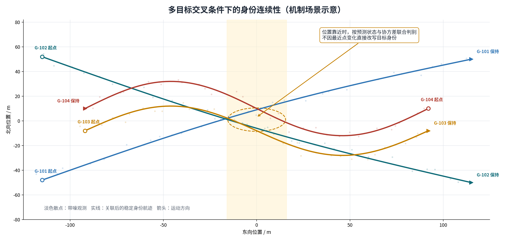

图中淡色散点表示带噪观测，实线表示关联后形成的航迹。四个目标在中央区域密集交叉，系统继续保持中心分配的全局航迹编号。该机制场景用于说明身份连续的处理方式；真实 AirSim 中的目标真值只在试验结束后评分，不进入在线关联。

目前默认路线采用全局最近邻和 Hungarian 求解，优点是计算快、结果容易复核。重复 payload/lineage 拒绝、跨节点注册和合成长序列回放已经实现；开放问题集中在更长真实乱序、遮挡和杂波组合回放，高歧义跨节点多帧注册、owner/epoch 故障转移、外观特征实证及 D1 数值融合闭环。

## 2.3 滚动资源规划

空中态势每一秒都在变化。系统持续接收新航迹和资源状态，滚动生成带所有者、版本、角色和有效时间窗的计划，每次只执行当前有效的一段。普通目标通常分配一个主资源；高威胁目标可以形成“2 个主用 + 1 个备用”的小联盟，备用资源保持安全间隔，只有收到新版本激活后才补位。

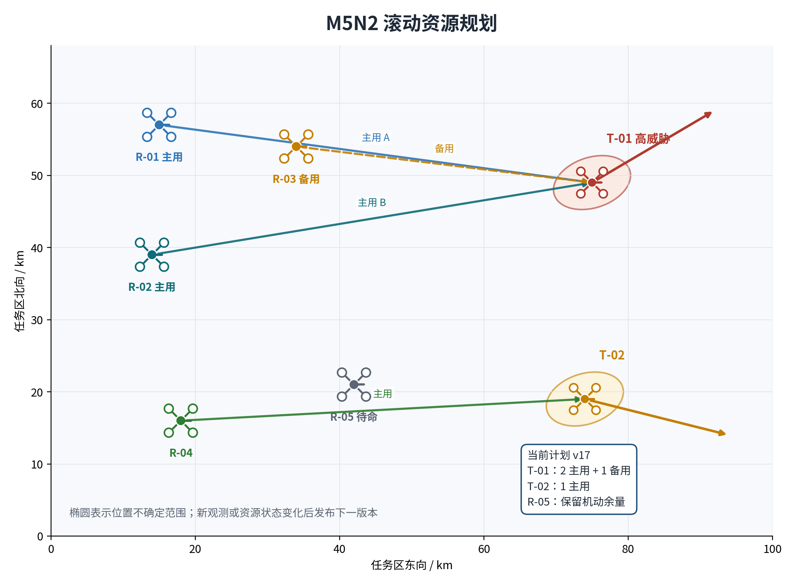

图中椭圆表示目标位置的不确定范围，实线表示当前已激活任务，虚线表示备用关系。R-05 留在机动位置，避免所有资源在同一时刻被占满。main/runtime 在观测、威胁、资源状态或末端反馈变化后调用 D3 重算；迟滞机制抑制小幅代价波动造成的频繁换目标。具体末端扇区和物理安全间隔由下游控制验证。

这项技术的难点已经从“能否求出匹配”转到“计划在真实运动中能否兑现”。2026 年 7 月 13 日的 40 回合预筛历史最佳为 5/10；2026 年 7 月 15 日的独立 20 回合批次中，第二主资源进入 5 m 和联盟完成均为 0/20，但计划身份和成员 roster 保持稳定。物理闭环仍未达到 8/10 门限。

## 2.4 韧性接管

正常状态下，中心拥有最完整的态势和资源信息，负责发布全局计划。中心心跳超时后，高空二级节点可以在限定区域内接管；中心和二级都不可用时，资源之间才进入受约束的分布式保底。接管过程会更新计划所有者、任期、租约和版本，执行端只接受当前唯一有效的计划。

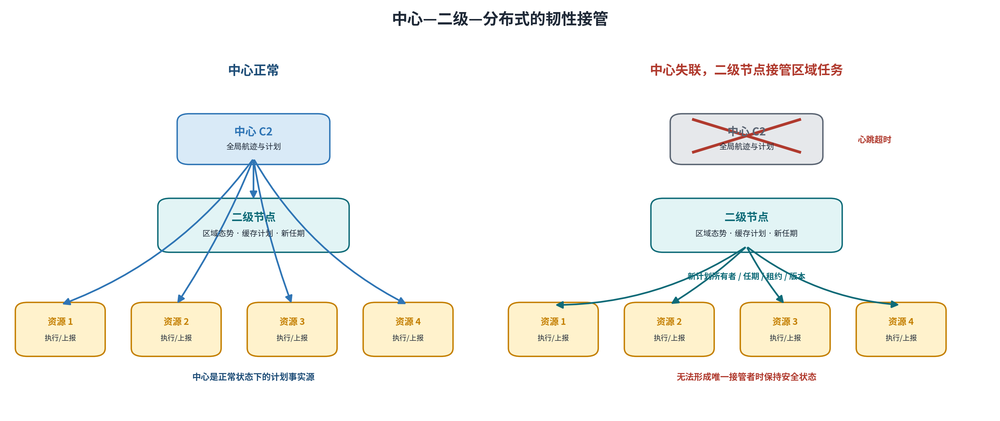

左图表示中心正常下发任务，右图表示中心失联后二级节点建立新任期并接管区域资源。若网络分区后无法确认唯一接管者，系统维持安全状态，避免两套计划同时生效。现有故障注入已经覆盖中心故障、二级故障、时延、丢包和分区恢复；真实无线竞争、时钟漂移和认证开销仍需在半实物环境中验证。

## 2.5 中末段协同

远距阶段依靠雷达航迹和中心计划执行位置比例导引，机载相机不必一直稳定看见目标。进入末段后，D5 只提供交接或预锁建议；D7 和运行时继续检查计划版本、联盟角色、D4 仲裁、视觉身份、相机几何、视线角速率、机动余量和证据新鲜度，条件齐备后才切换到视觉比例导航。短时丢测可以有限外推，持续丢测或身份冲突则回到雷达中段、等待重捕或请求重规划。

### D5 末端关联

D5 把中心分配的三维航迹和协方差投影到当前相机像面，再与本地检测轨迹进行几何匹配。候选还要通过计划版本、资源角色、友方冲突、唯一性和证据时效检查。D5 只核对既有全局身份，不创建或改写目标编号。

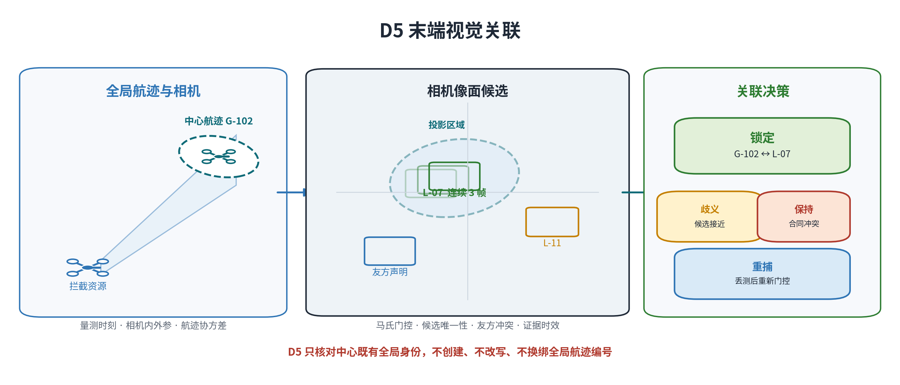

图中中心航迹 G-102 在像面形成预测区域，本地轨迹 L-07 连续三帧落入门内并保持唯一，输出“锁定”。候选接近、合同冲突或检测中断时，分别进入“歧义”“保持”或“重捕”。

### D7 比例导引

D7 默认使用目标与拦截资源的二维平面位置、速度估计计算视线角速率、闭合速度和比例导引横向指令；三维比例导引目前只用于离线基准和建议。末端 `png_vm/png_ttc` 根据检测框水平中心估计方位与视线角速率，并结合框面积变化、闭合速度和质量门生成水平速度候选，垂向速度由调用方提供。

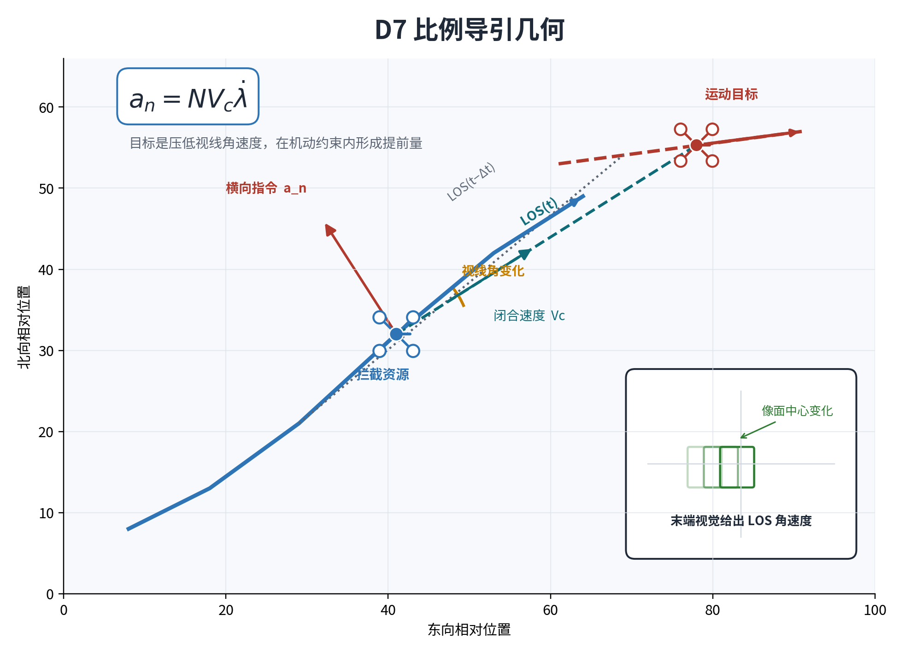

比例导引通过压低视线角速度形成提前量。雷达中段使用二维平面相对运动，视觉末段使用像面水平中心变化。中段对横向加速度和转率限幅；末端候选还要通过检测框、视线角速率、闭合速度和机动裕度质量门。D3 计划、D4 许可和 D5 身份锁定是独立的保守合同开关，任一不满足时实际执行律保持 `radar_pn`。

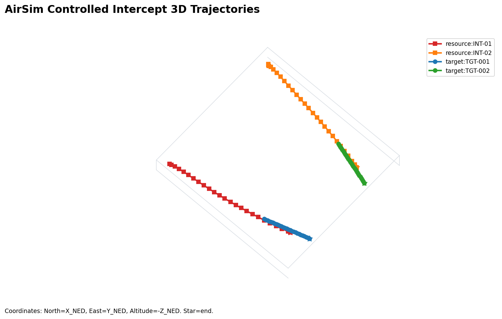

上图取自已有 AirSim 全流程试验。红、橙轨迹为两架拦截资源，蓝、绿轨迹为两个运动目标；轨迹在各自末段形成接近，说明高层控制、目标运动和导引链路已经能在三维场景中联动。该历史 2v2 案例完成 2/2 actor 碰撞拦截，但 71 行记录中只有一架资源出现 4 帧 `vision_terminal`，另一架未进入该模式。该图支持混合雷达比例导引、保守回退和 SimpleFlight 接口已联动，不支持“两架资源稳定完成视觉接管”或统计命中率结论。

### 交接门控

当前瓶颈包括 30—50 m 视觉获取、第二主资源进入 5 m、成员间距与停控归因、持续实测锁定、三维机动标定和外层控制周期 100 ms 预算。最新批次中 D7 内部阶段 P95 为 5.78 ms，3805 个外层 control tick 全部超预算，主要耗时不在比例导引公式本身。

<!-- PAGEBREAK -->

# 第三部分 主要方案

本部分给出指控计划、威胁评估、资源分配、群协同和中末段导引方案，说明各环节如何形成统一的执行闭环。

## 3.1 指控计划更新

指控系统接收带不确定性的航迹集合、资源状态和任务约束，生成可执行、可撤销、可审计的版本化计划。中心健康时，D4 保持中心计划所有权，只输出继续中心、请求中心重规划、请求二级观测辅助或安全保持；只有中心健康状态进入失效后才允许二级接管，二级不可用后才进入分布式保底。

一项可执行计划至少要绑定：目标全局身份、资源身份、计划版本、计划所有者、联盟角色、激活状态、有效时间窗和授权状态。任何一个关键字段不一致，都必须拒绝继续执行。

## 3.2 威胁评估

背景资料给出了距离、速度、任务危害和航向等威胁排序因素。工程上需要根据场景、航迹质量和剩余时间窗校准权重，可写成：

$$
W_j=f(d_j,v_j,h_j,\tau_j,q_j,P_j,\text{mission})
$$

其中 $d_j$、$v_j$、$h_j$ 表示几何和运动，$\tau_j$ 表示剩余时间窗，$q_j$ 表示航迹质量，$P_j$ 表示状态协方差。任务场景变化时，权重和门限必须通过历史数据、仿真和人工规则共同校准。

当前 D3 直接消费归一化时间窗代价、协方差、威胁度、资源状态、视场难度、冲突风险和切换惩罚；硬时间窗及可达性用于禁配。距离、预计到达时间、资源速度和机动余量需要由上游或 D7 转换为 D3 可消费字段，尚不是核心代价模型的直接输入。背景资料中提出的完整 IFCM 态势推理和在线贝叶斯修正尚未进入运行链路。

## 3.3 资源—目标分配模型

设资源集合为 $R=\{r_i\}_{i=1}^M$，目标集合为 $T=\{t_j\}_{j=1}^N$，$x_{ij}\in\{0,1\}$ 表示资源 $i$ 是否分配给目标 $j$：

$$
\min\sum_{i=1}^M\sum_{j=1}^N C_{ij}x_{ij}
$$

基础约束为：

$$
\sum_jx_{ij}\le 1,\qquad \sum_ix_{ij}=k_jz_j,\qquad z_j\in\{0,1\}
$$

普通目标通常取 $k_j=1$。高威胁目标可显式声明 $k_j>1$，表示需要多个有角色的资源槽；$z_j$ 表示该目标联盟是否完整准入。当前需求槽算法在发布层执行全有或全无准入，但尚不是 CP-SAT/MILP 意义下的全局最优模型。当前代价 $C_{ij}$ 综合：

1. 归一化接近窗口代价；
2. 目标威胁与硬时间窗；
3. 航迹协方差和质量风险；
4. 资源健康和任务状态；
5. 相机视场和末端获取难度；
6. 资源间冲突及安全约束；
7. 更换已有任务产生的迟滞代价。

当前在线路线使用 SciPy Hungarian 处理一对一和展开后的需求槽，并配合全有或全无准入、滚动重规划和迟滞。隔离容量基准已经完成 SciPy 路径，OR-Tools 最小费用流当前不可用；CP-SAT/MILP 联盟参考、复杂流、同步和多窗口优化仍是可选 P2 研究项，均未进入默认链路。

## 3.4 计划版本管理

目标和资源都在运动，任何计划都有寿命。设第 $v$ 版计划在 $t_v$ 生成，资源执行时刻为 $t$。若收到更新版本 $v+1$，旧版本必须被明确取代；若计划年龄、目标身份或资源状态超过阈值，执行端必须请求重评估。否则会出现中心已经换目标、无人机仍追旧目标的失配。

滚动规划的基本思想是：

$$
\pi_t^*=\arg\min_{\pi}\;J(\pi\mid \hat{x}_t,P_t,R_t),
\qquad \pi_t^*\rightarrow \pi_{t+\Delta t}^*
$$

每次只执行当前计划的一小段，再用新观测和执行反馈重算；同时用迟滞避免微小代价波动导致频繁换目标。

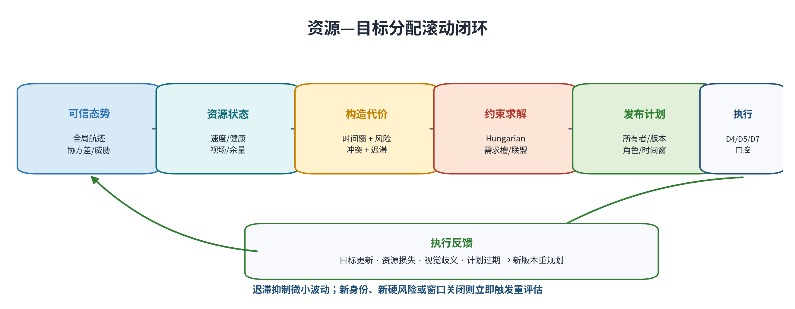

## 3.5 网约车派单与空中目标分配

网约车匹配提供了一个有价值的参照：两者都可以形成资源—任务二部图，也都能用 Hungarian、最小费用流或拍卖算法求解。空中目标分配还要处理观测误差、身份不确定和执行反馈，普通派单模型无法直接覆盖这些问题。

| 比较维度 | 网约车的工程抽象 | 空中多目标拦截 |
| --- | --- | --- |
| 状态可观测性 | 司机和乘客合作上报 GNSS，身份已知、位置相对稳定 | 目标不合作，只能由雷达/光电间接观测 |
| 误差表达 | 可近似使用单一位置和预计到达时间 | 必须保留协方差、遮挡、漏检、虚警和异步时延 |
| 身份 | 账号、车辆和订单绑定明确 | 目标交叉或遮挡后可能发生身份切换 |
| 运动 | 路网约束强，意图相对合作 | 三维连续运动，可机动、分裂、汇聚或规避 |
| 时间 | 迟到通常意味着服务体验下降 | 迟到可能直接使拦截窗口关闭 |
| 资源耦合 | 一车一单是主要模式 | 高威胁目标可能需要多个主用和备用资源 |
| 安全约束 | 路网交通规则由外部系统约束 | 还需考虑视场、碰撞、通信和联盟一致性 |
| 计划结果 | 匹配后主要等待服务完成 | 执行会反过来改变观测几何和后续计划 |

网约车属于高可观测、低噪声、合作式定位下的动态匹配。空中问题具有部分可观测特征，至少包含四个互相耦合的子问题：

```text
状态估计 → 身份关联 → 受约束分配 → 执行反馈与再规划
```

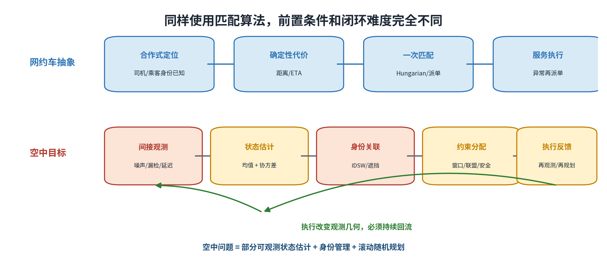

Hungarian 负责求解当前代价矩阵下的匹配；目标身份、代价可信度、计划时效和执行安全由前后环节共同保证。

## 3.6 分层群协同

### 正常中心化

中心拥有最完整的态势，应作为正常模式下的计划事实源。各资源上传状态和证据，中心避免重复追逐、目标遗漏和局部冲突。

### 二级接管

中心健康但计划持续不可信时，高空侦察节点提供观测辅助，中心负责重规划或安全保持。只有中心健康状态进入失效后，高空侦察节点才可使用缓存航迹和区域资源池接管局部任务。接管必须携带新的计划所有者、任期、租约和计划版本，不能仅凭“还能通信”就默认获得控制权。

### 完全分布式保底

中心和二级节点均不可用时，资源之间可交换任务摘要和报价。基础 CBBA/拍卖是单赢家或候选选择基线。当前实现可对上游已给定的联盟成员集执行双版本、任期、租约、摘要和必要成员确认的原子提交；尚不支持自主形成多成员联盟，也未实现备用资源激活、补位、缩编或整盟重组。条件不齐时保持安全状态。

## 3.7 高威胁目标协同

### 同时到达

要求主资源到达时间离散度满足：

$$
\max_i t_i^{arrival}-\min_i t_i^{arrival}\le\Delta t_{sim}
$$

它适合窗口极短且资源性能接近的场景，但最慢成员可能拖累全组，多机同时进入还会增加碰撞、遮挡和视场冲突。

### 序贯波次

资源按波次到达：

$$
t_i^{arrival}=t_0+w_i\Delta t
$$

优点是首批结果可以影响后续计划，缺点是总任务时间更长，对反馈和重规划时延敏感。

### 2 主用 + 1 备用

两个主用资源按当前计划执行，备用资源保持待命并继续观测。首批失败、失联或身份不一致时，D4 输出重规划、重构或保持动作，由 main/D3 发布新版本并决定是否激活备用资源。D4 当前不自主发现或激活备用资源；备用资源未获新版本激活前即使看见目标，也不能自行进入末端导引。具体末端扇区和物理安全间隔由下游控制验证。

该策略用于当前阶段的对照和问题收敛，尚未经过实飞比较来证明最优。2026 年 7 月 13 日历史参数批次最佳完成 5/10；7 月 15 日独立批次的第二主资源和联盟完成均为 0/20。计划合同能够运行，协同物理性能仍未闭合。

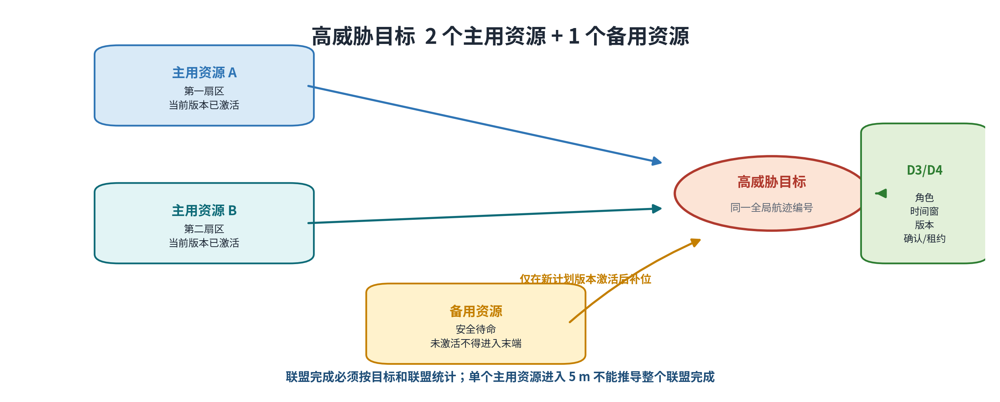

## 3.8 中段与末段导引

### 中段比例导引

经典比例导引使用闭合速度 $V_c$ 和视线角速率 $\dot{\lambda}$：

$$
a_n=N V_c\dot{\lambda}
$$

其中 $N$ 为导航系数，$a_n$ 为垂直于视线方向的横向指令。D7 保持 PN/PNG 核心公式稳定，现阶段重点完善输入新鲜度、平台机动余量和任务门控。

### 末端视觉导引

视觉端依据检测框中心随时间的变化估计视线角速率。在线 D7 导引不读取 AirSim actor 的真值身份或状态；真值只用于合成传感器、离线配对与绘图，以及运行后 NED 三维 5 m 评分。只有 D3 计划有效、D4 允许继续、D5 已稳定锁定同一全局航迹编号、相机几何和时延均合格时，才允许从雷达中段切换到视觉末段。

短时丢测可有限外推；持续丢测、身份歧义、友方冲突、过期计划或未激活备用资源都必须回退雷达中段比例导引、保持、重捕或请求重规划，不能用“最近检测框”替代身份确认。

<!-- PAGEBREAK -->

# 第四部分 当前进展与下一步计划

## 4.1 平台进展

现有方案已经明确中心节点、地面雷达、高空侦察节点、拦截无人机、机载计算、相机和通信系统的能力建议，并在 AirSim 中跑通 SimpleFlight 高层控制接口。现有资料暂未包含可核验的实飞原始数据、真实平台历次改型时间线、飞控日志和结构参数，因此实飞部分按待补处理。

### 体系设计

- 资源数量和目标数量均按输入动态变化，不以 2v2 或 5v5 为算法上限；
- 平台需要向规划层提供速度、机动余量、健康状态、续航和可用性；
- 相机需要提供内参、外参、曝光/量测/到达时刻及检测置信度；
- 飞控和机载计算只执行当前有效的高层任务，不拥有全局目标身份；
- 实机参数必须替换仿真假设，尤其是最大转弯率、横向加速度、速度响应和视觉处理时延。

### 实飞与改型资料

本节的正式填报模板见附录 A。至少需要补齐：平台版本、改型原因、试飞日期、飞行工况、速度/航时/机动能力、控制时延、载荷和通信配置、故障现象、改型结论及原始日志路径。在资料补齐前，本节不得用于声称已完成真实平台验证。

## 4.2 软件和算法进展

| 能力 | 目前做到的 | 还要补的 |
| --- | --- | --- |
| 多源融合 | 双时间戳、NED 航迹、观测/航迹协方差、乱序回放和来源去重已经接通 | 真实 producer、传感器/相机/协方差标定、一致性验证和 100 ms 预算 |
| 多目标关联 | GNN/Hungarian 主线、身份连续性统计、来源冲突隔离和跨节点注册已经具备 | 真实长遮挡/杂波/乱序回放、高歧义多帧注册和故障转移 |
| 动态分配 | 动态 M/N、迟滞、计划版本、需求槽、逐 tick 历史和 2+1 联盟合同可以运行 | 多 seed 权重标定、复杂约束参考和真实物理收益 |
| 分层降级 | 中心失效后二级/分布式仲裁以及任期、租约、确认门控已经接通 | 自主多成员联盟、备用补位、真实无线网络、认证和时钟漂移 |
| 末端视觉 | 几何投影、身份门控、锁定、歧义和重捕状态已经具备 | 30/50 m 检测、第二主资源、几何漂移和同一决策周期的新鲜度 |
| 系统评估 | 七源写盘证据可离线生成带可用性标记的 CSV、JSON、中文报告和二维图表 | 实飞数据、长期趋势、证据谱系、第二主资源闭环和可选外部评估器 |
| 比例导引 | D7 已实现二维中段 PN、视觉 PNG 候选、合同门控和 SimpleFlight 兼容速度输出；main/runtime 负责映射到 AirSim 控制接口 | 外层 100 ms 预算、成员间距/停控归因、三维机动、真实飞控、气动和实机安全包线 |

## 4.3 本次回归复核

2026 年 7 月 17 日在基于 `main` 提交 `d02167c` 建立的干净文档集成分支中执行规定的八组测试，结果如下。计数不包含主工作区尚未提交的 D5/AirSim 修改。

| 范围 | 结果 |
| --- | ---: |
| D1 多源融合 | 111 passed |
| D2 数据关联 | 123 passed，1 environment warning |
| D3 分配规划 | 157 passed，1 optional skipped |
| D4 分布式降级 | 280 passed |
| D5 末端关联 | 288 passed |
| D6 评估指标 | 272 passed，1 environment warning |
| D7 比例导引 | 190 passed |
| AirSim runtime | 148 passed，1 environment warning |
| **合计** | **1569 passed，1 optional skipped** |

测试结果证明当前模块接口和回归状态稳定，但它不能代替真实传感器、真实无线链路、真实飞控和实机拦截试验。

## 4.4 AirSim 验证

### 4.4.1 严格密集交叉

2026 年 7 月 13 日的计算机视觉严格交叉场景使用 5 个目标，分 4 m 和 2 m 间距，每组 20 个随机种子，共 40 个试验回合、每个 51 帧。在线链路不读取 AirSim 目标真值，真值只在结果写盘后用于评分。

| 指标 | 默认基线 | 最佳 GNN 候选 | 判断 |
| --- | ---: | ---: | --- |
| 身份切换计数 | 1.3583 | 0.6167 | 下降 54.6% |
| 航迹连续率 | 0.9810 | 0.9840 | 仅提高 0.0030 |
| 循环时延第 95 百分位 | — | 24 ms | 满足筛选预算 |

2026 年 7 月 13 日采用固定连续率提高 0.10 的 v1 门限时，候选方案未通过。7 月 15 日使用 ceiling-aware v2 对冻结回放重算后，身份切换、连续率、虚假航迹、P95 时延和真值隔离五项总体门限全部通过，形成晋级评审建议；只有 clutter 和 combined 分档完整通过，默认在线 GNN/Hungarian 配置未自动改变，仍需更长场景和跨模块评审。

### 4.4.2 D4 故障矩阵

同一轮验证覆盖正常、中心故障、中心与二级同时故障、0.5 秒时延、30% 丢包和网络分区恢复六类场景，每类 10 个随机种子，共 60 个案例。

| 指标 | 结果 |
| --- | ---: |
| 安全结果 | 60/60 |
| 误降级 | 0 |
| 重复计划所有者 | 0 |
| 双主防护失败 | 0 |
| 30% 丢包下保守拒绝 | 7/10 |

该结果证明试验回合内故障注入下的逻辑安全，不代表已经验证真实射频干扰、带宽竞争、时钟漂移和生产级网络认证。

### 4.4.3 M5N2 协同物理闭环

2026 年 7 月 13 日的 SimpleFlight 参数预筛包含 5 个资源、2 个目标，高威胁目标使用 2 个主用资源和 1 个备用资源；10 个随机种子、4 组参数，共 40 个试验回合，按 NED 三维最近距离不大于 5 m 判定单资源物理成功。

| 参数组 | 联盟完成率 |
| --- | ---: |
| 基线 | 0/10 |
| 20 m / 3 s / 40° | 5/10 |
| 20 m / 5 s / 40° | 2/10 |
| 20 m / 8 s / 40° | 1/10 |

历史最佳 5/10 未达到 8/10 验收线。主要失败原因是 D5 未锁定、末端视觉获取超时和少量目标框过小。安全侧保持：备用资源越权 0、全局身份改写 0、在线真值使用 0。

2026 年 7 月 15 日又运行 baseline/candidate 各 10 个独立回合。20/20 actual evidence 可用，pair/target/coalition 分别为 12/60、12/40、0/20，第二主资源进入 5 m 为 0/20，计划和成员 churn 为 0。第二主资源的 assigned/visible/associated/contract 为 20/20，control/mode 为 17/20，说明多数案例已经到达合同和控制层。20 个回合最终均记录为 `collision_stop`，但没有保存碰撞对象，不能把 0/20 单独归因于 D5 门控或 PN/PNG 公式。当前卡点是第二主资源的物理可达性、持续实测锁定、成员间距、停控归因和碰撞证据谱系。

### 4.4.4 原生视觉筛选

ByteTrack 和 BoT-SORT 在 1920×1080、90° 视场、20/30/50 m 和不同置信度下完成 18 个 AirSim 筛选案例。20 m 条件下跟踪连续性和处理延时达标，但检测精确率和召回率约为 0.26—0.33；30/50 m 没有形成有效检测。准入候选数和双相机确认执行数均为 0，在线检测暂时继续使用 AirSim `simGetDetections` 元数据。

另有主级日期化报告记录 YOLOv8 与 ByteTrack 的三种子接线试验。D5-owned 资料没有保留可独立复核的精确统计，当前只确认接口可运行；样本不足以冻结检测、多目标跟踪阈值或计算预算。

### 4.4.5 远距雷达直接分配

主级 E5 日期化报告记录：2v2 远距场景中，中心计划所有者和版本全程稳定，D4 继续执行中心计划为 14/14，D7 保持雷达中段比例导引为 14/14；5v5 三种子中，D4 继续执行中心计划为 105/105。这些数字尚未由当前 D4/D6 模块证据独立重算。

这个结果确认了分层逻辑：远距阶段由可信雷达航迹和中心计划支撑，末端相机尚未锁定不会直接触发二级节点或二次分配。进入末端距离、出现身份硬冲突或计划失效后，D4/D5 门控成为执行前置条件。

## 4.5 成熟度判断

| 层级 | 已经具备 | 尚未具备 |
| --- | --- | --- |
| 算法/合同 | D1—D7 数据合同、版本、身份和安全门控；动态 M/N | 不能由此推导真实传感器性能或实机拦截效能 |
| 离线质点 | 可重复的全流程、批量随机种子和指标输出 | 真实气动、相机、飞控和无线链路 |
| AirSim 计算机视觉 | 多相机、检测、真值隔离、密集交叉和故障注入 | 稳定远距检测、真实多光谱和真实网络 |
| AirSim SimpleFlight | main/runtime 高层控制、D7 二维 PN/视觉 PNG 候选、M5N2 物理距离判据 | 8/10 联盟门限、外层 100 ms 预算、三维机动和真实 PX4 姿态/推力闭环 |
| 工程样机 | 体系需求和接口字段已提出 | 尚无可核验的实飞与历次改型数据 |

## 4.6 下一阶段实施路线

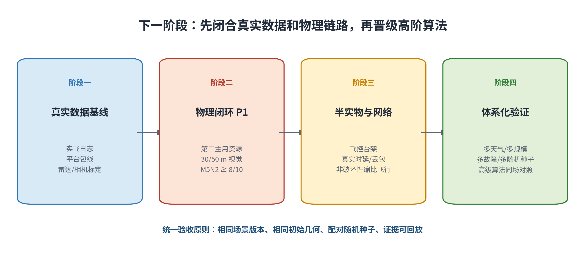

### 阶段一 真实数据基线

1. 汇入项目组提供的实飞日志，统一时间轴、坐标系和平台版本。
2. 冻结最大速度、加速度、转弯率、速度响应、续航和振动范围。
3. 标定相机内外参、曝光时延、飞控姿态时延和机体遮挡区。
4. 接入雷达/雷达模拟器的原始量测、航迹、质量和协方差输出。

**退出条件**：每条关键参数都能追溯到试飞或台架记录，仿真配置不再使用无法解释的理想值。

### 阶段二 物理闭环 P1

1. 因果拆解第二主用资源的可达性、视觉获取、锁定稳定性和计划窗口。
2. 提升 30/50 m 目标像素尺度、检测召回和长序列 MOT 样本量。
3. 复用已写盘的 D3 逐时刻计划历史，在 3v5、5v3、目标新增、资源失效和需求变化多 seed 场景中量化成员与版本变化。
4. 在相同随机种子对照下重跑 M5N2，使既定最佳参数组至少达到 8/10。

**退出条件**：联盟完成、视觉准入、越权和身份安全指标同时达标，单项成功率提高不足以通过本阶段验收。

### 阶段三 半实物与真实网络

1. 机载计算 + 全局快门相机 + 飞控建立闭环台架。
2. 使用真实链路注入延迟、丢包、带宽竞争和时钟漂移。
3. 接入 PX4/同级飞控高层接口，验证指令时延、饱和和回退状态。
4. 使用安全靶标完成非破坏性缩比飞行，记录全量 D6 证据。

**退出条件**：逻辑安全、网络韧性、视觉锁定和平台控制在同一时间轴上形成可回放证据。

### 阶段四 体系化验证

覆盖多目标规模、混合速度、遮挡、天气、中心和二级节点故障及资源损失；将 2v2、5v5、M5N2 继续作为基线场景，但算法规模由输入参数决定。高级关联、复杂优化和学习方法只在相同场景与指标下证明收益后再晋级。

# 结论与需协调事项

## 结论

总体看，项目已经把感知不确定性、目标身份、滚动分配、降级接管和中末段导引组织进同一条可回放的科研仿真链路。五项关键技术都有了软件基础，D1 轨迹和 AirSim 三维拦截也给出了直观效果，但真实传感器、无线链路和平台控制数据仍然不足。

指控和资源规划可以借用网约车派单的优化工具，前置条件却复杂得多。空中目标的位置和身份来自带噪观测，计划还会受时间窗、联盟角色、通信状态和执行反馈影响。因此，工程顺序应当是先把观测、身份和计划有效性做实，再追求更复杂的最优算法。

下一阶段的主攻方向已经比较清楚：一是解决 M5N2 第二主资源的视觉获取和稳定锁定，二是用实飞数据校准平台模型和传感器误差。两项工作闭合后，再进入真实网络、飞控台架和非破坏性缩比飞行。

## 协调事项

1. **数据**：实飞日志、平台改型记录、雷达/光电样本、飞控与相机统一时钟记录。
2. **条件**：全局快门相机/机载计算台架、雷达或可输出协方差的雷达模拟器、可控网络故障环境。
3. **试验组织**：统一场景版本、平台版本、随机种子、验收线和证据归档规则，先完成非破坏性缩比闭环，再扩大场景复杂度。

<!-- PAGEBREAK -->

# 附录 A 平台实飞与历次改型资料待补表

> **状态：待项目组提供。** 本表为空不影响软件证据结论，正式定稿前由平台负责人补齐并复核。

| 字段 | V1 初始平台 | V2 第一次改型 | V3 当前平台 | 下一改型 |
| --- | --- | --- | --- | --- |
| 负责人/试飞日期 | 待补 | 待补 | 待补 | 待定 |
| 改型原因 | 待补 | 待补 | 待补 | 待定 |
| 机体/动力/桨叶 | 待补 | 待补 | 待补 | 待定 |
| 飞控及固件版本 | 待补 | 待补 | 待补 | 待定 |
| 机载计算与软件版本 | 待补 | 待补 | 待补 | 待定 |
| 载荷、相机和通信 | 待补 | 待补 | 待补 | 待定 |
| 最大稳定速度 | 待补 | 待补 | 待补 | 指标待定 |
| 最大可用加速度/转弯率 | 待补 | 待补 | 待补 | 指标待定 |
| 续航与任务时间 | 待补 | 待补 | 待补 | 指标待定 |
| 指令—响应时延 | 待补 | 待补 | 待补 | 指标待定 |
| 相机曝光—输出时延 | 待补 | 待补 | 待补 | 指标待定 |
| 主要异常 | 待补 | 待补 | 待补 | — |
| 改型后改善 | 待补 | 待补 | 待补 | — |
| 原始日志/视频/报告路径 | 待补 | 待补 | 待补 | — |

建议至少提供 CSV/ULog/飞控日志、相机时间戳、平台质量和电池信息；若只有口头结论，应标为访谈记录，不能与原始测量数据同级。

# 附录 B 五项关键技术与现有模块映射

| 关键技术 | 主要模块 | 关键输入 | 关键输出 | 当前缺口 |
| --- | --- | --- | --- | --- |
| 可信航迹 | D1 | 异步雷达、声学、光电和可选合成 LiDAR，双时间戳、协方差和几何 | 六状态 NED 航迹、6×6 协方差、质量与时延摘要 | 真实 producer、标定、长期一致性和运行预算 |
| 身份连续 | D2 | 预测航迹、量测、统计门和跨节点摘要 | 稳定全局目标编号与风险摘要 | 真实长遮挡/杂波/乱序、高歧义注册和故障转移 |
| 滚动规划 | D3 | 航迹、威胁、资源状态和末端反馈 | 带所有者、版本、角色、时间窗的计划和逐 tick 历史 | 多 seed 权重、复杂约束参考和真实物理收益 |
| 韧性接管 | D4 | 中心/二级健康、计划、确认和租约 | 继续、重规划、二级接管或保底动作 | 自主多成员联盟、备用补位、真实网络和认证 |
| 中末段协同 | D5、D7 | 全局航迹、本地视觉、相机几何和授权 | 视觉交接建议、二维 PN/视觉 PNG 候选与回退动作 | 30/50 m 检测、第二主资源、持续实测锁定、三维机动和实机控制 |

# 附录 C 关键数学关系汇总

1. 雷达回波：接收功率与目标散射截面成正比，与距离四次方成反比。
2. 角误差传播：横向位置误差约等于距离乘以角误差。
3. 状态预测：用运动模型外推位置和速度，同时传播上一时刻协方差并加入过程噪声。
4. 马氏门控：用残差及其协方差衡量量测与预测航迹的统计距离。
5. 资源分配：在资源数量、目标需求、时间窗和安全约束下，使总代价最小。
6. 版本化滚动计划：只执行当前短窗口，接收新观测和反馈后生成下一版本。
7. 比例导引：横向指令由闭合速度、视线角速率和导航系数共同决定。
8. 同时到达：各主资源预计到达时刻的最大差值不超过协同窗口。

# 附录 D 资料索引

| 编号 | 资料性质 | 主要用途 | 资料路径 |
| --- | --- | --- | --- |
| E1 | 本次回归 | 1569 项测试结果 | 本报告生成时执行 AGENTS.md 八组命令；结果记录见 `TEST_RESULTS_20260717.txt` |
| E2 | 实现说明 | D1—D7 原理、合同和默认/可选能力 | `C_UAS_D1_D7_MODULE_PRINCIPLES_SUMMARY_CN.md` |
| E3 | 能力建议 | 节点、雷达、光电、计算和通信选型 | `C_UAS_NODE_CAPABILITY_AND_COMPONENT_SELECTION_REPORT.md` |
| E4 | AirSim 验证报告 | 严格交叉、故障矩阵、M5N2 和原生 MOT | `subagent_reviews/MAIN_P1_CONVERGENCE_VALIDATION_REPORT_20260713.md` |
| E5 | AirSim 验证报告 | 远距雷达直接分配与 YOLO/ByteTrack 三种子 | `subagent_reviews/MAIN_RADAR_DIRECT_ASSIGNMENT_AIRSIM_VALIDATION_REPORT_20260713.md` |
| E6 | 协同验证报告 | 协同闭环、身份连续性和相机几何 | `subagent_reviews/MAIN_P1_COOPERATIVE_AND_IDENTITY_CALIBRATION_REPORT_20260712.md` |
| E7 | 质点与模块报告 | 全流程质点仿真和早期模块实验 | `research_modules/integrated_simulation/POINT_MASS_FULL_FLOW_TECHNICAL_REPORT.md`、`research_modules/TEST_REPORT.md` |
| E8 | 设计资料 | 威胁、体系、侦察、指控、制导、想定和天气输入 | `deliverables/background/chapters/`、`deliverables/background/booklets/` |
| E9 | 规划文件 | AirSim 运行边界和后续安排 | `AIRSIM_INTERCEPT_SIM_PLAN.md` |

## 使用说明

- E4—E6 是已经提交的日期化验证报告；其中部分原始 AirSim 输出目录当前未纳入版本管理，本报告采用已审核的汇总值，本次没有现场重跑全部试验回合。
- E8 中的设备指标、作战窗口和效能值用于方案设计。没有实测或仿真结果直接支持的数值，均作为待验证输入。
- AirSim 真值身份仅用于离线评价，不允许进入在线 D5 身份绑定。
- D6 只消费日志，不生成计划、授权、导引或处置动作。

# 附录 E 缩略语

| 缩略语 | 含义 |
| --- | --- |
| C2 | 指挥与控制中心 |
| NED | 北—东—地坐标系 |
| EKF | 扩展卡尔曼滤波 |
| GNN | 全局最近邻数据关联 |
| IDSW | 目标身份切换计数 |
| PN | 中段位置比例导引 |
| PNG | 本项目语境中专指末端视觉比例导航制导 |
| MOT | 多目标跟踪 |
| ACK | 联盟成员确认应答 |
| P1/P2 | 项目阶段优先级，不等同装备技术成熟度等级 |
