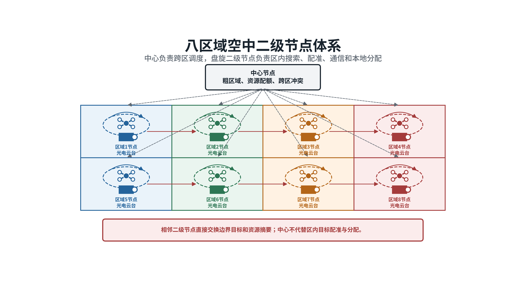
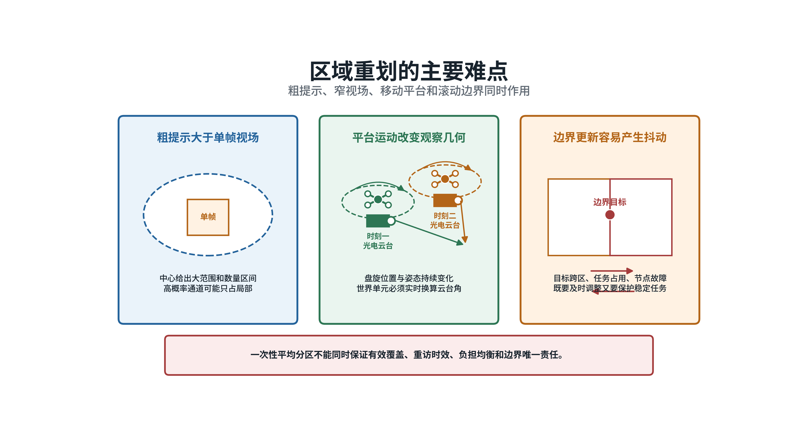
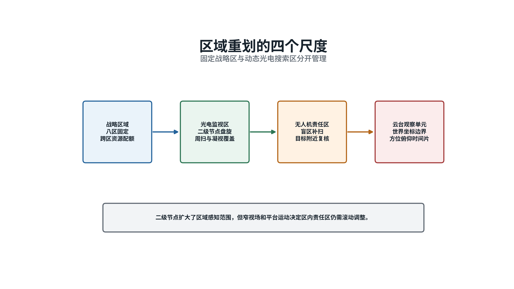
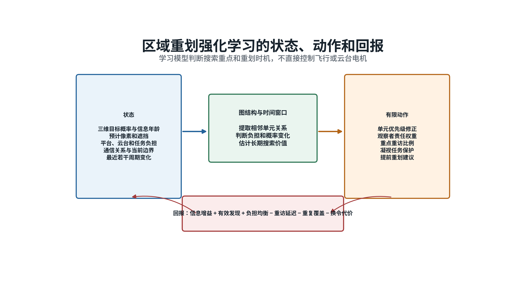
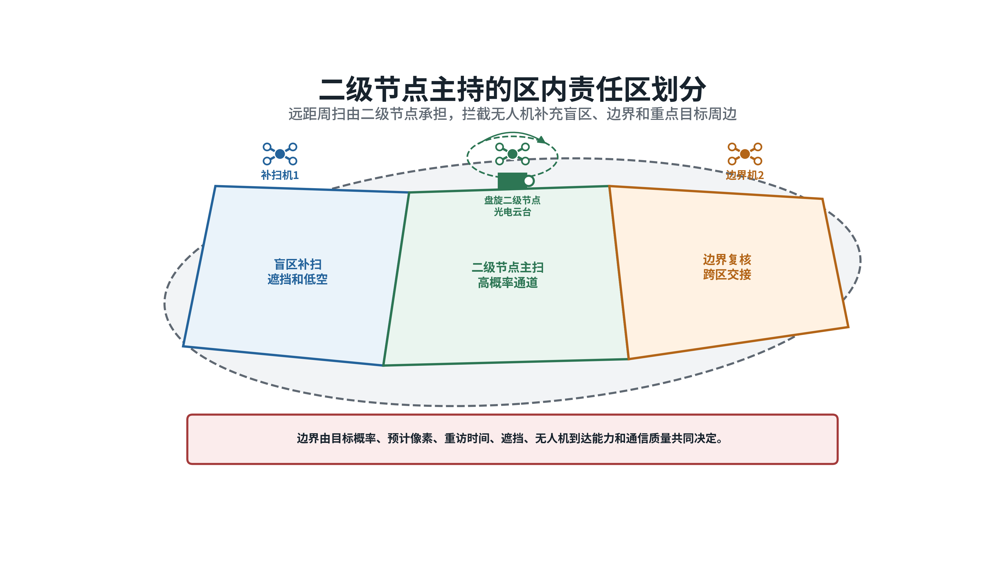
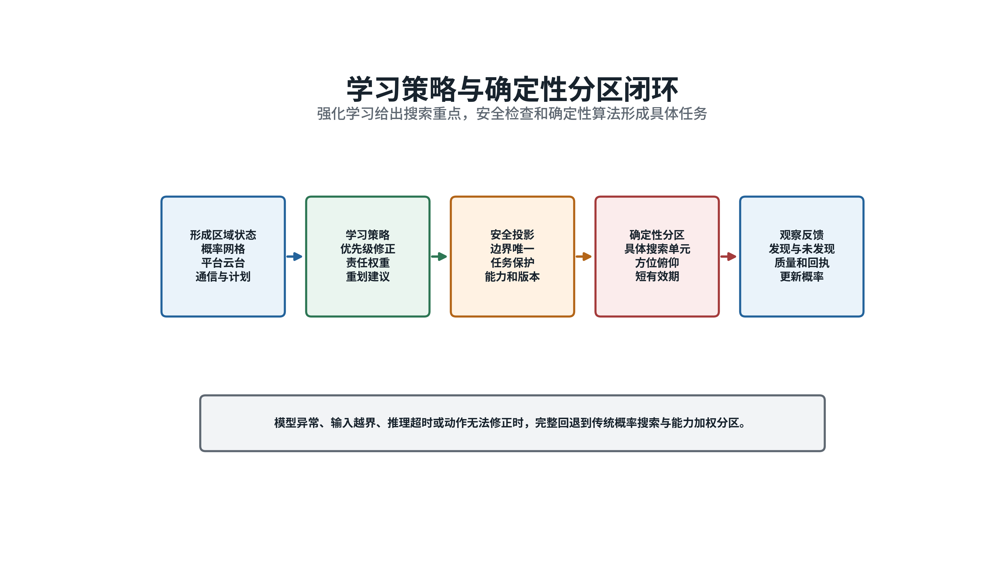
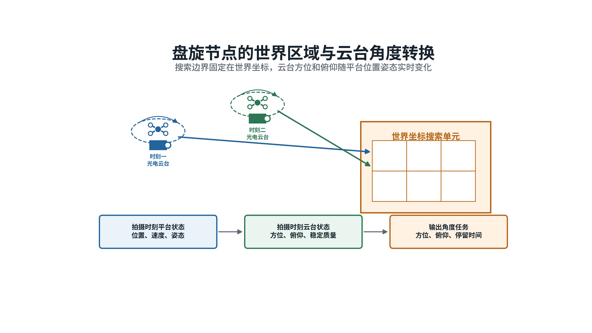
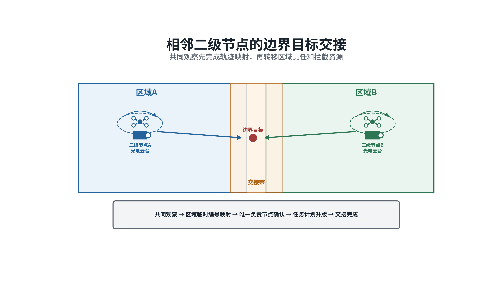
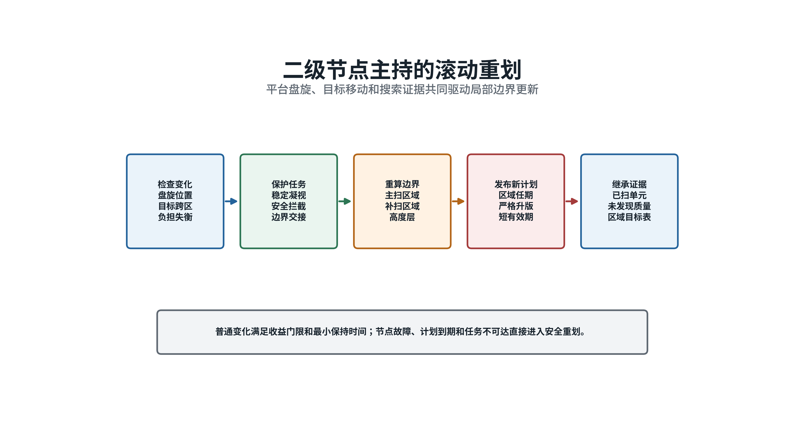
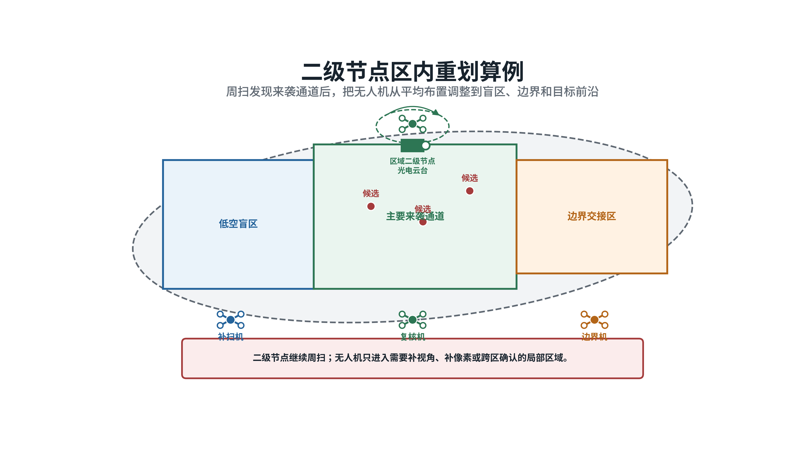

# 拦截区域重划方案

**八区域空中二级节点条件下的智能搜索责任区设计｜2026年8月**

## 一、背景

本报告研究中心完成跨区域调度后、区域内尚未形成可靠目标位置时的搜索组织问题。中心节点能够给出目标数量区间、主要来袭方向、粗略三维范围、信息时刻、可信程度和有效期限。这些信息可以判断威胁大致来自哪里，但不足以直接指定某架无人机寻找某个目标，更不能作为区内单目标拦截分配的依据。

区内任务按“区域重划、协同搜索、目标配准、本地分配、导引拦截”顺序展开。区域重划处在第一步，负责把中心给出的粗略范围转成可以观察和检查的搜索单元，并明确二级节点与各架拦截无人机的观察责任。该阶段只安排“谁在什么时间观察哪片空间”，不确认具体目标身份，也不决定由谁实施拦截。

八个战略区域各配置一架空中盘旋二级节点。二级节点配备周扫红外、凝视红外、凝视可见光和区域通信设备，承担本区主搜索、线索汇集和任务协调。拦截无人机具备机载云台和区域通信能力，承担盲区补扫、边界复核、重点区域重访和后续连续跟踪。相邻二级节点交换边界区域、未覆盖区域和资源状态，中心节点保留跨区域增援与冲突协调职能。

*图1  中心负责八个战略区域之间的资源调度，盘旋二级节点负责区内搜索责任组织。*

高性能光电云台也受到视场限制。周扫红外分辨率为1280×1024，焦距300毫米，像元尺寸15微米，水平视场约2.93度、垂直视场约3.67度。按这一组建议参数估算，10千米斜距上的单帧覆盖约为512×640米，15千米斜距约为768×960米。凝视红外和凝视可见光能够提供更细的目标信息，但视场分别约为0.917度×0.733度和0.621度×0.516度。参数用于方案计算，仍需通过具体设备试验确认。

快速周扫按200度每秒计算，约2秒完成360度转动。目标横向穿过2.93度视场的时间可能只有十几毫秒，因此2秒周扫只能承担快速告警，不能作为稳定搜索周期。标准区域搜索建议先按4至6秒一圈设计，通过较低转速、多圈积累和重点方向重访形成连续线索。100赫兹表示吊舱输出姿态、视轴等融合状态的频率，不代表红外或可见光探测器的成像帧率。

*图2  周扫通道发现可疑方向，凝视通道完成复核；具体搜索周期需要结合设备试验标定。*

区域重划不改变八个战略区域的总体边界。它在一个战略区域内部滚动调整光电监视区、无人机搜索责任区和云台观察单元。战略区保持稳定，便于资源预置和跨区管理；区内责任则随目标可能位置、观察条件、平台位置和任务负担变化。

## 二、存在的难点

### （一）粗提示不能直接转成平均分区

中心给出的粗略范围可能覆盖数平方千米甚至更大的三维空间，高倍率光电单帧只能看到其中一小部分。目标数量还是区间值，来袭目标可能分散、成群、分层飞行，也可能在搜索过程中改变方向。若简单按面积平均分区，多个观察者会把相近时间投入到同等大小的空间，却无法保证高概率来袭通道得到足够重访，也无法保证远距、小目标所在区域达到识别所需的观察质量。

搜索价值还受到距离、目标预计像素、背景遮挡、太阳方位、云台稳定时间和连续观察次数影响。某片空间进入相机视场，只能说明几何上可以看到；目标像素不足或画面不稳定时，未发现目标不能作为排除该区域的依据。因此，区内划分必须同时考虑“目标可能在哪里”和“本次观察能否看清”。

### （二）盘旋平台不断改变观察条件

二级节点在空中盘旋，其位置、速度、机体姿态和云台角度持续变化。同一个世界坐标搜索单元，在不同时刻对应不同的方位角和俯仰角。若任务只保存固定云台角度，平台移动后会看向错误位置；若使用消息到达时的姿态代替拍摄时刻姿态，还会把平台自身运动误判为目标运动。

盘旋也带来可利用的条件。二级节点能够从较高位置承担主扫，并通过调整盘旋相位改善遮挡和入射角。拦截无人机高度较低、距离更近，适合补扫地形或建筑形成的盲区。区域重划需要把盘旋轨迹、未来观察角度和各平台能力一并纳入，提前安排谁负责主扫、谁负责补扫，避免所有平台同时追逐同一条线索。

### （三）滚动调整容易造成漏看和反复换令

目标跨越边界、凝视任务占用周扫、无人机加入退出和通信质量变化都会推动区域重划。每次出现变化都重新划分全区，会中断已经稳定的观察，并使无人机频繁转向；长时间维持原计划，又会造成部分单元超期未看、边界空档和任务负担失衡。

相邻区域之间还要解决责任交接。两个二级节点同时认领同一边界空间，会形成重复观察；双方都等待确认，则会出现漏看。交接需要保留短时共同观察，并明确原责任者、接替者、交接时刻和计划版本。没有形成唯一责任关系前，原节点继续承担任务。

*图3  粗提示、窄视场、移动平台和滚动边界共同决定区域重划不能采用一次性平均分区。*

## 三、提出的方案

### （一）传统方案

传统方案先把战略区域划成若干三维搜索单元。每个单元记录目标存在概率、最近观察时刻、观察质量、预计目标像素、遮挡情况、建议光电通道和允许的最长重访时间。这里的“概率图”可以理解为一张不断更新的三维值班图：数值越高或越久没有观察的单元，越需要优先安排资源。

二级节点根据目标概率、信息新旧程度、预计探测质量和转向时间形成单元优先级，再采用能力加权分区。高空二级节点承担主扫和大范围重访；拦截无人机承担盲区、边界和重点方向补扫；通信不稳定或云台不可达的组合直接排除。高质量观察未发现目标时，降低对应单元的概率；快速扫过、目标像素不足或遮挡明显时，只做小幅调整。

区域变化采用保持门限。拟调整任务的预计收益超过换令代价并持续一定时间后，才调整普通边界。节点故障、任务到期和观察区域不可达等情况不等待门限，直接触发安全重划。传统方法规则清楚、结果容易检查，适合目标较少、方向稳定和搜索负担较轻的场景。

*图4  战略区域保持固定，区内监视范围、无人机责任区和云台观察单元按任务滚动调整。*

### （二）人工智能方案

目标密集、方向变化快时，固定权重难以同时处理眼前重点和后续资源余量。人工智能方案把连续多个搜索周期放在一起考虑，让模型学习“现在多看哪里、哪些区域需要提前接替、何时重划比继续保持更合算”。模型仍使用与传统方案相同的搜索单元、平台状态和通信关系。

系统把相邻单元、观察平台和通信连接表示成一张关系图，把最近若干周期的概率、重访时间、探测质量和任务负担组成时间序列。图结构用于说明谁与谁相邻、谁能够观察哪个单元；时间序列用于判断来袭重点是否正在转移。强化学习采用近端策略优化方法训练。该方法每轮只允许策略作有限调整，可减少训练过程中大幅改变搜索安排的情况。

学习模型输出四类建议：搜索单元优先级、各观察者责任权重、重点区域重访比例和提前重划时机。它不直接输出飞行轨迹，也不控制云台电机。训练时，以有效发现、信息更新和负担均衡作为收益，以超期未看、重复覆盖、无效转向和频繁换令作为代价，使模型学会多周期的资源取舍。

*图5  模型读取区域、光电、平台和通信状态，输出有限的优先级与责任权重建议。*

学习建议必须经过确定性安全检查。安全模块检查战略区边界、平台可用性、云台限位、通信可达、任务有效期、稳定任务保护和边界唯一责任。通过检查的建议再交给能力加权分区算法，由该算法形成具体的搜索单元和责任人。建议无法修正时，系统拒绝本次学习输出，按传统方案生成任务。

### （三）方案关系

人工智能方案处理多周期判断，回答哪些单元应提高优先级、哪些平台需要预留能力、什么时候调整责任边界。确定性算法负责把这些建议变成合法任务，明确每个单元的责任者、观察时间、有效期限和计划版本。学习模型负责提高复杂场景下的调度质量，安全规则掌握最终发布权。

目标较少、机动较弱时，直接使用传统方案即可。模型输入超出训练范围、推理超时、模型版本不匹配或通信条件不满足时，也回到传统方案。两条路线共用搜索单元和任务格式，切换时继续保留已经积累的观察记录与未发现证据。

## 四、关键技术

**盘旋二级节点引导的三维搜索责任区智能滚动重划技术**

## 五、实施方案

### （一）建立统一搜索单元

在每个战略区域内建立北东地坐标系下的三维搜索单元。“北东地”表示三个坐标轴分别指向北、东和地面方向，便于把平台导航、区域边界和相机视线放在同一空间计算。单元用水平边界、高度范围和有效时间描述，不保存固定云台角度。每个单元至少包含目标存在概率、概率更新时间、预计目标数量、最近观察时刻、最长重访间隔、观察质量、预计像素、遮挡、建议通道、当前责任者和计划版本。

二级节点状态包括位置、速度、机体姿态、云台方位和俯仰、扫描方式、稳定质量、通信连接和设备健康。无人机状态包括位置、速度、航向、机动余量、相机参数、任务占用、剩余任务时间和通信质量。每次观察同时记录拍摄时间和消息到达时间。区域判断使用拍摄时刻的平台状态，任务发布使用最新可用状态并检查有效期限。

### （二）计算单元概率与执行代价

设搜索单元 `c` 在观察前存在目标的概率为 `p⁻(c)`，本次观察在目标确实存在时能够发现目标的概率为 `P_d(c)`。观察没有发现目标后，该单元的概率更新为：

$$p⁺(c) = p⁻(c)[1 - P_d(c)] / [1 - p⁻(c)P_d(c)]$$

式中，`p⁺(c)`是观察后的概率。`P_d(c)`由预计像素、目标与背景差异、曝光、扫描速度、稳定质量、遮挡和连续观察次数共同确定。快速周扫的发现概率较低，一次未发现只能小幅降低区域概率；标准搜索或凝视多次未发现，才逐步降低该区域的搜索优先级。随着时间推移，目标概率按其可能速度和方向向邻近单元扩散。

候选观察者 `i` 执行单元 `c` 的规则代价为：

$$C_{ic} = w_tT_{ic} + w_gG_{ic} + w_oO_{ic} + w_rR_{ic} + w_lL_i - w_pP_c - w_qQ_{ic}$$

式中，`T_ic`是到达并完成观察所需时间，`G_ic`是云台转向和稳定代价，`O_ic`是遮挡与几何风险，`R_ic`是通信风险，`L_i`是平台负担，`P_c`是目标存在概率，`Q_ic`是预计探测质量；各项前的 `w` 表示任务设定的权重。算法先排除云台不可达、时间不足、通信失效和任务冲突，再从可行组合中选择总代价较低的分区。

*图6  二级节点承担主扫，无人机补充盲区、边界和重点来袭方向。*

### （三）训练区域重划策略

强化学习状态 `s_k` 由五部分组成：三维单元概率和信息年龄、预计探测质量、平台及云台状态、通信关系、当前责任区和最近计划变化。动作 `a_k` 只允许调整单元优先级、观察者责任权重、重点重访比例、凝视任务保护量和提前重划请求。动作范围在训练前确定，模型不能新增战略区、改变平台身份或扩大设备允许范围。

每个决策周期的训练回报为：

$$r_k = αI_k + βD_k + γB_k - λ₁T_k - λ₂E_k - λ₃S_k - λ₄M_k$$

式中，`I_k`表示区域不确定性降低量，`D_k`表示有效发现和稳定线索收益，`B_k`表示任务负担均衡收益，`T_k`表示最长重访延迟，`E_k`表示飞行与云台消耗，`S_k`表示重复覆盖，`M_k`表示边界变化和换令代价。过期计划、重复责任、越界任务和破坏稳定观察属于禁止事项，由安全模块直接拒绝，不通过奖励高低进行权衡。

策略训练的目标是在多个连续周期内获得较高累计回报：

$$J(θ) = E[Σ_{k=0}^{K} γ^k r_k]$$

式中，`θ`表示模型参数，`K`表示一个训练过程包含的决策周期数，`γ`表示对后续收益的重视程度。训练初期可使用传统方案生成基本样例，使模型先学会合法分区和保持任务；随后加入多波次来袭、目标转向、资源退化和通信变化，训练其长期调整能力。训练、调参和最终检验使用相互隔离的场景。

### （四）形成可执行的安全闭环

每个周期先把目标线索、平台状态和通信状态换算到统一时刻，形成三维概率图。学习模型给出优先级和责任权重建议。安全模块逐项检查输入范围、资源数量、稳定任务、边界唯一性、计划版本和有效期。确定性分区器根据通过检查的权重，把单元分给合法平台；任务转换模块最后计算云台方位、俯仰、扫描速度和停留时间。

*图7  学习模型提出搜索重点和重划时机，安全检查与确定性分区掌握任务发布权。*

观察完成后，平台回传发现或未发现、观察质量、实际覆盖范围和任务回执。二级节点据此更新单元概率、信息年龄和平台负担。普通变化只有在预计收益超过换令代价并满足最小保持时间时才发布新计划；节点故障、任务不可达和计划到期直接进入安全重划。每份计划均带版本和有效期，平台拒绝旧版本任务。

### （五）补偿盘旋平台几何变化

盘旋节点在时刻 `t` 的位置记为 `p_s(t)`，机体姿态矩阵记为 `R_b(t)`，云台至相机的姿态矩阵记为 `R_g(t)`。世界坐标搜索单元中心 `q_c` 在相机坐标系中的视线为：

$$l_c(t) = R_g(t)ᵀR_b(t)ᵀ[q_c - p_s(t)]$$

式中，`l_c(t)`用于计算云台方位和俯仰。系统再结合云台角速度、稳定时间和扫描方式，确定何时转动、何时开始有效观察。任务始终保存世界坐标区域，平台每次执行前重新计算角度，从而补偿盘旋位置和机体姿态变化。平台状态过期、姿态缺失或坐标关系版本不一致时，不下发角度任务，等待新状态或把单元交给其他观察者。

*图8  搜索单元固定在世界坐标中，云台角度按计划拍摄时刻的平台位置和姿态计算。*

### （六）完成边界交接与局部重划

每个战略区边缘设置一定宽度的共同观察带。目标可能进入该区域时，原二级节点先发送搜索单元、拍摄时刻、空间视线、运动方向和误差范围，邻区安排短时复核。双方根据时间是否对应、视线能否在空间相交、运动方向是否连续判断是否为同一条线索。候选关系不唯一时，原节点继续负责，邻区只承担观察，不提前改变责任。

*图9  边界区域先共同观察并确认唯一责任者，再转移搜索任务。*

交接完成后，新责任节点发布更高版本计划，原节点在确认后退出。滚动重划只处理新增高概率单元、超期未看单元、失效任务、边界变化和负担异常部分，其他稳定任务继续执行。这样可以保留搜索历史，减少全区重算造成的反复转向。

*图10  普通变化经过收益门限和保持时间，故障、到期和不可达事件直接触发安全重划。*

### （七）组织训练、运行与失效回退

训练场景应覆盖不同目标数量和高度层、分散与集群来袭、目标转弯、周扫与凝视切换、遮挡、误检、二级节点盘旋、无人机加入退出、通信退化和相邻区域交接。训练数据保留场景条件、输入状态、模型建议、安全修正、最终分区和观察结果，以便判断模型究竟依据什么作出调整。

运行模型采用固定版本，并与输入规范、光电参数、区域结构和安全规则绑定。模型先离线检验，再在正式任务旁路运行，只记录建议，不改变任务。只有在批准的目标规模、平台配置和通信条件内，模型建议才进入任务生成。输入超出训练范围、推理超时、模型异常或安全修正幅度过大时，立即使用传统方案。

二级节点光电失效但通信仍可用时，节点继续协调，把观察单元分给区内无人机。二级节点通信失效后，连接稳定的无人机可按预定顺序短时承担协调；无法形成唯一协调者时，各机只在本通信范围内认领未覆盖单元，并保持已有责任，避免跨通信分区重复发布任务。

*图11  发现重点来袭方向后，搜索力量由平均布置调整为主通道、盲区和边界分工。*

### （八）确定验证方法

验证应在相同初始态势和相同传感器随机条件下，对比固定分区、传统滚动分区和强化学习重划。场景覆盖目标规模、来袭方向、高度层、斜距、目标机动、盘旋轨迹、通信质量和故障条件。用于评分的真实目标编号单独保存，不进入在线区域重划过程。

主要指标包括有效覆盖率、首次形成稳定线索的时间、平均和最长重访时间、概率图校准误差、边界漏失数、重复覆盖率、任务负担差异、计划变化次数、通信量和计算时延。人工智能方案应先证明在常规场景中不低于传统方案，再检验其在高动态、高负担场景中能否降低重访延迟和重复覆盖。具体改善幅度属于建议验收指标，应通过仿真和设备试验确定。

安全检查单独统计坐标转换错误、缺少拍摄时刻姿态仍执行观察、相邻节点重复拥有边界责任、过期计划执行、稳定任务被普通重划中断、模型建议越过云台限位和通信分区越权。上述事件的建议验收值为零。

## 参考资料

1. International Maritime Organization，*International Aeronautical and Maritime Search and Rescue Manual*，https://www.imo.org/en/ourwork/safety/pages/iamsarmanual.aspx
2. MAVLink，*Gimbal Protocol v2*，https://mavlink.io/en/services/gimbal_v2.html
3. J. Cortés、S. Martínez、T. Karatas、F. Bullo，*Coverage Control for Mobile Sensing Networks*，2004，https://doi.org/10.1109/TRA.2004.824698
4. F. Bourgault、A. Göktogan、T. Furukawa、H. F. Durrant-Whyte，*Coordinated Search for a Lost Target in a Bayesian World*，2004，https://doi.org/10.1163/1568553042674707
5. A. O. Hero、D. Castañón、D. Cochran、K. Kastella，*Sensor Management: Past, Present, and Future*，2011，https://doi.org/10.1109/JSEN.2011.2167964
6. B. P. Gerkey、M. J. Matarić，*A Formal Analysis and Taxonomy of Task Allocation in Multi-Robot Systems*，2004，https://doi.org/10.1177/0278364904045564
7. M. B. Dias、R. Zlot、N. Kalra、A. Stentz，*Market-Based Multirobot Coordination: A Survey and Analysis*，2006，https://doi.org/10.1109/JPROC.2006.876939
8. H.-L. Choi、L. Brunet、J. P. How，*Consensus-Based Decentralized Auctions for Robust Task Allocation*，2009，https://doi.org/10.1109/TRO.2009.2022423
9. J. Schulman等，*Proximal Policy Optimization Algorithms*，2017，https://arxiv.org/abs/1707.06347
10. P. W. Battaglia等，*Relational Inductive Biases, Deep Learning, and Graph Networks*，2018，https://arxiv.org/abs/1806.01261
11. G. R. Gerhart，*Target Acquisition Methodology for Visual and Infrared Imaging Sensors*，1996，https://doi.org/10.1117/1.600953
12. J. G. Hixson、E. L. Jacobs、R. H. Vollmerhausen，*Target Detection Cycle Criteria When Using the Targeting Task Performance Metric*，2004，https://doi.org/10.1117/12.577830
