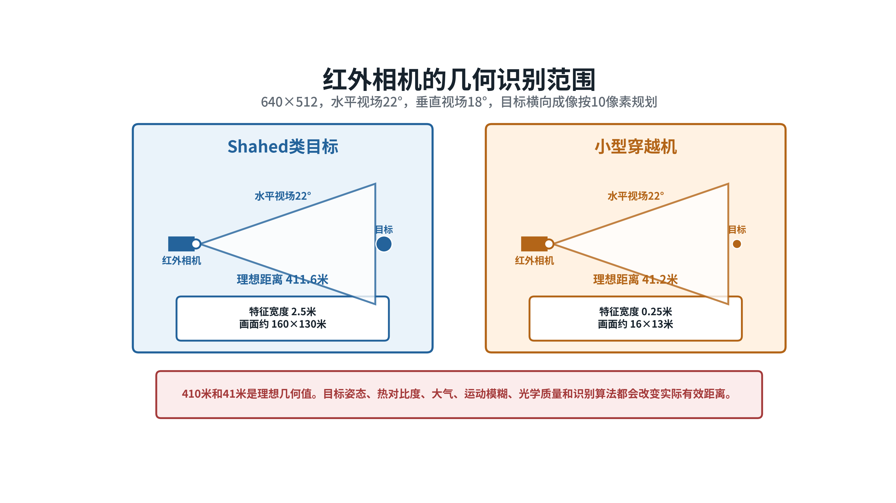
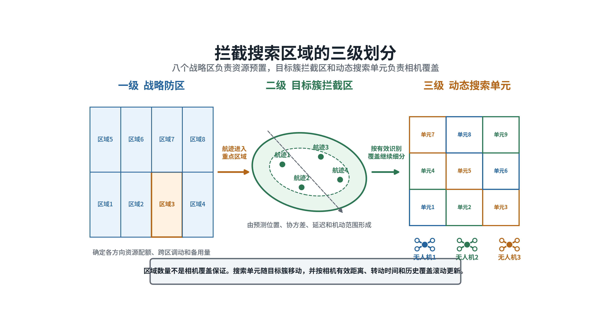
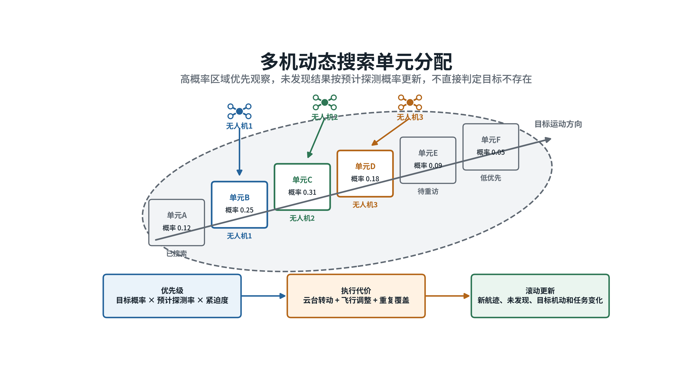
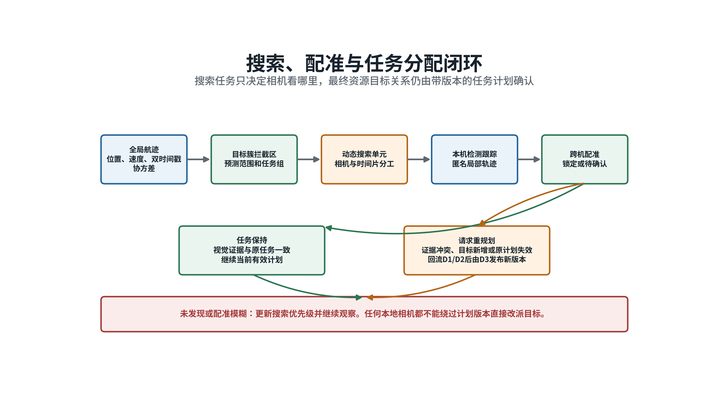

# 拦截搜索区域划分与任务分配方案

**空间分散目标集群条件下的区域、搜索与任务闭环｜2026年8月**

## 一、结论

现有八个防区能够解决资源从哪里出动、各方向保留多少备用力量的问题。窄视场红外相机进入目标附近后，仍可能看不到目标，或者只能看到目标集群中的一小部分。八区分配完成后，需要继续形成目标簇拦截区和动态搜索单元，并为任务组内的每台相机安排观察方向。

本方案采用三级空间结构。战略防区负责资源预置，目标簇拦截区负责组织针对一组相关航迹的任务组，动态搜索单元负责安排相机时间片。三级结构使用同一套全局航迹、时间戳、协方差和任务版本，但权限不同。

任务分配分为两级。D3确定资源或任务组负责哪个目标簇和哪些既有全局航迹；搜索调度只在任务组内部确定每台相机观察哪个搜索单元。视觉配准与原任务一致时继续执行，持续冲突时由D1和D2先处理新观测，再由D3发布更高版本计划。任何本地相机都不能直接重新分配目标。

## 二、成像约束

规划相机为640×512、60帧每秒、19毫米焦距，水平视场22度、垂直视场18度。按目标横向关键尺寸覆盖10像素估算，2.5米目标的理想几何距离约411.6米，0.25米目标约41.2米。两种距离上的画面覆盖范围分别约160×130米和16×13米。

这组数值只用于初步划分。实际搜索单元必须使用设备标定后的有效识别距离。目标姿态、热对比度、大气、运动模糊、光学质量和检测器性能会改变目标像素和探测概率。相机在某一距离能够把目标收入画面，不等于能够稳定识别并完成身份确认。

*图1  相同视场下，大型目标和小型目标的有效搜索尺度相差一个数量级。*

## 三、空间结构

### （一）战略防区

防区按照主要来袭方向、地形、资源基地和通信条件划分。当前八区配置属于全局资源调度参数，不是算法规模上限。中心节点根据区域威胁、目标需求、可用资源、跨区时间和备用要求，确定各区资源配额和跨区转移。

目标数量少、机动较弱时，可以使用规则或最小费用流进行区域调度。目标规模大、多波次且机动强时，项目规划采用强化学习形成区域配额、跨区转移、备用比例和重规划建议，所有动作仍需通过确定性安全检查。两种区域调度方式的输出都只是资源数量和方向，不直接决定云台搜索单元。

### （二）目标簇拦截区

进入同一重点方向的全局航迹按预测空间距离、速度方向、到达时间、威胁和协方差形成目标簇。每个目标簇包含成员全局航迹编号、预测范围、时间窗口、威胁摘要和资源需求。目标簇编号只用于规划组织，不能替代成员的全局航迹编号。

目标簇的边界由成员航迹在统一观察时刻的预测范围并集形成。系统保留每条航迹的协方差和成员关系，不把多个目标压缩成一个平均位置。目标簇跨越两个战略防区时必须指定唯一任务归属，避免两个区域重复调动资源。

### （三）动态搜索单元

目标簇拦截区根据相机有效识别覆盖、目标概率分布、云台限位和观察时间片继续划分。搜索单元可以是地理小区、三维空间块或相机角度扇区。无人机位置和目标范围变化后，同一个地理单元在不同相机中对应的角度不同，因此搜索任务必须同时保存空间边界和相机角度边界。

搜索单元包含目标概率、预计探测概率、预计目标像素、最近观察时刻、观察质量、云台到达时间、遮挡、边界重叠和有效期。边界保留少量重叠，防止目标从单元接缝穿过；重叠受到上限约束，避免全部相机长期观察同一方向。

*图2  八个战略区确定资源布局，目标簇拦截区组织任务组，动态搜索单元直接形成相机观察任务。*

## 四、目标簇生成

### （一）统一时刻预测

每条全局航迹携带位置、速度、最新量测时刻、信息到达时刻和协方差。系统先把所有候选航迹预测到计划观察时刻。位置均值按运动模型前推，协方差随速度误差、过程噪声和预测时间增长。

D1已经把迟到量测按量测时刻更新并重新传播到航迹发布时刻。目标簇生成只从航迹有效时刻继续预测，避免重复补偿同一通信延迟。时钟不确定度、相机外参和目标高机动余量还需单独加入搜索边界。

### （二）聚类条件

两条航迹只有在空间预测范围接近、运动方向相容、预计进入时间重叠且任务上适合由同一资源组处理时，才进入同一目标簇。单纯位置接近不能作为唯一条件。交叉飞行的两个目标短时接近，但后续方向不同，应保留为不同任务关系。

聚类门限根据目标类别和相机有效距离调整。Shahed类目标可以在较远距离形成视觉搜索，允许较大的目标簇范围；穿越机需要近距离观察，目标簇应更小，并增加搜索资源密度。全局航迹关联不稳定时，目标簇标记为暂定，资源可以预置，具体目标关系暂不固化。

### （三）更新与拆分

新航迹进入、成员航迹转向、协方差明显增大或目标间距超过任务组覆盖能力时，目标簇重新计算。目标簇的合并和拆分只改变规划容器，不修改成员全局航迹编号。

普通变化经过最小保持时间和收益门限，防止目标簇边界频繁变化。目标已经离开原范围、原任务不可达、资源失效或计划到期时，可以绕过普通迟滞并立即更新。

## 五、搜索单元生成

### （一）单元尺寸

搜索单元的水平和垂直尺寸不超过相机在有效识别距离上的可靠覆盖。正式尺寸使用真实相机试验获得的距离和探测概率，不直接采用理想411.6米或41.2米。目标位于画面边缘、姿态不利或背景复杂时，应进一步缩小有效单元。

目标簇误差范围沿运动方向拉长时，单元沿误差长轴排列；误差接近圆形时，从预测中心向外划分；高度范围较大时，增加俯仰层。相机视场小于搜索范围时，多个相邻角度扇区组成一个滚动搜索序列。

### （二）概率分配

每个单元的初始概率来自成员全局航迹的预测分布。目标威胁、预计到达时间和存在概率决定任务紧迫度。相机观察一个单元但没有发现目标后，系统根据该次观察的预计探测概率更新后验概率。

高质量观察仍未发现目标时，单元概率明显下降；目标像素不足、遮挡严重或相机姿态不稳定时，未发现结果不能大幅排除该单元。新航迹、目标机动和长时间未重访会重新提高相关单元优先级。

### （三）搜索收益

相机与搜索单元的收益由目标概率、预计探测率和任务紧迫度组成。执行代价包括云台转动、必要的飞行调整、重复覆盖、能耗、通信负担和计划切换。调度器选择净收益较高且满足权限、视场、机动和时间约束的组合。

*图3  每个时间片重新计算单元优先级，同时控制重复覆盖和无效云台转动。*

## 六、两级任务分配

### （一）资源与目标簇

D3接收区域配额、目标簇需求、成员全局航迹、资源状态和拦截窗口。代价综合预计到达时间、目标威胁、航迹协方差、资源剩余能力、区域兼容、冲突风险和原计划保持成本。目标数量和资源数量可以不同，高威胁目标可以设置多个主用资源和备用资源。

中心正常时，单周期一对一任务采用匈牙利算法。多个资源共同负责一个目标时，先把资源需求展开为多个任务槽，再进行匹配；更复杂的容量、时间片和路径约束使用最小费用流或滚动优化。当前主线仍以确定性代价和匈牙利算法为准。

输出计划包含发布者、权威任期、计划编号、严格递增版本、生效时间、失效时间、租约、资源目标关系和未分配任务。新计划收益未达到门限或尚未满足最小保持时间时，继续执行旧计划；原计划不可执行、资源故障、身份冲突或高威胁任务缺口增加时，允许紧急重规划。

### （二）相机与搜索单元

目标簇任务组形成后，搜索调度器把相机分给动态搜索单元。单周期采用匈牙利算法，一个时间片内每台相机只有一个主搜索单元。重点边界和身份复核可以分配一台辅助相机，但必须显式记录重复观察目的。

搜索计划具有独立版本，并绑定父D3计划编号和版本。搜索计划还包含相机编号、空间单元、角度范围、时间窗、观察方式和租约。搜索租约不得晚于父计划租约。父计划升版、权威任期改变或到期后，旧搜索计划立即失效。

短时通信波动时，各机继续执行有效租约内的搜索任务。中心搜索调度确实不可用且系统已经进入D4分布式状态后，任务组才通过滚动拍卖协商搜索单元。拍卖结果仍需版本、租约和冲突检查。

## 七、视觉确认与最终分配

### （一）本机配准

相机发现目标后先形成匿名局部轨迹。D5把父计划涉及的全局航迹预测到该相机的量测时刻，并传播协方差到像面。局部轨迹与投影候选通过马氏距离、运动方向、目标框尺度和类别检查，再用最近邻或匈牙利算法形成一对一关系。

目标约为10像素时，外观信息只作辅助。主要依据是时间、全局航迹投影、相机几何、视线、目标框历史和像面运动。候选需要连续多帧稳定，单帧通过不能直接获得末端导引许可。

### （二）跨机复核

两台相机存在共同视场时，增加视线交会和重投影检查。没有共同视场时，两台相机分别依靠全局航迹完成本机配准。全局航迹不足或候选不唯一时，保留匿名轨迹并安排后续桥接观察。

视觉配准输出的是对既有全局航迹的支持摘要，不生成新的全局目标身份。同一本地轨迹不得同时支持多个全局航迹；同一相机中的两条轨迹不得合并为一个目标。

### （三）最终处理

视觉证据与父任务计划一致时，保持当前资源目标关系。D5输出锁定证据，D7继续独立检查视线质量、距离、闭合速度、相机能力和无人机机动能力。

视觉证据持续冲突、出现未解释目标或原目标长期不可见时，D5输出待确认、保持或重新搜索。观测回流D1和D2处理时间、协方差和航迹身份。D3只消费D2确认后的结果，发布严格升版的新计划。新版本生效前，任何无人机都不能自行追逐最近检测框。

*图4  搜索结果先核对原计划；只有上游航迹和任务计划完成升版，资源目标关系才发生改变。*

## 八、通信方案

无人机之间交换四类信息。第一类是搜索计划，包括父计划、搜索单元、时间窗、版本和租约。第二类是相机状态，包括无人机位置姿态、云台角度、视场、内外参版本和状态时刻。第三类是观察结果，包括量测时刻、到达时刻、视线、协方差、未发现质量和局部轨迹摘要。第四类是首次发现提示，包括目标框、像面运动、类别和可选图像摘要。

常态协同优先传输结构化摘要。原始视频用于人工复核、算法调试或指定的协同观察，不作为全部任务持续运行的必要条件。通信中断时，节点只能执行仍在租约内且不产生资源冲突的任务。信息过期后停止形成新的锁定和分配结论。

## 九、现有基础与拟建能力

当前已经实现八区域输入、资源区域兼容、按既有全局航迹的资源分配、多资源需求槽、版本化计划、迟滞和过期计划拒绝。D5已经实现空相机处理、全局航迹独立投影、像素协方差、马氏门、匈牙利匹配、多帧稳定、重叠视场候选边和稀疏轨迹图研究接口。

当前没有显式目标簇任务合同，也没有全队动态搜索概率图、搜索单元生成器和多周期搜索调度器。目标簇跨区唯一归属、父子计划版本、贝叶斯未发现更新、首机发现后邻机转向和真实红外10像素门限均属拟建能力。

图神经网络和强化学习保留为研究增强。图神经网络用于密集跨视角候选评分，强化学习用于复杂条件下的搜索单元选择。两者均不拥有全局身份、任务分配和飞行控制权限，未完成独立验证前只进行离线或影子对照。

## 十、验证方案

质点仿真先覆盖目标间距、目标类别、航迹误差、信息延迟、集群分裂、目标交叉、零目标视角、无共同视场、桥接视角、通信延迟和部分无人机退出。对比独立扫描、固定扇区分工和动态搜索单元分配。

AirSim计算机视觉模式验证相机内外参、目标入画、云台转动和跨视角几何。在线算法不使用AirSim真实编号。真实红外数据阶段按距离、像素、目标姿态、背景和运动模糊分层标定有效识别距离、检测概率和配准门限。

区域层记录高威胁需求满足率、跨区调动和备用量。搜索层记录首次发现时间、有效覆盖、重复覆盖、未发现更新和提示后复核时间。配准层记录正确支持率、待确认率、错误合并、重获取和全局编号改写。任务层记录计划变化、过期拒绝、重复资源和最终可执行计划。所有指标必须保留场景配置、随机种子、软件版本和数据来源。

## 参考资料

1. G. R. Gerhart，*Target Acquisition Methodology for Visual and Infrared Imaging Sensors*，1996，https://doi.org/10.1117/1.600953
2. J. G. Hixson、E. L. Jacobs、R. H. Vollmerhausen，*Target Detection Cycle Criteria When Using the Targeting Task Performance Metric*，2004，https://doi.org/10.1117/12.577830
3. International Maritime Organization，*International Aeronautical and Maritime Search and Rescue Manual*，https://www.imo.org/en/ourwork/safety/pages/iamsarmanual.aspx
4. J. Cortés等，*Coverage Control for Mobile Sensing Networks*，2004，https://doi.org/10.1109/TRA.2004.824698
5. F. Bourgault等，*Coordinated Search for a Lost Target in a Bayesian World*，2004，https://doi.org/10.1163/1568553042674707
6. B. P. Gerkey、M. J. Matarić，*A Formal Analysis and Taxonomy of Task Allocation in Multi-Robot Systems*，2004，https://doi.org/10.1177/0278364904045564
7. M. B. Dias等，*Market-Based Multirobot Coordination: A Survey and Analysis*，2006，https://doi.org/10.1109/JPROC.2006.876939
8. B. Fei等，*Autonomous Cooperative Search Model for Multi-UAV With Limited Communication Network*，2022，https://doi.org/10.1109/JIOT.2022.3165278
9. T. T. Nguyen等，*Multi-Vehicle Multi-Camera Tracking With Graph-Based Tracklet Features*，2024，https://doi.org/10.1109/TMM.2023.3274369
10. MAVLink，*Gimbal Protocol v2*，https://mavlink.io/en/services/gimbal_v2.html
