# 拦截无人机协同搜索方案

**盘旋二级节点与拦截无人机的智能主动搜索｜2026年8月**

## 一、背景

本报告对应区内拦截的搜索阶段。中心节点已经把拦截力量调入大概区域，并给出目标数量区间、主要来袭方向、粗略三维范围、信息时刻和可信度。由于中心线索误差较大，区内各架无人机通常不能据此直接看见目标。后续目标配准和本地分配能否成立，首先取决于能否把粗线索转化为连续、带时间和误差范围的光电线索。

每个战略区域配置一架空中盘旋二级节点。该节点位置较高、观察范围较大，承担区域主搜索、线索汇聚和搜索任务协调。拦截无人机从不同高度和方向进入区域，承担低空盲区、边界区域和重点窗口的补扫；收到二级节点线索后，负责近距复核并保持连续跟踪。各平台共享已经搜索的区域、未发现记录、候选目标框、拍摄时间、消息到达时间和云台状态，减少重复扫描和搜索空档。

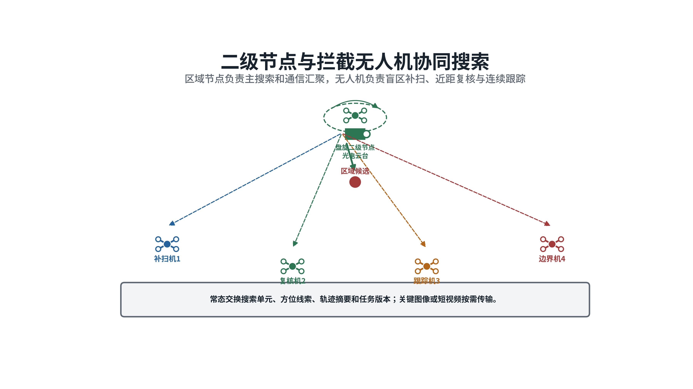

*图1  二级节点承担区域主搜索和通信汇聚，拦截无人机承担盲区补扫、近距复核和连续跟踪。*

本方案按给定双光云台参数设计搜索流程。周扫红外分辨率为1280×1024，焦距300毫米，水平视场2.93度、垂直视场3.67度；凝视红外和凝视可见光焦距为600毫米，视场分别为0.917度×0.733度和0.621度×0.516度。高倍率通道可以增加目标所占像素，但一次覆盖的空间很小，必须由搜索调度确定观察方向和停留时间。

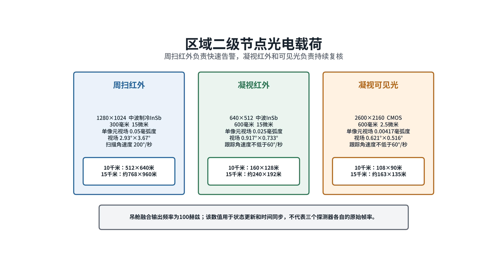

*图2  周扫通道负责告警，凝视通道负责复核；100赫兹融合状态用于云台控制与时间对准，不代表探测器成像帧率。*

云台快速转动一圈约2秒，只用于告警周扫。按200度每秒转动计算，目标穿过2.93度水平视场的理论时间约14.7毫秒，单次扫过通常只能留下候选方位和观察时刻，不能据此确认目标身份。标准搜索建议先按4至6秒一圈设计，通过较慢扫描、多圈积累和重点重访增加有效观察时间。实际周期还需根据探测器帧率、曝光、图像处理延迟、云台稳定时间和真实目标样本试验标定。

搜索阶段的输出是候选目标线索、观察质量、误差范围和连续短轨迹。搜索阶段不决定不同相机中的目标是否为同一架，也不直接形成拦截分配。后续目标配准先合并多平台线索，本地分配再依据统一目标表下达任务。

## 二、存在的难点

### （一）有限视场难以覆盖不断变化的目标可能区域

中心提供的粗略范围往往远大于单个光电通道的有效识别范围。目标可能从不同方向和高度进入，也可能在搜索期间转弯、分散或被背景遮挡。云台持续快速转动能够扫过更多方位，但目标在画面中的停留时间很短；长时间凝视一个候选可以提高确认质量，又会使其他方向出现搜索空档。

因此，搜索覆盖不能只按“视场扫过面积”计算。预计目标像素、红外对比度、背景复杂度、曝光、扫描速度、云台稳定质量和连续观察次数共同决定一次观察能否发现目标。几何上进入视场而成像质量不足，只能记为低质量观察，不能记为已经可靠排查。

### （二）多平台并行搜索容易重复，也容易漏掉交界区域

二级节点和多架拦截无人机都能转动云台，但观察高度、有效距离、可用通道和当前任务不同。如果所有平台都追随最高概率线索，会把有限视场集中到同一方向；如果简单平均划分方位，又可能把远距小目标交给看不清的平台。凝视复核、连续跟踪和飞行避碰还会临时占用平台，使原定分工迅速失效。

协同搜索需要持续回答三个问题：哪些空间已经被可靠观察，哪些方向仍缺少证据，下一次观察应由哪一平台完成。通信以搜索单元、线索摘要和任务状态为主，关键图像或短视频只在复核时定向传送，避免原始视频长期占满区域链路。

### （三）未发现目标不等于目标不在该区域

一次未发现可能说明目标确实不在该处，也可能由像素不足、遮挡、运动模糊、曝光不合适或停留时间过短造成。若每次未发现都大幅降低目标概率，系统会过早放弃仍有威胁的方向；若完全忽略未发现记录，各平台又会反复搜索同一空间。

未发现记录必须与观察质量和时间一起保存。高质量、多帧、稳定观察可以明显降低该处目标概率；快速扫过或遮挡严重时只能轻微降低。随着时间推移，目标可能从相邻区域进入，旧的未发现结论应按目标可能速度逐步失效。

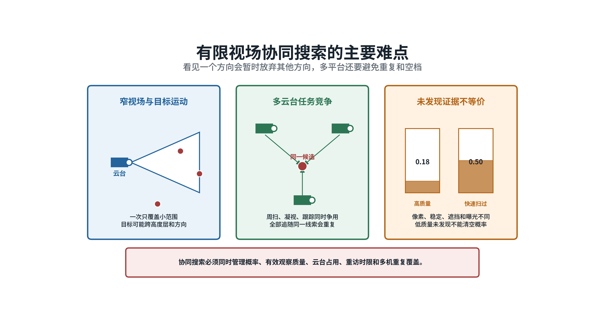

*图3  窄视场、平台任务竞争和未发现证据的不确定性共同造成搜索调度困难。*

## 三、提出的方案

### （一）传统方案

传统方案先把粗略三维范围划分为若干搜索单元。搜索单元是便于分配的一小块空间，包含方位范围、距离范围和高度层。每个单元保存目标存在概率、信息更新时间、预计像素、遮挡情况、最晚重访时间和建议光电通道。二级节点保持基础周扫，发现候选后切换到重点重访或凝视确认；拦截无人机按扇区、平行线或局部窗口补扫盲区和目标可能经过的前沿区域。

系统按照目标概率、威胁程度、信息新旧、预计成像质量、云台转向时间、平台机动代价和重复覆盖程度计算任务优先级。不能到达、预计看不清或与稳定跟踪冲突的任务先被排除，再采用按总代价最小进行分派的匈牙利算法，或采用允许一个平台连续承担多个窗口的最小费用分配方法。观察结束后，依据本次发现概率修正单元内的目标概率。

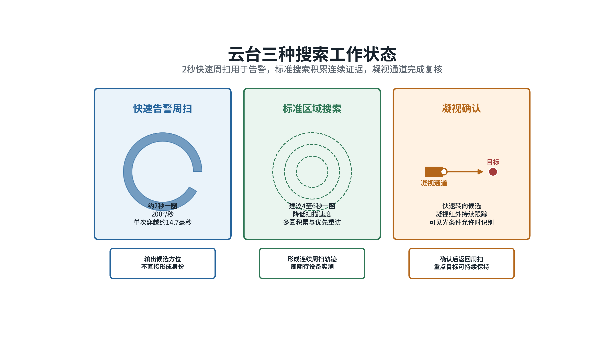

*图4  快速周扫、标准搜索和凝视确认承担不同任务，不能用同一扫描速度覆盖全部阶段。*

传统方案适用于目标较少、来袭方向稳定和搜索范围变化较慢的情况。其规则清楚，节点失效后也便于无人机继续执行。固定权重主要判断眼前收益，难以同时处理多圈搜索、凝视占用、目标机动和多个平台相互等待形成的长期影响。

### （二）人工智能方案

目标密集、机动较强和线索变化较快时，采用强化学习主动搜索。强化学习通过大量不同场景训练，学习“先看哪里、看多久、何时复查、由谁补扫”对后续发现目标的长期影响。它解决的是搜索顺序和平台协同问题，不代替目标检测，也不直接控制云台电机和无人机姿态。

搜索过程采用“只能看到局部情况的连续决策”模型，专业上称为部分可观测决策过程。系统不知道目标真实位置，只能根据中心粗提示、历史发现、未发现记录和目标可能运动范围维护一张概率图。每个决策周期，学习策略从有限动作中选择观察单元、俯仰层、光电通道、停留时间、重访比例和补扫平台。

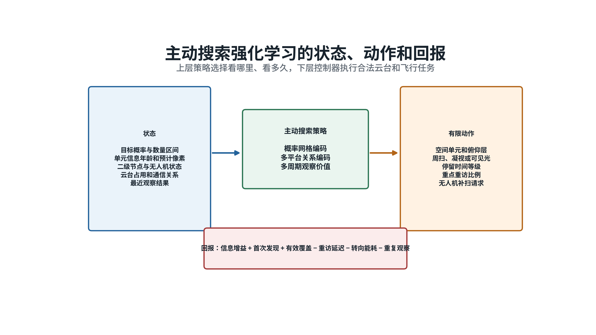

*图5  策略读取目标概率、观察质量、云台和资源状态，输出有限搜索任务，并按发现时效和信息增益训练。*

学习策略采用分层结构。上层判断搜索重点和资源分工；下层确定性控制器计算云台方位、俯仰、转动速度、稳定时间和无人机可达路径。概率网格用于表示各处存在目标的可能性，平台和搜索单元之间的联系用关系图表示，最近数个周期的观察用于判断趋势。训练可采用近端策略优化方法，这是一种限制每次策略改动幅度的强化学习方法，便于保持训练过程稳定。

训练先使用传统优先队列提供基本搜索示范，再逐步加入目标转弯、编队分散、遮挡、低对比度、平台任务竞争和通信中断。模型学习后的每个动作仍需经过视场、像素、云台限位、平台可达、任务版本和稳定跟踪保护检查。任何检查不通过，均由确定性方案保持原任务或重新分配。

### （三）方案关系

复杂场景以强化学习主动搜索为主。学习策略负责从大量可能动作中选择下一步观察重点，并兼顾后续数个周期的发现机会。传统方法提供基础周扫、硬条件检查、最终任务分配和故障回退，使学习策略始终处于明确边界内。

目标较少、区域变化较慢，或模型输入明显超出训练范围时，可直接使用传统方案。模型推理超时、数据缺失、连续动作被安全模块拒绝、通信关系与训练条件差异过大时，系统立即回到规则优先队列。已经进入稳定跟踪的目标和仍在有效期内的搜索任务继续执行，避免切换过程中丢失线索。

## 四、关键技术

**有限视场条件下的空中节点与多机协同主动搜索技术**

## 五、实施方案

### （一）建立统一搜索状态

二级节点依据中心粗线索建立三维搜索范围，并按方位、距离和高度层划分搜索单元。每个单元记录目标存在概率、概率更新时间、预计目标数量、最近观察时刻、观察次数、观察质量、预计像素、遮挡、最晚重访时间、建议通道和当前责任平台。目标可能范围随时间扩散，搜索单元不长期绑定某一云台角度。

每个平台报告位置、速度、机体姿态、云台方位和俯仰、工作通道、扫描速度、稳定质量、当前任务、预计结束时间和通信状态。每条观察同时保存拍摄时间和消息到达时间，并携带误差范围。各平台常态交换搜索单元摘要、空间视线、未发现证据、候选短轨迹、任务版本和有效期；关键图像与短视频按复核需要定向发送。

二级节点每个周期汇总上述信息，形成一张共同搜索图。状态过期、姿态不全或误差范围缺失的观察不进入高置信度更新。各机收到任务后回传接受、执行、完成或拒绝状态，使其他平台能够及时接替。

### （二）建立传统搜索基线

单元 c 分配给平台 i 的优先级可表示为：

$$U(c,i) = w_p P_c + w_h H_c + w_q Q_{ic} + w_v V_c - w_g G_{ic} - w_m M_{ic} - w_d D_{ic}$$

式中，P_c 为目标存在概率，H_c 为信息年龄，Q_ic 为平台对该单元的预计探测质量，V_c 为威胁和时间紧迫度；G_ic 为云台转向与稳定代价，M_ic 为平台机动代价，D_ic 为重复覆盖和通信代价。各权重根据任务侧重设定。视场不可达、预计像素不足、时间窗不满足和任务冲突属于硬条件，不通过加减权重放宽。

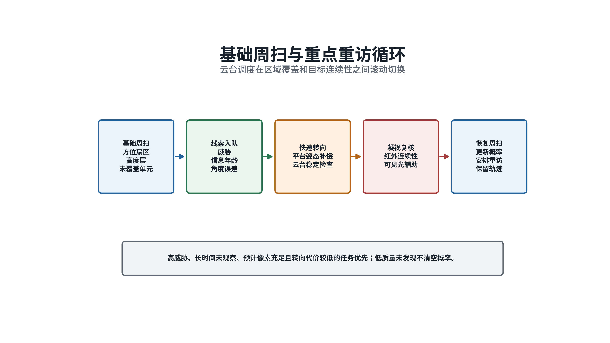

*图6  基础周扫保持区域覆盖，重点重访和凝视确认处理高价值候选。*

观察未发现目标后，单元概率按本次发现能力修正：

$$P_c^+ = P_c^-(1-P_d) / (1-P_c^-P_d)$$

式中，P_c^- 为观察前的目标概率，P_c^+ 为观察后的目标概率，P_d 为本次观察在目标确实存在时发现它的概率。高质量多帧观察具有较高 P_d，未发现结果可以明显降低概率；快速扫过、遮挡或像素不足时 P_d 较低，只作轻微修正。

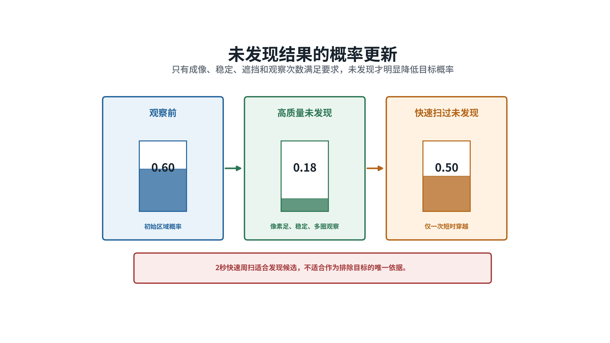

*图7  未发现结果的作用取决于观察质量，快速扫过不能作为排除目标的唯一依据。*

传统循环按“基础周扫、候选重访、凝视确认、概率更新、重新分配”运行。目标运动模型把旧单元的概率向下一周期可能到达的相邻单元扩散，保证几秒前的未发现记录不会永久清空该区域。

### （三）建立连续决策模型

在线系统用概率分布 b_k 表示第 k 个周期对目标位置的认识。新一轮观察开始前，按照目标可能运动把上一周期的概率向周边扩散：

$$b_k^-(c) = Σ_(c′) T(c|c′)b_(k-1)^+(c′)$$

式中，b_k^-(c) 为观察前目标位于单元 c 的预测概率，T(c|c') 为目标从单元 c' 运动到 c 的可能性，b_(k-1)^+(c') 为上次观察后的概率。完成发现或未发现观察后，再根据探测质量修正概率。

一个搜索动作的预期信息收益可表示为：

$$I(a) = H(b_k^-) - E[H(b_k^+|a)]$$

式中，H 表示概率分布的不确定程度，a 表示候选观察动作。I(a) 越大，说明该动作预计能够更明显地缩小目标可能范围。实际选择还要同时考虑威胁、最晚重访时间、转向消耗和稳定轨迹保护，不能只追求概率变化。

### （四）训练主动搜索策略

策略输入由四部分组成：目标概率和数量区间；各单元的信息年龄、预计像素和观察质量；二级节点与无人机的位置、云台、任务和剩余能力；最近观察结果和通信关系。动作限定为若干搜索单元、俯仰层、光电通道、停留时间等级、重点重访比例和补扫平台，不允许输出任意电机指令。

每次动作的训练回报为：

$$r_k = αI_k + βF_k + ηC_k - λ_1T_k - λ_2R_k - λ_3E_k - λ_4L_k$$

式中，I_k 为信息收益，F_k 为首次发现和形成稳定短轨迹的收益，C_k 为有效覆盖收益；T_k 为超过重访时限的代价，R_k 为重复观察，E_k 为转向和飞行消耗，L_k 为通信和频繁换令负担。各系数用于平衡发现速度、覆盖完整性和资源消耗。越界、过期任务和中断稳定跟踪由安全模块直接拒绝，不交给模型通过试错学习。

训练场景覆盖不同目标数量、来袭方向、速度、转弯、遮挡、热对比度、平台能力和通信条件。先学习传统方案形成的基本行为，再通过多回合训练学习长期观察顺序。测试时应单独保留模型未见过的目标运动和链路故障场景，检查模型能否在陌生条件下保持安全回退。

### （五）形成分层执行流程

每个决策周期按固定顺序运行：预测目标可能区域，汇总最新观察和平台状态，生成候选搜索动作，执行硬条件检查，完成平台分派，转换为云台和飞行任务，接收观察结果，再更新概率图。该顺序保证学习模型只改变搜索重点，不改变数据有效性和安全规则。

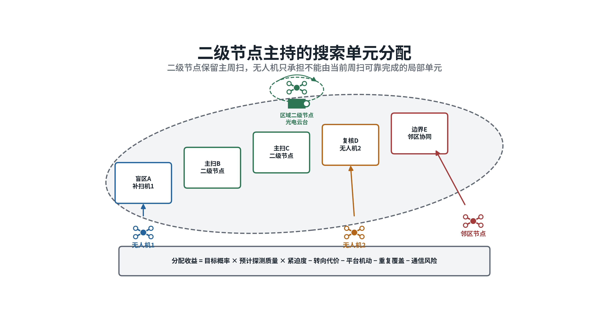

*图8  二级节点保持区域主周扫，拦截无人机承担当前周扫无法可靠完成的局部单元。*

通过检查的任务由确定性控制器执行。控制器根据预计拍摄时刻的平台位置和姿态，计算云台方位、俯仰、转动速度和稳定时间；需要改变无人机位置时，先检查可达时间、避碰和已有拦截任务。凝视完成后，系统更新候选质量和下一次重访时间，再返回标准搜索。没有获得稳定复核的候选继续保留，直到证据充分或有效期结束。

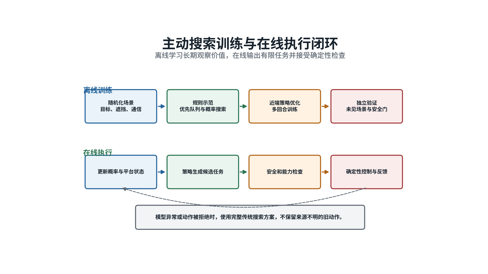

*图9  离线训练学习连续搜索的长期收益，在线只选择有限任务，经硬条件检查后由确定性控制执行。*

### （六）完成线索交接

二级节点发给拦截无人机的线索包括光电通道、拍摄时间、收到时间、平台位置和姿态、云台方向、空间视线、误差范围、观察质量、建议观察窗口和有效期。无人机依据预计到达和观察时刻，把该线索投到本机画面中的可能区域；误差较大时先执行小范围搜索，不把单一方位当成精确目标位置。

无人机进入观察窗口后，根据候选框中心、面积变化、画面运动方向和连续帧形成短轨迹，并把摘要回传二级节点。二级节点据此决定继续凝视、安排另一平台复核或恢复主周扫。搜索阶段只维护临时候选编号，不自行判断不同相机中的候选是否为同一目标，该判断交给后续多相机目标配准。

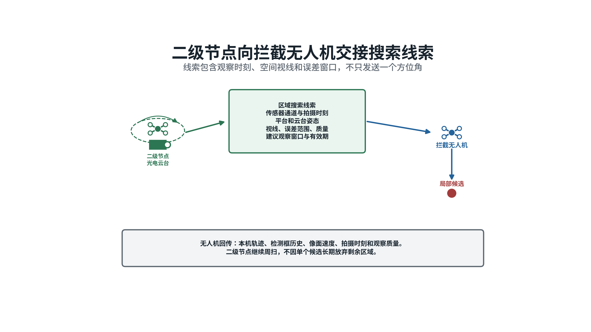

*图10  搜索线索包含拍摄时刻、空间视线和误差窗口，不能只发送一个方位角。*

### （七）设置失效保底流程

二级节点光电设备失效而通信仍可用时，节点继续汇总状态，把主周扫拆分给多架拦截无人机。二级节点通信失效时，各机先完成仍在有效期内的本机任务，并保护已经形成的稳定短轨迹；过期任务停止扩展，不再依据旧线索调动其他平台。

连接稳定、信息较新且剩余能力充足的无人机可以短时承担协调任务。它继承已搜索单元、未发现记录和候选摘要，只重新分配尚未覆盖的部分。无法选出唯一协调平台时，各机通过带任期、版本和有效期的分布式认领分担搜索单元，冲突单元按既定优先顺序退让。

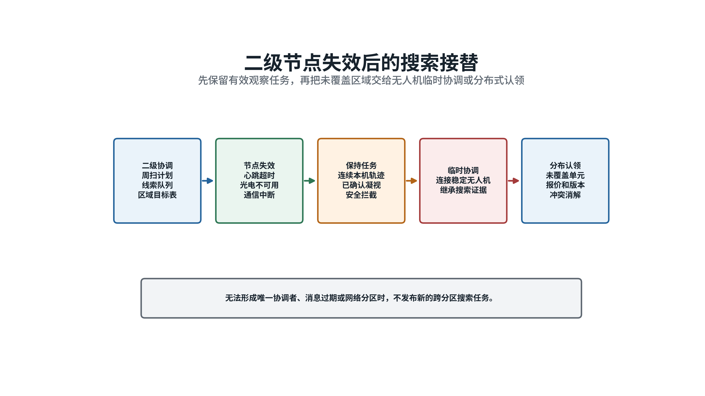

*图11  节点失效后先保护有效任务和目标线索，再由临时协调或分布式认领处理剩余单元。*

网络分区、消息过期、任务版本冲突或执行回执缺失时，不发布新的跨分区协同任务。各分区按已有有效任务和传统搜索规则继续保底。通信恢复后，先比较任务版本、观察时刻和证据质量，再合并搜索记录，防止旧信息覆盖新观察。

### （八）制定验证方法

验证拟在相同初始态势和相同传感器随机条件下，对比固定扫描、传统概率搜索和强化学习主动搜索。场景包括多目标分散来袭、密集编队、不同高度、目标转弯、低空遮挡、不同斜距、快速周扫、标准搜索、凝视占用、无人机补扫、二级节点盘旋、节点失效和通信分区。

任务效果按首次候选时间、稳定短轨迹形成时间、目标召回率、平均与最大重访时间、有效覆盖率、概率图校准误差、凝视占用率、重复覆盖率、低质量未发现比例、通信量和推理时延统计。各项指标按目标斜距、所占像素、光电通道和扫描状态分层分析，避免把近距良好条件的结果直接用于远距场景。

安全检查包括：快速周扫线索直接形成目标身份、低质量未发现清空目标概率、模型动作超出云台限位、无人机执行过期线索、缺少平台姿态仍进行空间投影、节点失效后丢失全部搜索记录，以及网络分区期间越权分配。上述事件的建议验收值为零。其他性能门限应通过设备试验和代表性目标数据确定，在获得证据前不写成装备能力。

## 参考资料

1. International Maritime Organization，*International Aeronautical and Maritime Search and Rescue Manual*，https://www.imo.org/en/ourwork/safety/pages/iamsarmanual.aspx
2. MAVLink，*Gimbal Protocol v2*，https://mavlink.io/en/services/gimbal_v2.html
3. F. Bourgault、A. Göktogan、T. Furukawa、H. F. Durrant-Whyte，*Coordinated Search for a Lost Target in a Bayesian World*，2004，https://doi.org/10.1163/1568553042674707
4. G. A. Hollinger、G. S. Sukhatme，*Sampling-Based Robotic Information Gathering Algorithms*，2014，https://doi.org/10.1177/0278364914533443
5. A. O. Hero、D. Castañón、D. Cochran、K. Kastella，*Sensor Management: Past, Present, and Future*，2011，https://doi.org/10.1109/JSEN.2011.2167964
6. J. Cortés、S. Martínez、T. Karatas、F. Bullo，*Coverage Control for Mobile Sensing Networks*，2004，https://doi.org/10.1109/TRA.2004.824698
7. L. P. Kaelbling、M. L. Littman、A. R. Cassandra，*Planning and Acting in Partially Observable Stochastic Domains*，1998，https://doi.org/10.1016/S0004-3702(98)00023-X
8. J. Schulman等，*Proximal Policy Optimization Algorithms*，2017，https://arxiv.org/abs/1707.06347
9. B. P. Gerkey、M. J. Matarić，*A Formal Analysis and Taxonomy of Task Allocation in Multi-Robot Systems*，2004，https://doi.org/10.1177/0278364904045564
10. H.-L. Choi、L. Brunet、J. P. How，*Consensus-Based Decentralized Auctions for Robust Task Allocation*，2009，https://doi.org/10.1109/TRO.2009.2022423
11. G. R. Gerhart，*Target Acquisition Methodology for Visual and Infrared Imaging Sensors*，1996，https://doi.org/10.1117/1.600953
12. J. G. Hixson、E. L. Jacobs、R. H. Vollmerhausen，*Target Detection Cycle Criteria When Using the Targeting Task Performance Metric*，2004，https://doi.org/10.1117/12.577830
