# 任务组本地目标分配方案

**空中二级节点主持的学习增强滚动任务组织｜2026年8月**

## 一、背景

本报告对应区内协同搜索和目标配准之后的任务分配阶段。中心节点负责八个战略区域之间的资源调度，给出各区目标数量区间、主要来袭方向、粗略三维范围和增援关系。中心提供的是区域级态势，不直接形成区内单架无人机与单个目标之间的可信对应关系。

空中盘旋的二级节点汇集本区双光云台和各拦截无人机的观察结果，形成区域临时目标表。目标表记录每个目标的当前位置、运动趋势、误差范围、识别把握、威胁程度和最近更新时间。本地分配要把这张目标表转化为可执行任务，明确哪架无人机继续搜索、哪架负责确认和跟踪、哪架进入拦截、哪架保留为备用。

任务发布不能只看距离。无人机的速度、转弯能力、云台可视范围、剩余任务时间、通信状态和当前观察关系都会影响选择。已经连续看住目标的无人机通常具有更高的任务连续性，不能因为一次位置波动就频繁换令。

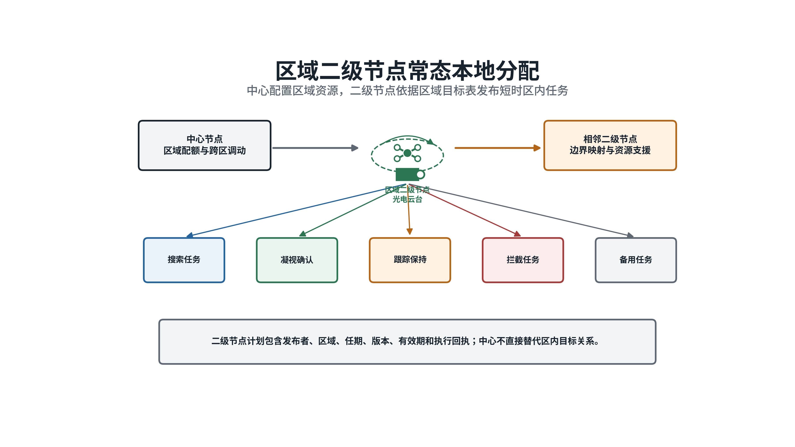

*图1  中心配置区域资源，二级节点依据区域临时目标表发布搜索、确认、跟踪、拦截和备用任务。*

区内目标数和可用资源数不要求相等。普通目标可以分配一架主用无人机；高威胁目标可以设置多架主用无人机和备用无人机。现阶段不把同时到达作为硬性要求，各成员按照任务窗口、进入方向和启动条件分批执行。每架无人机在同一时段只承担一个主要任务，避免重复占用。

相邻区域之间允许直接申请支援。边界目标先确定唯一负责区域，再由负责区域的二级节点统一发布任务。二级节点失效后，仍在有效期内且身份关系明确的任务继续执行；其余任务由临时协调无人机接替。无法形成唯一协调者时，区域无人机通过受约束的分布式报价形成保底计划。

## 二、存在的难点

### （一）目标状态不同，任务需求也不相同

区域临时目标可能处于线索、待确认、已确认、暂时丢失和失效等状态。快速周扫得到的方位线索只能安排补扫或凝视确认，不能直接进入拦截分配。只有经过连续观察或多机复核、位置误差和身份风险处于允许范围内的目标，才能生成拦截任务。

同一目标在不同阶段需要的资源数也会变化。普通目标通常采用一架主用无人机，高威胁目标可能需要两架主用和一架备用。若把所有目标简单地放入一对一最近邻计算，系统无法表达多资源需求，也无法说明目标暂未分配的原因。

### （二）当前最优不等于连续任务最优

到达时间、机动难度、视觉连续性、通信、能源、威胁和换令代价共同决定资源价值。距离最近的无人机可能正在稳定跟踪另一个目标，也可能是本区唯一能快速应对后续来袭目标的高速资源。只按当前距离选择，容易破坏已有观察关系，并过早消耗关键备用力量。

固定权重可以给出当前周期的排序，却难以判断“现在投入”与“留给下一批目标”之间的取舍。目标机动、通信短时波动和新目标进入会不断改变局面。分配算法既要及时调整，又要避免每次小幅变化都产生新命令。

### （三）节点失效后仍要保证一项任务只有一个责任来源

二级节点失效时，各无人机掌握的信息可能不同。若每架无人机自行选择最近目标，容易出现多架无人机重复追逐同一目标、部分目标无人负责和旧任务继续占用资源。网络分区还可能形成两份互不知情的计划。

每份计划必须写明发布节点、发布权任期、版本、生效时间、失效时间、任务角色和执行条件。接替节点应继承仍然有效的任务和执行回执，只重新计算受影响部分。无法确认唯一发布者、计划已经过期或必要成员没有确认时，不发布新的拦截任务。

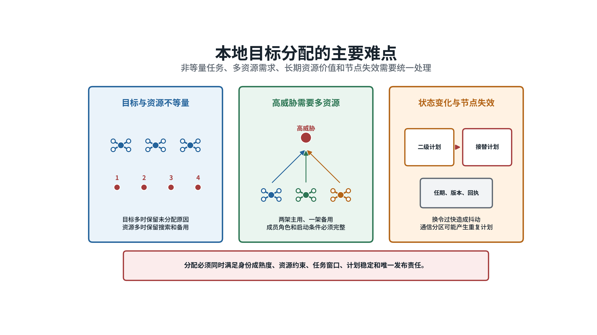

*图2  非等量任务、多资源需求、长期资源价值和节点失效共同决定本地分配不能只按最近距离处理。*

## 三、提出的方案

### （一）传统方案

传统方案按照“任务准入、规则评价、统一求解、滚动发布”四步执行。第一步检查目标是否已经确认、信息是否新鲜、无人机能否到达、机动和相机能力是否满足、通信和安全条件是否允许。未通过检查的组合不参与后续排序，并保留明确的拒绝原因。

第二步为每个可行组合计算规则代价。代价包括预计到达时间、机动难度、视觉中断风险、通信风险、能源消耗、换令影响和目标威胁。第三步把普通目标表示为一个主用任务槽，把高威胁目标展开为多个主用和备用任务槽，再使用匈牙利算法或最小费用流统一求解。匈牙利算法用于从全部可行组合中寻找总代价较低的一对一关系；最小费用流用于处理多资源、容量和跨区支援等较复杂约束。

第四步采用迟滞和最短保持时间控制换令。普通状态变化只有在新计划明显改善时才调整；目标失效、资源故障、计划到期、身份冲突和任务不可达等安全事件立即重算。计划发布前再次检查资源唯一、任务版本、多资源成员和有效期。

传统方案逻辑明确，适合目标较少、机动较弱和态势变化较慢的场景。二级节点失效后，系统也以这套规则作为接替和回退基础。其局限是固定权重难以同时处理连续波次、资源稀缺、通信退化和长期备用价值。

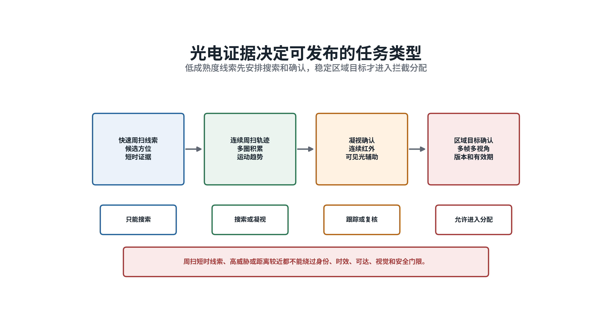

*图3  线索先安排搜索和确认，形成稳定区域目标后才进入拦截分配。*

### （二）人工智能方案

目标密集、机动强和信息变化快时，拟采用强化学习增强规则分配。强化学习通过大量连续任务学习“当前分配会怎样影响后续可用资源”，用于修正规则在复杂局面中的短期偏差。它不直接发布最终任务，也不能恢复已经被安全条件排除的组合。

系统把目标和无人机表示为一张关系图。一侧是目标，记录威胁、任务窗口、证据质量、运动趋势和需要资源数；另一侧是无人机，记录位置、速度、机动、相机、能源、任务占用和通信状态。两侧之间的连线表示一架无人机执行某项目标任务的可行关系及规则代价。

学习模型读取当前关系图和最近若干周期的变化，输出三类建议：对可行组合的有限代价修正、备用资源何时启用、是否应提前重新规划。代价修正受到固定上限约束。最终任务仍由匈牙利算法或最小费用流产生，并经过资源唯一、任务版本、有效期和成员完整性检查。

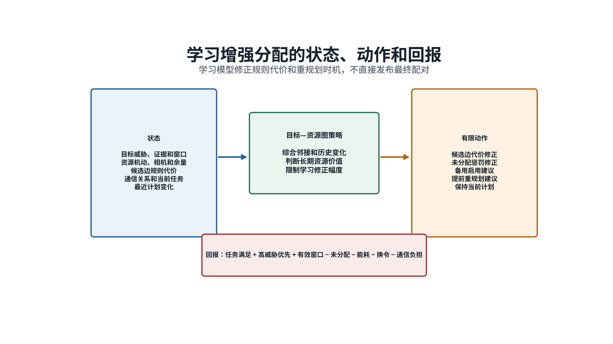

*图4  学习模型读取目标、资源和候选关系，输出有限代价修正、备用启用和重规划建议。*

训练拟采用近端策略优化方法。这是一种限制每次策略变化幅度的强化学习方法，便于在连续任务中保持训练稳定。规则求解器先提供基本可行示范，模型再在多波次、高机动、资源不足和通信退化场景中学习资源保留与重规划时机。训练所用真值只用于离线评价，不进入实际运行输入。

### （三）方案关系

复杂场景以强化学习增强方案为主线。规则代价提供可解释的基本判断，学习模型修正长期资源取舍，确定性求解器形成具体任务，安全模块负责最终准入。学习模型不能改变目标身份、硬性安全条件、任务需求数量、计划发布权限和版本关系。

目标较少、态势平稳、模型输入超出训练范围或推理超时时，直接使用传统方案。二级节点失效或通信图严重破碎时，不运行依赖完整区域态势的学习模型，改用统一规则、固定优先顺序和分布式报价。这样可以在复杂场景中利用学习能力，同时保留可核对、可接替的安全边界。

## 四、关键技术

**学习增强的多资源滚动目标分配与失效接替技术**

## 五、实施方案

### （一）形成统一的区域状态和任务计划

每个决策周期先冻结一份区域状态快照。目标信息包括区域临时编号、状态、位置和速度估计、误差范围、威胁、证据质量、量测时间、消息到达时间、任务窗口、需要资源数以及主用和备用要求。线索和待确认目标进入搜索、确认任务集合；已确认且误差满足要求的目标进入拦截任务集合。

无人机信息包括位置、速度、航向、允许空域、最大速度、转弯能力、相机视场和识别条件、剩余任务时间、当前任务、通信邻接和健康状态。若中心目标编号仍然有效，区域临时编号只保存对应关系，不改写原有身份。

输出计划写明负责区域、发布节点、发布权任期、严格递增的版本、生效和失效时间、资源与目标关系、任务角色、启动条件及未分配原因。执行无人机只接受当前发布者、当前版本和有效期内的任务，并向发布节点返回接收、拒绝、开始执行和任务中断等回执。

吊舱100赫兹融合状态用于时间同步、云台姿态和任务状态更新，不表示探测器以每秒100帧成像。目标证据成熟度按实际拍摄时刻和连续有效观察判断，不能用高频状态输出替代视觉证据。

### （二）执行任务准入检查

用`gij`表示无人机`i`与目标`j`能否组成候选关系。只有身份和状态允许、信息未过期、能够在任务窗口内到达、机动和相机能力满足、资源未被占用、通信可用并通过安全检查时，`gij`才取1。

$$g_ij = g_id · g_time · g_reach · g_maneuver · g_vision · g_resource · g_comm · g_safe$$

公式中的八项依次表示身份、时效、可达、机动、视觉、资源、通信和安全条件。任一项为0，该组合即被排除。每项检查都保存拒绝原因，便于二级节点判断应继续搜索、请求邻区支援、启用备用资源还是等待信息更新。

任务准入是固定安全边界。目标威胁再高，也不能抵消身份不明、计划过期、不可达或友方冲突等条件。学习模型只能处理`gij=1`的候选关系。

### （三）计算可解释的规则代价

通过准入检查的组合计算规则代价：

$$C_rule(i,j) = w_t T_ij + w_m M_ij + w_e E_ij + w_v V_ij + w_c L_ij + w_r R_ij + w_s S_ij - w_h H_j$$

`Tij`为预计到达时间，`Mij`为机动难度，`Eij`为目标证据风险，`Vij`为视觉中断风险，`Lij`为通信风险，`Rij`为能源和资源余量代价，`Sij`为换令代价，`Hj`为目标威胁收益。各权重按区域任务和资源能力标定。高威胁可以提高任务优先级和未分配惩罚，不能改变准入结果。

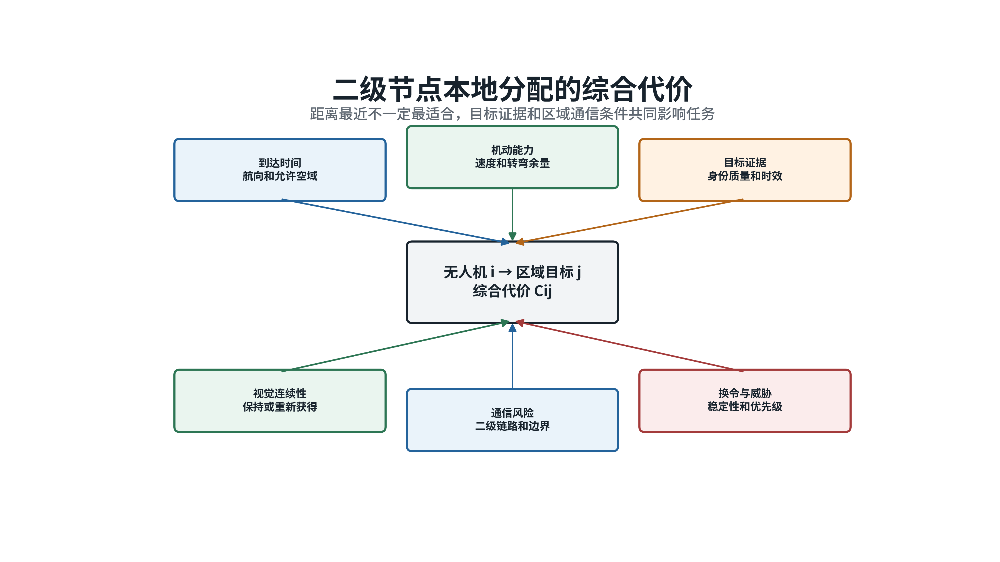

*图5  规则代价同时考虑到达、机动、目标证据、视觉连续性、通信、资源余量和换令影响。*

规则代价先形成一份可独立运行的基准计划。即使学习模型不可用，系统仍能根据同一目标表和资源状态完成安全分配。该基准也用于判断学习建议是否越界或是否带来实际改善。

### （四）形成有界的学习代价修正

学习模型读取目标、资源、候选关系和最近计划变化，输出原始修正`ΔCij`。系统用固定系数`α`限制修正幅度：

$$C_final(i,j) = C_rule(i,j) + α tanh(ΔC_ij)$$

`Cfinal`为确定性求解器实际使用的最终代价，`tanh`把模型输出压缩到有限范围，`α`规定学习模型最多能够改变多少代价。模型可以改变可行组合之间的先后顺序，但不能新增候选关系，也不能修改目标需要几架无人机。

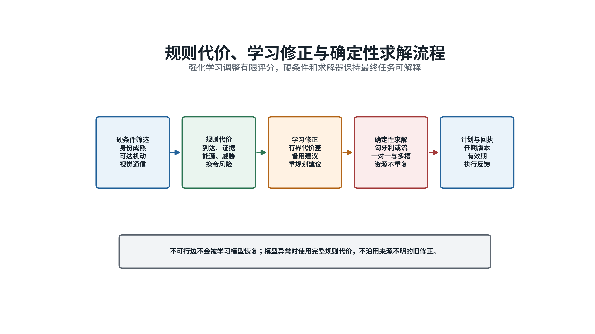

*图6  强化学习修正规则代价，具体任务仍由确定性求解器形成。*

训练回报用于评价连续多个决策周期的整体结果：

$$r_k = β1 F_k + β2 H_k + β3 W_k - λ1 U_k - λ2 E_k - λ3 M_k - λ4 C_k$$

`Fk`表示已确认目标的任务满足情况，`Hk`表示高威胁任务满足情况，`Wk`表示有效任务窗口收益，`Uk`表示未分配和超期任务，`Ek`表示能源与无效出动，`Mk`表示计划变化，`Ck`表示通信和协商负担。重复占用资源、过期计划和多资源成员不完整由安全模块直接拒绝，不依靠回报扣分解决。

### （五）求解一对一和多资源任务

普通目标建立一个主用任务槽，高威胁目标建立多个主用和备用任务槽。用`xiq`表示无人机`i`是否承担任务槽`q`，用`uq`表示该任务槽暂时未分配。求解目标为：

$$min_x [Σ_(i,q) x_iq C_final(i,q) + Σ_q u_q C_miss(q)]$$

$$Σ_q x_iq ≤ 1,    Σ_i x_iq + u_q = 1$$

`Cmiss`是任务槽未分配的代价。第一项约束保证一架无人机同一时段最多承担一个主要任务；第二项表示每个任务槽只能由一架无人机承担，或者明确记录为未分配。目标多于资源时，系统保留未分配原因并申请支援；资源多于目标时，剩余资源继续搜索、担任备用或支援边界区域。

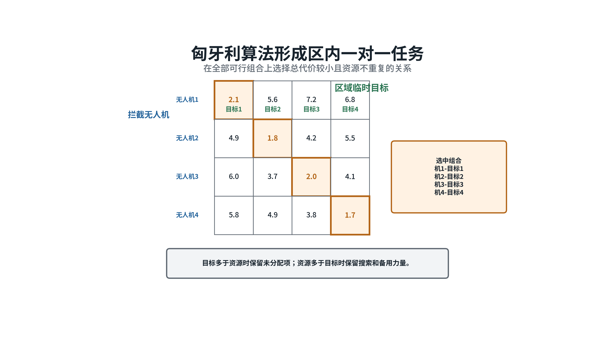

*图7  求解器统一比较全部可行组合，避免先选局部最近目标后破坏整体任务安排。*

对于需要`kj`架主用无人机的高威胁目标，主用任务只有在所需成员全部分配并确认后才能进入执行状态。部分成员已经确定而其余成员尚未到位时，计划保持“等待组成”状态，不允许少数成员越权启动。备用资源保存明确的启用条件，只有主用拒绝、失效、不可达或任务窗口变化时才接替。

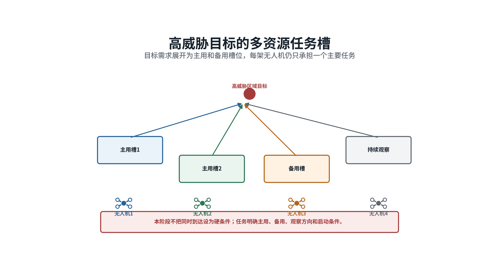

*图8  高威胁需求展开为主用和备用任务槽，每架无人机仍只承担一个主要任务。*

多资源任务不要求所有成员同时到达。计划分别规定任务窗口、进入方向和启动次序。成员数量、角色或目标身份发生变化时，二级节点发布更高版本计划，旧成员关系随原计划到期或被明确撤销。

### （六）滚动发布并抑制频繁换令

二级节点按固定周期检查目标、资源和计划状态。新目标确认、目标失效、资源故障、任务不可达、视觉身份持续冲突、区域责任变化和计划到期直接触发安全重算。目标短时转向、检测框抖动、轻微代价变化和单次链路延迟进入普通滚动更新。

普通换令要求新计划的总代价改善超过迟滞门限，并且当前任务已经保持最短时间：

$$J_new < (1 - δ)J_old,    t - t_last > T_dwell$$

`δ`为改善比例门限，`Tdwell`为最短保持时间。重算时优先保留身份稳定、仍可达且尚在有效期内的任务，只把新增目标、失效任务、冲突资源和跨区支援放入变化集合。学习模型可以建议提前重规划，最终触发仍由固定状态和版本检查决定。

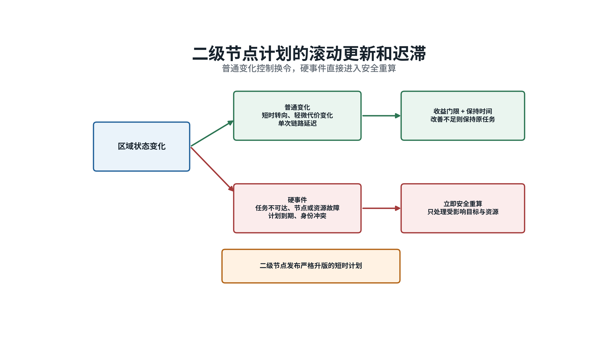

*图9  普通变化控制换令，故障、到期和不可达事件直接进入安全重算。*

新计划发布前依次检查发布权任期、版本递增、目标身份、资源唯一、任务成员和有效期。无人机回执与计划版本绑定，迟到的旧回执不能激活新计划。这样能够把“算法算出的组合”转化为“来源明确、时间有效、成员确认”的执行任务。

### （七）处理跨区支援和节点失效

边界目标先由相邻区域核对位置、运动方向和临时编号，确定唯一负责区域。负责区域发布资源支援请求，邻区只返回可用资源和预计到达能力，不另行生成一份目标任务。中心可用时负责跨区资源总量协调，区内具体任务仍由负责区域的二级节点发布。

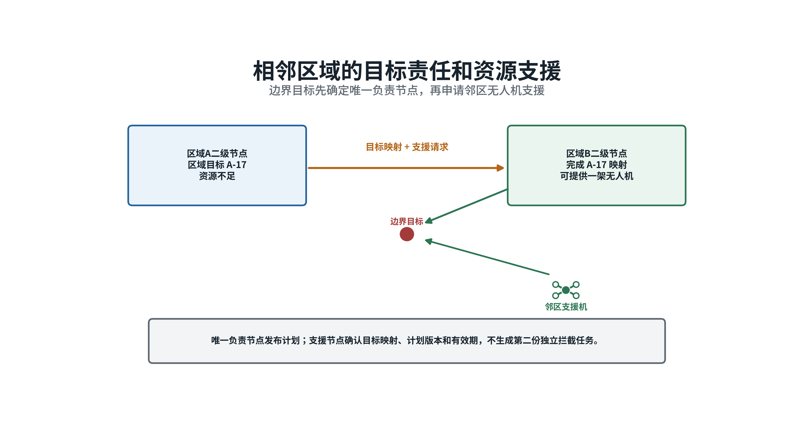

*图10  边界目标只有一个负责区域，邻区提供资源，但不形成第二份独立任务。*

二级节点失效后，各无人机继续执行仍在有效期内、身份明确且当前可达的任务。未分配目标、失效任务和即将到期计划进入接替。系统根据通信覆盖、信息新鲜度和固定优先顺序选出唯一临时协调者，由其继承目标表、当前计划和执行回执，只重算受影响任务。

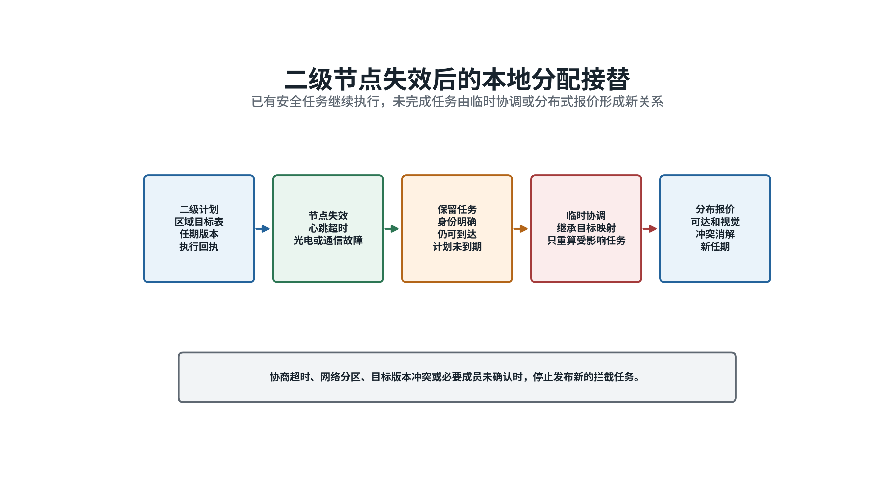

*图11  节点失效后保留有效任务，未完成任务由临时协调或分布式报价接替。*

无法形成唯一协调者时，各无人机使用同一准入条件和规则代价广播报价。报价同时携带目标版本、计划任期、任务角色和有效期。各机按相同排序规则确定结果，并通过成员确认消除重复。高威胁多资源任务只有在全部必要成员确认后才能执行。

协商超时、网络分区、目标版本冲突或必要成员确认不足时，系统停止发布新的拦截任务，保留安全搜索和已有有效任务。二级节点恢复后，先比较发布权任期、计划版本和执行回执，再合并任务；恢复节点不能用较旧计划覆盖接替期间已经生效的新计划。

### （八）组织训练和受限使用

训练场景应覆盖资源少于目标、资源多于目标、高威胁多资源、连续波次、目标机动、资源故障、通信退化、跨区支援和节点失效。每个样本由连续若干决策周期组成，记录目标证据变化、规则代价、学习修正、安全裁剪、最终分配、执行回执、后续目标进入和资源恢复。

训练先使用规则求解器和最小费用流生成基本可行示范，使模型掌握准入、保持和备用逻辑；随后采用近端策略优化学习多周期资源价值。训练重点放在规则难以稳定处理的情况，包括多个资源代价接近、当前最近资源需要为下一批目标保留、视觉连续性与到达时间冲突、高威胁成员不足和跨区支援延迟。

训练、验证和测试按完整场景分开。真值只用于训练回报和离线评分，不作为实际分配输入。模型与目标特征、资源能力、区域关系、安全规则和适用范围一并固定，防止更换输入口径后继续沿用旧模型。

使用过程分为离线比较、影子运行和受限使用三个阶段。影子运行只记录模型建议，不改变任务；受限使用明确目标规模、通信条件和最大代价修正。输入超出批准范围、推理超时、安全裁剪过大或模型完整性检查失败时，立即使用完整传统方案。

模型在任务执行中保持只读，不根据单次结果现场更新。每个决策周期记录输入状态、规则代价、学习修正、安全裁剪、求解结果、最终计划和执行回执，用于离线复核学习建议是否真正改善任务安排。

### （九）验证方法

验证采用相同初始态势、感知扰动和故障条件，对比最近邻、规则匈牙利、规则最小费用流和学习增强分配。场景包括普通一对一、目标和资源数量不等、高威胁多资源、目标新增、资源失效、视觉证据变化、跨区支援、二级节点失效和网络分区。

任务指标包括已确认目标分配率、高威胁需求满足率、未分配目标数、任务窗口内可行计划率、预计到达代价、视觉保持率、资源消耗、计划变化次数、跨区支援时间、分布式协商轮数、计算时间和通信量。结果应分别报告正常二级节点、临时协调和完全分布式三种状态，避免用总体平均值掩盖失效接替问题。

安全指标包括：未确认目标进入拦截分配、不可行组合被学习模型恢复、同一资源重复分配、过期计划执行、多资源必要成员不完整、两个区域同时负责同一边界目标、节点失效后全部任务重编号，以及网络分区下越权认领。上述事件的建议验收值为零。

学习方案只有在不增加安全事件的前提下，持续降低高威胁任务未满足、无效换令和资源浪费，才进入受限使用。若改善只出现在少数场景，或者计算与通信负担超过任务允许范围，继续保留为离线辅助，不替代传统方案。

## 参考资料

1. SciPy，*linear_sum_assignment*，https://docs.scipy.org/doc/scipy/reference/generated/scipy.optimize.linear_sum_assignment.html
2. Google OR-Tools，*Minimum Cost Flows*，https://developers.google.com/optimization/flow/mincostflow
3. H. W. Kuhn，*The Hungarian Method for the Assignment Problem*，1955，https://doi.org/10.1002/nav.3800020109
4. J. Munkres，*Algorithms for the Assignment and Transportation Problems*，1957，https://doi.org/10.1137/0105003
5. B. P. Gerkey、M. J. Matarić，*A Formal Analysis and Taxonomy of Task Allocation in Multi-Robot Systems*，2004，https://doi.org/10.1177/0278364904045564
6. M. B. Dias、R. Zlot、N. Kalra、A. Stentz，*Market-Based Multirobot Coordination: A Survey and Analysis*，2006，https://doi.org/10.1109/JPROC.2006.876939
7. D. P. Bertsekas，*The Auction Algorithm: A Distributed Relaxation Method for the Assignment Problem*，1988，https://doi.org/10.1007/BF02186476
8. H.-L. Choi、L. Brunet、J. P. How，*Consensus-Based Decentralized Auctions for Robust Task Allocation*，2009，https://doi.org/10.1109/TRO.2009.2022423
9. A. O. Hero、D. Castañón、D. Cochran、K. Kastella，*Sensor Management: Past, Present, and Future*，2011，https://doi.org/10.1109/JSEN.2011.2167964
10. J. Schulman等，*Proximal Policy Optimization Algorithms*，2017，https://arxiv.org/abs/1707.06347
11. P. W. Battaglia等，*Relational Inductive Biases, Deep Learning, and Graph Networks*，2018，https://arxiv.org/abs/1806.01261
