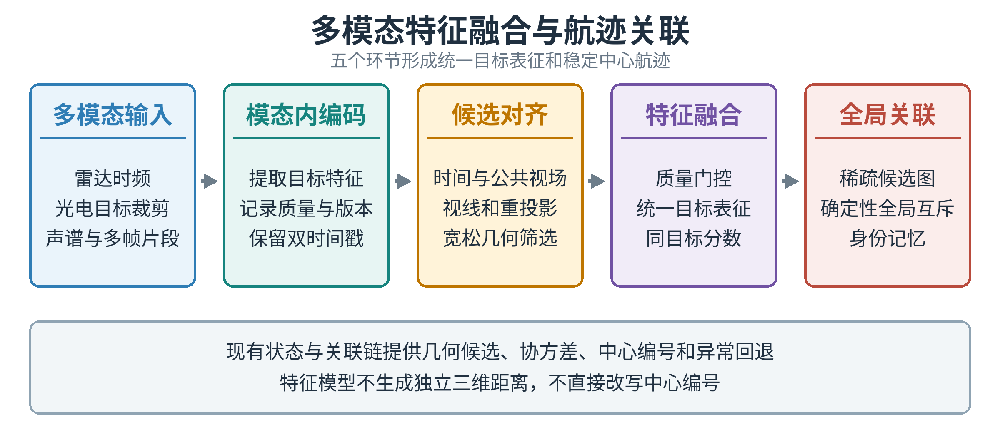
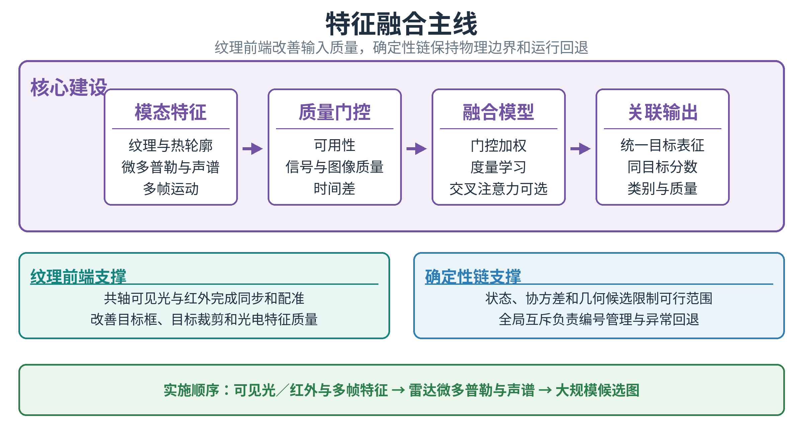
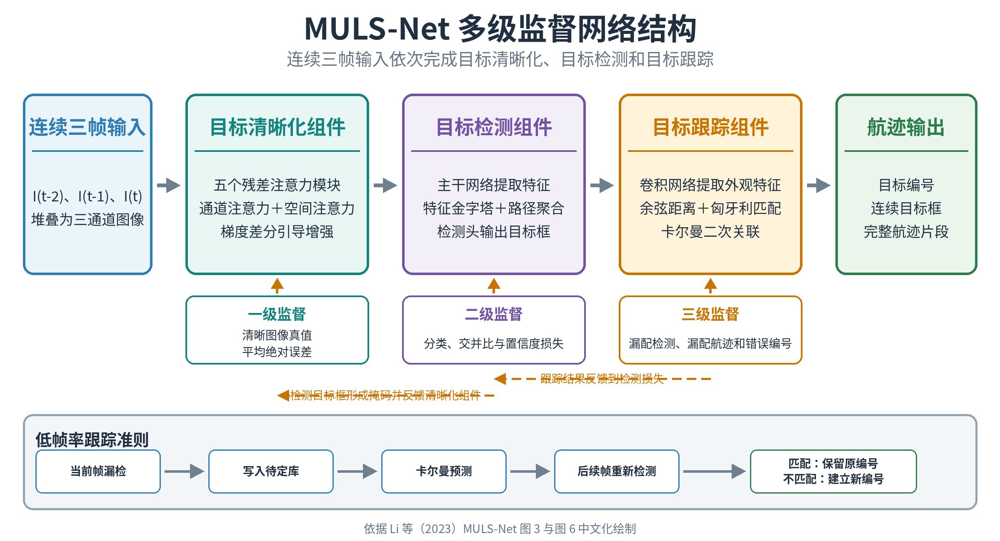

# 多模态特征融合与目标航迹关联方案

**体系方案与实施安排｜2026年8月**

本专题面向雷达、声学、可见光、红外和高空侦察节点的联合目标关联。建设重点是利用微多普勒、声谱、纹理、热轮廓和多帧运动信息形成统一目标特征，在密集交叉、短时遮挡、同型号目标并行飞行和部分传感器失效条件下保持身份连续。

项目现有 D1 多传感器融合模块和 D2 多目标关联模块已经具备状态估计、协方差传播、时序处理、几何门控和全局匹配基础。本方案在该基础上建设特征融合链。现有链路继续提供几何候选、运动连续性、中心编号和异常回退，特征融合负责在多个合理候选之间进一步区分目标。文中“已具备”指当前软件与科研仿真能力；真实传感器性能、处理时延和大规模运行能力仍需通过同步采集、封闭区域试验和指定计算平台验证。

## 1. 任务判断

### 1.1 建设目标与技术边界

航迹关联需要连续回答三个问题：当前观测属于哪条已有航迹，遮挡后重新出现的目标是否延续原身份，不同传感器形成的局部片段是否对应同一实体。位置和速度能够排除明显不可能的匹配；当目标间距接近测量误差、多个目标运动模式相似或同时穿越视场时，几何信息通常会留下多个可行候选，身份交换主要发生在这些候选之间。

特征融合补充目标本身的区分信息。雷达微多普勒反映旋翼和机体运动，声谱反映动力系统和转速，可见光与红外反映外形、纹理和热分布，多帧片段反映角速度、尺度变化、轨迹曲率和遮挡前后的连续性。系统把这些信息编码为统一目标表征，并给出候选之间的同目标分数，再由全局关联模块完成互斥匹配和中心编号维护。

单目视觉不承担独立三维测距。视觉视线、检测框、多帧运动和外观特征直接参与身份关联，雷达等传感器继续提供距离和速度约束。特征模型不生成中心航迹编号，也不把相似度直接解释为位置方差；模型超时、版本不一致、输入异常或整体质量不足时，系统回到现有几何与运动方案。

## 2. 总体方案

### 2.1 信息流程

总体流程由多模态输入、模态内编码、候选对齐、特征融合和全局关联五个环节组成。传感器前端形成目标裁剪、局部时频数据和多帧片段；模态内编码器将局部数据压缩为目标特征，并记录质量、可用性、模型版本、量测时刻和到达时刻；候选对齐模块依据时间、公共视场、视线、重投影和宽松几何条件筛选合理关系；融合模块生成统一目标表征和同目标分数；全局关联模块完成互斥匹配、歧义保持和身份记忆。

系统内部保留三类相互配合的信息。特征信息承担候选区分，状态信息记录位置、速度、协方差和有效时刻，身份信息维护中心编号、本地编号、关联分数和历史。三类信息在地面中心汇合，最终航迹统一提供给区域调度、资源分配、末端视觉核对和离线评价。完整视频和原始波形主要用于标定、困难样本留存和专项分析，常态运行优先传输量测、航迹摘要、压缩特征和质量信息。

### 2.2 节点分工

| 节点 | 主要任务 | 主要输出 |
| --- | --- | --- |
| 传感器前端 | 检测、目标裁剪、模态内编码和质量评估 | 量测、目标特征、质量和双时间戳 |
| 高空侦察节点 | 大范围光电搜索、局部跟踪和特征压缩 | 目标框、视线、位姿、特征和质量 |
| 地面融合中心 | 候选对齐、跨模态融合和全局关联 | 同目标分数、统一目标表征和全局航迹 |
| 拦截无人机 | 本机局部跟踪和末端目标核对 | 锁定、模糊、保持或重捕状态 |
| 离线评价节点 | 回放、统计分析和失败原因归类 | 身份交换、连续性、时延和曲线 |

地面中心承担跨模态融合、全局关联和统一航迹发布。高空侦察节点完成大范围光电搜索、目标裁剪和特征压缩；拦截无人机上的 D5 末端视觉模块只处理本机目标核对和低时延导引输入，不在机载端重新创建或改写中心编号。需要回传机载信息时保留原始量测时刻、实际到达时刻、相机位姿和来源关系，保证地面中心能够按同一时空基准处理。

## 3. 特征融合

### 3.1 特征体系

| 模态 | 主要特征 | 主要作用 | 使用限制 |
| --- | --- | --- | --- |
| 雷达 | 距离－多普勒局部数据、微多普勒、散射统计 | 提供旋翼、运动和类别差异 | 需要真实中间数据，AirSim仿真无法替代 |
| 可见光 | 轮廓、纹理、颜色、姿态和目标裁剪 | 区分外形与局部细节 | 远距离、弱光和模糊时能力下降 |
| 红外 | 热轮廓、温差、热区分布和时间变化 | 改善夜间与弱光连续性 | 受背景温度和设备标定影响 |
| 声学 | 基频、谐波、频带能量和周期性 | 改善类别与候选排序 | 受风噪、混响和传播遮挡影响 |
| 多帧运动 | 角速度、尺度变化、轨迹曲率和缺测模式 | 保持遮挡前后的短时连续 | 不能单独区分长期同向编队目标 |

每种特征同时携带质量、可用性和模型版本。质量由信噪比、目标像素尺寸、遮挡、模糊、背景复杂度、时延和传感器健康状态共同决定。缺失模态使用独立标志，不用零向量代替“没有数据”。同一目标在不同距离、视角、时间和设备上形成的特征差异，需要通过同步样本和质量标定纳入模型训练。

### 3.2 候选对齐与融合主线

纹理级融合发生在目标检测和特征提取之前，对完成严格配准的原始图像、像素或局部纹理进行联合处理，也称数据级或像素级融合。它能够保留较完整的原始细节，直接改善弱小目标的对比度、轮廓和检测框质量，适合共轴或外参稳定的可见光与红外设备。其使用条件较严，需要不同图像在时间、视场、尺度和空间位置上准确对齐，原始数据传输量和计算量也较大。雷达微多普勒、声学频谱以及不同位置相机的数据结构差异明显，无法采用逐像素方式直接融合。

特征级融合位于传感器前端处理和最终关联之间。各传感器先使用适合自身的数据编码器，分别提取纹理、热分布、微多普勒、声谱和多帧运动特征，再把候选目标的特征映射到公共空间，根据可用性、质量和时间差进行加权。该方法能够处理不同数据结构、采样率和分辨率，保留的目标身份信息多于决策级结果，同时支持模态缺失和按候选计算，通信量也低于完整原始数据传输。它需要同步的同目标样本、跨设备特征标定和分数校准；训练场景覆盖不足或模型漂移会造成相似度偏差，推理与验证工作量高于决策级融合。

决策级融合在各传感器已经完成检测、分类或局部跟踪后进行，融合对象是目标位置、速度、类别、协方差、局部编号和关联结果。它的接口清晰、通信量较低，便于异步处理、模块替换和异常回退，状态估计与协方差传播也有较成熟的方法。其不足是原始纹理和频谱信息在形成局部结论时已经被压缩；当多个同型号目标密集交叉、状态均值接近或量测误差相互覆盖时，仅依靠位置、速度和类别难以保持目标身份，前端已经发生的漏检和错误分类也很难在决策层纠正。

本项目选择特征级融合作为主要判别层，直接原因是航迹关联需要判断不同传感器看到的是否为同一目标，而关键身份线索分布在纹理、热特征、微多普勒、声谱和运动片段之中。纹理级融合无法覆盖全部异构传感器，决策级融合又不足以处理密集交叉和同型号目标。特征级方法允许各模态保留适合自身的编码方式，再在通过时空门控的候选目标之间比较统一特征，并依据目标尺度、信噪比、遮挡和时延调整权重。运行链采用分层组合：可见光与红外在具备标定条件时进行局部纹理级融合，特征级融合给出候选同一性分数，决策级链路完成状态更新、全局互斥、统一编号和模型不可用时的回退。

候选形成遵循“先低成本约束、后高成本比较”的顺序。系统先检查数据有效期、公共视场和传感器位姿，再使用视线、重投影、运动预测和协方差形成宽松候选。门外关系停止计算，门内候选继续比较纹理、热分布、微多普勒、声谱和多帧变化。候选范围过窄会提前删除正确匹配，范围过宽会增加推理量和误关联风险，因此需要同时记录候选召回率、最大候选数量和处理时延。

### 3.3 多级监督融合网络

本方案借鉴多级监督网络（MULS-Net）的处理思路，把多模态目标跟踪分为特征增强、目标表征和航迹关联三个连续环节。各环节分别训练，同时把后续关联结果反馈到前端，使特征提取和目标检测直接面向航迹连续性优化。雷达、声学、可见光、红外和多帧运动信息由各自编码器处理，在候选目标层完成融合，不要求不同传感器输出相同的数据形式。

#### 3.3.1 特征增强

可见光和红外分支采用连续多帧输入，通过残差连接、通道注意力和空间注意力突出弱小目标。梯度差分用于提取目标边缘和帧间变化，降低背景缓慢变化对检测的影响。雷达分支提取位置、速度、微多普勒和航迹变化，声学分支提取方位、基频、谐波和频带能量。各分支输出目标特征、质量评分和时间信息，为后续融合提供统一输入。

#### 3.3.2 目标表征

视觉分支使用多尺度特征网络生成目标框、类别和置信度，并从目标区域及其邻近背景提取外观特征。雷达和声学不转换成图像，而是保留各自的运动和频谱特征。系统依据时间、视场和粗略几何关系形成候选目标，再对候选内的视觉、雷达、声学和运动特征进行门控加权，形成统一目标表征。模态缺失时保留缺失标志并降低整体质量，不用零值代替缺失数据。

#### 3.3.3 两级航迹关联

第一级关联比较统一目标特征，可采用余弦距离或学习得到的同目标分数形成代价矩阵，再通过匈牙利算法求解全局匹配。该级主要区分位置接近、运动相似但纹理、热特征、微多普勒或声谱不同的目标。第二级处理第一轮未匹配目标，使用卡尔曼预测、协方差和马氏距离再次匹配，补回外观不清、部分模态缺失或短时漏检造成的关联中断。

目标短时消失后进入待定航迹池，不立即删除编号。系统继续预测其位置和不确定度；目标重新出现并通过特征与运动联合门限后恢复原航迹，超过有效时间或预测范围后再终止。这样可以处理遮挡、漏检和传感器短时中断，同时避免一次缺测直接引起目标编号变化。

#### 3.3.4 分级反馈

特征增强、目标检测和航迹关联分别设置训练目标。检测框生成的目标掩码反馈到图像增强分支，引导网络集中处理目标区域；未匹配检测、未匹配航迹和目标编号错误反馈到检测与特征网络，使前端输出更适合连续关联。多模态训练样本覆盖同目标、异目标、近距离交叉、短时遮挡和模态缺失，模型同时学习特征区分能力和输入质量变化。

运行时保留现有D1和D2的时间同步、协方差传播、几何门控、卡尔曼预测和全局匹配。多级监督网络负责增强特征和修正候选代价，确定性链路负责限制物理可行范围、维护统一目标编号并在模型不可用时继续运行。该组合兼顾多模态特征的区分能力和航迹处理的稳定性。

## 4. 航迹关联

### 4.1 候选图与全局匹配

中心航迹片段和各传感器局部片段组成稀疏候选图。空间区域、时间有效期、公共视场和宽松统计条件用于删除明显不可能的边，门内边采用特征为主、运动和时间辅助的复合评分。几何关系保证物理可行性，多模态特征在多个合理候选之间区分身份；当某一模态缺失时，其余模态继续计算，整体质量不足时降低特征权重。

复合评分形成代价矩阵后，由线性指派完成全局互斥。一条航迹最多使用一个观测，一个观测最多更新一条航迹。多个候选分数接近时保留歧义状态，暂停动态模板更新，等待后续运动分离、其他传感器或新增视角。中心关联模块维护统一编号，传感器前端、融合模型和机载节点只提交本地编号、目标特征和匹配结果。

### 4.2 不确定度与异常回退

量测协方差和特征质量分开管理。雷达、相机和声学在各自量测空间保留误差；目标像素尺寸、模糊、遮挡、信噪比和频谱稳定性用于计算特征质量。视觉检测置信度不能直接作为位置方差，特征相似度也不能直接作为正确率。单目视觉的视线可以约束目标方向，缺少可靠距离条件时不反投影为高置信三维位置。

模型超时、版本不一致、输入分布异常或整体质量不足时，系统使用现有状态与关联链继续运行。状态更新、特征提取和末端核对来自同一原始帧时记录共同来源，防止同一信息在不同环节重复计权。回退路径需要独立测试，评价内容包括身份交换、航迹连续性、候选召回、处理时延和恢复时间。

## 5. 部署与规模

### 5.1 通信与计算

| 数据形态 | 典型用途 | 传输策略 |
| --- | --- | --- |
| 量测与航迹摘要 | 几何候选、状态连续和异常回退 | 常态传输 |
| 压缩目标特征 | 跨模态候选评分 | 常态或按候选传输 |
| 目标裁剪 | 人工复核、模型更新和困难样本 | 按需传输 |
| 完整视频和原始波形 | 标定、离线分析和专项试验 | 事件触发或本地留存 |

特征提取可部署在传感器边缘节点或地面中心。高带宽、稳定链路条件下可回传目标裁剪；带宽受限时上报压缩特征和质量。按 256 维半精度特征估算，每个目标特征约 512 字节，200 个目标、10 赫兹时，纯特征约 8.2 兆比特每秒，尚未计入协议、协方差、加密和重传开销。该数值用于通信预算估算，实际占用需要在指定编码、链路和丢包条件下测量。

计算平台需要分别考察模态内编码、候选筛选、特征比较和全局匹配时延。地面中心承担跨模态融合和大规模候选图求解，高空节点优先完成目标裁剪和特征压缩，拦截无人机只运行本机短时跟踪和末端核对。部署位置最终由传感器接口、处理器能力、模型大小、链路质量和数据留存要求共同确定。

### 5.2 大规模关联

200 条中心航迹与 200 个观测形成 4 万条理论候选边。系统先按区域、时间、视场和统计条件稀疏化，再按连通分量独立求解。规模测试需要同时记录候选召回、最大连通分量、特征传输量、推理时延、内存、身份交换和航迹连续性，不能只报告最终匹配准确率。

图神经网络适合对稀疏候选图进行联合评分，但不替代候选生成和全局互斥。规模扩大后优先保证候选召回和身份稳定，再评估更复杂的联合建模方法。处理周期、显存和通信预算应作为模型准入条件，离线效果提高但无法按周期完成计算的方案只保留为研究对照。

## 6. 实施与验证

### 6.1 实施步骤

| 阶段 | 主要工作 | 阶段输出 |
| --- | --- | --- |
| 第一阶段 | 建立统一特征格式，采集可见光、红外和多帧数据 | 同步数据集、单模态基线和质量标定 |
| 第二阶段 | 建立门控加权与度量学习，形成双谱段融合 | 统一目标表征、同目标分数和对照结果 |
| 第三阶段 | 接入雷达微多普勒与声谱，完成模态缺失试验 | 全模态模型、分数校准和回退规则 |
| 第四阶段 | 接入中心关联链，开展 200 目标稀疏图试验 | 运行接口、规模数据和准入结论 |

近期优先完成可见光、红外和多帧运动特征链。这三类数据的采集和标定条件相对明确，可先形成目标裁剪、局部片段、统一特征接口和同目标样本。雷达微多普勒和声谱在真实中间数据具备后接入，缺少同步数据时不提前训练全模态模型。图神经网络安排在基础特征、稀疏候选图和确定性对照稳定之后。

特征融合先在固定数据和旁路运行中评价，不改变中心关联结果。达到候选召回、分数校准、身份交换、连续性和处理时延门限后，再允许特征评分进入正式排序。每次模型更新均保留数据版本、模型版本、质量门限和对照结果，确保不同阶段可以复现和比较。

### 6.2 验证方式与指标

| 层级 | 验证内容 | 结论边界 |
| --- | --- | --- |
| 离线固定数据 | 单模态、双模态和全模态关联对比 | 特征区分能力和可复现性 |
| 三维质点仿真 | 交叉、遮挡、时延、虚警和模态缺失 | 状态机、规模和回退流程 |
| AirSim视觉仿真 | 相机检测、目标裁剪、跨视角和运行时序 | 视觉接口和几何流程 |
| 封闭区域同步采集 | 雷达、声学、可见光和红外联合记录 | 真实特征与标定性能 |
| 半实物与外场 | 通信、计算平台、节点故障和持续运行 | 工程适应性和处理预算 |

| 指标 | 主要用途 | 当前状态 |
| --- | --- | --- |
| 候选召回率 | 检查正确关系是否进入特征比较 | 拟新增 |
| 同目标分数区分度 | 检查同目标与异目标候选是否可分 | 拟新增 |
| 分数校准误差 | 检查模型分数与实际正确率是否一致 | 拟新增 |
| 身份交换次数 | 判断中心编号稳定性 | 已有统计基础 |
| 航迹连续性 | 判断交叉和遮挡后的身份保持 | 已有统计基础 |
| 模态缺失退化 | 判断单一传感器失效后的回退能力 | 拟新增 |
| 第 95 百分位处理时延 | 判断是否满足运行周期 | 已有计时基础 |
| 在线真实编号使用 | 检查仿真真值是否进入在线算法 | 要求为 0 |

AirSim仿真不能提供可信的雷达微多普勒和声学波形，相关试验只用于检查图像、几何、时序和系统接口。研发阶段建议在相同检测召回和虚警约束下，使密集交叉与遮挡场景的身份交换次数相对几何基线降低 30% 以上，航迹连续性不下降，第 95 百分位处理时延满足指定运行周期。该数值属于建议门限，需要在冻结数据集和指定硬件上确认。

## 7. 当前进展与下一步

### 7.1 已有基础与主要差距

项目已具备六维状态、协方差、双时间戳、迟到观测处理、统计门控、稀疏候选、全局匹配和身份交换计数。三维质点环境、AirSim运行链、末端视觉模块和离线评价模块能够提供目标运动、相机投影、时序异常和统计分析基础。这些能力可支撑特征融合链的接口接入、候选生成、异常回退和对照评价，当前结果仍属于状态与几何关联基础。

同步雷达、声学、可见光和红外目标级数据集尚未建立，统一特征接口、跨模态同目标标注、质量标定和分数校准仍需建设。相机位姿、外参、时钟偏差和候选范围尚未完成联合标定；200 目标条件下的特征传输量、推理时延、内存和候选召回也未测定。近期资源应集中在同步数据、基础编码器、质量门控和同目标评分，不宜同时铺开全部高级模型。

### 7.2 建设安排与结论

下一阶段先完成可见光、红外和多帧数据的同步采集与统一格式，形成几何基线、单模态基线和双模态特征基线；随后接入真实雷达微多普勒与声谱，开展模态缺失和复杂背景试验；基础链路稳定后，再进行 200 目标稀疏候选图、图神经网络评分和指定硬件时延测试。每一阶段均以未见场景的身份交换、航迹连续性、候选召回和处理周期作为准入依据。

方案的主体是多模态特征融合。雷达提供微多普勒和运动信息，声学提供频谱信息，可见光与红外提供外观和热信息，多帧片段提供时间连续性。项目现有 D1 和 D2 链路继续承担几何约束、状态连续、中心编号和异常回退。多模态性能必须通过同步实测数据验证，仿真结果只用于接口、时序、几何和流程检查。

## 参考资料

1. Li, Y., Xu, Q., Kong, Z., Li, W. *MULS-Net: A Multilevel Supervised Network for Ship Tracking From Low-Resolution Remote-Sensing Image Sequences*. IEEE Transactions on Geoscience and Remote Sensing, 2023, 61. DOI: 10.1109/TGRS.2023.3326613。
2. Wang, Z. 等. *A Contrastive-Augmented Memory Network for Anti-UAV Tracking in TIR Videos*. Remote Sensing, 2024, 16, 4775. DOI: 10.3390/rs16244775。
3. 项目多传感器融合、目标关联、末端视觉配准和系统评价资料。项目仿真结果用于算法和接口验证，不代表设备或实飞性能。
