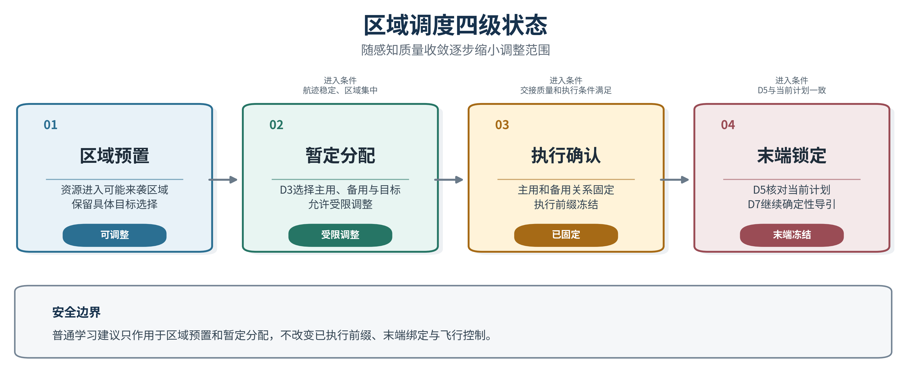

# 来袭预警后的区域滚动调度方案

**大规模高动态来袭条件下的强化学习资源调度｜2026年8月**

本方案面向多方向、多波次、高机动目标来袭时的资源调度。预警初期的目标位置、速度和身份仍在收敛，过早确定具体拦截关系容易造成资源错配；等待信息完全稳定，又会压缩出动和机动时间。目标规模扩大后，跨区调动、备用保留、侦察优先级和后续波次保障相互影响，单次分配已经不能覆盖整个处置过程。

系统以区域为基本决策单元，采用强化学习形成资源配额、跨区转移、备用比例、侦察优先级和重规划时机。具体无人机与具体目标的对应关系继续由目标分配模块求解，末端视觉负责核对目标身份，导引系统执行经过确认的任务。区域策略不直接发布目标编号、联盟成员和飞行控制指令。

全部学习动作进入任务规划前均接受安全检查。资源总量、最低备用、正在执行的任务、通信条件、机动能力、计划版本和有效期不满足要求时，动作被修正或拒绝。当前工作属于科研仿真和技术论证，学习模型尚未完成独立验证和在线准入，不能表述为实装能力。

## 一、任务背景

多目标、高机动和连续波次场景会形成明显的区域耦合。提前调出高速资源可以扩大当前拦截窗口，也可能削弱后续方向的处置能力；保留备用资源能够应对突发目标，同时会增加当前区域的任务缺口；频繁滚动更新能够追随最新态势，也会带来计划抖动、通信负担和执行混乱。规则数量随目标、区域和资源组合迅速增加，权重很难覆盖所有动态情况。

区域调度需要同时判断“当前任务是否满足”和“资源留在下一周期是否更有价值”。强化学习适合处理这种连续决策问题。策略通过大量多波次场景学习资源调动的长期影响，在每个决策周期给出区域级建议，再由确定性安全机制完成约束收口。

## 二、总体方案

### （一）分层决策

系统按照区域调度、目标分配和末端执行三个层级运行。三个层级使用同一套航迹、资源和计划版本信息，各自解决不同范围的问题。

| 决策层级 | 主要任务 | 主要输出 | 权限边界 |
| --- | --- | --- | --- |
| 区域调度 | 判断各方向需要多少资源、从哪里调入、保留多少备用 | 区域配额、跨区比例、侦察优先级、重规划时机 | 不指定具体无人机和目标编号 |
| 目标分配 | 根据威胁、可达性、航迹误差和拦截窗口形成具体任务 | 主用资源、备用资源、任务版本和有效期 | 不改变中心维护的目标身份 |
| 末端执行 | 核对本机所见目标与任务目标是否一致 | 锁定、保持、重新搜索和导引许可 | 身份不明确时停止末段接管 |

区域策略集中处理资源布局和后续波次价值，目标分配负责具体约束，末端视觉负责身份确认。这样可以控制学习算法的权限范围，防止区域建议直接进入单机控制。

### （二）滚动阶段

调度过程分为预警、稳定跟踪、交接准备和末端执行四个阶段。预警阶段依据目标可能进入的区域启动资源预置，不立即固化具体目标；稳定跟踪阶段根据航迹收敛情况调整配额并形成暂定分配；交接准备阶段确定主用、备用和进入方向；末端执行阶段保持已经确认的任务关系，只有目标丢失、资源故障、友方冲突或计划失效等硬事件触发重规划。

目标距离不是阶段切换的唯一依据。系统同时检查位置误差、信息时效、多源支持、身份稳定性、末端可见性和计划剩余时间。早期区域预置允许调整，末端任务关系保持稳定。

## 三、强化学习区域调度

### （一）状态组织

防区被划分为若干相互连接的区域。每个区域作为一个节点，记录目标需求、高威胁任务积压、可用资源、执行中资源、备用资源、航迹误差、通信质量和控制状态。允许跨区机动的关系作为连接边，记录区域距离、预计转移时间、通道容量、通信条件和机动限制。

策略同时读取当前状态和最近若干周期的变化。时间窗口反映目标需求上升或下降、航迹质量改善或恶化、资源转移进度和通信状态变化。区域图用于判断空间关系，时间窗口用于判断变化趋势，两类信息共同构成策略输入。

### （二）策略动作

策略输出六类区域动作：调整资源配额、确定跨区转移比例、设置最低备用比例、调整侦察和光电关注优先级、保持当前计划、请求提前重规划。针对预警后的资源出动，策略还可以限制下一周期进入候选池的待命资源数量，以及允许进入任务固化阶段的资源数量。

动作以区域数量和比例表示，不包含具体平台编号。目标分配模块根据区域动作、资源状态和全局航迹形成具体配对。高威胁目标需要多架无人机时，目标分配模块再确定主用成员、备用成员和任务版本。

### （三）算法结构

区域策略采用图神经网络提取相邻区域之间的关系。每个节点先形成本区域特征，再与邻区交换压缩信息，使资源缺口能够结合邻区剩余能力、到达时间和转移通道进行判断。时间窗口或循环状态用于记录前几个周期的变化，减少单帧噪声造成的反复调动。

策略网络同时计算动作建议和当前状态价值。训练采用近端策略优化方法，限制每次策略更新幅度，降低训练过程中的剧烈波动。训练前期使用规则、最小费用流和滚动优化生成示范轨迹，通过行为克隆学习基本的保持、转移和备用恢复；随后在长回合中学习多波次条件下的资源保留价值。

运行时，策略先给出区域动作，安全模块检查并修正不满足约束的部分，目标分配模块再选择具体资源。执行结果、任务缺口、资源消耗和计划变化回传评估模块，用于离线训练和效果复核。部署节点只加载经过审批的只读模型，不在任务过程中更新权重。

### （四）回报设计

训练回报同时评价任务效果、资源效率和计划稳定性。高威胁任务及时满足、较早形成有效区域覆盖、跨区转移按时完成和备用资源恢复获得正向评价；区域缺口、错过拦截窗口、无效出动、能源消耗、通信负载、计划抖动、分配冲突和降级失败形成惩罚。

安全约束不进入奖励权衡。过期计划、错误发布者、资源重复使用、最低备用破坏、友方身份冲突和多机任务成员不完整均直接拒绝。奖励权重在训练阶段形成，在独立验证前冻结，避免根据测试结果反复调整。

## 四、闭环运行

每个决策周期先根据目标进入概率、航迹存在概率、单目标资源需求和威胁紧迫程度估计区域需求。航迹误差较大时，目标需求分散到多个可能区域；位置和速度逐步收敛后，需求向更明确的方向集中。该方法能够在预警阶段提前调动资源，同时保留后续修正空间。

区域策略根据需求和资源状态形成候选动作。安全模块检查资源守恒、备用量、机动通道和任务保护，对不可执行部分进行裁剪或取消。目标分配模块随后计算具体资源与目标的对应关系，并发布带版本和有效期的计划。末端视觉核对目标身份，导引系统只执行当前有效且身份一致的任务。

新高威胁目标、资源故障、原计划不可达、目标丢失、友方冲突和计划过期直接触发紧急重规划。航迹质量变化、身份风险上升、区域进入概率集中和末端持续模糊等情况采用连续时间窗口判断。普通调整还要满足收益门限、最小保持时间和全局变化预算，控制计划切换频率。

## 五、安全与降级

### （一）安全检查

学习动作进入目标分配前完成九项检查：区域资源总量守恒；各区域保留最低备用；执行中资源不被普通动作移出；转移方向满足邻接和通道容量；通信和机动条件有效；资源能源和预计到达时间可行；计划发布者、任期、版本和有效期正确；多机任务成员与角色完整；人工授权、禁入区和平台安全状态满足要求。

模型推理超时、输入超出训练范围、模型版本不匹配或候选动作无法修正时，系统使用规则或最小费用流形成区域方案。目标数量较少、机动较弱、来袭方向稳定时，也可直接采用确定性区域调度。

### （二）降级运行

中心节点正常时，强化学习策略形成全局区域资源建议。中心计划持续失效后，由具备区域覆盖、通信和计算条件的高空侦察节点接管受影响区域，采用确定性方法重新分配。中心和二级节点均不可用时，各拦截无人机根据本地和邻机摘要进行分布式协商。

二级节点和完全分布式阶段不运行中心层强化学习策略。降级阶段的信息不完整，通信条件变化快，确定性方法更便于核对计划来源、任务成员和有效期。网络分区、计划冲突或成员确认不足时，系统保留仍然安全的任务，不发布新的重复任务。

## 六、训练与验证

### （一）训练场景

训练规模从少量目标逐步扩展到二百目标，覆盖单方向来袭、多方向波次、编队分裂、目标交叉、高机动、高威胁多资源需求、资源不足、资源故障、通信退化和控制权切换。感知条件包括距离相关误差、遮挡、漏检、虚警、身份风险和航迹质量短时反转。

场景参数随机化目标速度、转弯强度、来袭间隔、方向分布、资源性能、传感器质量和故障时刻。训练、验证和测试按完整场景与随机种子隔离，仿真真值只用于奖励计算和离线评分，不进入在线策略输入。

### （二）验证方法

验证采用相同初始态势、传感器随机源和故障条件进行配对比较。确定性区域压力规则用于少目标场景参考，最小费用流和滚动优化用于高密度场景对照，强化学习策略与两类方法比较任务满足、资源消耗和计划稳定性。区域学习和目标级学习分别验收，避免组合结果掩盖单个模块问题。

验证顺序为质点仿真、仿真平台回放、半实物网络测试和封闭区域试验。每一阶段先检查安全约束，再比较任务效果。未经独立验证的模型只能进行影子运行，记录建议但不改变正式计划。

### （三）考核指标

| 指标类别 | 主要指标 | 建议判据 |
| --- | --- | --- |
| 任务效果 | 高威胁需求满足率、首次区域覆盖时间、拦截窗口前可行计划率 | 不低于确定性对照，形成配对置信区间 |
| 资源效率 | 区域配额缺口、跨区数量、转移距离、能源消耗、无效出动 | 综合任务代价建议平均改善5%以上，待验证 |
| 计划稳定 | 计划版本变化、跨区抖动、目标换绑和任务取消 | 不高于确定性对照 |
| 安全约束 | 过期计划、重复资源、错误发布者、备用破坏和成员不完整 | 违规次数为0 |
| 实时运行 | 模型推理、安全修正和目标分配总时延 | 小于区域决策周期，具体数值待设备标定 |
| 泛化能力 | 未见方向、速度、规模、故障和通信条件下的任务效果 | 达到独立测试门限后申请准入 |

## 七、实施安排

### （一）数据与场景准备

统一多传感器航迹、目标关联、资源状态、区域关系、通信状态和计划版本的输入口径。构建多波次、高机动、资源稀缺和通信退化场景，生成带动作原因的确定性示范轨迹。训练、验证和测试数据分别管理，保存场景配置、随机种子、模型版本和评估结果。

### （二）模型训练与影子运行

先通过行为克隆学习基本调度动作，再使用近端策略优化开展长回合训练。独立测试使用未参与训练的方向、规模和故障组合。影子运行阶段同时记录学习建议和正式计划，检查推理稳定、输入范围、安全修正量和任务收益，不改变实际任务关系。

### （三）受限准入

完成独立验证和批量仿真后，按照区域、目标规模和通信条件限定模型使用范围。通过准入的模型只能生成区域调度动作，不能取得任务所有权、联盟形成权和飞行控制权。运行条件超出批准范围时立即转入确定性方案。

## 八、风险控制

### （一）感知与奖励偏差

航迹协方差偏小、身份风险判断失真或传感器质量突变，会使策略高估态势可靠性。训练中需要加入传感器偏差和质量反转，运行时检查创新统计、信息年龄和来源多样性。质量异常时提高侦察和备用优先级，不提高任务固化程度。

奖励只强调覆盖率会造成过量出动，只强调计划稳定会阻止必要重规划。评估同时记录任务满足、出动数量、能耗、备用、抖动和物理结果。累计奖励只用于训练，不能单独作为系统效果结论。

### （二）泛化与运行恢复

固定方向、固定速度和固定故障时间会使模型记忆仿真规律。训练场景需要持续随机化，并设置完全未见的场景族进行测试。节点重启、区域拓扑变化和控制权切换后，时间状态按最近有效窗口重新初始化，不沿用来源不明的历史状态。

### （三）版本与权限

模型清单绑定传感器配置、输入规范、区域边界、安全规则和拓扑版本。任一版本不一致时拒绝加载。模型文件采用只读发布和完整性校验，推理过程保留输入摘要、输出动作、安全修正和最终计划，便于复核。

## 九、当前基础与需协调事项

项目已经形成区域图输入、离线训练接口、资源守恒和备用保护等安全检查，并具备质点仿真和批量评估条件。时间状态、当前代模型训练、独立验证、仿真平台批量验证和在线准入仍需完成。现阶段可开展离线训练和影子运行，不进入实际控制。

后续需要协调三项条件：一是统一防区划分、资源能力、传感器误差和区域决策周期，冻结验收口径；二是提供代表性多波次场景、训练计算资源和独立验证数据；三是安排仿真平台、半实物网络和封闭区域试验条件，逐级校准模型适用范围和实时性指标。

## 十、结论

多目标、高机动和连续波次来袭条件下，区域资源调度需要考虑当前任务、后续波次和稀缺资源保留。强化学习负责形成区域配额、跨区转移、备用、侦察优先级和重规划建议，图神经网络处理区域关系，时间窗口描述态势变化，近端策略优化用于离线训练。

学习动作通过确定性安全检查后进入目标分配，具体任务和末端控制仍由可解释的确定性链路完成。少目标、弱机动场景以及模型异常条件继续使用确定性区域调度。下一阶段重点是完成当前代模型训练、独立验证和影子运行，在安全约束零违规的前提下确认任务收益，再决定受限准入范围。
