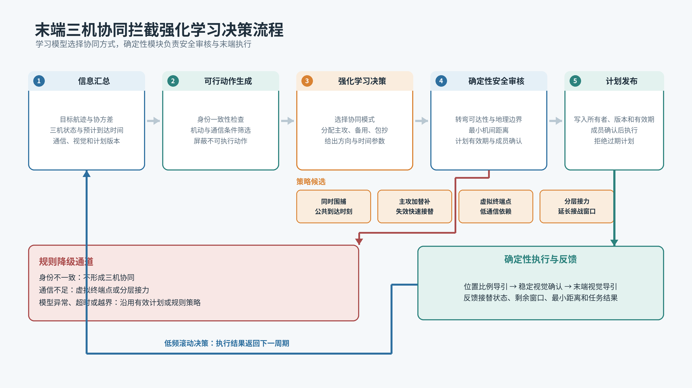

# 末端三机协同拦截强化学习实施路径

## 任务定位

高速、高机动目标会压缩单架拦截无人机的有效接战窗口。三机协同的目的，是通过不同进入方向、不同到达时刻和明确的接替关系扩大有效窗口。强化学习在本方案中承担协同策略选择和角色分配，不直接控制飞行器。系统仍由确定性模块完成航迹生成、中段比例导引、末端视觉导引和防碰撞控制，学习模型给出的结果必须经过身份、通信、性能和安全约束审核。

三机默认设置主攻机、备用机和包抄机。主攻机选择当前拦截几何较好的方向，优先建立稳定视觉锁定；备用机占据可快速转入的侧前方阵位，在主攻失效或窗口恶化时接替；包抄机控制目标可能逃逸的侧后方扇区。约120度方向间隔、2至5秒进入偏置和30至80米虚拟终端点半径仅作为仿真初值，必须根据目标尺寸、速度、拦截机转弯能力和通信时延重新标定，不能直接视为装备指标。

## 分层决策

第一层选择协同模式。通信稳定、三机状态完整且目标高速或机动明显时，可选择同时围捕，使三机朝同一公共到达时刻收敛，并形成多方向覆盖。目标存在较明确的逃逸方向、单机仍具备接战条件时，可选择主攻加替补，降低三机同时进入造成的碰撞风险。通信受限、来袭呈连续波次或平台难以保持时间同步时，选择虚拟终端点或分层接力；各机按照接战前发布的终端点和接替顺序独立执行。

第二层完成角色与参数分配。系统在三架无人机之间选择主攻、备用和包抄角色，并给出进入扇区、期望到达时间、时间偏置、虚拟终端点半径和接替条件。角色不是固定编号。任一无人机的剩余能量、转弯能力、视觉状态或通信质量下降时，可触发重新评估。已经进入末段的主攻机原则上不频繁换位，避免滚动决策造成航迹抖动。

## 强化学习模型

决策状态由五类信息组成：目标位置速度、机动趋势及其协方差；三机位置速度、可用过载、剩余航时和预计到达时间；三机相对方位、覆盖角和预测最小间距；通信时延、丢包和成员确认状态；末端视觉锁定、目标身份一致性和观测新鲜度。连续量归一化后输入策略网络，目标身份、计划版本和成员状态保留为显式门控量，不交给模型自行推断。

动作采用“离散模式加连续参数”的分层结构。上层在同时围捕、主攻加替补、虚拟终端点和分层接力之间选择；下层输出角色排列、进入角、到达时间偏置和终端点参数。不可执行动作在采样前屏蔽，例如通信不满足时不得选择依赖连续时间同步的同时围捕，某机机动余量不足时不得将其设为主攻。三机规模固定时可先采用近端策略优化算法，结构简单、训练稳定。后续扩展到更多成员时，再研究带注意力机制的策略网络。

奖励函数不直接使用单一“是否拦截”信号。正向项包括目标逃逸扇区压缩、三方向覆盖、有效接战窗口和角色连续性；代价项包括到达时间差、能量消耗、计划频繁切换和通信负担；错误目标绑定、过期计划执行、成员未确认和预测碰撞设置为高额惩罚。训练时可使用仿真真值计算结果奖励，部署时不得把真值目标编号或真实位置送入在线决策链。

## 算法流程

每个决策周期先对齐航迹、资源和视觉信息的时间戳，并预测到统一时刻。身份检查确认三机所跟踪的是同一个全局目标，随后根据通信、机动和安全条件生成可行动作集合。学习模型在可行动作内选择模式、角色和参数。确定性审核器重新计算到达时间、转弯可达性、最小机间距离、地理边界和计划有效期。审核通过后发布带版本、所有者和有效期的协同计划；审核失败则保留上一有效计划或切换到低通信依赖的规则方案。

计划执行阶段，中段继续使用位置比例导引，达到视觉切换条件并取得稳定目标确认后，才允许转入末端视觉导引。备用机和包抄机只有在当前计划明确激活时才能接管，不能因本机画面中出现相似目标而自行改写目标编号。执行结果、视觉状态、剩余窗口和安全距离返回决策器，形成低频滚动更新。飞行控制保持高频闭环，强化学习决策频率应明显低于控制频率，避免网络推理抖动直接传入控制量。

## 训练与验证

训练先在三维质点环境中进行。场景随机化目标速度、转弯强度、突发机动、初始方位、三机性能差异、通信中断、视觉丢失和单机失效。训练顺序由稳定直线目标逐步增加机动和故障，不宜一开始混入全部困难条件。现有规则表作为基线，也可用于生成初始示范数据，减少无效探索。训练完成后冻结模型，再进入同输入、同随机种子的规则方案对照。

验证指标包括三方向有效覆盖角、公共到达时间误差、目标逃逸率、主攻失效后的接替时延、计划切换次数、计算时延和最小安全距离。身份错配、旧版本执行、未确认成员进入末段及安全距离违规必须单独计数，不能被平均成功率掩盖。质点仿真通过后再开展仿真平台验证，重点检查时延、视觉丢失和飞行器实际转弯能力。仿真结果只说明算法可行性，不等同于实飞能力。

## 部署原则

在线链路采用“学习建议、规则审核、版本发布、确定性执行”。目标身份不一致时不形成三机协同；通信质量不足时禁止同时围捕，优先切换虚拟终端点或分层接力；预测存在碰撞风险时调整进入方向和时间，无法消除风险则退出协同；模型输出异常、超时或超出训练分布时直接采用规则策略。学习策略只有在多批随机试验中持续优于规则基线，并保持身份改写、过期计划执行和安全违规为零后，才适合进入默认决策链。
