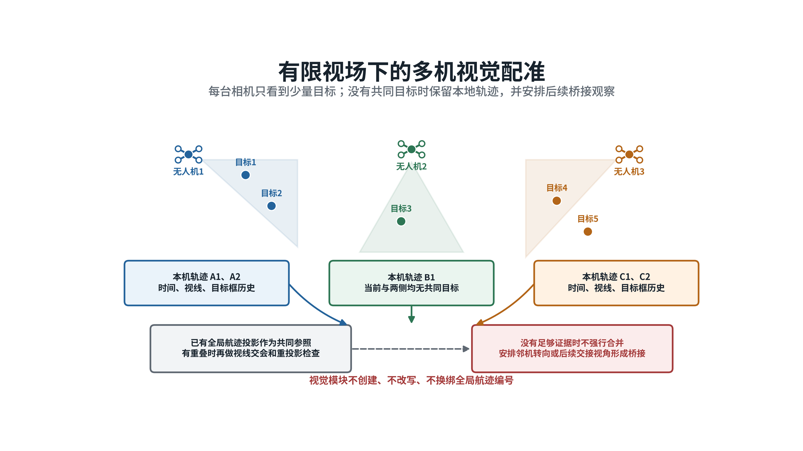
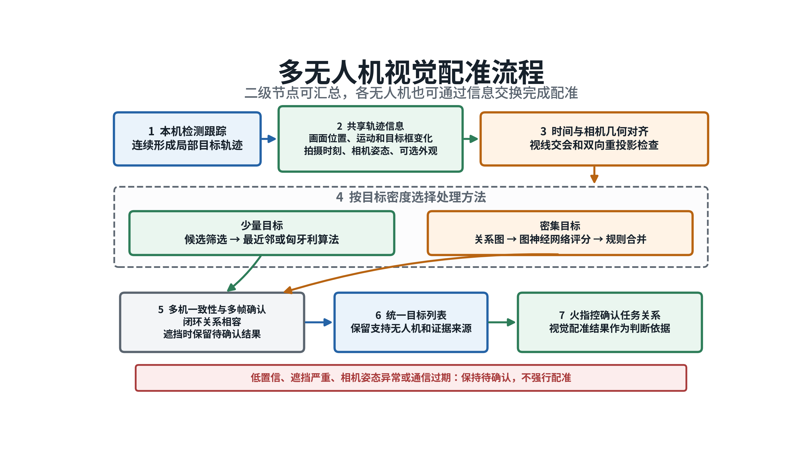

# 视觉配准与火力指挥控制

本报告说明多无人机视觉目标配准和火力指挥控制两项研究内容。视觉配准负责把不同无人机看到的局部目标合并成一份统一目标列表，火力指挥控制负责确定各区域需要多少资源、由哪一架拦截无人机执行以及中心失效后由谁继续组织。配准结果为任务调整提供判断依据，具体任务关系仍由火指控系统确认。

# 一、视觉配准

## 当前难点

拦截无人机飞到目标附近后，各机相机通常只能看到部分来袭目标，而且视野之间存在重叠。以三架无人机观察五个目标为例，无人机1看到目标1、2、3、4，无人机2看到目标2、3、4、5，无人机3看到目标1、2、4、5。目标编号只用于说明，实际系统需要依靠图像和相机几何自行判断对应关系，并把三路局部观察合并成一份统一目标列表。

不同相机拍摄同一目标时，目标在画面中的位置、运动方向和目标框大小通常不同，像素坐标不能直接比较。拍摄时刻不一致、相机姿态误差、通信延迟、遮挡和检测框抖动都会产生错误候选。目标数量增加后，可能的对应组合迅速增多，一次错误匹配还会通过多机关系传给其他视角。系统需要先排除物理上不可能的组合，再用多机闭环关系和连续多帧结果确认，低置信情况下保持待确认。

## 关键技术

1. **多机几何配准与连续确认。** 每架无人机先对本机画面中的目标连续跟踪，再共享画面位置、运动方向、目标框大小变化、拍摄时刻、相机位置姿态及可选外观特征。系统对齐拍摄时刻，把各相机观测换算到共同空间，综合视线交会、双向重投影误差、运动方向和尺度变化筛选候选。候选唯一时采用最近邻方法；多条轨迹竞争时，使用匈牙利算法选择总体代价较小的一对一组合，并通过三机闭环和连续多帧检查确认。

2. **密集目标图关联与分布式汇总。** 目标密集或遮挡频繁时，系统先按时间和物理几何删除明显不可能的组合，再把各机局部目标轨迹组成关系图。图中的点代表局部目标轨迹，连线代表两条轨迹可能属于同一目标。图神经网络只计算对应可能程度，最终合并仍由同机互斥、多机闭环和多帧稳定规则决定。结果可以由二级节点集中汇总，也可以由无人机之间交换信息并取得一致；信息不足或过期时不强行合并。

## 主要研究内容

**多机局部跟踪与信息共享。** 每架无人机先在本机完成检测和连续跟踪，记录目标在画面中的位置、运动方向、目标框变化、拍摄时刻和跟踪质量。多机之间常态交换紧凑轨迹信息，原始视频按任务需要传输，以控制通信带宽。二级节点可统一汇总；二级节点不可用时，各机交换相同信息并逐步形成一致结果。

**少量目标的几何配准。** 系统先对齐拍摄时刻，再根据相机参数、位置和姿态计算目标视线及交会位置，并检查投回各画面后的误差。时间、几何、运动和目标框变化均合理的轨迹才进入候选集合。示例配准后，目标1由无人机1和3共同确认，目标2由三机确认，目标3由无人机1和2确认，目标4由三机确认，目标5由无人机2和3确认。

**密集目标的图关联。** 系统先用拍摄时间、相机视场、视线交会和重投影误差删除不可能的组合，再构造目标关系图。图神经网络给出轨迹对应的可能程度，明确规则负责检查同机冲突、多机闭环和连续稳定。某一路短时遮挡时，其他视角可以继续维持目标；低置信、相机姿态异常或通信信息过期时保持待确认。

当前已完成多相机局部轨迹表达、双时刻记录、几何质量信息、候选筛选、一对一匹配、稀疏关系图和同相机互斥等研究功能。科研仿真已检查多相机部分可见、局部轨迹编号重复、几何候选筛选和多帧稳定等情况。无中心三机端到端配准、三机闭环检查、图神经网络在线使用、通信中断恢复以及真实可见光和红外数据下的性能仍待验证。

# 二、火力指挥控制

## 当前难点

来袭目标数量多，位置、速度和身份持续变化。侦察与拦截资源分散在不同区域，跨区调动需要时间，也会消耗备用力量。通信时延、信息到达先后差异和规划计算延迟，会使刚形成的计划落后于实际态势。中心节点需要及时形成区域调度和具体目标分配，同时控制换令频率，保护正在执行的任务。

中心失效后需要由二级节点接管；二级节点再次失效后，各拦截无人机还要在没有中心的条件下协商任务。连续降级过程中必须防止同一资源被重复派遣、多个资源发生冲突以及多个节点同时发布有效命令。每次接管都要明确发布者、任期、版本和有效期，过期计划和旧任期消息不得继续执行。

## 关键技术

1. **强化学习区域调度与确定性目标分配。** 中心火指控的工程方案主线确定为强化学习区域调度。策略读取区域需求、威胁、资源、通信、航迹不确定度和未来窗口，输出区域资源配额、跨区转移、备用比例、侦察优先级和重规划时机。学习动作必须经过资源守恒、最低备用、执行中资源保护、通信、机动、控制权、计划版本和有效期等确定性检查。规则和最小费用流承担训练教师、验证对照、安全修正和异常回退。区域动作通过检查后，具体资源与目标仍由规则代价、可选的有界学习修正和匈牙利算法完成配对。

2. **分级接管与一致性控制。** 火指控采用中心、机动高空侦察无人机二级节点和完全分布式三级结构。主动降级综合航迹不确定度、身份风险、计划年龄、末端视觉一致性、通信质量和异常持续时间作出判断；被动降级依据中心健康状态启动。二级节点按覆盖区域采用确定性方法重新分配。二级节点再次失效后，各拦截无人机通过分布式拍卖协商任务。发布者、任期、版本、有效期和必要成员确认共同约束三种运行层级。

## 主要研究内容

**中心区域调度和初次分配。** 中心先判断各区域需要多少资源、何时跨区和何时重规划，再确定具体资源对应的目标。强化学习负责区域级长期决策，处理多周期资源价值和后续来袭波次；确定性安全机制负责检查和修正动作；目标分配模块根据威胁、可达性、航迹协方差、拦截窗口和资源状态形成具体计划。新高威胁目标、区域资源缺口、航迹质量持续变化、资源故障、通信变化、原计划不可达或临近到期时触发重规划。小幅变化需要经过收益门限和最小保持时间。

**主动降级后的二级节点分配。** 机动高空侦察无人机随队出动，利用较大视野和较强通信、计算能力补充中心观测并准备接管。系统先请求中心重规划；只有中心无法在计划有效期内恢复控制或已经失效时，才选择覆盖和通信持续满足要求的二级节点接管。二级节点继承最后一份有效计划和已执行前缀，在授权区域内重新估计任务并发布更高版本计划。中心恢复后先比较航迹、计划和执行状态，再完成控制权移交。

**二级节点失效后的分布式分配。** 中心和二级节点均不可用时，各拦截无人机交换匿名目标摘要、资源状态、通信关系和当前任务，通过确定性分布式拍卖形成任务。需要多机协同的目标必须完成全部必要成员确认后才能执行。网络分区、消息过期、版本落后、摘要冲突或确认不足时，系统保持仍然有效的旧安全任务；旧任务也不再安全时，停止发布新任务并进入保持。

强化学习区域调度是目标体系中心层的方案主线，当前实际运行仍为确定性基线。现有区域图、训练接口、安全检查和规则回退已经具备；本代学习模型尚未完成训练、独立验证、AirSim 批量验证、在线准入和部署。二级接管、版本门控和分布式协商已有科研仿真基础，真实通信环境、完整自主联盟重构和物理闭环仍需验证。

# 三、体系衔接

多无人机视觉配准形成统一目标列表，并保留各目标由哪些无人机共同支持、结果是否稳定以及信息是否过期。火指控使用这些结果判断多个资源是否在观察同一目标，并结合计划年龄和通信状态决定保持、重规划或降级。配准形成共同目标轨迹，任务编号由火指控系统确认，视觉模块不自行更改任务关系。
