# 弱特征条件下多无人机视觉配准方案

**固定中心参考、扇区基准航迹与末端身份确认**

**2026年8月**

## 一、任务条件

### （一）节点关系

中心节点固定部署在区域中心，各扇区配置一架盘旋二级节点。中心节点和二级节点使用相同等级的光电探测设备，均可控制云台完成目标搜索和局部多目标跟踪。中心节点的位置和安装关系较稳定，负责维护全局航迹编号；二级节点只负责本扇区，利用空中位置和持续盘旋形成更有利的观察角度。

拦截无人机根据区域提示飞入目标附近后，使用本机云台搜索目标。受距离、视场和目标空间间隔限制，每架拦截无人机通常只能看到目标群的一部分。不同无人机看到的目标集合存在交集，也可能在一段时间内完全不重叠。

### （二）成像条件

相同的光电设备不等于相同的观察结果。中心节点固定后，目标距离和观察方向由部署位置决定。二级节点距离本扇区目标可能更近，但平台位置、机体姿态和云台角度持续变化。拦截无人机距离目标最近，画面变化也最剧烈。三类节点的目标像素尺寸、排列顺序、遮挡关系和拍摄时间均不相同。

远距离目标在图像中可能只有十几个像素，稳定纹理和轮廓不足。空中背景也缺少可长期使用的地物特征。跨视角身份确认以时间、相机几何、目标运动和多目标排他关系为主，外观相似度只在成像质量满足要求时作为补充证据。

### （三）配准目标

配准工作的目标是判断不同相机形成的局部短轨迹是否来自同一架来袭无人机，并把确认结果连接到中心节点管理的全局航迹编号。方案采用两级滚动结构：中心节点先与二级节点建立扇区基准航迹，二级节点再把基准航迹与拦截无人机的本机短轨迹配准。

两级配准均按概率几何运行。每条观测携带拍摄时间、消息到达时间、相机位姿、云台角度、标定版本和协方差。任一级证据不足时，系统保留多个候选或维持区域临时身份，不向后一级传递确定编号。

## 二、总体方案

中心节点和二级节点持续维护第一阶段配准关系。拦截无人机进入扇区后，直接使用当前有效的扇区基准航迹开展第二阶段配准，不需要等待两级从头重新计算。

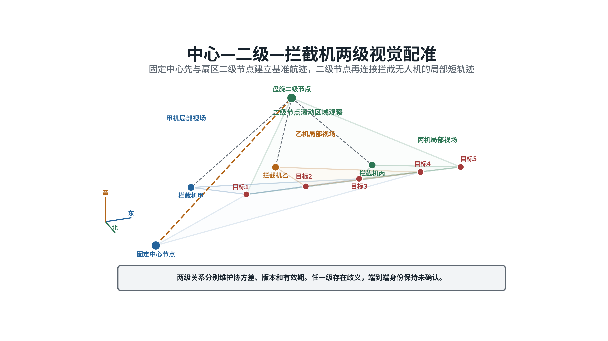

*图1  橙色虚线表示中心节点至二级节点的第一阶段关系，灰色虚线表示二级节点至拦截无人机的第二阶段关系。两级关系均通过共同目标、拍摄时间和空间几何建立。*

主流程由四部分组成。

1. **中心节点至二级节点配准。** 两端分别形成局部短轨迹，通过时间对齐、极线门控、空间视线交会、双向重投影和一对一整体匹配，判断两端是否观察到同一目标。
2. **扇区基准航迹。** 第一阶段连续稳定后，形成带中心全局航迹编号、二级本地轨迹编号、三维状态、协方差、版本和有效期的扇区基准航迹。
3. **二级节点至拦截无人机配准。** 二级节点把有效基准航迹预测到拦截无人机的拍摄时刻，并投影到本机图像。拦截无人机局部短轨迹连续通过几何和运动检查后，建立对全局航迹编号的只读映射。
4. **歧义处理和补充观察。** 多个候选无法区分时，系统保留多项假设。二级节点凝视、邻机转向或平台适度机动用于增加观察角度。仍不能分离时，只按空间区域继续搜索。

中心节点至二级节点的配准必须具备共同目标、可信三维先验或唯一的时空交接关系。两端没有共同观察，且预测区域内存在多个相似目标时，第一阶段不能建立扇区基准航迹。相同设备和相同扇区不能替代这一条件。

## 三、统一几何基础

### （一）图像投影和空间视线

所有节点使用统一的局部北东地坐标系。世界坐标中的目标位置记为 $\mathbf X$，第 $q$ 台相机的位置记为 $\mathbf C_q$，相机内参为 $K_q$，世界坐标到相机坐标的旋转为 $R_{cw,q}$。针孔投影关系为：

$$
\tilde{\mathbf u}_q \sim K_qR_{cw,q}(\mathbf X-\mathbf C_q)
$$

已知三维位置时，可以计算目标在图像中的像素位置。从单个检测像素反推目标时，只能得到一条空间视线：

$$
\mathbf X(\lambda)=\mathbf C_q+
\lambda R_{wc,q}K_q^{-1}\tilde{\mathbf u}_q
$$

$\lambda$ 是未知距离。同一个像素可以对应视线上的多个空间位置。

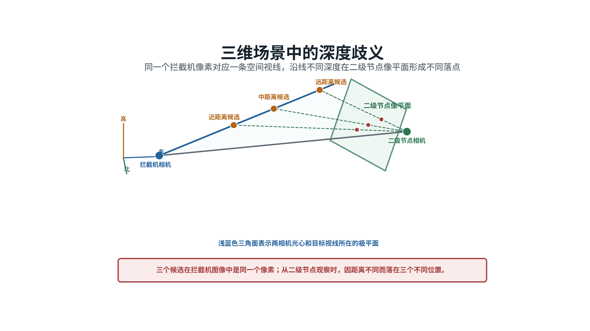

*图2  单个检测像素只能确定空间方向。目标距离不同，在另一台相机中的投影位置也不同。*

中心节点、二级节点和拦截无人机的位置与姿态可以把本机像素转换为空间视线，但不能直接把它转换成另一台相机中的唯一像素。获得距离范围、第二条视线或可信三维航迹后，才能形成有限预测区域。

### （二）极平面和极线

两台相机光心与源相机的一条目标视线共同确定一个极平面。极平面与目标相机像平面的交线称为极线。同一空间目标在目标相机中的检测必须落在这条极线附近。

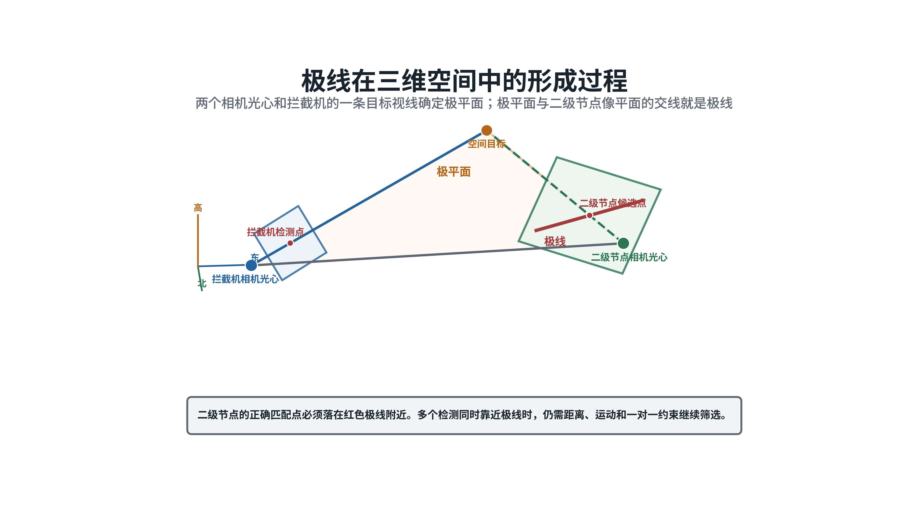

*图3  两个相机光心和目标视线形成极平面，极平面与另一台相机像平面的交线形成极线。图中以二级节点和拦截无人机为例，第一阶段采用相同计算方法。*

源相机到目标相机的相对旋转和平移为：

$$
R_{ba}=R_{cw,b}R_{wc,a},\qquad
\mathbf t_{ba}=R_{cw,b}(\mathbf C_a-\mathbf C_b)
$$

由相对位姿得到本质矩阵和基础矩阵：

$$
E_{ba}=[\mathbf t_{ba}]_\times R_{ba},\qquad
F_{ba}=K_b^{-T}E_{ba}K_a^{-1}
$$

源像素 $\tilde{\mathbf u}_a$ 在目标相机中的极线为：

$$
\mathbf l_b=F_{ba}\tilde{\mathbf u}_a
$$

若 $\mathbf l_b=[a,b,c]^T$，候选检测 $\tilde{\mathbf u}_b=[u_b,v_b,1]^T$ 到极线的像素距离为：

$$
d_{a\rightarrow b}=
\frac{|au_b+bv_b+c|}{\sqrt{a^2+b^2}}
$$

工程实现采用双向归一化残差。极线门控可以排除几何上不可能的候选，不能单独证明两个检测属于同一目标。

### （三）位姿不确定性

基础矩阵由两台相机的相对位置和姿态计算得到。固定中心节点仍存在安装角、云台零位和授时误差；二级节点和拦截无人机还要叠加动态导航、机体姿态和振动误差。程序不能把导航报告值当作真实位姿。

总角度误差可以近似表示为：

$$
\sigma_{\theta}^{2}\approx
\sigma_{att}^{2}+\sigma_{gimbal}^{2}+\sigma_{mount}^{2}+
\left(\frac{\sigma_{p,\perp}}{R}\right)^2+
\left(\frac{v_{\perp}\sigma_t}{R}\right)^2+
\sigma_{det}^{2}
$$

式中各项分别表示机体姿态、云台角度、安装角、横向位置、时间和检测中心误差。实际计算需要传播完整的位置姿态协方差及相关项。

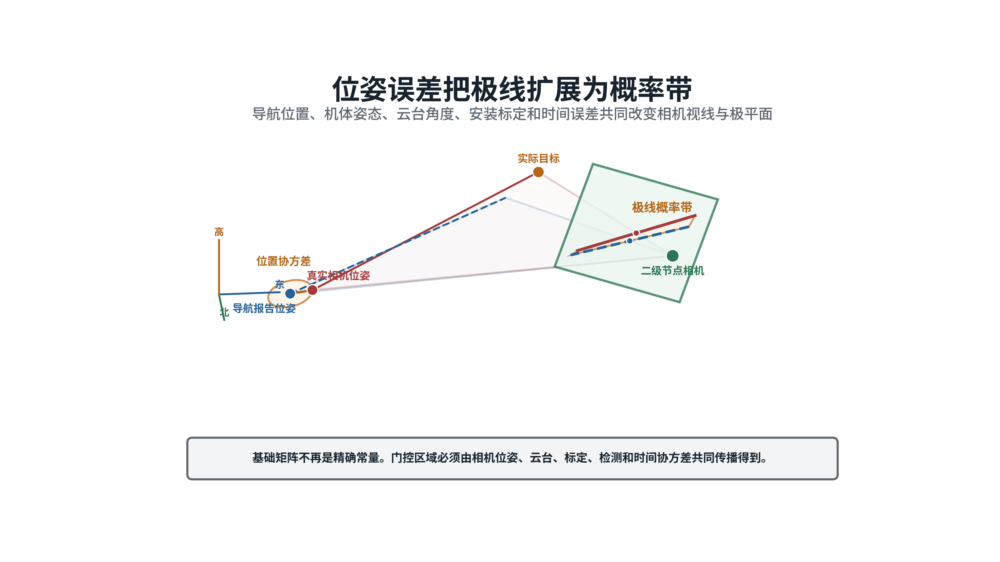

*图4  导航报告位姿与真实相机位姿存在偏差时，单条名义极线扩展成随观测质量变化的概率带。*

将误差传播到极线法向后得到残差方差 $\sigma_{epi}^{2}$，归一化门控量为：

$$
q_{epi}=\frac{r_{epi}^{2}}{\sigma_{epi}^{2}}
$$

已有距离范围可以把完整极线缩短成有限线段。距离、目标运动和相机位姿的协方差继续传播后，有限线段扩展成图像概率区域。

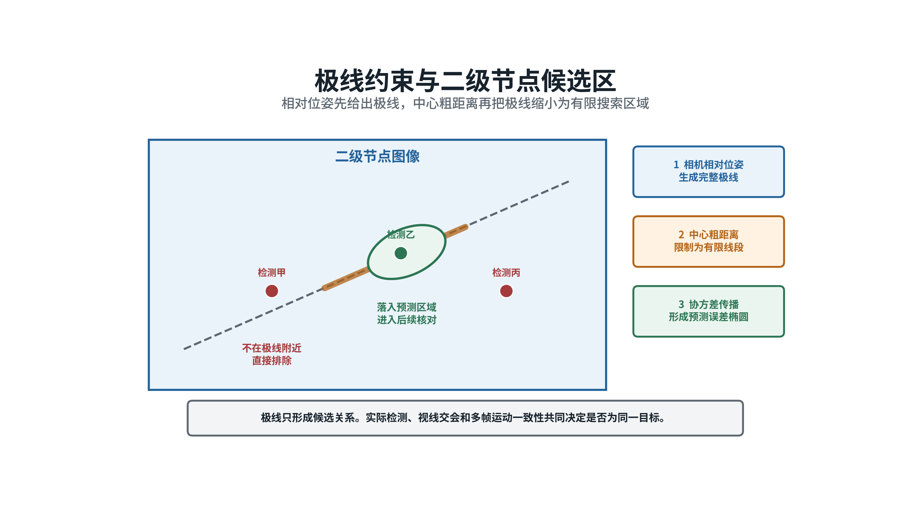

*图5  相对位姿形成完整极线，距离范围和误差传播将其缩小为有限候选区。候选落入区域只表示几何可能。*

系统根据概率带宽度、两视线夹角、候选数量和参数新鲜度，把几何状态分为有效、降级和不可用。有效状态允许进入连续确认；降级状态保留多个候选并申请复核；不可用状态只维持本机跟踪和搜索提示。

### （四）异步拍摄

几何计算使用拍摄时间，不使用消息到达时间。两台相机拍摄时间不同的情况下，目标已经发生运动，直接使用静态极线会产生系统偏差。

源相机量测先与距离范围结合成三维候选，再按运动模型预测到目标相机拍摄时刻，最后投影到目标图像。没有单一距离估计时，可以沿空间视线生成多组距离候选。预测结果形成包含深度、目标机动和时间误差的动态候选带。

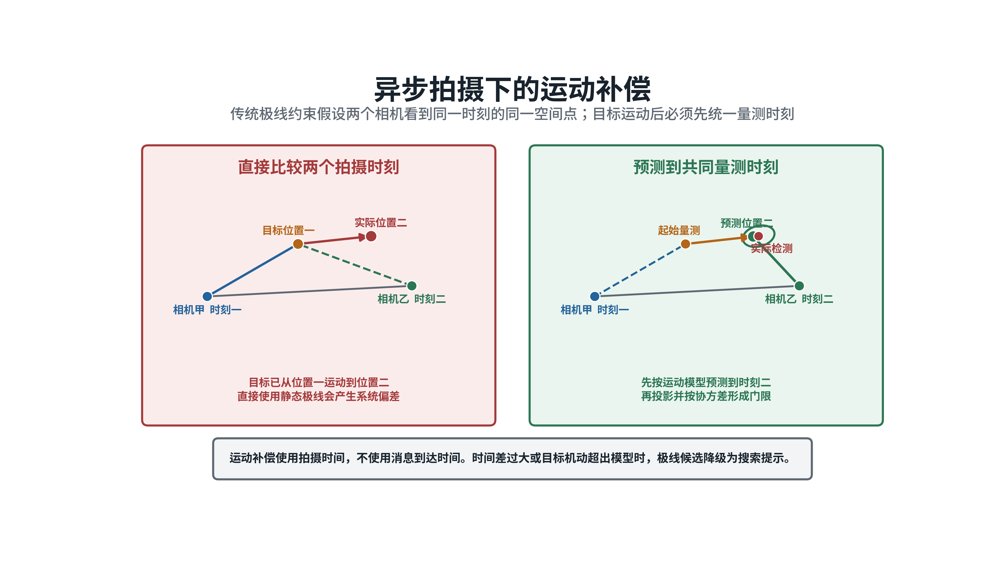

*图6  两次拍摄之间目标已经运动。系统先把量测预测到共同时间，再在目标相机图像中形成候选区域。*

通信延迟、云台扫描间隔和目标机动都会扩大预测范围。超过有效期后，历史轨迹只用于控制云台搜索方向，不再参与身份确认。

### （五）视线交会和重投影

通过极线门控的候选进入空间检查。系统计算两条视线的最近距离，估计三维交会位置，并检查两台相机解算深度是否为正、候选是否位于任务空域。

随后将三维候选重新投影到两幅图像，比较预测点和实际检测框中心。两条视线最近距离、正深度和双向重投影残差均通过门限后，候选才进入整体匹配。

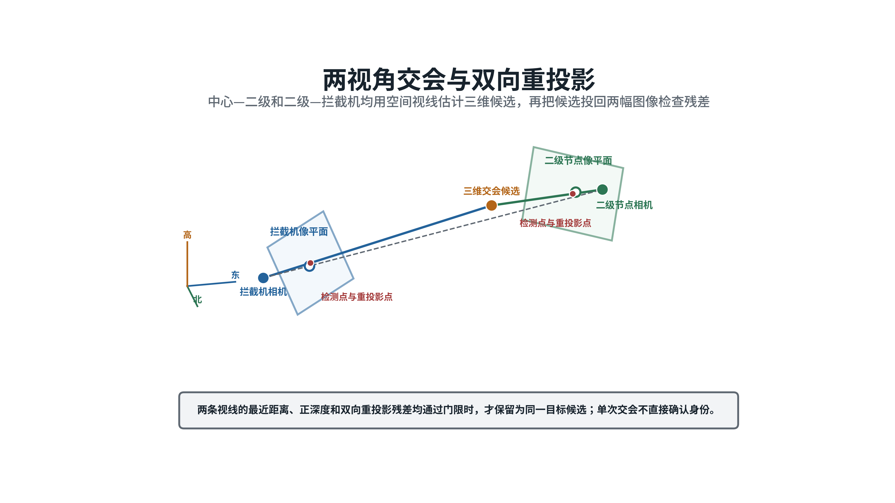

*图7  两条空间视线形成三维候选，再把候选投回两台相机检查残差。该方法同时用于中心节点至二级节点和二级节点至拦截无人机。*

两相机基线过小、视线近平行或目标距离过远时，三角定位误差会明显增大。此时降低交会证据权重，使用平台运动后的新视角、第三台相机或已有距离范围补充约束。

## 四、两级配准算法

### （一）本机短轨迹

每台相机先独立完成目标检测和多目标跟踪。本机短轨迹记录检测框中心和尺寸历史、方位及变化率、运动估计、拍摄时间、相机位姿、云台角度、协方差和观察质量。本机轨迹编号只在本相机内有效。

高帧率视频用于保持本机轨迹连续，跨节点配准不要求交换每一帧原始视频。各节点按统一时间轴交换短轨迹摘要和必要的目标图像片段。

### （二）中心节点至二级节点

中心节点为每条中心航迹生成时空预测范围。二级节点在本扇区形成局部短轨迹后，按以下顺序处理：

1. 校正镜头畸变，读取两端拍摄时间、标定版本和相机位姿；
2. 将中心航迹和二级短轨迹预测到共同量测时刻；
3. 使用极线概率带排除不满足相机几何的候选；
4. 检查空间视线交会、正深度和双向重投影残差；
5. 综合运动方向、方位变化率、检测框尺度变化和一对一排他关系；
6. 在连续云台重访中检查候选是否保持稳定。

中心节点位置稳定，有利于提供统一参考。二级节点盘旋形成变化的观察基线，可以改善部分目标的距离估计。两端没有共同目标时，只能在预测走廊内存在唯一候选的条件下完成轨迹交接。多个候选同时进入走廊时，第一阶段保持未确认。

### （三）扇区基准航迹

第一阶段候选连续稳定后生成扇区基准航迹。它是两级配准之间唯一的正式中间对象，至少包含：

- 中心节点管理的全局航迹编号；
- 二级节点本地轨迹编号；
- 目标三维位置、速度和协方差；
- 第一阶段配准质量和几何状态；
- 最近确认时间、有效期和版本；
- 相机标定版本和证据来源。

二级节点只能保存对全局航迹编号的只读映射，不能创建、改写或换绑中心编号。中心节点暂时失去目标后，二级节点可以继续维护已有基准航迹，但必须随外推时间增大协方差。航迹超过有效期后降级为扇区临时航迹，只用于搜索和空间占位。

### （四）二级节点至拦截无人机

拦截无人机进入扇区后，二级节点把有效基准航迹预测到拦截无人机的拍摄时刻，并投影到本机图像：

$$
\hat{\mathbf z}_{ij}=\pi(K_i,T_i(t),\hat{\mathbf X}_j(t))
$$

基准航迹协方差、拦截无人机位姿误差、云台误差、检测误差和外推误差共同形成图像预测协方差：

$$
S_{ij}=H_iP_jH_i^T+
R_{det}+J_{pose}\Sigma_{pose}J_{pose}^T+S_{delay}
$$

局部检测与基准航迹的马氏距离为：

$$
d_{ij}^{2}=
(\mathbf z_i-\hat{\mathbf z}_{ij})^T
S_{ij}^{-1}
(\mathbf z_i-\hat{\mathbf z}_{ij})
$$

$P_j$ 已包含第一阶段留下的不确定性。第二阶段不得把基准航迹当作精确位置。只有本机短轨迹连续通过图像门控、空间几何、运动和一对一排他检查，且第一阶段仍然有效时，端到端身份才能进入确认状态。

扇区基准航迹的预测误差体可能相互重叠。此时基准航迹只能用于云台指向，不能单独确认拦截无人机所见目标的身份。

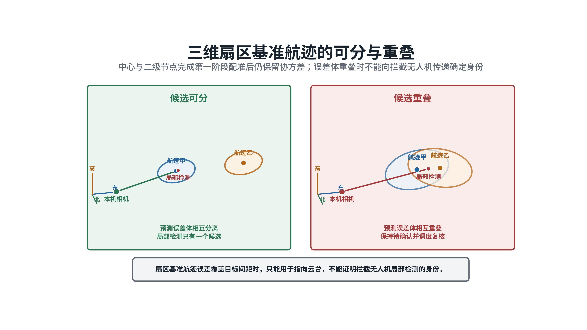

*图8  基准航迹误差体相互分离时，局部检测候选较明确；误差体重叠时，系统保持待确认并安排复核。*

### （五）整体匹配和状态确认

每一级均对同一时段的全部短轨迹进行整体匹配，避免多个局部目标占用同一上级航迹。匹配代价为：

$$
C_{ab}=w_e d_{epi}^{2}+w_g d_{ray}^{2}+w_r d_{rep}^{2}+
w_m d_{motion}^{2}+w_a d_{anchor}^{2}
$$

各项分别表示极线、视线交会、双向重投影、运动连续性和上级基准航迹残差，均使用对应协方差归一化。候选较少时采用匈牙利算法执行一对一匹配；候选接近时保留多个假设。

一次匹配只形成候选。状态按“本机跟踪、候选关联、几何一致、连续确认、已确认”推进，并保留“身份不明”和“重新搜索”状态。上级基准过期、标定版本变化、时间不同步或候选冲突会阻止状态继续前进。

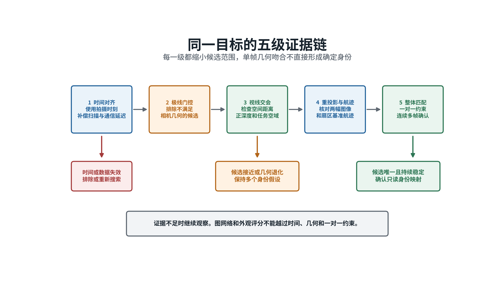

*图9  时间、极线、空间交会、重投影和整体匹配逐级缩小候选范围。证据不足时继续观察。*

两级总代价可以表示为：

$$
C_{\mathrm{chain}}=C_{C\rightarrow S}+C_{S\rightarrow I}+
w_x C_{\mathrm{conflict}}
$$

$C_{C\rightarrow S}$ 和 $C_{S\rightarrow I}$ 已分别包含本级运动连续性。$C_{\mathrm{conflict}}$ 用于惩罚同一全局航迹被互斥目标重复占用。端到端可信度不得高于两级中较弱的一环。

## 五、无共同视场

### （一）轨迹交接

前一相机在目标离开视场前输出最后拍摄时间、空间视线、方位变化率、检测框尺度变化、运动估计和协方差。系统根据目标速度和机动范围向前预测，形成随时间扩大的三维走廊，并将走廊投影到后一相机。

后一相机根据预测进入时间和方向调整云台，在走廊内形成入场短轨迹。预测走廊内只有一个候选，且运动变化连续时，才允许完成交接。

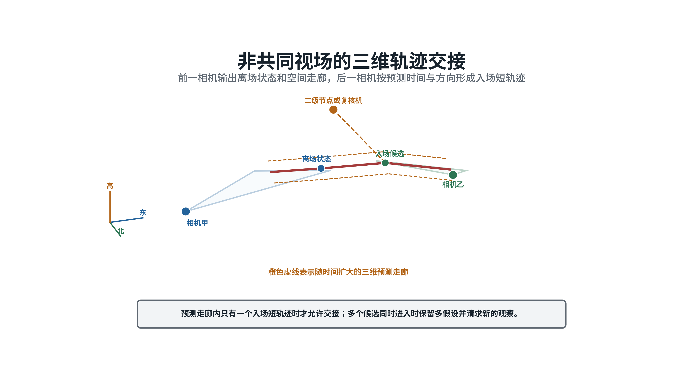

*图10  前一相机输出离场状态和三维预测走廊，后一相机按预测时间和方向形成入场候选。*

该方法可用于中心节点与二级节点的异步扫描，也可用于二级节点、拦截无人机和相邻拦截无人机之间的交接。多个目标同时进入预测走廊时，连续出现并不能证明身份连续。

### （二）主动补充观察

候选不唯一时，系统不继续扩大匹配门限。二级节点优先转向预测走廊凝视。二级节点暂时不可用时，发现目标的拦截无人机广播空间视线和预测区域，邻近无人机转动云台形成短时共同观察。

平台位置允许调整时，可以选择与现有视线夹角更大的观察位置。新的观察基线可以压缩沿视线方向增长的定位误差。已经进入末端稳定跟踪的无人机保持锁定，复核任务由二级节点、备用机或尚未承担末端任务的邻机完成。

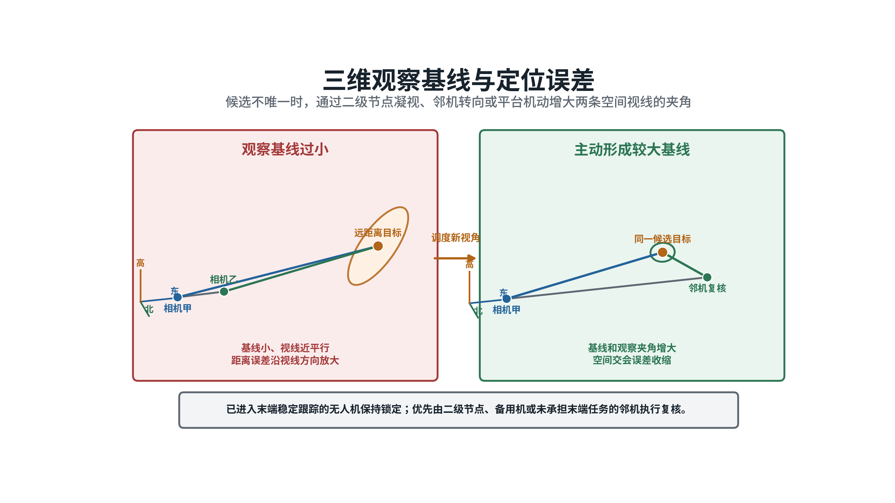

*图11  增大两条空间视线的夹角可以收缩三维交会误差，提高相邻目标的可分程度。*

### （三）不可判定条件

以下条件同时出现时，目标身份在当前观测条件下不可唯一确定：

- 不存在同步共同观察；
- 两个以上目标位于同一预测走廊；
- 上一级航迹误差范围相互重叠；
- 小目标外观不可分辨；
- 没有新的观察基线或第三视角。

系统保留多个候选短轨迹及其概率，继续搜索或等待目标自然分离。任务分配可以暂时面向空间扇区或未确认目标集合，不能把不确定身份写成确定编号。

## 六、误差控制和失效路径

### （一）标定和时间

中心节点、二级节点和拦截无人机均需完成相机内参、镜头畸变、相机安装角和云台零位标定。固定中心节点的安装关系也需要定期复核。二级节点高速转动云台时，还要区分指令角、编码器反馈角和实际光轴。

每条量测同时保留拍摄时间和消息到达时间。拍摄时间用于几何和运动补偿，消息到达时间用于统计通信延迟。标定参数保存版本和有效期，重投影残差持续出现同方向偏差时判定为标定漂移，不能通过扩大门限掩盖。

以水平视场22度、图像宽度640像素为例，等效焦距约1646像素。0.1度角度误差约对应2.9像素，0.5度约对应14.4像素。目标距离400米时，1米横向位置误差约对应4.1像素；目标距离50米时约对应33像素。这些数值用于说明误差量级，不作为设备指标。

### （二）级联错误

中心节点与二级节点一旦建立错误对应，错误身份可能沿基准航迹传递到拦截无人机。两级关系必须分别记录匹配质量、协方差和证据来源。第一阶段使用过的中心预测进入第二阶段时保留来源标记，不能再次作为独立证据重复累加。

中心节点和拦截无人机存在直接共同观察时，增加直接几何检查。中心节点、二级节点和拦截无人机三条关系一致时，直接关系用于校核。直接关系与两级关系冲突时，系统回到多候选状态，检查时间、标定和重复占用，不采用简单多数表决。

### （三）失效旁路

二级节点失效时，拦截无人机可以直接与中心航迹进行概率匹配。中心节点暂时看不到目标时，二级节点和拦截无人机维持带有效期的扇区临时身份。两级均不能提供可信身份时，拦截无人机之间只交换局部短轨迹和预测区域。

节点恢复后先比较拍摄时间、基准版本和几何证据。结果一致后再恢复中心全局编号映射。任何旁路都不能凭本地编号创建或改写中心管理的全局航迹编号。

## 七、学习算法边界

目标数量较少、候选关系明确时，概率几何门控和匈牙利算法可以完成配准。目标密集交叉后，候选短轨迹形成局部关系图。图神经网络可以综合多条候选边的时间、几何和运动信息，调整边的评分。

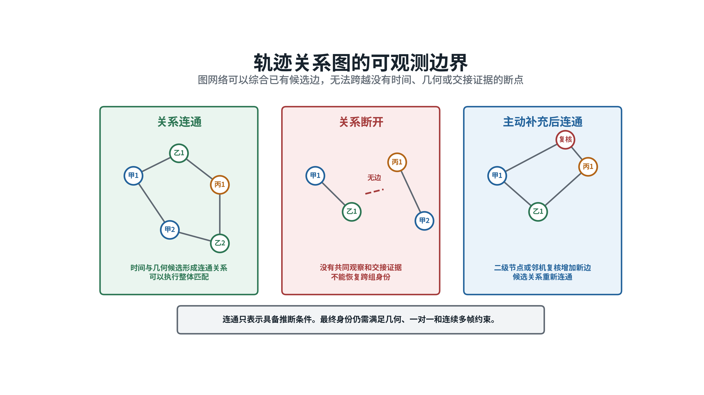

*图12  候选关系连通时可以执行整体匹配；关系断开时，需要二级节点或邻机补充新的观察。*

图神经网络的节点是局部短轨迹，候选边由概率几何门控生成。输入以极线残差、视线交会残差、时间差、运动残差、基准航迹一致性和协方差为主。中心节点至二级节点、二级节点至拦截无人机两类边保留层级和来源标记。

网络只参与候选排序。没有共同目标、没有唯一时空交接并且没有有效基准航迹时，候选图会断开。学习模型不能跨越断点生成身份，也不能越过时间、几何和一对一排他门限。小目标外观作为低权重可选输入。

## 八、信息交换

节点之间默认交换轨迹摘要，不连续广播全部原始视频。轨迹摘要至少包括：

- 拍摄时间和消息到达时间；
- 相机、平台和本机轨迹编号；
- 检测框历史和像素协方差；
- 平台位置、机体姿态和六维协方差；
- 云台角度、安装外参和标定版本；
- 空间视线、运动估计、观察质量和有效期；
- 上级基准航迹编号、版本和证据来源。

中心节点至二级节点的状态分为基准候选、基准确认、基准降级和基准过期。二级节点至拦截无人机的状态分为本机跟踪、候选关联、几何一致、已确认、身份不明和重新搜索。上级状态变化时，下级映射同步更新。

数据保存完整来源关系。仿真中的真实目标编号只进入离线评估，不进入在线配准消息。

## 九、实施步骤

### 第一阶段  标定与数据规范

统一北东地坐标、相机坐标、机体坐标和云台坐标之间的转换关系。完成相机、云台、固定中心安装关系和时间同步标定。建立带双时间戳、协方差、标定版本和来源信息的短轨迹数据规范。

### 第二阶段  概率几何基线

实现像素到空间视线、动态极线、概率带、视线交会和双向重投影。先在理想位姿条件下验证几何正确性，再逐项加入位置、姿态、云台和时间误差。建立有效、降级和不可用三级几何状态。

### 第三阶段  扇区基准航迹

完成中心节点至二级节点的局部轨迹配准。实现一对一匹配、连续确认、基准版本、有效期和过期降级。验证同步共同视场、异步扫描和多个候选重叠条件。

### 第四阶段  末端身份确认

完成扇区基准航迹向拦截无人机图像的概率投影。实现第二级匹配、上级状态联动、全局编号只读映射和重复占用检查。加入中心节点至拦截无人机的直接一致性校核。

### 第五阶段  交接与失效运行

实现离场预测走廊、入场时间窗、主动补充观察和节点失效旁路。验证中心失去目标、二级节点失效、通信分区和节点恢复条件下的状态转换。

### 第六阶段  学习算法对照

在确定性几何基线稳定后，使用离线样本训练候选边评分模型。图神经网络与概率几何加匈牙利算法使用相同输入数据进行比较。身份交换、错误合并和处理时延没有稳定改善时，学习模型保留为离线对照。

## 十、验证方案

验证场景覆盖以下情况：

1. 固定中心节点和二级节点同步看到同一目标；
2. 中心节点和二级节点异步扫描，通过运动预测连接短轨迹；
3. 二级节点和拦截无人机同步或异步看到同一目标；
4. 三类节点同时可见，检查直接关系和两级关系是否一致；
5. 中心节点暂时失去目标，基准航迹随时间降级并到期；
6. 二级节点失效，拦截无人机使用中心直达旁路；
7. 多个目标进入同一预测走廊，系统保持多候选；
8. 小目标外观关闭，只使用几何和运动证据；
9. 相机姿态误差、时间偏差、漏检和通信延迟逐步增加；
10. 通信分区和节点恢复期间保持全局编号一致。

误差敏感性试验采用分档扫描。以下数值属于建议仿真档位，不代表现有设备性能：位置误差取0、0.2、0.5、1、2、5米；机体姿态误差取0、0.05、0.1、0.3、0.5、1度；云台角度误差取0、0.05、0.1、0.3、0.5度；拍摄时间误差取0、5、20、50、100毫秒。另行改变安装角漂移、目标机动、目标间距、相机基线和共同观察时长。

结果分别统计中心节点至二级节点配准率、二级节点至拦截无人机配准率和端到端配准率。辅助指标包括正确候选保留率、错误候选通过率、概率带宽度、基准航迹过期次数、三方冲突次数、身份不明比例、错误强制配准数、身份交换数和确认时延。

在线算法不得读取仿真真实目标编号。真实编号只用于离线评分。验证报告分别给出理想位姿、标称误差、严重退化和导航失效条件下的结果。不可判定时不强制配准作为强制验收原则。

## 十一、方案结论

固定中心节点与扇区二级节点可以先完成目标配准，再由二级节点与拦截无人机配准。该结构能够缩小每一级面对的候选范围，并利用中心节点的稳定参考和二级节点的扇区观察形成连续身份链。

两级结构成立的前提是第一阶段具备共同目标、可信三维先验或唯一时空交接。中心节点和二级节点使用相同光电设备，无法消除视角、距离、时间和位姿差异。扇区基准航迹必须携带第一阶段的不确定性，第二阶段不得把它当作精确真值。

主线采用概率几何、一对一整体匹配、连续确认和主动补充观察。图神经网络处理已经形成的复杂候选关系。证据不足时保持身份不明，中心全局航迹编号始终由中心节点管理。

## 参考资料

1. R. Hartley、A. Zisserman，*Multiple View Geometry in Computer Vision*，Cambridge University Press，2004，https://doi.org/10.1017/CBO9780511811685
2. OpenCV，*Camera Calibration and 3D Reconstruction*，https://docs.opencv.org/4.x/d9/d0c/group__calib3d.html
3. Y. Bar-Shalom、T. E. Fortmann，*Tracking and Data Association*，Academic Press，1988，ISBN 9780120797608
4. S. S. Blackman、R. Popoli，*Design and Analysis of Modern Tracking Systems*，Artech House，1999，ISBN 9781580530064
5. H. W. Kuhn，*The Hungarian Method for the Assignment Problem*，1955，https://doi.org/10.1002/nav.3800020109
6. Y. T. Tesfaye等，*Multi-target Tracking in Multiple Non-overlapping Cameras Using Fast-Constrained Dominant Sets*，International Journal of Computer Vision，2019，https://doi.org/10.1007/s11263-019-01180-6
7. P. W. Battaglia等，*Relational Inductive Biases, Deep Learning, and Graph Networks*，2018，https://arxiv.org/abs/1806.01261
