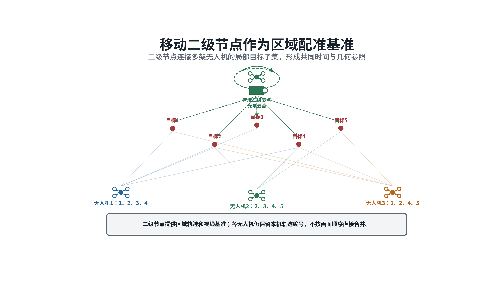
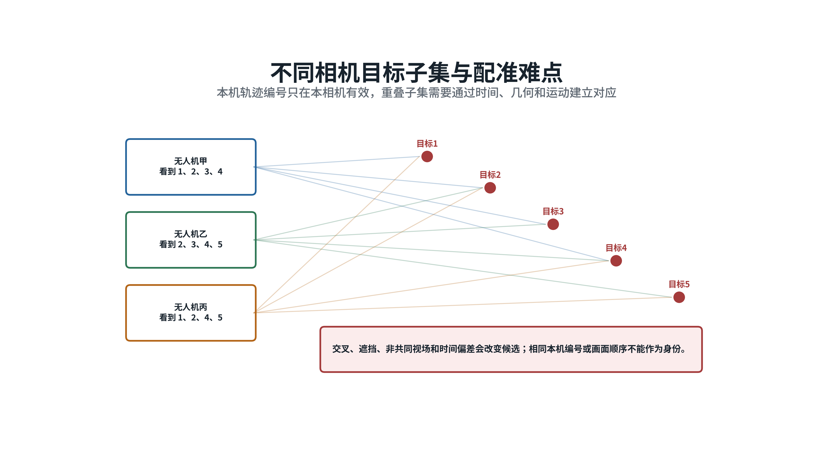
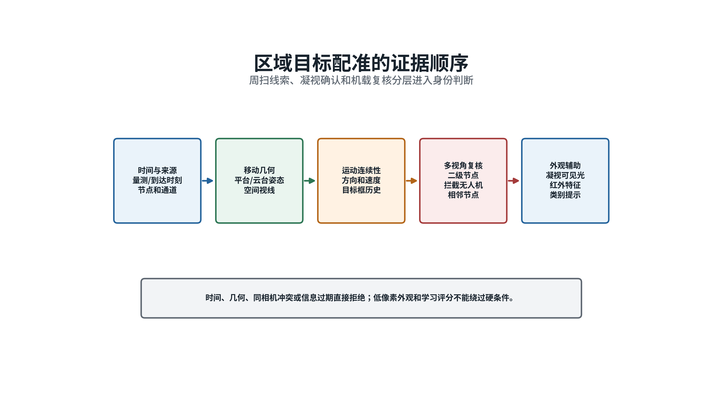
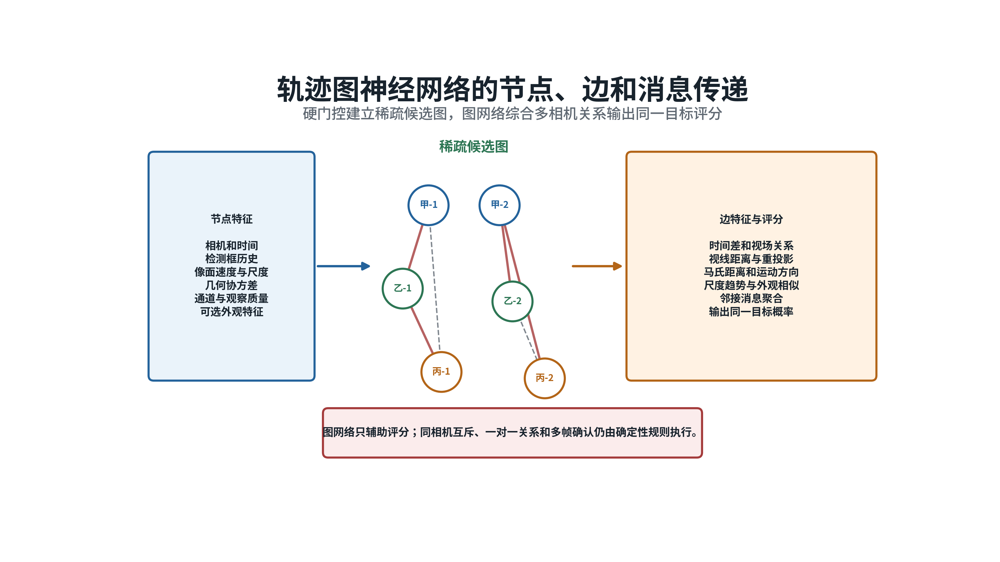
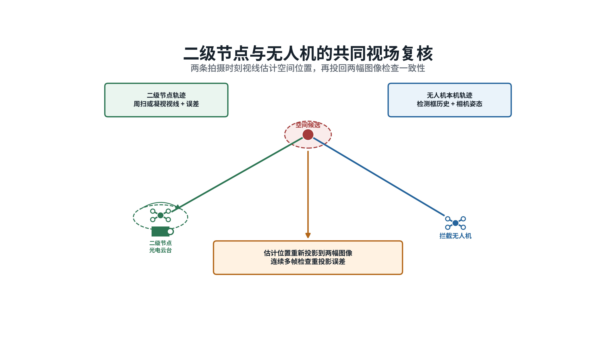
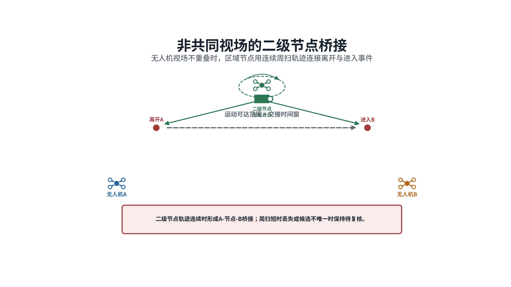
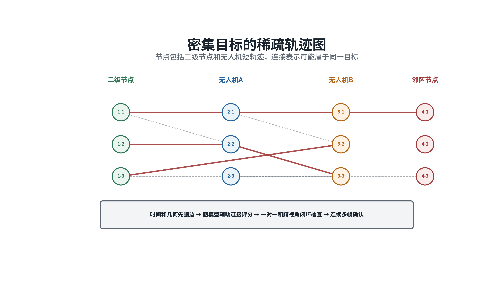
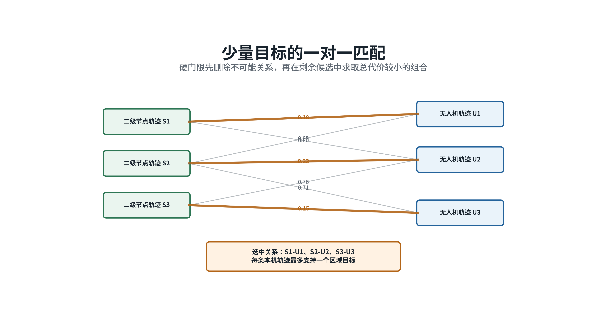
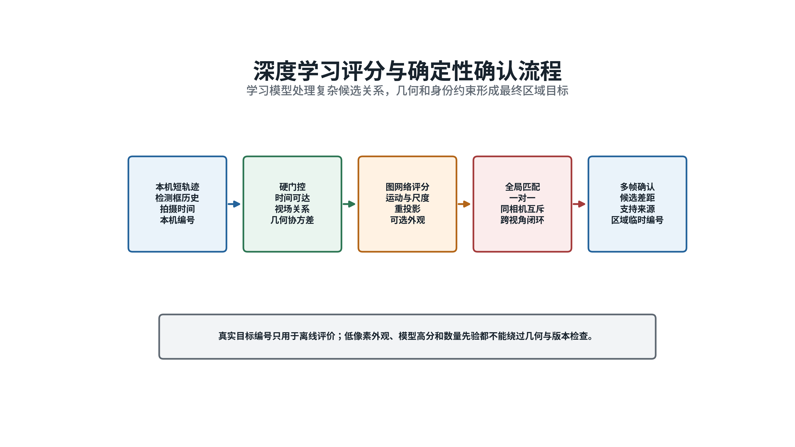
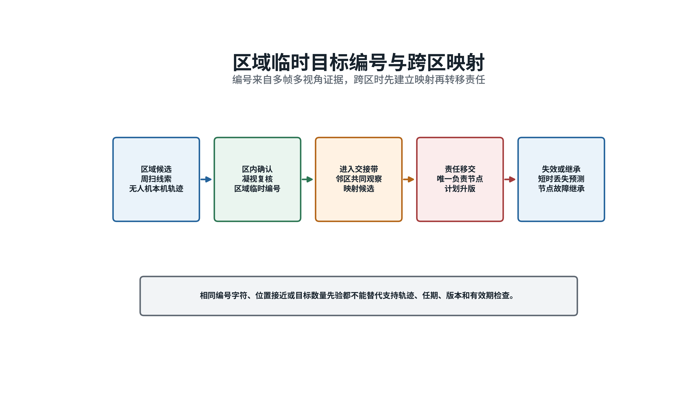

# 多无人机目标配准方案

**不同视场条件下的区域目标统一识别｜2026年8月**

## 一、背景

本报告对应拦截无人机进入搜索区、机载相机开始发现来袭目标的阶段。中心节点只能给出目标数量区间、来袭方向和粗略三维范围，无法为区内每个目标提供可信编号。多架无人机完成搜索后，首先要判断各相机中的检测以及由连续检测连接成的短轨迹是否对应同一个真实目标，随后才能组织本地目标分配。

典型场景中，无人机1看到目标1、2、3、4，无人机2看到目标2、3、4、5，无人机3看到目标1、2、4、5。三架无人机的视场有交叠，也各有盲区。每架无人机只能形成自己的本机轨迹编号，同一个数字在不同相机中没有直接对应关系。

区域二级节点在空中盘旋，使用周扫红外发现较大范围内的可疑目标，再用凝视红外和可见光复核重点方向。它观察时间长、位置较高，可作为多架拦截无人机之间的中间观察者。受窄视场、遮挡、凝视任务和平台姿态变化影响，二级节点也可能只看到部分目标，因此配准方案不能以“二级节点始终看全”为前提。

*图1  二级节点提供连续区域视角，多架无人机提供不同方向的局部目标子集。*

区域内各平台能够通信。常态交换本机短轨迹、检测框历史、拍摄时间、消息到达时间、相机参数、拍摄时刻的平台与云台姿态、目标视线、运动摘要、误差范围和观察质量。连续原始视频占用带宽较大，原则上不在全网广播。只有当两个候选难以区分、需要核对外形或热特征时，才定向发送目标裁剪图或短视频。

在线配准只使用传感器能够实际获得的信息，不能使用仿真环境中的真实目标编号、检测对象名称或人工标注身份。这些信息只能用于离线评价。配准结果形成区域临时目标表，并记录每个目标由哪些相机轨迹共同支持；区域临时编号不得改写中心节点维护的全局目标编号。

## 二、存在的难点

### （一）不同相机看到的目标集合并不相同

本机编号只表示某一相机当前维持的一条轨迹。无人机1的本机轨迹2与无人机2的本机轨迹2没有天然联系。目标进出视场、短时遮挡和漏检会使各相机看到的目标数量不断变化。若按编号、数量或画面左右顺序直接对应，目标交叉后很容易把两架来袭无人机合并成一个目标。

共同视场是指两个相机在同一时段能够看到同一片空域，此时可以利用同时观测和空间几何进行核对。非共同视场之间缺少同步画面，只能依据离开时间、进入时间、运动方向、外观以及二级节点的中间观察进行衔接。两类情况的证据强弱不同，不能套用同一个固定像素距离门限。

### （二）移动平台、时间偏差和标定误差会破坏几何关系

二级节点和拦截无人机都在运动，云台同时改变朝向。每条量测必须对应到实际拍摄时刻的平台位置、机体姿态和云台姿态。若使用消息到达时的最新姿态，平台运动和通信时延就会被错误计入目标运动。

焦距、主点、镜头畸变、安装角和云台零位的误差都会传递到目标视线。两个平台距离过近、两条视线接近平行或目标距离较远时，空间交会位置可能出现较大偏差。几何配准必须同时给出误差范围，并随距离、夹角和标定质量调整，不能把一次投影结果当作精确位置。

### （三）密集交叉目标的局部证据相互冲突

来袭无人机的外形和热特征可能相近，远距离目标所占像素较少，单帧图像通常不足以稳定区分身份。多个目标方向接近、速度相似或轨迹交叉时，单纯选择画面中最近的候选会频繁换绑。目标被遮挡后重新出现，还可能被误认为一个新目标。

多相机配准需要同时检查整组关系。若无人机1的一条轨迹与无人机2的一条轨迹被判为同一目标，无人机2的该轨迹又与无人机3对应，三者在时间、位置和运动趋势上必须相互吻合。逐对独立判断容易出现前后矛盾。错误合并会造成多个拦截资源重复指向同一目标，并使另一个目标失去分配，因此证据不足时应保留多个候选，等待后续观察。

*图2  三架无人机看到不同目标子集，重叠、遮挡和交叉使本机编号不能直接互认。*

## 三、提出的方案

### （一）传统方案

传统方案先在每个相机内部把连续检测连接成短轨迹，再比较不同相机的短轨迹。卡尔曼滤波根据已有运动趋势预测目标下一时刻的位置，并结合检测框中心、面积、宽高比和画面内速度维持本机轨迹。短时漏检时只在规定时间内保留预测，目标重新出现后再次检查位置、大小和运动方向。

共同视场内，系统依据相机参数、平台位置和云台姿态，把粗略空间提示或已有区域轨迹投影到各幅图像。随后检查两条视线能否在误差范围内交会，以及空间点重新投回两幅图像后是否贴近实际检测框。马氏距离把位置偏差与误差范围一起计算，可避免远距离或标定较差时使用过严门限。目标较少、候选分离明显时采用最近邻；多条轨迹相互竞争时采用匈牙利算法，在全部候选中求得一组一对一配对。

非共同视场内，系统根据轨迹离开一个相机和进入另一个相机的时间窗、目标可能到达的范围、飞行方向、检测框大小变化和外观特征形成候选。盘旋二级节点若在中间时段看到目标，可以用连续短轨迹把“无人机1的离场轨迹”和“无人机2的入场轨迹”连接起来，减少仅凭外观跨越长时间空档造成的误判。

传统方案计算过程清楚，适合目标较少、相互距离较大、标定稳定的场景。目标密集、轨迹反复断裂后，一条短轨迹往往同时对应多个候选。固定人工权重难以根据目标交叉、图像质量和相机组合及时变化，也难以同时保证三台以上相机之间的关系一致。

*图3  配准先检查时间和几何，再使用运动与外观，最后执行一对一和多帧确认。*

### （二）人工智能方案

人工智能方案把多相机短轨迹组织成一张稀疏关系图。图中的每个节点代表一条本机短轨迹，记录相机来源、起止时间、检测框历史、画面内速度、大小变化、成像通道、观察质量、几何误差范围和轻量外观特征。两个节点之间只有通过时间、视场和空间门限后才连一条候选边，这条边表示“可能属于同一目标”。

每条候选边综合时间差、两条空间视线的最近距离、重投影误差、马氏距离、运动方向差、检测框大小变化、外观相似度、相机覆盖关系和二级节点桥接证据。图神经网络是一种在节点和连线之间反复汇总关系的深度学习方法。它在判断一对轨迹时，还会查看这两条轨迹与第三台、第四台相机的关系，从而给出“属于同一真实目标”的评分。

*图4  图网络综合多相机轨迹和候选关系，避免只凭一条边作出身份判断。*

学习评分只用于排列候选，不直接生成区域身份。最终结果还要检查同一相机轨迹互斥、一对一关系、多相机关系闭合、连续多帧稳定和区域编号版本。两个候选分数接近、几何关系不稳或证据相互冲突时，系统保持待复核状态，继续调度二级节点或拦截无人机观察，不通过降低门限强行合并。

密集目标、频繁交叉和遮挡场景采用人工智能方案。少量分散目标继续使用几何与匈牙利算法，以减少计算和通信开销，并作为学习模型异常时的回退方法。当目标数量、图像质量或相机组合明显超出训练范围，模型文件校验异常，或者候选图缺少可靠几何边时，系统只发布确定性方法能够确认的结果。

### （三）方案关系

两类方案按同一条处理链工作。时间和几何门限先排除明显不可能的关系，深度学习再对剩余候选综合评分，最后由一对一、多帧和身份约束形成区域临时目标。未通过几何门限的轨迹对不进入图网络；图网络即使给出高分，也不能绕过同相机互斥、数据时效、编号版本和一对一约束。

外观特征始终作为辅助证据。远距离目标像素不足、红外纹理较弱或可见光受天气影响时，系统降低外观权重，主要依据时间、几何和运动连续性。大型视觉模型可在离线训练阶段提取特征并辅助整理困难样本；任务运行时只使用经过压缩的轻量模型，避免占用过多机载算力和通信带宽。

## 四、关键技术

**不同视场目标子集的多机时空图关联配准技术**

## 五、实施方案

### （一）统一量测、标定和时间

每条视觉量测至少包含检测框、类别、置信度、拍摄时间、消息到达时间、相机编号、成像通道、图像尺寸和观察质量。平台状态记录拍摄时刻的位置、速度、机体姿态、云台方位和俯仰。相机标定记录焦距、主点、镜头畸变、相机相对云台的安装关系和标定版本。拍摄时间用于恢复真实几何关系，到达时间用于判断通信时延和数据是否过期，两者都必须保留。

相机参数、平台状态或拍摄时刻缺失时，相关量测只能在本机继续跟踪，不能进入跨相机几何配准。状态超过有效期后，应请求二级节点或邻近无人机重新观察。方案不采用放宽像素门限的办法掩盖基础数据缺失。

### （二）建立相机投影和误差模型

世界坐标中的目标点投影到相机图像的基本关系为：

$$u = π{K(R_cw P_w + t_cw)}$$

其中，`P_w`表示世界坐标中的目标位置，`K`表示焦距、主点等相机内部参数，`R_cw`和`t_cw`表示拍摄时刻世界坐标到相机坐标的旋转和平移，`π`表示把三维点换算成二维像素坐标，`u`为最终像素位置。平台飞行和云台转动都会改变`R_cw`与`t_cw`，因此每帧图像都要使用对应时刻的外部参数。

协方差用于描述误差的大小和主要方向。目标、平台和检测误差通过投影关系传播到图像平面：

$$Σ_u = J_P Σ_P J_Pᵀ + J_T Σ_T J_Tᵀ + Σ_det$$

其中，`Σ_P`表示目标位置误差，`Σ_T`表示平台位置、云台姿态和标定误差，`Σ_det`表示检测框中心误差；`J_P`和`J_T`分别表示这些误差经过投影后对像素位置的影响。这样得到的`Σ_u`就是目标在图像上的预测误差范围。候选轨迹与预测位置的马氏距离为：

$$d² = (z − ẑ)ᵀ S⁻¹ (z − ẑ)$$

其中，`z`表示实际检测位置，`ẑ`表示预测位置，`S`表示两者合成后的误差范围。只有`d²`小于经试验标定的门限时，候选才进入后续匹配。门限按照相机夹角、目标距离、成像通道、目标像素大小和标定质量分层设置，不能用一个数覆盖全部条件。

*图5  几何计算使用拍摄时刻的平台和云台状态，不使用消息到达时的最新姿态。*

### （三）形成每个相机的本机短轨迹

每个相机先独立把连续检测连接成本机短轨迹。卡尔曼滤波预测检测框中心和画面内速度，匹配时综合中心马氏距离、框面积变化、宽高比变化、类别差异和可选外观差异。可采用ByteTrack等逐框关联方法，也可采用带相机运动补偿的BoT-SORT方法。两者都属于本机多目标跟踪，输出仍是相机内部编号，不能直接作为区域目标身份。

同一相机在同一时刻出现的两条有效轨迹必须互斥，不能被合并成同一目标。短时漏检只在限定时间内继续预测，预测误差随丢失时间增加。目标重新出现后，必须重新通过位置、大小和运动检查；长时间丢失后不自动恢复原有身份。远距离图像纹理不足时，本机跟踪也应降低外观特征权重。

### （四）处理共同视场和非共同视场

共同视场内，先把两个相机中的检测中心转换为空间视线。两条视线在误差范围内接近时估计目标三维位置，再把该位置重新投影到两幅图像。只有重投影误差连续多帧稳定、运动方向一致，并且最佳候选明显优于第二候选时，这对轨迹才进入确认候选。两条视线接近平行或两个平台距离过近时，三维位置不稳定，应降低该结果权重并请求第三个视角复核。

*图6  共同视场使用视线交会和双向重投影，第三视角用于处理近平行和候选接近。*

非共同视场之间先建立覆盖方向和时间可达关系。一条轨迹离开无人机1视场后，系统依据速度范围和运动方向，预测它可能进入无人机2视场的时间和位置。二级节点若在中间时段持续看到该目标，就用自身轨迹连接两端观察。没有二级节点桥接、候选又不唯一时，系统保留原有目标和多个候选，等待新的共同观察，不进行强制配准。

*图7  二级节点轨迹连接两个不重叠相机，降低长时间空档造成的错误匹配。*

### （五）构造稀疏轨迹图

每条短轨迹进入图网络前先执行硬门控，即用不可放宽的基础条件排除明显不可能的关系。两条不同相机轨迹只有同时满足时间可达、视场关系允许、类别不冲突和几何误差可接受，才建立候选边。其余组合直接删除。这样可把大量两两比较缩减为少量可信候选，降低目标数量增加后的计算量，也减少学习模型面对的错误关系。

节点`i`的初始信息记为`h_i^0`，节点`i`与节点`j`之间的候选关系记为`e_ij`。图神经网络在每一层先计算相邻节点传来的关系信息，再汇总更新当前节点：

$$m_ij^(l) = φ_e[h_i^(l), h_j^(l), e_ij],    h_i^(l+1) = φ_v[h_i^(l), Σ_(j∈N(i)) m_ij^(l)]$$

其中，`m_ij^(l)`表示第`l`轮中节点`j`传给节点`i`的关系信息，`φ_e`表示候选关系计算，`φ_v`表示节点信息更新，`N(i)`表示与节点`i`相连的候选集合。经过`L`轮关系汇总后，网络输出候选边评分：

$$s_ij = σ{φ_s[h_i^(L), h_j^(L), e_ij]}$$

其中，`φ_s`表示评分计算，`σ`把输出限制在0至1。`s_ij`表示两条短轨迹属于同一目标的学习评分，数值越大说明支持证据越强。训练样本同时包含正确对应关系和容易混淆的错误关系。后者重点覆盖目标交叉、速度相近、检测框大小相近、短时遮挡以及两个候选难以拉开差距的情况。训练目标是拉高正确关系评分，并压低这些困难错误关系的评分。

*图8  硬门控先删去不可能关系，图网络只在稀疏候选图上融合多视角证据。*

### （六）执行整体匹配和多帧确认

少量目标情况下，若每条轨迹只有一个明显候选，可直接采用最近邻。多条轨迹相互竞争时，系统构造总代价矩阵，并用匈牙利算法求解一组整体一对一匹配。该算法会比较全部候选组合，避免多条本机轨迹同时占用同一个区域目标。总代价由几何、重投影、运动、检测框变化、外观和图网络评分组成：

$$C_ij = w_g d_ij² + w_r r_ij + w_v Δv_ij + w_b Δb_ij − w_s log(s_ij + ε)$$

其中，`C_ij`为轨迹`i`与轨迹`j`的匹配代价，数值越小越适合配对；`d_ij²`为马氏距离，`r_ij`为重投影误差，`Δv_ij`为运动方向和速度差，`Δb_ij`为检测框大小变化差，`s_ij`为图网络评分；`w_g`至`w_s`为各类证据权重，`ε`为防止对数计算失效的小正数。图网络不可用时令`w_s`为零，系统即可退回几何和运动匹配。

*图9  目标较少时使用几何门限和一对一匹配，避免两条轨迹同时支持同一目标。*

一次匹配只形成候选，不能立即确认身份。系统要求结果在连续多帧或多次重访中保持稳定，并检查同相机互斥、一条短轨迹只支持一个区域目标、多相机关系闭合、最佳与次佳候选差距以及支持相机数量。任何硬冲突都会使候选保持待复核，并触发补充观察。

*图10  图网络提供候选评分，几何、一对一和多帧规则形成最终配准结果。*

### （七）维护区域临时目标和跨区映射

区域临时目标依次经历候选、待复核、已确认、暂时丢失和失效五种状态。稳定的二级节点周扫轨迹或拦截无人机本机轨迹可以产生候选。经过凝视复核、多视角几何确认或可靠的二级节点桥接后，候选进入已确认状态；候选接近或证据冲突时保持待复核。

已确认目标获得区域临时编号。目标表记录所属区域、编号发布者、发布轮次、版本、支持轨迹、最近拍摄时间、消息到达时间、误差范围、身份质量和有效期。编号只在当前区域和有效期内使用。若中心已有全局编号，只建立映射关系，不修改全局编号。

目标进入区域边界的共同观察带后，相邻二级节点交换拍摄时间、空间视线、轨迹摘要和编号映射。双方先保持一段重叠观察，确认是同一目标后再转移责任。移交完成后，原区域编号进入已移交状态，不再用于发布新的本区任务。

*图11  区域编号由多帧多视角证据形成，跨区时先映射再转移责任。*

### （八）组织训练、部署和失效回退

训练数据包括多相机视频、平台与云台状态、相机标定、检测框、本机短轨迹、候选边和离线人工核对的对应关系。前期可使用三维运动模型和相机投影生成目标交叉、遮挡、视场不完整等可控样本，再逐步加入真实多相机视频。训练、验证和测试数据应按场景、目标批次和相机组合分开，防止模型记住固定航线或固定相机位置。

大型视觉模型可在离线阶段提取外观特征，并帮助筛选容易混淆的样本。自动生成的标签必须通过时间、几何和人工抽查。任务运行时部署经过压缩的轻量外观模型和图网络，模型版本与相机参数、输入格式和训练数据版本一并管理，执行过程中不在线修改模型权重。

二级节点失效时，区域内无人机继承最后一版仍在有效期内的目标表和支持轨迹，并选出临时协调节点继续组织配准。协调节点变化不能触发全部目标重新编号。通信分区内只能形成注明作用范围和有效期的临时目标；通信恢复后先比较证据、时间和版本，再合并可能重复的编号。图网络或外观模型失效时，配准链路退回几何门控、运动连续性和一对一匹配，证据不足的目标保持待复核。

### （九）验证方法

验证场景应覆盖三架无人机看到不同目标子集、二级节点看到全部或部分目标、共同与非共同视场、目标交叉、密集编队、遮挡、周扫短时丢失、凝视切换、盘旋平台姿态变化、时间偏差、标定误差、目标跨区和节点失效。每类场景需要改变目标数量、目标间距、观察距离、视场角和通信时延，避免只在单一布置下得出结论。

对比方法包括最近邻、几何加匈牙利、几何加外观以及稀疏轨迹图神经网络。主要指标包括本机轨迹连续性、正确配准率、错误合并数、错误拆分数、身份交换数、待复核比例、二级节点桥接时间、跨区映射时间、候选边保留率、图规模、推理时延和通信量。评价时应分别统计共同视场、非共同视场和二级节点失效三类条件。

安全验收要求仿真真实编号不得上线，轨迹误合并、单轨迹多身份、模型越过硬门限、过期编号进入分配和失效后整体重编号的建议值均为零。

## 参考资料

1. Y. Zhang等，*ByteTrack: Multi-Object Tracking by Associating Every Detection Box*，2022，论文：https://arxiv.org/abs/2110.06864 ；开源实现：https://github.com/FoundationVision/ByteTrack
2. N. Aharon、R. Orfaig、B.-Z. Bobrovsky，*BoT-SORT: Robust Associations Multi-Pedestrian Tracking*，2022，论文：https://arxiv.org/abs/2206.14651 ；开源实现：https://github.com/NirAharon/BoT-SORT
3. OpenCV，*Camera Calibration and 3D Reconstruction*，https://docs.opencv.org/4.x/d9/d0c/group__calib3d.html
4. R. Hartley、A. Zisserman，*Multiple View Geometry in Computer Vision*，Cambridge University Press，2004，https://doi.org/10.1017/CBO9780511811685
5. Y. T. Tesfaye、E. Zemene、A. Prati、M. Pelillo、M. Shah，*Multi-target Tracking in Multiple Non-overlapping Cameras Using Fast-Constrained Dominant Sets*，2019，https://doi.org/10.1007/s11263-019-01180-6
6. T. T. Nguyen、H. H. Nguyen、M. Sartipi，*Multi-Vehicle Multi-Camera Tracking With Graph-Based Tracklet Features*，2024，https://doi.org/10.1109/TMM.2023.3274369
7. P. W. Battaglia等，*Relational Inductive Biases, Deep Learning, and Graph Networks*，2018，https://arxiv.org/abs/1806.01261
8. H. W. Kuhn，*The Hungarian Method for the Assignment Problem*，1955，https://doi.org/10.1002/nav.3800020109
9. G. R. Gerhart，*Target Acquisition Methodology for Visual and Infrared Imaging Sensors*，1996，https://doi.org/10.1117/1.600953
10. J. G. Hixson、E. L. Jacobs、R. H. Vollmerhausen，*Target Detection Cycle Criteria When Using the Targeting Task Performance Metric*，2004，https://doi.org/10.1117/12.577830
