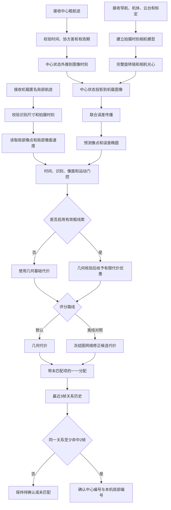

# 中心航迹与拦截无人机目标配准算法实施逻辑

## 一、范围与结论

### 1.1 文档用途

本文说明协同搜索已经找到目标以后，中心粗三维航迹与拦截无人机机载匿名局部航迹建立对应关系的实施逻辑。内容从数据接收开始，依次说明中心状态外推、拍摄时刻相机模型、误差传播、像面候选生成、一一匹配和多帧确认。本文不讨论中心航迹如何形成，也不把搜索成功率、配准成功率和拦截成功率合并为一个指标。

文中使用三类状态标记：

- **已实现**：当前独立试验代码已经具备，并有数据对象、测试或运行入口。
- **离线验证**：使用封存模型、误差注入和离线真实标签完成，只能说明算法在规定条件下的表现。
- **建议实施**：实装链路需要，但当前试验没有形成完整在线证据。

### 1.2 任务边界

本环节的前提是拦截无人机已经在目标附近完成搜索，并在本机画面中形成匿名局部航迹。中心节点提供粗三维航迹，包含中心航迹编号、位置、速度、协方差、测量时间、到达时间和有效期。拦截无人机提供局部航迹、图像拍摄时刻的位置、机体姿态、云台姿态和相机标定参数。

算法只回答一个问题：

> 中心的哪一条粗航迹，与当前机载画面中的哪一条匿名局部航迹属于同一目标。

本环节不执行以下工作：

1. 不重新进行区域搜索，也不把搜索分配结果直接当作目标身份。
2. 不使用真实目标编号、AirSim Actor名称或离线标签参与在线候选生成和匹配。
3. 不讨论中心双光电、雷达或其他传感器如何生成粗三维航迹。
4. 不执行目标分配、末制导和飞行控制。
5. 不允许机载端改写中心航迹编号。确认结果只保存“中心编号与本机局部编号”的引用关系。

### 1.3 当前结论

当前可采用的默认路线为：

```text
中心状态按拍摄时刻外推
        ↓
建立拍摄时刻相机模型
        ↓
中心状态投影到机载像面
        ↓
传播中心、导航、姿态、云台和像素误差
        ↓
识别、时间、像面和运动门控
        ↓
几何代价 + 未匹配项 + 匈牙利一一分配
        ↓
最近3帧中至少2帧关系一致
        ↓
发布中心航迹与机载局部航迹绑定
```

几何路线已经完成20、40和60目标误差矩阵验证，可以作为当前实施基线。已有冻结图网络只在较早的20和40目标合成分布上训练，没有覆盖本轮导航、机体姿态、云台和检测误差，在新误差条件下覆盖度明显下降。因此，图网络当前只能作为离线对照，不能进入默认在线路线。

### 1.4 成立前提

算法成立需要满足以下条件：

1. 中心航迹和拦截无人机统一使用北、东、地坐标系，或可以确定性转换到该坐标系。
2. 中心航迹包含三维位置、三维速度和六维协方差，且时间字段和有效期完整。
3. 拦截无人机已经看到目标，本机检测框最长边达到规定识别门限。
4. 图像、导航、机体姿态和云台姿态具有可比较的时间基准。
5. 相机内参、镜头畸变、相机相对云台的安装旋转和光心偏移已经标定。
6. 位姿必须对应图像拍摄时刻，不能使用消息到达时刻的位姿代替。
7. 每条机载局部航迹在本机生命周期内保持稳定编号。
8. 中心粗航迹的不确定度能够随状态一起传递，不能只传一个没有误差范围的位置点。

当前AirSim试验按理想针孔相机处理，没有单独执行真实镜头去畸变。真实设备接入时，去畸变应在检测框中心进入几何计算之前完成。

### 1.5 输入与输出

| 类别 | 主要内容 | 必要性 |
|---|---|---|
| 中心粗航迹 | 中心航迹编号、三维位置、三维速度、六维协方差、存在概率、测量时间、到达时间、有效期 | 必需 |
| 机载局部航迹 | 相机编号、本机局部编号、检测框、像素中心、拍摄时间、到达时间、识别尺寸、航迹质量 | 必需 |
| 无人机位姿 | 北东地位置、偏航、俯仰、滚转及其协方差 | 必需 |
| 云台位姿 | 偏航、俯仰、滚转及其协方差 | 必需 |
| 相机标定 | 分辨率、焦距、主点、畸变、安装旋转和安装偏移 | 必需 |
| 可选搜索线索 | 搜索阶段保留的中心候选编号 | 可选，只能作为经几何核验的软提示 |
| 候选输出 | 预测像点、像面协方差、残差、马氏距离、运动残差、代价和拒绝原因 | 已实现 |
| 配准输出 | 中心航迹编号、本机局部编号、确认状态、确认次数、分数和时间 | 已实现 |
| 未匹配输出 | 中心线索未匹配、机载航迹未注册及具体原因 | 已实现 |

## 二、总体流程



主流程遵循六条约束：

1. 先按图像拍摄时刻对齐状态和位姿，再计算空间关系。
2. 中心位置不是答案，只用于预测目标在机载画面中的可能区域。
3. 误差范围随中心状态、导航、姿态、云台和像素误差共同变化。
4. 图网络只能处理已经通过硬门控的候选。
5. 一一分配允许目标保持未匹配，不能为了填满矩阵强行绑定。
6. 单帧选择不能直接形成正式关系，必须经过多帧一致性检查。

## 三、数据对象、坐标与时间

### 3.1 主要数据对象

| 数据对象 | 主要字段 | 当前状态 |
|---|---|---|
| 中心粗航迹 | 中心编号、位置、速度、六维协方差、存在概率、测量时间、到达时间、有效期 | 已实现 |
| 机载局部航迹 | 相机编号、本机编号、检测框、像素中心、拍摄时间、到达时间、识别尺寸、质量 | 已实现 |
| 拍摄时刻相机 | 机体位置姿态、云台姿态、安装旋转、安装偏移、相机内参 | 已实现 |
| 投影中心线索 | 外推状态、预测像点、像面协方差、预测像面速度和深度 | 已实现 |
| 候选关系 | 两侧索引、像素残差、马氏距离、运动残差、基础代价、最终代价和门控状态 | 已实现 |
| 配准决策 | 中心编号、本机编号、状态、确认次数、分数、拒绝原因 | 已实现 |
| 误差真值 | 注入的导航、姿态、云台误差和离线目标标签 | 离线验证专用 |

在线记录中不得出现真实目标编号。误差真值和真实身份与在线候选分文件保存，只在配准完成后用于评分。

### 3.2 坐标系

本文使用以下坐标系：

- `N`：北、东、地坐标系，作为统一空间坐标；
- `B`：无人机机体坐标系；
- `G`：云台坐标系；
- `C`：相机坐标系。

记 $R_X^Y$ 为“把Y坐标系中的向量转换到X坐标系”。目标点从北东地坐标转入相机坐标的完整旋转链为：

$$
\boldsymbol p_C=
R_C^G R_G^B R_B^N
\left(\boldsymbol p_N-\boldsymbol o_C^N\right)
$$

当前AirSim相机采用`x`轴向前、`y`轴向右、`z`轴向下的定义。真实设备的相机轴向若不同，必须通过固定安装旋转转换，不能直接套用当前轴序。

### 3.3 相机光心

无人机导航位置通常位于机体参考点，不等于相机光心。相机光心应加入机体固定偏移、云台转轴偏移和云台到相机的光学偏移：

$$
\boldsymbol o_C^N=
\boldsymbol p_B^N+
R_N^B
\left(
\boldsymbol r_{fix}^B+
\boldsymbol r_G^B+
R_B^G\boldsymbol r_C^G
\right)
$$

其中：

- $\boldsymbol p_B^N$ 为无人机导航参考点；
- $\boldsymbol r_{fix}^B$ 为机体固定安装偏移；
- $\boldsymbol r_G^B$ 为云台转轴相对机体的偏移；
- $\boldsymbol r_C^G$ 为相机光心相对云台转轴的偏移。

当前误差试验使用0.5米机体前向相机偏移。该值是试验配置，不是设备安装指标。

### 3.4 时间字段

每条中心航迹和机载局部航迹至少保留两类时间：

- `measurement_timestamp`：状态测量或图像拍摄发生的物理时刻；
- `arrival_timestamp`：消息到达处理程序的时刻。

中心状态外推、位姿插值、像面投影和运动拟合均使用测量时刻。到达时刻只用于检查数据是否已经可用和通信延迟是否超限。

当前位姿插值要求图像拍摄时刻前后都有位姿样本，默认单侧最大间隔为0.2秒。位置采用线性插值，偏航、俯仰和滚转沿最短角度方向插值。缺少包围样本、时间倒退或样本间隔过大时，本帧失败关闭。

```text
函数 建立拍摄时刻相机(基础标定, 位姿样本, 图像时刻):
    按 measurement_timestamp 排序位姿样本

    如果存在图像时刻的精确样本:
        使用该样本
    否则:
        找到图像时刻之前和之后最近的位姿样本
        如果任一侧缺失:
            返回失败("位姿没有包围图像时刻")
        如果任一侧间隔超过允许值:
            返回失败("位姿插值间隔过大")

        位置 = 线性插值(前样本位置, 后样本位置)
        机体角 = 最短角度插值(前机体角, 后机体角)
        云台角 = 最短角度插值(前云台角, 后云台角)

    加入安装旋转和安装偏移
    返回拍摄时刻相机模型
```

## 四、中心状态外推

### 4.1 状态定义

中心粗航迹状态为：

$$
\boldsymbol x=
\begin{bmatrix}
\boldsymbol p\\
\boldsymbol v
\end{bmatrix}
=
\begin{bmatrix}
x_N&x_E&x_D&v_N&v_E&v_D
\end{bmatrix}^T
$$

中心状态的测量时刻通常早于机载图像拍摄时刻。算法以图像拍摄时刻为目标时刻，使用短时恒速模型外推位置、速度和协方差。

### 4.2 恒速外推

设时间差为 $\Delta t$，状态转移矩阵为：

$$
F(\Delta t)=
\begin{bmatrix}
I_3&\Delta t I_3\\
0&I_3
\end{bmatrix}
$$

状态和协方差更新为：

$$
\boldsymbol x_t=F\boldsymbol x_0
$$

$$
P_t=FP_0F^T+Q
$$

当前过程噪声按白噪声加速度模型构造。若加速度标准差为 $\sigma_a$，则每个方向上的过程噪声块为：

$$
Q_a=\sigma_a^2
\begin{bmatrix}
\Delta t^4/4&\Delta t^3/2\\
\Delta t^3/2&\Delta t^2
\end{bmatrix}
$$

当前冻结配置使用 $\sigma_a=0.5\text{米/秒}^2$。该数值用于短时机动裕度，不是来袭目标机动能力的实测值。

### 4.3 时间有效性

以下情况不允许外推：

1. 图像拍摄时刻早于中心航迹测量时刻；
2. 图像拍摄时刻超过中心航迹有效期；
3. 中心消息在本机观测可用时仍未到达；
4. 六维协方差维数错误、包含非有限值或无法形成有效像面协方差。

中心状态外推只用于得到图像时刻的粗位置分布，不直接形成目标绑定。

### 4.4 伪代码

```text
函数 外推中心航迹(中心航迹, 图像拍摄时刻, 加速度标准差):
    如果 图像时刻 < 中心航迹.测量时刻:
        返回失败("不允许反向外推")
    如果 图像时刻 > 中心航迹.有效期:
        返回失败("中心航迹已过期")
    如果 六维协方差无效:
        返回失败("中心协方差无效")

    时间差 = 图像时刻 - 中心航迹.测量时刻
    F = 构造恒速状态转移矩阵(时间差)
    Q = 构造白噪声加速度过程噪声(时间差, 加速度标准差)

    外推状态 = F × 中心状态
    外推协方差 = F × 原协方差 × F转置 + Q
    外推协方差 = 对称化(外推协方差)

    返回 外推状态, 外推协方差
```

## 五、中心状态投影到机载图像

### 5.1 相机内参

相机分辨率为 $W\times H$，水平视场角为 $\theta_h$ 时，当前针孔模型使用：

$$
f_x=\frac{W}{2\tan(\theta_h/2)}
$$

当前实现令 $f_y=f_x$，主点位于图像中心：

$$
c_x=\frac W2,\qquad c_y=\frac H2
$$

本轮试验采用1920×1080和19度水平视场，对应 $f_x=f_y\approx5736.73$ 像素，主点为 $(960,540)$。真实设备应使用标定得到的 $f_x$、$f_y$ 和主点，不应仅根据名义视场反算。

### 5.2 北东地点转相机坐标

中心外推位置为 $\boldsymbol p_N$，相机光心为 $\boldsymbol o_C^N$。目标在相机坐标系中的位置为：

$$
\begin{bmatrix}
x_C\\y_C\\z_C
\end{bmatrix}
=R_C^G R_G^B R_B^N
\left(\boldsymbol p_N-\boldsymbol o_C^N\right)
$$

其中 $x_C$ 为前向深度。若 $x_C\le0$，目标位于相机后方，该候选直接拒绝。

### 5.3 针孔投影

预测像点为：

$$
u=c_x+f_x\frac{y_C}{x_C}
$$

$$
v=c_y+f_y\frac{z_C}{x_C}
$$

像点对相机坐标的雅可比为：

$$
J_C=
\begin{bmatrix}
-f_x y_C/x_C^2&f_x/x_C&0\\
-f_y z_C/x_C^2&0&f_y/x_C
\end{bmatrix}
$$

转到北东地位置扰动后：

$$
J_N=J_C R_C^N
$$

该雅可比用于把中心位置和导航位置误差传播到像面。

### 5.4 预测像面速度

中心外推速度为 $\boldsymbol v_N$。当前实现把相邻观测之间的相机运动近似为零，只计算目标运动引起的像面速度：

$$
\dot{\boldsymbol z}=J_N\boldsymbol v_N
$$

该量与同一本机局部航迹前后两帧的像素速度比较，用于发现明显不符合中心预测运动方向的候选。部署到持续运动平台时，应进一步加入相机平移和转动引起的光流项。当前独立试验没有单独展开该项。

### 5.5 伪代码

```text
函数 中心航迹投影(外推状态, 外推协方差, 拍摄时刻相机):
    相机光心 = 机体位置 + 旋转后的安装偏移
    目标相对向量 = 外推位置 - 相机光心
    相机坐标点 = 完整旋转链 × 目标相对向量

    如果 相机坐标点.前向深度 <= 0:
        返回失败("目标位于相机后方")

    预测像点 = 针孔投影(相机坐标点, 相机内参)
    位置投影雅可比 = 计算投影雅可比(相机坐标点, 完整旋转链)
    预测像面速度 = 位置投影雅可比 × 外推速度

    返回 预测像点, 预测像面速度, 深度, 位置投影雅可比
```

## 六、联合误差传播

### 6.1 误差来源

预测像点的不确定度至少包含五部分：

1. 中心粗航迹的位置和速度误差；
2. 拦截无人机导航位置误差；
3. 无人机机体偏航、俯仰和滚转误差；
4. 云台偏航、俯仰和滚转误差；
5. 机载检测框中心误差和剩余投影误差。

若只传播中心航迹误差而忽略无人机自身位姿误差，得到的像面范围会明显偏小。定位误差主要使预测区域发生平移，姿态和云台误差会随着焦距放大为显著的像素偏差。

### 6.2 联合协方差

中心六维协方差先外推到图像拍摄时刻，再取其中的三维位置协方差，记为 $P_{target,pos}(t)$。定义联合误差协方差：

$$
\Sigma_{joint}=\operatorname{blockdiag}
\left(
P_{target,pos}(t),
\Sigma_{nav},
\Sigma_{body},
\Sigma_{gimbal},
\Sigma_{pixel}
\right)
$$

若联合投影函数为 $h(\cdot)$，其雅可比为 $J_h$，则预测像面协方差为：

$$
S_{pred}=J_h\Sigma_{joint}J_h^T+R_{projection}
$$

当前实现提供两条计算路线：

- **数值雅可比**：分别对目标位置、导航位置、机体姿态、云台角和像素偏移做中心差分，适合单元验证和较小候选集。
- **一阶解析近似**：位置项使用投影雅可比，姿态项使用小角度旋转近似，适合20至60目标的大矩阵计算。

本轮误差矩阵使用一阶解析近似。当前相机安装偏移小于1米、交接距离约700米，因此一阶路线在姿态项中忽略安装偏移旋转产生的高阶影响。该近似已与数值路线进行单元比较，但实际设备安装偏移较大时需要重新检查。

### 6.3 姿态误差传播

目标在相机坐标中的向量为 $\boldsymbol p_C$。小角度旋转误差可写为：

$$
\delta\boldsymbol p_C\approx
[\boldsymbol p_C]_{\times}\delta\boldsymbol\theta
$$

姿态项映射到像面的雅可比为：

$$
J_{att}=J_C[\boldsymbol p_C]_{\times}
$$

机体和云台姿态协方差先转换到相机轴向，再共同进入像面协方差：

$$
S_{att}=J_{att}
\left(
\Sigma_{body}^{C}+\Sigma_{gimbal}^{C}
\right)
J_{att}^T
$$

最终一阶近似为：

$$
S_{pred}=J_N\left(P_{target,pos}(t)+\Sigma_{nav}\right)J_N^T+S_{att}+\Sigma_{pixel}+R_{projection}
$$

### 6.4 误差包络与图像边界

中心预测像点均值可能落在图像边缘之外，但误差椭圆仍与图像相交。若此时只检查均值，会把实际可见目标过早删除。当前实现使用二维95%包络的轴对齐外接框进行保守检查。

二维95%卡方门限为 $5.991$，其平方根约为：

$$
k_{95}=2.4477
$$

设预测像点为 $\hat{\boldsymbol z}$，像面协方差为 $S_{pred}$，外接框半宽为：

$$
\boldsymbol h=k_{95}
\sqrt{\operatorname{diag}(S_{pred})}
$$

只要区间 $[\hat{\boldsymbol z}-\boldsymbol h,\hat{\boldsymbol z}+\boldsymbol h]$ 与图像矩形相交，就保留该中心线索进入后续像面门控。该检查只解决图像边缘问题，不能替代马氏距离检查。

### 6.5 试验误差口径

本轮误差试验把给定误差解释为95%包络，并换算为高斯标准差：

- 三维径向95%误差除以约2.7955，得到每轴相同的标准差；
- 单个姿态角95%误差除以约1.9600，得到该角度标准差；
- 200秒累计1度航向漂移与原航向误差按方差相加。

有卫星档使用5米三维径向95%定位误差；无卫星视觉导航档使用50米。正常姿态档使用横滚/俯仰1度、航向3度、云台0.1度；强降级档使用横滚/俯仰5度、航向10度、云台0.5度。上述数值均为试验输入，不是设备实测结论。

### 6.6 伪代码

```text
函数 传播到像面协方差(中心状态, 相机模型, 误差参数, 计算方式):
    中心位置协方差 = 外推六维协方差的左上3×3块
    导航协方差 = 当前导航状态对应的3×3矩阵
    机体姿态协方差 = 当前机体状态对应的3×3矩阵
    云台协方差 = 当前云台状态对应的3×3矩阵
    像素协方差 = 当前检测器或投影模型对应的2×2矩阵

    如果 计算方式 == 数值雅可比:
        对目标位置、导航位置、机体角、云台角和像素偏移逐项扰动
        雅可比 = 中心差分(联合投影函数)
        像面协方差 = 雅可比 × 联合协方差 × 雅可比转置
    否则如果 计算方式 == 一阶近似:
        位置项 = 位置投影雅可比 × (中心位置协方差 + 导航协方差)
                 × 位置投影雅可比转置
        姿态项 = 小角度姿态雅可比 × (机体协方差 + 云台协方差)
                 × 小角度姿态雅可比转置
        像面协方差 = 位置项 + 姿态项 + 像素协方差
    否则:
        返回失败("未知误差传播方式")

    像面协方差 += 投影剩余噪声
    像面协方差 = 对称化并限制最小特征值(像面协方差)
    返回 像面协方差
```

## 七、候选生成与硬门控

### 7.1 候选组合

设中心粗航迹数量为 $M$，本帧机载局部航迹数量为 $N$。当前实现先构造 $M\times N$ 个候选组合，再对每个组合执行相同的识别、时间、投影和运动检查。没有通过硬门控的组合保留拒绝原因，但不会进入一一分配。

### 7.2 识别门控

本机局部航迹必须满足：

```text
recognized == true
且 recognition_extent_px >= 10
```

当前识别尺寸取检测框最长边。10像素是本项目当前试验门限，不等于所有目标、所有红外设备和所有检测器的通用指标。

### 7.3 时间门控

中心线索在本地观测到达时必须已经可用：

$$
t_{arrival}^{local}\ge t_{arrival}^{source}
$$

图像拍摄时刻必须位于中心航迹的可外推区间：

$$
t_{measurement}^{local}\ge t_{measurement}^{source}
$$

$$
t_{measurement}^{local}\le t_{valid\_until}^{source}
$$

### 7.4 像面统计门控

预测像点为 $\hat{\boldsymbol z}$，机载局部航迹像点为 $\boldsymbol z$，局部测量协方差为 $R_{local}$。创新协方差为：

$$
S=S_{pred}+R_{local}
$$

像面残差为：

$$
\boldsymbol r=\boldsymbol z-\hat{\boldsymbol z}
$$

马氏距离为：

$$
d^2=\boldsymbol r^T S^{+}\boldsymbol r
$$

其中 $S^{+}$ 为广义逆。当前二维99%门限为：

$$
d^2\le9.2103
$$

使用马氏距离而不是固定像素半径，可以使定位、姿态和云台误差增大时，预测范围随协方差合理扩大。但协方差必须经过标定；人为夸大协方差会使错误候选大量通过。

### 7.5 运动连续性门控

同一相机、同一本机局部编号若存在上一帧观测，局部像面速度为：

$$
\boldsymbol v_{local}^{px}=
\frac{\boldsymbol z_k-\boldsymbol z_{k-1}}
{t_k-t_{k-1}}
$$

中心预测像面速度为 $\boldsymbol v_{source}^{px}$。运动残差为：

$$
r_v=\left\|
\boldsymbol v_{local}^{px}-\boldsymbol v_{source}^{px}
\right\|
$$

当前门限为80像素/秒。第一帧或本地航迹刚建立时没有历史速度，该项不拒绝候选，运动代价记为零。

### 7.6 基础代价

通过全部硬门控后，基础代价为：

$$
C_{base}=d^2+w_v
\left(\frac{r_v}{r_{v,max}}\right)^2+C_{switch}
$$

其中当前 $w_v=1$，$r_{v,max}=80$ 像素/秒。若某条中心航迹已经确认绑定到一个本机局部编号，而新候选试图切换到另一个局部编号，则增加切换惩罚，当前值为4。

### 7.7 门控顺序

```text
函数 评估候选(中心航迹, 机载局部航迹, 相机模型, 误差参数):
    拒绝原因 = 空

    如果 本机航迹未识别 或 最长边小于10像素:
        拒绝原因加入“识别尺寸不足”

    如果 中心线索到达晚于本机观测:
        拒绝原因加入“中心线索尚未到达”

    如果 图像时刻早于中心测量时刻 或 晚于中心有效期:
        拒绝原因加入“中心线索时间无效”

    尝试:
        外推中心状态到图像时刻
        建立拍摄时刻相机模型
        计算预测像点、像面协方差和预测像面速度
    失败:
        拒绝原因加入具体投影或协方差原因

    如果 预测均值和95%误差包络均不与图像相交:
        拒绝原因加入“预测区域位于图像外”

    马氏距离 = 像点残差相对创新协方差的统计距离
    如果 马氏距离 > 9.2103:
        拒绝原因加入“像面统计门控拒绝”

    如果 存在本机历史像面速度:
        运动残差 = 本机像面速度与中心预测像面速度之差
        如果 运动残差 > 80像素/秒:
            拒绝原因加入“运动连续性拒绝”

    候选可用 = 识别、时间、投影、马氏距离和运动检查全部通过
    如果候选可用:
        基础代价 = 马氏距离 + 归一化运动代价 + 切换惩罚
    否则:
        最终代价 = 禁止代价

    返回候选及全部拒绝原因
```

## 八、搜索粗线索的核验与使用

### 8.1 使用原则

协同搜索阶段可能保留“该本机局部航迹更可能来自哪条中心线索”的粗编号。该编号来自搜索过程，不是真实目标身份，也不能直接形成绑定。当前实现把它作为软提示，先进行完整几何核验，再给予有限代价优惠。

### 8.2 核验条件

一条粗线索必须同时满足：

1. 编号存在于当前中心航迹集合；
2. 当前帧中该编号只被一个本机局部航迹声明；
3. 对应中心与本机候选已经通过全部硬门控；
4. 对应马氏距离不超过9.2103。

通过核验后：

$$
C_{hint}=\max(0,C_{current}-2)
$$

未通过核验时不施加惩罚，也不删除其他候选，而是回到无编号的全局一一分配。这一设计避免错误搜索编号把后续配准锁死。

### 8.3 伪代码

```text
函数 应用搜索粗线索(全部候选, 中心航迹, 本机局部航迹):
    收集每条本机局部航迹声明的粗中心编号
    统计每个粗中心编号在当前帧被声明的次数

    对每条带粗编号的本机局部航迹:
        找到“粗中心编号与该本机航迹”的候选边

        如果 粗编号不存在:
            不使用提示，保持全局候选
        否则如果 同一粗编号被多个本机航迹声明:
            不使用提示，保持全局候选
        否则如果 对应候选不存在或未通过硬门控:
            不使用提示，保持全局候选
        否则如果 马氏距离超过核验门限:
            不使用提示，保持全局候选
        否则:
            标记提示通过核验
            对该候选的代价最多减2

    返回修改后的候选代价和提示核验统计
```

## 九、候选关系评分

### 9.1 默认几何路线

几何路线直接使用第七章形成的基础代价。它只依赖中心状态、拍摄时刻相机模型、协方差、像点残差和运动连续性，不使用离线真实身份。当前误差矩阵表明，这条路线对新传感器误差分布的适应性明显优于已有冻结图网络，因此保持默认。

### 9.2 可选图网络路线

图网络把中心航迹作为左侧节点，把机载局部航迹作为右侧节点，把通过硬门控的候选关系作为边。当前模型包含：

- 3维中心节点特征：存在概率、位置协方差迹、剩余有效时间；
- 4维本机节点特征：航迹质量、识别尺寸、横向像素位置、纵向像素位置；
- 7维候选边特征：马氏距离、像素残差、运动残差、外推时间、几何代价、运动特征是否可用、几何门控状态。

在线身份特征和真实标签特征均为空。图网络采用一层稀疏二分图消息汇总，隐藏维数为32。每条候选边先编码，再分别汇总到中心节点和本机节点，最后结合边、两端节点和邻域竞争关系输出同目标概率 $p$。

图网络修正后的代价为：

$$
C_{graph}=C_{base}-2\ln(p)
$$

概率限制在 $[10^{-6},1-10^{-6}]$ 内，避免数值溢出。图网络只提高或降低候选在一一分配中的优先级，不直接发布关系。

### 9.3 图网络的硬边界

图网络必须遵守以下边界：

1. 只有通过识别、时间、投影、马氏距离和运动门控的候选边才能进入网络。
2. 网络不能恢复被硬门控删除的关系。
3. 模型文件、摘要、特征版本或维数不一致时，图网络路线失败关闭。
4. 冻结权重不允许在测试数据上临时调节。
5. 网络输出仍需经过未匹配判断、匈牙利一一分配和多帧确认。

### 9.4 当前使用判断

现有冻结模型使用20和40目标的早期合成样本训练，训练时中心位置误差分布与本轮不同，也没有覆盖5米或50米导航误差、机体姿态误差、云台误差和轻干扰检测条件。该模型在本轮完整矩阵中的平均覆盖度仅为2.5%。因此：

- **当前默认**：几何代价；
- **当前图网络**：保留离线失败样本和诊断入口，不参与在线发布；
- **后续条件**：重新构造包含导航、姿态、云台、检测误差和60目标规模的训练集，再使用完全独立的种子验证。

### 9.5 伪代码

```text
函数 图网络修正候选(候选集合, 中心节点, 本机节点, 冻结模型):
    通过候选 = 只保留 eligible == true 的候选

    如果 模型文件或摘要缺失:
        返回失败("冻结模型不完整")
    如果 特征版本或模型维数不匹配:
        返回失败("模型合同不一致")

    构造中心节点特征
    构造本机节点特征
    构造通过候选的边特征和稀疏边索引

    边表示 = 编码候选边
    中心邻域消息 = 按中心节点汇总相邻边表示
    本机邻域消息 = 按本机节点汇总相邻边表示

    对每条通过候选:
        概率 = 网络(边表示, 中心节点, 本机节点, 两侧邻域消息)
        最终代价 = 基础代价 - 2 × ln(概率)

    返回修正后的候选代价
```

## 十、带未匹配项的一一分配

### 10.1 设置未匹配项的原因

即使协同搜索已经找到目标，中心和机载局部航迹也不一定在每一帧都能形成可靠关系。原因包括短时漏检、虚警、中心线索过期、目标位于视场边缘、姿态误差过大和本机航迹刚建立。分配矩阵必须允许中心航迹和机载局部航迹保持未匹配。

### 10.2 增广代价矩阵

设中心航迹数为 $M$，机载局部航迹数为 $N$。当前实现建立：

$$
C\in\mathbb R^{M\times(N+M)}
$$

前 $N$ 列为真实本机航迹，后 $M$ 列为每条中心航迹专属的未匹配列。当前代价为：

$$
C_{dummy}=12
$$

$$
C_{forbidden}=10^6
$$

只有通过硬门控且最终代价小于12的真实候选才会被接受。匈牙利算法保证一条中心航迹和一条机载局部航迹在本帧最多各使用一次。没有被任何中心航迹选中的本机局部航迹标记为“未注册候选”。

### 10.3 伪代码

```text
函数 一一分配(中心航迹数M, 本机航迹数N, 候选集合):
    矩阵 = M行 × (N+M)列，全部初始化为禁止代价

    对每条候选:
        如果候选通过全部硬门控:
            矩阵[中心索引, 本机索引] = 候选最终代价

    对每条中心航迹i:
        矩阵[i, N+i] = 未匹配代价

    分配结果 = 匈牙利算法(矩阵)

    对每个分配结果(行, 列):
        如果 列 < N 且 代价 < 未匹配代价:
            接受中心与本机关系
        否则:
            中心航迹保持未匹配

    本机未匹配 = 所有本机航迹 - 已被接受的本机航迹

    检查中心和本机均无重复使用
    返回已选关系、中心未匹配、本机未匹配
```

## 十一、多帧确认与关系状态

### 11.1 确认逻辑

单帧最低代价关系可能受目标交叉、短时漏检或偶然误差影响。当前实现为每个“中心编号与本机局部编号”关系保存最近3帧是否被一一分配选中的历史。

确认条件为：

```text
最近3帧中，同一关系至少被选中2帧
```

首次选中的关系状态为`selected_pending`。达到确认条件后状态为`confirmed`。未选中的中心线索状态为`source_unmatched`，没有被任何中心线索选中的本机局部航迹状态为`unregistered_candidate`。

### 11.2 切换处理

一条中心航迹确认后，若后续帧出现另一个本机局部航迹候选，当前实现先增加4的切换惩罚，再重新参与一一分配和多帧确认。该机制降低短时跳号概率，但不等于完整的关系生命周期管理。

当前确认映射没有实现明确的有效期、短时失联、重新核对和过期状态。持续在线部署时应增加：

```text
待确认 → 已确认 → 短时失联 → 重新核对 → 恢复或过期
```

相机标定切换、导航重定位、时钟跳变、云台回零和episode重置时，应清空投影缓存、局部速度历史和确认历史。

### 11.3 伪代码

```text
函数 更新关系确认(本帧已选关系, 历史窗口):
    关系全集 = 历史中出现过的关系 ∪ 本帧已选关系

    对每条关系:
        历史窗口追加(本帧是否选中该关系)
        只保留最近3帧
        命中次数 = 历史窗口中“本帧选中”记录的数量

        如果 本帧选中 且 命中次数 >= 2:
            状态 = 已确认
        否则如果 本帧选中:
            状态 = 待确认
        否则:
            当前帧不发布该关系

    返回待确认关系和已确认关系
```

## 十二、端到端伪代码

```text
过程 中心航迹与机载局部航迹配准(
    中心航迹流,
    机载局部航迹流,
    导航与姿态流,
    云台姿态流,
    相机标定,
    配准配置,
    可选粗线索,
    可选冻结图网络
):
    校验在线输入不含真实目标编号和Actor名称
    初始化局部像面速度历史
    初始化关系确认历史
    初始化批次内投影缓存

    对每个按 measurement_timestamp 排序的图像帧:
        校验本帧所有局部航迹使用同一拍摄时刻

        对每条本机局部航迹:
            从上一帧同相机、同局部编号计算像面速度
            读取检测框中心协方差
            读取拍摄时刻附近的导航、机体和云台位姿
            建立拍摄时刻相机模型

        候选集合 = 空

        对每条中心航迹source:
            对每条本机局部航迹local:
                候选 = 新建候选记录

                检查local识别尺寸是否达到10像素
                检查source在local到达时是否已经可用
                检查图像时刻是否位于source测量时刻和有效期之间

                如果时间条件允许:
                    尝试:
                        外推source状态和六维协方差到图像时刻
                        将外推中心位置投影到local所属相机
                        传播中心、导航、机体、云台和像素误差
                        得到预测像点、像面协方差和预测像面速度
                    失败:
                        记录具体拒绝原因

                检查预测均值或95%误差包络是否与图像相交
                计算本机像点与预测像点的残差
                计算创新协方差和马氏距离
                检查马氏距离是否不超过9.2103

                如果local具有上一帧像面速度:
                    计算与中心预测像面速度的运动残差
                    检查运动残差是否不超过80像素/秒

                如果全部硬门控通过:
                    基础代价 = 马氏距离 + 归一化运动代价
                    如果source已确认到其他local:
                        基础代价 += 切换惩罚
                    候选标记为可用
                否则:
                    候选最终代价 = 禁止代价

                保存候选及全部中间量和拒绝原因

        如果本帧带有搜索粗中心编号:
            对粗编号执行存在性、唯一性、硬门控和马氏距离核验
            对通过核验的对应候选给予有限代价优惠
            未通过核验的提示自动回退，不删除其他全局候选

        如果启用图网络对照:
            校验冻结模型、摘要和特征合同
            只使用可用候选构建稀疏二分图
            对候选代价进行图网络修正
        否则:
            最终代价 = 几何基础代价

        构建真实候选和中心专属未匹配列组成的增广矩阵
        本帧选择 = 匈牙利算法求全局最小总代价
        拒绝代价不优于未匹配项的真实关系

        更新最近3帧关系历史
        同一关系至少命中2帧后标记为已确认
        中心未匹配和本机未注册分别输出

        更新本机局部像面速度历史
        写出候选、决策、确认、未匹配和拒绝原因

    返回全部帧的配准记录和审计摘要
```

## 十三、关键门限及来源

| 参数 | 当前冻结值 | 作用 | 来源与边界 |
|---|---:|---|---|
| 识别尺寸 | 10像素 | 本机局部航迹进入配准的最低尺寸 | 当前项目试验口径，设备接入后待标定 |
| 马氏距离门限 | 9.2103 | 二维99%像面统计门控 | 二维卡方分布 |
| 图像边界包络系数 | 2.4477 | 二维95%误差椭圆外接框 | 二维卡方分布平方根 |
| 最大运动残差 | 80像素/秒 | 删除运动方向明显不一致的候选 | 当前独立试验冻结值 |
| 加速度标准差 | 0.5米/秒² | 中心状态短时外推过程噪声 | 当前独立试验冻结值 |
| 本机像点标准差 | 0.25像素 | 本轮误差矩阵的局部测量协方差 | 本轮试验配置；代码通用默认值为1.5像素 |
| 投影剩余噪声 | 0.25像素 | 防止像面协方差过小 | 本轮试验配置；代码通用默认值为1像素 |
| 未匹配代价 | 12 | 允许中心航迹保持未匹配 | 当前独立试验冻结值 |
| 禁止代价 | 1,000,000 | 阻止硬门控失败关系进入分配 | 当前实现固定量级 |
| 切换惩罚 | 4 | 抑制已确认中心航迹跳到其他本机编号 | 当前独立试验冻结值 |
| 粗线索优惠 | 2 | 几何核验后提高粗线索候选优先级 | 当前独立试验冻结值 |
| 确认窗口 | 最近3帧 | 保存关系选择历史 | 当前独立试验冻结值 |
| 确认次数 | 至少2帧 | 发布正式关系 | 当前独立试验冻结值 |
| 位姿单侧插值间隔 | 0.2秒 | 保证拍摄时刻位姿有足够近的包围样本 | 工具默认值，设备接入后待标定 |

表中门限用于复现当前试验。相机焦距、姿态更新频率、目标速度、交接距离或检测器变化后，应重新冻结门限和协方差，不能直接作为设备指标。

## 十四、异常处理与失败关闭

| 异常 | 当前处理 |
|---|---|
| 中心线索尚未到达 | 当前中心线索保持未匹配 |
| 图像时刻早于中心测量时刻 | 拒绝反向外推 |
| 中心线索超过有效期 | 拒绝建立新关系 |
| 相机模型缺失 | 对应本机航迹的候选全部拒绝 |
| 位姿没有包围图像时刻 | 当前帧失败关闭 |
| 目标位于相机后方 | 候选拒绝 |
| 预测均值和误差包络均在图像外 | 候选拒绝 |
| 协方差维数错误或包含非有限值 | 候选拒绝并记录异常 |
| 检测框不足10像素 | 本机局部航迹不参与本帧配准 |
| 马氏距离超限 | 候选拒绝 |
| 运动残差超限 | 候选拒绝 |
| 粗线索不存在、重复或不符合几何 | 忽略提示并回退全局分配 |
| 所有真实候选均劣于未匹配项 | 中心航迹保持未匹配 |
| 图网络文件或摘要无效 | 图网络路线失败关闭，不加载随机权重 |
| 图网络输出非有限值 | 图网络路线失败关闭 |
| 同一关系只有单帧支持 | 保持待确认，不发布正式绑定 |

失败关闭不等于清空历史关系。持续在线系统应在关系有效期内保留上一条已确认关系，同时把新证据不足的候选保持为待确认。当前有限时长独立试验尚未实现完整关系有效期状态机。

## 十五、计算量、缓存与并行

### 15.1 计算量

中心航迹数为 $M$，本机局部航迹数为 $N$ 时：

- 原始候选数为 $M\times N$；
- 每条候选的几何投影和门控为常数量级矩阵运算；
- 匈牙利一一分配约随 $\max(M,N)^3$ 增长；
- 图网络推理量主要随通过硬门控的稀疏边数 $E$ 增长。

20、40和60目标时，原始组合分别为400、1600和3600。当前规模仍可直接构造完整候选矩阵。扩大到200目标时原始组合达到4万，应增加按相机、视场、时间和中心预测区域构建的稀疏候选索引。

### 15.2 当前缓存

同一帧、同一中心航迹、同一相机的投影结果会被几何路线和图网络路线重复使用。当前实现按以下信息缓存：

```text
中心航迹编号
相机编号
图像拍摄时刻
过程噪声参数
投影噪声参数
误差传播方式
```

该缓存仅适用于当前批次内相机位姿和中心状态不变的情况。工程部署时，缓存键还应加入中心状态版本、相机标定版本和拍摄时刻位姿指纹；导航重定位、标定切换和云台回零后必须清空缓存。

### 15.3 建议并行方式

1. 不同中心航迹与不同相机的投影可以并行计算。
2. 同一相机模型和误差雅可比可在一帧内复用。
3. 候选硬门控可以按中心航迹分块并行。
4. 匈牙利一一分配保持单次全局求解，不能把同一冲突组拆成互不知情的局部贪心选择。
5. 图网络只读取硬门控后的稀疏图，不应重复构造全部投影。
6. 审计输出可限制失败候选样本数量，但准确度、覆盖度、未匹配和拒绝原因计数必须完整保留。

## 十六、当前实现与后续实施边界

### 16.1 已实现

- 中心六维状态恒速外推和过程噪声增长；
- 北东地、机体、云台、相机完整旋转链；
- 机体固定偏移、云台转轴偏移和相机光心偏移；
- 拍摄时刻位姿插值和到达时间新鲜度检查工具；
- 针孔正投影、像素反投影和投影雅可比；
- 中心、导航、机体姿态、云台角和像素误差联合传播；
- 数值雅可比和一阶解析近似两种像面协方差计算；
- 预测均值在图像外、但95%误差包络与图像相交时的保守保留；
- 识别、时间、马氏距离和运动连续性门控；
- 经几何核验的搜索粗线索软提示和自动回退；
- 几何代价、未匹配项、匈牙利一一分配和3帧2次确认；
- 冻结图网络加载、摘要校验和离线对照入口；
- 在线记录与离线真实标签分离。

### 16.2 离线验证

- 20、40和60目标，每个目标配置一架拦截无人机；
- 5米卫星定位和50米无卫星视觉导航两档定位误差；
- 正常姿态和强降级姿态两档；
- 理想检测与3%漏检、每台每秒2个虚警、0.25像素扰动两档；
- 无粗线索编号和带经几何核验粗线索编号两种交接方式；
- 几何路线和旧冻结图网络路线；
- 10个独立随机种子，960条逐批结果；
- 三个目标规模各一组真实AirSim `simGetDetections`接口代表试验。

离线真实身份只在算法输出以后评分。导航、姿态、云台和检测误差由回放构造器注入，不是设备实测误差流。

### 16.3 建议实施

- 接入真实图像去畸变和标定版本管理；
- 接入与图像曝光时刻对应的导航、机体和云台原始数据流；
- 使用实测误差统计形成协方差，不使用固定经验值长期代替；
- 在中心状态投影中加入相机自身平移和转动造成的像面速度；
- 增加已确认关系的有效期、短时失联、重新核对和过期状态；
- 导航重定位、标定切换、时钟跳变和任务重置时清空相关状态；
- 使用包含新误差条件和60目标规模的独立训练集重新训练图网络；
- 使用不参与训练和调参的多个AirSim种子复核图网络；
- 扩展到200目标时增加稀疏空间索引、局部冲突组和计算预算；
- 将本环节成功率与协同搜索、机间配准和末制导结果分别统计。

## 十七、验证结果与可复现边界

### 17.1 指标口径

本轮主要指标为：

$$
\text{关联准确度}=
\frac{\text{正确的已确认关系数}}
{\text{全部已确认关系数}}
$$

$$
\text{关联覆盖度}=
\frac{\text{正确的已确认关系数}}
{\text{全部正确中心线索数}}
$$

中心线索准确度和召回率均设为100%，协同搜索视为已经找到全部目标。因此，该覆盖度表示：

```text
P(中心与机载局部航迹配准成功 | 协同搜索已经找到目标)
```

它不是从远程发现到完成拦截的总成功率。

### 17.2 当前证据

完整离线矩阵包含：

```text
3种目标规模
× 2种交接信息方式
× 2种姿态档
× 2种导航档
× 2种检测档
× 10个随机种子
× 2种评分后端
= 960条结果
```

有卫星、正常姿态、轻干扰且无粗线索编号时，几何路线在20、40和60目标下的准确度分别为100.0%、95.0%和96.5%，覆盖度分别为97.0%、91.5%和92.5%。使用经几何核验的粗线索编号后，覆盖度分别为97.5%、95.2%和96.5%。

无卫星视觉导航、强降级姿态和轻干扰共同存在时，无粗线索编号的几何覆盖度下降为86.0%、71.0%和61.5%；使用经几何核验的粗线索编号后为93.5%、92.0%和85.5%。这些数值是规定误差分布下的离线仿真结果，不是设备实测能力。

旧冻结图网络在完整矩阵中的平均准确度为43.8%，平均覆盖度为2.5%。该结果保留全部低值批次，说明旧模型发生明显训练分布失配，不能作为当前在线方案。

### 17.3 证据文件

主要证据目录为：

```text
research_modules/independent_experiments/center_terminal_cv_campaign/
outputs/center_handover_sensor_error_20260820/
```

其中包含：

- `protocol.json`：试验问题、目标规模、误差档和相机条件；
- `per_run_metrics.csv`：960条逐种子结果；
- `aggregate_metrics.csv`：96条分类汇总；
- `metrics_contract.json`：准确度、覆盖度和分母定义；
- `source_snapshot/`：本轮算法源码快照；
- `inputs/`：冻结图网络及其摘要；
- `representative_runs/`：四组完整候选、决策和离线评分；
- `reproduction_manifest.json`：复现命令、输入哈希和预期结果哈希。

20、40和60目标的AirSim接口代表试验分别保存在：

```text
research_modules/independent_experiments/center_terminal_cv_campaign/
outputs/center_handover_sensor_error_airsim_20260820_n20_retry01/
outputs/center_handover_sensor_error_airsim_20260820_n40/
outputs/center_handover_sensor_error_airsim_20260820_n60/
```

三组目录中的`summary.json`是接口试验的主要结果文件。它们均为单随机种子，只用于证明AirSim `simGetDetections`检测框能够进入同一配准链路，不能替代多种子误差矩阵，也不能据此形成设备能力结论。

证据审计等级为B，可以确定性离线回放和重新评分；由于依赖与模拟器运行版本没有完整冻结，现有材料不能证明完整AirSim模拟器在不同机器上会产生完全相同的原始观测。

### 17.4 测试状态

2026年8月20日，中心交接专项测试共41项通过，覆盖状态外推、旋转链、安装偏移、位姿插值、误差传播、10像素边界、未匹配项、粗线索回退、冻结模型摘要、在线真实身份隔离和AirSim首个episode生命周期。单元测试通过只说明实现满足已写入的合同，不替代误差矩阵和真实设备试验。

## 十八、实施检查表

### 18.1 数据与时间

- [ ] 中心航迹和本机局部航迹均保存测量时间与到达时间。
- [ ] 中心航迹包含有效期和六维协方差。
- [ ] 图像、导航、机体和云台数据具有统一时间基准。
- [ ] 所有几何计算使用图像拍摄时刻。
- [ ] 位姿样本能够在拍摄时刻两侧形成有效包围。
- [ ] 时间倒退、中心线索未到达和中心线索过期会失败关闭。

### 18.2 标定与坐标

- [ ] 北东地、机体、云台和相机轴向定义明确。
- [ ] 完整旋转链经过正投影和反投影单元测试。
- [ ] 相机内参、畸变和主点具有标定版本号。
- [ ] 机体到云台、云台到相机光心的安装偏移已加入光心位置。
- [ ] 导航重定位、云台回零和标定切换会清空旧缓存。

### 18.3 误差与门控

- [ ] 中心、导航、机体姿态、云台和像素误差均进入像面协方差。
- [ ] 协方差来自设备统计或明确试验配置，不能为提高覆盖度随意放大。
- [ ] 预测均值在图像外时检查误差包络是否仍与图像相交。
- [ ] 识别、时间、马氏距离和运动连续性门控顺序固定。
- [ ] 所有拒绝关系保留可审计原因。

### 18.4 一一匹配与状态

- [ ] 增广代价矩阵包含每条中心航迹专属的未匹配项。
- [ ] 一条中心航迹和一条本机局部航迹在一帧内最多使用一次。
- [ ] 真实候选代价不优于未匹配代价时保持未匹配。
- [ ] 正式关系满足最近3帧至少2帧一致。
- [ ] 已确认关系具有有效期、短时失联、重新核对和过期处理。
- [ ] 中心航迹编号保持只读，本机只保存引用关系。

### 18.5 粗线索与图网络

- [ ] 搜索粗线索经过存在性、唯一性、硬门控和马氏距离核验。
- [ ] 粗线索无效时回退全局分配，不删除其他候选。
- [ ] 图网络只读取硬门控通过的稀疏候选边。
- [ ] 模型文件、摘要、特征合同和输入维数全部校验。
- [ ] 图网络训练、验证和测试种子相互隔离。
- [ ] 当前旧冻结图网络不会进入在线默认路线。

### 18.6 运行与证据

- [ ] 候选、门控、代价、分配、确认和未匹配均有机器可读记录。
- [ ] 在线记录不含真实目标编号、Actor名称或离线标签。
- [ ] 准确度和覆盖度分母写入指标合同。
- [ ] 低结果、超时和失败关闭批次不从正式统计中删除。
- [ ] 每轮试验冻结配置、随机种子、源码、模型、输入哈希和复现命令。
- [ ] 离线仿真结果、AirSim接口结果和设备实测结果分别表述。
