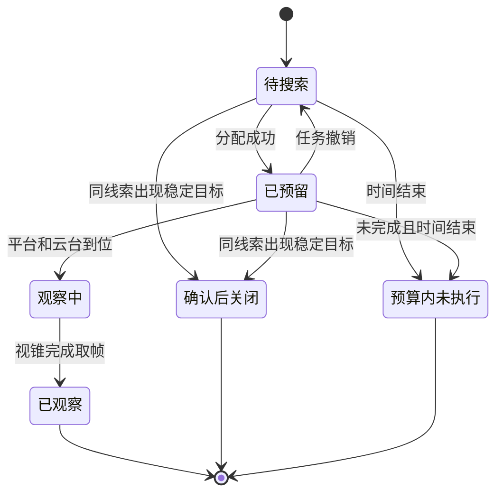
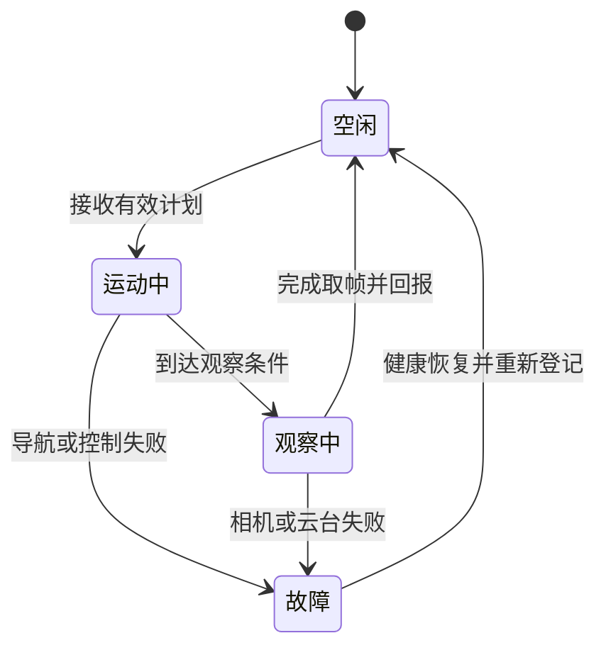
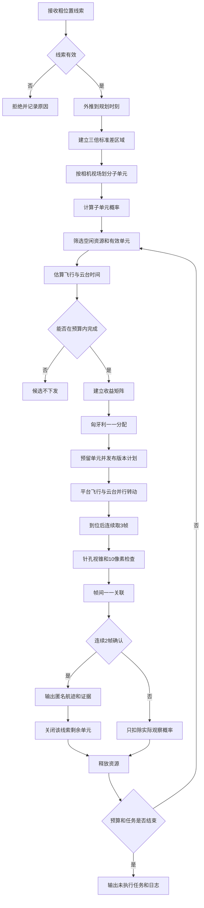

# 协同搜索算法实施逻辑

## 一、范围

### 1.1 任务目标

本算法接收中心给出的目标粗位置线索，组织多架拦截无人机在限定时间内完成区域搜索。搜索阶段只回答两个问题：预测区域内是否发现可识别目标，发现结果能否在连续图像中稳定保持。

搜索结果是匿名机载航迹和对应观察证据。算法不在本阶段判断该航迹一定属于哪一条中心线索，也不改写中心目标编号。中心线索与机载航迹的身份关系由后续末端目标配准处理。

### 1.2 当前输入前提

当前离线基线采用以下受控条件：

1. 中心对每个真实目标提供一条粗位置线索，线索精度和召回率均设为100%。
2. 不设置错误线索、重复线索、漏报目标和额外空白走廊。
3. 每条线索包含位置、速度、位置与速度协方差、测量时刻、到达时刻、有效期和存在概率。
4. 位置误差在北、东、地三个方向按相同标准差设置，并截断在正负三倍标准差内。
5. 搜索资源可获得自身位置、姿态、云台角度和可用状态。

这些条件用于单独检查粗位置误差、相机视场和搜索资源之间的关系。上线后如果中心存在漏报，还需要增加无指向区域搜索；该能力不属于当前算法基线。

### 1.3 能力边界

| 本阶段负责 | 本阶段不负责 |
| --- | --- |
| 粗线索外推和有效性检查 | 生成中心目标航迹 |
| 三倍标准差预测区域划分 | 判断机载目标的中心身份 |
| 搜索子单元概率计算 | 改写中心目标编号 |
| 无人机与子单元滚动分配 | 末端制导和拦截控制 |
| 平台运动、云台转动和观察调度 | 利用离线真实编号参与在线决策 |
| 10像素识别门限和连续两帧确认 | 把一次检测直接作为稳定发现 |
| 匿名航迹和观察证据输出 | 把“看见邻近目标”写成原线索身份确认 |

## 二、输入与输出

### 2.1 在线输入

#### 中心粗位置线索

| 字段 | 含义 | 使用规则 |
| --- | --- | --- |
| 线索编号 | 中心侧匿名编号 | 仅用于组织搜索任务，不代表机载身份已经绑定 |
| 位置 | 测量时刻的北、东、地坐标 | 必须与速度和协方差处于同一坐标系 |
| 速度 | 三轴速度 | 用于把旧线索外推到规划时刻 |
| 协方差 | 位置和速度误差范围 | 用于形成预测区域和后续门限 |
| 测量时刻 | 线索对应的真实观测时刻 | 外推基准，不能用消息到达时刻代替 |
| 到达时刻 | 搜索系统收到消息的时刻 | 用于统计通信延迟和判断时效 |
| 有效期 | 允许使用该线索的最晚时刻 | 过期线索不下发新任务 |
| 存在概率 | 该线索包含真实目标的先验概率 | 进入子单元概率和任务收益计算 |

#### 搜索资源状态

每架拦截无人机至少提供：资源编号、北东地位置、机体姿态、云台偏航和俯仰、状态测量时刻、预计空闲时刻、剩余任务时间以及健康状态。离线基线使用位置、云台角和预计空闲时刻；真实系统还应携带导航和姿态协方差。

#### 相机与运动参数

当前离线基线采用以下参数：

| 参数 | 当前值 | 算法作用 |
| --- | ---: | --- |
| 图像分辨率 | 1920×1080 | 针孔投影和像素门限 |
| 水平视场角 | 19度 | 计算水平视场足迹 |
| 垂直视场角 | 10.75度 | 由画幅比例推算，用于垂直视场足迹 |
| 预定观察距离 | 700米 | 生成观察位置和视场足迹 |
| 相邻视场重叠 | 20% | 减少单元边缘漏搜 |
| 平台最大速度 | 97米每秒 | 估算到位时间 |
| 云台最大转速 | 200度每秒 | 估算转向时间 |
| 单点观察时间 | 0.3秒 | 读取3帧图像 |
| 图像帧间隔 | 0.1秒 | 连续确认的时间间隔 |
| 识别门限 | 检测框最长边不小于10像素 | 小于门限只记为不可识别 |
| 连续确认 | 连续2帧 | 排除单帧闪现 |
| 总搜索预算 | 18秒 | 超预算候选不下发 |

### 2.2 在线输出

搜索阶段输出四类信息：

1. **搜索计划**：计划版本、生成时刻、资源编号、子单元编号、观察位置、云台指向、预计开始和完成时刻。
2. **匿名检测**：相机编号、检测编号、图像拍摄时刻、消息到达时刻、检测框、检测框中心和像素尺度。
3. **匿名局部航迹**：本机临时航迹编号、连续观测次数、最近图像时刻、检测编号集合和确认状态。
4. **搜索交接记录**：子单元、相机、匿名局部航迹、连续确认次数、候选中心线索集合和观察证据。其身份状态必须标为“候选”，不能标为“中心身份已确认”。

工程在线合同中的检测和航迹必须同时保留图像拍摄时刻与消息到达时刻。45组离线矩阵使用的简化匿名检测记录只保存了图像拍摄时刻，没有模拟消息传输，也没有单列到达时刻；该字段需要在AirSim闭环接入时补齐，不能用拍摄时刻代替到达时刻，也不能据此宣称已经验证通信时延。

### 2.3 离线专用数据

离线回放另有目标真实轨迹、目标真实编号、线索与真实目标对应标签、检测与真实目标对应标签。这些数据只允许进入离线观测生成器和评分器，不得进入预测区域生成、收益计算、匈牙利分配、任务关闭和在线输出。

```text
在线算法可见：粗线索、资源状态、相机参数、匿名检测
离线评分可见：目标真实轨迹、真实编号、线索标签、检测标签

禁止路径：真实编号或真实位置 -> 收益矩阵、任务分配、身份关闭
```

## 三、数据对象与状态

### 3.1 主要数据对象

#### 预测区域

```text
预测区域 {
    区域编号
    线索编号
    规划时刻预测中心
    三轴三倍标准差范围
    线索存在概率
    有效期
}
```

#### 搜索子单元

```text
搜索子单元 {
    子单元编号
    线索编号
    横向中心偏移
    高度中心偏移
    前向、右向和地向基向量
    名义视场宽度和高度
    深度半范围
    初始概率质量
    剩余概率质量
    状态
    预留资源编号
    最近观察时刻
}
```

当前离线实现沿横向和高度方向划分子单元，沿目标来袭方向保留完整的正负三倍标准差深度范围。它没有把深度方向继续切成多层距离单元。

#### 候选运动

```text
候选运动 {
    资源编号
    子单元编号
    观察位置
    云台偏航和俯仰
    飞行距离
    飞行时间
    云台转动时间
    观察开始时刻
    任务完成时刻
}
```

#### 分配事件

```text
分配事件 {
    分配编号
    计划版本
    分配生成时刻
    资源编号
    子单元编号
    线索编号
    子单元概率质量
    收益
    候选运动
}
```

### 3.2 状态机

#### 子单元状态



“确认后关闭”表示停止继续搜索该线索的剩余单元，不表示已经确认中心身份。若后续配准拒绝该候选，工程系统应支持重新打开仍有剩余概率的子单元；当前离线基线没有实现该反馈回开。

#### 资源状态



离线基线以“预计空闲时刻”压缩表示运动中和观察中状态。真实系统应保留显式状态、执行回执和故障原因。

#### 匿名局部航迹状态

```text
暂定：只有1帧有效检测
确认：连续2帧满足10像素门限并完成帧间一一关联
中断：下一帧没有匹配检测，本次连续计数清零
结束：本观察点取帧完成
```

当前搜索阶段只在单个观察点的3帧内形成短航迹，不承担长时间多目标跟踪。

## 四、总体流程



系统采用事件驱动的滚动调度。规划器不等待固定周期：资源空闲、观察完成、出现稳定目标、任务撤销或线索失效时，都可以触发新一轮分配。

## 五、预测区域与搜索子单元

### 5.1 按测量时刻外推

线索的位置对应测量时刻，不对应消息到达时刻。规划时刻为 `t规划`，测量时刻为 `t测量`，当前恒速外推为：

$$
\begin{aligned}
\Delta t &= \max\left(0,t_{plan}-t_{measurement}\right),\\
\hat{\boldsymbol p} &= \boldsymbol p+\boldsymbol v\Delta t.
\end{aligned}
$$

如果线索已经超过有效期，或测量时刻晚于规划时刻且无法解释，规划器不为该线索生成新任务。当前离线基线保持输入协方差不随时间增长；真实系统应按运动模型传播协方差，并把通信延迟和目标机动误差加入预测区域。

#### 伪代码：线索检查与外推

```text
函数 外推线索(线索, 规划时刻):
    如果 规划时刻 > 线索.有效期:
        返回 拒绝("线索已过期")

    如果 线索.到达时刻 < 线索.测量时刻:
        返回 拒绝("时间戳顺序错误")

    如果 协方差不是有效半正定矩阵:
        返回 拒绝("协方差无效")

    时间差 = 最大值(0, 规划时刻 - 线索.测量时刻)
    预测位置 = 线索.位置 + 线索.速度 * 时间差

    当前离线基线:
        预测协方差 = 线索.协方差

    在线工程版本:
        预测协方差 = 运动模型传播(线索.协方差, 时间差)
        预测协方差 += 通信时延误差 + 目标机动误差

    返回 预测位置, 预测协方差
```

### 5.2 三倍标准差区域

设位置协方差的三个对角元素为 `P北北`、`P东东`、`P地地`，三轴标准差分别为：

$$
\sigma_N=\sqrt{P_{NN}},\qquad
\sigma_E=\sqrt{P_{EE}},\qquad
\sigma_D=\sqrt{P_{DD}}
$$

预测边界取预测位置各方向的正负三倍标准差。当前试验中三轴使用相同的30米、60米或100米标准差。三倍标准差区域是搜索边界，不代表边界内各处概率相同。

### 5.3 相机真实视场足迹

观察距离为 `R`，水平和垂直视场角分别为 `θ水平`、`θ垂直`，单次名义覆盖宽高为：

$$
W_{fov}=2R\tan\frac{\theta_h}{2},\qquad
H_{fov}=2R\tan\frac{\theta_v}{2}
$$

在当前参数下：

```text
视场宽度约为234.28米
视场高度约为131.78米
```

相邻观察中心的间距取视场足迹的80%，使相邻实际视场保持20%重叠。概率单元本身按不重叠边界计算概率，避免同一概率质量被重复计数；观察视锥可以跨越多个概率单元。

### 5.4 子单元方向

以预测目标相对场景原点的水平来向构造局部基向量：

```text
前向 = 预测中心的水平单位方向
右向 = 与前向水平正交的单位方向
地向 = 北东地坐标中的地轴方向
```

子单元中心由预测中心、横向偏移和高度偏移组成。观察位置位于子单元来向前方约700米处，云台指向随外推位置移动的子单元中心。

### 5.5 概率质量

当前离线基线假定横向误差和高度误差相互独立且服从高斯分布。设某个横向区间为 `[a横, b横]`，高度区间为 `[a高, b高]`，标准正态累积分布函数为 `Φ`，则未归一化概率质量为：

$$
m=
\left[\Phi\left(\frac{b_h}{\sigma_h}\right)-
\Phi\left(\frac{a_h}{\sigma_h}\right)\right]
\left[\Phi\left(\frac{b_v}{\sigma_v}\right)-
\Phi\left(\frac{a_v}{\sigma_v}\right)\right]
$$

所有位于正负三倍标准差区域内的单元概率再统一归一化，使同一条线索的子单元概率质量之和等于线索存在概率。当前试验的线索存在概率为1。

#### 伪代码：划分子单元

```text
函数 划分子单元(线索预测, 相机参数):
    半范围 = 3 * 位置标准差
    视场宽 = 2 * 观察距离 * tan(水平视场角 / 2)
    视场高 = 2 * 观察距离 * tan(垂直视场角 / 2)
    横向步长 = 视场宽 * (1 - 重叠率)
    高度步长 = 视场高 * (1 - 重叠率)

    横向区间集合 = 在[-半范围, +半范围]内按横向步长分段
    高度区间集合 = 在[-半范围, +半范围]内按高度步长分段

    临时单元 = 空集合
    对每个 横向区间:
        横向概率 = 高斯累积差(横向区间, σ)
        对每个 高度区间:
            高度概率 = 高斯累积差(高度区间, σ)
            概率 = 横向概率 * 高度概率
            创建子单元(
                中心偏移 = 横向中心和高度中心,
                深度半范围 = 3σ,
                初始概率 = 概率
            )
            加入临时单元

    归一化常数 = 临时单元概率总和
    对每个 子单元:
        子单元.概率 = 线索存在概率 * 子单元.概率 / 归一化常数
        子单元.剩余概率 = 子单元.概率

    返回 临时单元
```

## 六、滚动收益分配

### 6.1 候选筛选

每轮只处理空闲资源和有效子单元。以下子单元不进入收益矩阵：

- 已完成实际观察；
- 已被其他资源预留；
- 所属线索已因稳定视觉目标而关闭；
- 线索已经过期；
- 剩余概率低于配置下限；
- 即使平台和云台按上限同时运动，也无法在18秒预算内完成观察。

### 6.2 平台与云台并行运动

平台飞向观察位置时，云台同步转向目标预测区域。因此到达观察条件所需时间取飞行时间与云台转动时间的较大值：

$$
\begin{aligned}
T_{flight}&=D/V_{max},\\
T_{gimbal}&=\max\left(\Delta\psi,\Delta\theta\right)/\omega_{max},\\
t_{ready}&=t_{now}+\max\left(T_{flight},T_{gimbal}\right),\\
t_{finish}&=t_{ready}+T_{observe}.
\end{aligned}
$$

目标预测区域在飞行期间继续移动。当前离线实现迭代4次：先估算到位时刻，再按该时刻更新子单元中心和观察位置，直到得到稳定的完成时间近似值。

#### 伪代码：候选运动

```text
函数 估算候选运动(资源, 子单元, 线索, 当前时刻):
    观察开始 = 当前时刻

    重复4次:
        观察中点 = 观察开始 + 观察时间 / 2
        子单元中心 = 外推后的线索中心(观察中点) + 子单元偏移
        观察位置 = 子单元中心 - 前向 * 观察距离
        期望云台角 = 由观察位置指向子单元中心

        飞行距离 = 距离(资源当前位置, 观察位置)
        飞行时间 = 飞行距离 / 平台最大速度
        转动时间 = 云台角差 / 云台最大转速
        观察开始 = 当前时刻 + 最大值(飞行时间, 转动时间)

    完成时间 = 观察开始 + 观察时间
    返回 候选运动
```

### 6.3 收益函数

当前离线基线使用：

$$
G=12p+\frac{1.5}{1+T}-0.018T-0.00005D
$$

其中：

- `p`是子单元当前剩余概率质量；
- `T`是从当前时刻到完成观察的总时间；
- `D`是资源当前位置到观察位置的飞行距离。

第一项优先搜索高概率区域；第二项偏向能够较快完成的任务；第三项直接惩罚时间占用；第四项抑制不必要的远距离调动。云台转动时间已经包含在 `T` 中。

### 6.4 匈牙利一一分配

收益矩阵的行表示当前空闲无人机，列表示待搜索子单元。每一行还增加“保持空闲”的虚拟列。超预算或无效候选写成不可选值，虚拟空闲收益当前设为负0.75。

匈牙利算法一次求出全局一一关系，保证：

- 一架无人机本轮最多获得一个子单元；
- 一个子单元本轮最多分给一架无人机；
- 没有合适任务的无人机可以保持空闲；
- 不因局部贪心选择导致两架无人机抢占同一单元。

分配成功后立即预留子单元并登记资源预计空闲时刻，防止下一轮重复下发。计划必须携带递增版本；真实通信系统收到旧版本时应拒绝执行。

#### 伪代码：建立矩阵并分配

```text
函数 滚动分配(当前时刻, 资源集合, 子单元集合, 总预算):
    空闲资源 = 筛选健康且预计空闲时刻不晚于当前时刻的资源
    有效单元 = 筛选待搜索、未预留、线索有效且剩余概率大于0的单元

    如果 空闲资源为空 或 有效单元为空:
        返回 空分配

    建立矩阵[空闲资源数量][有效单元数量 + 空闲资源数量]

    对每个 资源:
        对每个 有效单元:
            运动 = 估算候选运动(资源, 单元, 当前时刻)
            如果 运动.完成时间 > 总预算:
                矩阵值 = 不可选
                记录("超预算候选")
            否则:
                矩阵值 = 计算收益(单元.剩余概率, 运动)
                缓存候选运动

        该资源对应的虚拟空闲列 = -0.75

    匹配关系 = 匈牙利最大收益匹配(矩阵)
    计划版本 += 1

    对每个 匹配关系:
        如果 选择虚拟列 或 收益不高于空闲收益:
            资源保持空闲
        否则:
            原子预留子单元
            登记资源预计空闲时刻
            生成带版本的分配事件

    返回 分配事件集合
```

## 七、执行与观测

### 7.1 执行顺序

资源收到计划后先检查版本、有效期、健康状态和预算，再执行位置与云台命令。平台飞行和云台转向同步进行。到达观察位置后，云台继续跟随外推后的子单元中心，按0.1秒间隔读取3帧。

分配成功不计作观察。只有资源实际到位、相机视锥覆盖对应空间并完成取帧，才更新观察状态和概率。

### 7.2 针孔视锥判断

离线观测器根据相机位置、偏航、俯仰和相机内参建立针孔视锥。对空间点执行以下检查：

1. 目标必须位于相机前方；
2. 水平投影必须落在水平视场角内；
3. 垂直投影必须落在垂直视场角内；
4. 按目标尺寸、焦距和距离计算的检测框最长边必须不小于10像素。

当前离线回放使用保存的真实目标位置生成匿名检测，这是观测模拟器的输入。生成后立即去掉真实目标编号，在线分配和短航迹只处理匿名检测。真实AirSim或实物系统应由实际检测器提供检测框，不再由真实位置投影生成。

### 7.3 连续两帧确认

同一观察点最多读取3帧。相邻帧检测先按像素中心距离建立代价矩阵，超过180像素的组合不允许关联，再用匈牙利算法完成帧间一一匹配。

一条短航迹连续两帧匹配成功且每帧检测框最长边均不小于10像素，才进入确认状态。第1帧和第3帧出现、第2帧缺失时，不满足连续确认。

#### 伪代码：执行观察

```text
函数 执行观察(分配事件):
    如果 分配事件.计划版本 < 资源.已接收版本:
        返回 失败("旧计划")

    如果 当前时刻 > 分配事件.最晚开始时刻:
        释放预留单元
        返回 失败("计划已超时")

    如果 资源不健康:
        释放预留单元
        返回 失败("资源不可用")

    平台开始飞向观察位置
    云台同时转向预测区域

    如果 到位条件未在预算内满足:
        释放预留单元
        返回 失败("未到位")

    帧集合 = 空集合
    对 帧号 从1到3:
        拍摄时刻 = 观察开始时刻 + (帧号 - 1) * 0.1秒
        更新云台指向到该时刻的预测中心
        获取匿名检测
        保留检测框最长边不小于10像素的检测
        加入帧集合

    局部航迹 = 帧间一一关联(帧集合, 180像素门限)
    确认航迹 = 筛选连续命中至少2帧的局部航迹
    实际覆盖 = 根据真实相机位姿计算本次视锥覆盖单元

    返回 观察结果(帧集合, 确认航迹, 实际覆盖)
```

#### 伪代码：短航迹确认

```text
函数 帧间一一关联(帧集合, 像素门限):
    航迹集合 = 空集合

    对每一帧及其匿名检测:
        最近航迹 = 上一帧仍有效的航迹
        建立 检测到最近航迹 的像素距离矩阵
        超过像素门限的关系设为不可选
        匹配 = 匈牙利最小代价匹配

        对每个检测:
            如果获得有效匹配:
                更新航迹中心
                如果与上一帧连续:
                    连续计数 += 1
                否则:
                    连续计数 = 1
            否则:
                创建暂定航迹，连续计数 = 1

            如果 连续计数 >= 2:
                航迹状态 = 确认

    返回 航迹集合
```

## 八、概率更新与滚动重算

### 8.1 空视场更新

没有发现稳定目标时，不得把整条中心线索清零。系统只扣除本次真实相机视锥覆盖到的概率质量。

当前离线基线采用子单元中心近似：若某个同线索子单元的中心位于本次真实视锥内，则该子单元记为已观察并从后续候选中移除；中心不在视锥内的单元保持原概率。该近似能区分“获得分配”和“实际看过”，但没有计算视锥与单元边界的部分交叠比例。

真实系统可进一步计算交叠比例：

$$
p_{remain}=p_{prior}
\left(1-r_{coverage}p_{detection}\right)
$$

这项连续概率更新尚未在当前离线基线实现，不能写成已验证能力。

### 8.2 出现稳定目标

任一观察点形成确认短航迹后，当前离线基线执行三项操作：

1. 输出匿名局部航迹和观察证据；
2. 关闭该中心线索尚未观察的剩余子单元；
3. 释放完成观察的无人机并触发新一轮分配。

这里关闭的是“该线索的搜索任务”，不是“该线索的身份关系”。密集目标场景中，搜索视场可能先看到邻近目标。在线输出必须保留候选状态，后续末端配准不通过时应允许重新开启剩余搜索区域。

### 8.3 重复观察抑制

当前基线通过三种方式减少重复：

- 已预留子单元不再参与同轮分配；
- 已观察子单元不再进入后续候选；
- 某线索形成稳定视觉目标后，其余子单元停止分配。

不同线索的预测区域可能重叠，多架无人机也可能从相邻视场再次看到同一目标。由于搜索阶段没有可信身份，不能根据离线真实编号全局删除这些观察。工程版本可对近期已确认的空间方向设置短时降权，但仍应保留不同方向的必要复核。

#### 伪代码：观察结果更新

```text
函数 更新搜索状态(观察结果, 分配事件):
    对每个 本次实际覆盖子单元:
        如果 子单元属于分配事件对应线索:
            子单元.状态 = 已观察
            子单元.剩余概率 = 0

    如果 观察结果.确认航迹不为空:
        输出匿名搜索交接记录(
            候选线索 = 分配事件.线索编号,
            身份状态 = 候选,
            观察证据 = 确认航迹
        )

        对该线索的所有待搜索或已预留单元:
            子单元.状态 = 确认后关闭
            撤销尚未开始的重复任务

    否则:
        只保留未被真实视锥覆盖的剩余单元

    资源.状态 = 空闲
    清除当前分配
    触发滚动重算
```

## 九、事件循环伪代码

下面给出当前离线基线对应的完整事件循环。真实系统可把事件队列替换为消息总线和执行回执，状态逻辑保持一致。

```text
函数 运行协同搜索(线索集合, 资源集合, 配置):
    校验配置和所有输入
    当前时刻 = 0
    计划版本 = 0
    事件队列 = 空优先队列
    未执行任务 = 空集合

    对每条线索:
        预测 = 外推线索(线索, 当前时刻)
        如果预测有效:
            生成预测区域和搜索子单元
        否则:
            记录拒绝原因

    当 当前时刻 <= 总搜索预算:
        处理已经到达当前时刻的资源故障和线索失效事件

        空闲资源 = 当前可用资源
        活动单元 = 待搜索且未预留、未关闭、未过期的子单元

        如果 空闲资源不为空 且 活动单元不为空:
            新分配 = 滚动分配(当前时刻, 空闲资源, 活动单元, 总预算)

            对每个 新分配:
                原子预留对应子单元
                把任务完成事件加入优先队列

        如果 事件队列为空:
            退出循环

        当前时刻 = 事件队列中最早的完成时刻
        同时完成事件 = 弹出所有完成时刻相同的事件

        可并行地 对每个 完成事件:
            如果 任务仍有效:
                观察结果 = 执行离线观测或接收真实相机回报
                更新搜索状态(观察结果, 完成事件)
            否则:
                释放资源和预留单元
                记录失败原因

        如果 所有线索均关闭或所有单元均已观察:
            退出循环

    对每个仍为待搜索或已预留的有效子单元:
        标记为预算内未执行
        加入未执行任务

    输出:
        分配记录
        观察记录
        匿名检测和局部航迹
        搜索交接记录
        单元最终状态
        未执行任务及原因
        计算时间和在线真值泄漏检查
```

## 十、异常与失败关闭

### 10.1 输入异常

| 异常 | 处理 |
| --- | --- |
| 线索过期 | 不生成新任务，保留拒绝记录 |
| 测量时刻和到达时刻顺序错误 | 拒绝线索，不自行修正时间 |
| 坐标系或单位不明确 | 拒绝进入规划 |
| 协方差无效 | 拒绝线索，不能用零误差替代 |
| 资源状态过旧 | 资源暂停参与分配 |
| 相机标定缺失 | 资源不得执行需要视锥判断的任务 |

### 10.2 计划和执行异常

| 异常 | 处理 |
| --- | --- |
| 候选预计超出18秒 | 不下发，计入超预算拒绝 |
| 收到旧计划版本 | 拒绝执行，不覆盖新计划 |
| 子单元已被其他资源预留 | 本次分配失败并重新规划 |
| 无人机未按时到位 | 释放预留，记录未到位，不计入已观察 |
| 云台未达到指向或未稳定 | 不开始连续确认计数 |
| 相机缺帧 | 中断连续计数，不用前一帧替代 |
| 单帧目标大于10像素 | 只建立暂定航迹，不关闭线索 |
| 通信中断且无执行回执 | 不把任务记为完成；按租期回收预留 |
| 预算结束 | 保留未执行任务，不把剩余概率清零 |

### 10.3 身份边界

搜索阶段出现稳定目标时只发布“发现一个匿名视觉目标”。以下操作必须失败关闭：

- 不得把观察到的匿名航迹直接改名为中心线索编号；
- 不得使用真实目标编号决定关闭哪个身份关系；
- 不得因一个视场内出现目标就宣称原线索身份正确；
- 不得把未完成连续确认的检测交给末端制导作为稳定目标。

## 十一、计算量与工程实现

### 11.1 当前计算量

设空闲资源数为 `R`，活动子单元数为 `C`，每次观察帧数为 `F`，单帧匿名检测数为 `D`：

- 候选运动和收益计算约为 `O(RC)`，当前每个候选固定迭代4次；
- 稠密匈牙利分配的主要复杂度随矩阵较大边长近似按三次方增长；
- 事件队列插入和弹出约为 `O(log A)`，`A`为队列事件数；
- 观察点内帧间匹配最多处理3帧，匹配开销由每帧检测数决定；
- 当前离线观测器每帧遍历全部真实目标生成匿名检测，这属于离线模拟开销，不是在线分配开销。

当前离线实现使用单进程稠密收益矩阵。45组回放能够完成计算，只能说明该工作站上的离线实现可运行，不能代替机载处理器和通信条件下的时限验证。

### 11.2 稀疏候选

目标和资源规模扩大后，不应让每架无人机与全部子单元形成候选。可采用以下确定性筛选：

1. 按线索区域和空间位置建立索引；
2. 先剔除超预算、过期和运动不可达候选；
3. 每架无人机只保留预计完成时间最短或收益最高的前若干个单元；
4. 把互不相连的资源—单元候选图拆成多个连通分量；
5. 各分量并行求解，最后合并无冲突结果。

稀疏化只能删除确定不可行或明显低收益候选。为每架无人机固定保留候选数量时，应设置最低覆盖规则，避免边缘子单元永远没有候选资源。

### 11.3 缓存

可以缓存以下中间量：

- 相机焦距、水平和垂直视场足迹；
- 每条线索的局部前向和右向基向量；
- 子单元静态偏移和初始概率质量；
- 同一规划时刻的线索预测中心；
- 资源到邻近观察点的距离和初始角差；
- 子单元编号到对象、线索到子单元集合的索引。

线索更新、资源位置变化、计划时刻推进或相机参数变化后，相关缓存必须失效。不能复用旧时刻的完成时间和预算判定。

### 11.4 并行调度

单个资源—单元候选的运动估算相互独立，可并行计算。多个已经到位的观察任务也可并行处理。匈牙利匹配仍需在同一冲突分量内统一执行，不能让多个线程分别抢占同一个子单元。

当前离线基线没有实现多线程候选计算和分量并行。这两项属于规模扩展方案，需在固定输入下核对并行前后的分配结果、确定性和耗时。

## 十二、误差接入位置

### 12.1 通信误差

通信影响线索时效、资源状态时效和计划执行确认。接入位置如下：

```text
线索测量时刻与到达时刻 -> 外推时间和协方差增长
资源状态时刻与到达时刻 -> 可达性可信度
计划发布时间与接收时间 -> 剩余预算和版本检查
执行回执缺失 -> 预留租期到期后回收
```

### 12.2 导航和姿态误差

真实系统需要在资源状态中加入位置协方差、姿态协方差和时间戳。导航位置误差影响观察位置和真实视锥；姿态与云台角误差影响视锥方向。可在候选阶段扩大观察裕量，在实际观察阶段使用图像拍摄时刻的导航和云台数据重新计算视锥。

导航数据过旧或误差超过配置上限时，不应按理想位置确认“已观察”。任务应保持未完成或重新规划。

### 12.3 检测误差

当前45组离线矩阵没有额外注入随机漏检和虚警。真实检测误差应接在针孔视锥之后、局部短航迹之前：

```text
实际相机图像
    -> 检测器输出
    -> 10像素门限
    -> 帧间一一关联
    -> 连续两帧确认
```

漏检会打断连续计数；虚警只有连续多帧且运动一致时才可能形成暂定航迹。后续还需增加检测置信度、运动一致性和末端配准复核，不能用离线真实编号消除虚警。

### 12.4 运动误差

当前基线按平台最大速度和云台最大转速计算，并假定二者可同时达到上限。真实执行应接入平台加速度、转弯半径、云台加速度、稳定时间、禁飞区和机间避碰约束。加入这些限制后必须重新计算任务完成时刻，原有18秒结果不能直接沿用。

## 十三、实现与验证状态

### 13.1 已实现并有机器证据

截至2026年8月19日，独立实验中已实现：

- 每目标一条正确匿名粗位置线索的受控输入；
- 测量时刻到规划时刻的恒速外推；
- 三倍标准差区域和基于实际视场足迹的横向、高度子单元；
- 子单元高斯概率质量计算和20%视场重叠；
- 平台与云台并行运动的时间估算；
- 18秒预算门控、滚动收益矩阵和匈牙利一一分配；
- 分配、到位、真实视锥观察三种状态的区分；
- 10像素门限、每点3帧和连续2帧确认；
- 匿名在线记录与离线真实标签分离；
- 3种规模、3档位置误差、5个固定随机场景，共45组确定性离线回放。

上述证据来自既有AirSim目标运动记录上的离线复算。保存轨迹只覆盖0.8秒，之后17.2秒采用恒速外推。原始运行提交号、依赖版本和运行环境版本未完整封存，因此当前证据支持确定性离线复算和算法检查，不支持宣称已经完成同条件AirSim闭环复验。

### 13.2 当前离线假设

- 中心线索精度和召回率均为100%；
- 没有错误线索、重复线索和中心漏报；
- 没有额外随机漏检和虚警；
- 平台速度和云台转速采用上限模型；
- 没有平台加速度、机间避碰和通信排队；
- 子单元实际覆盖使用中心点落入视锥的离散近似；
- 形成稳定视觉目标后立即关闭对应线索剩余搜索单元；
- 搜索阶段没有完成中心身份绑定。

### 13.3 待AirSim闭环验证

1. 使用覆盖完整18秒的Actor运动，而不是0.8秒后恒速外推。
2. 验证前出待机线、平台加速度、速度上限、云台转速和稳定时间。
3. 注入导航位置、机体姿态、云台角、时间同步和通信延迟误差。
4. 使用真实 `detect` 或指定检测器验证10像素门限附近的漏检和连续两帧稳定性。
5. 验证多机同时运动时的航迹冲突、避碰和通信负载。
6. 验证邻近目标触发搜索关闭后，末端配准拒绝时能否重新打开剩余区域。
7. 在相同输入下比较稠密矩阵与稀疏候选、串行与并行实现，确认分配结果和计算时限。

## 十四、实施检查表

### 输入

- [ ] 所有线索均带测量时刻、到达时刻和有效期。
- [ ] 位置、速度和协方差使用统一北东地坐标系和单位。
- [ ] 资源状态带测量时刻、健康状态和导航误差。
- [ ] 相机内参、安装关系和云台角定义完成标定。
- [ ] 在线输入中不存在Actor名称、真实目标编号和真实目标位置。

### 规划

- [ ] 先按测量时刻外推，再生成三倍标准差区域。
- [ ] 子单元步长来自实际视场足迹并保留配置重叠。
- [ ] 同一线索的子单元概率质量归一化正确。
- [ ] 已观察、已预留、已关闭和过期单元不进入收益矩阵。
- [ ] 平台与云台按并行运动计算，观察时间计入完成时刻。
- [ ] 超预算候选不下发。
- [ ] 分配结果满足一机一单元和一单元一机。
- [ ] 计划版本递增，旧版本被拒绝。

### 执行与观测

- [ ] 分配成功不直接计入观察覆盖。
- [ ] 到位条件使用实际导航和云台回报判断。
- [ ] 图像、导航和云台姿态使用同一拍摄时刻。
- [ ] 检测框最长边不小于10像素才进入识别候选。
- [ ] 每个观察点读取3帧，只有连续2帧才能确认。
- [ ] 空视场只扣除真实视锥覆盖到的概率质量。
- [ ] 未执行任务在预算结束时保留并输出原因。

### 身份与真值隔离

- [ ] 搜索输出保持匿名局部航迹编号。
- [ ] 搜索关闭不写成中心身份确认。
- [ ] 后续配准拒绝时保留重新搜索接口。
- [ ] 离线真值只进入观测生成和最终评分。
- [ ] 自动检查在线记录中的真实编号泄漏。

### 验证

- [ ] 离线回放记录输入哈希、配置、随机场景和复现命令。
- [ ] AirSim闭环记录完整目标运动、相机检测和资源执行回执。
- [ ] 分别报告已分配、已到位、已观察、已发现和已连续确认。
- [ ] 单列超预算、未到位、缺帧、低于10像素和身份候选未通过原因。
- [ ] 明确区分离线几何结果、AirSim仿真结果和实物试验结果。

## 十五、依据与复现边界

本文的业务口径以《协同搜索试验报告》Word版本为准，算法细节只读核对了同名Markdown、离线搜索实现和封存机器证据。当前可追溯证据位于：

```text
research_modules/independent_experiments/center_terminal_cv_campaign/
outputs/offline_search_100pct_cues_20260819/
```

该目录保存45组配置、逐组指标、匿名在线记录、独立真值、输入哈希、矩阵汇总和复现命令。复现清单记录的运行命令为：

```text
PYTHONPATH=research_modules/independent_experiments
python3 -m center_terminal_cv_campaign.exp_search.run_offline_matrix
```

现有证据目录记录了运行时Git提交号和工作区非干净状态，但没有完整记录依赖版本、Python环境和原始AirSim运行环境。它可以用于确定性离线复算和结果核查，不能据此保证完全复现原始AirSim场景。
