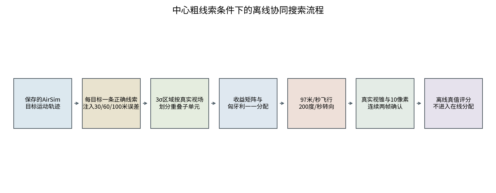
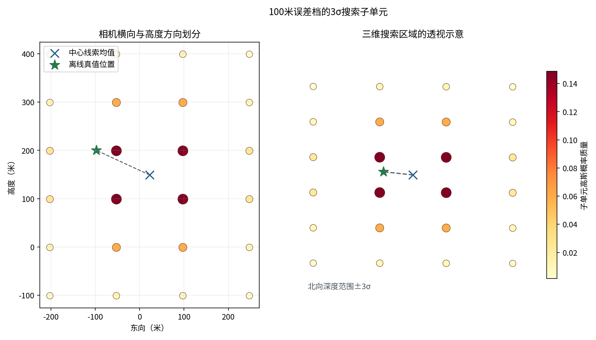
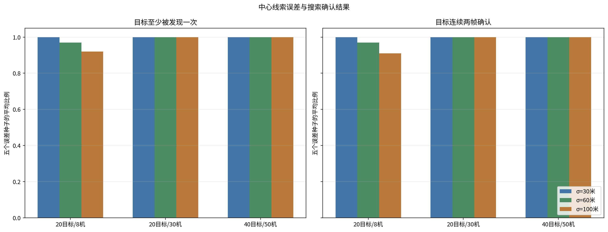
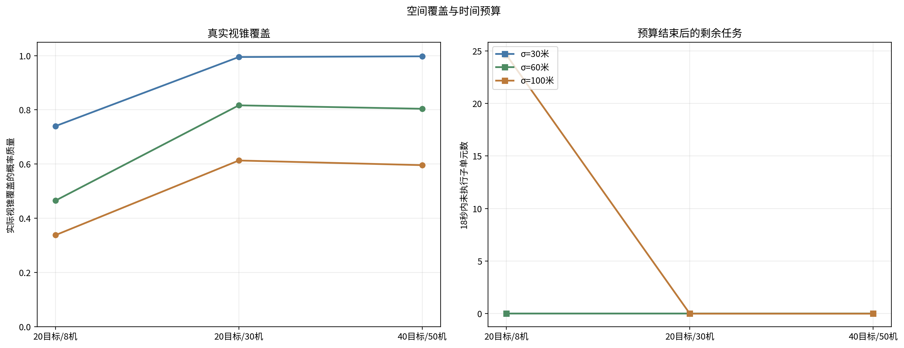
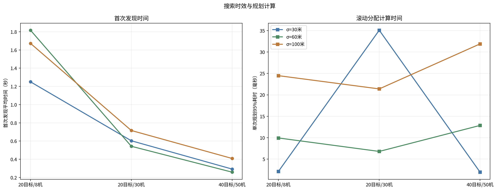

# 协同搜索试验报告

本报告说明拦截无人机如何根据中心给出的粗位置，在有限时间内分工搜索并完成连续视觉确认。核心结论有两点。第一，20目标/8机场景只在30米误差档稳定完成全部目标确认；误差扩大到60米和100米后，平均确认率降至97%和91%。第二，资源增加到20目标/30机和40目标/50机后，三档误差、五个固定随机场景均完成全部目标确认。

本次结果来自既有AirSim目标运动记录上的确定性离线回放。试验矩阵包括3种目标与资源规模、3档粗位置误差和5个固定随机场景，共45组。离线模型计算了平台运动、云台转动、相机视锥和连续两帧确认，没有重新运行AirSim，也没有加入真实检测器波动。报告中的结果用于判断搜索容量和调度逻辑，不能直接作为实装性能。

## 一、算法原理

### 1.1 处理流程

中心线索先外推到当前规划时刻，并按位置误差形成三维预测区域。系统依据相机在预定观察距离上的实际覆盖范围，把预测区域划成若干搜索子单元，再计算每个子单元的目标存在概率。无人机按滚动收益获得观察任务，飞到观察位置后转动云台并取帧。一次看见只形成临时发现，连续两帧满足识别门限后才关闭该线索的搜索任务。



搜索过程持续更新。没有发现目标时，只降低相机实际看过区域的剩余概率；发现目标后，释放对应无人机并重新计算其余任务。这样可以把一次性的区域分配改成随观察结果滚动调整的搜索计划。

### 1.2 粗位置预测区域

每条线索包含保存时刻的位置、速度和位置误差。系统先按恒速模型把位置外推到规划时刻，再以三倍标准差划定搜索边界。30米误差档形成较小预测区域；60米和100米误差档覆盖范围依次扩大。误差增大后，目标仍可能位于区域内，但需要检查的观察方向和飞行位置明显增加。

本轮中心线索精度和召回率均设为100%。20个目标对应20条正确线索，40个目标对应40条正确线索，不设置错误线索、重复线索、漏检目标和额外空白走廊。该条件用于单独检查粗位置误差对搜索容量的影响。

### 1.3 搜索子单元

相机分辨率为1920×1080，水平视场19度，按画幅比例计算的垂直视场为10.75度。在700米观察距离上，单次视场的水平覆盖约234.28米，垂直覆盖约131.78米。相邻视场保留20%重叠。预测区域沿横向和高度方向按视场足迹分块，深度方向保留完整三倍标准差范围。

每个子单元的初始概率由目标位置误差分布计算。靠近预测中心的单元概率高，边缘单元概率低。相机没有发现目标时，只扣除真实视锥覆盖到的概率，不把整条线索直接清零；连续确认后才关闭该线索的剩余单元。目标真实编号不参与子单元生成、任务分配和在线关闭判断。



### 1.4 滚动收益分配

每次有无人机空闲时，系统建立无人机到候选子单元的收益矩阵。收益使用子单元概率、预计完成时间和飞行距离：

```text
U = 12p + 1.5/(1+T) - 0.018T - 0.00005D
```

其中，p为子单元的目标存在概率，T为飞行、转向和观察的总时间，D为无人机到观察点的距离。概率越高、完成越快、距离越近，任务收益越高。匈牙利算法在同一轮内进行一一分配，保证一架无人机只执行一个子单元，一个子单元只分给一架无人机。

平台飞行和云台转动按可同时进行处理。预计完成时间超过18秒的组合不下发，预算结束仍有效但没有完成观察的子单元记为未执行任务。每次确认目标、完成空视场观察或释放无人机后，收益矩阵重新计算。

### 1.5 视锥观测与连续确认

离线观测器在运动后的相机位置和云台角度下建立针孔相机视锥，把保存轨迹中的目标位置投到图像平面。目标位于视锥内且检测框最长边不小于10像素时，生成匿名检测。试验不再加入随机漏检和虚警。同一观察点连续读取3帧，图像平面内使用一一匹配连接短航迹，连续2帧达到门限后形成确认。

分配、到位和观察分开记录。任务进入收益矩阵或获得分配不等于已经观察；只有平台完成受限运动、相机视锥实际覆盖对应空间并完成取帧，才计入视锥覆盖和发现指标。

### 1.6 搜索与身份配准边界

搜索阶段回答的是“预测区域内是否出现了可连续观察的目标”。粗位置误差较大、目标又相互接近时，一条线索的搜索视场可能先看到邻近目标。连续确认可以证明视场内存在稳定目标，不能单独证明该目标就是原线索对应的对象。搜索结果应继续进入中心线索与机载航迹配准，不能在本阶段直接改写目标身份。

## 二、试验配置

### 2.1 场景与设备

| 项目 | 设置 |
| --- | --- |
| 规模 | 20目标/8机、20目标/30机、40目标/50机 |
| 目标运动 | 保存记录中的3米AirSim移动网格目标，速度约50米/秒；0.8秒后按保存速度外推 |
| 相机 | 1920×1080，水平视场19度，垂直视场10.75度，观察距离700米 |
| 资源初态 | 搜索阶段前出待机线：北向2100米、东向-650至650米、三个高度层 |
| 运动假设 | 平台最大速度97米/秒，云台最大转速200度/秒 |

### 2.2 误差与时间设置

| 项目 | 设置 |
| --- | --- |
| 试验性质 | 保存AirSim目标轨迹上的确定性离线搜索调度，不是新AirSim飞行试验 |
| 中心线索 | 精度和召回率均为100%，每个目标对应一条正确粗位置线索 |
| 位置误差 | 北、东、地三轴标准差分别取30米、60米、100米，截断于正负三倍标准差 |
| 固定随机场景 | 20260816至20260820，共5个；只改变粗位置误差采样 |
| 观察规则 | 每点0.3秒，共3帧；检测框最长边不小于10像素；连续2帧确认 |
| 时间预算 | 18秒；预计超出预算的候选不执行 |
| 检测干扰 | 不额外注入随机漏检和虚警 |
| 试验总数 | 3种规模×3档误差×5个固定随机场景，共45组 |

保存的20目标和40目标轨迹均记录到0.8秒，剩余17.2秒按各目标保存速度作恒速外推。该处理保留了AirSim中的初始位置、速度和交叉航向，没有复现新的气动、遮挡和图像检测波动。97米/秒平台速度和200度/秒云台转速均为离线计算假设。

### 2.3 评价口径

| 指标 | 计算口径 |
| --- | --- |
| 目标发现率 | 至少一次进入真实相机视锥，且检测框最长边达到10像素的目标比例 |
| 连续确认率 | 同一匿名短航迹连续两帧达到识别门限的目标比例 |
| 视锥概率覆盖 | 相机实际观察到的子单元概率质量占当前线索总概率质量的比例 |
| 重复确认 | 已确认目标再次满足连续确认条件的观察比例 |
| 未执行任务 | 18秒结束时仍有效、且尚未完成观察的子单元数量 |
| 首次发现时间 | 从搜索开始到目标首次达到10像素门限的平均时间 |
| 规划95%耗时 | 每组滚动分配计算时间的95%分位值 |

发现率和连续确认率同时报告五个固定随机场景的平均值与最差值。视锥概率覆盖只统计相机实际看过的空间。目标一旦连续确认，其余搜索单元即关闭，因此该指标不等同于区域遍历比例，也不要求达到100%。真实身份仅用于离线投影和结束评分，45组在线记录的真实身份泄漏数为0。

## 三、试验结果

### 3.1 20目标与8架无人机

该组用于检查资源紧张时的搜索能力。发现率和连续确认率均按“平均值/最差场景”列示。

| 位置误差σ | 发现率（平均/最差） | 连续确认率（平均/最差） | 视锥概率覆盖 | 未执行任务均值 |
| --- | --- | --- | --- | --- |
| 30米 | 100.0%/100.0% | 100.0%/100.0% | 74.0% | 0.0 |
| 60米 | 97.0%/90.0% | 97.0%/90.0% | 46.5% | 0.0 |
| 100米 | 92.0%/80.0% | 91.0%/80.0% | 33.8% | 24.6 |

30米误差档的五个场景均完成20个目标连续确认。误差扩大到60米后，平均发现率和连续确认率均为97%，最差场景为90%。100米误差档平均发现率为92%，平均连续确认率为91%，最差场景均为80%；预算结束时平均还有24.6个有效子单元没有执行。资源不足时，误差扩张首先增加待观察单元和飞行时间，随后减少重访与连续确认机会。

### 3.2 20目标与30架无人机

该组保持目标数量不变，把搜索资源由8架增加到30架，用于检查并行搜索能否抵消粗位置误差。

| 位置误差σ | 发现率（平均/最差） | 连续确认率（平均/最差） | 视锥概率覆盖 | 未执行任务均值 |
| --- | --- | --- | --- | --- |
| 30米 | 100.0%/100.0% | 100.0%/100.0% | 99.5% | 0.0 |
| 60米 | 100.0%/100.0% | 100.0%/100.0% | 81.7% | 0.0 |
| 100米 | 100.0%/100.0% | 100.0%/100.0% | 61.3% | 0.0 |

三档误差下，五个固定随机场景均完成全部20个目标发现和连续确认，预算结束时没有剩余有效任务。100米误差档的视锥概率覆盖为61.3%。该数值低于30米档，是因为多机较快发现目标后立即关闭剩余单元，没有继续遍历已经失去搜索必要性的低概率区域。

### 3.3 40目标与50架无人机

该组同时增加目标数量和搜索资源，用于检查滚动分配在更大收益矩阵下的结果。

| 位置误差σ | 发现率（平均/最差） | 连续确认率（平均/最差） | 视锥概率覆盖 | 未执行任务均值 |
| --- | --- | --- | --- | --- |
| 30米 | 100.0%/100.0% | 100.0%/100.0% | 99.8% | 0.0 |
| 60米 | 100.0%/100.0% | 100.0%/100.0% | 80.4% | 0.0 |
| 100米 | 100.0%/100.0% | 100.0%/100.0% | 59.6% | 0.0 |

三档误差下，五个固定随机场景均完成全部40个目标发现和连续确认。100米误差档的视锥概率覆盖为59.6%，预算结束时没有剩余有效任务。结果表明，在当前离线运动假设下，50架无人机的并行搜索容量能够覆盖40个目标的粗位置误差。该结果没有验证机间避碰、通信排队和真实检测波动。



### 3.4 重复观察与身份边界

三种规模、三档误差下的重复确认比例为71.1%至93.2%。目标较密集时，一个19度视场可能同时包含多个目标；多架无人机观察相邻子单元时，也可能再次看到已经确认的目标。重复观察提供了复核机会，同时占用搜索容量。后续可以对刚完成确认的区域设置短时抑制，但仍需保留不同方向的必要复核。

100米误差下，线索任务被邻近目标触发关闭的平均数量分别为：20目标/8机8.2条、20目标/30机3.4条、40目标/50机6.6条。这些记录仍可计入“发现目标”，不能计入“原线索身份已经确认”。搜索结果必须交给后续末端配准流程建立线索与机载航迹关系。



### 3.5 首次发现与计算时间

| 场景 | 位置误差σ | 首次发现均值 | 规划95%耗时均值 |
| --- | --- | --- | --- |
| 20目标/8机 | 30米 | 1.25秒 | 2.12毫秒 |
| 20目标/8机 | 60米 | 1.82秒 | 9.93毫秒 |
| 20目标/8机 | 100米 | 1.67秒 | 24.48毫秒 |
| 20目标/30机 | 30米 | 0.60秒 | 35.10毫秒 |
| 20目标/30机 | 60米 | 0.54秒 | 6.78毫秒 |
| 20目标/30机 | 100米 | 0.72秒 | 21.39毫秒 |
| 40目标/50机 | 30米 | 0.29秒 | 1.94毫秒 |
| 40目标/50机 | 60米 | 0.26秒 | 12.86毫秒 |
| 40目标/50机 | 100米 | 0.41秒 | 31.90毫秒 |

九种组合的首次发现平均时间为0.26至1.82秒。20目标/8机的60米档比100米档稍慢，原因是固定随机误差方向、无人机初始横向位置和高概率单元顺序共同变化，不能据此判断误差增大有利于搜索。

滚动分配95%耗时均值为1.94至35.10毫秒。该时间来自当前工作站的Python离线实现，只包含收益矩阵和一一分配计算，不包含相机接口、通信等待和飞行控制执行。



### 3.6 结论

第一，在中心线索全部正确、目标尺寸3米、没有额外漏检和虚警的条件下，粗位置预测、搜索子单元、滚动收益分配和连续确认可以形成完整离线流程。30米误差下，8架无人机完成20个目标搜索；误差扩大后，8机资源出现漏搜。

第二，搜索容量与预测区域大小需要共同设计。20目标/30机和40目标/50机在本轮45组回放中完成全部目标确认，说明增加并行观察资源能够补偿位置误差带来的搜索单元扩张。该结果只适用于当前18秒预算、速度上限、视场和观察距离。

第三，连续看到目标不等于完成身份绑定。粗位置误差增大后，邻近目标可能提前关闭线索任务。搜索流程应输出匿名机载航迹和观察证据，由末端配准继续判断其与中心线索的对应关系。

本轮证据只支持离线调度和几何可见性判断。目标轨迹在0.8秒后采用恒速外推，平台和云台使用上限模型，没有加入目标加速度、航迹冲突、导航误差、云台稳定时间、真实图像检测波动和通信时延。上述条件明确后，仍需重新开展AirSim闭环试验或实物数据回放。

45组机器可读证据已随试验材料封存，包括逐组配置、指标、匿名在线记录、独立真值、输入哈希、汇总表和复现命令。现有封存材料未记录原始运行提交号、依赖版本和运行环境版本，后续正式复验应补齐这些信息。
