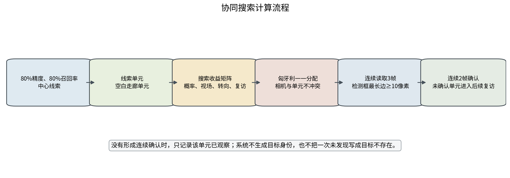
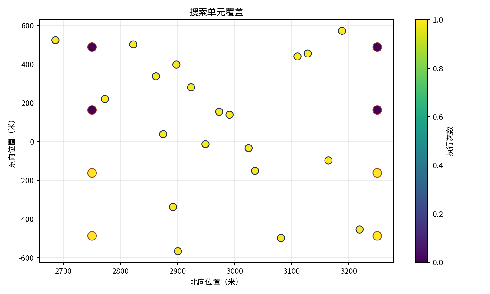
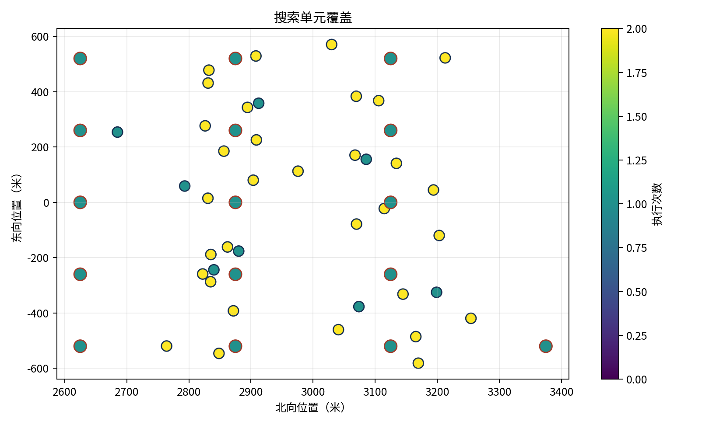

# 协同搜索试验报告

本报告说明中心线索不完整时，拦截无人机如何把有限相机资源分配到搜索区域，并把一次检测逐步确认成可交接的匿名局部航迹。结论来自20目标/8机、20目标/30机和40目标/50机三组AirSim单次试验，只用于说明算法流程和规模变化。

## 一、问题、难点与方法

### 1.1 当前问题与难点

中心线索按精度80%、召回率80%构造。以20个真实目标为例，中心给出20条线索，其中16条指向真实目标，4条是错误线索，同时还有4个真实目标没有线索。拦截无人机无法事先判断哪条线索错误，也不能只沿中心线索搜索，否则中心漏掉的目标不会进入机载视场。

搜索还受到相机容量限制。窄视场相机一次只能观察一个有限区域，同一轮内多架无人机若指向同一位置，会浪费搜索容量；全部无人机只追逐高概率线索，又会放弃空白走廊。搜索结果还要经过10像素门限和连续两帧确认，一次短暂看见不能直接形成稳定航迹。

### 1.2 搜索单元

算法先把中心线索和来袭走廊统一表示为搜索单元。这样，正确线索、错误线索和无中心线索覆盖的区域可以进入同一套分配计算。设真实目标数为N，正确中心线索数为T，全部中心线索数为S：

```text
T = 0.8N
S = T / 0.8 = N
错误线索数 = S - T = 0.2N
中心漏掉目标数 = N - T = 0.2N
```

每条中心线索按位置和速度外推到规划时刻。外推的用途是把旧线索移到目标当前可能出现的位置，关系式为 `p(t)=p0+vΔt`。搜索范围根据位置协方差确定，三个方向的半宽取 `max(30米, 3sqrt(P_ii))`。本试验位置标准差为1米，三倍标准差小于30米，因此使用30米下限。

中心漏检目标没有对应线索。算法在北向2500至3500米、东向-650至650米、高度-220至-70米的来袭走廊内增加空白单元，数量取 `max(5, ceil(0.4N))`，单元概率为0.32。空白单元只代表需要查看的区域，不代表已经存在目标。

| 场景 | 正确线索 | 错误线索 | 中心漏掉 | 空白单元 | 总搜索单元 |
| --- | --- | --- | --- | --- | --- |
| 20目标/8机 | 16 | 4 | 4 | 8 | 28 |
| 20目标/30机 | 16 | 4 | 4 | 8 | 28 |
| 40目标/50机 | 32 | 8 | 8 | 16 | 56 |

### 1.3 搜索收益和一一分配

每轮先建立相机到搜索单元的收益矩阵。若有M台可用相机、K个有效单元，矩阵共有M行、K列。第i行第j列表示第i台相机本轮查看第j个单元的收益。收益需要兼顾目标概率、相机能否看全、转动和到达代价以及是否刚刚看过：

```text
U = 3p + 4G - 0.8C_slew - 1.0C_arrival - 4C_repeat
G = p × V × Q
```

式中，p是单元概率；V是相机在700米观察距离上能够覆盖该单元的比例；Q=1/(1+n)，n为既有覆盖次数。C_slew衡量云台和机体需要转动多少，C_arrival衡量到观察位置的距离，C_repeat压低刚刚看过的单元。19度水平视场角在700米处的名义覆盖宽度约234.3米。范围较大的空白单元一次不容易看全，会通过后续复访补齐。

矩阵右侧再增加M个空闲列，形成M×(K+M)矩阵，空闲收益为-0.05。匈牙利算法一次选出全局组合，使每台相机最多承担一个单元，每个单元在同一轮最多分给一台相机。某台相机若没有收益高于空闲项的单元，就保持空闲。



### 1.4 像素门限、连续确认和未发现处理

相机被放到单元中心前方700米处，并指向单元中心。每个分配单元连续读取3帧，帧间隔0.1秒。1920×1080、水平视场角19度的机载相机像素焦距约5736.7像素。3米目标在700米处的理想成像最长边约24.6像素，超过10像素接口门限；实际判断仍以AirSim检测框为准。

同一相机、同一单元内，当前检测与上一帧局部航迹先按检测框中心距离计算代价，超过180像素的组合排除，其余组合使用匈牙利算法一一连接。检测框最长边达到10像素记为可识别，同一局部航迹连续2帧满足门限后才生成确认记录。三帧观察提供三次检测机会，但中间漏掉一帧不能把前后检测直接算成连续两帧。

本轮未发现或未连续确认时，系统只记录该单元已完成一次观察，不生成目标身份。下一轮重复代价会优先让资源转向尚未覆盖的单元；随时间增加，原单元的重复代价逐步下降，仍可再次分配。当前试验没有根据一次未发现动态降低区域概率，也没有实现长时间休眠航迹重接。

## 二、试验配置

### 2.1 场景与设备

| 项目 | 设置 |
| --- | --- |
| 仿真模式 | AirSim ComputerVision |
| 规模 | 20目标/8机、20目标/30机、40目标/50机 |
| 目标 | 无人机静态网格Actor，速度50米/秒，最长尺寸3米 |
| 场景 | 18秒，状态步长0.1秒，ClockSpeed=0.1 |
| 机载相机 | 1920×1080，水平视场角19度，标称观察距离700米 |
| 中心线索 | 固定构造精度80%、召回率80%；位置标准差1米，速度标准差0.2米/秒 |
| 检测输入 | AirSim simGetDetections元数据，在线入口去除Actor名称 |
| 识别条件 | 检测框最长边不小于10像素，连续2帧确认 |
| 分配轮数 | 3轮，每个分配单元读取3帧，帧间隔0.1秒 |
| 随机种子 | 20260816；每个规模单次运行 |

### 2.2 评价口径

搜索单元覆盖表示至少执行过一次观察的单元数；达到10像素表示目标至少有一条检测达到接口门限；连续确认表示同一匿名局部航迹连续两帧通过门限；中心漏检补获表示没有正确中心线索的目标最终被空白单元搜索发现。Actor名称只在运行结束后计算这些指标。

ComputerVision节点按指令改变位姿，不含飞行动力学。AirSim检测元数据不等同于真实可见光或红外探测器。本试验没有注入导航误差、云台误差、通信丢包和真实检测误差。

## 三、试验过程、结果与分析

### 3.1 试验过程

三组试验使用同一计算流程。每轮先筛除过期线索，建立搜索收益矩阵，完成一一分配，再把ComputerVision节点放到对应观察位置。节点连续读取3帧匿名检测，建立短航迹并执行10像素和连续两帧确认。该轮结束后更新覆盖次数和相机姿态，进入下一轮。三轮结束后，离线使用Actor标签统计目标是否被发现。


### 3.2 结果

| 场景 | 分配矩阵 | 三轮容量 | 唯一覆盖 | 未覆盖 | 规划平均耗时 |
| --- | --- | --- | --- | --- | --- |
| 20目标/8机 | 8×(28+8) | 24 | 24 | 4 | 2.758毫秒 |
| 20目标/30机 | 30×(28+30) | 90 | 28 | 0 | 11.739毫秒 |
| 40目标/50机 | 50×(56+50) | 150 | 56 | 0 | 35.753毫秒 |


| 场景 | 单元覆盖 | 达到10像素 | 连续确认 | 中心漏检补获 | 匿名检测记录 |
| --- | --- | --- | --- | --- | --- |
| 20目标/8机 | 24/28 | 20/20 | 19/20 | 3/4 | 197 |
| 20目标/30机 | 28/28 | 20/20 | 20/20 | 4/4 | 355 |
| 40目标/50机 | 56/56 | 40/40 | 40/40 | 8/8 | 1378 |

### 3.3 结果分析

20目标/8机共有28个搜索单元，三轮最多提供24个分配槽，因此至少有4个单元无法观察。试验实际覆盖24个单元。20个目标都曾达到10像素，但只有19个形成连续确认；中心漏掉的4个目标补获3个。该场景表明，资源容量不足首先造成区域覆盖缺口，随后压缩重访和连续确认机会。



20目标/30机首轮容量已经超过28个搜索单元。三轮实际执行44次分配，覆盖全部28个单元，其余16次用于复访。全部20个目标连续确认，中心漏掉的4个目标全部补获。规划平均耗时11.739毫秒。继续增加资源的主要作用已经从首次覆盖转向复访。

40目标/50机共有56个搜索单元，首轮最多覆盖50个，第二轮补齐其余6个。三轮实际执行88次分配，全部40个目标连续确认，中心漏掉的8个目标全部补获。规划矩阵为50×106，平均计算35.753毫秒。该数字只包含确定性分配计算，不包含相机运动、接口等待和通信排队。



三组结果支持两个判断。搜索单元数量必须与可用相机和滚动轮数共同核算，资源少于单元时无法依靠分配算法消除物理容量缺口。资源达到全覆盖条件后，空白走廊单元能够补获中心漏检目标。当前证据只有单个种子，不能给出稳定成功概率；真实探测器、机动约束和通信时延仍需另行验证。
