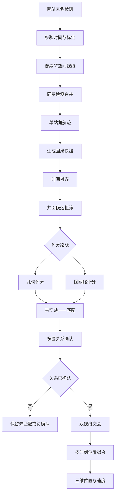
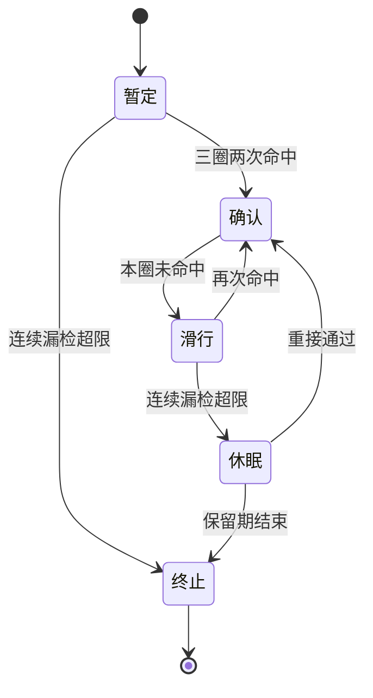

# 双光电多目标轨迹配准与交汇定位算法实施逻辑

## 一、范围与结论

### 1.1 文档用途

本文说明两台周扫光电从匿名检测框开始，形成单站角航迹，完成跨站航迹配准，并在关系确认后计算三维位置和速度的实施逻辑。本文是算法实施说明，不复述试验结果，也不把离线诊断写成在线能力。

文中使用三类状态标记：

- **已实现**：当前独立试验代码已经具备，并有对应数据合同或测试入口。
- **离线复算**：依赖封存匿名观测、冻结参数或离线标签完成，不能直接解释为实时在线能力。
- **建议实施**：工程链路需要，但当前试验尚未完整接入或验证。

### 1.2 任务边界

两台光电在单站处理开始时都不知道目标三维位置，也不知道另一台光电中的哪个局部编号对应同一目标。单站可以获得的信息包括检测框、图像拍摄时刻、本站位置、相机姿态和相机标定参数。单次观测只能确定目标方向，不能独立确定距离。

算法按两个步骤运行：

1. **配准**：判断A站角航迹和B站角航迹是否属于同一物理目标。
2. **定位**：关系确认后，使用两站同时刻视线交会得到三维位置，再利用多时刻位置估计速度。

关系未确认、视线交会条件不足或处理超时时，不发布三维结果。离线真实身份只用于训练和评分，不进入在线候选生成、评分和一一匹配。

### 1.3 成立前提

算法需要满足以下前提：

1. 两台光电的位置和相对基线已知，并统一到北、东、地坐标系。
2. 相机内参、镜头畸变和相机相对云台的安装关系已标定。
3. 每帧图像使用拍摄时刻对应的云台姿态，不能使用消息到达时姿态。
4. 两站时钟已同步，或已知稳定的时钟偏差并能校正。
5. 检测输出保留匿名检测编号、测量时间和到达时间。
6. 两站对同一目标具有足够的共同观察时间，且双视线交会角不过小。

当前AirSim链路采用理想针孔相机，代码中没有单独执行真实镜头去畸变。真实设备接入时，去畸变必须放在像素反投影之前。

### 1.4 输入与输出

| 类别 | 内容 | 必要性 |
|---|---|---|
| 检测输入 | 匿名检测编号、检测框、置信度、图像帧号 | 必需 |
| 时间输入 | 图像拍摄时刻、消息到达时刻、扫描圈编号 | 必需 |
| 光电状态 | 站点位置、拍摄时刻云台方位和俯仰、安装关系 | 必需 |
| 标定输入 | 焦距、主点、分辨率、畸变参数 | 必需 |
| 单站输出 | 本站局部航迹编号、方位、俯仰、角速度、协方差、生命周期状态 | 已实现 |
| 配准输出 | A站航迹编号、B站航迹编号、关系分数、确认状态、可用性 | 已实现 |
| 定位输出 | 参考时刻三维位置、三维速度、交会残差、协方差 | 部分实现，统一在线合同待补 |

单站局部航迹编号只在本站有效。跨站配准保留两个原始编号，不把其中一个编号改写成全局身份。

## 二、总体流程



主流程遵循四条约束：

- 单站阶段只形成方向随时间变化的角航迹。
- 共面粗筛负责删除明显不可能的组合。
- 图神经网络只对候选关系评分，不能重新加入粗筛已删除的组合。
- 三维位置在跨站关系确认后发布。

## 三、数据对象与坐标约定

### 3.1 主要数据对象

| 数据对象 | 主要字段 | 当前状态 |
|---|---|---|
| 匿名检测 | 检测编号、相机编号、帧号、测量时间、到达时间、检测框、置信度 | 已实现 |
| 空间视线观测 | 相机光心、单位方向、拍摄时刻、扫描圈、检测框 | 已实现 |
| 扫描片段 | 同圈合并后的时间、平均方向、协方差、来源检测编号 | 已实现 |
| 单站角航迹 | 方位、俯仰、两方向角速度、协方差、命中历史、状态 | 已实现 |
| 圈次快照 | 截止时刻、两站局部航迹、站点位置、候选白名单、输入指纹 | 已实现 |
| 候选关系 | 两条局部航迹、共面残差、运动特征、几何代价或网络分数 | 已实现 |
| 配准发布 | 两站航迹编号、分数、确认状态、可用性、耗时 | 已实现 |
| 三维航迹 | 连续位置、速度、协方差、来源配准关系 | 建议实施统一合同 |

休眠航迹保留在单站跟踪器内部，不进入当前跨站候选图。终止航迹不再参与在线处理。

### 3.2 坐标系

当前试验统一使用北、东、地坐标系：

- `x`轴指向北；
- `y`轴指向东；
- `z`轴指向地面；
- 方位角从北向东增加；
- 俯仰角向上为正，因此计算时对`z`分量取负号。

当前相机局部坐标采用`x`轴向前、`y`轴向右、`z`轴向下。工程接入时必须在接口中声明轴向，不能默认不同设备使用相同约定。

### 3.3 时间字段

每条观测至少保留：

- `measurement_timestamp`：图像拍摄或测量形成时刻；
- `arrival_timestamp`：消息到达处理程序的时刻；
- `sweep_index`：所属扫描圈或单程扫描编号。

几何计算使用测量时刻。到达时刻只用于链路延迟和超时检查。时间倒退、圈次重复或同一匿名检测被重复使用时，当前实现直接拒绝输入。

## 四、检测框转空间视线

### 4.1 检测框中心

检测框为`(x1, y1, x2, y2)`时，中心像素为：

$$
u_d = \frac{x_1+x_2}{2}, \qquad
v_d = \frac{y_1+y_2}{2}
$$

下标`d`表示该点仍可能包含镜头畸变。远距离小目标的检测框面积波动较大，当前实现不使用面积估算距离，也不使用面积决定视线权重。检测框面积只保留为诊断量。

### 4.2 去畸变

**建议实施**：根据相机标定得到的径向和切向畸变参数，将`(u_d,v_d)`还原为理想针孔像素`(u,v)`。迭代去畸变或成熟标定库均可使用，但输出必须回到同一内参定义下的理想像平面。

当前AirSim相机按理想针孔模型处理，可视为畸变参数为零：

$$
(u,v)=(u_d,v_d)
$$

### 4.3 相机坐标下的单位方向

通用针孔模型写为：

$$
\tilde{\boldsymbol d}_C=
K^{-1}
\begin{bmatrix}u\\v\\1\end{bmatrix},\qquad
\boldsymbol d_C=\frac{\tilde{\boldsymbol d}_C}
{\lVert\tilde{\boldsymbol d}_C\rVert}
$$

当前代码采用`x`轴向前的相机坐标约定，等价写法为：

$$
\tilde{\boldsymbol d}_C=
\begin{bmatrix}
1\\
(u-c_x)/f_x\\
(v-c_y)/f_y
\end{bmatrix}
$$

当前试验相机使用相同的水平和垂直像素焦距。真实设备应分别使用`f_x`和`f_y`，并使用标定得到的主点`(c_x,c_y)`。

### 4.4 转到统一坐标

固定光电仍需要使用拍摄时刻的云台姿态。设相机到云台安装旋转为`R_GC`，云台到统一坐标的旋转为`R_NG(t)`，则：

$$
\boldsymbol d_N(t)=R_{NG}(t)R_{GC}\boldsymbol d_C
$$

相机光心为 $\boldsymbol o_N(t)$，空间射线为：

$$
\boldsymbol L(\lambda,t)=
\boldsymbol o_N(t)+\lambda\boldsymbol d_N(t),\qquad \lambda>0
$$

距离参数 $\lambda$ 未知。这一步输出目标可能所在的方向，不输出目标三维位置。

### 4.5 伪代码

```text
函数 像素转空间视线(检测, 相机标定, 拍摄时刻姿态):
    输入:
        检测框、测量时间
        相机内参、畸变参数、安装关系
        拍摄时刻站点位置和云台姿态
    输出:
        空间视线观测 或 失败

    如果测量时间缺失 或 标定版本不匹配:
        返回失败("输入合同不完整")

    中心像素 = 检测框中心(检测.检测框)
    理想像素 = 去畸变(中心像素, 相机标定.畸变参数)

    如果理想像素无效 或 位于允许像面范围之外:
        返回失败("像素无效")

    相机方向 = 归一化(内参逆矩阵 × 齐次像素)
    空间方向 = 归一化(拍摄时刻旋转链 × 相机方向)
    光心位置 = 站点位置 + 旋转后的安装偏移

    如果空间方向非有限值 或 模长过小:
        返回失败("视线退化")

    返回 空间视线观测(
        起点=光心位置,
        方向=空间方向,
        时间=检测.测量时间,
        扫描圈=检测.扫描圈,
        来源检测编号=检测.匿名编号
    )
```

## 五、单站角航迹

### 5.1 空间视线转方位和俯仰

单位方向记为 $\boldsymbol d=[d_N,d_E,d_D]^T$，则：

$$
\alpha=\operatorname{atan2}(d_E,d_N)
$$

$$
\beta=-\operatorname{atan2}
\left(d_D,\sqrt{d_N^2+d_E^2}\right)
$$

其中 $\alpha$ 为方位角，$\beta$ 为俯仰角。跨越正负180度时，方位角需要在预测值附近展开，防止航迹从179度跳到负179度。

### 5.2 同圈检测合并为扫描片段

窄视场扫过目标时，同一目标可能连续出现在若干帧中。如果每帧都新建航迹，一个目标会在一圈内产生多个重复编号。当前实现先按时间排序，再把时间接近、方向接近的检测合并成一个扫描片段。

当前冻结配置的默认值为：

- 相邻检测时间间隔不超过`0.06秒`；
- 方向差不超过`0.12度`；
- 只在同一扫描圈内合并；
- 片段方向采用单位视线等权平均；
- 检测框面积保留最大值，仅供诊断。

这些数值来自当前双光电试验跟踪器配置，不是通用设备指标。相机帧率、扫描角速度或目标角速度变化后需要重新冻结。

```text
函数 形成扫描片段(本站同圈视线列表, 配置):
    输入: 同一相机、同一扫描圈的空间视线
    输出: 扫描片段列表

    检查所有匿名检测编号唯一
    按测量时间升序排列视线
    片段组列表 = 空

    对每条视线:
        最佳组 = 空
        最小方向差 = 无穷大

        对每个已有片段组:
            如果 当前时间 - 组内最后时间 > 同圈最大时间间隔:
                继续
            平均方向 = 归一化(组内所有方向的等权平均)
            方向差 = 当前方向与平均方向的夹角
            如果 方向差 <= 同圈角门限 且 小于最小方向差:
                更新最佳组

        如果没有最佳组:
            新建片段组
        否则:
            把当前视线加入最佳组

    对每个片段组:
        时间 = 组内时间平均
        起点 = 组内光心位置平均
        方向 = 归一化(组内方向等权平均)
        协方差 = 配置中的角度测量协方差
        输出一个扫描片段
```

### 5.3 恒角速度卡尔曼滤波

单站航迹状态为：

$$
\boldsymbol x=
\begin{bmatrix}
\alpha & \beta & \dot\alpha & \dot\beta
\end{bmatrix}^T
$$

在短时间内采用恒角速度模型：

$$
\boldsymbol x_{k|k-1}=F(\Delta t)\boldsymbol x_{k-1|k-1}
$$

$$
F(\Delta t)=
\begin{bmatrix}
1&0&\Delta t&0\\
0&1&0&\Delta t\\
0&0&1&0\\
0&0&0&1
\end{bmatrix}
$$

预测协方差由上一时刻协方差和角加速度过程噪声共同得到。新扫描片段到达后，系统计算方位、俯仰创新量和马氏距离。当前默认置信度为`0.99`，二维卡方门限约为`9.2103`。

门控还包含最大物理角速度约束。当前试验按最大目标速度`60米/秒`和最小工作距离`1500米`推导角速度上限。该先验只适用于当前试验走廊。

```text
函数 更新单站航迹(活动航迹, 扫描片段, 当前圈, 配置):
    输入: 上一圈活动航迹、本圈扫描片段
    输出: 更新后的活动航迹、新航迹、未匹配项

    对每条活动航迹:
        预测航迹状态和协方差到每个片段时刻
        对每个扫描片段:
            计算角度创新
            计算创新马氏距离
            计算物理角速度允许范围
            如果马氏距离和物理门限均通过:
                写入航迹到片段的候选代价
            否则:
                将该组合设为禁止
        增加一个“本圈未匹配”空缺项

    使用一一分配求最小总代价

    对每个已匹配航迹与片段:
        执行卡尔曼更新
        记录本圈命中
        清零漏检计数

    对每个未匹配活动航迹:
        增加漏检计数
        按状态机转为滑行、休眠或终止

    对每个未匹配扫描片段:
        建立暂定新航迹

    检查一个匿名检测不能属于两条未终止航迹
    返回更新结果
```

### 5.4 航迹确认、滑行和休眠



当前默认状态逻辑为：

- 最近3圈至少命中2圈，航迹转为确认；
- 确认航迹连续漏检不超过2圈时保持滑行；
- 超过2圈进入休眠；
- 休眠航迹默认保留3圈；
- 暂定航迹连续漏检超限后直接终止；
- 休眠和终止航迹不进入跨站候选图。

### 5.5 休眠航迹重接

当前实现具备有界的休眠重接：

1. 新短航迹至少包含2次实际命中。
2. 使用最近最多5个观测，对方位和俯仰进行双向短时拟合。
3. 旧航迹向前预测到新短航迹起点，新短航迹向后拟合到旧航迹末点。
4. 比较马氏距离、角度、角速度、加速度、运动方向和试验走廊约束。
5. 按方位和俯仰分桶，只建立局部稀疏候选。
6. 无歧义时直接进行一一重接；有歧义时保留少量局部假设，等待后续圈消解。

局部多假设被限制在最多8条休眠航迹、8条新短航迹和32条候选边，默认保留前3个方案并观察2圈。组件超过预算时失败关闭，不执行强制重接。

```text
函数 尝试休眠重接(休眠池, 新短航迹, 当前圈, 配置):
    输入: 休眠航迹、满足最小命中数的新短航迹
    输出: 已确认重接、继续等待、失败关闭

    按预测方位和俯仰建立局部分桶
    候选边 = 空

    对每条休眠航迹:
        向前预测到新短航迹首时刻
        只检查相邻角度桶中的新短航迹

        对每条局部新短航迹:
            向后拟合到休眠航迹末时刻
            计算马氏距离、角度差、角速度差、加速度差
            计算运动方向差和走廊偏差
            如果任一硬门限不通过:
                跳过
            保存候选重接代价

    将候选边拆成互不相连的局部组件

    对每个组件:
        如果组件规模超过计算预算:
            记录失败关闭
            继续
        如果存在一对多或多对一歧义:
            保留前若干局部方案并累计多圈代价
            如果观察圈数不足:
                继续等待
        选择最低代价的一一重接方案
        合并旧航迹和新短航迹，恢复旧编号

    未通过重接的航迹保持原状态
```

### 5.6 当前试验特有先验

当前单站初始化还使用`50米/秒`、`0度/负30度`两类来袭航向和规定走廊范围辅助选择运动假设。这是试验场景先验，不属于通用角航迹算法。换用其他航向、速度或空域时，应关闭该先验或重新标定，不能直接沿用冻结值。

## 六、跨站候选生成

### 6.1 因果快照

每个扫描圈结束时，系统生成只包含截止时刻信息的快照。快照包括：

- 两站当前可用的局部角航迹；
- 每条航迹的多时刻单位视线和状态协方差；
- 最近三圈命中情况和生命周期状态；
- 两站位置、焦距、截止时刻和扫描圈编号；
- 候选白名单及其配置指纹；
- 输入数据和跟踪器指纹。

快照不含AirSim Actor名称和真实身份。真实标签与在线快照分文件保存，只在所有路线完成当前圈发布后评分。

### 6.2 时间对齐

两站扫描相位和检测时刻可能不同。候选比较先求两条角航迹的共同时间区间，再在共同区间内对单位视线插值。共享候选图还会把每条航迹预测到当前圈截止时刻，用于快速共面筛选。

时间对齐遵循以下规则：

- 没有共同时间区间时拒绝精细比较；
- 对齐样本数不足时保持未匹配；
- 只使用当前截止时刻之前的观测；
- 不用未来圈数据回填当前结果；
- 方位角插值前先处理正负180度跨界。

### 6.3 共面性粗筛

设两站位置为 $\boldsymbol o_A$ 和 $\boldsymbol o_B$，单位基线为：

$$
\hat{\boldsymbol b}=
\frac{\boldsymbol o_B-\boldsymbol o_A}
{\lVert\boldsymbol o_B-\boldsymbol o_A\rVert}
$$

同一目标在同一时刻的两条视线 $\boldsymbol d_A$、$\boldsymbol d_B$ 与基线应近似共面。以A站视线构造平面法向量：

$$
\boldsymbol n_A=
\frac{\boldsymbol d_A\times\hat{\boldsymbol b}}
{\lVert\boldsymbol d_A\times\hat{\boldsymbol b}\rVert}
$$

共面角残差可写为：

$$
r_{epi}=\arcsin
\left(\left|\boldsymbol d_B^T\boldsymbol n_A\right|\right)
$$

当前共享候选图使用两条航迹协方差传播得到 $\sigma_{epi}$，形成归一化残差：

$$
r_n=\frac{|r_{epi}|}{\sigma_{epi}}
$$

超出冻结门限的组合直接删除。通过门限的组合再按“成熟航迹优先、归一化残差从小到大”排序，并取A到B、B到A双向前若干候选的并集。双向取并集可以减少一侧断轨较多时的单边漏选。

```text
函数 构建共享候选白名单(A站航迹, B站航迹, 截止时刻, 配置):
    输入: 两站可用角航迹、站点位置、协方差、目标规模
    输出: 候选航迹对、候选图摘要

    如果两站基线长度过小:
        返回失败("基线退化")

    对A站每条航迹:
        预测方向和协方差到截止时刻
    对B站每条航迹:
        预测方向和协方差到截止时刻

    对每个A-B组合:
        如果任一航迹为休眠或终止:
            跳过
        计算共面残差
        传播两条航迹协方差
        归一化残差 = 共面残差 / 共面标准差
        如果归一化残差超过门限:
            标记为拒绝
        否则:
            保存候选分数

    A侧逐行选择前K个候选
    B侧逐列选择前K个候选
    候选白名单 = 两侧选择结果的并集

    返回白名单和完整配置指纹
```

### 6.4 多时刻候选特征

粗筛后的每个候选关系继续计算多时刻特征。当前图网络使用的特征分为两组。

单站节点特征包括：

- 样本数、持续时间和跨越圈数；
- 方位和俯仰跨度；
- 角速度和两方向角速度；
- 漏检比例、最近三圈命中比例和航迹状态质量；
- 检测稳定性；
- 方向及角速度不确定度；
- 新版快照字段是否可用。

候选边特征包括：

- 共面残差中位数、九十分位数、中位绝对偏差和变化斜率；
- 对齐样本数和时间重合比例；
- 重投影均方根误差；
- 拟合速度、交会角和拟合条件数；
- 视线空间残差；
- 方位、俯仰角速度差和归一化运动残差；
- 归一化共面残差和联合方向不确定度；
- 两条航迹最近命中重合比例。

检测框面积不参与关键门控。远距离小目标的框大小可以保留为诊断量，但不能代替可靠距离观测。

## 七、候选关系评分

### 7.1 基础几何、增强几何与图网络的关系

三种方法共用同一套前后处理流程，区别主要集中在“如何给候选关系打分”。两站首先独立形成单站角航迹，完成时间对齐和共面粗筛；评分完成后，三种方法都由带空缺项的匈牙利算法选择互不冲突的一一关系，再经过多圈确认，最后才进行双站视线交汇定位。

```text
A、B两站分别形成单站角航迹
        ↓
时间对齐和共面候选粗筛
        ↓
基础几何 / 增强几何 / 图神经网络评分
        ↓
带空缺项的匈牙利一一匹配
        ↓
多圈关系确认
        ↓
双站视线交汇，计算三维位置和速度
```

本文所称“基础几何”对应试验资料中的“轻量几何”路线。它对每一对候选航迹提取共面残差、时间重合、重投影误差、运动差异和测量不确定度等信息，再使用固定权重、概率标定或浅层逻辑回归给出关系分数。最简单的几何代价可以写成：

$$
C_{ij}=w_1r_{epi}+w_2r_{rep}+w_3r_{mot}+w_4r_{time}+\cdots
$$

其中，$C_{ij}$表示A站航迹$i$与B站航迹$j$的匹配代价，$r_{epi}$、$r_{rep}$、$r_{mot}$和$r_{time}$分别表示共面、重投影、运动和时间残差。代价越小，越可能属于同一目标。这一路线逐条判断候选关系，本身不分析该候选周围还有哪些竞争关系；全局的一一冲突由后续匈牙利算法解决。其优点是计算快、原因容易解释，缺点是目标密集或航迹交叉时，多条候选可能得到相近分数，对固定权重和门限较敏感。

“增强几何”不是“几何方法加图神经网络”，而是对物理几何计算本身进行加深。它使用两站多个共同观测时刻，联合拟合目标的临时三维位置和速度，并检查重投影、正深度、速度范围和求解稳定性等条件；目标交叉时还可保留少量次优全局方案，等待后续观测消除歧义。它不需要深度网络，物理含义清楚，但每条候选都要反复进行多时刻拟合，目标数量增加后计算量较大。

“图神经网络”仍以几何粗筛保留下来的候选为输入，但不再孤立地给每条候选打分。它把A、B两站航迹作为二部图两侧节点，把可能的对应关系作为边。判断A1与B1时，网络还会同时观察A1是否可能对应B2、B1是否也被A2竞争，从整个局部候选关系中学习相对可信程度。网络输出的是每条边属于同一目标的概率，最终身份关系仍由匈牙利算法和多圈确认发布。

三种方法的差别可概括如下：

| 方法 | 候选评分逻辑 | 是否分析周围竞争关系 | 是否需要训练 | 主要特点 |
| --- | --- | --- | --- | --- |
| 基础几何 | 固定几何代价、概率标定或浅层逻辑回归 | 否 | 固定规则不需要；标定模型需要少量数据 | 计算快、容易解释，密集交叉时区分能力有限 |
| 增强几何 | 多时刻三维运动联合拟合，并保留少量待定方案 | 部分，通过多方案比较 | 不需要 | 物理约束完整、可解释性强，但计算量较大 |
| 图神经网络 | 综合节点、候选边及周围竞争关系输出同目标概率 | 是 | 需要离线训练 | 更适合复杂竞争关系，但依赖训练数据和冻结模型 |

通俗地说，基础几何是逐对计算“哪一对看起来更像”；增强几何是逐对进行完整的空间运动推演，检查能否同时解释两站的多时刻观测；图神经网络则在判断这一对的同时，也比较它周围的其他竞争对象。三者都不能绕过前级共面粗筛，也不能取消后级一一匹配和多圈确认。

### 7.2 增强几何评分路线

几何路线对每个候选关系执行多时刻联合拟合。设参考时刻位置为 $\boldsymbol p_0$、速度为 $\boldsymbol v$。在时刻 $t_i$，预测位置为：

$$
\boldsymbol p(t_i)=\boldsymbol p_0+
\boldsymbol v(t_i-t_0)
$$

预测位置到每条观测视线的垂直距离应尽量小。利用投影矩阵：

$$
P_i=I-\boldsymbol d_i\boldsymbol d_i^T
$$

可建立线性最小二乘方程，同时求解 $\boldsymbol p_0$ 和 $\boldsymbol v$。当前增强几何路线进一步检查：

- 对齐时间差；
- 归一化重投影残差；
- 拟合秩和条件数；
- 正深度；
- 拟合速度范围；
- 来袭方向；
- 有效观测比例。

通过检查后，系统把共面残差、空间视线残差、速度偏差、时间差、条件数和有效观测比例组合为几何代价。代价越小，候选关系越可信。

```text
函数 几何候选评分(A角航迹, B角航迹, 配置):
    输入: 两条通过共享粗筛的角航迹
    输出: 候选代价、临时位置速度、通过状态

    对齐两条航迹的多时刻视线
    如果对齐样本不足:
        返回拒绝("时间证据不足")

    计算多时刻共面残差统计量
    如果共享几何边界不满足:
        返回拒绝("共面关系不满足")

    使用全部双站视线联合拟合参考位置和速度
    根据协方差剔除明显离群观测，最多执行有限次

    检查拟合秩、时间差、重投影、正深度、速度和条件数
    如果任一硬条件不满足:
        返回拒绝(具体原因)

    几何代价 = 加权组合(
        共面残差,
        视线空间残差,
        重投影残差,
        速度偏差,
        时间差,
        条件数,
        离群比例
    )

    返回候选代价和临时拟合结果
```

增强几何路线在全局一一匹配基础上保留少量次优方案，用于目标交叉时估计候选支持度。底层每个方案仍由一一分配求解，不允许一条航迹同时对应多条对侧航迹。

### 7.3 图神经网络评分路线

图网络把A站航迹作为左侧节点，B站航迹作为右侧节点，共享候选白名单中的关系作为边。当前网络采用两层双侧消息传递：

1. 分别编码两侧节点特征和候选边特征。
2. 每条候选边把对侧航迹及边特征传给本侧节点。
3. 节点汇总周边候选信息，得到包含竞争关系的新表示。
4. 对每条候选边拼接A节点、B节点、节点差值和边表示。
5. 输出该候选属于同一目标的概率。

网络的作用是比较局部竞争关系。例如A1同时接近B2和B3时，网络可以同时观察两条候选及B侧其他竞争者。它不直接发布身份，输出概率仍需进入一一匹配和多圈确认。

当前网络隐藏维数为64，包含两层消息传递。训练使用离线标签，在线推理只读取匿名航迹特征和候选图。模型权重、特征归一化参数、候选门限和未匹配代价均通过冻结文件加载。

```text
函数 图网络候选评分(共享候选图, 冻结模型):
    输入: 两侧匿名航迹节点、候选边、冻结模型和归一化参数
    输出: 每条候选边的同目标概率

    如果模型指纹、特征版本或候选图指纹不匹配:
        返回失败("冻结合同不一致")

    对节点和边特征执行冻结归一化
    编码A站节点、B站节点和候选边

    重复固定消息传递层数:
        A节点汇总相邻B节点和候选边信息
        B节点汇总相邻A节点和候选边信息
        更新两侧节点表示

    对每条候选边:
        拼接两端节点、节点差值和边表示
        输出同目标概率

    如果概率包含非有限值:
        返回失败("网络输出无效")

    返回候选概率
```

### 7.4 几何边界与网络边界

图网络不能绕过共享共面粗筛。被共享候选白名单删除的航迹对不会进入网络，也不会由网络恢复。网络只调整白名单内部候选的排序和代价。

当前实现还有一项细节：共享白名单已经构成主硬边界；路线内部会继续计算更详细的几何诊断。使用共享白名单时，部分路线内部诊断失败项可作为大残差特征保留，但不会扩大共享白名单。如果工程要求“任一详细几何检查失败即绝对拒绝”，需要把该要求固化为新的硬门控版本并重新训练、复算和验收，不能只修改推理门限。

### 7.5 三条评分路线的共同输出

三条评分路线最终都输出可供一一匹配使用的候选代价：

- 基础几何路线使用固定几何代价，或把浅层标定概率转换为代价；
- 增强几何路线使用多时刻联合拟合得到的综合几何代价；
- 图网络路线把同目标概率转换为负对数代价；
- 混合模式按冻结权重组合几何概率和网络概率。

具体采用学习模式还是混合模式，由冻结模型记录决定。运行时不得根据当前测试结果临时切换。

## 八、带空缺项的一一匹配

### 8.1 设置空缺项的原因

两站可见目标集合通常不完全相同。A站航迹可能在B站没有对应观测，虚警和断轨也可能只出现在一侧。分配矩阵必须允许航迹保持未匹配，不能为了填满矩阵强行建立错误关系。

设实际候选代价为`C_ij`，每条A站航迹增加一个只属于自己的空缺列，每条B站航迹也有对应空缺处理。禁止关系设为极大代价。匈牙利算法在实际关系和空缺项之间求全局最小代价。

### 8.2 伪代码

```text
函数 带空缺一一匹配(A航迹, B航迹, 候选代价, 未匹配代价):
    输入: 两侧航迹、通过门控的候选边及代价
    输出: 一一匹配关系、A侧未匹配、B侧未匹配

    建立增广代价矩阵，初值为禁止代价

    对每条候选边(Ai, Bj):
        如果候选代价无效 或 候选代价 >= 未匹配代价:
            不写入实际关系
        否则:
            矩阵[Ai, Bj] = 候选代价

    为每条A航迹写入专属空缺列
    为每条B航迹写入专属空缺行
    空缺对空缺区域代价设为零

    分配结果 = 匈牙利算法(增广矩阵)

    对每个实际A-B结果:
        如果代价小于未匹配代价:
            接受为本圈候选关系
        否则:
            保持未匹配

    检查A侧和B侧均无重复使用
    如果发现重复或禁止边被选择:
        返回失败关闭

    返回匹配关系和两侧未匹配列表
```

增强几何路线还会在同一增广矩阵上求前若干个全局方案，比较最优与次优方案的支持度。图网络路线使用冻结候选概率和一次全局一一匹配。两条路线都保留空缺项。

## 九、多圈关系确认

### 9.1 确认逻辑

单圈匹配可能受目标交叉、短时漏检或扫描边界影响。当前正式图网络路线要求最近3圈中至少2圈选择同一关系，并且至少运行到第3圈。增强几何路线同样使用三圈两次命中，还要求平滑后的全局方案支持度达到冻结门限。

关系状态包括：

- `tentative`：首次出现；
- `pending`：重复出现但证据尚未达到确认条件；
- `confirmed`：达到连续确认要求；
- `coasting`：已确认关系本圈未出现，但确认窗口内仍有历史证据；
- `rejected`：当前窗口没有足够支持。

直接一圈确认只用于明确标注的诊断消融，不属于正式默认路线。

### 9.2 伪代码

```text
函数 更新跨站关系状态(本圈匹配, 历史状态, 当前圈, 路线配置):
    输入: 本圈一一匹配、最近若干圈历史、当前圈编号
    输出: 已确认关系、待确认关系、滑行关系

    对历史中的每个关系:
        为跳过的圈次补入“未选择”
        将历史截断到最近确认窗口

    关系全集 = 历史关系 ∪ 本圈关系

    对每个关系:
        把本圈是否选中写入历史

        如果本圈被选中:
            如果 最近窗口命中数达到要求
               且 当前圈达到最小圈数
               且 路线附加支持条件通过:
                状态 = 确认
            否则如果过去已经出现:
                状态 = 待确认
            否则:
                状态 = 暂定
        否则如果过去已确认且窗口中仍有命中:
            状态 = 滑行
        否则:
            状态 = 拒绝

    只发布状态为确认的关系
    其余关系继续保留或保持未匹配
```

### 9.3 超时处理

当前在线时限为每圈1000毫秒。主调度程序取算法自报耗时和外部实测耗时中的较大值。超过时限后：

- 当前圈可用性标记为超时；
- 当前圈匹配列表清空；
- 不允许在下一圈补发已经超时的结果；
- 记录超时原因和阶段耗时。

增强几何路线还会清理该序列的临时时间状态，防止超时圈的未发布结果影响后续确认。工程部署应对所有路线采用同样的状态回滚规则。

## 十、交汇定位与三维航迹

### 10.1 双射线最近点

关系确认后，在同一时刻取得两条射线：

$$
\boldsymbol L_A(\lambda_A)=
\boldsymbol o_A+\lambda_A\boldsymbol d_A
$$

$$
\boldsymbol L_B(\lambda_B)=
\boldsymbol o_B+\lambda_B\boldsymbol d_B
$$

实际误差使两条射线通常不严格相交。系统求解：

$$
\min_{\lambda_A,\lambda_B}
\left\|
(\boldsymbol o_A+\lambda_A\boldsymbol d_A)-
(\boldsymbol o_B+\lambda_B\boldsymbol d_B)
\right\|^2
$$

得到两条射线上的最近点 $\boldsymbol p_A$ 和 $\boldsymbol p_B$，候选位置取中点：

$$
\boldsymbol p=\frac{\boldsymbol p_A+\boldsymbol p_B}{2}
$$

最近点距离：

$$
e_{ray}=\lVert\boldsymbol p_A-\boldsymbol p_B\rVert
$$

可作为交会质量指标。两条射线近似平行、最近点位于相机后方或最近点距离过大时，本时刻定位无效。

### 10.2 多时刻位置拟合

单个交会点仍可能抖动。对确认关系在多个时刻计算位置 $\boldsymbol p_i$，再按恒速度模型拟合：

$$
\boldsymbol p_i=
\boldsymbol p_0+
\boldsymbol v(t_i-t_0)+\boldsymbol \epsilon_i
$$

权重由双站视线角度误差、站点位置误差、交会角和最近点距离共同决定。交会角越小，深度方向不确定度越大。

当前增强几何路线会在候选评分阶段提前进行多射线位置速度联合拟合，用于检查候选是否合理。该拟合结果在关系确认前只能作为内部证据。正式三维结果仍应在关系确认后发布。

### 10.3 伪代码

```text
函数 确认关系转三维航迹(确认关系, A角航迹, B角航迹, 配置):
    输入: 已确认的跨站关系、两条多时刻角航迹
    输出: 三维航迹 或 待确认

    对齐两条角航迹的共同观测时刻
    三维样本 = 空

    对每个共同时间:
        取得A站和B站光心与单位视线
        计算双视线交会角

        如果交会角小于门限:
            跳过本时刻

        求两条射线最近点
        如果射线近似平行 或 任一深度小于等于零:
            跳过本时刻

        中点 = 两最近点的平均
        分离距离 = 两最近点距离

        如果分离距离超过门限:
            跳过本时刻

        根据角度、姿态、位置和交会角传播协方差
        保存三维样本(时间, 中点, 协方差, 分离距离)

    如果有效三维样本不足:
        返回待确认("交会证据不足")

    使用加权最小二乘拟合参考位置和速度
    计算位置残差、速度稳定性和协方差

    如果拟合残差、速度或协方差不满足发布条件:
        返回待确认("三维拟合不稳定")

    返回三维航迹(
        来源关系=确认关系,
        参考位置=拟合位置,
        速度=拟合速度,
        协方差=拟合协方差,
        最近更新时间=最后样本时间
    )
```

### 10.4 单站角航迹与双站三维航迹

| 项目 | 单站角航迹 | 双站三维航迹 |
|---|---|---|
| 观测来源 | 一台光电 | 两台光电的确认关系 |
| 核心状态 | 方位、俯仰、角速度 | 三维位置、三维速度 |
| 是否知道距离 | 否 | 是，带不确定度 |
| 是否可独立形成 | 可以 | 不可以，需跨站关系 |
| 关系错误的影响 | 本站断轨或混轨 | 产生错误交会位置和速度 |

当前统一在线发布合同主要输出配准关系和状态，尚未把持续更新的三维航迹作为完整公共对象发布。交汇定位已有独立算法和演示证据。把位置、速度、协方差和来源关系接入统一在线合同属于后续实施项。

## 十一、端到端伪代码

```text
过程 双光电在线处理(两站检测流, 标定, 冻结跟踪器, 冻结配准路线):
    初始化 A站单站跟踪器
    初始化 B站单站跟踪器
    初始化 跨站关系历史
    初始化 已确认关系到三维航迹映射

    对每个扫描圈:
        A视线 = 空
        B视线 = 空

        对本圈每条A站检测:
            视线 = 像素转空间视线(检测, A站标定, A站拍摄时刻姿态)
            如果视线有效:
                加入A视线

        对本圈每条B站检测:
            视线 = 像素转空间视线(检测, B站标定, B站拍摄时刻姿态)
            如果视线有效:
                加入B视线

        A扫描片段 = 形成扫描片段(A视线)
        B扫描片段 = 形成扫描片段(B视线)

        A跟踪器.更新(A扫描片段)
        B跟踪器.更新(B扫描片段)

        快照 = 构建因果快照(
            A跟踪器.在线可用航迹,
            B跟踪器.在线可用航迹,
            当前截止时刻
        )

        候选白名单 = 构建共享候选白名单(快照)

        如果候选白名单为空:
            发布“无可用候选”，关系列表为空
            继续下一圈

        如果选择几何路线:
            对每条候选计算几何代价
        否则如果选择图网络路线:
            对候选图计算同目标概率
            把概率转换为候选代价
        否则:
            失败关闭，不发布关系
            继续下一圈

        本圈关系 = 带空缺一一匹配(候选代价)
        确认结果 = 更新跨站关系状态(本圈关系, 历史)

        如果端到端耗时超过期限:
            清空本圈发布关系
            标记超时
            不补发本圈结果
            继续下一圈

        发布已确认关系和未匹配摘要

        对每条已确认关系:
            三维结果 = 确认关系转三维航迹(对应的两条角航迹)
            如果三维结果满足发布条件:
                更新三维航迹
            否则:
                保留上次有效结果并扩大协方差，或标记待确认
```

## 十二、关键门限及来源

下表列出当前实现中与本文流程直接相关的默认值。正式运行应读取冻结配置、相机标定和场景配置，不能依赖文档常量。

| 阶段 | 当前默认值 | 来源与使用边界 |
|---|---|---|
| 角度测量标准差 | 0.55毫弧度 | 单站跟踪器冻结配置；含当前试验误差假设 |
| 同圈合并时间间隔 | 0.06秒 | 单站跟踪器默认值；随帧率和扫描速度重标定 |
| 同圈合并角门限 | 0.12度 | 单站跟踪器默认值 |
| 卡尔曼门控 | 二维卡方0.99，约9.2103 | 单站创新门控 |
| 单站确认 | 最近3圈至少2圈命中 | 当前正式跟踪器合同 |
| 最大连续漏检 | 2圈 | 确认航迹随后进入休眠；暂定航迹随后终止 |
| 休眠保留 | 3圈 | 当前默认，可选配置允许4圈 |
| 重接短航迹命中数 | 至少2次 | 休眠重接最低证据 |
| 局部多假设上限 | 8条旧航迹、8条新短航迹、32条边 | 超限失败关闭 |
| 局部候选数 | 前3个方案 | 当前默认，可选配置允许5个 |
| 共享共面粗筛 | 归一化残差8倍标准差 | 基线候选策略；以快照配置指纹为准 |
| 共享双向前K | 20目标8个、40目标10个、60目标12个 | 当前基线策略；规模变化需重标定 |
| 图网络精细特征默认门限 | 共面中位数0.50毫弧度、至少3个对齐样本、时间重合0.15、交会角1度、重投影30像素 | 路线局部特征与诊断配置；共享白名单仍是主硬边界 |
| 几何路线最大时间差 | 0.20秒 | 当前增强几何配置 |
| 几何路线未匹配代价 | 1.25 | 当前增强几何配置 |
| 几何关系确认 | 三圈两次命中，平滑支持度不低于0.70 | 当前增强几何路线 |
| 图网络关系确认 | 三圈两次命中 | 当前正式严格路线 |
| 图网络未匹配代价 | 由冻结模型记录 | 不能在测试数据上临时调整 |
| 在线处理时限 | 每圈1000毫秒 | 当前试验协议；超时清空结果 |

几何路线内部的速度、来袭方向和走廊门限针对当前`50米/秒`试验场景。真实目标类型改变后，应按物理能力和验证数据重新定义，不能作为固定工程门限。

## 十三、异常处理与失败关闭

| 异常 | 处理方式 |
|---|---|
| 相机内参、畸变或安装版本缺失 | 当前帧不生成空间视线 |
| 拍摄时刻姿态缺失或时间过旧 | 当前帧拒绝，不使用到达时姿态替代 |
| 测量时间倒退、圈次重复 | 拒绝本次更新 |
| 匿名检测编号重复使用 | 抛出合同错误，停止当前序列 |
| 单站候选全部未通过门控 | 航迹滑行或新建暂定航迹，不强配 |
| 两站基线近零或共面平面退化 | 不建立跨站候选 |
| 共同时间不足 | 保持未匹配 |
| 候选图为空 | 发布空关系和明确可用性状态 |
| 冻结模型、特征版本或输入指纹不一致 | 图网络路线拒绝运行 |
| 图网络不可用 | 只有在调度程序明确选择并验证几何路线时才可切换；不自动静默降级 |
| 一一匹配出现重复端点 | 合同校验失败，不发布关系 |
| 多圈证据不足 | 保持暂定、待确认或未匹配 |
| 双视线近平行、负深度或分离过大 | 不输出本时刻三维位置 |
| 处理超时 | 清空当前圈关系，标记超时，不事后补发 |

## 十四、计算量、缓存与并行

### 14.1 计算量

设A、B两站当前可用角航迹数分别为`N_A`、`N_B`，每条候选平均使用`H`个对齐时刻，共面粗筛后保留`E`条边。

- 单站航迹到扫描片段分配：最坏需要比较活动航迹和本圈片段，随后执行一一分配。
- 当前共享候选构建：向量化计算`N_A × N_B`共面残差，时间和内存均含二次规模项。
- 多时刻几何特征：约为`O(EH)`。
- 图网络消息传递：与候选边数、隐藏维数和层数相关，候选图越稀疏，计算越稳定。
- 增广匈牙利匹配：最坏为立方复杂度。
- 增强几何前若干方案：在一一匹配基础上重复求解有限次，耗时高于单次匹配。

当前20至60目标实现仍会生成完整归一化残差矩阵，再选择双向前K。更大规模部署应先按方位、俯仰和预测运动建立局部索引，避免长期保留完整全连接矩阵。

### 14.2 建议缓存

可以安全缓存以下中间量：

- 每条单站航迹在当前截止时刻的预测方向和协方差；
- 方位、俯仰和角速度拟合结果；
- 已对齐的共同时间索引；
- 多时刻共面残差和重投影结果；
- 候选白名单及其输入指纹；
- 冻结归一化参数和图网络张量结构；
- 上一圈确认关系及其历史窗口。

缓存键必须包含航迹版本、截止时刻、标定版本、跟踪器指纹和候选策略指纹。任一项变化后应失效，不能沿用旧几何结果。

### 14.3 并行建议

- 两台光电的单站成轨可以并行。
- 候选边的多时刻特征可以按局部候选块并行。
- 图网络可在图形处理器上推理，并保留中央处理器回退的显式可用性标记。
- 几何候选拟合可并行，但一一匹配和关系状态更新应保持单一确定顺序。
- 多个测试场景可进程级并行；同一场景的圈次必须按时间顺序处理。

并行执行不能改变候选排序的确定性。分数相同时应按稳定航迹编号排序，保证离线复算可重复。

## 十五、当前实现与后续实施边界

### 15.1 已实现

- 匿名检测保留测量时间和到达时间；
- 理想针孔模型下的像素中心到空间单位视线转换；
- 同圈重复检测合并；
- 恒角速度卡尔曼滤波、马氏距离门控和三圈两次确认；
- 滑行、休眠、终止和有界局部重接；
- 因果圈次快照和真实身份隔离；
- 协方差归一化共面粗筛和双向前K候选；
- 增强几何评分路线；
- 双侧图神经网络候选评分路线；
- 带空缺项的一一匹配和多圈确认；
- 超时清空发布结果；
- 双射线交会和多时刻位置速度拟合的独立演示链路。

### 15.2 离线复算

权威试验报告使用`report_replay_20260819_v2`确定性离线复算。复算读取封存匿名观测、局部航迹、冻结几何参数和冻结图网络，不重新运行AirSim。理想单站条件使用离线真实身份整理航迹，只用于隔离检查跨站算法；180度部分干扰条件在封存观测上确定性生成。

离线真实身份不进入在线候选和评分。离线质量结果可以说明算法链路在给定输入下的表现，不能替代真实设备在线试验。

### 15.3 建议实施

- 接入真实镜头去畸变和标定版本管理；
- 把站点位置误差、云台姿态误差、安装误差和时钟误差统一传播到视线协方差；
- 建立持续运行的三维航迹公共数据对象和状态机；
- 将确认关系的三维位置、速度、协方差和来源链写入统一在线发布合同；
- 对交会角过小、设备失步和标定漂移建立在线健康监测；
- 为更大规模候选建立角度分桶和增量稀疏图，降低完整两两比较开销；
- 使用独立留出数据重新验证任何门限、网络或扫描策略变更。

## 十六、可复现边界

### 16.1 当前证据

- 复算标识：`report_replay_20260819_v2`；
- 状态：诊断性确定性离线复算；
- 记录命令：`python3 -m dual_optical_online_benchmark.report_matrix_replay --output-dir .../report_replay_20260819_v2 --workers 6`；
- 记录源提交：`ad59ff3f48e180248f1168bf72a0e152bd80264a`；
- 记录工作区状态：运行时存在未提交改动；
- 可执行能力：离线复算和指标重评分；
- 不具备的证明：原AirSim运行环境完全一致的仿真重跑。

证据审计等级为B。当前记录缺少完整依赖版本和仿真运行时版本；部分冻结模型和跟踪器证据仍需按复现合同继续核实。因此，可以复算现有匿名输入，不能声称能够逐位复现原始AirSim采集过程。

### 16.2 复现时必须冻结的内容

1. 场景配置、相机参数、扫描方式和目标规模；
2. 原始匿名检测与两类时间戳；
3. 相机姿态、站点位置和标定版本；
4. 单站跟踪器配置及指纹；
5. 候选门控策略、前K策略及指纹；
6. 几何参数或图网络权重、归一化参数和哈希；
7. 未匹配代价和多圈确认策略；
8. 运行命令、源提交、工作区状态和依赖版本；
9. 每圈输入指纹、输出关系、阶段耗时和失败原因；
10. 独立离线标签及其访问边界。

## 十七、实施检查表

### 17.1 标定与输入

- [ ] 两站位置和基线已测量并带协方差。
- [ ] 相机内参、畸变、安装关系具有版本和校验值。
- [ ] 图像、云台和站点状态使用同一时间基准。
- [ ] 测量时间与到达时间分别保存。
- [ ] 在线输入不含真实身份和Actor名称。

### 17.2 单站成轨

- [ ] 每个检测框先去畸变，再转换为空间单位视线。
- [ ] 同圈合并不使用不稳定的检测框面积作为距离或关键权重。
- [ ] 方位跨界、协方差和马氏距离计算有单元测试。
- [ ] 未匹配航迹、未匹配片段和重复检测编号均有明确处理。
- [ ] 确认、滑行、休眠、重接和终止状态可审计。
- [ ] 局部多假设超过预算时失败关闭。

### 17.3 跨站配准

- [ ] 候选比较只使用截止时刻之前的数据。
- [ ] 共面粗筛包含两站方向协方差。
- [ ] 双向前K候选不丢失单边成熟航迹。
- [ ] 几何路线和图网络路线读取同一匿名候选快照。
- [ ] 图网络不能恢复共享粗筛已删除的组合。
- [ ] 一一匹配包含空缺项，并检查两侧端点唯一。
- [ ] 正式发布采用多圈确认，诊断直接确认不得混入正式结果。

### 17.4 交汇定位

- [ ] 只有已确认关系可以发布三维结果。
- [ ] 双射线近平行、负深度和分离过大时不定位。
- [ ] 多时刻拟合输出位置、速度、残差和协方差。
- [ ] 三维航迹保留两条来源角航迹和标定版本。
- [ ] 配准关系变化时，旧三维航迹不会静默继承新身份。

### 17.5 运行与证据

- [ ] 模型、跟踪器、候选策略和输入指纹一致。
- [ ] 每圈记录候选数、拒绝原因、未匹配数和阶段耗时。
- [ ] 超时结果清空且不能事后补发。
- [ ] 离线标签只在发布完成后评分。
- [ ] 结果明确标注已实现、离线复算或建议实施。
- [ ] 复现包记录源提交、脏工作区状态、依赖和运行时版本。
