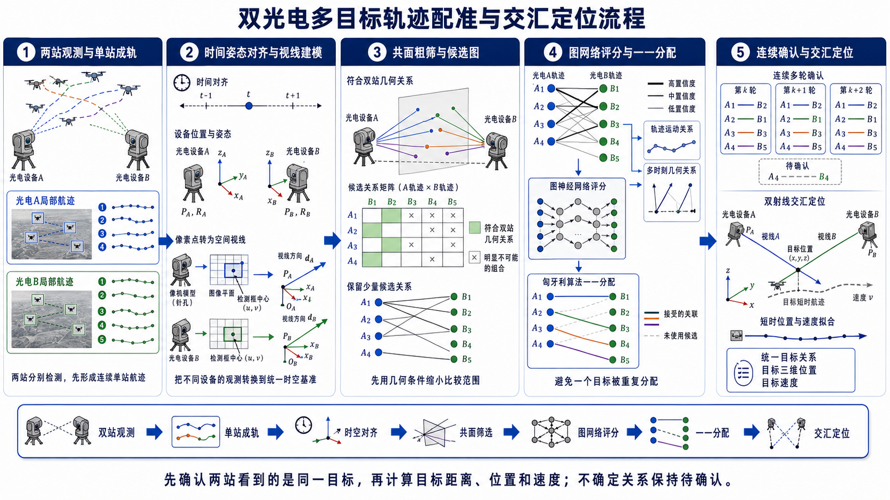
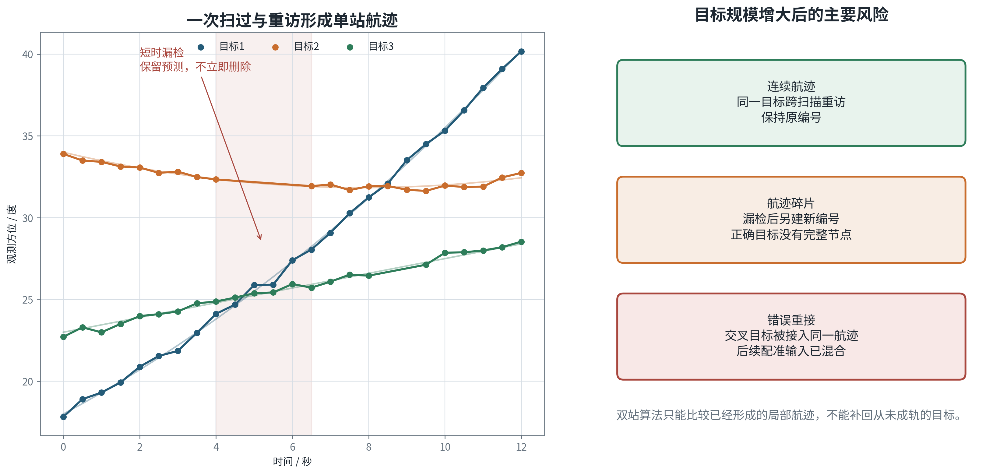
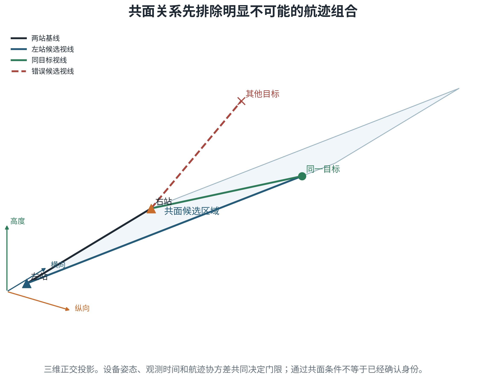
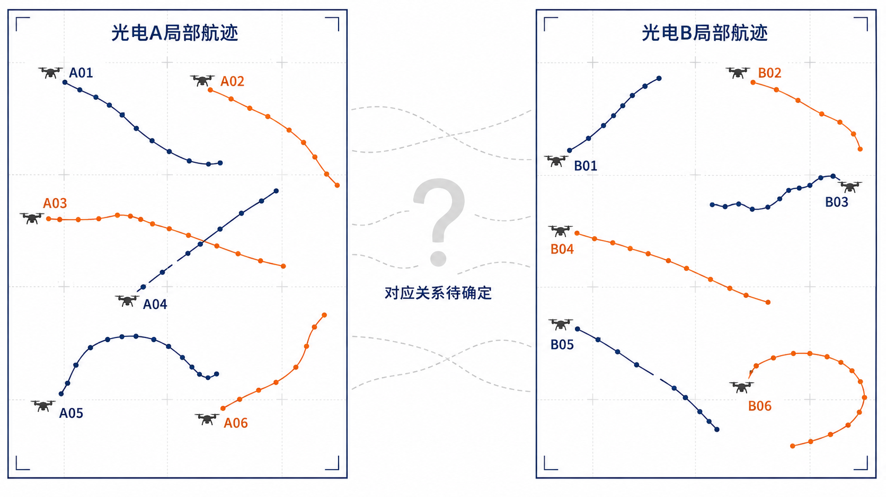
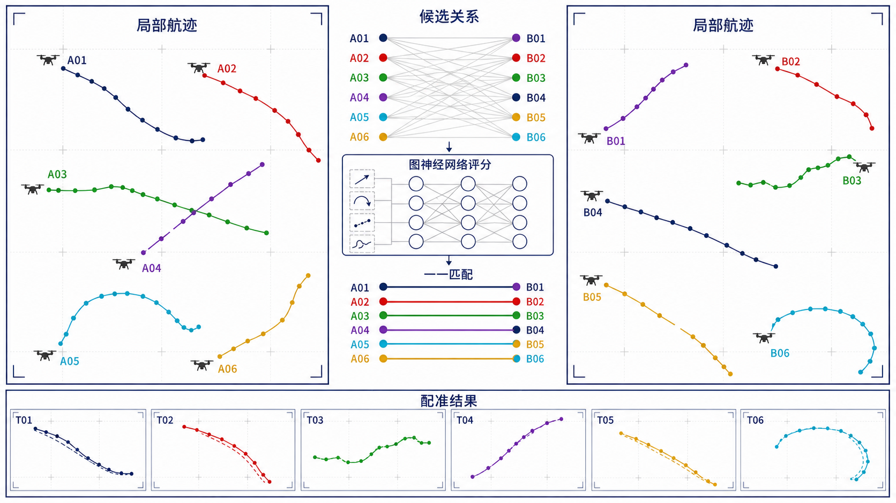
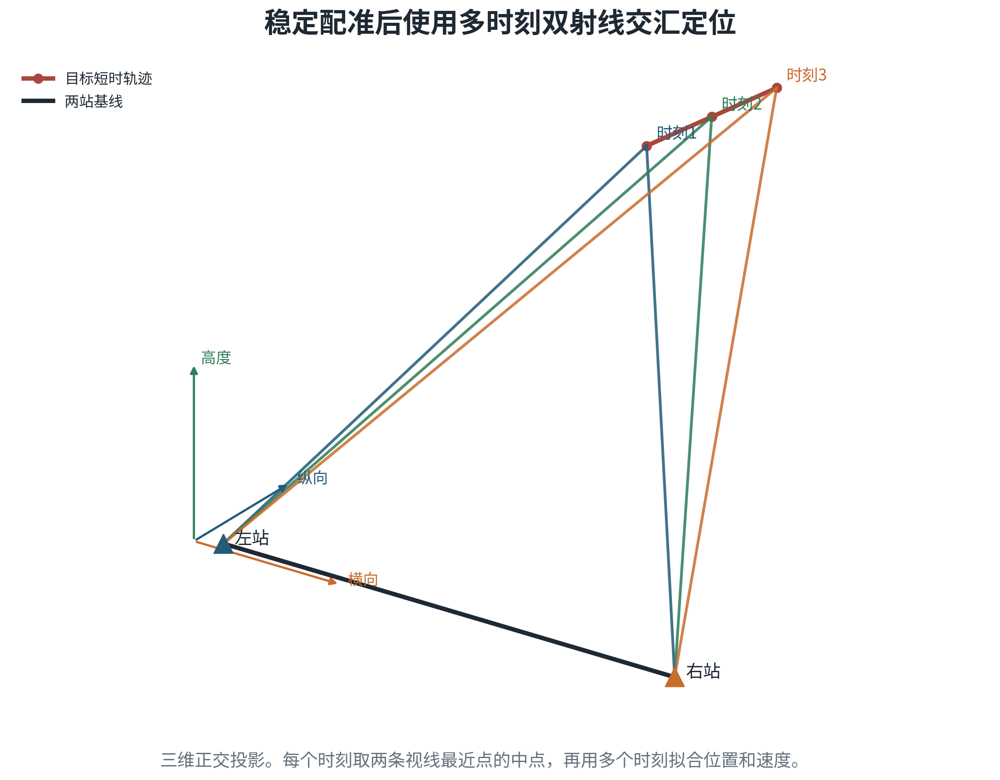
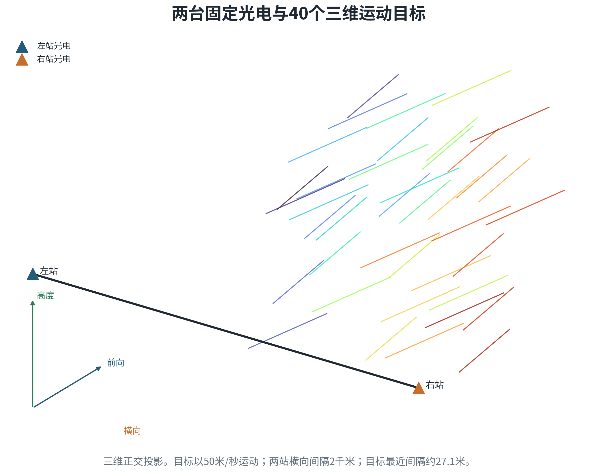
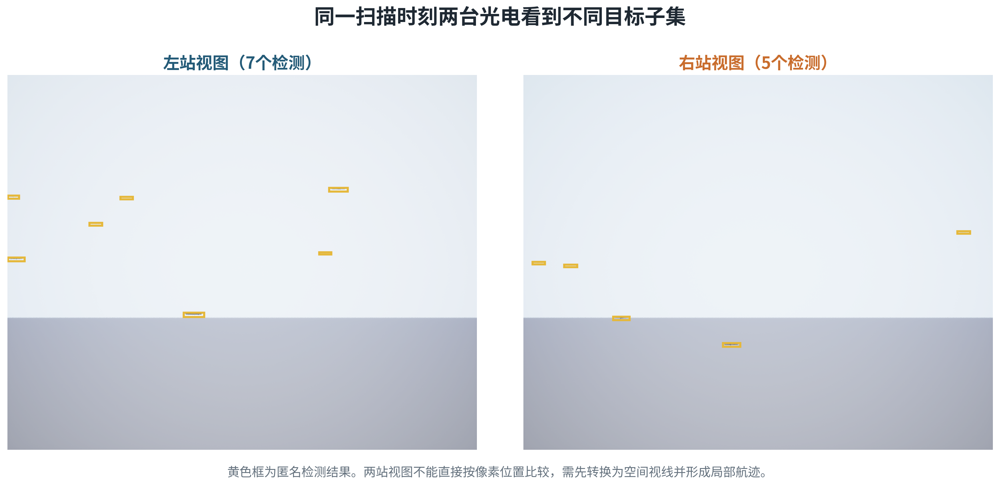
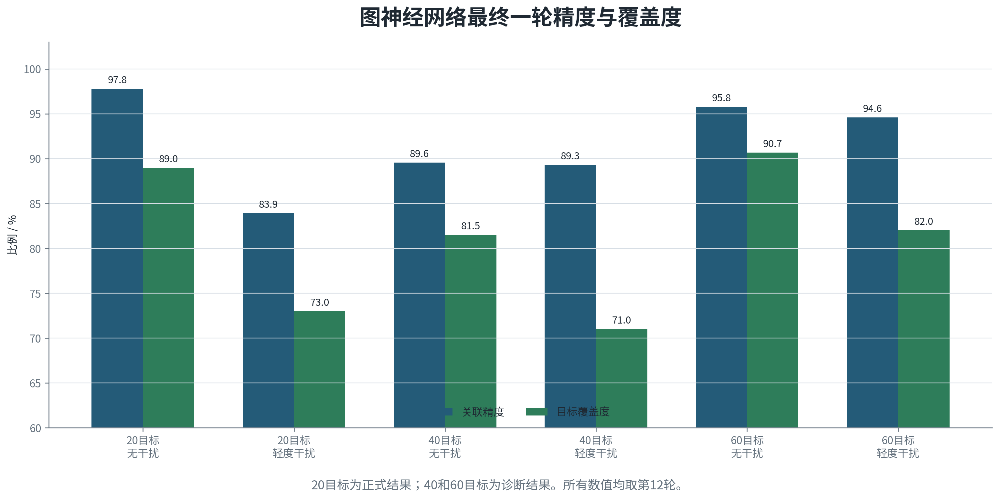

# 双光电多目标轨迹配准与交汇定位试验报告

本报告说明双光电形成单站航迹、建立双站对应关系并完成交汇定位的处理方法。试验结果先列出360度扫描且单站航迹完全正确时需要完成的验证矩阵，再分析360度实际单站航迹下的无干扰和轻、中、重度干扰，随后给出180度扫描结果，最后说明40目标理想条件下的交汇定位演示。各批数据的输入、随机场景和算法冻结状态不同，结果分别列示，不合并计算。

双光电配准在几何上可行，现有40目标理想演示也已贯通配准和交汇定位链路。20、40、60目标在360度扫描且单站关联完全正确条件下的三算法完整矩阵尚未试验，因此本报告不填写推算值。实际单站航迹进入链路后，断轨、错误重接和重复建轨会直接减少可供双站比较的正确对象。当前主要问题仍在单站航迹连续性，跨站评分和连续确认还存在少量独立损失。

## 一、算法原理

### 1.1 处理流程

两台光电分别处理图像，把同一目标在连续画面中的检测结果连成单站航迹，并输出观测时间、方位、俯仰、运动趋势和航迹质量。系统随后校正两站观测时刻和设备姿态，用共面关系排除明显不可能的航迹组合。候选关系再由几何方法、图神经网络或增强型图神经网络评分，经过一一分配和连续确认后形成双站对应关系。稳定关系进入双射线交汇定位。

配准和定位分两步完成。前一步判断两台光电看到的是否为同一目标，后一步计算该目标的位置和速度。错误配准会把两条不相关视线送入定位环节，因此系统先确认对应关系，再进行距离和位置解算。

### 1.2 单站航迹

窄视场光电扫描时，同一目标只在短时间内进入画面。一次扫过形成若干连续检测点，下一次重访还要判断新片段是否属于原目标。单站航迹器使用方位和俯仰变化、运动方向、时间间隔和预测误差完成连接。短时漏检时保留休眠航迹；目标交叉时暂时保留少量候选，等待后续观测消解。

单站成轨决定双站配准的输入质量。一个目标被拆成多条航迹，或两个目标被错误合成一条航迹，都会改变跨站算法实际处理的对象。双站评分可以拒绝部分错误关系，但无法恢复没有形成的正确局部航迹。

### 1.3 共面筛选

两台光电的位置和姿态已知时，每个检测框中心可由针孔相机模型转换为空间视线。对于同一时刻的同一目标，A站视线、B站视线和两站基线应近似位于同一平面。系统计算归一化共面性残差，并结合姿态误差、时间差和航迹预测不确定度设置门限。残差过大的组合直接剔除。

共面筛选用于缩小候选范围，不直接判定身份。目标密集、航迹交叉或设备存在小幅姿态误差时，多组航迹可能同时满足共面条件，还需比较一段时间内的运动一致性和候选竞争关系。

### 1.4 图神经网络与航迹级注意力

候选关系可表示为二部图。左侧节点为A站航迹，右侧节点为B站航迹，通过共面筛选的组合形成连线。节点记录方向、角速度、航迹年龄和不确定度；连线记录多时刻共面残差、同步后的运动差、交汇稳定性和历史确认状态。图神经网络在候选图上交换信息，比较一条关系与周边竞争关系的相对合理性。

本报告所称“增强型图神经网络”对应实验记录中的 `track_superglue` 路线。该路线借鉴SuperGlue的自注意力、交叉注意力和部分匹配思想，在两组航迹之间反复交换信息，再用归一化分配求出可匹配关系。它的输入是单站航迹及其几何和运动特征，不是原始图像关键点，也不是原始图像版SuperGlue。低分关系允许保持空匹配，最终仍由一一分配和连续确认约束输出。

### 1.5 几何方法和安全边界

几何方法把多时刻共面残差、运动方向差、角速度差和交汇稳定性按固定规则合成为代价，再执行匈牙利一一分配和时间确认。这条路线容易解释，适合候选较少和扫描规律稳定的情况，也可作为学习方法不可用时的回退。目标数量增加后，候选组合和多时刻拟合的计算量上升，固定权重和门限需要随扫描协议重新标定。

三条路线共用两道确定性边界。共面筛选阻止明显违反成像几何的关系进入评分，一一分配和连续确认阻止一条航迹被多个目标重复占用。学习算法负责比较复杂候选，几何条件负责限制物理上不合理的输出。

### 1.6 交汇定位

双站关系稳定后，系统在相邻时刻取出两台光电对同一目标的视线。理想情况下两条视线相交；存在离散采样和数值误差时，取两条视线最近点的中点作为位置。多个时刻的位置再进行短时运动拟合，得到位置、速度和残差。交会角过小、最近点距离过大或结果跳变时，定位结果保持待确认。

交汇角决定距离解算条件。两台设备与目标近似共线时，小幅角度误差会被放大为较大的距离误差。实际部署需要保证足够基线和侧向观察角，并把设备位置、姿态和时间同步误差纳入不确定度。本文40目标测距结果采用理想位姿和时间条件，只用于验证计算链路。

### 1.7 评价口径

| 指标 | 计算口径 | 说明 |
|---|---|---|
| 最后一圈或最后一轮关联精度 | 正确双站关系数除以全部已输出关系数 | 判断已输出关系中有多少正确 |
| 最后一圈或最后一轮目标覆盖度 | 正确配准目标数除以目标总数 | 判断全部目标中有多少完成正确配准 |
| 处理耗时P95 | 五个场景最后一圈或最后一轮端到端耗时的95%分位值 | 超时场景仍纳入耗时统计 |
| 证据状态 | 区分正式、诊断、超时、未开展和待测试 | 无记录不写成零值 |

180度扫描统计第12轮，360度周扫统计第6圈。每项可用结果合并5个测试场景，未输出和超时场景仍保留在覆盖度分母中。若五个场景均超时且没有确认关系，精度和覆盖度写“超时”，不写0。耗时只读取机器记录中的 `end_to_end_ms`，并在对应最终窗口内计算P95。没有机器记录的组合写“未记录”或“待测试”。真实身份只用于试验结束后的离线评分。

## 二、试验配置

### 2.1 360度扫描及理想单站条件

360度连续周扫的基础设置如下。理想单站条件要求每个真实目标在每台光电内各形成一条连续且身份正确的航迹，不出现断轨、错误重接和重复建轨。该条件只隔离检查双站配准，不代表实际单站航迹器已经达到完全正确。

| 项目 | 设置 |
|---|---|
| 光电数量与基线 | 2台固定光电，横向间隔2千米 |
| 图像分辨率 | 1280×1024 |
| 等效焦距 | 300毫米 |
| 水平视场角 | 2.93度 |
| 仿真等效垂直视场角 | 2.344度 |
| 目标尺寸与速度 | 长度3米，速度50米/秒 |
| 扫描方式 | 2秒连续旋转360度 |
| 场景时长 | 12秒，共6圈 |
| 目标规模 | 20、40、60 |
| 统计窗口 | 5个测试场景的第6圈 |
| 在线期限 | 每圈1000毫秒 |

20、40、60目标与三种算法的理想单站完整矩阵目前没有现成机器记录。本报告在结果表中保留九个待测试条目，不使用180度理想数据、实际航迹中的正确子集或40目标交汇演示回填。

### 2.2 360度实际单站航迹

实际航迹试验包含两批封存数据。第一批为20目标无干扰和轻度干扰，同一批匿名单站航迹分别输入几何方法、图神经网络和增强型图神经网络，用于比较评分方法。第二批为20、40、60目标的随机场景，完整保留了图神经网络结果；20目标还运行了几何方法，40和60目标没有运行几何方法，增强型图神经网络也没有进入该分规模批次。两批数据使用不同冻结版本，结果不能拼接。

每个场景运行12秒，共6圈。目标初始位置、前后间隔和交叉关系随种子变化，一半目标沿零度航向飞行，另一半沿负30度航向飞行。四档条件均保留0.4毫弧度固定云台偏差和0.3毫弧度逐帧随机抖动。

| 干扰条件 | 随机漏检率 | 每台每秒瞬时虚警 | 每台持续虚警 |
|---|---|---|---|
| 无干扰 | 0 | 0 | 0 |
| 轻度干扰 | 3% | 2个 | 0 |
| 中度干扰 | 7% | 4个 | 1个 |
| 重度干扰 | 12% | 8个 | 2个 |

### 2.3 180度扫描

180度试验把单程扫描时间缩短为1秒，机械往返周期仍为2秒。场景持续12秒，每秒形成一次双站关联结果。20、40和60目标分别使用8个训练种子、2个验证种子和5个保留测试种子，结果只取5个测试场景的第12轮。

| 项目 | 设置 |
|---|---|
| 光电数量与基线 | 2台固定光电，横向间隔2千米 |
| 目标尺寸与速度 | 长度3米，速度50米/秒 |
| 扫描方式 | 1秒单程180度，2秒机械往返 |
| 场景时长 | 12秒，共12轮 |
| 目标规模 | 20、40、60 |
| 固定姿态偏差 | 均方根0.4毫弧度 |
| 随机姿态抖动 | 均方根0.3毫弧度 |
| 轻度干扰 | 3%漏检，每台相机每秒2个虚警 |
| 在线期限 | 每轮1000毫秒 |

三条路线共享同一批匿名单站航迹和候选关系。20目标共享航迹器通过验收；40目标错误重接率超过门限，60目标同时存在错误重接率和航迹器耗时问题，因此40和60目标只作为诊断。

### 2.4 40目标交汇定位演示

交汇定位演示采用AirSim计算机视觉模式。两台光电横向间隔2千米，40个无人机网格目标在三维空间以50米/秒运动，目标之间最近间隔约27.1米。扫描范围为正负45度，0.5秒完成单程，1秒完成往返。检测使用仿真元数据，真实编号只用于离线核对。

该演示采用单个种子，设备位姿、时间同步和检测结果为理想条件，没有注入姿态误差、漏检和虚警。它用于确认“单站航迹、双站配准、交汇定位、速度拟合、离线评分”能够贯通，不能替代360度理想单站规模矩阵，也不能作为实际装备精度指标。

### 2.5 证据边界

三组关联试验只报告最后一圈或最后一轮的关联精度、目标覆盖度和端到端耗时P95。360度20目标三路线同输入对照是封存回放诊断；分规模批次中没有运行的算法写“未开展”。180度20目标结果使用通过验收的共享航迹器，40和60目标结果因航迹器未通过验收而标为诊断。不同目标规模采用不同随机场景和分别冻结的模型，不能据此推导目标数量与精度之间的单变量关系。

## 三、试验结果

### 3.1 360度理想单站条件

理想单站条件用于回答一个独立问题：单站航迹身份全部正确时，双站几何和关系评分能否在20、40、60目标下稳定完成配准。所需九个组合尚未形成完整试验记录，表中全部保留为待测试。

| 目标数 | 方法 | 最后一圈关联精度 | 最后一圈目标覆盖度 | 处理耗时P95 | 证据状态 |
|---|---|---|---|---|---|
| 20 | 几何方法 | 待测试 | 待测试 | 待测试 | 待测试；无机器记录 |
| 20 | 图神经网络 | 待测试 | 待测试 | 待测试 | 待测试；无机器记录 |
| 20 | 增强型图神经网络（航迹级注意力） | 待测试 | 待测试 | 待测试 | 待测试；无机器记录 |
| 40 | 几何方法 | 待测试 | 待测试 | 待测试 | 待测试；无机器记录 |
| 40 | 图神经网络 | 待测试 | 待测试 | 待测试 | 待测试；无机器记录 |
| 40 | 增强型图神经网络（航迹级注意力） | 待测试 | 待测试 | 待测试 | 待测试；无机器记录 |
| 60 | 几何方法 | 待测试 | 待测试 | 待测试 | 待测试；无机器记录 |
| 60 | 图神经网络 | 待测试 | 待测试 | 待测试 | 待测试；无机器记录 |
| 60 | 增强型图神经网络（航迹级注意力） | 待测试 | 待测试 | 待测试 | 待测试；无机器记录 |

“待测试”表示没有可引用的精度、覆盖度和耗时记录，不表示结果为0。共面约束、一一分配和双射线交汇给出了理论处理路径，40目标理想演示也形成36条正确关系，但该演示采用正负45度扫描、单个种子和独立处理链，不能证明上述360度规模矩阵已经完成验证。

### 3.2 360度实际单站航迹

#### 3.2.1 20目标三种方法同输入对照

本组使用同一批20目标匿名单站航迹和5个测试场景，分别运行三种方法。表中只统计第6圈。

| 方法 | 条件 | 最后一圈关联精度 | 最后一圈目标覆盖度 | 处理耗时P95 | 证据状态 |
|---|---|---|---|---|---|
| 几何方法 | 无干扰 | 98.8% | 85.0% | 867.9毫秒 | 封存回放（诊断） |
| 几何方法 | 轻度干扰 | 85.5% | 47.0% | 997.9毫秒 | 封存回放（诊断）；1/5超时 |
| 图神经网络 | 无干扰 | 91.5% | 75.0% | 75.2毫秒 | 封存回放（诊断） |
| 图神经网络 | 轻度干扰 | 77.2% | 61.0% | 88.5毫秒 | 封存回放（诊断） |
| 增强型图神经网络（航迹级注意力） | 无干扰 | 92.2% | 71.0% | 241.2毫秒 | 封存回放（诊断） |
| 增强型图神经网络（航迹级注意力） | 轻度干扰 | 89.0% | 65.0% | 288.5毫秒 | 封存回放（诊断） |

无干扰条件下，几何方法的精度和覆盖度最高，分别为98.8%和85.0%，端到端耗时P95为867.9毫秒。轻度干扰下，增强型图神经网络的精度和覆盖度最高，分别为89.0%和65.0%；图神经网络耗时最低，为88.5毫秒。几何方法在轻度干扰下有1个场景超过1000毫秒期限，表中保留该超时事实。

本组没有一种方法在两种条件下同时占优。几何方法适合干扰较轻、候选较少的场景；增强型图神经网络在本组轻度干扰下更稳；基础图神经网络处理速度更快。三者需要在相同输入和时限下继续对照，不能只依据一个干扰等级确定最终方案。

#### 3.2.2 20、40、60目标随机干扰

本组按目标规模分别冻结模型并使用5个随机测试场景。表中列出无干扰、轻度、中度和重度干扰的第6圈结果。未进入该批次的算法明确写“未开展”；已经运行但五个场景全部超时的组合写“超时”。

| 目标数 | 条件 | 方法 | 最后一圈关联精度 | 最后一圈目标覆盖度 | 处理耗时P95 | 证据状态 |
|---|---|---|---|---|---|---|
| 20 | 无干扰 | 几何方法 | 85.7% | 78.0% | 952.7毫秒 | 诊断 |
| 20 | 无干扰 | 图神经网络 | 84.0% | 63.0% | 78.3毫秒 | 诊断 |
| 20 | 无干扰 | 增强型图神经网络（航迹级注意力） | 未开展 | 未开展 | 未记录 | 未开展 |
| 20 | 轻度干扰 | 几何方法 | 超时 | 超时 | 1083.7毫秒 | 诊断；5/5超时 |
| 20 | 轻度干扰 | 图神经网络 | 82.2% | 60.0% | 96.7毫秒 | 诊断 |
| 20 | 轻度干扰 | 增强型图神经网络（航迹级注意力） | 未开展 | 未开展 | 未记录 | 未开展 |
| 20 | 中度干扰 | 几何方法 | 超时 | 超时 | 1373.4毫秒 | 诊断；5/5超时 |
| 20 | 中度干扰 | 图神经网络 | 76.6% | 49.0% | 121.8毫秒 | 诊断 |
| 20 | 中度干扰 | 增强型图神经网络（航迹级注意力） | 未开展 | 未开展 | 未记录 | 未开展 |
| 20 | 重度干扰 | 几何方法 | 超时 | 超时 | 1805.1毫秒 | 诊断；5/5超时 |
| 20 | 重度干扰 | 图神经网络 | 69.4% | 43.0% | 171.8毫秒 | 诊断 |
| 20 | 重度干扰 | 增强型图神经网络（航迹级注意力） | 未开展 | 未开展 | 未记录 | 未开展 |
| 40 | 无干扰 | 几何方法 | 未开展 | 未开展 | 未记录 | 未开展 |
| 40 | 无干扰 | 图神经网络 | 91.7% | 60.5% | 193.3毫秒 | 诊断 |
| 40 | 无干扰 | 增强型图神经网络（航迹级注意力） | 未开展 | 未开展 | 未记录 | 未开展 |
| 40 | 轻度干扰 | 几何方法 | 未开展 | 未开展 | 未记录 | 未开展 |
| 40 | 轻度干扰 | 图神经网络 | 80.0% | 50.0% | 204.2毫秒 | 诊断 |
| 40 | 轻度干扰 | 增强型图神经网络（航迹级注意力） | 未开展 | 未开展 | 未记录 | 未开展 |
| 40 | 中度干扰 | 几何方法 | 未开展 | 未开展 | 未记录 | 未开展 |
| 40 | 中度干扰 | 图神经网络 | 76.1% | 35.0% | 229.9毫秒 | 诊断 |
| 40 | 中度干扰 | 增强型图神经网络（航迹级注意力） | 未开展 | 未开展 | 未记录 | 未开展 |
| 40 | 重度干扰 | 几何方法 | 未开展 | 未开展 | 未记录 | 未开展 |
| 40 | 重度干扰 | 图神经网络 | 67.1% | 27.5% | 270.3毫秒 | 诊断 |
| 40 | 重度干扰 | 增强型图神经网络（航迹级注意力） | 未开展 | 未开展 | 未记录 | 未开展 |
| 60 | 无干扰 | 几何方法 | 未开展 | 未开展 | 未记录 | 未开展 |
| 60 | 无干扰 | 图神经网络 | 94.3% | 55.0% | 305.2毫秒 | 诊断 |
| 60 | 无干扰 | 增强型图神经网络（航迹级注意力） | 未开展 | 未开展 | 未记录 | 未开展 |
| 60 | 轻度干扰 | 几何方法 | 未开展 | 未开展 | 未记录 | 未开展 |
| 60 | 轻度干扰 | 图神经网络 | 77.3% | 39.7% | 337.6毫秒 | 诊断 |
| 60 | 轻度干扰 | 增强型图神经网络（航迹级注意力） | 未开展 | 未开展 | 未记录 | 未开展 |
| 60 | 中度干扰 | 几何方法 | 未开展 | 未开展 | 未记录 | 未开展 |
| 60 | 中度干扰 | 图神经网络 | 77.6% | 40.3% | 366.2毫秒 | 诊断 |
| 60 | 中度干扰 | 增强型图神经网络（航迹级注意力） | 未开展 | 未开展 | 未记录 | 未开展 |
| 60 | 重度干扰 | 几何方法 | 未开展 | 未开展 | 未记录 | 未开展 |
| 60 | 重度干扰 | 图神经网络 | 72.3% | 28.7% | 403.9毫秒 | 诊断 |
| 60 | 重度干扰 | 增强型图神经网络（航迹级注意力） | 未开展 | 未开展 | 未记录 | 未开展 |

图神经网络是该批次唯一覆盖20、40和60目标四档条件的方法。无干扰时，20、40、60目标的覆盖度分别为63.0%、60.5%和55.0%；重度干扰时分别降至43.0%、27.5%和28.7%。目标数量和干扰增加后，端到端耗时P95从20目标无干扰的78.3毫秒增加到60目标重度干扰的403.9毫秒，仍低于本批次1000毫秒期限。

故障记录显示，目标交叉、姿态抖动、漏检和虚警先造成单站断轨、错误重接和重复建轨，随后才表现为双站精度和覆盖度下降。两站没有形成对应的正确局部航迹时，跨站图网络无法从后端补回。个别场景在单站航迹基本完整时仍出现双站覆盖损失，说明跨站评分和连续确认也需要单独校准。

### 3.3 180度扫描

180度扫描每秒形成一次关联结果，重访频率高于2秒周扫360度。每个规模和条件使用5个测试场景，表中只统计第12轮。

| 目标数 | 条件 | 方法 | 最后一轮关联精度 | 最后一轮目标覆盖度 | 处理耗时P95 | 证据状态 |
|---|---|---|---|---|---|---|
| 20 | 无干扰 | 几何方法 | 超时 | 超时 | 2067.5毫秒 | 正式；5/5超时 |
| 20 | 无干扰 | 图神经网络 | 97.8% | 89.0% | 100.4毫秒 | 正式 |
| 20 | 无干扰 | 增强型图神经网络（航迹级注意力） | 88.5% | 77.0% | 379.9毫秒 | 正式 |
| 20 | 轻度干扰 | 几何方法 | 超时 | 超时 | 1950.6毫秒 | 正式；5/5超时 |
| 20 | 轻度干扰 | 图神经网络 | 83.9% | 73.0% | 108.8毫秒 | 正式 |
| 20 | 轻度干扰 | 增强型图神经网络（航迹级注意力） | 88.8% | 79.0% | 401.3毫秒 | 正式 |
| 40 | 无干扰 | 几何方法 | 超时 | 超时 | 5174.2毫秒 | 诊断；5/5超时 |
| 40 | 无干扰 | 图神经网络 | 89.6% | 81.5% | 292.3毫秒 | 诊断 |
| 40 | 无干扰 | 增强型图神经网络（航迹级注意力） | 77.5% | 58.5% | 972.7毫秒 | 诊断 |
| 40 | 轻度干扰 | 几何方法 | 超时 | 超时 | 5022.3毫秒 | 诊断；5/5超时 |
| 40 | 轻度干扰 | 图神经网络 | 89.3% | 71.0% | 270.2毫秒 | 诊断 |
| 40 | 轻度干扰 | 增强型图神经网络（航迹级注意力） | 79.1% | 58.5% | 955.0毫秒 | 诊断 |
| 60 | 无干扰 | 几何方法 | 超时 | 超时 | 9257.9毫秒 | 诊断；5/5超时 |
| 60 | 无干扰 | 图神经网络 | 95.8% | 90.7% | 509.5毫秒 | 诊断 |
| 60 | 无干扰 | 增强型图神经网络（航迹级注意力） | 超时 | 超时 | 1683.9毫秒 | 诊断；5/5超时 |
| 60 | 轻度干扰 | 几何方法 | 超时 | 超时 | 9063.3毫秒 | 诊断；5/5超时 |
| 60 | 轻度干扰 | 图神经网络 | 94.6% | 82.0% | 504.9毫秒 | 诊断 |
| 60 | 轻度干扰 | 增强型图神经网络（航迹级注意力） | 超时 | 超时 | 1686.2毫秒 | 诊断；5/5超时 |

图神经网络在六组场景均按时形成结果，精度为83.9%至97.8%，覆盖度为71.0%至90.7%，耗时P95为100.4至509.5毫秒。几何方法六组均超过1000毫秒期限。增强型图神经网络在20和40目标形成结果，60目标五个场景全部超时。

20目标轻度干扰下，180度图神经网络的最后一轮精度和覆盖度为83.9%和73.0%；360度同输入诊断批次相应数值为77.2%和61.0%。现有对照支持“提高重访频率有利于维持关联”的判断，但两组数据并非同一随机种子、同一冻结模型的严格消融试验，不能把差值全部归因于扫描范围变化。40和60目标180度结果还受单站航迹器未通过验收的限制。

60目标无干扰精度高于40目标，主要由不同随机场景造成。40目标有一个困难场景贡献了该规模第12轮19个错误关系中的12个；去除该场景后，其余4个场景合并精度为95.3%，与60目标95.8%接近。现有数据不支持“目标越多，关联越准”的结论。

### 3.4 交汇定位结果

40目标理想演示形成37条双站关系，其中36条正确、1条错误。正确关系进入交汇定位后，平均位置误差为0.080米，95%位置误差不超过0.091米；平均速度误差为0.0081米/秒，95%速度误差不超过0.0197米/秒。

| 项目 | 结果 |
|---|---|
| 正确关系 | 36条 |
| 错误关系 | 1条 |
| 双站关联精度 | 97.3% |
| 固定目标覆盖度 | 90.0% |
| 平均位置误差 | 0.080米 |
| 95%位置误差 | 0.091米 |
| 平均速度误差 | 0.0081米/秒 |
| 95%速度误差 | 0.0197米/秒 |

上述误差来自理想位姿、理想时间和仿真检测条件，主要反映计算链路的一致性。真实系统还需加入安装测量误差、云台偏差、时间同步误差、检测中心偏差和大气条件。完成这些误差标定前，不能把厘米级仿真结果写成设备定位能力。

### 3.5 结论

1. **双光电配准具有明确的理论处理路径，完整规模矩阵仍待试验。** 共面筛选、候选评分、一一分配和交汇定位构成闭合链路，40目标理想演示完成了单个场景验证。360度理想单站条件下20、40、60目标的三算法矩阵没有现成记录，当前不能给出规模结论和耗时结论。

2. **实际360度试验表明三种方法各有边界。** 20目标同输入对照中，几何方法在无干扰条件下数值最高，增强型图神经网络在轻度干扰下数值最高，基础图神经网络耗时最低。分规模随机干扰批次只有图神经网络形成20、40、60目标的完整结果，其他组合按实际情况标为超时或未开展。

3. **提高重访频率能够改善现有图神经网络结果，但仍需严格同条件复核。** 180度扫描在现有20目标轻度干扰对照中比360度周扫取得更高精度和覆盖度。两批数据不是同种子的单变量试验，后续仍需使用相同场景、相同模型和相同干扰条件完成扫描频率消融。

4. **当前主要卡点是单站航迹关联。** 40目标航迹器未通过错误重接率门限，60目标还存在航迹器耗时问题。360度随机干扰下，断轨、错误重接和重复建轨先减少正确航迹，双站算法只能处理剩余候选。下一步应先稳定单站重访航迹，再补齐360度理想矩阵和跨站困难场景标定。
