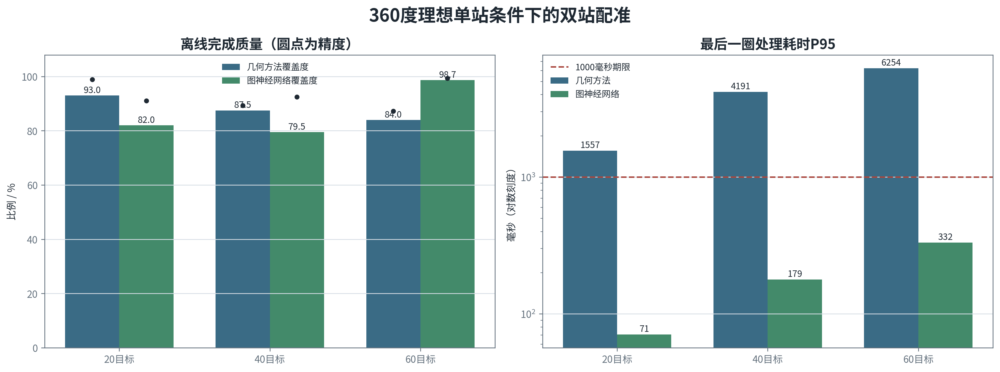
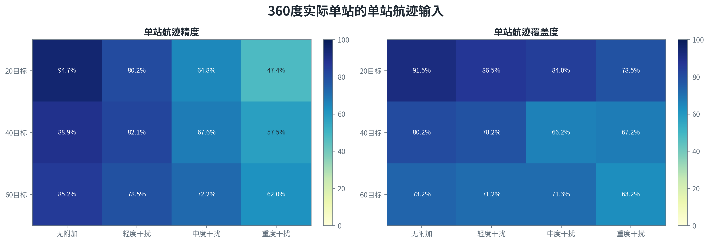
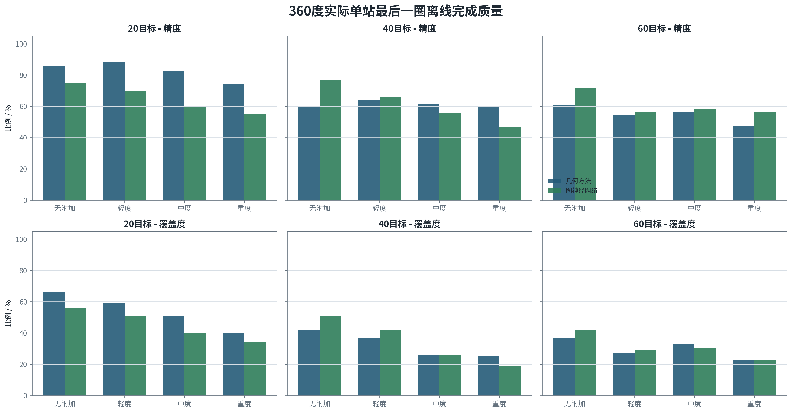
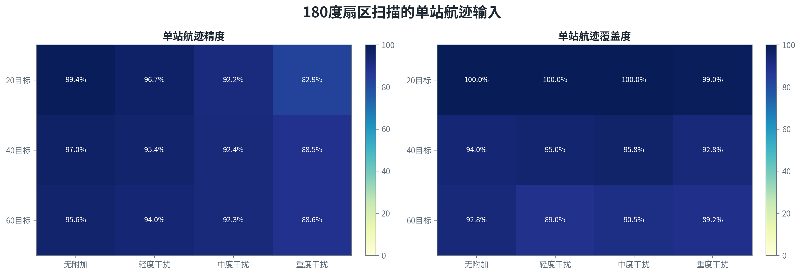
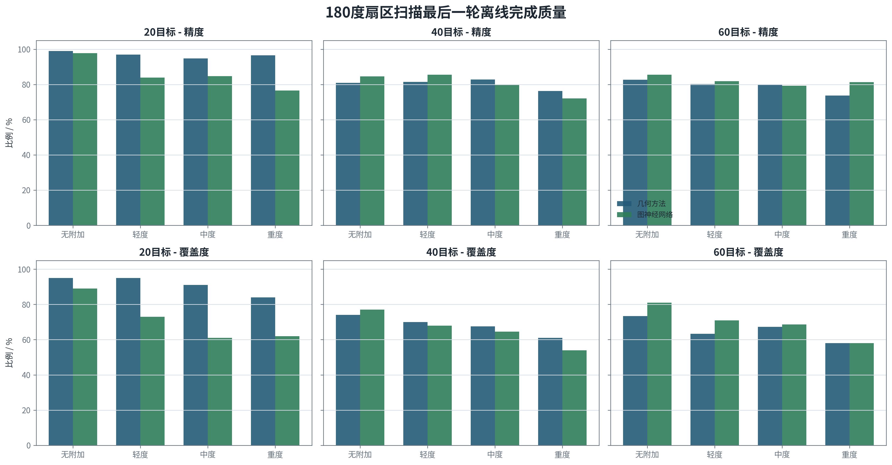
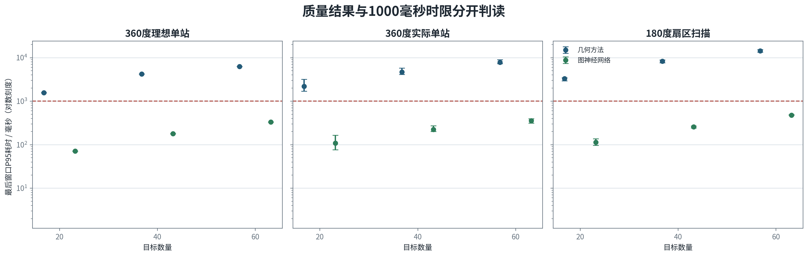
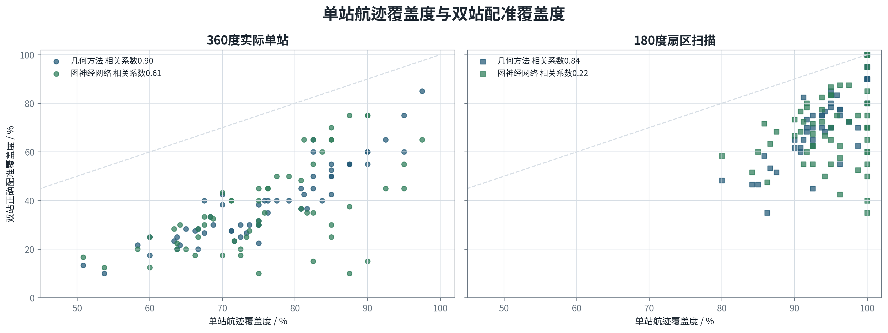

# 双光电多目标轨迹配准与交汇定位试验报告

本报告说明两台周扫光电如何把各自形成的局部航迹配成同一目标，并在关系稳定后进行交汇定位。核心结论有两点。第一，双站配准在理想单站输入下可以工作，60目标图神经网络最后一圈达到99.3%的关系精度和98.7%的目标覆盖度。第二，实际链路的主要损失发生在单站成轨阶段；航迹断裂、错误重接和重复建轨先减少了可供双站比较的正确对象。

本次结果全部来自`report_replay_20260819_v2`确定性离线复算。矩阵包括360度理想单站6组、360度实际单站24组和180度扫描24组，每组5个测试场景。报告只统计最后一圈或最后一轮，不合并前期过渡数据。算法质量和1000毫秒处理时限分别列示，超时结果保留离线质量，但按时覆盖度记为0。

## 一、算法原理

### 1.1 处理流程

两台光电先分别完成检测和单站成轨。系统按照图像拍摄时刻校正设备位置、安装关系和云台姿态，把检测框中心转换为空间视线。随后用双站共面关系缩小候选范围，再由几何方法或图神经网络比较多时刻运动是否一致。候选评分完成后执行一一分配，同一条航迹不能重复分给多个对象。关系连续稳定后，双站视线进入交汇定位。

配准和定位是前后两步。配准回答“两台光电看到的是否为同一目标”，定位回答“这个目标在哪里、向哪里运动”。配准关系不稳定时不输出定位结果，避免把两条不相关视线强行交会。

### 1.2 单站航迹

窄视场周扫时，目标每圈只在短时间内进入画面。连续检测先合并成一次扫描片段，下一圈重访时再根据方位、俯仰、角速度、时间间隔和预测误差恢复原航迹。短时漏检期间保留滑行或休眠状态；目标交叉且关系不清时，局部保留少量候选，等待后续观测消解。

单站阶段一旦把一个目标拆成多条航迹，双站算法面对的就不再是一目标一航迹。若两目标被错误接成一条航迹，后续多时刻几何关系也会被污染。双站算法可以拒绝部分错误关系，无法恢复已经丢失的正确航迹。

### 1.3 共面筛选

相机内参、设备位置和拍摄时刻姿态已知时，检测框中心可以转换为空间单位视线。同一时刻指向同一目标的两条视线与两站基线应近似处于同一平面。系统计算归一化共面残差，并按时间差、姿态误差和航迹协方差调整门限。明显不符合双站几何关系的组合直接剔除。

共面筛选只负责缩小比较范围。目标密集、运动方向接近时，多组航迹可能同时满足门限，还要继续比较多圈运动和周边竞争关系。

### 1.4 图神经网络配准

候选关系组成一个两侧航迹图。左侧节点是A站航迹，右侧节点是B站航迹，通过共面筛选的组合形成连线。节点保存方向、角速度、航迹年龄和不确定度；连线保存多时刻共面残差、时间差、运动一致性和交汇稳定性。图神经网络同时查看一条候选及其周边竞争候选，输出关系分数。

图神经网络不直接发布身份。关系分数进入带空缺项的一一分配，低可信候选可以保持未匹配。输出还要经过连续多圈确认。共面门限、一一约束和连续确认均保持为确定性边界。

### 1.5 几何方法

几何方法把多时刻共面残差、运动方向差、角速度差和交汇稳定性按冻结权重形成总代价，再使用匈牙利算法求一一对应关系。该方法容易解释，也可作为学习方法不可用时的对照路线。本轮复算没有按测试结果重新调整门限。

几何方法和图神经网络使用同一批匿名单站航迹。两者的差别位于候选关系评分，前面的单站成轨和共面筛选保持一致。因此，两条路线出现相同的单站精度和单站覆盖度是预期结果。

### 1.6 交汇定位

双站关系确认后，系统把相邻时刻的两条视线配对。存在离散采样和小幅误差时，两条视线通常不严格相交，取最近点连线的中点作为位置。多个时刻的位置再进行短时运动拟合，得到速度和拟合残差。交会角过小、最近点距离过大或结果跳变时，定位结果保持待确认。

## 二、试验配置

### 2.1 场景与设备

| 项目 | 设置 |
|---|---|
| 光电布置 | 两台固定光电，横向基线2千米，高度均为100米 |
| 相机 | 1280×1024，等效焦距300毫米，水平视场2.93度，垂直视场约2.344度 |
| 角分辨率 | 标称0.05毫弧度，按图像尺寸折算约0.03995毫弧度/像素 |
| 采样与仿真速度 | 检测和云台记录100赫兹，AirSim ClockSpeed为0.1 |
| 目标 | 20、40、60个长度3米的无人机网格Actor，速度50米/秒 |
| 运动方向 | 每个场景一半沿0度方向，一半沿负30度方向；初始前后位置和交叉关系随seed变化 |
| 360度扫描 | 2秒连续周扫一圈，12秒共6圈，第6圈计入汇总 |
| 180度扫描 | 1秒单程扫过180度，2秒完成往返，12秒形成12轮，第12轮计入汇总 |
| 云台误差 | 两种扫描均保留0.4毫弧度固定偏差和0.3毫弧度逐帧随机抖动 |
| 测试数量 | 每个目标规模、干扰等级和方法均为5个测试seed |

目标并非排成规则矩形。不同seed改变目标的前后间隔和横向位置，两类航向在观察区内形成平移、接近和局部交叉。该设置用于检查多方向目标同时出现时的成轨与配准，不把规则队形作为算法先验。

仿真检测采用AirSim检测函数输出匿名框。图中只展示检测框位置和两站同一时刻看到的目标子集，不把Actor名称送入在线配准。两站视场不同，不能直接按图像左右位置对应，必须先转换为空间视线并形成局部航迹。

### 2.2 干扰设置

| 等级 | 随机漏检率 | 每台每秒瞬时虚警 | 每台持续虚假航迹 |
|---|---|---|---|
| 无附加漏检虚警 | 0 | 0 | 0 |
| 轻度干扰 | 3% | 2个 | 0 |
| 中度干扰 | 7% | 4个 | 1条 |
| 重度干扰 | 12% | 8个 | 2条 |

四档条件均保留相同的云台固定偏差和随机抖动。“无附加漏检虚警”只表示没有额外注入漏检和虚警，不代表无云台误差。180度中、重度条件由封存匿名观测按照固定策略确定性生成，属于离线干扰复算，不是AirSim重新运行。

### 2.3 评价口径

| 指标 | 计算方法 | 用途 |
|---|---|---|
| 单站精度 | 两站各航迹的主导真实观测数÷全部有标签观测数 | 判断局部航迹是否混入其他目标或虚警 |
| 单站覆盖度 | 身份正确的单站航迹数÷两站目标机会总数 | 判断每个真实目标是否在两站形成可用局部航迹 |
| 质量精度 | 正确双站关系数÷全部已输出双站关系数 | 评价离线完成结果中有多少关系正确 |
| 质量覆盖度 | 正确配准目标数÷目标总数 | 评价离线完成结果覆盖了多少目标 |
| 按时覆盖度 | 1000毫秒内正确配准目标数÷目标总数 | 评价处理时限内可用的目标比例 |
| 处理耗时P95 | 5个seed最后窗口耗时的最近秩95%分位 | 检查1000毫秒期限 |

360度只统计第6圈，180度只统计第12轮。单站结果按目标数量和干扰等级统计，与后续使用哪种跨站评分方法无关。超过1000毫秒后形成的关系仍用于分析算法质量，但不计入按时覆盖度。真实身份只在离线评分和理想单站诊断中使用，在线算法输入不含真实身份。

## 三、试验结果

### 3.1 360度理想单站条件

理想单站诊断按离线真实身份把每个目标在每台光电的观测归成一条航迹，单站精度和覆盖度均为100%。旧记录在扫描边界可能把同一目标同一圈分成两个短片段，复算只保留真实观测数最多的主片段，并记录舍弃数量；没有补造检测、位置或视线。该组用于隔离检查双站算法，不代表实际单站航迹器已经达到完全正确。

| 目标数 | 方法 | 质量精度 | 质量覆盖度 | 按时覆盖度 | 处理耗时P95 | 超时数 |
|---|---|---|---|---|---|---|
| 20 | 几何方法 | 98.9% | 93.0% | 0.0% | 1557.4毫秒 | 5/5 |
| 20 | 图神经网络 | 91.1% | 82.0% | 82.0% | 70.9毫秒 | 0/5 |
| 40 | 几何方法 | 89.3% | 87.5% | 0.0% | 4190.8毫秒 | 5/5 |
| 40 | 图神经网络 | 92.4% | 79.5% | 79.5% | 178.8毫秒 | 0/5 |
| 60 | 几何方法 | 87.2% | 84.0% | 0.0% | 6253.9毫秒 | 5/5 |
| 60 | 图神经网络 | 99.3% | 98.7% | 98.7% | 332.0毫秒 | 0/5 |

六组都形成了有效双站关系，说明共面筛选、候选评分、一一分配和连续确认在20至60目标范围内可以贯通。两种方法没有在全部规模上形成一致的质量排序：20目标几何方法覆盖度93.0%，高于图神经网络的82.0%；40目标分别为87.5%和79.5%；60目标图神经网络达到98.7%，高于几何方法的84.0%。

时效差异较明确。几何方法六组中的每个seed都超过1000毫秒，因此按时覆盖度为0；图神经网络六组全部按时，P95为70.9至332.0毫秒。几何方法的质量精度和质量覆盖度是超时后离线完成值，不能解释为按时在线能力。

### 3.2 360度实际单站航迹

#### 3.2.1 试验口径

实际单站复算直接使用封存的匿名局部航迹，不根据离线真实身份修复断轨、错误重接或重复建轨。20、40、60目标分别运行四档干扰和两种跨站方法，共24组，每组5个seed。两种方法读取同一单站输入。20目标沿用本规模冻结配置；40和60目标的几何方法使用既有跨规模冻结参数，属于离线诊断，不代表该参数已经完成本规模标定。

#### 3.2.2 单站航迹结果

| 目标数 | 干扰条件 | 单站精度 | 单站覆盖度 | 重复航迹 | 混合航迹 | 缺失身份机会 |
|---|---|---|---|---|---|---|
| 20 | 无附加漏检虚警 | 94.7% | 91.5% | 4 | 38 | 17 |
| 20 | 轻度干扰 | 80.2% | 86.5% | 2 | 52 | 27 |
| 20 | 中度干扰 | 64.8% | 84.0% | 1 | 72 | 32 |
| 20 | 重度干扰 | 47.4% | 78.5% | 2 | 89 | 43 |
| 40 | 无附加漏检虚警 | 88.9% | 80.2% | 5 | 137 | 79 |
| 40 | 轻度干扰 | 82.1% | 78.2% | 5 | 156 | 87 |
| 40 | 中度干扰 | 67.6% | 66.2% | 3 | 213 | 135 |
| 40 | 重度干扰 | 57.5% | 67.2% | 3 | 219 | 131 |
| 60 | 无附加漏检虚警 | 85.2% | 73.2% | 4 | 249 | 161 |
| 60 | 轻度干扰 | 78.5% | 71.2% | 1 | 278 | 173 |
| 60 | 中度干扰 | 72.2% | 71.3% | 2 | 276 | 172 |
| 60 | 重度干扰 | 62.0% | 63.2% | 3 | 338 | 221 |

目标数量和干扰增加后，单站覆盖度整体下降。无附加漏检虚警时，覆盖度从20目标的91.5%降至40目标的80.2%和60目标的73.2%。重度干扰下分别为78.5%、67.2%和63.2%。混合航迹和缺失身份机会随规模增加，说明主要损失已经在跨站评分前发生。

“重复航迹”只统计同一相机内一个真实目标同时对应多条合格局部航迹的超出部分。“混合航迹”表示一条局部航迹内没有达到85%主导身份纯度。“缺失身份机会”表示在两站目标机会总数中没有形成合格局部航迹的数量。表中数量为5个seed最后一圈的合计。

#### 3.2.3 双站配准结果

| 目标数 | 干扰条件 | 方法 | 质量精度 | 质量覆盖度 | 按时覆盖度 | 处理耗时P95 | 超时数 |
|---|---|---|---|---|---|---|---|
| 20 | 无附加漏检虚警 | 几何方法 | 85.7% | 66.0% | 0.0% | 1702.2毫秒 | 5/5 |
| 20 | 无附加漏检虚警 | 图神经网络 | 74.7% | 56.0% | 56.0% | 76.6毫秒 | 0/5 |
| 20 | 轻度干扰 | 几何方法 | 88.1% | 59.0% | 0.0% | 1983.1毫秒 | 5/5 |
| 20 | 轻度干扰 | 图神经网络 | 69.9% | 51.0% | 51.0% | 94.2毫秒 | 0/5 |
| 20 | 中度干扰 | 几何方法 | 82.3% | 51.0% | 0.0% | 2421.2毫秒 | 5/5 |
| 20 | 中度干扰 | 图神经网络 | 59.7% | 40.0% | 40.0% | 121.4毫秒 | 0/5 |
| 20 | 重度干扰 | 几何方法 | 74.1% | 40.0% | 0.0% | 3162.8毫秒 | 5/5 |
| 20 | 重度干扰 | 图神经网络 | 54.8% | 34.0% | 34.0% | 165.8毫秒 | 0/5 |
| 40 | 无附加漏检虚警 | 几何方法 | 59.7% | 41.5% | 0.0% | 4111.0毫秒 | 5/5 |
| 40 | 无附加漏检虚警 | 图神经网络 | 76.5% | 50.5% | 50.5% | 199.8毫秒 | 0/5 |
| 40 | 轻度干扰 | 几何方法 | 64.3% | 37.0% | 0.0% | 4358.2毫秒 | 5/5 |
| 40 | 轻度干扰 | 图神经网络 | 65.6% | 42.0% | 42.0% | 211.3毫秒 | 0/5 |
| 40 | 中度干扰 | 几何方法 | 61.2% | 26.0% | 0.0% | 4971.4毫秒 | 5/5 |
| 40 | 中度干扰 | 图神经网络 | 55.9% | 26.0% | 26.0% | 234.6毫秒 | 0/5 |
| 40 | 重度干扰 | 几何方法 | 60.2% | 25.0% | 0.0% | 5775.8毫秒 | 5/5 |
| 40 | 重度干扰 | 图神经网络 | 46.9% | 19.0% | 19.0% | 270.6毫秒 | 0/5 |
| 60 | 无附加漏检虚警 | 几何方法 | 61.1% | 36.7% | 0.0% | 7269.4毫秒 | 5/5 |
| 60 | 无附加漏检虚警 | 图神经网络 | 71.4% | 41.7% | 41.7% | 312.1毫秒 | 0/5 |
| 60 | 轻度干扰 | 几何方法 | 54.3% | 27.3% | 0.0% | 7564.8毫秒 | 5/5 |
| 60 | 轻度干扰 | 图神经网络 | 56.4% | 29.3% | 29.3% | 354.1毫秒 | 0/5 |
| 60 | 中度干扰 | 几何方法 | 56.6% | 33.0% | 0.0% | 8080.1毫秒 | 5/5 |
| 60 | 中度干扰 | 图神经网络 | 58.3% | 30.3% | 30.3% | 360.4毫秒 | 0/5 |
| 60 | 重度干扰 | 几何方法 | 47.6% | 22.7% | 0.0% | 8932.2毫秒 | 5/5 |
| 60 | 重度干扰 | 图神经网络 | 56.3% | 22.3% | 22.3% | 395.6毫秒 | 0/5 |

几何方法在24组实际复算中的12组全部超过1000毫秒，图神经网络12组全部按时。离线完成质量没有出现单一方法全面占优。20目标四档条件下，几何方法的质量覆盖度均高于图神经网络；40目标无附加、轻度条件下图神经网络较高，中度相同，重度条件几何方法较高；60目标两种方法随干扰等级交替占优。

理想单站与实际单站的同规模无附加漏检虚警对照为：20目标几何方法由93.0%降至66.0%；20目标图神经网络由82.0%降至56.0%；40目标几何方法由87.5%降至41.5%；40目标图神经网络由79.5%降至50.5%；60目标几何方法由84.0%降至36.7%；60目标图神经网络由98.7%降至41.7%。这组差值没有改变跨站模型和目标总数，主要变化是局部航迹从一目标一航迹变为实际断轨、混合和缺失状态。

按60个最终案例计算，单站覆盖度与双站覆盖度的相关系数为：几何方法0.903，图神经网络0.613。几何路线受前级覆盖限制更直接；图神经网络还存在候选评分和连续确认造成的独立损失。两条路线都不能恢复前级没有形成的正确航迹。

### 3.3 180度扫描

180度方案把目标来袭扇区作为已知范围，云台1秒扫过180度后反向返回。12秒内形成12个关联轮次，最后统计第12轮。无附加和轻度条件来自封存观测；中度和重度在同一匿名观测上按固定漏检、虚警策略进行离线干扰复算。

#### 3.3.1 单站航迹结果

| 目标数 | 干扰条件 | 单站精度 | 单站覆盖度 | 重复航迹 | 混合航迹 | 缺失身份机会 |
|---|---|---|---|---|---|---|
| 20 | 无附加漏检虚警 | 99.4% | 100.0% | 0 | 0 | 0 |
| 20 | 轻度干扰 | 96.7% | 100.0% | 0 | 12 | 0 |
| 20 | 中度干扰 | 92.2% | 100.0% | 0 | 11 | 0 |
| 20 | 重度干扰 | 82.9% | 99.0% | 0 | 35 | 2 |
| 40 | 无附加漏检虚警 | 97.0% | 94.0% | 0 | 23 | 24 |
| 40 | 轻度干扰 | 95.4% | 95.0% | 0 | 28 | 20 |
| 40 | 中度干扰 | 92.4% | 95.8% | 0 | 34 | 17 |
| 40 | 重度干扰 | 88.5% | 92.8% | 0 | 50 | 29 |
| 60 | 无附加漏检虚警 | 95.6% | 92.8% | 0 | 48 | 43 |
| 60 | 轻度干扰 | 94.0% | 89.0% | 1 | 83 | 66 |
| 60 | 中度干扰 | 92.3% | 90.5% | 1 | 78 | 57 |
| 60 | 重度干扰 | 88.6% | 89.2% | 1 | 109 | 65 |

180度扫描提高了目标方向的重访频率。20目标四档条件的单站覆盖度为99.0%至100.0%；40目标为92.8%至95.8%；60目标为89.0%至92.8%。与360度实际单站相比，覆盖度明显提高，但40和60目标仍存在混合航迹和缺失身份机会。

#### 3.3.2 双站配准结果

| 目标数 | 干扰条件 | 方法 | 质量精度 | 质量覆盖度 | 按时覆盖度 | 处理耗时P95 | 超时数 |
|---|---|---|---|---|---|---|---|
| 20 | 无附加漏检虚警 | 几何方法 | 99.0% | 95.0% | 0.0% | 3446.6毫秒 | 5/5 |
| 20 | 无附加漏检虚警 | 图神经网络 | 97.8% | 89.0% | 89.0% | 136.2毫秒 | 0/5 |
| 20 | 轻度干扰 | 几何方法 | 96.9% | 95.0% | 0.0% | 3248.3毫秒 | 5/5 |
| 20 | 轻度干扰 | 图神经网络 | 83.9% | 73.0% | 73.0% | 96.9毫秒 | 0/5 |
| 20 | 中度干扰 | 几何方法 | 94.8% | 91.0% | 0.0% | 2930.1毫秒 | 5/5 |
| 20 | 中度干扰 | 图神经网络 | 84.7% | 61.0% | 61.0% | 105.3毫秒 | 0/5 |
| 20 | 重度干扰 | 几何方法 | 96.6% | 84.0% | 0.0% | 3336.2毫秒 | 5/5 |
| 20 | 重度干扰 | 图神经网络 | 76.5% | 62.0% | 62.0% | 122.3毫秒 | 0/5 |
| 40 | 无附加漏检虚警 | 几何方法 | 80.9% | 74.0% | 0.0% | 8825.8毫秒 | 5/5 |
| 40 | 无附加漏检虚警 | 图神经网络 | 84.6% | 77.0% | 77.0% | 241.9毫秒 | 0/5 |
| 40 | 轻度干扰 | 几何方法 | 81.4% | 70.0% | 0.0% | 8135.0毫秒 | 5/5 |
| 40 | 轻度干扰 | 图神经网络 | 85.5% | 68.0% | 68.0% | 253.4毫秒 | 0/5 |
| 40 | 中度干扰 | 几何方法 | 82.8% | 67.5% | 0.0% | 8477.2毫秒 | 5/5 |
| 40 | 中度干扰 | 图神经网络 | 79.6% | 64.5% | 64.5% | 257.9毫秒 | 0/5 |
| 40 | 重度干扰 | 几何方法 | 76.2% | 61.0% | 0.0% | 7619.8毫秒 | 5/5 |
| 40 | 重度干扰 | 图神经网络 | 72.0% | 54.0% | 54.0% | 269.5毫秒 | 0/5 |
| 60 | 无附加漏检虚警 | 几何方法 | 82.7% | 73.3% | 0.0% | 15358.4毫秒 | 5/5 |
| 60 | 无附加漏检虚警 | 图神经网络 | 85.6% | 81.0% | 81.0% | 468.7毫秒 | 0/5 |
| 60 | 轻度干扰 | 几何方法 | 80.2% | 63.3% | 0.0% | 14684.6毫秒 | 5/5 |
| 60 | 轻度干扰 | 图神经网络 | 81.9% | 71.0% | 71.0% | 479.4毫秒 | 0/5 |
| 60 | 中度干扰 | 几何方法 | 79.8% | 67.3% | 0.0% | 14075.0毫秒 | 5/5 |
| 60 | 中度干扰 | 图神经网络 | 79.2% | 68.7% | 68.7% | 494.3毫秒 | 0/5 |
| 60 | 重度干扰 | 几何方法 | 73.7% | 58.0% | 0.0% | 13276.5毫秒 | 5/5 |
| 60 | 重度干扰 | 图神经网络 | 81.3% | 58.0% | 58.0% | 473.7毫秒 | 0/5 |

几何方法12组全部超时，图神经网络12组全部按时。几何方法的离线质量在20目标四档条件下较高，质量覆盖度为84.0%至95.0%；图神经网络为61.0%至89.0%。40目标两种方法接近，60目标图神经网络在无附加和轻度条件下覆盖更高，在重度条件下相同。

扇区扫描改善了单站重访，不等于跨站关系自动正确。20目标中度干扰下，单站覆盖度仍为100.0%，图神经网络双站覆盖度只有61.0%，说明该场景的剩余损失位于跨站评分和连续确认。60目标无附加条件下，图神经网络覆盖度为81.0%，比360度实际单站的41.7%高39.3个百分点，表明提高重访频率在较大规模下有明显作用。

### 3.4 交汇定位演示

交汇定位沿用一组独立的40目标单seed理想位姿和理想时间演示。该组不参与前述54组矩阵，只用于验证“确认关系后由双视线计算位置和速度”的后半段链路。场景形成37条关系，其中36条正确、1条错误，关系精度为97.3%，目标覆盖度为90.0%。

| 指标 | 结果 |
|---|---|
| 测试seed | 20260810 |
| 目标数量 | 40 |
| 正确/错误关系 | 36/1 |
| 关系精度 | 97.3% |
| 目标覆盖度 | 90.0% |
| 位置误差均值/P95 | 0.080米 / 0.091米 |
| 速度误差均值/P95 | 0.008米/秒 / 0.020米/秒 |

该演示未加入真实安装测量误差、时间同步偏差、大气影响和检测中心系统偏差，不能把厘米级仿真误差写成设备指标。工程验证需要在已经确认的双站关系上继续注入这些误差，并记录交会角与定位误差的对应关系。

### 3.5 结论

1. **双站配准在理想单站输入下具备可行性。** 20、40、60目标的两种方法均形成有效关系。图神经网络在60目标达到99.3%的质量精度和98.7%的质量覆盖度，并在三种规模全部满足1000毫秒时限。几何方法在20和40目标的覆盖度较高，但六组全部超时。

2. **当前主要卡点是单站航迹连续性。** 360度无附加漏检虚警时，单站覆盖度随目标数从91.5%降至73.2%。同条件双站覆盖度也显著低于理想单站结果。实际360度中，单站覆盖度与双站覆盖度的相关系数达到0.903和0.613，断轨、错误重接、混合航迹和重复建轨是首要处理对象。

3. **图神经网络的主要优势是时效稳定，质量优势随场景变化。** 本轮135个图神经网络最终案例全部按时，135个几何方法案例全部超时。质量方面没有证据支持图神经网络在所有规模和干扰等级全面优于几何方法，后续应继续保留同输入对照。

4. **缩小扫描扇区能够改善重访和较大规模覆盖。** 180度扫描下60目标无附加条件的图神经网络覆盖度由360度的41.7%提高到81.0%。20目标中度干扰仍出现单站覆盖高、双站覆盖低的情况，跨站候选评分和连续确认还需单独校准。

5. **本报告属于科研仿真和确定性离线复算证据。** 40、60目标360度几何参数属于跨规模诊断，180度中重干扰属于离线干扰复算。交汇定位为理想位姿和时间下的单seed演示。上述结果不能替代真实设备外场标定。
