# 方案模板4.1、4.4、4.5补充素材

本素材用于《方案模板》4.1、4.4和4.5的定点整合。4.1依据双光电360度周扫、180度扫描和40目标交汇定位证据整理；4.4和4.5按照中心向拦截无人机下发粗线索、拦截无人机之间可以通信的条件编写，并纳入20目标/8机、20目标/30机和40目标/50机三组AirSim计算机视觉模式试验。4.4和4.5采用“中心光电源航迹关联精度80%、召回率80%”的固定设计工况，该数值不是4.1双光电试验结果或装备实测指标。仿真结果只用于说明搜索、交接和机间配准的计算链路。

## 4.1 双光电交汇目标定位方法

### 基本思路

无源光电设备能够测出目标相对于本站的方位和俯仰，但单站观测没有可靠距离。两台相距一定距离的光电设备同时工作，可以利用两条空间视线的交会关系估计目标位置。群目标条件下还要先解决目标对应关系：A站的某条局部航迹，应当与B站的哪一条局部航迹配成一组。对应关系错误后，两条不属于同一目标的视线也可能在局部接近，随后得到的空间位置和速度没有使用价值。

方案采用“单站先成轨、双站再配准、配准后定位”的处理顺序。两站各自把连续周扫中的检测结果整理为局部航迹，再通过时间、极线几何和运动关系生成少量候选。图神经网络对候选关系进行整体评分，匈牙利算法负责形成一一对应，连续多个扫描周期保持一致后才确认。确认后的双站视线进入联合拟合，输出目标位置、速度和误差范围。

```text
双站图像检测
    ↓
扫描片段整理和单站局部航迹
    ↓
拍摄时间对齐和运动外推
    ↓
共面性、极线和运动条件筛选
    ↓
候选关系图
    ↓
图神经网络或航迹级注意力评分
    ↓
匈牙利一一分配，允许暂不匹配
    ↓
最近三圈至少两圈结果一致
    ↓
双站异步视线联合拟合
    ↓
位置、速度、协方差和重投影检查
```

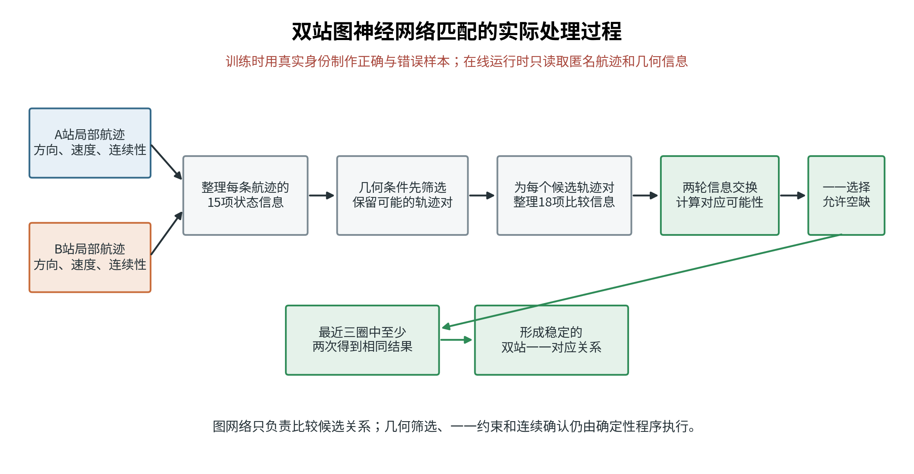

*图1  双站局部航迹先经过几何筛选，图神经网络只对保留下来的候选关系评分。*

### 单站局部航迹

光电云台连续周扫时，同一目标会在一次扫过期间连续出现在若干帧中。系统先把这些连续检测合并为一个扫描片段，避免把同一目标在一次扫过中的多帧图像重复计成多个目标。扫描片段保留检测框中心、拍摄时刻、云台姿态、目标视线和测量质量，不依赖检测框面积判断身份。

相邻扫描周期之间使用角位置和角速度预测连接扫描片段，形成本站局部航迹。每条局部航迹记录观测次数、持续时间、最近命中比例、方位和俯仰变化率、方向测量误差以及漏检情况。短时漏检时允许航迹保持有限时间；超出保持窗口后停止发布，防止长期外推产生虚假目标。A站和B站的局部编号只在本站有效，不能直接作为跨站身份。

### 时间对齐和几何筛选

双站周扫很难在完全相同的时刻看到同一目标。算法以图像拍摄时间为准，把两条局部航迹外推到共同参考时刻，再比较空间关系。消息到达时间单独保存，用于判断通信延迟，不能代替拍摄时间参与几何计算。

像素点通过相机内参、镜头畸变、云台角度和站址姿态换算成世界坐标系中的单位视线。设两站位置为 \(c_A\)、\(c_B\)，两条单位视线为 \(d_A\)、\(d_B\)，两站基线为 \(b=c_B-c_A\)。同一目标对应的两条视线与基线应当接近同一平面。归一化共面性残差可写成：

\[
r_{\mathrm{cop}}=
\frac{|b^{T}(d_A\times d_B)|}
{\|b\|\,\|d_A\times d_B\|+\varepsilon}
\]

残差较大的组合直接排除。残差接近门限的组合继续比较多时刻残差变化、时间重叠、角速度差、视线交会夹角、重投影误差和拟合速度。目标沿视线方向排列、两条视线近似平行或云台姿态误差较大时，单次几何关系可能同时保留多个候选，此时不强行确定身份。


*图2  正确候选的双站视线接近同一极平面，明显偏离的组合在进入学习模型前排除。*

### 候选关系图

几何筛选后，把A站局部航迹和B站局部航迹分别放在关系图两侧。每条局部航迹是一个节点；只有通过时间和几何条件的两条航迹之间才建立候选边。20条A站航迹和20条B站航迹理论上有400种组合，几何门控会把其中大部分不可能组合提前删除。图神经网络只处理剩余的稀疏候选图，计算量由候选边数量决定，不按全部组合增长。


*图3  左侧是几何筛选后仍需比较的候选关系，右侧是一一分配和连续确认后的对应关系。图中数量用于说明处理过程。*

节点使用15项状态信息，主要反映一条局部航迹自身是否稳定；候选边使用18项比较信息，反映两条航迹能否由同一目标产生。

| 信息类别 | 主要内容 | 作用 |
| --- | --- | --- |
| 航迹长度与连续性 | 观测数、持续时间、扫描圈数、最近三圈命中比例、漏检比例 | 区分稳定航迹、短时杂波和间断航迹 |
| 角运动状态 | 方位跨度、俯仰跨度、角速度、方位和俯仰变化率 | 描述本站看到的运动趋势 |
| 测量质量 | 方向误差、角速度误差、检测稳定性、航迹状态质量 | 防止低质量观测获得过高权重 |
| 共面性关系 | 残差中位数、高位值、波动和变化率 | 判断双站视线是否持续满足同一目标几何关系 |
| 时间关系 | 对齐样本数、时间重叠比例、最近命中重叠比例 | 排除观测时段不相交的组合 |
| 空间拟合 | 重投影误差、拟合速度、条件数、视线夹角、视线残差 | 判断联合定位是否稳定 |
| 运动一致性 | 角速度差、归一化运动残差、合成方向误差 | 区分空间接近但运动不同的目标 |

### 图神经网络评分

图神经网络先把每条航迹的15项信息编码为64维内部表示，把每条候选关系的18项信息也编码为64维内部表示。编码后的数值没有新增物理量，只是将量纲不同的几何、时间和运动证据放入统一计算空间。所有标准化参数只用训练数据计算，在线处理不读取目标真实编号。

网络进行两轮信息交换。第一轮让每条A站航迹汇总与其相连的B站候选信息，同时让B站航迹汇总与其相连的A站候选信息。第二轮在更新后的关系上再次比较。这样，一条候选边的得分同时取决于本身几何关系和周围竞争关系。例如A2与B2、B3都比较接近，而B3与A3明显更吻合时，网络能够降低A2与B3的得分，把B3留给更合理的A3。

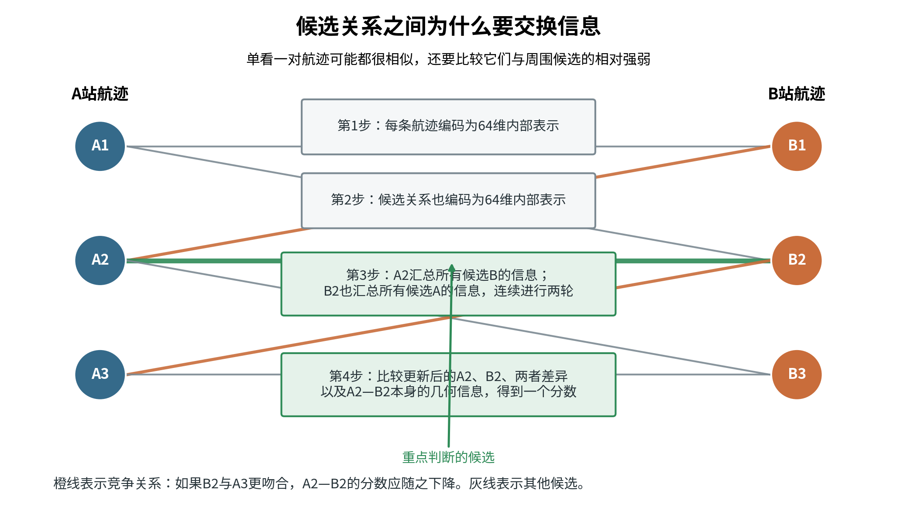

*图4  两轮信息交换使每条候选关系能够看到周围的竞争情况，减少只看一对航迹造成的局部误判。*

网络最后把A端表示、B端表示、两端差异和候选边表示合并，输出0至1之间的对应评分。这个分数表示两条局部航迹属于同一目标的可能程度。网络不直接生成目标编号，不负责决定最终一一关系，也不参与三角定位。

### 一一分配和连续确认

候选评分形成一个代价矩阵。匈牙利算法从全部候选中选择总体代价较小的一一组合，防止两条A站航迹同时占用同一条B站航迹。系统为“暂不匹配”保留空缺项，最高评分仍低于门限时保持未匹配，不能为追求数量把弱证据强行拼在一起。


*图5  一一分配同时比较全部候选。A4证据不足时保持未匹配，避免把低分关系写成确定结果。图中分数为原理示意。*

单圈结果只作为候选。连续周扫流程要求最近三圈中至少两圈得到相同关系，才发布稳定的双站对应。目标交叉或漏检造成两种排列接近时，系统暂时保留候选，等待后续扫描把目标自然分开。连续确认增加了少量时延，但能减少一次扫描误差造成的身份交换。

### 双站联合定位

配准确认后，算法将同一目标在多个时刻的A、B站视线一起用于位置和速度拟合。设目标在参考时刻的位置为 \(p_0\)，速度为 \(v\)，第 \(k\) 条观测的相机位置和单位视线分别为 \(c_k\)、\(d_k\)，可采用加权最小二乘求解：

\[
\min_{p_0,v}\sum_k
\left\|
(I-d_kd_k^T)
[p_0+v(t_k-t_0)-c_k]
\right\|_{W_k}^{2}
\]

矩阵 \(I-d_kd_k^T\) 取目标预测位置在视线垂直方向上的误差，权重 \(W_k\) 由方向测量误差、云台姿态质量和时间误差确定。多时刻联合拟合可以使用不同扫描时刻的观测，不要求两站逐帧同步。输出包括参考时刻位置、速度、协方差和拟合条件数。

拟合结果重新投影回A、B站图像，与原观测轨迹比较。重投影残差持续偏大时撤销定位结果，并检查配准错误、时间偏差、相机标定和云台姿态。两站视线夹角过小或目标位于基线不利方向时，深度误差会明显放大，此时应输出较大的协方差，不能用单一坐标值掩盖几何退化。

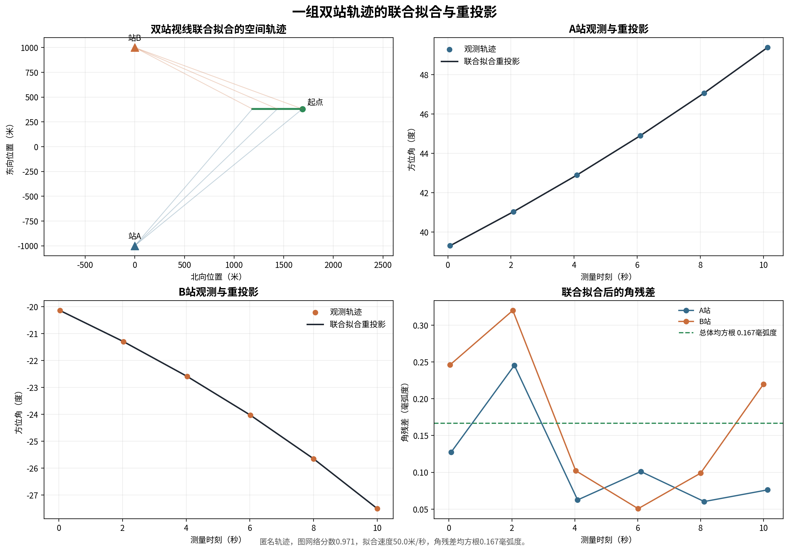

*图6  已确认的双站轨迹进入空间联合拟合，拟合结果再投影回两站检查角残差。本图用于说明计算过程，不是整批试验统计。*

### AirSim仿真验证

试验采用两台横向间隔2千米的固定光电节点，目标走廊位于双站前方约2千米。目标为长度约3米的无人机网格，以50米/秒飞行，空间位置前后错列并存在轨迹交叉。相机分辨率1280×1024，焦距300毫米。360度试验按2秒一圈连续周扫，180度试验按1秒一次单程扫描。三种方法统一保留共面筛选、匈牙利一一分配和连续确认。

#### 360度理想单站条件

理想单站条件用于单独核对双站算法。两台光电内部的目标身份应全部正确，再比较20、40、60目标下几何方法、图神经网络和增强型图神经网络的跨站配准。所需九项矩阵尚未形成机器记录，不能用180度试验或单站正确子集替代。

| 目标数 | 方法 | 最后一圈关联精度 | 最后一圈目标覆盖度 | 处理耗时P95 | 证据状态 |
| --- | --- | --- | --- | --- | --- |
| 20 | 几何方法 | 待测试 | 待测试 | 待测试 | 无机器记录 |
| 20 | 图神经网络 | 待测试 | 待测试 | 待测试 | 无机器记录 |
| 20 | 增强型图神经网络 | 待测试 | 待测试 | 待测试 | 无机器记录 |
| 40 | 几何方法 | 待测试 | 待测试 | 待测试 | 无机器记录 |
| 40 | 图神经网络 | 待测试 | 待测试 | 待测试 | 无机器记录 |
| 40 | 增强型图神经网络 | 待测试 | 待测试 | 待测试 | 无机器记录 |
| 60 | 几何方法 | 待测试 | 待测试 | 待测试 | 无机器记录 |
| 60 | 图神经网络 | 待测试 | 待测试 | 待测试 | 无机器记录 |
| 60 | 增强型图神经网络 | 待测试 | 待测试 | 待测试 | 无机器记录 |

“待测试”表示没有可以引用的精度、覆盖度和耗时数据，不表示结果为零。共面约束、一一分配和双射线交汇给出了理论路径，40目标理想演示也形成36条正确关系，但该演示采用正负45度扫描、单个种子和独立处理链，不能证明上述规模矩阵已经完成。

#### 360度实际单站航迹

20目标同输入对照复用5个测试场景的匿名单站航迹，只统计第6圈。无干扰时几何方法的精度和覆盖度最高；轻度干扰时增强型图神经网络的两项指标最高；基础图神经网络处理时间最短。

| 方法 | 条件 | 最后一圈精度 | 最后一圈覆盖度 | 处理耗时P95 | 证据状态 |
| --- | --- | ---: | ---: | ---: | --- |
| 几何方法 | 无干扰 | 98.8% | 85.0% | 867.9毫秒 | 封存回放，诊断 |
| 几何方法 | 轻度干扰 | 85.5% | 47.0% | 997.9毫秒 | 诊断；1/5超时 |
| 图神经网络 | 无干扰 | 91.5% | 75.0% | 75.2毫秒 | 封存回放，诊断 |
| 图神经网络 | 轻度干扰 | 77.2% | 61.0% | 88.5毫秒 | 封存回放，诊断 |
| 增强型图神经网络 | 无干扰 | 92.2% | 71.0% | 241.2毫秒 | 封存回放，诊断 |
| 增强型图神经网络 | 轻度干扰 | 89.0% | 65.0% | 288.5毫秒 | 封存回放，诊断 |

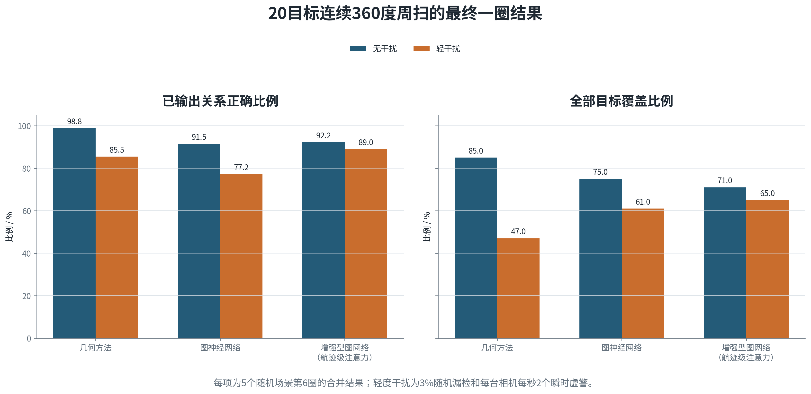

分规模随机干扰批次按20、40、60目标分别冻结模型，每个条件使用5个随机场景。只有图神经网络形成三种规模、四档干扰的完整记录。20目标几何方法仅无干扰形成结果，轻、中、重度均为5/5超时；40和60目标几何方法未开展，增强型图神经网络在该批次全部未开展。

| 目标数 | 条件 | 图网络精度 | 图网络覆盖度 | 处理耗时P95 | 其他路线状态 |
| ---: | --- | ---: | ---: | ---: | --- |
| 20 | 无干扰 | 84.0% | 63.0% | 78.3毫秒 | 几何85.7%/78.0%；增强型未开展 |
| 20 | 轻度 | 82.2% | 60.0% | 96.7毫秒 | 几何5/5超时；增强型未开展 |
| 20 | 中度 | 76.6% | 49.0% | 121.8毫秒 | 几何5/5超时；增强型未开展 |
| 20 | 重度 | 69.4% | 43.0% | 171.8毫秒 | 几何5/5超时；增强型未开展 |
| 40 | 无干扰 | 91.7% | 60.5% | 193.3毫秒 | 几何、增强型未开展 |
| 40 | 轻度 | 80.0% | 50.0% | 204.2毫秒 | 几何、增强型未开展 |
| 40 | 中度 | 76.1% | 35.0% | 229.9毫秒 | 几何、增强型未开展 |
| 40 | 重度 | 67.1% | 27.5% | 270.3毫秒 | 几何、增强型未开展 |
| 60 | 无干扰 | 94.3% | 55.0% | 305.2毫秒 | 几何、增强型未开展 |
| 60 | 轻度 | 77.3% | 39.7% | 337.6毫秒 | 几何、增强型未开展 |
| 60 | 中度 | 77.6% | 40.3% | 366.2毫秒 | 几何、增强型未开展 |
| 60 | 重度 | 72.3% | 28.7% | 403.9毫秒 | 几何、增强型未开展 |

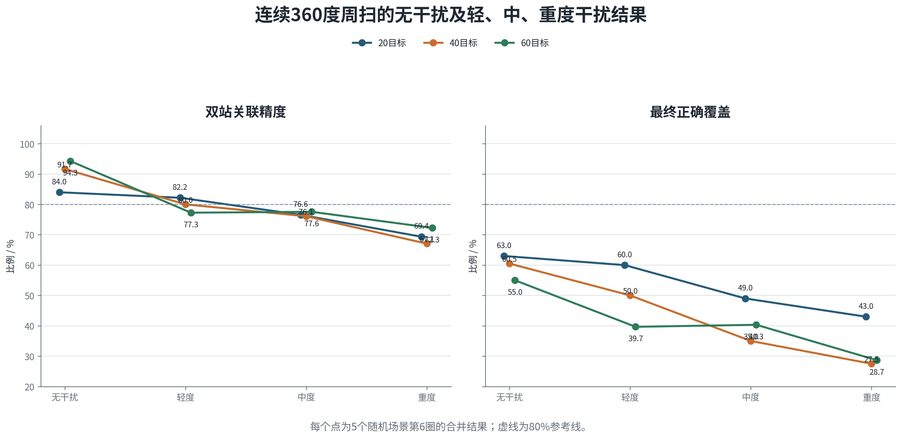

目标交叉、姿态抖动、漏检和虚警先造成单站断轨、错误重接和重复建轨，随后才表现为双站精度和覆盖度下降。两站没有形成对应的正确局部航迹时，跨站评分无法从后端补回。单站航迹基本完整但双站仍有覆盖损失的场景，还需继续校准跨站评分和连续确认。

#### 180度扫描

180度扫描每秒形成一次关联结果，重访频率高于2秒一圈的360度周扫。表中每个算法单元格依次给出最后一轮精度、覆盖度和处理耗时P95。

| 目标数 | 条件 | 几何方法 | 图神经网络 | 增强型图神经网络 | 证据状态 |
| ---: | --- | --- | --- | --- | --- |
| 20 | 无干扰 | 超时/2067.5毫秒 | 97.8%/89.0%/100.4毫秒 | 88.5%/77.0%/379.9毫秒 | 正式 |
| 20 | 轻度 | 超时/1950.6毫秒 | 83.9%/73.0%/108.8毫秒 | 88.8%/79.0%/401.3毫秒 | 正式 |
| 40 | 无干扰 | 超时/5174.2毫秒 | 89.6%/81.5%/292.3毫秒 | 77.5%/58.5%/972.7毫秒 | 诊断 |
| 40 | 轻度 | 超时/5022.3毫秒 | 89.3%/71.0%/270.2毫秒 | 79.1%/58.5%/955.0毫秒 | 诊断 |
| 60 | 无干扰 | 超时/9257.9毫秒 | 95.8%/90.7%/509.5毫秒 | 超时/1683.9毫秒 | 诊断 |
| 60 | 轻度 | 超时/9063.3毫秒 | 94.6%/82.0%/504.9毫秒 | 超时/1686.2毫秒 | 诊断 |

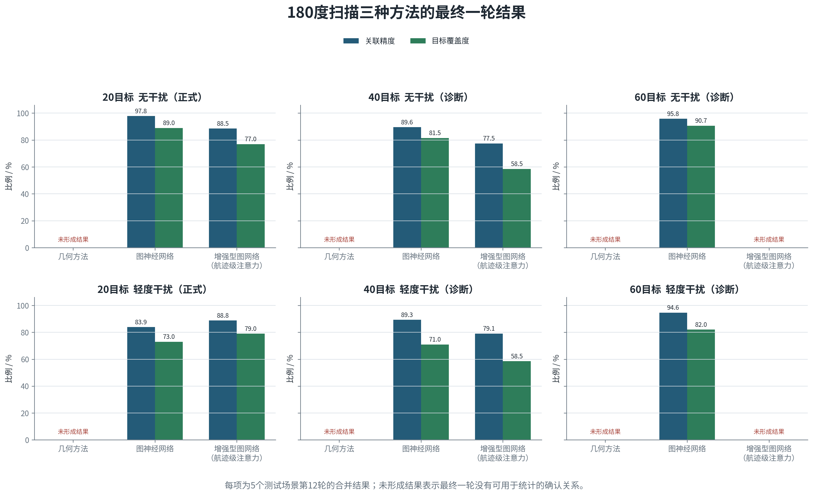

20目标轻度干扰下，180度图神经网络精度和覆盖度为83.9%和73.0%，360度同输入诊断批次为77.2%和61.0%。现有结果支持提高重访频率有利于维持关联，但两批数据不是同一种子、同一模型的单变量试验，差值不能全部归因于扫描范围。40和60目标结果还受单站航迹器验收状态限制。

#### 40目标交汇定位

40目标理想演示形成37条双站关系，其中36条正确、1条错误。正确关系进入交汇定位后，平均位置误差0.080米，95%位置误差不超过0.091米；平均速度误差0.0081米/秒，95%速度误差不超过0.0197米/秒。

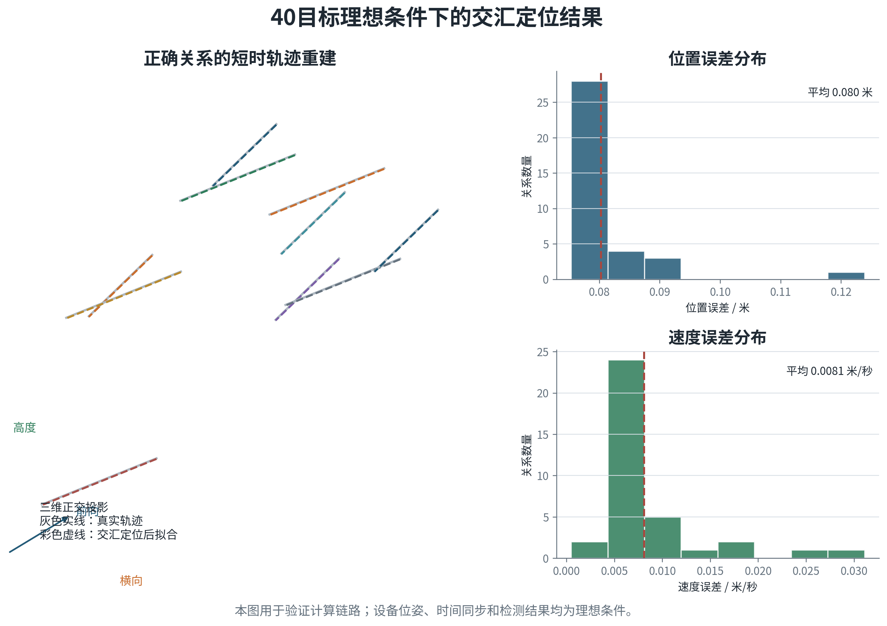

上述误差来自理想位姿、理想时间和仿真检测条件，不能作为设备定位指标。360度理想单站九项矩阵仍待测试；分规模随机干扰的非图网络路线存在未开展或超时；180度40和60目标属于诊断。后续还需加入安装测量误差、云台偏差、时间同步误差和真实检测中心偏差。

### 交接内容

双光电处理结果向后续火指控提供目标临时编号、位置、速度、六维协方差、最近拍摄时间、消息到达时间、支持该结果的A/B站局部航迹、配准质量、定位质量、标定版本和有效期。结果过期、几何退化或配准冲突时，状态降为待确认，不向后续环节发布精确点目标。

## 4.4 区域拦截搜索

### 任务背景和设计边界

中心双光电提供目标数量区间、主要来袭方向、粗略空间范围和信息时刻。部分目标能够形成带位置、速度和协方差的源航迹，其余目标只能留下较宽的方位或概率区域。这些信息能够引导拦截无人机前往大致正确的空域，但不能保证每条源航迹都是真实、唯一且身份稳定的目标。

本节按80%关联精度和80%召回率设计搜索流程。设真实目标数为N，正确中心线索数为T，中心发布线索总数为S。由T/N=0.8和T/S=0.8可得T=0.8N、S=N，错误线索和中心漏掉的目标均为0.2N。正确线索与错误线索都会生成搜索单元，中心漏检目标只能依靠空白走廊单元补获。

| 场景 | 正确线索 | 错误线索 | 中心漏掉 | 空白单元 | 总搜索单元 |
| --- | ---: | ---: | ---: | ---: | ---: |
| 20目标/8机 | 16 | 4 | 4 | 8 | 28 |
| 20目标/30机 | 16 | 4 | 4 | 8 | 28 |
| 40目标/50机 | 32 | 8 | 8 | 16 | 56 |

空白单元数量取max(5，向上取整0.4N)。每条线索先按p(t)=p0+vΔt外推到规划时刻，再按三个方向的max(30米，3√Pᵢᵢ)确定搜索半宽。本轮位置标准差为1米，因此采用30米下限。空白单元铺设在来袭走廊，只表示需要观察，不表示已经发现目标。搜索阶段不采用“一条中心航迹配置一架无人机”的固定关系。

中心向各机下发同一版概率区域、候选源航迹、目标数量区间和任务有效期。各机在搜索过程中交换已观察单元、未发现记录、候选短航迹、云台状态和信息时刻。发现目标的无人机转入连续跟踪，尚未完成的搜索单元由其他无人机接续。漏检目标必须依靠不与具体源航迹绑定的空档搜索任务发现。多派出的无人机必须展开到不同的空间和观察方向，不能重复追随同一条可能错误的中心线索。

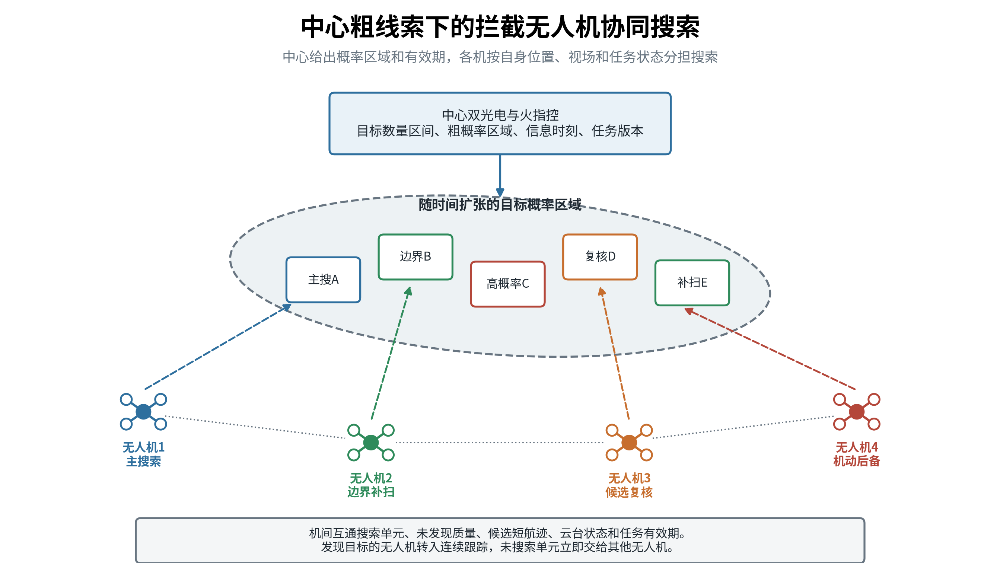

*图8  中心提供粗概率区域，各拦截无人机分担主搜索、边界补扫、候选复核和机动后备任务。角色随发现结果滚动调整。*

### 交接位置和搜索时间

中心到拦截无人机的交接宜分段进行。约5千米时下发任务预交接，内容包括概率区域、候选源航迹、位置、速度、协方差和预测交会点。约3千米时根据最新航迹重新划分搜索责任，并将云台预置到预测视线。对3米级目标，约1.4千米是机载可见光达到10像素的建议稳定识别距离，此后才有条件形成可供交接的机载局部航迹。约400至500米前应完成连续确认，后续以稳定跟踪为主，不再执行广域搜索。

按方案中拦截无人机最大速度350千米/小时，约为97米/秒，并按较紧张的迎头接近计算：

| 距离区间 | 50米/秒目标 | 155米/秒高速目标 | 该阶段主要工作 |
| --- | ---: | ---: | --- |
| 5千米至1.4千米 | 约24.5秒 | 约14.3秒 | 飞向预测交会点、更新线索、云台预置 |
| 3千米至1.4千米 | 约10.9秒 | 约6.3秒 | 小范围预搜索和责任重划 |
| 1.4千米至500米 | 约6.1秒 | 约3.6秒 | 可见光搜索、局部成轨和多机复核 |
| 500米至接近目标 | 约3.4秒 | 约2.0秒 | 稳定跟踪和末段接管 |

上表中的1.4千米至500米是真正可用于机载视觉搜索的紧张窗口。扣除信息传输、云台转向和连续确认，50米/秒目标约有4.5至5秒可用，155米/秒高速目标约有2至3秒可用。这个时间只支持在预测误差范围内执行有限数量的观察动作，不支持重新扫描大范围空域。对穿越机类小目标，当前可见光达到10像素的距离约143米，迎头条件下剩余搜索时间不足1秒，现有宽视场通道不适合承担大范围首次搜索。

### 搜索区域表达

中心线索先按信息时刻外推到当前时刻。系统使用目标可能位置、速度范围和协方差形成三维概率区域，同时保存预计目标数量和最晚需要重新观察的时间。概率区域随线索年龄、目标机动能力和通信延迟逐步扩张。已经形成的源航迹投影为较小的预测椭圆；尚未稳定成轨的目标保留为较宽的方向扇区或空间块。

三维概率区域按方位、距离和高度层划分为搜索单元。搜索单元尺寸由目标斜距和设备有效视场决定，边界保留适量重叠。每个单元至少记录目标存在概率、预计目标数、最近观察时刻、观察质量、预计目标像素、遮挡情况、可执行平台和任务有效期。

本方案使用拦截无人机自身的双光云台。可见光全视场约为19度乘11度，适合在较远距离先搜索；红外全视场约为22度乘18度，进入有效成像距离后用于热目标复核和连续跟踪。以可见光在1400米斜距观察为例，单视场水平覆盖约为：

\[
W_{\mathrm{vis}}=2\times1400\times\tan(19^\circ/2)\approx469\text{米}
\]

垂直覆盖约为：

\[
H_{\mathrm{vis}}=2\times1400\times\tan(11^\circ/2)\approx270\text{米}
\]

按20%视场重叠估算，在单一高度层覆盖1平方千米约需3列乘5行，共15个可见光视场。距离缩短到500米后，可见光单视场约为167米乘96米，同一区域约需8列乘13行，共104个视场。拦截无人机越接近目标，目标像素增加，单视场覆盖范围同时缩小。广域搜索应尽量在较远距离完成，近距阶段以预测区域凝视和局部补扫为主。

红外对3米级目标达到10像素的建议距离约为410米。按410米计算，红外单视场约为159米乘130米。该距离内红外适合复核热目标和维持末端跟踪，不适合承担整个平方千米区域的首次覆盖。以上数值只反映理想针孔模型下的视场范围，目标姿态、热对比度、天气、运动模糊和检测算法还需实测。

### 搜索方式

搜索力量分为四类。线索搜索机前往高概率源航迹周边，但搜索完整的预测误差区域，不把中心编号直接当成机载目标身份。空档搜索机检查中心未形成航迹的来袭通道和低概率单元。交叉复核机从不同方向观察疑似目标，用于区分重复航迹、错误关联和真实新目标。机动预备机不提前绑定具体目标，用于接续未搜索单元、补充丢失目标或在目标确认后转入拦截。

目标概率集中且一个视场能够覆盖主要误差范围时，一架无人机凝视核心区，另一架从侧向复核。目标概率较宽时，各机分别承担左、中、右及不同高度层的搜索单元。多派出无人机的作用是扩大空间覆盖和形成第二视角，不是对每条中心航迹简单复制一份跟随任务。已进入稳定末端跟踪的无人机不再承担广域搜索，防止云台扫描破坏锁定。

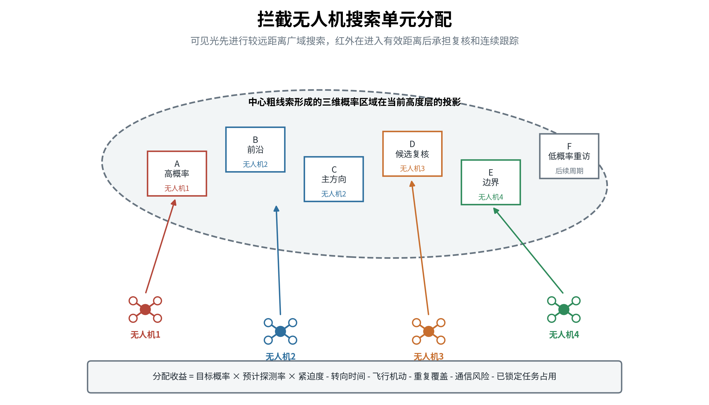

*图9  搜索单元根据目标概率、观察条件和各机任务状态滚动分配。一个无人机可在连续周期承担多个相邻单元。*

搜索单元 \(j\) 分配给无人机 \(i\) 的收益可写成：

\[
U_{ij}=3p_j+4G_{ij}-0.8C_{\mathrm{slew},ij}
-C_{\mathrm{arrival},ij}-4C_{\mathrm{repeat},ij}
\]

其中，\(G_{ij}=p_jV_{ij}Q_j\)，\(V_{ij}\)表示相机在700米观察距离上能够覆盖该单元的比例，\(Q_j=1/(1+n_j)\)反映既有覆盖次数。其余三项分别扣除云台转向、到达观察位置和刚刚重复观察的代价。19度水平视场在700米处的名义覆盖宽度约234.3米，面积较大的空白单元一次不容易看全，需要后续复访。

有 \(M\) 台相机、\(K\) 个有效单元时，建立 \(M\times K\) 收益矩阵，再增加 \(M\) 个空闲列，得到 \(M\times(K+M)\) 矩阵，空闲收益为负0.05。匈牙利算法一次求解全部占用冲突，使每台相机每轮最多承担一个单元，每个真实单元最多分给一台相机。所有真实单元收益低于空闲项时，相机保持待命。

搜索阶段的分配对象是搜索单元，不是确定目标。对已发布的源航迹建立指向性搜索单元，对漏检风险建立不与具体源航迹绑定的覆盖单元。当单架无人机在对应单元内发现目标的概率为 \(q\)，希望至少一架在不同视角下发现目标的概率达到 \(P\) 时，独立观察数量 \(k\) 可按下式初步估算：

\[
1-(1-q)^k\geq P
\]

该估算只在多架无人机的观察误差不完全相关时才有意义。两架无人机使用相同进入方向、相同云台指向和相同中心错误线索时，不能按两次独立观察计算。

### AirSim验证设置

为检查区域搜索在不同资源规模下的表现，试验设置20目标/8机、20目标/30机和40目标/50机三组场景。目标采用3米无人机网格模型，以50米/秒移动；拦截无人机采用AirSim计算机视觉模式，用相机节点代替飞行动力学平台。机载相机分辨率为1920×1080，水平视场角19度，距搜索单元中心的标称观察距离为700米。检测框最长边达到10像素后记为可识别，连续两帧满足条件才形成确认结果。

三组试验均按中心线索精度80%、召回率80%构造输入。20个目标对应16条正确线索、4条错误线索和4个中心漏检目标；系统另设置8个空白搜索单元，总计28个搜索单元。40个目标对应32条正确线索、8条错误线索、8个中心漏检目标和16个空白搜索单元，总计56个搜索单元。空白单元覆盖中心没有形成线索的来袭走廊，用于补获漏检目标。

本轮试验沿用前述收益和空闲项。20目标/8机、20目标/30机和40目标/50机的分配矩阵分别为8×36、30×58和50×106。相机到位后连续读取3帧，帧间隔0.1秒。当前检测与上一帧匿名局部航迹的检测框中心距离超过180像素时排除，其余候选由匈牙利算法一一连接；同一局部航迹连续2帧达到10像素才生成确认记录。

搜索、中心结果交接和机间配准在同一个AirSim Blocks进程中分段运行，专项之间重置场景。三组均使用随机种子20260816，场景时长18秒、状态步长0.1秒、仿真时钟倍率0.1。在线计算只读取匿名检测框、拍摄时间、相机位姿和相机参数；目标真实编号只在试验结束后用于核对结果。

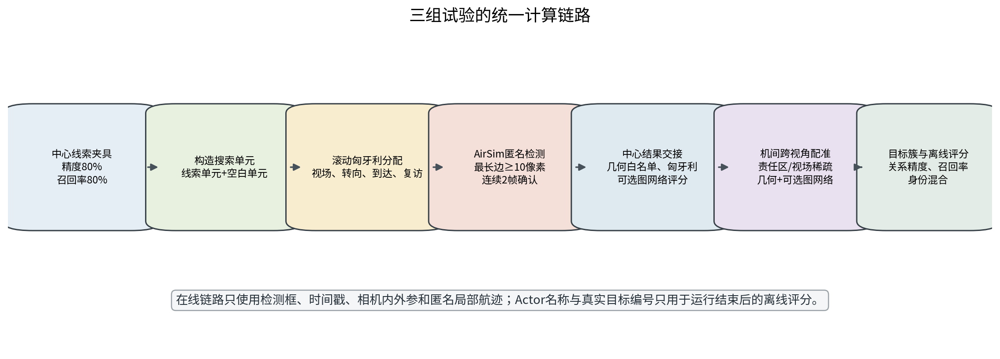

*图10  三组试验依次检查区域搜索、中心结果交接和机间跨视角配准。三个专项按同一场景条件分别评分。*

### 区域搜索结果

三组均执行三轮滚动分配。每架无人机每轮最多承担一个搜索单元，因此三轮理论容量分别为24、90和150次。试验结果如下。

| 场景 | 搜索单元 | 三轮理论容量 | 实际分配 | 唯一覆盖 | 达到10像素 | 连续确认 | 中心漏检补获 | 规划平均时间 |
| --- | ---: | ---: | ---: | ---: | ---: | ---: | ---: | ---: |
| 20目标/8机 | 28 | 24 | 24 | 24 | 20/20 | 19/20 | 3/4 | 2.758毫秒 |
| 20目标/30机 | 28 | 90 | 44 | 28 | 20/20 | 20/20 | 4/4 | 11.739毫秒 |
| 40目标/50机 | 56 | 150 | 88 | 56 | 40/40 | 40/40 | 8/8 | 35.753毫秒 |

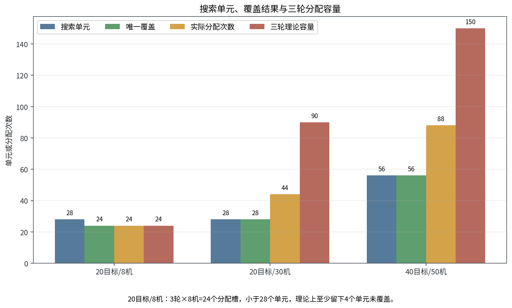

*图11  20目标/8机三轮只有24个任务槽，少于28个搜索单元；另外两组具备覆盖全部搜索单元的容量。*

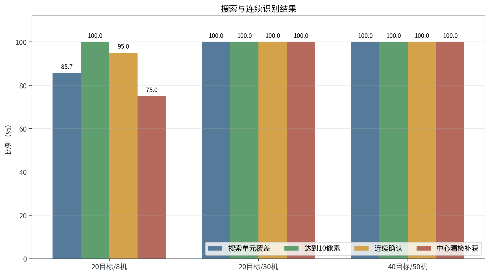

*图12  达到10像素表示目标曾经可见，连续确认表示已形成可供后续交接的稳定观测，两者不能混为一个指标。*

20目标/8机的主要问题是搜索容量不足。24个任务槽无法覆盖28个单元，最终留下4个单元未搜索。20个目标虽然都曾达到10像素，但只有19个通过连续确认，中心漏掉的4个目标只补获3个。这说明资源不足首先造成区域漏扫，随后减少复访和连续确认机会。

20目标/30机首轮即可覆盖28个搜索单元，40目标/50机在第二轮补齐剩余6个单元。两组都完成全部目标连续确认，并补获中心漏掉的全部目标。当前规则分配在50机规模下平均计算时间为35.753毫秒，说明单次任务分配的计算量可以控制。该时间不包含通信排队、无人机飞行、云台稳定和图像识别处理。

区域搜索试验支持一个直接结论：搜索能力必须先满足“无人机数量乘搜索轮次不小于待覆盖单元数”的容量条件。资源不足时，应增加搜索轮次、合并低价值单元或调整责任区；配准算法无法补偿从未被观察的区域。资源充足后，空白单元和滚动复访能够补回部分中心漏检目标。

### 未发现信息处理

一次快速扫过没有看到目标，只能降低该单元的目标概率，不能直接清零。设观察前目标存在概率为 \(p\)，当前观察条件下的有效探测概率为 \(P_D\)，在暂不计虚警的简化条件下，高质量观察后未发现目标的更新为：

\[
p^+=\frac{p(1-P_D)}{1-pP_D}
\]

当目标成像像素不足、云台未稳定、遮挡明显或扫描速度过快时，\(P_D\) 较低，未发现结果只能轻微降低概率。连续多次高质量观察仍未发现时，概率才明显下降。检测到候选后先生成局部短航迹，并将目标方向、拍摄时间和预测区域发给邻机。邻机形成第二视角或同机连续多帧确认后，再进入目标配准。


*图13  相同的“未发现”在高质量凝视和快速扫过条件下具有不同证据强度。*

### 人工智能增强

目标数量少、概率区域单峰且参与无人机数量有限时，概率地图加确定性分配便于解释和验证。多波次来袭、搜索区域持续变化、多个云台相互影响时，可用强化学习选择下一批搜索单元、观察方式和停留时间。学习策略的输入包括概率地图、信息年龄、预计目标像素、无人机位置、云台状态、剩余航时、已锁定任务和通信状态；输出限定为已有搜索单元和有限观察动作，不直接输出电机控制量。

强化学习的收益函数围绕首次发现时间、稳定短航迹形成时间、有效覆盖、重复扫描、通信量和平台机动代价设置。云台转速、俯仰限位、任务边界、最低重访频率和已锁定目标保持由确定性规则控制。学习策略不可用时，系统退回概率优先和固定扇区搜索。

### 实施步骤

第一阶段已经完成20目标/8机、20目标/30机和40目标/50机三组AirSim验证，固定注入80%中心线索精度和80%召回率，检查线索搜索单元、空白搜索单元、三轮滚动分配、10像素识别和连续确认。现有结果证明容量条件决定能否完成区域覆盖，也证明空白搜索单元能够在资源充足时补获中心漏检目标。

第二阶段应补充航迹过期、重复线索、方位偏差、导航误差、云台误差、漏检、虚警和通信延迟。每组至少运行10个独立随机种子，比较一对一线索跟随、概率区域分配和超额空间覆盖。未发现概率更新、机间搜索记录交换、邻机复核和短航迹交接应在同一批场景中统一评价。

第三阶段可按20个真实目标分别配置20、25、30和40架搜索无人机，比较资源比1.0、1.25、1.5和2.0对漏检目标补获、错误线索浪费和首次发现时间的影响。资源比应由多组试验选择，不能根据80%召回率直接定为1.25倍。完成确定性基线后再比较强化学习搜索策略；学习方案只有在不增加漏扫、冲突和目标脱锁的条件下稳定缩短发现时间，才进入在线试验。

建议考核首次候选发现时间、稳定短航迹形成时间、目标发现率、有效覆盖率、最大重访时间、重复覆盖比例、目标脱锁次数、低质量未发现比例、通信量和单周期计算时间。各项结果按目标距离、成像像素、天气条件、扫描速度和光电通道分层统计。正式指标需由真实光电试验确定。

## 4.5 群对群目标配准

### 任务背景

拦截无人机进入目标附近后，每台相机通常只能看到目标群的一部分。相邻无人机视场存在交集，也可能在某一时刻完全不重叠。本机跟踪器把连续图像中的检测连成局部航迹，但本机编号只在本机有效。末段配准需要解决两个问题：一是中心双光电源航迹与机载局部航迹的对应；二是不同拦截无人机的局部航迹是否对应同一来袭目标。

在80%关联精度和80%召回率的设计工况下，中心源航迹不能被当成机载视觉的真值标签。已发布源航迹只提供预测位置和候选身份，机载观测必须重新通过时间、几何和运动证据核对。无人机新发现而中心未召回的目标，先作为未注册候选保持局部航迹，由两机或多机复核后上报中心生成新源编号。拦截无人机不能自行写入或改写中心源航迹编号。

搜索和配准连续衔接。搜索阶段将云台指向源航迹预测区域或不与具体源航迹绑定的搜索单元，并形成机载局部航迹。配准阶段比较已经形成的局部航迹。没有发现目标、没有共同观测、中心源航迹过期或几何信息不足时，关系保持待确认，不能用学习模型补造身份。

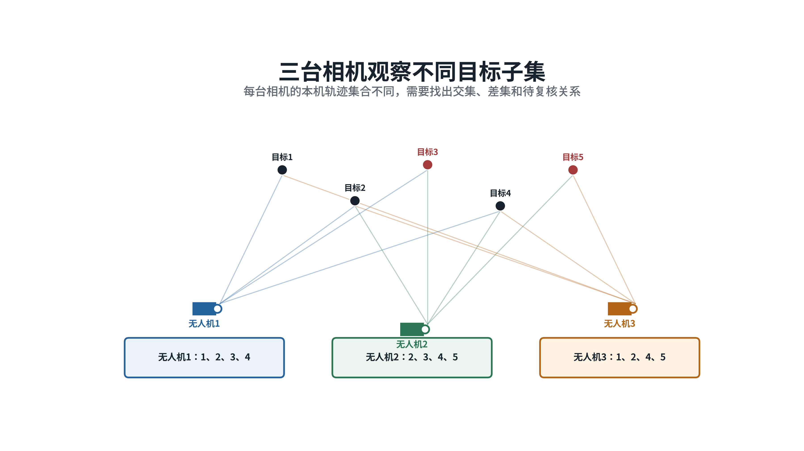

*图14  三架拦截无人机看到不同目标子集。本机编号互不相同，系统需要找出交集、差集和待复核关系。*

### 源航迹投影

双光电源航迹提供北东地坐标中的位置、速度、六维协方差、测量时刻、消息到达时刻、有效期和源航迹编号。系统以机载图像拍摄时刻为基准，将状态 \(x=[p,v]\) 按匀速模型外推：

\[
x(t)=Fx_0,\qquad
F=\begin{bmatrix}I&\Delta t I\\0&I\end{bmatrix},
\qquad
P(t)=FP_0F^T+Q
\]

本试验按白噪声加速度模型构造过程噪声，加速度标准差为0.5米/秒²。位置块、位置速度交叉块和速度块分别按 \(q\Delta t^4/4\)、\(q\Delta t^3/2\) 和 \(q\Delta t^2\) 增长，其中 \(q=0.5^2\)。线索越旧，预测范围越大，后续像面门限随协方差放宽；消息到达时间只用于检查通信延迟，不替代拍摄时间参与几何计算。

外推位置先减去拦截无人机位置，再经过机体、云台和相机安装旋转，得到相机坐标 \((x_c,y_c,z_c)\)。AirSim相机x轴朝前、y轴朝图像右侧、z轴朝下，预测像素为：

\[
\hat u=c_x+f_x\frac{y_c}{x_c},
\qquad
\hat v=c_y+f_y\frac{z_c}{x_c}
\]

目标位于相机后方或预测点落在图像外时，该候选直接排除。位置协方差通过投影雅可比矩阵 \(J\) 转到像面，再与投影误差和检测中心误差相加，形成预测椭圆：

\[
S=JP_{\mathrm{位置}}J^T+R_{\mathrm{投影}}+R_{\mathrm{本地}},
\qquad
d_M^2=(z-\hat z)^TS^{-1}(z-\hat z)
\]

云台先指向椭圆中心，椭圆超过一个视场时再按概率从高到低执行小范围扫描。拦截无人机在预测椭圆内形成匿名局部航迹，保留像素位置、角运动、检测连续性、目标框变化、拍摄时间、云台姿态和测量误差。候选还要满足检测框最长边不小于10像素、线索已经到达且未过期、马氏距离平方不大于9.2103，以及存在历史速度时像面速度差不大于80像素/秒。外观像素太少时，外观特征只作辅助。

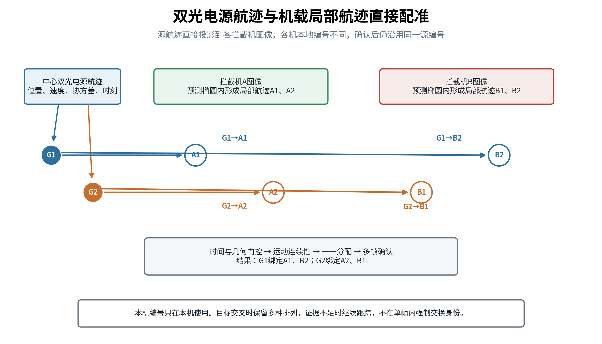

*图15  只有通过质量门的中心源航迹才进入直接配准。同一源航迹可以在不同拦截机中对应不同本地编号，绑定后仍保持源编号不变。*

### 分级配准

预测区域内只有一条稳定局部航迹，且几何、时间和运动关系清楚时，使用最近邻方法形成候选。出现多个源航迹和多个局部航迹时，建立源航迹到本地航迹的代价矩阵，综合图像预测马氏距离、运动方向差、时间差、目标框尺度变化和连续性，由匈牙利算法形成一一组合。代价超过门限的航迹保持未匹配，不为了提高数量强制绑定。

多架无人机同时看到密集目标时，每架无人机先在本机内完成源航迹与局部航迹的候选筛选，再交换拍摄时刻、平台位置姿态、单位视线、角速度、目标框变化和候选评分。两架无人机的候选视线外推到同一时刻后进行交会，将得到的位置、速度和协方差与中心源航迹比较。错误的跨机组合通常会产生较大的交会误差、重投影误差或速度跳变。

目标数量较少时，使用几何门控、匈牙利一一分配和连续多帧确认。目标密集、交叉频繁且候选竞争关系较多时，可把源航迹和各机局部航迹作为不同类型的节点，把通过时间、投影、视线交会和运动门限的关系作为候选边。图神经网络只调整候选边的排序，最终仍由一一约束、几何复核和连续确认决定是否绑定。

```text
双光电源航迹及误差范围
    ↓
按拍摄时刻外推并投影到各机图像
    ↓
云台搜索预测区域
    ↓
各机形成匿名局部航迹
    ↓
时间、几何和运动条件筛选
    ↓
少量候选：最近邻或匈牙利
密集候选：源航迹和多机局部航迹组成稀疏关系图
    ↓
跨机一一约束、连续多帧确认
    ↓
建立“源航迹编号至本机航迹编号”绑定
    ↓
任务计划核对后进入机载视觉跟踪
```

### 中心结果交接验证

区域搜索确认目标后，中心线索还要与机载匿名局部航迹建立对应。试验中的中心线索包含北东地坐标系下的位置、速度、测量时间、到达时间、有效期和六维协方差。算法先按图像拍摄时刻外推目标状态和协方差，再使用拦截无人机位置、机体姿态、云台姿态和相机参数投到图像平面，形成带不确定范围的预测像点。

候选局部航迹必须达到10像素识别门限，中心线索必须处于有效期，预测像点必须位于图像范围内。预测像点与检测中心的马氏距离平方不大于9.2103；存在历史速度时，预测像面速度与局部航迹速度差不大于80像素/秒。若有S条中心线索和L条局部航迹，先形成S×L个真实候选，再增加S个专用未匹配列，得到S×(L+S)代价矩阵。未匹配项代价为12.0，已确认关系切换时增加4.0代价。匈牙利算法执行一一分配，连续采集5帧，最近3帧中至少2帧保持同一关系后才正式确认。

图神经网络只在几何白名单内修正候选代价。网络输出同目标概率\(P_{\mathrm{gnn}}\)，最终代价为：

\[
C_{\mathrm{final}}=C_{\mathrm{geo}}-2\log(P_{\mathrm{gnn}})
\]

几何门限、匈牙利一一分配和多帧确认始终保留。中心交接图网络只使用合成数据训练，独立合成验证的候选关系精度为0.9993、召回率为1.0000。AirSim随机种子20260816未参与训练，只用于保存观测的离线回放。合成验证数值不能作为实际光电条件下的交接指标。

| 场景 | 方法 | 正确绑定 | 错误绑定 | 绑定精度 | 绑定召回率 | 中位复算时间 |
| --- | --- | ---: | ---: | ---: | ---: | ---: |
| 20目标/8机 | 几何 | 16 | 0 | 1.0000 | 1.0000 | 2.391秒 |
| 20目标/8机 | 图神经网络 | 16 | 0 | 1.0000 | 1.0000 | 2.460秒 |
| 20目标/30机 | 几何 | 14 | 0 | 1.0000 | 0.8750 | 2.751秒 |
| 20目标/30机 | 图神经网络 | 14 | 0 | 1.0000 | 0.8750 | 2.882秒 |
| 40目标/50机 | 几何 | 31 | 1 | 0.9688 | 0.9688 | 15.819秒 |
| 40目标/50机 | 图神经网络 | 31 | 0 | 1.0000 | 0.9688 | 15.862秒 |


*图16  图神经网络在20目标两组中没有改变结果，在40目标/50机回放中消除了几何方法的1条错误绑定。*

三组正确绑定数分别为16、14和31，说明资源数量增加不会自动提高中心交接召回率。40目标/50机中，几何方法接受了1条连续落入预测区的错误线索；图神经网络对照拒绝了这条关系，同时保留31条正确绑定。该结果只有一个AirSim随机种子，当前仍以几何白名单和匈牙利分配作为默认路径，图神经网络保留为离线对照。

### 机间跨视角验证

不同拦截无人机之间的配准不使用中心编号作为答案。每架无人机先把匿名检测框连成本机局部航迹，再把检测框中心反投影为北东地坐标中的单位视线。两台相机的观测在0.16秒内完成时间对齐，至少取得3个有效交会样本。设两台相机位置为 \(o_a,o_b\)，单位视线为 \(d_a,d_b\)，令 \(\delta=o_b-o_a\)、\(c=d_a\cdot d_b\)、\(D=1-c^2\)，则两条视线最近点的正深度为：

\[
s=\frac{\delta\cdot d_a-c(\delta\cdot d_b)}{D},
\qquad
t=\frac{c(\delta\cdot d_a)-\delta\cdot d_b}{D}
\]

最近点中点作为该时刻的交会位置，两最近点距离反映视线分离误差。多个交会位置随时间做直线拟合，单帧偶然接近不能直接形成跨视角关系。候选还要满足视线夹角不小于0.35度、视线分离不大于2米、重投影误差不大于8像素、运动拟合误差不大于5米、运动转角不大于55度和尺度对数差不大于0.28。这些数值是本次仿真标定值，不是装备指标。

通过硬门限后，几何代价综合视线分离、重投影、时间差、运动拟合、转角、尺度和观测质量。图神经网络只对硬门限通过的候选评分，最终代价为：

\[
C_{\mathrm{final}}=0.55C_{\mathrm{geo}}
+0.45(1-P_{\mathrm{gnn}})
\]

随后仍由匈牙利算法完成相机对内的一一匹配，并通过最近3帧至少2次一致进行确认。确认关系按代价从小到大合并为跨相机目标簇。同一目标簇不得包含同一相机的两条航迹；两个成熟目标簇合并时至少需要两个不同相机对共同支持；只有2帧的短航迹进入成熟簇时，需要簇内至少两台相机支持。跨视角图神经网络只使用合成数据训练，不能越过几何门限恢复被拒绝的候选，也不能直接生成目标编号。

相机数量增加后，全部相机两两比较会产生大量没有共同视场的候选。试验增加责任区和视场预筛选：同一责任区的相机对保留；相邻责任区只有在共同观测时刻存在视锥重叠时才保留；不相邻责任区直接排除。筛选只使用相机责任区、相机参数和观测姿态，不读取目标真实编号。

| 场景 | 全部相机对 | 稀疏相机对 | 全量候选边 | 稀疏候选边 | 候选减少 | 全相机几何时间 | 稀疏几何时间 |
| --- | ---: | ---: | ---: | ---: | ---: | ---: | ---: |
| 20目标/8机 | 28 | 16 | 5,778 | 3,296 | 43.0% | 12.43秒 | 8.87秒 |
| 20目标/30机 | 435 | 267 | 85,847 | 52,635 | 38.7% | 139.78秒 | 97.82秒 |
| 40目标/50机 | 1,225 | 403 | 1,104,646 | 375,236 | 66.0% | 1,842.79秒 | 770.99秒 |

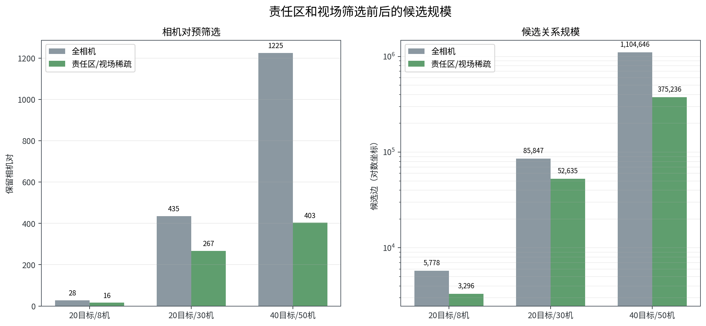

*图17  责任区和视场筛选在精细几何计算前排除没有共同观测条件的相机对，40目标/50机场景候选边减少66.0%。*

| 场景 | 相机图与方法 | 正确关系 | 错误关系 | 漏配关系 | 关系精度 | 关系召回率 | 身份混合 |
| --- | --- | ---: | ---: | ---: | ---: | ---: | ---: |
| 20目标/8机 | 全相机几何 | 30 | 0 | 2 | 1.0000 | 0.9375 | 0 |
| 20目标/8机 | 稀疏几何 | 30 | 0 | 2 | 1.0000 | 0.9375 | 0 |
| 20目标/8机 | 稀疏图神经网络 | 30 | 0 | 2 | 1.0000 | 0.9375 | 0 |
| 20目标/30机 | 全相机几何 | 558 | 302 | 71 | 0.6488 | 0.8871 | 5 |
| 20目标/30机 | 稀疏几何 | 564 | 198 | 65 | 0.7402 | 0.8967 | 4 |
| 20目标/30机 | 稀疏图神经网络 | 571 | 142 | 58 | 0.8008 | 0.9078 | 2 |
| 40目标/50机 | 全相机几何 | 3,538 | 2,537 | 794 | 0.5824 | 0.8167 | 18 |
| 40目标/50机 | 全相机图神经网络 | 4,031 | 2,094 | 301 | 0.6581 | 0.9305 | 7 |
| 40目标/50机 | 稀疏几何 | 4,031 | 16 | 301 | 0.9960 | 0.9305 | 0 |
| 40目标/50机 | 稀疏图神经网络 | 4,031 | 16 | 301 | 0.9960 | 0.9305 | 0 |


*图18  柱形表示关系精度，菱形表示召回率。右图时间包含关联计算、审计输出和结果图生成。*

20目标/8机中，四种设置的关联质量相同，稀疏相机图减少了计算量。20目标/30机中，稀疏几何先把错误关系从302条降到198条，稀疏图神经网络进一步降到142条，身份混合由4个降到2个。40目标/50机中，稀疏几何把关系精度从0.5824提高到0.9960，并将身份混合从18个降到0；图神经网络没有继续改善质量，复算时间由770.99秒增加到812.96秒。

本轮最稳定的改进是限制相机比较范围。默认路径应采用责任区/视场稀疏相机图、几何门限和匈牙利一一匹配。图神经网络适合处理稀疏图中仍有歧义的候选，暂不适合绕过视场和几何条件直接处理全量相机关系。

### 试验证据边界

三组AirSim观测使用同一个随机种子20260816，每个规模只正式采集一次。图神经网络使用独立合成数据训练，AirSim观测只用于留出回放。识别输入为AirSim检测元数据，尚未接入真实可见光或红外探测器；试验没有注入导航误差、云台姿态误差、时间同步偏差、相机标定漂移和检测误差。

拦截无人机采用计算机视觉相机节点，不包含飞行动力学。40目标/50机的长时案例只运行一次，其中三个案例在同一计算机的不同逻辑处理器上并行完成，复算时间不能作为机载处理器部署指标。离线基准共检查32项，通过31项；唯一未通过项是图神经网络未能在已经达到0.9960精度的40目标/50机稀疏几何结果上继续提高5个百分点。上述结果用于算法筛选，不能写成实装探测、定位或拦截性能。

### 两目标同时进入两机视场

设源航迹为G1和G2。拦截机A形成局部航迹A1、A2，拦截机B形成局部航迹B1、B2。局部编号的顺序可以不同，例如A机得到G1对应A1、G2对应A2，B机得到G1对应B2、G2对应B1。系统以G1、G2作为共同参照，本机编号不同不构成冲突。

两个目标接近或交叉时，单帧可能同时支持两种排列。系统同时比较“G1对应A1、B2，G2对应A2、B1”和“G1对应A2、B1，G2对应A1、B2”等完整组合。每一种组合都计算两机视线交会位置、与源航迹的协方差归一化残差、重投影误差、速度连续性和后续多帧一致性。正确组合应在A、B两个视角和中心源航迹上同时成立，错误组合则往往产生位置跳变或不合理的运动方向。

两种组合的证据差距没有达到门限时，系统不强行选择。A、B两机继续保持本地航迹，必要时由一架无人机做小幅侧向机动，增大观察夹角；另一架维持稳定跟踪。目标分离或中心下发新一次预测后再完成绑定，不在交叉点凭一次最近距离交换身份。

目标配准和拦截任务分配分开处理。配准回答“各机看到的是哪个目标”，分配回答“由哪架无人机执行拦截”。两架拦截机都能看到G1和G2时，两机可以同时保留对两个目标的观察，但只能对当前计划授权的目标进入末段导引。常规一对一任务中，应按预计拦截时间、进入方向、剩余能力和视觉稳定性为A、B分别选择不同目标。只有计划明确规定两对一或三对一时，多架无人机才可以同时对同一源航迹进入末段任务。

### 部分可见和无共同目标

多机局部航迹图只在存在共同目标、可信源航迹或可靠时空交接时才能连接。A机看到目标1、2，B机只看到目标3、4，且中心粗线索也无法区分个体时，几何和图神经网络都不能凭空判断跨机对应关系。系统继续保持两组局部航迹，由距离和姿态较有利的无人机调整云台形成短时共同视场，或等待目标进入预测交接区域。

某一目标由A机离场后进入B机视场时，A机发布最后视线、角速度、拍摄时刻和预测走廊。B机在预计到达时间内搜索该走廊。走廊中只有一个运动连续候选时完成交接；多个候选同时进入时保留多种关系并请求补充观察。

中心没有对应源航迹时，多架无人机可以通过拍摄时刻对齐、视线交会和运动连续性，判断各自的局部航迹是否属于同一个新目标。该结果先使用区域内临时候选编号，同时上报中心进行去重、注册和任务更新。临时编号只用于维持本地搜索和跟踪连续性，不替代中心源航迹编号。

### 输出和有效期

每条关系包含源航迹编号或未注册候选编号、本机航迹编号、支持相机、拍摄时间、消息到达时间、几何残差、运动残差、候选评分、连续确认次数、计划版本、标定版本和有效期。关系状态区分为候选、确认、短时保持、待重新确认和失效。某台相机丢失目标后，其他相机可以在有效期内维持观测证据；超出有效期、源航迹过期或出现几何冲突时，关系降为待确认并重新搜索。

进入机载末段导引前，还应同时检查源航迹与本地航迹绑定、当前任务计划、时间有效性、视觉连续性、相机识别距离和拦截机机动能力。任一条件不满足时保持搜索或跟踪，不把待确认关系作为唯一目标接管依据。

### 实施步骤

第一阶段已经在AirSim计算机视觉模式下完成三组规模验证。试验固定注入80%源线索精度和80%召回率，运行源线索外推、图像投影、搜索单元分配、单机局部成轨、匈牙利一一匹配和机间跨视角配准。责任区/视场稀疏相机图及图神经网络离线对照也已完成。该阶段使用理想相机位姿和AirSim检测元数据，结果属于算法链路验证。

第二阶段应逐项加入机体位置误差、姿态误差、云台角度误差、时间偏差、漏检、虚警和通信延迟，重新标定预测椭圆、几何门限和关系有效期。每个规模至少运行10个独立随机种子，分开统计中心线索错误、目标漏检、相机对筛选和图神经网络评分对最终结果的影响。

第三阶段应接入真实可见光和红外检测记录，验证两机同时看到两目标、三机观察不同目标子集、双目标交叉、短时遮挡、无共同视场和新目标无中心编号等场景。真实图像条件下仍以确定性几何和匈牙利分配为默认路径，图神经网络只有在多组未见场景中稳定降低错误关系且满足处理时间要求后，才考虑进入在线试验。

建议考核源航迹至机载航迹正确绑定比例、中心漏检目标补获率、错误源航迹拒绝率、跨机正确配准比例、错误合并数、错误拆分数、身份交换数、待确认比例、首次绑定时间、交叉恢复时间、末段错误目标接管数、单周期计算时间和通信量。在线算法不得读取仿真真实目标编号，真实编号只用于离线评分。没有足够证据时保持未匹配，错误强制配准的建议目标值为零。

## 编辑提示

1. 4.1.1至4.1.7保留场景、单站成轨、共面筛选、图网络和交汇定位主线；4.1.8使用本素材的新证据，不保留99.85%、99.95%和“突破99.95%”等旧结论。
2. 4.1结果按360度理想单站待测矩阵、360度实际单站航迹、180度扫描和40目标交汇定位四部分书写，不再引用旧100目标结果。
3. 4.4使用拦截无人机自身双光云台计算覆盖。可见光在1400米斜距的理想视场约为469米乘270米，红外在410米斜距约为159米乘130米。
4. 4.4不能保留“少于6秒完成全覆盖”的确定表述。搜索时间还取决于高度层数量、无人机机动、云台稳定、曝光、识别和重访。
5. 4.4和4.5中的三组结果可写成“AirSim计算机视觉模式下已完成算法验证”；搜索、配准和图神经网络结果不能写成装备实测能力或实飞结果。
6. 360度周扫统计第6圈，180度扫描统计第12轮。待测试、未开展、超时、诊断和正式结果必须分开。
7. 80%关联精度和80%召回率是4.4和4.5的方案设计工况，不得与4.1双光电试验指标混用。
8. 5千米预交接、3千米责任重划、1.4千米开始稳定视觉搜索和500米前完成绑定均为按现有方案参数计算的建议值，还需仿真和真实光电试验标定。
9. 搜索阶段必须写成多机对概率区域和搜索单元，不写成每条中心航迹固定配置一架无人机。
10. 三组AirSim结果来自同一随机种子20260816。图神经网络使用合成数据训练，AirSim观测仅用于留出回放；报告中必须保留单seed、检测元数据和未注入误差等限制。
