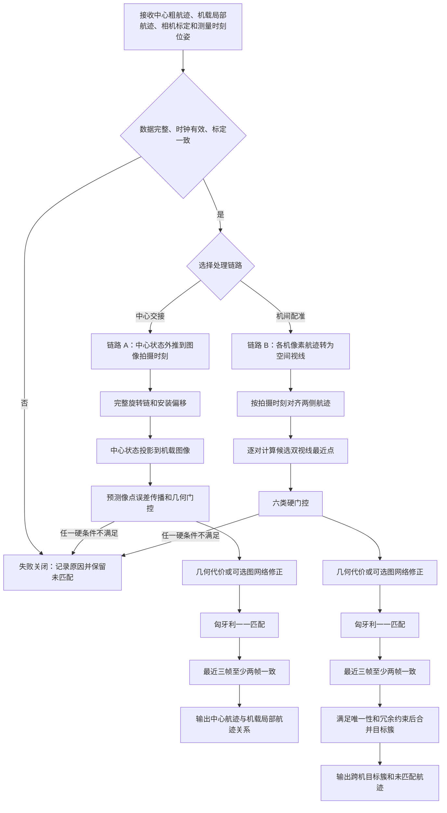
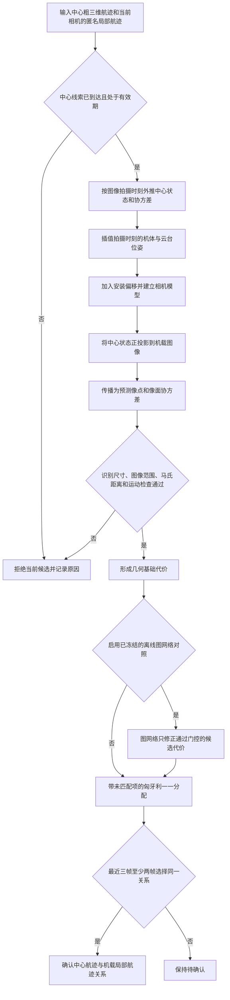
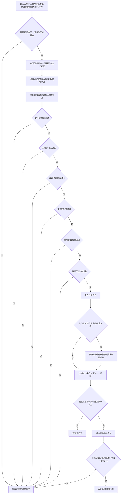

# 末端目标配准算法实施逻辑

本文说明末端目标配准的计算顺序、数据条件、失败处理和实施边界。内容以《末端目标配准试验报告》Word 版本为主依据，并核对现有独立实验实现。本文不是试验结果报告，不用真实目标编号参与在线计算，也不把离线图网络对照写成在线默认能力。

## 一、范围

### 1.1 两条链路

末端目标配准包含两条相互独立的链路。

**链路 A：中心粗三维航迹与拦截无人机局部航迹交接。** 中心已经给出目标在北东地坐标系中的粗位置、速度、协方差、测量时间和有效期。算法将该状态外推到机载图像的拍摄时刻，再投影到机载图像，与机载匿名局部航迹建立一一关系。

**链路 B：拦截无人机之间的目标配准。** 两架拦截无人机都不知道目标三维位置。每架无人机只有本机像素航迹、自身位置、机体姿态、云台姿态和相机参数。算法先把像素观测转换为空间视线，再对两侧局部航迹逐对计算双视线交会条件，最后建立跨无人机目标簇。

两条链路不能混用前提。链路 A 可以使用中心提供的粗三维状态；链路 B 不得把中心目标位置或中心目标编号当成答案。中心交接成功也不代表机间配准自动成功。

### 1.2 不在本文范围内的工作

- 不讨论图像检测器和单相机多目标跟踪器的内部实现；本文把已经形成的匿名局部航迹作为输入。
- 不讨论中心粗三维航迹如何形成，也不使用离线真实位置补足中心状态。
- 不讨论目标分配、制导和飞行控制。
- 不允许拦截无人机改写中心拥有的目标编号。算法只建立“中心航迹编号—机载局部航迹编号”关系。
- 不把候选双视线得到的临时三维点直接当成正式目标身份或稳定三维航迹。

### 1.3 共同原则

1. 所有几何计算使用图像拍摄时刻，不使用消息到达时刻代替拍摄时刻。
2. 先检查时间、坐标和物理条件，再计算候选代价。
3. 图网络只修正已通过硬门控的候选，不放回已被物理条件排除的关系。
4. 最终关系必须满足一一约束和多帧确认。
5. 证据不足时保留未匹配状态，不为提高数量强行配准。
6. 真实目标编号只用于试验结束后的离线评分，不进入在线数据对象、候选特征和决策逻辑。

## 二、输入、输出与前提

### 2.1 主要输入

| 数据 | 关键内容 | 使用链路 | 时效要求 |
| --- | --- | --- | --- |
| 中心粗航迹 | 中心航迹编号、三维位置、三维速度、六维协方差、存在概率、测量时间、到达时间、有效期 | A | 图像拍摄时刻不得早于航迹测量时刻，且不得超过有效期 |
| 机载局部航迹 | 相机编号、本机局部编号、检测框、像素中心、拍摄时间、到达时间、航迹质量、识别尺寸 | A、B | 使用测量时间进行几何对齐，到达时间只判断可用性和延迟 |
| 无人机位姿 | 北东地位置、机体偏航/俯仰/滚转 | A、B | 必须能够插值到图像拍摄时刻 |
| 云台位姿 | 云台偏航/俯仰/滚转 | A、B | 必须与图像拍摄时刻对应 |
| 相机标定 | 分辨率、焦距或视场角、主点；真实相机还需畸变参数 | A、B | 标定版本在一个处理批次内保持不变 |
| 安装标定 | 机体到云台转轴、云台转轴到相机光心的平移与旋转 | A、B | 与当前载荷安装状态一致 |
| 误差参数 | 中心状态、导航位置、机体姿态、云台角和像素中心协方差 | A、B | 与当前传感器状态和标定条件对应 |
| 冻结图网络 | 权重、特征合同、归一化参数、摘要 | 可选 | 缺失或摘要不一致时明确失败，不使用未训练权重 |

### 2.2 主要输出

链路 A 输出中心交接关系。每条记录至少包含中心航迹编号、相机编号、机载局部航迹编号、拍摄时间、到达时间、代价、几何残差、确认次数、决策状态和拒绝原因。状态包括待确认、已确认、中心线索未匹配和机载航迹未注册。

链路 B 输出跨机关系和目标簇。每条关系至少包含两侧相机编号、两侧局部航迹编号、参考时间、代价、确认次数和决策状态。目标簇保存成员局部航迹和来源相机，不替换成员原编号，不写入中心目标编号。未完成配准的局部航迹继续单独保留。

### 2.3 成立前提

- 所有平台使用同一个北东地坐标定义，或可以确定性转换到同一个北东地坐标。
- 两架无人机知道自身位置和姿态。链路 B 不要求知道目标位置，但要求知道两台相机光心之间的相对基线。
- 相机内参、相机安装角和安装偏移已经标定。真实相机若存在不可忽略的镜头畸变，还要先完成畸变标定和像素矫正。
- 图像、导航、机体姿态和云台姿态具有可比较的时钟。时钟偏差不能超过当前对齐门限。
- 本机局部航迹编号在其生命周期内保持稳定，检测框中心与拍摄时间能够追溯。
- 本批数据没有使用真实目标编号、Actor 名称或离线标签参与在线关联。

## 三、总体流程



## 四、时间与坐标基础

### 4.1 两类时间戳

`measurement_timestamp`表示图像曝光、航迹测量或位姿测量发生的物理时刻。状态外推、位姿插值、像素投影、视线交会和运动拟合都使用这个时间。

`arrival_timestamp`表示该消息进入处理节点的时刻。它只用于判断数据是否已经到达、通信延迟是否超限和结果何时可以发布。若用到达时刻的姿态替代拍摄时刻姿态，运动平台上的预测像点会发生系统偏移。

位姿插值需要在图像拍摄时刻前后各有一条样本。缺少一侧样本、样本间隔超过门限、时钟倒退或到达时间早于测量时间时，本帧失败关闭。当前位姿插值工具的默认单侧最大间隔为0.2秒；该数值属于实现配置，部署时应根据实际姿态更新频率重新标定。

### 4.2 坐标系

本文使用以下坐标系：

- `N`：北东地坐标系，作为统一空间坐标；
- `B`：无人机机体坐标系；
- `G`：云台坐标系；
- `C`：相机坐标系。

记 `R_X^Y` 为“将 Y 坐标系中的向量转换到 X 坐标系”。目标点从北东地坐标转入相机坐标的完整旋转链为：

$$
\boldsymbol p_C = R_C^G R_G^B R_B^N
\left(\boldsymbol p_N-\boldsymbol o_C^N\right)
$$

相机光心不能直接用无人机导航点代替。光心位置应加入机体固定偏移、云台转轴偏移和云台到相机光心偏移：

$$
\boldsymbol o_C^N = \boldsymbol p_B^N + R_N^B
\left(\boldsymbol r_{fix}^B+\boldsymbol r_G^B+R_B^G\boldsymbol r_C^G\right)
$$

其中，`p_B^N`为无人机导航参考点，`r_fix^B`为机体固定安装偏移，`r_G^B`为云台转轴相对机体的偏移，`r_C^G`为相机光心相对云台的偏移。旋转和平移必须使用图像拍摄时刻的数据。

### 4.3 正投影

当前 AirSim 相机约定为相机 `x` 轴向前、`y` 轴向右、`z` 轴向下。若目标在相机坐标中为 `p_C=[x_C,y_C,z_C]`，且 `x_C>0`，针孔模型为：

$$
\begin{aligned}
u &= c_x + f_x\frac{y_C}{x_C},\\
v &= c_y + f_y\frac{z_C}{x_C}.
\end{aligned}
$$

目标位于相机后方或投影点超出图像时，该候选不能继续参与中心交接。

### 4.4 像素反投影为空间视线

检测框中心为 `(u,v)`。相机坐标系中的单位方向为：

$$
\boldsymbol d_C=\operatorname{normalize}
\left(
\begin{bmatrix}
1 & (u-c_x)/f_x & (v-c_y)/f_y
\end{bmatrix}^{T}
\right)
$$

再通过旋转链转到北东地坐标：

$$
\begin{aligned}
\boldsymbol d_N &= R_N^B R_B^G R_G^C\boldsymbol d_C,\\
\boldsymbol L(\lambda) &= \boldsymbol o_C^N+\lambda\boldsymbol d_N,
\qquad \lambda>0.
\end{aligned}
$$

当前独立实验使用无畸变针孔模型，因此直接使用检测框中心。接入真实镜头时，必须先把原始像素矫正到针孔模型对应的无畸变像素，再执行上述反投影。

这一步只得到目标的观察方向。未知量 `lambda` 是目标距离，单台相机不能仅凭一个像素点求出它。链路 B 中的临时三维点必须由两条候选视线求最近点后产生，不能在像素反投影阶段提前生成。

### 4.5 误差传播

中心航迹使用六维状态 `x=[位置,速度]`。从航迹测量时刻外推到图像拍摄时刻：

$$
\begin{aligned}
\boldsymbol x_t &= F\boldsymbol x_0,\\
P_t &= FP_0F^T+Q.
\end{aligned}
$$

`Q`表示外推期间可能发生的加速度和机动。投影到图像后，中心目标位置误差、无人机导航位置误差、机体姿态误差、云台角误差和像素中心误差共同形成图像预测协方差：

$$
\begin{aligned}
\Sigma_{joint} &= \operatorname{block\_diag}
\left(P_{position},\Sigma_{nav},\Sigma_{body},\Sigma_{gimbal},\Sigma_{pixel}\right),\\
S_{prediction} &= J_{projection}\Sigma_{joint}J_{projection}^{T}+R_{projection},\\
S_{innovation} &= S_{prediction}+R_{local\_track}.
\end{aligned}
$$

姿态和云台角对像点的关系是非线性的，现有工具使用中心差分求数值雅可比。协方差在计算后进行对称化和最小特征值约束，避免数值误差造成不可逆矩阵。

当前中心交接保存回放主要使用已经合成好的相机最终位姿。完整安装偏移、导航误差、机体姿态误差、云台角误差和像素误差传播已经形成计算与单元测试，但尚未在非零误差的独立 AirSim 回放中完成验证。双视线交会协方差传播也已有计算与单元测试，当前机间配准主流程仍使用固定六类门限，尚未把交会协方差用于动态门控。因此，实施时可以保留这些字段和计算接口，不能把它们写成已经完成真实误差标定。

## 五、链路 A：中心航迹与机载局部航迹交接

### 5.1 分流程



### 5.2 状态外推

对每条中心航迹，以机载图像的拍摄时刻作为目标时刻。若图像时刻早于中心航迹测量时刻，不允许反向外推；若图像时刻超过中心航迹有效期，也不再建立新关系。恒速外推同时更新位置、速度和六维协方差，过程噪声随外推时间增长。

外推后的中心状态仍是粗状态。它的作用是给出机载图像中的预测区域，不是直接替代机载检测结果。

### 5.3 拍摄时刻相机模型

从位姿缓存中取得图像拍摄时刻前后的无人机位置、机体姿态和云台姿态。位置进行线性插值，偏航、俯仰和滚转沿最短角度方向插值。随后加入固定安装旋转和安装偏移，得到该帧真实使用的相机光心和朝向。

如果回放只保存了拍摄时刻的相机最终复合位姿，可以使用复合位姿兼容模式，但必须在记录中标明未展开机体、云台和安装误差，不能把复合位姿误认为完整的分解测量链。

### 5.4 预测像点和几何门控

中心位置正投影得到预测像点 `z_hat`，误差传播得到 `S_prediction`。机载局部航迹像素中心为 `z`，局部测量协方差为 `R_local_track`。使用马氏距离判断候选是否落在当前不确定范围内：

$$
d^2=(\boldsymbol z-\hat{\boldsymbol z})^T
\left(S_{prediction}+R_{local\_track}\right)^{-1}
(\boldsymbol z-\hat{\boldsymbol z})
$$

当前报告中的门控条件如下。这些是独立实验当前配置，不是未经标定即可直接用于实装的固定指标。

| 检查 | 当前条件 | 不通过时的处理 |
| --- | --- | --- |
| 识别尺寸 | 检测框最长边不少于10像素 | 局部航迹不参与当前交接 |
| 数据到达 | 中心线索在当前局部观测可用前已经到达 | 记录“线索尚未到达” |
| 时间有效 | 图像时刻不早于中心测量时刻且不超过有效期 | 记录“线索时间无效” |
| 投影范围 | 目标位于相机前方且预测点在图像内 | 记录“投影位于图像外” |
| 像面统计距离 | `d² <= 9.2103` | 记录“像面门控拒绝” |
| 像面运动 | 有连续观测时，速度残差不超过80像素/秒 | 记录“运动连续性拒绝” |

通过门控后，基础代价由马氏距离和归一化运动残差构成。已确认中心航迹若突然转向另一条机载局部航迹，当前实现增加切换惩罚，但仍要求后续一一分配和多帧确认，不直接修改绑定。

### 5.5 可选图网络修正

中心交接图网络构建一个两侧候选图。一侧节点为中心航迹，保存存在概率、位置不确定度和有效期；另一侧节点为机载局部航迹，保存航迹质量、目标尺寸和像面位置；候选边保存马氏距离、像素残差、运动残差、预测时间差和基础代价。

图网络只接收已经通过时间、识别、投影、马氏距离和运动检查的边，输出同目标概率 `p`。当前中心交接诊断采用：

$$
C_{graph}=C_{base}-2\ln(p)
$$

图网络只改变候选顺序，不直接确认关系，不绕过未匹配选项。该路线已用于保存 AirSim 观测的离线回放；在线默认仍采用几何代价。

### 5.6 一一匹配与确认

以中心航迹为行、机载局部航迹为列建立代价矩阵。每条中心航迹额外设置一个“未匹配”虚拟列。禁用候选使用远高于未匹配代价的值。匈牙利算法一次性求解全局最小代价，使同一中心航迹和同一机载局部航迹在本帧最多使用一次。

本帧选中的关系先进入待确认状态。系统保留最近3帧的选择历史，同一关系至少命中2帧才转为已确认。未达到条件时不发布正式交接；中心线索未匹配和机载航迹未注册分别保留并记录原因。

### 5.7 中心交接伪代码

```text
过程 中心交接一帧(中心线索集合, 本帧局部航迹集合, 标定, 位姿缓存, 配置):
    图像时刻 <- 校验本帧所有局部航迹的 measurement_timestamp 相同
    若本帧没有局部航迹:
        图像时刻 <- 中心线索中的最新测量时刻，若也为空则取空结果时刻

    局部像面速度 <- 根据每条局部航迹的上一帧中心和当前中心计算
    候选集合 <- 空

    对每条 中心线索 source:
        对每条 局部航迹 local:
            原因 <- 空列表

            若 local 未识别 或 检测框最长边小于识别门限:
                原因加入“识别尺寸不足”

            若 source 到达时间晚于 local 到达时间:
                原因加入“中心线索尚未到达”

            若 图像时刻早于 source 测量时刻 或 图像时刻晚于 source 有效期:
                原因加入“中心线索时间无效”

            尝试:
                拍摄时刻相机 <- 从位姿缓存插值并加入安装偏移
                外推状态, 外推协方差 <- 恒速外推(source, 图像时刻)
                预测像点, 预测协方差, 预测像面速度 <- 正投影和误差传播
            失败:
                原因加入具体的位姿、投影或协方差错误

            若能够投影:
                创新协方差 <- 预测协方差 + local 像素中心协方差
                马氏距离 <- 像素残差相对创新协方差的统计距离
                若 马氏距离超过门限:
                    原因加入“像面门控拒绝”

                若 local 有上一帧速度:
                    运动残差 <- local 像面速度与预测像面速度之差
                    若 运动残差超过门限:
                        原因加入“运动连续性拒绝”

            候选可用 <- 原因为空
            基础代价 <- 马氏距离 + 归一化运动代价
            若 source 已确认到另一条 local:
                基础代价 <- 基础代价 + 切换惩罚
            保存候选、检查结果、残差、代价和拒绝原因

    若启用图网络:
        若冻结模型、特征合同或摘要无效:
            失败关闭本次图网络路径，不使用随机权重
        对每条通过硬门控的候选:
            p <- 图网络根据两侧节点和周边竞争边输出同目标概率
            候选代价 <- 基础代价 - 2 * ln(限制到有效范围的 p)

    代价矩阵 <- 可用候选代价 + 每条中心线索的独立未匹配列
    本帧选择 <- 匈牙利一一匹配(代价矩阵)

    对每条可能关系:
        向最近3帧历史追加“本帧是否选中”
        若最近3帧至少2帧选中:
            状态 <- 已确认
            记录中心航迹到本地航迹的关系，但不改写中心编号
        否则若本帧选中:
            状态 <- 待确认

    对每条未选中心线索:
        输出中心线索未匹配及聚合拒绝原因
    对每条未选局部航迹:
        输出机载航迹未注册

    更新局部像素历史和确认历史
    返回本帧候选审计、待确认关系、已确认关系和未匹配项
```

## 六、链路 B：拦截无人机之间的目标配准

### 6.1 分流程



### 6.2 从局部像素航迹到空间视线航迹

每架无人机先独立形成局部像素航迹。每个观测保存检测框中心、检测框最长边、拍摄时间、相机光心和拍摄时刻相机姿态。对航迹中的每一个像素中心执行反投影，得到一组随时间变化的空间视线：

$$
\begin{aligned}
\mathcal T_A &= \{(t_1,\boldsymbol o_{A1},\boldsymbol d_{A1}),
(t_2,\boldsymbol o_{A2},\boldsymbol d_{A2}),\ldots\},\\
\mathcal T_B &= \{(t_1,\boldsymbol o_{B1},\boldsymbol d_{B1}),
(t_2,\boldsymbol o_{B2},\boldsymbol d_{B2}),\ldots\}.
\end{aligned}
$$

这里的“空间视线航迹”仍然只有方向序列，没有目标距离。它表示相机在多个时刻朝哪些方向看到了同一条本地航迹。

### 6.3 时间对齐

两台相机通常不会在完全相同的时刻产生观测。算法收集两条航迹的全部测量时刻，在每个共同参考时刻分别查找前后观测。具备前后样本时，对相机光心、像素中心、检测框最长边和视线方向进行短时插值；缺少前后样本时，只允许使用时间差不超过门限的最近观测。

当前配置要求最近观测与参考时刻的偏差不超过0.16秒，两条航迹最后观测时刻之差不超过0.65秒，并且至少取得3个有效对齐样本。时间对齐失败的组合不计算正式几何代价。

### 6.4 候选双视线最近点

假设一个对齐时刻的两条视线为：

$$
\begin{aligned}
\boldsymbol L_A(\lambda_A)&=\boldsymbol o_A+\lambda_A\boldsymbol d_A,\\
\boldsymbol L_B(\lambda_B)&=\boldsymbol o_B+\lambda_B\boldsymbol d_B.
\end{aligned}
$$

算法求解：

$$
\min_{\lambda_A,\lambda_B}
\left\|\boldsymbol L_A(\lambda_A)-\boldsymbol L_B(\lambda_B)\right\|^2
$$

得到两条视线上的最近点 `P_A`、`P_B`，两点中点 `M=(P_A+P_B)/2`作为该候选关系在该时刻的临时三维点，`||P_A-P_B||`作为视线分离距离。若任一深度为负，表示临时点位于相机后方，该时刻不能作为有效几何样本。

临时三维点仅用于检查“A 航迹和 B 航迹是否可能属于同一目标”。错误航迹组合也可能偶然产生一个近交会点，因此必须继续执行多时刻门控和一一匹配。

### 6.5 六类硬门控

| 门控 | 计算内容 | 当前条件 | 作用 |
| --- | --- | --- | --- |
| 时间差 | 插值偏差、末次观测时差、有效对齐样本数 | 对齐偏差不超过0.16秒；末次时差不超过0.65秒；至少3个样本 | 排除不同时段经过相近方向的目标 |
| 交会角 | 多时刻双视线夹角中位数 | 不小于0.35度 | 避免近乎平行视线造成距离误差放大 |
| 视线分离 | 多时刻最近点距离中位数 | 不超过2米 | 判断两条视线是否指向同一空间邻域 |
| 重投影 | 临时三维点分别投回两幅图像，取两侧较大误差 | 多时刻中位数不超过8像素 | 检查临时点能否同时解释两台相机观测 |
| 运动拟合 | 临时三维点恒速拟合均方根误差和最大转角 | 误差不超过5米；最大转角不超过55度 | 排除位置跳变和运动方向反复变化 |
| 目标尺度 | 最长边与交会距离估计尺度，比较两侧对数差 | 最长边均不少于10像素；对数差不超过0.28 | 排除两侧物理尺度明显不一致的组合 |

六类门控全部通过，只表示该关系可以进入候选排序。它不等于正式配准，不得在此阶段建立跨机目标簇。

### 6.6 几何代价

各项残差先除以对应门限，得到可比较的无量纲值。当前几何代价使用以下权重：

$$
\begin{aligned}
C_{geo}={}&0.24r_{separation}+0.20r_{reprojection}
+0.10r_{time}\\
&+0.18r_{motion}+0.12r_{turn}
+0.08r_{scale}+0.08r_{camera}.
\end{aligned}
$$

视线分离和重投影合计占0.44，时间和运动连续性合计占0.40，目标尺度和相机可信度各占0.08。代价越小，两条局部航迹越可能属于同一目标。

### 6.7 可选图网络修正

图网络按一个相机对构建两侧稀疏候选图。节点保存航迹观测次数、持续时间、平均目标尺寸、航迹质量、相机可信度、方向变化率和平均到达延迟。候选边保存时间差、视线分离、重投影、交会角、运动拟合、运动转角、尺度差、相机可信度和样本支持量。

只有六类硬门控通过的边才能进入图网络。网络同时观察一条边和与其竞争的其他边，输出同目标概率 `p`。当前试验报告中的诊断参数为：

$$
\begin{aligned}
C_{final}&=0.75C_{geo}+0.25(1-p),\\
p&<0.05\quad\text{时不进入一一分配},\\
C_{unmatched}&=0.85.
\end{aligned}
$$

这组参数来自同一批保存回放上的36组诊断搜索，不是独立留出验证参数。图网络在部分密集候选场景能够改善候选顺序，在其他场景会删除过多正确关系。当前默认路线仍是六类硬门控、几何代价和匈牙利匹配；图网络保留为离线诊断选项。

### 6.8 一一匹配和连续确认

每个允许比较的相机对分别建立代价矩阵。矩阵同时包含真实候选和未匹配项。匈牙利算法保证：

- A 相机的一条局部航迹最多对应 B 相机的一条局部航迹；
- B 相机的一条局部航迹最多对应 A 相机的一条局部航迹；
- 候选代价不优于未匹配代价时，航迹保持未匹配；
- 已确认关系与新候选冲突时，冲突候选被阻断，不允许同一航迹产生第二个确认对象。

选中关系先进入待确认状态。最近3帧中至少2帧选择同一关系后，转为已确认。未连续选中的待确认关系从当前待确认集合移除；原局部航迹继续保存，等待后续观测。

### 6.9 目标簇合并

两两确认关系通过并查集聚合为跨无人机目标簇。合并必须满足以下约束：

1. 同一个目标簇中，每台相机最多出现一条局部航迹。
2. 两个成员数均不少于2的成熟目标簇不能仅凭一条跨簇关系直接合并，当前实现要求至少两个不同相机对提供跨簇支持。
3. 只有2个观测的短航迹不能绕过一般门控直接合并。当前实现仅在一个成熟簇至少得到2台其他相机支持、累计有效样本不少于4、单边峰值样本不少于2、几何代价不超过0.18且最佳与次佳簇代价差不少于0.05时，允许按簇级共识接入。
4. 不能唯一确定目标簇的短航迹继续保持未解决状态。
5. 目标簇编号是本次机间配准产生的匿名编号，只用于组织局部航迹，不替代或改写中心航迹编号。

### 6.10 机间配准伪代码

```text
过程 机间配准(全部匿名局部航迹, 相机标定, 相机对计划, 配置, 可选图网络):
    校验每条在线记录不含真实编号、Actor名称或中心全局编号
    丢弃未识别或检测框最长边小于识别门限的观测

    按 measurement_timestamp 对观测分帧
    按 相机编号和本机局部编号 维护航迹历史
    已确认关系 <- 空
    待确认历史 <- 空
    相机对锁定关系 <- 空

    对每个按时间排序的帧 frame:
        把本帧观测追加到对应局部航迹历史
        活动航迹 <- 最近观测距当前帧不超过最大接续间隔的航迹

        对每个允许比较且视场可能重叠的相机对 (A, B):
            候选集合 <- 空

            对 A 的每条活动航迹 track_A:
                对 B 的每条活动航迹 track_B:
                    对齐样本 <- 按拍摄时刻插值或选择最近观测
                    交会样本 <- 空

                    对每个对齐样本 sample:
                        ray_A <- 像素中心、A拍摄时刻位姿和A标定生成的空间视线
                        ray_B <- 像素中心、B拍摄时刻位姿和B标定生成的空间视线
                        最近点_A, 最近点_B, 交会角 <- 求双视线最近点
                        若任一最近点位于相机后方:
                            跳过该样本
                        临时点 <- 两个最近点的中点
                        视线分离 <- 两个最近点的距离
                        重投影误差 <- 临时点投回两台相机后的较大像素误差
                        尺度差 <- 两侧最长边结合交会距离得到的对数尺度差
                        保存该时刻交会样本

                    运动误差, 运动转角 <- 对多时刻临时点做短时恒速拟合
                    门控结果 <- 依次检查时间、交会角、视线分离、
                                重投影、运动拟合和目标尺度
                    几何代价 <- 各项归一残差的加权和
                    保存候选边和全部拒绝原因

            通过候选 <- 仅保留六类硬门控全部通过且不与锁定关系冲突的边

            若使用图网络:
                若冻结模型、归一化参数、特征合同或摘要无效:
                    失败关闭图网络路径，不使用随机模型
                同目标概率 <- 图网络(通过候选构成的稀疏二分图)
                对每条通过候选:
                    若概率低于诊断门限:
                        删除该候选
                    否则:
                        最终代价 <- 几何代价与图网络概率代价的配置化融合
            否则:
                最终代价 <- 几何代价

            代价矩阵 <- 最终候选代价 + 两侧未匹配项
            本帧相机对选择 <- 匈牙利一一匹配(代价矩阵)

            对每条本帧选择关系:
                把当前帧编号加入该关系最近3帧命中历史
                若命中次数不少于2:
                    标记为已确认
                    锁定该相机对中的一一关系
                否则:
                    标记为待确认

            删除本帧未继续选中的过期待确认关系

    全部局部航迹各自建立一个初始目标簇
    按代价从小到大遍历已确认关系:
        若两侧已经在同一簇:
            保留该关系
        否则若合并后同一相机出现两条航迹:
            拒绝合并
        否则若两个簇均为成熟簇且跨簇相机对支持不足:
            拒绝合并并记录“单边桥接不足”
        否则:
            合并两个目标簇

    对仍为单例的短航迹:
        仅在多相机簇级证据、样本量、代价和最佳次佳差均满足时接入成熟簇
        否则保持未解决

    输出已确认关系、待确认关系、跨机目标簇、未解决航迹和候选审计
```

### 6.11 像素转视线伪代码

```text
函数 像素转空间视线(像素中心, 相机内参, 拍摄时刻位姿, 安装标定):
    若输入来自真实畸变镜头:
        无畸变像素 <- 使用标定参数矫正(像素中心)
    否则:
        无畸变像素 <- 像素中心
    相机方向 <- normalize([1,
                           (无畸变u-c_x)/f_x,
                           (无畸变v-c_y)/f_y])
    相机光心 <- 无人机位置 + 机体旋转 * 安装平移链
    空间方向 <- 机体旋转 * 云台旋转 * 相机安装旋转 * 相机方向
    返回 相机光心, normalize(空间方向)

注意:
    返回结果是一条起点已知、距离未知的射线
    不返回目标三维位置
```

### 6.12 六类门控伪代码

```text
函数 检查机间候选(航迹_A, 航迹_B, 配置):
    对齐样本 <- 时间对齐(航迹_A, 航迹_B, 配置.最大对齐偏差)

    若 两条航迹末次观测时差超过最大接续间隔:
        拒绝“时间差”
    若 有效对齐样本少于最小样本数:
        拒绝“时间差”

    对每个对齐样本:
        交会 <- 双视线最近点(样本.视线_A, 样本.视线_B)
        若 交会深度为负:
            跳过
        收集交会角、视线分离、临时中点、重投影误差和尺度差

    若 交会角中位数小于最小交会角:
        拒绝“交会角”
    若 视线分离中位数大于最大分离:
        拒绝“视线分离”
    若 重投影误差中位数大于最大重投影误差:
        拒绝“重投影”

    拟合误差, 最大转角 <- 恒速拟合(临时中点序列)
    若 拟合误差或最大转角超过门限:
        拒绝“运动拟合”
    若 尺度差中位数超过门限:
        拒绝“目标尺度”

    若存在任何拒绝原因:
        返回 不通过, 拒绝原因, 审计残差
    返回 通过, 几何代价, 临时三维点序列
```

## 七、数据对象

### 7.1 中心交接对象

| 对象 | 最小字段 | 约束 |
| --- | --- | --- |
| 中心粗航迹 | 中心航迹编号、位置、速度、六维协方差、测量时间、到达时间、有效期、存在概率 | 中心编号只读；协方差有限且维数正确 |
| 拍摄时刻相机 | 相机编号、内参、机体位置姿态、云台姿态、安装旋转、安装偏移 | 必须对应图像拍摄时刻 |
| 机载局部航迹 | 相机编号、本机编号、像素中心、检测框、拍摄时间、到达时间、质量 | 不含真实目标编号 |
| 投影中心线索 | 外推位置速度、外推协方差、预测像点、像面协方差、预测像面速度、深度 | 目标必须位于相机前方 |
| 中心候选 | 两侧索引、马氏距离、运动残差、基础代价、最终代价、门控结果、拒绝原因 | 未通过门控时使用禁用代价 |
| 中心交接关系 | 中心编号、本机编号、状态、确认次数、残差和时间 | 只建立引用关系，不改写中心编号 |

### 7.2 机间配准对象

| 对象 | 最小字段 | 约束 |
| --- | --- | --- |
| 局部航迹历史 | 相机编号、本机编号、按时排序的像素观测、光心、方向、尺寸和质量 | 同一相机内编号唯一 |
| 对齐观测 | 共同时间、两侧光心、两侧方向、两侧像素中心、尺寸、时间偏差 | 时间偏差处于门限内 |
| 候选边 | 两侧航迹、样本数、时间差、交会角、视线分离、重投影、运动、尺度、代价和拒绝原因 | 不含真实身份和中心编号 |
| 两两关系 | 两侧局部航迹、代价、状态、确认次数、后端 | 同一相机对内满足一一关系 |
| 跨机目标簇 | 匿名簇编号、成员局部航迹、来源相机、状态 | 每台相机最多一个成员 |
| 审计记录 | 各阶段候选数量、拒绝原因、确认和待确认数量 | 大场景可只保留限量候选样本 |

## 八、状态、冲突与恢复

### 8.1 当前记录状态

中心交接当前使用：

```text
候选被拒绝
候选被选中但待确认
关系已确认
中心线索未匹配
机载航迹未注册
```

机间配准当前使用：

```text
候选被拒绝
关系待确认
两两关系已确认
短航迹经目标簇共识确认
目标簇已确认
局部航迹未解决
```

### 8.2 冲突处理

- **同帧一对多冲突：** 由匈牙利算法统一解决，不允许每条航迹各自贪心选择。
- **已确认关系冲突：** 机间配准阻断与已锁定关系矛盾的候选；中心交接对切换增加惩罚并重新执行多帧确认。
- **同相机簇内冲突：** 若目标簇合并会使同一相机出现两条航迹，拒绝合并。
- **成熟目标簇误桥接：** 两个成熟簇至少需要两个不同相机对支持，单条低代价边不能直接桥接。
- **短航迹多解：** 最佳簇和次佳簇差距不足时保持未解决。
- **没有共同目标：** 未匹配代价允许两侧航迹分别保留，不能为了填满矩阵强行对应。

### 8.3 失配恢复

现有独立实验已经实现的恢复措施包括：待确认关系在后续帧未继续选中时撤出待确认集合；活动航迹只保留最大接续间隔内的观测；证据不足的局部航迹保持未解决；短航迹只有获得多相机簇级支持时才能恢复到成熟簇。

面向持续在线运行，还需要补充明确的关系生命周期。建议增加“确认—短时失联—重新核对—过期”状态，并为确认关系设置有效期。相机标定版本变化、时间跳变、导航重置、云台回零、无人机重定位或任务 episode 重置时，应清空位姿插值缓存、候选缓存、确认历史和相机对锁定关系。该生命周期管理不属于当前报告已经验证的能力。

## 九、计算量与缓存

### 9.1 计算规模

对于一个相机对，若 A 有 `n_A`条活动航迹、B 有 `n_B`条活动航迹，原始候选数为 `n_A × n_B`。匈牙利算法的计算量约随较大一侧航迹数的三次方增长。图网络只处理硬门控后的稀疏边，计算量主要随候选边数增长。

多相机场景若直接全相机两两比较，候选数量会快速增加。因此应先根据相机当前视锥、时间重叠和可能距离范围筛选相机对，再生成局部航迹候选。该筛选只能使用在线相机几何，不得读取离线真实目标所属区域。

### 9.2 可直接采用的缓存

- 缓存相机内参逆矩阵、安装旋转和当前拍摄时刻的复合旋转。
- 每条像素观测的空间视线只计算一次，按“相机编号、本机航迹编号、测量时间、标定版本”缓存。
- 缓存局部航迹的时间索引、像面速度、最近观测和有效时间范围。
- 缓存一个相机对的几何候选。缓存键至少包含两侧航迹历史签名和所有几何门限。
- 参数诊断时复用同一批几何候选，只重新计算图网络概率门限、融合权重和未匹配代价。
- 目标簇使用并查集维护，确认关系查询使用集合，避免对全部历史关系重复遍历。

### 9.3 增量和限量建议

- 每到一帧只更新发生变化的航迹和相机对，不重复计算完整历史。
- 航迹历史保留满足时间对齐和运动拟合所需的有限窗口，超窗观测转入归档。
- 大场景使用审计模式，只保存阶段计数、拒绝原因、确认关系和限量候选样本；需要逐边复核时才写出完整候选图。
- 可在硬门控后按每条航迹保留有限数量的低代价候选，但该数量必须通过离线回放证明不会删除真实关系。当前报告没有验证统一的候选上限。
- 计算超时应保留上一时刻仍在有效期内的已确认关系，并将新关系保持待确认；不能清空全部关系，也不能跳过硬门控直接使用图网络结果。该超时策略属于部署建议，尚未在当前试验中验证。

## 十、默认路线、诊断路线与待验证内容

| 能力 | 当前状态 | 使用边界 |
| --- | --- | --- |
| 中心状态恒速外推和六维协方差增长 | 已实现并用于独立实验 | 机动过程噪声仍需按真实目标标定 |
| 北东地—机体—云台—相机完整旋转链和安装偏移 | 计算与单元测试已实现 | 保存回放主要使用相机最终复合位姿，非零安装偏移尚未完成独立 AirSim 复核 |
| 导航、机体姿态、云台角、像素误差联合传播 | 计算与单元测试已实现 | 尚未在带非零误差的新 AirSim 观测中验证 |
| 双视线交会协方差传播 | 计算与单元测试已实现 | 尚未接入当前六类固定门限的在线候选判定 |
| 真实镜头畸变矫正 | 待接入 | 当前独立实验按无畸变针孔模型处理 |
| 中心几何门控、带未匹配项的匈牙利分配和3帧2次确认 | 已实现并用于保存回放复算 | 当前在线默认路线 |
| 中心图网络候选修正 | 已冻结模型并完成离线回放诊断 | 不是在线默认；缺模型时失败关闭 |
| 机间像素反投影、时间对齐、双视线最近点和六类硬门控 | 已实现并用于独立实验 | 门限来自当前仿真条件，不能直接当作实装指标 |
| 机间几何代价、匈牙利分配、多帧确认和目标簇唯一性 | 已实现并用于保存回放复算 | 当前默认路线 |
| 成熟簇冗余桥接和短航迹簇级确认 | 已实现并有专项回放证据 | 多种子和误差敏感性仍需复核 |
| 机间图网络候选修正 | 已冻结模型并完成离线诊断 | 不同场景收益不一致，不能替代几何默认路线 |
| 真实检测器漏检、虚警、导航误差、姿态误差、云台误差、时钟漂移和通信延迟联合验证 | 待验证 | 需要独立多种子 AirSim 回放和误差分项注入 |
| 持续在线关系过期、重定位和标定切换状态机 | 待实施 | 当前独立实验主要处理有限时长回放 |

## 十一、部署时序

每个图像处理周期建议按以下顺序执行：

```text
1. 接收图像并锁定 measurement_timestamp
2. 取得该时刻前后的导航、机体和云台位姿
3. 校验标定版本、时钟和消息新鲜度
4. 更新本机匿名局部航迹
5. 运行链路 A，形成中心交接的待确认或已确认关系
6. 与其他无人机交换匿名局部航迹摘要和拍摄时刻位姿
7. 运行链路 B，形成机间待确认关系和跨机目标簇
8. 发布关系记录、未匹配项和拒绝原因
9. 将真实标签隔离到离线评分通道
10. 记录候选阶段数量、耗时、缓存命中和失败原因
```

链路 A 和链路 B 可以并行计算，但必须分别保存状态。链路 B 的目标簇可以作为后续中心交接的辅助证据，不能反向把中心编号灌入机间候选特征，也不能跳过链路 A 的确认条件。

## 十二、实施检查表

### 12.1 数据与时间

- [ ] 图像、局部航迹、导航、机体姿态和云台姿态均保存测量时间与到达时间。
- [ ] 所有几何计算使用图像拍摄时刻。
- [ ] 位姿样本可以在拍摄时刻两侧形成有效包围。
- [ ] 中心线索未到达、已过期或需要反向外推时失败关闭。
- [ ] episode 重置和时钟跳变会清空所有状态缓存。

### 12.2 标定与坐标

- [ ] 相机内参、畸变、主点和焦距具有版本号。
- [ ] 北东地、机体、云台和相机旋转方向通过正反投影单元测试。
- [ ] 机体到云台、云台到相机光心的安装偏移已加入视线起点。
- [ ] 像素反投影返回单位方向，不返回伪造距离。
- [ ] 双视线临时点只在候选交会后生成，并保留交会误差。

### 12.3 关联约束

- [ ] 中心交接和机间配准分别构建候选，不共享答案。
- [ ] 所有图网络候选先通过硬门控。
- [ ] 匈牙利矩阵包含明确的未匹配选项。
- [ ] 同一相机对满足一一关系。
- [ ] 正式关系满足最近3帧至少2帧一致。
- [ ] 同一目标簇中每台相机最多一条局部航迹。
- [ ] 成熟目标簇不接受单条跨簇边直接桥接。
- [ ] 未匹配和未解决航迹继续保留，不强制合并。

### 12.4 身份与安全边界

- [ ] 在线输入、候选、图网络特征和输出不含真实目标编号或 Actor 名称。
- [ ] 中心目标编号保持中心所有，机载端只建立引用关系。
- [ ] 图网络模型缺失、摘要不一致或特征合同不一致时明确失败。
- [ ] 任何硬门控不通过时，图网络不能恢复该候选。
- [ ] 候选冲突、数据过期、时钟异常和标定异常均输出可审计原因。

### 12.5 验证

- [ ] 分别验证中心交接和机间配准，不用一条链路的成功代替另一条。
- [ ] 覆盖无共同目标、目标交叉、局部可见集合不同、短时漏检和短航迹场景。
- [ ] 分项注入导航、机体姿态、云台、像素和时间同步误差。
- [ ] 使用多个独立种子复核门限，不在同一回放上同时选参和报告最终能力。
- [ ] 同时统计正确关系、错误关系、未完成关系、身份混合、计算时间和失败原因。
- [ ] 将默认几何路线与可选图网络路线分别报告，不混写为同一能力。
