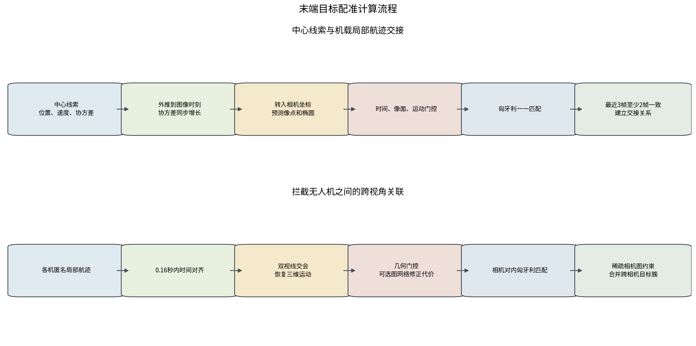
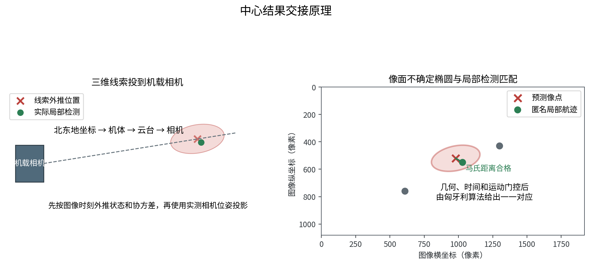
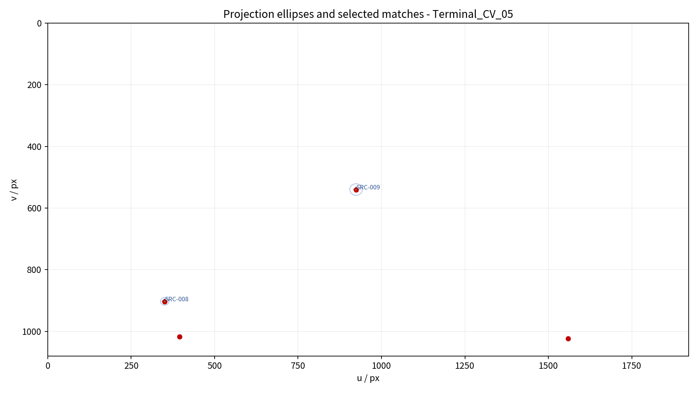
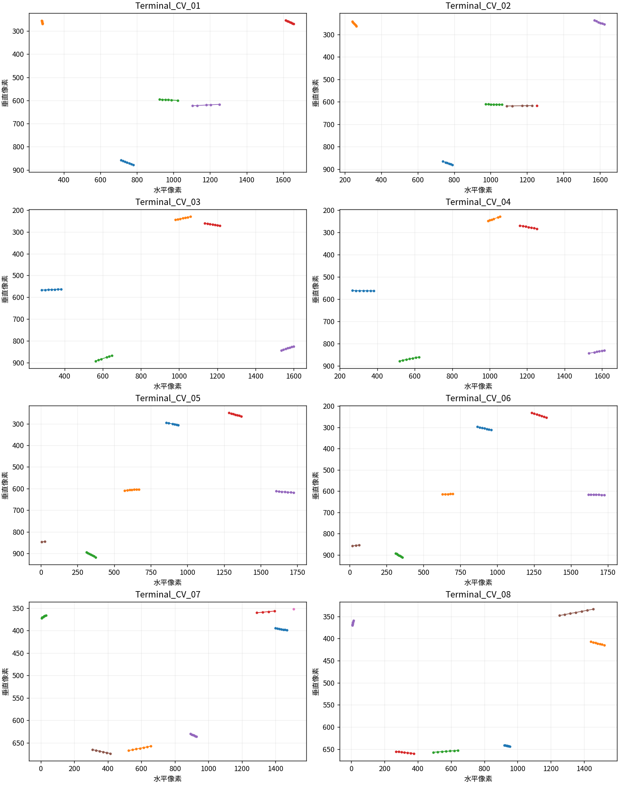
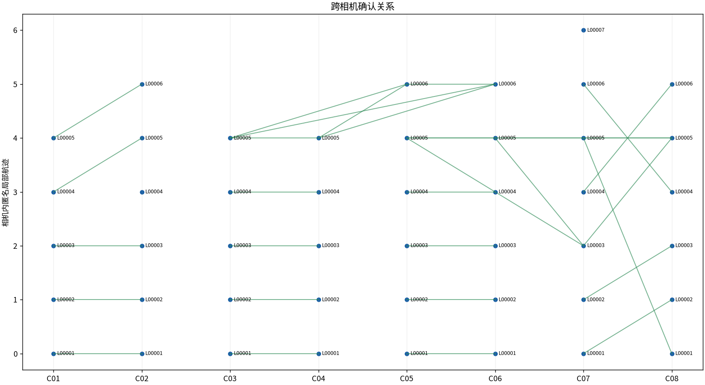

# 末端目标配准试验报告

本报告说明两类关系如何建立：中心线索与拦截无人机局部航迹的交接，以及多架拦截无人机局部航迹之间的跨视角关联。两类计算都保留未匹配状态，并通过一一匹配和多帧确认限制错误绑定。结果来自三组AirSim匿名观测和保存观测上的图神经网络离线复算。

## 一、问题、难点与方法

### 1.1 当前问题与难点

中心线索给出北东地坐标中的位置、速度和协方差，机载相机给出图像中的匿名检测框，两者坐标不同、时间不同、编号也不同。若直接按最近像点绑定，旧线索、目标交叉和相机姿态变化都会引起错配。中心本身还有20%的错误线索和20%的漏检目标，因此算法必须允许中心线索不匹配，也必须允许机载新发现目标保持未注册。

多架拦截无人机看到同一目标时，各机只掌握自己的局部编号。目标在不同视角中的像素位置和检测框大小差异较大；相机数增加后，全部相机两两比较会产生大量没有共同视场的候选。机间关联需要先恢复共同几何关系，再解决一条航迹被多个候选同时占用以及错误关系在相机网络中扩散的问题。



### 1.2 中心线索状态外推

第一步把中心线索推到机载图像的测量时刻。这样比较的是同一时刻的预测位置和实际检测，而不是拿旧坐标直接对当前图像。状态记为位置和速度 `x=[p,v]`，图像时刻与线索测量时刻相差Δt：

```text
x(t) = F x0
F = [[I, Δt·I], [0, I]]
P(t) = F P0 F^T + Q
```

P表示位置和速度的不确定范围，Q表示外推期间可能发生的机动。本试验加速度标准差为0.5米/秒²，Q的位置块、交叉块和速度块分别按 `qΔt⁴/4`、`qΔt³/2` 和 `qΔt²` 增长，其中q=0.5²。线索越旧，预测范围越大，后续像面门限会自动放宽，但错误候选也会增多。

### 1.3 坐标转换与像面预测

外推后的目标位置先减去相机位置，再经过机体、云台和相机安装旋转，得到相机坐标 `(x_c,y_c,z_c)`。AirSim相机x轴朝前、y轴朝图像右侧、z轴朝下。预测点落入图像的位置为：

```text
u = c_x + f_x · y_c / x_c
v = c_y + f_y · z_c / x_c
```

式中f是像素焦距，c是图像中心。若目标位于相机后方或预测点在图像外，候选直接排除。线索位置协方差通过投影雅可比矩阵J转换到图像，再与投影误差和检测中心误差相加，得到预测椭圆S。实际检测中心z与预测中心z_hat的偏差按预测椭圆归一化：

```text
S = J P_pos J^T + R_projection + R_local
d² = (z - z_hat)^T S^-1 (z - z_hat)
```

d²不只看相差多少像素，还看这条线索本来有多不确定。候选需同时满足检测框不小于10像素、线索已经到达且未过期、预测点在图像内、d²不大于9.2103，以及有历史速度时像面速度差不大于80像素/秒。



### 1.4 中心交接代价与确认

通过门控的候选进入代价矩阵。若有S条中心线索、L条机载局部航迹，先建立S×L个真实候选，再为每条中心线索增加一个专用未匹配列，矩阵为S×(L+S)。几何代价同时考虑位置和像面运动：

```text
C_geo = d² + (运动残差 / 80)²
```

已经确认的中心线索若切换到其他局部航迹，代价增加4.0；未匹配项代价为12.0。匈牙利算法一次求解整个矩阵，使一条中心线索最多占用一条局部航迹，一条局部航迹也不会被多条中心线索重复使用。关系需要在最近3帧中至少2帧被选中，才转为正式交接。未达到条件的中心线索保持未匹配，机载航迹保持未注册。

图神经网络对照只处理已经通过硬门控的候选，不扩大候选范围。网络输出同一目标概率P_gnn后，将代价修正为 `C_final=C_geo-2log(P_gnn)`，再使用相同的匈牙利算法和多帧确认。网络不能绕过图像范围、时间有效性和马氏距离门限。

### 1.5 机间时间对齐与双视线交会

各机先把匿名检测框串成局部航迹。机间关联以局部航迹为单位，不比较不同相机的局部编号。检测框中心 `(u,v)` 先反投影成相机坐标单位视线，再根据相机姿态转到北东地坐标：

```text
d_c = normalize([1, (u-c_x)/f_x, (v-c_y)/f_y])
d_n = normalize(R_n_c d_c)
```

两台相机的观测时间允许相差0.16秒。算法对两条局部航迹插值或选择最近观测，形成多组时间对齐样本。对每组样本，分别从相机位置沿两条单位视线延伸，求两条空间直线的最近点，最近点中点作为交会位置，最近点距离作为视线分离误差。至少3组有效交会样本才能进入后续运动拟合。


### 1.6 机间几何代价、图网络和目标簇

候选首先经过硬门控：航迹更新时间差不大于0.65秒、视线夹角不小于0.35度、视线分离不大于2米、重投影误差不大于8像素、运动拟合误差不大于5米、运动转角不大于55度、检测框尺度对数差不大于0.28。通过后，将各项误差除以门限并封顶为3，再计算几何代价：

```text
C_geo = 0.24C_sep + 0.20C_reproj + 0.10C_time
      + 0.18C_motion + 0.12C_turn + 0.08C_scale + 0.08C_conf
```

几何代价越小，两条局部航迹越可能属于同一目标。图神经网络对照在同一硬门控白名单内输出同目标概率，再按 `C_final=0.55C_geo+0.45(1-P_gnn)` 修正代价。每个相机对分别建立航迹代价矩阵，未匹配代价为1.05，匈牙利算法完成一一匹配；最近3帧至少2次选中同一关系后确认。

确认关系最终合并为跨相机目标簇。一个目标簇不能包含同一相机的两条航迹；两个成熟目标簇至少需要两个不同相机对共同支持才能合并；只有2帧的短航迹需要成熟簇内至少两台相机支持。该约束用于阻止一条错误关系把多个真实目标串成一个簇。

相机数量较多时，不再比较所有相机对。同一搜索责任区的相机对保留；相邻责任区只有在共同帧内视场重叠时保留，并增加5度视场余量；其余相机对排除。保留相机作为节点、可能共同观测的相机对作为边，形成稀疏相机图。这个图只由责任区、相机参数和观测姿态生成，不读取真实目标编号。


## 二、试验配置

### 2.1 场景与输入

| 项目 | 设置 |
| --- | --- |
| 仿真模式 | AirSim ComputerVision |
| 规模 | 20目标/8机、20目标/30机、40目标/50机 |
| 中心相机 | 2台，1280×1024，水平视场角3.67度 |
| 机载相机 | 1920×1080，水平视场角19度，相机前移0.5米 |
| 目标 | 无人机静态网格Actor，速度50米/秒，最长尺寸3米 |
| 中心线索 | 精度80%、召回率80%，位置标准差1米，速度标准差0.2米/秒 |
| 识别接口 | AirSim simGetDetections；检测框最长边不小于10像素 |
| 在线身份 | 只使用匿名检测和局部航迹；不读取Actor名称和真实目标编号 |
| 图网络 | 独立合成数据训练，seed 20260816留出；只做保存观测离线复算 |
| 随机种子 | 20260816；每个规模单次采集 |

### 2.2 评价口径与边界

中心交接精度按正确绑定数除以全部绑定数计算，召回率按正确绑定数除以正确中心线索数计算。机间关系精度按正确跨相机关系数除以全部输出关系数计算，关系召回率按正确关系数除以应建立关系数计算。身份混合表示同一目标簇内出现多个离线真实目标。上述真值只在运行结束后评分。

中心交接和跨视角几何基线读取AirSim匿名观测。图神经网络使用同一批保存观测离线复算，没有重新运行Blocks。复算时间包含关联、审计文件和绘图，不能当作机载实时延迟。ComputerVision节点不含飞行动力学，本试验没有验证导航误差、云台姿态误差、通信丢包、真实检测器和物理拦截。

## 三、试验过程、结果与分析

### 3.1 中心交接过程与结果

每组中心交接读取5帧观测。每帧先把全部有效中心线索外推到图像时刻，按相机位姿投影到各机图像，再对10像素、时间、图像范围、马氏距离和像面运动逐项门控。通过门控的候选组成代价矩阵，完成一一匹配并累计最近3帧确认次数。图网络对照复用相同白名单、匹配和确认逻辑。



| 场景 | 方法 | 正确绑定 | 错误绑定 | 精度 | 召回率 | 中位复算时间 |
| --- | --- | --- | --- | --- | --- | --- |
| 20目标/8机 | 几何 | 16 | 0 | 1.0000 | 1.0000 | 2.391秒 |
| 20目标/8机 | 图神经网络 | 16 | 0 | 1.0000 | 1.0000 | 2.460秒 |
| 20目标/30机 | 几何 | 14 | 0 | 1.0000 | 0.8750 | 2.751秒 |
| 20目标/30机 | 图神经网络 | 14 | 0 | 1.0000 | 0.8750 | 2.882秒 |
| 40目标/50机 | 几何 | 31 | 1 | 0.9688 | 0.9688 | 15.819秒 |
| 40目标/50机 | 图神经网络 | 31 | 0 | 1.0000 | 0.9688 | 15.862秒 |


20目标/8机中，几何和图网络都正确绑定16条有效中心线索，没有错误绑定。20目标/30机中，两种方法均正确绑定14条，另有2条正确线索没有完成绑定，召回率为0.8750。资源数量增加没有自动提高交接结果，因为三组专项在reset后独立采样，局部航迹数量和连续性并不完全相同。

40目标/50机中，几何方法正确绑定31条，同时误接1条错误线索，精度和召回率均为0.9688。图网络保留31条正确绑定并拒绝该错误关系，精度提高到1.0000，召回率保持0.9688。该差异只出现在单个留出回放中，支持保留学习对照，不能据此替换几何门控和一一匹配。

### 3.2 机间关联过程与结果

跨视角复算先按责任区和视场形成相机图，再对每条保留边上的局部航迹执行时间对齐、双视线交会、运动拟合和几何门控。相机对内完成匈牙利匹配和多帧确认后，再按相机唯一性和多边支持规则合并目标簇。全相机策略作为规模压力对照，责任区/视场稀疏策略作为当前默认路径。



| 场景 | 相机图 | 方法 | 正确 | 错误 | 精度 | 召回率 | 身份混合 |
| --- | --- | --- | --- | --- | --- | --- | --- |
| 20目标/8机 | 全相机 | 几何 | 30 | 0 | 1.0000 | 0.9375 | 0 |
| 20目标/8机 | 全相机 | 图神经网络 | 30 | 0 | 1.0000 | 0.9375 | 0 |
| 20目标/8机 | 责任区/视场稀疏 | 几何 | 30 | 0 | 1.0000 | 0.9375 | 0 |
| 20目标/8机 | 责任区/视场稀疏 | 图神经网络 | 30 | 0 | 1.0000 | 0.9375 | 0 |
| 20目标/30机 | 全相机 | 几何 | 558 | 302 | 0.6488 | 0.8871 | 5 |
| 20目标/30机 | 全相机 | 图神经网络 | 571 | 310 | 0.6481 | 0.9078 | 3 |
| 20目标/30机 | 责任区/视场稀疏 | 几何 | 564 | 198 | 0.7402 | 0.8967 | 4 |
| 20目标/30机 | 责任区/视场稀疏 | 图神经网络 | 571 | 142 | 0.8008 | 0.9078 | 2 |
| 40目标/50机 | 全相机 | 几何 | 3538 | 2537 | 0.5824 | 0.8167 | 18 |
| 40目标/50机 | 全相机 | 图神经网络 | 4031 | 2094 | 0.6581 | 0.9305 | 7 |
| 40目标/50机 | 责任区/视场稀疏 | 几何 | 4031 | 16 | 0.9960 | 0.9305 | 0 |
| 40目标/50机 | 责任区/视场稀疏 | 图神经网络 | 4031 | 16 | 0.9960 | 0.9305 | 0 |

候选规模和复算时间单独列示，避免将质量指标与计算量混在一张宽表中。

| 场景 | 相机图 | 方法 | 保留相机对 | 候选边 | 复算时间 |
| --- | --- | --- | --- | --- | --- |
| 20目标/8机 | 全相机 | 几何 | 28 | 5778 | 12.43秒 |
| 20目标/8机 | 全相机 | 图神经网络 | 28 | 5778 | 12.95秒 |
| 20目标/8机 | 责任区/视场稀疏 | 几何 | 16 | 3296 | 8.87秒 |
| 20目标/8机 | 责任区/视场稀疏 | 图神经网络 | 16 | 3296 | 9.45秒 |
| 20目标/30机 | 全相机 | 几何 | 435 | 85847 | 139.78秒 |
| 20目标/30机 | 全相机 | 图神经网络 | 435 | 85847 | 162.48秒 |
| 20目标/30机 | 责任区/视场稀疏 | 几何 | 267 | 52635 | 97.82秒 |
| 20目标/30机 | 责任区/视场稀疏 | 图神经网络 | 267 | 52635 | 97.40秒 |
| 40目标/50机 | 全相机 | 几何 | 1225 | 1104646 | 1842.79秒 |
| 40目标/50机 | 全相机 | 图神经网络 | 1225 | 1104646 | 2062.61秒 |
| 40目标/50机 | 责任区/视场稀疏 | 几何 | 403 | 375236 | 770.99秒 |
| 40目标/50机 | 责任区/视场稀疏 | 图神经网络 | 403 | 375236 | 812.96秒 |



20目标/8机中，四种组合都得到30条正确关系、0条错误关系和2条漏配，精度1.0000、召回率0.9375。稀疏相机图把相机对从28组降到16组，候选边从5778条降到3296条，质量不变，复算时间从全相机几何的12.43秒降到8.87秒。

20目标/30机中，全相机候选过密，几何方法精度只有0.6488。责任区和视场筛选后，几何精度提高到0.7402。稀疏图网络进一步把错误关系从198条降到142条，精度达到0.8008、召回率达到0.9078，身份混合从4个降到2个。该规模下，先缩小相机比较范围，再由学习模型处理剩余歧义，产生了可测增益。

40目标/50机中，全相机几何需要处理1,104,646条候选边，输出2537条错误关系并形成18个身份混合。稀疏策略把相机对从1225组降到403组，候选边降到375,236条。稀疏几何得到4031条正确关系、16条错误关系，精度0.9960、召回率0.9305，身份混合为0。稀疏图网络结果相同，复算时间由770.99秒增加到812.96秒，因此该规模没有继续使用图网络的质量收益。


三组结果表明，中心交接和机间关联都需要保留几何白名单、未匹配状态、一一匹配和多帧确认。大规模机间关联的主要改进来自责任区和视场形成的稀疏相机图。图神经网络适合处理硬门控后仍有歧义的候选，在20目标/30机场景产生增益，在40目标/50机稀疏几何已经接近满精度时没有继续改善。当前默认路径仍为稀疏相机图、几何门控和匈牙利匹配。

以上数字来自seed 20260816的单次AirSim观测和对应离线复算，不具有多seed统计意义。真实相机标定漂移、时间同步偏差、导航误差和真实漏检虚警会直接影响投影、视线交会和单机局部航迹，仍需在后续试验中单独注入并标定。
