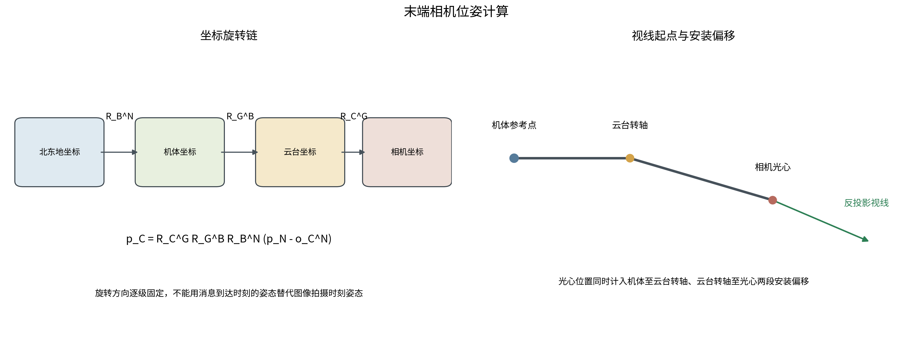
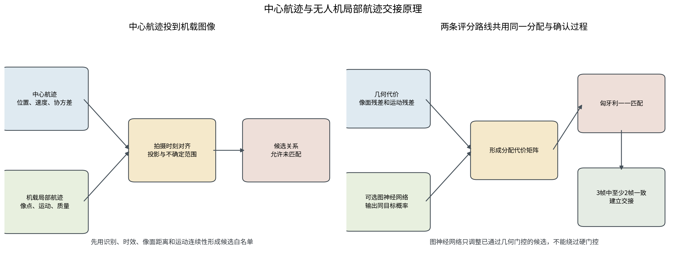
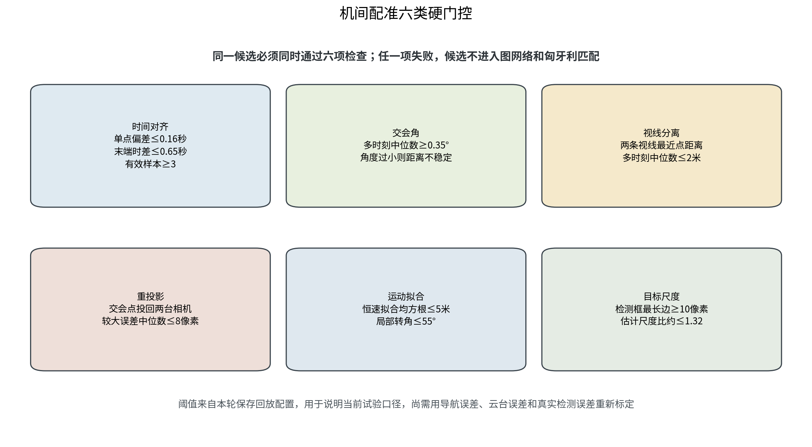
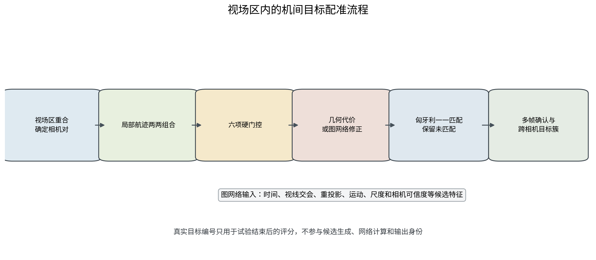
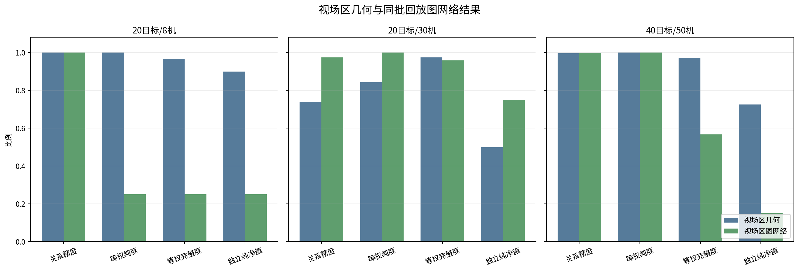

# 末端目标配准试验报告

本报告研究两类末端关系。第一类是把中心给出的目标航迹与拦截无人机看到的局部航迹对应起来，完成目标交接；第二类是多架拦截无人机同时看到相邻目标时，判断各机航迹是否属于同一目标。在线计算使用目标状态、时间戳、相机位姿、检测框和匿名局部航迹。真实目标编号只在试验结束后用于评分。

## 一、任务与总体流程

### 1.1 任务边界

中心航迹和机载图像不在同一坐标系。中心给出北东地坐标系下的位置、速度和协方差，机载相机给出图像中的检测框和局部航迹。无人机飞行、机体转动和云台转动会同时改变目标在图像中的位置。中心交接必须先把两类数据换算到同一拍摄时刻和同一相机视角。

机间配准不使用中心目标编号作为答案。每架无人机先独立形成局部航迹，再根据两机的拍摄时刻、位置、姿态和图像观测判断是否为同一目标。视场区没有重合、几何证据不足或候选冲突时，航迹保持未配准状态，不强行建立关系。

### 1.2 总体流程

中心交接和机间配准共用三项原则：按图像拍摄时刻取位姿；先用物理和几何条件排除不可能关系；最后进行一一匹配和多帧确认。两条链路分别计算，中心交接成功不代表机间配准自动成功。


## 二、中心航迹与无人机配准

### 2.1 状态外推与时刻对齐

中心航迹先外推到图像的测量时刻。恒速模型写为 `x(t)=Fx0`，协方差按 `P(t)=FP0F^T+Q` 增长，Q表示外推期间可能发生机动带来的不确定度。机体位置、机体姿态和云台姿态也按图像的测量时间插值。消息到达时间只判断数据是否过期，不用于计算相机朝向。

插值必须取得拍摄时刻前后的位姿样本。缺少一侧样本或样本间隔超过门限时，当前图像不建立中心交接关系。这样可以避免用消息到达时刻的姿态替代拍摄时刻姿态，造成预测像点整体偏移。

### 2.2 坐标转换与安装偏移

旋转顺序固定为北东地坐标到机体坐标、机体坐标到云台坐标、云台坐标到相机坐标。目标点转入相机坐标的关系为：

```text
p_C = R_C^G R_G^B R_B^N (p_N - o_C^N)
```

相机光心通常不在无人机机体参考点上。光心位置需要加入机体到云台转轴、云台转轴到相机光心两段安装偏移：

```text
o_C^N = p_B^N + R_N^B (r_fix^B + r_G^B + R_B^G r_C^G)
```

像点 `(u,v)` 按针孔相机模型反投影为相机坐标系单位视线，再用上述旋转链转回北东地坐标。正投影和反投影必须使用同一光心、同一旋转方向和同一拍摄时刻位姿。



### 2.3 预测像点与几何匹配

中心航迹投到机载图像后，结果不是一个绝对准确的像素点。中心目标位置、无人机导航位置、机体姿态、云台角和检测框中心的误差会共同改变预测位置。系统将这些误差传播到图像平面，在预测点周围形成一个不确定范围：

```text
S_image = J_image Σ_x J_image^T + R_projection
d² = (z - z_hat)^T S_image^-1 (z - z_hat)
```

其中 `z_hat` 是中心航迹的预测像点，z是机载局部航迹的观测像点。d²同时考虑预测偏差和误差范围，比直接比较像素距离更适合处理粗位置线索。检测框最长边不足10像素、中心线索尚未到达或已经过期、预测点落在图像之外、d²大于9.2103的组合不再继续比较。有连续观测时，还要求两条航迹的像面速度差不超过80像素/秒。

几何方法把归一化像面距离和运动差形成基础代价。距离越小、运动越接近，候选代价越低。全部候选统一进入带未匹配选项的一一分配，同一条中心航迹和同一条机载航迹都只能使用一次。最近3帧中至少2帧得到相同关系后，系统才确认交接。

### 2.4 图网络辅助匹配

目标密集时，一个中心预测范围内可能同时出现多条机载航迹。几何方法能够排除明显不合理的组合，但剩余候选的代价可能很接近。图网络用于处理这部分候选，不扩大前面的预测范围，也不放回已经被几何条件排除的关系。

候选关系组成一个两侧航迹图。一侧是中心航迹，保存目标存在概率、位置不确定度和有效期；另一侧是机载局部航迹，保存航迹质量、目标像素尺寸和像面位置。通过前述检查的组合形成连线，连线上记录像面距离、运动差和预测时间差。图网络同时比较一条连线及其周边竞争关系，输出两条航迹属于同一目标的概率p。

图网络不直接发布交接关系，只按 `C=C_base-2ln(p)` 修正基础代价。概率高的关系保留较低代价，概率低的关系受到更大惩罚。修正后的代价仍由同一套匈牙利算法进行一一分配，并执行3帧中2帧确认。该路线已经用于保存AirSim观测的离线回放；当前在线默认仍采用几何方法。



## 三、拦截无人机之间的配准

### 3.1 视场区与局部航迹

机间配准从各架无人机独立形成的局部航迹开始，不使用中心目标编号作为答案。无人机位置、机体姿态、云台朝向、相机视场角和目标可能距离共同确定相机当前能够观察的空间范围，报告中称为视场区。两台相机只有在同一时间段内可能看到同一片空间，才进入后续比较。

保留下来的相机对再比较各自的匿名局部航迹。系统按照图像拍摄时刻对齐观测，并把检测框中心转换为空间视线。一对局部航迹此时只是候选，还不能直接认定为同一目标。系统继续检查多时刻视线能否交会、交会点能否解释两幅图像，以及交会点的运动是否连续。


### 3.2 六类硬门控

六类门控依次回答六个问题：两条航迹是否处于同一时间段，双视线是否具备稳定交会条件，视线是否在空间中靠近，交会结果能否重新解释两幅图像，多个交会点是否形成连续运动，两侧目标尺度是否相符。全部通过只表示这组关系具备继续比较的条件，并不表示已经完成配准。

#### 时间差

同一目标必须在相近时刻被两台相机看到。两条航迹先在共同时间轴上对齐，有前后观测时采用线性插值；不能插值时，最近观测与对齐时刻的差值不得超过0.16秒。两条航迹最后一次观测的时差不得超过0.65秒，并且至少取得3个有效对齐样本。这样可以排除在不同时段经过相近方向的目标。

#### 交会角

对每个对齐时刻计算两条视线的夹角，再取多时刻中位数。当前门限为0.35度。夹角过小时，两条视线近乎平行，图像中很小的偏差会引起很大的距离误差。此时可以保留各自的局部航迹，但不建立机间关系。

#### 视线分离

受测量误差影响，两条空间视线通常不会严格相交。系统在两条视线上分别找到距离最近的点，并计算两点间距 `δ=||(o_A+λ_A d_A)-(o_B+λ_B d_B)||`。多时刻距离中位数不超过2米时，才认为两条视线可能指向同一目标。这里的2米是视线分离距离，不是两架无人机之间的距离。

#### 重投影

两条视线最近点的中点作为临时三维位置，再分别投回两台相机。若这个位置确实对应同一目标，投影点应回到原来的检测框附近。每个时刻取两侧误差中较大的一个，多时刻中位数不得超过8像素。

#### 运动拟合

多个时刻的临时三维位置应当组成一段连续航迹。系统按 `X(t)=X0+v(t-t0)` 进行短时恒速拟合，拟合均方根残差不得超过5米，相邻运动段相对总体方向的最大转角不得超过55度。位置散乱或运动方向反复跳变的组合被排除。

#### 目标尺度

检测框最长边首先应达到10像素，保证观测具备基本辨认条件。系统再根据交会距离z、相机焦距f和检测框最长边 `l_px` 估计目标尺度 `s=l_px z/f`。两侧尺度估计之比不大于约1.32时通过检查。这里使用检测框最长边，不使用波动更大的检测框面积。



### 3.3 候选评分与一一分配

通过六类门控后，一条局部航迹仍可能对应多条候选。几何方法把各项残差换算到可比较的尺度，再形成综合代价。视线分离和重投影合计占0.44，时间和运动连续性合计占0.40，目标尺度和相机可信度各占0.08。代价越小，两条局部航迹越可能属于同一目标。

图网络与几何方法使用同一批候选。两侧局部航迹构成节点，通过门控的组合形成连线。网络同时查看一条连线和与它竞争的其他连线，输出同目标概率p。当前诊断采用 `C_final=0.75C_geo+0.25(1-p)`，即几何代价占主要部分，图网络负责修正候选顺序；概率低于0.05的关系不进入分配。

几何方法和图网络最终都把候选代价交给匈牙利算法。算法从整个候选矩阵中统一选择一一关系，避免同一条航迹同时分给多个目标，并允许证据不足的航迹保持未匹配。最近3帧中至少2帧选中同一关系后才正式确认。

确认关系随后合并为跨相机目标簇。同一目标簇不能包含同一相机的两条不同航迹；两个已经形成的较大目标簇需要多个相机对共同支持才能继续合并，避免一条偶然关系造成身份混合。



## 四、试验配置与评价方法

### 4.1 试验配置

| 项目 | 设置 |
| --- | --- |
| 仿真模式 | AirSim计算机视觉模式保存回放 |
| 场景规模 | 20目标/8机、20目标/30机、40目标/50机 |
| 目标运动 | 3米无人机网格Actor，速度50米/秒 |
| 机载相机 | 1920×1080，水平视场角19度 |
| 识别条件 | 检测框最长边不少于10像素 |
| 中心线索 | 构造精度80%、召回率80%的粗航迹 |
| 相机关系 | 默认只比较视场区可能重合的相机对 |
| 试验时间 | 18秒，AirSim ClockSpeed为0.1 |
| 试验种子 | 20260816；每个规模一组保存观测 |
| 在线身份 | 匿名局部编号；真实编号只用于离线评分 |

三组回放已经保存图像拍摄时刻的相机光心和最终相机姿态，因此本报告结果按合成相机位姿读取。新增加的机体安装偏移、导航误差、机体姿态误差和云台角误差传播已经形成计算与单元测试，但尚未用带非零误差的新AirSim观测重新验证。

### 4.2 图网络诊断参数

机间图网络只调整概率门限、几何与图网络融合权重以及未匹配代价。六类硬门控、网络权重文件、匈牙利匹配和多帧确认保持不变。三组保存回放共搜索36组参数，选定值如下。参数直接在本报告回放上选择，结果用于诊断，不能视为独立留出验证。

| 参数 | 搜索范围 | 本报告取值 |
| --- | --- | --- |
| 同目标概率门限 | 0、0.05、0.15、0.30 | 0.05 |
| 图网络融合权重 | 0.25、0.45、0.65 | 0.25 |
| 未匹配代价 | 0.85、1.05、1.25 | 0.85 |

### 4.3 评价方法

中心交接统计正确绑定、错误绑定、绑定精度和绑定覆盖度。机间配准的评价分母只包含至少被两台相机看到、具备配准机会的真实目标。关系精度表示输出关系中正确关系的比例，关系覆盖度表示应建立的真实关系中已经建立的比例。

目标等权纯度表示一个目标的最佳目标簇中有多少成员确属该目标；目标等权完整度表示该目标应合并的局部航迹有多少进入最佳目标簇。独立正确成簇比例要求目标的全部可评分局部航迹进入同一簇且没有混入其他目标。身份混合目标数统计进入混合簇的目标，未完成目标数统计有双视角机会但没有形成正确跨视角关系的目标。

## 五、试验结果

### 5.1 中心航迹与无人机交接

中心交接分别采用几何方法和图神经网络方法对同一批AirSim匿名观测复算。图网络使用与试验种子隔离的合成数据训练，试验回放不进入训练。

| 场景 | 方法 | 正确绑定 | 错误绑定 | 绑定精度 | 绑定覆盖度 | 复算耗时中位数 |
| --- | --- | --- | --- | --- | --- | --- |
| 20目标/8机 | 几何方法 | 16 | 0 | 1.0000 | 1.0000 | 2.391秒 |
| 20目标/8机 | 图神经网络 | 16 | 0 | 1.0000 | 1.0000 | 2.460秒 |
| 20目标/30机 | 几何方法 | 14 | 0 | 1.0000 | 0.8750 | 2.751秒 |
| 20目标/30机 | 图神经网络 | 14 | 0 | 1.0000 | 0.8750 | 2.882秒 |
| 40目标/50机 | 几何方法 | 31 | 1 | 0.9688 | 0.9688 | 15.819秒 |
| 40目标/50机 | 图神经网络 | 31 | 0 | 1.0000 | 0.9688 | 15.862秒 |
| 三组合计 | 几何方法 | 61 | 1 | 0.9839 | 0.9531 | 按场景列示 |
| 三组合计 | 图神经网络 | 61 | 0 | 1.0000 | 0.9531 | 按场景列示 |


20目标/8机和20目标/30机中，两种方法得到相同的正确与错误绑定数量。图网络复算耗时分别增加约0.069秒和0.130秒，没有带来数量上的改善。40目标/50机中，几何方法得到31条正确绑定和1条错误绑定；图网络保留31条正确绑定并去除该错误关系，绑定精度由0.9688提高到1.0000，复算耗时增加约0.043秒。

三组合计，几何方法形成61条正确绑定和1条错误绑定，绑定精度为0.9839，绑定覆盖度为0.9531；图网络同样形成61条正确绑定，没有错误绑定，绑定精度为1.0000，绑定覆盖度保持0.9531。在正确绑定数量和覆盖度不降低的条件下，图网络减少了错误关系，因此本次已测中心交接场景中，图网络总体效果优于几何方法。

该结论来自种子20260816的保存观测离线回放。图网络已经实际用于中心交接对照，但单个种子的证据还不足以改变在线默认路线。后续需要在导航、姿态、云台、时间同步和检测误差条件下开展多种子复核。

### 5.2 拦截无人机之间的配准

下表比较视场区几何方法和同批回放上的图网络诊断结果。所有方法使用相同六类硬门控和相机对范围。

| 场景 | 方法 | 机会目标 | 关系精度 | 关系覆盖度 | 目标等权纯度 | 目标等权完整度 | 独立正确成簇比例 | 身份混合目标 | 未完成目标 |
| --- | --- | --- | --- | --- | --- | --- | --- | --- | --- |
| 20目标/8机 | 视场区几何 | 20 | 1.0000 | 0.9375 | 1.0000 | 0.9667 | 0.9000 | 0 | 0 |
| 20目标/8机 | 视场区图网络 | 20 | 1.0000 | 0.1562 | 0.2500 | 0.2500 | 0.2500 | 0 | 15 |
| 20目标/30机 | 视场区几何 | 20 | 0.7402 | 0.8967 | 0.8438 | 0.9737 | 0.5000 | 7 | 0 |
| 20目标/30机 | 视场区图网络 | 20 | 0.9736 | 0.8203 | 1.0000 | 0.9587 | 0.7500 | 0 | 0 |
| 40目标/50机 | 视场区几何 | 40 | 0.9960 | 0.9305 | 1.0000 | 0.9710 | 0.7250 | 0 | 0 |
| 40目标/50机 | 视场区图网络 | 40 | 0.9971 | 0.4003 | 1.0000 | 0.5666 | 0.1500 | 0 | 0 |

耗时为无缓存关联计算，不含Word生成和图片绘制。

| 场景 | 方法 | 视场区相机对 | 候选关系 | 无缓存耗时 |
| --- | --- | --- | --- | --- |
| 20目标/8机 | 视场区几何 | 16 | 3296 | 1.03秒 |
| 20目标/8机 | 视场区图网络 | 16 | 3296 | 1.18秒 |
| 20目标/30机 | 视场区几何 | 267 | 52635 | 16.39秒 |
| 20目标/30机 | 视场区图网络 | 267 | 52635 | 18.55秒 |
| 40目标/50机 | 视场区几何 | 403 | 375236 | 122.69秒 |
| 40目标/50机 | 视场区图网络 | 403 | 375236 | 131.01秒 |




20目标/8机中，视场区几何方法的关系精度为1.0000，目标等权完整度为0.9667，没有身份混合或未完成目标。图网络保持关系精度1.0000，但关系覆盖度降至0.1562，15个具备机会的目标没有完成配准。该组参数对低歧义场景过于保守。

20目标/30机中，几何方法的关系精度为0.7402，7个目标发生身份混合。图网络把关系精度提高到0.9736，身份混合降为0，目标等权完整度保持在0.9587。该场景中，同一视场区内存在较多相邻候选，图网络对候选竞争关系的排序产生了明显作用。

40目标/50机中，几何方法的关系精度为0.9960，目标等权完整度为0.9710，没有身份混合或未完成目标。图网络关系精度为0.9971，但关系覆盖度降至0.4003，目标等权完整度降至0.5666。几何方法已经能稳定区分大部分候选，图网络概率门限删除了过多正确关系。

## 六、结论与限制

中心交接已经实际运行几何方法和图神经网络两条计算路线。两条路线共用时刻对齐、完整相机位姿、误差传播、匈牙利一一匹配和多帧确认。三组回放中，图网络在保持61条正确绑定和0.9531覆盖度的同时，将错误绑定由1条降为0。本次已测中心交接场景中，图网络总体效果优于几何方法；当前在线默认仍采用几何方法，待多种误差和多种子复核后再决定是否切换。

机间配准已经把时间差、交会角、视线分离、重投影、运动拟合和目标尺度落实为六类硬门控，并在门控后比较几何评分和图网络评分。图网络在20目标/30机场景明显降低身份混合，但同一组参数在另外两个场景损失了较多正确关系。当前不宜用统一图网络参数替换视场区几何方法。

本报告三组结果均来自种子20260816的一次AirSim保存回放。真实检测器的漏检和虚警、时间同步漂移、非零安装偏移、导航误差、机体姿态误差、云台稳定误差和通信延迟尚未进入本轮结果。下一步应先按误差来源分别注入，再完成多种子标定，并使用独立留出回放确定图网络概率门限。
