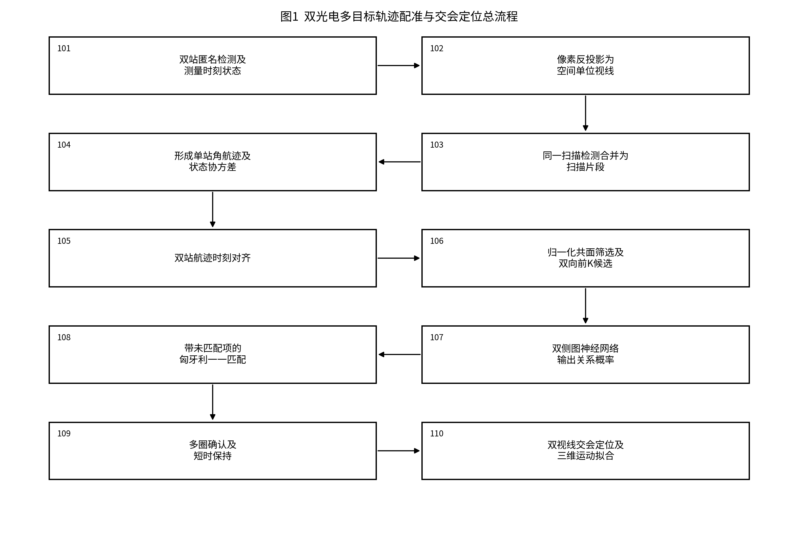
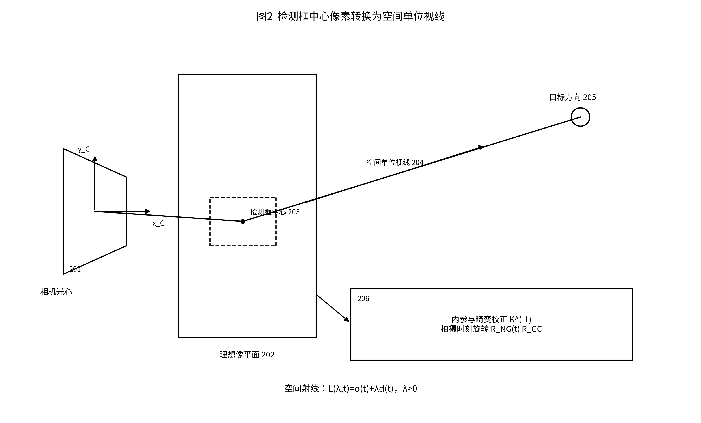
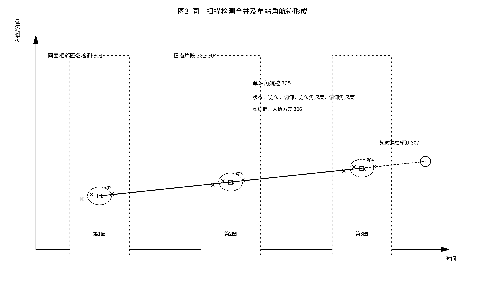
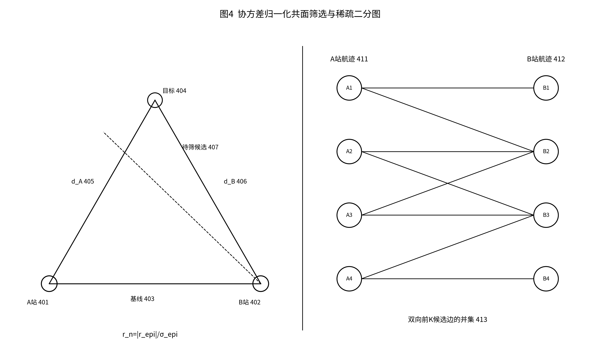
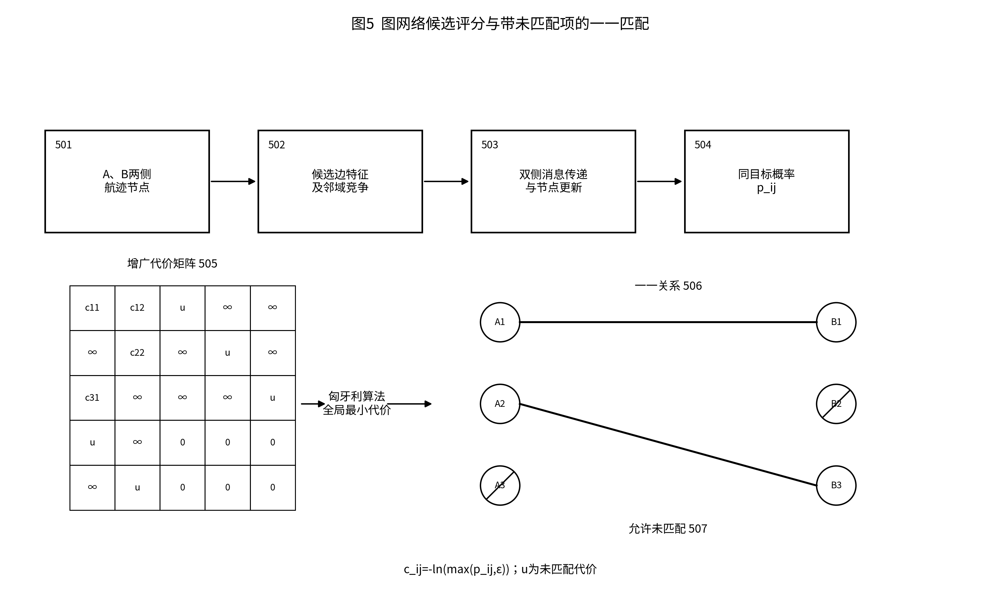
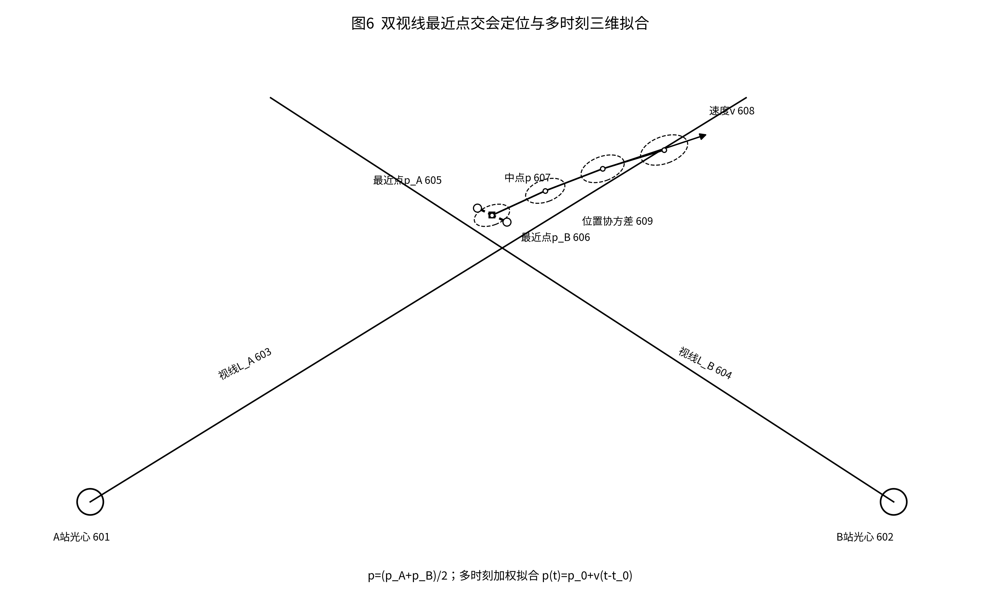

# 基于图神经网络的双光电多目标轨迹配准与交会定位方法

**申请人：**【待填写】  
**发明人：**【待填写】

## 摘要

本发明公开一种基于图神经网络的双光电多目标轨迹配准与交会定位方法。该方法将双站匿名检测框按拍摄时刻姿态转换为空间单位视线，经同一扫描合并和单站角航迹滤波得到带协方差的方位、俯仰及角速度；对双站航迹进行时刻对齐，依据协方差归一化共面残差和双向前K候选构建稀疏二分图，通过双侧图神经网络输出同目标概率，再采用带未匹配虚拟项的匈牙利算法获得一一关系。经多圈确认和短时保持后，以双视线最近点中点完成交会定位，并由多时刻结果估计三维位置、速度及不确定度。本方法适用于双站可见目标集合不同、目标密集交叉及短时漏检条件下的多目标关联定位。

## 摘要附图

摘要附图采用图1。

## 权利要求书

1. 一种基于图神经网络的双光电多目标轨迹配准与交会定位方法，其特征在于，包括：  
   S1，获取第一光电站和第二光电站的匿名检测结果、测量时间戳、到达时间戳、站位信息、图像拍摄时刻的云台姿态以及相机标定参数，其中，所述匿名检测结果至少包括检测框和检测置信度；  
   S2，根据所述相机标定参数和图像拍摄时刻的云台姿态，将各检测框的中心像素反投影至统一坐标系，得到以对应光电站相机光心为起点的空间单位视线；  
   S3，在同一扫描内，依据测量时间间隔和空间单位视线之间的角距离，将相邻检测合并为扫描片段；  
   S4，分别对第一光电站和第二光电站的扫描片段进行跨扫描关联和状态估计，形成包含方位角、俯仰角、方位角速度、俯仰角速度及状态协方差的单站角航迹；  
   S5，依据测量时间戳确定第一光电站与第二光电站的角航迹共同观测区间，并将待比较的双站角航迹对齐至一个或多个共同参考时刻；  
   S6，计算各双站角航迹组合的协方差归一化共面残差，剔除超过共面门限的组合，并分别从第一光电站至第二光电站以及从第二光电站至第一光电站选取残差排序的前K个候选，将两个方向的候选并集构建为稀疏二分图；  
   S7，将第一光电站角航迹和第二光电站角航迹作为所述稀疏二分图的两侧节点，将候选组合作为候选边，通过双侧图神经网络在两侧节点之间执行消息传递，根据节点特征、候选边特征及相邻候选的竞争关系输出每条候选边属于同一目标的概率；  
   S8，将所述概率转换为候选匹配代价，在代价矩阵中加入分别对应两侧角航迹的未匹配虚拟项，并采用匈牙利算法求解第一光电站角航迹与第二光电站角航迹之间的一一匹配关系；  
   S9，根据所述一一匹配关系在多个扫描周期内的重复出现情况确认双站航迹关系，并对已确认关系在短时漏检或目标交叉期间进行有限时长的关系保持；  
   S10，对于已确认的双站航迹关系，在共同参考时刻求取两条空间视线的最近点，以两个最近点的中点作为交会位置样本，并根据多个共同参考时刻的交会位置样本拟合目标的三维位置、三维速度及对应不确定度。

2. 根据权利要求1所述的方法，其特征在于，步骤S2包括：对检测框中心像素进行镜头畸变校正；利用相机内参矩阵的逆矩阵获得相机坐标系下的视线方向；利用相机相对云台的安装旋转和图像拍摄时刻的云台旋转将所述视线方向转换至统一坐标系；根据站位信息和相机相对站体的安装偏移确定相机光心；其中，几何计算采用测量时间戳对应的站位和姿态，到达时间戳用于通信延迟和输入时效检查。

3. 根据权利要求1所述的方法，其特征在于，步骤S3包括：按照测量时间戳对同一扫描内的空间单位视线排序；当相邻空间单位视线的时间间隔不大于预设时间门限且角距离不大于预设角度门限时，将相邻空间单位视线归入同一扫描片段；对同一扫描片段内的空间单位视线进行归一化平均或依据测量协方差进行加权平均，并由片段内视线离散程度和像素测量误差确定扫描片段协方差。

4. 根据权利要求3所述的方法，其特征在于，步骤S4采用恒角速度状态模型对扫描片段进行滤波，状态向量为方位角、俯仰角、方位角速度和俯仰角速度；根据预测状态与扫描片段之间的马氏距离建立单站关联代价并执行一一分配；对未获得扫描片段的角航迹依次设置为滑行、休眠或终止状态，并在预设保持期间内利用前向预测与新扫描片段的反向拟合结果进行航迹重接。

5. 根据权利要求4所述的方法，其特征在于，步骤S5包括：求取双站角航迹样本时间范围的交集；在所述交集内选取共同参考时刻；对空间单位视线进行球面插值或归一化线性插值，并将单站状态协方差传播至所述共同参考时刻；当共同观测区间为空、有效对齐样本数不足或外推时长超过预设时限时，将对应双站角航迹组合保持为未匹配状态。

6. 根据权利要求5所述的方法，其特征在于，步骤S6中，设第一光电站至第二光电站的单位基线为 $\hat{\boldsymbol b}$，第一光电站和第二光电站在共同参考时刻的空间单位视线分别为 $\boldsymbol d_A$ 和 $\boldsymbol d_B$，以 $\boldsymbol d_A\times\hat{\boldsymbol b}$ 的归一化向量作为共面法向量，计算 $\boldsymbol d_B$ 在所述共面法向量上的投影得到共面角残差；通过误差传播获得所述共面角残差的标准差，并以共面角残差绝对值与所述标准差之比作为协方差归一化共面残差；所述前K个候选按照角航迹成熟程度和协方差归一化共面残差排序。

7. 根据权利要求6所述的方法，其特征在于，步骤S7中，所述节点特征至少包括航迹持续时间、观测样本数、方位与俯仰变化范围、角速度、近期命中情况和状态不确定度；所述候选边特征至少包括多时刻共面残差统计量、共同观测时间比例、角速度差、运动一致性、交会角、视线分离量和联合不确定度；所述双侧图神经网络分别编码两侧节点特征和候选边特征，以置换不变的聚合运算汇总相邻候选消息，更新两侧节点表示，并将候选边两端的节点表示、节点表示差和候选边表示输入分类器得到所述概率。

8. 根据权利要求7所述的方法，其特征在于，步骤S8将候选边的同目标概率 $p_{ij}$ 转换为候选匹配代价 $c_{ij}=-\ln(\max(p_{ij},\varepsilon))$，其中 $\varepsilon$ 为正数；为第一光电站的每条角航迹设置专属未匹配虚拟列，为第二光电站的每条角航迹设置专属未匹配虚拟行，将未通过候选筛选的组合设为禁止代价，将未匹配虚拟项设为预设未匹配代价，并仅保留代价低于所述预设未匹配代价的实际航迹对。

9. 根据权利要求8所述的方法，其特征在于，步骤S9在长度为L个扫描周期的滑动窗口中，当同一双站航迹关系至少出现M次且满足最小观测周期数时，将其状态由暂定状态或待确认状态转为确认状态，其中 $1<M\leq L$；已确认关系在当前扫描周期未被选中但其历史支持仍处于所述滑动窗口内时转为短时保持状态；当保持时长、姿态时效、共面残差或关系冲突超过相应门限时，停止发布该关系。

10. 根据权利要求9所述的方法，其特征在于，步骤S10包括：求解第一空间视线与第二空间视线之间距离最小时对应的两个视线参数；拒绝视线近似平行、任一视线参数非正、交会角小于预设角度或两个最近点间距超过预设距离的交会结果；对有效交会位置样本采用加权最小二乘法拟合恒速度运动模型，并根据像素测量误差、相机标定误差、站位误差、姿态误差、交会角和两个最近点间距传播得到三维位置和三维速度的协方差。

11. 根据权利要求7所述的方法，其特征在于，所述双侧图神经网络通过离线样本训练，离线样本中的真实目标身份仅用于生成候选边监督标签和评价结果；在线运行时，图神经网络的输入不包含真实目标身份；训练完成后冻结网络权重、特征归一化参数、特征版本、共面门限、K值和未匹配代价，当运行时版本或候选图指纹与冻结配置不一致时停止发布匹配结果。

12. 一种基于图神经网络的双光电多目标轨迹配准与交会定位系统，其特征在于，包括：  
   数据接收模块，用于接收双站匿名检测、测量时间戳、到达时间戳、站位、图像拍摄时刻云台姿态和相机标定参数；  
   视线生成模块，用于将检测框中心像素转换为空间单位视线；  
   单站成轨模块，用于将同一扫描的相邻检测合并为扫描片段，并形成包含方位角、俯仰角、角速度和协方差的单站角航迹；  
   候选图构建模块，用于对双站角航迹进行时刻对齐，并通过协方差归一化共面残差及双向前K候选构建稀疏二分图；  
   图网络评分模块，用于通过双侧消息传递输出候选边属于同一目标的概率；  
   一一匹配模块，用于将所述概率转换为代价，加入未匹配虚拟项，并通过匈牙利算法确定一一匹配关系；  
   关系确认模块，用于执行多扫描周期确认以及短时漏检或目标交叉期间的有限时长关系保持；  
   交会定位模块，用于对已确认关系求取双视线最近点中点，并由多时刻交会结果估计三维位置、三维速度及不确定度。

13. 根据权利要求12所述的系统，其特征在于，还包括质量控制模块，所述质量控制模块用于在发生输入标定版本不一致、测量时间倒退、站间基线退化、候选图指纹不一致、图神经网络输出非有限值、匹配关系重复占用、处理超时或交会几何退化中的至少一种情况时，将当前结果标记为不可用，并禁止以到达较晚的数据回填已经结束的扫描周期。

14. 一种电子设备，包括处理器和存储器，其特征在于，所述存储器存储有计算机程序，所述计算机程序被所述处理器执行时，使所述处理器实施权利要求1至11中任一项所述的方法。

15. 一种非暂态计算机可读存储介质，其上存储有计算机程序，其特征在于，所述计算机程序被处理器执行时，使所述处理器实施权利要求1至11中任一项所述的方法。

## 说明书

## 技术领域

[0001] 本发明涉及光电探测、多目标跟踪、跨传感器数据关联和计算机视觉技术领域，具体涉及一种基于图神经网络的双光电多目标轨迹配准与交会定位方法、系统、电子设备及存储介质。

## 背景技术

[0002] 双站光电探测通过设置具有空间基线的两台光电设备，从不同方向观测同一空域。单台光电设备能够由图像检测结果获得目标的方向信息，但单次方向观测缺少距离量。两台光电设备在确认观测对象相同后，可以利用两条空间视线的几何关系计算目标三维位置。因此，双站系统在定位之前必须先解决跨站目标关系确定问题。

[0003] 现有双平台光电交会定位方法多侧重于在已知目标对应关系或目标数量较少的条件下求解空间位置；现有多目标航迹关联方法则多依据距离、方位、速度等特征逐对计算代价。当目标数量增加、运动方向相近或航迹发生交叉时，同一条单站航迹周围往往存在多条几何上相近的候选航迹。逐对评分难以利用候选之间的竞争关系，直接选择最近候选还可能导致一条航迹被重复分配。

[0004] 周扫或扇扫光电还具有观测间断性。目标每次进入窄视场时会连续产生多个检测框，而相邻扫描之间存在较长空档。若直接将每帧检测作为跨站关联对象，会造成同一目标在一次扫过期间重复建轨；若只比较单帧像素位置，又会受到两站视角差异、扫描相位差和消息延迟的影响。目标短时漏检或交叉时，单圈确定的关系也容易发生跳变。

[0005] 此外，两站可见目标集合通常并不完全相同。某一目标可能仅被一站观测，虚警和断裂航迹也可能只出现在一侧。如果一一分配过程要求每条航迹必须找到对应对象，会强制产生错误关系。若先将所有航迹两两组合，候选数量又随两侧航迹数乘积增长，不利于多目标条件下的计算时效。

[0006] 因此，需要一种从匿名检测开始，能够统一处理像素视线转换、单站角航迹形成、稀疏候选生成、候选竞争关系评分、允许未匹配的一一分配、多扫描周期确认以及三维交会定位的完整方法。该方法还应明确测量时刻与消息到达时刻的用途，传播观测不确定度，并在输入、匹配或交会条件不足时停止发布不可靠结果。

## 发明内容

### 一、要解决的技术问题

[0007] 本发明要解决的技术问题是：在双光电设备对密集多目标进行间歇扫描观测时，如何在不使用在线真实目标身份、两站可见目标集合不同且存在短时漏检或目标交叉的条件下，建立稳定的一一跨站航迹关系，并在所述关系确认后获得带不确定度的目标三维位置和速度。

### 二、技术方案

[0008] 为解决上述技术问题，本发明提供一种基于图神经网络的双光电多目标轨迹配准与交会定位方法。该方法首先接收双站匿名检测及与图像拍摄时刻对应的设备状态，把检测框中心转换为空间单位视线；再将同一扫描内的相邻检测压缩为扫描片段，分别建立双站单站角航迹；随后对双站角航迹进行时刻对齐，以协方差归一化共面残差和双向前K候选形成稀疏二分图；通过双侧图神经网络给候选关系评分，并由带未匹配虚拟项的匈牙利算法确定一一关系；关系通过多扫描周期确认后，再进行双视线交会定位和多时刻三维运动拟合。

[0009] 所述匿名检测不携带可直接表示真实目标身份的信息。真实目标身份可以在离线训练期间用于生成监督标签，但在在线候选生成、图网络推理、一一匹配和定位过程中不作为输入。

[0010] 所述测量时间戳表示图像曝光或检测量形成的时刻，用于姿态选择、视线转换、时间对齐和运动估计；所述到达时间戳表示检测消息到达处理单元的时刻，用于延迟检查和处理时限检查。二者分开保存，以避免使用消息到达时的云台姿态替代图像拍摄时的云台姿态。

[0011] 所述协方差归一化共面残差把像素测量、角航迹估计和姿态等误差折算到共面方向上，使同一物理门限能够随航迹不确定度调整。双向前K候选取第一站逐航迹选择结果和第二站逐航迹选择结果的并集，以降低两侧航迹数量或断裂程度不同造成的单向漏选。

[0012] 所述图神经网络不直接发布目标身份，也不取消几何候选边界。图神经网络仅在稀疏候选图内部综合单条候选的几何、时间和运动信息及其邻域竞争关系，输出候选同目标概率。概率经代价转换后，由确定性一一匹配约束和未匹配虚拟项形成当前扫描周期的匹配关系。

[0013] 所述交会定位仅针对已确认关系执行。对于近似平行视线、负深度、交会角过小、最近点分离过大、有效时刻不足或拟合残差过大的情况，不发布三维结果。有效交会位置按其不确定度参与多时刻加权拟合，得到目标参考时刻三维位置、三维速度和协方差。

[0014] 本发明还提供一种用于实施上述方法的双光电多目标轨迹配准与交会定位系统、电子设备及非暂态计算机可读存储介质。

### 三、有益效果

[0015] 与把单帧检测直接进行双站两两比较的方法相比，本发明先把同一扫描的重复检测合并为扫描片段，并在单站形成带角速度和协方差的角航迹，使跨站比较对象具有连续时间信息，减少同一目标重复进入候选图的情况。

[0016] 本发明利用协方差归一化共面残差删除明显不符合双站几何关系的组合，并采用双向前K候选并集形成稀疏二分图，能够在保留两侧候选对称性的同时限制后续图网络计算规模。

[0017] 本发明的双侧图神经网络在候选边评分时同时利用两侧邻域中的竞争关系，适于区分目标密集或角航迹交叉时的相近候选；图网络输出仍经匈牙利算法的一一约束和未匹配判定，避免一条角航迹同时对应多条对侧航迹，并允许两站可见目标集合不同。

[0018] 本发明采用多扫描周期确认和有限时长关系保持，能够降低单圈匹配抖动，并使已确认关系在短时漏检期间保持连续；当历史支持消失或关系冲突超过门限时停止发布，避免无限延续旧关系。

[0019] 本发明在配准关系确认后才进行交会定位，并将像素、姿态、站位、角航迹和交会几何的不确定度传播至三维结果，有利于区分“关系是否可信”和“定位几何是否可用”两个质量环节。

[0020] 本发明保留特征版本、模型权重、候选图和输入数据的配置校验，在版本不一致、处理超时或几何退化时停止发布结果，便于对在线运行过程进行复核。

## 附图说明

[0021] 图1为本发明双光电多目标轨迹配准与交会定位方法的总体流程图；

[0022] 图2为检测框中心像素转换为空间单位视线的原理图；

[0023] 图3为同一扫描检测合并为扫描片段并形成单站角航迹的示意图；

[0024] 图4为协方差归一化共面筛选及稀疏二分图构建的示意图；

[0025] 图5为双侧图神经网络评分和带未匹配虚拟项的一一匹配示意图；

[0026] 图6为双视线最近点交会定位和多时刻三维运动拟合示意图。

## 具体实施方式

### 一、坐标、数据和处理边界

[0027] 以下结合附图对本发明作进一步说明。所述实施方式用于说明本发明的技术原理，不用于限定保护范围。本说明书所称“交会定位”，是指利用不同站位的两条或多条空间视线求取目标三维位置的过程，与工程资料中使用的“交汇定位”含义相同。第一光电站记为A站，第二光电站记为B站。两站可以是固定站，也可以是能够在图像拍摄时刻提供相机光心位置和姿态的移动站。统一坐标系可以采用北、东、地坐标系或其他预先约定的三维坐标系。

[0028] 每条匿名检测至少包括：相机编号、匿名检测编号、图像帧号、检测框、检测置信度、测量时间戳、到达时间戳和扫描编号。设备状态至少包括：站体位置、云台方位角、云台俯仰角、相机相对云台的安装关系和相机光心相对站体参考点的安装偏移。相机标定参数至少包括内参矩阵、主点、焦距和镜头畸变参数。

[0029] 单站局部航迹编号只在本站有效。跨站关系以A站局部航迹编号和B站局部航迹编号的有序对表示，不将其中一个局部编号直接改写成跨站身份。离线真实目标身份与在线匿名观测分离保存，仅在训练图网络和评价匹配结果时使用。

### 二、总体处理流程

[0030] 如图1所示，本实施例包括步骤101至步骤110。步骤101接收双站匿名检测和测量时刻状态；步骤102执行像素至空间单位视线转换；步骤103形成扫描片段；步骤104形成单站角航迹；步骤105进行双站时刻对齐；步骤106执行归一化共面筛选并构建双向前K候选；步骤107利用双侧图神经网络输出候选关系概率；步骤108执行带未匹配虚拟项的一一匹配；步骤109进行多扫描周期确认和短时保持；步骤110对确认关系实施双视线交会定位及三维运动拟合。

[0031] 各扫描周期采用因果处理方式。当前扫描周期的结果只使用截止时刻以前的观测，不使用后续扫描周期的数据回填。每个扫描周期保存输入指纹、标定版本、模型版本、候选图指纹和阶段耗时，以便判断不同处理路线是否使用相同输入。

### 三、检测框中心转换为空间单位视线

[0032] 如图2所示，设检测框左上角和右下角像素坐标分别为 $(x_1,y_1)$ 和 $(x_2,y_2)$，检测框中心203为：

$$
u_d=\frac{x_1+x_2}{2},\qquad v_d=\frac{y_1+y_2}{2}。
$$

[0033] 根据镜头径向畸变和切向畸变参数，将 $(u_d,v_d)$ 校正为理想像平面202上的像素 $(u,v)$。设相机内参矩阵为 $K$，则相机坐标系中的未归一化方向和单位方向为：

$$
\widetilde{\boldsymbol d}_C=K^{-1}
\begin{bmatrix}u\\v\\1\end{bmatrix},\qquad
\boldsymbol d_C=\frac{\widetilde{\boldsymbol d}_C}
{\|\widetilde{\boldsymbol d}_C\|}。
$$

[0034] 设相机坐标系至云台坐标系的安装旋转为 $R_{GC}$，图像拍摄时刻云台坐标系至统一坐标系的旋转为 $R_{NG}(t_m)$，则空间单位视线204的方向为：

$$
\boldsymbol d_N(t_m)=
\operatorname{normalize}\left(R_{NG}(t_m)R_{GC}\boldsymbol d_C\right)。
$$

[0035] 设站体参考点在统一坐标系中的位置为 $\boldsymbol p_N(t_m)$，相机光心相对站体参考点的安装偏移为 $\boldsymbol l$，对应安装旋转为 $R_{NB}(t_m)$，则相机光心201为：

$$
\boldsymbol o_N(t_m)=\boldsymbol p_N(t_m)+R_{NB}(t_m)\boldsymbol l。
$$

由此得到空间射线：

$$
\boldsymbol L(\lambda,t_m)=\boldsymbol o_N(t_m)+
\lambda\boldsymbol d_N(t_m),\qquad \lambda>0。
$$

[0036] 上述计算中的 $t_m$ 为测量时间戳，不采用消息到达时刻的云台姿态。当设备消息以不同频率到达时，在测量时间戳附近对站位和姿态进行插值；插值时间差超过允许范围时，当前检测不进入后续处理。检测框面积不用于直接估算距离；对于远距离小目标，检测框面积可作为诊断信息保存。

### 四、扫描片段和单站角航迹

[0037] 如图3所示，窄视场扫过同一目标时，同一扫描内会连续产生多个匿名检测301。若把每个检测分别送入跨扫描跟踪，同一目标可能产生多个局部航迹。本实施例按照相机编号和扫描编号分组，将组内空间单位视线按测量时间戳排序；相邻观测同时满足时间间隔门限和角距离门限时，合并为扫描片段302至304。

[0038] 对扫描片段内第q条单位视线 $\boldsymbol d_q$ 及其权重 $w_q$，片段方向可表示为：

$$
\overline{\boldsymbol d}=
\operatorname{normalize}\left(\sum_q w_q\boldsymbol d_q\right)。
$$

权重可由像素角分辨率和测量协方差确定；当各检测具有相同测量精度时采用等权。片段时间取加权平均测量时间，片段协方差由像素测量误差和片段内角度离散程度共同确定。

[0039] 将单位方向 $\boldsymbol d=[d_N,d_E,d_D]^T$ 转换为方位角 $\alpha$ 和俯仰角 $\beta$：

$$
\alpha=\operatorname{atan2}(d_E,d_N),
$$

$$
\beta=-\operatorname{atan2}\left(d_D,
\sqrt{d_N^2+d_E^2}\right)。
$$

方位角跨越正负180度时，以航迹预测角为参考进行角度展开。

[0040] 单站角航迹305采用恒角速度状态：

$$
\boldsymbol x_k=
\begin{bmatrix}
\alpha_k&\beta_k&\dot\alpha_k&\dot\beta_k
\end{bmatrix}^{T}。
$$

对于相邻状态间隔 $\Delta t$，状态转移矩阵可取：

$$
F(\Delta t)=
\begin{bmatrix}
1&0&\Delta t&0\\
0&1&0&\Delta t\\
0&0&1&0\\
0&0&0&1
\end{bmatrix}。
$$

根据目标允许角加速度设置过程噪声矩阵 $Q$，并按 $P^-_k=F P_{k-1}F^T+Q$ 传播状态协方差306。

[0041] 对预测角航迹i和扫描片段j，计算创新向量 $\boldsymbol \nu_{ij}$ 和创新协方差 $S_{ij}$，马氏距离为：

$$
D^2_{ij}=\boldsymbol \nu_{ij}^{T}S_{ij}^{-1}\boldsymbol \nu_{ij}。
$$

超过单站门限的组合禁止关联；门限内组合经一一分配后更新角航迹。角航迹在预设扫描窗口内获得足够命中后进入确认状态；短时未命中时按状态预测形成短时漏检预测307，随后依次进入滑行、休眠或终止状态。

[0042] 在一种实施例中，同一扫描相邻检测时间门限为0.06秒，角距离门限为0.12度，角航迹采用最近3个扫描周期至少命中2次的确认方式。上述数值与相机帧率、扫描速度和目标角速度有关，可在设备标定后调整，不构成对本发明的限定。

### 五、双站时刻对齐和共面候选筛选

[0043] 对A站角航迹i和B站角航迹j，先求取两条航迹样本时间范围的交集。若交集为空，则不建立候选边。若存在共同时间区间，则在区间内选取一个或多个共同参考时刻，将两条航迹的单位视线分别插值至共同参考时刻。插值后对单位向量重新归一化，并同步传播方位、俯仰状态协方差。

[0044] 如图4左侧所示，A站401和B站402的位置分别为 $\boldsymbol o_A$ 和 $\boldsymbol o_B$，单位基线403为：

$$
\hat{\boldsymbol b}=\frac{\boldsymbol o_B-\boldsymbol o_A}
{\|\boldsymbol o_B-\boldsymbol o_A\|}。
$$

以A站视线405构造共面法向量：

$$
\boldsymbol n_A=\frac{\boldsymbol d_A\times\hat{\boldsymbol b}}
{\|\boldsymbol d_A\times\hat{\boldsymbol b}\|}。
$$

B站视线406相对于该平面的共面角残差为：

$$
r_{epi}=\arcsin\left(
\left|\boldsymbol d_B^T\boldsymbol n_A\right|
\right)。
$$

[0045] 设两条角航迹在共同参考时刻的角度协方差组成联合协方差 $\Sigma_{AB}$，共面残差对所述角度量的雅可比矩阵为 $J_{epi}$，则共面残差标准差为：

$$
\sigma_{epi}=
\sqrt{J_{epi}\Sigma_{AB}J_{epi}^{T}+\sigma_0^2}，
$$

其中，$\sigma_0$ 为防止数值退化的最小噪声项。协方差归一化共面残差为：

$$
r_n=\frac{|r_{epi}|}{\sigma_{epi}}。
$$

[0046] 当A站视线与基线近似平行、基线长度过小或 $r_n$ 超过门限时，删除对应组合。对保留组合，A站各航迹按“确认或短时保持的成熟航迹优先、归一化残差从小到大”的顺序选择前K条B站候选；B站再以同样方式选择前K条A站候选。两个方向选择结果取并集，形成图4右侧的候选边413。由A站航迹411、B站航迹412及候选边413构成稀疏二分图。

[0047] K值可根据当前角航迹数量、可用算力和候选保留要求确定。在一种实施例中，K随目标数量分段设置；在另一种实施例中，K取目标数量平方根的预设倍数，并限制在最小值和最大值之间。K的调整只改变图网络可见的候选范围，不改变归一化共面门限所确定的几何边界。

### 六、候选图特征和双侧图神经网络

[0048] A站第i条航迹节点特征记为 $\boldsymbol x_i^A$，B站第j条航迹节点特征记为 $\boldsymbol x_j^B$。节点特征包括但不限于：样本数、持续时间、跨越扫描数、方位跨度、俯仰跨度、方位角速度、俯仰角速度、漏检比例、近期命中比例、检测稳定性和状态协方差统计量。

[0049] 候选边 $(i,j)$ 的特征记为 $\boldsymbol e_{ij}$，包括但不限于：多个共同参考时刻的共面残差中位数、分位数、离散程度和变化斜率，共同样本数、时间重合比例、方位角速度差、俯仰角速度差、归一化运动残差、交会角、双视线最近点间距、临时三维拟合条件数以及联合方向不确定度。边特征可以保留详细几何诊断量，但不得由此把已被共面门限删除的组合重新加入候选图。

[0050] 图5中的双侧图神经网络503先使用节点编码器和边编码器把原始特征映射至隐藏空间：

$$
\boldsymbol h_i^{A,0}=\phi_A(\boldsymbol x_i^A),\qquad
\boldsymbol h_j^{B,0}=\phi_B(\boldsymbol x_j^B),
$$

$$
\boldsymbol g_{ij}=\phi_E(\boldsymbol e_{ij})。
$$

[0051] 在第l次双侧消息传递中，候选边向A侧和B侧分别产生消息：

$$
\boldsymbol m_{j\rightarrow i}^{A,l}=
\psi_A(\boldsymbol h_j^{B,l},\boldsymbol g_{ij}),
$$

$$
\boldsymbol m_{i\rightarrow j}^{B,l}=
\psi_B(\boldsymbol h_i^{A,l},\boldsymbol g_{ij})。
$$

对同一节点相邻消息进行均值、求和或注意力加权等置换不变聚合，再更新节点表示：

$$
\boldsymbol h_i^{A,l+1}=
\eta_A\left(\boldsymbol h_i^{A,l},
\operatorname{AGG}\{\boldsymbol m_{j\rightarrow i}^{A,l}\}\right)，
$$

$$
\boldsymbol h_j^{B,l+1}=
\eta_B\left(\boldsymbol h_j^{B,l},
\operatorname{AGG}\{\boldsymbol m_{i\rightarrow j}^{B,l}\}\right)。
$$

[0052] 经过预设层数的消息传递后，将候选边两端节点表示、二者绝对差和边表示拼接，经分类器和Sigmoid函数得到同目标概率504：

$$
p_{ij}=\operatorname{sigmoid}\left(
\phi_O\left[
\boldsymbol h_i^A,\boldsymbol h_j^B,
|\boldsymbol h_i^A-\boldsymbol h_j^B|,
\boldsymbol g_{ij}
\right]
\right)。
$$

[0053] 在一种实施例中，节点和边隐藏维数为64，采用两次双侧消息传递。所述层数和隐藏维数可以根据训练数据规模和处理器能力调整。特征归一化参数只由训练数据确定，并与网络权重一同冻结。网络判断A1与B1是否对应时，能够同时利用A1与其他B站航迹的候选关系以及B1与其他A站航迹的候选关系。

### 七、带未匹配虚拟项的一一匹配

[0054] 如图5所示，将候选概率转换为代价：

$$
c_{ij}=-\ln(\max(p_{ij},\varepsilon))。
$$

概率越高，代价越小。禁止候选的代价设为远大于未匹配代价的数值。设A站有效角航迹数量为 $n_A$，B站有效角航迹数量为 $n_B$，构建大小为 $(n_A+n_B)\times(n_A+n_B)$ 的增广代价矩阵505。

[0055] 增广代价矩阵左上区域存放实际候选代价；每条A站航迹在右上区域设置一个专属未匹配虚拟列，每条B站航迹在左下区域设置一个专属未匹配虚拟行；右下虚拟项之间的代价设为零。对所述增广代价矩阵执行匈牙利算法，得到全局总代价最小的一一分配。

[0056] 实际候选代价不低于未匹配代价时，不将该候选写入可选矩阵。匈牙利算法输出后，只保留左右两侧均为实际航迹且代价低于未匹配代价的关系506，其余航迹保持未匹配507。由此保证每条A站航迹至多对应一条B站航迹，每条B站航迹至多对应一条A站航迹，并允许任一侧存在没有对应对象的航迹。

[0057] 在可选实施例中，将图网络概率和几何概率按冻结权重组合后再转换为代价。无论采用图网络概率还是组合概率，共面候选边界、未匹配虚拟项和一一分配约束保持不变。

### 八、多扫描周期确认和短时保持

[0058] 单一扫描周期的一一匹配关系首先设为暂定状态。系统为每个航迹对保存长度为L个扫描周期的选择历史。当同一航迹对在最近L个扫描周期中至少被选择M次，并满足最小运行周期、概率门限和几何质量门限时，将该关系设为确认状态。

[0059] 在一种实施例中，取L为3、M为2，并要求系统至少运行至第3个扫描周期。目标交叉期间，如果两个全局分配方案代价接近，可以将次优关系保留为待确认关系，但不同时发布相互冲突的两套身份关系。

[0060] 已确认关系在当前扫描周期因短时漏检未被选中，而最近L个扫描周期中仍有足够历史支持时，转为短时保持状态。短时保持期间可按两条单站角航迹的预测状态维持关系。超过最大保持周期、两侧航迹均终止、归一化共面残差持续超限、出现一一占用冲突或输入版本变化时，取消该关系。

[0061] 当前扫描周期处理耗时超过预设时限时，当前周期结果标记为不可用，不在后续周期补发该超时结果。历史确认状态是否保持由预设超时规则确定，不能使用未发布的当前周期匹配暗中更新确认计数。

### 九、双视线交会定位和三维运动拟合

[0062] 如图6所示，对于确认的双站航迹关系，在共同参考时刻分别取得A站光心601、B站光心602及对应单位视线603、604：

$$
\boldsymbol L_A(\lambda_A)=\boldsymbol o_A+lambda_A\boldsymbol d_A，
$$

$$
\boldsymbol L_B(\lambda_B)=\boldsymbol o_B+lambda_B\boldsymbol d_B。
$$

[0063] 由于测量误差，两条视线一般不严格相交。令 $\boldsymbol w=\boldsymbol o_A-\boldsymbol o_B$，并定义：

$$
a=\boldsymbol d_A^T\boldsymbol d_A,\quad
b=\boldsymbol d_A^T\boldsymbol d_B,\quad
c=\boldsymbol d_B^T\boldsymbol d_B,
$$

$$
d=\boldsymbol d_A^T\boldsymbol w,\qquad
e=\boldsymbol d_B^T\boldsymbol w。
$$

当 $ac-b^2$ 大于退化门限时，最近点参数为：

$$
\lambda_A=\frac{be-cd}{ac-b^2},\qquad
\lambda_B=\frac{ae-bd}{ac-b^2}。
$$

[0064] 两条视线上的最近点605、606分别为：

$$
\boldsymbol p_A=\boldsymbol o_A+\lambda_A\boldsymbol d_A，
\qquad
\boldsymbol p_B=\boldsymbol o_B+\lambda_B\boldsymbol d_B。
$$

交会位置样本607取：

$$
\boldsymbol p=\frac{\boldsymbol p_A+\boldsymbol p_B}{2}，
$$

最近点分离量为 $e_{ray}=\|\boldsymbol p_A-\boldsymbol p_B\|$。

[0065] 当 $\lambda_A\leq0$、$\lambda_B\leq0$、双视线交会角过小、最近点分离量过大或三角求解条件数超过门限时，拒绝该时刻的交会位置。交会角越小，沿深度方向的不确定度越大。

[0066] 对多个共同参考时刻的有效交会位置 $\boldsymbol p_q$，建立恒速度模型：

$$
\boldsymbol p_q=\boldsymbol p_0+
\boldsymbol v(t_q-t_0)+\boldsymbol \epsilon_q。
$$

根据各位置样本协方差609构造权重矩阵，采用加权最小二乘估计参考位置 $\boldsymbol p_0$ 和三维速度608 $\boldsymbol v$。估计协方差由法方程的逆矩阵或等效滤波器获得。若有效样本数、时间跨度、拟合秩、速度范围或拟合残差不满足发布条件，则保持定位待确认状态。

[0067] 交会位置协方差可以采用一阶误差传播获得。设输入误差向量包括两站光心位置、两站姿态角、云台角、像素坐标和相机标定参数，联合协方差为 $\Sigma_z$，交会函数对输入的雅可比矩阵为 $J_p$，则：

$$
\Sigma_p=J_p\Sigma_zJ_p^T。
$$

实际实施时也可采用无迹变换或蒙特卡洛采样传播非线性误差，但应保留交会角和最近点分离量作为质量指标。

### 十、图网络训练和部署

[0068] 图网络训练数据由双站匿名角航迹快照和与其分开保存的离线真实身份标签组成。每个快照先按与在线运行相同的共面门限和双向前K规则生成候选图。仅当候选边两端角航迹的主导真实身份相同且满足标签纯度条件时，标记为正样本；其余候选边标记为负样本或低权重不确定样本。

[0069] 对候选边类别不平衡，可采用带类别权重的二元交叉熵、焦点损失或等效排序损失。训练集、验证集和测试集按场景或随机种子分离；节点和边特征的均值及标准差只由训练集拟合。网络权重、特征顺序、特征归一化参数、候选门限、K值、概率门限和未匹配代价在验证完成后形成冻结配置。

[0070] 在线运行时，先校验模型权重摘要、特征版本、冻结归一化参数和候选图构建版本。任何一项不一致时停止图网络发布。图网络输出出现非有限值、候选边重复、节点索引越界或一一分配结果重复占用时，当前周期失败关闭。可以保留几何评分作为故障诊断或降级路线，但不同路线不得在读取当前测试答案后临时切换。

### 十一、实施例一：理想单站输入下的双站关系验证

[0071] 为隔离验证共面筛选、图网络评分、一一分配和多扫描周期确认链路，在确定性离线回放中，按照离线真实身份将每个目标在每台光电中的观测整理为一条理想单站角航迹。真实身份仅用于该整理和结果评价，未作为候选边特征或图网络输入。

[0072] 回放场景采用两台固定光电设备，两站横向基线约2千米；相机图像分辨率为1280×1024，等效焦距为300毫米；目标速度为50米/秒；连续周扫每2秒完成一圈。60目标条件包括5个测试场景，并仅统计最后一个扫描周期。

[0073] 在上述理想单站输入条件下，图网络路线输出关系的正确比例为99.3%，正确关系覆盖目标总数的98.7%，5个测试场景的处理耗时第95百分位为332.0毫秒。该结果用于说明在单站角航迹完整、输入条件受控时，稀疏候选图、图网络评分、带未匹配项一一分配和多扫描周期确认链路能够完成60目标离线配准。

[0074] 上述数据属于科研仿真和确定性离线回放结果，不代表真实设备已经达到相同指标，也不构成实装结论。实际链路性能受单站航迹连续性、设备标定、时钟同步、云台姿态误差、像素检测质量和处理器配置影响。

### 十二、实施例二：确认关系后的交会定位验证

[0075] 在另一组40目标交会定位演示中，两站使用理想站位和理想时间信息，先由跨站关联链路形成37条关系，其中36条关系正确、1条关系错误，关系正确比例为97.3%，正确关系覆盖目标总数的90.0%。对确认关系执行双视线最近点交会，并利用多个时刻的交会位置拟合速度。

[0076] 该演示用于验证“确认跨站关系后由双视线计算位置并形成三维运动结果”的后半段链路。所述演示为单场景仿真结果，未覆盖真实镜头畸变、实测站位误差和外场时钟漂移，不能替代真实设备标定或外场试验。

### 十三、单站航迹连续性和失败关闭

[0077] 双站图网络只能对进入候选图的单站角航迹进行评分。若同一目标在某站未形成角航迹、被拆分为多条短航迹、与其他目标错误重接，或者正确双站组合在共面筛选前已经丢失，图网络不能凭空恢复缺失观测。因此，工程实施时应分别记录单站航迹纯度、单站目标覆盖、正确候选保留比例、跨站关系正确比例和跨站目标覆盖，不以单一指标替代完整链路评价。

[0078] 系统至少对以下情况执行失败关闭：标定参数缺失或版本不一致；测量时间戳倒退；到达延迟超过处理窗口；站间基线长度不足；视线与基线形成退化几何；共同对齐样本不足；候选图或模型指纹不一致；图网络输出无效；增广分配矩阵选择禁止边；同一航迹重复占用；当前周期处理超时；交会角过小、负深度或最近点分离量过大。

[0079] 在不背离本发明构思的前提下，单站状态估计可由卡尔曼滤波、扩展卡尔曼滤波、无迹卡尔曼滤波或固定窗口最小二乘实现；双侧图神经网络的聚合器可以采用均值聚合、求和聚合或注意力聚合；一一匹配可采用与匈牙利算法等价的线性分配求解器；三维运动拟合可采用加权最小二乘或状态空间滤波器。上述替换均应保留匿名输入、几何候选边界、候选竞争关系评分、允许未匹配的一一约束、多扫描周期确认以及确认后交会定位的技术链路。

## 附图标记

[0080] 101，双站匿名检测及测量时刻状态；102，像素反投影为空间单位视线；103，同一扫描检测合并为扫描片段；104，形成单站角航迹及状态协方差；105，双站航迹时刻对齐；106，归一化共面筛选及双向前K候选；107，双侧图神经网络输出关系概率；108，带未匹配项的匈牙利一一匹配；109，多圈确认及短时保持；110，双视线交会定位及三维运动拟合。

[0081] 201，相机光心；202，理想像平面；203，检测框中心；204，空间单位视线；205，目标方向；206，相机标定和拍摄时刻旋转。

[0082] 301，同圈相邻匿名检测；302至304，扫描片段；305，单站角航迹；306，状态协方差；307，短时漏检预测。

[0083] 401，A站；402，B站；403，基线；404，目标；405，A站视线；406，B站视线；407，待筛候选；411，A站角航迹；412，B站角航迹；413，双向前K候选边并集。

[0084] 501，双站航迹节点；502，候选边特征及邻域竞争；503，双侧消息传递与节点更新；504，同目标概率；505，增广代价矩阵；506，一一关系；507，未匹配关系。

[0085] 601，A站光心；602，B站光心；603，A站视线；604，B站视线；605，A站视线最近点；606，B站视线最近点；607，最近点中点；608，三维速度；609，位置协方差。
