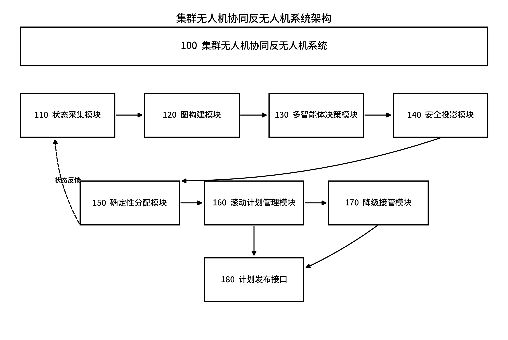
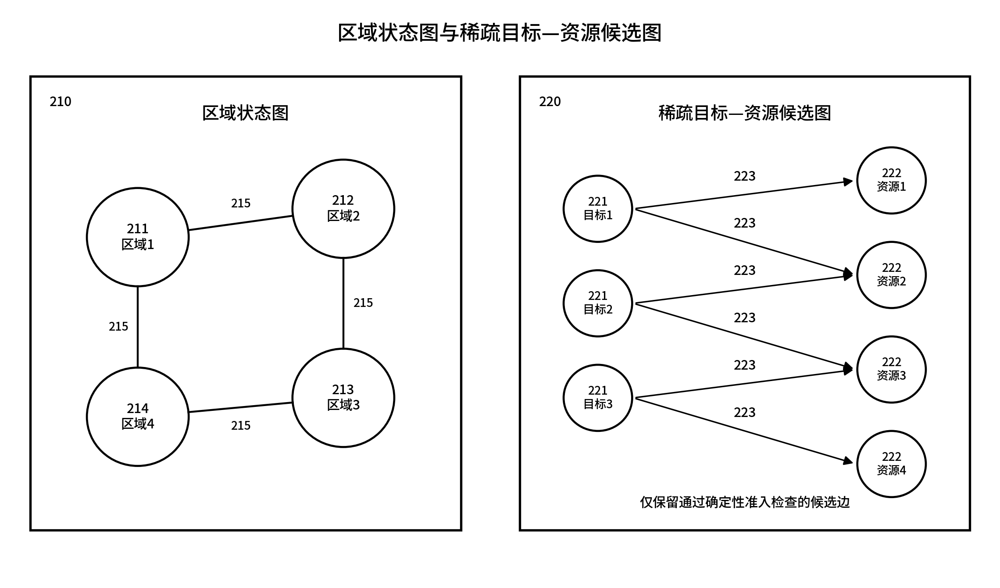
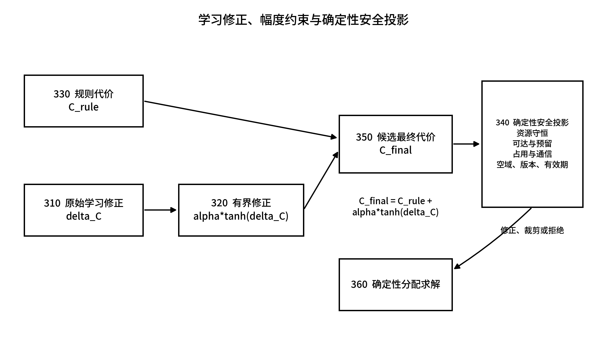
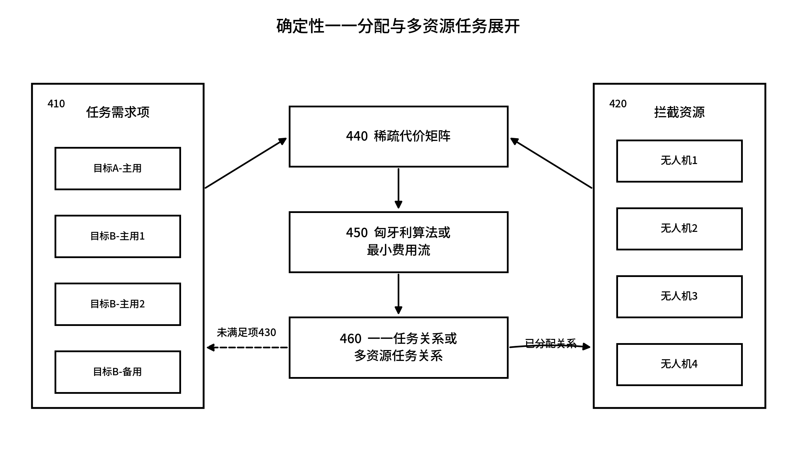
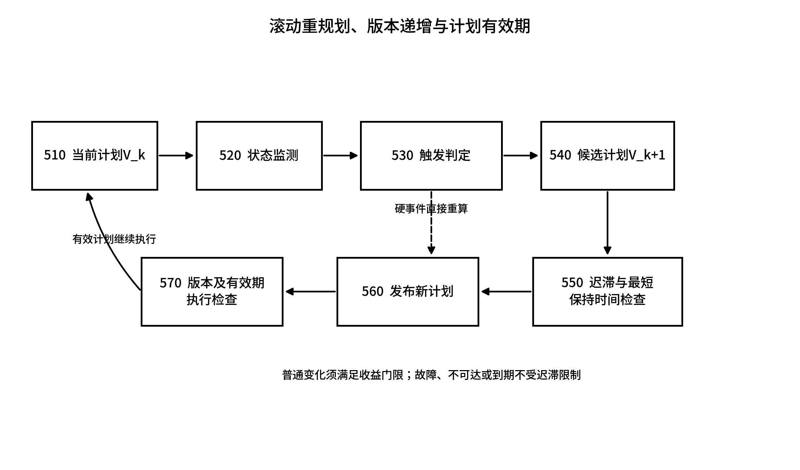
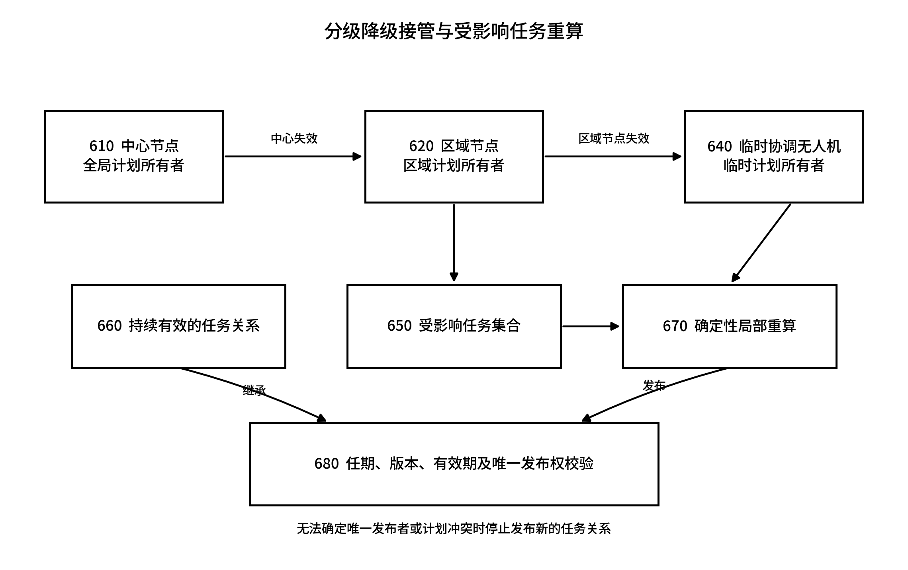

# 基于多智能体决策的集群无人机协同反无人机系统

**申请人：**【待填写】  
**发明人：**【待填写】

## 摘要

本发明公开一种基于多智能体决策的集群无人机协同反无人机系统。系统依据目标态势、拦截资源和区域连接关系构建区域状态图及稀疏目标—资源候选图；多智能体模型输出区域资源数量、跨区调动、预留比例、重规划建议或有界代价修正，不直接发布任务分配及飞行控制指令；确定性安全投影对资源守恒、可达性、最低预留、资源占用、通信、空域、计划版本和有效期进行约束，匈牙利算法或最小费用流据此形成一一或多资源任务关系。系统采用带迟滞、最短保持时间、版本和有效期的滚动重规划，并在中心节点或区域节点失效时分级接管及局部重算。本发明兼顾复杂态势下的连续决策能力和任务计划的确定性安全约束。

**摘要附图：图1。**

## 摘要附图

## 权利要求书

1. 一种基于多智能体决策的集群无人机协同反无人机系统，其特征在于，包括：  
   状态采集模块，用于按照决策时刻获取多个防御区域的目标状态、拦截无人机状态、区域间连接状态以及当前任务计划状态；  
   图构建模块，用于根据所述目标状态、拦截无人机状态和区域间连接状态构建区域状态图，并根据目标任务需求与拦截无人机之间的可执行关系构建稀疏目标—资源候选图；  
   多智能体决策模块，用于基于所述区域状态图和/或所述稀疏目标—资源候选图生成区域资源数量、跨区域资源调动、资源预留比例、重规划建议和有界代价修正中的至少一种建议量，其中所述多智能体决策模块不直接生成可执行任务分配关系和飞行控制指令；  
   确定性安全投影模块，用于对所述建议量实施约束投影，所述约束至少包括资源守恒、资源可达性、区域最低预留、资源占用状态、通信可用性、空域限制、任务计划版本和任务计划有效期；  
   确定性分配模块，用于根据经约束投影的建议量和所述稀疏目标—资源候选图，采用匈牙利算法或最小费用流算法形成目标与拦截无人机之间的一一任务关系或多资源任务关系；  
   滚动计划管理模块，用于依据迟滞条件、最短保持时间、计划版本和计划有效期对所述任务关系进行发布和滚动更新；以及  
   降级接管模块，用于在中心节点失效时将受影响区域的计划发布权转交区域节点，并在所述区域节点失效时按照确定性规则从拦截无人机中推举临时协调无人机，由所述临时协调无人机继承仍有效的任务关系并仅重新计算受影响任务。

2. 根据权利要求1所述的系统，其特征在于，所述区域状态图包括区域节点和区域边；所述区域节点的节点特征至少包括区域目标需求、目标威胁程度、可用拦截无人机数量、执行中拦截无人机数量、预留拦截无人机数量、目标状态不确定度和通信质量中的两项以上；所述区域边的边特征至少包括区域间距离、预计转移时间、通道容量、通信状态和机动限制中的两项以上。

3. 根据权利要求1或2所述的系统，其特征在于，所述稀疏目标—资源候选图为二分图，所述二分图的一侧节点表示目标任务需求项，另一侧节点表示拦截无人机；仅当目标身份状态、信息时效、任务窗口内可达性、机动能力、资源占用状态、通信状态和空域安全条件均满足预设准入条件时，在对应的目标任务需求项与拦截无人机之间建立候选边，并为未建立候选边的组合保存拒绝原因。

4. 根据权利要求1所述的系统，其特征在于，所述多智能体决策模块包括区域级共享策略网络和/或目标—资源关系图网络；所述区域级共享策略网络以各区域的局部状态及相邻区域的压缩状态为输入，输出各区域的资源数量、跨区域调动数量、预留比例或重规划建议；所述目标—资源关系图网络仅对已经存在于所述稀疏目标—资源候选图中的候选边输出代价修正，且所述策略网络和所述关系图网络均无权改变目标标识、候选边准入结果、资源需求数量及任务计划发布者。

5. 根据权利要求4所述的系统，其特征在于，所述确定性分配模块使用的候选边最终代价按照下式确定：  
   $$C_{final}(i,j)=C_{rule}(i,j)+\alpha\tanh(\Delta C_{ij})$$  
   其中，$C_{rule}(i,j)$为拦截无人机$i$执行目标任务需求项$j$的规则代价，$\Delta C_{ij}$为所述多智能体决策模块输出的原始代价修正，$\alpha$为预设修正幅度上限，$\tanh(\cdot)$用于将所述原始代价修正限制在有界区间内。

6. 根据权利要求5所述的系统，其特征在于，所述确定性安全投影模块通过最小化建议量与投影后建议量之间的加权偏差获得投影后建议量，并满足：跨区域调动前后的区域资源总量保持不变且区域资源配额合计不超过可用资源总量；执行中或已确认占用的拦截无人机不被普通调动移出；各区域资源数量不低于最低预留量；跨区域调动仅经过通信可用且满足机动条件的区域边；同一拦截无人机在同一任务时段不被重复占用；所使用的计划发布者、计划版本及有效期均为当前有效状态；在任一约束无法满足时，裁剪或拒绝对应建议量并调用确定性规则方案。

7. 根据权利要求1所述的系统，其特征在于，所述确定性分配模块将普通目标表示为一个主用任务需求项，将需要多架拦截无人机的目标展开为多个主用任务需求项和/或备用任务需求项；对一一任务关系采用匈牙利算法求解，对包含多资源需求、区域容量或跨区域调动约束的任务关系采用最小费用流算法求解，并通过未分配虚拟项记录无法满足的目标任务需求项及其未分配原因。

8. 根据权利要求7所述的系统，其特征在于，对于需要多架拦截无人机的目标，滚动计划管理模块仅在所需主用任务需求项均已确定、对应拦截无人机均确认同一目标标识、计划版本和有效期后，将所述多资源任务关系标记为可执行；备用任务需求项携带预设启用条件，在主用拦截无人机拒绝、失效、不可达或原任务计划到期时转为主用任务需求项。

9. 根据权利要求1所述的系统，其特征在于，所述降级接管模块为中心节点、区域节点和临时协调无人机分别维护单调递增的发布权任期、计划版本及有限有效期；所述临时协调无人机依据通信覆盖范围、所持状态的新鲜度、计算能力、剩余任务能力、预设节点优先级和节点编号按照统一顺序确定；无法确认唯一临时协调无人机或检测到不同发布权任期的冲突计划时，停止发布新的任务关系，并保持仍在有效期内且满足安全条件的任务关系。

10. 一种基于多智能体决策的集群无人机协同反无人机方法，其特征在于，包括：  
    S1，获取多个防御区域的目标状态、拦截无人机状态、区域间连接状态及当前任务计划状态，并形成同一决策时刻的状态快照；  
    S2，根据所述状态快照构建区域状态图，并通过目标任务需求项与拦截无人机之间的确定性准入检查构建稀疏目标—资源候选图；  
    S3，将所述区域状态图和/或所述稀疏目标—资源候选图输入多智能体模型，获得区域资源数量、跨区域资源调动、资源预留比例、重规划建议和有界代价修正中的至少一种建议量；  
    S4，在禁止所述多智能体模型直接发布任务分配关系和飞行控制指令的条件下，对所述建议量执行资源守恒、资源可达性、最低预留、资源占用、通信、空域、计划版本和有效期的确定性安全投影；  
    S5，根据投影后的建议量，采用匈牙利算法或最小费用流算法形成一一任务关系或多资源任务关系；  
    S6，依据迟滞条件、最短保持时间、计划版本和计划有效期发布并滚动更新任务计划；  
    S7，在中心节点失效时由区域节点接管受影响区域，并在区域节点失效时确定性推举一架拦截无人机作为临时协调无人机，继承仍有效的任务关系且仅重新计算受影响任务。

11. 根据权利要求10所述的方法，其特征在于，所述多智能体模型的训练包括：使用确定性规则、匈牙利算法或最小费用流算法生成可行示范；采用行为克隆训练初始策略；在包括多波次目标、资源不足、跨区域调动和通信状态变化的仿真场景中采用近端策略优化方法训练区域级共享策略；将训练完成但未满足独立准入条件的模型设置为影子运行模式，使其仅记录建议量而不改变正式任务计划；在模型输入超出训练范围、模型校验失败、推理超时或安全投影修正量超过阈值时使用完整的确定性规则方案。

12. 根据权利要求10所述的方法，其特征在于，步骤S6中，目标失效、拦截无人机故障、当前任务不可达、计划到期或发布权冲突触发即时重规划；其余状态变化仅在候选计划相对于当前计划的综合代价改善超过迟滞门限且当前计划已经保持达到最短保持时间时发布更高版本的候选计划；重规划时保持未受影响且仍在有效期内的任务关系，仅将新增目标、失效任务、冲突资源和跨区域调动涉及的任务加入受影响任务集合。

13. 一种电子设备，其特征在于，包括处理器、存储器及存储在所述存储器上并能够在所述处理器上运行的计算机程序，所述处理器执行所述计算机程序时实现权利要求10至12任一项所述的方法。

14. 一种计算机可读存储介质，其上存储有计算机程序，其特征在于，所述计算机程序被处理器执行时实现权利要求10至12任一项所述的方法。

15. 一种计算机程序产品，包括计算机程序，其特征在于，所述计算机程序被处理器执行时实现权利要求10至12任一项所述的方法。

## 说明书

### 技术领域

本发明涉及无人系统协同决策、任务规划和反无人机技术领域，具体涉及一种以区域状态图和稀疏目标—资源候选图描述动态态势、以多智能体模型形成受限调度建议、并通过确定性安全投影和组合优化形成可执行任务计划的集群无人机协同反无人机系统及方法。

### 背景技术

面对多方向、多波次无人机目标，防御系统需要在有限时间内确定不同区域所需的拦截资源，并形成目标与拦截无人机之间的具体任务关系。目标数量、运动状态、威胁程度和位置不确定度会随观测持续变化；拦截无人机的可用数量、剩余任务能力、当前占用状态和通信条件也并非固定。若仅按照当前距离或固定优先级逐一选择拦截无人机，容易出现局部选择占用关键资源、后续区域资源不足、相邻区域重复调动以及任务关系频繁变化等问题。

已有的确定性任务分配方法通常采用匈牙利算法、最小费用流算法或拍卖方法，能够在给定代价和约束下产生明确的任务关系。然而，在连续波次和跨区域耦合条件下，固定代价权重难以同时表达当前任务收益、后续目标到来风险和预留资源价值。已有基于强化学习或多智能体学习的方案能够从连续场景中学习资源调动规律，但当学习结果直接用于发布任务或控制飞行时，难以保证资源守恒、计划版本一致、已占用资源保护、禁入空域约束和节点失效后的唯一发布权。

此外，任务计划需要随着态势变化滚动更新。若每次小幅状态变化均触发新计划，会造成任务抖动和通信负担；若长时间保持原计划，又可能在目标机动、资源故障或计划过期后失去可执行性。中心节点或区域节点失效时，若各拦截无人机自行选择目标，还可能产生同一资源重复使用、同一目标被重复认领或多个临时发布者并存的问题。

因此，需要一种将多智能体连续决策能力限定在建议层、将任务关系形成及安全准入保留在确定性链路内的技术方案，并使该方案具备滚动重规划和分级降级接管能力。

### 发明内容

#### 一、要解决的技术问题

本发明旨在解决以下技术问题：在目标规模、目标运动和可用资源持续变化的情况下，如何利用多智能体模型处理跨区域资源调动和后续资源预留问题，同时防止学习模型越过任务准入、安全约束和飞行控制权限；如何在一一任务和多资源任务中形成无重复占用的确定性任务关系；如何抑制滚动规划过程中的频繁换令；以及在中心节点或区域节点失效时，如何保持唯一计划发布权并仅重算受影响任务。

#### 二、技术方案

为解决上述技术问题，本发明提供一种基于多智能体决策的集群无人机协同反无人机系统。系统包括状态采集模块110、图构建模块120、多智能体决策模块130、确定性安全投影模块140、确定性分配模块150、滚动计划管理模块160、降级接管模块170和计划发布接口180。

状态采集模块110在每一决策时刻冻结状态快照。状态快照包括各区域目标需求、目标威胁、目标状态不确定度、可用资源、执行中资源、预留资源、区域连接、通信状态、空域限制以及当前计划的发布者、发布权任期、版本和有效期。图构建模块120根据状态快照构建区域状态图210，并通过确定性准入检查构建稀疏目标—资源候选图220。

多智能体决策模块130读取区域状态图210和/或稀疏目标—资源候选图220，生成区域资源数量、跨区调动、预留比例、重规划建议或有界代价修正。该模块的输出是建议量，不包含可直接执行的目标—无人机关系和姿态、速度、航向等飞行控制指令。

确定性安全投影模块140依据资源守恒、可达性、最低预留、资源占用、通信、空域、计划版本和有效期对建议量进行修正、裁剪或拒绝。确定性分配模块150使用安全投影后的建议量形成代价矩阵，通过匈牙利算法或最小费用流算法生成一一任务关系或多资源任务关系。滚动计划管理模块160按照迟滞、最短保持时间、版本递增和有效期要求发布任务计划。降级接管模块170在中心节点失效时选择区域节点接管，在区域节点失效时按照统一确定性顺序推举临时协调无人机，并将重算范围限制在受影响任务集合内。

#### 三、有益效果

与学习模型直接给出任务关系的方式相比，本发明将学习模型的权限限制为区域级建议和有界代价修正，候选准入、资源约束、任务求解和计划发布均由确定性模块完成，因而能够在使用连续决策信息的同时保留任务关系的可检查性。

通过区域状态图表达相邻区域之间的资源转移条件，通过稀疏目标—资源候选图排除不可达、已占用或不满足通信和空域条件的组合，可减少无效组合参与后续计算。通过有界代价修正和安全投影，学习输出不能恢复已被准入条件排除的候选关系，也不能突破最低预留和资源唯一性约束。

通过迟滞和最短保持时间处理普通状态变化，通过即时触发处理故障、不可达和计划到期，能够兼顾任务计划稳定性与异常状态下的及时重算。通过中心节点、区域节点和临时协调无人机的分级发布权，以及对未受影响任务的继承，可减少节点失效时的全量重算和任务关系变化，并抑制多个发布者同时形成有效计划。

上述效果来自系统结构和约束关系，不以特定训练模型已经获得装备应用或在线控制权限为前提；在模型不具备使用条件时，系统仍可由确定性规则和组合优化链路运行。

### 附图说明

图1为本发明集群无人机协同反无人机系统的模块架构示意图；

图2为本发明区域状态图与稀疏目标—资源候选图的结构示意图；

图3为本发明学习修正、幅度约束与确定性安全投影的流程示意图；

图4为本发明确定性一一分配与多资源任务展开的示意图；

图5为本发明滚动重规划、版本递增与计划有效期的流程示意图；

图6为本发明分级降级接管与受影响任务重算的示意图。

附图标记说明：100，集群无人机协同反无人机系统；110，状态采集模块；120，图构建模块；130，多智能体决策模块；140，确定性安全投影模块；150，确定性分配模块；160，滚动计划管理模块；170，降级接管模块；180，计划发布接口；210，区域状态图；211至214，区域节点；215，区域边；220，稀疏目标—资源候选图；221，目标任务需求项节点；222，拦截资源节点；223，候选边；310，原始学习修正；320，有界修正；330，规则代价；340，确定性安全投影；350，候选最终代价；360，确定性分配求解；410，任务需求项集合；420，拦截资源集合；430，未满足任务需求项；440，稀疏代价矩阵；450，组合优化求解器；460，任务关系；510，当前计划；520，状态监测；530，触发判定；540，候选计划；550，迟滞与最短保持时间检查；560，新计划发布；570，版本及有效期执行检查；610，中心节点；620，区域节点；640，临时协调无人机；650，受影响任务集合；660，持续有效的任务关系；670，确定性局部重算；680，唯一发布权校验。

### 具体实施方式

以下结合附图对本发明的实施方式作进一步说明。应当理解，下述实施方式用于说明本发明的技术构思，并不用于限定本发明的保护范围。在不冲突的情况下，各实施方式中的技术特征可以相互组合。

#### 实施方式一：系统组成及数据组织

如图1所示，系统100设置在中心计算节点、区域计算节点和拦截无人机计算单元构成的分级计算网络中。中心计算节点负责正常状态下的全局区域调度和计划发布；区域计算节点维护其负责区域的状态副本并具备接管条件；拦截无人机接收带版本和有效期的任务计划，并返回任务接收、拒绝、开始执行、状态变化和任务完成信息。系统100输出任务计划，不直接替代拦截无人机原有的飞行控制器。

状态采集模块110以决策时刻$t_k$为基准形成状态快照$S_k$。对由$R$个防御区域组成的防区，第$r$个区域的状态向量可表示为：

$$
x_r^k=[d_r^k,h_r^k,n_{avail,r}^k,n_{busy,r}^k,n_{reserve,r}^k,
\sigma_r^k,q_{comm,r}^k,a_r^k]，
$$

其中，$d_r^k$表示区域任务需求，$h_r^k$表示高威胁任务需求，$n_{avail,r}^k$、$n_{busy,r}^k$和$n_{reserve,r}^k$分别表示可用、执行中和预留拦截无人机数量，$\sigma_r^k$表示目标状态不确定度摘要，$q_{comm,r}^k$表示区域通信质量，$a_r^k$表示当前计划和发布权状态。各字段可根据设备配置进一步细分，但不得省略与任务有效性有关的测量时间、消息到达时间、计划版本和有效期。

如图2左侧所示，图构建模块120将各区域表示为区域节点211至214，将允许资源跨区调动的关系表示为区域边215，形成区域状态图：

$$
G_R^k=(V_R^k,E_R^k,X_R^k,X_E^k)。
$$

区域边特征可以表示为：

$$
e_{rs}^k=[D_{rs},T_{rs},Cap_{rs},Q_{rs},M_{rs}]，
$$

其中，$D_{rs}$为区域间距离，$T_{rs}$为预计转移时间，$Cap_{rs}$为通道容量，$Q_{rs}$为通信状态，$M_{rs}$为机动可行性。区域边为有向边时，两个方向分别记录边特征。

目标任务并不直接与全部拦截无人机组成全连接关系。对于目标任务需求项$j$和拦截无人机$i$，图构建模块120计算准入量：

$$
g_{ij}=g_{state}g_{fresh}g_{reach}g_{maneuver}g_{resource}g_{comm}g_{airspace}g_{plan}。
$$

其中，各因子取0或1，依次表示目标状态允许、信息未过期、任务窗口内可达、机动能力满足、资源未被占用、通信满足、空域允许和计划状态有效。仅当$g_{ij}=1$时建立候选边223，由此形成图2右侧所示的稀疏目标—资源候选图：

$$
G_C^k=(V_T^k\cup V_U^k,E_C^k)。
$$

每条候选边保存预计到达时间、机动代价、资源余量、通信风险、换令代价和目标威胁等特征。对于$g_{ij}=0$的组合，系统保存至少一项拒绝原因，用于后续确定是否申请跨区支援、继续保持原任务或将目标任务需求项记为未满足。

#### 实施方式二：多智能体区域建议

多智能体决策模块130可以采用参数共享的多智能体策略。每个区域对应一个决策智能体，同一参数集合适用于不同数量的区域节点。区域智能体先编码本区域节点特征，再沿区域边215接收相邻区域信息。第$l$层图信息更新的一种实现形式为：

$$
m_r^{(l)}=\sum_{s:(s,r)\in E_R}\phi_e(h_s^{(l)},h_r^{(l)},e_{sr}),
$$

$$
h_r^{(l+1)}=\phi_v(h_r^{(l)},m_r^{(l)})，
$$

其中，$h_r^{(l)}$为区域节点的第$l$层隐藏状态，$\phi_e$为边消息函数，$\phi_v$为节点更新函数。经过一层或多层更新后，策略头输出区域资源数量建议、跨区调动建议、最低预留比例和重规划建议。不同区域可由同一策略网络分别产生局部输出，再由安全投影模块140执行全局资源约束。

另一实施例中，多智能体决策模块130还包括目标—资源关系图网络。该关系图网络仅处理已经存在于$E_C^k$中的候选边，并为每条候选边输出原始代价修正$\Delta C_{ij}$。关系图网络不能为$g_{ij}=0$的组合建立候选边，也不能更改目标任务需求项数量、当前发布权任期或计划版本。

多智能体模型的输出可以同时包括多种建议量，也可以仅包括其中一种。无论采用何种网络结构，其输出接口均与任务计划接口分离。多智能体决策模块130没有写入计划发布接口180的权限，必须经确定性安全投影模块140和确定性分配模块150处理后方可形成候选计划。

#### 实施方式三：规则代价、有界修正和安全投影

如图3所示，系统先独立计算规则代价330。候选边$(i,j)$的规则代价可以表示为：

$$
C_{rule}(i,j)=w_tT_{ij}+w_mM_{ij}+w_eE_{ij}+w_cL_{ij}
+w_rR_{ij}+w_sS_{ij}-w_hH_j，
$$

其中，$T_{ij}$为预计到达时间，$M_{ij}$为机动难度，$E_{ij}$为目标状态不确定度代价，$L_{ij}$为通信风险，$R_{ij}$为能源和资源余量代价，$S_{ij}$为改变现有任务关系的代价，$H_j$为目标威胁收益，$w_t$至$w_h$为经预先标定的权重。

原始学习修正310经过有界函数形成有界修正320，候选最终代价350为：

$$
C_{final}(i,j)=C_{rule}(i,j)+\alpha\tanh(\Delta C_{ij})。
$$

$\alpha$用于限制学习模型对单条候选边的最大影响。即使$\Delta C_{ij}$数值异常，其对规则代价的修正仍处于$[-\alpha,\alpha]$区间内。对未通过准入检查的组合不计算$C_{final}$，从结构上避免学习修正恢复不可执行关系。

对于区域资源数量和跨区调动建议，可将模型输出记为$a_L$，安全投影后的建议记为$a_P$。确定性安全投影模块140求解：

$$
a_P=\arg\min_{a\in\Omega(S_k)}(a-a_L)^TW(a-a_L)，
$$

其中，$W$为正定或半正定权重矩阵，$\Omega(S_k)$为由当前状态快照确定的可行集合。所述可行集合至少满足：

1. 各区域资源数量及跨区转移前后的资源总量守恒；
2. 各区域保留数量不低于预设最低预留量；
3. 执行中、已确认占用或处于不可中断状态的资源不被普通建议移出；
4. 跨区转移仅使用存在的区域边215，且不超过通道容量；
5. 转移资源能够在任务窗口内到达，并满足能源和机动限制；
6. 通信不可用、空域禁止或计划发布权无效的区域边不允许转移；
7. 使用的计划版本为当前版本，当前时刻位于有效期内。

若投影问题有解，则输出距离模型建议较近的可行建议；若部分建议越界，则对其裁剪；若无法得到可行结果、模型推理超时、输入非有限、模型版本不一致或输入超出批准范围，则拒绝学习建议，使用由规则代价330和确定性区域规则形成的方案。

#### 实施方式四：确定性任务分配

如图4所示，普通目标建立一个主用任务需求项。对于需要多架拦截无人机的目标，将其展开为多个主用任务需求项；需要后备资源时，另建立一个或多个备用任务需求项。该展开仅表示任务所需资源数量和角色，不由多智能体模型改变。

设任务需求项集合410为$Q$，拦截资源集合420为$U$，$x_{iq}\in\{0,1\}$表示拦截无人机$i$是否承担任务需求项$q$，$u_q\in\{0,1\}$表示任务需求项$q$是否未满足。一种分配模型为：

$$
\min\ \sum_{i\in U}\sum_{q\in Q}C_{final}(i,q)x_{iq}
+\sum_{q\in Q}C_{miss}(q)u_q，
$$

满足：

$$
\sum_{q\in Q}x_{iq}\leq1，\quad \forall i\in U，
$$

$$
\sum_{i\in U}x_{iq}+u_q=1，\quad \forall q\in Q，
$$

$$
x_{iq}=0，\quad \forall(i,q)\notin E_C。
$$

$C_{miss}(q)$为任务需求项未满足代价，可随威胁程度和剩余任务窗口设置。对于标准一一分配问题，确定性分配模块150采用匈牙利算法求解；对于包含区域供给、区域容量、多资源需求和跨区转移的情况，将拦截资源、任务需求项、跨区通道和未满足虚拟节点构成流网络，采用最小费用流算法求解。无论采用何种求解器，同一拦截无人机在同一时段至多承担一个主要任务。

对于多资源任务，系统将求得的多个任务需求项重新聚合为同一目标的任务关系。各成员必须确认相同目标标识、角色、计划版本、发布权任期和有效期；确认不完整时，任务保持待确认状态。备用资源仅在预设启用事件发生后转为主用资源，防止主用和备用同时占用同一目标任务。

#### 实施方式五：滚动重规划和计划发布

如图5所示，滚动计划管理模块160对当前计划510进行状态监测520。触发事件分为即时触发事件和普通变化事件。即时触发事件包括目标失效、拦截无人机故障、当前任务不可达、空域冲突、计划到期和发布权冲突；发生即时触发事件时，触发判定530直接请求确定性分配模块150重算。

目标状态小幅变化、预计到达时间变化、短时通信质量变化和学习模型提出的提前重规划建议属于普通变化事件。对于普通变化事件，候选计划540须满足：

$$
J_{new}<J_{old}-\delta_J，\qquad t_k-t_{last}\geq T_{dwell}，
$$

其中，$J_{new}$和$J_{old}$分别为候选计划和当前计划的综合代价，$\delta_J$为迟滞改善门限，$T_{dwell}$为最短保持时间，$t_{last}$为当前计划最近一次变更时刻。也可以采用$J_{new}<(1-\delta)J_{old}$的比例门限。

通过迟滞与最短保持时间检查550后，新计划560携带以下字段：计划标识、发布节点标识、发布权任期、严格递增的版本号、前一计划标识、生成时刻、生效时刻、失效时刻、目标任务需求项、拦截资源标识、任务角色、启动条件和未满足原因。拦截无人机在执行检查570中拒绝发布权任期较旧、版本较旧、当前时刻已超过失效时刻或资源标识与本机不一致的计划。

重规划不必重新计算全部任务。系统建立受影响任务集合650，包括新增目标、失效任务、故障资源占用的任务、不可达任务、冲突任务和跨区调动涉及的任务。未受影响且仍满足准入条件的任务关系660直接继承到新版本计划，仅更新必要的计划引用信息。

#### 实施方式六：分级降级接管

如图6所示，正常状态下由中心节点610持有全局计划发布权。中心节点的健康状态可以根据心跳时效、计划生成时效、通信状态和发布权有效期确定。中心节点被判定失效后，覆盖受影响区域且状态新鲜、通信可用、计算功能正常的区域节点620获得更高的发布权任期，并继承仍有效的任务关系660。区域节点620仅对其负责区域中的受影响任务集合650执行确定性局部重算670。

当区域节点620也被判定失效时，各拦截无人机根据同一时刻可获得的候选成员摘要执行确定性推举。候选临时协调无人机至少满足：与规定数量的区域成员保持通信；持有不早于预设时限的状态快照；具备任务分配计算能力；剩余任务能力超过预设下限；不处于不可中断的末段任务。对满足条件的候选成员，依次比较通信覆盖范围、状态新鲜度、计算能力、剩余任务能力和预设优先级；前述指标相同时，按照节点编号确定唯一成员。被选成员作为临时协调无人机640，不构成长期固定中心。

临时协调无人机640取得严格高于失效区域节点的发布权任期，继承仍有效的任务关系660、资源占用状态和执行回执，仅对受影响任务集合650重新构建局部候选图并调用确定性分配模块150。其发布的计划具有较短有效期，并要求区域成员返回与计划版本绑定的确认信息。

若网络分区导致不同成员无法确认同一候选集合，或检测到相同任期内存在不同计划摘要，则唯一发布权校验680不通过。此时不发布新的目标任务关系，仅允许保持当前仍有效且满足安全条件的任务。中心节点或区域节点恢复后，不立即以旧计划覆盖临时计划；恢复节点先比较发布权任期、计划版本、有效任务关系和资源占用状态，经一致性核对后再以更高任期发布恢复计划。

#### 实施方式七：模型训练、影子运行和确定性回退

多智能体模型可以采用离线训练方式。首先使用确定性区域规则、匈牙利算法或最小费用流算法生成可行示范，以行为克隆方式训练模型学习资源保持、跨区调动和预留的基本行为。随后在包括多方向、多波次、资源不足、目标机动、通信变化和节点失效的仿真场景中训练区域级策略。

一种可选训练实施例采用近端策略优化方法。策略更新时限制新旧策略的概率比变化范围，以降低训练过程中的大幅波动。训练回报可以包括任务需求满足、任务窗口利用、资源消耗、跨区调动距离和计划变化次数；资源重复使用、过期计划、发布权冲突和禁入空域等硬约束不通过回报权衡，而始终由确定性安全投影模块140处理。

训练数据、验证数据和测试数据按完整场景划分。用于评价的目标真值不得作为运行时多智能体模型输入。模型文件与输入特征规范、区域拓扑版本、资源能力范围和安全规则版本一并校验。模型未完成独立准入时设置为影子运行模式：系统记录模型建议、安全投影结果及其与确定性方案的差异，但正式计划仍采用确定性方案。

当模型满足预设使用条件时，也仅允许输出权利要求所述建议量。出现模型文件校验失败、输入超出训练范围、推理超时、非有限输出、建议置信度不足或安全投影修正量超过阈值中的任一情况，系统立即采用规则区域调度、规则代价和确定性分配求解器形成任务计划。该回退不依赖多智能体模型在线更新，模型在任务执行期间保持只读。

#### 实施方式八：计算设备实现

本发明可以由一台或多台电子设备协同实现。电子设备包括处理器、存储器、通信接口和总线。存储器中保存用于状态快照、区域状态图、稀疏目标—资源候选图、多智能体模型、安全投影、组合优化、计划版本管理和降级接管的程序指令。处理器执行所述程序指令时完成权利要求10至12所述方法。

在分布式部署中，中心节点和区域节点可以分别运行状态采集、图构建、安全投影和确定性分配程序；拦截无人机至少运行计划有效性检查、状态摘要上报和临时协调候选程序。各设备交换的信息包括测量时刻、到达时刻、消息序号、发布节点、发布权任期、计划版本、有效期和内容摘要，以拒绝迟到、过期或来源冲突的消息。

本领域技术人员可以在不脱离本发明构思的前提下，对区域划分方式、图网络层数、规则代价组成、组合优化求解器和发布权健康判定方式进行调整；只要学习输出仍受限于建议层，具体任务关系仍由确定性安全投影和确定性求解链路形成，均属于本发明技术构思的实施形式。
