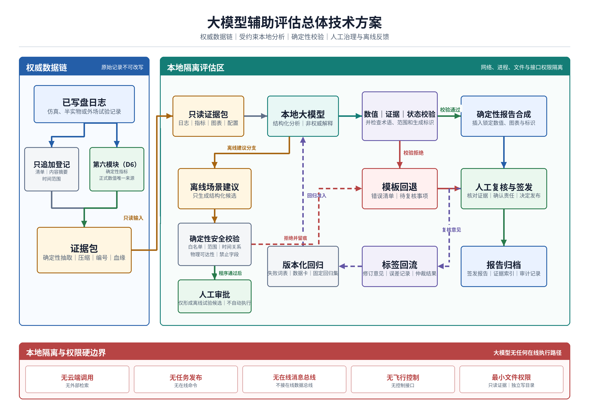

# 大模型辅助评估项目建议书

> 证据截止日期：2026年7月19日
> 项目边界：本项目仅建设隔离环境内的离线辅助评估能力。所有大模型均本地部署，不调用云端模型或外部检索服务，不接入任务发布、在线消息总线和飞行控制，不生成正式任务指标，不改写原始日志。

## 1 立项依据

### 1.1 研究的目的和意义

本项目面向多批次仿真、半实物和后续外场试验的离线评估环节。现有评估链已经能够消费类型化记录和已写盘日志，由确定性程序计算探测概率、虚警、航迹均方根误差、航迹连续率、身份交换次数、重复分配、未分配高威胁目标数、故障转移时间、末端关联与锁定、安全约束违规等正式指标，并输出表格、图表和中文报告。现有证据主要来自确定性回归、点质量仿真和AirSim试验，不等同于装备定型、实装性能或外场鉴定结论。

随着场景、随机种子、资源数、目标数和日志源增加，人工逐份核对时间线、归并失败原因、比较配置并编写报告的成本上升。单靠模板报告可以锁定数值，却难以处理跨模块事件关系、长日志摘要和失败解释；直接让大模型读取原始日志并自由写报告，又会引入数值改写、证据错配、因果过度推断和版本不可追溯等风险。

项目拟在确定性评估之后增加可删除、可回退的本地大模型分析层。该层读取只读证据包，完成事件摘要、失败二级分类、跨实验差异说明、报告草拟和离线场景建议；正式数值、显著性检验、置信区间、图表和结果门限仍由确定性程序产生。生成结果必须经过数值锁定、证据绑定、术语检查和人工复核，未通过校验时回退到确定性模板报告。

建设作用集中在三个方面：一是把日志、指标、事件、图表和结论连成可核验的证据链，减少报告与原始记录脱节；二是统一失败分类和状态表述，支持跨批次、跨模型版本和跨场景复盘；三是在不把敏感数据送出本地环境的前提下缩短报告整理时间。该能力不改变在线任务流程，也不扩大任何模块的控制权限。

#### 当前能力与拟建边界

| 能力项 | 状态 | 本项目处理方式 |
|---|---|---|
| D6确定性指标、显式身份交换计数、可用性和来源审计 | 当前已实现并经过确定性测试；部分指标有仿真验证 | 保持正式结果唯一来源，不交给大模型重算 |
| 类型化日志、JSONL适配、批量统计、CSV/JSON/Markdown和二维图表 | 当前已实现 | 作为证据包输入；验收前补充统一模式和哈希清单 |
| 多随机种子、AirSim和点质量试验结果 | 已有仿真证据，覆盖范围随场景而异 | 只按仿真证据表述，不外推为实装能力 |
| 只追加原始日志、统一证据包、原子结论证据索引 | 部分基础字段存在，工程闭环待建设 | 本项目拟实现并进行篡改、缺失和版本冲突测试 |
| 本地大模型适配、失败分类、结构化分析、可信报告生成 | 未实现 | 本项目核心研究内容 |
| 场景建议白名单和物理可达性校验 | 未实现 | 仅输出离线试验候选，不自动执行 |
| 云端模型、在线任务发布、飞行控制、全局目标编号修改 | 禁止能力 | 架构和验收中保持物理与逻辑隔离 |

### 1.2 国内外研究现状

#### 1.2.1 国内发展现状

国内已形成从术语、模型通用要求、评测方法、服务成熟度到安全与生成内容标识的标准链。`GB/T 41867-2022`统一人工智能基础术语；`GB/T 45288.1-2025`至`GB/T 45288.3-2025`分别规定大模型通用要求、评测指标与方法、服务能力成熟度评估，为模型选择、测试集设计和版本变更评估提供国家标准依据[1-4]。这组标准解决“评什么、怎样组织评测”的共性问题，但不直接给出多无人机试验日志、D6指标和生成报告之间的工程合同。

`GB/T 45654-2025`规定生成式人工智能服务的安全基本要求，`GB 45438-2025`及《人工智能生成合成内容标识办法》规定生成合成内容标识方法与管理要求[5][6][8]。本项目不向公众提供生成式人工智能服务，但对外流转的辅助生成报告仍应标注生成参与、模型版本和人工复核责任，内部报告也按同一原则保留机器生成来源。

《生成式人工智能服务管理暂行办法》明确其适用对象是向境内公众提供生成式人工智能服务，并明确未向境内公众提供服务的研发、应用活动不适用该办法[7]。因此不能把该办法直接写成本项目内部离线系统的合规结论；其中关于数据质量、标注规则和安全治理的要求可作为设计参考。全国网络安全标准化技术委员会发布的《人工智能安全治理框架》2.0版进一步采用全生命周期风险识别与治理思路，可用于组织模型引入、验证、部署、监测、升级和退出活动[9]。

| 机构或文件 | 技术路线或规范重点 | 公开状态 | 证据等级 | 对本项目的启示 |
|---|---|---|---|---|
| 国家标准化管理部门，GB/T 45288系列 | 大模型通用要求、评测指标与方法、服务成熟度 | 现行国家标准 | A：官方标准 | 建立模型卡、固定测试集、版本回归和服务成熟度检查 |
| 国家标准化管理部门，GB/T 45654-2025 | 生成式人工智能服务安全基本要求 | 现行国家标准 | A：官方标准 | 将输入输出安全、数据来源、模型风险和人工复核转化为本地验收项 |
| 国家标准化管理部门，GB 45438-2025 | 生成合成内容显式与隐式标识 | 现行强制性国家标准 | A：官方标准 | 报告保存“AI辅助生成”标识、模型清单和责任人，不把生成文本伪装成人工原文 |
| 国家互联网信息办公室等部门 | 服务管理与生成内容标识 | 已发布管理文件 | A：官方政策 | 区分内部离线应用与公众服务；外发报告按适用规则复核 |
| 全国网络安全标准化技术委员会 | 人工智能安全治理框架2.0 | 官方框架 | B：官方治理框架 | 建立风险台账、版本审批、运行监测、停用和退出机制 |

国内工作的主要缺口不在通用标准数量，而在领域证据工程。公开标准没有替本项目定义事件编号、指标分母、`available/unavailable`状态、日志时间范围、证据行号、失败词表和报告发布门。若这些合同不先冻结，大模型即使语言流畅，也无法形成可复核的工程结论。

#### 1.2.2 国外发展现状

美国国家标准与技术研究院（NIST）发布的人工智能风险管理框架1.0将治理活动组织为`GOVERN、MAP、MEASURE、MANAGE`，生成式人工智能专题画像又补充了虚构内容、信息完整性、数据隐私、信息安全和人机配置等风险[10][11]。两份文件强调风险测量、文档化和持续管理，但不规定某一领域的具体指标阈值。本项目可采用其治理结构，指标及阈值仍需按本地任务证据冻结。

ISO/IEC 42001:2023规定人工智能管理体系，ISO/IEC 23894:2023给出人工智能风险管理指南，ISO/IEC 25059:2023给出人工智能系统质量模型[12-14]。三者共同指向生命周期管理、责任分配、风险处置和系统质量测量。欧盟《人工智能法案》要求相关高风险系统具备生命周期事件自动记录能力，并保留技术文档、测试日志和测试报告[15]。本项目不据此自行认定为欧盟法案中的高风险系统，但其日志可追溯、人工监督和文档留存要求对证据包设计有直接参考价值。

日志与可观测性领域已有成熟的集中收集、保护、分析和留存方法。NIST SP 800-92系统说明了日志管理基础，OpenTelemetry日志数据模型提供跨组件时间、资源、作用域、正文和属性表达[16][17]。OpenTelemetry页面是持续更新的开放规范，项目若采用其字段语义，必须在验收清单中固定具体规范版本，不能只引用滚动网页。

模型卡、数据表和数据卡研究分别提出记录模型用途、限制、分组性能、数据来源、收集过程、质量和责任信息[18-20]。这些工作适合转化为本项目的模型清单、证据包说明和固定回归集数据卡，防止模型升级后只保留名称、不保留权重哈希、量化方式和测试边界。

自动化评测研究已从单一相似度指标转向大模型评审、原子事实核验和检索增强生成评估。G-Eval使用大模型和结构化表单评价生成文本，同时其论文明确提示评审模型可能偏向大模型生成文本[22]；FActScore把长文本拆为原子事实并评价事实支持比例[23]；SelfCheckGPT利用多次采样的一致性检测潜在虚构，但增加推理成本，且不能替代外部证据[24]；RAGAS评价检索上下文与生成答案的忠实性，其对象是检索增强生成流程，迁移到工程日志报告前仍需重新标定[25]。大模型评测综述指出评测对象、数据、指标与场景快速扩张[21]，针对大模型评审公平性的同行评议研究则显示位置、次序等偏差不能忽略[26]。这些证据不支持让大模型成为正式裁判，反而支持“确定性指标在前、大模型解释在后、程序校验和人工签发兜底”的路线。

| 国家或机构 | 技术路线或规范 | 公开能力与应用状态 | 证据等级 | 对本项目的启示 |
|---|---|---|---|---|
| NIST | AI RMF 1.0与生成式AI专题画像 | 官方框架和专题报告 | A：政府技术报告 | 将模型风险纳入治理、映射、测量和处置闭环 |
| ISO/IEC | 42001、23894、25059 | 已发布国际标准 | A：国际标准 | 冻结管理职责、风险流程、质量属性和持续改进记录 |
| 欧盟 | Regulation (EU) 2024/1689 | 已公布法规 | A：官方法规 | 参考事件日志、技术文档、测试记录和人工监督要求，不自行作适用性认定 |
| NIST、OpenTelemetry | 日志管理与统一日志数据模型 | 官方指南与开放规范 | A/B：官方指南、开放规范 | 统一时间、资源、作用域、属性和留存策略；验收时固定版本 |
| ACM同行评议研究 | 模型卡、数据表、数据卡 | 已发表论文 | C：同行评议 | 对模型、证据数据和回归集做用途、限制和版本披露 |
| ACL同行评议研究 | G-Eval、FActScore、SelfCheckGPT、RAGAS及评审偏差研究 | 已发表论文和演示论文 | C：同行评议 | 采用原子结论与证据绑定；把模型评审偏差列入独立测试和人工复核 |

#### 1.2.3 发展趋势

1. **从通用榜单转向任务化评测。** 通用能力分数不能代表工程日志摘要、失败分类和事实复制能力。固定任务集、分层指标、版本回归和适用边界将成为主要验收方式[3][21]。
2. **从结果文本转向证据链。** 模型卡、数据卡、日志规范和法规要求共同推动“输入来源—处理版本—指标—结论—责任人”全链路记录[15-20]。
3. **从自由生成转向受约束生成。** 结构化输出、原子事实、证据检索和后置校验用于限制虚构；大模型只负责解释，数值和判据由程序锁定[22-25]。
4. **从单次模型验收到持续治理。** 模型权重、量化方式、推理框架、提示词、证据模式或失败词表变化，都需要触发固定回归集复测[4][9-14]。
5. **从单模型判断转向人机分工。** 大模型评审存在偏差，模型自检也不等于外部证据核验。关键结论将保留人工签发和失败回退[22][24][26]。
6. **敏感数据场景更重视本地化。** 本地部署能够减少数据出域面，但不能自动解决模型许可、供应链、显存、能耗和推理时延问题；这些成本需要在最终硬件与模型上实测。

#### 1.2.4 现有不足

现有国内外标准为评测、风险、文档和日志治理提供了框架，同行评议研究提供了事实一致性和自动评审方法，但尚无公开方案直接满足本项目的全部约束：只读取多模块离线证据；保持D6数值权威；区分证据缺失与显式零；按实验、随机种子、实际资源/目标规模和模型版本追溯；在隔离环境内生成中文报告；失败时不影响确定性评估；场景建议不进入任务发布和飞行控制。该缺口需要通过领域数据合同、确定性验证器和本地模型工程共同解决。

### 1.3 项目紧迫需求

#### 1.3.1 批量证据治理与可信报告

多场景、多随机种子和多日志源已经形成数量持续增加的离线记录，各来源的采样粒度、统计分母、时间范围和可用性状态并不相同。现有确定性程序能够计算正式指标并输出基础报告，但批量证据整理仍较多依赖人工查找、复制和对照；一旦跨批次比较，容易混用不同episode的实验范围、候选配置、失败分母或图表版本。探测、跟踪、分配、降级、末端配准、导引和系统故障又分散在不同记录中，缺少统一入口时，长时间线和跨模块关系难以稳定复核，报告整理成本会随批次数量增长，已成为近期试验扩展和持续评估的直接约束。

近期必须形成从只追加原始日志、D6确定性指标、配置和图表到原子结论的可核验证据链，并使证据包能够按实验、对象、时间范围和版本稳定重建。正式指标中的显式零、不可用、部分可用和来源优先级必须由确定性规则保留；大模型只能读取只读证据、辅助摘要和解释，不能补算数值、修改单位和分母，也不能把“无证据”表述为“未发生”。工程交付应包括模式校验、哈希索引、证据编号、数值锁定、引用校验和失败回退，使每项结果判断能够回到对应证据。该能力只提升离线评估和报告编制的可复核性，不证明上游日志真实，不替代人工签发，也不把仿真结果外推为实装或外场性能。

#### 1.3.2 失败语义、版本追溯与工程成本

当前失败现象横跨多个模块，同一现象可能因记录来源和分析人员不同而使用不同名称，相近时间发生的事件也容易被直接写成确定因果。缺少统一的一级类别、可扩展二级词表和证据不足状态，会使跨场景趋势失去可比性，少数类故障被高频类别掩盖，后续回归样本也无法按稳定标签组织。与此同时，模型权重、量化文件、推理框架、提示词、失败词表和报告模板均会影响分类与表述；若这些版本未随结果登记，同一证据包在升级前后的差异将难以解释，错误版本也无法可靠退出或回退。

近期需要把失败分类、因果强度和版本治理纳入同一审计链：规则负责确定事件码、硬门限和一级类别，大模型只辅助跨模块二级说明，并明确区分已确认、疑似、证据不足和冲突。每次分析必须绑定模型及其量化、推理框架、提示词、词表、模板、证据模式和硬件版本，任何关键变化均触发固定回归集复测。由于本地部署还受显存、主存、存储、能耗、报告时延和设备折旧约束，需尽早在冻结硬件和真实任务输入上建立质量、时延与单位成本基线。公开榜单、模型说明或量化论文只能用于候选筛选，不能代替本机实测，也不能据此给出未经验证的性能结论。

#### 1.3.3 数据不出域与在线安全隔离

离线评估证据可能包含场景参数、运行配置、目标状态、失败模式和系统缺陷，云端模型或外部检索接口会增加数据出域、第三方服务变化、供应链和审计依赖。仅声明“本地部署”仍不足以构成安全边界：日志中的指令样文本可能形成提示注入，模型进程若具有任意文件、工具或网络权限，也可能读取非授权数据或产生越权输出。辅助分析一旦能够触达任务发布、在线消息总线或飞行控制接口，就会从可回退的离线工具变成新的在线入口，其故障后果和责任范围均超出本项目定位。

近期必须形成模型、知识库、遥测和报告均不出隔离环境的部署能力，并在网络、进程权限、文件权限和接口清单四个层面验证隔离。模型服务只读已登记证据包，只向独立目录写入结构化分析；外部网络、工具调用、任意代码执行和控制端点应保持不可达。场景建议只能在白名单、参数范围、时间关系和物理可达性校验后进入人工待审的离线候选目录，不自动启动试验，不形成在线命令。该边界不连接任务发布、在线总线和飞行控制，不修改全局目标编号；模型超时、输出不合法或安全校验失败时，应回退到确定性模板并保留审计记录，不能阻断既有确定性评估。

## 2 研究目标与指标

### 2.1 研究目标

#### 2.1.1 关键问题

##### 关键问题一 证据包与指标权限分离

多模块原始日志、D6确定性指标、配置和图表具有不同模式、时间粒度、生产者和可用性语义，直接交给大模型会同时引入上下文超限、实验范围串包和证据定位不稳定的问题。现有基础能够生成类型化记录和确定性指标，但统一的只追加登记、证据包模式、哈希清单和原子证据索引尚未形成完整工程闭环，大模型层仍未实现。关键机理在于证据压缩必须减少输入体量而不改变支持结论所需的对象、时间窗、分母和状态；文件哈希只能证明登记后的内容一致，不能证明生产者输出真实，因而还必须保留生产者、模式版本和时间范围等上游审计信息。

跨模块约束要求D6继续作为正式指标唯一来源，大模型不得计算指标、改写数字、单位和分母，也不得把不可用或证据缺失转换为零。每个结果性原子结论需要绑定正确的episode、对象、证据编号、时间范围和可用性，图表与配置差异也应纳入同一血缘。问题的可判定边界是：合法证据包能够稳定重建并通过模式、哈希、范围和引用校验；篡改、缺项、版本冲突或跨实验拼接能够被拒绝；报告中的正式数值均可回指D6源值且没有模型计算值进入结果。证据包不可用或数值锁定失败时只能停止模型分析并回退确定性报告，不能通过生成文本补齐缺失证据。

##### 关键问题二 失败语义与因果边界

探测、跟踪、分配、降级、末端配准、导引和系统故障形成跨模块事件链，不同故障可能产生相近的时间序列，同一故障也可能因日志缺失而只留下局部现象。现有人工表述容易出现同义异名、相关性被写成因果、未知故障被强行归入已有类别等不足；单纯依靠模型自检或多次生成一致性，不能证明结论受到外部证据支持。问题机理是一级硬事件、二级原因和因果状态具有不同判定权限，若不先冻结事件码、规则门限和证据要求，语言模型的流畅表述会掩盖类别漂移和事实支持不足。

跨模块分类必须保留七类一级失败及未知二级类，并遵守各模块的对象、计划版本、状态和权限合同；例如时间相邻不能单独证明网络故障、模式切换不能证明物理拦截成功、目标交叉不能替代显式身份交换证据。规则应承担一级确定分类，大模型只辅助二级关系和报告说明，因果状态明确区分已确认、疑似、证据不足和冲突。可判定边界由冻结金标、事件规则、原子事实支持检查和人工仲裁共同给出：有冻结判据或人工结论才允许确认因果，引用存在但范围或语义不支持仍判为不通过，新类别和冲突证据只能进入未知、证据不足或待复核，不能外推为系统未发生事件。

##### 关键问题三 本地治理与建议安全

隔离工作站的显存、主存、存储、能耗和推理时间有限，日志体量与模型上下文之间存在直接矛盾；模型权重、量化、推理框架、提示词、证据模式、失败词表或模板的变化还会造成结构化输出和分类结果漂移。当前大模型层未实现，因此公开模型榜单和厂商数据不能回答本地中文报告质量、JSON稳定性、资源占用与单位成本是否同时可接受。若缺少完整模型清单、固定回归集和候选版本准入，同一输入的结果变化将无法追溯，资源超限或升级失败时也没有明确退出路径。

这一问题同时受在线安全边界约束。日志中的指令样文本只能作为数据处理，模型不得获得外部网络、工具、任意文件和代码执行权限；离线场景建议虽可用于构造后续试验候选，但必须限制在参数白名单、允许范围、时间关系和物理可达性内。可判定边界包括冻结硬件上的质量、时延、显存、能耗和成本实测，关键版本变化后的准确性与安全回归，以及任务发布、在线消息总线、全局目标编号写接口和飞行控制端点保持不可达。任何资源超限、坏JSON、提示注入、越权字段或回归不通过都应失败关闭，建议只进入人工待审离线目录，不自动执行，也不作为正式控制输入。

#### 2.1.2 明确目标

##### 目标一 只追加证据与数值锁定

项目拟建立只追加日志登记、模式校验、文件与证据包哈希索引、确定性压缩和证据包生成能力，把原始文件、D6指标、配置、事件和图表组织为字段冻结、体量可控且可逐条引用的离线输入。主要成果包括episode清单、统一证据模式、证据编号、数据血缘记录、坏包拒绝记录和可重复构建工具，使报告中的每个结果性原子结论能够定位到对应实验、对象、时间范围、可用性和证据版本。该目标是在现有类型化日志和确定性评估基础上补齐证据工程闭环，不改变原始日志，不取代上游真实性审计。

项目同时拟实现数值锁定、证据绑定、状态与术语校验以及失败关闭机制。正式指标、统计检验、置信区间、图表和显示规则继续由D6及确定性程序生成，模型输出只保留指标标识符和受证据约束的说明，正式指标由大模型计算的数量保持为零。验证覆盖合法包重建、篡改和缺项注入、错episode与错版本、显式零、不可用、数值污染和引用范围错配；未通过模式、哈希、数值或证据校验的内容不得发布。该目标不使哈希具备证明上游事实真实性的能力，也不允许模型补数、改分母、判定统计显著性或把仿真状态改写为实装结论。

##### 目标二 本地分析与两阶段报告

项目拟在隔离环境内实现本地大模型适配器、受约束结构化分析模式、固定一级失败分类和可扩展二级词表，形成事件摘要、跨实验差异说明、失败二级分类和因果状态表达能力。主要成果包括模型可读的只读证据输入、JSON结构化分析、原子结论及证据索引、失败与待复核清单，并以规则约束已确认、疑似、证据不足和冲突等状态。大模型层当前未实现，本目标描述的是拟建设能力；模型不连接外部网络，不承担一级硬事件判定和正式指标计算，分析质量须以冻结测试集和人工金标验证。

报告采用两阶段流程：第一阶段生成带证据编号、指标标识符和复核状态的结构化草稿，第二阶段由确定性合成器插入正式数字和图表并形成Markdown、Word和PDF，同时生成校验记录、人工复核单和发布清单。验证范围覆盖七类一级失败、跨模块二级原因、证据支持、因果越权、结构化输出、模型超时和校验失败回退，报告只有通过数值、证据、状态、术语与辅助生成标识检查并经人工复核后才能签发。该目标不实现自动签发，不把模型自检作为外部证据，也不把无证据文字、未分类事件或未经人工确认的因果判断写入正式结果。

##### 目标三 回归成本与安全治理

项目拟建立模型卡、证据数据卡、提示词和失败词表版本、固定回归集、升级准入及退出回退流程，使模型权重、量化、推理框架、提示词、证据模式、分类词表和报告模板的每次关键变化均可追溯。主要成果包括候选、当前和退役版本清单，质量与安全回归记录，以及冻结硬件上的推理时间、峰值显存、主存、存储、能耗和单位成本实测报告。验收以本地实测和建议指标表的计算方法为准，公开榜单、厂商数据和论文结论只用于候选筛选，不作为本项目性能已经实现的证据；升级未通过或资源超限时回退到上一个通过版本或纯确定性模板。

项目还拟形成场景建议白名单、参数范围、时间关系、物理可达性和禁止字段校验，只输出待人工批准的离线试验候选。验证包括外部网络与控制接口不可达、提示注入和越权调用、非法建议拦截、模型进程权限、故障回退和辅助生成标识检查。该能力不连接任务发布、在线消息总线和飞行控制，不修改全局目标编号，不生成可执行控制命令，也不自动启动仿真或实装任务；未经校验和人工批准的建议只能保留为草稿。大模型层故障不得阻断原始日志归档和D6确定性评估。

验证范围以已有离线日志和仿真证据为主，可增加脱敏构造故障样本。项目不以实装飞行性能、探测距离、拦截成功率或实时控制性能作为大模型层验收结论。

### 2.2 技术指标

下表数值均为**建议验收目标**，不是当前已达到能力。当前基线为“未实现”或“待基线测试”的项目，须在方案冻结阶段先测基线；若基线揭示目标不具可行性，应通过评审修改目标并保留原值、理由和影响，不能在验收后反向调整。

| 编号 | 指标 | 基线或当前状态 | 建议目标值 | 测试条件 | 计算或测量方法与数据源 | 验收规则 |
|---|---|---|---:|---|---|---|
| I-01 | 外部网络调用数 | 大模型层未实现 | 0次 | 隔离工作站连续运行72小时，完成不少于500次推理，覆盖报告、分类和场景建议 | 防火墙、域名解析、进程套接字和流量镜像四类日志交叉计数 | 四类记录均为0；发现一次外连即不通过 |
| I-02 | 在线任务/控制接口可达数 | 大模型层未实现 | 0个 | 依据接口清单进行端口扫描、权限测试和100次越权调用注入 | 安全测试日志；检查任务发布、在线总线、全局目标编号写接口和飞行控制端点 | 可达、可写和成功调用均为0；模型进程仅有证据只读与报告目录写权限 |
| I-03 | 原始日志完整性覆盖率 | 部分日志已有来源审计；统一只追加登记待建 | 100%；原文件修改数0 | 100个有效episode、20个删除/改写/重排注入样本 | 覆盖率=带文件大小、SHA-256、生成者、模式版本和时间范围的原始文件数/应登记原始文件数 | 100个有效episode全覆盖；20个篡改样本全部检出；报告过程前后原文件哈希一致 |
| I-04 | 证据包模式通过与坏包拒绝 | 未实现 | 合法包100%通过；非法包100%拒绝 | 100个合法证据包和不少于100个故障注入包，覆盖缺字段、坏哈希、错episode、错版本、NaN/Inf、时间倒序和证据悬空 | JSON Schema校验、哈希复算、范围和引用完整性检查日志 | 合法包误拒0；非法包漏拒0；拒绝后不得调用模型 |
| I-05 | 正式指标由大模型计算的数量 | 当前正式指标由D6计算 | 0项 | 100个episode，包含所有可用正式指标和显式不可用项；另注入200个数值改写样本 | 比较报告机器可读中间表示与D6指标JSON；统计模型输出中直接生成并进入正式结果的数字 | 进入正式结果的模型计算值为0；200个改写样本全部阻断 |
| I-06 | 数值锁定准确率 | 未实现 | 100% | 1000个数值占位符，覆盖整数、小数、百分比、单位、四舍五入、显式零和不可用 | 准确率=与指标源值、单位、显示规则完全一致的已发布数值/已发布数值总数 | 准确率100%；不匹配、无来源或状态冲突的报告不得发布 |
| I-07 | 结果性原子结论证据绑定率 | 未实现 | 100%；有效引用率不低于99% | 独立测试集不少于1000条原子结论，七类一级失败每类不少于50条 | 绑定率=带证据编号的结果性结论/全部结果性结论；有效引用由程序检查存在性、episode、时间窗和字段范围，由双人抽检语义支持 | 绑定率100%；有效引用率≥99%，其95% Wilson置信区间下限≥98%；关键结论无证据时直接阻断 |
| I-08 | 失败一级分类和二级分类质量 | 未实现 | 一级准确率≥95%；二级宏平均F1≥0.85 | 按episode分组的独立测试集不少于500个失败事件，七类一级类别每类不少于30个；两名标注员独立标注并仲裁 | 与冻结金标比较；宏平均F1按二级类别等权计算，使用2000次按episode重采样自助法计算95%区间 | 一级准确率≥95%；二级宏F1≥0.85且95%区间下限≥0.80；任何类召回率不得低于0.70 |
| I-09 | 因果越权结论漏放数 | 未实现 | 0条 | 不少于200个相关但不能证明因果、证据冲突或证据不足的对抗样本 | 检查`causality_state`和报告措辞；金标只允许“疑似”“相关”或“证据不足” | 确定因果措辞漏放0；冲突证据必须进入人工复核 |
| I-10 | 报告事实支持精度 | 未实现 | ≥98% | 独立测试集不少于1000条可判定原子事实，不含纯格式文本；双人复核并仲裁 | 精度=被所引证据完整支持的原子事实数/可判定原子事实总数；按episode自助法计算95%区间 | 点估计≥98%且95%区间下限≥95%；涉及安全、正式指标和验收判断的错误为0 |
| I-11 | 结构化输出有效率 | 未实现 | 首次有效率≥99%；最终接收有效率100% | 1000次推理，覆盖摘要、分类、比较和场景建议四类模式 | JSON Schema首次校验通过数/调用数；最终接收仅统计修复后通过或明确失败关闭的结果 | 首次有效率≥99%；未通过最终校验的输出不得进入报告 |
| I-12 | 本地推理时间 | 待基线测试 | 单episode报告P95≤60秒；100个episode聚合报告P95≤300秒 | 冻结模型、量化、推理框架和单工作站；预热5次后各测30轮；输入不超过所选模型上下文上限的70% | 从证据包读取完成到结构化输出落盘；用单调时钟记录，不含人工复核和PDF排版 | 两类P95均达标；报告模型、硬件、功耗限制和输入token分布 |
| I-13 | 本地资源与单位推理成本 | 待基线测试 | 峰值显存≤32GB；单episode报告电能≤0.10kWh；单位计算成本≤2.00元 | 与I-12同一硬件，连续生成100份通过校验的报告；同时记录GPU、CPU、内存、墙上功率和失败重试 | 电能由功率计为主、设备遥测为辅；单位成本=(电费+按验收冻结的三年任务量摊销的设备折旧+本地运维摊销)/通过校验报告数，不含人工审核 | 三项均达标；报价、当地电价、折旧期、任务量和重试次数可复算。该目标为建议值，需以采购前实测确认 |
| I-14 | 模型与生成追溯完整率 | 未实现 | 100% | 抽查100份报告并执行5次模型/提示词升级演练 | 检查模型名称、权重哈希、许可证、量化、推理框架、提示词、知识库/词表、解码参数、硬件、证据包哈希、时间和原始模型输出 | 字段完整率100%；任一必填版本缺失时报告不可签发 |
| I-15 | 固定输入关键结果重复率 | 待基线测试 | 数值和证据编号100%；一级分类≥99%；二级分类≥95% | 固定模型和确定性解码参数，对100个证据包各重复5次 | 比较机器可读结果，不要求自然语言逐字相同 | 数值、单位、状态和证据编号完全一致；分类达到目标，否则进入人工复核或更换模型 |
| I-16 | 场景建议安全通过率 | 未实现 | 合法建议模式通过率≥95%；禁止字段输出0；非法建议拦截率100% | 300个已确认失败输入和100个越权/越界提示，覆盖数量、时间、丢包、遮挡、资源失效和物理不可达 | 白名单、数值范围、时间关系、物理可达性和禁止接口扫描 | 禁止字段与在线命令为0；100个非法建议全部拦截；合法建议只进入人工待审队列 |
| I-17 | 故障回退成功率 | 未实现 | 100% | 100次模型超时、进程崩溃、显存不足、坏JSON和校验失败注入 | 统计确定性模板报告、失败清单和审计日志是否生成，复核原始日志与D6指标哈希 | 100次均回退成功；原始日志和D6指标改动0；不得阻塞确定性评估完成 |
| I-18 | 人工报告整理时间降幅 | 待基线测试 | ≥50%，且事实质量不下降 | 30个相同证据包，采用交叉顺序，由不少于3名评估人员分别执行纯人工与辅助流程 | 记录从接收证据到形成待签发报告的有效工时；质量按I-06、I-07、I-10复核 | 中位工时下降≥50%；三项质量指标均不低于纯人工基线 |
| I-19 | 辅助生成标识覆盖率 | 未实现 | 100% | 检查100份内部报告和20份模拟外发报告 | 检查可见标识、机器可读元数据、模型版本、人工复核人与签发状态 | 覆盖率100%；未复核报告显式标为“草稿/待复核”，不得标为正式结论 |

训练、开发和独立测试数据按episode分组隔离，禁止同一episode的切片跨集合。分类和事实一致性比例同时报告分子、分母和95%置信区间；不可用样本不补零，排除原因单列。所有性能指标同时记录模型、量化、硬件、输入token数、并发数和重试次数。

## 3 研究任务

### 3.1 研究内容

#### 3.1.1 只追加证据链与确定性指标封装

研究对象是不同试验轮次中由多模块写盘的异构日志、D6正式指标、图表和配置记录，重点解决日志可追溯但不可任意改写、指标可引用但不可由生成模型重算的问题。输入包括场景清单、随机种子、实际资源/目标/相机数量、运行环境摘要及各模块输出；采用episode级文件清单、SHA-256索引、生产者与模式版本登记，并按模块、事件和时间窗确定性压缩高频日志。实施形成`episode_manifest.json`、`metrics_summary.json`、`failure_candidates.jsonl`、`timeline_summary.json`、`configuration_diff.json`、`evidence_index.json`、`plot_manifest.json`以及版本化指标目录和占位符映射，为后续分析提供可定位、可复算的原子证据。

证据包必须同时保留`measurement_timestamp`与`arrival_timestamp`、观测和航迹协方差，并以北-东-地（NED）为融合工作坐标；`global_track_id`只读取中心侧既有身份，模型不得重写或局部绑定，分配信息保留`plan_id`和`plan_version`，身份交换采用D6和D2显式`id_switch_count`。D6继续负责探测概率、虚警率、航迹均方根误差、连续率、身份交换次数、重复分配次数、未分配高威胁目标数、故障转移时间、末端关联准确率、末端锁定时间、安全约束违规次数及其均值、置信区间、显著性检验和跨随机种子聚合；模型只返回指标标识符，数值、单位、图表和门限判断由合成器插入。验证覆盖合法包/坏包、内容篡改、缺失字段、时间倒序、跨episode串包、来源冲突，以及小数、百分比、单位换算、四舍五入、显式零、不可用和不同分母的变异测试；哈希只证明登记后内容一致，不证明上游数据真实，任何模式或血缘校验失败均将该包标为不可用。

#### 3.1.2 本地结构化分析与失败分类

研究对象是已通过校验的证据包及其中跨模块、长时间窗的失败现象，重点解决确定性事件与解释性归因混杂、长尾类别缺少一致金标的问题。输入包括程序事件码、时间线、正式指标异常、人工复核记录、失败词表、术语表、报告模式和安全策略；一级事件码和硬门限由规则处理，大模型只辅助二级原因与跨模块关系，并输出符合模式约束的JSON、置信度、因果状态和复核状态。项目采用双人标注、分歧仲裁、类别版本管理和按episode隔离的金标集，形成失败分类词表、标注指南、模型卡、本地模型适配器、结构化分析结果、硬件基线和成本报告。

一级词表固定覆盖探测、跟踪、分配、降级、末端配准、导引和系统七类，同时保留未知二级类。探测类引用检测事件、可见性、时间戳和分母，不以未锁定推断漏检；跟踪类引用航迹状态、显式IDSW和协方差，不以目标交叉断言身份交换；分配类引用计划标识与版本、资源需求和授权，不把合法多资源联盟判作重复分配；降级类引用时期、租约、确认和通信事件，不以延迟单独断言网络故障；末端配准类引用候选、门限、锁定状态和视图范围，不使用离线真值身份替代在线证据；导引类引用合同、控制许可、模式和物理结果，不以模式切换推断物理拦截成功；系统类引用清单、模式、进程和错误日志，不把证据缺失写成事件未发生。首期比较具备中文能力、可本地部署且许可证可接受的7B至14B模型及4比特/8比特量化，冻结推理框架、上下文预算和确定性解码参数，并关闭网络、工具和代码执行；以JSON有效率、事实支持、数值复制、混淆矩阵、少数类召回、宏平均F1、提示注入、显存、功耗、时延和跨版本回归验证，32B模型仅作离线对照，公开榜单和厂商数据不替代本地实测。

#### 3.1.3 报告校验、人工治理、场景建议与回归成本

研究对象是从结构化分析到可签发评估报告的全过程，重点解决生成文本绕过事实校验、未经复核即形成正式结论以及模型变化带来质量和成本漂移的问题。输入为结构化分析JSON、锁定指标、图表、模板和证据索引；第一阶段只生成原子结论、失败分类、证据编号和复核标志，第二阶段由确定性合成器形成Markdown、Word和PDF，并逐项校验数字、单位、证据、状态、术语、适用范围和辅助生成标识。实施产物包括报告草稿、校验与失败清单、证据索引、人工签发记录和发布包；报告固定包含试验目的、场景与配置、执行状态、指标结果、关键时间线、失败案例、结果判断、局限、后续试验建议和证据索引，未绑定证据的文字只能进入“待复核事项”。

对已确认失败，可在适用场景版本、参数白名单、允许范围和物理约束内生成结构化离线场景候选；确定性程序检查资源/目标数量、时间关系、丢包范围、遮挡条件、几何可达性和禁止字段，人工批准后方可进入离线试验候选目录。建议不得包含任务发布命令、在线航迹、分配计划、导引参数或飞行控制指令，不自动启动仿真，也不进入实装系统。模型、量化、推理框架、提示词、词表、模板或证据模式任一关键版本变化，都触发准确性、安全、时延、显存、功耗和单位成本回归，形成候选、当前、退役三态及版本准入单。验证采用原子事实抽检、引用变异、数字污染、范围串包、越权提示、边界值、不可达和重复场景、五类升级演练、数据模式迁移、模型超时与不可用测试；失败时回退到上一个通过版本或纯确定性模板，保留错误清单和审计记录，不阻断D6确定性评估。

### 3.2 关键技术

#### 3.2.1 可检测篡改的原子证据包

该技术以“登记后可核验、结论可回指”为原理。仅把文件设为只读不能证明文件未被替换，因此对episode内每个输入记录相对路径、内容哈希、前后哈希复核结果、生产者身份、模式版本、时间范围和本地审计事件；确定性程序再按模块、事件和时间窗压缩高频日志，为指标、事件、图表和配置差异分配稳定编号。每条原子结论绑定`episode_id`、证据编号、时间范围、适用对象、可用性和因果状态，使引用校验能够落到具体对象和区间，而不是停留在文件存在性。

工程实现采用只读证据目录、独立派生目录、episode清单和SHA-256索引，构建前校验时间、记录数量、模式和生产者，构建后复算哈希并禁止跨episode拼接。关键约束是哈希只能证明登记后内容一致，不能证明生产者输出真实；上游真实性仍依赖试验过程控制、时间同步和生产者审计，压缩也不得删除支持结论所需的原始定位信息。验证判据包括篡改、替换、缺项、时间倒序、模式冲突、范围错配和串包注入均能被检出，合法包重复构建的索引保持一致；任何清单、哈希或模式校验失败，证据包即标为不可用且不进入模型分析。

#### 3.2.2 数值、证据与状态锁定

该技术通过三类独立发布门限制生成文本权限。数值锁定将D6正式数值替换为指标标识符，由确定性合成器按冻结公式版本、单位、分母、统计区间和显示规则插入；证据锁定检查引用是否存在，并校验episode、对象、时间范围、模式版本和可用性；状态锁定只允许`implemented`、`simulated`、`proposed`、`pending_validation`、`unavailable`和`not_implemented`等受控状态按规则转换。事件码、模式错误和硬性门限由规则完成一级分类，大模型只处理二级说明；因果状态限定为“已确认、疑似、证据不足、冲突”，“已确认”必须绑定冻结判据或人工结论。

工程上先把报告拆为原子结论，再进行数值反向扫描、源值比对、证据范围验证、术语与状态机校验，三类发布门全部通过后才能形成待签发文本。该方法借鉴原子事实评估思路[23]，但模型自检仅作附加信号，不能替代外部证据；多次采样一致也不能将无证据陈述转化为事实[24]。验证采用显式零、不可用、缺失、单位换算、不同分母、引用存在但语义不支持、相关但不能证明因果等变异样本，按数字一致率、证据支持精度、因果越权数和状态误转数判定；未通过的原子结论只能降级为待复核或从结果判断中删除，不得由模型补数、改分母、改变仿真状态或自行判断统计显著性。

#### 3.2.3 本地受约束推理与版本化回归

该技术把生成模型限定为隔离环境中的结构化解释器，而非日志处理器、正式指标计算器或控制代理。模型只挂载只读证据目录和独立写目录，输入经确定性压缩和数据字段转义，输出受JSON模式、词表、上下文长度和超时约束；推理服务关闭外部网络、工具调用、任意文件访问和代码执行，并对模型权重、量化文件、推理框架执行哈希及许可审查。规则承担确定性事件分类，大模型辅助跨模块关系和二级原因，输出仍需通过数值、证据、状态及禁止字段校验。

每份分析和报告绑定模型、量化、推理框架、提示词、词表、模板、证据模式及硬件版本，运行时记录输入与输出token数、首token时延、总时延、峰值显存、CPU/内存、墙上电能、重试和失败原因。任一关键版本变化均在固定episode回归集上复测JSON有效率、分类质量、事实支持、数字一致、提示注入、时延和成本，并按候选、当前、退役三态管理；准入以冻结硬件和数据版本上的质量、安全与资源门限为判据，不以参数规模、公开榜单或厂商声明替代。资源超限、进程失败、坏JSON、安全校验失败或升级回归不通过时，系统失败关闭并回退到上一个通过版本或纯确定性模板，原始证据和D6评估不受影响。

### 3.3 创新点

本项目的创新定位为领域证据工程和可信生成机制，不把采用开源模型、检索或报告模板本身写成算法原创。

#### 3.3.1 确定性指标与生成文本权限分离

常规的人工整理容易在复制、换算和版本切换中引入误差，大模型直接读日志写报告则会把指标计算、事实判断和文字表达混为一体。本项目新增“D6冻结指标—模型生成标识符与原子说明—程序插入数值和图表—人工签发”的权限分离机制，并将事件、图表和配置差异封装为可逐条引用的领域证据包。新增价值不在于使用某种开源模型，而在于生成模型从制度和接口上不能计算正式指标、改单位、改分母或绕过发布门，报告整理效率与事实质量可以分别测量。

该机制以I-03、I-04、I-05、I-06、I-10、I-11、I-17和I-18检验：证据包须稳定重建，数值与源值一致，结构化输出和发布门达到规定通过率，故障注入能够回退，且人工整理时间下降时事实质量不得低于纯人工基线。适用范围仅包括已经写盘、模式可校验并能由D6确定性计算的仿真试验数据；未冻结公式、缺失分母或不可用指标不得由文本补齐，辅助生成结果不等同于实飞验证、装备能力或自动签发结论。

#### 3.3.2 原子结论证据绑定与因果状态治理

常规单一引用只证明某个文件存在，自由文本归因还容易把时间相邻写成确定因果。本项目新增原子结论级绑定机制，把每个判断与`episode_id`、证据编号、对象、时间窗、版本、可用性和因果状态一起保存，并由规则处理硬事件一级分类，大模型只辅助二级关系。因果状态显式区分“已确认、疑似、证据不足、冲突”，只有冻结判据或人工结论才能把状态提升为“已确认”，从而把引用完整性、语义支持和因果权限变成可独立检验的工程对象。

可验证价值通过I-06、I-07、I-08和I-09体现：采用引用范围变异、语义不支持样本、相关非因果对抗样本、双人金标、少数类召回和宏平均F1，分别统计数字污染、无效支持、因果越权、未知类和分类漂移；失败原子结论必须降级或进入待复核，而不是被流畅文本掩盖。该机制的边界是哈希不能证明上游日志真实，二级归因仍受证据完备性和金标规模限制；对于新类别、冲突证据和缺失日志，只能给出“未分类”“证据不足”或“冲突”，不能外推系统未发生事件。

#### 3.3.3 本地隔离、失败关闭与人工签发闭环

常规模型接入往往只比较通用榜单或生成效果，忽略外连、提示注入、版本漂移、资源超限和责任归属。本项目新增本地隔离与失败关闭闭环：模型无网络、无工具、无任意文件和控制接口权限，只读证据并写结构化结果；校验失败、模型超时、显存不足或坏JSON时自动转为确定性模板和错误清单；模型、量化、提示词、模式及硬件变化必须通过固定回归集，最终报告保留辅助生成标识并由人工复核签发。质量、事实支持、显存、能耗、时延和单位成本进入同一准入门，而不是以模型参数量代表可用性。

该闭环还将场景建议限制为经白名单、范围、时间关系和物理可达性校验的人工待审离线候选，禁止输出任务发布、在线航迹、分配计划、导引参数和飞行控制指令。其价值以I-02、I-10至I-16、I-17和I-19验证，包括接口不可达、提示注入拦截、版本升级演练、资源遥测、非法建议全拦截、故障全回退和生成标识覆盖。适用边界是冻结的本地硬件、模型、数据及仿真流程；任何越权、回归未通过或未经人工签发的结果只能保留为草稿，不能进入正式交付、在线系统或实装控制链。

## 4 技术方案

### 4.1 总体技术方案

总体信息流为：试验系统先写出原始日志，D6按冻结公式计算正式指标；证据包生成器对日志、指标、配置和图表做确定性压缩与编号；本地大模型只生成结构化分析；校验器决定通过或回退；报告合成器插入锁定数字和图表；人工复核后在本地签发、归档。复核标签进入分类词表和回归集，场景建议经白名单和人工批准后只形成离线试验候选。

图中左侧为权威数据链：已写盘日志只追加登记，D6（第六模块）按冻结公式形成确定性指标，两者经确定性抽取、压缩、编号和血缘登记构成只读证据包。中部为本地隔离分析链：大模型只生成结构化分析，经数值、证据、状态和术语校验后，由确定性合成器插入正式数值与图表；校验失败时直接转入模板报告、错误清单和待复核事项，不影响D6完成确定性评估。

右侧为人工治理和反馈链。人工复核决定报告是否签发，签发报告及证据索引在本地归档；修订标签、误差记录和复核意见回流到失败词表、数据卡与固定回归集。离线场景建议须经过白名单、范围、时间关系和物理可达性校验，再由人工审批为离线试验候选，不自动执行。模型分析区通过网络、进程、文件和接口权限保持本地隔离，不连接云端服务、任务发布、在线消息总线或飞行控制。

#### 分层组件

| 层级 | 主要组件 | 读取 | 写出 | 权限边界 |
|---|---|---|---|---|
| 原始证据层 | 只追加日志登记器、文件清单 | 各模块已写盘文件 | 哈希、模式和时间范围清单 | 不改写原文件 |
| 确定性评估层 | D6指标与图表生成 | 合法日志 | 指标、统计、图表、可用性 | 正式数值唯一来源 |
| 证据包层 | Evidence Builder | 日志清单、指标、图表、配置 | 版本化证据包 | 只做确定性抽取与压缩 |
| 模型分析层 | Local Model Adapter | 只读证据包、词表、模式 | 结构化分析JSON | 本地、无网络、无工具、无控制接口 |
| 校验与报告层 | Analysis Verifier、Report Composer | 结构化分析和锁定指标 | 报告、错误单、发布清单 | 校验不通过即失败关闭 |
| 人工治理层 | 复核、签发、版本审批 | 报告与证据索引 | 签发状态、标签、回归结论 | 人对结果发布负责 |

### 4.2 技术难点和解决途径

#### 4.2.1 异构日志对齐与证据语义一致性

首组难点同时涉及多源日志时间和模式不一致、显式零与证据缺失混淆、正式数字被模型改写，以及引用存在但语义不支持。形成原因是各模块采样频率、到达延迟、字段版本和episode边界不同，自然语言又容易把`unavailable`或缺证据解释为0或“未发生”；即使引用编号有效，也可能在对象、时间范围和可用性上无法支持结论。生成模型还会补全、换算或重述看似合理的数值，因此不能承担正式指标计算或证据范围判断。

解决途径是在接入阶段同时保留`measurement_timestamp`与`arrival_timestamp`，冻结episode清单、模式版本和时间对齐规则，实际资源与目标规模使用显式字段而不从场景名称推断。指标目录记录状态枚举、分母、缺失原因、公式和显示版本，模型只引用状态与指标标识符；正式数字由程序插值并执行反向扫描和源值比对。每条原子结论绑定episode、对象、时间窗、证据版本和可用性，再通过范围校验、双人金标及证据支持精度评估判断语义是否成立。

验证采用时间倒序、跨episode、缺时间、版本冲突、显式零、不可用、缺证据和来源冲突的组合变异，并使用200个数字污染样本和1000个占位符检查数值门；引用语义按I-07和I-10在独立测试集上分层统计。任一时间、模式或血缘异常均使证据包标为不可用且不调用模型；数值不一致立即阻断发布并转为确定性模板；语义支持不足的内容进入待复核，关键结论从待签发报告中删除。回退过程中保留原状态和缺证据清单，绝不以零补齐，也不修改原始日志或D6指标。

#### 4.2.2 模型幻觉、因果越权与类别漂移

第二组难点是模型可能把跨模块事件的时间相邻写成确定原因，也可能在长尾场景中把未知故障强行归入已有类别。形成原因在于时间相关不构成因果证明，不同故障可产生相近序列；同时固定分类集无法预先覆盖所有二级原因，少数类样本容易被高频类别掩盖，模型、提示词和系统版本变化还会改变类别分布。若只依赖流畅度或模型自检，无法识别无证据归因、因果措辞越权和类别漂移。

解决途径是由规则冻结七类一级词表、事件码和硬门限，大模型仅辅助二级关系，二级词表允许扩展并始终保留未知类。所有归因使用“已确认、疑似、证据不足、冲突”四态和受控措辞，“已确认”必须存在冻结规则判据或人工结论；金标采用双人标注、分歧仲裁和episode隔离，并对词表、模型及提示版本实施定期漂移评审。模型输出同时携带置信度、证据编号和复核状态，不能仅凭目标交叉、单项延迟、模式切换或证据缺失断言身份交换、网络故障、物理拦截成功或事件未发生。

验证使用200个相关但不能证明因果的对抗样本进行人工审查，并在独立集上统计宏平均F1、每类召回率、混淆矩阵、未知类比例、因果越权数和版本间漂移；少数类指标单列，不以总体准确率掩盖。出现证据不足时将结论降为“疑似”或“证据不足”，证据冲突时保留冲突状态；低置信、未知组合或分类门限未通过时输出“未分类”并转人工复核，不得强行归类。若升级后错误率、少数类召回或因果越权超过准入边界，则停用候选版本并回退到上一个通过版本，硬事件规则和确定性报告继续运行。

#### 4.2.3 本地资源、安全回归与责任边界

第三组难点覆盖隔离工作站上下文、显存、能耗和时延受限，日志中指令样文本造成提示注入，权重、量化、推理框架、提示词或词表升级造成结果漂移，以及场景建议和报告被误作在线命令或正式结论。形成原因是原始日志体量远大于本地模型上下文，数据文本与模型指令在形式上可能相似；建议参数又接近试验配置，流畅、完整的报告形式也容易掩盖待验证状态。若目录、接口、版本和签发责任未隔离，资源故障或越权输出可能跨过评估辅助边界。

解决途径是采用确定性压缩、分层检索、上下文预算、量化对比和批处理，只向模型提供支持当前原子结论所需的完整证据范围；日志作为数据字段转义，系统策略与证据分离，输出限定为JSON白名单，并关闭网络、工具执行、任意文件访问和控制接口。模型及关联资产采用候选、当前、退役三态和完整版本清单。场景建议使用独立模式、禁止字段、离线目录与人工批准，只生成待审候选；报告保留辅助生成标识、状态标签、证据索引和人工签发记录，未经签发不得作为正式交付。

验证在冻结本机环境按I-12和I-13实测峰值显存、时延、吞吐和能耗，执行五类升级演练、固定输入重复性测试，并使用100个越权提示及接口渗透测试检查外连、工具和禁止字段。按I-02和I-16验证控制接口不可达、禁止字段输出为0、非法建议全部拦截；对内部报告和模拟外发报告抽检生成标识与签发状态。资源不足时只能缩小任务或转模板报告，不得截断关键证据后继续生成；注入或越权命中时丢弃输出、记录事件并禁止发布；升级未过准入时回退到上一个通过版本或纯确定性模式；越界建议不生成可执行命令，未签发报告仅保留草稿状态，D6确定性评估始终可独立完成。

### 4.3 数据管理方案

#### 4.3.1 数据分类与统一模式

数据按以下九类管理：

1. **原始日志。** 内容包括航迹、分配、降级、末端、导引、安全、控制摘要和运行错误，属于上游原始证据。采用逐行结构化文本（JSONL）、逗号分隔值（CSV）或结构化数据（JSON），关键字段包括`episode_id`、时间戳、生产者和模式版本。生产者只追加写入，评估侧只读。
2. **场景与环境清单。** 内容包括场景版本、随机种子、实际资源/目标/相机数量和运行环境，作为试验配置依据。采用结构化数据（JSON），数量必须显式记录，不从2v2或5v5等场景名称推断。默认仅试验管理员可写。
3. **D6指标。** 内容包括正式指标、单位、分母、可用性、公式版本、统计区间和来源，是正式数值的唯一来源。采用版本化结构化数据或逗号分隔值文件，由D6写入，模型只读。
4. **证据包。** 内容包括压缩时间线、指标摘要、失败候选、图表和证据索引，属于派生证据。采用结构化数据或逐行结构化文本，关键字段包括稳定证据标识、适用范围、内容哈希和血缘。默认仅证据包生成器可写。
5. **人工标签。** 内容包括失败类别、因果状态、复核意见和仲裁结果，作为评测金标。采用逐行结构化文本，关键字段包括标注指南版本、标注人和仲裁人。默认仅授权评估人员可写。
6. **模型与提示词。** 内容包括模型权重、量化文件、许可证、推理框架、模板和词表，属于生成配置。模型清单保存SHA-256内容哈希、版本和审批状态，默认仅模型管理员可写。
7. **模型输出。** 内容包括原始结构化响应、置信度、证据引用和错误，属于非权威分析。采用逐行结构化文本，关键字段包括`analysis_id`、模型版本和证据包哈希。模型服务只能写入独立目录。
8. **报告与发布包。** 内容包括草稿、校验单、图表、证据索引和签发状态，只有人工签发后才构成正式报告。采用Markdown、Word、PDF和结构化清单；合成器只能写草稿，签发人负责批准。
9. **运行遥测。** 内容包括输入输出词元数、时延、显存、内存、功率、重试和异常，属于性能与成本证据。采用时序日志及汇总逗号分隔值或结构化数据文件，默认仅监控服务可写。

统一模式至少规定字段类型、单位、枚举、必填性、可用性、时间语义、坐标语义、身份与计划版本语义。模式采用语义化版本；破坏性变化提高主版本，旧数据通过确定性适配器转换并保留原文件。大模型不承担字段兼容。

#### 4.3.2 数据血缘与完整性

每个报告建立以下可追溯链：

`report_id -> analysis_id -> evidence_package_id -> metric/event/plot_id -> source_file_id -> episode_id`

各层保存内容哈希、父级ID、生成时间、生成组件版本和处理参数。指标证据保存公式版本、输入记录数、时间范围、分母和缺失原因；图表保存数据文件哈希与绘图配置。原文件在报告生成前后复算哈希。若任一父级缺失、哈希不符或范围冲突，相关结论不得发布。

#### 4.3.3 数据质量控制

1. **入口检查：** 模式、编码、必填字段、有限数、单位、时间单调性、episode边界、实际规模和身份/计划版本。
2. **一致性检查：** 原始记录数与清单、D6指标分母与证据、图表数据与指标、显式零与不可用状态。
3. **标签质量：** 两人独立标注，分歧仲裁；每批计算一致率和Cohen's kappa，建议`kappa>=0.80`，未达标时修订指南并重标。
4. **模型输出检查：** JSON模式、证据引用、数字、单位、状态、禁止字段、因果措辞和生成标识。
5. **发布抽检：** 对全部安全与验收结论做人工复核；普通说明按风险分层抽检。抽检比例和责任人进入发布清单。

#### 4.3.4 训练、验证和测试隔离

固定回归集按episode划分训练/示例、开发和独立测试集合，建议比例60%/20%/20%，并按失败一级类别和场景难度分层。相同场景、随机种子和派生切片不得跨集合。独立测试集只在版本准入时运行，日常提示词调试不得查看其答案。若后续用人工复核数据微调本地模型，必须重新划分独立测试集并形成新数据卡；旧测试数据进入训练后不得继续作为独立证据。

#### 4.3.5 模型、数据和报告版本

每个模型版本保存名称、来源、许可证、权重哈希、量化方法与参数、上下文上限、推理框架及版本、系统提示词、报告模板、词表、知识库、解码参数、硬件和驱动。每个数据版本保存来源范围、场景分布、类别分布、标注指南、质量检查、已知缺口和允许用途。每份报告引用完整模型卡与数据卡版本，不用“最新模型”或目录名称代替版本。

#### 4.3.6 访问控制与本地部署

系统按最小权限分为日志生产者、证据构建、模型推理、报告复核、签发、模型管理和审计角色。模型服务账户只能读取已批准证据包，不能读取全部原始数据目录，不能修改D6指标，只能写入独立分析目录。外部网络默认物理断开或策略拒绝，软件和模型更新通过离线介质、恶意代码扫描、哈希校验和双人审批导入。密钥、签发凭据和审计日志不进入模型上下文。

#### 4.3.7 存储、备份和保留

1. 在线工作存储保存原始日志、D6指标、证据包、模型输出和报告，按项目数据分级加密并设置容量告警。
2. 至少保留一份同地只读备份和一份离线异地备份；每月抽样恢复、每季度全链路恢复演练。备份也保存模式、模型清单和哈希索引，否则无法重现报告。
3. 建议原始日志、正式指标、证据包、签发报告、模型/提示词清单保留至项目验收后5年，或适用档案要求规定的更长期限；两者取长。临时上下文缓存不超过7天，未签发模型草稿保留1年用于误差审计。最终期限由数据定级和主管要求审批。
4. 删除采用审批、记录和可验证清除流程。删除报告不得删除其上游原始日志和正式指标；删除模型版本前确认其关联报告已具备长期重现条件。

#### 4.3.8 脱敏与发布规则

数据默认不公开、不上传云端、不用于通用模型训练。内部共享按角色提供最小字段；对外材料先移除敏感场景参数、身份、网络地址、设备信息和可逆关联字段，再进行人工复核。辅助生成内容保留可见标识和机器可读来源，标明模型版本、生成日期、人工复核和证据范围。只有状态为“已签发”的报告可以进入正式交付；草稿、证据不足和校验失败输出不得对外发布。

#### 4.3.9 运行监测与退出

持续监测事实错误、无效引用、未知失败类别、人工改写率、推理时延、显存、能耗、重试和回退。任一安全红线触发停用：发生外连、连接控制接口、改写原始证据、未绑定数字进入正式结果或关键错误漏放。停用后保留D6确定性报告能力，模型层可整体删除，不影响原始日志、指标重算和历史报告核验。

## 参考资料

[1] [国家标准] 国家市场监督管理总局、国家标准化管理委员会. **GB/T 41867-2022 信息技术 人工智能 术语**. 发布日期：2022-10-14；实施日期：2023-05-01. https://openstd.samr.gov.cn/bzgk/gb/newGbInfo?hcno=195F522C14AD9A1A0094FF66D0B1EF1B （访问日期：2026-07-19）.

[2] [国家标准] 国家市场监督管理总局、国家标准化管理委员会. **GB/T 45288.1-2025 人工智能 大模型 第1部分：通用要求**. 发布日期：2025-02-28；实施日期：2025-02-28. https://openstd.samr.gov.cn/bzgk/gb/newGbInfo?hcno=C401156D6EF7F77E416BB4C988172610 （访问日期：2026-07-19）.

[3] [国家标准] 国家市场监督管理总局、国家标准化管理委员会. **GB/T 45288.2-2025 人工智能 大模型 第2部分：评测指标与方法**. 发布日期：2025-02-28；实施日期：2025-02-28. https://openstd.samr.gov.cn/bzgk/gb/newGbInfo?hcno=96F5EFDEB471C204455462EAF0C235E6 （访问日期：2026-07-19）.

[4] [国家标准] 国家市场监督管理总局、国家标准化管理委员会. **GB/T 45288.3-2025 人工智能 大模型 第3部分：服务能力成熟度评估**. 发布日期：2025-01-24；实施日期：2025-01-24. https://openstd.samr.gov.cn/bzgk/gb/newGbInfo?hcno=33CBA85B7F09A3D050FE071D5557BE38 （访问日期：2026-07-19）.

[5] [国家标准] 国家市场监督管理总局、国家标准化管理委员会. **GB/T 45654-2025 网络安全技术 生成式人工智能服务安全基本要求**. 发布日期：2025-04-25；实施日期：2025-11-01. https://openstd.samr.gov.cn/bzgk/gb/newGbInfo?hcno=F67D3F376E0A0A0FF5317FB36B32A30A （访问日期：2026-07-19）.

[6] [强制性国家标准] 国家市场监督管理总局、国家标准化管理委员会. **GB 45438-2025 网络安全技术 人工智能生成合成内容标识方法**. 发布日期：2025-02-28；实施日期：2025-09-01. https://openstd.samr.gov.cn/bzgk/gb/newGbInfo?hcno=F32EA2A561F1886CD8D606513512D547 （访问日期：2026-07-19）.

[7] [部门规章] 国家互联网信息办公室等七部门. **生成式人工智能服务管理暂行办法**. 发布日期：2023-07-13；施行日期：2023-08-15. https://www.gov.cn/zhengce/zhengceku/202307/content_6891752.htm （访问日期：2026-07-19）.

[8] [部门规范文件] 国家互联网信息办公室、工业和信息化部、公安部、国家广播电视总局. **人工智能生成合成内容标识办法**. 发布日期：2025-03-14；施行日期：2025-09-01. https://www.cac.gov.cn/2025-03/14/c_1743654684782215.htm （访问日期：2026-07-19）.

[9] [官方治理框架] 全国网络安全标准化技术委员会. **《人工智能安全治理框架》2.0版**. 发布日期：2025-09-15. https://www.tc260.org.cn/portal/article/2/20250915124214 （访问日期：2026-07-19）.

[10] [政府技术报告] National Institute of Standards and Technology. **Artificial Intelligence Risk Management Framework (AI RMF 1.0), NIST AI 100-1**. 2023-01. DOI: https://doi.org/10.6028/NIST.AI.100-1 （访问日期：2026-07-19）.

[11] [政府技术报告] National Institute of Standards and Technology. **Artificial Intelligence Risk Management Framework: Generative Artificial Intelligence Profile, NIST AI 600-1**. 2024-07. DOI: https://doi.org/10.6028/NIST.AI.600-1 （访问日期：2026-07-19）.

[12] [国际标准] International Organization for Standardization / International Electrotechnical Commission. **ISO/IEC 42001:2023 Information technology — Artificial intelligence — Management system**. Publication date: 2023-12. https://www.iso.org/standard/81230.html （访问日期：2026-07-19）.

[13] [国际标准] International Organization for Standardization / International Electrotechnical Commission. **ISO/IEC 23894:2023 Information technology — Artificial intelligence — Guidance on risk management**. Publication date: 2023-02. https://www.iso.org/standard/77304.html （访问日期：2026-07-19）.

[14] [国际标准] International Organization for Standardization / International Electrotechnical Commission. **ISO/IEC 25059:2023 Software engineering — Systems and software Quality Requirements and Evaluation (SQuaRE) — Quality model for AI systems**. Publication date: 2023-06. https://www.iso.org/standard/80655.html （访问日期：2026-07-19）.

[15] [法规] European Parliament and Council of the European Union. **Regulation (EU) 2024/1689 laying down harmonised rules on artificial intelligence**. Official Journal publication date: 2024-07-12. https://eur-lex.europa.eu/eli/reg/2024/1689/oj （访问日期：2026-07-19）.

[16] [政府技术指南] Kent K, Souppaya M. National Institute of Standards and Technology. **Guide to Computer Security Log Management, NIST SP 800-92**. 2006-09. DOI: https://doi.org/10.6028/NIST.SP.800-92 （访问日期：2026-07-19）.

[17] [开放标准规范] OpenTelemetry Project, Cloud Native Computing Foundation. **Logs Data Model**. 持续更新页面，页面未标单次发布日期；实施时需固定规范版本. https://opentelemetry.io/docs/specs/otel/logs/data-model/ （访问日期：2026-07-19）. 证据局限：滚动规范不能单独证明本项目日志模式符合性。

[18] [同行评议会议论文] Mitchell M, Wu S, Zaldivar A, et al. **Model Cards for Model Reporting**. Proceedings of the Conference on Fairness, Accountability, and Transparency, ACM, 2019-01-29. DOI: https://doi.org/10.1145/3287560.3287596 （访问日期：2026-07-19）.

[19] [同行评议期刊论文] Gebru T, Morgenstern J, Vecchione B, et al. **Datasheets for Datasets**. Communications of the ACM, 2021-11-19. DOI: https://doi.org/10.1145/3458723 （访问日期：2026-07-19）.

[20] [同行评议会议论文] Pushkarna M, Zaldivar A, Kjartansson O. **Data Cards: Purposeful and Transparent Dataset Documentation for Responsible AI**. ACM FAccT, 2022-06-20. DOI: https://doi.org/10.1145/3531146.3533231 （访问日期：2026-07-19）.

[21] [同行评议期刊论文] Chang Y, Wang X, Wang J, et al. **A Survey on Evaluation of Large Language Models**. ACM Transactions on Intelligent Systems and Technology, 2024-03-29. DOI: https://doi.org/10.1145/3641289 （访问日期：2026-07-19）.

[22] [同行评议会议论文] Liu Y, Iter D, Xu Y, et al. **G-Eval: NLG Evaluation using GPT-4 with Better Human Alignment**. EMNLP 2023, Association for Computational Linguistics, 2023-12. DOI: https://doi.org/10.18653/v1/2023.emnlp-main.153 ; https://aclanthology.org/2023.emnlp-main.153/ （访问日期：2026-07-19）. 证据边界：论文使用云端专有模型的方法结果，不能直接外推到本项目的本地模型。

[23] [同行评议会议论文] Min S, Krishna K, Lyu X, et al. **FActScore: Fine-grained Atomic Evaluation of Factual Precision in Long Form Text Generation**. EMNLP 2023, Association for Computational Linguistics, 2023-12. DOI: https://doi.org/10.18653/v1/2023.emnlp-main.741 ; https://aclanthology.org/2023.emnlp-main.741/ （访问日期：2026-07-19）.

[24] [同行评议会议论文] Manakul P, Liusie A, Gales M. **SelfCheckGPT: Zero-Resource Black-Box Hallucination Detection for Generative Large Language Models**. EMNLP 2023, Association for Computational Linguistics, 2023-12. DOI: https://doi.org/10.18653/v1/2023.emnlp-main.557 ; https://aclanthology.org/2023.emnlp-main.557/ （访问日期：2026-07-19）. 证据边界：采样一致性不能替代外部工程证据，且多次采样增加本地推理成本。

[25] [同行评议会议演示论文] Es S, James J, Espinosa Anke L, Schockaert S. **RAGAs: Automated Evaluation of Retrieval Augmented Generation**. EACL 2024 System Demonstrations, Association for Computational Linguistics, 2024-03. DOI: https://doi.org/10.18653/v1/2024.eacl-demo.16 ; https://aclanthology.org/2024.eacl-demo.16/ （访问日期：2026-07-19）. 证据边界：其评测对象是检索增强生成流程，迁移到试验日志报告需独立标定。

[26] [同行评议会议论文] Wang P, Li L, Chen L, et al. **Large Language Models are not Fair Evaluators**. ACL 2024, Association for Computational Linguistics, 2024-08. DOI: https://doi.org/10.18653/v1/2024.acl-long.511 ; https://aclanthology.org/2024.acl-long.511/ （访问日期：2026-07-19）.
