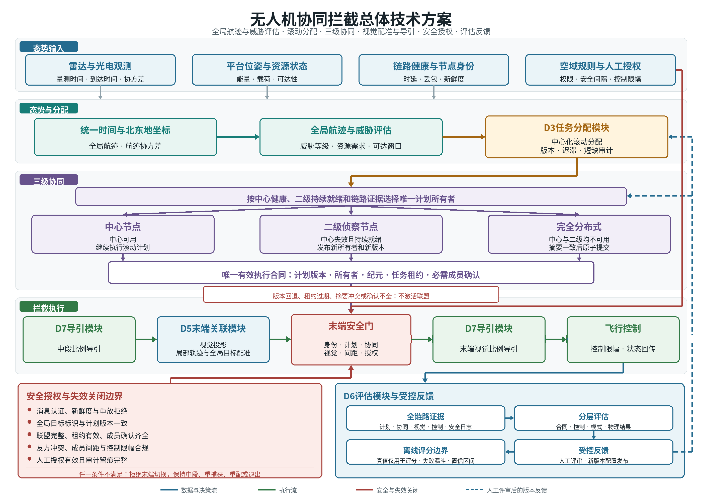

# 无人机协同拦截项目建议书

**专题名称：** 无人机协同拦截
**证据截止日期：** 2026年7月19日
**研究边界：** 面向依法授权场景下的科研仿真、半实物验证和受控试验，研究多无人机对侵入无人机的协同跟踪、任务分配、末端配准与导引控制。不涉及具体处置载荷、毁伤参数、未经授权的反制设备使用或绕过人工授权的自主处置。

## 1 立项依据

### 1.1 研究的目的和意义

本项目拟建立“态势输入、威胁排序、滚动分配、三级协同、末端视觉配准、中末段导引、安全门控、试验评估”闭环，解决资源数与目标数不等、单个高威胁目标需要多架拦截无人机、中心节点失效、末端目标身份易混淆等条件下的协同拦截问题。研究对象是系统级协同与可验证控制，不是单一探测器、单一分配算法或单机比例导引的性能优化。

我国已通过《无人驾驶航空器飞行管理暂行条例》明确无人驾驶航空器反制设备的授权边界，并要求设计、生产、使用活动满足应急处置和网络信息安全等规定[1]。交通运输部《民用无人驾驶航空器运行安全管理规则》、强制性国家标准GB 42590-2023及民航运行识别、飞行动态数据报送要求，进一步形成了运行安全、可靠被监视和数据可追溯的制度基础[2-5]。因此，本项目必须把身份、权限、计划版本、通信健康和处置授权作为控制前置条件，而不能仅以几何可达或视觉检测结果放行末端控制。

截至证据截止日期，项目已有以下基础，但能力层级需要严格区分：

| 状态 | 当前边界 |
| --- | --- |
| 已实现并经确定性回归验证 | 动态资源/目标数组；中心化匈牙利分配与多资源需求槽；资源数与目标数不等；高威胁目标“2架主资源+1架待命资源”的版本化联盟合同；计划迟滞、旧版本拒绝；中心、二级侦察节点、完全分布式的三级仲裁与原子提交合同；末端投影配准和`locked/ambiguous/hold/reacquire`状态；中段比例导引与末端视觉比例导引的合同门控。 |
| 已完成仿真或回放验证 | 质点模型、确定性故障注入、AirSim ComputerVision和SimpleFlight多场景验证。2026年7月15日完成的20个M5N2配对AirSim场景中，高威胁联盟物理完成为0/20，第二主资源进入5 m判据为0/20。该结果说明合同接线已有基础，但多机物理闭环尚未稳定；它不是外场或实装性能。 |
| 建议研究指标 | 50规模内高频滚动分配、三级协同通信扰动、末端视觉精度、协同拦截成功率、安全间隔、数据可追溯性，以及200规模以上分层调度。第2.2节所列数值均为建议验收值，不是当前已达到值。 |
| 待验证 | 真实链路带宽、时延、丢包、乱序和时钟漂移；二级侦察节点持续全目标覆盖；真实多视角相机标定；视觉检测/跟踪多种天气和尺度；协同成员间安全距离；半实物与外场可迁移性。 |
| 未实现 | 200规模以上在线分层调度；D3/全局资源强化学习在线能力；联盟级到达时间一致性控制；密码级消息认证与密钥全生命周期；实机自主处置与外场验收。强化学习仅可作为离线候选计划或参数建议，不得直接越过确定性约束和人工授权。 |

项目的直接作用有三点。第一，把单机“能追上”扩展为多机“分得对、接得住、识别一致、切换受控”，减少计划抖动、重复锁定和目标错绑。第二，在中心链路退化时保持任务所有权、联盟成员、计划版本和租约的一致性，避免重复控制或分裂执行。第三，形成统一的仿真、半实物和受控试验指标，使检测、关联、分配、协同、导引和安全失败能够定位到具体阶段，而不是只给出一次命中或未命中的结果。

### 1.2 国内外研究现状

#### 1.2.1 国内现状

国内制度建设已从单纯飞行许可扩展到产品安全、运行识别、动态数据和反制授权。《无人驾驶航空器飞行管理暂行条例》把反制设备定义为具有干扰、截控、捕获、摧毁等功能的专门设备，并规定未经授权不得非法拥有或使用[1]。CCAR-92和GB 42590-2023分别从运行与系统安全提出要求[2-3]；民航局2024年发布的运行识别最低性能要求和飞行动态数据报送要求，则把广播式/网络式识别、位置与动态信息报送纳入可靠被监视链路[4-5]。这些文件不直接给出协同拦截算法，但为项目的身份核验、数据留痕、网络安全和人工授权边界提供了约束。

国内团队已开展异构多无人机协同任务分配与视觉跟踪研究。Yan等将合同网联盟形成与协同路径规划结合，用于考虑目标资源需求的异构多无人机同时到达任务，验证方式为数值仿真[6]。该研究说明“多资源分到同一目标”与“能够按时协同进入”必须联合验证，但不能据此推定多旋翼拦截系统已具备工程成熟度。ByteTrack由国内高校与研究机构团队提出，通过关联全部检测框改善局部多目标跟踪[7]；它适合形成相机内局部轨迹，不负责跨相机全局身份、计划版本或拦截授权。

| 国内来源或团队 | 公开能力与状态 | 证据等级 | 对本项目的启示 |
| --- | --- | --- | --- |
| 国务院、中央军委 | 飞行管理、反制设备授权、网络信息安全和集群运行边界[1] | 行政法规 | 安全门控和人工授权必须独立于算法置信度。 |
| 交通运输部、中国民航局 | 运行安全、运行识别、动态数据报送[2][4][5] | 部门规章、官方文件 | 统一身份、位置、时间和数据留痕应进入试验数据合同。 |
| 国家市场监督管理总局、国家标准化管理委员会 | GB 42590-2023系统安全要求[3] | 强制性国家标准 | 安全要求需映射到控制限幅、故障回退和验证记录。 |
| Yan等 | 异构多无人机联盟分配和同时到达路径规划[6] | 同行评议论文，仿真 | 高威胁多机任务应联合考虑基数需求、时序和可达性。 |
| Zhang等 | ByteTrack局部多目标跟踪[7] | 同行评议论文、公开实现 | 可作为视觉局部跟踪候选，但不能替代全局目标身份。 |

在本次可核验的国内公开来源中，尚缺少同时公开场景版本、随机种子、通信扰动、身份错绑、计划版本、末端视觉和多机物理完成率的端到端协同拦截试验。公开信息也不足以确认200规模以上分层调度和全局资源强化学习已进入可验收系统。上述两项在本项目中列为拟研究方向。

#### 1.2.2 国外现状

国外反无人机建设逐步采用风险分层和标准化测试。英国政府2019年发布国家反无人机战略，覆盖恐怖活动、犯罪和关键基础设施等高危风险，但文件属于政策框架，不提供单项系统性能[8]。CEN于2024年发布CWA 18150，给出反无人机测试方法、场景、风险和指标框架[9]。该文件是CEN Workshop Agreement，不是正式欧洲标准，正文也明确其法律和技术地位限制。欧盟内部安全基金资助的COURAGEOUS项目公开说明其方法在比利时、希腊和西班牙开展三次用户脚本验证试验[10]；项目网页未公开可用于本项目直接设阈的完整原始性能数据，因此这里只把它作为公开试验组织方式证据。美国联邦航空局的Remote ID页面明确广播身份、无人机位置和控制站位置的作用[11]，但Remote ID不能替代末端视觉配准，也不能单独证明目标友敌属性或处置授权。

同行评议研究已经覆盖反无人机系统分类、中心化和分布式任务分配、多视角感知与协同导引。Park等将反无人机系统拆分为探测、分类、跟踪和处置等组成部分，并总结传感器和系统集成难点[12]。Beard等较早把多无人机目标分配和拦截轨迹放在统一框架下研究[13]；Dutta等提出一对多二部匹配联盟形成，表明经典一对一匹配不能直接表达单目标多资源需求[14]。Choi等的共识型捆绑算法（CBBA）为分布式任务分配提供了基础[15]，Mazdin和Rinner进一步研究了通信感知的分布式联盟形成[16]。这些方法多数使用数值仿真，经典CBBA也不原生保证一个目标必须由多个成员原子共同执行。

末端视觉方面，WILDTRACK给出了同步标定多相机数据和多视角检测基准[17]，但其固定相机、行人和地面场景与机动无人机小目标存在明显域差异。协同导引方面，Jha等同时研究多追踪者协同导引和碰撞规避[18]；Ma和Guo研究间歇通信下多无人机预设时间协同导引[19]。这类成果证明到达时序与成员避碰可以进入统一控制设计，但验证主要基于质点或特定动力学仿真，不能直接替代多旋翼平台验证。空中集群综述也把感知、规划、控制和通信列为相互耦合的系统问题[20]。

| 国外来源或机构 | 技术路线或公开状态 | 证据等级 | 证据局限 |
| --- | --- | --- | --- |
| 英国内政部 | 国家级风险治理与反无人机能力建设框架[8] | 政府战略 | 不提供算法和可复用性能值。 |
| CEN、COURAGEOUS | 标准化测试方法和三地用户脚本验证[9-10] | CEN工作坊协议、欧盟资助项目公开试验 | CWA不是正式EN标准；项目网页未公开完整原始性能数据。 |
| 美国联邦航空局 | Remote ID广播身份和位置信息[11] | 官方运行规则说明 | 不能替代友敌识别、视觉配准和授权。 |
| MRTA/联盟研究 | 一对多匹配、CBBA、通信感知联盟[13-16] | 同行评议论文 | 多数为仿真；原子联盟、版本和安全回退需工程补充。 |
| 多视角视觉研究 | 同步标定多相机检测、局部跟踪[7][17] | 同行评议论文、公开数据/实现 | 固定地面场景与空中机动小目标存在域差异。 |
| 协同导引研究 | 到达时间协调、间歇通信、碰撞规避[18-20] | 同行评议论文 | 多为质点或导弹模型，需多旋翼平台和真实通信复验。 |

#### 1.2.3 发展趋势

1. **由单设备性能转向系统级证据。** 探测率、虚警率之外，目标身份连续性、计划时效、协同接管、通信状态和处置安全开始进入同一测试框架[9][12]。
2. **由一对一分配转向动态非等量和联盟任务。** 资源数与目标数不等、高威胁目标多资源需求、主备角色和时间窗，需要匹配、流优化、整数规划和联盟协议分层使用[13-16]。
3. **由固定中心转向可证明的降级协同。** 中心正常时保持全局优化；中心失效后由二级侦察节点接管；再失效时采用完全分布式协商。每次切换都需要新版本、租约、成员确认和冲突回退[15-16]。
4. **由检测框转向目标身份和几何一致性。** 局部跟踪ID只在单相机内有效，末端必须结合全局航迹、相机内外参、量测时间和跨视角一致性，禁止用离线真值ID参与在线决策[7][17]。
5. **由并行单机导引转向带时序和安全约束的协同导引。** 多架无人机各自运行比例导引不等于协同导引；共同到达、分波次、终端扇区和成员间距需要显式建模[18-19]。
6. **分层调度和学习方法作为扩展方向。** 2025年的异构多机器人强化学习研究表明，学习方法可用于任务分配与调度[21]，但该工作面向单任务代理/多机器人任务模型，不直接覆盖单目标多资源原子联盟。对本项目而言，强化学习只能作为离线对照或候选生成器，由确定性约束、安全门和人工授权包络。

### 1.3 项目紧迫需求

#### 1.3.1 动态非等量任务与高威胁多资源协同

侵入目标的数量、速度、航向和威胁等级会在任务时间窗内持续变化，拦截资源也可能因能量、载荷、视场、通信或故障状态退出。现有动态数组、非方阵分配和需求槽合同已经能够表达资源数与目标数不等，但一次性匹配仍不能承接新目标加入、资源失效、末端失败反馈和威胁等级变化。资源不足时若没有明确的威胁优先级与短缺状态，高威胁目标可能被普通任务挤占；资源富余时若没有待命和补位边界，未获授权的资源又可能被自动带入末端。任务状态变化快于人工重新编组，是近期必须形成滚动规划能力的直接原因。

高威胁目标还可能要求多架无人机共同承担主拦截、待命补位或分波次进入，经典一对一匹配不能表达成员数量、能力、角色、时序和安全条件的联合约束[13-16]。如果把同一目标简单复制成多个独立任务，工程上会出现联盟成员只到一部分、主备角色混淆、计划频繁换配或不同成员依据不同版本执行等后果；一部分成员先行并不能视为多资源任务完成，还会造成重复锁定、局部冲突和资源浪费。近期需要建立版本化滚动分配、多成员全有或全无准入、同时、序贯或混合波次、待命激活和成员补位合同，并通过计划迟滞、冻结已执行前缀与变化预算控制无必要换配。

这项需求的近期边界是形成可审计的中心分配与联盟合同，能够对不可行任务报告短缺，对可行任务给出唯一版本、角色和激活条件，并在成员失效后重新发布完整计划。它不等同于已经证明多机物理闭环稳定，也不包含未经确定性约束校验的强化学习在线决策。联盟只有在数量、能力、身份、时序、可达性、安全和授权条件全部满足时才可执行；任一必要成员或证据缺失，均应保持不可执行、待命或请求重配状态。

#### 1.3.2 三级计划所有权与通信安全

中心化规划可以利用完整态势保持全局一致，但中心节点或主链路一旦失效，任务不能只依赖人工临时接管。现有中心、二级侦察节点和完全分布式三级仲裁合同，以及计划版本、旧版本拒绝和状态门控，为降级协同提供了基础；真实链路中的带宽限制、时延、丢包、乱序、重复、时钟漂移和网络分区尚未完成系统验证，二级节点持续覆盖与配准能力也仍待验证。短时可见或链路瞬时恢复不能证明二级节点已具备接管条件，中心恢复同样不能自动使旧计划重新生效。

计划所有权若在降级过程中失去唯一性，多个节点可能同时发布看似有效的计划，成员可能在不同纪元、租约或联盟摘要下执行，形成双主、分裂联盟、重复控制和旧任务复活。仅校验消息格式也不足以排除伪造、重放和越权指令；消息来源、唯一标识、序列、版本、时间窗、授权域、签名与密钥状态必须和计划状态机共同判定。对于依法授权的协同拦截系统，这类错误的工程后果不是一般性能下降，而是任务所有权和控制权限不可证明，因此必须优先于优化收益处理[1-5]。

近期必须形成中心正常、二级接管和完全分布式协商三条路径的一致状态迁移，统一计划所有者、单调版本、纪元、租约、摘要、成员确认和冲突回退，并在通信恢复后按确定性规则合并。与此同时，需要在网络仿真和半实物链路中验证旧版、重复、乱序、重放、伪造和未授权消息的拒绝过程，保留逐消息审计证据。边界上，二级节点未达到持续覆盖、配准、新鲜度和链路门限时不得接管；无法确认唯一所有者或完整联盟时必须失效关闭。密码级消息认证、真实密钥全生命周期和实装网络性能在完成独立验证前仍属于拟建设或待验证能力。

#### 1.3.3 末端身份导引闭环与规模验证

末端相机视场可能同时包含已分配目标、其他侵入目标和友方无人机，局部检测框或相机内轨迹编号不能直接替代中心拥有的全局目标身份。相机运动、目标小尺度、遮挡、相似外观、异步量测和标定漂移会使局部轨迹与全局航迹错绑；错误身份一旦进入导引环，就会把感知偏差转化为控制指令。现有投影配准、保守锁定状态以及中段比例导引和末端视觉比例导引的合同门控已有确定性回归与仿真基础，但真实多视角标定、复杂环境检测跟踪、成员安全距离和半实物迁移仍待验证[7][17-20]。

当前最直接的紧迫证据是，2026年7月15日完成的20个M5N2配对AirSim场景中，高威胁联盟物理完成为0/20，第二主资源进入5 m仿真评分判据为0/20。该事实说明合同接线和单项控制基础不能替代多成员物理闭环证据，中段到末端切换、短时丢帧后的重捕获、控制限幅、到达窗口、终端扇区和成员间距必须在同一验证链中联动。若继续只报告单成员最近距离或单模块回归结果，工程上无法判断失败来自身份配准、计划版本、成员时序、导引饱和还是安全回退，也不能据此推定半实物、外场或实装性能。

近期需要形成全局航迹到相机投影、局部视觉轨迹、跨视角几何、保守锁定状态、中末段导引、安全门和离线评估的一体化证据链，并建立场景、数据、日志、指标和报告的可追溯交付。规模方面，动态数组只说明接口未硬编码为2v2或5v5，不代表已验证大规模调度；200规模以上仍需研究分区分层、局部增量求解和全局冲突消解，强化学习只能作为隔离数据上的离线候选并接受确定性约束投影。近期结论严格限定于冻结条件下的仿真、回放或后续半实物验证，不包含在线真值身份、实机自主处置、未经授权控制或尚未完成的外场验收。

## 2 研究目标与指标

### 2.1 研究目标

#### 2.1.1 关键问题

##### 关键问题一 版本化滚动分配与多成员联盟

资源、目标和威胁状态持续变化，使任务分配同时具有非方阵、时变和多资源需求三种特征。普通目标可以采用一对一匹配形成确定性基线，高威胁目标却要求多个成员在能力、角色、进入时序和安全条件上共同成立；把目标复制成若干独立任务，会丢失联盟的全有或全无语义。滚动求解还会受量测波动、末端软反馈和历史失败代价影响，若每次成本微调都立即换配，已执行成员与新计划之间会产生抖动；若迟滞过强，又可能阻塞资源失效、身份冲突等硬风险触发的必要重规划。

现有基础已经覆盖动态资源和目标数组、中心化匈牙利分配、多资源需求槽、主资源与待命资源合同、计划迟滞和旧版本拒绝，但尚未证明联盟在同时、序贯或混合波次下稳定完成物理闭环，也未形成200规模以上在线分层调度。该问题跨越态势、关联、分配、协同和末端反馈接口：输入必须保留量测时间、到达时间、协方差和全局目标身份，输出必须携带计划ID、单调版本、唯一所有者、激活与过期时间、角色、联盟版本和短缺原因；末端反馈只能作为新版本输入，不能局部改写全局身份或绕过计划所有权。

可判定边界由“计划是否可发布”和“联盟是否可激活”两层构成。计划发布前应能复算容量、禁配、威胁优先级、资源能力、可达性和授权等硬约束，联盟激活前还应确认必要成员、摘要、时序、安全与身份条件完整；任一成员缺失时不得把部分联盟记为完成。第2.2节T1-T5用于检验合同合规、滚动时延、短缺报告、物理完成和版本迟滞，但其中数值是建议验收值。M5N2第二主资源尚未稳定满足5 m仿真评分判据，因此当前边界是合同和仿真基础，不是稳定多机闭环或实装能力。

##### 关键问题二 三级协同一致性与安全恢复

中心、二级侦察节点和完全分布式协商不是三个互不相关的备用算法，而是共享任务所有权的三级状态机。中心失效后，二级节点只有在全目标覆盖、跨视角配准、数据新鲜度和链路健康持续满足时才能接管；中心与二级节点均不可用时，成员需要在可能分区的网络中交换联盟摘要并完成原子提交。故障检测、消息传播和节点恢复不同步，会使旧纪元、新版本和过期租约同时存在；若只按最后收到的消息执行，系统会出现双主、旧计划复活或网络分区内的分裂联盟。

现有仲裁、租约、成员确认和确定性故障回放说明三级合同具备实现基础，但真实网络的带宽、时延、丢包、乱序、重复和时钟漂移尚未完成验证，密码级认证、重放防护和密钥全生命周期也尚未实现。跨接口约束要求计划状态、节点健康、身份权限和消息安全共同判定：所有路径必须使用同一全局目标身份和计划版本语义，任何节点不得因降级而重写身份；消息必须关联唯一标识、来源、序列、时间窗、版本、授权域、签名和密钥状态；人工授权独立于算法置信度，不能因通信恢复或局部共识而隐式补齐。

可判定边界是任一时刻至多存在一个可执行所有者和一份满足原子条件的联盟。二级持续就绪门未通过时只能继续未过期计划、保持或进入受约束的分布式路径；无法确认有效纪元、未过期租约、完整摘要和全体必要成员确认时，候选计划必须撤销。第2.2节T6、T7和T13分别检验接管、原子协商及安全消息拒绝，结论须按网络仿真、半实物和真实链路分层报告。在密钥治理和实装网络验证完成前，只能认定为协议与实验室验证能力，不能认定为生产级通信安全。

##### 关键问题三 视觉导引闭环与规模迁移

末端视觉配准的核心不是持续输出检测框，而是在相机局部轨迹与中心全局航迹之间建立可拒绝的身份关系。目标小尺度、遮挡、相似外观、平台运动、标定漂移和异步量测会共同放大投影残差；单帧错误锁定进入比例导引后，又会通过视线角速率尖峰、闭合速度变化和控制饱和传导到飞行控制。多成员任务还引入到达窗口、终端扇区和成员间预测最近点约束，多个单机导引分别可用并不代表联盟闭环可达或安全。现有投影、马氏门控、保守状态与中末段导引合同尚缺真实多视角、复杂环境及高威胁多成员的稳定物理证据。

规模迁移与末端闭环共享同一证据问题。动态数组和2v2、5v5基线不能证明200规模以上调度可在限定时间内保持全局冲突消解，AirSim或质点仿真也不能覆盖真实相机、网络、动力学和控制器误差。跨接口上，视觉只能使用带时间和协方差的预测航迹、相机标定、局部轨迹和当前计划，离线真值身份仅用于评分；导引只能消费锁定、歧义、保持或重捕获状态，并受控制限幅、安全间距和人工授权约束；评估必须把场景、软件、模型、日志和指标版本串联，不能用单次命中掩盖身份、计划或安全失败。

可判定边界由身份有效、模式切换、物理结果和验证层级共同确定。缺少标定、时间、协方差、稳定视觉或授权证据时必须保持中段、重捕获或退出，成员间距风险优先于共同到达。T8-T12只在冻结场景和评分口径下判定配准、身份隔离、切换、单成员物理结果与安全间隔；T14和T15分别属于规模化调度与离线学习研究。2026年7月15日的M5N2配对AirSim结果中，第二主资源进入5 m判据为0/20，该结果不得外推为设备性能，也不能由后续小规模单成员成功替代。

#### 2.1.2 明确目标

##### 目标一 形成中心分配与联盟合同

建立面向任意资源数和目标数的中心化滚动分配能力，统一处理可达性、威胁、能量、载荷、视场、通信、空域、授权和历史失败代价。普通目标以确定性一对一匹配为基线，高威胁目标以多资源需求槽表达主资源、待命资源、成员能力、同时、序贯或混合波次、终端扇区和补位条件。每份计划形成可追溯的计划ID、版本、所有者、激活与过期时间，采用迟滞、最小驻留、冻结已执行前缀和变化预算控制抖动，并允许硬失效旁路软迟滞后发布新版本。

主要成果包括需求与约束数据合同、中心滚动求解器、联盟生命周期与全有或全无准入机制、成员补位和短缺报告、计划版本校验器，以及覆盖2v2、5v5、非等量、动态增减和M5N2的场景与回放证据。验证按T1-T5冻结场景、参数、随机种子和评分口径，分别检查硬约束、规划时延、高威胁保障、联盟物理完成及版本迟滞；仿真评分结果、合同回归结果和后续半实物结果分开报告。目标要求形成可判定合同并改善当前M5N2多成员闭环不足，但不预设已达到T4建议值，也不把第二主资源尚未稳定完成5 m闭环的事实改写为已解决。

本目标不包含200规模以上在线分层调度、联盟级到达时间一致性已经工程定型、强化学习直接发布计划或实机自主处置。强化学习如用于资源建议，只能生成离线候选，经确定性硬约束投影、分布外检测和人工审核后参与对照。联盟数量、身份、时序、安全或授权条件不足时，系统交付的正确行为是拒绝激活、显式报告短缺或请求重配，而不是以部分成员执行替代目标完成。

##### 目标二 形成三级协同与消息安全验证

形成中心节点、二级侦察节点和完全分布式协商的三级协同能力，使三条路径共享计划所有权、单调版本、纪元、租约、摘要和成员确认语义。中心失效后，以覆盖、配准、新鲜度、链路和持续性联合门判定二级接管；中心与二级节点均不可用时，以联盟摘要、全体必要成员确认和原子提交形成候选计划；中心恢复或网络分区合并时，按确定性优先级生成新版本，不自动复活旧纪元或过期租约。

主要成果包括三级仲裁状态机、链路健康与接管门、分布式联盟协议、冲突合并与保守回退机制，以及消息唯一标识、来源、序列、版本、时间窗、授权域、签名和密钥状态的校验接口。通过确定性故障注入、网络仿真和条件具备时的半实物链路，覆盖中心失效、二级瞬时与持续就绪、成员退出、丢包、时延、乱序、重复、重放、伪造、网络分区、中心恢复和密钥轮换，按T6、T7和T13形成逐消息、逐计划的审计记录和独立报告。

验证范围以冻结的故障矩阵、网络条件和授权配置为准，协议回归、网络仿真、半实物与真实链路证据不得混写。无法确认唯一所有者、有效纪元、完整联盟或有效安全凭据时，预期行为是保持、撤销或请求重配。该目标不宣称现有系统已经具备密码级消息认证和生产密钥治理，也不包含绕过人工授权的自动处置；真实设备带宽、时钟、无线环境和密钥基础设施在完成专项测试前继续标记为待验证。

##### 目标三 形成末端闭环与规模化研究交付

形成全局航迹到相机投影、局部视觉轨迹、跨视角几何和保守身份状态的末端配准能力，保持中段比例导引为确定性基线，完成末端视觉比例导引、短时保持、重捕获和模式退出的受控切换。针对高威胁联盟，把到达窗口、终端扇区、控制限幅、预测最近点和成员安全距离纳入同一安全门；在线链路不得读取离线真值身份，任何节点不得改写中心拥有的全局目标ID，身份、时间、标定、协方差、计划或授权证据不足时按安全优先回退。

主要成果包括末端配准与导引接口、视觉和控制故障注入场景、离线评分器、规模化调度研究原型，以及场景库、数据字典、仿真与半实物测试工具、指标计算程序、回放包、模型卡、试验报告和验收证据包。按T8-T12验证配准、身份隔离、中末段切换、单成员物理结果和协同安全间隔，按T14研究200规模以上分区分层、局部增量求解和全局冲突消解，按T15仅评估全局资源强化学习离线候选。所有结果关联场景、数据、软件、模型、参数和报告版本，以便独立复算失败阶段和指标。

验证从确定性回归、质点仿真和AirSim场景起步，条件具备后扩展到网络或飞控半实物和受控外场，各层分别冻结条件、计算指标和形成结论。当前20个M5N2配对AirSim场景中第二主资源进入5 m判据为0/20，近期交付必须保留该未达事实并以新增配对场景验证改进，不能用接口完成或单成员结果替代。目标不包含未经验证的真实多视角性能、200规模以上在线生产能力、强化学习无约束在线决策、实机自主处置或外场验收；5 m仅为现有仿真评分半径，不是实装射程或处置性能。

### 2.2 技术指标

以下指标均为**建议验收值**。共同测试要求为：冻结场景和参数版本；每类随机场景不少于30个配对种子，确定性故障矩阵逐项覆盖；在线控制不得使用真值身份或真值状态；比例指标明确分母，时延使用单调时钟；成功率同时报告点估计和95% Wilson置信区间。外场条件未具备时，对应项目标记“待验证”，不得用仿真值替代。

| 编号与指标 | 基线或当前状态 | 目标值 | 测试条件 | 计算或测量方法与数据源 | 验收规则 |
| --- | --- | --- | --- | --- | --- |
| T1 动态约束合规率 | 动态数组和基础合同已实现；大规模未验证 | 100%硬约束合规 | 2v2、3v5、5v3、M5N2、目标新增、资源失效、高威胁需求变化；每类30种子 | 分母为全部已发布可执行计划；从计划、资源状态和拒绝记录逐项复算容量、禁配、角色、时间窗 | 任一超容量、禁配边、部分联盟或未授权待命资源执行均不通过 |
| T2 中心化滚动分配时延 | 小规模仿真已运行；无50规模正式基线 | 资源和目标均不超过50时，单次规划P95不高于100 ms，最大值不高于250 ms | 30种子，每种子1000个规划tick；含非方阵和`k>1`需求槽 | 起点为完整输入快照就绪，终点为计划序列化完成；记录单调时钟和硬件配置 | P95和最大值同时满足，且无因超时绕过硬约束 |
| T3 非等量高威胁保障率 | 3v5、5v3等确定性夹具已有 | 可行容量存在时，高威胁未分配率为0；不可行时短缺报告率100% | 3v5、5v3、10v20、20v10，30种子，威胁和可达性分层 | 高威胁未分配数/可行高威胁目标数；短缺字段完整数/不可行目标数 | 两项均达到目标，短缺不得用普通未分配状态掩盖 |
| T4 高威胁联盟物理完成率 | 2026-07-15 M5N2 AirSim配对场景为0/20，未达标 | 同一场景中全部激活主资源完成率不低于80%；部分联盟可执行次数为0 | M5N2，2主+1待命，baseline/candidate配对各30种子；5 m为仿真评分半径，不作为实装射程 | 分母为形成并激活的高威胁联盟；由离线评分器按成员独立轨迹计算 | 点估计不低于80%，95%置信区间下限不低于70%，在线真值使用为0 |
| T5 计划版本与迟滞治理 | 版本、旧计划拒绝和迟滞已实现 | 旧版本拒绝率100%；版本回退0；稳定阶段每5 s无必要成员变化不超过2次 | 注入旧版、乱序、成本微扰、软视觉反馈和硬资源失效，30种子 | 从逐tick计划历史计算拒绝、回退、成员变化和硬风险旁路 | 三项同时满足；硬风险必须允许立即重规划，不受迟滞阻塞 |
| T6 二级侦察节点接管时延 | 接管合同和确定性正负例已有；持续真实覆盖待验证 | 中心失效至二级有效计划激活P95不高于2 s；重复有效所有者为0 | 20%随机丢包、200 ms单向时延、50 ms抖动、1%乱序和1%重复，30种子 | 起点为中心健康超时，终点为二级计划经持续就绪、ACK和租约激活 | 时延达标、无双主、无旧epoch或过期租约执行；覆盖不足时允许保守转下一级 |
| T7 完全分布式原子协商 | 原子提交合同和回放已有；真实链路待验证 | 可行场景P95收敛不高于5 s；分裂联盟、摘要冲突误执行和缺ACK执行均为0 | 中心和二级同时失效，节点数5/20/50，含成员退出和网络分区，30种子 | 从联盟消息、摘要、epoch、租约、ACK和执行记录重建状态机 | 所有安全违规为0；不能收敛时必须进入hold/reconfigure并记录原因 |
| T8 末端视觉配准精度 | 投影、马氏门控和保守状态已实现；真实多视角标定待验证 | 锁定精确率不低于95%，召回率不低于90%，错误全局锁定率不高于1% | 1080p；目标框宽不小于20 px；量测龄期不大于100 ms；标定重投影误差不大于1 px；30种子 | 离线真值只在评分阶段匹配；在线输出仅含局部轨迹、几何残差和全局绑定 | 三项满足，且缺标定、时间或协方差时必须拒绝而非猜测 |
| T9 身份与真值隔离 | 在线真值身份隔离已有回归 | `global_track_id`重写0；在线真值身份/状态读取0；计划外重复锁误放行0 | 全部仿真和半实物场景，注入友方重叠、相似目标、局部ID切换 | 静态审计加运行日志字段计数；离线评分进程与在线进程分离 | 任一非零即不通过 |
| T10 中末段切换有效率 | 中段PN、末端视觉PNG和合同门控已实现；高威胁切换不稳定 | 合法切换机会中0.5 s内进入末端视觉模式的比例不低于90%；非法切换0 | 有效/无效视觉锁、1至5帧丢失、重捕获、闭合速度和机动裕度边界，30种子 | 起点为全部切换条件首次持续满足，终点为实际执行律切换；候选律不计入执行 | 合法切换率达标，非法切换、待命资源切换和降级期间切换均为0 |
| T11 单成员物理拦截成功率 | 2v2已有多种子仿真；外场未验证 | AirSim中激活成员5 m成功率不低于90%；半实物目标待基线测试后冻结 | 2v2、5v5、M5N2，正常与机动目标，30配对种子 | 分母为获得有效当前计划并进入控制的成员；离线计算最小三维距离和终止原因 | 仿真点估计不低于90%、95%下限不低于80%；半实物单列，不跨层换算 |
| T12 协同成员安全间隔 | 终端安全间隔主动控制未实现 | 全程成员间距不低于平台安全评估值`d_safe`，初始仿真建议值5 m；安全门违规0 | M5N2同时、序贯、混合三种策略，含最不利交叉进入，30种子 | 逐控制tick计算任意激活成员两两三维距离和预测最近点 | 任何小于冻结`d_safe`且未执行预定回退均不通过；外场值待平台评估后替换 |
| T13 通信与安全消息拒绝率 | 新鲜度、版本门已有；密码认证和密钥治理未实现 | 旧版、重放、伪造、重复和未授权消息拒绝率100%；有效消息误拒率不高于0.1% | 网络仿真/半实物注入各不少于10000条消息，覆盖密钥轮换和节点撤销 | 安全网关日志按消息唯一ID、签名、时间窗、版本和授权结果统计 | 安全消息拒绝率达标；密钥或时间证据缺失时fail-closed |
| T14 200规模以上分层调度 | 未实现 | 200资源、200目标、10个区域时，滚动更新P95不高于2 s；硬约束合规率100% | 20种子，每种子500 tick；跨区资源10%、高威胁联盟需求10%，含区级失效 | 记录区内求解、跨区协调和全局冲突消解时延；小规模子集与集中式参考解比较 | 时延和合规率达标；50规模可比子集的平均代价劣化不高于10% |
| T15 全局资源强化学习离线增益 | 未实现，不是当前能力 | 相对冻结启发式基线，独立测试集平均任务代价降低不少于5%，95%配对置信区间不跨0；硬约束违规0 | 训练/验证/测试按场景族隔离为60%/20%/20%，独立30种子；包含分布外压力场景 | 仅生成候选计划，经确定性约束投影和人工审核；记录模型、数据和随机种子版本 | 达到增益且无安全退化才可保留为研究候选；不得直接控制飞行 |
| T16 数据与报告可追溯率 | 统一日志已有基础；完整治理待建设 | 必填字段完整率不低于99.9%；同版本回放指标哈希一致率100%；报告证据路径完整率100% | 全部验收场景，随机抽取不少于10%人工复核 | 按第4.3节模式校验原始数据、派生数据、模型、日志、指标和报告血缘 | 三项同时满足；缺失数据不得补零，应标记unavailable并说明原因 |

## 3 研究任务

### 3.1 研究内容

#### 3.1.1 态势与需求建模及中心滚动分配

研究对象是资源数与目标数不等、普通目标与高威胁目标需求不同、状态持续变化条件下的统一态势和任务分配问题。输入包括带`measurement_timestamp`与`arrival_timestamp`的全局航迹及协方差、威胁等级、资源能量与载荷、可达性、空域和人工授权规则、上一版计划以及末端反馈。研究将统一描述资源、目标、角色、能力需求、时间窗、终端扇区和安全禁配关系，冻结2v2、5v5、非等量、M5N2与200规模场景族；2v2和5v5仅作为基线场景名称，不构成算法规模上限。

实施以一对一匈牙利算法和多资源需求槽为确定性基线，使用最小费用流和约束规划形成复杂约束参考解；状态局部变化时只求解受影响的增量连通分量，并用迟滞、最小驻留时间和变化预算抑制无必要换配。产物包括场景规范、数据字典、威胁与资源需求配置、版本化计划、可解释成本分解、拒绝原因、未分配与资源短缺摘要，以及面向大规模场景的分层计划和跨区调拨记录。强化学习仅研究离线候选顺序和软代价优化，候选必须经确定性约束投影和人工审核，不能直接生成控制命令。

验证采用模式与边界值检查、非方阵和动态事件测试、50规模集中式参考对照及200×200压力测试，逐项复算容量、禁配、角色、时间窗和联盟完整性，并统计滚动求解时延、换配次数和硬约束合规率。求解超时或证据不足时沿用未过期的上一有效计划，或退回快速确定性基线；任何不完整联盟、过期计划或未通过约束检查的候选均不得发布。200规模调度与强化学习均属于拟研究能力，完成规定验收前不得陈述为当前在线能力。

#### 3.1.2 高威胁联盟、三级协同与故障恢复

研究对象是高威胁目标需要多资源共同作用时的联盟构成、协同到达和中心失效后的计划连续性。输入包括目标资源需求、成员能力与预计可达时间、剩余能量、视觉和通信状态、中心健康、二级侦察节点覆盖与持续就绪证据、联盟摘要、确认回执及任务租约。研究比较同时到达、序贯波次、混合2+1和独立基线，实行全有或全无联盟准入，明确主资源、待命资源、成员角色、终端扇区、到达窗口、波次冻结和补位条件；待命资源只有收到新版本明确激活后才能执行。

三级协同按中心计划继续、二级侦察节点接管、完全分布式原子协商运行。中心失效时，二级节点只有在覆盖、配准、链路、新鲜度和持续性同时达标后才能取得所有权；两级均不可用时，以纪元、租约、联盟摘要哈希和全体必需成员确认形成原子提交，并在网络分区、成员退出或中心恢复后按确定性规则合并。计划、观测、联盟和导引消息同时校验唯一标识、节点身份、签名、版本、新鲜度、重放窗口、权限与密钥状态。产物包括联盟标识和版本、成员角色与到达窗、唯一计划所有者、纪元和租约、提交摘要、协同动作、安全消息封装、审计日志、节点撤销记录及回退原因。

验证使用质点模型和AirSim仿真的配对随机种子评估可达性、到达离散和成员退出影响，并通过网络故障注入、状态机模型检查、半实物链路、渗透测试和密钥轮换演练检查旧纪元、重放、乱序、重复及分区恢复。向导引链只发布唯一有效协同状态和只读成员绑定；任何节点不得本地创建、改写或重绑定中心拥有的`global_track_id`。无法确认唯一所有者、有效版本、有效租约、完整联盟或人工授权时必须失效关闭，进入保持、撤销或重配；质点和AirSim结果只作为仿真证据，不表述为实飞或装备能力。

#### 3.1.3 末端配准、导引安全、规模验证与证据评估

研究对象是局部视觉轨迹与全局目标身份的可靠配准，以及多成员从中段导引进入末端闭环时的控制和安全一致性。输入包括全局航迹与协方差、相机内外参、量测时刻平台位姿、局部检测或轨迹、当前计划绑定、成员与目标估计、链路和授权状态。方法采用量测时刻传播、相机投影、像素协方差、马氏距离门控、跨视角几何检查和稳定窗口，视觉跟踪器只维护局部标识并输出`locked/ambiguous/hold/reacquire`状态；导引侧采用中段比例导引、末端视觉比例导引、短时预测和重捕获，联合检查终端扇区、到达窗口、成员间距、预计最近点、机动裕度和控制限幅，安全约束始终优先于协同到达。

实施产物包括配准残差、跨视角一致性和友方冲突结果，每个成员独立的导引状态、实际执行律、控制限幅与拒绝原因，以及用于规模化调度和强化学习研究对照的性能报告、模型卡与消融报告。全链路计划、协同、视觉、通信和控制日志按回合、目标、联盟、成员、链路和帧分层汇集，区分合同、控制、模式和物理结果，形成指标数据集、置信区间、失败漏斗、回放包、中文报告与验收清单。离线真值仅供隔离评分，评估结果和参数建议必须经审核形成新配置版本，不能直接改写在线计划、协同状态或控制参数。

验证按标定板与受控回放、质点仿真、AirSim仿真、网络或飞控半实物逐级开展，覆盖小目标、遮挡、相似目标、外参漂移、异步量测、短时丢帧、视线角速率尖峰、控制饱和和成员交叉进入；独立复算指标、核对数据哈希并人工抽检证据路径。任何计划、租约、视觉质量、身份、安全间隔或人工授权门失败时，系统应保持中段、进入保持或重捕获、请求重配或退出，不得强制切入末端。半实物和受控外场需按后续分级条件单独验收，已有仿真结果不得外推为真实平台性能。

### 3.2 关键技术

#### 3.2.1 版本化非等量与多资源滚动分配

设资源集合为\(R=\{r_i\}\)，目标集合为\(T=\{t_j\}\)，基础分配变量为\(x_{ij}\in\{0,1\}\)。中心化基线最小化可解释代价：

\[
\min \sum_{i,j} C_{ij}x_{ij}+\sum_j P_j u_j
\]

其中\(C_{ij}\)由预计拦截时间、威胁、航迹协方差、能量、载荷、视场、通信、历史失败和换配惩罚组成，\(u_j\)表示未满足需求。普通目标采用一对一匈牙利基线；对\(k_j>1\)的高威胁目标展开主资源、待命资源和能力需求槽，并要求候选联盟同时满足：

\[
|C_j|\ge k_j,\quad capability(C_j)\ge q_j,\quad timing(C_j)\in W_j,\quad safety(C_j)=true
\]

一对多匹配研究表明，经典一对一分配不足以表达单任务多成员联盟[14]；国内同时到达任务分配研究和国外目标分配/拦截研究也说明资源分配与路径、时序相互耦合[6][13]。工程上将成员能力、主备角色、共同或分波次到达窗、终端扇区和安全间距写入同一需求合同，执行全有或全无准入，不把多个独立导引器同时启动等同于协同导引，也不发布部分联盟。

每个可执行计划必须携带`plan_id/version/owner/epoch/lease/created_at/expires_at`。代价刷新不改变执行身份；成员、角色、目标、所有者或激活状态变化才推进版本。旧版本、回退版本和过期租约直接拒绝。普通成本扰动由相对收益阈值、最小驻留时间和窗口变化预算抑制；资源失效、身份冲突和目标消失等硬风险可立即旁路迟滞。该机制把“少换配”与“安全事件及时重排”分开。

面向200规模以上场景，工程实现采用区域分解、区内滚动、跨区资源协调和全局冲突消解，局部变化只重算受影响连通分量，变化扩散或证据不足时退回全量确定性求解。强化学习只生成离线候选或调整软代价顺序，再经硬约束投影、置信度与分布外检测和人工审核；异构多机器人任务分配研究可作为调度参考[21]，但其任务模型不能替代本项目的原子多成员、版本和安全合同。验证以非方阵、动态失效、联盟短缺、200×200时延和50规模参考解代价为判据，同时要求硬约束违规为零；学习候选无统计增益或任一硬门失败时退回冻结的确定性基线。

#### 3.2.2 三级协同所有权与原子联盟提交

中心正常时，由全局节点持有计划所有权并滚动发布版本，二级侦察节点持续维护观测和接管准备。中心失效后，二级节点只有在覆盖、配准、链路、观测新鲜度和多时刻持续就绪均满足时，才能以新`owner`、新`epoch`和新`version`接管；中心与二级均不可用时，完全分布式路径使用竞价或共识形成候选，再通过联盟摘要哈希、`epoch`、`lease`和全体必需成员`ACK`原子提交。CBBA适合作为单赢家分布式基线[15]，通信感知联盟研究可用于事件、周期和混合通信对照[16]，但二者都不能免除多成员原子提交、唯一所有者判定和安全回退。

工程实现把协同状态机与通信安全门绑定。消息最小字段包括消息唯一标识、来源节点、序列号、计划版本、时间戳、有效期、签名和授权域；链路健康同时考虑心跳、观测龄期、覆盖、配准、计划确认和租约。重放、重复、乱序、旧版本、未知节点、签名失败或密钥撤销后的历史节点消息一律拒绝，网络分区恢复后按最高有效纪元、未过期租约和确定性摘要规则合并，不允许节点凭局部状态改写`global_track_id`或并行激活冲突联盟。

验证采用状态机模型检查与网络、半实物链路故障注入，覆盖中心失效、二级瞬时可见、分区、乱序、重复、成员退出、租约过期、中心恢复和密钥轮换。判据是任一时刻至多存在一个有效计划所有者，原子联盟只有全部必需成员确认才可激活，旧版、伪造、重放和未授权消息按T6、T7与T13要求拒绝。无法形成唯一所有者、完整摘要或有效租约时，系统撤销候选并进入保持或请求重配；Remote ID只能提供外部身份和位置线索[11]，不能取代本地配准、任务授权和抗伪造校验。

#### 3.2.3 全局身份不变的末端视觉、导引与安全门闭环

末端视觉链路按“全局航迹 -> 量测时刻传播 -> 相机投影 -> 像素协方差 -> 局部视觉轨迹 -> 几何/身份门控”实现。配准保留量测时间和到达时间，使用相机内参、畸变、量测时刻平台位姿和外参，通过马氏距离、跨视角一致性、当前计划绑定及稳定窗口输出`locked/ambiguous/hold/reacquire`。ByteTrack可作为局部跟踪候选[7]，WILDTRACK可提供同步多相机几何与评测方法参考[17]，但局部ID只在单个相机流内有效，视觉模块不能创建、改写或重绑定中心拥有的全局目标ID；在线关联不得读取AirSim或外场真值ID，真值只在隔离的离线评分进程使用。

中段采用经典比例导引基线：

\[
a_n=N V_c \dot{\lambda}
\]

其中\(N\)为导航系数，\(V_c\)为闭合速度，\(\dot{\lambda}\)为视线角速率。末端视觉比例导引只从已确认配准、相机姿态和滤波视线角速率生成命令，并检查原始与滤波尖峰、视场边缘、闭合速度、预计碰撞时间、机动裕度和控制限幅。切换必须同时满足当前计划版本、协同动作允许、视觉锁定一致、距离与闭合速度、成员角色、到达窗、终端扇区、安全间距和人工授权；安全门优先于任务收益，友方冲突、重复锁定、身份不一致、联盟未提交或授权缺失时不得进入末端模式。

工程验证覆盖标定误差、异步量测、小目标、遮挡、相似外观、跨视角、短时丢帧、视线角速率尖峰、控制饱和和多成员交叉进入，分别统计配准精确率与召回率、身份切换、切换误触发、末段偏差、最小间距和控制限幅。缺少标定、协方差、时间或身份证据时输出`hold/reacquire`，末端门失败时继续中段、短时预测或退出。多追踪者研究表明协同到达之外还需显式碰撞规避[18]，间歇通信协同导引论文仅提供研究方向[19]；其仿真模型及本项目仿真结果均不能直接作为多旋翼实飞验收证据。

### 3.3 创新点

#### 3.3.1 多资源需求槽与迟滞计划合同

相较于固定规模的一次性一对一分配，本项目拟新增“多资源需求槽、联盟全有或全无准入、版本化迟滞”一体化机制。该机制不把同一目标简单复制为多个独立任务，而是显式表达`k_j>1`、成员能力、主资源与待命资源、共同或分波次到达窗、终端扇区和资源短缺；计划合同记录所有者、版本、租约、成本分解与拒绝原因，仅在成员、角色、目标、所有者或激活状态发生实质变化时推进版本，软成本扰动受迟滞和变化预算约束，硬失效则允许立即旁路迟滞。

可验证价值是同时降低不完整联盟误执行、旧计划并存和无收益换配。按T1-T5检查非方阵可行性、联盟准入、计划抖动、旧版本拒绝和高威胁协同结果，并按T14-T16验证区域分解与增量求解的规模时延、硬约束合规和证据可追溯性。强化学习只作为离线软代价候选，确定性投影、置信度门和人工审核属于合同的一部分，而采用某一开源算法本身不构成创新。该机制适用于中心持有全局摘要或二级节点已完成受控接管的条件；200规模和学习候选在通过验收前均不得进入默认在线运行链，也不替代人工授权。

#### 3.3.2 中心、二级与分布式路径的统一所有权

相较于仅凭心跳切换主备节点或依赖单赢家拍卖，本项目拟把中心滚动计划、二级侦察节点接管和完全分布式协商统一到`owner/epoch/lease/version`所有权合同。二级节点需以覆盖、配准、链路、新鲜度和持续就绪证明取得接管资格；分布式路径除形成候选联盟外，还必须交换摘要哈希并获得全体必需成员`ACK`后原子提交。网络分区恢复、成员退出和中心恢复均采用确定性合并规则，局部节点不得因降级而改写全局目标身份。

可验证价值是将“降级后仍可协同”限定为可审计、无分裂执行的状态，而不是追求无条件可用。按T6、T7和T13通过状态机模型检查、网络故障与安全消息注入，验证任一时刻至多一个有效所有者、联盟不部分提交、旧纪元与过期租约不执行，以及重放、伪造、重复和未授权消息被拒绝。适用边界是节点具备可验证身份、时钟、摘要和租约证据；无法裁决唯一所有者或无法收齐必需成员确认时，系统必须保守保持、撤销或重配，不能降低原子性和授权门以换取表面连续运行。

#### 3.3.3 全局身份不变的视觉导引安全闭环

相较于用单帧检测框、局部跟踪ID或固定距离阈值直接切换末端控制，本项目拟新增全局身份不变的“视觉配准证据、导引模式切换、安全门”闭环。视觉侧按量测时刻传播全局航迹，将像素协方差、跨视角几何、当前计划绑定和稳定窗口共同用于`locked/ambiguous/hold/reacquire`判定；导引侧只有在计划、协同状态、视觉质量、成员角色、到达窗、机动裕度、控制限幅、安全间距和人工授权均有效时，才从中段比例导引切入末端视觉比例导引。局部视觉模块始终无权创建、改写或重绑定`global_track_id`，离线真值也不进入在线控制链。

可验证价值是把身份一致性、控制连续性和多成员安全间隔置于同一可追溯判据中。按T8-T12在时间偏差、标定漂移、小目标、遮挡、相似目标、短时丢帧、尖峰、饱和和交叉进入场景下，联合统计配准精确率与召回率、身份切换、切换误触发、末段偏差和最小成员间距，并以逐级软件在环、AirSim仿真和半实物证据限制结论。该机制依赖有效标定、位姿、时间、计划和授权证据；任一证据不足即保持中段、重捕获或退出。当前仿真结果不证明实飞性能，也不宣称已实现未经后续验收的联盟级到达时间一致性。

## 4 技术方案

### 4.1 总体技术方案

总体方案以中心拥有的全局目标身份和版本化计划为主线。传感与平台状态进入统一时间和坐标基准后，中心执行滚动分配；三级协同模块根据中心、二级侦察节点和网络健康决定计划所有者。当前有效计划驱动中段比例导引，进入末端后由视觉模块完成局部轨迹到全局目标的配准。通信、身份、版本、视觉、授权和成员安全条件共同组成末端安全门。执行结果和全链路日志进入离线评估，参数建议经审核后才能回灌下一版本配置。

**图4-1 无人机协同拦截总体技术方案。** 数据流由雷达与光电观测、平台状态和链路状态进入统一北东地坐标，形成带协方差的全局航迹、威胁等级和资源需求。D3任务分配模块据此滚动生成计划，并记录版本、迟滞、短缺和拒绝原因。

决策流在三级协同中只保留一个有效计划所有者。中心可用时继续执行中心计划；中心失效且二级侦察节点持续就绪时，由二级节点发布新所有者和新版本；两级均不可用时，完全分布式路径通过摘要、纪元、租约和必需成员确认实现原子提交。版本、租约或成员确认不完整时，不激活联盟。

执行流由D7导引模块的中段比例导引开始，D5末端关联模块完成局部视觉轨迹与全局目标的配准。只有身份、当前计划、协同状态、视觉质量、成员间距、控制限幅和人工授权同时有效，D7才切换到末端视觉比例导引；任一证据不足或冲突时，系统保持中段、重捕获、请求重配或退出，执行失效关闭。

D6评估模块接收计划、协同、视觉、控制和安全日志，按合同、控制、模式和物理结果分层计算失败漏斗与置信区间。离线真值只用于评分；参数和配置建议经过人工评审并形成新版本后，才能反馈到下一轮分配、协同和安全门，评估结果不得直接改写在线控制。

### 4.2 技术难点和解决途径

#### 4.2.1 非等量联盟构造与协同可达

**难点与成因。** 资源数和目标数不等时，系统既要处理普通目标的一对一关系，又要为高威胁目标组合多种能力、主备角色和到达窗口；把同一目标复制为多个独立任务会掩盖联盟短缺，并可能发布只有部分成员可执行的计划。即使多个成员已绑定同一目标，也不等于同时到达或分波次到达在物理上可行，成员动力学、剩余能量、进入方向、终端扇区、视觉状态和控制裕度的差异会使组合可行而闭环不可达。规模扩展还会放大求解时延，离线强化学习候选则存在分布外场景违反硬约束和换配原因不可解释的问题。

**解决途径。** 普通任务采用一对一匈牙利确定性基线，高威胁任务展开能力、主资源、待命资源和时序需求槽，以最小费用流和约束规划生成复杂约束参考，并对受变化影响的连通分量增量求解。候选联盟在激活前联合复核容量、禁配、成员能力、预计到达、终端扇区和安全间距，比较同时、序贯和混合2+1策略，冻结主备角色、波次和待命激活条件。200规模采用区域分解、区内滚动、跨区协调和全局冲突消解；强化学习仅离线调整软代价或候选顺序，必须通过分布外检测、确定性约束投影、模型卡审查和人工审核。

**验证方法。** 使用非方阵、动态目标与资源失效、M5N2联盟短缺和最不利进入方向场景检查T1-T5，以配对随机种子的质点模型和AirSim仿真分别统计联盟准入率、到达离散、末段偏差与最小成员间距。规模验证按T14在200资源、200目标和10个区域条件下统计滚动更新时延与硬约束合规率，并在50规模可比子集与集中式参考解比较代价；学习候选按T15在场景族隔离的独立测试集上比较冻结启发式基线，任何硬约束违规均判为不通过。这些结果只构成仿真或离线研究证据。

**失败回退。** 增量求解超时、变化扩散或输入证据不足时，回到全量确定性求解、快速确定性基线或未过期的上一有效计划，不发布部分联盟。共同到达不可达时，只有新版本通过全部约束后才可转为序贯或混合策略，待命成员在明确激活前保持未执行；成员间距或终端扇区不满足时优先放弃到达一致性并请求重配。学习候选无统计增益、置信度不足、处于分布外或投影失败时立即弃用，不能绕过确定性合同或直接控制飞行。

#### 4.2.2 计划所有权、分级降级与网络分区

**难点与成因。** 高频滚动规划需要立即响应资源失效、身份冲突和目标消失，又要避免状态噪声、视觉软反馈和成本微扰造成频繁换配；通信乱序和延迟还可能使多个版本并存执行。中心失效后，二级侦察节点的瞬时可见或短暂链路恢复并不代表其拥有完整态势、有效配准和足够新鲜的输入。中心与二级节点均不可用时，网络分区、摘要冲突、成员退出、旧纪元和重复消息可能让多个局部联盟分别认为自己有效，形成分裂执行和重复锁定。

**解决途径。** 计划采用单调`version`、唯一`owner`、`epoch`、`lease`、创建与过期时间，结合相对收益迟滞、最小驻留时间、窗口变化预算和硬软反馈分级；硬失效可旁路迟滞，但必须记录原因并发布新版本。二级接管设置覆盖、配准、链路、新鲜度和多时刻持续性联合门，通过后才发布新所有者和租约；完全分布式路径以摘要哈希、必需成员`ACK`和原子提交约束联盟，通信恢复后按确定性规则合并。消息同时验证唯一标识、来源、序列号、版本、时间戳、有效期、签名、授权域和密钥状态，任何节点都不得在降级时改写`global_track_id`。

**验证方法。** 通过状态机模型检查和网络仿真组合注入成本微扰、旧版与回退版计划、乱序、重复、重放、中心失效、二级瞬时就绪、网络分区、成员退出、租约过期、中心恢复和密钥轮换；半实物链路验证使用同一消息唯一ID核对发送、拒绝和审计结果。按T6、T7检查指定退化路径选择正确、分布式联盟原子提交且无旧版本复活，按T13验证旧版、重放、伪造、重复和未授权消息全部拒绝，并确认有效消息误拒率满足建议验收边界。

**失败回退。** 软扰动未超过迟滞阈值时保持当前有效计划；硬风险发生时撤销受影响绑定、立即重规划并保留旁路审计。二级节点未达到持续就绪门时，不得降低阈值形成虚假接管，应继续未过期中心计划、进入保持或转入受约束的完全分布式路径。无法确认唯一所有者、有效纪元、未过期租约、完整摘要或全体必需成员确认时，撤销候选联盟并保持或请求重配；身份、时间、签名或授权证据缺失时执行失效关闭，通信恢复也不得自动复活旧计划。

#### 4.2.3 视觉配准、导引安全与仿真迁移

**难点与成因。** 末端小目标像素少，遮挡、相似外观、相机运动、异步量测和外参漂移会同时削弱外观与几何证据，容易把局部视觉轨迹错绑到全局目标。单帧锁定、视线角速率尖峰、视场边缘裁剪、短时丢帧和闭合速度变化会在中末段切换时放大控制跳变或饱和；多个成员从相近方向进入还会产生遮挡、预测最近点过小和碰撞风险。软件和AirSim仿真无法覆盖真实平台的时延、噪声、动力学、控制限幅、标定漂移、链路和环境扰动，因此仿真闭环成功不能直接证明实装或实飞可用。

**解决途径。** 视觉侧按量测时刻传播全局航迹，使用相机内外参、像素协方差、马氏距离、跨视角几何、当前计划和稳定窗口联合门控，只输出锁定、歧义、保持或重捕获证据，不允许局部ID替代`global_track_id`。导引侧同时检查原始和滤波视线角速率、异常尖峰、保持与释放时间、闭合速度、机动裕度、预计碰撞时间和控制限幅；联盟侧分配终端扇区、计算成员预测最近点并冻结经平台评估的`d_safe`，安全层优先于共同到达。工程迁移按软件在环、网络半实物、飞控半实物和受控外场逐级冻结场景、阈值、配置与证据，在线链路隔离仿真或外场真值ID。

**验证方法。** 回放与仿真注入多尺度目标、受控遮挡、相似外观、外参漂移、时间偏差、1至5帧丢失、检测面积跳变、视场边缘裁剪、视线角速率尖峰和控制饱和，并设置同时、序贯、混合策略下的交叉进入和最小间距压力场景。按T8-T12统计配准精确率与召回率、身份切换、切换误触发、重捕获恢复、末段偏差、控制限幅和逐控制tick成员间距；软件在环、AirSim、网络或飞控半实物及受控外场分别形成独立报告，不跨验证层复用成功率或把仿真指标写成真实平台性能。

**失败回退。** 标定、协方差、时间、身份或视觉稳定证据不足时输出歧义、保持或重捕获，并维持中段比例导引；短时预测超过冻结时限、控制持续饱和或末端门失败时退出末端并请求新版本。预测最近点或实际间距低于冻结安全边界时，立即进入保持、退出或重新分配终端扇区，不维持原到达时刻；人工授权缺失时不得发布控制动作。任一验证级别未达到其独立判据时停止升级并回到上一已验证配置，后续半实物或受控外场证据未完成前，现有结论严格限定为仿真或实验室验证能力。

### 4.3 数据管理方案

#### 4.3.1 数据分类与统一模式

1. **原始观测数据。** 包括雷达点迹、图像或视频、检测元数据、平台遥测和链路包。每个对象至少记录`episode_id`、传感器或节点标识、量测时间、到达时间、原始文件哈希和采集配置。数据默认受限访问，验收后保留不少于2年；涉敏场景按更高等级规定执行。
2. **处理数据。** 包括统一北东地坐标观测、全局航迹、协方差、局部视觉轨迹和跨视角配准结果。每批数据至少记录算法与参数版本、输入哈希列表、坐标基准、处理时间和质量标签。项目成员按角色访问，保留不少于5年。
3. **离线标签。** 包括真值轨迹、目标类别、友方标识、帧级匹配和失败原因复核。至少记录标签规范版本、标注者、审核者、来源和修改记录。标签与在线系统实行物理隔离或进程隔离，保留不少于5年。
4. **计划与协同日志。** 包括计划、版本、成本、迟滞、联盟、确认回执、纪元、租约、降级和恢复记录。至少关联计划版本、场景版本、软件版本、消息唯一标识、签名结果和父计划。日志以只读审计方式开放，保留不少于5年。
5. **控制与安全日志。** 包括中段或末端实际执行律、控制命令、限幅、门控、授权和终止原因。至少关联资源、目标、联盟、当前计划版本、门控快照和控制参数版本。日志以只读审计方式开放，保留不少于5年。
6. **模型与配置。** 包括视觉模型、强化学习模型、权重、阈值、标定参数和密钥元数据。至少记录模型哈希、训练数据清单、代码与环境版本、模型卡和审批状态。按最小权限访问，模型保留不少于5年；私钥不得进入普通数据仓。
7. **指标与报告。** 包括帧、成员、联盟和试验回合指标、置信区间、图表和验收报告。至少记录指标定义版本、分母、证据路径、生成环境和报告哈希。评审角色只读访问，正式版本长期归档。

统一事件模式至少包含：`schema_version`、`scenario_version`、`episode_id`、`seed`、`sequence_index`、`measurement_timestamp`、`arrival_timestamp`、`source_node_id`、`resource_count`、`target_count`、`global_track_id`、`plan_id/version/owner`、`coalition_id/version/epoch`、`implementation_status`和`evidence_path`。空间融合工作基准统一为北东地（NED）；WGS84只作为外部地理参考，并记录转换原点和版本。

#### 4.3.2 血缘、版本和质量控制

1. 原始文件入库时计算SHA-256，采用只增不改存储；修订数据生成新对象和父对象引用。
2. 场景、数据模式、算法、参数、模型、标定和报告分别版本化。任何报告必须能追溯到场景、种子、输入哈希和软件环境。
3. 数据接入执行类型、单位、时间单调性、坐标系、协方差半正定、资源/目标计数、计划版本和引用完整性校验。
4. 质量标签至少包括`valid/degraded/rejected/unavailable`及原因。缺失指标保持`unavailable`，不得写成0。
5. 计划与联盟日志按`sequence_index`和时间排序；检测到版本回退、重复所有者、过期租约或未知来源时单独生成安全事件。
6. 图像标定记录包含内参、畸变、外参、重投影误差、温度/设备状态和有效期；超出有效期的标定不得用于验收。

#### 4.3.3 访问控制、安全与备份

采用基于角色的最小权限：采集人员可写原始数据但不能改标签；标注人员不能访问在线控制密钥；算法人员访问脱敏数据副本；评估人员只读全部证据；发布和删除需要双人审批。所有导出、下载、模型加载、配置发布和授权变化写入不可变审计日志。

存储采用传输和静态加密，关键数据执行3-2-1备份：三份副本、两种介质、一份异地或隔离副本。每日增量、每周全量备份，每季度恢复演练。密钥由独立密钥管理系统保存，记录轮换、撤销和使用审计；数据仓不得保存明文私钥。

涉及场地、人员、网络拓扑和设备序列号的数据在共享前脱敏；依法不能公开的数据只发布模式、指标定义和去标识聚合结果。保留期限到期后按审批清单销毁，并保存销毁对象哈希、审批人和时间。若法规、合同或保密要求规定更长期限，以其为准。

#### 4.3.4 训练、测试与发布隔离

视觉和强化学习数据按场景族、地点、日期和目标实体分组切分，禁止相邻帧或同一episode跨训练、验证和测试集。独立测试集在模型冻结前不可用于调参。每个模型随附模型卡，记录用途、训练数据范围、已知盲区、分布外门限、性能置信区间和禁止用途。

在线控制只加载审批状态为`approved`的确定性配置和模型。研究型强化学习模型保持`offline_candidate`，其输出必须经过硬约束投影、确定性重算和人工审核。任何模型、阈值或标定更新都生成新版本并重跑受影响的回归与配对种子；不得覆盖原报告。

#### 4.3.5 数据发布和复现

对外发布前执行合规、保密、版权和个人信息审查。可公开部分优先包括数据模式、仿真场景生成规则、指标代码、去标识统计和失败分类；受限视频、真实地理坐标、网络拓扑和安全配置不公开。正式验收包应包含清单文件、哈希、场景/软件环境、运行命令、日志、指标、图表和报告，使独立评审方可以复算主要结论。

## 参考资料

[1] **[国内-行政法规]** 国务院、中央军事委员会. 《无人驾驶航空器飞行管理暂行条例》（国务院、中央军委令第761号）. 公布日期：2023-06-28，施行日期：2024-01-01. <https://www.gov.cn/zhengce/content/202306/content_6888799.htm>（访问日期：2026-07-19）。

[2] **[国内-部门规章]** 交通运输部、中国民用航空局. 《民用无人驾驶航空器运行安全管理规则》（交通运输部令2024年第1号，CCAR-92）. 2024-01-01. <https://www.caac.gov.cn/XXGK/XXGK/MHGZ/202401/t20240103_222566.html>（访问日期：2026-07-19）。

[3] **[国内-强制性国家标准]** 国家市场监督管理总局、国家标准化管理委员会. GB 42590-2023《民用无人驾驶航空器系统安全要求》. 发布日期：2023-05-23，实施日期：2024-06-01. <https://openstd.samr.gov.cn/bzgk/gb/newGbInfo?hcno=0DC41035BA23EF2C5B94E6482492AF1E>（访问日期：2026-07-19）。

[4] **[国内-官方技术要求]** 中国民用航空局. 《民用微轻小型无人驾驶航空器运行识别最低性能要求（试行）》发布说明. 2024-02-27. <https://www.caac.gov.cn/XWZX/MHYW/202402/t20240227_223034.html>（访问日期：2026-07-19）。

[5] **[国内-官方数据要求]** 中国民用航空局. 《关于发布民用无人驾驶航空器飞行动态数据报送要求的公告》. 2024-11-15. <https://www.caac.gov.cn/XXGK/XXGK/TZTG/202411/t20241115_225851.html>（访问日期：2026-07-19）。

[6] **[国内-同行评议论文]** Yan, F.; Zhu, X.; Zhou, Z.; Tang, Y. Real-time task allocation for a heterogeneous multi-UAV simultaneous attack. *SCIENTIA SINICA Informationis*, 2019-05-01. DOI: <https://doi.org/10.1360/N112018-00338>（访问日期：2026-07-19）。证据限于论文所述仿真场景。

[7] **[国内团队-同行评议论文]** Zhang, Y.; Sun, P.; Jiang, Y.; et al. ByteTrack: Multi-object Tracking by Associating Every Detection Box. *European Conference on Computer Vision*, 2022. DOI: <https://doi.org/10.1007/978-3-031-20047-2_1>（访问日期：2026-07-19）。其能力为局部多目标跟踪，不等同于跨节点全局身份。

[8] **[国外-政府战略]** UK Home Office. *UK Counter-Unmanned Aircraft Strategy*. 2019-10-21. <https://www.gov.uk/government/publications/uk-counter-unmanned-aircraft-strategy>（访问日期：2026-07-19）。

[9] **[国外-CEN工作坊协议]** European Committee for Standardization. CWA 18150:2024, *Unmanned aircraft systems - Counter UAS - Testing methodology*. 2024-10. <https://www.cencenelec.eu/media/CEN-CENELEC/CWAs/ICT/cwa-18150.pdf>（访问日期：2026-07-19）。该文件明确为CEN Workshop Agreement，不是正式EN标准。

[10] **[国外-欧盟资助项目公开试验]** COURAGEOUS Consortium. *Building towards a common understanding of the performance of drone detection, tracking & identification solutions*. 页面未标具体发布日期，网站标示获欧盟Internal Security Fund Police Grant Agreement 101034655资助. <https://courageous-isf.eu/>（访问日期：2026-07-19）。三地试验信息为项目公开口径，未据此引用性能数字。

[11] **[国外-官方运行规则说明]** U.S. Federal Aviation Administration. *Remote Identification of Drones*. 持续更新页面，未标具体发布日期. <https://www.faa.gov/uas/getting_started/remote_id>（访问日期：2026-07-19）。

[12] **[国外-同行评议综述]** Park, S.; Kim, H. T.; Lee, S.; Joo, H.; Kim, H. Survey on Anti-Drone Systems: Components, Designs, and Challenges. *IEEE Access*, 2021. DOI: <https://doi.org/10.1109/ACCESS.2021.3065926>（访问日期：2026-07-19）。

[13] **[国外-同行评议论文]** Beard, R. W.; McLain, T. W.; Goodrich, M. A.; Anderson, E. P. Coordinated target assignment and intercept for unmanned air vehicles. *IEEE Transactions on Robotics and Automation*, 2002-12. DOI: <https://doi.org/10.1109/TRA.2002.805653>（访问日期：2026-07-19）。

[14] **[国外-同行评议论文]** Dutta, A.; Asaithambi, A. One-to-many bipartite matching based coalition formation for multi-robot task allocation. *IEEE International Conference on Robotics and Automation*, 2019-05. DOI: <https://doi.org/10.1109/ICRA.2019.8793855>（访问日期：2026-07-19）。

[15] **[国外-同行评议论文]** Choi, H.-L.; Brunet, L.; How, J. P. Consensus-Based Decentralized Auctions for Robust Task Allocation. *IEEE Transactions on Robotics*, 2009. DOI: <https://doi.org/10.1109/TRO.2009.2022423>（访问日期：2026-07-19）。

[16] **[国外-同行评议论文]** Maždin, P.; Rinner, B. Distributed and Communication-Aware Coalition Formation and Task Assignment in Multi-Robot Systems. *IEEE Access*, 2021. DOI: <https://doi.org/10.1109/ACCESS.2021.3061149>（访问日期：2026-07-19）。

[17] **[国外-同行评议论文/公开数据集]** Chavdarova, T.; Baqué, P.; Bouquet, S.; et al. WILDTRACK: A Multi-camera HD Dataset for Dense Unscripted Pedestrian Detection. *IEEE/CVF Conference on Computer Vision and Pattern Recognition*, 2018-06. DOI: <https://doi.org/10.1109/CVPR.2018.00528>（访问日期：2026-07-19）。固定地面相机场景与机动空中小目标存在域差异。

[18] **[国外-同行评议论文]** Jha, B.; Tsalik, R.; Weiß, M.; Shima, T. Cooperative Guidance and Collision Avoidance for Multiple Pursuers. *Journal of Guidance, Control, and Dynamics*, 2019. DOI: <https://doi.org/10.2514/1.G004139>（访问日期：2026-07-19）。

[19] **[国外-同行评议论文]** Ma, W.; Guo, X. Prescribed-Time Cooperative Guidance Law for Multi-UAV with Intermittent Communication. *Drones*, 2024-12-11. DOI: <https://doi.org/10.3390/drones8120748>（访问日期：2026-07-19）。证据主要为论文数值仿真，不代表多旋翼实装性能。

[20] **[国外-同行评议综述]** Chung, S.-J.; Paranjape, A. A.; Dames, P.; Shen, S.; Kumar, V. A Survey on Aerial Swarm Robotics. *IEEE Transactions on Robotics*, 2018-08. DOI: <https://doi.org/10.1109/TRO.2018.2857475>（访问日期：2026-07-19）。

[21] **[国外-同行评议论文/研究方向]** Dai, W.; Rai, U.; Chiun, J.; Cao, Y.; Sartoretti, G. Heterogeneous Multi-robot Task Allocation and Scheduling via Reinforcement Learning. *IEEE Robotics and Automation Letters*, 2025-01-27. DOI: <https://doi.org/10.1109/LRA.2025.3534682>（访问日期：2026-07-19）。其任务模型不直接覆盖单目标多资源原子联盟，本项目仅作离线研究对照。
