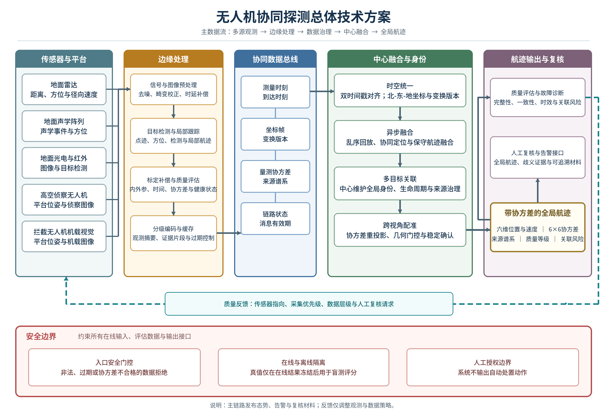

# 无人机协同探测项目建议书

**专题边界：** 面向低空非合作无人机的协同探测、定位、跟踪、跨视角配准和身份连续性维护，研究对象包括地面雷达、地面声学阵列、地面光电/红外设备、高空侦察无人机光电载荷以及拦截无人机机载视觉。项目止于态势感知、告警和人工复核接口，不研究自动处置、毁伤效果或绕过授权的控制流程。

**证据截止日期：** 2026年7月19日。

**状态口径：** “当前已实现”仅指已有算法接口和离线处理能力；“仿真验证”指质点模型、回放或 AirSim 环境中的结果；“建议指标”指本项目拟采用的验收目标；“待验证”指尚无半实物或外场证据；“未实现”指尚未形成相应工程链路。北-东-地（NED）是项目融合工作坐标。仿真数据不得替代真实传感器标定、实飞试验或装备性能证明。

## 1 立项依据

### 1.1 研究的目的和意义

低空小型无人机目标通常同时具有雷达散射截面小、声学特征受背景噪声影响大、光电目标像素少、机动和遮挡频繁等特征。单一固定传感器容易受到视线遮挡、近地杂波、照度、天气、目标姿态和观测几何的共同限制。公开研究已将雷达、声学、光电和无线电等多类传感器组合用于无人机探测，并把融合、互操作和可重复测试列为关键问题[3-4][12-17]。

本项目拟建立“地面广域发现、高空机动补盲、拦截平台近距确认”的协同观测链。地面雷达提供距离、方位、俯仰和径向速度等广域量测；声学阵列提供低成本方位提示和类别证据；地面光电/红外设备承担可视确认；高空侦察无人机利用机动视角改善遮挡区和近共线观测几何；拦截无人机机载视觉承担近距目标确认与全局航迹一致性核验。各节点不自行创造全局身份，而是向中心维护的全局航迹提交带时间、坐标、协方差和来源谱系的观测证据。

项目的直接目的有三项。第一，形成异构传感器可共同解释的数据合同，解决测量时刻与到达时刻混用、坐标帧不清、协方差缺失和来源不可追溯等工程问题。第二，形成面向异步、乱序、丢包和视角变化的融合与关联方法，在信息不完整时保持航迹连续并显式给出不确定度。第三，形成从仿真、回放、半实物到外场的分级验证方法，使探测概率、虚警、定位误差、身份切换、时延和通信退化结果能够复核。

国内现行法规要求无人驾驶航空器具备相应的识别、监视和安全运行能力，并对唯一产品识别、实名登记、可靠被监视能力及反制设备使用作出约束[1]；GB 42590-2023 已于2024年6月1日实施，对民用无人驾驶航空器系统安全提出强制性要求[2]。本项目不把远程识别消息等同于非合作目标身份，而是把它作为可验证时的辅助声明；未知、过期或签名失败的声明不得覆盖传感器证据。该边界有利于兼顾探测有效性、误报控制和合规审计。

当前研究基础已经具备双时间戳、NED 工作坐标、观测与航迹协方差、异步回放、中心全局航迹编号、基础多目标关联和跨视角几何门控等仿真能力。现有质点模型和 AirSim 结果只说明数据合同与算法流程可以在仿真中运行。真实地面传感器、高空侦察平台、机载视觉、时钟同步、外参漂移和受限通信尚未形成闭环证据，因此本项目的价值在于把已有仿真基础推进为可标定、可测试、可审计的协同探测原型，而不是宣称已经具备实装性能。

### 1.2 国内外研究现状

#### 1.2.1 国内现状

国内的法规和标准已先行明确无人驾驶航空器安全、识别和被监视要求。《无人驾驶航空器飞行管理暂行条例》自2024年1月1日起施行，规定唯一产品识别码、实名登记、可靠被监视能力、网络信息安全等要求，并对反制设备的管理边界作出规定[1]。GB 42590-2023 是现行强制性国家标准，构成民用无人驾驶航空器系统安全的基础约束[2]。这些文件没有给出非合作无人机多传感器探测的统一性能门限，但明确了身份、监视、安全和责任追溯不能被算法性能替代。

在多传感器体系方面，浙江大学团队提出由多种监视技术组成的反无人机系统架构，讨论了系统实现及异构传感器协同面临的挑战[3]。中国海洋大学等单位研究了音频辅助相机阵列，将声学提示与视觉检测结合，说明声学适合作为方向提示和相机调度来源，而不宜单独承担三维精确定位[4]。中山大学等单位研究了仅方位传感器的分布式协同定位，强调多观测节点几何关系对可观测性和定位质量的影响[5]。

在异步跟踪和身份连续方面，浙江大学团队将乱序量测引入多传感器多目标跟踪，说明到达顺序与测量时刻不一致必须在滤波和关联中显式处理[6]。同一团队对遮挡条件下的联合概率数据关联进行了改进研究，反映出密集交叉、漏检和遮挡条件下仅依靠最近邻匹配容易发生身份混淆[7]。这些成果为双时间戳、固定滞后更新、概率关联和身份连续性指标提供了方法依据，但论文数据集、传感器配置和应用场景各不相同，不能直接转化为本项目的外场性能值。

本次核验的国内公开资料中，算法论文多于可复现的跨机构外场数据；统一记录测量时刻、到达时刻、外参版本、协方差、网络状态和离线真值的公开数据较少。国内研究已覆盖多源探测、协同定位和多目标关联等关键环节，但从地面固定传感器到高空侦察平台、再到拦截平台机载视觉的同一全局身份闭环，仍需要统一接口和分级试验来验证。

#### 1.2.2 国外现状

欧盟委员会2023年发布的 COM(2023) 659 将非合作无人机应对分为探测、跟踪、识别、处置和取证，明确提出发展更准确的传感器、加强传感器数据分析、建立协调一致的测试方法，并指出不同机构之间需要可靠、安全的通信[8]。该文件还介绍了 COURAGEOUS 项目对标准场景、功能和性能要求、测试方法以及传感器和集成系统性能的研究[8]。这类政策文件反映的是测试和治理方向，不是单一系统的性能证明。

北约连续开展了反无人机技术互操作试验。2023年 C-UAS TIE23 有来自15个盟国、3个伙伴国等方面的300余名参与者，对约70套传感器、效应器和干扰技术进行了现场测试，重点验证系统快速连接和协同运行能力[9]。2024年试验扩大到19个盟国、3个伙伴国和450余名参与者，现场测试60余套传感器及其他反无人机技术[10]。2026年3月，北约在拉脱维亚启动无人系统创新试验场的首轮测试、评估、验证与确认（TEVV）活动，公开范围包括高速、高空拦截飞行和开放环境电子战测试[11]。这些资料能够证明互操作和实地试验受到持续投入，但未公开足以复算各传感器探测概率、虚警率和定位误差的完整原始数据。

同行评议研究形成了较完整的方法谱系。Park 等对反无人机系统组件、设计和挑战进行了系统梳理[12]；Samaras 等对多传感器数据上的深度学习方法进行系统综述，指出数据异质性、数据集规模和跨模态融合是主要限制[13]；Svanstrom 等报告了不同传感模态融合下的实时无人机检测与跟踪实验[14]。Unlu 等研究了广角相机与转台变焦相机协同的多相机检测和跟踪流程，为“广域发现后窄视场确认”的视觉链路提供了公开实现思路[15]。

德国和法国研究机构公开了小型无人机声学、光电和雷达特征的联合测量[16]，并开展了低空多小型无人机的多传感器外场探测与跟踪试验[17]。这些研究说明三类传感器能够形成互补证据，也同时暴露出背景条件、目标类型、距离和统计口径对结果影响很大。因公开论文未提供与本项目目标、气象、地形和传感器完全一致的条件，其性能数字不作为本项目指标的直接来源。

在基础方法方面，乱序量测处理已有成熟理论[18]；多无人机仅方位协同定位已形成可复核的几何模型[19]；无人机边缘计算与人工智能研究强调算力、能耗、链路和任务时延之间的约束[20]；协方差交集可在跨节点相关性未知时避免过度自信[23]；联合概率数据关联为密集目标的一对多候选关系提供了经典方法[24]。ASTM F3411-22a 给出了远程识别和跟踪规范[21]，IEEE 1588-2019 给出了网络测量与控制系统的精密时钟同步协议[22]。远程识别只适用于合作且消息可信的对象，时钟协议也不能消除传感器内部曝光、扫描和排队延迟，因此两类标准都需要与观测时间、到达时间和不确定度记录结合使用。

#### 1.2.3 发展趋势

| 趋势 | 公开证据 | 对本项目的含义 |
| --- | --- | --- |
| 从单传感器转向多模态互补 | 多监视技术架构、系统综述和外场联合特征试验均覆盖雷达、声学、光电等组合[3][12-17] | 不设“万能主传感器”；按环境、几何和健康状态动态调整权重 |
| 从固定站转向地空协同观测 | 仅方位协同定位和多无人机地理定位研究显示移动观测基线可改善几何条件[5][19] | 高空侦察无人机承担补盲、交叉定位和光电复核，不直接生成全局身份 |
| 从结果融合转向时间、坐标和不确定度统一 | 乱序量测、协方差交集和时钟同步研究强调时序与相关性[6][18][22-23] | 全链路保留测量/到达双时间戳、坐标帧、协方差、时钟质量和来源谱系 |
| 从中心上传原始数据转向边缘提取和分级传输 | 无人机边缘智能研究指出带宽、算力和能耗必须联合设计[20] | 常态上传检测、局部航迹和特征；歧义、复核或取证时按策略请求图像片段 |
| 从单机精度转向身份连续和跨视角一致 | 多相机检测、JPDA 和互操作试验关注多目标、多系统连续工作[7][9-10][15][24] | 以全局身份不改写、ID切换、重复航迹和跨视角配准作为独立验收项 |
| 从演示转向标准场景和TEVV | 欧盟协调测试方法、北约连续互操作试验和试验场建设均强调测试、评估、验证与确认[8-11] | 建立场景库、冻结数据、盲测集、统计区间和失败回退，避免只报最佳场景 |

现阶段可确认的共识是：异构传感器组合、移动平台补盲和边缘处理具有工程必要性；协同收益必须在同一目标集、同一时段和同一统计口径下与最佳单传感器比较；互操作成功不等同于探测精度达标；身份消息、仿真真值和本地跟踪编号均不能直接替代中心全局身份。公开来源中没有可直接移植到本项目场景的统一距离和精度指标，因此第2.2节数值均列为建议指标，须在设备选型和基线试验后复核。

### 1.3 项目紧迫需求

#### 1.3.1 低空短窗口与多层补盲

低空目标受地形、建筑和植被遮挡时，固定地面传感器的可见弧段可能被切断，留给确认、航迹起始和再捕获的时间有限。单一站点即使在局部时段给出稳定量测，也无法自然补齐遮挡后的新视角。高空侦察平台可提供移动基线和俯视观测，拦截平台的近距机载视觉可承担复核，但当前高空提示、跨相机重投影和近距视觉关联仅具备仿真基础，尚未形成真实设备闭环。

如不尽快建立地面多源发现、高空补盲、跨视角定位和近距确认的分层观测链，工程上将出现告警中断、航迹重建滞后和多平台重复搜索，后续关联算法也会因观测几何退化而无法判断可信性。近期必须打通目标簇指向、两机及多机仅方位协同定位、几何质量判定、跨视角重投影和稳定窗口反馈，并在真实外参、镜头畸变、滚动快门、姿态误差与远距离小目标条件下逐级验证。

该能力的边界是为全局航迹提供可追溯的补充观测和复核证据，不由高空或近距视觉节点独立生成、改写全局身份，也不将仿真中的可见性和重投影成功视为外场探测能力。设备选型、标定和分层试验未完成前，只能将现有结果作为接口和方法基础，不能据此声称真实环境下的发现距离、召回水平或连续跟踪能力。

#### 1.3.2 异构异步数据与身份连续

雷达量测、声学方位、图像框、平台位姿和身份声明在维度、时标、坐标系、更新频率和误差模型上存在本质差异，不能仅靠字段对齐就形成可互认的融合证据。地面有线链路、空中无线链路和机载处理还会带来不同的时延分布，乱序、重复、丢包和突发中断属于必须处理的工作条件。若仅按消息到达顺序更新，系统无法区分目标运动、链路时延和坐标转换误差，容易形成状态滞后、协方差失真和过度自信的融合结果[6][18]。

多目标密集交叉、相互遮挡和外观相似会进一步放大时空不一致的影响，而本地跟踪编号在节点重启、视频流切换或新历元中还可能重用。如果将本地编号或身份声明直接绑定为全局身份，定位误差即使较小，仍可能产生身份切换、重复航迹和错误的跨视角反馈。这类错误会沿任务链传播，使后续告警、复核和证据回溯指向不同实体，因此身份连续必须与位置精度分开验收。

近期必须形成包含测量时刻、到达时刻、坐标帧、协方差、质量、来源谱系和版本的统一观测合同，按测量时刻更新并处理固定滞后窗内的乱序观测，对未知跨节点相关性使用保守融合，由中心统一维护全局航迹身份。缺失必填字段或协方差非法的观测不得进入正式融合；本地编号只在节点、传感器、数据流和历元命名空间内有效；仿真真值仅用于离线评估。验收需单独报告 `id_switch_count`、身份连续率和重复全局绑定，不用位置误差代替身份判定。

#### 1.3.3 边缘资源约束与分级验收

机载算力、能耗和空中链路带宽限制了持续回传全量视频的可行性，但只做固定码率压缩又可能丢失身份判别和几何定位所需的细节。在丢包、时延增大或节点退出时，如果系统仍以正常链路假设调度数据，关键观测可能在排队中过期，中心也无法区分“未观测”与“未及时上报”。需要依据航迹新鲜度、不确定度、关联歧义和任务优先级，在检测结果、局部航迹、特征和图像片段之间选择传输层级，同时显式保留链路和系统降级状态。

当前仿真能够支持接口检查和确定性场景验证，但不能回答真实传感器的探测距离、虚警、标定稳定性、跨日漂移、边缘算力余量和故障恢复能力。如果不在设备集成前冻结测试目标、环境分层、样本量、统计方法和失败处置规则，后期即使完成功能演示，也无法判定性能变化来自算法、设备、环境还是通信条件，更无法在相同分母下比较单传感器与协同系统。

近期必须完成边缘检测、局部航迹摘要、事件触发图像取证和通信退化运行模式，建立仿真、回放、半实物和外场逐级收敛的验收证据链，并对原始数据、标注、模型、日志、指标和报告保持追溯。边界上，推荐验收值只是待设备基线试验复核的目标，仿真和回放结果不得冒充半实物或外场证据，在线算法不得读取离线真值，本项目也不交付自动处置能力。

## 2 研究目标与指标

### 2.1 研究目标

#### 2.1.1 关键问题

##### 关键问题一 异构量测统一与一致估计

雷达、声学、光电与空中平台输出的是距离、方位、图像框、特征、平台位姿等不同层次的观测，其时标来源、坐标表达和误差结构并不等价。异步处理和链路抖动使测量时刻与到达时刻进一步分离；同一原始信息经多节点处理后还可能引入难以直接估计的交叉相关。问题的核心不是将数值装入同一消息，而是让任一状态更新都能说明观测发生的时间、空间、不确定性及来源，并使输出协方差不因重复利用证据而过度收缩。

现有双时间戳、北东地（NED）工作帧、协方差和固定滞后回放只有仿真与回放基础，真实传感器时钟质量、外参、噪声模型和跨节点相关性尚未通过系统试验收敛。跨模块上，传感器适配、时空转换、状态传播、航迹关联和评估必须共用同一版本的观测合同和统计口径，否则无法确定偏差出现在量测层、坐标转换层还是融合层。可判定边界为：每条正式观测必须包含测量时刻、到达时刻、坐标帧、协方差、质量和来源，缺项不进入融合；状态按测量时刻更新并传播，已知相关性显式建模，未知相关性采用保守融合，一致性按第2.2节规定的 NIS/NEES 与误差椭球覆盖率判定。

##### 关键问题二 多目标身份与跨视角协同

多目标交叉、遮挡、相似外观和传感器视场切换会同时破坏运动连续性与外观证据稳定性。高空侦察平台和拦截平台还使用不同相机、不同观测基线和动态位姿，相同目标在不同视角中不具备可直接比较的像素位置。因此，“看见”只说明某一节点得到局部检测，并不自然构成可用的全局航迹证据。若缺少时空对齐、几何门控、稳定窗口和协方差传播，偶然的投影重合可能被误判为跨视角同一性，并在目标再次分离后造成持续错绑。

现有多目标关联、高空提示和视觉配准主要是仿真或有限场景证据，密集交叉、真实虚警、远距离小目标、跨日外参变化和遮挡恢复尚未完成工程准入验证。跨模块约束是由中心唯一维护全局航迹编号，局部节点只上报自身命名空间内的编号、证据和不确定性；关联、协同定位、跨视角反馈和评估共用一致的时空及身份契约。可判定边界为：本地编号只在节点、传感器、数据流和历元内有效，不得改写全局身份；跨视角证据必须经过几何和稳定性检查；身份连续通过切换、重复绑定与连续性指标独立判定，不以单次定位精度或像素重合代替。

##### 关键问题三 受限通信下可验证运行

系统在边缘算力、带宽、时延和丢包同时受限时，传输对象和传输时机会直接改变航迹的新鲜度与可观测性。原始视频、检测、局部航迹和特征的数据量及证据密度不同，固定传输策略既可能压垮链路，也可能在关联歧义最大时丢失复核材料。与此同时，仅在理想链路或最佳场景下报告成功率，无法判断系统在节点退出、突发中断和故障恢复期间是否仍按设计边界运行。

现有能力可记录链路和来源元数据，但系统级通信退化、边缘负载和故障恢复证据不足；仿真可验证接口和部分场景，却不能直接证明真实传感器、边缘设备和无线链路的综合能力。跨模块上，边缘感知、航迹融合、任务调度、通信管理和评估必须共用新鲜度、不确定度、歧义、任务优先级及降级状态，才能复现某次性能变化的原因。可判定边界为：数据按上述因素分级传输并保留降级状态；验证按仿真、回放、半实物和外场四级逐步开展；在线算法与离线真值严格隔离，低级证据不代替高级试验结论。

#### 2.1.2 明确目标

##### 目标一 统一观测与全局航迹

拟面向地面雷达、声学、光电/红外、高空侦察光电和拦截无人机机载视觉，建立统一观测模型、接口规范和可序列化、可版本化的数据字典。每条观测保留测量时刻与到达时刻、坐标帧、量测值、协方差、质量、来源和版本，并给出不合格观测的拒收原因。主要实施成果包括传感器适配、时钟与坐标转换记录、噪声模型、观测合同一致性检查和数据谱系，使后续融合、关联与评估在同一语义基础上工作。

在此基础上，实现基于测量时刻的异步融合、固定滞后窗内的乱序量测处理、状态与协方差传播，并对未知跨节点相关性采用保守融合，输出六维 NED 全局航迹、6×6 协方差和质量摘要。验证范围从合成量测和冻结数据回放开始，逐步扩展到真实传感器接入、半实物和外场条件，分别检查字段完整性、坐标一致性、乱序处理和估计一致性。本目标不包含对具体真实传感器探测距离、虚警或环境适应性的预先背书，也不将仿真中的六维航迹输出视为外场性能已达标。

##### 目标二 关联、协同定位与跨视角反馈

拟实现多目标关联、来源谱系治理和中心全局身份连续性维护，形成全局最近邻（GNN）/Hungarian 工程基线，并以联合概率数据关联（JPDA）和多假设跟踪（MHT）作为离线对照。主要成果包括时空门控、关联冲突处置、全局身份变更记录、重复航迹检查和身份指标输出。在线绑定只使用正式观测、航迹和经校验的跨视角证据，仿真真值与离线标注只用于评分，本地视觉编号不直接与全局身份绑定。

同时实现高空侦察无人机的目标簇指向、两机及多机仅方位协同定位、跨视角重投影和拦截平台视觉确认，形成“发现、补盲、确认、再捕获”的观测反馈链。验证覆盖目标交叉、遮挡、虚警、视场切换、多平台仅方位几何退化和再捕获，先在仿真与回放中冻结策略，再通过半实物和外场检验真实外参、姿态误差和成像条件的影响。本目标不包含由局部视觉节点重新命名全局航迹，不以不同相机像素的直接距离作为跨视角同一性结论，也不交付自动拦截或自动处置能力。

##### 目标三 边缘通信与四级试验交付

拟实现边缘检测、局部航迹摘要、特征上报、事件触发图像取证和通信退化运行模式，依据航迹新鲜度、不确定度、关联歧义和任务优先级选择传输内容与时机。主要实施成果包括分级传输策略、链路和节点状态记录、数据超时与重传处理、降级模式切换记录及任务后回放工具，使系统在受限带宽、丢包和时延条件下仍能输出带有质量摘要和降级原因的航迹，而不隐藏证据缺口。

建立仿真、回放、半实物和外场四级可复现试验体系，完成设备基线、时钟与外参标定、通信退化注入、故障恢复和不少于30架次外场测试，形成原始数据、标注、模型、日志、指标和报告的闭环追溯。验证按同一目标集、时段和统计口径评估协同收益，各级证据分开标记，外场指标在设备基线完成后再按既定程序复核。本目标不包含无条件全量视频回传、不将通信降级时的任何航迹输出等同于性能达标，也不用仿真、回放或半实物证据替代外场结论。

#### 2.1.3 当前基础与交付边界

| 能力 | 当前状态 | 本项目交付边界 |
| --- | --- | --- |
| 双时间戳、NED、协方差、固定滞后回放 | 当前已实现并经仿真/回放验证 | 接入真实传感器和时钟质量，完成半实物、外场一致性验证 |
| 地面雷达/声学/光电观测模型 | 合成量测和接口已实现；真实硬件未接入 | 完成传感器适配、标定、噪声模型和环境分层性能报告 |
| 多目标关联与身份指标 | 全局最近邻（GNN）/Hungarian可用；联合概率数据关联（JPDA）和多假设跟踪（MHT）为有限对照；结果主要为仿真证据 | 完成真实密集交叉、遮挡和虚警数据的阈值冻结与盲测 |
| 高空侦察提示和协同定位 | 数值模型与仿真提示已具备；运行闭环未完成 | 完成平台位姿、云台外参、仅方位几何质量和提示时效闭环 |
| 拦截平台机载视觉 | AirSim/离线视觉配准有单场景基础；远距召回、跨日外参和多种子结果未达工程准入 | 完成真实图像数据、跨视角配准、遮挡恢复和边缘算力验证 |
| 受限通信 | 可记录链路和来源元数据；系统级退化验证不足 | 完成带宽、时延、随机丢包、突发中断和节点退出试验 |
| 自动处置 | 未实现，且不在本项目范围 | 只输出态势、告警、复核材料和接口状态，所有高风险动作留给授权系统 |

### 2.2 技术指标

以下均为**建议验收值**，不是当前已达到的装备性能。设备定型前先完成基线试验；如目标雷达散射截面、声压级、光学尺寸或载荷算力与假设不一致，应按同一统计方法调整数值并履行评审，不得事后改变样本分母。

**术语与统计口径：** `P_d`为探测概率，RCS为雷达散射截面，RMSE为均方根误差，P95为第95百分位数，IDSW为身份切换次数，NIS/NEES分别为归一化创新平方和归一化估计误差平方，IoU为交并比，TP/FP/FN分别为真阳性、假阳性和假阴性。PPS指每秒脉冲，PTP指精密时间协议，RTK指实时动态差分定位。未给出分母、样本数或可用性状态的比例和计数不得用于验收。

**共用测试条件：** 仿真/回放不少于10类场景、每类10个随机种子；半实物不少于120个有效回合；外场覆盖开阔地、建筑边缘、植被边缘、昼间和夜间/弱光等不少于5类环境、3个不同日期、累计不少于30架次和10小时有效目标活动。目标集不少于5架，至少包含两种多旋翼尺寸和一种固定翼或垂直起降构型；每架目标的尺寸、质量、实测或标定雷达散射截面、声学特征、光学尺寸、速度和飞行轨迹均入档。比例指标报告分子、分母及95%置信区间。

| 指标 | 基线或当前状态 | 目标值 | 测试条件 | 计算或测量方法 | 验收规则 |
| --- | --- | ---: | --- | --- | --- |
| 观测合同完整率 | 仿真合同已具备；真实设备待基线 | 100% | 全部正式半实物和外场观测 | 完整记录 `measurement_timestamp`、`arrival_timestamp`、`frame_id`、量测、协方差、质量、来源和版本的记录数/总记录数 | 任一正式记录缺必填项或非法协方差即该批不通过 |
| 节点时间同步误差 | 仿真时钟；真实链路待测 | P95≤5 ms，最大≤20 ms | 地面站、侦察机和拦截机同时接入PPS/PTP参考；连续2 h | 以参考时钟比较各节点硬件时间戳；另测曝光/扫描到软件时间戳偏置 | P95和最大值同时达标；偏置未标定不通过 |
| WGS84/NED转换误差 | NED仿真工作帧已实现 | P95≤0.5 m，最大≤1.0 m | 100个已知控制点，覆盖作业区边界和高度范围 | 与独立测量软件及测量控制点比较三维误差；记录基准点和转换版本 | 两项均达标，且帧或基准点变更可追溯 |
| 地面雷达发现概率/虚警 | 合成雷达量测；硬件待选型 | `P_d`≥0.90；虚假航迹≤1条/h | 建议基准：RCS≤0.01 m²、斜距≤1 km、高度30-300 m、速度5-25 m/s；杂波环境分层 | 以外部高精度真值形成时空门；命中架次/有效架次，虚假确认航迹/小时 | 95%置信区间下限达到`P_d`门限，虚假航迹同时达标 |
| 声学提示概率/方位误差 | 合成方位量测；阵列待接入 | 提示概率≥0.80；方位RMSE≤8° | 距离≤250 m，背景噪声LAeq≤60 dB(A)；另设60-70 dB(A)退化组 | 有效提示数/目标在声学覆盖内时窗数；角度误差按圆统计 | 基准组两项达标；退化组只报告，不混入基准组 |
| 光电/红外确认精度 | 仿真框和离线图像基础；真实标定待完成 | precision≥0.95，recall≥0.90 | 斜距≤500 m，目标长边投影≥12 px；可见光照度≥1000 lx或红外温差≥2 K，分开统计 | 盲测集按IoU≥0.5匹配，逐帧计算TP/FP/FN | 两波段分别报告；任一拟作为主用波段者须达标 |
| 协同发现概率/系统虚警 | 无外场基线 | `P_d`≥0.95；系统虚假确认航迹≤0.5条/h | 5目标混合场景，至少两类传感器有效，含单源间歇漏检 | 同一冻结真值和时窗计算；与最佳单传感器同场对照 | 95%置信区间下限达标，且不以增加虚警换取召回 |
| 协同融合相对收益 | 仅有仿真消融 | 定位RMSE较同场最佳单源降低≥20%，或连续率绝对提高≥0.10；两项至少一项达标且另一项不退化超过5% | 遮挡、近共线、单源掉线各不少于20回合 | 冻结同一输入，对比多源融合与最佳单源；成对统计 | 95%置信区间不跨越收益门限；失败场景单列 |
| 三维定位与速度误差 | 仿真六维航迹；外场待测 | 位置RMSE≤10 m、P95≤20 m；速度RMSE≤2 m/s | 覆盖区内、至少两种传感器支持，目标速度5-25 m/s | 与RTK/全站仪等独立真值按测量时刻对齐 | 三项均达标；无独立真值的回合不计入验收 |
| 乱序量测补偿收益 | 固定滞后仿真已验证；真实分布未标定 | 在100-500 ms附加时延下，较按到达时刻直接更新的RMSE降低≥15%；时间逆序异常为0 | 正常、随机时延、突发500 ms三组，各≥30回合 | 冻结观测，分别运行测量时刻更新和到达时刻基线 | 收益下限达标，且无`arrival < measurement`非法记录 |
| 协方差一致性 | 仿真有协方差；真实NIS/NEES不足 | NIS/NEES在显著性水平0.05下不拒绝一致性假设；95%误差椭球经验覆盖率90%-98% | 每种主要场景≥1000个有效创新样本；NEES仅用独立真值 | 按状态/量测维数做卡方检验，报告样本相关性和有效样本数 | NIS必验；NEES在真值可用时必验；只报RMSE不通过 |
| 身份连续率与ID切换 | 仿真可统计；真实密集交叉待验证 | 身份连续率≥0.95；IDSW≤0.02次/目标·min；重复全局绑定为0 | 5-20目标，含交叉、遮挡、漏检、虚警和本地ID重用 | 离线真值映射在在线关联结束后计算；分母为目标可见分钟 | 三项同时达标；真值不可用时必须标记不可评价，不得填0 |
| 跨视角配准 | AirSim单场景基础；多日期外参待测 | precision≥0.95，recall≥0.90；1080p归一化重投影误差P95≤8 px | 地面EO、高空侦察和机载相机至少三种视角，含4 m等效外参扰动和0.5 s时偏组 | 依据相机内外参、航迹协方差和像素协方差做马氏门控；盲测后评分 | 基准组全部达标；扰动组要求保守拒绝，不得错误锁定 |
| 高空侦察提示有效性 | 仿真提示已具备；实飞未验证 | 目标簇覆盖率≥0.90；提示至下游确认P95≤1.0 s；过期提示接受数=0 | 侦察机相对目标高差200-500 m，云台跟踪，含遮挡和链路延迟 | 统计提示覆盖的活动目标、提示测量时刻、重投影和确认时刻 | 三项同时达标；仅“相机可见”但未形成全局航迹支持不计成功 |
| 拦截平台机载视觉 | AirSim/离线基础；远距和多种子未达工程准入 | precision≥0.95，recall≥0.90；关联确认P95≤1.0 s | 距离30-150 m、目标长边≥16 px、20 Hz输入，含短时遮挡和相似目标 | 先检测/MOT，再与中心航迹几何关联；在线阶段禁用真值身份 | 检测、关联和IDSW分别达标；本地ID不得改写全局ID |
| 端到端航迹时延 | 仿真运行预算尚未闭合 | `measurement_timestamp`至全局航迹发布P95≤200 ms，最大≤500 ms | 10传感器、20目标、每节点输入频率按设备标称，连续30 min | 逐消息以统一时钟计算，分解采集、边缘、网络、融合和发布时延 | P95和最大值同时达标；不得只报平均值 |
| 边缘视觉处理 | 单平台仿真/离线结果；硬件待定 | 20 Hz下处理P95≤80 ms，丢帧率≤1% | 在最终选定机载计算平台、额定功耗和最高环境温度下连续2 h | 从帧到达到本地观测发布计时，含预处理、推理、MOT和序列化 | 时延、丢帧和无热降频失效同时满足 |
| 受限通信连续性 | 仅有元数据接口 | 1 Mbit/s、随机丢包10%、每30 s一次1 s突发中断、RTT 200 ms时，连续率≥0.85；RMSE劣化≤25%；重复全局绑定=0 | 网络仿真器/射频链路注入，5目标、30 min、3次重复 | 与无退化同场基线比较；记录发送、接收、重传、丢弃和过期 | 三项同时达标；链路恢复后2 s内恢复正常发布 |
| 节点故障与安全拒绝 | 仿真有部分保守门控；外场待测 | 单传感器退出后2 s内完成健康状态更新；非法协方差、过期观测、未授权身份声明拒绝率100%；在线真值身份使用数=0 | 注入掉电、冻结、时间漂移、重复消息、坏协方差和伪身份各≥20次 | 按注入事件与系统日志逐项对账 | 任一错误接受、全局ID改写或未记录拒绝原因即不通过 |

## 3 研究任务

### 3.1 研究内容

#### 3.1.1 异构传感器标定与统一时空

本项研究面向雷达、声学、可见光、红外以及移动平台观测在量测维数、采样机制、坐标表达和内部延迟上的差异，解决弱小目标证据无法直接比较的问题。输入包括雷达原始数据与点迹、声学波形与方位、图像与检测框、平台位置姿态、云台状态、节点时钟、世界大地测量系统1984（WGS84）位置和链路元数据。研究将按距离、角度、像素、声学方位和径向速度建立噪声模型，完成相机内参、设备外参、固定与随机采集时延、时钟质量和环境分层标定，并把低信噪比、遮挡、平台位姿误差等质量因素转换为可传播的协方差。

在工程实现上，所有设备数据经适配层转换为统一观测，强制保留 `measurement_timestamp`、`arrival_timestamp`、源坐标帧、目标坐标帧、坐标变换版本、量测、协方差、质量标志、来源谱系和消息UUID。WGS84仅保留为外部参考，正式融合统一在任务区北-东-地（NED）坐标内进行，平台状态、相机模型、链路状态和全局航迹模式均按有效时间和版本管理。实施产物包括传感器误差模型、协方差参数、标定证书、健康状态字段、坐标转换组件、模式定义及可回放的统一观测数据集。

验证采用标准目标、测量控制点、同步触发、重复测量、跨日重标定和模式一致性回放，分别检查时钟偏差、WGS84/NED转换误差、协方差合法性、变换版本追溯和坏数据拒绝。未完成标定、健康状态异常、缺少双时间戳或变换版本、协方差非有限或非半正定的观测不得进入正式融合；标定结论只对记录的设备、安装状态、环境范围和有效期负责，不外推为未测试传感器或外场条件下的既有能力。

#### 3.1.2 异步融合、目标关联与跨视角协同

本项研究以已标定观测、平台位姿、时钟质量、局部与全局航迹、检测和可信合作身份声明为输入，解决异步乱序、未知跨节点相关性、仅方位几何退化、多目标交叉以及地面、高空、机载相机视角不一致等问题。状态估计采用扩展卡尔曼滤波（EKF）和固定滞后回放，迟到量测按测量时刻插入并重传播；仅方位观测采用加权最小二乘并检查交会几何；共享来源依据消息UUID和来源谱系去重，相关性未知时采用协方差交集，避免重复证据造成过度自信。

目标关联以马氏门控和全局最近邻（GNN）/Hungarian分配为工程基线，联合概率数据关联（JPDA）和有界多假设跟踪（MHT）仅作为冻结数据上的离线对照。全局身份由中心生成和维护，本地点迹号、声学事件号、视觉多目标跟踪（MOT）编号和合作身份声明保留各自命名空间。跨视角协同对地面光电、高空侦察和机载视觉实施畸变校正、时间化像素投影、协方差传播、马氏门控、稳定窗口和目标相机重投影，形成六维全局航迹、6×6协方差、区域几何质量、侦察目标簇提示、关联日志、风险摘要，以及确认、歧义、保持和再捕获状态。

验证覆盖附加时延与乱序消融、归一化创新平方/归一化估计误差平方（NIS/NEES）、近共线与节点加入退出、多种子重复试验、密集交叉、遮挡、虚警、重生、本地ID重用、多相机盲测、外参漂移、时间偏差和过期提示。验收分别核对定位误差与协方差一致性、身份切换次数（IDSW）与连续率、重复全局绑定、重投影误差及跨视角precision/recall。几何不可观、量测超出固定滞后窗口、提示未完成时空配准或证据不足时，不强行更新三维位置或新身份；不同相机像素不得直接比较，本地编号和离线真值不得改写或回灌在线全局身份。

#### 3.1.3 边缘通信、系统集成与分级试验

本项研究面向机载算力、功耗、散热和地空链路受限条件，输入原始图像与音频、雷达点迹、局部检测与航迹、链路状态、任务优先级和系统健康信息，在节点侧完成质量检查、检测、MOT、关键帧选择和语义摘要。传输策略依据消息新鲜度、协方差增长、关联歧义和任务优先级，在观测、局部航迹、特征、裁剪图、短视频和原始片段之间实施增量或事件触发分级，并用有效期、最大排队时延、序列号和缓存策略控制拥塞、过期与恢复后的重复更新。实施产物包括边缘处理组件、分级消息、带宽策略、缓存与退化状态、原型系统和可冻结的集成配置。

系统集成保持责任边界：传感器适配层只负责形成统一观测，融合层负责状态和协方差，关联层负责中心身份连续，视觉层只提供本地观测和跨视角证据，通信层只调整数据层级和时效而不得改变观测语义，评估层持有离线真值但不得向在线算法回灌。短时丢包期间可以发布预测状态，但必须显式标记预测或退化，协方差须随预测时间增长；系统只输出态势、告警、复核材料和接口状态，不直接触发自动处置。

验证按仿真、软件回放、半实物和外场四级推进，注入带宽限制、时延、随机丢包、突发中断、热稳定、节点故障和坏消息条件，并使用场景库、独立真值设备、冻结配置、预注册计划、盲测、重复试验、统计区间和第三方复核。交付测试规范、分层数据集、指标包、链路与计算预算报告、问题闭环记录和验收报告；任一级未达到门限时保留退化模式和失败样本，不把预测当新测量，也不把仿真或回放证据表述为实飞结果、外场结论或装备能力。

### 3.2 关键技术

#### 3.2.1 概率化时空融合

该技术把异构观测统一为带时间、坐标和不确定度的概率证据。雷达使用距离、方位、俯仰和径向速度模型，声学使用方位或方位/俯仰模型，光电使用像素中心、边界框和类别置信度模型，每类量测携带维数匹配的协方差。小框、低信噪比、遮挡、远距离、平台姿态误差和同步误差通过噪声模型放大协方差，不以文字质量标签替代数值传播。每条记录同时保留 `measurement_timestamp` 和 `arrival_timestamp`；前者决定状态更新时刻，后者用于链路、排队、乱序和时效审计，扫描雷达、滚动快门相机和分帧音频还记录帧内时间模型。IEEE 1588可作为节点同步依据[22]，但曝光、扫描、缓存和推理等内部延迟仍须逐设备标定。

工程上以任务区基准点定义NED工作坐标，WGS84仅作为外部参考；每次转换记录源帧、目标帧、基准点、有效时间、外参版本和转换协方差。相机投影使用量测时刻的平台位置、姿态、云台角和内外参，平台与目标状态先传播到共同估计时刻，外参不确定度再通过雅可比进入像素或三维协方差。中心采用固定滞后缓存，窗口内迟到量测按测量时刻插入、更新并重传播，窗口外量测只留审计；该处理以多步乱序量测理论为依据[18]。跨节点相关性可证明时显式维护交叉协方差，未知时采用协方差交集[23]，并以消息UUID和来源谱系去除共享上游及转发副本。

关键约束是坐标、时间和协方差必须同源可追溯，不能以最后一帧平台姿态替代整段图像姿态，也不能把相关性未知的局部状态按独立信息相加。验证判据包括观测合同完整率、节点同步与内部时延、控制点WGS84/NED转换误差、附加100-500 ms时延下的乱序补偿收益、NIS/NEES一致性和95%误差椭球覆盖率；重复消息不得导致二次更新，超窗或非法观测必须全部拒绝。上述判据只证明规定场景和样本内的概率一致性，不等同于未标定设备或外场条件下的探测性能。

#### 3.2.2 协同定位与身份连续

该技术以可观测几何和中心身份所有权共同约束多节点协同。仅方位定位计算视线交会角、联合信息矩阵秩与条件数、观测时间偏差、重投影残差和平台位姿协方差，不以节点数量代替几何质量；近共线、时偏过大或协方差不完整时拒绝三维定位。高空侦察平台接收带协方差的目标簇NED提示，云台指向后仍须通过本机相机模型把局部检测转换为视线或三维证据。国内外仅方位协同研究为几何可观测性判定提供依据[5][19]，平台机动只用于改善观测基线，不能绕过质量门限。

关联层先用马氏门控剔除不可能候选，再以GNN/Hungarian完成位置、速度方向、短时运动、类别和来源连续性约束下的一对一分配；JPDA和有界MHT仅在冻结数据与同等计算预算下作离线对照[7][24]。中心生成并维护全局ID，雷达点迹号、声学事件号、视觉MOT编号、相机检测号和远程识别平台号均留在本地命名空间。合作身份声明只有在签名、时效和几何一致性通过后才用于友方确认；ASTM F3411-22a可作为合作远程识别接口参考[21]，但其声明不能替代非合作目标的传感器关联，更不能直接改写中心全局ID。

工程约束要求先完成中心身份关联再进行局部状态融合，任何本地ID重用、节点重启或镜头切换都不得触发全局ID自动换绑。验证采用良好与退化几何对照、节点退出、密集交叉、遮挡、虚警、重生、本地ID重用和身份声明冲突场景，分别检查三维定位RMSE、几何退化保守拒绝、身份连续率、IDSW、重复全局绑定和关联时延。证据不足时系统维持“未知、歧义或保持”状态，不猜测新身份；离线真值仅在在线结果冻结后评分，真值不可用的场景标记不可评价而不得将指标记为零。

#### 3.2.3 跨视角配准与受限通信

跨视角配准使用相机模型 `p = K [R|t] P`，把中心NED航迹及其6×6协方差投影到目标图像，再与本地检测的像素协方差共同计算马氏距离。候选依次接受投影有效性、视场、类别、边界框尺度、唯一性和时效门控，单帧通过仅形成候选，连续窗口达到阈值后才形成稳定支持。广角发现、转台变焦确认和多相机联合跟踪已有公开研究基础[15]；工程实现要求地面、高空和机载相机共享时间化内外参及中心身份，提示必须在目标相机内重投影并按分辨率归一化，不得直接比较不同相机的像素坐标。遮挡、镜头切换或证据冲突时输出“歧义、保持或再捕获”，不新造全局身份。

受限通信侧，雷达和声学节点优先完成点迹或方位提取、质量估计和健康检查，相机节点完成检测、局部MOT、关键帧选择和特征摘要。常态发送观测、协方差、局部航迹和小尺寸证据；新目标、关联歧义、身份冲突、模型低置信或人工请求触发裁剪图、短视频或原始片段升级，该策略与边缘算力、能耗和链路联合约束研究相符[20]。每条消息设置优先级、有效期和最大排队时延，短时丢包可发布协方差持续增长的预测消息，但预测必须带状态标志；链路恢复后按消息UUID、序列号和测量时刻去重。

关键约束是通信层只能选择证据粒度和发送时机，不能改写量测、协方差、来源语义或中心身份；模型量化和降帧也必须在精度复验后启用。跨视角验证检查precision、recall、1080p归一化重投影误差、外参扰动和0.5 s时偏下的保守拒绝；通信验证在1 Mbit/s、随机丢包10%、周期性突发中断和RTT 200 ms条件下检查连续率、RMSE劣化、重复绑定和2 s恢复时间，并在最终边缘硬件上检查20 Hz处理时延、丢帧率及连续2 h热稳定。未重投影或已过期提示直接拒绝，资源超限时退回观测摘要和降帧模式，不把预测结果伪装为新量测。

### 3.3 创新点

#### 3.3.1 双时间戳概率合同

常规多传感器接口往往只记录采集时间或接收时间，并把质量压缩为单一置信度，难以区分目标运动误差、节点排队延迟和坐标转换误差。本项目新增统一的双时间戳概率合同，将测量时刻、到达时刻、时钟质量、帧内时间模型、坐标变换版本、量测协方差、来源谱系和消息UUID设为正式处理的必填要素；固定滞后更新、时效审计、重复来源去除和协方差传播共用同一份可追溯记录。创新位于跨层数据约束和失败关闭机制，而不是把采用现有滤波方法本身表述为创新。

该机制的可验证价值是将乱序补偿、链路时延和估计一致性拆分评价，使“精度提高”能够追溯到输入、时间和不确定度。验收检查合同完整率、附加时延下相对按到达时刻更新的RMSE收益、NIS/NEES一致性、误差椭球覆盖率以及非法记录拒绝率；任一正式记录缺字段、超出有效期或协方差不合法即失败关闭。适用边界是具有可标定时间源、坐标关系和误差模型的传感器，尚未标定的设备只能进入试验旁路，其仿真或回放结果不得外推为真实设备能力。

#### 3.3.2 几何质量与中心身份约束的协同证据链

常规方案容易以观测节点数量代替几何可观测性，或把本地MOT编号、合作身份声明乃至仿真对象名直接当作全局身份。本项目新增由几何质量门控和中心身份治理共同约束的证据链：交会角、信息矩阵秩与条件数、时间偏差、平台位姿协方差和重投影残差先决定证据能否参与三维定位；通过门控的地面、高空和机载观测再进入中心关联，本地命名空间、中心全局ID、跨视角稳定窗口和离线真值保持隔离。高空机动用于改善观测基线和补盲，但高空相机、本地视觉和合作声明均不取得中心身份所有权。

该机制把协同定位质量与身份连续性放在同一可审计链路中，可通过目标簇覆盖率、三维定位误差、近共线拒绝率、跨视角precision/recall、归一化重投影误差、IDSW和重复全局绑定联合验证。对遮挡、镜头切换、节点重启和本地ID重用，系统输出“确认、歧义、保持或再捕获”状态并记录证据来源；几何或外观证据不足时不自动换绑，也不承诺恢复身份。该创新的适用范围限于至少存在可校准共同坐标、时间关系或可验证跨视角证据的场景，不覆盖完全无共同证据的身份推断。

#### 3.3.3 不确定度驱动传输与真值隔离验证

常规固定码率或全量视频回传没有利用航迹不确定度分配链路资源，仿真评估还可能因对象名或标签进入在线关联而虚高。本项目新增不确定度与链路状态联合驱动的证据传输机制，根据航迹新鲜度、协方差增长、候选歧义、身份冲突和任务优先级，在观测、局部航迹、特征、裁剪图、短视频和原始片段间切换；同时将离线真值存入独立数据域，在线结果冻结并生成摘要后方可评分。消息降级、预测、过期和恢复状态全程记录，通信策略不得改变观测语义或全局身份。

可验证价值体现在受限资源下保持可解释的性能退化，并使每项评估结果能够排除真值泄漏。验收在1 Mbit/s、随机丢包、突发中断、热稳定和节点故障条件下检查连续率、RMSE劣化、处理时延、恢复时间与重复绑定，同时核对在线真值字段使用数、配置摘要、数据血缘和重复试验一致性；发现真值回灌时整批结果作废。具体压缩模型、频谱和算力档位须随最终硬件复验，仿真、回放、半实物与外场证据分层发布，任何一级结果不得替代更高一级验证或被表述为装备能力。

## 4 技术方案

### 4.1 总体技术方案

总体信息流分为五层：传感器与平台层在本地形成带质量的观测；边缘层完成检测、局部跟踪、标定补偿和数据分级；协同总线保留双时间戳、协方差、坐标和来源；中心层完成时空归一、异步融合、多目标关联和跨视角配准；评估与人工复核层形成质量反馈、传感器调度建议和可追溯报告。决策反馈只调整传感器指向、数据优先级和复核请求，不直接触发处置。

**图4-1 无人机协同探测总体技术方案。** 地面雷达、声学、光电与红外设备，以及高空侦察无人机和拦截无人机机载视觉，先在边缘形成点迹、方位、检测、局部航迹和质量信息。协同数据总线统一承载双时间戳、坐标与变换版本、协方差、来源谱系和链路状态，再将观测送入时空统一、异步融合、多目标关联与跨视角配准处理，输出带6×6协方差、来源和质量等级的全局航迹。

图中的质量反馈回路用于调整传感器指向、采集优先级和数据层级；人工复核接收全局航迹、歧义证据和告警材料。安全边界在入口拒绝非法、过期或协方差不合格的数据，将离线真值与在线链路隔离，并明确系统不输出自动处置动作。

实施分四个阶段。第一阶段完成设备选型、时钟和传感器标定、数据模式冻结；第二阶段完成异步融合、关联、跨视角和边缘传输的软件回放；第三阶段在网络仿真器、转台、目标模拟器和实装边缘计算机上完成半实物试验；第四阶段按预注册场景完成多日期外场飞行、盲测和验收。每阶段均冻结配置摘要和输入数据，下一阶段不得用未通过的上阶段能力作为既定基线。

### 4.2 技术难点和解决途径

#### 4.2.1 弱量测与时空标定偏差

**难点与成因：** 小型无人机在雷达上可能散射弱，在声学阵列上易受背景噪声和传播条件影响，在光电图像中则表现为像素少、遮挡频繁和背景相似，单一模态很难持续形成可融合证据。即使各传感器分别能够输出量测，网络同步也不能覆盖曝光、扫描、分帧、缓存和推理内部延迟；移动平台的机体振动、云台运动、温漂与重装配还会改变外参。弱量测、时间偏差和坐标偏差相互耦合后，可能把同一目标投影到错误位置，造成虚假关联、过小协方差或看似稳定但实际有偏的航迹。

**解决途径：** 按传感器、距离、昼夜、背景噪声和目标投影尺度建立分层噪声模型，以多模态互证提高证据连续性，并使协方差随信噪比、距离、遮挡和平台位姿质量动态变化。节点使用秒脉冲/精密时间协议（PPS/PTP）建立共同参考，同时逐设备标定固定与随机内部延迟，保留测量时刻、到达时刻、帧内时间模型和时钟质量。坐标处理使用时间化平台位姿、云台角、相机内外参和版本化NED变换，外参误差通过雅可比传播；在线监测控制点或稳定特征的重投影残差，避免用最后一帧姿态替代量测时刻姿态。

**验证与回退：** 使用标准目标、测量控制点和同步触发源，按距离、昼夜、噪声、姿态变化和目标像素尺度分组重复试验，并开展回环时延、附加时延、跨日重标定、外参扰动和回放一致性检查。验收同时检查各模态发现或确认指标、节点时间同步误差、WGS84/NED转换误差、重投影残差、协方差覆盖率和坏数据拒绝，不以一个环境分组的最好结果替代全组报告。某模态未达到门限时降为粗提示；时效超预算的量测只保留审计记录；外参残差超限时收紧门控并转为单视角确认；未标定或健康异常设备退出正式融合，不输出精确定位或身份确认。

#### 4.2.2 几何退化与身份混淆

**难点与成因：** 多机仅方位观测在视线近共线、时间偏差过大或平台位姿不准时会形成病态三维解；不同相机的分辨率、焦距、视角和观测时刻不一致，像素坐标不能直接比较。密集目标交叉、短时遮挡、虚警、目标重生和本地ID重用又会生成多个运动相近候选。多节点若共享同一上游量测或转发同一消息，未知相关性还会把重复信息误当独立证据，造成协方差过度收缩，并进一步放大错误锁定和全局身份切换风险。

**解决途径：** 协同定位联合检查视线交会角、信息矩阵秩与条件数、时间偏差、平台位姿协方差和重投影残差，并通过平台机动改善观测基线。跨视角提示先把中心三维状态及6×6协方差重投影到目标相机，再按分辨率归一化并与本地像素协方差进行马氏门控；单帧只形成候选，稳定窗口通过后才确认。关联由中心维护全局ID，隔离雷达、声学、各视频流MOT和合作声明的命名空间，结合运动、外观、类别与来源连续性分配；来源谱系和消息UUID用于去重，已知相关性显式建模，未知相关性采用协方差交集。

**验证与回退：** 试验覆盖良好与近共线几何、节点退出、1080p与4K混合分辨率、时间偏差、外参扰动、密集交叉、遮挡、虚警、重生、本地ID重用、重复消息和共享来源，采用冻结输入开展盲测及关联算法离线对照。验收检查三维定位误差、几何退化拒绝率、归一化重投影误差、跨视角precision/recall、身份连续率、IDSW、重复全局绑定和协方差一致性。几何不合格时拒绝三维定位，仅保留方位和重指向建议；提示过期或未重投影时直接拒绝；身份或相关性证据不足时输出歧义、保持原全局身份，并保留最可信单源或给出保守协方差，不自动换绑。

#### 4.2.3 资源约束、真值隔离与仿真到外场迁移

**难点与成因：** 机载平台受到功耗、散热和计算资源限制，视频数据量又显著高于常态地空链路容量，带宽下降、随机丢包和突发中断会同时影响消息新鲜度与航迹连续性。另一方面，仿真对象名、检测身份或离线标签若进入在线处理，会使关联和身份指标虚高；仿真的噪声、纹理、动力学、时钟和链路通常也比外场理想。因此，资源约束下的算法结果、未隔离真值的回放结果和单一仿真场景都不能直接证明真实外场性能，更不能表述为实飞或装备能力。

**解决途径：** 边缘节点完成检测、MOT、质量估计、关键帧选择和特征摘要，依据航迹新鲜度、协方差增长、歧义和任务优先级实施分级与事件触发传输；模型量化只在同一冻结数据上复验精度后启用。消息携带有效期、优先级、序列号和预测或退化状态，通信层不得改变观测语义。真值存入与在线总线物理隔离的文件或存储域，在线模式递归拒绝真值字段，输出冻结并生成摘要哈希后才评分。验证按仿真、软件回放、半实物和外场分级开展测试、评估、验证与确认（TEVV），每级使用自身标定、冻结配置和域差异报告。

**验证与回退：** 在最终边缘硬件上连续满载2 h，检查处理时延、丢帧、功耗和热稳定；通过网络仿真器或射频链路注入1 Mbit/s带宽、随机丢包10%、周期性突发中断和RTT 200 ms，检查连续率、RMSE劣化、重复绑定和链路恢复时间。同步执行自动字段审计、无真值对照回放、配置摘要核对和同场仿真、回放、半实物、外场对照。资源超预算时降低帧率、只传观测摘要并扩大协方差，短时预测必须显式标记；发现真值泄漏时整批结果作废并重跑；某一级或外场门限未达到时，能力保持“退化”或“待验证”，不得进入该级验收主线，也不得用较低级证据替代。

### 4.3 数据管理方案

#### 4.3.1 数据分类与统一模式

数据分为八类：雷达原始数据/点迹，声学波形/事件，光电和红外图像/视频，高空与机载平台状态，统一观测，局部与全局航迹，通信与系统日志，离线真值/标注/指标/报告。原始数据与派生数据分区存放，派生记录必须能追溯到原始文件、处理程序版本、参数摘要和上游记录标识。

统一观测至少包含：模式版本、观测ID、传感器ID、节点ID、模态、测量时刻、到达时刻、时间不确定度、源坐标帧、目标坐标帧、坐标变换版本、量测、协方差、置信度、质量标志、来源谱系、消息UUID和链路状态。全局航迹至少包含中心全局ID、NED位置/速度、有效时刻、发布时间、6×6协方差、支持来源、身份似然、质量等级和关联风险。本地视觉ID使用“节点+传感器+视频流+历元+本地ID”复合命名，禁止与中心全局ID共用命名空间。

#### 4.3.2 时间、空间和血缘治理

时间统一采用带时区的UTC表示，内部高频计算使用单调时钟与UTC映射。任何修正后的时间戳都保留原值、修正值、修正算法、标定批次和不确定度。测量时刻晚于到达时刻、非有限协方差、协方差非对称/非半正定、未知坐标帧和缺失外参版本的正式记录在入口失败关闭。

WGS84原始位置保留为外部参考，融合数据保存任务区NED坐标和基准点版本。相机内参、畸变、机体到相机外参、云台角和平台位姿均按有效时间版本化。每个派生航迹保存输入观测ID集合或可压缩的来源摘要；转发和重传不产生新的物理来源。

#### 4.3.3 标注、真值和数据集隔离

外场真值优先使用RTK、全站仪、经标定的独立跟踪系统或其组合。真值文件与在线数据总线物理隔离，仅在在线结果落盘并计算摘要哈希后进入评估。训练、验证、内部测试和最终盲测按“日期+地点+目标实体”分组切分，避免同一飞行或同一目标外观跨集合泄漏。建议比例为60%/20%/10%/10%；最终盲测集由独立人员保管。

标注采用双人复核。检测框、目标身份、遮挡、环境、可见性、传感器健康和时间对齐均记录标注者、工具版本和修改历史。抽检不少于10%；检测框一致性以IoU、身份一致性以Cohen's kappa或等价指标报告。争议样本不强行分配身份，保留“未知/不可判定”。

#### 4.3.4 版本、质量和可复现性

场景、设备固件、标定、数据模式、算法、模型权重、阈值、容器/依赖和报告分别版本化。每次试验生成不可变清单，记录设备序列号、配置摘要、软件提交摘要、模型哈希、随机种子、开始/结束时间、环境、目标清单和操作者。报告中的每个指标必须能定位到场景清单、输入数据摘要和计算脚本版本。

质量检查分为入口、批次和发布三级。入口检查模式、时间、坐标、协方差和ID命名空间；批次检查缺帧、重复、时钟漂移、外参变化、链路统计、类别分布和真值覆盖；发布检查训练/测试隔离、指标分母、置信区间、失败样本和敏感信息。质量问题不能通过删除失败回合解决；无效回合须保留原因并在预先规定的规则下决定是否重测。

#### 4.3.5 存储、访问、备份和保留

原始图像、音频和雷达数据进入只读对象存储；结构化观测、航迹和日志进入可查询存储；模型、配置和报告进入版本库或制品库。敏感位置、人员图像、设备标识和安全配置按最小权限分级。角色至少分为采集、标注、算法、评估、审计和发布；训练人员默认无最终盲测真值权限。

建议采用3-2-1备份：至少3份副本、2种介质、1份异地或离线副本；恢复点目标不超过24 h，恢复时间目标不超过72 h，每季度做一次恢复演练。建议原始试验数据和标注保留5年，标定、模型、指标和验收报告保留10年；合同、法规或安全要求更严格时从其规定。到期删除需留审批和销毁记录。

#### 4.3.6 安全、脱敏与发布

传输和静态数据均加密，密钥与数据分离管理。外部发布前删除精确任务区坐标、设备序列号、网络拓扑、人员和车辆可识别信息；对图像中的人员、车牌和非试验设施做脱敏。公开数据集只发布满足授权和安全审查的片段，并附数据说明卡、许可、已知偏差、适用范围和禁止用途。

发生数据泄漏、真值回灌、哈希不一致或未授权修改时，立即冻结相关批次，保留证据并启动事件审查。修订后的数据不得覆盖旧版本；须生成新版本、变更说明和受影响报告清单。

## 参考资料

以下资料均在2026年7月19日前核验。厂商材料和预印本未作为核心证据；北约新闻稿仅证明公开试验规模和方向，不用于推导本项目性能指标。

[1] **国内·行政法规**：国务院、中央军委，《无人驾驶航空器飞行管理暂行条例》（国令第761号），成文日期2023-05-31，发布日期2023-06-28，2024-01-01施行，中国政府网。https://www.gov.cn/zhengce/content/202306/content_6888799.htm （访问日期：2026-07-19）。

[2] **国内·强制性国家标准**：国家市场监督管理总局、国家标准化管理委员会，GB 42590-2023《民用无人驾驶航空器系统安全要求》，发布日期2023-05-23，实施日期2024-06-01，全国标准信息公共服务平台。https://openstd.samr.gov.cn/bzgk/gb/newGbInfo?hcno=0DC41035BA23EF2C5B94E6482492AF1E （访问日期：2026-07-19）。

[3] **国内·同行评议论文**：Shi, X.; Yang, C.; Xie, W.; Liang, C.; Shi, Z.; Chen, J. “Anti-Drone System with Multiple Surveillance Technologies: Architecture, Implementation, and Challenges.” *IEEE Communications Magazine*, 56(4), 68-74, 2018-04. DOI: https://doi.org/10.1109/MCOM.2018.1700430 。

[4] **国内·同行评议会议论文**：Liu, H.; Wei, Z.; Chen, Y.; Pan, J.; Lin, L.; Ren, Y. “Drone Detection Based on an Audio-Assisted Camera Array.” *2017 IEEE Third International Conference on Multimedia Big Data*, 402-406, 2017-04. DOI: https://doi.org/10.1109/BIGMM.2017.57 。

[5] **国内·同行评议论文**：Yang, Q.; Yang, X.; Yang, Y.; Yang, Y. “Distributed Cooperative Localization Based on Bearing-Only Sensors.” *IEEE Sensors Journal*, 21(20), 23645-23657, 2021-10-15. DOI: https://doi.org/10.1109/JSEN.2021.3105541 。

[6] **国内·同行评议论文**：Liu, M.; Huai, T.; Zheng, R.; Zhang, S. “Multisensor Multi-Target Tracking Based on GM-PHD Using Out-Of-Sequence Measurements.” *Sensors*, 19(19), 4315, 2019-10-05. DOI: https://doi.org/10.3390/S19194315 。

[7] **国内·同行评议会议论文**：Shi, X.; Song, Y.-Q.; Yang, Z.; Chen, J. “Multiple Target Tracking under Occlusions Using Modified Joint Probabilistic Data Association.” *2015 IEEE International Conference on Communications*, 6615-6620, 2015-06. DOI: https://doi.org/10.1109/ICC.2015.7249379 。

[8] **国外·政府正式文件**：European Commission. *Communication from the Commission to the Council and the European Parliament on Countering Potential Threats Posed by Drones*, COM(2023) 659 final, 2023-10-18, EUR-Lex. https://eur-lex.europa.eu/legal-content/EN/TXT/?uri=CELEX:52023DC0659 （访问日期：2026-07-19）。

[9] **国外·公开试验**：NATO. “NATO Tests Counter-Drone Technologies during Exercise,” 2023-09-22. 公开口径：300余名参与者、15个盟国和3个伙伴国、约70套系统与技术；原始性能数据未公开。https://www.nato.int/en/news-and-events/articles/news/2023/09/22/nato-tests-counter-drone-technologies-during-exercise （访问日期：2026-07-19）。

[10] **国外·公开试验**：NATO. “Ukraine Joins NATO Counter-Drone Exercise for First Time,” 2024-09-19. 公开口径：450余名参与者、19个盟国和3个伙伴国、60余套系统与技术；原始性能数据未公开。https://www.nato.int/en/news-and-events/articles/news/2024/09/19/ukraine-joins-nato-counter-drone-exercise-for-first-time （访问日期：2026-07-19）。

[11] **国外·公开试验/TEVV**：NATO. “New NATO Innovation Range Starts Counter-Drone Technology Testing in Latvia,” 2026-03-18. 资料说明2026-03-09至03-13开展首轮测试、评估、验证与确认活动；未公开可复算的探测性能数据。https://www.nato.int/en/news-and-events/articles/news/2026/03/18/new-nato-innovation-range-starts-counter-drone-technology-testing-in-latvia （访问日期：2026-07-19）。

[12] **国外·同行评议综述**：Park, S.; Kim, H. T.; Lee, S.; Joo, H.; Kim, H. “Survey on Anti-Drone Systems: Components, Designs, and Challenges.” *IEEE Access*, 9, 42635-42659, 2021. DOI: https://doi.org/10.1109/ACCESS.2021.3065926 。

[13] **国外·同行评议系统综述**：Samaras, S.; Diamantidou, E.; Ataloglou, D.; et al. “Deep Learning on Multi Sensor Data for Counter UAV Applications—A Systematic Review.” *Sensors*, 19(22), 4837, 2019-11-06. DOI: https://doi.org/10.3390/S19224837 。

[14] **国外·同行评议论文**：Svanström, F.; Alonso-Fernandez, F.; Englund, C. “Drone Detection and Tracking in Real-Time by Fusion of Different Sensing Modalities.” *Drones*, 6(11), 317, 2022-10-26. DOI: https://doi.org/10.3390/DRONES6110317 。

[15] **国外·同行评议论文**：Unlu, E.; Zenou, E.; Riviere, N.; Dupouy, P.-E. “Deep Learning-Based Strategies for the Detection and Tracking of Drones Using Several Cameras.” *IPSJ Transactions on Computer Vision and Applications*, 11, 2019-07-24. DOI: https://doi.org/10.1186/S41074-019-0059-X 。

[16] **国外·同行评议会议论文**：Hommes, A.; Shoykhetbrod, A.; Noetel, D.; et al. “Detection of Acoustic, Electro-Optical and RADAR Signatures of Small Unmanned Aerial Vehicles.” *SPIE Proceedings*, 9997, 999701, 2016-10-25. DOI: https://doi.org/10.1117/12.2242180 。

[17] **国外·同行评议外场论文**：Laurenzis, M.; Hengy, S.; Hommes, A.; et al. “Multi-Sensor Field Trials for Detection and Tracking of Multiple Small Unmanned Aerial Vehicles Flying at Low Altitude.” *SPIE Proceedings*, 10200, 102001A, 2017-05-02. DOI: https://doi.org/10.1117/12.2261930 。

[18] **国外·同行评议论文**：Bar-Shalom, Y.; Chen, H.; Mallick, M. “One-Step Solution for the Multistep Out-of-Sequence-Measurement Problem in Tracking.” *IEEE Transactions on Aerospace and Electronic Systems*, 40(1), 27-37, 2004-01. DOI: https://doi.org/10.1109/TAES.2004.1292140 。

[19] **国外·同行评议会议论文**：Sharma, R.; Beard, R. W.; Taylor, C. N.; Pack, D. “Bearing-Only Cooperative Geo-Localization Using Unmanned Aerial Vehicles.” *2012 American Control Conference*, 3883-3888, 2012-06. DOI: https://doi.org/10.1109/ACC.2012.6315255 。

[20] **国外·同行评议综述**：McEnroe, P.; Wang, S.; Liyanage, M. “A Survey on the Convergence of Edge Computing and AI for UAVs: Opportunities and Challenges.” *IEEE Internet of Things Journal*, 9(17), 15435-15459, 2022-09-01. DOI: https://doi.org/10.1109/JIOT.2022.3176400 。

[21] **国外·标准**：ASTM International. ASTM F3411-22a, *Standard Specification for Remote ID and Tracking*, 2022. DOI: https://doi.org/10.1520/F3411-22A 。该标准面向合作远程识别，不能证明非合作目标身份。

[22] **国外·标准**：IEEE. IEEE Std 1588-2019, *IEEE Standard for a Precision Clock Synchronization Protocol for Networked Measurement and Control Systems*, 2020. DOI: https://doi.org/10.1109/IEEESTD.2020.9120376 。

[23] **国外·同行评议会议论文**：Julier, S. J.; Uhlmann, J. K. “A Non-Divergent Estimation Algorithm in the Presence of Unknown Correlations.” *Proceedings of the 1997 American Control Conference*, 2369-2373, 1997. DOI: https://doi.org/10.1109/ACC.1997.609105 。

[24] **国外·同行评议论文**：Fortmann, T.; Bar-Shalom, Y.; Scheffe, M. “Sonar Tracking of Multiple Targets Using Joint Probabilistic Data Association.” *IEEE Journal of Oceanic Engineering*, 8(3), 173-184, 1983-07. DOI: https://doi.org/10.1109/JOE.1983.1145560 。
