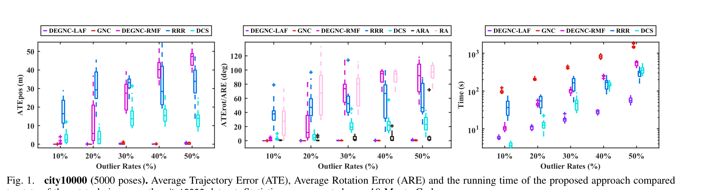
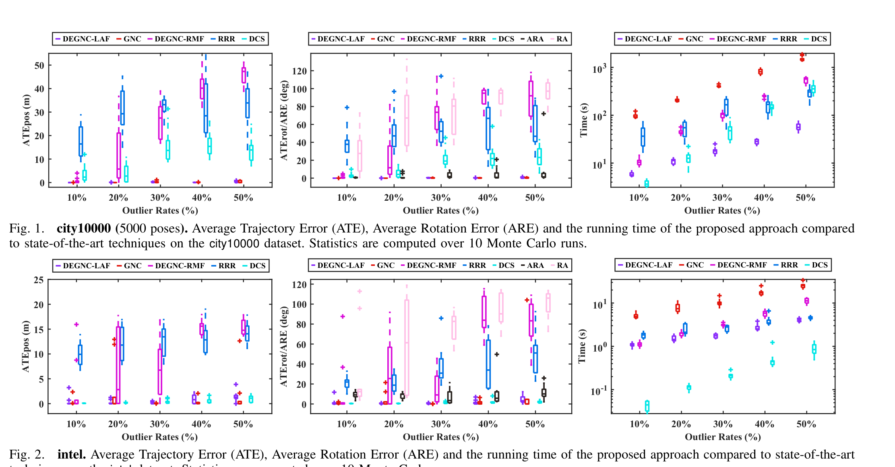
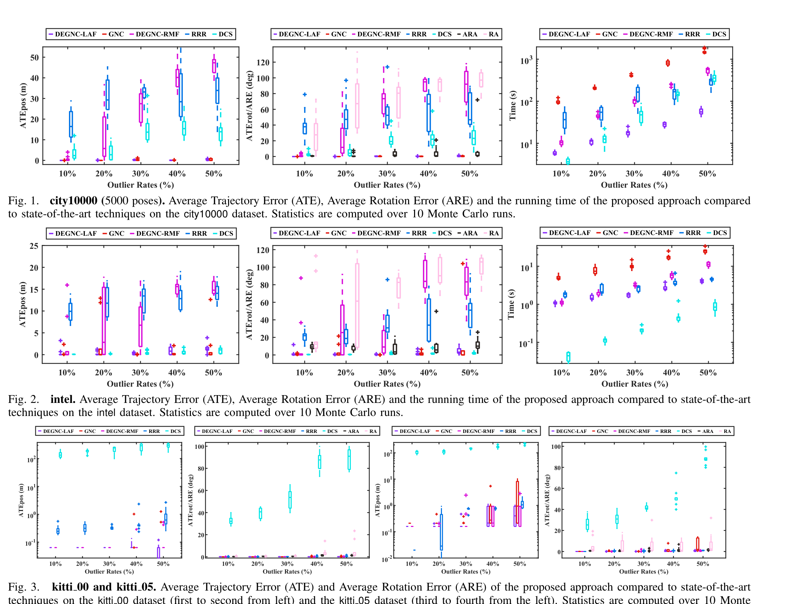
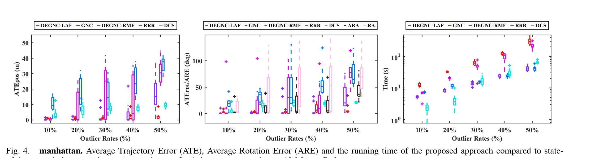

# 平面位姿图全局外点剔除的解耦线性框架

> **英文标题**：A Decoupled and Linear Framework for Global Outlier Rejection over Planar Pose Graph  
> **作者**：Tianyue Wu、Fei Gao  
> **发表信息**：2023 IEEE International Conference on Robotics and Automation (ICRA)  
> **原文 PDF**：[A Decoupled and Linear Framework for Global Outlier Rejection over Planar Pose Graph.pdf](../A%20Decoupled%20and%20Linear%20Framework%20for%20Global%20Outlier%20Rejection%20over%20Planar%20Pose%20Graph.pdf) ｜ **对应中文详解**：[01_平面位姿图全局外点剔除解耦线性框架.md](../中文详解/01_平面位姿图全局外点剔除解耦线性框架.md)

---

## 原文第 1 页

### 摘要

本文提出一种用于含闭环外点平面位姿图优化的鲁棒框架。该框架首先把由截断最小二乘核包裹的鲁棒位姿图优化问题解耦为两个子问题，以完成外点剔除。随后引入线性角度表示，将原本以旋转矩阵表达的第一个子问题改写为线性形式，并采用渐进非凸性（GNC）算法，在无需初始值的情况下依次求解两个非凸子问题。得益于角度表示的线性特性，GNC 中遇到的优化问题只需要线性求解器即可求解。作者在平面位姿图优化基准数据集上对所提出的 DEGNC-LAF（采用线性角度表示的解耦渐进非凸性）进行了充分验证。结果表明，在得到高质量估计的同时，该方法的运行速度明显快于标准通用 GNC，在部分情况下速度提高超过 30 倍。

### 一、引言

位姿图优化（PGO）是许多机器人应用中同步定位与建图（SLAM）的基础估计工具。PGO 的目标是求出一组机器人位姿，使它们能够最好地解释获得的带噪测量。PGO 中待估计位姿的解空间属于特殊欧氏群，这使问题的求解具有较高难度。

尽管 PGO 存在上述困难，近年来提出的技术（例如 SE-Sync [1]）在满足一定条件时可以对 PGO 进行最优求解。然而，由于不可避免的感知混淆，实际应用中的一部分闭环测量是外点。存在外点时，即使 PGO 的解是最优解，也可能明显偏离真实值。因此，通常采用鲁棒 PGO 方法 [2]–[6] 提高对外点的抵抗能力。

但是，现有先进的鲁棒 PGO 方法要么属于局部方法 [4]，过度依赖可靠的初始值；要么需要大量计算资源 [7]、[8]，难以灵活承担更广泛的任务。因此，有必要研究全局外点剔除方法，使其能够有效消除外点带来的错误信息，同时保持较高的计算效率。本文将不需要初始值，或所得结果与初始值无关的方法称为全局方法。

本文表明，在平面 PGO 中可以弥补上述不足。具体而言，本文将平面 PGO 中的旋转估计和平移估计解耦，并用角度表示平面旋转以替代旋转矩阵，从而构造出两个内部为线性形式、外部由截断最小二乘（TLS）核包裹的子问题。随后采用标准 GNC 算法 [8]、[9] 依次求解这两个非凸子问题。由于两个子问题具有线性特性，所提出的框架只需要线性求解器。

本文的主要贡献是提出一种高效的平面位姿图全局外点剔除框架。相应算法称为采用线性角度表示的解耦渐进非凸性（DEGNC-LAF）。该算法能够：（1）执行全局外点剔除，并且效率优于通用全局方法（例如 [7]、[8]）；（2）承受真实任务中可能出现的外点比例，从而得到高质量的估计结果。

此外，本文提出并验证：在线性角度表示下求解第一个子问题时，GNC 相较于基于旋转矩阵的形式具有更高的精度和鲁棒性，速度也更快，从而显著提升完整估计算法的性能（见注释 1 和第七节）。本文在标准 PGO 基准数据集上进行了充分验证。结果表明，DEGNC-LAF 明显快于标准通用 GNC 算法 [8]，并且在精度和鲁棒性方面通常优于或不低于 GNC 以及局部鲁棒 PGO 方法 [4]、[5]。

---

## 原文第 2 页

### 二、相关工作

鲁棒 PGO 算法的设计思路主要分为两类：（1）重新建立模型以增强原始 PGO 问题的鲁棒性，并求解重构后的问题；（2）挖掘外点的经验或统计证据，并据此将其筛除。

#### A. 通过重新建模提高外点鲁棒性

通过重新建模增强原问题鲁棒性的现有方法主要有三种：（1）引入可切换变量；（2）采用一致性最大化范式 [10]、[11]；（3）采用 M 估计范式 [12]、[13]。

1）**可切换变量。** 文献 [2]–[4]、[14] 针对位姿图中的不可信边引入可切换变量。对于含连续可切换变量的优化问题（例如 [2]–[4]），可以使用标准非线性优化方法求解，ceres-solver [15] 和 g2o [16] 等现成库提供了相应实现。相比之下，文献 [14] 中的可切换变量是二值变量，因此作者采用交替最小化框架求解。不幸的是，上述求解方法都属于局部方法，需要可靠的初始值。

2）**一致性最大化。** 一致性最大化（CM）寻找一个估计结果，使误差低于给定阈值的测量数量最多。RANSAC [17] 是 CM 的一种常用启发式方法，不需要初始值，但其性能具有不确定性，且运行时间会随外点比例增加而呈指数增长。Tzoumas 等人 [7] 提出了 ADAPT，这是一种求解最小截尾平方（MTS）估计的通用启发式算法，与 CM 存在相似之处 [18]。

3）**M 估计。** M 估计通过在问题的原始代价函数外包裹鲁棒核来提高鲁棒性。对于以 M 估计问题形式建立的鲁棒运动恢复结构（SFM）[19] 和鲁棒 PGO [21]，局部非线性优化是一种高效求解方法。为摆脱鲁棒核包裹的 PGO 问题对可靠初始值的依赖，Carlone 和 Calafiore [22] 针对 l1 范数和 Huber 核提出了凸松弛方法。GNC 已被用于鲁棒估计问题 [9]、[23]，作为全局求解 M 估计问题的一种启发式方法。更近期，Yang 等人 [8] 将现代全局非最小求解器（例如 SE-Sync）与 Black–Rangarajan 对偶性 [9] 结合起来，这对本文的工作具有参考价值（见第五节）。

#### B. 外点的其他模型与证据

Latif 等人 [5] 提出了 RRR（实现、反转与恢复）算法，根据局部 PGO 的残差剔除外点。Mangelson 等人 [6] 提出了成对一致性最大化（PCM），对每两个闭环约束检查成对一致性，并通过成对一致性图模型推断内点集合。Indelman 等人 [24] 将寻找闭环外点建模为最大后验估计问题，并通过期望最大化推断该问题；文献 [25] 也采用了相近的思路。

### 三、解耦的鲁棒平面位姿图优化

#### A. 耦合的、基于旋转矩阵的平面 PGO

平面 PGO 求解沿机器人轨迹采样得到的二维位姿 $(R_i,t_i)$，其中 $R_i\in SO(2)$，$t_i\in\mathbb{R}^2$。通常固定第一个位姿作为参考，并假设机器人获得的带噪测量 $(\tilde R_{ij},\tilde t_{ij})$ 服从如下概率生成模型 [1]：

$$\tilde R_{ij}=R_{ij}R^\epsilon_{ij},\quad R^\epsilon_{ij}\sim\mathrm{Langevin}(I_d,\kappa_{ij}),\tag{1a}$$

$$\tilde t_{ij}=t_{ij}+t^\epsilon_{ij},\quad t^\epsilon_{ij}\sim\mathcal{N}(0,\tau^{-1}_{ij}I_d).\tag{1b}$$

对于任意一对位姿 $(i,j)$，$(t_{ij},R_{ij})$ 表示相对位姿的真实但未知值。

将带噪测量代入式（1a）、（1b）中的 Langevin 分布和高斯分布概率模型，可将耦合的、基于旋转矩阵的 PGO 建模为最大似然估计问题：

$$ (\hat R,\hat t)=\arg\min_{R_i\in SO(2),\ t_i\in\mathbb{R}^2}\sum_{(i,j)}\left\{\kappa_{ij}\|R_j-R_i\tilde R_{ij}\|_F^2+\tau_{ij}\|t_j-t_i-R_i\tilde t_{ij}\|_2^2\right\}.\tag{2}$$

在满足一定条件时，问题（2）可以紧致地松弛为凸半正定规划 [1]，并得到最优解。然而，在真实任务中，一部分闭环测量是外点。原问题（2）对这些外点较为敏感，因此通常在原问题外包裹鲁棒核，以提高对外点的抵抗能力。

---

## 原文第 3 页

#### B. 采用截断最小二乘核的鲁棒平面 PGO

为尽可能降低外点对平面 PGO 的影响，本文采用基于 TLS 的方案重构问题（2），得到耦合的、基于旋转矩阵的截断最小二乘平面 PGO（TLS-PGO）问题：

$$\min_{t_i\in\mathbb{R}^2,\ R_i\in SO(2)}\sum_{(i,j)\in\mathcal{E}_{od}}(r^{pgo}_{ij})^2+\sum_{(i,j)\in\mathcal{E}_{lc}}\rho_c(r^{pgo}_{ij}),\tag{3}$$

其中

$$\rho_c(r)=\min(r^2,c^2),\tag{4}$$

是 TLS 核，$\mathcal{E}_{od}$ 和 $\mathcal{E}_{lc}$ 分别表示里程计边集合和闭环边集合，且

$$r^{pgo}_{ij}=\sqrt{\kappa_{ij}\|R_j-R_i\tilde R_{ij}\|_F^2+\tau_{ij}\|t_j-t_i-R_i\tilde t_{ij}\|_2^2}.\tag{5}$$

在问题（3）中，本文只对闭环测量使用鲁棒核，因为通常可以将里程计测量视为内点。

#### C. 解耦的鲁棒平面 PGO

本节提出一种鲁棒平面 PGO 的解耦形式。本文将问题（3）解耦为依次求解的两个子问题。首先求解基于旋转矩阵的截断最小二乘平面旋转平均（TLS-RA）问题：

$$\min_{R_i\in SO(2)}\sum_{(i,j)\in\mathcal{E}_{od}}(r^{ra}_{ij})^2+\sum_{(i,j)\in\mathcal{E}_{lc}}\rho_{c_1}(r^{ra}_{ij}),\tag{6}$$

其中

$$r^{ra}_{ij}=\sqrt{\kappa_{ij}\|R_j-R_i\tilde R_{ij}\|_F^2}.\tag{7}$$

求解问题（6）后，将旋转 $R_i$ 固定，再求解第二个子问题，即基于旋转矩阵的截断最小二乘平面平移平均（TLS-TA）问题：

$$\min_{t_i\in\mathbb{R}^2}\sum_{(i,j)\in\mathcal{E}_{od}}(r^{ta}_{ij})^2+\sum_{(i,j)\in\mathcal{E}_{lc}}\rho_{c_2}(r^{ta}_{ij}),\tag{8}$$

其中

$$r^{ta}_{ij}=\sqrt{\tau_{ij}\|t_j-t_i-\hat R_i\tilde t_{ij}\|_2^2}.\tag{9}$$

这里的 $\hat R_i$ 是求解问题（6）得到的旋转估计，并在问题（8）中保持不变。

依次对两个子问题求得的最优估计，并不等价于直接对问题（3）求得的最优估计。但是，实验表明，问题（6）的最优旋转估计通常接近问题（3）的最优旋转估计。原因在于：（1）没有外点时，两种解通常相近，表 1 给出了相应结果；（2）存在外点时，由于 TLS 核具有鲁棒性，问题（3）和问题（6）的最优解仍会接近无外点情况下的解，因此根据（1）两者仍然接近。因此，解耦不会显著扭曲鲁棒旋转估计。这意味着，通过最优求解问题（8）得到的平移估计，与通过最优求解问题（3）得到的平移估计是一致的。

| 数据集（无外点） | 旋转平均误差 ARE（度） |
|---|---:|
| city10000 | 0.6971 |
| intel | 0.9215 |
| kitti 00 | 0.6453 |
| kitti 02 | 0.3268 |
| kitti 05 | 0.1494 |
| manhattan | 0.5306 |
| csail | 0.0631 |

---

## 原文第 4 页

### 四、采用线性角度表示的鲁棒平面旋转估计

虽然旋转矩阵能够无奇异地表示平面和空间旋转，但平面旋转还可以直接用角度表示。这种表示方式较少被讨论，却能使解耦框架工作得更好。本节说明如何采用角度表示构造一个替代问题（6）的子问题。

#### A. 平面旋转的线性角度域

本文用机器人方向角 $\theta_i$ 替代旋转矩阵表示位姿中的旋转分量。因此，旋转测量的概率生成模型由式（1a）改写为：

$$\tilde\theta_{ij}=\theta_j-\theta_i+\theta^\epsilon_{ij}=\theta_j-\theta_i+k_{ij}2\pi+\theta^\epsilon_{ij},\quad \theta^\epsilon_{ij}\sim\mathcal{N}(0,\kappa^{-1}_{ij}I_d).\tag{10}$$

其中，$\langle\cdot\rangle:\mathbb{R}\rightarrow(-\pi,+\pi]$ 表示二维测地距离，$k_{ij}\in\mathbb{Z}$ 称为正则化变量，用于将角度测量调整到区间 $(-\pi,+\pi]$ 内。

在不使用鲁棒核时，角度表示下的旋转平均问题为：

$$\min_{\theta_i\in\mathbb{R},\ k_{ij}\in\mathbb{Z}}\sum_{(i,j)}\kappa_{ij}\|\theta_j-\theta_i+k_{ij}2\pi-\tilde\theta_{ij}\|_2^2.\tag{11}$$

可以看出，如果能够预先确定并固定正则化变量 $k_{ij}$，问题（11）就成为线性估计问题，其鲁棒形式也更容易求解。本文采用文献 [27] 提出的近似方法，在不求解整数混合问题（11）的情况下估计 $k_{ij}$。

确定 $k_{ij}$ 的依据是：没有噪声时，位姿图每个循环上的角度测量之和必须为零；等价地，位姿图循环基 [28] 中每个基循环上的测量之和必须为零。根据这一事实，可以通过线性方程组以闭式形式求出整数 $k_{ij}$。存在噪声时，线性方程组求出的结果不再是整数，但可以将相应的正则化变量取为与其最接近的整数。文献 [27] 表明，这种取整方法在大多数真实场景中完全准确，因此本文将其作为先验步骤，把问题（10）转化为线性估计问题。

#### B. 线性角度域中的鲁棒旋转平均

采用式（11）的线性角度形式后，可以用基于角度的截断最小二乘平面旋转平均（TLS-ARA）问题替代问题（6）：

$$\min_{\theta_i\in\mathbb{R}}\sum_{(i,j)\in\mathcal{E}_{od}}(r^{ara}_{ij})^2+\sum_{(i,j)\in\mathcal{E}_{lc}}\rho_{c_1}(r^{ara}_{ij}),\tag{12}$$

其中

$$r^{ara}_{ij}=\sqrt{\kappa_{ij}\|\theta_j-\theta_i+k_{ij}2\pi-\tilde\theta_{ij}\|_2^2}.\tag{13}$$

问题（12）和问题（6）都具有非凸性，直接求解较为困难。但直观上，问题（12）更容易求解，因为它是一个鲁棒线性估计问题，而问题（6）即使不考虑鲁棒核，仍然是非线性问题。下一节将说明如何使用统一的 GNC 框架求解问题（3）、（6）、（8）和（12）。

### 五、通过渐进非凸性求解鲁棒位姿图优化

问题（3）、（6）、（8）和（12）具有统一形式：

$$\min\sum_{(i,j)\in\mathcal{E}_{od}}(r_{ij})^2+\sum_{(i,j)\in\mathcal{E}_{lc}}\rho_c(r_{ij}).\tag{14}$$

---

## 原文第 5 页

上式可以等价改写为：

$$\min\left\{\sum_{(i,j)\in\mathcal{E}_{od}}(r_{ij})^2+\sum_{(i,j)\in\mathcal{E}_{lc}}\min_{w_{ij}\in\{0,1\}}\left[w_{ij}r_{ij}^2+(1-w_{ij})c^2\right]\right\}.\tag{15}$$

问题（15）可以使用交替优化（AM）、半正定规划（SDP）或渐进非凸性（GNC）求解。AM 的效率较高，但需要初始值，而且容易陷入局部极小值。SDP 可以给出最优性证明，但在这里求解速度很慢。因此，本文采用不需要初始值、能够有效避免局部极小值且具有较高效率的 GNC。

本文使用由参数 $\mu$ 控制的 GNC 函数 [9] 近似 TLS 核。GNC 采用延续型算法 [30]，求解下式而不是直接求解问题（15）：

$$\min\left\{\sum_{(i,j)\in\mathcal{E}_{od}}(r_{ij})^2+\sum_{(i,j)\in\mathcal{E}_{lc}}\min_{w_{ij}\in[0,1]}\left[w_{ij}r_{ij}^2+\frac{\mu(1-w_{ij})}{\mu+w_{ij}}c^2\right]\right\}.\tag{16}$$

参数 $\mu$ 每次乘以延续因子 $f$ 逐步更新。直观地说，更新 $\mu$ 就是在调整鲁棒核的凸性，使其逐渐恢复为 TLS 核。

GNC 通过求解一个全局可解的问题进行初始化，即令 $\mu$ 趋近于零且所有 $w_{ij}$ 为 1 时的式（16）：

$$\min\sum_{(i,j)}(r_{ij})^2.\tag{17}$$

当 $r_{ij}$ 取 $r^{pgo}_{ij}$（式（5））时，问题（17）可以用全局 PGO 技术 [1] 求解；当 $r_{ij}$ 取 $r^{ra}_{ij}$（式（7））时，可以用全局旋转平均方法 [1]、[31] 求解；当 $r_{ij}$ 取 $r^{ta}_{ij}$（式（9））或 $r^{ara}_{ij}$（式（13））时，可以用线性求解器求解。问题（17）的解将作为后续 GNC 优化的初始解。

每次更新 $\mu$ 称为一次迭代。在每次迭代中，GNC 交替优化问题（15）的两个子问题：第一步根据上一轮第二子问题的解得到 $r_{ij}$，优化 $w_{ij}$，该步骤存在闭式解 [8]；第二步根据当前轮第一子问题得到的 $w_{ij}$，优化 $r_{ij}$。第二步可看作问题（17）的加权形式，因此可以使用相同工具求得全局解。GNC 持续迭代，直到所有 $w_{ij}$ 变为二值。若某条测量对应的 $w_{ij}$ 收敛到 0，则将该测量判定为外点。

### 六、采用线性角度表示的解耦渐进非凸性

引入角度表示和 GNC 算法后，本文提出采用线性角度表示的解耦渐进非凸性框架 DEGNC-LAF，用于剔除平面位姿图中的全局外点。算法流程如下：

1. 根据式（13）计算正则化变量 $k_{ij}$。
2. 使用带有 $k_{ij}$ 的 GNC 求解 TLS-ARA（问题（12）），得到旋转估计 $\hat R_i$。
3. 使用 $\hat R_i$ 和 GNC 求解 TLS-TA（问题（8）），并根据所得 $w_{ij}$ 剔除外点；外点对应的 $w_{ij}$ 将收敛到 0。
4. 使用内点通过 SE-Sync 最终估计旋转和平移 $(\hat R,\hat t)$。

算法 1 给出了伪代码。需要注意的是，TLS-ARA 和 TLS-TA 的解并不直接作为最终估计结果。TLS-ARA 的旋转估计用于求解 TLS-TA，TLS-TA 的 $w_{ij}$ 用于剔除外点。最后，使用 SE-Sync 对耦合 PGO 进行优化，从而得到更准确的结果。

**注释 1（解耦和线性表示的优点）。** 式（9）和式（13）的线性形式，使 GNC 交替优化中的初始化问题（17）和第二子问题能够用线性方法求解，从而保证获得最优解。相比之下，求解问题（3）和问题（7）时，GNC 在每次迭代都需要反复调用非线性全局求解器；这些求解器需要满足相应条件才能获得全局最优解，因此在前几次迭代中可能无法得到最优结果，增加 GNC 陷入局部极小值的风险。此外，线性方程组可以高效求解，也不需要计算耗时的最优性证明。

**算法 1：采用线性角度表示的解耦渐进非凸性（DEGNC-LAF）**

输入：位姿图的约简关联矩阵 $A$；测量集合 $\{(\tilde\theta_{ij},\tilde t_{ij})\}$；噪声水平集合 $\{\kappa_{ij}\}$ 和 $\{\tau_{ij}\}$；里程计边集合 $\mathcal{E}_{od}$；闭环边集合 $\mathcal{E}_{lc}$；阈值 $c_1$（默认值为 $\mathrm{chi2inv}(0.99,1)$）；阈值 $c_2$（默认值为 $\mathrm{chi2inv}(0.99,2)$）；GNC 延续因子 $f$（默认值为 1.4）。

输出：内点集合 $\mathcal{I}$，位姿估计 $(\hat R,\hat t)$。

1. 计算正则化变量：$\{k_{ij}\}\leftarrow\mathrm{Regularize}((\tilde R_{ij},\tilde t_{ij}),A)$。
2. 使用 GNC 求解 TLS-ARA：$\{\hat\theta_i\}\leftarrow\mathrm{GNCforARA}(\{\tilde\theta_{ij}\},\{\kappa_{ij}\},\mathcal{E}_{od},\mathcal{E}_{lc},c_1,f,A)$。
3. 将角度转换为旋转矩阵：$\{\hat R_i\}\leftarrow\mathrm{RecoverR}(\{\hat\theta_i\})$。
4. 使用 GNC 求解 TLS-TA：$\mathcal{I}\leftarrow\mathrm{GNCforTA}(\{\tilde t_{ij}\},\{\hat R_i\},\{\tau_{ij}\},\mathcal{E}_{od},\mathcal{E}_{lc},c_2,f,A)$。
5. 将测量角度恢复为旋转矩阵：$\{\tilde R_{ij}\}\leftarrow\mathrm{RecoverR}(\{\tilde\theta_{ij}\})$。
6. 最终估计：$(\hat R,\hat t)\leftarrow\mathrm{SE\text{-}Sync}(\{(\tilde R_{ij},\tilde t_{ij})\},\{\kappa_{ij}\},\{\tau_{ij}\},A)$。
7. 返回 $\mathcal{I},(\hat R,\hat t)$。

---

## 原文第 6 页

### 七、实验

#### A. 实验设置

本文在五个标准 PGO 基准数据集上测试 DEGNC-LAF 的性能：city10000、intel、kitti 00、kitti 05 和 manhattan，数据集说明见文献 [1]。表 2 列出了部分数据集信息。对比方法包括：（1）GNC [8]；（2）采用旋转矩阵表示的解耦渐进非凸性（DEGNC-RMF），它是 DEGNC-LAF 的旋转矩阵版本，即用 TLS-RA 替代所提出框架中的第一个子问题；（3）RRR [5]；（4）动态协方差缩放（DCS）[4]。

由于 GNC 在原始 city10000 数据集上耗时过长，实验只选取该数据集前 5000 个位姿及其对应测量。所测试数据集初始均不含外点，实验随机选择若干位姿对，并在每一对位姿之间添加闭环约束，以模拟外点。

所有实验均在 Linux 计算机上使用 C++ 运行，处理器为 Intel i7-12700KF（3.60 GHz）。实验使用 SE-Sync 的最新加速版本 [32] 和 SO-Sync（SE-Sync 的旋转平均版本）分别实现 GNC 和 DEGNC-RMF，并使用 4 个线程；DEGNC-LAF 使用 GTSAM [33] 中的线性求解器实现，仅使用 1 个线程。GNC 的相关参数沿用文献 [8] 的配置。DCS 使用通过 ceres-solver [15] 实现的开源版本，核大小设为 $\Phi=1$，ceres-solver 使用 4 个线程，最大迭代次数设为 100，其余参数保持源代码默认值。RRR 使用作者提供的实现，聚类阈值设为 $\gamma=10$。

| 数据集 | 位姿数量 | 闭环数量 |
|---|---:|---:|
| city10000 | 5000 | 3385 |
| intel | 1728 | 786 |
| kitti 00 | 4541 | 137 |
| kitti 05 | 2761 | 66 |
| manhattan | 3500 | 1953 |

#### B. 实验结果

本文使用平均轨迹误差进行评价，包括文献 [34] 中的 ATEpos 和 ATErot，同时统计运行时间。评价 ATErot 时，还给出无外点条件下通过 SO-Sync 得到的最优旋转估计与 TLS-ARA、TLS-RA 解之间的平均旋转误差（ARE），图中分别标记为 ARA 和 RA。

**city10000。** 图 1 展示了各算法在 city10000 数据集上的表现。就精度以及抵抗外点的鲁棒性而言，DEGNC-LAF 和 GNC 均优于其他方法。同时，除外点比例为 10% 时略慢于 DCS 外，DEGNC-LAF 在大多数情况下是最快的方法。GNC 能够达到与 DEGNC-LAF 相近的精度，但有时比后者慢 30 倍以上，原因是其计算最优性证明需要较长时间。

**图 1：** city10000（5000 个位姿）。在 city10000 数据集上，本文方法与先进方法的平均轨迹误差（ATE）、平均旋转误差（ARE）和运行时间对比。统计结果来自 10 次 Monte Carlo 实验。

**intel。** 图 2 展示了各算法在 intel 数据集上的表现。在该数据集上，DEGNC-LAF 和 GNC 都具有中等程度的鲁棒性和精度。尽管如此，DEGNC-LAF 的运行速度仍为 GNC 的 4–7 倍。DCS 在保持较高运行速度的同时，表现出比 DEGNC-LAF 和 GNC 更稳定的性能。这可能是因为 intel 数据集为 DCS 提供了较好的初始值，使其不需要多次迭代就能达到全局极小值。

**图 2：** intel 数据集上的平均轨迹误差（ATE）、平均旋转误差（ARE）和运行时间对比。统计结果来自 10 次 Monte Carlo 实验。

**kitti 00 和 kitti 05。** 这两个数据集不提供初始值，因此实验为 RRR 和 DCS 使用真实值作为初始值。由于这两个数据集中的闭环非常稀疏，各算法都能高效运行，因此图 3 未展示运行时间。DEGNC-LAF、GNC 和 DEGNC-RMF 在 kitti 00 上都表现出良好的鲁棒性和较高精度。此外，TLS-ARA 在该数据集上的解始终具有较小误差。DEGNC-LAF 在 kitti 05 上优于其他算法，即使外点比例为 50% 仍具有鲁棒性，而 GNC 在外点比例达到 40% 时开始失效。

**图 3：** kitti 00 和 kitti 05 数据集上的平均轨迹误差（ATE）与平均旋转误差（ARE）对比。左起前两幅对应 kitti 00，后两幅对应 kitti 05。统计结果来自 10 次 Monte Carlo 实验。

**manhattan。** manhattan 是鲁棒平面 PGO 中尤其具有挑战性的数据集。其里程计测量包含较大的旋转误差，导致 DEGNC-LAF 和 DEGNC-RMF 在外点比例较高（50%）时求解 TLS-ARA 和 TLS-RA 失败，如图 4 所示。GNC 在该数据集上表现出最好的鲁棒性，但在高外点比例下有时也会失败，并且耗时可达数百秒。当外点比例低于 30% 时，DEGNC-LAF 能够取得与 GNC 相当的精度，优于其他方法，同时运行速度为 GNC 的 2–4 倍。

**图 4：** manhattan 数据集上的平均轨迹误差（ATE）、平均旋转误差（ARE）和运行时间对比。统计结果来自 10 次 Monte Carlo 实验。

#### C. 讨论

1）**TLS-ARA 的精度并不完美。** 从实验结果可以看出，TLS-ARA 解的精度通常高于 TLS-RA 解，这与注释 1 中的分析一致，说明角度表示优于旋转矩阵表示，并最终使 DEGNC-LAF 的鲁棒性优于 DEGNC-RMF。尽管 TLS-ARA 的精度更高，但它的解并不总能达到完全准确，例如图 2 所示。因此，本文没有直接把 TLS-ARA 的解作为最终估计。幸运的是，TLS-TA 对 TLS-ARA 造成的旋转精度不足并不敏感，在旋转误差较小的情况下，通常仍能正确给出外点集合。

2）**DEGNC-LAF 与 GNC 的鲁棒性。** 在 kitti 05 和 manhattan 数据集上，DEGNC-LAF 与 GNC 的鲁棒性表现相反。这可以由两个数据集的噪声特点解释：kitti 05 的里程计旋转噪声较小、平移噪声相对较大，而 manhattan 的情况相反。在 kitti 05 这类场景中，DEGNC-LAF 通过求解第一个子问题能够得到较好的旋转估计，即使平移噪声较大，也能有效抵抗外点，因此鲁棒性优于 GNC。

### 八、结论

本文提出了一种用于平面位姿图全局外点剔除的专用框架。对鲁棒 PGO 问题进行解耦，并为平面旋转引入线性表示，是该框架的关键。该框架使用线性求解器替代全局非线性求解器；后者需要满足一定条件才能达到全局最优，并且通常计算量较大。本文认为，该方法可以作为标准通用 GNC 算法在鲁棒平面 PGO 中的有效替代方案。特别是在里程计能够提供相对准确的旋转估计，或者需要保持较密集闭环分布的场景中，该方法更具应用价值。

## 原文第 7 页

### 参考文献

[1] D. M. Rosen, L. Carlone, A. S. Bandeira, and J. J. Leonard, “SE-Sync: A certifiably correct algorithm for synchronization over the special Euclidean group,” *The International Journal of Robotics Research*, 2019.  
[2] N. Sünderhauf and P. Protzel, “Switchable constraints for robust pose graph SLAM,” *2012 IEEE/RSJ International Conference on Intelligent Robots and Systems*, 2012.  
[3] E. Olson and P. Agarwal, “Inference on networks of mixtures for robust robot mapping,” *The International Journal of Robotics Research*, 2013.  
[4] P. Agarwal et al., “Robust map optimization using dynamic covariance scaling,” *2013 IEEE International Conference on Robotics and Automation*, 2013.  
[5] Y. Latif, C. Cadena, and J. Neira, “Robust loop closing over time for pose graph SLAM,” *The International Journal of Robotics Research*, 2013.  
[6] J. G. Mangelson et al., “Pairwise consistent measurement set maximization for robust multi-robot map merging,” *2018 IEEE International Conference on Robotics and Automation*, 2018.  
[7] V. Tzoumas, P. Antonante, and L. Carlone, “Outlier-robust spatial perception: Hardness, general-purpose algorithms, and guarantees,” *2019 IEEE/RSJ International Conference on Intelligent Robots and Systems*, 2019.  
[8] H. Yang, P. Antonante, V. Tzoumas, and L. Carlone, “Graduated non-convexity for robust spatial perception: From non-minimal solvers to global outlier rejection,” *IEEE Robotics and Automation Letters*, 2020.  
[9] M. J. Black and A. Rangarajan, “On the unification of line processes, outlier rejection, and robust statistics with applications in early vision,” *International Journal of Computer Vision*, 1996.  
[10] T.-J. Chin and D. Suter, “The maximum consensus problem: Recent algorithmic advances,” *Synthesis Lectures on Computer Vision*, 2017.  
[11] A. Sarlette and R. Sepulchre, “Consensus optimization on manifolds,” *SIAM Journal on Control and Optimization*, 2009.  
[12] P. J. Huber, “Robust statistics,” in *International Encyclopedia of Statistical Science*, Springer, 2011.  
[13] M. Bosse et al., “Robust estimation and applications in robotics,” *Foundations and Trends in Robotics*, 2016.  
[14] K. J. Doherty et al., “Discrete-continuous smoothing and mapping,” arXiv:2204.11936, 2022.  
[15] S. Agarwal, K. Mierle, and T. C. S. Team, “Ceres Solver,” 2022.  
[16] R. Kümmerle et al., “g2o: A general framework for graph optimization,” *2011 IEEE International Conference on Robotics and Automation*, 2011.  
[17] R. Hartley and A. Zisserman, *Multiple View Geometry in Computer Vision*, Cambridge University Press, 2003.  
[18] P. Antonante et al., “Outlier-robust estimation: Hardness, minimally tuned algorithms, and applications,” *IEEE Transactions on Robotics*, 2021.  
[19] A. Chatterjee and V. M. Govindu, “Robust relative rotation averaging,” *IEEE Transactions on Pattern Analysis and Machine Intelligence*, 2017.  
[20] J. L. Schönberger and J.-M. Frahm, “Structure-from-motion revisited,” *Proceedings of the IEEE Conference on Computer Vision and Pattern Recognition*, 2016.  
[21] J. J. Casafranca et al., “A back-end l1 norm based solution for factor graph SLAM,” *2013 IEEE/RSJ International Conference on Intelligent Robots and Systems*, 2013.  
[22] L. Carlone and G. C. Calafiore, “Convex relaxations for pose graph optimization with outliers,” *IEEE Robotics and Automation Letters*, 2018.  
[23] Q.-Y. Zhou, J. Park, and V. Koltun, “Fast global registration,” *European Conference on Computer Vision*, 2016.  
[24] V. Indelman et al., “Incremental distributed inference from arbitrary poses and unknown data association,” *IEEE Control Systems Magazine*, 2016.  
[25] A. Karimian, Z. Yang, and R. Tron, “Rotational outlier identification in pose graphs using dual decomposition,” *European Conference on Computer Vision*, 2020.  
[26] N. Boumal et al., “Cramér–Rao bounds for synchronization of rotations,” *Information and Inference*, 2014.  
[27] L. Carlone et al., “A fast and accurate approximation for planar pose graph optimization,” *The International Journal of Robotics Research*, 2014.  
[28] F. Bai, T. Vidal-Calleja, and G. Grisetti, “Sparse pose graph optimization in cycle space,” *IEEE Transactions on Robotics*, 2021.  
[29] H. Yang and L. Carlone, “Certifiably optimal outlier-robust geometric perception,” *IEEE Transactions on Pattern Analysis and Machine Intelligence*, 2022.  
[30] L. Carlone, “Estimation contracts for outlier-robust geometric perception,” arXiv:2208.10521, 2022.  
[31] A. Parra et al., “Rotation coordinate descent for fast globally optimal rotation averaging,” *Proceedings of the IEEE/CVF Conference on Computer Vision and Pattern Recognition*, 2021.  
[32] D. M. Rosen, “Accelerating certifiable estimation with preconditioned eigensolvers,” arXiv:2207.05257, 2022.  
[33] F. Dellaert et al., “borglab/gtsam,” 2022.  
[34] Z. Zhang and D. Scaramuzza, “A tutorial on quantitative trajectory evaluation for visual(-inertial) odometry,” *IEEE/RSJ International Conference on Intelligent Robots and Systems*, 2018.
