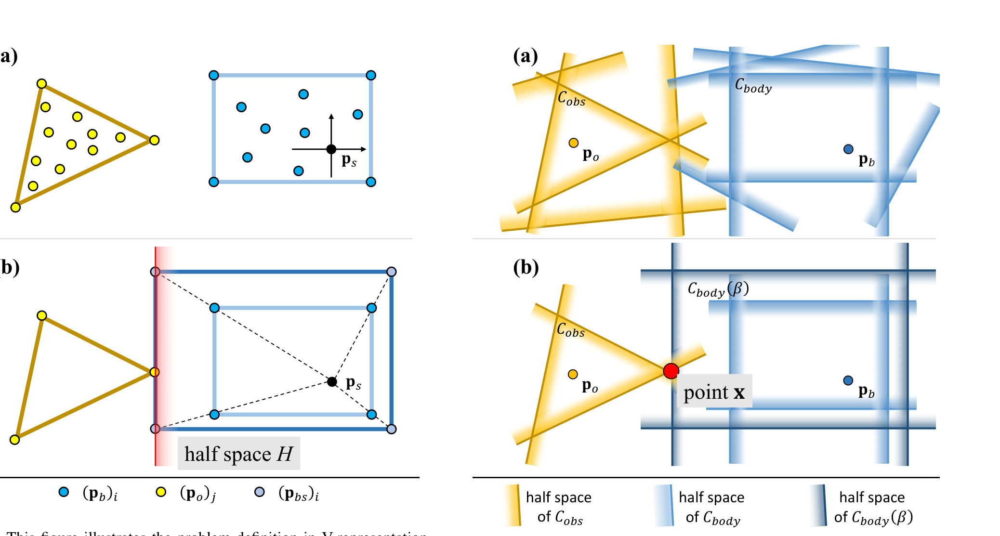
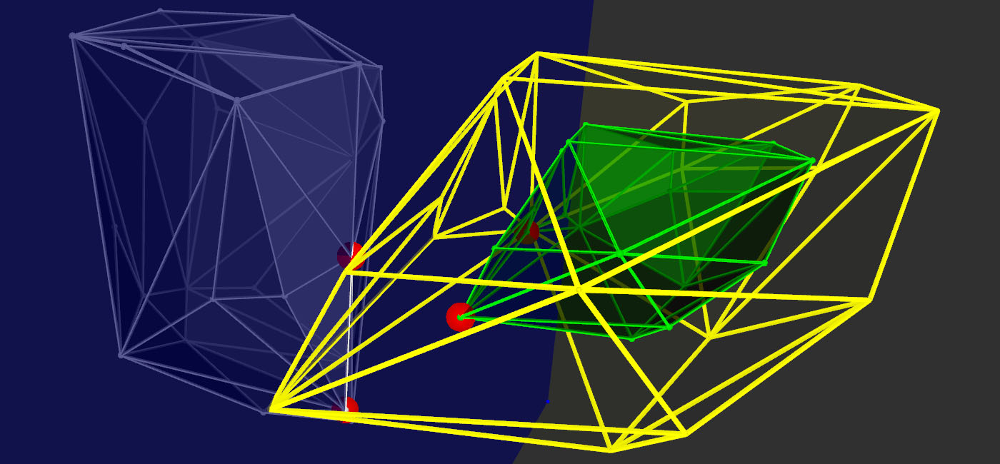
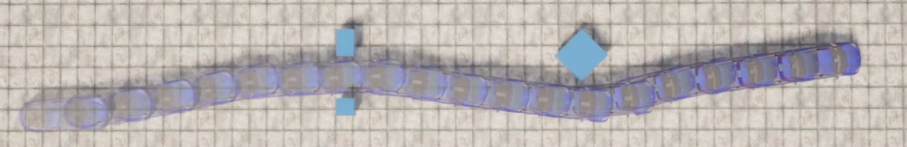
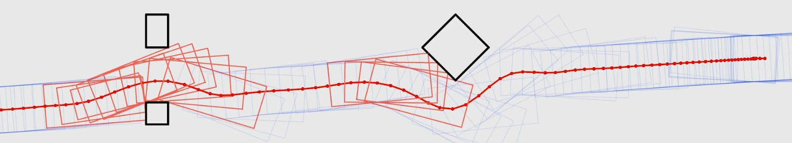

# 基于尺度优化的全机身精确碰撞评估线性算法

> **原文标题**：A Linear and Exact Algorithm for Whole-Body Collision Evaluation via Scale Optimization  
> **作者**：Qianhao Wang，Zhepei Wang，Liuao Pei，Chao Xu，Fei Gao  
> **发表信息**：2023 IEEE International Conference on Robotics and Automation（ICRA 2023）  
> **原文 PDF**：[A Linear and Exact Algorithm for Whole-Body Collision Evaluation via Scale Optimization.pdf](../A%20Linear%20and%20Exact%20Algorithm%20for%20Whole-Body%20Collision%20Evaluation%20via%20Scale%20Optimization.pdf) ｜ **对应中文详解**：[02_基于尺度优化的全机身精确碰撞评估线性算法.md](../中文详解/02_基于尺度优化的全机身精确碰撞评估线性算法.md)

---

## 原文第 1 页核心内容与翻译

### 摘要

碰撞评估在许多应用中都十分重要。然而，现有方法要么计算过程繁琐，要么无法保证精确。考虑到实现成本，大多数需要评估机器人与环境之间碰撞关系的全机身规划方法，都难以同时兼顾精度和计算效率。本文提出一种无间隙的全机身碰撞评估方法，并将其表示为低维线性规划问题。该评估问题可以在线性复杂度下解析求解。除此之外，方法能够高效地提供梯度，因此适用于基于优化的应用。障碍物既可以用点表示，也可以用超平面表示。针对常用空中机器人和车辆类机器人的实验验证了该方法的通用性和实用性。

### 一、引言

碰撞评估在物理引擎、计算机图形学和机器人导航等多个领域都十分关键。随着自主化程度不断提高，越来越多的机器人被部署到复杂的真实环境中，需要在密集且高度动态的环境中通行，如图 7 所示；有时还需要穿过与自身尺寸相近的狭窄缝隙，如图 1 所示。此类必须考虑机器人自身形状的规划问题称为全机身规划，迫切需要一种精确而高效的机器人—环境碰撞评估方法。

一般而言，碰撞评估方法应满足以下要求：一是精确，不应与真实值存在间隙或近似误差；二是高效，计算开销应当较低；三是具有局部性，不必严格枚举每一个障碍物，而只需关注机器人附近的少量障碍物[1]、[2]。

针对上述要求，已有研究提出了许多不同方法[1]–[5]。但是，将它们用于全机身机器人运动规划时，往往会遇到梯度计算困难以及难以适应不同地图表示形式的问题。具体来说，全机身碰撞评估面临三项挑战：第一，需要高效、精确地提供梯度，以便应用于基于优化的框架；第二，随着环境重建和 SLAM 技术发展，点云[6]、表面[7]、栅格地图[8]和语义信息[9]等多种地图形式被用于不同规划任务，需要在不过度预处理的情况下处理含有大量冗余信息的地图；第三，避碰问题的维度不能随意增加，例如 Zhang 等人的工作[10]在轨迹优化中引入了大量对偶变量，会使优化问题难以求解。

本文提出一种能够解析评估两个凸物体碰撞关系的新方法，以解决上述要求和挑战。方法通过计算最小尺度来进行碰撞评估：将两个物体中的一个按该尺度放大或缩小后，它将与另一个物体发生碰撞，如图 2 所示。该方法支持用点或超平面表示物体，本文分别将其称为顶点表示法（V-representation）和超平面表示法（H-representation），具体定义见第三节。即使点集或超平面中存在冗余信息，也无需预处理即可直接计算。

尺度计算被构造为低维线性规划问题，其计算时间复杂度为 $O(m)$[11]，其中 $m$ 是构成物体的点或超平面的总数，也就是线性规划中线性不等式的总数。无论障碍物数量是多少，评估环境碰撞时始终只使用一个非负最小尺度变量 $\beta$。将该方法用于全机身轨迹优化时，结合线性规划的活跃约束，可以解析地获得尺度 $\beta$ 关于被缩放物体自身运动的梯度。即使以不考虑机器人形状的普通轨迹作为初始值，优化后仍可以得到满足安全要求的全机身轨迹。

为验证方法的通用性和实用性，本文基于多旋翼的微分平坦性生成 SE(3) 空中机器人轨迹，并在考虑非完整约束的条件下规划二维车辆类机器人轨迹。本文的主要贡献如下：

- 通过低维线性规划提出一种精确、快速且具有局部性的碰撞评估方法；
- 分别实现顶点表示法和超平面表示法，并推导用于全机身轨迹优化的解析梯度；
- 在若干具有挑战性的场景中验证方法，包括 SE(3) 空中机器人和二维车辆类机器人，以及静态、动态两类环境。

**图 1**：全机身 SE(3) 规划问题示例。多旋翼需要从起点飞到终点。绿色矩形表示多旋翼沿红色轨迹飞行时的若干位置快照；两个白色障碍物构成狭窄缝隙。

---

## 原文第 2 页核心内容与翻译

本文方法在评估环境碰撞时只使用第三节定义的一个变量，即最小尺度 $\beta\in\mathbb{R}_{\ge0}$。用于全机身轨迹优化时，利用线性规划的活跃约束，可以解析地得到 $\beta$ 关于缩放物体自身运动的梯度。当初始轨迹没有考虑机器人形状时，经过本文方法优化仍能得到安全的全机身轨迹。为验证方法的通用性，作者分别生成基于多旋翼微分平坦性的 SE(3) 空中机器人轨迹，并规划考虑非完整约束的二维车辆类机器人轨迹。

### 二、相关工作

#### A. 碰撞评估

基于单纯形的迭代方法 Gilbert–Johnson–Keerthi（GJK）[3]及其改进方法[4]，被广泛用于计算两个凸物体之间的距离。但这些方法需要预处理以计算支撑函数。当两个物体相交时，GJK 的计算还必须考虑扩展多面体算法（EPA）[5]。Gilbert 等人[1]提出增长距离来度量碰撞；类似地，Tracy 等人[2]计算两个物体同时放大或缩小到发生相交时的最小尺度，并将尺度计算构造为圆锥规划，再用原始—对偶内点法求解。这类问题求解和梯度计算都较为复杂，而且不支持局部性：当需要评估机器人与多个障碍物的碰撞时，必须对所有障碍物逐一计算，计算开销会随障碍物数量增加。此外，当一个物体远大于另一个物体时，方法还可能出现数值不稳定。Lutz 等人[12]提出一种基于两层 LogSumExp 函数的构造实体几何方法，但该方法与真实值之间存在间隙。

#### B. 全机身轨迹优化

大量研究[8]、[13]将空中机器人建模为球体；对于车辆类机器人，Li[14]和 Ziegler[15]使用多个圆进行建模。根据机器人的半径对障碍物进行膨胀后，将圆或球的中心限制在膨胀地图的自由空间内，从而保证安全。Ji 等人[16]将无人机建模为圆盘，以生成能够停靠在运动平台上的 SE(3) 轨迹。

但是，保守建模方法[8]、[13]–[15]和面向特定任务的方法[16]，都无法用于需要考虑机器人真实形状的狭窄环境。Liu 等人[17]将四旋翼建模为椭球体以穿越狭缝，并通过生成运动基元逐一检查安全性；这类搜索方法需要提高运动基元分辨率才能提升复杂环境中的成功率，计算开销会迅速增加。

Zhang 等人[10]、[18]使用可微对偶变量构造物体间距离，实现基于优化的碰撞规避（OBCA）。但是，对偶变量数量与障碍物数量有关，障碍物增多时问题维度会显著上升。Wang[7]和 Han[19]根据自由空间构造凸多面体飞行走廊，再按照机器人形状建立凸多面体，通过将机器人多面体约束在走廊内保证轨迹安全。对于车辆，Ding[20]和 Manzinger[21]采用矩形构造安全走廊。基于走廊的方法要求相邻走廊多面体的交集至少能够容纳一个机器人多面体；如果无法满足，问题就不存在可行解。

**图 2**：机器人穿过由多个障碍物组成的地图时，对应缩放机器人形状的变化示意图。

---

## 原文第 3 页核心内容与翻译

### 三、问题定义

下面分别给出顶点表示法和超平面表示法下最小尺度的计算问题。为便于表述，以下将经过缩放的物体称为“机身”，将另一个物体称为“障碍物”。

#### A. 顶点表示法

如图 3(a) 所示，黄色和蓝色物体分别由能够包含冗余点的凸包定义。本文方法不要求先将点处理成凸包，而是可以直接使用冗余点。为便于观察，图 3(b) 中未画出对物体表示没有贡献的冗余点。

在机身坐标系中，使用点集

$$P_{body}^{b}=\{(p_b^b)_i\mid i=1,2,\ldots,n_b\},\quad P_{obs}^{b}=\{(p_o^b)_j\mid j=1,2,\ldots,n_o\}$$

分别表示机身和障碍物。定义机身坐标系中的点 $p_s^b$ 为缩放种子点，机身点集围绕该点缩放；定义 $\beta\in\mathbb{R}_{\ge0}$ 为缩放尺度。以 $p_s^b$ 为原点的坐标系中，缩放后的机身点集和障碍物点集为

$$P_{body}^{s}(\beta)=\{(p_{bs}^{s})_i=\beta((p_b^b)_i-p_s^b)\mid i=1,2,\ldots,n_b\},$$

$$P_{obs}^{s}=\{(p_o^s)_j=(p_o^b)_j-p_s^b\mid j=1,2,\ldots,n_o\}.\tag{1}$$

顶点表示法下的最小尺度问题，是在满足下列约束的情况下最大化尺度 $\beta$：

$$\left\{\begin{aligned}
\alpha_o^T\beta((p_b^b)_i-p_s^b)&\le 1,&&i=1,2,\ldots,n_b,\\
\alpha_o^T((p_o^b)_j-p_s^b)&\ge 1,&&j=1,2,\ldots,n_o.
\end{aligned}\right.\tag{2}$$

这表示需要找到半空间 $H=\{x\mid\alpha_o^Tx\le1\}$，使缩放后的机身 $P_{body}^{s}(\beta)$ 完全位于半空间内部，而障碍物点集 $P_{obs}^{s}$ 位于半空间外部，如图 3(b) 所示。

令 $\alpha^T=\beta\alpha_o^T$。由于 $\beta\ge0$，尺度计算可以写成低维线性规划：

$$\begin{aligned}
\max\quad&\beta\\
\text{s.t.}\quad&\alpha^T((p_b^b)_i-p_s^b)\le1,\quad i=1,2,\ldots,n_b,\\
&\alpha^T((p_o^b)_j-p_s^b)\ge\beta,\quad j=1,2,\ldots,n_o.
\end{aligned}\tag{3}$$

**图 3**：顶点表示法下的问题定义。(a) 黄色和蓝色凸包分别表示障碍物和机身，使用黄色和蓝色的冗余点表示两者。(b) 为避免视觉混乱，不显示冗余点。浅蓝色点表示缩放后的机身，红线表示包含缩放机身但不包含障碍物的半空间。

#### B. 超平面表示法

如图 4(a) 所示，使用若干可能含有冗余的半空间的交集表示凸多面体。为便于观察，图 4(b) 中未画出对表示没有贡献的半空间。

在世界坐标系中，使用

$$C_{body}=\{x\mid(\alpha_b)_i^T(x-p_b)\le1,\ i=1,2,\ldots,n_b\},$$

$$C_{obs}=\{x\mid(\alpha_o)_j^T(x-p_o)\le1,\ j=1,2,\ldots,n_o\}$$

分别表示机身和障碍物。其中 $p_b$ 和 $p_o$ 分别是位于机身和障碍物内部的点，$n_b$ 和 $n_o$ 是定义两者交集所需半空间的数量。令机身围绕 $p_b$ 缩放，则缩放后的机身为

$$C_{body}(\beta)=\{x\mid(\alpha_b)_i^T(x-p_b)\le\beta,\ i=1,2,\ldots,n_b\},\quad\beta\in\mathbb{R}_{\ge0}.\tag{4}$$

超平面表示法下的问题定义为

$$\begin{aligned}
\min\quad&\beta\\
\text{s.t.}\quad&(\alpha_b)_i^T(x-p_b)\le\beta,\quad i=1,2,\ldots,n_b,\\
&(\alpha_o)_j^T(x-p_o)\le1,\quad j=1,2,\ldots,n_o.
\end{aligned}\tag{5}$$

这是一个低维线性规划问题。式（5）的约束要求存在一个点 $x$，使其同时属于 $C_{body}(\beta)$ 和 $C_{obs}$，如图 4(b) 所示。

**图 4**：超平面表示法下的问题定义。(a) 障碍物和机身分别由若干黄色和蓝色半空间的交集表示。(b) 为便于观察，不显示冗余半空间。深蓝色点表示缩放后的机身，红点表示同时属于缩放机身和障碍物的点。

---

## 原文第 4 页核心内容与翻译

### 四、梯度计算

顶点表示法和超平面表示法的问题都属于线性规划。本文只详细推导顶点表示法下的子梯度，超平面表示法的梯度计算思路与之类似。

本文利用低维线性规划的活跃约束获得尺度 $\beta$ 的梯度。在 $n$ 维空间中，根据式（3），最优解处有两类活跃约束，可写成线性等式：

$$\begin{bmatrix}((p_b^b)_{ac,i}-p_s^b)^T&0\end{bmatrix}\begin{bmatrix}\alpha\\\beta\end{bmatrix}=1,\quad i=1,2,\ldots,n_{b\_ac},$$

$$((p_o^b)_{ac,j}-p_s^b)^T\alpha-\beta=0,\quad j=1,2,\ldots,n_{o\_ac}.\tag{6}$$

其中 $(p_b^b)_{ac,i}\in P_{body}^b$、$(p_o^b)_{ac,j}\in P_{obs}^b$，且 $n_{b\_ac}+n_{o\_ac}=n+1$。也就是说，为求解 $(n+1)$ 维线性规划，需要有 $n+1$ 个活跃约束。将这些机身点和障碍物点分别称为机身活跃约束点和障碍物活跃约束点。

如图 5 所示，红点分别位于绿色和白色凸包上，对应机身和障碍物的活跃约束点。根据式（1）由机身活跃点得到的缩放机身点，以及障碍物活跃点，都位于超平面 $P=\{x\mid\alpha^Tx=\beta\}$ 上；图 5(b) 用蓝色平面表示该超平面。

将式（6）的线性等式合并为矩阵形式：

$$\begin{bmatrix}A_{n\times n}&B_{n\times1}\\C_{1\times n}&D_{1\times1}\end{bmatrix}
\begin{bmatrix}\alpha_{n\times1}\\\beta\end{bmatrix}=
\begin{bmatrix}E_{n\times1}\\F_{1\times1}\end{bmatrix}.\tag{8}$$

其中矩阵由式（6）的活跃约束组成。消去变量 $\alpha$ 后，可得到只含变量 $\beta$ 的等式：

$$CA^{-1}(E-B\beta)+D\beta=F.\tag{9}$$

刚体的机身点集 $P_{body}^b$ 与机身运动无关。实际中只能直接获得世界坐标系中的障碍物点集 $P_{obs}^w$。为保持一般性，定义刚体在机身坐标系中的旋转中心为 $p_{cen}^b$，并用 $R$ 和 $t$ 表示机身在世界坐标系中的旋转和平移。根据机身运动和 $P_{obs}^w$，可得到机身坐标系中的障碍物点：

$$ (p_o^b)_j=R^{-1}\left((p_o^w)_j-t-p_{cen}^b\right).\tag{10}$$

因此，可以利用式（9）中包含尺度与刚体运动关系的隐函数，求出 $\beta$ 关于 $R$ 和 $t$ 的偏导数。当 $R$、$t$ 随时间变化，例如使用时间参数化多项式轨迹表示运动时，还可以得到 $\beta$ 关于时间的梯度。

**图 5**：顶点表示法下最小尺度计算示意图。(a) 白色和绿色凸包分别表示障碍物和机身。(b) 黄色凸包表示将机身放大到最小尺度后得到的缩放机身；蓝色平面是分隔缩放机身与障碍物的超平面；红点是满足式（6）中某个线性等式的活跃约束点。虽然图中使用凸包进行可视化，实际计算可以直接使用冗余点集。

### 五、在空中机器人上的应用

为展示方法在空中机器人的通用性，本文基于多旋翼的微分平坦性，将方法用于全机身多旋翼轨迹优化问题。如图 1 所示，将多旋翼建模为尺寸为 $3\times2\times0.6$ 米的绿色长方体，并要求其穿过狭窄缝隙。采用分段多项式表示平坦输出轨迹，并使用 MINCO[7]进行时空变形。在 SE(3) 轨迹优化中，同时考虑平滑性、安全性和动力学可行性，将最大速度设为 $6\,\mathrm{m/s}$、最大加速度设为 $10\,\mathrm{m/s^2}$。通过约束第三节定义的最小尺度大于 1 实现避障，这需要获得尺度关于多旋翼运动的梯度。

---

## 原文第 5 页核心内容与翻译

### A. SE(3) 运动的梯度计算

下面详细推导梯度计算。第四节中用 $R$ 和 $t$ 分别表示机身的旋转矩阵和平移。为便于优化，使用归一化四元数 $q=[w,x,y,z]^T$ 表示旋转。参照文献[22]，旋转矩阵 $R$ 可以由四元数 $q$ 表示，偏导数 $\partial R/\partial q_*$（$*\in\{w,x,y,z\}$）可以直接得到。

在三维空间中，式（3）的线性规划有 4 个活跃约束。根据活跃约束的来源，可以分成三种情况：

1. 3 个活跃约束来自 $P_{body}^b$，1 个来自 $P_{obs}^b$；
2. 2 个活跃约束来自 $P_{body}^b$，2 个来自 $P_{obs}^b$；
3. 1 个活跃约束来自 $P_{body}^b$，3 个来自 $P_{obs}^b$。

#### 1）3 个机身活跃约束点，1 个障碍物活跃约束点

$$\begin{bmatrix}
((p_b^b)_{ac,1}-p_s^b)^T&0\\
((p_b^b)_{ac,2}-p_s^b)^T&0\\
((p_b^b)_{ac,3}-p_s^b)^T&0\\
((p_o^b)_{ac,1}-p_s^b)^T&-1
\end{bmatrix}\begin{bmatrix}\alpha\\\beta\end{bmatrix}=
\begin{bmatrix}1\\1\\1\\0\end{bmatrix}.\tag{11}$$

由式（9）可得

$$\beta=((p_o^b)_{ac,1}-p_s^b)^T
\begin{bmatrix}((p_b^b)_{ac,1}-p_s^b)^T\\((p_b^b)_{ac,2}-p_s^b)^T\\((p_b^b)_{ac,3}-p_s^b)^T\end{bmatrix}^{-1}
\begin{bmatrix}1\\1\\1\end{bmatrix}.\tag{12}$$

此时只有 $(p_o^b)_{ac,1}$ 与 $R$、$t$ 有关。为简化表达，令 $A$ 和 $E$ 表示式（8）中的相应矩阵，则

$$\beta=((p_o^b)_{ac,1}-p_s^b)^TA^{-1}E.\tag{13}$$

由式（10）可得尺度关于平移和四元数的梯度：

$$\frac{\partial\beta}{\partial t}=-RA^{-1}E,\qquad
\frac{\partial\beta}{\partial q_*}=-((p_o^b)_{ac,1})^T\frac{\partial R^T}{\partial q_*}RA^{-1}E.\tag{14}$$

#### 2）2 个机身活跃约束点，2 个障碍物活跃约束点

将两个障碍物活跃点之差记为 $\Delta p_{o\_ac}^b$：

$$\begin{bmatrix}
((p_b^b)_{ac,1}-p_s^b)^T&0\\
((p_b^b)_{ac,2}-p_s^b)^T&0\\
(\Delta p_{o\_ac}^b)^T&0\\
((p_o^b)_{ac,1}-p_s^b)^T&-1
\end{bmatrix}\begin{bmatrix}\alpha\\\beta\end{bmatrix}=
\begin{bmatrix}1\\1\\0\\0\end{bmatrix}.\tag{15}$$

两个障碍物活跃约束满足

$$((p_o^b)_{ac,1}-p_s^b)^T\alpha-\beta=0,\quad
((p_o^b)_{ac,2}-p_s^b)^T\alpha-\beta=0.\tag{16}$$

相减得到

$$((p_o^b)_{ac,1}-(p_o^b)_{ac,2})^T\alpha=(\Delta p_{o\_ac}^b)^T\alpha=0.\tag{17}$$

根据式（10），有

$$\Delta p_{o\_ac}^b=R^{-1}\left((p_o^w)_{ac,1}-(p_o^w)_{ac,2}\right).\tag{18}$$

由式（9）可得

$$\beta=((p_o^b)_{ac,1}-p_s^b)^T
\begin{bmatrix}((p_b^b)_{ac,1}-p_s^b)^T\\((p_b^b)_{ac,2}-p_s^b)^T\\(\Delta p_{o\_ac}^b)^T\end{bmatrix}^{-1}
\begin{bmatrix}1\\1\\0\end{bmatrix}.\tag{19}$$

简写为

$$\beta=CA^{-1}E.\tag{20}$$

此时 $C$ 与 $R,t$ 有关，$A$ 只与 $R$ 有关，$E$ 为常量。梯度为

$$\frac{\partial\beta}{\partial t}=-RA^{-1}E,\tag{21}$$

$$\frac{\partial\beta}{\partial q_*}=-((p_o^b)_{ac,1})^T\frac{\partial R^T}{\partial q_*}RA^{-1}E
+CA^{-1}\begin{bmatrix}0_{1\times3}\\0_{1\times3}\\(\Delta p_{o\_ac}^b)^T\frac{\partial R^T}{\partial q_*}R\end{bmatrix}A^{-1}E.\tag{22}$$

#### 3）1 个机身活跃约束点，3 个障碍物活跃约束点

$$\begin{bmatrix}
((p_o^b)_{ac,1}-p_s^b)^T&-1\\
((p_o^b)_{ac,2}-p_s^b)^T&-1\\
((p_o^b)_{ac,3}-p_s^b)^T&-1\\
((p_b^b)_{ac,1}-p_s^b)^T&0
\end{bmatrix}\begin{bmatrix}\alpha\\\beta\end{bmatrix}=
\begin{bmatrix}0\\0\\0\\1\end{bmatrix}.\tag{23}$$

由式（9）可得

$$-((p_b^b)_{ac,1}-p_s^b)^T
\begin{bmatrix}((p_o^b)_{ac,1}-p_s^b)^T\\((p_o^b)_{ac,2}-p_s^b)^T\\((p_o^b)_{ac,3}-p_s^b)^T\end{bmatrix}^{-1}
\begin{bmatrix}-1\\-1\\-1\end{bmatrix}\beta=1,\tag{24}$$

简写为

$$-CA^{-1}B\beta=1.\tag{25}$$

此时 $C$ 和 $B$ 为常量，只有 $A$ 与 $R,t$ 有关。由隐式求导得到

$$\frac{\partial\beta}{\partial t}=\beta RA^{-1}B,\tag{27}$$

$$\frac{\partial\beta}{\partial q_*}=CA^{-1}\frac{\partial A}{\partial q_*}A^{-1}B\beta^2,\tag{29}$$

其中

$$\frac{\partial A}{\partial q_*}=-\begin{bmatrix}((p_o^b)_{ac,1})^T\\((p_o^b)_{ac,2})^T\\((p_o^b)_{ac,3})^T\end{bmatrix}\frac{\partial R^T}{\partial q_*}R.\tag{30}$$

式（26）给出了由隐式求导得到的平移梯度中间等式，对 $t_y,t_z$ 的形式相同：

$$CA^{-1}B\frac{\partial\beta}{\partial t_x}+CA^{-1}
\begin{bmatrix}1&0&0\\1&0&0\\1&0&0\end{bmatrix}RA^{-1}B\beta=0.\tag{26}$$

式（28）是四元数求导的中间形式：

$$\frac{1}{\beta}\frac{\partial\beta}{\partial q_*}-CA^{-1}\frac{\partial A}{\partial q_*}A^{-1}B\beta=0.\tag{28}$$

---

## 原文第 6 页核心内容与翻译

### B. 实验结果

本文采用高效的拟牛顿方法 L-BFGS[23]求解数值优化问题，并使用 Lewis–Overton 线搜索[24]处理尺度函数有时出现的非光滑性。实验结果如图 1 所示，本文方法生成的 SE(3) 全机身轨迹无碰撞且平滑。

**图 6**：轨迹优化过程示意图。蓝色曲线表示初始轨迹，红色曲线表示优化过程中的轨迹。(a)–(e) 中，红色方块表示尺度小于 1 的轨迹状态，浅蓝色方块表示满足尺度约束的状态。(f) 表示收敛后的轨迹；在 (e) 之后，轨迹上不再有违反尺度约束的状态。(g) 为 CARLA 中的实验结果截图。

### 六、在车辆类机器人上的应用

为展示方法对车辆类机器人的适用性，本文在物理仿真器 CARLA[25]中开展实验。与第五节类似，使用由 MINCO[7]变形的分段多项式表示蓝色车辆的轨迹，并使用 L-BFGS 求解优化问题。轨迹优化同时考虑平滑性、安全性和动力学可行性。不同之处在于，本应用中的轨迹为二维轨迹，并考虑车辆的非完整约束。

由于图 7 所示环境是动态的，在时空轨迹优化中将最小尺度约束为大于 1，以保证安全；实际实验中设置最小尺度为 1.1，以增加安全裕度。关于二维运动的尺度梯度与 SE(3) 情形类似，本文不再详细推导。

**图 7**：将本文方法应用于车辆机器人的实验验证快照。规划蓝色车辆的轨迹，使其穿过动态环境。

#### A. 静态环境实验

如图 6(g) 所示，本文在静态环境中对蓝色车辆开展全机身轨迹优化。为验证方法能够得到全机身轨迹，初始值采用完全不考虑机器人形状的质点轨迹。图 6(a)–(f) 展示了该实验的轨迹优化过程：从普通的蓝色初始轨迹开始，随着迭代次数增加，不满足尺度约束的轨迹状态逐渐消失。最终优化结果平滑，并满足全机身规划要求。

#### B. 动态环境实验

如图 7 所示，本文对蓝色车辆进行全机身轨迹优化，使其穿过由 5 辆红色车辆组成的交通流。5 辆红车的最大速度分别为 $4$、$1$、$1.5$、$4$ 和 $5.5\,\mathrm{m/s}$；蓝车在优化中设置的最大速度为 $8\,\mathrm{m/s}$，最大加速度为 $2\,\mathrm{m/s^2}$。为清楚展示动态环境中的通行过程，图 7 使用按时间连续的三张图像说明最终轨迹安全且平滑。

### 七、结论与未来工作

本文提出一种基于线性尺度的精确全机身碰撞建模方法，并且能够高效求解；进一步推导了该方法的解析梯度，并将其应用于空中机器人和车辆机器人的轨迹优化。除第五节和第六节介绍的应用外，方法还可以用于机械臂、足式机器人等其他机器人。受益于基于尺度的设计，该方法还可以用于可变形机器人和无人机群编队。上述应用将在后续工作中发布。

此外，作者还将研究轨迹优化中的连续碰撞建模，以提高规划的完备性。

---

## 原文第 7 页核心内容与翻译

### 参考文献

[1] E. G. Gilbert and C. J. Ong, “New distances for the separation and penetration of objects,” in *Proceedings of the 1994 IEEE International Conference on Robotics and Automation*. IEEE, 1994, pp. 579–586.  
[2] K. Tracy, T. A. Howell, and Z. Manchester, “Differentiable collision detection for a set of convex primitives,” *arXiv preprint arXiv:2207.00669*, 2022.  
[3] E. G. Gilbert, D. W. Johnson, and S. S. Keerthi, “A fast procedure for computing the distance between complex objects in three-dimensional space,” *IEEE Journal on Robotics and Automation*, 1988.  
[4] X. Zheng and J. T. Klosowski, “Enhancing the GJK algorithm for calculating the distance between complex shapes,” 2011.  
[5] G. van den Bergen, “Collision detection in interactive 3D environments,” Ph.D. dissertation, Eindhoven University of Technology, 2004.  
[6] F. Pomerleau, F. Colas, R. Siegwart, and S. Magnenat, “A review of point cloud registration algorithms for mobile robotics,” *Foundations and Trends in Robotics*, 2015.  
[7] Z. Wang, X. Zhou, C. Xu, and F. Gao, “Geometrically constrained trajectory optimization for multicopters,” *IEEE Transactions on Robotics*, 2022.  
[8] H. Oleynikova, M. Burri, M. Lynen, S. Leutenegger, R. Siegwart, and P. Furgale, “Continuous-time trajectory optimization for online UAV replanning,” *IEEE Transactions on Robotics*, 2016.  
[9] A. Rosinol, M. Abate, Y. Chang, and L. Carlone, “Kimera: an open-source library for real-time metric-semantic localization and mapping,” in *Proc. ICRA*, 2020.  
[10] Z. Zhang, J. Y. Zeng, and B. J. Chirikjian, “A general framework for collision-free motion planning with applications to autonomous vehicles,” *IEEE Transactions on Robotics*, 2021.  
[11] R. Seidel, “Small-dimensional linear programming and convex hulls made easy,” *Discrete & Computational Geometry*, 1991.  
[12] P. Lutz, S. Valmorbida, and M. H. Ang, “Differentiable collision detection for optimization-based motion planning,” 2022.  
[13] T. M. Howard, C. J. Green, and A. Kelly, “State space sampling of feasible motions for high-performance mobile robot navigation,” *Autonomous Robots*, 2009.  
[14] B. Li, K. Wang, and Z. Shao, “Time-optimal maneuver planning in automatic parallel parking using a simultaneous dynamic optimization approach,” *IEEE Transactions on Intelligent Vehicles*, 2016.  
[15] J. Ziegler and C. Stiller, “Spatiotemporal state lattices for fast trajectory planning in highly dynamic environments,” in *Proc. IROS*, 2009.  
[16] H. Ji, Z. Wang, C. Xu, and F. Gao, “A near-optimal online motion planning framework for quadrotor perching,” in *Proc. ICRA*, 2022.  
[17] S. Liu, P. Abbeel, and V. Kumar, “Differentially flat trajectory generation for quadrotor navigation,” 2018.  
[18] Z. Zhang et al., “Optimization-based motion planning for high-dimensional robots,” 2020.  
[19] T. Han, Z. Wang, and F. Gao, “Fast and robust trajectory planning for autonomous vehicles,” 2021.  
[20] W. Ding and S. Shen, “Online vehicle trajectory planning with dynamic obstacle avoidance,” 2017.  
[21] H. Manzinger, P. Olveres, and M. Althoff, “Efficient trajectory planning for autonomous driving,” 2019.  
[22] J. Gallier, *Notes on the schur complement*, 2010.  
[23] N. Nocedal and S. J. Wright, *Numerical Optimization*, Springer, 2006.  
[24] A. S. Lewis and M. L. Overton, “Nonsmooth optimization via quasi-Newton methods,” *Mathematical Programming*, 2013.  
[25] A. Dosovitskiy et al., “CARLA: An open urban driving simulator,” in *Proc. CoRL*, 2017.
