# 动态场景下四旋翼自适应跟踪与停泊（Adaptive Tracking and Perching for Quadrotor in Dynamic Scenarios）

> **作者**：Yuman Gao, Jialin Ji, Qianhao Wang, Rui Jin, Yi Lin, Zhimeng Shang, Yanjun Cao, Shaojie Shen, Chao Xu, Fei Gao  
> **来源**：*IEEE Transactions on Robotics*, Vol. 40, 2024, pp. 499–519  
> **原文 PDF**：[03_动态场景下四旋翼自适应跟踪与停泊.pdf](../中文详解/PDF/03_动态场景下四旋翼自适应跟踪与停泊.pdf) ｜ **中文详解**：[03_动态场景下四旋翼自适应跟踪与停泊.md](../中文详解/03_动态场景下四旋翼自适应跟踪与停泊.md)

## 原文第 1 页核心内容与翻译

### 摘要

在运动平台上停泊是延长四旋翼续航时间和作业范围、提高空地协同任务效率的一种有效方式。要实现可靠停泊，无人机必须保持稳定的相对状态，并持续获得可靠的目标观测。本文提出一套面向自主四旋翼的动态跟踪与停泊方法，使无人机能够与运动平台保持协调。

针对动态目标的可靠感知，本文提出带有弹性可见性约束的规划方法，主动避开遮挡并减少目标丢失；针对飞行时间和终端状态变化，提出灵活的末端调整方法，使无人机在不同接触角度下与时变停泊表面实现完整状态同步。通过优化切向相对速度，处理严格边界条件带来的动力学和安全约束冲突；同时考虑 $SE(3)$ 运动，保证无人机在接触前不发生碰撞。

作者将系统部署在商用 DJI Mavic 3 上，以全尺寸 SUV 作为运动平台。实车试验中，无人机能够跟踪以 30 km/h（8.3 m/s）行驶的 SUV 并停泊在车顶，也能够以 3.5 m/s 的速度停泊到倾斜 60° 的后备箱表面。

### 引言

与运动平台协同工作的无人机已经用于卡车—无人机配送、汽车—无人机巡检以及空地搜索救援。由于续航时间有限，无人机需要在运动平台上休息或补充能源；传统方式往往要求平台停车或中断任务。更高效的做法是让无人机在平台继续运动时平稳接近并停泊，这要求无人机在不同运动方向和平台姿态下保持可靠观测，并在合适时刻完成接触。

主要难点有三点。第一，快速飞行时相对运动不断变化，目标可能离开有限视场；障碍物和运动物体还可能挡住直接视线，因此轨迹必须根据目标运动和环境自适应调整。第二，停泊时位置、速度和姿态必须在接触时刻同步，而平台状态随时间变化，轨迹空间形状、飞行时间和终端状态需要共同调整；严格约束还可能与安全和动力学能力冲突。第三，突然出现的障碍、快速变化的目标状态和外部扰动可能使旧轨迹失效，机载资源又有限，因此必须在保证模型和约束的同时高频重规划。

本文设计了考虑三维有限视场、障碍遮挡、相对距离和相对角度的可微指标；允许跟踪距离随环境弹性变化，并联合调整无人机位置和姿态使目标保持在图像中心。作者还提出终端状态调整、切向相对速度松弛、无人机—平台几何碰撞约束，以及考虑完整动力学状态的时空轨迹优化框架。

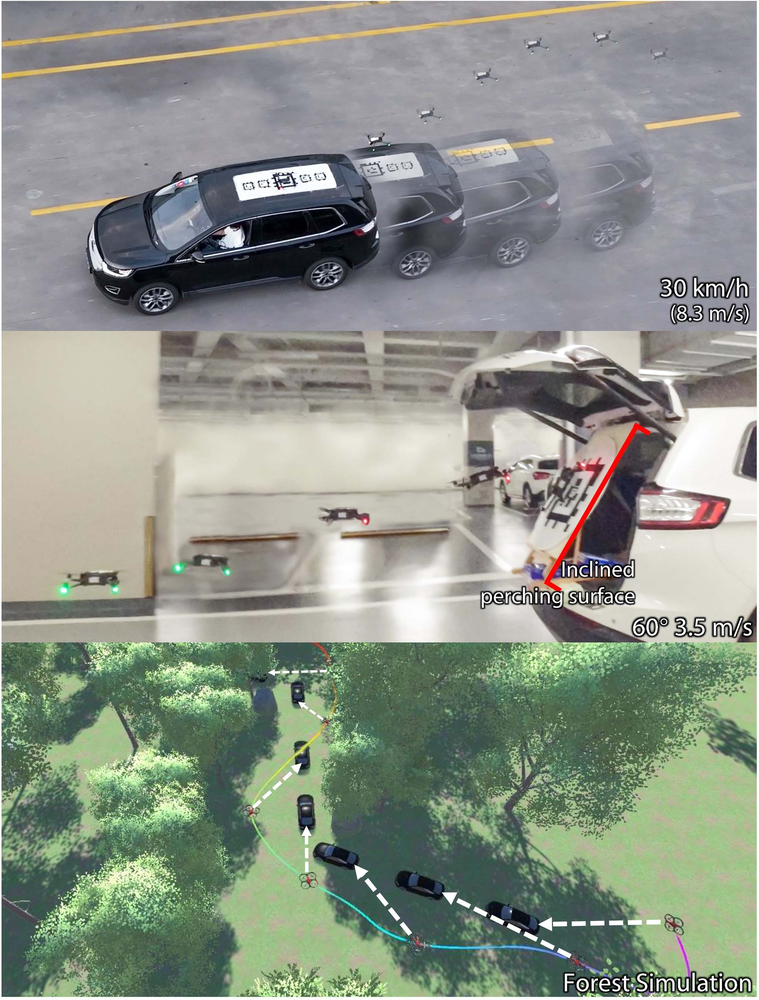

**图 1**：动态跟踪与停泊系统的仿真和实车试验。

## 原文第 2 页核心内容与翻译

早期视觉跟踪方法通常把规划和控制作为反应式控制问题，以图像空间中的跟踪误差作为反馈。这类方法计算量小，但难以提前处理安全和遮挡。模型预测控制与基于微分平坦性的滚动规划可以加入更多约束，但部分方法假设障碍为椭圆形、需要完整环境信息，或只检查无人机与目标的连线而忽略三维锥形视场。二维扇形可见区域也只能在指定高度工作。本文直接考虑三维视场、距离、角度和遮挡。

动态降落研究常采用 PID、李雅普诺夫控制和基于图像的视觉伺服；这些方法反应快，但不易加入交互对象约束。近期的 MPC 和微分平坦性方法多数只到达降落位置，不能在接触时调整姿态。针对倾斜表面的停泊方法有的依赖吸附机构，有的使用二次规划或离散非线性规划；前者约束简化，后者计算量较大。本文把可见性、安全性、动力学可行性和时变终端状态统一纳入轨迹规划。

## 原文第 3 页核心内容与翻译

四旋翼构型由位置 $p=(p_x,p_y,p_z)^T\in R^3$ 和旋转 $R\in SO(3)$ 表示，简化动力学为

$$\tau=\tilde fRe_3/m,\qquad \ddot p=\tau-\bar ge_3,\qquad \dot R=R\hat\omega.\tag{1}$$

其中 $\tau$ 为单位质量净推力，$\omega$ 为机体系角速度。四旋翼具有微分平坦性，选取平坦输出

$$z=(p_x,p_y,p_z,\psi)^T\in R^3\times SO(2),\tag{2}$$

并用其有限阶导数表示状态和输入，从而在低维空间中优化轨迹。

根据目标位置测量，作者使用恒定转弯率和速度模型（CTRV）估计目标状态

$$\chi(t)=(\varrho_x,\varrho_y,\varrho_z,\theta,v_h,v_v,\omega_\varrho)^T.\tag{4}$$

再使用扩展卡尔曼滤波。为把环境信息纳入预测，在给定时间内依据恒定转弯率和加速度模型（CTRA）展开不同运动基元，选择无碰撞且控制代价最小者，得到 $\varrho(t)$、$\theta(t)$ 以及离散目标点

$$\Psi=\{\varrho_k=\varrho(k\Delta t)\mid k=0,1,\ldots,M\}.\tag{5}$$

## 原文第 4 页核心内容与翻译

作者将四旋翼底部建模为圆盘，将停泊表面建模为半空间：

$$C=\{x=R_B\bar r u+o\mid \|u\|\le1,\ u\in R^2\},\tag{6}$$

其中圆盘中心 $o=p-\bar\ell z_b$。若表面法向量为 $z_s$，可行半空间写成

$$P=\{x\in R^3\mid h^Tx\le b\},\qquad h=-z_s,\quad b=h^T\varrho.\tag{7}$$

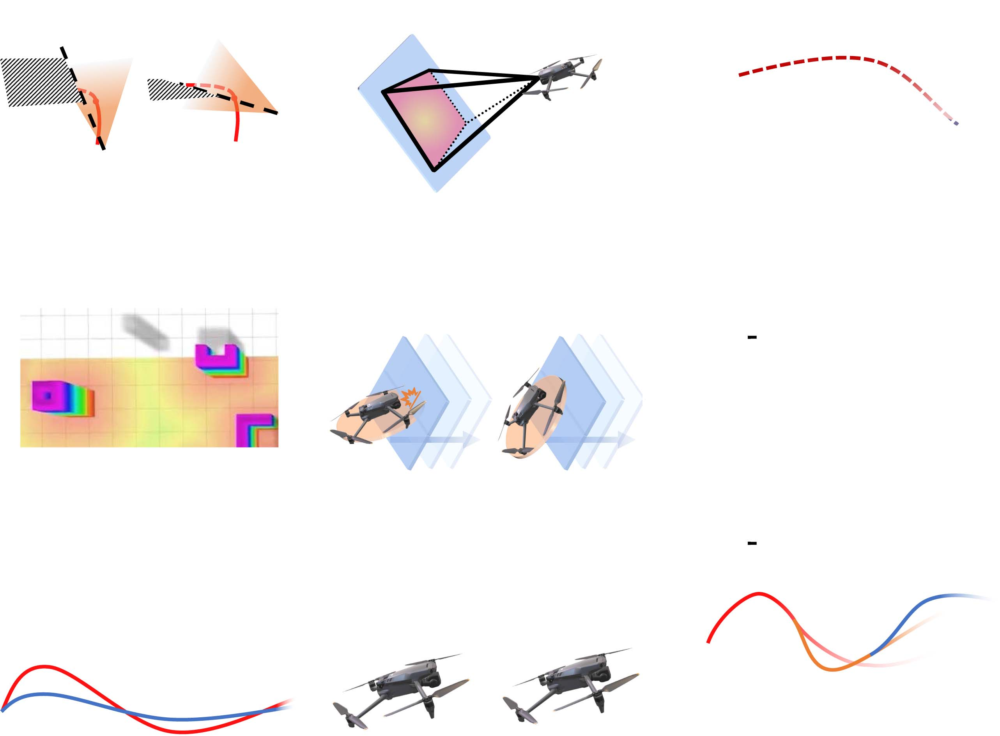

**图 2**：完整系统概览。系统融合目标观测、状态估计、可见性和安全约束，输出时空可行轨迹。

## 原文第 5 页核心内容与翻译

### 可见性跟踪规划

作者将跟踪失败归纳为观测距离、观测角度和遮挡影响。水平、垂直距离分别限制在合理范围：

$$d_\ell^*\le\delta^*\le d_u^*,\qquad *=\{h,v\}.\tag{8}$$

距离惩罚使用 $g(x)=\max(x,0)^3$，对过近距离施加较强惩罚，对水平距离超出上界采用平滑线性惩罚。期望偏航角为

$$\psi_e=\operatorname{atan2}(e_2^T(\varrho-p),e_1^T(\varrho-p)),\tag{11}$$

观测角度代价为 $J_{OA}=(\psi-\psi_e)^2$，它同时推动无人机调整位置和偏航。

对视线周围的可信视场，作者用一串球近似其三维锥形区域：

$$c_i=p+\lambda_i(\varrho-p),\qquad r_i=\rho\lambda_i\|p-\varrho\|.\tag{15--16}$$

由 ESDF 得到球心到最近障碍物距离 $\Xi(c_i)$，要求 $r_i<\Xi(c_i)$，并构造

$$J_{OE}=\sum_{i=1}^{M}g(r_i-\Xi(c_i)).\tag{18}$$

该指标的梯度既会把无人机推向较开阔的区域，也会在障碍密集处缩短跟踪距离，使视场锥变窄。

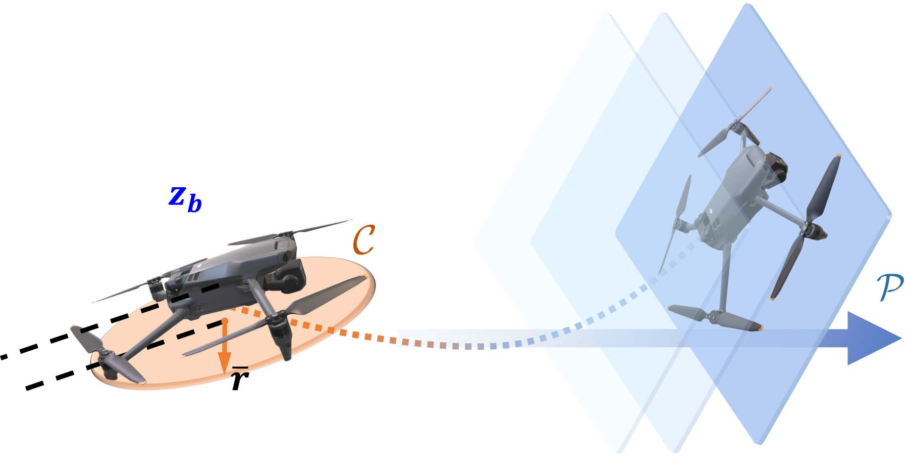

**图 3**：四旋翼圆盘和停泊表面半空间的几何模型。

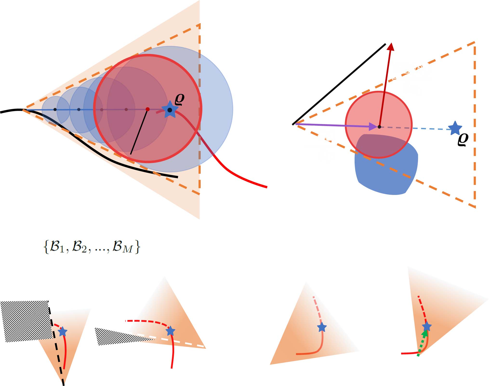

**图 4**：遮挡影响指标及其梯度对无人机位置和跟踪距离的调整作用。

## 原文第 6 页核心内容与翻译

停泊规划还必须满足 $SE(3)$ 碰撞规避、像平面感知和执行器约束。圆盘完全位于半空间内的条件等价于

$$\bar r\|B^TR^Th\|+h^To-b\le0.\tag{21}$$

轨迹在平坦输出空间优化，先由 $\tau=p^{(2)}+\bar ge_3$ 恢复机体 $z$ 轴，再用 Hopf 纤维化得到旋转矩阵。碰撞约束只在无人机接近平台时启用，并用平滑函数代替离散开关。

视觉标记点先变换到机体坐标系，再变换到相机坐标系：

$$^b\varrho=R(^b_wq)(^w\varrho-p),\qquad ^c\varrho=R(^c_bq)(^b\varrho-^c_b t).\tag{30}$$

按针孔模型，像平面坐标为

$$u_c=f_x\frac{^c\varrho_x}{^c\varrho_z},\qquad v_c=f_y\frac{^c\varrho_y}{^c\varrho_z}.\tag{31}$$

以 $F_p=u_c^2+v_c^2$ 使目标靠近图像中心，但只在设定观测距离内启用，避免远处约束过强或近处与终端姿态冲突。

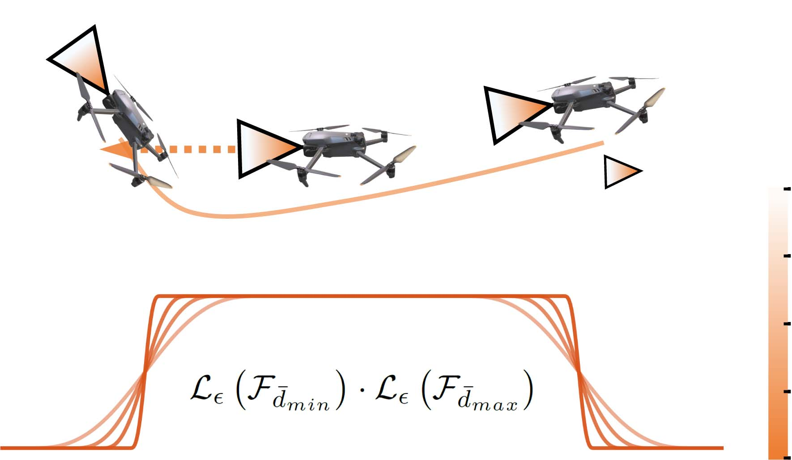

**图 5**：前视相机感知距离选择函数。

## 原文第 7 页核心内容与翻译

单位质量净推力满足 $\tau_{min}\le\|\tau\|\le\tau_{max}$，机体角速度 $\omega=R^T\dot R$ 也受到限制。终端位置和偏航要求为

$$p(T)=\varrho(T)-\bar\ell z_s(T),\qquad \psi(T)=\theta(T).\tag{43--44}$$

理想情况下无人机与平台切向相对速度为零，同时沿表面法向保留小接近速度。为避免严格约束与安全和执行器能力冲突，引入切向相对速度 $\nu=[\nu_x,\nu_y]^T$，并用 $J_\nu=\|\nu\|^2$ 抑制它。

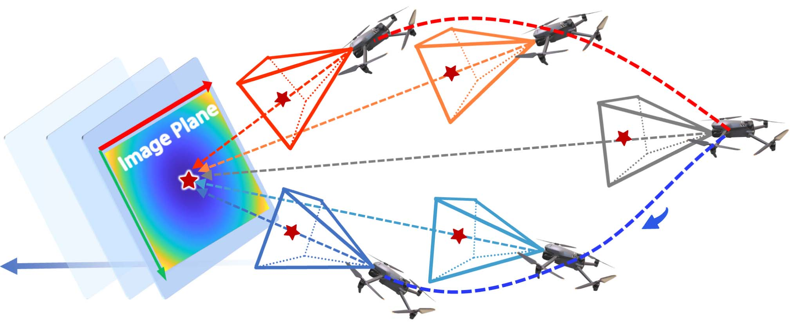

**图 6**：四旋翼加速或减速时，需要同时调整位置和姿态，才能保持目标处于高质量观测区域。

## 原文第 8 页核心内容与翻译

接触时要求机体 $z$ 轴与停泊表面法向重合。作者把姿态条件转换为末端加速度条件，并用正弦参数化限制终端推力；令末端 jerk 为零，以减小接触时角速度。轨迹生成因此同时满足末端位置、航向、速度、姿态、推力和碰撞要求。

## 原文第 9 页核心内容与翻译

为提供轨迹初值，作者采用遮挡感知路径搜索。对每个预测目标点，沿上一条视线和目标轨迹段取样，检查采样点到目标的视线，选择第一个无遮挡点；随后沿视线延长至期望跟踪距离或障碍边界，再用 A* 连接相邻视点。该方法将多目标搜索分解成多个小问题，计算量较低。

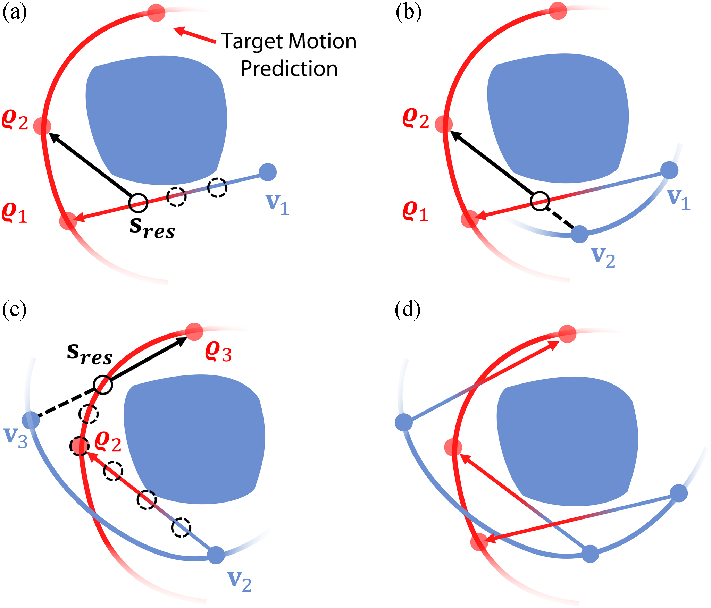

**图 7**：不同切向相对速度下的终端停泊轨迹。固定切向速度可能使安全约束和执行器约束冲突，因此需要共同优化。

**图 8**：遮挡感知的多目标路径搜索方法。

## 原文第 10 页核心内容与翻译

作者用多段多项式表示平坦输出轨迹，每段有独立持续时间和系数：

$$z_i(t)=c_i^T\beta(t),\qquad t\in[0,T_i].\tag{52}$$

优化目标在平滑性和时间之间权衡，并满足时间下界、初始状态、终端状态、连续约束和离散约束。采用 TMINCO 将空间中间点和时间参数解耦，以线性复杂度生成多项式并传播梯度；等式约束由参数化形式满足，不等式约束转化为惩罚项。

## 原文第 11 页核心内容与翻译

连续时间约束采用梯形积分离散化，计算其关于多项式系数和各段时间的梯度；离散绝对时间约束则考虑前面各段时间变化对当前轨迹段的影响。时间下界通过指数归一化和平方变量消除，使每段时间保持为正。跟踪阶段使用 $T_3^{MINCO}$ 表示位置、$T_2^{MINCO}$ 表示偏航；停泊阶段使用 $T_4^{MINCO}$ 表示位置，以支持末端角速度约束。

## 原文第 12 页核心内容与翻译

仿真在 Intel Core i5-9400F CPU 和 GeForce GTX 2060 GPU 上进行。跟踪比较 Jeon 方法、Elastic-Tracker 和不考虑可见性的 Fast-Tracker，所有方法使用相同目标轨迹和参数。障碍平均间距为 6 m、5 m 和 4 m，分别代表稀疏、中等和密集环境。作者统计目标视场分布、潜在遮挡物距离，以及出视场、距离过近和被遮挡等失败原因。

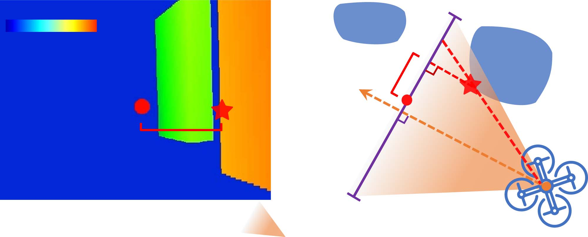

**图 9**：遮挡判据 $D_{occ}$。只记录无人机与穿过目标的投影平面之间、同时出现在图像中的障碍物。

## 原文第 13 页核心内容与翻译

Fast-Tracker 在目标突然转弯时容易出视场；Jeon 方法的图搜索和平滑阶段分离，出现遮挡且轨迹不够平滑；Elastic-Tracker 的二维扇形不能处理双层三维障碍。本文方法在狭窄区域将跟踪距离弹性缩短到约 4 m，成功避免遮挡。

停泊比较选用 Mao 和 Paneque 方法。Paneque 建立离散时间非线性规划并直接控制旋翼推力；Mao 建立二次规划并逐步延长轨迹时间。本文方法能够同时处理碰撞、动力学可行性和可见性，并以较低计算量生成面向运动目标的停泊轨迹。

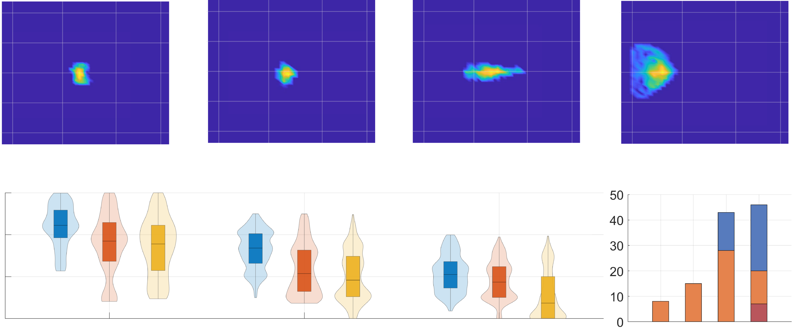

**图 10**：不同障碍密度下目标位置分布、潜在遮挡物距离和跟踪失败原因比较。

## 原文第 14 页核心内容与翻译

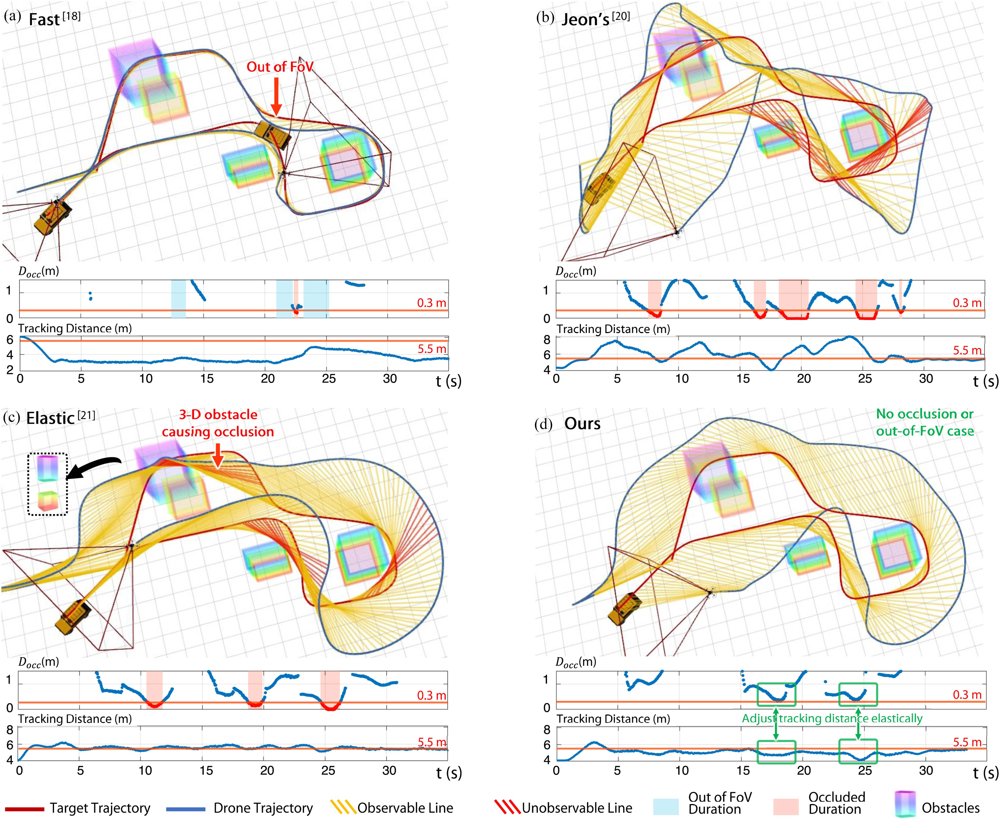

**图 11**：四种跟踪方法的可见性案例。本文方法没有出视场和遮挡情况，并能根据环境调整相对距离。

不同接触时刻和终端状态下，本文方法仍能与运动平台实现完整状态同步；与只能处理静止目标的方法相比，能够面向不同速度的运动目标生成停泊轨迹。

## 原文第 15 页核心内容与翻译

**图 12**：Paneque、Mao 和本文方法生成的垂直表面停泊轨迹比较，包括 $x-z$ 轨迹、角速度、单位质量净推力和图像空间目标位置。Mao 方法超过角速度限制；Paneque 方法受离散分辨率影响，推力曲线不够平滑。

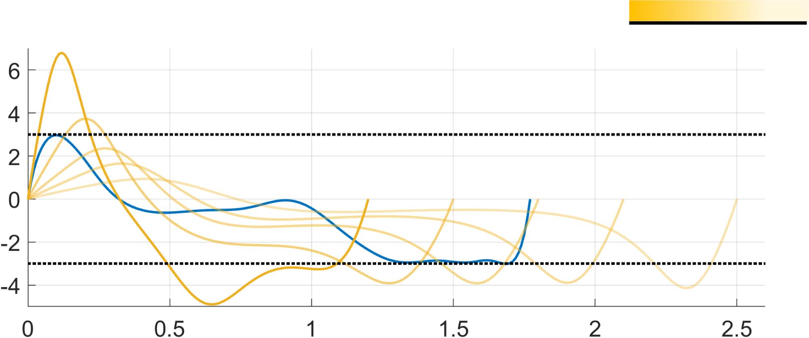

**图 13**：本文方法与 Mao 方法的角速度比较。Mao 方法即使反复增加轨迹时间，也不能保证动力学可行性。

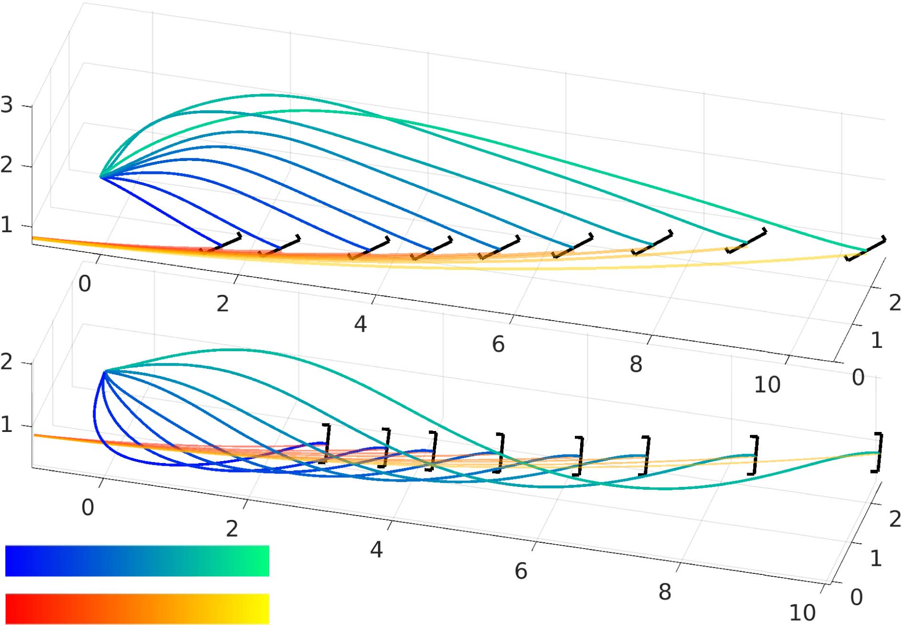

**图 14**：不同目标速度下运动平面的三维停泊轨迹。目标速度为 1.5–3.0 m/s，运动遵循角速度为 0.2 rad/s 的 CTRV 模型。

## 原文第 16 页核心内容与翻译

作者使用 AprilTag 标记停泊位置，比较有无可见性代价的停泊轨迹。终端俯仰角为 0 和 0.5 rad 时使用下视相机，1.5 rad 时使用前视相机；期望观测距离为 0.2–2.0 m。不考虑可见性时只能在较短距离和较短时间内看到目标；加入感知代价后，可以在设定距离内连续观测，并尽量保持目标位于图像中心。观测角度增大时定位误差增加，距离减小时误差下降，说明需要持续重规划。

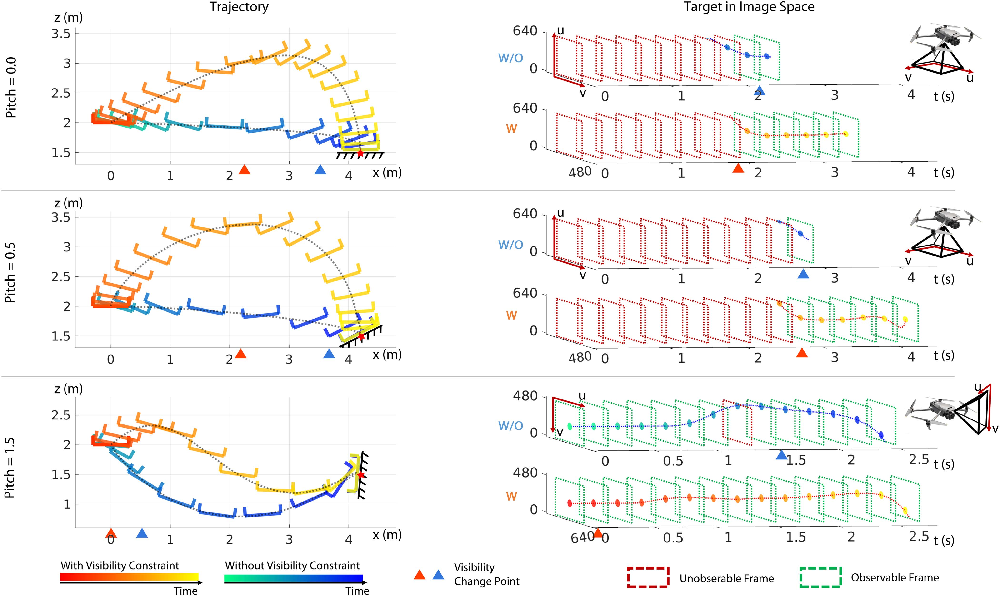

**图 15**：不同终端角度下的可见性感知消融试验。

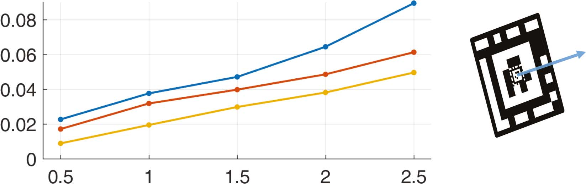

**图 16**：不同距离和观测角度下视觉标签的定位误差。

## 原文第 17 页核心内容与翻译

作者将方法部署在 DJI Mavic 3 上，以全尺寸 SUV 作为运动平台。系统融合视觉检测和差分 GPS 相对定位，使用视觉标签标记准确停泊位置；定位、感知、规划和控制均在机载处理器上实时运行。即使机载平台比仿真计算机慢约 8 倍，规划仍可达到 20 Hz 重规划。

在 L 形转弯场景中，卡车可能挡住无人机视线；无人机根据遮挡代价主动横向移动，保持目标在视场内。在左右交错障碍场景中，卡车交替出现在 SUV 两侧，目标可能停车或继续前进；无人机能够根据静态和动态障碍物调整位置。

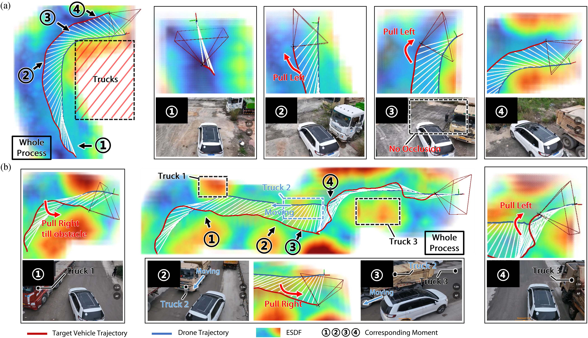

**图 17**：真实环境可见性跟踪验证。

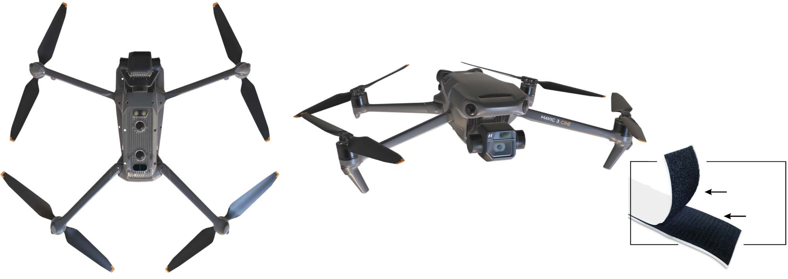

**图 18**：DJI Mavic 3 平台。前视和下视相机用于检测；云台相机因主要用于摄影且链路延迟较大，未用于检测。

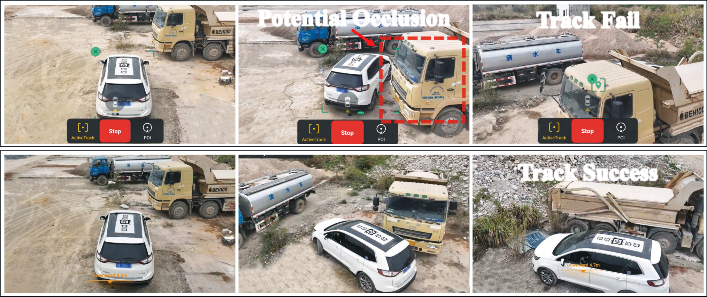

**图 19**：与 DJI 原有跟踪功能的比较。原有功能在车辆转弯处丢失目标，本文方法能够主动避开遮挡。

## 原文第 18 页核心内容与翻译

作者在室内、道路和野外等场景验证系统的效率、鲁棒性和精度，并改变目标速度和终端姿态，记录无人机的最大速度、平均速度、目标加速度估计和最终停泊误差。夜间试验中，底部聚光灯使下视相机能够工作；初始相对高度小于 2 m 时，无人机会主动上升，使目标保持在设定观测范围内。

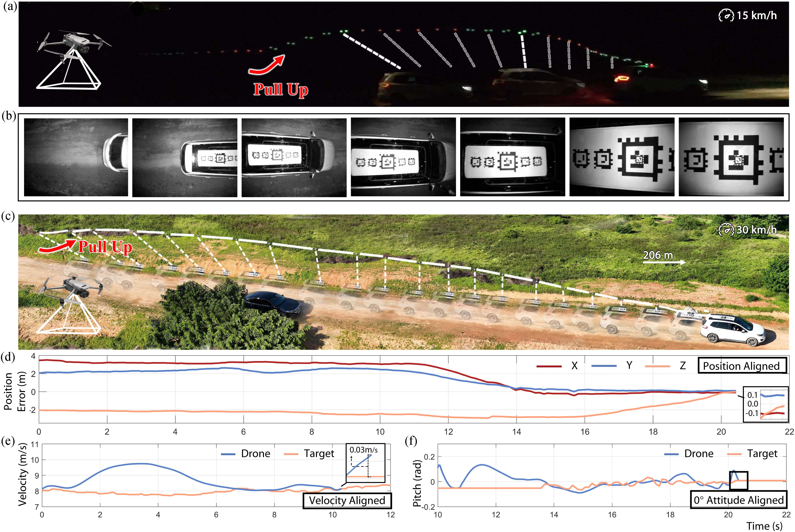

**图 20**：15 km/h 夜间跟踪与水平停泊，以及 30 km/h 高速跟踪与水平停泊；图中给出位置误差、速度和姿态变化。

## 原文第 19 页核心内容与翻译

高速试验中，SUV 速度为 30 km/h（8.3 m/s），无人机最高速度约 10 m/s，最终 $x-y$ 平面停泊误差为 10.7 cm。误差主要来自目标估计、检测和系统链路延迟以及轨迹跟踪误差；风和地效由积分控制抵消。车辆颠簸会使停泊表面姿态变化，但无人机通过连续观测和重规划保持末端姿态对齐。

大姿态试验中，SUV 后备箱设置 60° 倾斜平面。无人机在 3.0–5.7 s 内尽量将标签保持在图像中心，角速度和推力均处于动力学可行范围内。

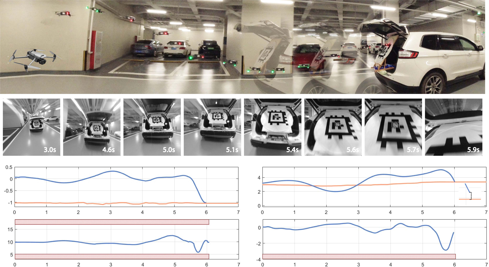

**图 21**：大姿态动态跟踪与停泊试验。车辆速度约 3.5 m/s，停泊表面倾斜 60°；图中给出全过程、相机图像、俯仰角、速度、推力和角速度。

### 结论

本文围绕动态场景中的跟踪和停泊，分别设计可见性、安全性和动力学可行性指标，并根据目标状态变化调整无人机终端状态。高频时空 $SE(3)$ 轨迹优化能够生成可执行的跟踪和停泊轨迹。仿真、消融试验和商用无人机实车试验共同验证了该方法的有效性。

## 原文第 20 页核心内容与翻译

### 参考文献

参考文献按英文原文保留，以便核对作者、题名、期刊、卷期、页码和 DOI 信息。

## 原文第 21 页核心内容与翻译

### 作者简介

作者简介按英文原文保留。该部分属于论文出版信息，不属于研究正文。
