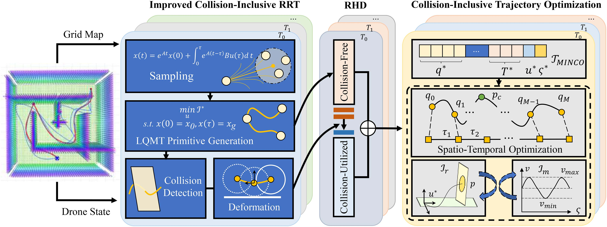
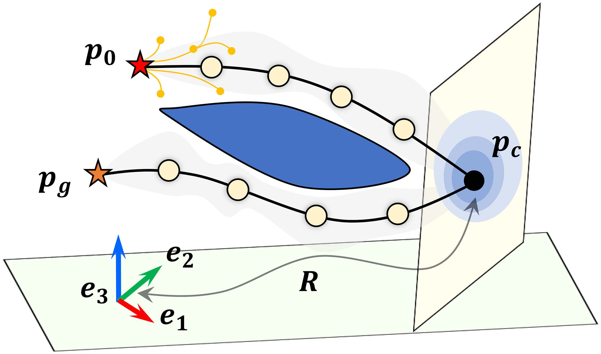
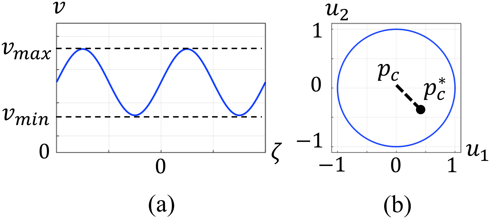
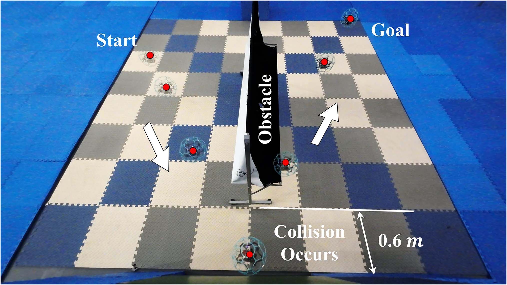
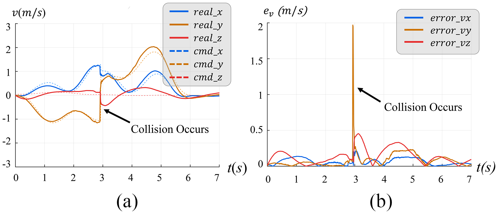
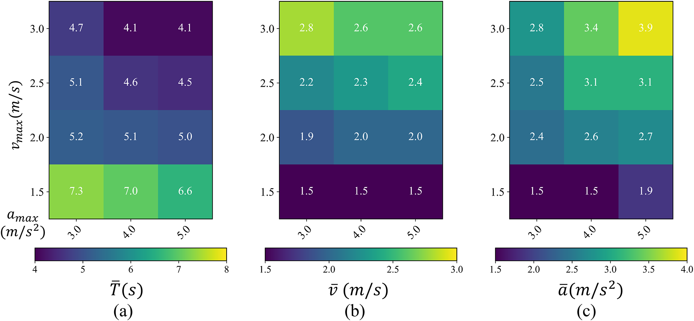
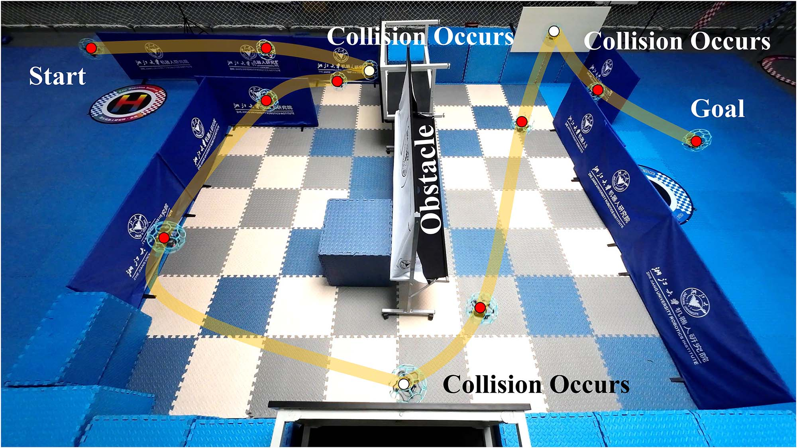
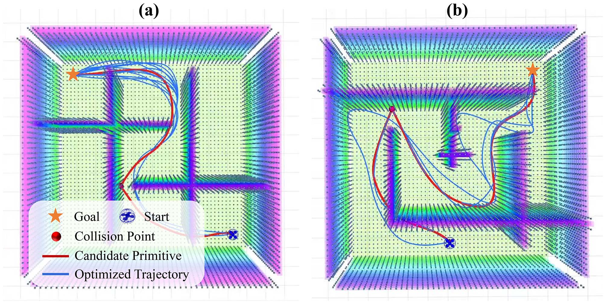
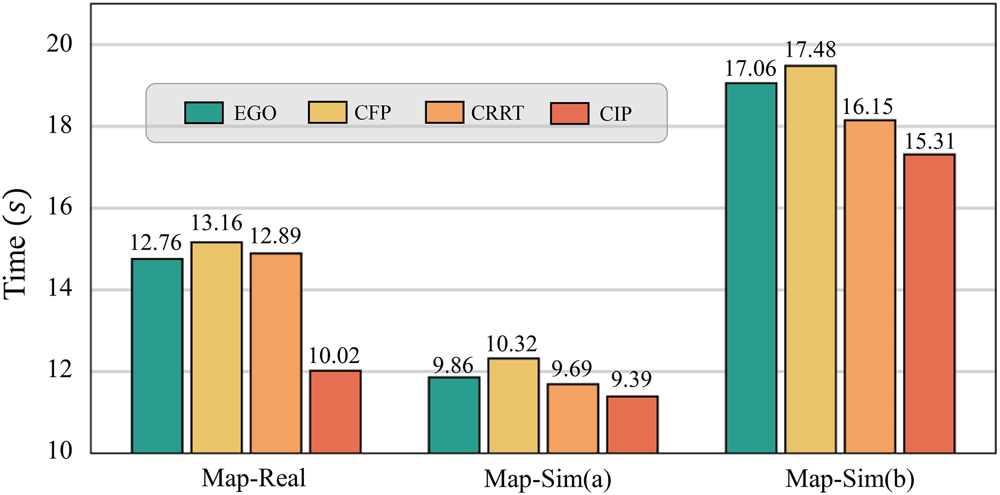

# 包含碰撞的高动态机动运动规划

> **原文标题**：Aggressive Collision-Inclusive Motion Planning  
> **作者**：Huan Yu, Chuanqi Hu, Jin Wang, Guodong Lu, Jie Tu, Zhi Zheng, Jingjing Li, and Fei Gao  
> **发表信息**：IEEE/ASME TRANSACTIONS ON MECHATRONICS, VOL. 30, NO. 2, APRIL 2025  
> **原文 PDF**：[Aggressive Collision-Inclusive Motion Planning.pdf](../Aggressive%20Collision-Inclusive%20Motion%20Planning.pdf) ｜ **对应中文详解**：[04_包含碰撞的高动态机动运动规划.md](../中文详解/04_包含碰撞的高动态机动运动规划.md)

## 原文第 1 页

### 摘要

传统无人机系统通常把避碰作为运动规划的基本原则。然而，在一些狭窄场景中，碰撞可能无法避免；如果加以规划，碰撞还可以缩短任务时间并降低能量消耗。本文研究如何在高动态运动规划中主动、合理地利用碰撞。为生成利用碰撞的高动态运动基元，本文设计了一种基于采样的前端方法，即改进的包含碰撞快速探索随机树（ICRRT），用于求解线性二次最短时间问题。与传统方法不同，ICRRT 在检测到碰撞时使运动基元发生变形，而不是直接丢弃。

为获得更合适的碰撞动作，本文构造了包含碰撞的轨迹优化方法，核心是机动性约束和碰撞松弛约束，并提出相应的约束消除与转写方法以加快求解。最终，带约束的轨迹优化被转化为无约束优化问题，求解时间可控制在 6 ms 以内。为了决定是否实施碰撞，本文提出滚动时域决策策略，在每个时域内比较利用碰撞和避开碰撞的轨迹，并选择时间代价较小者。整个系统能够权衡碰撞风险和收益，自主决定是否以及如何利用碰撞。实验验证了方法的有效性、任务能力、先进性和鲁棒性，说明有策略地利用碰撞可以提高无人机在狭窄环境中的机动能力，并为运动规划提供新的思路。

**关键词**：自主机器人；决策；无人机；运动规划。

### 一、引言

近年来，无人机在未知环境中的自主导航技术发展迅速，并得到广泛应用。如何保证飞行过程中的避碰一直是一个难题。已有工作[1]在自主避障运动规划方面取得了部分进展，但并不能保证所有场景都能成功。因此，近年来出现了能够承受碰撞的无人机结构[2]–[5]。这带来了一个新的问题：是否可以主动利用潜在碰撞，而不只是设法完全避开碰撞？

事实表明，碰撞可以用于感知[6]、定位[7]、[8]、建图[3]、[9]和控制[10]、[11]。本文从一个不同的角度研究无人机运动规划，即主动利用碰撞和反弹提高飞行的激进程度。激进飞行要求无人机保持较高速度，但传统规划器必须在避障和快速飞行之间折中：避障需要频繁减速和转向，快速飞行则要求尽量保持高速。自然界中的运动现象说明，主动接触障碍物有时反而有利于快速运动。例如，猴子在森林中穿行时会借助树干改变方向，利用碰撞和反弹增强运动效果，这在密集环境中尤其有效。受此启发，本文研究如何合理、主动地利用碰撞提高无人机的飞行机动性。

已有碰撞研究对这种快速运动优势利用不足。基于采样的方法[12]、[13]通常需要较长运行时间，效率不高；基于优化的方法[14]、[15]常常固定已发现的碰撞点，分别优化碰撞前后的轨迹，而不再寻找更好的碰撞动作。另一些方法[16]、[17]依赖带有大型传感器和专用安装结构的平台，难以推广到一般无人机。

---

## 原文第 2 页

**图 1**：本文提出的包含碰撞高动态规划器总体框架。

现有研究还缺少同时兼顾快速性、效率、最优性和通用性的完整运动规划系统，也没有解决无人机是否应主动碰撞或避开障碍物的自主决策问题。为此，本文提出统一的包含碰撞规划（CIP）框架，由前端基于采样的运动基元生成器和后端轨迹优化器组成。前端以动力学快速探索随机树 RRT* [24] 为基础，在规划无碰撞轨迹的同时，通过求解线性二次最短时间问题（LQMT）保留可利用碰撞的运动基元，并设计碰撞检测和基元变形方法。

后端明确建立包含碰撞的轨迹优化问题，设计碰撞松弛约束和机动性约束。前者允许在碰撞点附近继续搜索更合适的位置，后者限制碰撞时的速度范围，以提高快速飞行能力。优化中还加入轨迹平滑性、动力学可行性和自由空间避障约束，并通过约束转写与消除，将带约束优化转化为无约束优化问题。将利用碰撞和无碰撞两类规划器结合后，本文提出滚动时域决策（RHD）策略，决定每段轨迹是否利用碰撞。

主要贡献如下：1）提出 ICRRT，通过碰撞检测和运动基元变形保留对碰撞的主动利用；2）提出包含碰撞的轨迹优化方法，在 6 ms 内搜索更合适的碰撞动作；3）设计 RHD 策略决定是否实施碰撞，并集成为统一 CIP 系统；4）通过大量实验验证系统的有效性、能力、先进性和鲁棒性。

### 二、相关工作

#### A. 包含碰撞的机器人导航

无人机主动利用碰撞带来了一些新的应用。一个重要方向是利用碰撞增强感知。[7]利用碰撞信息增强视觉惯性里程计（VIO），提高状态估计精度，并使用贝叶斯优化自动调整参数。放弃视觉传感器后，[6]提出基于接触的惯性里程计（CIO），利用碰撞估计的环境外力检测碰撞，并生成无人机速度的伪测量，使无人机能够在粉尘、雾气或缺少视觉、激光特征的环境中自主飞行。

在环境建图方面，Mulgaonkar 等人[3]设计了可承受碰撞的微型无人机群，通过多次碰撞并对概率密度分布进行统计建模来建立障碍物地图。[8]提出碰撞辅助的反弹可见性图，用于评估清扫机器人任务的可行性。Mayya 等人[9]设计小型机器人集群，利用机器人之间的碰撞传递二进制信息，并通过概率计算实现定位。

---

## 原文第 3 页

另一类应用是提高飞行稳定性。Petris 等人[10]在刚性抗碰撞机架周围安装弹性翼，使无人机能够通过感知碰撞在狭窄环境中平稳飞行。[5]将霍尔传感器集成到无人机机臂中，用于检测碰撞并在撞击后迅速恢复控制。Khedekar 等人[11]设计“滑移模式”和“飞行侧翻模式”，扩展无人机接近墙面时的控制方式。上述研究说明，主动利用碰撞能够为自主导航系统提供帮助。

#### B. 包含碰撞的运动规划

与无障碍物运动规划不同，利用碰撞可以扩大机器人的可行状态空间，并可能降低转向、加速度或时间代价。[14]、[18]讨论利用碰撞寻找最优路径的方法，用整数变量对碰撞建模和优化，并通过实验验证。但这些方法主要用于决定是否碰撞，没有充分利用碰撞本身。[15]证明了碰撞在随机最优操纵问题中的作用。[13]进一步采用采样方法，设计同时平衡最短路径、碰撞避免和碰撞利用的代价函数。[12]利用运动基元和碰撞检测构造简单有效的规划器。采样方法依赖较长运行时间，计算时间和内存消耗较大。Lu 等人[16]、[17]评估碰撞后状态并重新规划轨迹，但固定已发现的碰撞动作，难以得到真正最优的碰撞动作，而且通常依赖专用车辆，难以迁移到一般空中机器人。

#### C. 无碰撞运动规划

无碰撞运动规划大体分为基于图搜索、基于采样和基于优化三类。基于图的方法将状态到状态的运动基元[19]作为连通图[20]中的边，并通过启发式搜索寻找最优路径[21]，但对可行解空间探索不足。基于采样的方法在连续状态空间中采样并搜索可行解。RRT [22]是经典方法，但轨迹质量依赖较长运行时间。基于优化的方法可以处理复杂约束；MINCO [26]将时间和空间参数解耦，以线性复杂度进行时空优化。本文以后端 MINCO 为轨迹表示，以 ICRRT 为前端，通过后端优化器获得较优解。

---

## 原文第 4 页

### 三、改进的包含碰撞快速探索随机树

ICRRT 是运动规划系统中的基于采样的运动基元生成器。它在保证平滑性的同时考虑快速飞行能力，直接在栅格地图上进行碰撞检测，并同时维护利用碰撞和无碰撞两类基元。

#### A. 问题建模与总体概述

利用四旋翼的微分平坦性，可用链式积分器的线性模型表示无人机运动状态。轨迹规划建模为 LQMT 问题：

$$\min_{u(t)}J=\int_0^\tau\left(\rho+\frac12u(t)^2\right)dt,$$
$$Ax(t)+Bu(t)-\dot x(t)=0,\quad x(0)=x_{start},\quad x(\tau)=x_{goal},$$
$$G(x(t),u(t))\preceq0,\quad t\in[0,\tau].$$

其中第一式权衡控制能量和时间，ρ 是时间正则化权重；最后一式表示碰撞避免和动力学可行性约束。本文 n=2，控制输入为加速度，状态由位置和速度组成。算法先进行范围随机采样，计算采样点到当前点的 LQMT 代价，选择代价最低的点连接新点，再检查碰撞并更新两棵 KD 树。发生碰撞时，根据碰撞动力学生成碰撞后的基元；若总轨迹代价降低，则重新连接节点。

**算法 1：改进的包含碰撞 RRT。** 输入起始状态、目标状态和地图；输出无碰撞路径 $T_f$ 与利用碰撞路径 $T_c$。循环执行采样、寻找后向邻点、连接最佳父节点、碰撞检测和基元重连；检测到碰撞时进行基元变形并保存碰撞前后基元。

#### B. LQMT 运动基元生成

给定时间 T，控制最优轨迹为：

$$p^*(t)=\frac{\alpha}{120}t^5+\frac{\beta}{24}t^4+\frac{\gamma}{6}t^3+\frac{a_0}{2}t^2+v_0t+p_0.$$

系数由初、末状态边界条件求得。将系数代入代价函数，再令 $\partial J^*/\partial T=0$ 求最优时间，可使用 Sturm 定理和数值优化方法求根。若最大速度超过约束，就增加 T 并重新求解，直到满足动力学约束。

---

## 原文第 5 页

**算法 2：迭代有界 LQMT 运动基元生成。** 令 $T=\|s_g-s_0\|/v_{max}$，重复增加 $\Delta T$，求解 LQMT 并评估最大速度，直到 $v^\circ_{max}-v_{max}<0$，返回 $p^*(t)$。

利用解析形式按小时间间隔遍历轨迹，检查离散点是否落入点云占用栅格。检测到碰撞时，取占用栅格中心为碰撞点 $p_0$，在半径 r 内搜索邻域，并利用 RANSAC [30] 对周围点云拟合碰撞平面。该平面由归一化方向向量 $n_v$ 和碰撞点 $p_0$ 确定。

将碰撞点状态作为碰撞前状态 $x_c^- =\{p^-,\dot p^-,\ddot p^-\}$。为避免过大加速度使四旋翼轨迹跟踪不稳定，令碰撞点处 $\ddot p_0=0$，重新计算碰撞前基元，同时保持碰撞位置不变。碰撞后的速度分解为切向和法向分量：

$$\dot p_n^+=-e\dot p_n^-,\qquad \dot p_t^+=\dot p_t^-+\kappa(-e-1)\arctan\left(\frac{\dot p_t^-}{\dot p_n^-}\right)\dot p_n^-.$$

其中 e 为恢复系数，κ 为损失系数，通过多次轨迹跟踪实验确定。得到碰撞后状态后，对剩余时间进行前向积分，求解碰撞后的 LQMT 基元，最后把原基元变形为碰撞前、碰撞后两个基元并保存。

---

## 原文第 6 页

### 四、包含碰撞的轨迹优化

#### A. 轨迹表示

本文使用 MINCO 对初始轨迹重新参数化。它通过中间航路点 $q$ 和相邻航路点之间的时间间隔 $T$，以线性复杂度得到多项式系数 $c$：

$$T_{MINCO}=\{p(t):[0,T]\to\mathbb R^m\mid c=M(q,T),\ q\in\mathbb R^{m(M-1)},\ T\in\mathbb R^M_{>0}\}.$$

这种表示便于调整轨迹的空间和时间，也便于施加具有明确物理意义的约束。前端生成的基元按时间均匀取点，作为后续优化的初始轨迹。

#### B. 问题建模

为得到最优碰撞动作，本文同时优化碰撞前后的轨迹：

$$\min_{c,T}\sum_k\left(\int_0^{T_k}\|p_k^{(s)}(t)\|^2dt+\rho T_k\right).$$

约束包括初始和末端状态、碰撞前后连续性、速度和加速度等动力学约束、障碍物安全距离、碰撞速度机动性，以及碰撞点在初始碰撞点附近的松弛约束。k=0 表示碰撞前轨迹，k=1 表示碰撞后轨迹。

**图 2**：从起点 $p_0$ 到目标 $p_g$ 的轨迹优化过程，允许在前端得到的碰撞点 $p_c$ 附近进一步优化碰撞位置。

#### C. 时空无约束优化

连续时间约束和末端约束高度非凸、非线性，直接求解困难。因此将控制能量、时间、动力学可行性、避障、碰撞机动性和碰撞松弛分别写成代价或罚函数的加权和。MINCO 消除状态连续性等式约束；令 $T_i=e^{\tau_i}$ 消除时间为正的约束；对连续时间约束采用梯形积分离散为有限罚函数。速度、加速度超过上限以及航路点距障碍物不足时分别施加罚函数。

---

## 原文第 7 页

**图 3**：约束变量的变换曲线：（a）机动性约束；（b）碰撞松弛约束。

#### D. 机动性约束消除

在碰撞后的短时间区间内计算位置。当时间足够小时，速度方向可近似为碰撞方向 $n_c$，原来对两个速度分量的约束可简化为：

$$v_{min}\le v_c\le v_{max}.$$

令 $v_m=(v_{max}+v_{min})/2$、$v_r=(v_{max}-v_{min})/2$，用正弦映射表示碰撞速度：

$$v_c=(v_r\sin\zeta+v_m)n_c.$$

实际设置 $v_{min}=3v_{max}/4$，优化变量改为 ζ，机动性约束由参数化方式自动满足。

#### E. 碰撞松弛约束转写

在碰撞平面上建立基 $B=(e_1,e_2)$，碰撞位置写为：

$$p_c=RBr u+p_0,$$

其中 R 是世界坐标系到碰撞平面坐标系的旋转矩阵，r 是松弛距离上限，$p_0$ 是前端生成的碰撞点，$u\in\mathbb R^2$ 是缩放变量。只要满足：

$$f(u)=1-\|u\|\ge0,$$

就能保证优化后的碰撞点距离初始点不超过 r。本文用罚函数处理该约束，最终将问题转化为无约束优化问题，并用 L-BFGS [37] 求解。

### 五、RHD 决策策略

本文把前端基元分成时间步 $\{T_0,T_1,T_2,\ldots\}$，每个时间步只考虑有限时域，在利用碰撞基元 $T_u$ 和无碰撞基元 $T_f$ 之间选择：

$$\arg\min_{T\in\{T_u,T_f\}}T.$$

如果无碰撞轨迹时间代价更低，就不实施碰撞；决策在滚动时域内反复进行，并与前端、后端方法一起构成完整 CIP 系统。

---

## 原文第 8 页

### 六、实验

本文从有效性、能力、先进性和鲁棒性四个方面开展仿真与实物实验：比较无碰撞和利用碰撞的轨迹；改变速度和加速度约束评价系统能力；与 CRRT [12] 和 EGO [1] 比较；在大规模环境中验证鲁棒性。

本文制作了带弹性外壳和弹性缓冲件的球形四旋翼，机载计算单元为 Jetson Xavier NX。状态估计采用 Vicon 动捕系统定位信息和 PX4 飞控 IMU 数据，通过扩展卡尔曼滤波器融合；轨迹跟踪采用 SE(3) 级联 PID 控制器。

**图 4**：包含碰撞无人机的软件、硬件系统和实验设置。

**图 5**：简单实验场景。起点为 $p_0=(-1.2\,m,0.0\,m,1.0\,m)$，目标点为 $p_g=(1.5\,m,0.9\,m,1.0\,m)$；残影为每 0.8 s 记录一次的无人机位置。场景大小为 3 m×3 m，四旋翼穿过宽 0.6 m 的拐角到达目标点。

#### A. 碰撞有效性评估

本文在简单场景中比较 CIP 和无碰撞规划器 CFP。CFP 是忽略机动性、碰撞松弛约束的 CIP 退化版本。动力学约束设置为 $v_{max}=2\,m/s$、$a_{max}=3\,m/s^2$，真实场景中各执行 20 组轨迹，记录规划最大速度、最大加速度和执行时间。

**图 6**：利用碰撞轨迹与无碰撞轨迹的比较。（a）总体指标；（b）碰撞轨迹和无碰撞轨迹的加速度、速度。

**图 7**：期望速度与实际执行速度的比较。（a）速度值；（b）跟踪误差。

CIP 轨迹的最大速度和最大加速度更高，时间代价更低。与 CFP 相比，CIP 节省 58.2% 的时间，最大速度提高 23.2%，最大加速度提高 40.6%。碰撞瞬间速度跟踪误差会突然增大，随后趋于稳定，说明碰撞会暂时影响无人机稳定性，控制器和防护结构必须能够承受这种扰动。

---

## 原文第 9 页

#### B. 利用碰撞进行规划的能力

本文设置 12 组参数组合，$v_{max}=1.5、2.0、2.5、3.0\,m/s$，$a_{max}=3.0、4.0、5.0\,m/s^2$，每组测试 20 次。记录平均执行时间、规划最大速度和规划最大加速度。结果表明，提高速度和加速度约束通常会缩短执行时间。固定速度上限时，提高加速度上限对最大速度影响不明显；固定加速度上限时，放宽速度上限会明显改变最大速度。因此速度上限应选择合理范围，而加速度上限只需足够大。

#### C. 基准方法比较

本文将 CIP 与 CRRT [12] 和 EGO [1] 比较，选择 $v_{max}=2.0、2.5、3.0\,m/s$ 三组设置。CRRT 使用 1、3、5、8 s 四种采样时间；ICRRT 前端采样时间为 0.9 s，后端平均计算时间为 3.67 ms，100 次测试中最大计算时间不超过 6 ms，每组执行 20 次。

**图 8**：不同速度约束下 20 次实验平均值：（a）执行时间；（b）最大速度；（c）最大加速度。

**图 9**：EGO、CRRT 和 CIP 在不同速度下轨迹执行时间的箱线图，黑点表示平均值。

实验表明，CIP 的轨迹时间代价最低，快速飞行能力最强；箱体面积最小，说明优化更稳定、更容易收敛。CRRT-1s 的时间离群值最大，说明较短运行时间下更容易生成保守基元。随着速度上限提高，CIP 的优势更加明显。

---

## 原文第 10 页

#### D. 大规模部署

本文设计一个真实场景和两个仿真场景，如图 10、图 11 所示。每个场景设置 $v_{max}=2.5\,m/s$、$a_{max}=5\,m/s^2$，分别运行 EGO、CFP、CRRT（运行 8 s）和 CIP，每个实验重复 20 次。

**图 10**：鲁棒性实验的真实大规模场景，地图大小为 8 m×6 m；残影为每 1 s 记录一次的无人机位置。

**图 11**：鲁棒性实验的两个仿真大规模场景，地图大小均为 10 m×10 m。

由于采用 RHD，规划器能够依据时间代价，在多个狭窄转弯处自主决定利用碰撞。结果表明，CIP 执行时间最短，所有轨迹均成功从起点到达目标点，且没有违反约束，说明其在大规模场景中具有鲁棒性。

**图 12**：EGO、CFP、CRRT 和 CIP 在三个场景中的平均轨迹执行时间。

---

## 原文第 11 页

### 七、结论

本文提出包含碰撞的高动态运动规划系统 CIP，由改进的 CRRT、包含碰撞的轨迹优化器和 RHD 三个核心部分组成，并包含碰撞检测、LQMT 基元变形、机动性约束消除、碰撞松弛约束转写和基于时间代价的决策等模块。

四类实验结果表明：CIP 比 CFP 具有更高的最大速度和最大加速度以及更短的执行时间；速度约束对系统快速性的影响明显，而加速度约束影响较小；与 CRRT 和 EGO 相比，CIP 具有更短的轨迹执行时间和更高的优化稳定性；在真实场景和两个复杂仿真场景中，CIP 能够自主选择碰撞或避障，并在不违反约束的情况下完成任务。

本文仍有局限。碰撞期间跟踪误差会增大，需要更强的控制器提高稳定性；碰撞模型与真实物理过程之间也存在差异，尤其是非理想接触表面会影响模型准确性。后续工作将研究非理想环境适应、面向实际部署的定位系统、新型碰撞感知传感器以及自适应稳定控制方法。

### 参考文献

参考文献按原文保留：

[1] X. Zhou, Z. Wang, H. Ye, C. Xu, and F. Gao, “EGO-Planner: An ESDF-Free gradient-based local planner for quadrotors,” IEEE Robot. Automat. Lett., vol. 6, no. 2, pp. 478–485, Apr. 2021.

[2] A. Briod et al., “A collision-resilient flying robot,” J. Field Robot., vol. 31, no. 4, pp. 469–509, Jul. 2014.

[3] Y. Mulgaonkar, A. Makineni, L. Guerrero-Bonilla, and V. Kumar, “Robust aerial robot swarms without collision avoidance,” IEEE Robot. Automat. Lett., vol. 3, no. 1, pp. 596–603, Jan. 2018.

[4] J. Zha, X. Wu, J. Kroeger, N. Perez, and M. W. Mueller, “A collision-resilient aerial vehicle with icosahedron tensegrity structure,” in Proc. IEEE/RSJ Int. Conf. Intell. Robots Syst., 2020, pp. 1407–1412.

[5] Z. Liu and K. Karydis, “Toward Impact-resilient Quadrotor Design, Collision Characterization and Recovery Control to Sustain Flight after Collisions,” in Proc. IEEE Int. Conf. Robot. Automat., 2021, pp. 183–189.

[6] T. Lew et al., “Contact inertial odometry: Collisions are your friends,” in Proc. Int. Symp., 2019, pp. 938–958.

[7] Y. Mulgaonkar et al., “The Tiercel: A novel autonomous micro aerial vehicle that can map the environment by flying into obstacles,” in Proc. IEEE Int. Conf. Robot. Automat., 2020, pp. 7448–7454.

[8] A. Q. Nilles, Y. Ren, I. Becerra, and S. M. LaValle, “A visibility-based approach to computing non-deterministic bouncing strategies,” Int. J. Robot. Res., vol. 40, no. 10–11, pp. 1196–1211, Sep. 2021.

[9] S. Mayya, P. Pierpaoli, G. Nair, and M. Egerstedt, “Localization in densely packed swarms using interrobot collisions as a sensing modality,” IEEE Trans. Robot., vol. 35, no. 1, pp. 21–34, Feb. 2019.

[10] P. D. Petris, H. Nguyen, M. Kulkarni, F. Mascarich, and K. Alexis, “Resilient Collision-tolerant Navigation in Confined Environments,” in Proc. IEEE Int. Conf. Robot. Automat., 2021, pp. 2286–2292.

[11] N. Khedekar, F. Mascarich, C. Papachristos, T. Dang, and K. Alexis, “Contact-based Navigation Path Planning for Aerial Robots,” in Proc. IEEE Int. Conf. Robot. Automat., 2019, pp. 4161–4167.

[12] J. Zha and M. W. Mueller, “Exploiting collisions for sampling-based multicopter motion planning,” in Proc. IEEE Int. Conf. Robot. Automat., 2021, pp. 7943–7949.

[13] Z. Lu, Z. Liu, G. J. Correa, and K. Karydis, “Motion planning for collision-resilient mobile robots in obstacle-cluttered unknown environments with risk reward trade-offs,” in Proc. IEEE/RSJ Int. Conf. Intell. Robots Syst., 2020, pp. 7064–7070.

[14] M. Mote et al., “Collision-inclusive trajectory optimization for free-flying spacecraft,” J. Guid. Control Dyn., vol. 43, no. 7, pp. 1247–1258, Mar. 2020.

[15] Z. Lu and K. Karydis, “Optimal Steering of Stochastic Mobile Robots that Undergo Collisions with their Environment,” in Proc. IEEE Int. Conf. Robot. Biomimetics, 2019, pp. 668–675.

[16] Z. Lu, Z. Liu, and K. Karydis, “Deformation recovery control and post-impact trajectory replanning for collision-resilient mobile Robots,” in Proc. IEEE/RSJ Int. Conf. Intell. Robots Syst., 2021, pp. 2030–2037.

[17] Z. Lu, Z. Liu, M. Campbell, and K. Karydis, “Online search-based collision-inclusive motion planning and control for impact-resilient mobile robots,” IEEE Trans. Robot., vol. 39, no. 2, pp. 1029–1049, Apr. 2023.

[18] M. Mote, J. P. Afman, and E. Feron, “Robotic trajectory planning through collisional interaction,” in Proc. IEEE 56th Annu. Conf. Decis. Control, 2017, pp. 1144–1149.

[19] M. W. Mueller, M. Hehn, and R. D’Andrea, “A Computationally Efficient Motion Primitive for Quadrocopter Trajectory Generation,” IEEE Trans. Robot., vol. 31, no. 6, pp. 1294–1310, Dec. 2015.

[20] P. E. Hart, N. J. Nilsson, and B. Raphael, “A formal basis for the heuristic determination of minimum cost paths,” IEEE Trans. Syst. Cybern., vol. 4, no. 2, pp. 100–107, Jul. 1968.

[21] D. Dolgov, S. Thrun, M. Montemerlo, and J. Diebel, “Path Planning for autonomous vehicles in unknown semi-structured Environments,” Int. J. Robot. Res., vol. 29, no. 5, pp. 485–501, 2010.

[22] S. M. LaValle, “Rapidly-exploring random trees: A new tool for path planning,” Res. Rep., Computer Science Dept., Iowa State University, Tech. Rep. TR 98-11, Oct. 1998.

[23] H. Ye, C. Xu, and F. Gao, “STD-Trees: Spatio-temporal deformable trees for multirotors kinodynamic planning,” in Proc. IEEE Int. Conf. Robot. Automat., 2023, pp. 1200–1206.

[24] D. J. Webb and J. van den Berg, “Kinodynamic RRT*: Asymptotically optimal motion planning for robots with linear dynamics,” in Proc. IEEE Int. Conf. Robot. Automat., 2013, pp. 5054–5061.

[25] F. Gao, L. Wang, B. Zhou, X. Zhou, J. Pan, and S. Shen, “Teach-Repeat-Replan: A complete and robust system for aggressive flight in complex environments,” IEEE Trans. Robot., vol. 36, no. 5, pp. 1526–1545, Oct. 2020.

[26] Z. Wang, X. Zhou, C. Xu, and F. Gao, “Geometrically constrained trajectory optimization for multicopters,” IEEE Trans. Robot., vol. 38, no. 5, pp. 3259–3278, Oct. 2022.

[27] D. Mellinger and V. Kumar, “Minimum snap trajectory generation and control for quadrotors,” in Proc. IEEE Int. Conf. Robot. Automat., 2011, pp. 2520–2525.

[28] J. L. Bentley, “K-D trees for semidynamic point sets,” in Proc. 6th Annu. Symp. Comput. Geom., 1990, pp. 187–197.

[29] H. M. Edwards, “A generalized Sturm theorem,” Ann. Math., vol. 80, no. 1, pp. 22–57, Jul. 1964.

[30] O. Chum and J. Matas, “Optimal Randomized RANSAC,” IEEE Trans. Pattern Anal. Mach. Intell., vol. 30, no. 8, pp. 1472–1482, Aug. 2008.

[31] L. S. Jennings and K. L. Teo, “A computational algorithm for functional inequality constrained optimization problems,” Automatica, vol. 26, no. 2, pp. 371–375, 1990.

[32] W. H. Press et al., Numerical Recipes 3rd edition: The Art of Scientific Computing. U.K.: Cambridge Univ. Press, 2007.

[33] H. Yu et al., “Catch planner: Catching high-speed targets in the flight,” IEEE/ASME Trans. Mechatronics, vol. 28, no. 4, pp. 2387–2398, Jul. 2023.

[34] H. Yu et al., “Bat Planner: Aggressive Flying Ball Player,” IEEE Robot. Automat. Lett., vol. 8, no. 9, pp. 5307–5314, Sep. 2023.

[35] X. Zhou et al., “Swarm of micro flying robots in the wild,” Sci. Robot., vol. 7, no. 66, 2022, Art. no. eabm5954.

[36] K. L. Teo, V. Rehbock, and L. S. Jennings, “A new computational algorithm for functional inequality constrained optimization problems,” Automatica, vol. 29, no. 3, pp. 789–792, 1993.

[37] D. C. Liu and J. Nocedal, “On the limited memory BFGS method for large scale optimization,” Math. Prog., vol. 45, no. 1, pp. 503–528, 1989.

[38] Z. Zhou, G. Wang, J. Sun, J. Wang, and J. Chen, “Efficient and robust time-optimal trajectory planning and control for agile quadrotor flight,” IEEE Robot. Automat. Lett., vol. 8, no. 12, pp. 7913–7920, Dec. 2023.

## 原文第 12 页

作者简介按原文保留。Huan Yu、Chuanqi Hu、Jin Wang、Guodong Lu、Jie Tu、Zhi Zheng、Jingjing Li 和 Fei Gao 的姓名、机构、学位、研究方向、获奖情况及编辑职务信息见原文 PDF。作者信息中的姓名、机构名称、学位名称、算法缩写和期刊名称保留英文。
