# 非结构化环境下自动驾驶车辆高效时空轨迹规划器

> **英文题目**：An Efficient Spatial-Temporal Trajectory Planner for Autonomous Vehicles in Unstructured Environments  
> **作者**：Zhichao Han, Yuwei Wu, Tong Li, Lu Zhang, Liuao Pei, Long Xu, Chengyang Li, Changjia Ma, Chao Xu, Shaojie Shen, Fei Gao  
> **来源**：IEEE TRANSACTIONS ON INTELLIGENT TRANSPORTATION SYSTEMS, VOL. 25, NO. 2, FEBRUARY 2024  
> **原文 PDF**：[An Efficient Spatial-Temporal Trajectory Planner for Autonomous Vehicles in Unstructured Environments.pdf](../中文详解/PDF/05_非结构化环境下自动驾驶车辆高效时空轨迹规划器.pdf) ｜ **对应中文详解**：[05_非结构化环境下自动驾驶车辆高效时空轨迹规划器.md](../中文详解/05_非结构化环境下自动驾驶车辆高效时空轨迹规划器.md)

---

## 原文第 1 页核心内容与翻译

### 摘要

运动规划是自动驾驶系统的基础组成部分，已经受到学术界和工业界的广泛关注。本文研究在非结构化环境中，如何利用车辆形状的紧凑凸近似，高效地完成时空联合最优轨迹优化。传统方法通常在状态配置空间中离散运动过程，并把任务建模为最优控制问题。为了生成高质量轨迹，往往必须对动力学过程进行高精度离散，这会带来很大的计算负担。

为解决这一问题，本文利用车辆类机器人的微分平坦特性简化轨迹表示，并用平坦输出建立紧凑的时空联合优化问题，同时保证非完整动力学约束下的可执行性。对于静态障碍物，本文采用无碰撞行驶走廊；对于动态障碍物，本文采用带符号距离近似，从而实现高效避障。与多种先进方法的基准比较表明，所提出方法在计算效率和轨迹质量方面具有明显优势，真实环境实验也验证了其实用性。作者同时公开了实现代码，供研究社区使用。

**关键词**：自动驾驶车辆；运动规划；轨迹优化；避碰。

### 一、引言

近年来，自动驾驶因具有广泛的社会价值而成为研究热点。复杂、高动态环境对稳健且无碰撞的运动规划提出了很高要求；在车载计算能力有限的情况下，规划器还必须足够轻量，能够快速响应动态和非结构化环境。自动驾驶运动规划的目标，是在受约束环境中生成舒适、低能耗且符合车辆物理特性的轨迹，使车辆到达指定终态，同时满足无碰撞和速度要求。

经典轨迹规划方法大致分为基于采样的方法和基于优化的方法。基于采样的方法在离散状态空间中生成样本，再根据代价函数评价样本并选择路径。基于优化的方法则把轨迹规划写成优化问题，利用梯度数值求解器寻找最优解。基于采样的方法具有理论上的分辨率完备性，能够探索整个状态空间，但通常需要较大的计算量。因此，本文重点研究基于优化的方法，使轨迹能够在连续空间中充分变形，并高效收敛到高质量的局部最优解。

然而，在任意复杂场景中在线生成可执行且高质量的轨迹仍然困难，主要包括三方面：非完整动力学约束、精确避障，以及轨迹质量与计算效率之间的矛盾。自动驾驶车辆不能像全向机器人一样任意平移，规划时必须满足非完整约束；把车辆近似成一个或多个圆会缩小可行空间，直接使用完整几何形状又会增加计算量；把空间路径和时间速度分开优化会损失时空耦合场景中的可行解，而时空联合优化又更难实时求解。

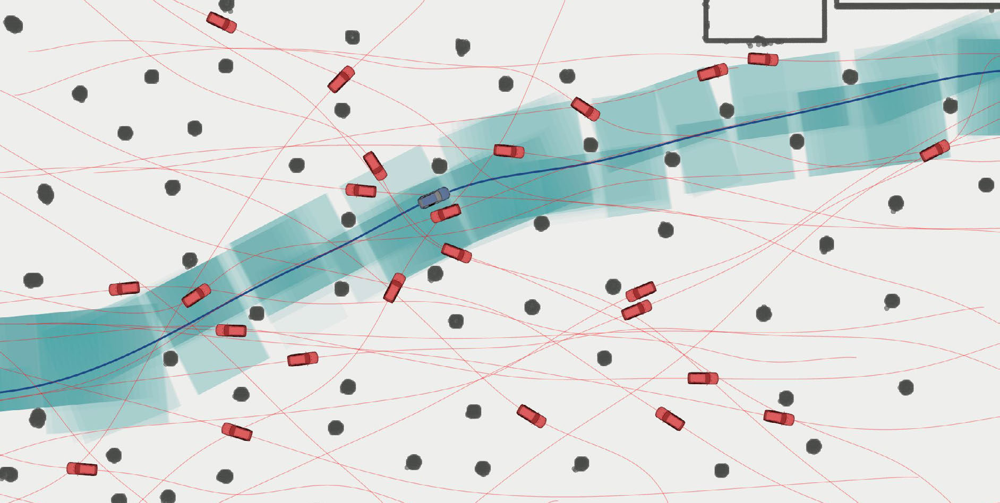

**图 1**：两幅图展示了本文规划器在高动态环境中的能力。由于采用全尺寸障碍物避让，车辆能够在其他运动物体附近的狭窄区域内通过，同时保证不发生碰撞。

本文提出一种基于车辆形状紧凑凸近似的高效、通用时空轨迹规划方案。在平坦空间中用分段多项式参数化轨迹，再重构轨迹表示以消除等式约束并简化优化问题；所有可行性约束均以重构后优化变量的解析形式表示，并推导从约束、高阶状态、平坦输出、多项式表示到最终优化变量的完整梯度传播链。车辆前进和倒车的连接位置称为换挡点（GSP），本文提出换挡点优化（GSPO），在不增加约束的情况下优化换挡位置和方向。静态障碍物用无碰撞几何空间建模，动态障碍物依据车辆与其他运动物体之间的带符号距离进行避让。

本文的主要贡献是：提出适用于类车辆机器人的统一时空联合轨迹规划形式；将原始约束优化改写为可有效求解的无约束问题，并用 GSPO 处理前进和倒车切换；通过仿真对比和真实车辆实验验证效率、轨迹质量和工程可用性，并公开规划算法代码。

---

## 原文第 2 页核心内容与翻译

### 二、相关工作

#### A. 车辆轨迹生成

基于采样和搜索的方法便于加入用户定义目标，广泛用于机器人运动规划。基于栅格的方法把连续状态空间离散成栅格图；安全时间区间路径规划（SIPP）及其变体把时间空间分解为适合动态避障的安全时间区间，再使用 Dijkstra 或 A* 获得轨迹。已有研究在 SIPP 中加入多目标搜索或动力学约束，以提高实用性和完备性。

以快速探索随机树（RRT）为代表的概率规划器从起点扩展状态树，在非凸空间中寻找可行路径。这类方法能够避免局部极小值，但需要在离散状态空间中采样，在计算量和轨迹质量之间存在矛盾。为符合运动模型，往往还要在高维空间采样，容易产生组合数量快速增长的问题；要获得理论最优性，通常需要高分辨率和大量样本。

另一些方法把轨迹的空间形状和动力学速度曲线分开处理。CES 通过固定每轮路径长度消除曲率约束的非凸性，把问题转化为二次约束二次规划；但路径长度一致的假设并不总成立，可能使曲率约束失效。DL-IAPS 使用双循环迭代锚定路径平滑和序列凸优化生成平滑路径，但效率高度依赖 Hybrid A* 提供的初始路径。

模型预测控制（MPC）方法把轨迹规划写成最优控制问题，再离散为非线性规划问题，可以方便地加入动力学和无碰撞约束。但由于轨迹由离散状态表示，在受限环境中保证约束往往需要增加状态密度，实时性能会下降。

深度神经网络也已用于运动规划，例如用环境网络提取特征，再由规划网络输出候选状态；或者用预先规划的最优泊车轨迹训练网络，学习状态与控制动作之间的关系。学习方法在特定任务中有效，但对未知场景的鲁棒性有限，通常需要高性能 GPU，且可解释性不足、需要大量数据实现泛化。

#### B. 避障问题建模

自车和障碍物的几何建模方式直接决定无碰撞约束的复杂度。用两个圆覆盖车辆，再将车辆简化为两个点，虽然能使约束维度与障碍物数量无关，但没有充分利用可行空间，在复杂环境中往往过于保守。

OBCA 假设障碍物为凸形，引入对偶变量，把机器人与障碍物之间的距离改写成连续可微形式；H-OBCA 再将其用于 MPC。对偶变量虽然提高了表达精度，但会增加问题维度，而且数量随障碍物增加，在密集环境中会造成较大的计算和内存开销。本文在连续空间中进行时空联合优化，同时保证完整车辆形状的避障，从而降低计算量并提高对非结构化环境的适应能力。

---

## 原文第 3 页核心内容与翻译

### 三、时空轨迹规划

本节建立时空联合优化形式，依次介绍完整规划流程、类车辆机器人的微分平坦模型、同时考虑舒适性、执行时间和可行性约束的轨迹优化问题，以及用于数值优化的梯度传播链。

### A. 规划流程

本文采用分层结构：前端负责提供初始猜测，后端负责优化。前端使用轻量级 Hybrid A* 寻找无碰撞路径，再交给本文规划器优化。扩展状态时，尝试用 Reed-Shepp 曲线直接连接终态，以便尽早结束搜索。对于自动泊车等任务，前端输出常包含前进和倒车，本文假设车辆在换挡位置完全停止，分别用分段多项式表示前进段和倒车段。各段运动方向由前端结果确定，并在后端优化前固定。

### B. 微分平坦车辆模型

本文在笛卡尔坐标系中使用简化运动学自行车模型描述四轮车辆，假设车辆前轮驱动和转向，车轮纯滚动且不侧滑，如图 2 所示。状态向量为

$$\mathbf{x}=(p_x,p_y,\theta,v,a_t,a_n,\phi,\kappa)^T,$$

其中，\(\mathbf p=(p_x,p_y)^T\) 是后轮中心位置，\(v\) 是车体坐标系中的纵向速度，\(a_t\) 和 \(a_n\) 分别是切向和法向加速度，\(\phi\) 是前轮转角，\(\kappa\) 是轨迹瞬时曲率。

选择平坦输出 \(\boldsymbol\sigma=(\sigma_x,\sigma_y)^T\)，其物理意义是后轮中心位置。引入 \(\eta\in\{-1,1\}\) 表示倒车和前进。其他状态量由平坦输出及其有限阶导数表示：

$$v=\eta\sqrt{\dot\sigma_x^2+\dot\sigma_y^2},$$
$$\theta=\operatorname{arctan2}(\eta\dot\sigma_y,\eta\dot\sigma_x),$$
$$a_t=\eta\frac{\dot\sigma_x\ddot\sigma_x+\dot\sigma_y\ddot\sigma_y}{\sqrt{\dot\sigma_x^2+\dot\sigma_y^2}},$$
$$a_n=\eta\frac{\dot\sigma_x\ddot\sigma_y-\dot\sigma_y\ddot\sigma_x}{\sqrt{\dot\sigma_x^2+\dot\sigma_y^2}},$$
$$\phi=\arctan\left(\eta\frac{(\dot\sigma_x\ddot\sigma_y-\dot\sigma_y\ddot\sigma_x)L}{(\dot\sigma_x^2+\dot\sigma_y^2)^{3/2}}\right),$$
$$\kappa=\eta\frac{\dot\sigma_x\ddot\sigma_y-\dot\sigma_y\ddot\sigma_x}{(\dot\sigma_x^2+\dot\sigma_y^2)^{3/2}}.$$

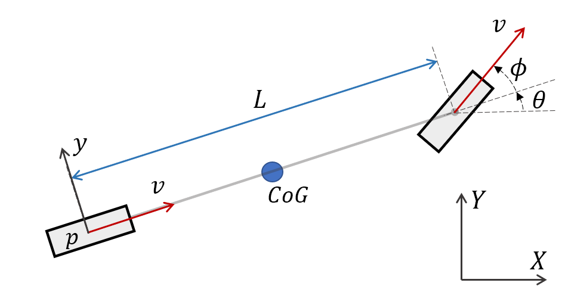

**图 2**：运动学自行车模型。

---

## 原文第 4 页核心内容与翻译

### C. 优化问题建模

第 \(i\) 个轨迹段由二维、时间均匀的 \(M_i\) 段多项式组成，次数为 \(N=2s-1\)。第 \(j\) 段为

$$\boldsymbol\sigma_{i,j}(t)=\mathbf c_{i,j}^T\boldsymbol\beta(t),\qquad \boldsymbol\beta(t)=(1,t,t^2,\ldots,t^N)^T.$$

其中 \(\delta T_i\) 是小段时间，\(T_i=M_i\delta T_i\) 是第 \(i\) 段总时间，全部轨迹段拼接后的总时间为 \(T_s=\sum_iT_i\)。以多项式系数和各段时间为变量，本文最小化控制努力和总时间：

$$\min_{\mathbf c,\mathbf T}J(\mathbf c,\mathbf T)=\int_0^{T_s}\boldsymbol\mu(t)^TW\boldsymbol\mu(t)\,dt+w_TT_s,$$
$$\boldsymbol\mu(t)=\boldsymbol\sigma^{[s]}(t).$$

同时满足初始、终止和换挡点状态，各小段连接处的连续性，\(T_i>0\)，以及速度、加速度、曲率、静态避障和动态避障约束。本文取 \(s=3\)，即最小化加加速度积分，以改善乘坐舒适性。

### D. 梯度推导

连续时间约束可以分解到每个分段多项式，并在每段均匀设置 \(\lambda\) 个约束点。对每个约束点的梯度，按链式法则依次经过多项式系数、平坦输出各阶导数、相对时间和绝对时间，最终传到优化变量。因此，动力学和避障约束都能使用解析梯度进行优化。

---

## 原文第 5 页核心内容与翻译

### 四、瞬时状态约束

#### A. 动力学可行性

车辆纵向速度必须处于合理范围。速度约束和梯度为

$$G_v(\dot{\boldsymbol\sigma})=\dot{\boldsymbol\sigma}^T\dot{\boldsymbol\sigma}-v_m^2,$$
$$\frac{\partial G_v}{\partial\dot{\boldsymbol\sigma}}=2\dot{\boldsymbol\sigma}.$$

为防止轮胎因摩擦限制而打滑，切向和法向加速度分别限制为

$$G_{a_t}=\frac{(\ddot{\boldsymbol\sigma}^T\dot{\boldsymbol\sigma})^2}{\dot{\boldsymbol\sigma}^T\dot{\boldsymbol\sigma}}-a_{tm}^2,$$
$$G_{a_n}=\frac{(\ddot{\boldsymbol\sigma}^TB\dot{\boldsymbol\sigma})^2}{\dot{\boldsymbol\sigma}^T\dot{\boldsymbol\sigma}}-a_{nm}^2,$$

其中 \(B=\begin{bmatrix}0&-1\\1&0\end{bmatrix}\)。前轮转角通过曲率约束实现：

$$G_\kappa=\left(\frac{\ddot{\boldsymbol\sigma}^TB\dot{\boldsymbol\sigma}}{\|\dot{\boldsymbol\sigma}\|_2^3}\right)^2-\kappa_m^2.$$

#### B. 静态障碍物规避

本文提取无碰撞空间，构造由凸多边形组成的行驶走廊。车辆完整形状用凸多边形 \(E\) 表示，顶点为

$$E=\{\mathbf v_e\in\mathbb R^2:\mathbf v_e=\boldsymbol\sigma+R\mathbf l_e,\ e=1,\ldots,n_e\}.$$

走廊多边形采用 H 表示：\(P^H=\{\mathbf q\in\mathbb R^2:A\mathbf q\le b\}\)。车辆完整形状位于走廊内的充要条件，是所有顶点均位于每个边界超平面的内侧：

$$A_z^T(\boldsymbol\sigma+R\mathbf l_e)\le b_z.$$

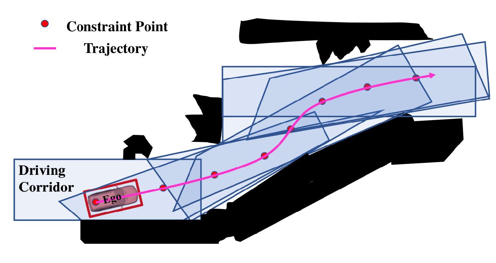

**图 3**：行驶走廊示意图。凸多边形在每个约束点包含自车完整形状；选择合适的轨迹分辨率，可以实际保证静态无碰撞。

---

## 原文第 6 页核心内容与翻译

### 五、动态障碍物规避

两个凸集合之间的普通距离由使其分离所需的最小平移量定义；集合重叠时普通距离为零，因此引入穿透深度并定义带符号距离：

$$\operatorname{sd}(E,O)=\operatorname{dist}(E,O)-\operatorname{pen}(E,O).$$

本文借助 Minkowski 差集把两个集合之间的距离转化为原点与差集之间的距离：

$$A-B=\{a-b:a\in A,b\in B\},$$
$$\operatorname{sd}(E,O)=\operatorname{sd}(0,O-E).$$

对于凸多边形，只需检查各顶点与超平面，即可得到适合优化的距离下界。在二维平面中，超平面退化为由两个顶点确定的直线。自车多边形边界的法向量和边界常数为

$$H_e=B\frac{\mathbf v_{e+1}-\mathbf v_e}{\|\mathbf v_{e+1}-\mathbf v_e\|_2},\qquad h_e=H_e^T\mathbf v_e.$$

其中顶点按顺时针排列，且 \(\mathbf v_{n_e+1}=\mathbf v_1\)。动态障碍物顶点由其位置、姿态和车体坐标系顶点变换得到。

---

## 原文第 7 页核心内容与翻译

动态障碍物的运动轨迹由感知模块预测并输入规划器，感知本身不属于本文研究范围。对自车轨迹约束点，规划器使用动态障碍物在同一时间戳的预测位置。设安全距离为 \(d_m\)，约束为

$$G_{2u}(\boldsymbol\sigma,\dot{\boldsymbol\sigma},\hat t)=d_m-U(E(\boldsymbol\sigma,\dot{\boldsymbol\sigma}),O_u(\hat t)).$$

利用 Minkowski 差集得到的距离下界，可把约束写成顶点和超平面距离的最大值、最小值组合。为消除不可微的最大值和最小值，使用

$$\operatorname{lse}_\alpha(\boldsymbol\gamma)=\alpha^{-1}\log\left(\sum_\omega\exp(\alpha r_\omega)\right).$$

当 \(\alpha>0\) 时近似最大值，当 \(\alpha<0\) 时近似最小值。本文设置 \(\alpha=100\) 近似最大值，设置 \(\alpha=-100\) 平滑最小值。

**图 4**：凸集合 \(E\) 与 \(O\) 之间带符号距离下界的计算示意。先用集合与超平面之间带符号距离的最大值近似集合间距离，再利用凸性转化为顶点到超平面的距离，从而得到可解析计算的结果。

---

## 原文第 8 页核心内容与翻译

### 六、轨迹优化问题的重新建模

本文分析边界条件、连续性、换挡状态和时间正性约束，并将原问题改写为无约束优化问题。采用离散时间求和惩罚项：

$$S_6(\mathbf c,\mathbf T)=\sum_{d\in D}w_d\sum_i\sum_j\sum_kP_{d,i,j,k},$$
$$P_{d,i,j,k}=\frac{\delta T_i}{\lambda}\bar\omega_kL_1(G_{d,i,j,k}).$$

其中 \(\bar\omega_k\) 是梯形积分系数，\(L_1\) 是保证惩罚项连续可微且非负的一阶松弛函数，分界点为 \(a_0=10^{-4}\)。这样，连续时间约束转化为允许误差范围内的离散惩罚。

分段多项式在连接点满足高阶连续性。根据最小控制努力问题的最优性条件，可以把参数空间由多项式系数和时间改写为路径点和时间，使连续性约束自然满足。对于换挡点，本文将位置 \(\mathbf p_i^g\) 和换挡前速度 \(\mathbf v_i^g\) 作为自由变量：

$$\boldsymbol\sigma_i(T_i)=\boldsymbol\sigma_{i+1}(0)=\mathbf p_i^g,$$
$$\boldsymbol\sigma_i^{(1)}(T_i)=-\boldsymbol\sigma_{i+1}^{(1)}(0)=\mathbf v_i^g,$$
$$\boldsymbol\sigma_i^{(2)}(T_i)=\boldsymbol\sigma_{i+1}^{(2)}(0)=0.$$

换挡前后速度方向相反，速度大小固定为很小的非零值，以防止奇异性。通过带状线性方程将多项式系数表示为路径点、换挡点状态和时间的函数，就能消除等式约束，这构成 GSPO 的核心。

---

## 原文第 9 页核心内容与翻译

以极坐标表示换挡前速度：

$$\mathbf v_i^g=(\bar v\cos\theta_i^g,\bar v\sin\theta_i^g)^T.$$

这样速度大小约束自动满足，只需优化换挡方向。再引入虚拟时间变量 \(\tau_i\)，通过微分同胚映射保证实际时间为正：

$$T_i=\begin{cases}\frac12\tau_i^2+\tau_i+1,&\tau_i>0,\\2\tau_i^2-2\tau_i+2,&\tau_i\le0.\end{cases}$$

最终以路径点、虚拟时间、换挡位置和换挡方向作为无约束变量，使用有限内存 BFGS 拟牛顿法求解。由于约束和梯度均以解析形式给出，规划器不需要高维对偶变量。

---

## 原文第 10 页核心内容与翻译

### 七、实验评估

本文在仿真和真实环境中进行评估。前进和倒车换挡时速度大小固定为 \(\bar v=0.05\,\mathrm{m/s}\)。该变化很小，对控制的影响可以忽略，后续跟踪实验验证了轨迹的动力学可执行性。

### A. 基准测试

仿真实验在 Ubuntu 18.04 台式机上进行，处理器为 Intel Core i7-10700，显卡为 GeForce RTX 2060，仿真器为 CARLA。对比方法包括 OBTPAP、DL-IAPS+PJSO、H-OBCA 和 Timed Elastic Bands（TEB）。所有方法使用自行车模型，以 C++14 实现，不使用并行加速；OBTPAP 和 H-OBCA 使用 IPOPT，DL-IAPS+PJSO 使用 OSQP，TEB 使用 G2o。

所有规划器均使用 Hybrid A* 提供粗略初始轨迹。本文方法、OBTPAP、DL-IAPS+PJSO 和 TEB 使用全局点云构造无碰撞约束；H-OBCA 使用人工提取的凸多边形。收敛条件、动力学约束和自车尺寸等参数保持一致。实验改变障碍物数量和起终点距离，并随机生成起点和终点。使用 MPC 跟踪规划轨迹，记录平均加速度、平均加加速度、平均跟踪误差和平均规划时间。

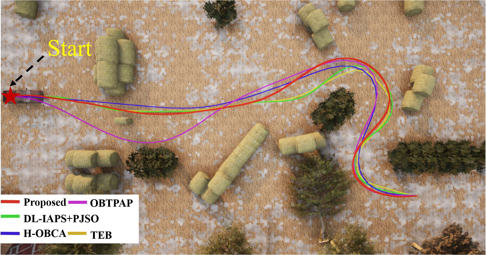

**图 5**：轨迹及跟踪误差可视化。上图展示不同规划轨迹，下图统计各轨迹执行期间的跟踪误差。

结果表明，本文方法具有较低的跟踪误差、加速度和加加速度，并且规划时间相对其他方法具有数量级优势。高阶连续轨迹更接近真实物理运动，也更容易由底层控制器执行。H-OBCA 能生成高质量轨迹，但对偶变量造成的计算负担使其在密集环境中难以满足实时要求。

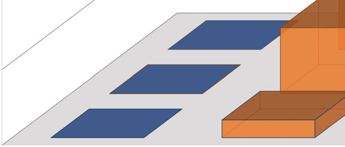

**图 6**：不同情形下的规划时间效率对比，纵轴采用对数刻度。

---

## 原文第 11 页核心内容与翻译

### B. 动态障碍物规避

本文在 \(210\,\mathrm m\times50\,\mathrm m\) 的动态非结构化环境中验证规划器。自车需要避开静态障碍物和由另外 8 辆车辆组成的交通流。感知不是本文重点，环境信息和其他车辆轨迹均已知。所有车辆最大速度为 \(10\,\mathrm{m/s}\)。图中车辆和轨迹颜色表示时间，自车与其他运动物体在时空上没有交叉，满足动态无碰撞要求。

完整物体形状建模使自车能够利用安全空间通过狭窄区域。自车轨迹长度为 260 m，计算时间仅为 0.18 s，说明该规划器适合复杂动态环境中的长距离全局轨迹生成。

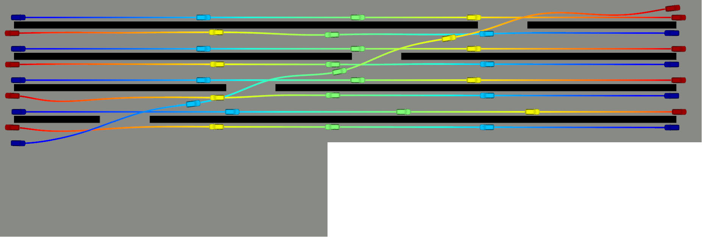

**图 7**：动态环境中的运动可视化，颜色表示时间戳。

### C. 消融实验

为评估 GSPO，本文在有无 GSPO 两种情况下进行对比。实验设置多个不同终点，每条轨迹包含多次前进和倒车。两种情形使用相同目标函数，时间权重 \(w_T=10\)，并记录每次规划时间。时间减少率为

$$\frac{t_{\mathrm{withoutGSPO}}-t_{\mathrm{withGSPO}}}{t_{\mathrm{withoutGSPO}}},$$

轨迹质量改进率为

$$\frac{J_{\mathrm{withoutGSPO}}-J_{\mathrm{withGSPO}}}{J_{\mathrm{withoutGSPO}}}.$$

结果表明，GSPO 能够显著改善轨迹质量并减少计算时间，因为它增加了轨迹优化自由度，降低了对初始值的依赖。

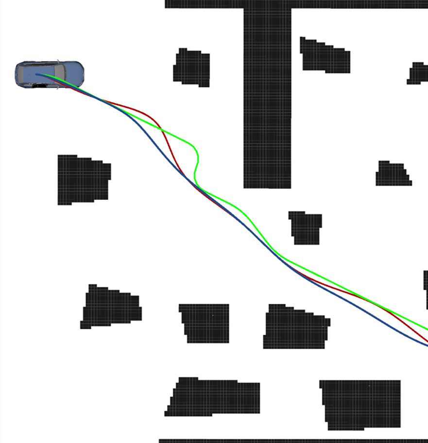

**图 8**：有无 GSPO 时的轨迹对比。没有 GSPO 时，规划自由度受限，可能生成不理想的前后往复弯曲轨迹；有 GSPO 时，轨迹损失更低。

---

## 原文第 12 页核心内容与翻译

### D. 真实环境实验

实验场地是约 \(40\,\mathrm m\times20\,\mathrm m\) 的室外复杂停车场。车辆从初始状态出发，绕过障碍物，最后以人工指定的航向角倒车进入停车位，整条路线约 42 m。

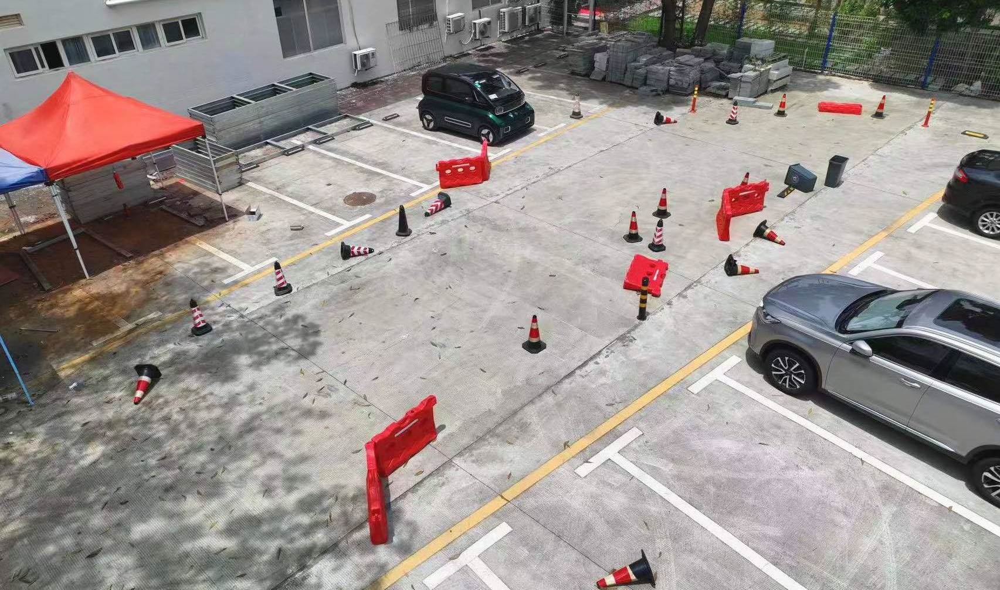

**图 9**：真实环境实验场地。

实验平台为上汽通用五菱宝骏 E300，尺寸为 \(2.9\,\mathrm m\times1.7\,\mathrm m\times1.6\,\mathrm m\)，轴距 2 m，不配备 GPS。平台装有 1 个双目相机、4 个鱼眼相机和 12 个超声波传感器，用于实时定位、控制和数据记录；实验没有使用高精度激光雷达或精确外部定位系统。

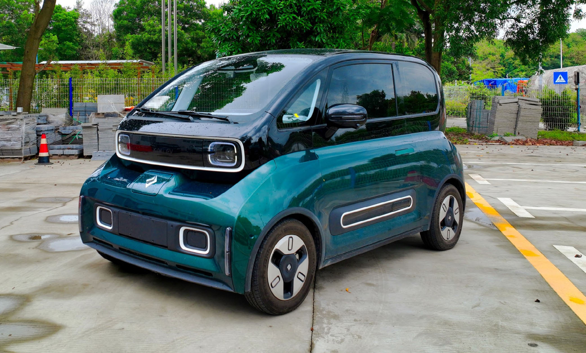

**图 10**：真实环境实验平台。

---

## 原文第 13 页核心内容与翻译

所有模块均以 C++ 实现，部署在采用 QNX 操作系统的 TI TDA4 芯片上。为应对实际控制和定位误差，规划时将车辆形状向外扩展 0.25 m。最大前进速度和倒车速度分别为 2 m/s 和 0.5 m/s，时间权重 \(w_T=50\)。

车辆沿规划轨迹绕过障碍物，最后以用户给定航向角倒车进入停车位。动态评价指标汇总在表 III 中；车辆在未超出动力学限制的情况下保持较高速度，同时保持较低加加速度，以保证乘坐舒适性。更多演示见补充材料。

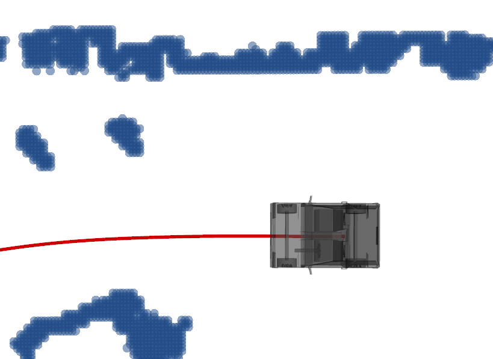

**图 11**：真实环境实验中的自车运动图，红色曲线为执行轨迹。

---

## 原文第 14 页核心内容与翻译

### 八、结论

本文提出一种基于微分平坦特性的高效时空最优规划系统。轨迹表示具有高阶连续性，不对运动过程进行离散，能够更好地逼近真实运动；与点质量模型不同，本文使用凸近似表示避障约束，保证充分利用可行空间；同时针对换挡点进行状态优化，提高对初始值的鲁棒性。

仿真表明，本文方法在保持较低跟踪误差的同时具有较高效率，生成的轨迹足够平滑，可以由底层控制器良好执行；真实车辆实验也验证了其有效性。未来工作包括扩展到多机器人和其他运动模型，并研究上坡、下坡等复杂地形中的运动规划。

---

## 原文第 15 页核心内容与翻译

### 附录：不确定性下的运动实验

本文在 \(50\,\mathrm m\times10\,\mathrm m\) 的未知环境中评估不确定性对自主导航的影响。机器人尺寸为 \(0.8\,\mathrm m\times0.5\,\mathrm m\)，配备感知距离可达 10 m 的全向雷达。规划器输出轨迹后，使用 MPC 控制器跟踪。

带噪声的运动学模型为

$$\dot{\mathbf x}=f(\mathbf x,\mathbf u,\mathbf n),$$
$$\mathbf x=[p_x,p_y,v,\phi,\theta]^T,\qquad \mathbf u=[a,\omega]^T.$$

状态转移函数为

$$f(\mathbf x,\mathbf u,\mathbf n)=q(\mathbf x,\mathbf u)+N(\mathbf x,\mathbf u,\mathbf n),$$
$$q(\mathbf x,\mathbf u)=[v\cos\theta,v\sin\theta,a,\omega,v\tan\phi/L_w]^T.$$

其中，\([p_x,p_y]\) 是后轮中心位置，\(v\) 是纵向速度，\(\phi\) 是转向角，\(\theta\) 是航向角，\(a\) 是纵向加速度，\(\omega\) 是转向角速度，\(L_w\) 是轴距。\(q\) 表示理论状态转移，\(N\) 表示与运动变化成比例的不确定性项，噪声强度由对角矩阵 \(\mathbf n\) 表示。

出现以下任一情况时重新规划：原轨迹与新检测障碍物发生碰撞，或跟踪误差超过 0.1 m。由第二种情况触发的次数记为 R.N。实验在控制器与执行器之间加入延迟，并按不确定性分为无、低、中、高四组，统计重新规划次数、平均跟踪误差、轨迹长度、平均加速度和平均转向角速度。

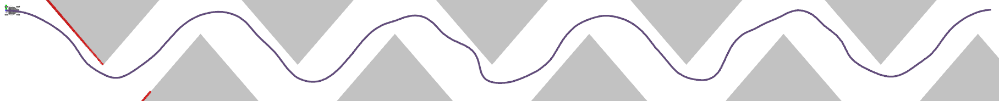

**图 12**：各情形下的运动轨迹，灰色区域表示障碍物。

不确定性增加会使跟踪误差增大、平均加速度和转向角速度增加、轨迹变长。依靠高频控制反馈和实时重新规划，机器人仍能在未知环境中保持适应能力；不确定性越大，因跟踪误差过大触发的重新规划次数越多。作者指出，在控制器和规划阶段显式考虑不确定性，能够进一步提高系统鲁棒性。

---

## 原文第 16 页核心内容与翻译

原文表 I 汇总不同问题规模下的动力学统计量，表 II 汇总有无 GSPO 的消融结果，表 III 汇总真实车辆实验的动态统计量，表 IV 汇总不同不确定性水平下的轨迹动力学统计量。M.A. 表示平均加速度，M.JK. 表示平均加加速度，M.TE. 表示平均跟踪误差，T.L. 表示轨迹长度，M.SR. 表示平均转向角速度，R.N. 表示重新规划次数。原文数值和单位以论文页面图像为准。

---

## 原文第 17 页核心内容与翻译

### 参考文献

参考文献 [1]–[53] 保留原文书目信息，以便检索和核对。作者、论文题目、期刊、会议、卷期、页码、年份和 DOI 不作翻译性改写。

## 原文第 18 页核心内容与翻译

参考文献 [54]–[59] 保留原文书目信息。

### 作者简介

Zhichao Han 于 2021 年获浙江大学自动化专业工学学士学位，目前在 Fei Gao 教授指导下于浙江大学 FAST 实验室攻读博士学位，研究方向包括运动规划和机器人学习。

Yuwei Wu 于 2019 年获北京交通大学交通工程专业工学学士学位，2022 年获宾夕法尼亚大学系统工程专业硕士学位，目前在 GRASP 实验室攻读电气与系统工程博士学位，研究方向为自主车辆系统运动规划。

Tong Li 于 2017 年和 2019 年分别获北京理工大学机械工程专业学士和硕士学位，后加入香港科技大学航空机器人团队，研究方向包括预测、决策和运动规划。

Lu Zhang 于 2015 年和 2018 年分别获北京理工大学自动化专业学士和硕士学位，研究方向包括决策、运动规划和运动预测。

Liuao Pei 于 2022 年获哈尔滨工业大学探测、制导与控制技术专业工学学士学位，目前在浙江大学控制科学与工程专业攻读硕士学位，研究方向包括自主导航和复杂环境运动规划。

Long Xu 于 2022 年获浙江大学自动化专业工学学士学位，目前攻读电子信息专业硕士学位，研究方向包括地面机器人、运动规划和机器人学习。

Chengyang Li 获南方科技大学计算机科学专业工学学士学位，目前在香港科技大学（广州）攻读硕士学位，研究方向包括机器人定位、建图和运动规划。

Changjia Ma 于 2021 年获哈尔滨工业大学电气工程及其自动化专业工学学士学位，目前在浙江大学控制科学与工程专业攻读硕士学位，研究方向为自主车辆运动规划和群体机器人。

Chao Xu 于 2010 年获 Lehigh University 机械工程博士学位，现为浙江大学控制科学与工程学院副院长、教授，同时担任浙江大学湖州研究院首任院长，研究方向为飞行机器人和控制理论学习。

Shaojie Shen 于 2009 年获香港科技大学电子工程专业工学学士学位，2011 年和 2014 年分别获宾夕法尼亚大学机器人学硕士学位和电气与系统工程博士学位，研究方向包括状态估计、传感器融合、计算机视觉、定位建图以及复杂环境自主导航。

Fei Gao 于 2019 年获香港科技大学电子与计算机工程博士学位，现为浙江大学控制科学与工程系终身轨副教授，负责 FAST 实验室 FAR 组，研究方向包括空中机器人、自主导航、运动规划、优化、定位与建图。
