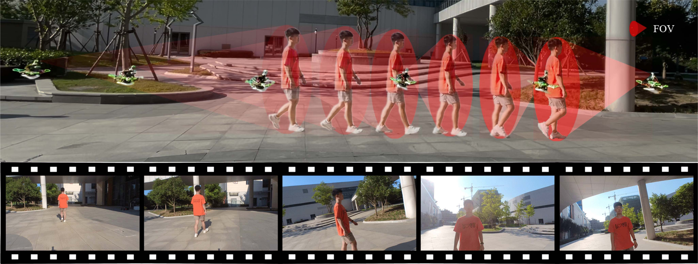
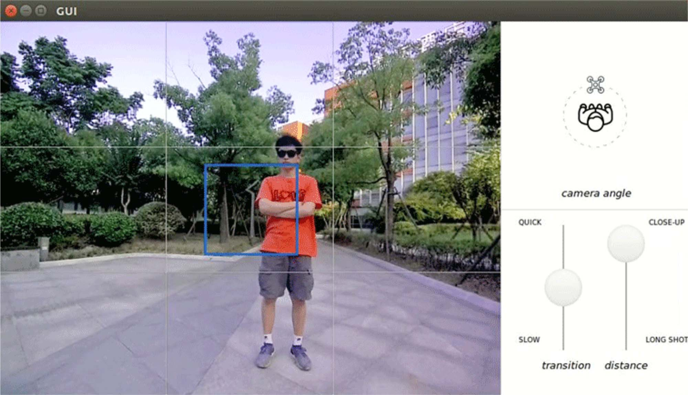
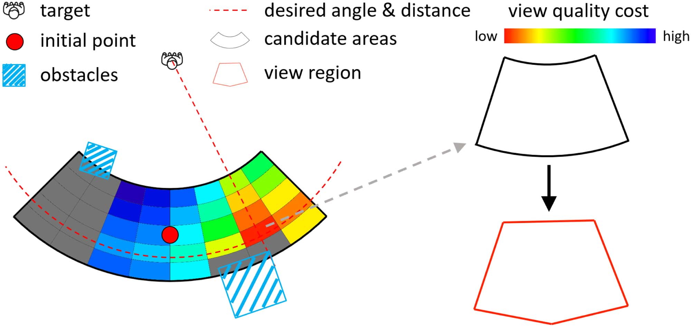
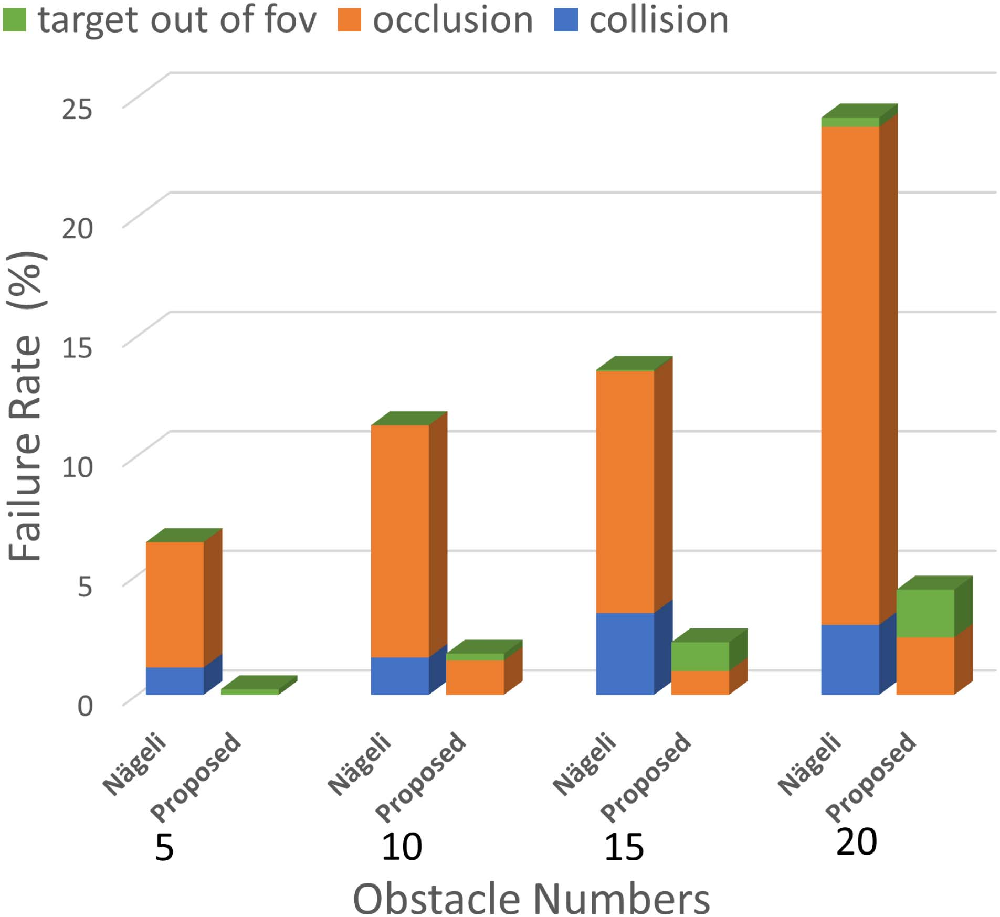
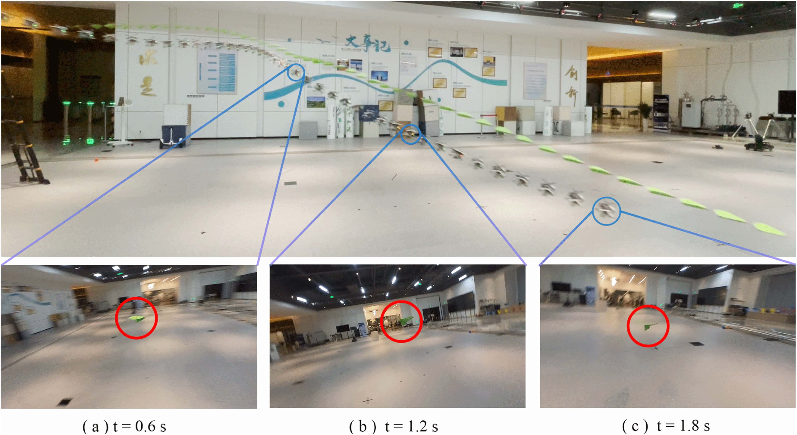
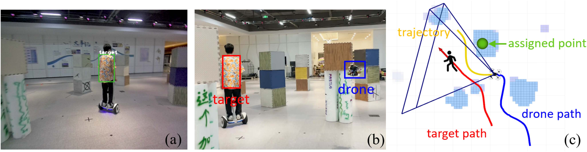
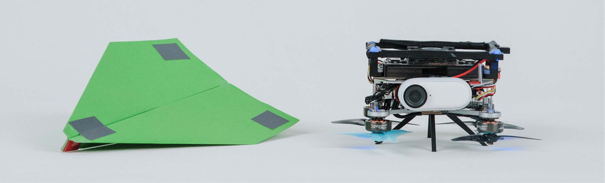
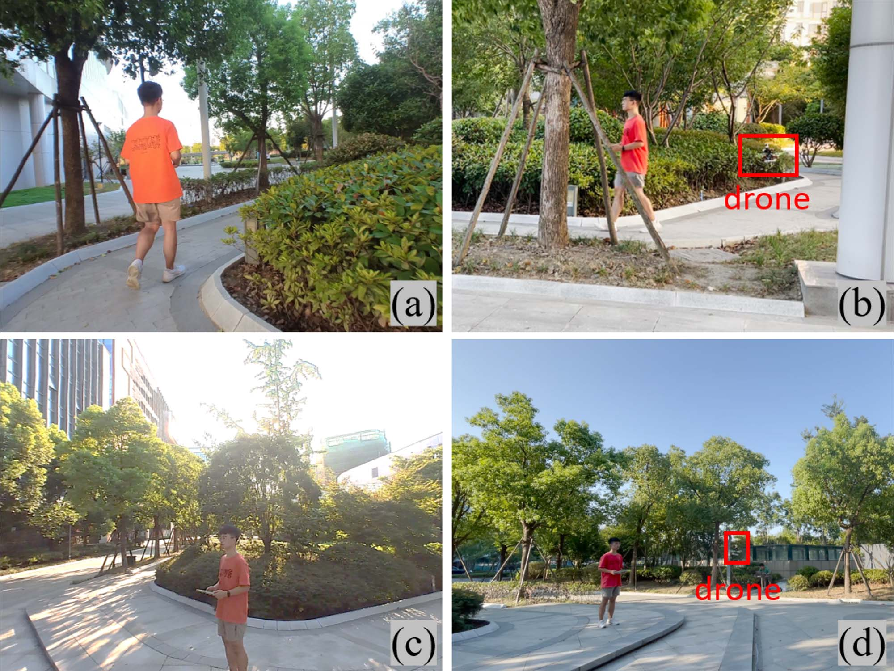

# Auto Filmer：人机交互下的自主空中影视拍摄

> **原文标题**：Auto Filmer: Autonomous Aerial Videography Under Human Interaction  
> **作者**：Zhiwei Zhang，Yuhang Zhong，Junlong Guo，Qianhao Wang，Chao Xu，Fei Gao  
> **发表信息**：IEEE Robotics and Automation Letters (RA-L), Vol. 8, No. 2, February 2023.  
> **原文 PDF**：[Auto Filmer Autonomous Aerial Videography Under Human Interaction.pdf](../Auto%20Filmer%20Autonomous%20Aerial%20Videography%20Under%20Human%20Interaction.pdf) ｜ **对应中文详解**：[06_Auto_Filmer人机交互下的自主空中影视拍摄.md](../中文详解/06_Auto_Filmer人机交互下的自主空中影视拍摄.md)

---

## 原文第 1 页核心内容与翻译

### Auto Filmer：人机交互下的自主空中影视拍摄

#### 摘要

随着无人机技术的发展，客户和导演已经能够从空中进行拍摄。然而，操控无人机围绕运动目标拍摄出符合要求的视频，仍然很难实现。本文提出一种融合定制化镜头需求与无人机动力学的自主空中影视拍摄系统。我们设计了一个便于操作的交互界面，使操作者能够实时创建所需镜头。随后，镜头信息被传递给动力学路径搜索过程，用于评估安全的拍摄路径。接着，系统构造可行区域和安全飞行走廊，以同时保证飞行安全和目标可见。最后，通过联合优化生成四旋翼和云台的轨迹，使画面保持所要求的构图。大量仿真和真实环境实验验证了所提方法的有效性，实验结果还见补充视频[1]。

**关键词**：空中系统：应用；面向人的运动规划；空中系统：感知与自主性。

### I. 引言

随着空中机器人技术不断进步，搭载相机的无人机已经能够从空中拍摄视频。空中影视拍摄[1]在电影制作、工业巡检等许多应用中具有重要意义。然而，人工操控无人机拍摄目标时容易出现失误。这是因为遥控器中不直观的操控方式通常对应空间中的直线运动，而影视拍摄中的一些典型运镜方式，例如环绕拍摄，在真实空间中对应的是非线性轨迹。当拍摄奔跑人员等运动场景时，任务还会更加困难。机器人既要持续跟踪目标，又要将机载相机的相对位姿转换为能够形成视频片段的运动。即使是专业操作者，也很难完成这种复杂运动。

近年来，视觉识别和运动规划技术的发展使无人机能够自主跟随并拍摄目标[1]–[3]。但是，已有工作大多忽略了摄影方面的要求，或者缺少与人的交互，因此距离完全按照用户要求生成空中视频仍有差距。

把拍摄需求转换为机器人运动，主要有两个困难。第一，机器人的运动受到空间条件限制，而人通常不能准确感知这些限制。摄影师和电影制作人员在安排画面时，更多关注镜头和构图，容易忽略周围环境，尤其是视野之外的区域。因此，用户可能给出物理上无法执行的拍摄指令，进而造成碰撞或遮挡。第二，四旋翼的运动可能破坏画面构图。无人机追踪目标时，机体姿态会发生变化，安装在机身上的相机也会不可避免地倾斜，从而使目标在图像中的投影出现抖动。安装稳定云台可以在一定程度上缓解这一问题，但如果没有无人机运动的先验信息，仅根据图像反馈控制云台有时仍会不稳定。

针对上述问题，本文提出 Auto Filmer，一套交互式影视拍摄系统。系统通过交互界面收集用户的拍摄要求，再根据界面实时发来的指令控制空中机器人拍摄目标。系统采用一种高效、稳健的规划方法，能够生成用于拍摄的连续运动轨迹。分层规划方案包括前端处理和后端轨迹优化两个部分。前端首先根据动力学模型搜索一系列连续点，生成初始路径；随后在路径周围构造称为可见区域的多面体区域。前端既保证无人机安全，又保证目标可见，同时满足影视拍摄要求。为了保持所需构图，本文进一步提出联合优化方法，同时生成四旋翼和云台的轨迹。由于规划器能够实时运行，用户提出的成像和拍摄要求可以及时转换为无人机与云台的运动，使用户能够通过系统获得所需的空中视频片段。仿真对比验证了本文方法相对于其他方法的优势，大量真实环境实验也证明了该方法的有效性。

论文信息：稿件于 2022 年 8 月 19 日收到，2022 年 12 月 5 日接收；2022 年 12 月 23 日发表，2022 年 12 月 31 日更新。本文得到中央高校基本科研业务费资助，Fei Gao 为通信作者。作者来自浙江大学工业控制技术国家重点实验室、控制科学与工程学院及浙江大学湖州研究院，Yuhang Zhong 同时来自南开大学人工智能学院。DOI：10.1109/LRA.2022.3231828。

---

## 原文第 2 页核心内容与翻译

**图 1**：真实环境影视拍摄实验示例。机器人需要生成环绕拍摄和接近拍摄镜头。上方的合成图展示四旋翼与人员的运动，下面的图像展示机载相机连续拍摄的画面。

本文的主要贡献如下：

1. 设计一套交互式系统，连接直观的拍摄规则与空中机器人的运动。
2. 提出一种新的规划前端，在满足拍摄要求的同时有效排除碰撞和遮挡。
3. 提出一种联合轨迹优化方法，在无人机和云台共同受到约束的情况下保持画面稳定。
4. 后续将公开系统代码[2]。

### II. 相关工作

已有一些自主空中摄影和影视拍摄研究通过设计交互工具来简化空中拍摄操作。一种典型交互方式是使用关键帧[4]–[7]：用户指定若干观察点，系统生成连接这些观察点的平滑过渡轨迹。关键帧方法的缺点是，生成的视频不能立即呈现给用户，因此关键帧可能需要反复调整，使用过程不够方便。为解决这一问题，一些实时交互设计允许用户直接操作无人机第一视角图像，并拍摄具有代表性的照片[8]、[9]。但这些工作大多忽略了碰撞问题，或者假定拍摄目标基本静止，因此不适合拍摄运动对象。

已有不少研究能够在复杂环境中跟随并拍摄运动目标。Jeon 等人[2]、[10]构造有向图，寻找安全且能够看见目标的路径，再根据该路径生成平滑轨迹。Wang 等人[11]总结了构成可见性条件的三个关键因素，并通过约束这些指标，使优化后的轨迹能够更加稳健地跟踪目标。Ji 等人[1]提出了一套高效流程，用于保证空中跟踪过程中的安全性和目标可见性。虽然这些方法能够让无人机保持目标在视野内，但忽略了画面构图和拍摄视角等影视美学原则，生成的视频可能无法满足摄影师的要求。

一些研究在实时跟踪规划器中加入了影视拍摄规则。Nägeli 等人[12]采用滚动时域方式优化用户指定的镜头配置，例如图像位置、目标尺寸和观察角度。但该方法把障碍物简化为椭球，因而不能直接用于非结构化环境。Bonatti 等人[3]通过深度强化学习网络选择最佳镜头类型，并优化安全、无遮挡的拍摄轨迹。但其云台控制依赖图像检测和跟踪，当无人机突然倾斜时容易失效。[13]和[14]分别规划云台控制，但假定加速度足够小，可以忽略无人机姿态变化。因此，在拍摄灵活运动目标时，画面仍可能出现抖动。

本文其余部分安排如下：第三节介绍系统设计，第四节介绍前端处理过程，第五节讨论轨迹优化过程，第六节将本文方法与其他工作进行比较，并给出真实环境实验结果。

### III. 前置条件

#### A. 影视拍摄交互

我们对镜头语言[15]进行分析后发现，影视拍摄原则主要由三个因素构成：镜头时长、拍摄视角和画面构图。此外，描述画面从一种模式切换到另一种模式速度的过渡时间，也会影响视频内容的表达方式。

---

## 原文第 3 页核心内容与翻译

**图 2**：用户界面截图。用户可以将左侧图像中的蓝色框拖到期望位置，将右上角的无人机图标拖到所需角度，并上下调整右下角的过渡时间和距离滑块，从而输入直观的影视拍摄指令。这些指令随后被转换为规划器所需的参数值。补充视频展示了具体交互过程。

1. 目标在图像中的位置，记为

$$P_{img}=\begin{bmatrix}U_{img}\\V_{img}\end{bmatrix} \tag{1}$$

以及目标在图像中的速度 \(\dot P_{img}\)。
2. 无人机与目标之间的相对角度 \(\Theta\)。
3. 相机与目标之间的距离 \(D\)。
4. 过渡时间 \(T\)。

我们实现了一个图形化界面（如图 2 所示），用来收集影视拍摄要求并将其传递给空中机器人。

在规划过程中，每一个时间戳都对应一组影视拍摄参数 \(S=\{P_{img},\dot P_{img},\Theta,D\}\)。具体而言，整个过程分为两个阶段。

1. **稳定阶段**：无人机保持固定的拍摄模式。\(P_{img}\)、\(\Theta\) 和 \(D\) 保持不变，\(\dot P_{img}\) 为零。
2. **过渡阶段**：画面从上一种构图切换到新指定的构图。在这一阶段，\(P_{img}\)、\(\Theta\) 和 \(D\) 随时间线性插值；\(\dot P_{img}\) 设为图像位移除以过渡时间得到的常数。

#### B. 硬件

本文基于[16]搭建空中影视拍摄平台。对于自主影视拍摄系统，视觉感知有两个基本功能：环境感知和目标跟踪。由于单个相机通常视场有限，无法同时完成这两项任务，因此无人机上分别安装两个相机。一个与机体刚性连接的深度相机用于建图，另一个单目相机用于拍摄视频和获取目标画面。云台只绕偏航方向旋转，用于控制单目相机的朝向。为了在动态约束下获得稳定画面，系统将云台运动与四旋翼状态联合规划。

### IV. 前端处理过程

所提出框架的前端为轨迹优化提供必要条件。首先，在动力学约束下搜索最符合影视拍摄要求的路径，也就是在动力学限制内寻找无碰撞运动。随后，为保持目标可见，沿初始路径构造称为可见区域的多面体。最后，构造安全飞行走廊，确保无人机飞行安全。

#### A. 动力学路径搜索

混合 A* 路径搜索最初用于自动驾驶车辆，之后被用于四旋翼[17]。算法把采样得到的机器人状态记录为节点。与 A* 搜索相同，每个节点都有代价函数 \(g(n)\)，用于计算从起点到该节点的代价；同时有启发函数 \(h(n)\)，用于估计到达终止条件仍需付出的代价。与寻找通往目标点的最短路径不同，本文的影视拍摄动力学搜索返回的是与给定影视拍摄参数差异最小的路径，目的是找到既安全、无遮挡，又靠近期望拍摄位置的路径。

规划器需要通过预测模块获得目标未来运动信息。预测模块可以采用运动模型，也可以采用深度学习网络；如何从历史观测预测目标不属于本文讨论范围。预测模块输出目标的预测位置、速度和对应时间戳：

$$\{\xi^n\in\mathbb R^3,\dot\xi^n\in\mathbb R^3,t_n\},\quad n=0,1,\ldots,N,\quad 0<t_n\le T_{pre}$$

其中，\(T_{pre}\) 为预测时域，\(N\) 为预测点数量。搜索时，节点按照与预测相同的时间间隔展开。因此，对每个节点不仅可以查询当前时刻 \(t_n\) 的机器人状态，也可以查询相应时刻的目标位置 \(\xi^n\)。定义

$$r=[r_x\ r_y\ r_z]^T=\xi^n-p_n$$

表示从当前点 \(p_n\) 指向目标的向量，则相关影视拍摄因素为

$$d_n=\|r\| \tag{2}$$

$$\theta_n=\operatorname{atan2}(r_y,r_x) \tag{3}$$

$$\phi_n=\arctan\frac{r_z}{\sqrt{r_x^2+r_y^2}} \tag{4}$$

其中，\(\phi_n\) 是目标相对于相机的俯视角。根据第三节 A 中的交互结果，在时刻 \(t_n\) 分配期望拍摄距离 \(D_n\)、期望相对角度 \(\Theta_n\) 和图像位置 \(P_{img}^n\)。期望俯视角为

$$\Phi_n=\arctan\frac{V_{img}^n-C_y}{F_y} \tag{5}$$

其中 \(C_y\) 和 \(F_y\) 是相机内参。节点代价定义为实际拍摄因素与用户指定参数之间的差异：

$$g(n)=\lambda_d(D_n-d_n)^2+\lambda_\theta(\Theta_n-\theta_n)^2+\lambda_\phi(\Phi_n-\phi_n)^2 \tag{6}$$

---

## 原文第 4 页核心内容与翻译

**图 3**：可见区域选择示意。图中，视景质量代价较小的候选区域标为红色，代价较大的候选区域标为蓝色。灰色区域由于存在遮挡或碰撞风险而不可用，靠近遮挡区域的部分具有更高代价。右侧展示了如何用凸五边形近似非凸的环形扇区。

其中，\(\lambda_d\)、\(\lambda_\theta\) 和 \(\lambda_\phi\) 是用于调节不同代价优先级的权重。搜索过程在图达到目标预测终点 \(T_{pre}\) 时结束。因此，为加快搜索，将启发函数定义为到达 \(T_{pre}\) 所剩的时间：

$$h(n)=T_{pre}-t_n \tag{7}$$

在实际实现中，选择速度作为控制输入。为提高计算速度，在 x、y、z 三个方向分别采样控制原语 \(\{u_{max},0,-u_{max}\}\) 来扩展节点。被障碍物占据或阻挡的控制原语被判定为不可行。

#### B. 可见区域选择

动力学搜索能够提供安全路径，但对最优解的探索还不充分。因此，在路径搜索之后执行更细致的处理，在空间中提取具有安全和可见性余量的区域，并将其称为可见区域。

图 3 说明了如何在路径上的每个航点构造可见区域。对于时刻 \(t_n\) 的每个初始点，根据动力学限制在其周围确定一个可调整区域。由于距离和视角是影响视频质量的关键因素，本文没有采用轴对齐体素分解可调整区域，而是将其划分为更小的环形扇区候选区域。每个候选区域天然对应目标周围的一段距离范围和角度范围。根据候选区域的拍摄距离中值 \(d_i\) 和观察角中值 \(\theta_i\)，第 \(i\) 个区域的评价函数为

$$Q_i=\lambda_d\|D_n-d_i\|+\lambda_\theta\|\Theta_n-\theta_i\|-\lambda_{occ}\min_j|\theta_{occ}^j-\theta_i| \tag{8}$$

最后一项用于衡量候选区域相对于障碍物遮挡的可见程度。遮挡角 \(\theta_{occ}^j\) 已经通过围绕目标位置 \(\xi\) 进行射线检测预先确定。若候选区域被障碍物阻挡或占据，则将其舍弃；之后选择 \(Q_i\) 最小的候选区域作为最佳可见区域，并将其近似为用于后续优化的凸区域（五边形）。根据[18]，采用 H 表示将其表示为一般多面体：

$$V=\{p\in\mathbb R^3\mid A_v\cdot p-b_v\le0\}$$

#### C. 飞行走廊构造

可见区域只限制特定预测时刻的无人机位置，不能保证整条轨迹始终安全。因此，本文沿拍摄路径采用 Ji 等人[1]提出的高效方法构造安全飞行走廊。首先用 A* 路径连接各个可见区域的中心；随后沿路径依次扩张无障碍线段，构造多个多面体。最终得到由相互连接的多面体组成的飞行走廊，每个多面体表示为

$$F=\{p\in\mathbb R^3\mid A_f\cdot p-b_f\le0\}$$

### V. 轨迹优化

#### A. 轨迹表示

本文采用 TMINCO 轨迹类[19]表示和优化轨迹，其定义为

$$\mathcal T_{MINCO}=\left\{s(t):[0,T]\mapsto\mathbb R^m\ \middle|\ c=M(q,T),\ q\in\mathbb R^{m(M-1)},\ T\in\mathbb R_{>0}^{M}\right\}$$

其中，\(m\) 为空间维数。给定中间点 \(q=[q_1,\ldots,q_{M-1}]\) 和时间间隔 \(T=[T_1,\ldots,T_M]\)，即可唯一确定由 \(M\) 段多项式组成的轨迹。此外，该轨迹对于一串 \(l\) 阶积分器构成的最小控制问题是最优的。

函数 \(M\) 能够以线性复杂度根据 \(q\) 和 \(T\) 计算系数 \(c\)。因此，轨迹系数和时间的梯度可以以线性时间复杂度反向传播到各段轨迹的中间点和持续时间。第 \(i\) 段轨迹的 \(2l-1\) 次多项式为

$$s_i(t)=c_i^T\beta(t),\quad t\in[0,T_i] \tag{9}$$

其中，\(c_i\in\mathbb R^{2l\times m}\) 为系数矩阵，\(\beta(t)=[1,t,\ldots,t^{2l-1}]^T\) 为自然基。

轨迹生成过程被表述为多目标优化问题：

$$\min_{q,T}J(c,T)=\rho_sJ_s(c,T)+\sum_{i=0}^{M}\rho^*J_i^*+\sum_{j=0}^{N}\rho^\star J_j^\star \tag{10}$$

其中，\(J\) 是各约束违反程度的函数，\(J_s\) 是直接由轨迹计算得到的平滑代价，\(\rho\) 是平衡各代价项的权重，\(M\) 是多项式总段数，\(N\) 是预测点数量。

令 \(G\le0\) 表示优化中的不等式约束。当约束违反，即 \(G>0\) 时，将违反程度作为目标函数中的代价项；否则该项代价为零。不等式约束分为两组：一组是无人机自身产生的约束，记为 \(*\)；另一组是与目标有关的约束，记为 \(\star\)。

第一组约束采用时间积分方法计算惩罚：

$$J_i^*(c_i,T_i)=\frac{T_i}{\kappa_i}\sum_{k=0}^{\kappa_i}\bar\omega_k\max\left[G^*\left(c_i,T_i,\frac{k}{\kappa_i}\right),0\right]^3 \tag{11}$$

---

## 原文第 5 页核心内容与翻译

梯形积分法中的求积系数为 \([\bar\omega_0,\bar\omega_1,\ldots,\bar\omega_{\kappa_i-1},\bar\omega_{\kappa_i-1}]=[1/2,1,\ldots,1,1/2]\)。\(\kappa_i\) 是采样点数，采样时刻为 \(t_k=kT_i/\kappa_i\)。这些约束将在第五节 B、C 中介绍。

第二组约束在绝对时间 \(t_j\) 处施加惩罚：

$$J_j^\star(c_i,T_0,\ldots,T_i)=\max[G^\star(c_i,t_j),0]^3 \tag{12}$$

其中，\(t_j\) 表示位于第 \(i+1\) 段多项式上的第 \(j\) 个预测时刻，并满足

$$\sum_{h=0}^{i}T_h\le t_j\le\sum_{h=0}^{i+1}T_h \tag{13}$$

第五节将详细介绍这些约束。

本文采用 \(\mathcal T_{MINCO}|_{l=4,m=3}\) 轨迹表示机器人的平移运动 \(p(t)=[x(t)\ y(t)\ z(t)]^T\)，采用 \(\mathcal T_{MINCO}|_{l=2,m=2}\) 轨迹表示无人机偏航角 \(\psi(t)\) 和云台角 \(\phi(t)\)。初始偏航角与前进方向对齐，云台角指向目标位置。

#### B. 动力学约束

四旋翼的微分平坦性[20]表明，状态和输入变量可以由平坦输出的有限阶导数参数化。因此，速度、加速度、姿态和机体角速度都可以直接由轨迹计算得到：

$$\begin{bmatrix}v\\a\\q\\\omega\end{bmatrix}=\Psi(x,y,z,\psi) \tag{14}$$

其中，\(\Psi\) 是微分平坦映射函数，梯度可以通过逆函数 \(\Psi^{-1}\) 方便地反向传播。

四旋翼的物理约束写为

$$G_r=\|r(t_k)\|^2-r_{max}^2,\quad r\in\{v,a,\omega\} \tag{15}$$

此外，云台转动速率也受到限制：

$$G_\phi=|\dot\phi(t_k)|^2-\dot\phi_{max}^2 \tag{16}$$

#### C. 安全约束

无人机的安全约束包括两部分。首先，轨迹必须无碰撞，也就是无人机位置受到第四节 C 所构造飞行走廊中对应多面体的约束：

$$G_c=A_f\cdot p(t_k)-b_f \tag{17}$$

其次，为了主动探索未知区域并建立地图，无人机航向 \(\psi(t_k)\) 应在阈值 \(\psi_{thr}\) 内与速度方向 \(\psi_v(t_k)\) 对齐：

$$G_\psi=|\psi(t_k)-\psi_v(t_k)|^2-\psi_{thr}^2,\quad\psi_v=\operatorname{atan2}(v_y,v_x) \tag{18}$$

#### D. 影视拍摄约束

如第四节 B 所述，拍摄角度 \(\Theta\) 和距离 \(D\) 通过可见区域 \(V\) 处理；在优化过程中，无人机位置必须位于对应多面体内：

$$G_{view}=A_v\cdot p(t_j)-b_v \tag{19}$$

至于影视拍摄参数 \(\{P_{img},\dot P_{img}\}\)，目标在图像中的位置由无人机位置 \(p\)、速度 \(v\)、姿态四元数 \(q\)、角速度 \(\omega\)、云台角 \(\phi\) 及云台角速度 \(\dot\phi\) 共同决定。为简化记号，本小节用 \(w\) 表示世界坐标系、用 \(c\) 表示相机坐标系、用 \(b\) 表示机体坐标系。\(p\) 表示无人机在世界坐标系中的位置，\(\xi\) 表示目标在世界坐标系中的位置。

目标在相机坐标系中的位置记为 \(\pi=[\pi_x\ \pi_y\ \pi_z]^T\)，其表达式为

$$\pi=R_b^c(\phi)\left(R_w^b(q)(\xi-p)-p_c^b\right) \tag{20}$$

其中，\(R_w^b(q)\) 可由机体姿态四元数 \(q\) 转换得到，旋转矩阵 \(R_b^c(\phi)\) 由云台旋转变量 \(\phi\) 决定，平移量 \(p_c^b\) 是预先测得且不变的相机安装偏移。

针孔相机模型给出

$$\begin{bmatrix}u\\v\end{bmatrix}=\begin{bmatrix}F_x\pi_x/\pi_z+C_x\\F_y\pi_y/\pi_z+C_y\end{bmatrix} \tag{21}$$

其中，\(F_x,C_x,F_y,C_y\) 均为相机内参。对式（21）求导，得到目标在图像中的速度：

$$\begin{bmatrix}\dot u\\\dot v\end{bmatrix}=\begin{bmatrix}F_x(\dot\pi_x\pi_z-\dot\pi_z\pi_x)/\pi_z^2\\F_y(\dot\pi_y\pi_z-\dot\pi_z\pi_y)/\pi_z^2\end{bmatrix} \tag{22}$$

为了得到投影速度 \(\dot\pi\)，对式（20）按时间求导：

$$\dot\pi=S(\dot\phi)^TR_b^c(\phi)\left(R_w^b(q)(\xi-p)-p_c^b\right)+R_b^c(\phi)\left[S(\omega)^TR_w^b(q)(\xi-p)+R_w^b(q)(\dot\xi-v)\right] \tag{23}$$

其中，\(S(\cdot)\) 表示反对称矩阵。

为避免像素值过大造成的性能下降，本文不再使用式（12）中的立方函数，而采用 Sigmoid 函数 \(\sigma(\cdot)\)。因此，图像位置和图像速度目标分别写为

$$J_j^p(c_i,T_0,\ldots,T_i)=\sigma\left(\left\|\begin{bmatrix}u-U_{img}\\v-V_{img}\end{bmatrix}\right\|^2\right) \tag{24}$$

$$J_j^v(c_i,T_0,\ldots,T_i)=\sigma\left(\left\|\begin{bmatrix}\dot u-\dot U_{img}\\\dot v-\dot V_{img}\end{bmatrix}\right\|^2\right) \tag{25}$$

---

## 原文第 6 页核心内容与翻译

### VI. 验证

#### A. 仿真对比

所有仿真均在配备 AMD Ryzen7 3700x 八核处理器的标准台式机上运行。

**表 I**：计算时间（毫秒）。

**图 4**：在不同障碍物数量下，Nägeli 方法与本文方法的失败率对比。失败类型包括碰撞、遮挡和目标离开视场。

##### 1）稳健性对比

首先，将本文规划框架与 Nägeli 等人[12]的影视拍摄规划器进行比较。由于 Nägeli 方法将障碍物建模为椭球，因此本文在 \(10\,m\times10\,m\times3\,m\) 空间内随机放置长短轴尺寸为 \(2\,m\times2\,m\times3\,m\) 的椭球障碍物。针对任意指定的一组拍摄指令，测试 5、10、15 和 20 个障碍物四种密度。随后，要求两种方法都生成一条 3 秒轨迹，拍摄同一个运动目标。由于本文方法不考虑俯视角，Nägeli 方法中的期望俯视角也设为零。MPC 轨迹优化的预测步长设置为 \(N=30\)，非线性规划由 FORCESPro[21]求解，本文方法采用 L-BFGS 求解优化问题。

本文统计三种影视拍摄失败现象：碰撞、遮挡和目标离开视场，结果如图 4 所示。总体来看，本文方法始终保持较低的失败率。对比方法发生碰撞的可能性相对较大；对于本文规划器，失败主要来自遮挡和目标离开视场。

不同障碍物密度下的计算时间列于表 I。本文方法的计算时间较短，且随着环境变得更加拥挤，计算时间只小幅增加。相比之下，对比方法的优化耗时较长。随着障碍物数量增加，非线性规划中的不等式约束数量也随之增加，因此求解所需迭代次数和时间都会上升。

**图 5**：实际图像位置与指定图像位置之间的误差曲线，同时绘出了指定的图像位置。

##### 2）画面稳定性测试

进一步在不同目标速度和加速度下测试画面稳定性。无人机需要把运动目标保持在画面中央并持续跟随目标。实验环境中放置 10 个障碍物。除 Nägeli 的影视拍摄规划器外，还采用重点关注跟踪画面稳定性的 Ji 等人跟踪器[1]作为对比方法。但需要说明的是，由于 Ji 的跟踪器没有指定拍摄方面的要求，尤其没有指定观察角度，因此不比较其计算时间和稳健性。满足这些拍摄要求自然需要更多计算，也可能带来更高失败率。

所有规划器使用相同的动力学参数：最大速度 \(v_{max}=4\,m/s\)，最大加速度 \(a_{max}=6\,m/s^2\)。验证结果见图 5。结果表明，本文方法能够以更小的位置误差把目标保持在画面内，并且对激烈运动具有较好的稳健性。

#### B. 真实环境结果

##### 1）拍摄灵活运动目标

将四旋翼动力学纳入优化后，无人机可以联合调整自身位置和姿态，以保持合适的画面构图。为突出这一能力，本文在快速运动场景中进行测试：将一架纸飞机抛向空中，使其快速向前滑行。实验把本文算法部署在一架微型四旋翼上（见图 8），该飞行器只依靠小型相机记录视频。系统要求纸飞机一进入视场就开始拍摄。

根据运动捕获系统提供的位置和速度信息，采用恒加速度扩展卡尔曼滤波器（EKF）跟踪纸飞机。在规划模块中，以固定速度对其进行预测，实验结果令人满意。无人机和纸飞机的轨迹以及相机拍摄的画面如图 6 所示。实验中，纸飞机估计得到的最大速度达到 \(4.0\,m/s\)。结果显示，即使没有俯仰云台，系统仍能够稳定拍摄目标。

---

## 原文第 7 页核心内容与翻译

**图 6**：纸飞机跟踪轨迹的合成图。下方图像展示相机连续拍摄的画面。

**图 7**：复杂环境中的影视拍摄。（a）检测模块输出的目标相机视图；（b）第三人称视图；（c）实时规划结果。本文规划器在指定拍摄点不可行时，生成一条靠近该点的安全轨迹。

##### 2）复杂环境中的跟踪与拍摄

在后续实验中，采用第三节 B 介绍的硬件感知环境。VINS[22]实时运行，用于估计无人机状态。目标人员由 YOLOv5[23]以 30 Hz 频率检测。跟踪模块和预测模块都把目标视为做匀速运动。为简化问题，假定目标朝向与速度方向一致。

本文验证系统在复杂环境中连续拍摄运动目标的稳健性，因为障碍物可能频繁出现在指定拍摄点，或者挡住目标。此外，交替改变观察角度 \(\Theta\)，并将拍摄距离设置为 \(D=2\,m\)。图 7 展示了指定拍摄点落入障碍物的一种情况，此时无人机仍然能够生成安全轨迹完成拍摄。补充视频展示了长时间拍摄和避障过程。

##### 3）系统验证

最后在室外验证完整系统。用户通过交互界面发送影视拍摄指令，并观看实时画面，以制作所需视频片段。图 1 展示了系统完成的一组复杂镜头。

---

## 原文第 8 页核心内容与翻译

**图 8**：微型无人机与被拍摄的纸飞机。

**图 9**：更多室外影视拍摄场景。（a）和（c）展示拍摄画面；（b）和（d）展示相应的目标与无人机第三人称视图。

无人机需要持续接近一名行走人员，同时围绕人员飞行以改变观察角度。图 9 和补充视频展示了更多影视拍摄案例。实验表明，本文系统为在复杂场景中制作视频提供了一种直观方式。

### VII. 结论

本文提出了一套完整的空中影视拍摄系统，能够按照用户要求制作视频片段。系统采用直观的交互界面简化人工操作，并与规划框架紧密结合，为空中影视拍摄生成安全、稳定的运动轨迹。规划器前端采用动力学搜索方法生成可行的拍摄路径，随后搜索可见区域以减少遮挡，最后联合优化四旋翼和云台轨迹以提高画面稳定性。真实环境实验表明了系统的可行性。

本文仍有改进空间。例如，目前尚未指定俯视角，后续计划为无人机增加俯仰方向云台。另一个潜在问题是目标模型过于简化。未来可以引入人的姿态信息，考虑更多拍摄因素。例如，从特定角度拍摄跳舞人员，可以突出人体动作的张力。后续研究将进一步生成更加自然的空中视频。

### 参考文献

[1] J. Ji, N. Pan, C. Xu, and F. Gao, “Elastic tracker: A spatio-temporal trajectory planner flexible aerial tracking,” in Proc. IEEE Int. Conf. Robot. Automat., 2022, pp. 47–53.

[2] B. Jeon, Y. Lee, and H. J. Kim, “Integrated motion planner for real-time aerial videography with a drone in a dense environment,” in Proc. IEEE Int. Conf. Robot. Automat., 2020, pp. 1243–1249.

[3] R. Bonatti et al., “Autonomous aerial cinematography in unstructured environments with learned artistic decision-making,” J. Field Robot., vol. 37, no. 4, pp. 606–641, 2020.

[4] N. Joubert, M. Roberts, A. Truong, F. Berthouzoz, and P. Hanrahan, “An interactive tool for designing quadrotor camera shots,” ACM Trans. Graph., vol. 34, no. 6, pp. 1–11, 2015.

[5] N. Joubert et al., “Towards a drone cinematographer: Guiding quadrotor cameras using visual composition principles,” Oct. 2016, arXiv:1610.01691.

[6] C. Gebhardt, B. Hepp, T. Nägeli, S. Stevšić, and O. Hilliges, “Airways: Optimization-based planning of quadrotor trajectories according to high-level user goals,” in Proc. 2016 CHI Conf. Hum. Factors Comput. Syst., 2016, pp. 2508–2519.

[7] C. Gebhardt, S. Stevšić, and O. Hilliges, “Optimizing for aesthetically pleasing quadrotor camera motion,” ACM Trans. Graph., vol. 37, no. 4, pp. 1–11, 2018.

[8] Z. Lan, M. Shridhar, D. Hsu, and S. Zhao, “XPose: Reinventing user interaction with flying cameras,” in Proc. Robot.: Sci. Syst., 2017, pp. 1–9.

[9] H. Kang, H. Li, J. Zhang, X. Lu, and B. Benes, “FlyCam: Multitouch gesture controlled drone gimbal photography,” IEEE Robot. Automat. Lett., vol. 3, no. 4, pp. 3717–3724, Oct. 2018.

[10] B. F. Jeon and H. J. Kim, “Online trajectory generation of a MAV for chasing a moving target in 3D dense environments,” in Proc. IEEE/RSJ Int. Conf. Intell. Robots Syst., 2019, pp. 1115–1121.

[11] Q. Wang, Y. Gao, J. Ji, C. Xu, and F. Gao, “Visibility-aware trajectory optimization with application to aerial tracking,” in Proc. IEEE/RSJ Int. Conf. Intell. Robots Syst., 2021, pp. 5249–5256.

[12] T. Nägeli, J. Alonso-Mora, A. Domahidi, D. Rus, and O. Hilliges, “Real-time motion planning for aerial videography with dynamic obstacle avoidance and viewpoint optimization,” IEEE Robot. Automat. Lett., vol. 2, no. 3, pp. 1696–1703, Jul. 2017.

[13] V. Krátk, A. Alcántara, J. Capitán, P. Štěpán, M. Saska, and A. Ollero, “Autonomous aerial filming with distributed lighting by a team of unmanned aerial vehicles,” IEEE Robot. Automat. Lett., vol. 6, no. 4, pp. 7580–7587, Oct. 2021.

[14] A. Alcántara, J. Capitán, R. Cunha, and A. Ollero, “Optimal trajectory planning for cinematography with multiple unmanned aerial vehicles,” Robot. Auton. Syst., vol. 140, 2021, Art. no. 103778.

[15] R. Thompson and C. Bowen, Grammar of the Shot. Amsterdam, The Netherlands: Elsevier, 2009.

[16] N. Pan, R. Zhang, T. Yang, C. Xu, and F. Gao, “Fast-tracker 2.0: Improving autonomy of aerial tracking with active vision and human location regression,” IET Cyber-Syst. Robot., vol. 3, no. 4, pp. 292–301, 2021.

[17] B. Zhou, F. Gao, L. Wang, C. Liu, and S. Shen, “Robust and efficient quadrotor trajectory generation for fast autonomous flight,” IEEE Robot. Automat. Lett., vol. 4, no. 4, pp. 3529–3536, Oct. 2019.

[18] C. D. Toth, J. O’Rourke, and J. E. Goodman, Handbook of Discrete and Computational Geometry. Boca Raton, FL, USA: CRC, 2017.

[19] Z. Wang, X. Zhou, C. Xu, and F. Gao, “Geometrically constrained trajectory optimization for multicopters,” IEEE Trans. Robot., vol. 38, no. 5, pp. 3259–3278, Oct. 2022.

[20] D. Mellinger and V. Kumar, “Minimum snap trajectory generation and control for quadrotors,” in Proc. IEEE Int. Conf. Robot. Automat., 2011, pp. 2520–2525.

[21] A. Zanelli, A. Domahidi, J. Jerez, and M. Morari, “FORCES NLP: An efficient implementation of interior-point methods for multistage nonlinear nonconvex programs,” Int. J. Control, pp. 1–17, 2017, doi: 10.1080/00207179.2017.1316017.

[22] T. Qin, P. Li, and S. Shen, “VINS-mono: A robust and versatile monocular visual-inertial state estimator,” IEEE Trans. Robot., vol. 34, no. 4, pp. 1004–1020, Aug. 2018.

[23] J. Redmon, S. Divvala, R. Girshick, and A. Farhadi, “You only look once: Unified, real-time object detection,” in Proc. IEEE Conf. Comput. Vis. Pattern Recognit., 2016, pp. 779–788.
