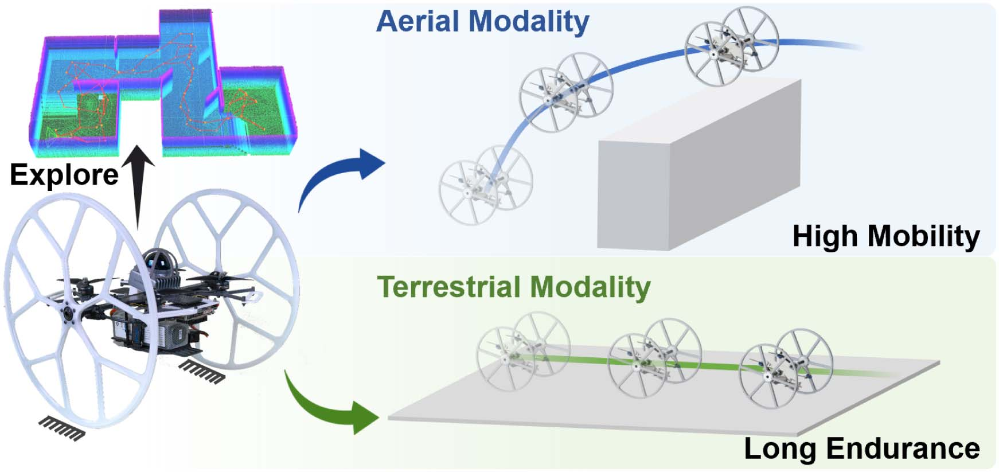
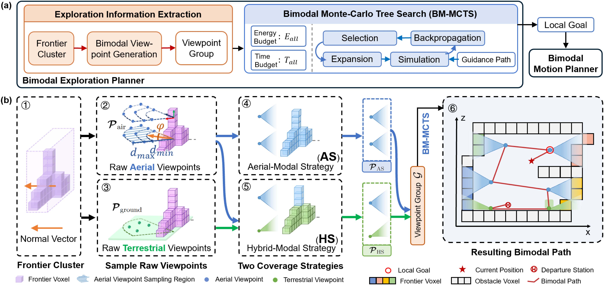
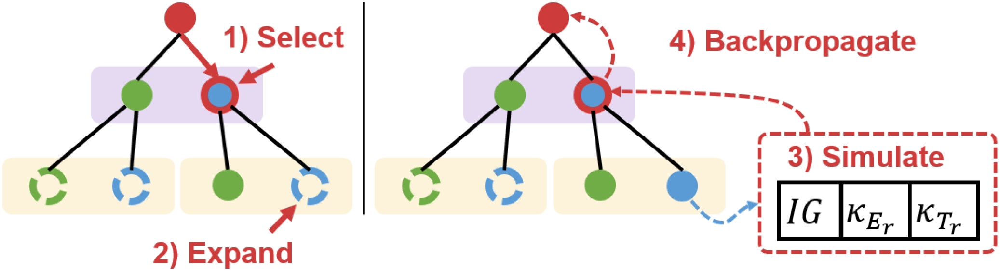
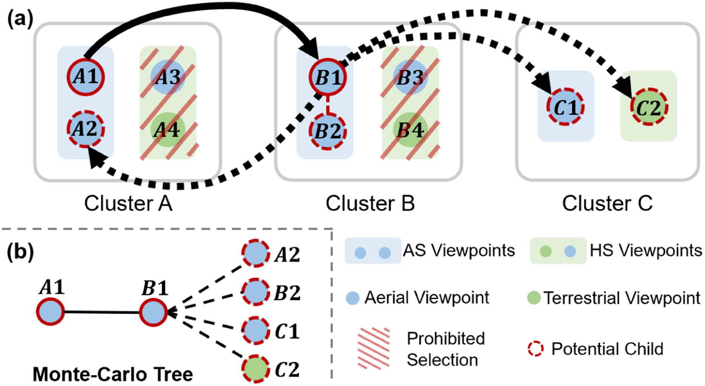
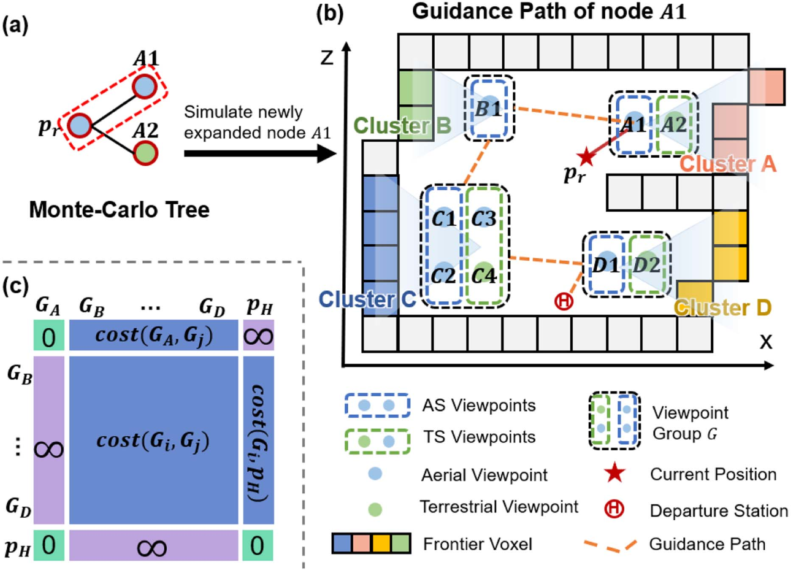
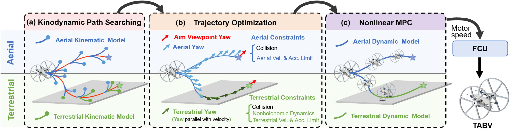
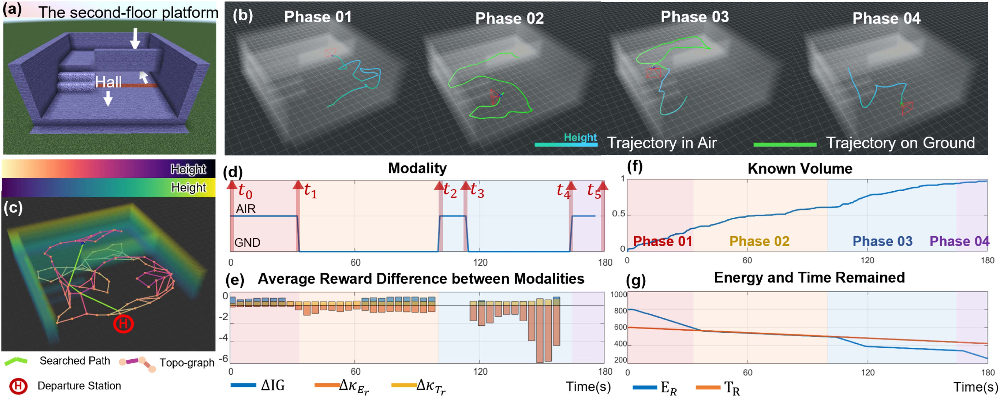
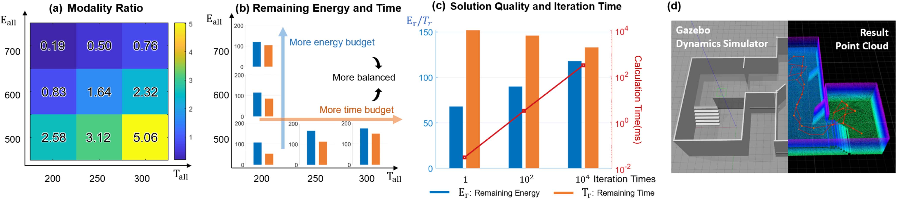
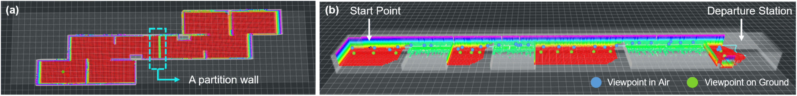
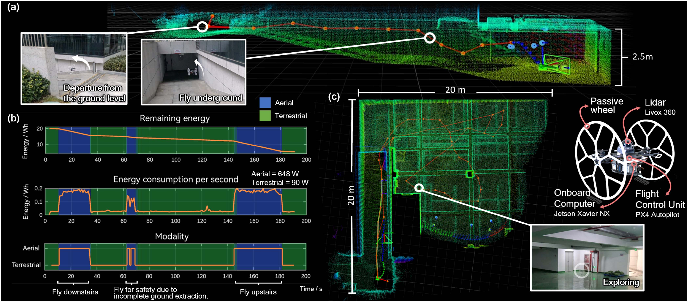

# 空地双模态机器人自主环境探索（Autonomous Exploration With Terrestrial-Aerial Bimodal Vehicles）

> **作者**：Yuman Gao, Ruibin Zhang, Tiancheng Lai, Yanjun Cao, Chao Xu, Fei Gao  
> **发表信息**：IEEE Robotics and Automation Letters, Vol. 10, No. 10, October 2025  
> **原文 PDF**：[Autonomous Exploration With Terrestrial-Aerial Bimodal Vehicles](../Autonomous%20Exploration%20With%20Terrestrial-Aerial%20Bimodal%20Vehicles.pdf) ｜ **对应中文详解**：[07_空地双模态机器人自主环境探索.md](../中文详解/07_空地双模态机器人自主环境探索.md)

---

## 原文第 1 页

### 摘要

空地双模态机器人将空中机器人的高机动性与地面机器人的长续航能力结合起来，在自主环境探索方面具有很大潜力。针对实际探索任务中固有的能量和时间约束，本文提出一种分层框架，使双模态机器人能够利用灵活的运动方式开展探索。系统首先提取环境信息，确定具有信息价值的区域，并生成一组潜在的双模态视点。为自适应地处理能量和时间约束，本文引入一种扩展的蒙特卡洛树搜索方法，对运动方式选择和视点访问顺序进行统筹优化。结合改进的双模态机器人运动规划器，本文构建了一个同时考虑能量和时间的完整探索系统。大量仿真以及在定制实物平台上的部署结果表明了该系统的有效性。

### 关键词

空中系统：应用；任务与运动规划；空中系统：感知与自主性。

## I. 引言

自主探索在学术界和工业界受到越来越多的关注，应用领域包括搜索救援、工程测量和隧道检查等。近年来，研究人员提出了多种探索策略，并将其部署到无人飞行器（UAV）和无人地面车辆（UGV）上。然而，探索性能受到移动机器人运动学和动力学特性的限制。空中机器人具有较高的机动性和较大的视场，但续航时间明显短于地面机器人，限制了其开展大范围、长时间探索的能力。地面机器人，特别是轮式机器人，在复杂崎岖地形中行驶时会遇到困难，因此通常只能在宽阔平坦区域进行探索。为突破上述硬件限制，研究人员提出了由 UAV 和 UGV 组成的空地协同探索系统 [1]–[5]。但采用这类系统会带来多机器人 SLAM、规划和协同等问题，显著增加系统复杂度。

**图 1**：TABV 将两种运动方式集成到一个平台中，在自主探索方面具有很大潜力。

为解决上述问题，本文提出使用空地双模态机器人（TABV）的分层探索框架 [6]。这类机器人将 UGV 的长续航能力与 UAV 的高机动性、大视场集成到单一机器人系统中，如图 1 所示，显示出较大的探索潜力。此外，在探索任务，特别是搜索救援任务中，必须考虑能量和时间约束，因为机器人电池容量有限，任务通常还需要在合理时间内完成。尽管这些约束十分重要，既有研究往往没有充分考虑。TABV 具有两种运动方式，可以更灵活地应对这些约束。

为利用 TABV 的特点，本文首先根据已知环境的前沿生成双模态视点。随后提出一种自适应探索规划器，使 TABV 能够在给定能量和时间约束下选择合适的运动方式完成探索。本文提出双模态蒙特卡洛树搜索（BM-MCTS）方法，确定所生成视点的访问顺序。然后采用并改进作者前期工作 [6] 中的双模态运动规划器，生成执行轨迹。为展示和验证所提方法，本文在多个仿真场景中进行了探索测试，并将系统部署到定制 TABV 平台上进行实物实验。

本文的主要贡献如下：

---

## 原文第 2 页

1. 提出一种 TABV 分层探索框架，包括基于两种覆盖策略的双模态视点生成模块，以及充分利用机器人双模态运动能力的能量和时间感知决策机制。
2. 提出一种面向信息驱动探索的自适应 BM-MCTS 方法，使机器人能够在能量和时间约束下灵活选择运动方式和视点。
3. 将探索规划器与增强的双模态运动规划器结合起来。该规划器具有地形感知和运动方式感知能力，形成完整的自主 TABV 系统，并部署到实物平台上。

## II. 相关工作

自主探索问题已经在多种机器人平台上采用不同策略进行研究。在各种探索方法中，基于前沿的方法利用前沿所包含的未知环境信息引导探索 [7]–[11]。将一组前沿或采样视点作为目标后，可以通过不同方法寻找遍历这些目标的全局路径，例如最短距离准则 [7]、最小速度变化准则 [8]、平衡信息增益和路径代价的奖励函数 [12]，或求解旅行商问题（TSP）[9]–[11]。同时，一些研究利用 MCTS，为分散式、长时域和多智能体探索等复杂任务寻找具有前瞻性的方案 [13]–[15]。

为结合空中和地面移动机器人的优点，研究人员还关注 UAV-UGV 协同探索系统。Butzke 等人 [1] 将无人机安装在地面机器人上作为备用。当地面机器人遇到较高且无法观察的区域时，无人机起飞进行覆盖。Wang 等人 [2] 采用集中式方法规划 UAV-UGV 探索轨迹：地面机器人适合开放区域，空中机器人适合复杂环境。Ropero 等人 [3] 提出一种 UGV-UAV 协同探索路径规划算法，将地面机器人作为移动充电站，以缓解空中机器人的能量约束，同时由空中机器人到达目标点，弥补地面机器人的功能限制。然而，这些多机器人系统增加了系统级复杂度，使部署更加困难。

除了需要解决两个平台之间的联合规划和通信问题，还必须考虑多机器人 SLAM 问题。为实现多机器人 SLAM 回环检测的可扩展性，CSIRO 团队 [5] 直接在点云上建立前沿模型，避免使用稠密体素地图表示。Qin 等人 [4] 实现了两层探索策略：地面机器人生成粗略环境模型，空中机器人根据粗略地图完成三维精细建图。

在不引入多平台复杂性的情况下结合空中和地面机器人的优势，TABV 已成为研究热点 [16]–[19]。不过，使用 TABV 进行探索的工作仍然较少。Team CoSTAR 的 Rollocopter TABV 已部署到 DARPA 地下挑战赛中，但它只是数十个平台中的一个，采用的是通用探索规划器，并未专门处理双模态机器人的运动方式调度 [20]。

本文扩展 MCTS 方法，以处理双模态、受能量和时间约束的探索问题，并将其与改进的双模态运动规划器结合，形成完整的 TABV 探索框架。

## III. 问题描述与系统概览

本文方法的目标是在给定总能量预算 $E_{all}$ 和总时间预算 $T_{all}$ 的条件下，使用 TABV 探索一个初始未知但有边界的三维空间。目标不是完全覆盖环境，而是在确保机器人能够携带数据返回出发站的前提下，尽可能采集更多有信息价值的数据。这种目标更符合通信受限的灾后环境等实际应用。

为此，本文将探索任务表述为：选择一系列视点及其对应的运动方式，在可用能量和时间预算内最大化对未知空间的感知：

$$P^* = \arg\max_P IG(P) \tag{1a}$$
$$\text{s.t.}\quad E_r(P) \geq 0, \tag{1b}$$
$$\qquad\quad T_r(P) \geq 0. \tag{1c}$$

其中，$P=\{P_i\mid i=0,\ldots,n\}$ 是选定的视点序列，$IG(P)$ 表示沿轨迹获得的信息增益，$E_r(P)$ 和 $T_r(P)$ 分别表示访问所有选定视点并返回出发站后的剩余能量和剩余时间。

为处理不等式约束和环境不确定性，采用惩罚函数方法将式（1）转换为无约束优化问题：

$$P^* = \arg\min_P\left(-IG(P)+\kappa_{E_r}(E_r(P))+\kappa_{T_r}(T_r(P))\right). \tag{2}$$

其中，$\kappa_{E_r}(\cdot)$ 和 $\kappa_{T_r}(\cdot)$ 是基于剩余能量和剩余时间的指数惩罚项，将在第 V-A 节介绍。超过能量限制可能导致无法返航，从而造成任务失败；适度超过时间则相对更容易容忍。因此，能量惩罚曲线设置得更陡，时间惩罚相对温和，并且只有在剩余能量已经充足时才发挥作用。这样的建模通过保留一定余量，提高规划的安全性和效率，以应对环境不确定性。

图 2 给出了 TABV 自主探索系统的总体流程。系统首先从环境中提取探索信息并生成候选视点（第 IV 节），然后在给定能量和时间预算下使用 BM-MCTS 确定视点访问顺序（第 V 节），最后使用双模态运动规划器生成双模态轨迹（第 VI 节）。

---

## 原文第 3 页

**图 2**：（a）所提出 TABV 探索框架的总体流程。（b）模块细节：① 前沿簇 $C$，其表面法向量通过主成分分析（PCA）计算，并指向已知空间；②–③ 生成原始空中视点 $P_{aerial}$ 和原始地面视点 $P_{ground}$。$P_{aerial}$ 在前沿簇法向量周围，按照圆柱坐标采样，在 $[d_{min},d_{max}]$ 距离范围、$\phi$ 角度和多个高度上生成；④–⑤ 采用两种可选策略选择能够完整覆盖 $C$ 的双模态视点，得到 $P_{AS}$ 和 $P_{HS}$；⑥ 所得到的双模态路径和下一个局部目标示例。

## IV. 探索信息提取

### A. 双模态视点生成

与经典的基于前沿的探索方法类似，前沿被定义为与未知空间相邻的自由体素。随着机器人移动，新的前沿会出现。机器人反复规划覆盖前沿的视点，并在地图更新后重新规划。

为高效生成覆盖前沿的视点，本文首先将前沿体素分组形成前沿簇。对于每个前沿簇 $C$，考虑两种实现完整覆盖的视点生成策略：空中运动方式策略（AS）完全使用空中视点覆盖该前沿簇；混合运动方式策略（HS）首先使用地面视点覆盖，如果无法实现完整覆盖，再选择额外的空中视点补齐覆盖。AS 和 HS 视点集合提供不同运动方式的候选视点，作为后续 BM-MCTS 决策的输入。

具体而言，如图 2（b）所示，对于每个 $C$，首先采样原始地面和空中候选视点。原始空中视点 $P_{aerial}$ 通过围绕 $C$ 的圆柱坐标采样生成。原始地面视点 $P_{ground}$ 则从网格地图中提取的附近可通行地面体素中采样，并设置固定的竖直偏移量。对于给定的原始视点，选择双模态视点覆盖 $C$ 的问题具有子模性 [21]。本文采用贪心方法高效求解，得到 AS 和 HS 视点集合。具体细节和算法见补充材料 [22] 第 1 节。

最终得到两组表示不同覆盖策略的候选视点：用于纯空中运动方式覆盖的 $P_{AS}$，以及用于混合运动方式覆盖的 $P_{HS}$。每个视点定义为 $P_i=(p,\phi)$，其中 $p$ 是位置，$\phi$ 是偏航角。视点 $P_i$ 的 $IG$ 定义为其视场内可见前沿体素的数量。同一前沿簇中的所有视点组成视点组 $G=\{P_{AS},P_{HS}\}$。

### B. 视点之间的能量和时间代价

由于本文使用 $E_r$ 和 $T_r$ 作为实现能量感知和时间感知规划的指标，因此需要对能量代价和时间代价进行建模。给定两个视点 $P_i$ 和 $P_j$，两者之间的时间代价定义为：

$$T(P_i,P_j,M)=\max\left[\frac{length(P_i,P_j)}{v_{M,max}},\frac{d_{yaw}(P_i,P_j)}{\omega_{M,max}}\right]. \tag{3}$$

其中，$length(P_i,P_j)$ 是两个视点之间搜索路径的长度，$d_{yaw}(P_i,P_j)$ 是两个视点之间的最小偏航角差，$v_{M,max}$ 和 $\omega_{M,max}$ 分别是运动方式 $M$ 下的最大速度和最大偏航角速度。能量代价采用简单的恒定功率模型：

$$E(P_i,P_j,M)=P_M\cdot T(P_i,P_j,M). \tag{4}$$

---

## 原文第 4 页

**图 3**：BM-MCTS 过程示意图。

其中，$P_M$ 是运动方式 $M$ 下的平均功率。$M\in\{T,A\}$ 表示运动方式，其中 $T$ 和 $A$ 分别表示地面运动方式和空中运动方式。特别地，记 $M=(T+A)/2$ 为平均运动方式，即

$$v_{(T+A)/2,max}=(v_{T,max}+v_{A,max})/2,\qquad P_{(T+A)/2}=(P_T+P_A)/2.$$

如果需要估计视点组之间的时间和能量代价，例如计算 $E(G_i,G_j,M)$，则使用视点组 $G$ 中所有视点位置和偏航角的平均值作为平均视点进行计算。

根据已有双模态机器人设计论文 [18]、[23]、[24]，空中运动方式的平均功率约为地面运动方式的 5–8 倍（本文平台为 7.2 倍）。地面运动方式的最大速度约为 1 m/s。但在探索中，由于安全性和感知精度限制，空中运动方式不能达到地面运动方式 5–8 倍的速度。因此，地面运动方式在能量代价方面具有优势，而空中运动方式的时间代价更低。

## V. 双模态蒙特卡洛树搜索

蒙特卡洛树搜索（MCTS）是一种在计算资源有限的条件下、于给定搜索范围内寻找最优决策的规划方法 [25]、[26]。在此基础上，本文提出扩展的 MCTS 方法 BM-MCTS，用于在两种潜在运动方式下选择最优视点序列。BM-MCTS 包含四个关键步骤：选择、扩展、模拟和回溯，如图 3 所示。达到规定迭代次数后，选择根节点的最优子节点作为下一个局部目标，最优分支即为得到的双模态路径。完整算法见算法 1。

### A. 树结构与奖励

首先定义树结构。树节点 $v$ 对应一个视点 $P$，每个分支确定一个视点访问序列，如图 4（b）所示。

每个节点 $v$ 具有多个属性。$E_R(v)$ 和 $T_R(v)$ 表示机器人沿当前搜索分支中的视点序列到达节点 $v$ 对应视点 $P$ 时预计剩余的能量和时间。$E_r(v)$ 和 $T_r(v)$ 表示机器人到达 $P$、完成剩余已选视点的访问并返回出发站后预计剩余的能量和时间。

对于视点 $P_i$，潜在子节点 $P_j$ 需要满足：1）$P_j$ 尚未出现在 $P_i$ 所在分支中；2）$P_i$ 与 $P_j$ 之间的距离小于阈值；3）如果 $P_j$ 所属视点组已经在 $P_i$ 所在分支中扩展，则 $P_j$ 应保持相同的采样方式，如图 4 所示。如果没有候选 $P_j$ 同时满足所有条件，则放宽第二个条件，允许选择可行视点。

**图 4**：潜在子节点确定示例。（a）前沿簇 B 中视点 B1 的潜在子节点。如果该视点所属的前沿簇已经扩展，则禁止选择另一种运动方式的视点。（b）对应的蒙特卡洛树。每个分支代表一个视点访问序列。

节点奖励由表示 $IG$ 的过程增益和表示 $E_r$、$T_r$ 的终端代价构成。过程增益与该节点子树中的所有节点有关，而终端代价只与子树中的叶节点有关。每个节点 $v$ 的奖励为 $R(v)=[R_p(v),R_t(v)]$：

$$R_p(v)=IG(v)/n_{IG}(v), \tag{5a}$$
$$R_t(v)=\kappa_{E_r}(E_r(v))+\kappa_{T_r}(T_r(v)). \tag{5b}$$

其中，$n_{IG}(v)$ 表示节点 $v$ 的折扣访问次数，每次回溯时以固定权重 $\gamma_{IG}=0.8$ 增加。相应地，$IG(v)$ 在回溯过程中累积其子节点的折扣信息增益。因此，$R_p(v)$ 反映以节点 $v$ 为根的子树中的折扣平均信息增益。该形式减轻子树规模不均造成的偏差，并强调较近节点的信息。$\kappa_{E_r}(E_r(v))$ 和 $\kappa_{T_r}(T_r(v))$ 表示以节点 $v$ 为根的子树中所有叶节点的平均终端能量代价和时间代价。代价采用指数函数：

$$\kappa_{E_r}(x)=\exp(-a_1\cdot x/E_{all}+b_1),\qquad \kappa_{T_r}(x)=\exp(-a_2\cdot x/T_{all}+b_2),$$

其中，$a_i$ 和 $b_i$ 是预设超参数。

### B. 选择和扩展过程

在选择过程中，从根节点开始递归选择最优节点，直到到达一个仍有未扩展潜在子节点的节点。选择策略遵循 UCB 规则 [26]，在探索和利用之间进行平衡。对 $v$ 的每个子节点 $v_k$ 计算：

$$U(v_k)=G(v_k)-\sqrt{2\ln n_s/n(v_k)}, \tag{6a}$$
$$G(v_k)=-N(R_p(v_k))+R_t(v_k). \tag{6b}$$

其中，$n(v_k)$ 是节点 $v_k$ 被选择的次数，$n_s=K\sum_{k=1}^{K}n(v_k)$，$K$ 是节点 $v$ 的子节点数。$N(x)$ 将 $x$ 线性映射到 $[\epsilon,1]$，其中 $\epsilon=0.05$ 表示最小归一化增益。在所有子节点中，选择 $U(\cdot)$ 最小的节点。

给定待扩展节点 $v_i$ 及其对应视点 $P_i$，按照第 V-A 节确定其潜在子节点。从 $v_i$ 的未扩展潜在子节点中随机选择 $v_{i+1}$，然后更新机器人到达 $v_{i+1}$ 时的剩余能量和时间。能量更新为：

$$E_R(v_{i+1})=E_R(v_i)-E(P_i,P_{i+1},M(P_{i+1})). \tag{7}$$

其中，$E(P_i,P_{i+1},M(P_{i+1}))$ 是从 $P_i$ 到 $P_{i+1}$ 的能量消耗，运动方式由后一个视点决定。剩余时间的处理方式相同，本文只给出能量公式。

---

## 原文第 5 页

**图 5**：新扩展节点的引导路径生成示例。（a）正在扩展的蒙特卡洛树，节点 A1 是新扩展节点，需要进行模拟。（b）节点 A1 的引导路径生成。在此示例中，选择 $G_A$ 中的 A1 覆盖前沿簇 A，并确定从机器人当前位置 $p_r$ 到 A1 的路径。随后求解分组 TSP，得到遍历所有前沿簇并返回出发站的完整引导路径。（c）分组 TSP 的代价矩阵。紫色区域表示无穷连接，绿色区域表示零连接。

### C. 使用引导路径的模拟过程

模拟过程更新新扩展节点的奖励，需要评估其 $IG$、$E_r$ 和 $T_r$。对于 $IG$，将 $IG(v_i)$ 初始化为视点 $P_i$ 的视场内可见前沿体素数量，作为新采集信息的估计。

为估计遍历所有前沿簇并返回出发站所需的能量和时间，本文求解扩展的分组旅行商问题，生成引导路径，如图 5 所示。设计代价矩阵时，将出发站 $p_H$ 设为最终目的地。视点组之间的代价定义为组间旅行时间，即 $T(G_i,G_j,(T+A)/2)$。由于评估时尚不知道节点的确切运动方式，因此令 $M=(T+A)/2$。

模拟过程中的主要计算瓶颈是代价矩阵计算。为高效估计可行路径长度，本文维护一个全局拓扑图，记录按一定间隔访问的位置，并连接距离小于阈值的节点，如图 7（c）所示。通过在拓扑图上执行 A* 搜索，可以快速、保守地估计路径长度。此外，在视点生成过程中增量更新视点组之间的路径，进一步提高效率。

随后通过模拟步骤更新 $E_r$ 和 $T_r$。能量计算为：

$$E_r(v_i)=E_R(v_i)-\sum_{q=i}^{k-1}E(G_q,G_{q+1},(T+A)/2)-E(G_k,p_H). \tag{8}$$

其中，$v_i$ 对应 $P_i\in G_i$，等式右侧最后两项表示机器人根据引导路径从当前视点组前往最后一个视点组并返回出发站的预计能量消耗。

### D. 回溯过程

得到奖励后，将其回溯到访问过的每个节点，以更新这些节点的奖励，为下一次选择做准备。由于过程增益 $R_p$ 与同一分支上的所有节点有关，因此采用累积回溯；而终端代价 $R_t$ 只与分支上的叶节点有关，因此采用平均回溯。回溯过程详见算法 2。

### E. 剪枝条件

为减少搜索空间并提高效率，如果机器人到达节点 $v_i$ 后的剩余能量小于从该节点返回出发站所需的能量，则将子节点剪枝，不再扩展：

$$E_R(v_i)-E(G_i,p_H)<0, \tag{9}$$

其中，$v_i$ 对应 $P_i\in G_i$。算法分析的更多细节见补充材料 [22] 第 5 节。

## VI. 双模态运动规划

得到 BM-MCTS 给出的下一个目标后，采用分层双模态运动规划方法生成空地混合轨迹，并控制 TABV 执行。该方法建立在作者前期工作 [6] 的基础上，下面概述整体流程并说明主要改进。

如图 6 所示，规划器采用标准的分层结构，包括运动学和动力学路径搜索前端，以及基于微分平坦性的时空轨迹优化后端。

---

## 原文第 6 页

**图 6**：分层双模态运动规划框架。（a）运动学和动力学路径搜索前端；（b）基于微分平坦性的时空轨迹优化后端；（c）NMPC 模块 [6]，用于计算期望电机转速。

首先，不再假设固定地面，而是采用增量式地面分割进行在线地形感知。这使系统能够在复杂多层环境中动态识别可通行表面，而不依赖预先设定的结构假设。

其次，引入运动方式感知规划，替代原来始终偏向地面运动方式的方法。在前端，根据目标运动方式选择运动基元：对于空中目标选择空中基元；对于地面目标选择对空中运动施加惩罚的双模态基元。在后端施加与运动方式对应的约束，例如地面运动片段的非完整动力学约束；同时将双模态偏航规划也集成到后端。

最后，为提高安全性，针对每个地面片段计算欧氏有符号距离场（ESDF），查询机器人到边缘的距离，使 TABV 能够在边缘附近安全飞行并避免跌落。通过引入该双模态运动规划器，建立完整的自主空地双模态探索框架。更多细节见补充材料 [22] 第 2 节。

---

## 原文第 7 页

**图 7**：（a）TABV 探索用两层房屋场景。（b）四个探索阶段。阶段 1：飞行探索大厅的大部分区域；阶段 2：覆盖一楼平台，然后飞到楼上；阶段 3：滚动覆盖二楼平台；阶段 4：覆盖大厅剩余区域并返航。（c）拓扑图示意。（d）TABV 的运动方式。（e）蒙特卡洛树第二层空中和地面子节点的平均奖励差。（f）随时间变化的覆盖率。（g）剩余能量和时间。

## VII. 结果

### A. 仿真

为验证 TABV 探索系统，本文在多个多层建筑中进行仿真和分阶段分析，并分析 BM-MCTS 在不同预算下的适应性，以及方案质量与迭代次数之间的关系。根据本文 TABV 平台，空中运动方式的功率是地面运动方式的 7 倍。因此设置 $P_T=1$、$P_A=7$，即地面运动每进行 1 秒消耗 1 个能量单位，空中运动每进行 1 秒消耗 7 个能量单位。为避免重复，以下内容省略时间和能量单位。最大速度设置为 $v_{T,max}=0.5$ m/s、$v_{A,max}=1.0$ m/s。

#### 1）两层房屋中的双模态探索

在 MineCraft 中构建一个 $15\text{ m}\times15\text{ m}\times6\text{ m}$ 的两层房屋作为探索场景，如图 7（a）所示。一楼高度为 2 m，并通过楼梯与二楼平台相连。能量预算设为 1000，时间预算设为 600。超参数 $\kappa_{E_r}$ 和 $\kappa_{T_r}$ 与补充材料第 9 节 [22] 中的设置相同。在图 7（e）中，平均奖励差定义为：

$$\Delta\bar{R}=\bar{R}(v_A)-\bar{R}(v_G),$$

其中，$\bar{R}(v_A)$ 和 $\bar{R}(v_G)$ 分别是根节点的空中运动方式子节点和地面运动方式子节点的平均奖励。

为进行详细分析，将整个探索过程划分为四个阶段（图 7）。阶段 1 中，剩余能量和时间都很充足，因此信息增益奖励占主导。TABV 切换到空中运动方式，以更短时间获得更多信息。在 $t_1$ 时，TABV 进入一楼平台。由于平台高度只有 2 m，两种运动方式能够获得的信息增益几乎相同。由于阶段 1 消耗了较多能量，在 $t_1$ 时能量的重要性高于时间，因此 TABV 选择地面运动方式覆盖整个一楼平台。在 $t_2$ 时，完成所有地面视点的覆盖；随后机器人起飞，并在 $t_3$ 时降落到二楼，再以滚动方式覆盖二楼平台，以节省能量。阶段 4 中，大厅内只剩空中视点，TABV 飞行覆盖这些视点并返回出发站。

---

## 原文第 8 页

**图 8**：（a）–（b）不同能量和时间预算下的性能。（a）不同预算下的运动方式比例，数值表示地面运动时间与空中运动时间之比。（b）探索完成时的剩余能量和时间。（c）不同迭代次数下的算法计算时间，以及探索完成时的剩余能量和时间。（d）更多仿真场景和探索结果见补充材料 [22]。

**图 9**：仿真场景。（a）带有 0.5 m 高隔断墙的多房间场景。（b）包含一系列视点的场景。

#### 2）对不同预算的适应性

在 $40\text{ m}\times16\text{ m}\times2\text{ m}$ 的办公室样式区域中展示不同能量和时间预算下的方法性能。该区域由 1 m 高的隔断墙完全分隔，如图 9（a）所示。运动方式比例定义为地面运动时间除以空中运动时间。针对不同预算设置，每种设置进行 5 次实验，结果如图 8 所示。随着时间预算增加、能量预算减少，TABV 更倾向于选择地面运动方式。

进一步分析探索结束时的剩余能量和时间，如图 8（b）所示。在能量预算相同的情况下，时间预算越大，剩余能量越多；在时间预算相同的情况下，能量预算越大，剩余时间越多。这说明增加其中一种预算，可以为更有效地利用另一种预算提供更大灵活性，体现了 BM-MCTS 在能量和时间之间进行平衡、适应不同预算的能力。

#### 3）方案质量与迭代次数

由于 BM-MCTS 在达到迭代次数阈值后即可随时生成方案，本文分析迭代次数与方案质量之间的关系。构建图 9（b）所示的单向场景，以保证测试中的探索方向一致。TABV 首先沿预设轨迹从出发站飞到起始点，生成一系列双模态视点。随后开始探索，能量和时间预算分别设置为 400 和 200。对于每个预设迭代次数，仿真 10 次。由图 8（c）可见，最大迭代次数增加时，剩余能量和时间更加平衡。这是因为随着搜索树扩展，能量和时间消耗估计更加准确，但计算时间也会增加。更多仿真测试和综合比较见补充材料 [22] 第 6–8 节。

### B. 实物实验

为在真实环境中展示和验证所提方法，使用图 10 所示的定制 TABV 平台。TABV 重 1.85 kg，搭载 Livox 360 和 Jetson Xavier NX，并使用 FAST-LIO2 [27] 进行定位。所有算法均在机载计算机上运行。TABV 在空中运动方式下功耗为 648 W，在地面运动方式下功耗为 90 W，因此空中功耗是地面功耗的 7.2 倍。设置 20 Wh 的可用能量预算和 900 s 的充足时间预算，让 TABV 探索一个地下停车库。TABV 能够飞越不平整楼梯，并切换到地面运动方式，以较低能耗进行探索；最终在能量预算用尽时安全返回。

---

### 图 10 与结论（原文第 8 页）

**图 10**：实物实验。（a）地下停车库入口侧视图。（b）能量和运动方式曲线。（c）已探索地图的俯视图。

## VIII. 结论

本文提出一种分层方案，使 TABV 能够在给定能量和时间预算下开展探索。借助该方案，TABV 可以通过改变运动方式，灵活适应不同环境以及不同的能量和时间约束。本文在补充材料第 11 节 [22] 中对系统局限性进行了详细分析。下一步工作将加入环境预测，以更准确地估计能量和时间消耗。

## 参考文献

[1] J. Butzke, A. Dornbush, and M. Likhachev, “3-D exploration with an air-ground robotic system,” in Proc. IEEE/RSJ Int. Conf. Intell. Robots Syst., 2015, pp. 3241–3248.
[2] L. Wang, F. Gao, F. Cai, and S. Shen, “CRASH: A collaborative aerial-ground exploration system using hybrid-frontier method,” in Proc. the IEEE Intl. Conf. Robot. Bio., 2018, pp. 2259–2266.
[3] F. Ropero, P. Muñoz, and M. D. R-Moreno, “TERRA: A path planning algorithm for cooperative UGV–UAV exploration,” Eng. Appl. Artif. Intell., vol. 78, pp. 260–272, 2019.
[4] H. Qin et al., “Autonomous exploration and mapping system using heterogeneous UAVS and UGVS in GPS-denied environments,” IEEE Trans. Veh. Tech., vol. 68, no. 2, pp. 1339–1350, Feb. 2019.
[5] J. Williams et al., “Online 3D frontier-based UGV and UAV exploration using direct point cloud visibility,” in Proc. IEEE Intl. Conf. Multisensor Fusion Integration Intell. Syst., 2020, pp. 263–270.
[6] R. Zhang et al., “Model-based planning and control for terrestrial-aerial bimodal vehicles with passive wheels,” in Proc. IEEE/RSJ Int. Conf. Intell. Robot Syst., 2023, pp. 1070–1077.
[7] B. Yamauchi, “A frontier-based approach for autonomous exploration,” in Proc. IEEE Int. Symp. Comput. Intell. Robot. Autom., 1997, pp. 146–151.
[8] T. Cieslewski, E. Kaufmann, and D. Scaramuzza, “Rapid exploration with multi-rotors: A frontier selection method for high speed flight,” in Proc. IEEE/RSJ Int. Conf. Intell. Robots Syst., 2017, pp. 2135–2142.
[9] C. Cao, H. Zhu, H. Choset, and J. Zhang, “TARE: A hierarchical framework for efficiently exploring complex 3D environments,” in Proc. Robot.: Sci. Syst., 2021, vol. 17, pp. 2–10.
[10] B. Zhou, Y. Zhang, X. Chen, and S. Shen, “FUEL: Fast UAV exploration using incremental frontier structure and hierarchical planning,” IEEE Robot. Autom. Lett., vol. 6, no. 2, pp. 779–786, Apr. 2021.
[11] Y. Gao et al., “Meeting-merging-mission: A multi-robot coordinate framework for large-scale communication-limited exploration,” in Proc. IEEE/RSJ Int. Conf. Intell. Robots Syst., 2022, pp. 13700–13707.
[12] A. Bircher, M. Kamel, K. Alexis, H. Oleynikova, and R. Siegwart, “Receding horizon next-best-view planner for 3D exploration,” in Proc. IEEE Intl. Conf. Robot. Autom., 2016, pp. 1462–1468.
[13] G. Best, O. M. Cliff, T. Patten, R. R. Mettu, and R. Fitch, “DEC-MCTS: Decentralized planning for multi-robot active perception,” Intl. J. Robot. Res., vol. 38, no. 2–3, pp. 316–337, 2019.
[14] K. M. Seiler, F. H. Kong, and R. Fitch, “Multi-horizon multi-agent planning using decentralised Monte Carlo tree search,” IEEE Robot. Autom. Lett., vol. 9, no. 9, pp. 7715–7722, Sep. 2024.
[15] S. Bone, L. Bartolomei, F. Kennel-Maushart, and M. Chli, “Decentralised multi-robot exploration using Monte Carlo tree search,” in Proc. IEEE/RSJ Int. Conf. Intell. Robots Syst., 2023, pp. 7354–7361.
[16] Z. Zheng et al., “CapsuleBot: A novel hybrid aerial-ground bi-copter robot with two actuated-wheel-rotors,” IEEE Robot. Autom. Lett., vol. 10, no. 1, pp. 120–127, Jan. 2025.
[17] M. Cao, X. Xu, S. Yuan, K. Cao, L. Liu, and L. Xie, “DoubleBee: A hybrid aerial-ground robot with two active wheels,” in Proc. IEEE/RSJ Int. Conf. Intell. Robots Syst., 2023, pp. 6962–6969.
[18] J. Lin, R. Zhang, N. Pan, C. Xu, and F. Gao, “Skater: A novel bi-modal bi-copter robot for adaptive locomotion in air and diverse terrain,” IEEE Robot. Autom. Lett., vol. 9, no. 7, pp. 6392–6399, Jul. 2024.
[19] J. Tang et al., “DuawlFin: A drone with unified actuation for wheeled locomotion and flight operation,” 2025, arXiv:2505.13836.
[20] B. Morrell et al., “NeBula: TEAM CoSTAR’s robotic autonomy solution that won phase II of DARPA subterranean challenge,” Field Robot., vol. 2, pp. 1432–1506, 2022.
[21] G. L. Nemhauser, L. A. Wolsey, and M. L. Fisher, “An analysis of approximations for maximizing submodular set functions—I,” Math. Program., vol. 14, pp. 265–294, 1978.
[22] Y. Gao, “Supplementary materials for autonomous exploration with terrestrial-aerial bimodal vehicles,” May 2025, doi: 10.5281/zenodo.16545839.
[23] D. D. Fan et al., “Autonomous hybrid ground/aerial mobility in unknown environments,” in Proc. IEEE/RSJ Int. Conf. Intell. Robots Syst., 2019, pp. 3070–3077.
[24] A. Kalantari et al., “Drivocopter: A concept Hybrid Aerial/Ground vehicle for long-endurance mobility,” in Proc. IEEE Aerosp. Conf., 2020, pp. 1–10.
[25] R. Coulom, “Efficient selectivity and backup operators in Monte-Carlo tree search,” in Proc. Int. Conf. Comput. Games, 2006, pp. 72–83.
[26] W. Chen and L. Liu, “Pareto Monte Carlo tree search for multi-objective informative planning,” in Proc. Robot.: Sci. Syst., 2019, vol. 15, pp. 71–80.
[27] W. Xu, Y. Cai, D. He, J. Lin, and F. Zhang, “FAST-LIO2: Fast direct LiDAR-inertial odometry,” IEEE Trans. Robot., vol. 38, no. 4, pp. 2053–2073, Aug. 2022.
