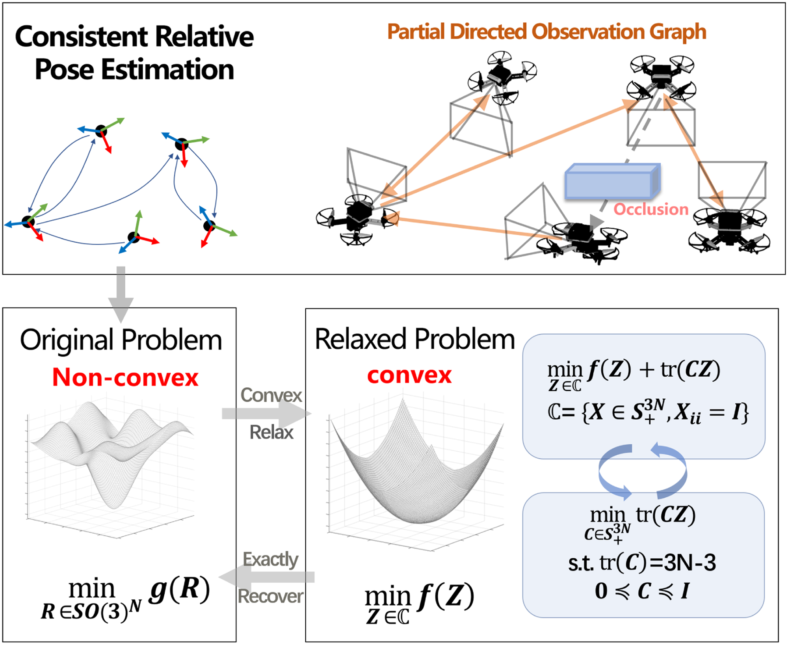
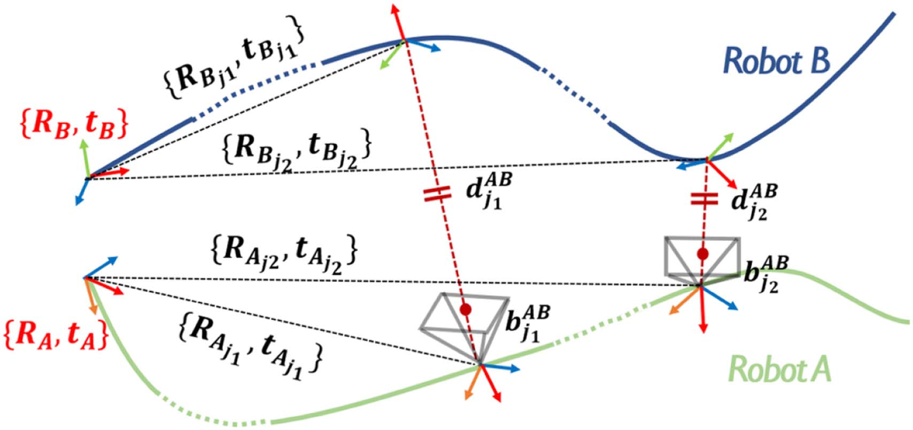
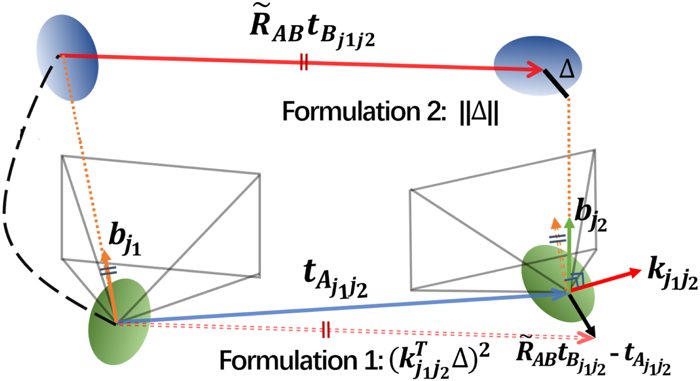
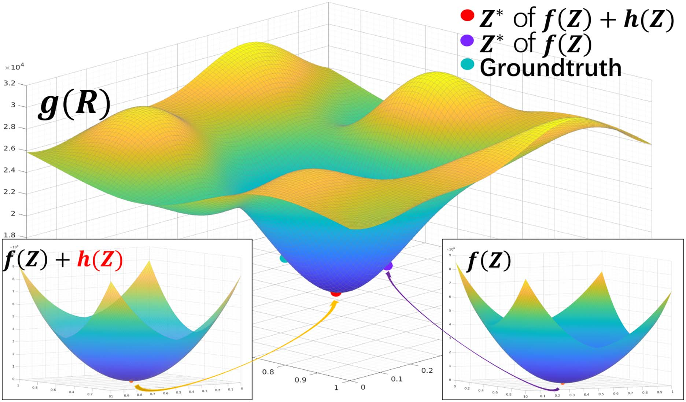
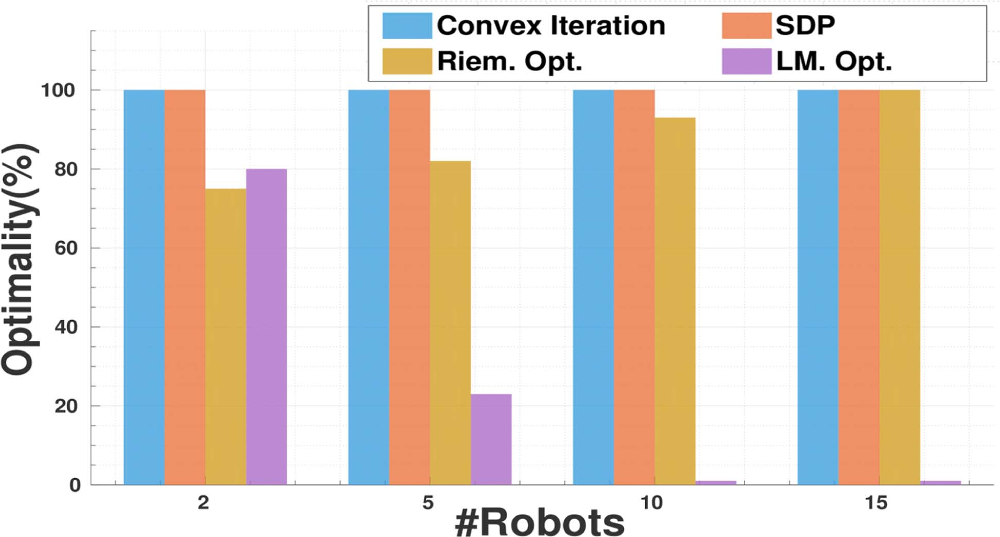
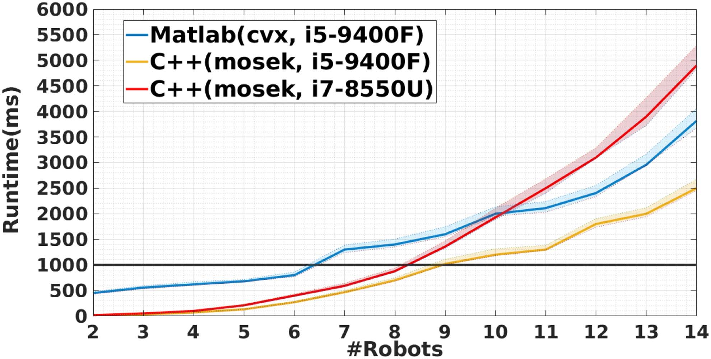
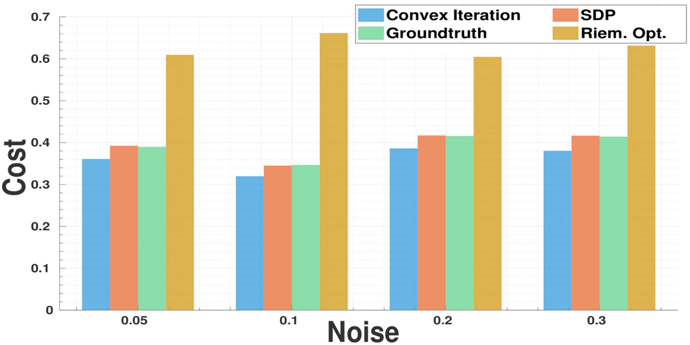
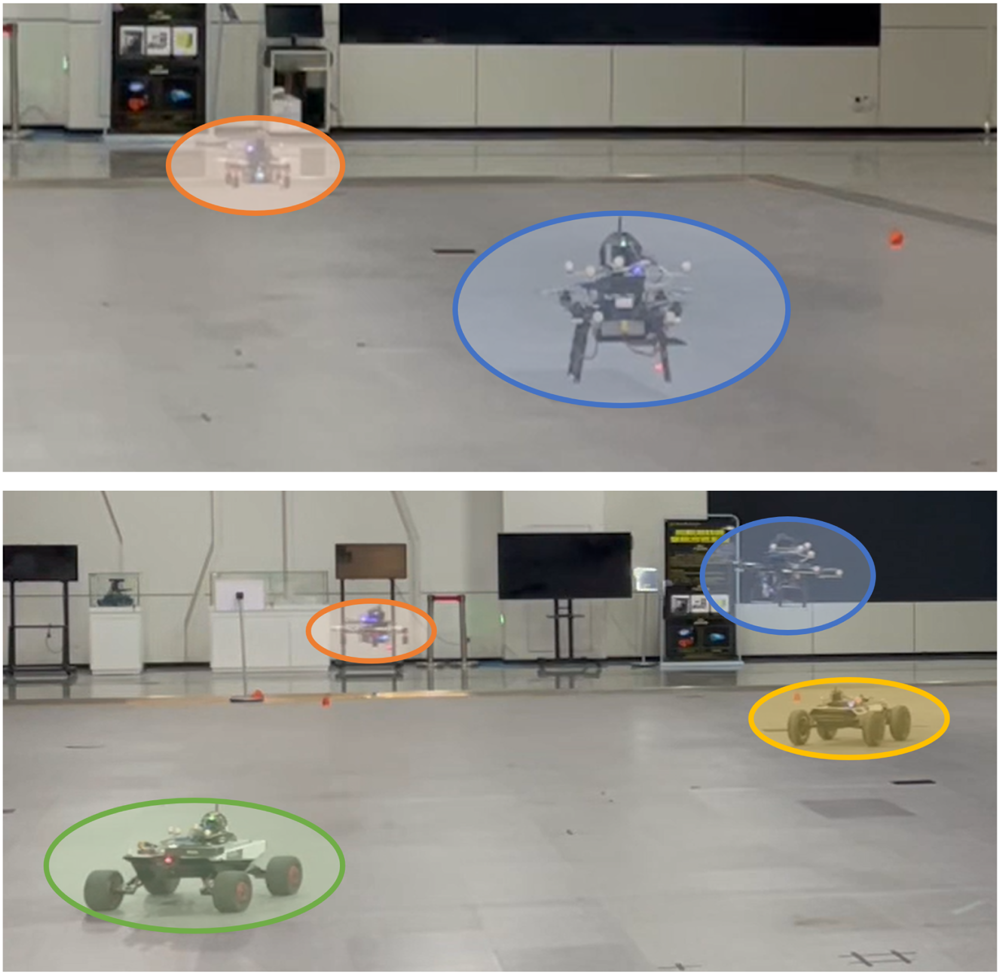
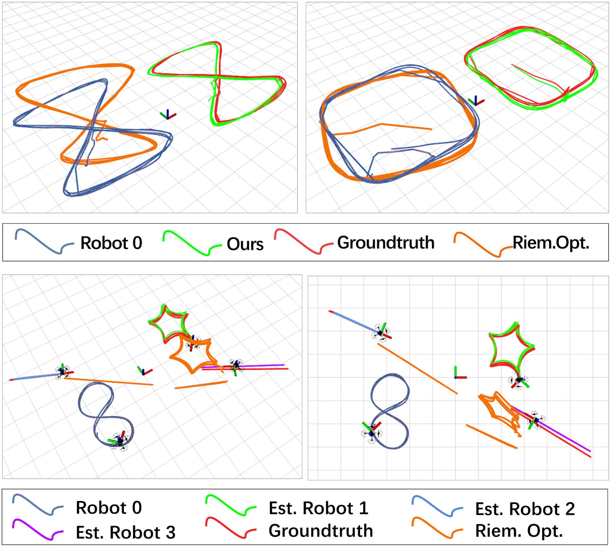
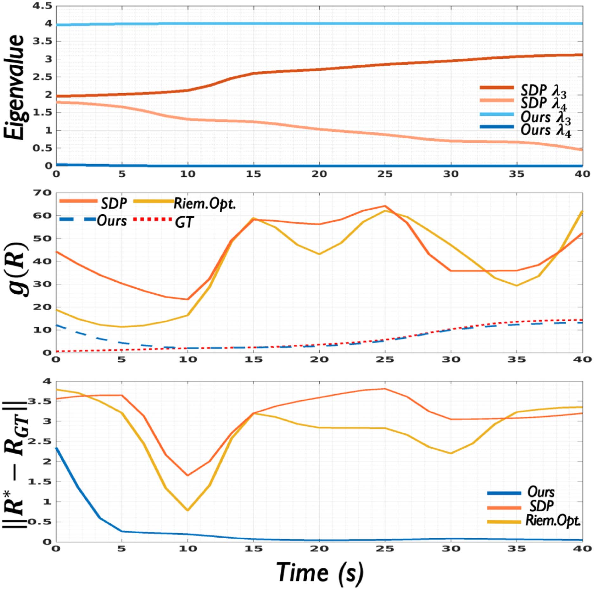

# 基于方位测量的部分相互观测机器人集群相对定位

> **英文题目**：Bearing-Based Relative Localization for Robotic Swarm With Partially Mutual Observations  
> **作者**：Yingjian Wang、Xiangyong Wen、Yanjun Cao、Chao Xu、Fei Gao  
> **发表信息**：IEEE Robotics and Automation Letters，第 8 卷第 4 期，2023 年 4 月，2142–2149 页  
> **原文 PDF**：[Bearing-Based Relative Localization for Robotic Swarm With Partially Mutual Observations.pdf](../Bearing-Based%20Relative%20Localization%20for%20Robotic%20Swarm%20With%20Partially%20Mutual%20Observations.pdf) ｜ **对应中文详解**：[08_基于方位测量的部分相互观测机器人集群相对定位.md](../中文详解/08_基于方位测量的部分相互观测机器人集群相对定位.md)

本文研究仅依靠机器人之间的方位观测，在只有部分机器人能够相互观测时，如何统一求解整个机器人集群的相对位姿。译文保留原文公式、编号、图号、表号和引用编号。

## 原文第 1 页

### 摘要

相互定位为多机器人系统提供统一的参考坐标系，是系统协同工作的基础。已有研究已经针对每一对机器人之间的相对变换估计，提出了具有可验证性和较强鲁棒性的求解方法。然而，对于只能部分相互观测的机器人集群，如何恢复所有机器人的相对位姿，仍缺少完整的解决方案。本文提出一种兼顾最优性、可扩展性和鲁棒性的完整算法。

首先，本文将所有里程计和方位测量统一写入一个最小化问题，并在 Stiefel 流形上进行求解。随后，将原始非凸问题松弛为半定规划（SDP）问题，并给出严格的松弛紧致性保证。为保证存在噪声时仍能得到精确结果，本文在目标函数中加入凸的线性秩代价，并采用凸迭代算法。作者在不同机器人数量、不同噪声水平下开展了大量仿真，与局部优化方法进行比较，以验证所提方法在全局最优性和规模扩展方面的优势。最后，通过真实环境实验验证方法的实用性和鲁棒性。

**关键词**：定位；多机器人 SLAM；多机器人系统。

### 一、引言

近年来，机器人集群逐渐成为单机器人系统的重要发展方向。与单机器人相比，机器人集群在协同探索 [1]、包裹配送 [2] 和巡逻监视 [3] 等复杂任务中具有效率高、容错能力强等特点。在这些协同任务中，所有机器人共享统一参考坐标系是开展协同工作的前提。但在地下洞穴、室内房间等没有 GPS 的环境中，这一要求难以满足。为扩大机器人集群的适用范围，需要依靠机载传感器，使各机器人仅通过相互观测建立一致的坐标关系。

相对位姿估计的目标是恢复机器人之间的相对变换，是多机器人系统中的基础问题。基于方位的相互定位方法 [4]–[10] 只使用机器人在二维图像中的检测结果。与基于地图的定位方法 [11]–[14] 相比，这类方法受环境影响较小，所需通信带宽也更低。



**图 1**：本文算法概览。根据由位姿顶点（黑点）和有向边（带箭头的蓝色曲线）构成的观测图，算法经过凸松弛、迭代优化和精确恢复，求得全局最优的相对位姿。

在实际多机器人系统中仍存在几个问题。首先，由于视场范围有限且不可避免地存在遮挡，大多数机器人只能观测到其他机器人的一部分，从而形成部分观测图。在这种情况下，如何利用整个集群的全部测量结果，恢复所有机器人的位姿，仍是一个尚未充分解决的问题。其次，传统的局部优化方法 [8]、[9] 面对相对定位中常见的复杂非凸问题时，可能陷入局部最小值，并得到错误结果，进而破坏多机器人协同。

本文旨在为具有部分相互观测能力的多机器人系统提供完整的相对定位方法。这种部分观测情况在受视场限制、存在障碍物的机器人集群中十分常见。据作者所知，已有研究尚未较好地解决这一问题。本文针对由部分方位观测构成的有向图，首先根据不同的变量消元方式推导两种可行的问题表达形式，将问题统一写成 Stiefel 流形上的最小化问题 [15]，并对两种表达进行详细分析和比较。随后，将原始非凸问题松弛为可进行全局最小化的 SDP 问题。此外，本文还给出无噪声情况下保证松弛紧致性的充分条件。为避免实际噪声造成松弛解不精确，本文借鉴秩约束优化思想，在松弛问题中加入快速的低秩促进算法，形成完整的迭代求解方法，如图 1 所示。大量仿真和真实数据实验表明，本文方法在不同噪声水平下具有较好的最优性、有效性和鲁棒性。

IEEE 版权声明、作者机构、作者邮箱、DOI 和授权下载信息按原文保留。

## 原文第 2 页

### 本文贡献

1. 针对部分相互观测的多机器人系统，提出统一的问题表达形式，同时优化所有机器人的位姿。
2. 将原始非凸问题松弛为凸集合上的 SDP 问题，并分析无噪声情况下松弛的紧致性。
3. 将带秩约束的凸迭代算法与所提出的松弛方法结合，使算法在不同噪声水平下仍能保持精确性。
4. 通过充分的仿真和真实环境实验，验证所提方法的最优性、实用性和鲁棒性。
5. 发布 MATLAB 和 C++ 实现，供研究和工程应用参考。代码地址：`https://github.com/ZJU-FAST-Lab/CertifiableMutualLocalization`。

### 二、相关工作

#### A. 相对位姿估计

多机器人相对位姿估计主要有两类方法：一类是利用闭环模块的基于地图的方法，另一类是利用机器人之间相互观测的相互定位方法。基于地图的方法包括集中式 [11]、[12] 和分布式 [13]、[14] 架构，通常先检测机器人之间的回环，再在共同视野区域提取特征并进行描述子匹配，最后建立几何约束以恢复相对位姿。但这类方法需要交换大量特征信息，在纹理较少或场景相似度较高的环境中表现较差。

相互定位方法使用机器人之间的距离和方位测量估计相对位姿，对环境的依赖较小。Martinelli 等人 [4] 使用扩展卡尔曼滤波器（EKF）融合相互测量，完成相对定位。Zhou 等人 [5] 针对距离和方位测量的各种组合，给出了代数解和数值解。但由于只使用满足最小数量要求的测量，方法在噪声下容易发生退化。

方位测量是重要的相对观测信息。文献 [6] 使用方位测量进行相互定位，并通过粒子滤波器（PF）解决观测对象匿名的问题。Dhiman 等人 [7] 使用相互观测的标记物完成相机定位，从而不再需要假设传感器自身的运动。文献 [8] 在相互定位中采用耦合概率数据关联滤波器，排除视觉传感器和 IMU 产生的虚警与漏检。Jang 等人 [9] 则在多机器人单目 SLAM 中利用方位测量，通过交会过程交替优化相对变换和局部地图尺度。

这些局部优化方法依赖较好的初始值，才能得到合适的解。作者此前的工作 [10] 将相对位姿和数据关联联合恢复问题写成混合整数规划问题，并提供最优性保证。然而，上述方法只能恢复两个相互可见机器人的相对位姿，在部分有向图中无法工作。与之不同，本文直接融合整个集群的观测数据，统一建模并联合估计所有机器人的相对位姿，适合存在障碍物且视场受限的机器人集群，这正是本文的研究重点。

#### B. 机器人中的凸松弛

得益于优化理论的发展，近几年计算机视觉和机器人领域已经提出了一系列用于求解非凸问题和 NP-hard 问题的算法。Boumal [15] 对半定松弛（SDR）进行了详细分析。SDR 是一种基础但有效的凸松弛方法，并可结合黎曼阶梯算法，高效求解 Stiefel 流形上的问题。基于黎曼阶梯算法，SE-Sync [16] 和 Cartan-Sync [17] 能够在可接受的噪声下恢复具有可验证最优性的位姿图优化解。文献 [18] 通过二进制复制，将含外点的点配准写成二次约束二次规划（QCQP），再使用 SDR 进行松弛并求得全局最优解。Zhao [19] 提出一种基于 SDR 的高效方法，用于求解本质矩阵估计这一经典计算机视觉问题。Cifuentes 等人 [20] 基于局部稳定性理论，在低噪声假设下证明了 SDR 的紧致性和鲁棒性。

本文同样使用 SDR 松弛原始非凸问题，并借鉴文献 [21] 中的凸迭代方法，在噪声下保持解的精确性。凸迭代方法还曾用于建立基于距离几何的逆运动学求解器 [22]。

### 三、问题表达

本节首先说明符号约定，然后针对变量消元方式不同的两种相对定位问题进行表达，并分析两种表达形式的特点。

#### A. 符号说明

粗体小写和大写字母（如 `x` 和 `M`）分别表示向量和矩阵。矩阵 `M∈R^(dm×dm)` 视为由 `d×d` 子块组成的块矩阵。下标 `Mij` 表示第 `i` 行第 `j` 列的子块，其中 `1≤i,j≤m`。`⊗` 表示 Kronecker 积，`M†` 和 `tr(M)` 分别表示矩阵 `M` 的伪逆和迹。`vec(·)` 表示按列堆叠矩阵，`vec⁻¹(·)` 表示其逆运算。`In` 和 `0n` 分别表示 `n×n` 单位矩阵和零矩阵。`ei=[0,…,1,…,0]ᵀ` 表示 n 维空间中的第 i 个标准基向量。`Sn` 和 `Sⁿ₊` 分别表示 n 阶对称矩阵空间以及对称半正定矩阵空间；`A⪰B` 表示 `A−B` 为半正定矩阵。

如图 1 所示，将 N 个机器人建模为有向图 `G=(V,E)`，其中 `V={1,2,…,N}` 是顶点集合，`E⊂V×V` 是边集合。顶点 i 表示第 i 个机器人，其世界坐标系中的位姿为 `{Ri,ti}`。有向边 `eij∈E` 表示机器人 i 能够获得机器人 j 的一组方位测量 `bij={b1,b2,…,bm}`，其中 `bk∈R³` 是单位向量，m 为测量数量。如果集群中某一对机器人之间不存在观测关系，图 G 就是部分连通的有向图。下面将利用边集合 E 中的数据建立优化问题。

## 原文第 3 页



**图 2**：机器人 X 在世界坐标系中的位姿 `{RX,tX}`、局部里程计 `{RXt,tXt}`，以及机器人之间的方位观测 `bABt` 和距离 `dABt` 的示意图，其中 `X∈{A,B}`。

#### B. 基于叉积的表达形式

本节使用两个向量的叉积消除不受约束的变量。以观测机器人 A 和被观测机器人 B 之间的边 `eAB∈E` 为例。考虑两个时间戳 `j1` 和 `j2`，有：

```text
RA (RA_j1 bAB_j1 dAB_j1 + tA_j1) + tA = RB tB_j1 + tB,       (1)
RA (RA_j2 bAB_j2 dAB_j2 + tA_j2) + tA = RB tB_j2 + tB.       (2)
```

其中，`{RX_t,tX_t}`、`bAB_t` 和 `dAB_t` 分别表示机器人 X 的局部里程计、方位观测以及两机器人之间的距离，`X∈{A,B}`。将上述两式相减，消去 `tA` 和 `tB`，得到：

```text
RA (g_j2 dAB_j2 − g_j1 dAB_j1 + tA_j1j2) = RB tB_j1j2,       (3)
```

其中 `gt=RAt bAB_t`，`tX_j1j2=tX_j2−tX_j1`。这一步的目的是消除平移这一不受约束的变量，随后建立只含旋转变量的问题。这是将所有变量限制在特殊正交群 `SO(3)` 中的常用做法 [10]、[16]。

令 `k_j1j2=g_j1×g_j2`，得到误差：

```text
eAB_j1j2 = kᵀ_j1j2 (Rᵀ_A R_B tB_j1j2 − tA_j1j2).             (4)
```

令 `R=[R1,R2,…,RN]∈SO(3)^N` 为决策变量，并为机器人 X 构造选择矩阵 `CX=eX⊗I3`。将 `RX=RCX` 代入式（4），得到只含 R 的误差：

```text
eAB_j1j2 = kᵀ_j1j2 (Cᵀ_A Rᵀ R C_B tB_j1j2 − tA_j1j2).       (5)
```

收集时间戳集合 J 上的全部测量，包括每个机器人的局部里程计以及机器人之间的方位观测，可以得到最小二乘问题：

**问题 III.1（只含旋转的最小二乘问题）**

```text
R* = arg min       Σ       (eXY_j1j2)ᵀ eXY_j1j2
      R∈SO(3)^N   eXY∈E
                   {j1,j2}∈J

    = arg min vec(RᵀR)ᵀ H vec(RᵀR) + tr(JRᵀR) + K,
      R∈SO(3)^N                                                     (6)
```

其中：

```text
AXY_j1j2 = CY tY_j1j2 tYᵀ_j1j2 CᵀY ⪰ 0,                         (6)
BXY_j1j2 = CX k_j1j2 kᵀ_j1j2 CᵀX ⪰ 0,                         (7)
CXY_j1j2 = −2 CY tY_j1j2 tᵀX_j1j2 k_j1j2 kᵀ_j1j2 CᵀX,          (8)
DXY_j1j2 = tᵀX_j1j2 k_j1j2 kᵀ_j1j2 tX_j1j2,                   (9)
H = Σ BXY_j1j2 ⊗ AXY_j1j2 ∈ R^(9N²×9N²),                       (10)
J = Σ CXY_j1j2,       K = Σ DXY_j1j2.                          (11)
```

由于 `AXY_j1j2` 和 `BXY_j1j2` 都是 Gram 矩阵，因此均为半正定矩阵。又因为当 `A⪰0` 且 `B⪰0` 时有 `A⊗B⪰0`，所以 `H⪰0`。

#### C. 基于 Schur 补的表达形式

本节给出另一种问题表达形式，将机器人之间的相对旋转和距离作为变量，并使用 Schur 补消去距离变量。首先根据式（3）构造误差，并以 R 为决策变量：

```text
eAB_j1j2 = g_j2 dAB_j2 − g_j1 dAB_j1 + tA_j1j2
           − Cᵀ_A Rᵀ R C_B tB_j1j2.                            (12)
```

定义 `dXY=vstack({dXY_j}j∈J)`、`d=vstack({dXY}eXY∈E)`、`x=[vec(RᵀR)ᵀ,y,dᵀ]ᵀ`，并加入辅助约束 `y²=1`。利用这些变量，可将式（12）写成 `eAB_j1j2=MAB_j1j2x`，其中：

```text
MAB_j1j2=[M1,M2,M3],
M1=Cᵀ_A((C_BtB_j1j2)ᵀ⊗I),
M2=tA_j1j2,
M3=[0 … −g_j1 … g_j2 … 0].                                   (13)-(18)
```

`M3` 的两个非零元素对应两个机器人在时间 `j1`、`j2` 时的距离变量。

## 原文第 4 页

利用图 G 中的全部误差，建立同时含旋转和距离变量的最小二乘问题：

**问题 III.2（未消元问题）**

```text
x* = arg min xᵀQx，
     x
Q = Σ (MXY_j1j2)ᵀMXY_j1j2，
满足 y²=1，Ri∈SO(3)，i∈[1,N]。                              (19)
```

将 Q 分块写为：

```text
Q = [ Q_D̄,D̄  Q_D̄,D ]
    [ Q_D,D̄   Q_D,D ],
```

其中下标 D 表示距离变量的索引集合，`D̄` 表示其他索引。由于距离变量不受约束，使用 Schur 补消去 d，得到：

**问题 III.3（消去距离变量的问题）**

```text
z* = arg min zᵀQ̄z，
z=[vec(RᵀR)ᵀ,y]ᵀ，
Q̄=Q/Q_D,D=Q_D̄,D̄−Q_D̄,DQ†_D,DQ_D,D̄，
满足 y²=1，Ri∈SO(3)，i∈[1,N]。
```

固定 `y=1` 后，得到：

**问题 III.4（消去距离变量后的只含旋转问题）**

```text
R* = arg min vec(RᵀR)ᵀUvec(RᵀR)+tr(VRᵀR)+W，
     R∈SO(3)^N。                                                   (20)
```

其中 `U=Block(Q̄,9N²,9N²,1,1)`，`V=2vec⁻¹(Block(Q̄,9N²,1,1,9N²+1))`，`W=Block(Q̄,1,1,9N²+1,9N²+1)`，分别对应式（20）–（22）。`Block(X,c,r,x,y)` 表示从 X 的 `(x,y)` 位置取出的 `c×r` 子块。若 `Q⪰0`，Schur 补后的 `Q̄` 以及其前 `9N²` 阶主子矩阵 U 仍为半正定矩阵。

#### D. 分析

两种表达形式统一为：

```text
min g(R)=vec(RᵀR)ᵀAvec(RᵀR)+tr(BRᵀR)+C，
R∈SO(3)^N。
```

与 SE-Sync [16] 中类似的二次问题相比，本文建立的四次问题更加一般。据作者所知，机器人领域此前尚未研究这种形式的问题。无论采用哪种表达，最后只保留旋转变量，变量数量只与机器人数量 N 有关；局部优化方法 [9] 的变量数量则与测量数量 k 有关，因此本文方法需要更少的计算量和内存。

两种表达对应着不同的误差模型。如图 3 所示，使用真实的潜在相对旋转 `R̃AB` 将 `tB_j1j2` 转换到机器人 A 的坐标系，并引入由噪声造成的观测误差 Δ。Δ 表示机器人真实位置与观测位置之间的距离：

```text
R̃ABtB_j1j2+dAB_j1bAB_j1+Δ=tA_j1j2+dAB_j2bAB_j2。             (23)
```

因此，第一种表达最小化 `(kᵀ_j1j2Δ)²`，第二种表达最小化 `‖Δ‖`。作者推荐第一种表达，因为第二种表达不仅需要规模较大的矩阵乘法，还需要在 Schur 补中计算稠密伪逆，占用更多内存。第一种表达中矩阵 H 的稀疏性还可以用于显著加快优化。

`g(R)` 是定义在 `SO(3)^N` 上的四项非凸函数，难以进行全局最小化。局部优化方法 [9] 通常通过附加假设寻找较好的初值。下一节将问题 III.5 松弛为凸问题，并精确恢复全局最优解。



**图 3**：两种表达形式中的误差建模示意图。

## 原文第 5 页

### 四、用于一致相对位姿估计的凸迭代方法

本节对问题 III.5 使用半定松弛，在 IV-A 节得到最优解；在 IV-B 节给出无噪声情况下松弛紧致性的条件和证明；最后在 IV-C 节加入秩代价和迭代算法，使含噪声时的解仍保持精确。

#### A. 半定松弛与拉格朗日对偶

引入新的矩阵变量 `Z⪰0` 替代 `RᵀR`。这样，原来的四项非凸函数变为关于 Z 的二次函数，可以进行全局最小化。去掉非凸约束 `rank(Z)=3`，得到：

**问题 IV.1（松弛问题）**

```text
min f(Z)=vec(Z)ᵀAvec(Z)+tr(BZ)+C，
Z∈C，
C={X∈Sⁿ₊:X⪰0，Xii=I3，i∈[1,N]}。
```

集合 C 是紧致凸集，变量替换后 `f(Z)` 是二次函数。当 `A⪰0` 时，问题 IV.1 是凸 SDP 问题，可以利用内点法和现成 SDP 求解器求得全局解。其拉格朗日函数为：

```text
L(Z,Λ)=f(Z)+Σ tr(Λi(Zii−I3))
      =f(Z)+tr(ΛZ)−tr(Λ)，                               (24)
```

其中 `Λi∈S3`，`Λ=Diag(Λ1,…,ΛN)∈Sⁿ`。

若问题 IV.1 的解 `Z*` 满足 `rank(Z*)=3`，便能准确恢复最优相对位姿 `{R*,t*}`。首先对 `Z*` 进行秩为 3 的分解，得到 `Y*∈O(3)^N`。对于每个 `Yi∈O(3)`，作奇异值分解 `Y*i=UiΞiVᵀi`，再计算：

```text
R*i=Vi diag(1,…,det(ViUᵀi)) Uᵀi。                         (25)
```

最后利用 `R*` 以闭式形式恢复距离 `d*` 和相对平移 `t*=[t1,…,tN]`。

#### B. 凸松弛的紧致性

在无噪声情况下，可以从问题 IV.1 的解 `Z*` 精确恢复问题 III.5 的解 `R*`。

**定理 1**：如果问题 IV.1 的解 `Z*` 可分解为 `Z*=R*ᵀR*`，且 `R*∈SO(3)^N`，则 `R*` 是问题 III.5 的全局最小值。

**证明**：松弛扩大了可行变量空间，因此 `f*≤g*`。如果 `Z*` 可以按上述方式分解，则 `R*` 是问题 III.5 的可行点，故 `g*≤g(R*)=f(Z*)`。于是 `g(R*)=g*`，`R*` 为全局最优解。证毕。

**定理 2**：令 `P∈P`，其中 `P={X∈S^(3N):X≠0，Xii=0，i∈[1,N]}`。对于由 `Z=RᵀR` 构造且 `R∈SO(3)^N` 的任意 `Z∈Sⁿ₊`，如果对任意 i 都存在 `j≠i` 使 `Pij=0`，则 `Z+P` 不是半正定矩阵。定理 2 的证明见论文补充材料。

**定理 3**：在无噪声情况下，令 `R̃` 表示真实的潜在相对旋转。如果观测图 G 中不存在孤立顶点，则松弛问题 IV.1 有且只有一个解，即 `Z̃=R̃ᵀR̃`。

定理 3 的证明分两步。第一步，在真实解处，由式（5）和式（12）的误差模型有 `e(R̃)=v(Z̃)=0`，因此梯度为零；令 `Λ̃=0`，即可同时满足原始可行性、对偶可行性和互补条件，所以 `Z̃` 是全局最小值。第二步采用反证法。若另有全局最小值 `G=Z̃+P`，则由第一种表达形式的矩阵 A（即 H）可得：

```text
0=vec(P)ᵀAvec(P)
 =Σ (kᵀ_j1j2Cᵀ_APC_BtB_j1j2)²。
```

由于 `k_j1j2` 和 `tB_j1j2` 不总为零，对每条边都必须有 `PAB=0`。观测图没有孤立顶点，结合定理 2 可知 `Z̃+P` 不可能半正定，矛盾。证毕。

## 原文第 6 页

#### C. 带线性秩代价的凸迭代

实验发现，任何噪声都会影响松弛的紧致性，使 `rank(Z*)>3`。检测噪声和里程计漂移会明显影响秩为 3 的分解，并造成较大误差。因此，本文在问题 IV.1 中加入秩约束。

首先加入秩惩罚：

**问题 IV.2（带秩代价的问题）**

```text
min vec(Z)ᵀAvec(Z)+tr(BZ)+C+αh(Z)，
Z∈C={X∈Sⁿ₊:X⪰0，Xii=I3，i∈[1,N]}。
```

其中 `h(Z)` 为秩代价，α 为权重，例如 `h(Z)=|rank(Z)−3|`。由于可行集合 C 的约束较少，可以假设 `rank(Z*)≥3`，从而去掉绝对值。但秩函数本身非凸，仍难以全局最小化。因此，用凸的线性启发式代价替代 `rank(Z)`：

```text
h(Z)=Σ λi(Z)，                                               (26)
     i=4,…,3N
```

其中 `λi(Z)` 是 Z 的第 i 大特征值。由于 `Z⪰0`，h(Z) 的最小值可以为零，意味着 `rank(Z)≤3`；再结合 `rank(Z*)≥3`，即可间接约束 `rank(Z*)=3`。

通过下列 SDP 问题计算 h(Z) [21]：

```text
Σ λi(Z)=min tr(CZ)，
i=4,…,3N  C∈Sⁿ，
满足 tr(C)=3N−3，0⪯C⪯I。
```

该问题可闭式求解：

```text
C*=OᵀO，O=N(:,4:3N)，                                      (27)
```

其中 `N` 来自 `Z=NᵀΛN` 的特征分解。将带秩约束的 SDP 与 C 的闭式计算结合，交替优化问题 IV.2 和问题 IV.3，即得到算法 1。权重 α 用于平衡 `f(Z)` 与 `h(Z)`。虽然迭代次数没有严格保证，但实践中 `k=2~4` 次通常已经足够。凸迭代方法此前已用于传感器网络定位 [21] 和基于距离几何的逆运动学 [22]，本文首次将其引入相对位姿估计。



**图 4**：松弛和秩代价的作用。固定全局最小值的其他维度，只对两个维度施加扰动，绘制函数 `g(R)`。紫色和红色点分别表示由问题 IV.1 和问题 IV.2 的 `Z*` 恢复得到的不同 `R*`。

**算法 1：相互定位的凸迭代算法**

```text
输入：由局部里程计和方位观测构成的问题 IV.1，秩代价权重 α。
1. 求解不含秩代价的 SDP，得到 Z。
2. 对 Z 做特征分解，构造 C，使其惩罚第 4 个及以后特征值。
3. 固定 C，求解带线性秩代价的 SDP，更新 Z。
4. 重复步骤 2～3，直到达到预设迭代次数或目标函数收敛。
5. 对最终 Z 做秩为 3 的分解，并用式（25）投影到 SO(3)，恢复各机器人旋转。
6. 根据恢复的旋转闭式求解距离和平移。
输出：所有机器人的一致相对位姿。
```

### 五、实验

本文首先通过与局部优化方法比较，验证所提算法的最优性；然后改变机器人数量，验证可扩展性；接着在不同噪声水平下比较算法性能，验证鲁棒性；最后在真实环境中开展实验，验证方法的实用性。

算法使用 MATLAB 的 `cvx` 和 C++ 的 `MOSEK` 实现。仿真在配备 Intel i5-9400F 的 PC 上进行，真实环境实验在配备 i7-8550U 的 NUC 上进行，均使用单核。

## 原文第 7 页

#### A. 合成数据实验

为模拟方位测量，沿用作者此前的工作 [10] 生成合成数据。首先为多个机器人生成随机轨迹，然后通过加入不同标准差 σ 的高斯噪声生成带噪方位测量。最后，以每条轨迹的第一个位姿作为各自的局部世界坐标系，得到各机器人的局部里程计，并在机器人之间共享。

##### 1）最优性

首先验证本文方法与局部优化算法相比的最优性。由于原问题中的 `g(R)` 定义在 Stiefel 流形上，因此将本文方法与黎曼流形优化器（`Riem.Opt.`）比较；同时加入非线性最小二乘问题中最典型的 Levenberg–Marquardt（`LM.Opt.`）算法作为对照。

实验在 MATLAB 中进行，流形优化使用 `manopt`，最小二乘问题使用 `lsqnonlin`。改变机器人数量，每种机器人数量使用随机测量进行 100 次测试。该实验用于验证最优性，因此不向测量中加入噪声。结果见图 5。本文方法（`ConvexIteration` 和 `SDP`）在各种情况下都能保证 100% 的最优性，而使用随机初值的 `Riem.Opt.` 和 `LM.Opt.` 可能陷入局部最小值。



**图 5**：不同机器人数量下，本文方法与局部优化算法的最优性比较。`SDP` 表示仅最小化原始 `f(Z)`、不加入秩代价的方法。在无噪声情况下，由于 `rank(Z*)` 始终为 3，SDP 也能得到最优解。

##### 2）运行时间与规模扩展

由于第三章 B、C 两种问题表达都消除了距离变量，变量数量只取决于参与求解的机器人数量。因此，分别在 MATLAB 和 C++ 平台上改变机器人数量，评估运行时间。作者认为，多机器人系统以 1 Hz 调整协调坐标系已经足够。图 6 给出了结果：无论在 PC 还是机载计算机上，本文方法的运行时间都处于可接受范围，具有实际应用价值。随着机器人数量增加，方法仍表现出较好的规模扩展能力。



**图 6**：不同机器人数量下的运行时间比较。实线表示平均值，阴影表示 1σ 标准差，黑线表示 1 Hz 的时间标准线。

##### 3）秩代价的鲁棒性和有效性

为验证方法的鲁棒性以及秩代价的作用，向仿真的方位观测中加入噪声，并改变噪声水平。图 7 展示了本文方法（`ConvexIteration`）、纯 SDP 方法（`SDP`）、局部优化方法（`Riem.Opt.`）以及真实解（`Groundtruth`）对应的代价。

`Riem.Opt.` 使用 Stiefel 流形上的随机矩阵作为初值。每个柱子表示 5 个机器人在对应噪声水平 σ 下进行 100 次随机试验得到的平均代价。结果表明，在含噪声情况下，本文方法始终能得到 `rank(Z*)=3` 的解，并取得最低代价，甚至低于真实解对应的代价。相比之下，SDP 始终具有更高代价，而 `Riem.Opt.` 由于错误地陷入局部解，代价始终最高。



**图 7**：不同噪声水平下，不同方法与真实解的代价比较。

## 原文第 8 页

#### B. 真实环境实验

最后在真实环境中应用本文算法，如图 8 所示。使用作者此前工作中的机器人平台作为检测设备，通过鱼眼相机和带 LED 标记的方式获取方位测量。

首先开展双无人机实验。两台机器人沿预先设定的三维轨迹运动并相互观测。使用动作捕捉系统获取机器人的局部里程计，并将其视为真实值。所有数据，包括位姿和方位测量，都通过网络共享，并在每台机器人的机载计算机上收集，用于建立优化问题。

随后开展四机器人实验，包括两台地面无人车（UGV）和两台无人机（UAV）。在该实验中，去掉两台无人机之间的方位测量，用于验证即使两个机器人之间没有直接观测，只要观测图中存在其他连接关系，仍可以恢复两者之间的相对位姿。结果见图 9。实验表明，本文方法能够准确恢复相对位姿，而局部优化方法可能陷入局部最小值，得到错误解。此外，四机器人实验所得解的特征值、代价和残差如图 10 所示。收集到足够数据后，约在第 5 秒，本文方法能够稳定得到秩为 3 的解，并保持最低代价和残差；其他方法的代价和残差较高。实验更多细节见论文附带视频。



**图 8**：两组真实环境实验所使用的多机器人平台。



**图 9**：真实环境实验结果。所有机器人的轨迹都表示在机器人 0 的坐标系中。本文方法成功恢复了最准确的相对位姿，而基于局部优化的方法陷入局部最小值，得到错误结果。



**图 10**：四机器人实验中各方法解的特征值、代价和残差。

### 六、结论与未来工作

本文提出一种用于多机器人系统的准确相互定位求解器。基于部分观测图，使用半定松弛和凸迭代优化，为所有机器人建立全局最优的一致参考坐标系。合成数据和真实数据上的大量实验表明，与局部优化方法相比，本文方法具有更高的精度。

未来工作将关注如何为机器人集群规划合适的队形，以满足相互定位所需的可观测性条件。

### 参考文献

[1] Y. Gao et al., “Meeting-merging-mission: A multi-robot coordinate framework for large-scale communication-limited exploration,” in *Proc. IEEE/RSJ Int. Conf. Intell. Robots Syst.*, 2022, pp. 13700–13707.  
[2] K. Dorling, J. Heinrichs, G. G. Messier, and S. Magierowski, “Vehicle routing problems for drone delivery,” *IEEE Trans. Syst. Man Cybern. Syst.*, vol. 47, no. 1, pp. 70–85, Jan. 2017.  
[3] F. Pasqualetti, A. Franchi, and F. Bullo, “On cooperative patrolling: Optimal trajectories, complexity analysis, and approximation algorithms,” *IEEE Trans. Robot.*, vol. 28, no. 3, pp. 592–606, Jun. 2012.  
[4] A. Martinelli, F. Pont, and R. Siegwart, “Multi-robot localization using relative observations,” in *Proc. IEEE Int. Conf. Robot. Automat.*, 2005, pp. 2797–2802.  
[5] X. S. Zhou and S. I. Roumeliotis, “Determining 3-D relative transformations for any combination of range and bearing measurements,” *IEEE Trans. Robot.*, vol. 29, no. 2, pp. 458–474, Apr. 2013.  
[6] A. Franchi, G. Oriolo, and P. Stegagno, “Mutual localization in a multi-robot system with anonymous relative position measures,” in *Proc. IEEE/RSJ Int. Conf. Intell. Robots Syst.*, 2009, pp. 3974–3980.  
[7] V. Dhiman, J. Ryde, and J. J. Corso, “Mutual localization: Two camera relative 6-DOF pose estimation from reciprocal fiducial observation,” in *Proc. IEEE/RSJ Int. Conf. Intell. Robots Syst.*, 2013, pp. 1347–1354.  
[8] T. Nguyen, K. Mohta, C. J. Taylor, and V. Kumar, “Vision-based multi-MAV localization with anonymous relative measurements using coupled probabilistic data association filter,” in *Proc. IEEE Int. Conf. Robot. Automat.*, 2020, pp. 3349–3355.  
[9] Y. Jang, C. Oh, Y. Lee, and H. J. Kim, “Multirobot collaborative monocular SLAM utilizing rendezvous,” *IEEE Trans. Robot.*, vol. 37, no. 5, pp. 1469–1486, Oct. 2021.  
[10] Y. Wang, X. Wen, L. Yin, C. Xu, Y. Cao, and F. Gao, “Certifiably optimal mutual localization with anonymous bearing measurements,” *IEEE Robot. Automat. Lett.*, vol. 7, no. 4, pp. 9374–9381, Oct. 2022.  
[11] P. Schmuck and M. Chli, “CCM-SLAM: Robust and efficient centralized collaborative monocular simultaneous localization and mapping for robotic teams,” *J. Field Robot.*, vol. 36, no. 4, pp. 763–781, 2019.  
[12] C. Forster, S. Lynen, L. Kneip, and D. Scaramuzza, “Collaborative monocular SLAM with multiple micro aerial vehicles,” in *Proc. IEEE/RSJ Int. Robot. Syst.*, 2013, pp. 3962–3970.  
[13] A. Cunningham, V. Indelman, and F. Dellaert, “DDF-SAM 2.0: Consistent distributed smoothing and mapping,” in *Proc. IEEE Int. Conf. Robot. Automat.*, 2013, pp. 5220–5227.  
[14] T. Cieslewski, S. Choudhary, and D. Scaramuzza, “Data-efficient decentralized visual SLAM,” in *Proc. IEEE Int. Conf. Robot. Automat.*, 2018, pp. 2466–2473.  
[15] N. Boumal, “A riemannian low-rank method for optimization over semidefinite matrices with block-diagonal constraints,” arXiv:1506.00575, 2015.  
[16] D. M. Rosen, L. Carlone, A. S. Bandeira, and J. J. Leonard, “SE-Sync: A certifiably correct algorithm for synchronization over the special euclidean group,” *Int. J. Robot. Res.*, vol. 38, no. 2/3, pp. 95–125, 2019.  
[17] J. Briales and J. Gonzalez-Jimenez, “Cartan-Sync: Fast and global SE(d)-synchronization,” *IEEE Robot. Automat. Lett.*, vol. 2, no. 4, pp. 2127–2134, Oct. 2017.  
[18] H. Yang, J. Shi, and L. Carlone, “TEASER: Fast and certifiable point cloud registration,” *IEEE Trans. Robot.*, vol. 37, no. 2, pp. 314–333, Apr. 2021.  
[19] J. Zhao, “An efficient solution to non-minimal case essential matrix estimation,” *IEEE Trans. Pattern Anal. Mach. Intell.*, vol. 44, no. 4, pp. 1777–1792, Apr. 2022.  
[20] D. Cifuentes, S. Agarwal, P. A. Parrilo, and R. R. Thomas, “On the local stability of semidefinite relaxations,” *Math. Program.*, vol. 193, no. 2, pp. 629–663, 2022.  
[21] J. Dattorro, *Convex Optimization & Euclidean Distance Geometry*. Mountain View, CA, USA: Meboo Publishing, 2005.  
[22] M. Giamou et al., “Convex iteration for distance-geometric inverse kinematics,” *IEEE Robot. Automat. Lett.*, vol. 7, no. 2, pp. 1952–1959, Apr. 2022.  
[23] M. Grant and S. Boyd, “CVX: Matlab software for disciplined convex programming, version 2.1,” 2014.  
[24] M. ApS, “MOSEK fusion API for C. Ver. 9.3,” 2019.  
[25] N. Boumal, B. Mishra, P.-A. Absil, and R. Sepulchre, “Manopt, a Matlab toolbox for optimization on manifolds,” *J. Mach. Learn. Res.*, vol. 15, no. 42, pp. 1455–1459, 2014.
