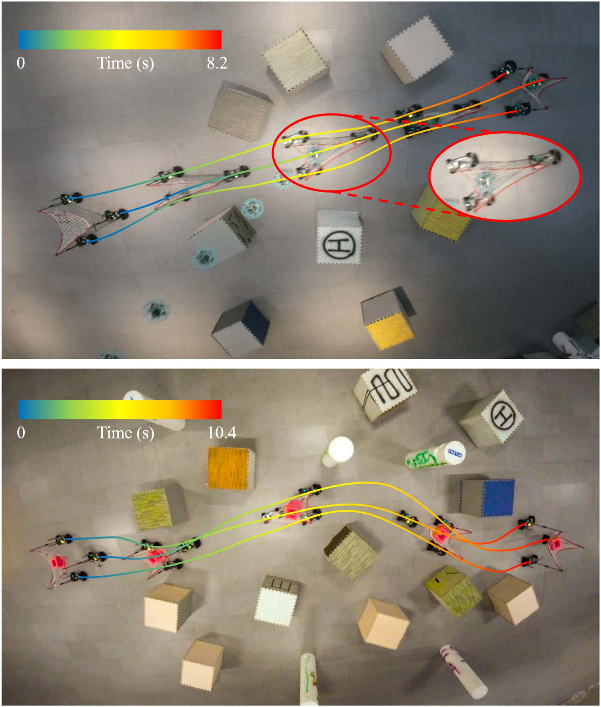
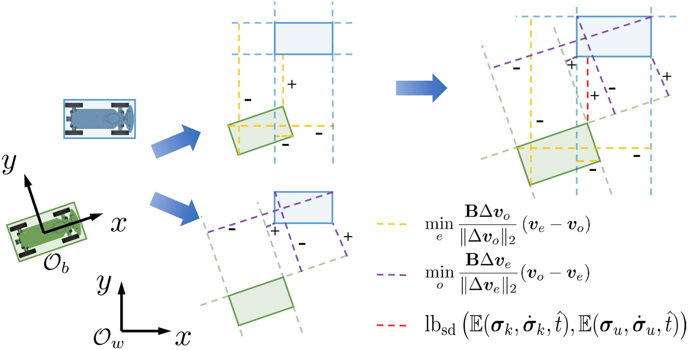
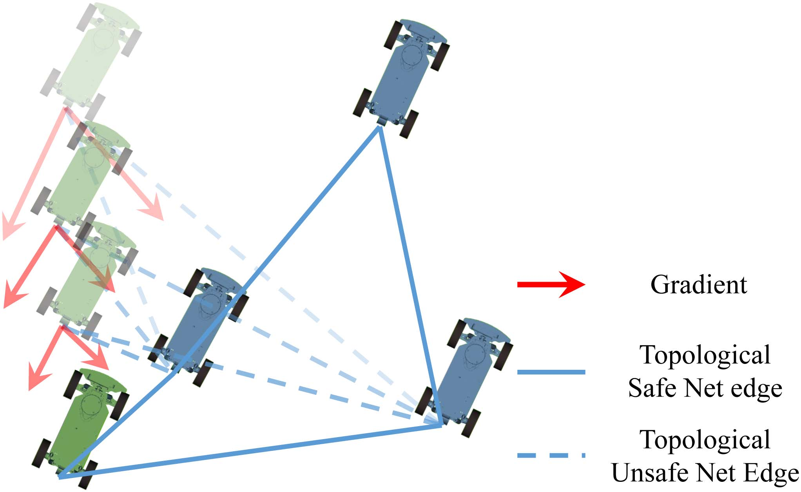
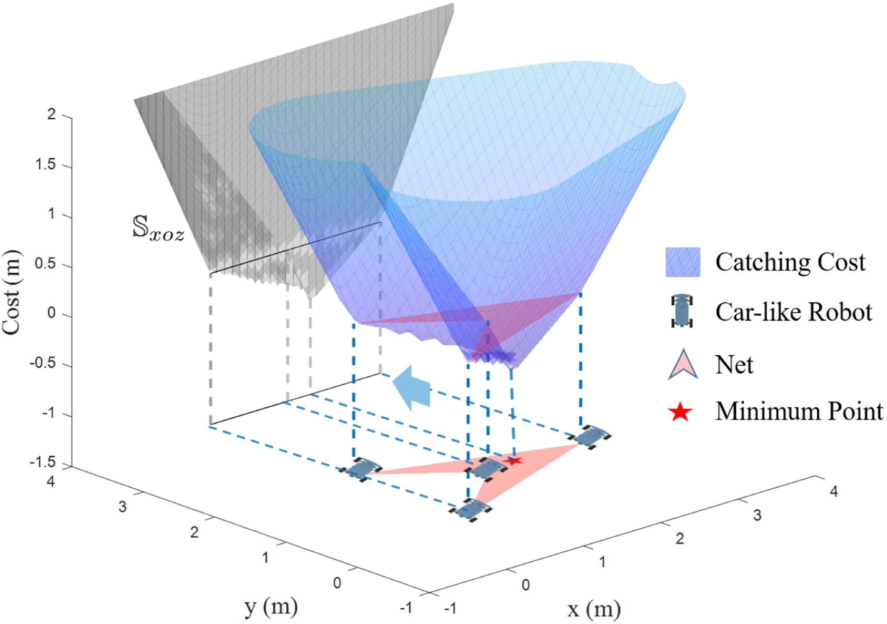
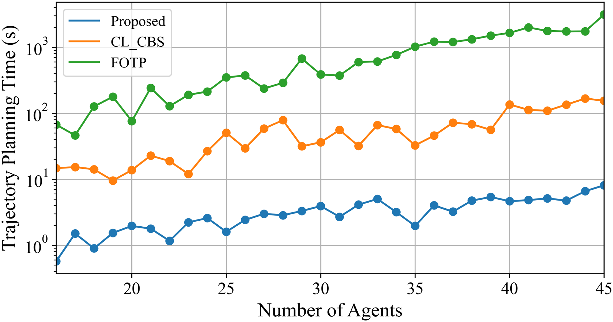
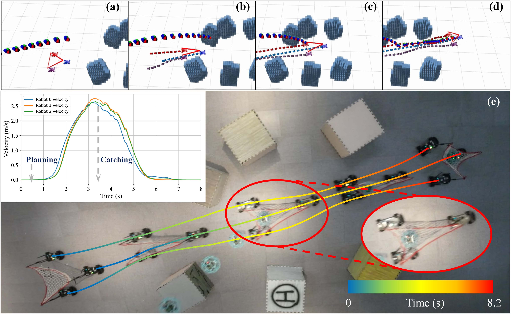

# 非结构化环境下多机协同接力物体捕获与运输规划（Collaborative Planning for Catching and Transporting Objects in Unstructured Environments）：完整忠实学术翻译

> **原文标题**：Collaborative Planning for Catching and Transporting Objects in Unstructured Environments  
> **作者**：Liuao Pei、Junxiao Lin、Zhichao Han、Lun Quan、Yanjun Cao、Chao Xu、Fei Gao  
> **发表信息**：IEEE Robotics and Automation Letters，第 9 卷第 2 期，2024 年 2 月，页 1098–1105  
> **原文 PDF**：[Collaborative Planning for Catching and Transporting Objects in Unstructured Environments.pdf](../Collaborative Planning for Catching and Transporting Objects in Unstructured Environments.pdf) ｜ **对应中文详解**：[09_非结构化环境下多机协同接力物体捕获与运输规划.md](../中文详解/09_非结构化环境下多机协同接力物体捕获与运输规划.md)  

---

## 原文第 1 页核心内容与翻译

非结构化环境下多机协同捕获与运输规划
Liuao Pei
, Junxiao Lin
, Zhichao Han
, Lun Quan
, Yanjun Cao
, Chao Xu
, Senior Member, IEEE,
and Fei Gao
, Member, IEEE
摘要——多机器人团队能够在非结构化环境中执行野外救援和协同运输等任务，因此受到工业界和学术界关注。
本文提出一种面向非完整机器人团队的非结构化环境协同轨迹规划方法。
针对机器人团队用网捕获并运输待救援目标的自适应队形协同问题，
作者以连续可微的形式描述网捕获坠落目标的过程，
使机器人团队能够充分发挥运动能力，
在合适的队形状态下完成捕获；同时通过几何约束保证网的尺寸安全和拓扑安全。
作者将算法部署到车式机器人团队，
并通过仿真和真实实验进行验证。与先进的多车辆轨迹规划方法相比，本文方法在计算效率和轨迹质量方面均表现出明显优势。
关键词——运动规划；多机器人系统；轨迹优化。
一、引言
随着车式机器人自主导航技术发展，科幻电影中描绘的复杂环境自适应协同救援和运输逐渐成为现实[1]、[2]。实现这些任务的关键，是为具有非完整运动约束的高维强耦合车式机器人团队制定精确且计算高效的协同规划方案。然而，同时实现高精度和高效率仍然困难。
Manuscript received 23 June 2023; accepted 30 October 2023. Date of
publication 22 November 2023; date of current version 20 December 2023.
This letter was recommended for publication by Associate Editor D. Saldaña
and Editor M. A. Hsieh upon evaluation of the reviewers’ comments. This work
was supported in part by the National Natural Science Foundation of China
under Grant 62322314 and in part by the Fundamental Research Funds for the
Central Universities. (Corresponding author: Fei Gao.)
Liuao Pei, Junxiao Lin, Zhichao Han, Lun Quan, Chao Xu, and Fei
Gao are with the State Key Laboratory of Industrial Control Technol-
ogy, Zhejiang University, Hangzhou 310027, China, and also with Huzhou
Institute, Zhejiang University, Huzhou 313000, China (e-mail: plaa@zju.
edu.cn; 3190103282@zju.edu.cn; zhichaohan@zju.edu.cn; lunquan@zju.edu.
cn; cxu@zju.edu.cn; fgaoaa@zju.edu.cn).
Yanjun Cao is with Huzhou Institute, Zhejiang University, Huzhou 313000,
China (e-mail: yanjundream@outlook.com).
This
letter
has
supplementary
downloadable
material
available
at
https://doi.org/10.1109/LRA.2023.3335770, provided by the authors.
Digital Object Identifier 10.1109/LRA.2023.3335770
在非结构化环境中在线完成自适应、精确的协同轨迹规划。
对于协同捕获和运输任务，除了考虑单个机器人的运动约束与避障，还必须准确、高效地描述团队之间的协同关系。
当机器人团队共同支撑一张网执行捕获和运输任务时，机器人团队、网与待救援目标之间存在多种复杂关系。
Firstly, when a rescue target falls, the net supported by the robot
team needs to catch the target in a theoretically feasible state of
the robot team, defined as adaptive catching. The state of team
formation when catching the target should be adjusted according
to the environment and the distance to the target. Secondly, The
trajectories need to keep the physical size of the net within
the range of fatigue and damage at every moment, defined as
size safety. At any given moment, the distance between any
two robots must not exceed the corresponding distance limit
associated with the two vertices. Thirdly, the net edges must not
be entangled by any agent, defined as topological safety. From
the initial time to any subsequent time, a robot should not pass
through an edge of the net supported by any two other robots.
The implementation of these collaborative relationships places
great demands on agents in terms of both time and space, thereby
creating a high-dimensional and strongly non-convex problem.
However, there currently exists no method capable of planning
the trajectories of non-holonomic robot teams to complete the
catching and transporting tasks online.
To bridge this research gap, we propose an efficient central-
ized planning framework for car-like robotic teams. Based on
this framework, we model catching targets in a continuous and
differentiable form for any feasible robot formation, allowing
for fast gradient descent in optimization. As a result, the robot
team is capable of fully exploiting its potential, deforming
itself to a more appropriate state to catch the target. Further-
more, we impose restrictions on the size of the net and the
topology of the team formation by accurately modeling the
formation relationships. The size safety and topological safety
of the rescue net supported by the robot team are guaranteed
during navigation. Moreover, due to the adoption of efficient
trajectory representation and decision variables transformation
in optimization, all of these collaborative trajectories planning
can be effectively completed online, making it possible for the
robot team to perform catching and transporting tasks timely
and accurately.
2377-3766 © 2023 IEEE. Personal use is permitted, but republication/redistribution requires IEEE permission.
See https://www.ieee.org/publications/rights/index.html for more information.
Authorized licensed use limited to: National Institute of Technology- Delhi. Downloaded on August 24,2026 at 05:46:40 UTC from IEEE Xplore.  Restrictions apply.

---

## 原文第 2 页核心内容与翻译

PEI 等：非结构化环境下多机协同捕获与运输规划
1099
作者将该算法应用于车式机器人团队，并
在仿真和真实环境中对坠落目标开展捕获与运输实验。
如图 1 所示，实验结果表明，该算法能够在非结构化环境中捕获其能力范围内的目标。作为协同规划的基础框架，
作者将本文方法与多种先进的多车辆轨迹规划（MVTP）方法[3]–[7]进行比较。结果表明，随着机器人数量增加，本文方法在计算时间和成功率方面都具有明显优势。本文贡献概括如下：
1）提出一种高效的车式机器人团队协同规划方法，能够在非结构化环境中生成满足运动学和动力学可行性的安全轨迹。
2）针对实时协同捕获和运输规划，对多种关键协同关系进行建模，并在上述框架中实现这些关系。
3）将所提方法部署到车式机器人团队，并通过仿真和真实环境实验进行验证，同时公开软件供研究人员参考。
二、相关工作
目前，用于求解 MVTP 问题的方法主要分为耦合方法和解耦方法。为降低耦合方法带来的巨大问题规模，解耦方法将 MVTP 问题分解为若干子问题并逐步求解。Li 等人[8]针对非完整移动机器人提出了一种带优先级的轨迹优化方法。该方法首先利用增强型冲突基搜索（ECBS）[9]获取无碰撞路径，并基于这些路径建立安全走廊；随后通过分组策略提高整体求解效率。为提高优化成功率，方法在代价函数中引入了偏离初始轨迹的惩罚项，但这显著限制了解空间。此外，顺序优化在密集环境中可能导致死锁，从而无法求解问题。Luis 等人[7]提出了一种基于分布式模型预测控制（DMPC）的多智能体运动规划框架，并采用按需避碰来划分自由空间，使轨迹能够实时规划，同时运动保守性更低、转移时间更短。然而，DMPC 只关注特定预测时域内的规划，因此智能体的完整轨迹通常不是最优的。

为在解中考虑多个智能体的未来状态，集中式方法在一个问题中同时求解所有智能体的轨迹。Chen 等人[6]通过逐步收紧碰撞约束求解 MVTP 问题，从而形成一系列更宽松且可行的中间优化问题。他们将智能体视为圆形进行避碰，这种处理较为保守，且在运动学复杂时无法保证每个

**图 1**：Fig. 1.
车式机器人团队在非结构化环境中协同捕获和运输物体的实验结果。上图：机器人团队用共同支撑的网协同接住坠落无人机。下图：机器人团队将物体运过非结构化环境。

二次规划（QP）问题都可求解。Li 等人[10]提出自适应缩放约束优化（ASCO）方法，将耦合最优控制问题（OCP）中难以处理的大规模约束分解开来，并在迭代框架中逐步解决；在每次迭代中，仅在自适应范围内实施部分避碰约束。Ouyang 等人[5]提出一种两阶段方法，先确定可行的同伦类，再基于该同伦类寻找局部最优解。然而，他们将车式机器人近似为两个圆进行障碍物避让，这种方法较为保守；同时，该问题以密集状态作为优化变量，难以保证实时性能。Wen 等人[11]针对非完整运动学模型提出时空混合状态 A* 方法，引入称为车式冲突基搜索（CL-CBS）的分层搜索求解器，并采用实体冲突树处理考虑智能体形状的碰撞。
三、协同轨迹优化
本节介绍车式机器人的运动模型和微分平坦性[12]，并将协同规划表述为一个优化问题。随后给出约束处理方法、基本运动学约束以及智能体的环境障碍物避让约束。
Authorized licensed use limited to: National Institute of Technology- Delhi. Downloaded on August 24,2026 at 05:46:40 UTC from IEEE Xplore.  Restrictions apply.

---

## 原文第 3 页核心内容与翻译

A. 车式机器人的微分平坦性
采用笛卡尔坐标系下的简化运动学自行车模型描述车式机器人的运动学。假设车辆由前轮驱动和转向，车轮纯滚动且不打滑，则该模型可表示为
⎧
⎪
⎪
⎨
⎪
⎪
⎩
˙px = v cos θ, ˙py = v sin θ,
˙θ = 1
Lv tan φ,
˙v = at, ˙an = v2κ,
κ = tan φ/L.
(1)
状态向量为 x = (px, py, θ, v, at, an, φ, κ)T，其中 p = (px, py)T 表示后轮中心的位置，θ 表示机器人车体的偏航角，v 表示相对于机器人车体坐标系的纵向速度，at 表示纵向加速度，an 表示横向加速度，φ 表示前轮转角，κ 表示曲率，L 表示车式机器人的轴距。选取两个微分平坦输出 σ := (σx, σy)T 作为优化变量；其物理含义为 σ = p，即以车辆后轮为中心的位置，其动力学关系为：
⎧
⎪
⎪
⎪
⎪
⎪
⎪
⎪
⎪
⎪
⎪
⎨
⎪
⎪
⎪
⎪
⎪
⎪
⎪
⎪
⎪
⎪
⎩
v = η

˙σ2x + ˙σ2y,
θ = arctan 2(η ˙σx, η ˙σy),
at = η( ˙σx¨σx + ˙σy¨σy)/

˙σ2x + ˙σ2y,
an = η( ˙σx¨σy −˙σy¨σx)/

˙σ2x + ˙σ2y,
φ = arctan

η( ˙σx¨σy −˙σy¨σx)L/( ˙σ2
x + ˙σy)
3
2

,
κ = η( ˙σx¨σy −˙σy¨σx)/( ˙σ2
x + ˙σ2
y)
3
2 ,
(2)
其中，附加变量 η 用于描述机器人的运动方向，η = −1 和 η = 1 分别表示倒车和前进[13]。
B. 优化问题构造
对于群体中的第 k 个智能体，其轨迹的第 i 段被表示为二维多项式。该段轨迹被划分为 Mi,k 个阶数为 2s − 1 的片段，系数矩阵为 ci,k = [cT
i,1,k, cT
i,2,k, . . ., cT
i,Mi,k,k]T ∈R2sMi,k×2，统一时间间隔为 Ti,k ∈R+。于是，该轨迹片段可表示为：
σi,j,k(t) = cT
i,j,kβ(t),
β(t) := [1, t, . . ., t2s−1]T ,
∀t ∈[0, Ti,k], ∀j ∈{1, 2, . . ., Mi,k},
∀i ∈{1, 2, . . ., nk},
∀k ∈{1, 2, . . ., K},
(3)
其中，K 为协作智能体的数量，nk 为第 k 个智能体的轨迹段数。轨迹 σi,k : [0, Ti,k] 的第 i 段为：
σi,k(t) = σi,j,k(t −(j −1) ∗Ti,k),
∀j ∈{1, 2, . . ., Mi,k}, t ∈[(j −1) ∗Ti,k, j ∗Ti,k] .
(4)
第 k 个智能体轨迹的第 i 段总时长为 τk = Mi,k ∗Ti,k。由此可得到第 k 个智能体的轨迹：
σk(t) = σi(t −τi,k),
∀i ∈{1, 2, . . ., nk}, t ∈[τi,k, τi+1,k] ,
(5)
其中，τk = 	nk
i=1 Ti,k 为完整轨迹的持续时间，τi,k = 	i
¯i=1 为第 i 段起点的时间戳，且 τ1 = 0。此外，对第 k 个智能体定义系数集合 ck = [c1,k, c2,k, . . ., cn,k]T ∈R(nk
i=1 Mi,ks)×2 和时间向量 Tk = [T1,k, T2,k, . . ., Tn,k]T ∈Rn。随后定义系数集合 c = [c1, c2, . . ., cK] ∈R2Mis×2nK 以及时间向量 T = [T1, T2, . . ., TK]T ∈Rnk，以便进行后续推导。
为了保证轨迹的平滑性、机动性和协同性，对所有智能体的控制输入代价、时间正则项和协同代价进行优化。此外，为保证轨迹满足运动动力学可行性并能够胜任协作任务，还需要施加相应约束。优化问题表述为：
min
c,T
K
k=1
τk
0
μk(t)T Wμk(t)dt+wT τk
+Ψobj(c,T) (6a)
s.t.μk(t) = σ[s]
k (t), ∀t ∈[0, τk],
(6b)
σ[s−1]
i,k
(0) = ¯σ0,i,k,
(6c)
σ[ 
d]
i,j,k(δTi) = σ[ 
d]
i,j+1,k(0),
(6d)
Ti,k > 0,
(6e)
Gd(σ(t), . . ., σ(s)(t), t) ⪯0, ∀d ∈D, ∀t ∈[0, τk],
∀i ∈{1, 2, . . ., nk}, ∀j ∈{1, 2, . . ., Mi,k −1},
∀k ∈{1, 2, . . ., K},
(6f)
其中，W ∈R2×2 为用于惩罚控制输入的对角矩阵，wT τk 为时间正则项，Ψobj(c,T) 为考虑协同捕获和运输任务时的协同代价，将在第 IV-C 节介绍。根据前序工作[14]中证明的最优性条件，整段分段多项式轨迹只需通过各片段的航点和持续时间进行参数化，即可满足等式约束 (6c)–(6d)。对于 (6e) 中严格要求为正的轨迹持续时间，利用光滑双射将其映射为无约束的虚拟时间 ς ∈R。式 (6f) 由环境障碍物避让、智能体间避碰、运动动力学约束和协同约束组成，其中 D = {v, at, an, κl, κr, C, Θ, Lnet, Tnet} 将在后续章节介绍。采用惩罚项 SΣ 放宽可行性约束 (6f)，从而将原优化问题改写为无约束形式，并可利用 L-BFGS 算法[15]高效求解。更多应用细节见补充材料第 II 节[16]。
Authorized licensed use limited to: National Institute of Technology- Delhi. Downloaded on August 24,2026 at 05:46:40 UTC from IEEE Xplore.  Restrictions apply.

---

## 原文第 4 页核心内容与翻译

PEI 等：非结构化环境下多机协同捕获与运输规划
1101

**图 2**：Fig. 2.
有符号距离下界示意图。首先计算
一个多边形各顶点到另一个多边形各边的最小距离，得到紫色和黄色虚线；随后取这些距离中的最大值，对应红色虚线。距离的正负号标注在相应线段旁。

C. 单个机器人的约束
1) 运动动力学约束：机器人运动过程中，其线速度、线加速度、横向加速度和转向角受到机器人电机、舵机、轮胎等部件物理特性的限制。这些运动动力学约束可表示为：
⎧
⎪
⎪
⎪
⎪
⎪
⎪
⎪
⎨
⎪
⎪
⎪
⎪
⎪
⎪
⎪
⎩
Gv( ˙σ) = ˙σT ˙σ −v2
max,
Gat( ˙σ, ¨σ) = (¨σT ˙σ)2
˙σT ˙σ
−a2
tmax,
Gan( ˙σ, ¨σ) = (¨σT B ˙σ)2
˙σT ˙σ
−a2
nmax,
Gκl( ˙σ, ¨σ) = ¨σT B ˙σ
|| ˙σ||3
2 −κmax,
Gκr( ˙σ, ¨σ) = −¨σT B ˙σ
|| ˙σ||3
2 −κmax,
(7)
其中，vmax 为最大纵向速度的幅值，atmax/anmax 分别为最大纵向/横向加速度，B :=

0
−1;
1
0

是满足 BT = −B 性质的辅助 2 × 2 矩阵，κmax 为相应的最大曲率。由于正切函数具有单调性，通过将曲率 κ = tan φ/L 限制在 [−tan φmax/L, tan φmax/L] := [−κmax, κmax] 内来约束前轮转角，其中 φmax 为预设的最大转向角。
2) 环境障碍物避让：考虑到机器人的形状，为充分利用安全解空间，障碍物避让时采用机器人的几何形状，而不是将机器人视为一个点。在通过混合 A* [17]获得栅格地图和初始路径后，对路径进行采样以生成安全走廊[18]，并约束机器人在轨迹上的完整车体位于安全走廊内。如图 2 所示，将机器人的质心和朝向分别定义为车体坐标系的原点和 x 方向。表示车体坐标系相对于世界坐标系朝向的旋转矩阵 R 可表示为：
R =
η
∥˙σ∥2

˙σ, B ˙σ

.
(8)
定义第 k 个机器人的顶点集合 E 为：
Ek = {ve ∈R2 : ve = σ + Rle, e = 1, 2, . . ., ne},
(9)
其中，ne 为顶点数量，le 为第 e 个顶点在车体坐标系中的坐标。驾驶走廊中每个凸多边形 C 的 H 表示[19]为：
C = {q ∈R2 : Aq ≤b},
A = [A1, . . ., Az, . . ., Anz]T ∈Rnz×2,
b = [b1, . . ., bz, . . ., bnz]T ∈Rnz,
(10)
其中，nz 为超平面的数量，Az ∈R2 和 bz ∈R 为超平面的描述量，可由超平面上的一点及其法向量确定。因此，轨迹上机器人完整车体位于安全走廊内的约束可表示为：
GC(σ, ˙σ) = AT
z (σ + Rle) −bz,
∀z ∈{1, 2, . . ., nz} (11)
四、协同捕获与运输
A. 机器人之间的避碰
为保证智能体安全，要求任意时刻智能体之间的凸多边形距离大于安全距离 dm。因此，智能体间避碰约束定义为 GΘ(σ, ˙σ) = [GΘ1, . . ., GΘu, . . ., GΘNu ]T ∈RNu，其中 Nu = k(k−1)
2
为群体智能体两两组合的数量。第 k 个和第 u 个智能体在约束点处的约束定义为：
GΘk,u(σk, ˙σk, σu, ˙σu) = dm −U (Ek, Eu) ,
(12)
其中，dm 为最小安全距离，U(Ek, Eu) 表示第 k 个与第 u 个智能体之间的凸多边形距离。在智能体协同轨迹优化中，需要以连续可微的方式计算智能体之间的凸多边形距离。本文采用基于 Minsky 差分的最大-最小平滑算法[20]，计算凸多边形有符号距离的下界近似并获得其导数，表示为：
lbsd (Ek, Eu) = max

max
e
min
o
BΔve
∥Δve∥2
(vo −ve),
max
o
min
e
BΔvo
∥Δvo∥2
(ve −vo)

,
ve ∈Ek, vo ∈Eu,
(13)
其中，Δve = ve+1 −ve，Δvu = vu+1 −vu。两个车辆间有符号距离下界的物理含义如图 2 所示。为解决式 (13) 中的梯度不连续问题，采用 log-sum-exp 函数对最大值和最小值运算进行平滑[21]。
B. 协同运输
为实现协同运输能力，通常由机器人团队共同支撑一张网，这要求维持网的尺寸安全和拓扑安全。对于尺寸安全，约束每个智能体与相邻智能体之间的距离小于相应的网边长度，具体表示为：
Authorized licensed use limited to: National Institute of Technology- Delhi. Downloaded on August 24,2026 at 05:46:40 UTC from IEEE Xplore.  Restrictions apply.

---

## 原文第 5 页核心内容与翻译

**图 3**：Fig. 3.
优化过程中实现拓扑安全的过程。最浅的绿色表示绿色机器人的初始状态。利用上述公式获得两个方向上的梯度，使网达到拓扑安全。

可表示为：
GLnet(σk, σN(k)) = ∥σk −σN(k)∥2 −Lnet
k
,
∀k ∈{1, 2, . . ., K},
(14)
其中，N(k) 表示与第 k 个智能体相邻的下一个智能体编号，可表示为：
N(k) =

k + 1,
k < K,
1,
k = K,
(15)
Lnet
k
表示第 k 个与第 N(k) 个智能体之间的网边长度。此外，为在协同支撑网的过程中维持网的拓扑结构，需要约束智能体到非相邻网边所在直线的有符号距离为正，具体表示为：
GTnet(σk, σp, σN(p)) = B(σN(p) −σp)T
∥σN(p) −σp∥2
(σk −σp),
∀p ∈{p ∈{1, 2, . . ., K} : p̸ = k, N(p)̸ = k},
∀k ∈{1, 2, . . ., K}.
(16)
具体过程如图 3 所示。通过梯度下降，协作机器人团队实现拓扑安全。需要注意的是，蓝色机器人也会同时调整自身状态以确保拓扑安全，只是为使图示清晰而未在图中表示。沿轨迹同时对智能体位置施加这两个约束，即可在整个支撑期间保证网的尺寸安全和拓扑安全。
C. 自适应捕获
通过协调机器人团队捕获物体并将该过程纳入优化，可以尽可能扩大成功的时空可行解空间，使智能体能够在复杂环境中以高速状态完成捕获。

对于需要捕获的 E 个物体，按落地时间排序，令 (pe, te) 分别表示预测的落地点和落地时间。为保证机器人团队在任意队形下都能够完成救援任务，采用以下公式描述落地点与队形之间的关系。首先，从落地点沿任意方向发出一条射线，检查该射线与当前队形形成的多边形（参见第 IV-B 节）的交点数量。若交点数为奇数，则定义落地点位于多边形内部，并令 Υ = −1；若交点数为偶数，则定义落地点位于多边形外部，并令 Υ = 1。于是，该点与队形多边形之间的有符号距离可表示为：
D(σ, pe, te) = Υ min
k
 −pe + σk
+ L((σN(k) −σk)T (pe −σk)
∥σN(k) −σk∥2
2
)(σN(k) −σk)

2

,
k ∈{1, . . ., K}, e ∈{1, . . ., E},
(17)
其中，平滑函数 L(x) 定义为：
L(x) =
⎧
⎪
⎪
⎪
⎪
⎪
⎪
⎪
⎪
⎪
⎨
⎪
⎪
⎪
⎪
⎪
⎪
⎪
⎪
⎪
⎩
0,
x ≤0,
−1
ϵ2 x3 + 2
ϵ x2,
0 < x ≤ϵ,
x,
ϵ < x ≤1 −ϵ,
−1
ϵ2 x3 + 3−2ϵ
ϵ2 x2
+ 4ϵ−3
ϵ2 x + (ϵ−1)2
ϵ2
,
1 −ϵ < x ≤1,
1,
x > 1,
(18)
其中，ϵ ∈R+ 为一个很小的正数。基于此，可以计算目标落地点与机器人团队队形之间的有符号距离。针对机器人协同捕获目标，提出如下协同代价函数 Ψ：
Ψobj =
⎧
⎪
⎪
⎪
⎨
⎪
⎪
⎪
⎩
ωceD,
D < −ϵ,
ωce−ωca
4ϵ3
D4 −3(ωce−ωca)
4ϵ
D2
+ ωce+ωca
2
D,
−ϵ < D < ϵ,
ωcaD,
D > ϵ,
(19)
其中，ωce 和 ωca 分别是将目标引导至网中心和保证捕获目标的权重。如图 4 所示，非凸多边形队形可以基于式 (19) 构造连续可微的代价，使机器人团队能够自适应地捕获目标，并在捕获时主动扩大队形。此外，为使轨迹末端更适应环境且更加平滑，放宽了轨迹的末状态。
Mi,k (Ti,k) ci,k = bi,k,
1 ≤i ≤Nk, 1 ≤k ≤K,
(20)
其中，Mi,k 是[14]中定义的可逆矩阵。本文将 bnk 定义为：
bnk = (pnk−1, vnk−1, 02×(s−2), qnk,1, 02× ˜d, . . .,
qnk,Mnk,k−1, 02× ˜d, σf
k)T,
∀k ∈{1, . . ., K},
(21)
其中，σf
k 是第 k 个机器人的最终位置。将轨迹最终位置纳入决策变量，则目标函数关于最终位置的梯度
Authorized licensed use limited to: National Institute of Technology- Delhi. Downloaded on August 24,2026 at 05:46:40 UTC from IEEE Xplore.  Restrictions apply.

---

## 原文第 6 页核心内容与翻译

PEI 等：非结构化环境下多机协同捕获与运输规划
1103

**图 4**：Fig. 4.
机器人团队队形为非凸多边形时形成的协同捕获代价 Ψobj。优化过程中，通过改变各智能体的位置，使代价函数的最小点尽可能接近目标的落地点。

**图 5**：Fig. 5.
不同智能体数量下的计算时间。

可推导为：
∂J
∂σf
k
=
M−T
i
∂J
ci
T
e2sMnk,k,
(22)
通过优化轨迹的末端位置，机器人团队可以自由选择更加平滑的停车位置。
五、评估与实验
A. 基准方法比较
为验证本文方法的有效性和计算效率，作者将其与多种先进的 MVTP 方法进行比较。所有方法均在 Intel i7-12700 处理器、32 GB 内存的计算机上测试，共测试 100 个包含 8 个随机尺寸和随机位置障碍物的案例。为保证比较公平，对使用混合 A* 的方法提供相同的初始解[17]。补充材料第 7 节给出了更多细节[16]。实验改变机器人数量，记录成功率、计算时间、轨迹平均执行时间、最长轨迹平均执行时间、轨迹平均总长度以及平均加速度代价，结果见表 I。
从数据可以看出，FOTP 的成功率较高，但由于轨迹中所有状态和输入都作为密集决策变量，问题维度极高，导致计算负担巨大。相比之下，本文方法优化多项式轨迹各片段的航点和持续时间，因此在计算时间上相较 FOTP 具有显著优势。另一方面，本文方法只需改进不考虑避碰的初始路径，即可在较短时间内完成智能体间的避碰，从而显著降低对初始路径的依赖。

MNHP 方法采用结合分组和优先级策略的分布式方法，但存在若干局限。首先，它将机器人视为圆形进行障碍物避让，这种处理较为保守，会缩小解空间。当环境中必须考虑机器人形状时，尤其是在机器人形状至关重要的狭窄空间中，该局限会削弱方法的有效性。其次，MNHP 在代价函数中惩罚轨迹偏离 ECBS [9]提供的初始值的程度。这种对初始值的强依赖会显著影响其性能。测试表明，当该代价项的权重设为 0 时，MNHP 难以实现智能体间避碰。第三，MNHP 不优化轨迹时间，并要求所有智能体同时到达指定终状态。这一约束进一步降低了实现成功的时空避碰的可能性。上述三个局限共同限制了 MNHP 的有效性。

DMPC 采用基于优先级的策略和按需障碍物避让策略。然而，它在每次规划迭代中只考虑近期未来的局部信息，导致行为过于贪婪、轨迹质量较差。在障碍物和智能体密集的区域，它经常绕行，甚至可能由于过于贪婪而陷入不可行状态。所有这些因素都会导致 DMPC 成功率较低、行驶距离较长。相比之下，本文的耦合方法在保持相较 DMPC 显著计算效率优势的同时，能够提供更高的解质量和成功率。

从数据可以看出，CL-CBS 的成功率较高，但它只提供带有时间序列、可作为可行解的路径，并不会改善平滑性。此外，由于其采用半分散式求解方式，在解空间不断缩小的情况下，必须面对计算时间快速增长的问题，且低优先级智能体的轨迹质量更差。

针对表中成功率最高的两种方法 FOTP 和 CL-CBS，在不同智能体数量的规划案例下进行了测试，结果如图 5 所示。可以观察到，随着智能体数量增加，本文方法的计算时间逐渐增加，其增长幅度小于其他方法。然而，同样基于优化的 FOTP 在智能体数量超过 35 个后，计算时间达到 1000 s 以上。
Authorized licensed use limited to: National Institute of Technology- Delhi. Downloaded on August 24,2026 at 05:46:40 UTC from IEEE Xplore.  Restrictions apply.

---

## 原文第 7 页核心内容与翻译

**图 6**：Fig. 6.
真实坠落飞机救援实验。机器人团队的协同救援轨迹在 0.053 s 内生成，并成功救起坠落飞机。（a）机器人团队的初始状态；飞机发生故障并开始坠落。（b）团队变换队形并绕开障碍物，同时保持机器人和救援网的安全。（c）团队在捕获目标前后主动扩大网的救援范围，以提高成功率并提供缓冲。（d）团队在安全区域平稳停车。（e）全局轨迹规划结果。

TABLE I
表 I  与当前先进多车辆轨迹规划方法的轨迹生成结果比较
Authorized licensed use limited to: National Institute of Technology- Delhi. Downloaded on August 24,2026 at 05:46:40 UTC from IEEE Xplore.  Restrictions apply.

---

## 原文第 8 页核心内容与翻译

PEI et al.: COLLABORATIVE PLANNING FOR CATCHING AND TRANSPORTING OBJECTS IN UNSTRUCTURED ENVIRONMENTS
1105
B. 真实环境实验
实验场地为 6 m × 12 m，设置了随机障碍物，机器人团队共同支撑一张网。
 
集中式规划平台采用第八代 Intel i5-8700 处理器和 16 GB 内存，
轨迹在线发送给各机器人跟踪。
作者将网的三个顶点分别固定在三台车式机器人的车尾，并在场地中开展协同运输实验。给定目标状态后，中央计算平台计算机器人团队轨迹，再由每台机器人的 MPC 控制器跟踪[23]。MPC 作为通用轨迹跟踪器，控制实验机器人的时空轨迹；它采用式（1）中的同一模型，输入为本文方法生成的团队轨迹。补充材料第 III 节给出了更多实现细节[16]。图 6 展示了捕获过程，其中故障无人机作为救援目标。飞行过程中无人机突然发生故障并坠落。在已知预计坠落位置和时间的条件下，系统开始规划协同救援轨迹。本文方法仅用 0.053 s 就为三台车式机器人生成协同轨迹。整个过程中，轨迹既满足每台机器人的运动学和运动安全要求，也保证网的尺寸安全与拓扑安全。生成的轨迹充分发挥了机器人的运动能力，完成了救援任务。如图 6(e) 所示，为完成远距离救援，机器人团队先以接近最大加速度加速，并以接近最大速度完成捕获；随后由于放松了末端状态约束，团队在安全区域平稳停车。
六、结论
本文介绍了一套能够协同捕获和运输目标的机器人团队规划系统。通过对协同任务进行建模，作者完成了车式机器人团队的协同捕获与运输规划。与现有多种多车辆轨迹规划方法的比较表明，本文方法具有较好的解质量和规模扩展能力；仿真和真实实验验证了方法的稳定性与灵活性。下一步可将方法扩展到三维环境中的运输任务，使团队队形能够改变高度，帮助被运输物体避开障碍物。
REFERENCES
[1] J. Alonso-Mora, R. Knepper, R. Siegwart, and D. Rus, “Local motion plan-
ning for collaborative multi-robot manipulation of deformable objects,” in
Proc. IEEE Int. Conf. Robot. Automat., 2015, pp. 5495–5502.
[2] H. Zhang, H. Song, W. Liu, X. Sheng, Z. Xiong, and X. Zhu, “Hierarchical
motion planning framework for cooperative transportation of multiple
mobile manipulators,” 2022, arXiv:2208.08054.
[3] L.Wen,Y.Liu,andH.Li,“CL-MAPF:Multi-agentpathfindingforcar-like
robots with kinematic and spatiotemporal constraints,” Robot. Auton. Syst.,
vol. 150, 2022, Art. no. 103997.
[4] J. Li, M. Ran, and L. Xie, “Efficient trajectory planning for multiple non-
holonomic mobile robots via prioritized trajectory optimization,” IEEE
Robot. Automat. Lett., vol. 6, no. 2, pp. 405–412, Apr. 2021.
[5] Y. Ouyang, B. Li, Y. Zhang, T. Acarman, Y. Guo, and T. Zhang, “Fast
and optimal trajectory planning for multiple vehicles in a nonconvex and
cluttered environment: Benchmarks, methodology, and experiments,” in
Proc. Int. Conf. Robot. Automat., 2022, pp. 10746–10752.
[6] Y. Chen, M. Cutler, and J. P. How, “Decoupled multiagent path planning
via incremental sequential convex programming,” in Proc. IEEE Int. Conf.
Robot. Automat., 2015, pp. 5954–5961.
[7] C. E. Luis, M. Vukosavljev, and A. P. Schoellig, “Online trajectory
generation with distributed model predictive control for multi-robot mo-
tion planning,” IEEE Robot. Automat. Lett., vol. 5, no. 2, pp. 604–611,
Apr. 2020.
[8] J. Li, M. Ran, and L. Xie, “Efficient trajectory planning for multiple non-
holonomic mobile robots via prioritized trajectory optimization,” IEEE
Robot. Automat. Lett., vol. 6, no. 2, pp. 405–412, Apr. 2021.
[9] M. Barer, G. Sharon, R. Stern, and A. Felner, “Suboptimal variants of the
conflict-based search algorithm for the multi-agent pathfinding problem,”
in Proc. Int. Symp. Combinatorial Search, 2014, vol. 5, pp. 19–27.
[10] B. Li, Y. Ouyang, Y. Zhang, T. Acarman, Q. Kong, and Z. Shao,
“Optimal cooperative maneuver planning for multiple nonholonomic
robots in a tiny environment via adaptive-scaling constrained opti-
mization,” IEEE Robot. Automat. Lett., vol. 6, no. 2, pp. 1511–1518,
Apr. 2021.
[11] L. Wen, Z. Zhang, Z. Chen, X. Zhao, and Y. Liu, “CL-MAPF: Multi-
agent path finding for car-like robots with kinematic and spatiotemporal
constraints,” Robot. Auton. Syst., vol. 150, Apr. 2022, Art. no. 103997.
[12] R. M. Murray, M. Rathinam, and W. Sluis, “Differential flatness of
mechanical control systems: A catalog of prototype systems,” in Proc.
ASME Int. Congr. Expo., 1995, pp. 1–12.
[13] Z.
Han
et
al.,
“An
efficient
spatial-temporal
trajectory
plan-
ner for autonomous vehicles in unstructured environments,” IEEE
Trans. Intell. Transp. Syst., 2023, early access, Oct. 13, 2023,
doi: 10.1109/TITS.2023.3315320.
[14] Z. Wang, X. Zhou, C. Xu, and F. Gao, “Geometrically constrained trajec-
tory optimization for multicopters,” IEEE Trans. Robot., vol. 38, no. 5,
pp. 3259–3278, Oct. 2022.
[15] D. C. Liu and J. Nocedal, “On the limited memory BFGS method for
large scale optimization,” Math. Program., vol. 45, no. 1–3, pp. 503–528,
1989.
[16] L. Pei, “Supplementary materials for collaborative planning for catch-
ing and transporting objects in unstructured environments,” Sep. 2023,
doi: 10.5281/zenodo.8376633.
[17] D. A. Dolgov, S. Thrun, M. Montemerlo, and J. Diebel, “Path planning
for autonomous vehicles in unknown semi-structured environments,” Int.
J. Robot. Res., vol. 29, pp. 485–501, 2010.
[18] X. Zhong, Y. Wu, D. Wang, Q. Wang, C. Xu, and F. Gao, “Generating large
convex polytopes directly on point clouds,” 2020, arXiv:2010.08744.
[19] D. Avis, K. Fukuda, and S. Picozzi, “On canonical representations of con-
vex polyhedra,” in Mathematical Software. Singapore: World Scientific,
2002, pp. 350–360.
[20] S. Cameron and R. K. Culley, “Determining the minimum translational
distance between two convex polyhedra,” in Proc. IEEE Int. Conf. Robot.
Automat., vol. 3, pp. 591–596, 1986.
[21] I. Goodfellow, Y. Bengio, and A. Courville, Deep Learning. Cambridge,
MA, USA: MIT Press, 2016.
[22] F. Augugliaro, A. P. Schoellig, and R. D’Andrea, “Generation of collision-
free trajectories for a quadrocopter fleet: A sequential convex program-
ming approach,” in Proc. IEEE/RSJ Int. Conf. Intell. Robots Syst., 2012,
pp. 1917–1922.
[23] J. Kong, M. Pfeiffer, G. Schildbach, and F. Borrelli, “Kinematic and
dynamic vehicle models for autonomous driving control design,” in Proc.
IEEE Intell. Veh. Symp., 2015, pp. 1094–1099.
Authorized licensed use limited to: National Institute of Technology- Delhi. Downloaded on August 24,2026 at 05:46:40 UTC from IEEE Xplore.  Restrictions apply.

---
