# 紧密协作下的高性价比无人机集群导航系统（Cost-Effective Swarm Navigation System via Close Cooperation）：完整忠实学术翻译

> **原文标题**：Cost-Effective Swarm Navigation System via Close Cooperation
> **作者**：Nanhe Chen、Zhehan Li、Lun Quan、Xinwei Chen、Chao Xu、Fei Gao、Yanjun Cao
> **发表信息**：IEEE Robotics and Automation Letters，第 9 卷第 11 期，2024 年 11 月，页 9343–9350
> **原文 PDF**：[Cost-Effective Swarm Navigation System via Close Cooperation.pdf](../Cost-Effective Swarm Navigation System via Close Cooperation.pdf) ｜ **对应中文详解**：[10_紧密协作下的高性价比无人机集群导航系统.md](../中文详解/10_紧密协作下的高性价比无人机集群导航系统.md)

---

## 原文第 1 页核心内容与翻译

紧密协作下的高性价比无人机集群导航系统
Nanhe Chen、Zhehan Li（IEEE 学生会员）、Lun Quan、Xinwei Chen、Chao Xu（IEEE 高级会员）、Fei Gao（IEEE 会员）以及 Yanjun Cao（IEEE 会员）

**摘要**——多机器人系统旨在充分利用个体优势，实现全局成本效益。例如，可以利用无人机（UAV）的敏捷性进行巡检，利用地面车辆（UGV）的能力执行重载任务。多个机器人运动的智能协调本就很复杂；当集群中的机器人没有配备足够的环境感知传感器时，问题会更加困难（例如，本文场景中只有一个机器人配备了深度相机）。为此，我们提出一个用于在未知场景中导航无人机—无人车集群的紧耦合系统框架。该系统仅配备一个具有有限视场的深度相机用于环境感知。我们通过为无人机提出顺序探索与辅助定位（SEAL）规划策略、为无人车提出碰撞自适应轨迹（CAT）优化，充分挖掘机器人之间的协作潜力。无人机利用相对位姿估计和自身的全局定位辅助无人车定位，同时专注于探索，为无人车提供丰富的环境信息。无人车团队可以在障碍物密集的环境中安全、自主地导航，甚至仅依靠轮式里程计和无人机在 CAT 优化中的辅助来维持队形。我们在室内外仿真和真实环境实验中验证了所提出的方法。

**索引词**——多机器人系统，协作机器人，运动与路径规划，异构系统。

# I. 引言

正如蚁群中不同类型的蚂蚁协同工作一样，异构系统可以利用群体中不同机器人的能力来实现卓越性能 [2]。面对现实世界任务，多机器人协作是必要的，因为只有充分发挥个体优势，才能提升整体性能。多机器人系统的一种常见配置是结合无人机（UAV）和无人车（UGV）[3], [4]，协同执行重建、搜索和救援等任务。

我们的目标是构建一个协作系统，利用无人机的敏捷性进行巡检，并利用无人车的能力执行潜在的重载任务。但不同于现有的先进行空中探索、再依次规划无人车路径的方法 [5]，我们希望在硬件配置上实现成本效益，并通过紧密协作提升系统效率。核心挑战在于，只有巡检无人机配备了环境感知传感器，而其他无人车都是“盲”的；我们在此前工作中将这种情况定义为盲导航 [6]。然而，盲无人车仍需具备在未知环境中自主导航的良好能力。因此，我们提出将无人机作为无人车共享的移动环境传感器，在不牺牲整体性能的前提下实现高性价比的硬件配置。

在这项工作中，我们通过进一步降低成本、提高效率，推进了此前的工作 [6]。无人机不再使用昂贵的 360° 三维激光雷达，而是配备视场（FOV）受限的深度相机；后者重量更轻、成本更低，还能提供视觉信息。我们认为瓶颈在于协作机制，并致力于在感知能力受限的条件下解决这一问题。此外，我们赋予无人机探索能力，以提升整体性能。这些新条件和动机给系统带来了巨大挑战；我们对这些挑战的克服也展示了异构集群中协作的巨大潜力。由于视场受限，无人车对其行进区域的环境感知变得困难，因此需要无人机采取更智能的策略来充分支持无人车。此外，深度相机不可避免的遮挡要求无人机在规划时兼顾地图探索。无人车也需要考虑无人机的状态，以便更好地规划并提升无人机辅助的价值。尽管缺乏环境感知能力，无人车仍能自主维持队形，以开展协同运输等内部协作。因此，协调这一系统，使群体中的智能体能够协作并实现高效规划，对于获得出色的整体性能至关重要。

具体而言，系统由一架无人机和若干辆无人车组成，如图 1 所示。只有无人机配备了用于感知环境信息的深度相机；所有机器人都配备相对位姿估计（RPE）设备，用于估计机器人之间的相对位姿。无人车还配备低成本编码器作为短期里程计。在无人机的辅助下，无人车在轨迹生成过程中陷入局部极小值的可能性降低（图 2）。为解决上述挑战造成的低效率问题，我们为无人机提出顺序探索与辅助定位（SEAL）规划策略，为无人车提出碰撞自适应轨迹（CAT）优化，从而充分挖掘机器人之间的协作。

SEAL 规划器根据无人车状态和增量更新的边界生成运动，包含四个连续步骤（详见第四节）。直接针对大量视点进行规划可能导致计算复杂度过高，因此我们通过评估与修剪步骤筛选重要视点。随后，通过求解带时间窗的不对称旅行商问题（TSPTW），为无人车的请求生成最优全局巡访路线。之后，无人机细化局部路线并生成飞行轨迹，以实现激进飞行。对于无人车，我们采用考虑定位不确定性所导致自适应安全区域的 CAT 轨迹优化方法（详见第五节）；该方法不仅保障安全，也减少了所需的无人机干预次数。

我们的贡献总结如下：
- 一种新颖的高性价比集群导航系统，采用最少的硬件配置，仅以一个深度相机作为环境传感器，却能通过紧密协作支持集群在障碍物密集、未知且无 GPS 的环境中导航。
- 一种供无人机采用的 SEAL 规划方法，使其能够有效规划探索和辅助无人车定位，从而避免无人车陷入局部极小值。
- 一种供无人车采用、考虑安全区域的 CAT 优化方法，确保导航过程中的安全性和队形相似性，同时提高无人机的探索效率。
- 通过一系列仿真和真实环境实验验证方法的效率与鲁棒性。源代码将发布，供社区参考。

# II. 相关工作
## A. UAV-UGV 异构集群
许多研究人员已经认识到异构机器人系统的优势 [2][3] [5]，利用不同机器人实现更好的性能。然而，Jie 等人 [3] 将异构智能体同质化处理，没有定制策略来结合智能体的长处与短处。Delmerico 等人 [5] 在无人车开始导航前使用无人机建立完整地图，这在搜索救援场景中效率较低，也缺乏异构集群中智能体之间的协作。更重要的是，上述集群系统中的所有智能体都具备感知能力。

## B. 未知空间中的探索
在完全未知的空间中进行探索是一项具有挑战性的任务。有些工作关注探索速度 [7], [8]，另一些则强调重建质量 [9], [10]。遗憾的是，很少有工作关注集群导航中的探索问题。尽管 [5] 尝试为无人车导航进行探索，但由于探索和导航是离线进行的，无法满足效率要求。相比之下，我们规划的巡访路线能够有效、高效地探索用于集群导航的未知空间，使无人机探索与无人车导航能够同步进行。

## C. 集群导航
关于集群导航已有大量研究 [11], [12], [13], [14]。Saska 等人 [15] 将整个异构集群建模为凸包，并利用基于 MPC 的方法导航具有队形的整个集群。但该方法要求障碍物位于凸包之外。Cognetti 等人 [16] 设计了协作控制方案，用于导航保持队形的异构集群。然而，该方案无法为同时满足相互避让、动力学可行性等要求的集群生成轨迹。更重要的是，两者都假设所有集群智能体始终处于无人机视场内，以获取相对位姿；这些缺点导致其在密集环境中效率较低。在我们此前的工作 [6] 中，虽然提出了一种粗略的调度方法，但随着无人车群体规模扩大、环境变得密集，其效率会显著下降。

（手稿于 2024 年 1 月 23 日收到；2024 年 5 月 28 日接受。发表日期：2024 年 6 月 3 日；当前版本日期：2024 年 9 月 20 日。本文经评审意见评估后，由副主编 S. Zhao 和主编 A. Bera 推荐发表。本工作得到国家自然科学基金（批准号：62103368）资助。（通讯作者：Yanjun Cao；Fei Gao。）作者隶属于浙江大学工业控制技术国家重点实验室、控制科学与工程学院，中国杭州 310027，以及浙江大学湖州研究院，中国湖州 313000（电子邮件：fgaoaa@zju.edu.cn；yanjunhi@zju.edu.cn）。本文的补充材料可从 https://doi.org/10.1109/LRA.2024.3408511 下载。数字对象标识符：10.1109/LRA.2024.3408511。
2377-3766 © 2024 IEEE. 允许个人使用，但再版/重新分发需要获得 IEEE 许可。
更多信息请见 https://www.ieee.org/publications/rights/index.html。
（授权使用仅限于 National Institute of Technology-Delhi。于 2026 年 8 月 24 日 05:46:40 UTC 从 IEEE Xplore 下载。适用相关限制。）

---

## 原文第 2 页核心内容与翻译

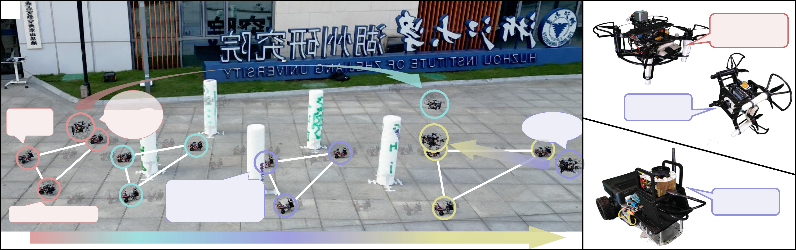

**图 1**：现场实验的镜像图。(a) 一个包含四个机器人的协同导航系统，其中空中机器人支持三个盲地面机器人进行导航，同时在没有先验知识的情况下保持三角形队形。(b)、(c) 分别为本实验中无人机和无人车的配置。只有空中机器人配备了深度相机（RealSense D435），而地面机器人不具备环境感知能力。所有机器人都配备 CREPES [1]，用于相对位姿估计。

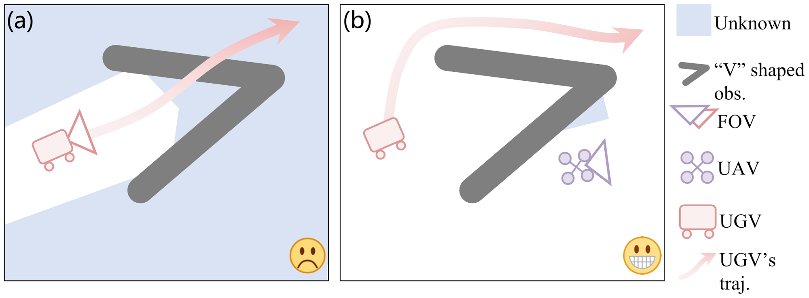

**图 2**：有、无无人机主动感知时的无人车导航性能比较。(a) 集群中没有无人机，每辆无人车都配备了用于自主感知的深度相机。由于视场受限，无人车可能陷入局部极小值并进入凹陷的“V”形空间，导致效率低下。(b) 当无人机持续探索并向无人车提供环境信息时，所有无人车都能巧妙避开“V”形障碍物（右箭头）。

---

## 原文第 3 页核心内容与翻译

CHEN 等：紧密协作下的高性价比无人机集群导航系统
9345

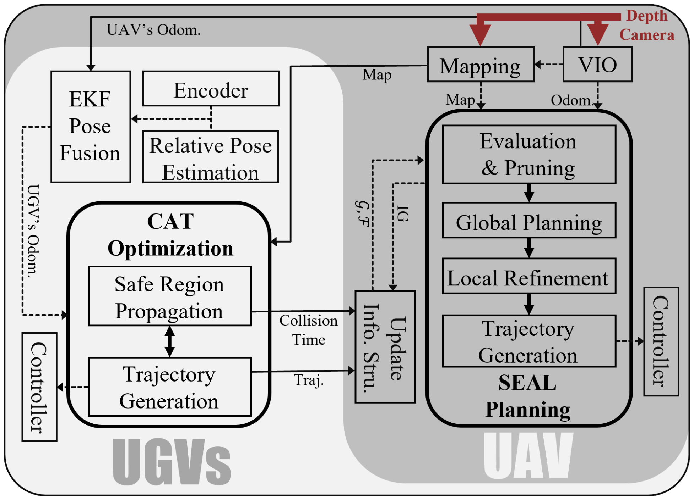

**图 3**：系统概述。实线表示异构机器人之间传递的信息，虚线表示机器人内部的信息。

# III. 系统概述
在这个集群系统中，空中机器人为所有机器人提供高效感知，而地面机器人负责承担所有重载任务。这种协调良好的异构集群（图 3）秉承太极 1 的精神，体现了两个异构要素的和谐共存，且二者对彼此的正常运行都不可或缺。

无人机在该系统中充当飞行感知模块，为每个智能体提供地图和准确位姿。如图 3 所示，无人机通过视觉惯性里程计系统进行自定位，并根据系统中唯一的深度相机采集的深度图像构建环境地图。无人机的关键模块 SEAL 规划（详见第四节）根据边界信息结构和无人车信息结构进行决策，生成高质量巡访路线，随后生成可行轨迹。最后，采用级联 PID 控制器控制无人机跟踪该轨迹。

无人车负责承担所有重载任务。由于它们都缺乏环境感知能力，如图 3 所示，它们通过扩展卡尔曼滤波（EKF）融合无人机里程计、无人机—无人车相对位姿和自身轮式里程计，在无人机世界坐标系中进行自定位。无人车通过 CAT 优化方法（详见第五节）生成可行轨迹，以自适应避障并保持队形；该方法包括安全区域传播和轨迹生成模块。最后，由 MPC 控制器跟踪这些轨迹。

# IV. 无人机的 SEAL 规划
本节首先介绍第四节 A 中专门设计的信息结构，它们是全局规划过程中使用的关键信息单元。第四节 B 提出一个两阶段过程，分别对信息结构进行评估和修剪。随后，第四节 C 介绍仅考虑选定单元的全局规划方法，在贪婪解与全局最优解之间进行权衡，以兼顾快速响应和效率。最后，在局部视点细化和第四节 D 的轨迹优化之后，无人机生成最终轨迹。
1 https://en.wikipedia.org/wiki/Taiji_(philosophy)
**表 I**
信息结构（见下表）。

| 数据 | 含义 |
| --- | --- |
| **无人车信息结构 \(G_i\)** |  |
| \(I_{GG,i}\) | 无人车 \(i\) 的信息增益 |
| \(t_{PC,i}\) | 考虑无人车安全区域传播后的预测碰撞时间 |
| \(\Xi_i\) | 无人车 \(i\) 要执行的轨迹 |
| \(V_{PSG,i}\) | 无人车 \(i\) 的视点 |
| **边界信息结构 \(F_i\)** |  |
| \(I_{GF,i}\) | 边界 \(i\) 的信息增益 |
| \(C_i\) | 边界 \(i\) 中单元格的集合 |
| \(p_{avg,i}\) | \(C_i\) 中单元格的平均位置 |
| \(B_i\) | \(C_i\) 的轴对齐包围盒 |
| \(V_{PSF,i}\) | 边界 \(i\) 的视点 |

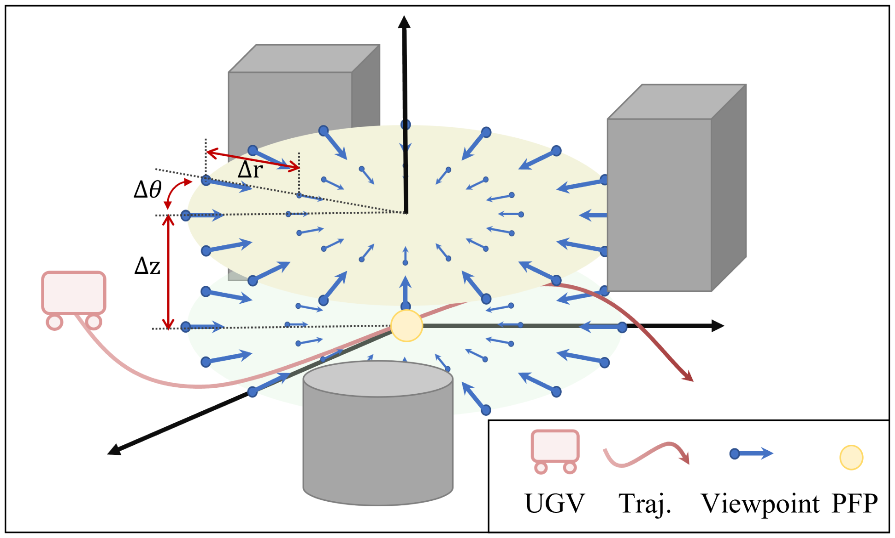

**图 4**：使用以无人车预测未来位置（PFP）为中心的柱坐标系进行候选视点采样。每个视点均朝向中心轴。

## A. 信息结构
无人机维护信息结构以进行决策，其中创建无人车信息结构 \(G_i\) 描述无人车 \(i\) 的状态，创建边界信息结构 \(F_j\) 表示自由空间与未知空间之间边界的第 \(j\) 个片段。

1) 无人车信息结构：无人机 SEAL 规划器启动时，根据无人车群组规模创建所有无人车信息结构。\(G_i\) 中存储的数据如表 I 所示。

\(I_{GG,i}\) 直接决定无人车是否会被纳入 SEAL 的考虑范围。\(t_{PC,i}\) 是考虑无人车安全区域传播后的预测碰撞时间，并用于计算 \(I_{GG,i}\)。\(\Xi_i\) 用于估计无人车位置，也用于评估边界。\(V_{PSG,i}\) 中存储的候选视点在无人车预测未来位置（PFP）周围生成，如图 4 所示。\(V_{PSG,i}=\{vp_{i,j}\mid vp_{i,j}=(p_{i,j},\xi_{i,j},t_{i,j}),j=1,2,\ldots,n\}\)，其中 \(p_{i,j}\) 表示无人车 \(i\) 的估计未来位置，\(\xi_{i,j}\) 表示采样视点 \(j\) 的偏航角，\(t_{i,j}\) 表示无人机飞往视点 \(j\) 的预测时间，其计算公式为：
\[
t_{i,j}=\max\left\{\frac{\lVert p_{i,j}-p_A\rVert_2}{v_{max}},
\frac{\min\{|\xi_{i,j}-\xi_A|,2\pi-|\xi_{i,j}-\xi_A|\}}{\omega_{max}}\right\}.\tag{1}
\]
其中，\(p_A\) 和 \(\xi_A\) 表示无人机的位置和偏航角，\(v_{max}\) 和 \(\omega_{max}\) 表示速度和偏航角速度上限。对无人车位置周围的所有可能视点采样后，根据 \(t_{i,j}\) 从小到大排序。

\(G_i\) 在以下三种情况下更新：
- 收到无人车轨迹：规划器更新 \(\Xi_i\)。
- 收到无人车碰撞信息：规划器更新无人车的 \(t_{PC,i}\) 和 \(V_{PSG,i}\)。
- 评估—修剪完成：规划器更新 \(I_{GG,i}\)。
（授权使用仅限于 National Institute of Technology-Delhi。于 2026 年 8 月 24 日 05:46:40 UTC 从 IEEE Xplore 下载。适用相关限制。）

---

## 原文第 4 页核心内容与翻译

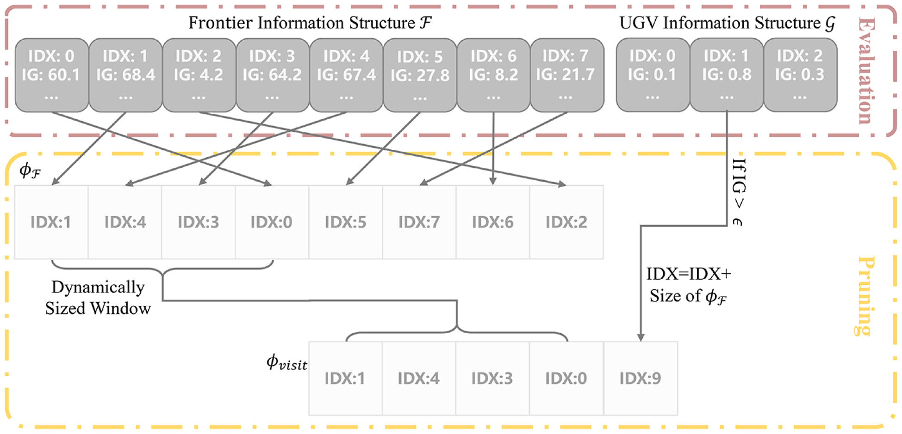

**图 5**：评估—修剪过程示意图。针对评估得到的大量边界信息 \(F\) 和无人车信息 \(G\)，我们采用动态大小的窗口修剪过程，找出无人机需要访问的最重要位置 \(\phi_{visit}\)。

2) 边界信息结构：第 \(i\) 个边界信息结构 \(F_i\) 在探索过程中增量创建。受 [17] 启发，我们设计了 \(F_i\)，其元素列于表 I。\(C_i\) 存储属于边界 \(i\) 的所有单元格，\(p_{avg,i}\) 是 \(C_i\) 中单元格的平均位置，用于表示该边界的位置。\(B_i\) 表示轴对齐包围盒，用于加速边界变化的检测。\(C_i\)、\(p_{avg,i}\)、\(B_i\) 和 \(V_{PSF,i}\) 的生成方式与 [17] 相同。不同于 \(G\)，\(F\) 只在全局规划时更新，其 \(I_{GF,i}\) 也会随之刷新。请注意，\(F_i\) 中视点 \(v_{pi,j}\) 的 \(t_{i,j}\) 不参与计算，在实际应用中取值为 -1。

## B. 评估-修剪
评估—修剪过程是必要的，因为并非所有边界都需要纳入无人车导航的考虑。更重要的是，如果没有这一过程，当无人机靠近某辆无人车时可能会被卡住：无人机到该无人车的连接代价（TSPTW 中的节点间距离）非常小，会促使无人机不断优先访问它。仅在连接代价上增加手工设定的时间代价无法保证最优性，因此我们提出如图 5 所示的评估—修剪过程，以找出当前问题中最紧急的无人车。
我们通过以下公式计算 \(G_i\) 中的 \(I_{GG,i}\) 来评估无人车：
\[
t_{\mathrm{pred}}(vp_m,vp_n)=\max\left\{\frac{Len(P(p_m,p_n))}{v_{max}},
\frac{\min\{|\xi_m-\xi_n|,2\pi-|\xi_m-\xi_n|\}}{\omega_{max}}\right\},\tag{2}
\]
\[
I_{GG,i}=\frac{t_{\mathrm{pred}}(vp_A,vp_{i,1})}{t_{PC,i}}.\tag{3}
\]
其中，\(vp_A=\{p_A,\xi_A,-1\}\) 是当前视点，\(P(p_m,p_n)\) 是由 A* 算法搜索得到的从 \(p_m\) 到 \(p_n\) 的路径，\(Len(\cdot)\) 表示路径长度。随后，我们选取 \(I_{GG}\) 最高的无人车，并将其与阈值 \(\epsilon\) 比较，以避免考虑最近访问过的无人车。如果该无人车的 \(I_{GG}\) 大于 \(\epsilon\)，则将其索引加入信息索引 \(\phi_{visit}\)。请注意，一旦无人车索引加入 \(\phi_{visit}\)，该索引会在后续步骤中被修改（图 5）。
为了评估边界 \(i\)，我们首先计算 NIP，它表示向量 \((p_{e,j}-p_{s,j})\) 与 \((p_{avg,i}-p_{s,j})\) 之间的归一化内积：
\[
NIP=\frac{(p_{e,j}-p_{s,j})\cdot(p_{avg,i}-p_{s,j})}
{\lVert p_{e,j}-p_{s,j}\rVert_2\lVert p_{avg,i}-p_{s,j}\rVert_2}.\tag{4}
\]
其中，\(p_{s,j}\) 和 \(p_{e,j}\) 分别表示 \(G_j\) 轨迹的起点和终点位置。随后，通过以下公式评估边界 \(i\)：
\[
d_{F,G}(i,j)=\lVert p_{avg,i}-p_{G,j}\rVert_2,\tag{5}
\]
\[
I_{GF,i,j}=
\begin{cases}
\left[\dfrac{1}{d_{F,G}(i,j)},\dfrac{1}{d_t}\right]\cdot\omega,
& \text{若 }NIP>NIP_{min},\\
0,& \text{否则},
\end{cases}\tag{6}
\]
\[
I_{GF,i}=\sum_{j=1}^{N_G}I_{GF,i,j}.\tag{7}
\]
其中，\(NIP_{min}\) 是 NIP 的阈值，\(\omega\) 是权重向量，\(d_t\) 表示从 \(F_i\) 的 \(p_{avg,i}\) 到 \(G_j\) 的 \(\Xi_j\) 的最小距离，\(N_G\) 是无人车群组规模。完成评估后，可以通过以下修剪过程获得最重要的边界。

我们设计了一个动态大小的窗口（图 5），以容纳所有 \(I_{GF}\) 相近的 \(F\)。我们根据 \(I_{GF}\) 对边界进行聚类。考虑到 k-Means 或 GMM 等经典聚类方法需要预先指定类别数 \(K\)，我们采用一种不依赖已知 \(K\) 的聚类方法。首先排序，得到列表 \(\phi_F\)，其中按边界 \(I_{GF}\) 降序存储边界索引。然后将第一个元素，即具有最高信息增益的边界索引，加入向量 \(\phi_{visit}\)。若满足下式，则继续迭代地将元素加入 \(\phi_{visit}\)：
\[
I_{GF,\phi_F(k)}\cdot\sigma<I_{GF,\phi_F(k+1)}.\tag{8}
\]
## C. 全局规划
我们将全局规划构造为带时间窗的不对称旅行商问题（ATSPTW）的一种变体。该问题生成一条开环巡访路线，从当前位置出发，在给定时间窗内经过选定的视点。尽管 ATSPTW 是典型的 NP-hard 问题，但由于前述评估—修剪过程，代价矩阵和时间矩阵的维度较小，因此可以在线求解。
假设 \(\phi_{visit}\) 中有 \(N+1\) 个索引，其中 \(N\) 个来自 \(F=\{F_{\phi_{visit}(k)}\mid k=1,2,\ldots,N\}\)，另 1 个来自 \(G=\{G_{\phi_{visit}(N+1)}\}\)（图 5）。\(\phi_{visit}\) 中的每个元素都指向相应的虚拟信息结构。为求解 ATSPTW，我们构造两个矩阵：代价矩阵 \(C_P\in\mathbb{R}^{(N+2)\times(N+2)}\) 和时间矩阵 \(T_P\in\mathbb{R}^{(N+2)\times2}\)，如下所示：
\[
C_P=
\begin{bmatrix}
0 & C_{A,F} & C_{A,G}\\
0 & C_F & C_{F,G}\\
0 & C_{G,F} & 0
\end{bmatrix},
\qquad
T_P=
\begin{bmatrix}
T_A\\
T_F\\
T_G
\end{bmatrix}.\tag{9}
\]
其中，\(C_{A,F}\in\mathbb{R}^{1\times N}\) 和 \(C_{A,G}\in\mathbb{R}\) 分别表示当前视点 \(vp_A\) 与 \(F\)、以及 \(vp_A\) 与 \(G\) 之间的连接代价；\(C_F\in\mathbb{R}^{N\times N}\) 表示 \(F\) 内部的代价；\(G\) 与 \(F\) 之间的代价由 \(C_{F,G}=C_{G,F}^{T}\in\mathbb{R}^{N\times1}\) 计算。\(T_A\in\mathbb{R}^{1\times2}\)、\(T_F\in\mathbb{R}^{N\times2}\)、\(T_G\in\mathbb{R}^{1\times2}\) 分别表示起始节点、\(F\) 和 \(G\) 对应的时间窗。
（授权使用仅限于 National Institute of Technology-Delhi。于 2026 年 8 月 24 日 05:46:40 UTC 从 IEEE Xplore 下载。适用相关限制。）

---

## 原文第 5 页核心内容与翻译

CHEN 等：紧密协作下的高性价比无人机集群导航系统
9347

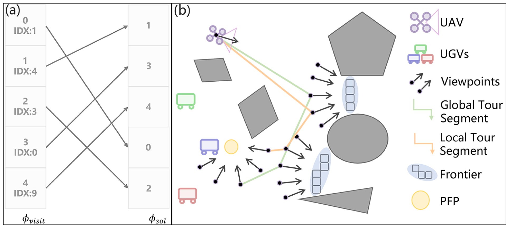

**图 6**：全局规划 (a) 用于从前一步得到的 \(\phi_{visit}\) 中找出最佳访问序列 \(\phi_{sol}\)。随后进行考虑视点的局部细化 (b)，以找到最佳局部巡访路线。图中绘出了全局和局部巡访路线的路径片段。

如果 \(\phi_{visit}\) 中没有 \(G\)，则构造的 \(C_P\in\mathbb{R}^{(N+1)\times(N+1)}\) 和 \(T_P\in\mathbb{R}^{(N+1)\times2}\) 不包含 \(C_{A,G}\)、\(C_{F,G}\)、\(C_{G,F}\) 和 \(T_G\) 的计算。
\(C_P\) 的主要部分是右下方由 \(C_F\)、\(C_{F,G}\) 和 \(C_{G,F}\) 组成的 \((N+1)\times(N+1)\) 块，其中元素计算如下：
\[
C_P(k_1,k_2)=C_P(k_2,k_1)
=t_{\mathrm{pred}}\left(vp_{\phi_{visit}(k_1),1},vp_{\phi_{visit}(k_2),1}\right),
\quad k_1,k_2\in\{1,2,\ldots,N+1\}.\tag{10}
\]
\(C_P\) 的第一行由 \(C_{A,F}\) 和 \(C_{A,G}\) 组成，计算如下：
\[
C_P(0,k)=t_{\mathrm{pred}}\left(vp_A,vp_{\phi_{visit}(k),1}\right),
\quad k\in\{1,2,\ldots,N+1\}.\tag{11}
\]
在 \(T_P\) 中，\(T_A\) 和 \(T_F\) 由下式给出：
\[
T_P(k)=(0,t_{max}),\quad k\in\{0,1,2,\ldots,N\}.\tag{12}
\]
其中，实际应用中 \(t_{max}=10^{10}\)，以消除起始节点和边界对应节点的时间约束。\(T_G\) 计算为：
\[
T_P(N+1)=\left(0,t_{PC,\phi_{visit}(N+1)}\right).\tag{13}
\]
通过求解 ATSPTW 问题，我们得到有序列表 \(\phi_{sol}\)，表示访问 \(\phi_{visit}\) 中各元素的最佳顺序（图 6(a)），在满足时间约束的同时使总代价最小。

## D. 局部路线细化和轨迹生成
上一节通过构造并求解 ATSPTW 问题生成了一条较优的全局巡访路线。然而，该路线只考虑了 ATSPTW 每个节点所属的单一视点。因此，我们利用图搜索方法，在已知全局规划访问顺序的条件下寻找更优的视点组合（图 6(b)）。
在局部路线细化中，我们利用 A* 在有向无环图 \(DAG=(V,E)\) 上搜索局部路径：
\[
\mathcal{K}_{rf}=\{1,2,\ldots,K_{rf}\},\qquad
\mathcal{N}_{rf}=\{1,2,\ldots,N_{rf}\}.\tag{14}
\]
\[
V=\{vp_A,vp_{\zeta(K_{rf}+1),1}\}
\cup\{vp_{\zeta(i),j_i}\mid i\in\mathcal{K}_{rf},j_i\in\mathcal{N}_{rf}\}.\tag{15}
\]
\[
E=\{(vp_A,vp_{\zeta(1),j_1})\mid j_1\in\mathcal{N}_{rf}\}
\cup\{(vp_{\zeta(k),j_k},vp_{\zeta(k+1),j_{k+1}})
\mid k\in\mathcal{K}_{rf},j_k\in\mathcal{N}_{rf},j_{K_{rf}+1}=1\}.\tag{16}
\]
其中，\(V\subset\mathbb{R}^{3}\times\mathbb{R}\times SO(2)\) 和 \(E\subset V\times V\) 分别为顶点集和有向边集；\(K_{rf}\) 和 \(N_{rf}\) 分别为候选信息结构和视点的索引集。令 \(\zeta(k)=\phi_{visit}(\phi_{sol}(k))\)，\(k\in K_{rf}\cup\{K_{rf}+1\}\)，则生成局部路径 \(\Xi_{rf}=\{vp_A,vp_{\zeta(1),j_1},vp_{\zeta(2),j_2},\ldots,vp_{\zeta(K_{rf}),j_{K_{rf}}},vp_{\zeta(K_{rf}+1),1}\}\)，使下列代价最小：
\[
\begin{aligned}
cost_{rf}={}&t_{\mathrm{pred}}(vp_A,vp_{\zeta(1),j_1})\\
&+\sum_{k=1}^{K_{rf}}
t_{\mathrm{pred}}(vp_{\zeta(k),j_k},vp_{\zeta(k+1),j_{k+1}}),
\end{aligned}
\qquad
j_1,j_2,\ldots,j_{K_{rf}}\in\mathcal{N}_{rf},\quad j_{K_{rf}+1}=1.\tag{17}
\]
至于轨迹生成，我们采用 [17] 中的方法，根据离散视点生成平滑、安全且满足动力学约束的轨迹。

# V. 无人车的 CAT 优化
本节首先介绍第五节 A 中的安全区域传播。随后，在第五节 B 中，我们将无人车轨迹生成问题表述为无约束优化问题，并通过 \(L\text{-}BFGS^{2}\) 实时求解。

## A. 安全区域传播
对于单辆无人车而言，很难保证它始终能够获得无人机的辅助来获取相对位姿，因为无人机还必须探索未知空间并协助其他无人车定位。因此，我们提出安全区域，用特定区域描述无人车的定位不确定性。
基于此前的工作 [6]，我们采用 EKF 进行无人车状态估计，融合无人机接收到的位姿、无人机与无人车之间的相对位姿测量以及轮式里程计。我们利用无人机的位置协方差和轨迹，根据无人车运动学模型预测其未来 \(N_{sr}\) 步的定位不确定性，以传播无人车的安全区域。
该区域表示为一组定位不确定性椭圆 \(\{\xi(p^k_G,P^{xy}_k)\mid k=1,2,\ldots,N_{sr}\}\)，可建模为：
\[
\xi(p^k_G,P^{xy}_k)=
\left\{p\in\mathbb{R}^{2}\mid
(p-p^k_G)^{T}(P^{xy}_k)^{-1}(p-p^k_G)\leq9\right\}.\tag{18}
\]
其中，\(P^{xy}_k\) 是 EKF 在第 \(k\) 步的 XY 平面协方差矩阵，\(p\) 是第 \(k\) 个椭圆中的位置，\(p^k_G\in\mathbb{R}^{2}\) 是无人车在第 \(k\) 步的 XY 平面位置。

## B. 轨迹生成
为了使无人车在不断变化的状态估计不确定性下获得最优轨迹，我们避免在系统中采用固定的障碍物间隙距离（机器人与最近障碍物之间的最小距离）。固定的较小间隙可能增加被遮挡的概率，而较大的间隙可能导致效率低下，如图 7 所示。
2 https://github.com/ZJU-FAST-Lab/LBFGS-Lite
（授权使用仅限于 National Institute of Technology-Delhi。于 2026 年 8 月 24 日 05:46:40 UTC 从 IEEE Xplore 下载。适用相关限制。）

---

## 原文第 6 页核心内容与翻译

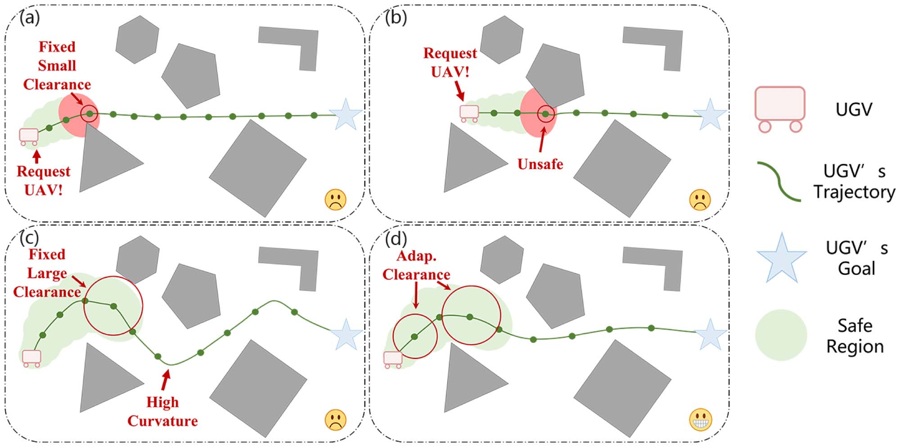

**图 7**：用于无人车避障的固定与自适应障碍物间隙距离示意图。(a)、(b) 表示无人车采用固定的小间隙距离，导致频繁请求无人机支持，造成无人机探索效率低下。(c) 中的无人车采用固定的大间隙距离，但会产生高曲率轨迹，同样效率低下。(d) 中的无人车采用 CAT，间隙距离根据安全区域自适应调整，使无人车能够生成高效轨迹，同时保证无人机的效率。

**表 II**
轨迹生成中的代价

| 代价 | 含义 |
| --- | --- |
| \(J_e\) | 控制代价 |
| \(J_t\) | 总时间代价 |
| \(J_o\) | 障碍物避让代价 |
| \(J_f\) | 集群队形相似性代价 |
| \(J_r\) | 集群相互避让代价 |
| \(J_d\) | 动力学可行性代价 |
| \(J_u\) | 约束点联合分布代价 |

固定的小间隙可能增加被遮挡的概率，而较大的间隙可能导致效率低下，如图 7 所示。
遵循 MINCO 表示法 [18]，我们将优化问题公式化为一个无约束优化问题，以最小化目标函数的加权和：
\[
\min_{c,T}[J_e,J_t,J_o,J_f,J_r,J_d,J_u]\cdot\lambda.\tag{19}
\]
其中，\(\lambda\) 是参数向量，\(J_e,J_t,J_o,J_f,J_r,J_d,J_u\) 是表 II 所列的代价。为简洁起见，\(J_e,J_t,J_u,J_d\) 的细节见 [18]，\(J_r\) 见 [11]，\(J_f\) 见 [19]。
我们通过下式获得自适应障碍物间隙：
\[
d_{ada}=\min(d_{min}+d_{tr,i,j},d_{max}).\tag{20}
\]
其中，\(d_{min}\)、\(d_{max}\) 为阈值，\(d_{tr,i,j}\) 是第 \(i\) 段第 \(j\) 个约束点对应的定位不确定性椭圆长轴。
为计算 \(J_o\)，首先计算：

\(k=i*\kappa_i+j\)

\[
\psi_o(\hat p_{i,j})=
\begin{cases}
d_{ada}-d(\hat p_{i,j}), & d(\hat p_{i,j})<d_{ada},\ \text{且 } k\leq N_o,\\
d_{min}-d(\hat p_{i,j}), & d(\hat p_{i,j})<d_{min},\ \text{且 } k>N_o,\\
0, & 其他情况。
\end{cases}\tag{21}
\]

其中，\(d(\hat p_{i,j})\) 是所考虑点与其周围最近障碍物之间的距离，直接由欧氏有符号距离场（ESDF）获得；\(\kappa_i\) 是第 \(i\) 段包含的约束点数；\(N_o\) 是第一种情况下纳入考虑的约束点数。

随后由下式得到 \(J_o\)：

\[
J_o=\frac{T_i}{\kappa_i}\sum_{j=0}^{\kappa_i}\bar\omega_j\max\{\psi_o(\hat p_{i,j}),0\}^{3},\tag{22}
\]

其中，\(T_i\) 表示第 \(i\) 段的持续时间，\((\bar\omega_0,\bar\omega_1,\ldots,\bar\omega_{\kappa_i-1},\bar\omega_{\kappa_i})=(\frac{1}{2},1,\ldots,1,\frac{1}{2})\)。
# VI. 实验结果与分析
## A. 实现细节
在式 (6) 中，我们设 \(\omega=[60.0,20.0]^T\)。第四节 B 中，\(\epsilon=0.5\)、\(NIP_{min}=0.0\)、\(\sigma=0.88\)。图 4 中，\(\Delta r=0.25\) m、\(\Delta\theta=10^\circ\)、\(\Delta z=0.1\) m。ATSPTW 由运筹学求解器 OR-Tools [20] 求解。局部细化中，\(K_{rf}=7\)、\(N_{rf}=15\)。对于无人车，式 (21) 中设 \(\lambda=[1,1,50000,50000,20000,10000,10000]^T\)，式 (22) 中设 \(d_{min}=0.15\) m、\(d_{max}=1.0\) m。

在仿真和真实环境测试中，无人机的 \(v_{max}=1.8\) m/s、\(\omega_{max}=30^\circ/\mathrm{s}\)。无人机深度相机的 FOV 设为 \([80\times60]\)°，最大量程为 5.0 m。在仿真测试中，密集环境下无人车的 \(v_{max}=0.2\) m/s，稀疏环境下为 \(v_{max}=0.4\) m/s；在真实环境测试中，无人车的 \(v_{max}=0.35\) m/s。

## B. 仿真测试
我们开展了一系列仿真，以验证所提出的框架。我们分别与此前的 Quan 工作 [19] 和 Li 工作 [6] 进行比较。不同于本文方法，Quan 的工作为每个智能体配备深度相机；Li 的工作则为无人机配备 360° 激光雷达，而不是视场受限的深度相机，并且不进行队形规划。

1) “V”形障碍物环境测试：典型的“V”形障碍物如图 2 所示。我们进行了 10 次实验；当所有无人车都能穿过包含“V”形障碍物的区域，且未进入“V”形凹陷空间时，将该次实验定义为成功。由于缺乏探索，Quan 方法和 Li 方法的成功率均为 30%，显著低于成功率为 90% 的本文系统。对于本文系统，得益于无人机为无人车导航进行探索，集群能够避开障碍物而不进入凹陷空间，从而实现安全、高效导航。

2) SEAL 规划测试：为了验证无人机的 SEAL 规划，我们在稀疏和密集环境中开展了大量实验，分别配置 3、5 和 7 辆无人车（每种配置进行三次）。结果如图 8、图 9 和表 III 所示。稀疏、密集环境均为尺寸 \(64\times40\times2\ \mathrm{m}^3\) 的完全未知空间，但随机生成的柱状障碍物数量不同（稀疏环境 90 个，密集环境 350 个）。队形误差 [19] 计算如下：
\[
e_{dist}=\min_{R,t,s}\sum_{i=1}^{n}\frac{1}{n}\left\|p_i^d-\left(sRp_i^c+t\right)\right\|_2^2,\tag{23}
\]

其中，\(e_{dist}\) 表示队形误差，\(n\) 表示无人车群组规模，\(p_i^c\) 表示第 \(i\) 辆无人车的当前位置，\(p_i^d\) 表示集群中第 \(i\) 辆无人车的期望位置；\(R\in SO(3)\)、\(t\in\mathbb{R}^{3}\)、\(s\in\mathbb{R}_{+}\) 分别表示旋转矩阵、平移向量和尺度缩放。
（授权使用仅限于 National Institute of Technology-Delhi。于 2026 年 8 月 24 日 05:46:40 UTC 从 IEEE Xplore 下载。适用相关限制。）

---

## 原文第 7 页核心内容与翻译

CHEN 等：紧密协作下的高性价比无人机集群导航系统
9349

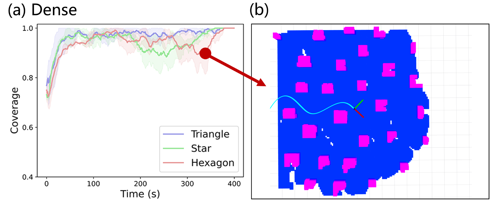

**图 8**：(a) 密集场景中不同数量无人车对应的地图覆盖率，定义为单帧中已探索区域面积与场地面积之比（本测试中场地面积为 512 m³）。(b) 一辆无人车获得高覆盖率的局部地图，以确保安全运行。

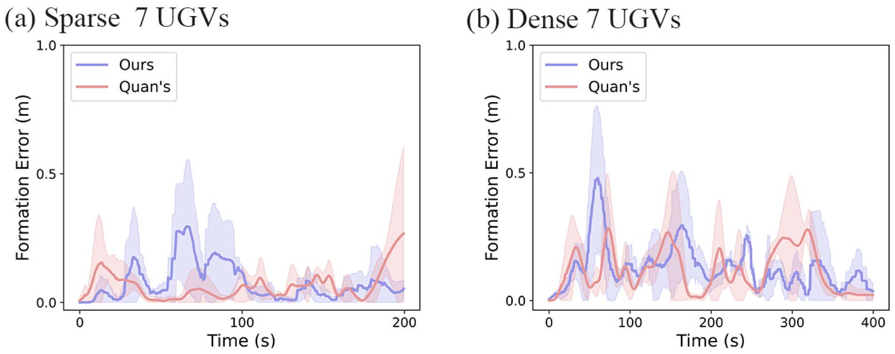

**图 9**：本文方法与 Quan 方法的队形误差比较，显示两者在稀疏和密集场景中的性能相近。

**表 III**
集群导航比较

**稀疏场景**

| 无人车数 | 方法 | 行驶时间（s）均值 | 行驶时间（s）标准差 | 平均停止时间（s）均值 | 平均停止时间（s）标准差 | 停止率（%） |
| ---: | --- | ---: | ---: | ---: | ---: | ---: |
| 3 | 本文方法 | 238.422 | 9.433 | 1.183 | 2.049 | 0.496 |
| 3 | Quan 方法 | 236.210 | 4.267 | 1.268 | 0.563 | 0.536 |
| 3 | Li 方法 | 245.144 | 15.636 | 12.312 | 14.543 | 5.022 |
| 5 | 本文方法 | 230.376 | 9.359 | 0.5019 | 0.469 | 0.203 |
| 5 | Quan 方法 | 238.533 | 8.644 | 0.456 | 1.016 | 0.191 |
| 5 | Li 方法 | 264.061 | 15.681 | 26.439 | 13.868 | 10.012 |
| 7 | 本文方法 | 204.641 | 4.482 | 0.914 | 0.786 | 0.384 |
| 7 | Quan 方法 | 197.901 | 5.859 | 1.136 | 0.502 | 0.574 |
| 7 | Li 方法 | 301.179 | 8.235 | 57.936 | 35.229 | 19.236 |

**密集场景**

| 无人车数 | 方法 | 行驶时间（s）均值 | 行驶时间（s）标准差 | 平均停止时间（s）均值 | 平均停止时间（s）标准差 | 停止率（%） |
| ---: | --- | ---: | ---: | ---: | ---: | ---: |
| 3 | 本文方法 | 441.728 | 12.930 | 2.959 | 2.414 | 0.669 |
| 3 | Quan 方法 | 435.949 | 18.399 | 2.535 | 3.588 | 0.581 |
| 5 | 本文方法 | 432.901 | 9.453 | 3.127 | 1.583 | 0.722 |
| 5 | Quan 方法 | 430.858 | 9.683 | 1.369 | 1.392 | 0.318 |
| 7 | 本文方法 | 401.017 | 6.449 | 2.211 | 0.660 | 0.551 |
| 7 | Quan 方法 | 378.767 | 3.683 | 1.769 | 2.392 | 0.467 |

表 III 表明，在所有配置中，本文方法的停止率（定义为平均停止时间除以平均行驶时间）均低于 0.722%；随着集群规模增大，本文方法相较 Li 方法表现更好。注意，表 III 未列出 Li 方法在密集环境中的结果，因为该方法在所有测试中均失败。此外，测试期间本文系统表现出较高的有效地图覆盖率（图 8）。与 Quan 方法相比，如表 III 和图 9 所示，本文方法性能相近，证明了系统紧密协作的有效性，并表明其可以与全副装备的集群系统相媲美。

3) CAT 优化测试：为了验证队形规划中用于避障的自适应间隙，我们在配置 5 辆无人车的密集环境中开展消融研究。表 IV 展示了自适应障碍物间隙对队形规划的价值。

**表 IV**
CAT 优化的消融研究

| 障碍物间隙距离 | 行驶时间（s）均值 | 行驶时间（s）标准差 | 平均停止时间（s）均值 | 平均停止时间（s）标准差 | 平均队形误差（m）均值 | 平均队形误差（m）标准差 |
| --- | ---: | ---: | ---: | ---: | ---: | ---: |
| 小（\(d_{min}\)） | 463.193 | 8.732 | 32.151 | 18.436 | 1.347 | 0.206 |
| 大（\(d_{max}\)） | 451.523 | 8.485 | 2.549 | 3.159 | 0.162 | 0.092 |
| 自适应 | 432.901 | 9.453 | 3.127 | 1.583 | 0.087 | 0.076 |

**表 V**
真实环境结果

| 场景 | 行驶时间（s）均值 | 行驶时间（s）标准差 | 平均停止时间（s）均值 | 平均停止时间（s）标准差 | 停止率（%） |
| ---: | ---: | ---: | ---: | ---: | ---: |
| 1 | 48.390 | 4.393 | 2.617 | 2.231 | 5.408 |
| 2 | 44.732 | 4.067 | 0.633 | 0.726 | 1.416 |
| 3 | 47.916 | 2.967 | 1.683 | 1.265 | 3.512 |
| 4 | 50.149 | 3.209 | 0.783 | 0.301 | 1.561 |
| 5 | 54.438 | 2.421 | 0.852 | 1.108 | 1.565 |

得益于自适应性，相较采用固定大障碍物间隙距离的方法，本文方法能够生成更高效的轨迹，直接带来更短的行驶时间和更小的平均队形误差。同时，与采用固定小障碍物间隙距离的方法相比，本文方法的平均停止时间小得多，而平均停止时间会显著影响行驶时间和平均队形误差。这项消融研究证明，在无法保证精确定位时，自适应避障对于队形规划是有效的。

## C. 真实环境测试
为了验证系统，我们在室内和室外分别开展了一组真实环境实验。在所有真实环境测试中，我们采用 Vins-FUSION [21] 和 Intel RealSense D435 深度相机进行无人机状态估计。相对位姿估计采用两种方案：室内使用 NOKOV 动作捕捉系统（MCS），室外使用我们此前的工作 CREPES [1]。集群中的每个智能体都在 Intel Core i7-1165G7 CPU 上运行相应算法。

1) 使用 MCS 的室内测试：需要注意的是，在该实验中，智能体无法直接获得绝对位姿，只能根据 MCS 提供的绝对位姿计算相对位姿。我们在智能体接收到的模拟相对位姿中加入高斯分布噪声（\(\mu=0.0,\sigma=0.2\)，以达到与 CREPES 相同的噪声水平）。只有当无人机处于以无人车为中心、半径为 2.0 m 的虚拟圆柱体内时，每辆无人车才能获得相对位姿，以模拟 RPE 的受限特性。

我们在四个给定场景中进行实验，这些场景包含凸、凹障碍物和狭窄间隙。如图 10、图 12 和多媒体补充材料所示，集群安全穿越了障碍物密集区域，证明了框架的实用性。表 V 显示，场景 (1)–(4) 的停止率保持较低水平；图 11 显示，真实环境中的结果与仿真结果相近。

2) 使用 CREPES 的室外测试：在该测试中，智能体通过作为独立系统的 CREPES 获取相对位姿，不依赖任何基础设施。如图 1 所示，在约 \(6\times14\ \mathrm{m}^{2}\) 的区域内随机放置了 5 个障碍物。
（授权使用仅限于 National Institute of Technology-Delhi。于 2026 年 8 月 24 日 05:46:40 UTC 从 IEEE Xplore 下载。适用相关限制。）

---

## 原文第 8 页核心内容与翻译

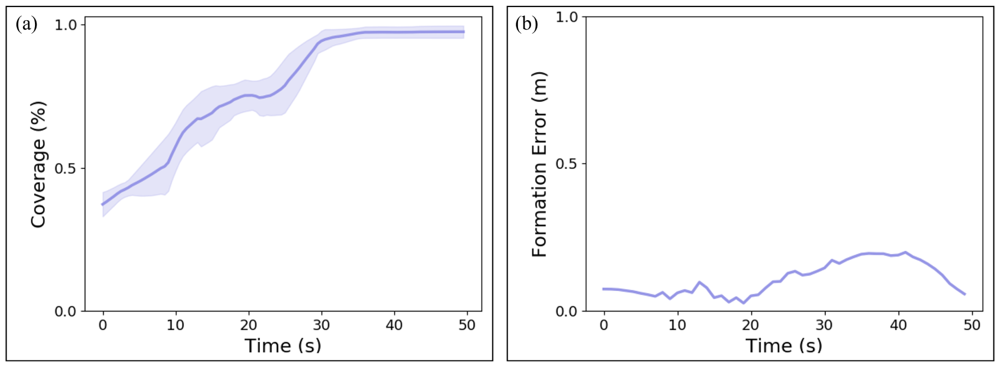

**图 10**：由动作捕捉系统模拟 RPE 的室内实验场景 (1)。(b) 对应 (a) 中的红框区域，无人机倾向于探索未知空间，并规划了通往边界的轨迹（(b) 中的红色曲线）。(c) 对应黄框区域，无人机倾向于辅助无人车定位。

**图 11**：场景 (1) 的实验结果。(a) 中，覆盖率在约 30 s 后接近 1.0，与仿真结果相近。(b) 中，队形误差在稀疏区域保持较低，在密集区域升高。

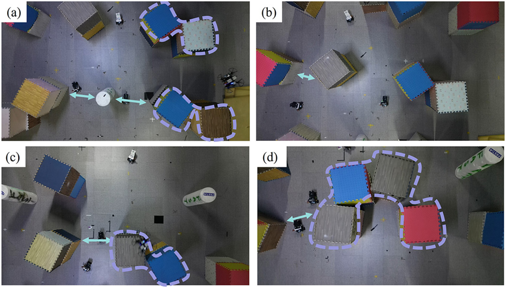

**图 12**：更复杂环境中的室内场景 (2)–(4)，包含狭窄间隙（绿色双向箭头）和凹陷障碍物（紫色虚线区域）。(a)、(b) 对应场景 (2)，(c)、(d) 分别对应场景 (3) 和 (4)。

在测试中，无人车安全穿越了包含障碍物的未知区域，并在导航过程中保持队形（图 1）。该测试有力证明了框架对于不同 RPE 方案具有通用性，并可应用于室外环境。同时，测试结果（表 V，场景 5）表明其性能与其他结果相近。

# VII. 结论
本文提出了一种仅配备一个深度相机的新型 UAV-UGV 集群系统，用于研究异构系统内部的紧密协作。该系统采用无人机执行的 SEAL 规划方法，为探索未知空间和辅助无人车定位规划合理的巡访路线；无人车采用 CAT 优化，生成满足安全性、效率和队形相似性要求的轨迹。

# 参考文献
[1] Z. Xunt et al., “CREPES: Cooperative relative pose estimation system,”
in Proc. IEEE/RSJ Int. Conf. Intell. Robots Syst., 2023, pp. 5274–5281.
[2] P. Arm et al., “Scientific exploration of challenging planetary analog
environments with a team of legged robots,” Sci. Robot., vol. 8, no. 80,
2023, Art. no. ead e9548.
[3] Y. Jie, Y. Zhu, and H. Cheng, “Heterogeneous deep metric learning for
ground and aerial point cloud-based place recognition,” IEEE Robot.
Automat. Lett., vol. 8, no. 8, pp. 5092–5099, Aug. 2023.
[4] I. D. Miller, F. Cladera, T. Smith, C. J. Taylor, and V. Kumar, “Stronger
together: Air-ground robotic collaboration using semantics,” IEEE Robot.
Automat. Lett., vol. 7, no. 4, pp. 9643–9650, Oct. 2022.
[5] J. Delmerico, E. Mueggler, J. Nitsch, and D. Scaramuzza, “Active au-
tonomous aerial exploration for ground robot path planning,” IEEE Robot.
Automat. Lett., vol. 2, no. 2, pp. 664–671, Apr. 2017.
[6] Z. Li, R. Mao, N. Chen, C. Xu, F. Gao, and Y. Cao, “Colag: A collaborative
air-ground framework for perception-limited ugvs’ navigation,” 2023,
arXiv:2310.13324.
[7] B. Zhou, H. Xu, and S. Shen, “Racer: Rapid collaborative exploration with
a decentralized multi-UAV system,” IEEE Trans. Robot., vol. 39, no. 3,
pp. 1816–1835, Jun. 2023.
[8] Y. Gao et al., “Meeting-merging-mission: A multi-robot coordinate
framework for large-scale communication-limited exploration,” in Proc.
IEEE/RSJ Int. Conf. Intell. Robots Syst., 2022, pp. 13700–13707.
[9] S. Dong et al., “Multi-robot collaborative dense scene reconstruction,”
ACM Trans. Graph., vol. 38, no. 4, pp. 1–16, 2019.
[10] C. Feng, H. Li, F. Gao, B. Zhou, and S. Shen, “Predrecon: A prediction-
boosted planning framework for fast and high-quality autonomous aerial
reconstruction,” in Proc. IEEE Int. Conf. Robot. Automat., 2023, pp. 1207–
1213.
[11] X. Zhou, J. Zhu, H. Zhou, C. Xu, and F. Gao, “Ego-swarm: A
fully autonomous and decentralized quadrotor swarm system in clut-
tered environments,” in Proc. IEEE Int. Conf. Robot. Automat., 2021,
pp. 4101–4107.
[12] L. Quan et al., “Robust and efficient trajectory planning for formation flight
in dense environments,” IEEE Trans. Robot., vol. 39, no. 6, pp. 4785–4804,
Dec. 2023.
[13] C. E. Luis and A. P. Schoellig, “Trajectory generation for multiagent point-
to-point transitions via distributed model predictive control,” IEEE Robot.
Automat. Lett., vol. 4, no. 2, pp. 375–382, Apr. 2019.
[14] S. H. Arul and D. Manocha, “DCAD: Decentralized collision avoidance
with dynamics constraints for agile quadrotor swarms,” IEEE Robot.
Automat. Lett., vol. 5, no. 2, pp. 1191–1198, Apr. 2020.
[15] M. Saska, T. Krajník, V. Vonásek, Z. Kasl, V. Spurny, and L. Pˇreuˇcil,
“Fault-tolerant formation driving mechanism designed for heteroge-
neous mavs-ugvs groups,” J. Intell. Robot. Syst., vol. 73, pp. 603–622,
2014.
[16] M. Cognetti, G. Oriolo, P. Peliti, L. Rosa, and P. Stegagno, “Cooper-
ative control of a heterogeneous multi-robot system based on relative
localization,” in Proc. IEEE/RSJ Int. Conf. Intell. Robots Syst., 2014,
pp. 350–356.
[17] B. Zhou, Y. Zhang, X. Chen, and S. Shen, “Fuel: Fast UAV exploration
using incremental frontier structure and hierarchical planning,” IEEE
Robot. Automat. Lett., vol. 6, no. 2, pp. 779–786, Apr. 2021.
[18] X. Zhou, Z. Wang, X. Wen, J. Zhu, C. Xu, and F. Gao, “Decentral-
ized spatial-temporal trajectory planning for multicopter swarms,” 2021,
arXiv:2106.12481.
[19] L. Quan, L. Yin, C. Xu, and F. Gao, “Distributed swarm trajectory opti-
mization for formation flight in dense environments,” in Proc. IEEE Int.
Conf. Robot. Automat., 2022, pp. 4979–4985.
[20] L. Perron and V. Furnon, “Or-tools,” Google, 2024. [Online]. Available:
https://developers.google.com/optimization/
[21] T. Qin, P. Li, and S. Shen, “VINS-mono: A robust and versatile monoc-
ular visual-inertial state estimator,” IEEE Trans. Robot., vol. 34, no. 4,
pp. 1004–1020, Aug. 2018.
授权使用仅限于 National Institute of Technology-Delhi。于 2026 年 8 月 24 日 05:46:40 UTC 从 IEEE Xplore 下载。适用相关限制。

---
