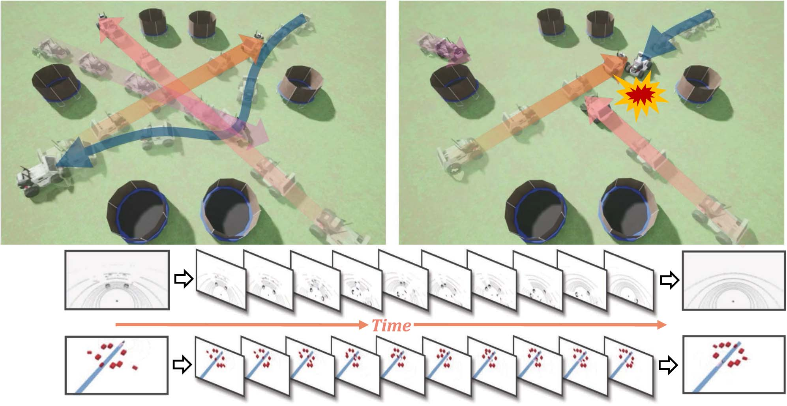
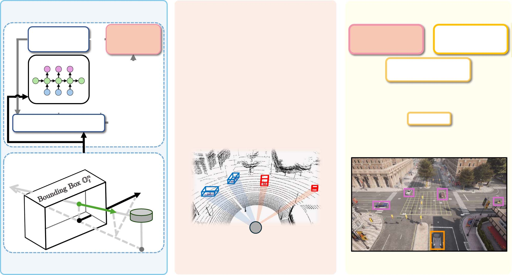
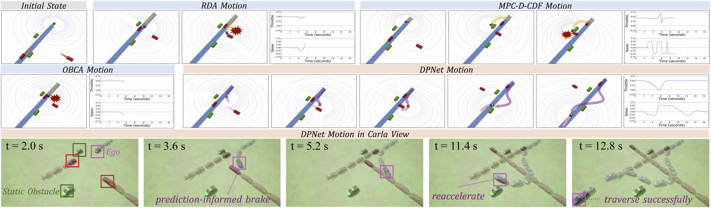
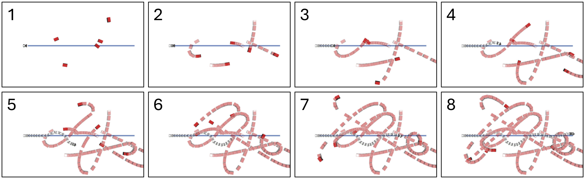
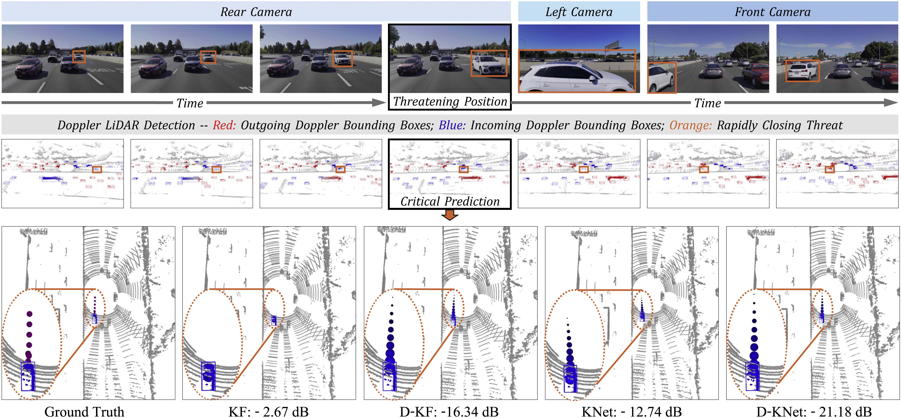
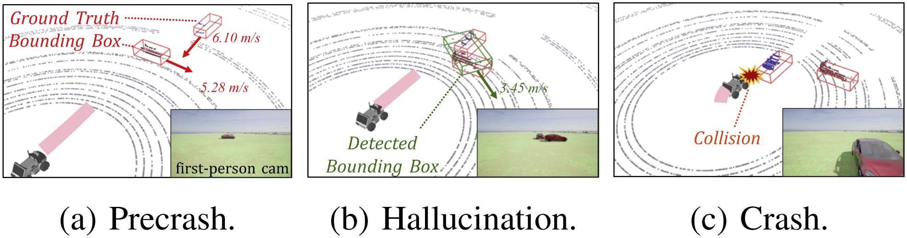

# DPNet 多普勒激光雷达高动态环境运动规划

> **原文标题**：DPNet: Doppler LiDAR Motion Planning for Highly-Dynamic Environments  
> **作者**：Wei Zuo、Zeyi Ren、Chengyang Li、Yikun Wang、Mingle Zhao、Shuai Wang、Wei Sui、Fei Gao、Yik-Chung Wu、Chengzhong Xu  
> **发表信息**：*IEEE Robotics and Automation Letters*，第 11 卷第 6 期，2026 年 6 月  
> **原文 PDF**：[DPNet Doppler LiDAR Motion Planning for Highly-Dynamic Environments.pdf](../DPNet%20Doppler%20LiDAR%20Motion%20Planning%20for%20Highly-Dynamic%20Environments.pdf)

---

## 原文第 1 页

### 摘要
现有运动规划方法由于对环境变化的理解不足，往往难以应对快速运动的障碍物。为此，我们提出将运动规划器与多普勒激光雷达相结合。多普勒激光雷达不仅提供测距信息，还提供点的瞬时速度。然而，由于系统同时要求高精度和高频率，这种结合并非易事。为此，我们提出多普勒规划网络（Doppler Planning Network，DPNet），通过基于多普勒模型的学习跟踪快速运动障碍物并作出响应。首先提出多普勒 Kalman 神经网络（D-KalmanNet），在部分可观测高斯状态空间模型下跟踪障碍物状态；随后利用障碍物的预测运动构建多普勒调谐模型预测控制（DT-MPC）框架进行自运动规划，实现控制器参数的运行时自动调节。两个模块使 DPNet 能够利用少量数据学习快速环境变化，同时保持轻量，在跟踪和规划中均实现高频率和高精度。高保真模拟器和真实世界数据集上的实验表明，DPNet 优于多种基准方案。

**索引词**：规划与学习一体化，碰撞规避，多普勒运动规划。

## I. 引言
高度动态环境中的实时机器人运动规划对于应急救援、自动驾驶等众多应用至关重要[1]。这类场景要求准确掌握环境动力学，运动控制器可利用这些信息，在运动学约束下生成无碰撞动作序列。现有方法严重依赖光探测与测距（LiDAR）传感器，从点云获取障碍物当前位置[2]，并通过基于学习[3]、基于物理[4]或物理信息学习[5]、[6]的方法预测未来轨迹。然而，这些方法难以理解瞬时速度等实时环境变化，因而难以处理快速运动障碍物。

新兴的多普勒激光雷达传感器改变了这一状况：它除了提供传统点测距数据，还提供点的多普勒速度[7]。这一新增维度显式提供障碍物瞬时运动信息，为快速变化场景中的运动规划带来新的机会。但如何在统一框架中把多普勒激光雷达集成到运动规划器，仍是开放问题。该方案必须高性能、实时且安全，并能在机载计算资源有限时正常工作。

给定障碍物未来状态的预测，下一步是运动控制。传统控制器（如模型预测控制，MPC）使用预测状态，在预测时域内构造连续问题[9]；当代价函数或动力学模型的先验知识不准确时，可能产生次优解。MPC 自动调参可从闭环执行数据中学习参数[10]，但用于碰撞规避时通常需要实际碰撞事件触发。如何利用多普勒信息在不依赖实际事件的情况下触发运行时调节，是一个重要问题。

为填补这些空白，本文提出 DPNet。如图 1 所示，DPNet 利用多普勒激光雷达，并通过障碍物运动学习与控制器运行时调节两项算法创新，穿越高度动态区域。D-KalmanNet 在部分可观测高斯状态空间（GSS）模型下实现障碍物未来状态的实时预测，将结构化 GSS 模型与循环神经网络（RNN）和多普勒速度测量序列结合，保证高跟踪频率和轻量模型。DT-MPC 执行多普勒推断碰撞检查，由“想象中的碰撞”而非实际碰撞触发运行时参数调节。为提高计算效率，设计启发式更新策略，并使用交替方向乘子法（ADMM）执行控制器。

我们在 Carla 模拟器中开展大量机器人操作系统（ROS）实验。DPNet 优于 RDA[8]、MPC-D-CBF[11] 和 OBCA[12]等规划器。消融研究与敏感性分析证实，DT-MPC 在不依赖实际事件时触发参数更新是有效且鲁棒的，尤其适用于障碍物密集环境。在真实世界 AevaScenes[14]数据集上，D-KalmanNet 在 1--10 Hz、预测时域 1--10 及 Highway、City 场景下均取得最低跟踪误差，并可在 NVIDIA Jetson Orin NX 16GB 上以 15--100 Hz 跟踪最多 10 个目标。据我们所知，这是首次将多普勒激光雷达与运动规划相结合。贡献如下：引入多普勒激光雷达形成 DPNet，使规划器能够主动规避高度动态障碍物；提出高精度、低开销、高频率的 D-KalmanNet；提出由多普勒推断碰撞触发运行时调参的 DT-MPC；实现完整框架并通过大量结果证明其优势。

## 原文第 2 页

**图 1**：DPNet 与 RDA[8] 的比较。DPNet 能理解高度动态环境并安全穿越其中。

## II. 相关工作
**多普勒激光雷达**：与传统 LiDAR[2]相比，多普勒激光雷达提供多普勒速度测量，已用于目标检测、状态估计和同步定位与建图[15]--[21]。Carla[13]提供逼真的多普勒激光雷达仿真[7]、[22]，AevaScenes[14]提供道路记录。但现有研究集中于开环感知，将其用于闭环运动规划仍未被探索。

**障碍物跟踪**：预测障碍物未来轨迹可提升规划性能。基于学习的方法需要大数据和大量训练计算[23]、[24]；基于物理的方法（如 Kalman 滤波器[4]）计算高效，却依赖预定义运动学模型并可能产生偏差；混合方法结合二者优点。KalmanNet[5]从真实数据学习 Kalman 增益，兼顾精度与轻量化。本文将物理信息学习扩展到多普勒激光雷达。

**运动规划**：许多机器人和自动驾驶系统基于 MPC，在滚动时域内根据环境输入生成最优控制输出[25]。结合障碍物跟踪后可构造时变约束[9]。MPC 性能依赖建模，自动调参方法[10]以闭环反馈优化控制器参数，但常需耗时数据收集或实际事件。DT-MPC 根据瞬时多普勒测量和障碍物跟踪推断碰撞，实现运行时调节。

## III. 问题表述
考虑在 \(N\) 个动态障碍物 \(\mathcal N=\{1,\ldots,N\}\) 中运行的 MPC 规划器。时刻 \(t\) 的预测时域为 \(\mathcal H_t=\{t,\ldots,t+H-1\}\)，步长为 \(\Delta t\)。机器人状态 \(s_h=(x_h,y_h,\theta_h)\)，动作 \(w_h=(v_h,\psi_h)\)。通过动作序列 \(W_t=\{w_t,\ldots,w_{t+H-1}\}\) 求最优状态序列 \(S_t=\{s_{t+1},\ldots,s_{t+H}\}\)，其中 \(\{W_t,U_t\}\in\mathcal F_t\)：
\[
P_t:\quad\min_{\{W_t,U_t\}\in\mathcal F_t}C_t(S_t) \tag{1a}
\]
\[
\text{s.t.}\quad\operatorname{dist}(G_{h+1},O^n_{h+1})\ge d_{safe},\quad\forall h\in\mathcal H_t,n\in\mathcal N. \tag{1b}
\]
其中 \(C_t\) 为效用函数，\(d_{safe}\) 为安全距离，\(G\) 和 \(O\) 为自机器人与障碍物包围盒；\(\operatorname{dist}(P,Q)=\min\{\|p-q\|_2\mid p\in P,q\in Q\}\)。参考航点为 \(s^\star\) 时，\(C_t(S_t)=\sum_{h\in\mathcal H_t}\|s_{h+1}-s^\star_{h+1}\|_2^2\)[12]。难点在于估计 \(O^n_{h+1}\) 必然产生偏差 \(\hat O^n_{h+1|t}\)；快速运动时该偏差会很大，并进一步传递到规划，因为 \(\operatorname{dist}(G,\hat O)\ne\operatorname{dist}(G,O)\)。

## 原文第 3 页

**图 2**：所提出的 DPNet 系统，由 D-KalmanNet 和 DT-MPC 模块组成。

## IV. 多普勒规划网络
D-KalmanNet 用于降低 \(\hat O^n_{h+1|t}\) 的不确定性，DT-MPC 用于实时调节 \(d_{safe}\) 以增强鲁棒性。二者集成为 DPNet，以多普勒点云 \(P_t\) 输入并输出动作 \(W_t\)。

### A. 用于跟踪的 Doppler KalmanNet
多普勒点云为 \(P_t=\{c_t^i,\|\mu_t^i\|_2\}_{i=1}^I\)，其中坐标 \(c_t^i\in\mathbb R^3\)，标量多普勒速度 \(\|\mu_t^i\|_2\in\mathbb R\)。定义多普勒增强状态
\[
x_t^n=[x_t^n,\cos\theta_t^n v_t^n,\cos\theta_t^n a_t^n,y_t^n,\sin\theta_t^n v_t^n,\sin\theta_t^n a_t^n]^\top. \tag{2}
\]
其中位置、方向、线速度和加速度均在障碍物中心定义。每个状态可生成包围盒，因此只需从 \(P_t\) 估计未来状态序列。真实速度测量标准差通常为 0.1 m/s[14]，且由过去轨迹建立的转移模型可能与未来运动不匹配[5]；D-KalmanNet 同时处理这两个问题。

#### 1）多普勒速度校正
同一刚体障碍物上的测量点具有相同线速度，可聚合密集点速度以减轻噪声。令 \(c_t^n,c_t^{Ego}\) 为障碍物和自机器人底部中心，\(c_t^D\) 为雷达位置，扫描俯仰角为 \(\rho_t^i\)，则二维多普勒速度投影为
\[
\breve\mu_t^i=\frac{\|\mu_t^i\|_2}{\cos\rho_t^i}\frac{(I-ee^\top)(c_t^D-c_t^i)}{\|(I-ee^\top)(c_t^D-c_t^i)\|_2},\quad e=[0\ 0\ 1]^\top. \tag{3}
\]
将障碍物包围盒内的点组成 \(P_t^n\)。若 \(\varpi_t^n\) 为障碍物速度与中心径向速度夹角，\(\iota_t^i\) 为障碍物速度与投影夹角，则由 \(v_t^{n;r}\cos\iota_t^i=\breve\mu_t^i\cos\varpi_t^n\) 得
\[
v_t^n=\frac1{|I^n|}\sum_{in=1}^{I^n}\frac1{\cos\iota_t^{in}}\breve\mu_t^{in}. \tag{4}
\]

**图 3**：多普勒速度校正。

**算法 1：D-KalmanNet**  
输入：\(\{y_0^n,y_1^n,\cdots\}_{n=1}^N\)；输出：\(\{\hat O_0^n,\hat O_1^n,\cdots\}_{n=1}^N\)。
1. 初始化 \(t=0\)。
2. 循环执行：对每个 \(n\in\mathcal N\)，将 \(P_t^n\) 分组得到 \(y_t^n\)。
3. 若 \(t=0\)：\(x_0^n\leftarrow y_0^n\)，\(\hat x_{1|0}^n\leftarrow T x_0^n\)，\(\hat y_{1|0}^n\leftarrow U\hat x_{1|0}^n\)。
4. 否则：\(K_t^n\leftarrow\operatorname{RNN}(x_{t-1}^n,\hat x_{t|t-1}^n,\hat y_{t|t-1}^n,y_t^n)\)；\(x_t^n\leftarrow\hat x_{t|t-1}^n+K_t^n(y_t^n-\hat y_{t|t-1}^n)\)；对 \(h\in\mathcal H_t\)，\(\hat x_{h+1|t}^n\leftarrow T^{h-t+1}x_t^n\)，并令 \(\hat y_{t+1|t}^n\leftarrow U\hat x_{t+1|t}^n\)。
5. 返回 \(\hat O_t^n=\{\hat O^n_{h+1|t}(\hat x^n_{h+1|t})\}_{\forall h\in\mathcal H_t}\)，令 \(t\leftarrow t+1\) 后继续。

#### 2）Kalman 增益学习
建立部分可观测 GSS 模型，状态转移模型为恒加速度模型 \(T\)，状态观测模型 \(U\) 同时包含位置和速度：
\[
\hat x^n_{h+1|h}=Tx_h^n,\quad \hat y^n_{h+1|h}=U\hat x^n_{h+1|h}. \tag{5}
\]
经过 \(\Delta t\) 后新扫描提供 \(y^n_{h+1}\)，后验状态为
\[
x^n_{h+1}=\hat x^n_{h+1|h}+K^n_{h+1}(y^n_{h+1}-\hat y^n_{h+1|h}), \tag{6}
\]
其中学习到的 Kalman 增益为
\[
K^n_{h+1}=\operatorname{RNN}(x_h^n,\hat x^n_{h+1|h},\hat y^n_{h+1|h},y^n_{h+1}). \tag{7}
\]
RNN[5]学习鲁棒、自适应增益，以减轻转移模型不匹配和观测不准确造成的噪声。算法 1 总结了完整过程。

### B. 用于规划的多普勒调谐 MPC
固定 \(d_{safe}\) 可能导致性能差或问题不可行[10]。自动调参[26]将其转为可学习向量 \(\phi=[\phi_{t+1,1},\ldots,\phi_{t+H,N}]^T\)：
\[
Q_t:\quad\min_{\{W_t,S_t\}\in\mathcal F_t,\phi\in\Phi}C_t(S_t)+\gamma L(\phi,\{\hat O_t^n\}). \tag{8a}
\]
其中 \(L\) 为闭环碰撞代价，\(\gamma\) 为惩罚系数，\(\Phi\) 给出上下界。一个二次损失例子为
\[
L=\sum_{h\in\mathcal H_t}\sum_{n\in\mathcal N}|\min\{\operatorname{dist}(G_{h+1},\hat O^n_{h+1|t})-\phi_{h+1,n},0\}|^2. \tag{9}
\]

#### 1）多普勒推断碰撞检查
求解 \(Q_t\) 只执行第一动作，因此历史潜在状态序列 \(S_{t-1}^\circ\) 可作为自机器人轨迹预测。沿截短时域 \(\mathcal H_{t-1}^-\) 检查障碍物预测和自机器人包围盒预测：
\[
\operatorname{dist}(G_{h+1}^\circ,\hat O^n_{h+1|t})\le d_0,\quad\forall h\in\mathcal H_{t-1}^-,n\in\mathcal N. \tag{10}
\]
其中 \(d_0\) 是碰撞距离阈值，预测的最后一个元素不参与检查以匹配截短时域长度。

#### 2）运行时自动调参
若式（10）成立，则更新 \(\phi\)。分解为 \(\phi_{h,n}=d_1+\tau(n,h)d_2\)，并令 \(\tau(n,h)=\tau_1(n)\tau_2(h)\)。空间因子为
\[
\tau_1(n)=\max\{1-\alpha(\varrho^n-\kappa_{init}),\tau_{1;min}\}, \tag{11}
\]
其中 \(\varrho^n\) 是按时间顺序分配的碰撞优先级，\(\alpha\) 越大越关注迫近碰撞。时间因子为
\[
\tau_2(h)=\max(1-\beta(h-t),\tau_{2;min}). \tag{12}
\]
较大的 \(\beta\) 对近处预测施加更严格约束、对远期预测放宽约束。

**算法 2：多普勒碰撞检查与调谐**：初始化 \(S_{t-1}=\varnothing\)；循环时将所有 \(\varrho^n\) 置为 \(\infty\)，令 \(\kappa=\kappa_{init}\)，从 D-KalmanNet 获取 \(\hat O_t^n\)；遍历 \(h\in\mathcal H_{t-1}^-\) 和 \(n\in\mathcal N\)，若满足式（10）且 \(\varrho^n=\infty\)，则令 \(\varrho^n=\kappa\)；每一步令 \(\kappa\leftarrow\kappa+\Delta\kappa\)，并令 \(t\leftarrow t+1\)。

#### 3）通过 ADMM 求解
使用 DT-MPC 得到 \(\hat\phi\) 后：
\[
R_t:\quad\min_{W_t,S_t}C_t(S_t)+\gamma L(\hat\phi,\{\hat O_t^n\}) \tag{13a}
\]
\[
\text{s.t. }s_{h+1}=s_h+f(s_h,w_h)\Delta t,\quad w_{min}\preceq w_h\preceq w_{max}. \tag{13b--c}
\]
式（13b）为状态演化，式（13c）为物理约束。利用 Lagrange 对偶性[8]、[26]将唯一非凸项等价变为双凸形式，再用 ADMM 求解；该算法收敛到 \(R_t\) 的稳定点。

## 原文第 5 页

**图 4**：机器人运动（ROS-RViz 和 Carla[13]视图）及相应控制命令的定性分析。静态障碍物为绿色包围盒，动态障碍物为带箭头的红色包围盒，箭头表示运动方向；蓝线连接起点和目标点；动态障碍物前方的点表示运动预测。

## V. 实验
我们在 Linux 上用 ROS Noetic 实现 DPNet，使用集成多普勒激光雷达的 Carla[22]。在 DynaBARN[29]随机生成的高度动态环境中进行定性、定量比较、消融和 DT-MPC 敏感性分析，并在真实数据上评估 D-KalmanNet及其在 NVIDIA Jetson Orin NX 上的效率。障碍物包围盒真值用于分组点云。D-KalmanNet 在 AevaScenes[14]的 100 个序列上训练 2000 个 epoch（City 和 Highway 各 50 个，每序列 100 帧、10 Hz）；80 个序列训练，20 个评估。

### A. Carla 端到端评估
比较 DPNet、MPC-D-CBF[11]、RDA[8]、OBCA[12]及禁用 DT-MPC 的 DPNet（消融）。所有方法设 \(H=15\)、\(\Delta t=0.1\) s；DPNet 参数为 \(d_0=0.5\) m、\(d_1=0.1\) m、\(d_2=0.4\) m、\(\alpha=0.2\)、\(\beta=0.05\)、\(\tau_{1;min}=\tau_{2;min}=0.3\)、\(\kappa_{init}=\Delta\kappa=1.0\)。机器人和障碍物建模为类汽车轮式机器人。强化学习基线未纳入，因为在高度动态场景中缺少安全保障。

**定性分析**：如图 4，场景含两个静态和两个速度为 5 m/s、沿正面与侧面运动且不会避让的障碍物。DPNet 成功穿越。\(t=2\) s 时忽略速度会选择从动态物体之间穿过；到 \(t=4\) s 自机器人已被包围，RDA 在 \(t=5.6\) s 撞上侧向障碍物。DPNet 根据速度信息预见风险，在 \(t=2\) s 提前左转，并在 \(t=3.6\) s、\(t=5.2\) s 从侧向障碍物后方绕过。OBCA 因计算频率低、运动响应延迟而撞上正面障碍物；MPC-D-CBF 因速度理解不准而过度保守，最终碰撞。

**定量分析**：DynaBARN 设置随机轨迹、速度 \((6\pm2)\) m/s 和加速度。指标为 AvgAcc（平均加速度）、MaxAcc（最大加速度）、AvgJerk（平均加加速度）、IteTime（平均求解迭代时间）、PassTime（平均穿越时间）和 PassRate（无碰撞成功率）。每种设置运行 100 次。障碍物数从 1 到 7 时 DPNet 始终优于基线，在密集设置下 PassRate 显著更高；IteTime 接近 RDA，但障碍物数为 7 时 RDA 的 PassRate 比 DPNet 低 42.2%。禁用 DT-MPC 后 PassRate 尤其在障碍物较多时下降，证实实时多普勒调参有效。

## 原文第 6 页
**表 1**：定量比较。

**图 5**：DPNet 穿越由 DynaBARN[29]随机生成的 5 障碍物区域；帧间隔为 1.25 s。
**表 2**：DT-MPC 敏感性分析。每种 \((\alpha,\beta)\) 设置运行 100 次。各设置下性能稳定；增大 \(\alpha\) 或 \(\beta\) 略提高 PassRate、降低 AvgJerk，因为动作更保守（如突然转向）。调谐时间 \(t_{DT-MPC}<1.5\) ms，具有实时效率。
**表 3**：预测 NMSE（dB），均值 ± 标准差。

### B. 真实世界数据集评估
比较 D-KNet、KNet[5]、KF[11] 和 D-KF[17]。按照[5]使用 dB 归一化均方误差（NMSE）：
\[
\operatorname{NMSE}_t=\frac1H\sum_{h\in\mathcal H_t}\frac{(\hat x_{h+1|t}-x_{h+1})^2+(\hat y_{h+1|t}-y_{h+1})^2}{x_{h+1}^2+y_{h+1}^2}.
\]
再用 \(10\log_{10}(\cdot)\) 转换为逐步 dB-NMSE，沿轨迹平均后跨车辆汇总为均值 ± 标准差。

**定性分析**：图 6 展示 Highway 中约 25 m/s 的快速接近车辆。D-KNet 有效利用多普勒线索，取得最低跟踪误差 −21.18 dB；KF 和 KNet 难以处理突然加速，说明融合模型学习与多普勒测量可增强真实场景跟踪鲁棒性。表 3 覆盖 2--10 Hz、\(H_t=5,10\) 和 Highway、City。所有设置下 D-KNet 的 NMSE 最低；\(H_t=5\)、City、10 Hz 时为 \(-45.00\pm7.35\) dB，比第二好的 D-KF 高 12.26 dB。即使 \(H_t=10\)，D-KNet 对长时域不确定性仍鲁棒。

## 原文第 7 页

**图 6**：AevaScene[14] Highway 场景中约 25 m/s 快速接近车辆（橙色）的关键预测。上半部分为环境动力学检测，驶离/驶近包围盒分别为红/蓝色；下半部分为威胁目标轨迹预测比较。

### C. 更多定量结果
在 Jetson Orin NX 16 GB 上部署 D-KNet，GPU 显存约 107 MB；跟踪单个快速障碍物时推理频率超过 100 Hz，同时跟踪 10 个障碍物时约 15 Hz，CPU 使用率 42.0%。表 5 给出 AevaScenes 上 10 步时域的逐步 NMSE。D-KNet 每一步均优于基线，City 第 1 步为 −48.81 dB，而 KF 为 −16.49 dB。KF 和 D-KF 误差增长近似平坦；D-KNet 与 KNet 呈合理误差累积，说明模型学习能应对动力学不确定性。
**表 4**：D-KNet 硬件效率。  
  
**图 7**：失效模式分析。

### D. 局限性与未来工作
包围盒检测噪声（抖动、误检）会影响线速度估计和下游规划。图 7 展示两个快速障碍物（6.10 m/s、5.28 m/s）接近时严重欠分割的案例，产生被错误估计为 3.45 m/s 运动的虚假目标，并最终导致碰撞。未来将研究不依赖包围盒的多普勒激光雷达障碍物跟踪。DT-MPC 的启发式调参虽高效有效，但通常不是最小化 \(L\) 的最优策略；未来将引入可微优化或策略搜索[30]、[31]等梯度信息方法，同时保持模型效率。

## 原文第 8 页
**表 5**：逐时域步预测 NMSE（dB），均值 ± 标准差。

## VI. 结论
本文提出 DPNet，一种用于快速运动障碍物碰撞规避的多普勒激光雷达基于模型学习方法。DPNet 在跟踪和规划中兼具高频率与高精度。相较基准方案，导航时间缩短 6%--30%，成功率最多提高 16%，跟踪误差降低超过 10 dB，并能适应计算资源有限的平台。消融研究证实，在控制器调节和运动规划中纳入多普勒信息不可或缺。

## 参考文献
参考文献按原文保留，以保持作者、题名、期刊信息、引用编号、DOI 和 URL 的准确性。

[1] Z. Han et al., “Hierarchically depicting vehicle trajectory with stability in complex environments,” *Sci. Robot.*, vol. 10, no. 103, 2025, Art. no. eads4551.

[2] C. Flores et al., “A cooperative car-following/emergency braking system with prediction-based pedestrian avoidance capabilities,” *IEEE Trans. Intell. Transp. Syst.*, vol. 20, no. 5, pp. 1837--1846, 2019.

[3] A. Milan et al., “Online multi-target tracking using recurrent neural networks,” in *Proc. AAAI*, vol. 31, no. 1, 2017, pp. 4225--4232.

[4] V. Lefkopoulos et al., “Interaction-aware motion prediction for autonomous driving: A multiple model Kalman filtering scheme,” *IEEE Robot. Autom. Lett.*, vol. 6, no. 1, pp. 80--87, 2021.

[5] G. Revach et al., “KalmanNet: Neural network aided Kalman filtering for partially known dynamics,” *IEEE Trans. Signal Process.*, vol. 70, pp. 1532--1547, 2022.

[6] H. Liao et al., “Physics-informed trajectory prediction for autonomous driving under missing observation,” *IJCAI*, pp. 6841--6849, 2024.

[7] B. Hexsel, H. Vhavle, and Y. Chen, “DICP: Doppler iterative closest point algorithm,” in *Proc. Robot.: Sci. Syst.*, 2022, doi: 10.15607/RSS.2022.XVIII.015.

[8] R. Han et al., “RDA: An accelerated collision free motion planner for autonomous navigation in cluttered environments,” *IEEE Robot. Autom. Lett.*, vol. 8, no. 3, pp. 1715--1722, 2023.

[9] Y. Zhang et al., “Online efficient safety-critical control for mobile robots in unknown dynamic multi-obstacle environments,” in *Proc. IEEE/RSJ Int. Conf. Intell. Robots Syst.*, 2024, pp. 12370--12377.

[10] R. Tao et al., “Difftune-MPC: Closed-loop learning for model predictive control,” *IEEE Robot. Autom. Lett.*, vol. 9, no. 8, pp. 7294--7301, 2024.

[11] Z. Jian et al., “Dynamic control barrier function-based model predictive control to safety-critical obstacle-avoidance of mobile robot,” in *Proc. IEEE Int. Conf. Robot. Automat.*, 2023, pp. 3679--3685.

[12] X. Zhang, A. Liniger, and F. Borrelli, “Optimization-based collision avoidance,” *IEEE Trans. Control Syst. Technol.*, vol. 29, no. 3, pp. 972--983, 2021.

[13] A. Dosovitskiy et al., “Carla: An open urban driving simulator,” in *Proc. Conf. Robot Learn.*, 2017, pp. 1--16.

[14] G. N. Narasimhan et al., “AevaScenes: A dataset and benchmark for FMCW LiDAR perception,” 2025. [Online]. Available: https://scenes.aeva.com/

[15] Y. Shi et al., “POD: Predictive object detection with single-frame FMCW LiDAR point cloud,” arXiv:2504.05649, 2025.

[16] Y. Gu et al., “Learning moving-object tracking with FMCW LiDAR,” in *Proc. IEEE/RSJ Int. Conf. Intell. Robots Syst.*, 2022, pp. 3747--3753.

[17] X. Peng and J. Shan, “Detection and tracking of pedestrians using Doppler LiDAR,” *Remote Sens.*, vol. 13, no. 15, 2021, Art. no. 2952.

[18] Y. Wu et al., “Picking up speed: Continuous-time lidar-only odometry using doppler velocity measurements,” *IEEE Robot. Autom. Lett.*, vol. 8, no. 1, pp. 264--271, 2023.

[19] M. Zhao et al., “FMCW-LIO: A doppler LiDAR-inertial odometry,” *IEEE Robot. Autom. Lett.*, vol. 9, no. 6, pp. 5727--5734, 2024.

[20] D. J. Yoon et al., “Need for speed: Fast correspondence-free lidar-inertial odometry using doppler velocity,” in *Proc. IEEE/RSJ Int. Conf. Intell. Robots Syst.*, 2023, pp. 5304--5310.

[21] M. Zhao et al., “Free-init: Scan-free, motion-free, and correspondence-free initialization for doppler LiDAR-inertial systems,” *IEEE Robot. Autom. Lett.*, vol. 9, no. 12, pp. 11329--11336, 2024.

[22] Aeva-Inc, “Carla-Aeva,” 2024. [Online]. Available: https://github.com/aevainc/carla-aeva

[23] J. Zhou et al., “Robust predictive motion planning by learning obstacle uncertainty,” *IEEE Trans. Control Syst. Technol.*, vol. 33, no. 3, pp. 1006--1020, 2025.

[24] R. Zhang et al., “Learning-based motion planning in dynamic environments using GNNs and temporal encoding,” in *Proc. Neural Inf. Process. Syst.*, vol. 35, 2022, pp. 30003--30015.

[25] Y. Shi and K. Zhang, “Advanced model predictive control framework for autonomous intelligent mechatronic systems,” *Annu. Rev. Control*, vol. 52, pp. 170--196, 2021.

[26] R. Han et al., “NeuPAN: Direct point robot navigation with end-to-end model-based learning,” *IEEE Trans. Robot.*, vol. 41, pp. 2804--2824, 2025.

[27] S. Zhang et al., “Multi-uncertainty aware autonomous cooperative planning,” in *Proc. IEEE/RSJ Int. Conf. Intell. Robots Syst.*, 2024, pp. 1018--1025.

[28] J. Schulman et al., “Motion planning with sequential convex optimization and convex collision checking,” *Int. J. Robot. Res.*, vol. 33, no. 9, pp. 1251--1270, 2014.

[29] A. Nair et al., “DynaBARN: Benchmarking metric ground navigation in dynamic environments,” in *Proc. IEEE Int. Symp. Saf., Secur. Rescue Robot.*, 2022, pp. 347--352.

[30] S. Cheng et al., “Difftune: Auto-tuning through auto-differentiation,” *IEEE Trans. Robot.*, vol. 40, pp. 4085--4101, 2024.

[31] Y. Song and D. Scaramuzza, “Policy search for model predictive control with application to agile drone flight,” *IEEE Trans. Robot.*, vol. 38, no. 4, pp. 2114--2130, 2022.
