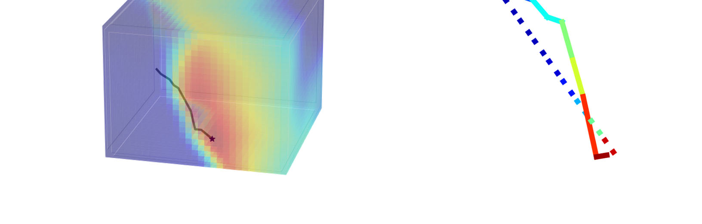
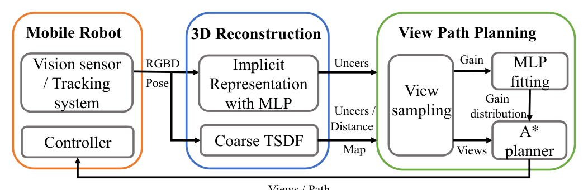
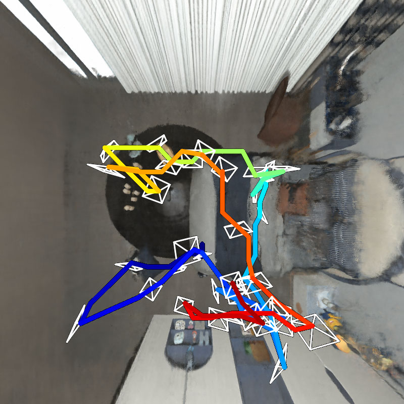
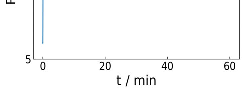

# 自主隐式神经重建的高效视点路径规划

> **原文标题**：Efficient View Path Planning for Autonomous Implicit Reconstruction  
> **作者**：Jing Zeng, Yanxu Li, Yunlong Ran, Shuo Li, Fei Gao, Lincheng Li, Shibo He, Jiming Chen, Lincheng Li, Shibo He, Jiming Chen, Qi Ye  
> **会议**：2023 IEEE International Conference on Robotics and Automation (ICRA 2023)

---

## 原文第 1 页

### 摘要

隐式神经表示在三维场景重建方面展现出很大潜力。近期研究通过学习用于视点路径规划的信息增益，将其应用于自主三维重建。然而，信息增益计算代价高昂；与体表示相比，使用隐式表示对三维点进行碰撞检测也慢得多。本文提出：（1）利用神经网络作为信息增益场的隐式函数近似器；（2）将用于精细表示的隐式表示与粗粒度体表示结合，以提高效率。在此基础上，提出一种基于图规划器的新型信息路径规划方法。与采用隐式和显式表示的自主重建方法相比，本文方法显著提升了重建质量和规划效率。真实 UAV 实验表明，本文方法能够规划信息丰富的视点，并高质量重建场景。

### I. 引言

本文研究移动机器人视点路径规划问题，目标是重建未知场景的高质量三维模型。机器人需要自主规划并执行一条路径，使重建场景质量最大化。自主重建广泛应用于虚拟现实、数字孪生、自动驾驶和智慧城市等领域 [4], [26], [27]。近年来，隐式神经表示在三维重建 [1], [13], [24] 和 SLAM [23], [28] 中取得了令人信服的结果。Ran 等人 [15] 将由多层感知机（MLP）$F_\theta$ 表示的隐式表示用于自主三维重建，并学习信息增益进行视点路径规划。

隐式表示虽能重建具有精细细节的高保真三维场景，但计算不同视点的信息增益效率低下：需发射 $R$ 条光线穿过场景，并在每条光线上采样 $N$ 个点，以积分视锥范围内的重建不确定性；所有采样点还要输入 MLP $F_\theta$ 估计不确定性。$R$ 随图像尺寸变化，$N$ 随场景尺寸和所需细节程度变化。碰撞检测同样低效：检查三维点是否为空闲空间时，需将该点输入 $F_\theta$ 获取密度；显式体表示只需查询该点的存储单元。

由于信息增益计算昂贵，已有工作 [8], [16], [18], [20] 通常偏好 RRT 或 RRT* 等基于采样的方法。它们需要的采样视点较少，但许多方法无法保证最优性。为此，本文假设信息增益场关于视点是平滑连续函数，使用 MLP $g_\phi$ 近似该场。获得一个视点的信息增益只需查询 $g_\phi$ 一次，而不是查询 $F_\theta$ 约一百万次。其次，依据粗粒度 TSDF 过滤候选视点，并由 TSDF 建立占用图以快速碰撞检测。由于单视点查询时间降至 1 毫秒以内，本文得以采用需要密集空间查询的 A* 规划器，并提出新的视点路径代价。

本文贡献如下：提出信息增益场隐式函数近似器，将查询时间至少降低 $R\times N$ 倍；结合隐式精细表示与体表示，以快速碰撞检测和过滤视点；提出基于图规划器的新型视点路径代价，规划更短路径并获得更好重建质量。

**图 1**：左：cabin 场景自主隐式重建第 5 步中为局部增益场拟合的信息增益近似器 $g_\phi$；右：本文方法规划的信息视点路径（实线）和 A* 规划的最短路径（虚线）。路径颜色表示信息增益。

---

## 原文第 2 页

### II. 相关工作

高效重建场景的最优视点与路径确定问题称为主动视觉或视点路径规划问题，已被研究二十年 [2], [3], [5], [8], [17], [22]。常用方法包括基于前沿的方法 [9], [18] 和基于采样的方法 [16], [20]。前沿方法关注已知与未知空间边界，适合快速全局探索，但难以适应其他任务。采样方法采用下一最佳视点（NBV）策略，依据当前部分重建反馈选择视点。NBV 由定义在体表示 [6], [7], [11] 或表面表示 [16], [19], [25] 上的信息增益确定。

RRT 将随机采样的视点作为节点并用边连接 [8], [11], [16]。Mendez 等人 [11] 用 Sequential Monte Carlo（SMC）为不同位置分配信息增益采样权重；Schmid 等人 [16] 每次规划后重新布线 RRT；Kompis 等人 [8] 用人工势场预测候选视点值。这些方法分别受 SMC 采样量、重新布线耗时、前沿寻找效率和人工参数稳健性限制。本文改为提高信息增益计算效率，使基于图的、最优性更好但需要密集查询的规划方法成为可能。

### III. 方法

目标是生成一条轨迹，使机器人在满足时间、路径长度等约束的同时获得有界场景的高质量三维模型。轨迹由路径和视点序列组成，$\Omega=(\omega_1,\ldots,\omega_n)$，其中 $\omega_i\in\mathbb{R}^3\times SO(2)$。本文采用贪心 NBV 策略：每一步依据部分重建评估当前机器人一定范围内视点的信息增益，综合增益和路径长度规划并执行信息路径，再将沿途图像送入下一步重建，直至满足终止条件。

**图 2**：本文方法流程。

#### A. 系统概述

移动机器人模块在给定视点采集图像，并通过动作捕捉系统定位；仿真中由 Unity Engine 渲染图像。三维重建模块结合隐式神经表示（如 NeRF [12]）与粗粒度 TSDF。隐式表示提供精细、高质量模型及用于规划的信息增益；粗粒度 TSDF 过滤视点并建立占用栅格图，以便快速查询距离和占用状态。视点路径规划模块利用体表示选择视点，用 MLP $g_\phi$ 近似信息增益场，并基于 A* 规划路径。

#### B. 自主隐式重建基础

隐式表示用函数拟合场景，输入光线方向 $d$ 和光线上点的位置 $x$，输出颜色 $c$ 与密度 $\rho$：$F_\theta(x,d)=(c,\rho)$，由 MLP 实现。NeurAR [15] 将场景函数表示为 $F_\theta(x,d)=(\mu,\sigma,\rho)$，学习神经不确定性作为信息增益。

---

## 原文第 3 页

视点神经不确定性为

$$\sigma_v^2=\frac{1}{R}\sum_{r=1}^{R}\sigma_r^2=\frac{1}{R}\sum_{r=1}^{R}\sum_{i=1}^{N}W_{ri}\sigma_{ri}^2. \tag{1}$$

$r$ 为穿过像素的相机光线，$R$ 为采样光线数，$N$ 为每条光线的采样点数，$W_{ri}$ 为沿光线的点权重，$\sigma_{ri}^2$ 为随输入图像加入而连续学习的点颜色不确定性。每一步重建接收 RGBD 图像及视点 $\{(x_i,\omega_i)\}$，更新 $F_\theta$，并用式（1）计算采样视点的信息增益。

#### C. 信息增益场近似

**1）近似器 $g_\phi$：** 获取神经不确定性需将 $R\times N$ 个点输入 $F_\theta$。在 NeRF 中，渲染 $800\times800$ 图像时 $R=640000,N=192$；即使 NeurAR 将 $R$ 设为 1000，查询次数仍然巨大。本文假设区域信息增益由平滑连续函数产生，以 MLP $g_\phi$ 学习点到增益的映射：

$$g_\phi:p\mapsto I. \tag{2}$$

给定采样点 $P=\{p_1,\ldots,p_{N_{loc}}\}$ 及增益 $I=\{I_1,\ldots,I_{N_{loc}}\}$，用 L2 损失拟合：

$$L=\frac{1}{N_{loc}}\sum_{i=1}^{N_{loc}}(g_\phi(p_i)-I_i)^2.$$

此后每个视点只需查询 $g_\phi$ 一次，而原方法需查询 $F_\theta$ 约 $R\times N$ 次；且 $g_\phi$ 模型更小、推理更快。

**2）粗粒度 TSDF 视点过滤：** TSDF $T$ 以体素网格整合不同视点的部分点云。由此构建 $V=V_o\cup V_e\cup V_u$，分别表示占用、空闲和未观测体素。其仅用于空间状态查询，故分辨率可较粗。给定当前位置，先在半径 $l_s$ 球内的空闲空间 $V_e$ 采样 $N_{loc}$ 个位置及偏航、俯仰角；再依据 TSDF 视图代价选三个方向，最后依据式（3）选最佳方向，并将增益归一化到 $[0,1]$。

**3）信息增益 $I$：** 为避免预定义环形区域，定义距离感知增益：

$$I_v=\begin{cases}\sigma_v^2,&d_{min}<d_v<d_{max}\\e^{-\alpha|d_v-d_u|}\sigma_v^2,&\text{其他情况}\end{cases} \tag{3}$$

其中 $d_u=(d_{min}+d_{max})/2$，$\alpha=-2/(d_{max}-d_{min})$，$d_v=\frac{1}{|S_r|}\sum_{S_r}d_r$；$d_r$ 由 $T$ 推断，$S_r$ 为深度处于相机工作范围 $[d_n,d_f]$ 的光线集合。

#### D. 信息路径规划

给定当前位置 $p_s$、占用图 $V$、采样点 $P$ 及增益 $I$，选取 $P$ 中增益最大的视点作为目标 $p_g$。同时考虑路径长度和路径增益，定义

$$IP(p)=f_d(p_s,p)-\lambda_{gain}f_d(p_s,p)G(p), \tag{4}$$

$$G(p)=\frac{1}{N_P}\sum_{i=1}^{N_P}g_\phi(p_i). \tag{5}$$

其中 $f_d$ 为路径长度，$N_P$ 为路径采样点数。A* 的节点排序为

$$Rank(p)=IP(p)+\lambda_{rank}h_d(p,p_g), \tag{6}$$

其中 $h_d$ 为欧氏距离，规划步长为 $l_{step}$。

**算法 1 本文方法**  
输入：图像和视点 $\{(x_i,\omega_i)\}$、部分重建模型 $F_\theta,T$、当前节点 $p_s$、采样半径 $r_s$。输出：更新后的输入、$F_\theta,T,p_s$。  
1. $F_\theta,T\leftarrow\mathrm{Update3DScenes}(F_\theta,T,\{(x_i,\omega_i)\})$；  
2. $V=V_o\cup V_e\cup V_u\leftarrow T$；  
3. $\{\omega_i\}\leftarrow\mathrm{ViewSamplingFiltering}(T,V_e,r_s)$；  
4. $P,I\leftarrow\mathrm{InformationGain}(F_\theta,T,\{\omega_i\})$；  
5. $g_\phi\leftarrow\mathrm{MLPFitting}(P,I)$；  
6. $p_g\leftarrow\arg\max_P(I)$；  
7. $\{(x_i,\omega_i)\}\leftarrow\mathrm{PlanExecuteViewPath}(V_e,p_s,p_g,g_\phi)$；  
8. $p_s\leftarrow p_g$。

---

## 原文第 4 页

### IV. 结果

#### A. 实现细节

实验场景为 cabin（$5m\times5m\times3m$）、Alexander（$50m\times40m\times30m$）和 childroom（$6m\times6m\times3m$）。Alexander 来自 [21]，其余场景在线采集。所有深度图加入随深度近似二次增长的噪声；cabin、childroom 参照 Intel Realsense L515（视场角 $67.38^\circ$），Alexander 参照 Lidar VLP16（$63.5^\circ$），动作捕捉精度为 0.2mm。

隐式表示基于 NeurAR [15]，超参数相同。粗 TSDF 近场 $d_n=0.5$，$l_{res}$ 和 $d_f$ 随场景变化；式（4）增益因子 $\lambda_d=0.5$，式（6）排序因子 $\lambda_{rank}=1.5$。使用两块 RTX3090 GPU，一块进行隐式重建，另一块进行路径规划。最大视点数为 cabin、Alexander 各 28 个，childroom 40 个。

有效性用渲染图像 PSNR 及几何 Accuracy、Completion、Completion Ratio 衡量。cabin 和 Alexander 分别在距中心 3m、40m 处均匀取 200 个视点；childroom 在空闲空间随机取点并距表面 1m。几何指标从表面约采样 300k 个点。效率指标为路径长度 P.L. 和时间 TGP；规划时间分为采样 $T_s$、训练 $T_{train}$、查询 $T_{query}$（查询点数 $N_{query}$）及纯规划 $T_{planner}$，且 $T_{SP}=T_{train}+T_{query}+T_{planner}$。

#### B. 方法有效性

以 NeurAR [15] 为基线 V1（SMC 采样、RRT 规划）。在 V1 中加入式（4）得到 V2，再用 A* 替代 RRT 得到 V3。V2 表明路径代价本身即可提升重建质量；V3 进一步受益于 A* 的最优性，但需要更多增益查询。例如 childroom 中 V2、V3 的查询点数分别为 312、92，$T_{SP}$ 分别为 3490s、955s。

加入 $g_\phi$ 得到 V4、V5，信息增益查询时间降低超过 10000 倍；childroom 中 312 次查询由 3489s 降至 0.218s，且重建质量仅轻微下降。再加入 TSDF 过滤得到完整方法 V6，总规划时间约降至三分之一。

**表 I**：隐式神经表示视点路径有效性与效率评估。↑ 越大越好，↓ 越小越好。

| 方法 | cabin PSNR | Acc | Comp | C.R. | childroom PSNR | Acc | Comp | C.R. | Alexander PSNR | Acc | Comp | C.R. |
|---|---:|---:|---:|---:|---:|---:|---:|---:|---:|---:|---:|---:|
| V1 [15] | 25.69 | 1.56 | 1.16 | 0.68 | 24.92 | 10.94 | 6.33 | 0.66 | 18.15 | 27.11 | 13.51 | 0.62 |
| V2 | 26.15 | 1.37 | 1.07 | 0.74 | 26.82 | 9.73 | 5.86 | 0.71 | 21.76 | 21.14 | 12.89 | 0.69 |
| V3 | 28.67 | 1.01 | 1.02 | 0.76 | 28.82 | 6.03 | 4.06 | 0.77 | 24.57 | 15.65 | 12.25 | 0.72 |
| V4 | 26.98 | 1.26 | 1.06 | 0.73 | 26.21 | 8.82 | 5.63 | 0.72 | 21.48 | 21.36 | 13.03 | 0.66 |
| V5 | 28.65 | 1.03 | 1.00 | 0.77 | 28.02 | 5.53 | 3.92 | 0.76 | 23.88 | 18.41 | 12.03 | 0.72 |
| V6（本文完整方法） | 28.47 | 1.04 | 1.01 | 0.76 | 28.28 | 5.44 | 3.52 | 0.78 | 24.42 | 17.70 | 12.40 | 0.71 |

#### C. 与体表示的比较

选择基于 OctoMap 的 AEP [18] 和基于 TSDF 的 IPP [16]。TSDF 分辨率设为 cabin 1cm、childroom 2cm、Alexander 20cm。本文方法在重建质量和规划效率方面均优于体表示方法。childroom 中本文 Accuracy 较差，是因为 AEP、IPP 不填补孔洞，只测量无孔洞区域；隐式表示能插值缺失区域，而本文测量整个区域。

**图 3**：不同方法的重建场景比较。本文方法获得更好的重建结果，更多视觉比较见补充视频。

**图 4**：俯视图中的轨迹和重建结果。左：本文方法；右：NeurAR [15]。本文方法的轨迹覆盖更大区域。

**表 II**：体表示的有效性与效率评估。

| 方法 | cabin PSNR | Acc | Comp | C.R. | TGP | P.L. | childroom PSNR | Acc | Comp | C.R. | TGP | P.L. | Alexander PSNR | Acc | Comp | C.R. | TGP | P.L. |
|---|---:|---:|---:|---:|---:|---:|---:|---:|---:|---:|---:|---:|---:|---:|---:|---:|---:|---:|
| AEP [18] | 21.45 | 1.52 | 1.87 | 0.35 | 1276 | 46.23 | 14.72 | 2.17 | 12.69 | 0.70 | 4029 | 29.56 | 16.28 | 20.77 | 22.80 | 0.45 | 1319 | 677 |
| IPP [16] | 18.74 | 1.56 | 2.03 | 0.33 | 447 | 44.27 | 9.02 | 2.06 | 67.16 | 0.42 | 1512 | 24.02 | 15.79 | 22.18 | 24.36 | 0.44 | 427 | 368 |
| 本文方法 | 28.47 | 1.04 | 1.01 | 0.76 | 388 | 40.98 | 28.28 | 5.44 | 3.52 | 0.78 | 1366 | 19.53 | 24.42 | 17.70 | 12.40 | 0.71 | 347 | 393 |

**表 III**：场景相关参数。

| 场景 | $l_s$ | $l_{res}$ | $l_{step}$ | $d_f$ | $N_{pitch}$ | $N_{yaw}$ | $d_{min}$ | $d_{max}$ |
|---|---:|---:|---:|---:|---:|---:|---:|---:|
| cabin | 3 | 0.1 | 0.2 | 6 | 3 | 5 | 2.5 | 4.5 |
| childroom | 1 | 0.1 | 0.2 | 6 | 5 | 12 | 1.5 | 3.5 |
| Alexander | 30 | 1 | 2 | 80 | 3 | 5 | 30 | 50 |

## 原文第 5 页

#### D. 消融实验

固定 $g_\phi$ 网络宽度，使用 4、6、8、10 层研究网络规模对重建精度的影响；同时改变视点数量。实验在 Alexander 场景进行。

**图 6**：消融实验。

---

## 原文第 6 页

### E. 真实场景中的机器人实验

本文方法部署于真实 UAV，用于重建约 $8m\times2.5m\times3m$ 房间中的物体。UAV 配备 Realsense D435i，摄像机位姿由 Optitrack 提供。UAV 约用 4 分钟规划并执行路径，采集 30 幅图像。重建收敛过程及收敛模型的渲染图像见图 5。

**图 5**：真实场景实验。（a）规划视点；（b）已观测视图；（c）已观测视图的渲染结果；（d）收敛曲线；（e）新视点。

### V. 结论

本文通过函数近似信息增益场，并将隐式表示与体表示结合，提高了自主隐式重建视点路径规划的效率；进一步提出新型视点路径代价，并用 A* 规划路径。大量实验显示，本文方法兼具效率和有效性优势。未来工作包括克服大场景中的局部性限制、使用输入图像而非 Optitrack 跟踪摄像机位姿、引入更多约束改善重建形状，以及扩展到多智能体重建。

---

## 参考文献

[1] Jonathan T. Barron et al. Mip-NeRF 360: Unbounded Anti-Aliased Neural Radiance Fields. CVPR, 2022.  
[2] Andreas Bircher et al. Receding Horizon Next-Best-View Planner for 3D Exploration. ICRA, 2016.  
[3] Anjun Chen et al. ImmFusion: Robust mmWave-RGB Fusion for 3D Human Body Reconstruction in All Weather Conditions. arXiv, 2022.  
[4] Liang Chen et al. Real-Time Prediction of TBM Driving Parameters Using Geological and Operation Data. IEEE/ASME Transactions on Mechatronics, 2022.  
[5] Guillaume Hardouin et al. Next-Best-View Planning for Surface Reconstruction of Large-Scale 3D Environments with Multiple UAVs. IROS, 2020.  
[6] Stefan Isler et al. An Information Gain Formulation for Active Volumetric 3D Reconstruction. ICRA, 2016.  
[7] Leonid Keselman et al. Intel RealSense Stereoscopic Depth Cameras. CVPR Workshops, 2017.  
[8] Yves Kompis et al. Informed Sampling Exploration Path Planner for 3D Reconstruction of Large Scenes. RA-L, 2021.  
[9] Chen Liu et al. FloorNet: A Unified Framework for Floorplan Reconstruction from 3D Scans. ECCV, 2018.  
[10] Ricardo Martin-Brualla et al. NeRF in the Wild: Neural Radiance Fields for Unconstrained Photo Collections. CVPR, 2021.  
[11] Oscar Mendez et al. Taking the Scenic Route to 3D: Optimising Reconstruction from Moving Cameras. ICCV, 2017.  
[12] Ben Mildenhall et al. NeRF: Representing Scenes as Neural Radiance Fields for View Synthesis. ECCV, 2020.  
[13] Thomas Müller et al. Instant Neural Graphics Primitives with a Multiresolution Hash Encoding. arXiv, 2022.  
[14] Richard A. Newcombe et al. KinectFusion: Real-Time Dense Surface Mapping and Tracking. ISMAR, 2011.  
[15] Yunlong Ran et al. NeurAR: Neural Uncertainty for Autonomous 3D Reconstruction with Implicit Neural Representations. RA-L, 2023.  
[16] Lukas Schmid et al. An Efficient Sampling-Based Method for Online Informative Path Planning in Unknown Environments. RA-L, 2020.  
[17] William R. Scott et al. View Planning for Automated Three-Dimensional Object Reconstruction and Inspection. ACM Computing Surveys, 2003.  
[18] Magnus Selin et al. Efficient Autonomous Exploration Planning of Large-Scale 3-D Environments. RA-L, 2019.  
[19] Jingjing Shen et al. The Phong Surface: Efficient 3D Model Fitting Using Lifted Optimization. ECCV, 2020.  
[20] Soohwan Song and Sungho Jo. Surface-Based Exploration for Autonomous 3D Modeling. ICRA, 2018.  
[21] Soohwan Song et al. View Path Planning via Online Multiview Stereo for 3-D Modeling of Large-Scale Structures. IEEE Transactions on Robotics, 2021.  
[22] Soohwan Song et al. Active 3D Modeling via Online Multi-View Stereo. ICRA, 2020.  
[23] Edgar Sucar et al. iMAP: Implicit Mapping and Positioning in Real-Time. ICCV, 2021.  
[24] Matthew Tancik et al. Block-NeRF: Scalable Large Scene Neural View Synthesis. CVPR, 2022.  
[25] Shihao Wu et al. Quality-Driven Poisson-Guided Autoscanning. ACM Transactions on Graphics, 2014.  
[26] Xingbin Yang et al. Mobile3DRecon: Real-Time Monocular 3D Reconstruction on a Mobile Phone. IEEE TVCG, 2020.  
[27] Boyu Zhou et al. FUEL: Fast UAV Exploration Using Incremental Frontier Structure and Hierarchical Planning. RA-L, 2021.  
[28] Zihan Zhu et al. NICE-SLAM: Neural Implicit Scalable Encoding for SLAM. CVPR, 2022.
