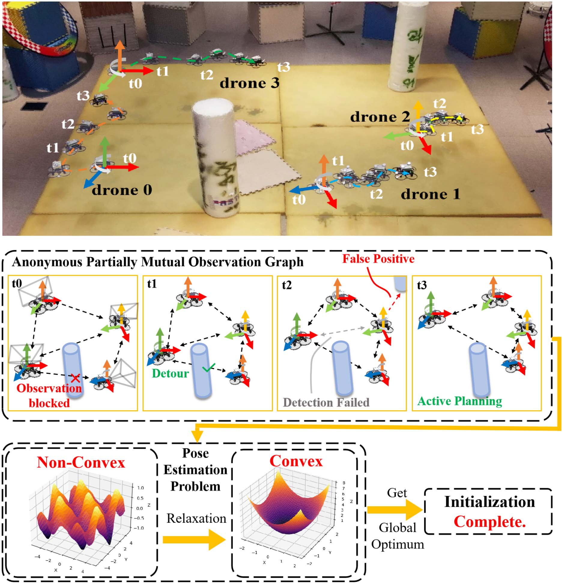
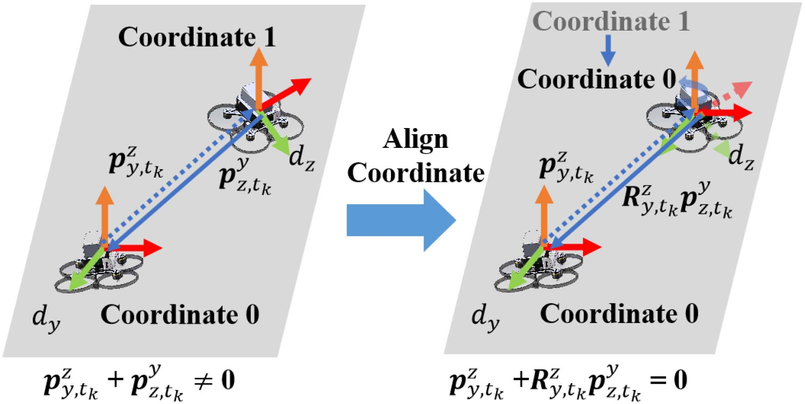
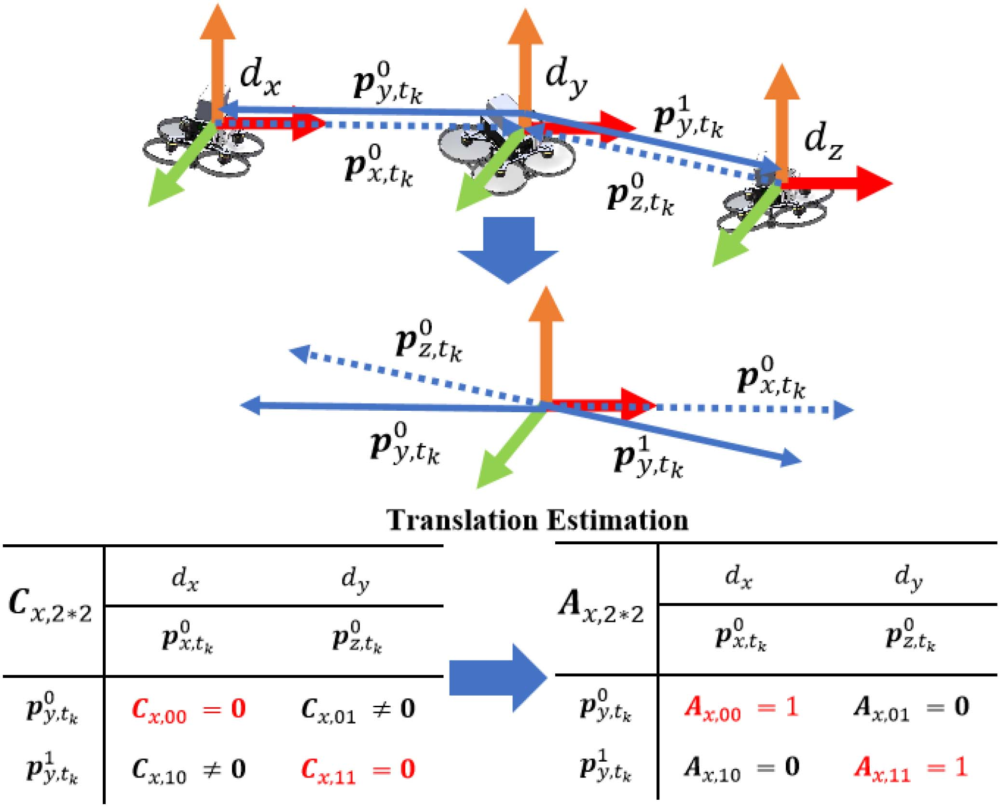
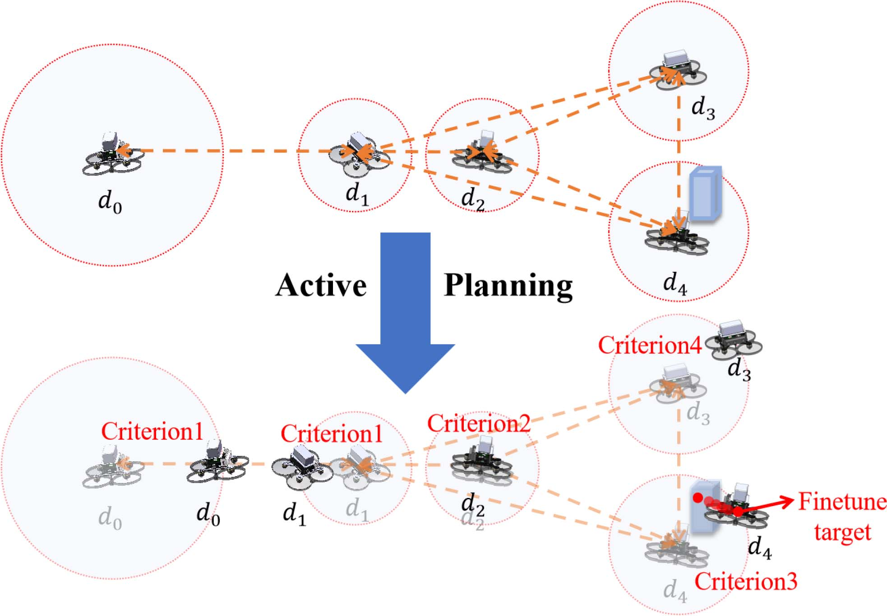
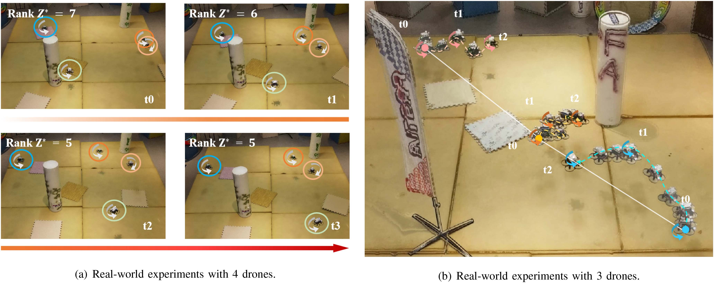
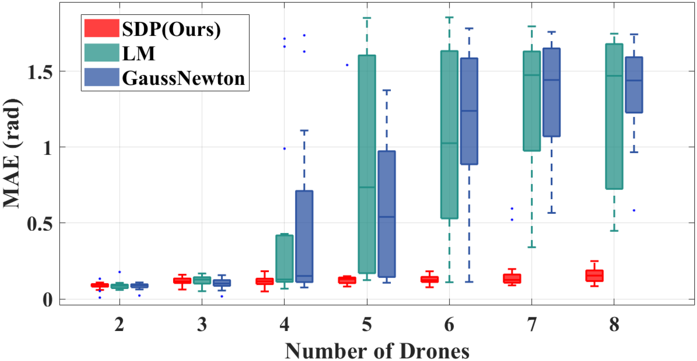
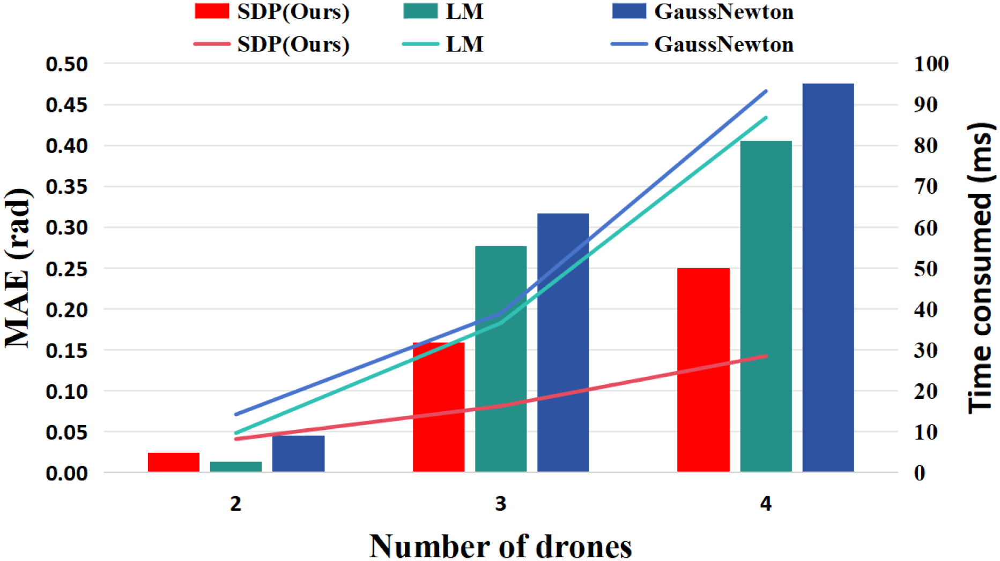

# FACT视觉无人机集群快速主动坐标系初始化（FACT Fast and Active Coordinate Initialization for Vision-Based Drone Swarms）：完整忠实学术翻译

> **原文标题**：FACT Fast and Active Coordinate Initialization for Vision-Based Drone Swarms  
> **作者**：Yuan Li、Anke Zhao、Yingjian Wang、Ziyi Xu、Xin Zhou、Chao Xu、Jinni Zhou、Fei Gao  
> **发表信息**：IEEE Robotics and Automation Letters，第 10 卷第 2 期，2025 年 2 月，页 931–938  
> **原文 PDF**：[FACT Fast and Active Coordinate Initialization for Vision-Based Drone Swarms.pdf](../FACT Fast and Active Coordinate Initialization for Vision-Based Drone Swarms.pdf) ｜ **对应中文详解**：[14_FACT视觉无人机集群快速主动坐标系初始化.md](../中文详解/14_FACT视觉无人机集群快速主动坐标系初始化.md)  

---

## 原文第 1 页：题目、摘要与引言

FACT：面向视觉无人机集群的快速主动坐标系初始化
Yuan Li
, Anke Zhao
, Yingjian Wang
, Student Member, IEEE, Ziyi Xu, Xin Zhou
,
Chao Xu
, Senior Member, IEEE, Jinni Zhou, and Fei Gao
, Member, IEEE
**摘要**——坐标系初始化是机器人集群执行协同任务的第一步，并决定任务质量。然而，面向视觉的无人机集群仍难以实现快速、鲁棒的坐标系初始化。为此，本文提出一个完整的初始相对位姿估计系统，包括相对状态估计和主动规划两部分。该系统将机载视觉惯性里程计与视觉观测融合，生成方位和距离测量；这些测量具有匿名、部分互视和噪声等特点。本文首次利用凸优化方法，根据视觉观测完成坐标系初始化。此外，我们设计了轻量级模块，主动控制机器人运动以获取观测并避免碰撞。系统仅使用双目相机和惯性测量单元作为传感器，并在有障碍物且无全球导航卫星系统信号的仿真和真实环境中验证了其实用性。与基于局部优化和滤波器的方法相比，本文系统能够更稳定、更快速地获得坐标系初始化的全局最优解，适用于尺寸、重量和功耗受限的机器人。源代码已公开供参考。
（摘要英文原文已由上方中文摘要完整翻译。）
**关键词**——空中系统；感知与自主；群体机器人；视觉导航。

## 原文第 1 页：引言
群体机器人已在搜索 [1]、监视 [2] 等领域展现出变革性作用。为确保这些协同任务成功执行，集群中的每个机器人都必须准确估计相对于其他机器人的位姿，包括旋转和平移。该估计过程首先需要完成坐标系初始化，随后基于已初始化的坐标和里程计持续更新相对位姿。尽管外部系统
Received 7 September 2024; accepted 4 December 2024. Date of publication
16 December 2024; date of current version 20 December 2024. This article
was recommended for publication by Associate Editor H. Araujo and Editor P.
Vasseur upon evaluation of the reviewers’ comments. This work was supported
by the National Natural Science Foundation of China under Grant 62088101 and
Grant 62322314. (Yuan Li, Anke Zhao, and Yingjian Wang contributed equally
to this work.) (Corresponding authors: Xin Zhou; Yingjian Wang; Fei Gao.)
Yuan Li, Anke Zhao, Yingjian Wang, Ziyi Xu, Xin Zhou, Chao Xu, and
Fei Gao are with the Institute of Cyber-Systems and Control, College of Con-
trol Science and Engineering, Zhejiang University, Hangzhou 310027, China,
and also with Huzhou Institute, Zhejiang University, Huzhou 313000, China
(e-mail: yuanli_cse@zju.edu.cn; yj_wang@zju.edu.cn; iszhouxin@zju.edu.cn;
fgaoaa@zju.edu.cn).
Jinni Zhou is with the Hong Kong University of Science and Technology,
Guangzhou 510000, China.
This
letter
has
supplementary
downloadable
material
available
at
https://doi.org/10.1109/LRA.2024.3518101, provided by the authors.
Digital Object Identifier 10.1109/LRA.2024.3518101

**图 1**：基于视觉的坐标系初始化示意图。观测以双向箭头表示。我们利用对偶半定松弛，将估计问题构造为半定规划（SDP）问题，从而鲁棒地获得全局最优解。

例如全球导航卫星系统（GNSS）和动作捕捉系统可用于解决相对位姿估计（RPE）问题，但在室内、洞穴或茂密森林等环境中无法工作。这些环境将输入来源限制为机载传感器。受尺寸、重量和功耗（SWaP）约束的无人机，其机载计算单元和传感器能力有限。
因此，坐标系初始化必须完全依赖机载资源。对于这类资源受限的机器人，双目相机配合惯性测量单元（IMU）已被证明是执行高性能空中集群协同任务所需的最小传感器配置 [3]。检测到其他机器人后，它能够高效获取方位和距离测量。按照双目视觉设置，RPE 方法主要分为两类：基于公共环境特征检测的方法，以及基于互相观测的方法。前者依赖同一场景中多台机器人公共特征的数量和质量，并需要机器人交换
2377-3766 © 2024 IEEE. All rights reserved, including rights for text and data mining, and training of artificial intelligence and similar technologies.
Personal use is permitted, but republication/redistribution requires IEEE permission. See https://www.ieee.org/publications/rights/index.html for more information.
Authorized licensed use limited to: National Institute of Technology- Delhi. Downloaded on August 24,2026 at 05:45:47 UTC from IEEE Xplore.  Restrictions apply.

---

## 原文第 2 页：相关工作与问题概述

观测并使用回环检测技术，因此需要大量计算和较高通信带宽；在纹理相似或有限的环境中也容易退化。
这些方法需要机器人交换观测并执行回环检测，因而需要大量计算和较高通信带宽；在纹理相似或有限的环境中也容易退化。本文针对多个受 SWaP 约束的机器人随机分布于复杂场景的坐标系初始化问题，因此关注跨场景泛化能力更好的互观测方法。这些方法主要需要方位或距离测量。早期结合方位和距离的工作 [4]、[5] 使用扩展卡尔曼滤波器（EKF）估计相对位姿；仅依赖距离的工作通常使用能够提供被检测无人机身份的 UWB 设备。近期工作 [6] 采用凸优化准确、鲁棒地求解相对位姿，另一项工作 [7] 则将仅方位测量的 RPE 建模为凸优化问题。然而 [4]、[5]、[6]、[7] 都假设测量非匿名并提供被观测无人机的身份。该假设虽简化了建模，却不适用于真实场景，尤其是大规模集群。本文考虑观测匿名性，并将其建模为凸优化问题。
Franchi [8] 首次研究了匿名距离和方位测量下的互定位，提出先执行配准、再使用多假设扩展卡尔曼滤波器（DAEKF）的两阶段框架，配准算法建立观测与机器人身份的对应关系。后续工作 [9] 用粒子滤波器（PF）替代 DAEKF，结果更准确，但更新 PF 位姿的计算量使其难以用于状态维度很高的大规模 SWaP 受限无人机集群。Nguyen [10] 改进了耦合概率数据关联滤波器（CPDAF）以应用于视觉无人机集群，但没有解决部分互视问题。上述滤波方法 [9]、[10] 对初值高度敏感，收敛慢且稳定性低；它们还忽略估计期间的运动安全。由于没有初始相对位姿，机器人在估计时容易碰撞。
本文在未知、充满障碍物的环境中，利用匿名、部分互视且带噪声的视觉距离和方位观测估计受 SWaP 约束无人机集群的相对位姿。其挑战包括：SWaP 限制计算与感知能力；视觉观测在没有可区分标签时不提供身份，因而与 VIO 无对应关系；相机的量程和精度有限，障碍物及其他机器人还会遮挡视线，使观测部分互视且带噪声；机器人数量和状态维度增加会造成维度爆炸并影响稳定估计；最关键的是，机器人必须在没有初始相对位姿时运动收集观测，同时避免与障碍物及其他机器人碰撞。相比 [8]、[9]、[10]，本文同时处理了这六项挑战。
面对这些挑战，我们提出了一种利用基于视觉的互相观测，在受 SWaP 约束的无人机集群中快速、鲁棒地完成坐标系初始化的系统。我们的无人机平台已在非结构化复杂环境中展现出强大的自主导航能力 [3]。基于这一平台，我们假设机器人能够交换 VIO 和观测数据。每台机器人的 VIO 含有噪声，且以初始时刻自身坐标系为参考；观测是互相的，即机器人 A 观测到机器人 B 时，机器人 B 也能观测到机器人 A。这些假设合理且易于在真实环境中实现，详见第 III 节和第 IV-B 节。
本文将问题建模为两个依次求解的优化问题，利用双目相机获得的视觉观测估计相对旋转和平移，无需额外传感器。我们融合 VIO 与观测数据，将旋转估计建模为考虑噪声的非凸优化问题，并将平移估计建模为最小代价加权二分图匹配问题。通过针对 SE(d) 同步的对偶半定松弛，我们将非凸问题转换为凸问题，从而快速、稳定地获得全局最优旋转估计。为保证安全，我们还提出引导机器人移动至一系列观测位置并避开障碍物和其他机器人的策略。系统仅依靠机载设备即可在无 GNSS 信号区域估计相对位姿。仿真和真实环境实验表明，与 Levenberg-Marquardt 和 Gauss-Newton 等局部优化方法相比，本系统在耗时、精度和稳定性方面具有显著优势。
本文的贡献如下：
r 我们面向受 SWaP 约束的无人机，构建了一个融合观测、主动规划以及全体无人机坐标系初始化的系统化解决方案；
Authorized licensed use limited to: National Institute of Technology- Delhi. Downloaded on August 24,2026 at 05:45:47 UTC from IEEE Xplore.  Restrictions apply.

---

## 原文第 3 页：系统概述与视觉测量生成

LI et al.: FACT: FAST AND ACTIVE COORDINATE INITIALIZATION FOR VISION-BASED DRONE SWARMS
933
r 我们首次将基于视觉互相观测的相对位姿估计问题转换为定义在凸集上的 SDP 问题，从而保证获得全局最优解，并针对受 SWaP 约束的机器人进行了定制；
r 我们以 C++ 形式向社区开放了本方法的实现代码。1
## II. 系统概述
该系统部署于无人机集群，仅依赖机载设备，可在未知且无 GNSS 信号的区域安全运行。算法包含六个模块：自主飞行部分的自定位、运动规划和控制模块，以及坐标系初始化部分的观测、相对位姿估计和主动规划模块。自定位模块根据深度图像和 IMU 生成 VIO；观测模块检测周围机器人并生成方位和距离测量（见第 III 节）；相对位姿估计模块见第 IV 节；主动规划模块计算下一观测位置以获得多次测量（见第 V 节）。
首先，主动规划模块控制机器人原地旋转，在检测周围无人机的同时克服有限 FoV 并通过观测模块获取测量。其次，各机器人通过无线网络交换观测和 VIO。随后系统检查观测次数是否足够；若足够，考虑视觉互视观测的相对位姿估计模块开始估计，否则主动规划模块生成下一观测位置。运动规划模块生成到达该位置的轨迹，控制模块执行轨迹，从而保证估计过程的安全。机器人重复这一流程。
### III. 基于视觉的测量生成
受 Xu 等人 [11] 工作的启发，我们设计了一个观测模块，利用双目相机检测无人机并生成三维向量测量值。
为高效、鲁棒地检测无人机，我们在真实环境采集的自定义数据集上微调预训练检测模型 YOLOv8n [12]。我们将深度图与灰度图组合成双通道网络输入；实际使用时复制灰度通道，以适配常见的三通道格式。检测图像中的无人机后，为统计每次观测中的检测数量，我们采用 BoT-SORT [13] 跟踪连续图像流中的无人机。该方法判断连续帧中的无人机是否为同一目标，并输出记录检测目标的索引；该索引不同于机器人的身份。最后，受 Carrio 等人 [14] 启发，我们根据网络输出计算二维边界框内的平均深度。为提高精度，深度根据特定阈值选取，该阈值限制其最大值。
1[Online]. Available: https://github.com/ZJU-FAST-Lab/FACT-Coordinate-
Initialization

**图 2**：一对互视观测示意图。

利用相机模型，我们使用估计深度将二维边界框中心鲁棒地重投影为三维向量，生成测量值。此外，检测使用相同设备，并设置统一的有效检测距离，以保证观测数据满足互视假设。
IV. 互定位
A. 符号说明
在不失一般性的前提下，以下推导均以无人机 x 为例。粗体大小写字母（如 p 和 R）分别表示向量和矩阵。矩阵 M 的转置和迹分别记为 M^T 和 tr(M)，Kronecker 积记为 ⊗。n × n 单位矩阵和零矩阵分别记为 I_n 和 O_n。记 e_i = [0, …, 1, …, 0]^T 为 N 维空间中的第 i 个标准基向量。引入选择矩阵 C_x，定义为 C_x = e_x ⊗ I_3。
设有 N 架无人机，记为 d0、d1、…、dx、…、dN−1。时间戳总数记为 NO；无人机 dx 在 tk 的观测总数记为 Ox,tk，所有无人机在 tk 的观测总数记为 Otk。无人机 dx 在 tk 的第 j 个观测记为 pjx,tk ∈ R3。各无人机在每个时间戳旋转进行观测并生成观测序列。机器人 dx 绑定坐标系 fx,tk；Rix,tk ∈ SO(3) 和 tix,tk ∈ R3 分别表示 tk 时机器人 di 坐标系相对于 dx 的旋转和平移，Rtkx,t0 ∈ SO(3) 和 ttkx,t0 ∈ R3 分别表示 tk 时 dx 坐标系相对于其 t0 时刻自身坐标系的旋转和平移。
B. 旋转估计问题定义
对于相对旋转估计问题，首先考虑无人机 dy 与 dz 之间的一对互相观测 pzy,tk 和 pyz,tk。按照图 2，将两架无人机的观测对齐到 dy 的坐标系中。这两个观测构成一对反向平行向量；对齐后的两者之和应为零，即
Authorized licensed use limited to: National Institute of Technology- Delhi. Downloaded on August 24,2026 at 05:45:47 UTC from IEEE Xplore.  Restrictions apply.

---

## 原文第 4 页：相对旋转估计

应满足
0 = (Ry
x,t0Rtk
y,t0)pz
y,tk + (Rz
x,t0Rtk
z,t0)py
z,tk.
(1)
然而，由于观测是匿名的，我们不知道 pj y,tk 中哪些观测对应于 pz y,tk。在互相观测假设下，机器人保持静止并旋转 360 度获取观测；因此若 dy 观测到 dz，则 dz 也观测到 dy。将各无人机在 tk 的观测变换到同一坐标系后，观测总和应为零，无需判断观测与机器人身份的对应关系。现在考虑 tk 时所有无人机的观测，它们应满足
0 =
N−1

i=0
Oi,tk −1

j=0
(Ri
x,t0
†Rtk
i,t0
†)pj
i,tk
†,
(2)
其中上标 † 表示真实值。
实际中，由于观测和 VIO 存在噪声，式（2）无法严格成立。因此，我们使用式（3）构造误差，将问题转化为优化问题。 
x,t0, R1
x,t0, . . . , RN−1
x,t0 ]∈
记上述矩阵为决策变量。类似地，定义对应的 VIO 旋转矩阵。为便于定义决策变量，引入选择矩阵并代入式（2）。
t0 =
[Rtk
0,t0, Rtk
1,t0, . . . , Rtk
N−1,t0]∈SO(3)N. 
记上述矩阵为决策变量。类似地，定义对应的 VIO 旋转矩阵。为便于定义决策变量，引入选择矩阵并代入式（2）。
将选择矩阵代入旋转关系。
x,t0 = Rx,t0Ci, and Rtk
i,t0 = Rtk
t0Ci into (2). The
error of rotation estimation can be defined as
etk =
N−1

i=0
Oi,tk −1

j=0
(Ri
x,t0Rtk
i,t0)pj
i,tk =
N−1

i=0
Rx,t0CipR
i,tk,
(3)
其中 pi,tk 表示观测向量之和，pR i,tk 表示经 VIO 旋转变换后的观测和。
j=0
pj
i,tk, and pR
i,tk = Rtk
t0Cipi,tk.
最后，利用所有时间戳处所有无人机的观测和 VIO，可将相对旋转估计表述为如下最小二乘问题：
Rx,t0
∗=
arg min
Rx,t0∈SO(3)N
NO−1

k=0
eT
tketk.
(4)
C. 旋转估计
利用迹运算的性质，最小二乘误差可变换为：
上述形式：
NO−1

k=0
eT
tketk
=
NO−1

k=0
N−1

i=0
N−1

j=0
(Rx,t0CipR
i,tk)T (Rx,t0CjpR
j,tk)
= tr
⎛
⎝
NO−1

k=0
N−1

i=0
N−1

j=0
(pR
i,tk)
T CT
i RT
x,t0Rx,t0CjpR
j,tk
⎞
⎠
=
NO−1

k=0
N−1

i=0
N−1

j=0
tr(CjpR
j,tk(pR
i,tk)
T CT
i RT
x,t0Rx,t0)
= tr(Q(RT
x,t0Rx,t0)),
(5)
其中 Q 为由所有观测和 VIO 构成的矩阵。
k=0
N−1
i=0
N−1
j=0 CjpR
j,tk(pR
i,tk)
T CT
i .
Using (5), We can redefine the (4) as,
Rx,t0
∗=
arg min
Rx,t0∈SO(3)N tr(Q(RT
x,t0Rx,t0)).
(6)
Although the (6) is elegant, it cannot be robustly solved
for the global optimum due to the non-convex nature of the
rotation matrix R ∈SO(3). The constraints defining SO(3)—
orthogonality and a determinant of one—are nonlinear and
non-convex. Now, let
Zx,t0 = RT
x,t0Rx,t0,
(7)
记上述矩阵为决策变量。类似地，定义对应的 VIO 旋转矩阵。为便于定义决策变量，引入选择矩阵并代入式（2）。
lize the dual semi-definite relaxation for SO(3) synchronization
and tightly relax the non-convex problem into an SDP problem.
It can be robustly and quickly solved for the global optimum,
matching that of the original non-convex problem. Using (7),
the (6) is transformed as,
Zx,t0
∗=
arg min
Zx,t0∈Sym(3N)
tr(QZx,t0)
s.t.
Zx,t0 =
⎡
⎢⎢⎢⎣
I2
∗
· · ·
∗
∗
I2
· · ·
∗
. . .
. . .
...
. . .
∗
∗
· · ·
I2
⎤
⎥⎥⎥⎦⪰0,
(8)
where Zx,t0 ⪰0 means that Zx,t0 is a positive semi-definite
matrix, indicating that the problem is a standard SDP problem.
Therefore, it is a convex optimization problem, meaning that all
local optimums found by numerical solvers are also the global
optimum of (8).
To improve efficiency for solving, we only estimate the yaw
angle of rotation by mutual localization. Based on the previous
work [16], the VIO systems are unobservable in 3D translations
and the rotation along the Z-axis, while roll and pitch angles are
aligned with the gravity direction as directly measured by the
IMU. So we can simplify the rotation matrix R ∈SO(3) and
vectors p ∈R3 into Ξ ∈SO(2), ρ ∈R2. Correspondingly, we
记上述矩阵为决策变量。类似地，定义对应的 VIO 旋转矩阵。为便于定义决策变量，引入选择矩阵并代入式（2）。
dimensions 3 × 3n to Ξx,t0 with dimensions 2 × 2n. And we
记上述矩阵为决策变量。类似地，定义对应的 VIO 旋转矩阵。为便于定义决策变量，引入选择矩阵并代入式（2）。
sions 3n × 3n to Γx,t0 with dimensions 2n × 2n. Additionally,
we replace Cx, and Q with Υx = ex ⊗I2, and Λ, respectively.
The (8) can be simplified as,
Γx,t0
∗=
arg min
Γx,t0∈Sym(2N)
tr(ΛΓx,t0)
Authorized licensed use limited to: National Institute of Technology- Delhi. Downloaded on August 24,2026 at 05:45:47 UTC from IEEE Xplore.  Restrictions apply.

---

## 原文第 5 页：平移估计

式（9）的约束为：

Γx,t0 = [I2, ∗, …, ∗; ∗, I2, …, ∗; …; ∗, ∗, …, I2] ⪰ 0。 (9)

在得到 Γx,t0
∗ 后，可通过下式计算 Ξx,t0
∗：

Ξx,t0
∗= U ∗
√
S,  (10)

其中 U 和 S 是对 Γx,t0
∗ 进行奇异值分解（SVD）所得的结果。正如我们此前的工作 [17] 所示，当 rank(Γx,t0
∗) ≤ N + 1 时，说明已获得完整观测，Ξx,t0
∗ 有效，表明旋转的相对偏航角 ψN 已被估计。最后，结合 IMU 获得的横滚角和俯仰角，即可直接计算 Rx,t0
∗。

### D. 平移估计的问题建模
对于无人机 dx 的观测 pi
x,t0，我们定义对应矩阵 Ax,κ×λ，其中 κ 和 λ 分别表示 Ox,tk 与 Otk − Ox,tk。矩阵每一行表示 dx 的一次观测，每一列表示除 dx 外所有无人机的一次观测。元素 Ax,ij 属于 {0, 1}；值为 1 表示 dx 的第 i 次观测与其他机器人提供的第 j 次观测相对应。通过查询，若第 j 次观测对应无人机 dm 的第 n 次观测，则 dm 相对于 dx 的平移为 pi
x,t0。

### E. 平移估计
为估计 Ax,κ×λ，我们定义代价矩阵 Cx,κ×λ 表示匹配误差，其元素为统一坐标系中一对观测之和的 Euclidean 范数：

Cx,ij = || pi
x,t0 + Rm
x,t0pn
m,t0 ||2  (11)

Ax,κ×λ∗ = arg min ΣiΣj Ax,ijCx,ij，满足每行元素之和为 1、每列元素之和属于 {0,1}，且 Ax,ij ∈ {0,1}。 (12)

其中第 i 次观测对应无人机 dm 的第 n 次观测，j = Σ i∈{0,1,...,m−1} Oi,t0 + n。图 3 展示了 Ax,κ×λ 和 Cx,κ×λ 的结构。由此得到式（12）所示的最小代价加权二分图匹配问题，可通过 Hungarian algorithm 求解。对所有无人机应用该算法，可得到 Aκ×λ
∗ = {A0,κ×λ
∗, …, AN−1,κ×λ
∗}。直接观测到的相对平移可直接获得；对于未观测机器人，以 dx 为起点，在对应矩阵中执行深度优先搜索（DFS）寻找路径。例如路径 dx → dy → dz 满足 tz
x,t0 = ty
x,t0 + Ry
x,t0tz
y,t0。

**图 3**：平移估计过程说明。将所有观测变换到无人机 dy 的坐标系中，并据此计算误差矩阵。根据这些误差，将所有机器人身份与相应观测进行匹配，再由匹配关系和观测估计无人机 dy 相对于其他无人机的平移。

## V. 主动且安全的规划
在完成集群坐标初始化之前，无法使用集群规划器避免机器人碰撞。已有工作 [9]、[10]、[17] 采用预定义轨迹或伪随机控制律，无法避免相向碰撞。我们提出具有安全保证的主动运动策略，基于周围观测为每架机器人生成下一观测位置和安全轨迹。
为避免碰撞，将每架无人机的运动半径限制为与最近无人机 Euclidean 距离的一半 dmin/2；考虑轨迹执行精度，实际球半径设为 dmin 的 40%，记为 dr。按照算法 1 的四项准则计算下一观测位置：优先处理 FoV 边缘观测；若 δ0 米范围内观测数量超过 δ1，则随机升高或降低高度；否则选择与最近无人机方向顺时针或逆时针 90° 的方向移动 dr；此外以 δ2 的概率选择无无人机的新方向探索未知区域。若目标位于障碍物内，则缩短距离绕行，最后由单机规划器生成避障轨迹。

## VI. 基准测试与实验
本文在带噪声的仿真和真实环境中进行比较。由于相关工作 [9]、[10] 未公开代码且基于滤波器，我们仅比较局部优化方法 LM 和 GN，并在相同条件下求解式（6）。δ0、δ1 和 δ3 分别设为 0.75、3 和 10%。实验重点关注旋转估计；SDP 使用 C++ 的 MOSEK Fusion API 求解。详细统计数据已公开。

**图 4**：主动规划算法示例。红色虚线圆表示半径为 dr 的圆。每个机器人依据四项准则执行主动规划。由于机器人 d4 的下一观察位置位于障碍物内部，需要对该位置进行微调。

### A. 与局部优化方法的仿真比较
我们在含障碍物、噪声水平相同的环境中，将 2 至 8 架无人机随机初始化，分别实验 20 次，记录旋转估计耗时和平均绝对误差（MAE）；另以 4 架无人机测试不同噪声水平。为缩小仿真到真实的差距，还向观测和 VIO 加入噪声。图 6 表明，随着无人机数量增加，本文方法保持精度，而两种局部优化方法的 MAE 显著增加。观测基本完整时，三种方法误差接近；部分互视和更高维变量会使局部优化更易陷入局部最小值。表 I 显示本文方法求解更快，且无人机越多优势越明显。图 7 表明本文方法在一定噪声范围内保持鲁棒精度，而局部优化方法尤其 GN 的 MAE 随噪声增加而上升。总体而言，本文将旋转估计的非凸问题转为凸问题，可更快、更鲁棒地获得全局最优解。

## 原文第 7 页：真实环境实验

**图 5**：不同无人机数量下的真实环境实验。(a) 四架无人机实验中，随着主动运动和观测次数增加，决策变量 Γx,t0
∗ 的秩逐渐降低；第三次观测后（t2）达到 N + 1。t3 的第四次观测虽未进一步降低秩，却减小了观测噪声造成的误差。(b) 旋转对称编队示例。

**图 6**：平均绝对误差的沙盒实验图。每种方法分别在 2 至 8 架无人机条件下测试 20 次。

**图 7**：加入不同噪声时四架无人机实验中的旋转估计平均绝对误差。

### B. 真实环境实验
为验证实用性，我们将算法部署在无人机集群上，在无 GNSS 的室内区域随机放置 2 至 4 架、姿态随机的无人机和障碍物，并比较三种方法的旋转估计耗时与 MAE。在一次三架无人机等间距成直线的实验中，如图 5(b) 所示，主动规划打破了旋转对称编队并完成坐标初始化。每架 300 克无人机仅配备灰度立体相机和 IMU，机载计算单元为 Nvidia Orin NX；结合规划器 [3]，无人机可在无 GNSS 环境中自主避障。各方法分别测试四次，并使用 NOKOV Motion Capture System 获取旋转估计真值。

## 原文第 8 页：实验结果、结论与未来工作

**图 8**：不同方法的旋转估计平均绝对误差和耗时。误差和时间分别以柱状图和曲线表示。

在真实障碍环境中，本文方法在耗时和精度方面均占优，尤其是无人机数量超过 2 架时。Hungarian Algorithm 耗时约 0.4 ms，可实时恢复相对平移。四架无人机实验中，随着观测次数由 0 增至 3，Z∗ 的秩由 8 降至 5；第四次观测进一步提高了抗噪精度。三架无人机形成旋转对称编队时，系统仍能准确估计相对位姿。旋转对称可能因匿名观测产生多解 [9]；实验中某架无人机执行算法 1 的准则 4，随机生成的新观测目标意外打破了对称性，说明该准则有助于处理旋转对称。

### VII. 结论与未来工作
针对上述挑战，本文系统利用视觉观测，在 SWaP 受限的无人机集群中实现鲁棒、快速的坐标初始化；每架 300 克无人机仅使用立体相机和 IMU 作为传感器。仿真及真实环境实验表明，系统能够在无 GNSS 环境中进行相对位姿估计并支持自主运动。该鲁棒性来自问题建模方法和主动规划准则：前者保证快速、准确地获得全局最优解，后者保障估计过程中的飞行安全。未来工作将聚焦于改进主动规划模块，以应对旋转对称挑战。

REFERENCES
[1] A. Marjovi, J. G. Nunes, L. Marques, and A. de Almeida, “Multi-robot
exploration and fire searching,” in Proc. IEEE/RSJ Int. Conf. Intell. Robots
Syst., 2009, pp. 1929–1934.
[2] D. Saldaña, R. J. Alitappeh, L. C. A. Pimenta, R. Assunção, and
M. F. M. Campos, “Dynamic perimeter surveillance with a team of robots,”
in Proc. IEEE Int. Conf. Robot. Automat., 2016, pp. 5289–5294.
[3] X. Zhou et al., “Swarm of micro flying robots in the wild,” Sci. Robot.,
vol. 7, no. 66, 2022, Art. no. eabm5954.
[4] A. Martinelli, F. Pont, and R. Siegwart, “Multi-robot localization using
relative observations,” in Proc. IEEE Int. Conf. Robot. Automat., 2005,
pp. 2797–2802.
[5] C.-H. Chang, S.-C. Wang, and C.-C. Wang, “Vision-based cooperative
simultaneous localization and tracking,” in Proc. IEEE Int. Conf. Robot.
Automat., 2011, pp. 5191–5197.
[6] T. H. Nguyen and L. Xie, “Relative transformation estimation based on
fusion of odometry and UWB ranging data,” IEEE Trans. Robot., vol. 39,
no. 4, pp. 2861–2877, Aug. 2023.
[7] Y. Wang, X. Wen, Y. Cao, C. Xu, and F. Gao, “Bearing-based relative
localization for robotic swarm with partially mutual observations,” IEEE
Robot. Automat. Lett., vol. 8, no. 4, pp. 2142–2149, Apr. 2023.
[8] A. Franchi, G. Oriolo, and P. Stegagno, “Mutual localization in a multi-
robot system with anonymous relative position measures,” in Proc.
IEEE/RSJ Int. Conf. Intell. Robots Syst., 2009, pp. 3974–3980.
[9] A. Franchi, G. Oriolo, and P. Stegagno, “Mutual localization in multi-
robot systems using anonymous relative measurements,” Int. J. Robot.
Res., vol. 32, pp. 1302–1322, 2013.
[10] T. Nguyen, K. Mohta, C. J. Taylor, and V. Kumar, “Vision-based multi-
MAV localization with anonymous relative measurements using coupled
probabilistic data association filter,” in Proc. IEEE Int. Conf. Robot.
Automat., 2020, pp. 3349–3355.
[11] H. Xu et al., “Omni-swarm: A decentralized omnidirectional visual–
inertial–UWB state estimation system for aerial swarms,” IEEE Trans.
Robot., vol. 38, no. 6, pp. 3374–3394, Dec. 2022.
[12] G. Jocher, A. Chaurasia, and J. Qiu, “Ultralytics YOLO,” Version 8.0.0,
Jan. 2023. [Online]. Available: https://github.com/ultralytics/ultralytics,
[13] N. Aharon, R. Orfaig, and B.-Z. Bobrovsky, “BoT-sort: Robust associa-
tions multi-pedestrian tracking,” 2022, arXiv:2206.14651.
[14] A. Carrio, S. Vemprala, A. Ripoll, S. Saripalli, and P. Campoy, “Drone
detection using depth maps,” in Proc. IEEE/RSJ Int. Conf. Intell. Robots
Syst., 2018, pp. 1034–1037.
[15] D. M. Rosen, L. Carlone, A. S. Bandeira, and J. J. Leonard, “Se-sync: A
certifiablycorrectalgorithmforsynchronizationoverthespecialEuclidean
group,” Int. J. Robot. Res., vol. 38, no. 2/3, pp. 95–125, 2019.
[16] A. Martinelli, “Vision and IMU data fusion: Closed-form solutions for
attitude, speed, absolute scale, and bias determination,” IEEE Trans.
Robot., vol. 28, no. 1, pp. 44–60, Feb. 2012.
[17] Y. Wang, X. Wen, L. Yin, C. Xu, Y. Cao, and F. Gao, “Certifiably optimal
mutual localization with anonymous bearing measurements,” IEEE Robot.
Automat. Lett., vol. 7, no. 4, pp. 9374–9381, Oct. 2022.
[18] T. Qin, P. Li, and S. Shen, “VINS-Mono: A robust and versatile monoc-
ular visual-inertial state estimator,” IEEE Trans. Robot., vol. 34, no. 4,
pp. 1004–1020, Aug. 2018.
Authorized licensed use limited to: National Institute of Technology- Delhi. Downloaded on August 24,2026 at 05:45:47 UTC from IEEE Xplore.  Restrictions apply.

---
