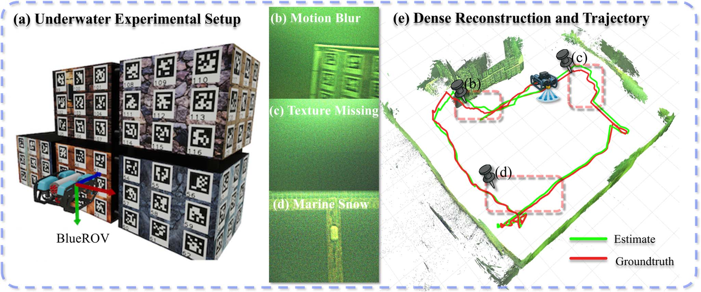
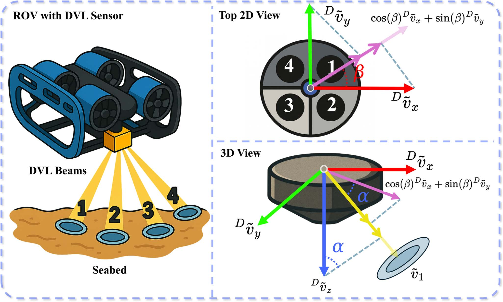
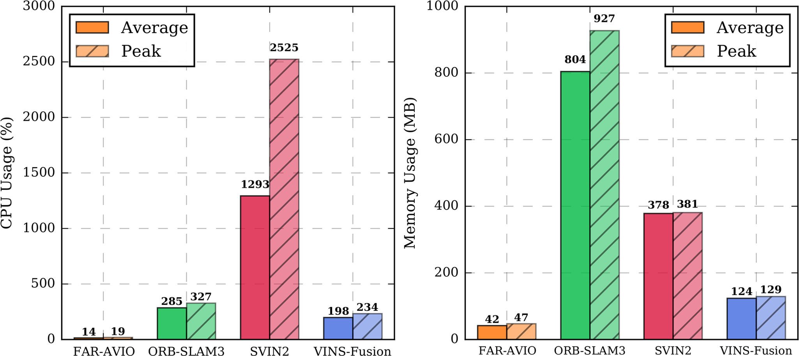
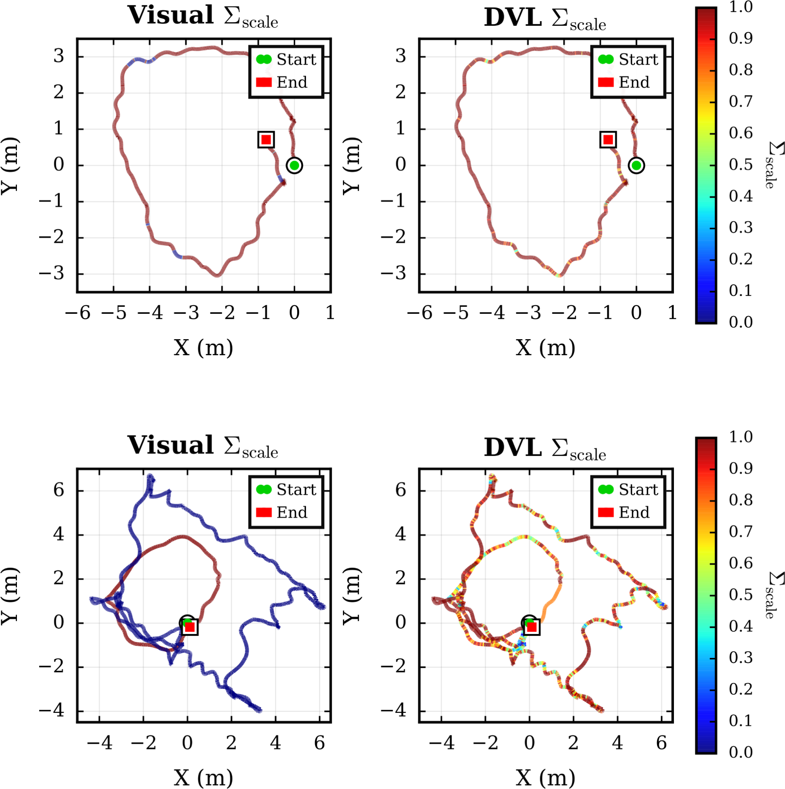
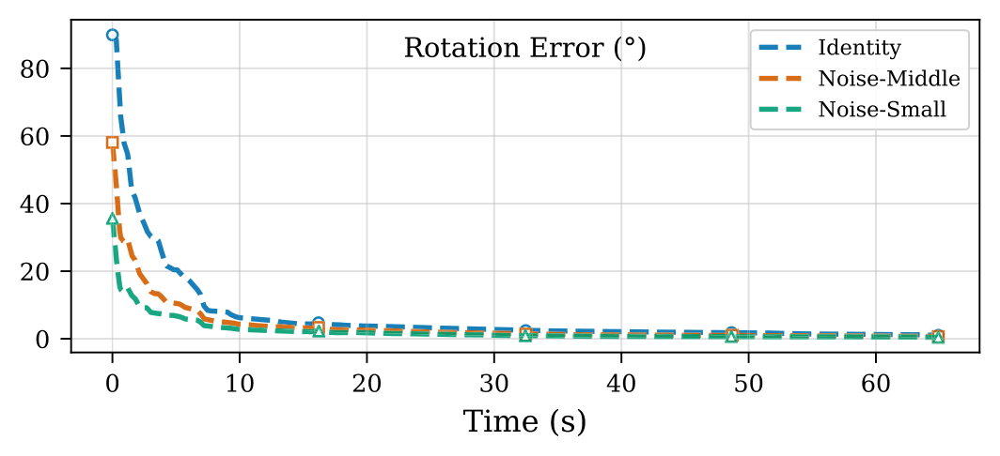

# FAR-AVIO基于舒尔补的声光惯融合里程计与在线标定（FAR-AVIO Fast and Robust Schur-Complement Based Acoustic-Visual-Inertial Fusion Odometry With Sensor Calibration）：完整忠实学术翻译

> **原文标题**：FAR-AVIO Fast and Robust Schur-Complement Based Acoustic-Visual-Inertial Fusion Odometry With Sensor Calibration  
> **作者**：> - 作者：Hao Wei、Peiji Wang、Qianhao Wang、Yang Gu、Tong Qin、Fei Gao、Yulin Si  
> **发表信息**：> - 期刊：*IEEE Robotics and Automation Letters*，第 11 卷第 7 期，2026 年 7 月  
> **原文 PDF**：[FAR-AVIO Fast and Robust Schur-Complement Based Acoustic-Visual-Inertial Fusion Odometry With Sensor Calibration.pdf](../FAR-AVIO Fast and Robust Schur-Complement Based Acoustic-Visual-Inertial Fusion Odometry With Sensor Calibration.pdf) ｜ **对应中文详解**：[15_FAR-AVIO基于舒尔补的声光惯融合里程计与在线标定.md](../中文详解/15_FAR-AVIO基于舒尔补的声光惯融合里程计与在线标定.md)  

---

## 原文第 1 页核心内容与翻译

FAR-AVIO：基于舒尔补的快速鲁棒声光惯融合里程计与传感器标定
Hao Wei
, Graduate Student Member, IEEE, Peiji Wang, Qianhao Wang
,
Yang Gu
, Graduate Student Member, IEEE, Tong Qin
, Senior Member, IEEE, Fei Gao
, Member, IEEE,
and Yulin Si
, Member, IEEE
**摘要：** 水下环境中的强烈光衰减、海洋雪、浑浊以及弱激励运动，会降低惯性系统的可观测性，并使视觉—惯性里程计在长期运行中频繁跟踪失败。紧耦合声光惯融合通常通过将声学多普勒计程仪（DVL）与视觉—惯性测量结合来实现，能够提供准确的状态估计，但其图优化计算量往往过大，难以实时部署在资源受限的平台上。本文提出 FAR-AVIO，一种面向水下机器人的、基于舒尔补的紧耦合声光惯里程计框架。FAR-AVIO 将舒尔补形式嵌入扩展卡尔曼滤波器（EKF），在提高精度的同时联合优化位姿与路标，并通过高效边缘化路标状态维持恒定时间更新。在此基础上，本文提出自适应权重调整与可靠性评估（AWARE）在线传感器健康模块，持续评估视觉、惯性和 DVL 测量的可靠性，自适应调节其 sigma 权重；同时设计高效的在线标定方案，在无需专门标定机动的情况下联合估计 DVL—IMU 外参。数值仿真和真实水下实验一致表明，FAR-AVIO 在定位精度和计算效率方面均优于先进水下 SLAM 基线，能够在低功耗嵌入式平台上稳定运行。本文实现已作为开源软件发布。
**关键词：** 声光惯融合；误差状态卡尔曼滤波；水下机器人。
Received 24 December 2025; accepted 9 April 2026. Date of publication 27
April 2026; date of current version 15 May 2026. This article was recommended
for publication by Associate Editor M. J. Islam and Editor A. Kim upon
evaluation of the reviewers’ comments. This work was supported in part by the
National Key R&D Program of China under Grant 2023YFC2809300, in part
by the National Natural Science Foundation of China under Grant 52571313,
and in part by Zhejiang Provincial Natural Science Foundation under Grant
LZ24E090001. (Corresponding author: Yulin Si.)
Hao Wei, Peiji Wang, Yang Gu, and Yulin Si are with the State Key Labo-
ratory of Ocean Sensing, and Ocean College, Zhejiang University, Zhoushan
316021, China (e-mail: isweihao@zju.edu.cn; peijiwang@zju.edu.cn; yangu@
zju.edu.cn; yulinsi@zju.edu.cn).
Qianhao Wang and Fei Gao are with the State Key Laboratory of Indus-
trial Control Technology, and the Institute of Cyber-Systems and Control,
Zhejiang University, Hangzhou 310027, China (e-mail: qhwangaa@zju.edu.cn;
fgaoaa@zju.edu.cn).
Tong Qin is with the Global Institute of Future Technology, Shanghai Jiao
Tong University, Shanghai 200240, China (e-mail: qintong@sjtu.edu.cn).
Digital Object Identifier 10.1109/LRA.2026.3688065
## I. 引言
海洋机器人，如自主水下航行器（AUV）和遥控水下航行器（ROV），已成为海底基础设施检测、海上能源维护和海洋探索不可或缺的平台[1]、[2]。对于这些任务，准确且漂移有界的定位至关重要；然而，水下无法使用卫星导航，外部定位基础设施在实际应用中通常不存在或受到严重限制。因此，相机凭借体积小、成本低，日益被用于水下机器人，视觉同步定位与建图（SLAM）也成为实现精确水下定位的自然选择。
先进的视觉和视觉—惯性 SLAM 系统，如 ORB-SLAM3[3]、VINS-Mono[4]、DM-VIO[5]、OV2-SLAM[6] 和 OKVIS2-X[7]，在视觉纹理丰富且惯性运动激励充分的地面和空中场景中表现出色。然而，水下环境给这些方法带来了重大挑战。快速光衰减、照明不足和密集的“海洋雪”常导致视觉退化持续数十秒至数分钟，超过纯视觉跟踪能够保持可靠性的时间范围[2]。此外，水下机器人经常以缓慢、近似静止的方式运动，造成加速度计信噪比较低、IMU 初始化困难；因此，传统视觉—惯性流程难以在长期视觉退化期间保持一致的精度[8]、[9]。
为缓解这些局限，许多水下 SLAM 与导航框架引入了 DVL、深度/压力传感器和声呐等额外的本体与外部传感器。近期的紧耦合视觉—惯性—DVL 系统[10]和基于声呐的系统[11]在具有挑战性的水下场景中展现出显著的鲁棒性和精度。然而，这些方法大多依赖大规模图优化或因子图 SLAM 后端，计算开销很高，难以在资源受限的嵌入式平台上实时部署。相比之下，现有基于滤波的多传感器融合方法通常将视觉和 DVL 信息简化为低维位姿或速度测量[12]、[13]，
2377-3766 © 2026 IEEE. All rights reserved, including rights for text and data mining, and training of artificial intelligence and similar technologies.
Personal use is permitted, but republication/redistribution requires IEEE permission. See https://www.ieee.org/publications/rights/index.html for more information.

---

## 原文第 2 页核心内容与翻译

WEI et al.: FAR-AVIO: FAST AND ROBUST SCHUR-COMPLEMENT BASED ACOUSTIC-VISUAL-INERTIAL FUSION ODOMETRY
7741



**图 1**：所提系统在水下环境中的真实部署。(a) 为实验设置，其中 ROV 正在检测水下目标结构；(b)、(c) 和 (d) 展示水下常见的视觉挑战，包括运动模糊、长时间无纹理区域和海洋雪；(e) 展示 FAR-AVIO 生成的稠密重建结果及估计轨迹。

这些方法没有充分利用点级约束，也没有对多传感器外参进行在线标定，从而限制了最终精度和长期一致性。
上述现象表明，当前水下定位系统在精度与效率之间仍存在持续的鸿沟。
为弥合这一鸿沟，本文提出 FAR-AVIO，一种带有在线标定和 AWARE 模块的快速鲁棒声光惯融合里程计。FAR-AVIO 受到基于舒尔补的滑动窗口滤波器[14]、[15]的启发，在 EKF 框架中采用舒尔补，实现位姿与路标的联合优化，同时利用路标独立性实现高效的恒定时间更新。该设计弥合了基于优化方法的精度与基于滤波方法的效率之间的差距。本文的主要贡献如下：

r 我们提出首个基于舒尔补的紧耦合声光惯里程计框架，从多普勒频移原理出发严格建模 DVL 测量，并将其嵌入基于滤波的后端优化，同时联合执行 DVL-IMU 外参在线标定，从而无需专门标定过程即可在资源受限的水下平台上实现高定位精度和实时性能。
r FAR-AVIO 引入 AWARE 模块，通过在线健康评分机制，基于实时可靠性评估动态调整传感器融合的 sigma 缩放系数，使系统能够在传感器退化和故障条件下保持鲁棒运行。
r FAR-AVIO 已通过包括数值仿真和真实水下实验在内的大量实验验证，结果表明其相较先进方法具有更高的精度和计算效率（运行结果示例见图 1）。为服务研究群体，我们将完整实现作为开源软件发布。
（以上三项贡献分别对应：紧耦合声光惯融合与在线外参标定、AWARE 传感器健康评估，以及仿真和真实水下实验验证。）
所提出的系统架构如图 2 所示。本文其余部分组织如下：第二章回顾相关文献；第三章介绍 FAR-AVIO 框架，包括基于舒尔补的视觉更新、DVL 测量更新、在线传感器标定以及 AWARE 模块；第四章给出真实水下数据集上的实验评估；第五章总结全文并讨论未来工作。
## II. 相关工作
本节简要讨论相关工作。视觉和视觉—惯性 SLAM 已在地面与空中领域得到广泛研究[3]、[4]、[5]、[6]、[16]、[17]、[18]、[19]。当视觉纹理丰富且惯性激励充分时，这些方法能够提供强基线；但如第 I 节所述，其性能在水下环境中会严重下降。下文聚焦于水下多传感器融合方法，尤其是基于 DVL 的定位。
早期水下 SLAM 框架将 DVL、双目视觉和陀螺仪测量置于松耦合流程中[13]、[20]，其中 DVL 输出仅作为视觉估计器的外部速度先验。虽然这种配置在困难水下场景中能够给出合理位姿估计，但它既未利用加速度计数据，也未建模陀螺仪偏置，因而会导致横滚角和俯仰角漂移，最终限制解的长期一致性。为此，研究者提出了多种紧耦合视觉-DVL 和视觉—惯性—DVL 框架。文献[21]中的视觉-DVL 融合方法将 DVL 速度直接注入因子图后端，联合优化相机位姿和 DVL 测量，但没有融合 IMU 数据，因此在快速运动和严重视觉退化时鲁棒性受限。基于滤波的紧耦合视觉—惯性—DVL 里程计方法[12]联合融合三种模态，但假定外参已知且固定，因而容易受到标定漂移或硬件变化的影响。
较新的研究将 DVL 融合扩展到更丰富的多传感器 SLAM 系统。面向自主水面艇的基于图优化的 LiDAR-VI-DVL 框架[22]能够在水面轨迹上实现准确定位，但它针对二维水面运动设计，依赖较强的 LiDAR 约束，不能直接用于完全浸没的三维轨迹。紧耦合视觉—惯性—声学系统[23]和 AQUA-SLAM[10]进一步在类似 ORB-SLAM3 的后端中融合 DVL、相机和 IMU，并进行外参在线标定，后者提供了

---

## 原文第 3 页核心内容与翻译

Tank 数据集[2]用于基准测试。然而，这些基于因子图的方法计算成本很高，难以部署到资源受限平台上进行实时应用。
## III. 滤波器描述
### A. 状态定义与传播
遵循文献[24]中的状态表达，并将传感器外参纳入状态，系统状态定义为
xb =

pw
b
vw
b
Rw
b
ba bg T b
c T b
D
⊤,
(1)
其中，pw_b、vw_b 和 Rw_b 分别表示在世界坐标系 {w} 中表达的机体坐标系 {b} 的位置、速度和姿态。向量 ba 和 bg 表示 IMU 的加速度计偏置和陀螺仪偏置。T b_c 和 T b_D 分别表示从机体坐标系 {b} 到相机坐标系 {c} 和 DVL 坐标系 {D} 的外参变换，每个变换均由旋转和平移组成（例如，T b_c = {Rb_c, pb_c}）。
相应的误差状态向量 δxb 定义为
δxb =

δpw
b
其中，pw_b、vw_b 和 Rw_b 分别表示在世界坐标系 {w} 中表达的机体坐标系 {b} 的位置、速度和姿态。向量 ba 和 bg 表示 IMU 的加速度计偏置和陀螺仪偏置。T b_c 和 T b_D 分别表示从机体坐标系到相机坐标系和 DVL 坐标系的外参变换，每个变换均由旋转和平移组成。
(2)
对于非旋转部分，采用标准加性误差模型 x =
ˆx + δx，其中 ˆx 表示名义状态。对于旋转分量，在 SO(3) 上利用如下近似定义扰动：
R = Exp(⌊δθ⌋×) ˆR,
(3)
其中，δθ ∈R3 是最小旋转误差表示，⌊·⌋× 表示反对称算子，Exp(·) 表示矩阵指数运算。δT ∈R6 是相机和 DVL 外参变换的最小扰动，由平移误差状态和旋转误差状态组成。
名义状态的连续时间动力学由式（4）给出。
˙ˆpw
b = ˆvw
b , ˙ˆba = 0, ˙ˆbg = 0
ˆT
b
d = 0, ˆT
b
d = 0
˙ˆvw
b = ˆR
w
b

˜a −ˆba

+ gw
˙ˆRw
b = ˆR
w
b ⌊

其中，δθ ∈R3 是最小旋转误差表示，⌊·⌋× 表示反对称算子，Exp(·) 表示矩阵指数运算。δT ∈R6 是相机和 DVL 外参变换的最小扰动，由平移误差和旋转误差状态组成。
其中，ã 和 ω̃ 分别是加速度计和陀螺仪的原始测量值，gw 是世界坐标系中的重力向量。对式（4）进行线性化可得到误差状态传播方程：
δ ˙xb = F δxb + Gnb,
(5)
其中，F 是状态转移雅可比矩阵，G 是噪声输入矩阵。nb = [n⊤
a n⊤
aw n⊤
g n⊤
gw]⊤ 汇集了过程噪声；na 和 ng 分别表示加速度计和陀螺仪测量的高斯白噪声，naw 和 ngw 则描述驱动加速度计偏置和陀螺仪偏置的随机游走过程。
### B. 视觉测量与等效残差模型
为建立多视图约束，当新帧到达时，我们克隆当前 IMU 位姿，从而维护一个包含 N 个关键帧的固定大小滑动窗口；如果新帧成为关键帧，则边缘化最旧的帧，否则丢弃倒数第二新的帧。对于在这些关键帧中被观测到的每个路标，设在世界坐标系 w 中表示的第 j 个三维路标 \(\hat{\xi}^{w}_{j}\in\mathbb{R}^{3}\) 被第 i 个关键帧中的相机观测到。投影模型可写为

\[
\hat{z}_{ij}=\pi\left(\hat{x}_{b},\hat{\xi}^{w}_{j}\right),
\tag{6}
\]

其中，\(\hat{z}_{ij}\in\mathbb{R}^{2}\) 是路标在图像平面中的预测像素坐标，\(\pi(\cdot)\) 表示相机投影函数，该函数依据当前状态估计 \(\hat{x}_{b}\) 将世界坐标系中的三维路标映射到二维像素坐标。围绕名义状态线性化，可得重投影残差

\[
r_{ij}=z_{ij}-\hat{z}_{ij}\simeq H_{x,ij}\delta X+H_{f,ij}\delta\xi^{w}_{j}+n_{ij},
\tag{7}
\]

其中，\(r_{ij}\) 和 \(z_{ij}\) 分别为重投影残差和由前端跟踪结果得到的视觉测量；\(n_{ij}\) 为测量噪声；\(H_{x,ij}\) 和 \(H_{f,ij}\) 分别为投影函数相对于系统状态和路标位置的雅可比矩阵；\(\delta X\) 和 \(\delta\xi^{w}_{j}\) 分别为状态扰动和路标位置扰动。它们的显式形式为

\[
H_{x,ij}=J_{\pi}\left[\left(\hat{R}^{b}_{c}\right)^{\top}\left\lfloor\hat{\xi}^{b}_{j}\right\rfloor_{\times}R^{w\top}_{bi}\quad -R^{w\top}_{ci}\right],
\]
\[
H_{f,ij}=J_{\pi}R^{w\top}_{ci},
\tag{8}
\]

其中，\(J_{\pi}\) 表示相机像素投影函数相对于相机坐标系中三维点的雅可比矩阵，其显式形式取决于具体的相机模型。在滑动窗口内，根据式（7）堆叠多个关键帧的所有观测，可得
其中，\(J_{\pi}\) 表示相机像素投影函数相对于相机坐标系中三维点的雅可比矩阵，其显式形式取决于具体的相机模型。在滑动窗口内，根据式（7）堆叠多个关键帧的所有观测，可得
Hx,ij = Jπ
  ˆR
b
c
⊤⌊ˆξ
b
j⌋×Rw
bi
⊤
−Rw
ci
⊤
,
Hf,ij =

JπRw
ci
⊤
,
(8)
其中，Jπ 表示相机像素投影函数相对于相机坐标系中三维点的雅可比矩阵，其显式形式取决于具体相机模型。在滑动窗口内堆叠多个关键帧的全部观测，可得
r = Hx δX + Hf δξ + n,
(9)
其中，r 和 [Hx Hf] 分别为堆叠后的残差和雅可比矩阵。堆叠后的噪声项为 n = [u, u, …, u]⊤，其协方差为 R = diag(u², u², …, u²)。随后，将式（9）的测量模型直接投影到雅可比空间 [Hx Hf]⊤，构造等效观测模型
H⊤
x
Hf
⊤
r =
H⊤
x
Hf
⊤

Hx
Hf

δX
δξ
+ n′,
(10)
其中，n′ 为等效观测噪声，其对应协方差为
R′ =
H⊤
x
H⊤
f
R

Hx
Hf

.
(11)
因此，式（10）和式（11）在雅可比空间中定义了等效观测模型和噪声模型，完整保留
所有视觉测量的信息，并有效消除了原始测量维度的限制。为清晰起见，式（10）可展开为
H⊤
xr
H⊤
f r


⎡
⎣b1
b2
⎤
⎦
=
H⊤
xHx
H⊤
xHf
H⊤
f Hx
H⊤
f Hf


⎡
⎣C1
C2
C⊤
2
C3
⎤
⎦
δX
δξ
+
n′


⎡
⎣n′
1
n′
2
⎤
⎦
.
(12)
由于系统维度受到限制，滤波器状态不包含路标扰动 δξ，因此必须通过边缘化 δξ 构造标准观测模型。为此，采用基于舒尔补的消元方法 [14]，从式（12）的观测模型中消去路标状态，得到

b1 −C2C−1
3 b2

=

C1 −C2C−1
3 C⊤
2

δX + n′′
1,
(13a)
R′′
1 =

C1 −C2C−1
3 C⊤
2

u2,
(13b)
其中，n′′₁ 是所得的等效观测噪声，其协方差为 R′′₁。式（13a）和式（13b）定义了仅依赖误差状态 δX 的等效观测模型和噪声模型，在成功边缘化路标状态 δξ 的同时完整保留所有视觉测量的信息。随后，可将所得等效残差代入标准 EKF 更新过程。在 EKF 位姿更新之后，我们执行一个轻量级 Gauss-Newton 步骤，通过最小化滑动窗口内的多视图重投影残差，更新每个路标的三维位置 ξw_j。这种解耦的点更新无需扩展滤波器维度，即可使路标与更新后的状态保持几何一致。
### C. DVL 测量模型
1) 单波束多普勒速度：DVL 换能器发射载波频率 ft 已知的窄带声波，并接收海底或水中散射体反射的回波。令 fr 表示接收频率，Δf = fr − ft 表示测得的多普勒频移。在标准的窄带、小速度假设 |vr| ≪ cs 下，其中 cs 表示水中的声速，经典的单基地多普勒关系给出声束方向上的径向速度 vr：
vr ≈−cs
2ft
Δf.
(14)
这里的符号约定为 vr > 0 表示载体沿声束方向朝海底运动。对于四个 DVL 波束（如图 3 所示，索引为 i = 1, . . . , 4），令 ˜vi 表示通过式（14）将其测得的多普勒频移转换得到的标量径向速度。理想情况下，˜vi 等于该波束方向上的真实径向速度 vr,i；但在实际中，由于信噪比较低或底部锁定丢失，其会受到噪声和偶发离群值的干扰。单波束测量模型为
˜vi = vr,i + ni,
ni ∼N(0, σ2
i ),
(15)
其中，ni 表示均值为零、方差为 σ2i 的高斯测量噪声。



**图 3**：DVL 换能器测量的二维和三维示意图。该仪器包含四个朝向不同方向的换能器，其中以换能器 1 作为代表性示例。

2) DVL 速度测量模型：DVL 声学中心处的线速度在 DVL 坐标系 {D} 中表示为
D˜v =
D˜vx, D˜vy, D˜vz
T.
(16)
根据图 3 中的 DVL 几何结构，每个波束 ei 相对于坐标系 {D} 的方向由相对于水平面 xDyD 的固定倾角 α 以及绕 zD 轴的方位角 βi 参数化。方位角 βi 在 xDyD 平面内从 xD 轴测量至第 i 个波束的投影方向。对于四波束 Janus 构型，各波束具有相同的倾角 α 和方位角 βi。换能器 1 的示例方向 e1 可表示为
e1 =

cos β1 cos α, sin β1 cos α, sin α
T.
(17)
随后，该波束测得的真实径向速度就是三维速度在波束方向上的投影：
vr,i = e⊤
i
D˜v.
(18)
将式（18）代入式（15），单波束 DVL 测量模型可写为
˜vi = e⊤
i
D˜v + ni,
(19)
这表明每个换能器都测量载体沿自身声轴方向的速度分量。
将四个标量波束测量堆叠为向量
b˜v =

˜v1, ˜v2, ˜v3, ˜v4
⊤，并将波束方向向量收集为矩阵，单波束模型（19）可紧凑地写为
b˜v = E D˜v + nb,
(20)
其中，E =

e1, e2, e3, e4
⊤∈R4×3 is the beam direction
矩阵，nb =

n1, n2, n3, n4
⊤is the stacked noise vector.
只要各波束不共面，矩阵 E 就具有满列秩（秩为 3），标准 DVL 构型满足这一条件。因此，可以通过以最小二乘意义求解超定线性系统（20），由四个波束测量唯一确定三维速度 D˜v：
D˜v =

E⊤E
−1E⊤b˜v,
(21)

---

## 原文第 5 页核心内容与翻译

其中，矩阵逆

E⊤E
−1 depends only on the known
仅取决于已知的波束几何结构，可以离线预计算。由于假定式（15）中各波束噪声相互独立且服从高斯分布，因此有
nb ∼N

0, Σb

,
Σb = diag(σ2
1, σ2
2, σ2
3, σ2
4).
(22)
将式（20）代入式（21），并分离真实速度项与噪声项，可得
D˜v = Dvtrue + A nb,
A =

E⊤E
−1E⊤,
(23)
其中，Dvtrue 表示真实的 DVL 坐标系速度。由于 nb 为零均值高斯变量，其线性变换 Anb 也服从零均值高斯分布。因此，估计得到的 DVL 坐标系速度仍服从高斯分布：
D˜v ∼N
Dvtrue, ΣD

,
ΣD = A Σb A⊤.
(24)
在各波束方差相同，即 σ2i = σ2 的常见情况下，上式简化为
ΣD = σ2
E⊤E
−1,
(25)
这为 DVL 坐标系速度测量的协方差提供了一个便捷的闭式表达式。
3) 用于 ESKF 状态更新的 DVL 残差：给定估计状态，预测的 DVL 坐标系速度计算为
Dˆv =

ˆR
b
D
⊤
ˆR
w
b
⊤
ˆvw
b + ⌊b ˆω⌋׈pb
D

,
(26)
其中，bωˆ 为机体坐标系中的偏置校正角速度，pbDˆ 为在机体坐标系中表达的 IMU-DVL 杆臂，RbDˆ 为从 DVL 坐标系到机体坐标系的旋转。因此，根据式（26）和式（21），状态更新所需的 DVL 残差为
rDVL = D˜v −Dˆv.
(27)
随后，将该残差相对于误差状态线性化，并在标准 ESKF 更新中使用测量协方差 ΣD。
### D. AWARE 模块：可靠性评估
多数融合滤波器假定每个传感器的测量噪声固定且不随时间变化，但这一假定在实践中很少成立：视觉质量会随纹理、照明和运动状态变化，DVL 测量则会在底部锁定不佳、存在散射或受到流动干扰时发生退化。若忽略这些变化，某一模态突发的错误测量可能污染整个估计结果，即使其他传感器仍然可靠。AWARE 通过持续评估视觉和 DVL 的质量、自适应调整其有效协方差，并暂时禁用严重退化的传感器来解决这一问题，从而避免任何单一故障源主导融合过程。

对于每个传感器 $s \in \{\mathrm{VIS},\mathrm{DVL}\}$，AWARE 维护一个可靠性缩放因子 $σ_s$ 和一个固定长度的队列 $Q_s$，用于记录最近发生的“不健康”事件。每次获得测量时，计算传感器专属的质量分数 $q_s \in [0,1]$（$q_{\mathrm{VIS}}$ 来自特征跟踪统计量和重投影误差，$q_{\mathrm{DVL}}$ 来自速度一致性和 DVL 残差）。这些分数用于驱动协方差缩放和传感器门控决策，如算法 1 所示。

**算法 1：通用传感器 $s$ 的 AWARE 更新**

```text
输入：传感器流 {(t, z_s)}，不健康事件 Q_s
输出：调整后的缩放因子 σ_s

对于每个测量 (t, z_s)：
    q_s ← QualityScore(z_s)
    如果 enabled_s：
        如果 q_s ≥ τ_s：              // 健康
            R_s^eff ← R_s / σ_s^2
            ESKF_UPDATE(z_s, R_s^eff)
        否则：                             // 不健康
            将 (t, q_s) 追加到 Q_s
            σ_s ← γ_s σ_s
            如果 |Q_s| > N_s：
                从 Q_s 移除最早的元素
            如果 |Q_s| = N_s 且 span(Q_s) < ΔT_s：
                enabled_s ← false
                σ_s ← 1，Q_s ← ∅
            ESKF_UPDATE(z_s, σ_s R_s)
    否则：                               // 传感器已禁用
        如果 q_s ≥ τ_s^rec：
            enabled_s ← true
            σ_s ← 1，Q_s ← ∅
```
### E. 基于位姿先验的视觉前端跟踪
视觉前端在图像金字塔上检测稀疏 Shi–Tomasi [25] 角点，并通过金字塔 Lucas–Kanade [26] 光流进行跟踪。光流以 IMU 预测的位姿先验初始化，从而提高系统在快速运动和运动模糊条件下的鲁棒性。对于双目匹配，将候选对应点限制在极线上一个较小的窗口内；对于基线较长的配置，这一点至关重要，因为不受约束的光流会因视差过大而失效。
## IV. 实验
### A. 实验设置与数据集
本节在公开 Tank 数据集[2]上评估所提出的 FAR-AVIO。该数据集提供在波浪水池中采集的同步双目、IMU、DVL 和深度测量。
公开 Tank 数据集[2]，该数据集提供在波浪水池中采集的同步双目、IMU、DVL 和深度测量。TankGT 流程利用安装在水下结构上的 AprilTag 标记生成精确的真实值（GT）相机位姿，从而能够在真实水下条件下进行定量基准测试。8 条序列分为三类轨迹类型（Structure、HalfTank 和 WholeTank），并根据载体速度、光照条件和无纹理区域的多少划分为不同难度等级（Easy/Medium/Hard）。

---

## 原文第 6 页核心内容与翻译

WEI et al.: FAR-AVIO: FAST AND ROBUST SCHUR-COMPLEMENT BASED ACOUSTIC-VISUAL-INERTIAL FUSION ODOMETRY
7745
**表 I**：Tank 序列上的平均平移 RMSE/STD（m）。



**图 4**：不同基线方法的估计轨迹对比。


**图 1**：图 1 展示 HalfTank–Easy 序列中的典型视觉挑战和运行结果。

### B. 定位性能比较
我们将 FAR-AVIO 与 5 种具有代表性的基线方法进行基准比较：AQUA-SLAM、UVA-SLAM、SVIN2、ORB-SLAM3 和 VINS-Fusion。为保证公平，所有方法均使用相同的相机/IMU 内参与外参，并采用双目—惯性配置（有可用 DVL 时采用双目—惯性—DVL 配置）。按照[27]所述的方法将估计轨迹与真实值对齐，表 I 汇总了绝对平移误差（ATE）的均方根误差（RMSE）和标准差（STD）。标记为 NaN 的条目表示在序列完成之前反复跟踪失败或发生发散。

在所有方法中，FAR-AVIO 的平均平移精度最高，并且在各条序列上始终排名第一或第二。在具有挑战性的 Structure–Hard、HalfTank–Hard 和 WholeTank–Medium 序列上，FAR-AVIO 相比 AQUA-SLAM 的平移 RMSE 最大降低 75%（例如 Structure–Hard 上为 0.13 m 对 0.50 m），相比纯视觉—惯性方法则降低了一个数量级以上。值得注意的是，关闭视觉的 FAR-AIO（即我们的无视觉系统）在所有序列上仍能正常运行，表明即使视觉完全失效，声学—惯性融合骨干仍具有很强的鲁棒性。图 4 展示了具有代表性的轨迹对比；对于发生发散的方法，仅显示其成功跟踪的部分。

相比之下，纯视觉—惯性方法（ORB-SLAM3、VINS-Fusion、SVIN2）在浑浊和视觉退化条件下经常出现较大的漂移或跟踪失败，表现为米级误差和 NaN 条目。DVL 辅助基线方法（UVA-SLAM、AQUA-SLAM）虽然显著减小了漂移，并在大多数序列上达到亚米级精度，但在困难设置下的误差仍高于 FAR-AVIO。
### C. 运行时间与计算负载
我们在桌面 CPU（AMD Ryzen 9 7950X，32 GB RAM）和嵌入式平台（NVIDIA Jetson Orin NX，8 GB RAM）上，对具有公开实现的方法（ORB-SLAM3、VINS-Fusion、SVIN2 和 FAR-AVIO）进行运行时间与计算负载评估。基于 ORB-SLAM 后端构建的 AQUA-SLAM（以及 UVA-SLAM）未纳入比较，但预计其计算成本与 ORB-SLAM3 相当或更高。图 5 表明，在所有基线方法中，FAR-AVIO 始终具有最低的 CPU 利用率和内存占用。在 Orin NX 上，表 II 的模块级分解显示，FAR-AVIO 处理每帧仅需 28.28 ms（约 35 Hz），

---

## 原文第 7 页核心内容与翻译

**表 II**：嵌入式平台上 VINS-Fusion 与 FAR-AVIO 的运行时间比较。
FAR-AVIO 比 VINS-Fusion（61.65 ms，约 16 Hz）快约 2.2 倍。主要收益来自后端：VINS-Fusion 在视觉优化上耗时 33.76 ms（54%），而 FAR-AVIO 的视觉更新仅需 6.08 ms（21%），额外的 DVL 更新仅增加 0.78 ms（2%）。因此，视觉前端成为 FAR-AVIO 的主要开销，这证实所提出的基于滤波器的后端有效消除了优化瓶颈，适合部署在嵌入式平台上。
### D. AWARE 模块与外参标定消融实验
我们开展消融实验，以量化所提出的 AWARE 模块和 IMU–DVL 外参在线标定的作用。研究同时包括真实 Tank 序列，以及使用合成 IMU[16] 和 DVL 测量的纯数值仿真，其中外参真实值已知。
**a) AWARE 模块的作用：** 对于 Structure–Easy（SE）和 WholeTank–Hard（WH）两个代表性序列，我们绘制轨迹，并根据视觉和 DVL \Sigma_{scale} \in [0,1]\各点着色。数值接近 1 表示高置信度，趋近 0 表示显著降低权重。SE 序列水体清澈、光照稳定，视觉和 DVL 尺度几乎全程保持在 1 附近，仅有轻微波动，说明 AWARE 不会在传感器正常工作时引入不必要的重新加权。
相比之下，WH 序列明显更具挑战性：严重浑浊、非均匀光照以及轨迹中大段图像特征微弱或缺失，导致视觉跟踪长时间不可靠。而 DVL 尺度仍保持在 1 附近（图 6(b)）。这表明 AWARE 会在视觉前端报告跟踪质量较差时自动降低视觉更新的权重，同时更多依赖 DVL 约束来稳定状态估计。当视觉条件恢复后，视觉尺度会平滑返回至 1。



**图 6**：两个 Tank 序列中 AWARE 估计的视觉与 DVL 测量 sigma 缩放因子。

**表 III**：Tank 序列上的 AWARE 模块消融实验。
为定量评估 AWARE 的影响，我们比较启用和不启用 AWARE 的 FAR-AVIO，以及仅融合 IMU 和 DVL 且启用 AWARE 的 FAR-AIO。启用 AWARE 的 FAR-AVIO 在所有序列上 RMSE 最低，并唯一完成全部运行；另外两种变体在更具挑战性的场景中失败。
**b) IMU–DVL 外参标定的作用：** 我们首先在数值仿真中验证 IMU-DVL 外参标定的收敛性。图 7 绘出了三种不同初始化条件下外参误差随时间的变化：单位变换（Identity），以及具有中等噪声（Noise Middle）和小噪声（Noise Small）的两组扰动初始外参。在所有情况下，估计的 IMU-DVL 外参都收敛至真实值，最终误差稳定在较小的残差水平。较大的初始扰动会带来更长的收敛过渡过程和略高的稳态误差，但即使从粗略的单位变换初始化出发，标定仍保持稳定并能够收敛。

---

## 原文第 8 页核心内容与翻译




**图 7**：数值仿真中不同初始值下外参旋转部分的标定收敛过程。

**表 IV**：Tank 序列和仿真序列上的外参标定模块消融实验。
即使从粗略单位变换初始化，标定仍稳定收敛，表明该方案无需精心调节初始值即可可靠恢复外参。真实 Tank 数据上标定使 RMSE 降低 10%–25%；仿真中未标定时 RMSE 超过 3–9 m，而在线标定恢复亚米级精度（0.124–0.574 m）。平均 RMSE 从 8.152 m 降至 0.263 m。足够的旋转激励对收敛很重要；近似静止或纯平移时收敛可能较慢，建议提供合理的离线初始估计。
## V. 结论
本文提出了 FAR-AVIO，这是一种面向水下机器人的快速、鲁棒、基于舒尔补的声光惯融合里程计框架，并支持在线传感器标定。在真实世界序列和合成场景上的大量评估表明，与当前先进的水下和地面基线方法相比，FAR-AVIO 能够实现具有竞争力甚至更优的定位精度，同时显著降低 CPU 和内存资源需求，并能在嵌入式硬件上舒适地实时运行。
参考文献
[1] M. Ferrera, V. Creuze, J. Moras, and P. Trouvé-Peloux, “AQUALOC: An
underwater dataset for visual–inertial–pressure localization,” Int. J. Robot.
Res., vol. 38, no. 14, pp. 1549–1559, 2019.
[2] S. Xu et al., “Tank dataset: An underwater multi-sensor dataset for SLAM
evaluation,” Int. J. Robot. Res., vol. 45, no. 4, pp. 541–551, 2025.
[3] C. Campos, R. Elvira, J. J. G. Rodrí guez, J. M. Montiel, and J.
D. Tardós, “ORB-SLAM3: An accurate open-source library for visual,
visual–inertial, and multimap SLAM,” IEEE Trans. Robot., vol. 37, no. 6,
pp. 1874–1890, Dec. 2021.
[4] T. Qin, P. Li, and S. Shen, “VINS-Mono: A robust and versatile monoc-
ular visual-inertial state estimator,” IEEE Trans. Robot., vol. 34, no. 4,
pp. 1004–1020, Aug. 2018.
[5] L. v. Stumberg and D. Cremers, “DM-VIO: Delayed marginalization
visual-inertial odometry,” IEEE Robot. Automat. Lett., vol. 7, no. 2,
pp. 1408–1415, Apr. 2022.
[6] M. Ferrera, A. Eudes, J. Moras, M. Sanfourche, and G. Le Besnerais,
“OV2SLAM: A fully online and versatile visual SLAM for real-time
applications,” IEEE Robot. Automat. Lett., vol. 6, no. 2, pp. 1399–1406,
Apr. 2021.
[7] S. Boche, J. Jung, S. B. Laina, and S. Leutenegger, “OKVIS2-X: Open
keyframe-based visual-inertial SLAM configurable with dense depth or
LiDAR, and GNSS,” IEEE Trans. Robot., vol. 41, pp. 6064–6083, 2025.
[8] C. Hu, S. Zhu, Y. Liang, and W. Song, “Tightly-coupled visual-inertial-
pressure fusion using forward and backward IMU preintegration,” IEEE
Robot. Automat. Lett., vol. 7, no. 3, pp. 6790–6797, Jul. 2022.
[9] C. Hu, S. Zhu, Y. Liang, Z. Mu, and W. Song, “Visual-pressure fusion
for underwater robot localization with online initialization,” IEEE Robot.
Automat. Lett., vol. 6, no. 4, pp. 8426–8433, Aug. 2021.
[10] S. Xu, K. Zhang, and S. Wang, “AQUA-SLAM: Tightly coupled under-
water acoustic-visual-inertial slam with sensor calibration,” IEEE Trans.
Robot., vol. 41, pp. 2785–2803, 2025.
[11] S. Rahman, A. Quattrini Li, and I. Rekleitis, “SVIn2: A multi-sensor
fusion-based underwater SLAM system,” Int. J. Robot. Res., vol. 41,
no. 11–12, pp. 1022–1042, Sep. 2022.
[12] L. Zhao, M. Zhou, and B. Loose, “Tightly coupled visual-DVL-inertial
odometry for robot-based ice-water boundary exploration,” in Proc.
IEEE/RSJ Int. Conf. Intell. Robots Syst., 2023, pp. 7127–7134.
[13] E. Vargas et al., “Robust underwater visual SLAM fusing acoustic sens-
ing,” in Proc. IEEE Int. Conf. Robot. Autom., 2021, pp. 2140–2146.
[14] G. Sibley, L. Matthies, and G. Sukhatme, “Sliding window filter with ap-
plication to planetary landing,” J. Field Robot., vol. 27, no. 5, pp. 587–608,
Sep. 2010.
[15] Y. Fan, T. Zhao, and G. Wang, “SchurVINS: Schur complement-based
lightweight visual inertial navigation system,” in Proc. IEEE Int. Conf.
Pattern Recognit., 2024, pp. 17964–17973.
[16] P. Geneva, K. Eckenhoff, W. Lee, Y. Yang, and G. Huang, “OpenVINS: A
research platform for visual-inertial estimation,” in Proc. IEEE Int. Conf.
Robot. Autom., 2020, pp. 4666–4672.
[17] K. Sun et al., “Robust stereo visual inertial odometry for fast autonomous
flight,” IEEE Robot. Automat. Lett., vol. 3, no. 2, pp. 965–972, Apr. 2018.
[18] C. Forster, M. Pizzoli, and D. Scaramuzza, “SVO: Fast semi-direct monoc-
ular visual odometry,” in Proc. IEEE Int. Conf. Robot. Autom., 2014,
pp. 15–22.
[19] S. Leutenegger, S. Lynen, M. Bosse, R. Siegwart, and P. Furgale,
“Keyframe-based visual–inertial odometry using nonlinear optimization,”
Int. J. Robot. Res., vol. 34, no. 3, pp. 314–334, 2015.
[20] S. Xu et al., “Underwater visual acoustic SLAM with extrinsic calibration,”
in Proc. IEEE/RSJ Int. Conf. Intell. Robots Syst., 2021, pp. 7647–7652.
[21] Y. Huang et al., “Tightly-coupled visual-DVL fusion for accurate local-
ization of underwater robots,” in Proc. IEEE/RSJ Int. Conf. Intell. Robots
Syst., 2023, pp. 8090–8095.
[22] A. Thoms, G. Earle, N. Charron, and S. Narasimhan, “Tightly coupled,
graph-based DVL/IMU fusion and decoupled mapping for SLAM-Centric
maritime infrastructure inspection,” IEEE J. Ocean. Eng., vol. 48, no. 3,
pp. 663–676, Jul. 2023.
[23] Y. Huang et al., “Visual-inertial-acoustic sensor fusion for accurate au-
tonomous localization of underwater vehicles,” IEEE Trans. Cybern.,
vol. 55, no. 2, pp. 880–896, Feb. 2025.
[24] J. Solà, “Quaternion kinematics for the error-state Kalman filter,” Institut
de Robotica i Informatica Industrial, Universitat Politecnica de Catalunya,
Barcelona, Spain, 2017.
[25] J. Shi and C. Tomasi, “Good features to track,” in Proc. IEEE Int. Conf.
Pattern Recognit., 1994, pp. 593–600.
[26] B. D. Lucas and T. Kanade, “An iterative image registration technique
with an application to stereo vision,” in Proc. Int. Joint Conf. Artif. Intell.,
1981, pp. 674–679.
[27] S. Umeyama, “Least-squares estimation of transformation parameters
between two point patterns,” IEEE Trans. Pattern Anal. Mach. Intell.,
vol. 13, no. 4, pp. 376–380, Apr. 1991.

---
