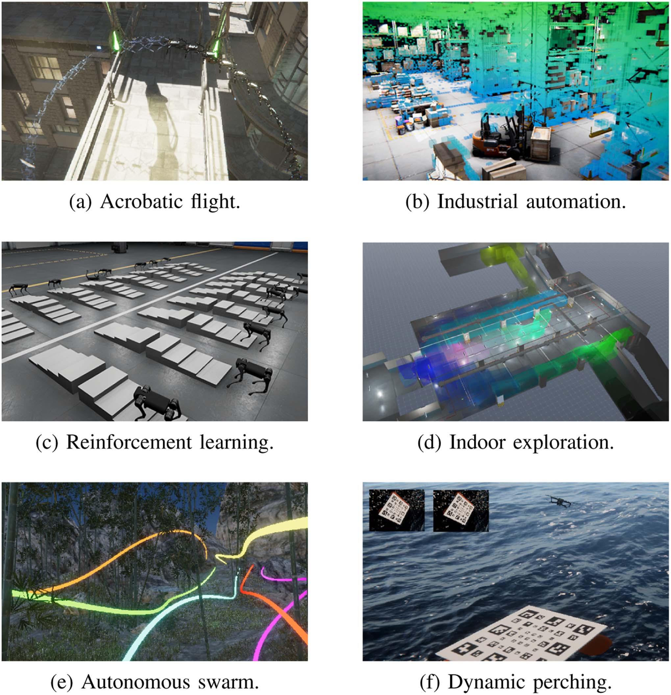
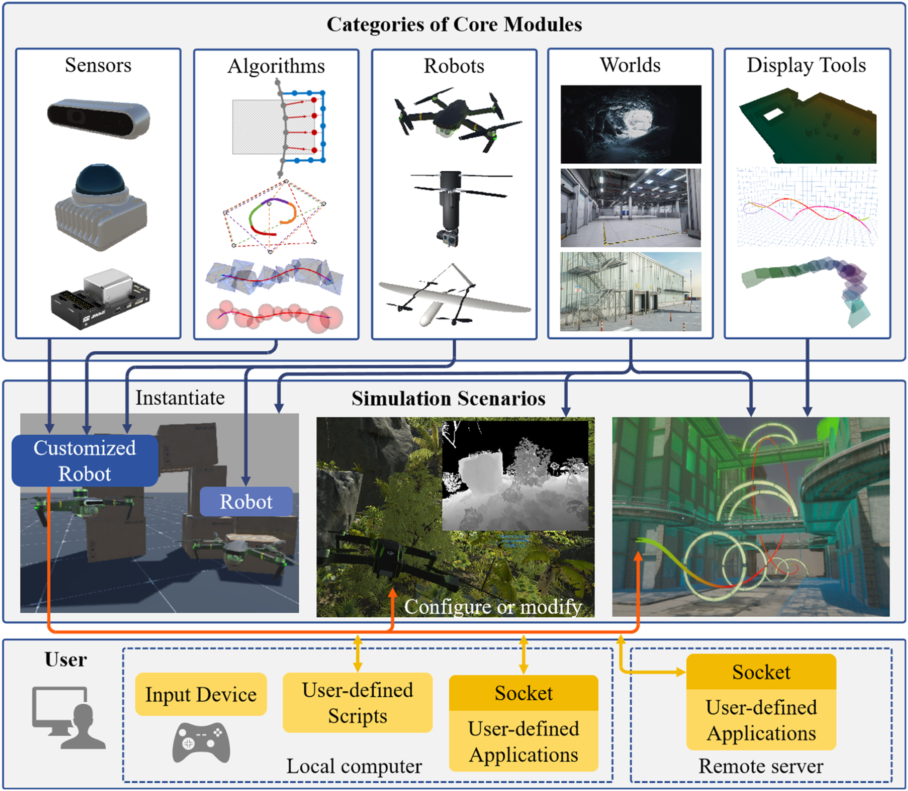
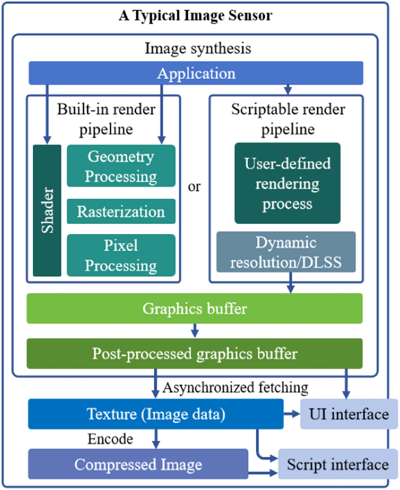
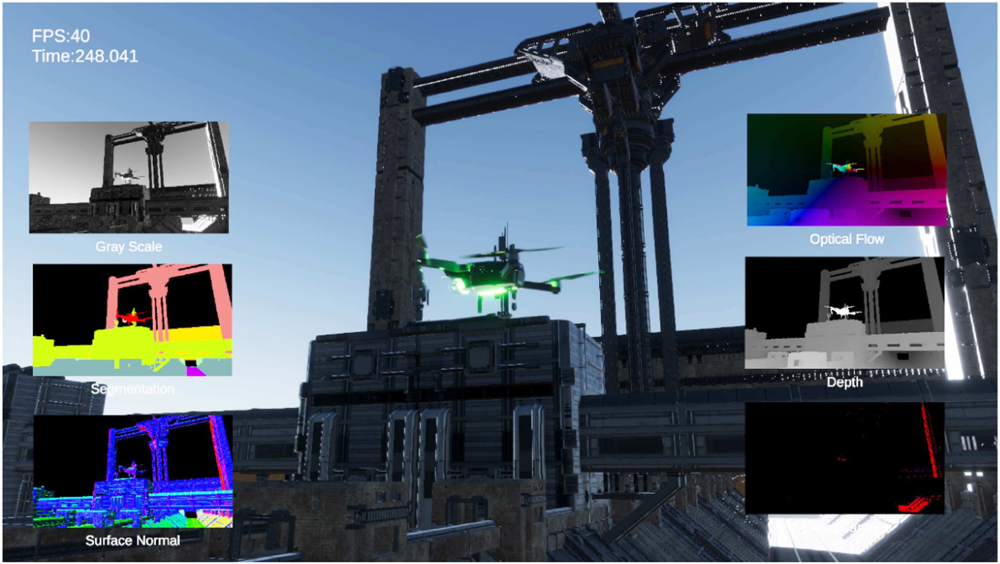
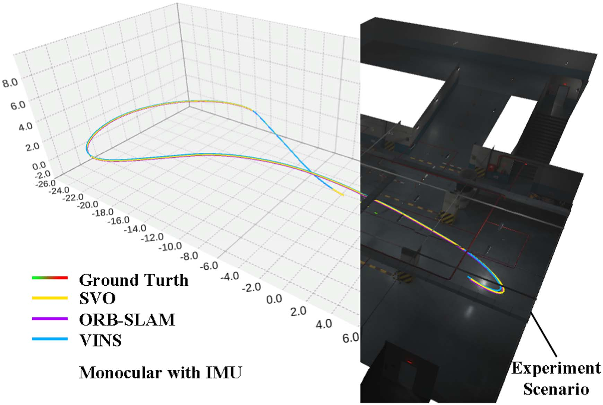
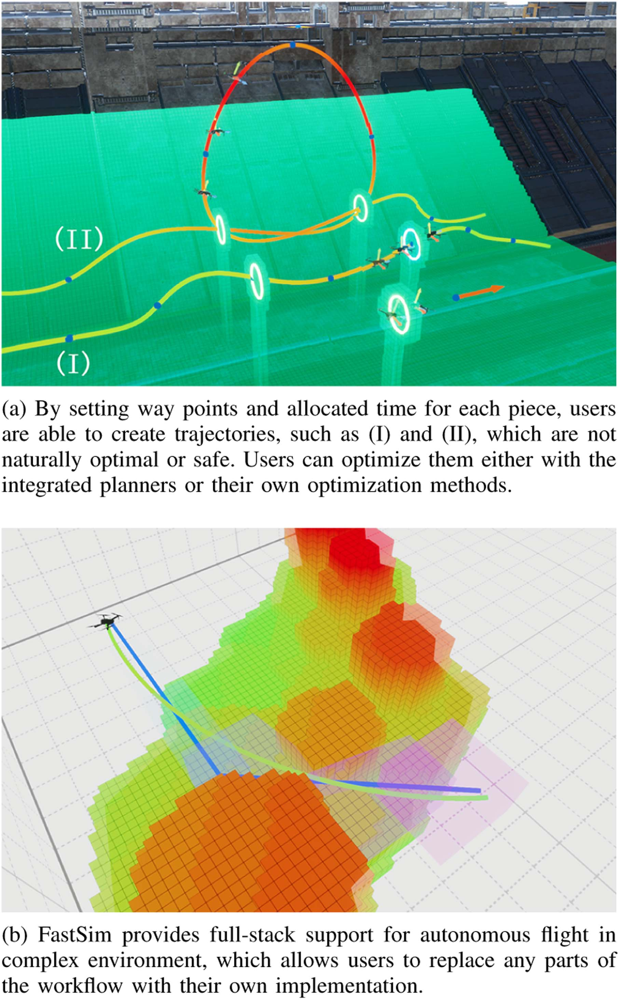
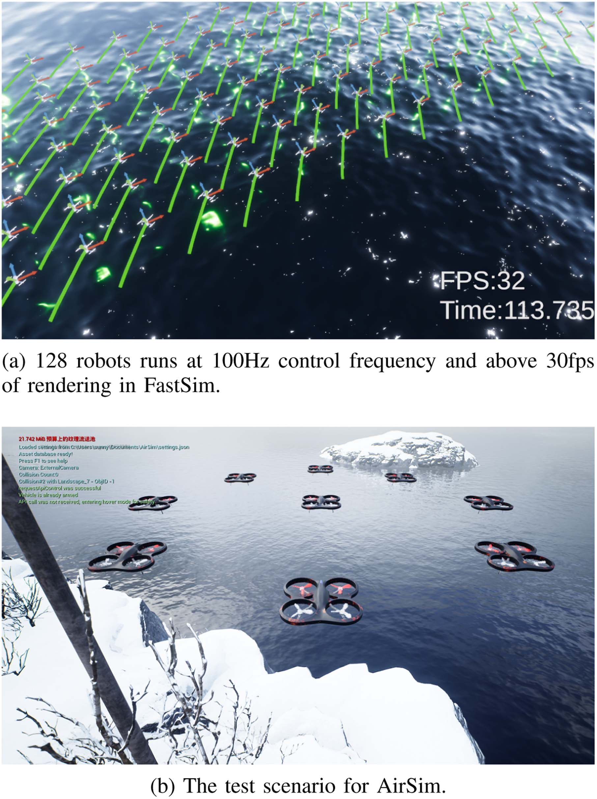

# FastSim 模块化即插即用空中机器人仿真平台：原文忠实中文翻译

> **原文标题**：FastSim A Modular and Plug-and-Play Simulator for Aerial Robots  
> **作者**：Tiankai Yang、Yiming Luo、Zhepei Wang、Chao Xu、Fei Gao 等 (浙江大学)  
> **发表信息**：IEEE Robotics and Automation Letters (RA-L), 2024  
> **原文 PDF**：[FastSim A Modular and Plug-and-Play Simulator for Aerial Robots.pdf](../FastSim A Modular and Plug-and-Play Simulator for Aerial Robots.pdf) ｜ **对应中文详解**：[16_FastSim模块化即插即用空中机器人仿真平台.md](../中文详解/16_FastSim模块化即插即用空中机器人仿真平台.md)  

---

## 原文第 1 页核心内容与翻译

FastSim：一个模块化即插即用的空中机器人仿真平台
Can Cui、Xiaobin Zhou、Miao Wang、Fei Gao（IEEE 会员）和 Chao Xu（IEEE 高级会员）

**摘要**——先进的机器人仿真器配备了成熟的建图、规划和控制系统，但缺少模块化、即插即用的便利性。本文介绍 FastSim，一个基于 Unity 引擎的高保真、用户友好型仿真框架。FastSim 将仿真任务与可定制模块解耦，使用户能够高效构建机器人仿真场景；这些模块包括虚拟传感器、集成实用工具、可视化工具和模板机器人。除高性能机器人动力学仿真和高质量图像渲染外，该框架还支持硬件在环和混合现实应用。FastSim 的主要优点包括：(1) 为偏好 ROS 工具链的研究人员提供兼容 ROS 的控制接口和丰富的可视化工具；(2) 集成先进的规划算法，使用户（包括初学者）能够快速掌握在仿真中部署高度自主机器人的方法。最后，我们通过多项实验以及代码仓库中的开源示例和性能评估，展示 FastSim 的灵活性：https://github.com/ZJU-FAST-Lab/FastSim。

**索引词**——空中系统：应用，仿真与动画，机器人系统设计方法与工具。

# I. 引言
空中机器人仿真器能够以安全和经济高效的方式开发和测试算法，减轻对现实世界实验中耗时和昂贵挑战的担忧 [1]。如今，随着机器人面临越来越复杂的应用场景和任务的挑战，研究人员对更高级的仿真器提出了更高的要求。这种需求对于空中机器人尤为强烈，因为它们的应用通常涉及更多非结构化场景、更频繁的多目标交互以及更多的干扰和不确定性 [2], [3]。因此，迫切需要一个强大、通用、高保真且易于使用的仿真器。

Sim2real 致力于缩小虚拟世界和物理世界之间的差距，将在仿真中获得的知识实际应用于现实世界的场景中 [4]。为了进一步协助研究人员解决问题并提高仿真器的可用性，我们对流行的仿真器进行了一些调查，并采访了活跃的研究人员。我们将高性能仿真器的特征总结如下：
1) 模块化：具有适当解耦模块化结构的仿真器将使用户能够像玩沙盒游戏一样快速掌握仿真环境的构建，从而减少引入系统错误的几率。
2) 高保真：一个优秀的仿真平台应该能够为用户提供准确的物理交互和合格的虚拟传感器数据。
3) 功能丰富：理想的空中机器人仿真器应该包含多种辅助功能，包括感知、运动规划、控制和可视化。
4) 兼容性好：由于许多用户更喜欢经典的开发工具链，良好的跨平台兼容性对于仿真器受欢迎并被用作富有成效的辅助工具是必要的。

然而，在目前社区中常用的仿真器中，很少有仿真器能够同时满足上述所有要求。一些合格的仿真器对专业知识的高要求也阻碍了初学者充分发挥它们的潜力 [5]。
为了解决这个问题，我们开发了 FastSim，这是一个模块化、通用且用户友好的仿真器，特别是基于上述特征，它帮助用户以最少的时间和精力实现他们的仿真目标。我们的主要贡献如下：
1) 一个模块化、即插即用且高保真的仿真器，具有用户友好的接口和集成的模块，如传感器、算法和实用工具，用户可以在其中快速灵活地组成他们的仿真（见图1）和应用。
2) 兼容 ROS 的控制接口和可视化工具，迎合 ROS 用户的需求，从而简化了高度自主机器人在仿真中的部署。
3) 进行广泛的仿真实验以验证我们的仿真器。我们发布我们的代码以便利机器人社区。1

（1 FastSim 的源代码将在此信件处理后发布在 https://github.com/ZJU-FAST-Lab/FastSim。）
（授权许可使用限制：National Institute of Technology- Delhi。于2026年8月24日 05:46:40 UTC从IEEE Xplore下载。适用限制。）

---

## 原文第 2 页核心内容与翻译

**图 1**：使用 FastSim 仿真和可视化的典型机器人应用。

# II. 相关工作
我们对机器人社区中广泛使用的完善的开源仿真器进行了全面回顾，强调了它们对现实世界实验的贡献及其固有的局限性。
## A. 通用机器人仿真器
Gazebo [6] 和 Webots [7] 是两个广泛使用的机器人仿真器。Gazebo 通常与机器人操作系统 (ROS) 结合使用，并提供基于 3D 物理的仿真环境 [8]。它可以支持各种传感器、机器人，甚至多机器人仿真。Webots 可用于各种类型的机器人，包括轮式机器人、无人机，甚至软体机器人，它支持多种编程语言，并提供大量预定义机器人模型的库。这两个仿真器提供了访问多种高性能物理引擎的方法，并仿真从激光测距仪到 RGB 相机的各种传感器。现在，游戏引擎在游戏开发中不可或缺，通过其内置功能（如动画、图形、AI 和物理）简化了过程并促进了各种组件的集成 [9]。特别是，Gazebo 在机器人学中被广泛用于开发自动驾驶车辆的算法，如赛车 [10]、探索 [11] 和轨迹规划 [12]。尽管如此，在 Gazebo 和 Webots 中构建真实世界的驾驶或飞行环境可能会很耗时且需要专业能力，这使得很难用这些仿真器在茂密森林和郊区环境等情况下验证算法 [3], [13], [14]。

## B. 基于 Gazebo 的仿真器
RotorS [15] 和 Hector [16] 是建立在 Gazebo 上的两个机器人仿真包，特别是在无人机领域。RotorS 为四旋翼和其他基于旋翼的飞行器提供了逼真的仿真环境。RotorS 与 ROS 紧密集成，并支持各种传感器，如 IMU、GPS、LiDAR 和相机，这有利于评估导航、定位和感知算法。Hector 通常用于需要精确定图、定位和导航，但缺乏可靠甚至可用的 GPS 信号的场景。特别是，RotorS 和 Hector 已广泛用于无人机算法开发 [17], [18]。然而，RotorS 和 Hector 在支持的机器人的多样性和数量上存在局限性，这剥夺了它们的即插即用功能。

## C. 照片级逼真的仿真器
几个现有的仿真器专为高保真机器人仿真应用而设计，如 FlightGoggles [19]、AirSim [20] 和 CARLA [21]。AirSim 是一个开源的无人机仿真器，提供 12 公里的道路和 20 个城市街区，并支持带有物理飞行控制器的硬件在环仿真。CARLA 是一个开源仿真器，为仿真自动驾驶车辆（包括无人机）的行为提供逼真的 3D 城市环境。上述仿真器基于 Unreal Engine 或 Unity Engine。与基于 Gazebo 的仿真器相比，这些仿真器专长于逼真的图形渲染和多样的环境，在感知和基于视觉的任务中具有巨大优势。尽管如此，使用高质量图形配置运行 FlightGoggles、CARLA 和 AirSim 可能会占用大量资源。这可能需要强大的计算硬件来进行复杂的仿真，这可能会限制它们的应用。

## D. 从仿真到现实
除了以前的仿真器外，还有更多的仿真器被广泛采用，如 FlightMare [22]、QUARC [23] 和 Rflysim [24], [25]。WorldGen 是一个高效的开源框架，能够自动生成无数结构化和非结构化的 3D 逼真场景，包括城市景观、对象集合和对象碎片，并配有丰富的真实标注数据 [26]。Isaac Gym 提供了一个用于在 GPU 上训练策略的高性能学习平台，为复杂的机器人任务实现了快速的训练时间 [27]。机器人仿真器在开发和部署实际应用的机器人算法方面发挥着至关重要的作用。它们有助于算法开发、测试、节约成本、加速开发和确保安全。然而，前述的仿真器往往无法在仿真过程中充分利用软件和硬件的集成。总之，这些仿真器通常难以实现即插即用功能、高保真虚拟传感器数据合成以及对仿真到现实的应用的支持，
（授权使用仅限于 National Institute of Technology-Delhi。于 2026 年 8 月 24 日 05:46:40 UTC 从 IEEE Xplore 下载。适用限制。）

---

## 原文第 3 页核心内容与翻译

（FastSim 作者）：FastSim：模块化即插即用的空中机器人仿真平台
5825
**表 I**
FastSim 与其他开源空中机器人仿真器的比较

**图 2**：FastSim 的框架。通过结合不同模块，可以根据任务需求快速组成定制机器人和仿真环境。
FastSim 的框架。通过结合不同的模块，可以根据任务需要快速组成定制的机器人和仿真环境。

应用，如表 I 概述。受先前研究成果的启发，我们开发了一个灵活的空中机器人仿真器，它无缝集成了这些仿真器的理想特性，同时有效解决了它们固有的局限性。表 I 还揭示了我们的仿真器和其他仿真器之间的主要区别。

# III. 系统概述
## A. 整体框架
FastSim 是一个具有扁平且模块化结构的空中机器人仿真器。为了使用户能够高效地构建定制仿真环境，FastSim 将各种实体和功能封装成带有脚本和插件的预制件 (prefab) 对象，这可以加速仿真工作流并降低学习和定制成本。图 2 说明了 FastSim 的整体框架，它由五类模块组成：机器人、传感器、世界、算法和显示工具。所有模块保持同等关系，并包含各种功能实体。信息通过多线程方法在实体之间交换，以提高仿真器的平滑度和速度。在应用中，用户可以通过灵活地组合这五类模块中的不同实例化实体来快速配置复杂的仿真场景。
机器人：FastSim 提供了广泛的空中机器人模板。模块化框架实现了机器人形态的适应性定制，为用户提供了增强的设计和功能灵活性。在物理引擎方面，FastSim 采用灵活的形式，可以方便用户将机器人动力学从简单的无人机模型切换到更复杂的刚体动力学模型。FastSim 还提供
（授权许可使用限制：National Institute of Technology- Delhi。于2026年8月24日 05:46:40 UTC从IEEE Xplore下载。适用限制。）

---

## 原文第 4 页核心内容与翻译

**图 3**：封装良好的机器人模块结构。
封装良好的机器人模块结构。

**图 4**：典型图像传感器模块的结构。
典型的图像传感器模块结构。

一些跨平台机器人的模板，包括无人车（UGVs）和腿足式机器人（见图 1(c)）。该特性显著增强了仿真器的可扩展性，特别是对于异构集群仿真。图 3 展示了 FastSim 中完全解耦的机器人模块结构。
传感器：传感器配置在仿真器中起着至关重要的作用，它决定了虚拟机器人的感知能力。与其他支持有限种类通用传感器模型的仿真器不同，FastSim 结合了各种具有针对产品模型特定细节的传感器，包括 Realsense D435、Realsense L515、Livox Mid 360 等。以图像传感器为例，如图 4 所示框架，FastSim 中的图像传感器可以仿真逼真的物理效果，包括传感器噪声、运动模糊和镜头污垢。此外，FastSim 允许用户调整图像传感器的内参和外参，这有助于用户在仿真过程中考虑传感器参数对算法性能的影响。特别地，FastSim 还考虑了传感器的尺寸和质量数据，这可以在验证机器人机械结构期间为用户提供相对准确的参考。同样，将传感器封装为实体有助于在仿真过程中为用户提供即插即用功能。
世界：在 FastSim 中，一个世界（World）指的是实验环境，它也被封装为一个预制件模板。为了确保场景的逼真渲染质量，特别是具有全局光照（GI）支持的场景，光照和反射必须正确配置，这需要时间和专业知识。FastSim 提供了一系列成熟的 3D 环境，从城市街道到茂密的森林，用户还可以通过简单的拖放操作高效地构建他们偏好的仿真环境。此外，FastSim 引入了一些特殊的世界，例如图 6 中展示的“Plot3D”。当用户在仿真期间将原始背景切换为“Plot3D”时，他们能够立即得到清晰的结果轨迹图。
算法：算法模块为用户提供各种机器人算法，从感知、运动控制到路径规划等，这些算法可以快速部署并在仿真环境中进行定制。除了成熟算法的稳定实现外，集成模块还在结构层面上进行了重构和优化，从而使用户能够直观地理解和修改这些方法的数据流以及工作流。算法模块还通过使用静态函数和共享库将数据与方法解耦，这允许用户将这些算法的核心功能移植到真实的机器人平台上，而无需解决依赖关系或重新编译。总体而言，算法模块旨在为高级机器人研究提供基本资源以及用于快速基准测试的简化工具，从而使 FastSim 与其他仿真器区分开来。
（授权许可使用限制：National Institute of Technology- Delhi。于2026年8月24日 05:46:40 UTC从IEEE Xplore下载。适用限制。）

---

## 原文第 5 页核心内容与翻译

（FastSim 作者）：FastSim：模块化即插即用的空中机器人仿真平台
5827

**图 5**：在配备 AMD 5900X CPU 和 Nvidia 3070Ti GPU 的平台上进行的性能测试。
在该场景中，两个四旋翼机器人实体以编辑模式运行，其中一个附加了六个相机传感器，分别采集灰度图像、深度图像、光流图像、分割图像和相机事件图像。所有相机的分辨率均设为 1080p，FastSim 达到平均 40 fps 的帧率。

**图 6**：实验 1 中使用模拟传感器进行视觉同步定位与建图（SLAM）的软件在环（SIL）仿真结果。
实验 1 中使用模拟传感器进行视觉同步定位与建图（SLAM）的软件在环（SIL）仿真结果。

显示工具：可视化工具帮助用户直观地识别仿真问题。为了提高仿真器的数据可视化功能，FastSim 结合了额外的显示工具，这些工具促进了点云、轨迹和机器人位姿等数据的可视化。使 FastSim 区别于其他仿真器的是其工具被设计为预制件，允许用户将它们直接拖放到仿真场景中。值得注意的是，FastSim 中的显示工具可以同时连接到多个 ROS 主机，并直接订阅和可视化来自它们的 ROS 消息。此功能使得 FastSim 能够用于大规模机器人集群仿真。

# IV. 应用
本节旨在通过一系列应用展示 FastSim 的功能和性能，这些应用可分为传感器信息合成、运动规划、集群等。
## A. 传感器信息合成
高保真传感器数据是确保仿真器可靠性和准确性的关键因素，它直接影响测试实例的仿真性能与其真实世界实验结果之间的差异。与其他仿真器相比，FastSim 提供了种类更丰富的传感器套件，包括不同的相机、测距仪、LiDAR、GPS、气压计、空速管、惯性测量单元（IMU）和里程计。为了展示 FastSim 中虚拟传感器的性能，图 5 显示了我们的虚拟相机模块合成的图像，这说明了 FastSim 在图形传感器方面的综合仿真能力。
此外，图 7 展示了使用虚拟 LiDAR 捕获的输出信息构建的体素地图，以及从中生成的点云地图。结果也非常相似
（授权使用仅限于 National Institute of Technology-Delhi。于 2026 年 8 月 24 日 05:46:40 UTC 从 IEEE Xplore 下载。适用限制。）

---

## 原文第 6 页核心内容与翻译

**图 8**：FastSim 提供的规划、控制和可视化特色工具。
FastSim 提供的规划、控制和可视化特色工具。

**表 II**
VINS-FUSION 软件在环仿真的性能
这些输出与真实 LiDAR 的输出非常相似。值得注意的是，得益于 FastSim 扁平化、模块化的框架，这些传感器既可以独立使用，也可以安装在机器人或观察者上，这正是 FastSim 的另一项显著特点。
实验 1：基于视觉的定位对实际机器人应用至关重要，这同样是衡量仿真器支持 sim2real 能力的重要指标。在此实验中，我们分别使用由 FastSim、AirSim 和 Gazebo 生成的 IMU 数据和双目灰度图像，运行了 VINS-fusion [30] 和 ORB-SLAM [31] 的软件在环 (SIL) 仿真。表 II 中的结果显示 FastSim 能够

**图 9**：FastSim 和 AirSim 在包含多个机器人实体的仿真场景中的比较。
FastSim 和 AirSim 在多个机器人实体仿真场景中的比较。

生成使 VINS-fusion 正常运行的合格图像，且性能接近真实的现实世界实验，这表明由 FastSim 生成的仿真数据在一定程度上可以用作现实世界实验的替代品。

## B. 运动规划与控制
路径规划和运动控制能力对于无人机执行任务至关重要。然而，在仿真环境中成功部署相关算法仍然需要用户对算法有深刻的理解以及丰富的参数优化经验。为了方便用户在该领域开展研究，FastSim 集成了多种常见的无人机路径规划和运动控制算法，旨在简化仿真过程。图 9 描绘了由集成算法规划的两条轨迹。在 FastSim 中生成这两条轨迹只需进行参数调整，避免了重新编译代码的需要，而这在其他仿真器中通常是必须的。
实验 2：在此实验中，通过四旋翼机器人的飞行控制仿真场景，从环境设置和性能的角度对 FastSim 和 AirSim 进行了比较。表 III 显示 AirSim 和 FastSim 都对飞行控制底层框架有很好的支持。然而，由于 AirSim 主要侧重于端到端的仿真，当用户打算在 AirSim 中实现轨迹跟踪、特技飞行和避障等复杂任务时，他们不得不主要依赖
（授权许可使用限制：National Institute of Technology- Delhi。于2026年8月24日 05:46:40 UTC从IEEE Xplore下载。适用限制。）

---

## 原文第 7 页核心内容与翻译

（FastSim 作者）：FastSim：模块化即插即用的空中机器人仿真平台
5829

**表 III**
FASTSIM 和 AIRSIM 在功能上的比较

**表 IV**
飞行控制的性能比较

自己来完成整个工作流。相比之下，FastSim 强调解决方案的构建过程。FastSim 提供的功能模块帮助用户从工作流和数据流的维度将复杂任务分解为独立的部分，以便用户可以循序渐进地解决它们，或者专注于其研究主要涉及的关键部分。表 IV 展示了 FastSim 和 AirSim 在一些不同情况下的性能。由于延迟渲染管线，多机仿真会给 AirSim 带来很多负担。测试运行在具有 5900X、3070TI GPU 和 32G DDR4 内存的平台上。

## C. 集群
在集群无人机的背景下，与单架无人机相比，定位、建图和规划领域出现了一系列独特的挑战。遗憾的是，现有的仿真器通常缺乏在集群应用中访问三维环境数据的有效接口。这种数据对于非结构化环境中的无人机编队场景不可或缺，例如在茂密的森林中进行编队飞行。为了促进集群无人机研究的进步，FastSim 提供了一个接口，允许以网格地图的形式导出全面的 3D 环境数据，并可灵活配置所需的分辨率。在图 1(e) 中，我们展示了一个在野生森林环境中生成的编队飞行说明性示例，其中 10 架无人机以三角形队列形式导航。这项实验证明了我们仿真器的完全自主集群导航能力，使无人机能够在密集的野外区域无缝运行，而不会对它们自身或自然环境构成威胁。

## D. 机器学习
得益于其模块化设计，FastSim 高度兼容基于学习的方法，特别是强化学习应用。通过利用机器人模块中的预制件模板，用户可以快速创建自己的可操纵人工智能（AI）智能体；通过配置传感器模块中的虚拟传感器，用户能够获得与物理传感器参数规格非常相似的传感器数据。然后，用户可以使用 FastSim 提供的简单脚本和 Python 接口设计代价并控制训练过程，如图 1(c) 所示。或者，用户也可以选择使用 Unity 原生强化学习框架 ML-Agents
（授权许可使用限制：National Institute of Technology- Delhi。于2026年8月24日 05:46:40 UTC从IEEE Xplore下载。适用限制。）

---

## 原文第 8 页核心内容与翻译

来训练他们的模型，因为它与 FastSim 天然兼容。

# V. 结论
最先进的无人机仿真器具有成熟的建图、规划和控制系统，但在模块化和即插即用性能方面有所欠缺。为了应对这些挑战，我们展示了 FastSim，一个基于 Unity 引擎的先进且通用的空中机器人仿真框架。FastSim 模块化且用户友好的设计使研究人员能够高效地创建定制的机器人仿真场景。FastSim 的两个突出特点是它兼容 ROS 的控制接口和可视化工具，满足 ROS 用户的需求，以及它集成了最先进的规划算法，简化了高度自主机器人在仿真中的部署。通过一系列实验和性能评估，我们展示了 FastSim 的灵活性以及加速研究工作的能力。研究人员可以利用 FastSim 的特性来推进他们的工作。FastSim 的某些特性仍有待改进，未来将补充更多功能。
## 参考文献
[1] E. Potokar, S. Ashford, M. Kaess, and J. G. Mangelson, “Holoocean: An
underwater robotics simulator,” in Proc. Int. Conf. Robot. Automat., 2022,
pp. 3040–3046.
[2] R. Penicka, Y. Song, E. Kaufmann, and D. Scaramuzza, “Learning
minimum-time flight in cluttered environments,” IEEE Robot. Automat.
Lett., vol. 7, no. 3, pp. 7209–7216, Jul. 2022.
[3] L. Quan et al., “Robust and efficient trajectory planning for formation flight
in dense environments,” IEEE Trans. Robot., vol. 39, no. 6, pp. 4785–4804,
Dec. 2023.
[4] S. Höfer et al., “Sim2Real in robotics and automation: Applications and
challenges,” IEEE Trans. Automat. Sci. Eng., vol. 18, no. 2, pp. 398–400,
Apr. 2021.
[5] A. I. Hentati, L. C. Fourati, E. Elgharbi, and S. Tayeb, “Simulation tools,
environments and frameworks for UAVs and multi-UAV-based systems
performance analysis (version 2.0),” Int. J. Modelling Simul., vol. 43, no. 4,
pp. 474–490, 2023.
[6] N. Koenig and A. Howard, “Design and use paradigms for Gazebo, an
open-source multi-robot simulator,” in Proc. IEEE/RSJ Int. Conf. Intell.
Robots Syst., 2004, pp. 2149–2154.
[7] O. Michel, “Webots: Symbiosis between virtual and real mobile robots,”
in Proc. Virtual Worlds: 1st Int. Conf., Paris, France: Springer, Jul. 1998,
pp. 254–263.
[8] M. Quigley et al., “ROS: An open-source robot operating system,” in Proc.
ICRA Workshop Open Source Softw., vol. 3, no. 3.2, 2009.
[9] C. Vohera, H. Chheda, D. Chouhan, A. Desai, and V. Jain, “Game engine
architecture and comparative study of different game engines,” in Proc.
12th Int. Conf. Comput. Commun. Netw. Technol., 2021, pp. 1–6.
[10] V. S. Babu and M. Behl, “f1tenth. dev-an open-source ROS based F1/10
autonomous racing simulator,” in Proc. IEEE 16th Int. Conf. Automat. Sci.
Eng., 2020, pp. 1614–1620.
[11] A. T. Azar, M. Z. Sardar, S. Ahmed, A. E. Hassanien, and N. A. Kamal,
“Autonomous robot navigation and exploration using deep reinforcement
learning with Gazebo and ROS,” in Proc. 9th Int. Conf. Adv. Intell. Syst.
Informat., 2023, pp. 287–299.
[12] M. Zhang et al., “A high fidelity simulator for a quadrotor UAV using ROS
and Gazebo,” in Proc.-41st Annu. Conf. IEEE Ind. Electron. Soc., 2015,
pp. 002846–002851.
[13] X. Zhou et al., “Swarm of micro flying robots in the wild,” Sci. Robot.,
vol. 7, no. 66, 2022, Art. no. eabm5954.
[14] X. Zhou, J. Zhu, H. Zhou, C. Xu, and F. Gao, “Ego-swarm: A
fully autonomous and decentralized quadrotor swarm system in clut-
tered environments,” in Proc. IEEE Int. Conf. Robot. Automat., 2021,
pp. 4101–4107.
[15] F. Furrer, M. Burri, M. Achtelik, and R. Siegwart, “RotorS–A modular
Gazebo MAV simulator framework,” in Robot Operating System (ROS)
The Complete Reference (Volume 1). Berlin, Germany: Springer, 2016,
pp. 595–625.
[16] S. Kohlbrecher, J. Meyer, T. Graber, K. Petersen, U. Klingauf, and O. Von
Stryk, “Hector open source modules for autonomous mapping and navi-
gation with rescue robots,” in Robot Soccer World Cup, Berlin, Germany,
Springer, 2013, pp. 624–631.
[17] Y. W. Wu, Z. M. Ding, C. Xu, and F. Gao, “External forces resilient safe
motion planning for quadrotor,” IEEE Robot. Automat. Lett., vol. 6, no. 4,
pp. 8506–8513, Oct. 2021.
[18] P. D. H. Nguyen, C. T. Recchiuto, and A. Sgorbissa, “Real-time path
generation and obstacle avoidance for multirotors: A novel approach,” J.
Intell. Robotic Syst., vol. 89, pp. 27–49, 2018.
[19] W. Guerra, E. Tal, V. Murali, G. Ryou, and S. Karaman, “Flightgog-
gles: Photorealistic sensor simulation for perception-driven robotics using
photogrammetry and virtual reality,” in Proc. IEEE/RSJ Int. Conf. Intell.
Robots Syst., 2019, pp. 6941–6948.
[20] S. Shah, D. Dey, C. Lovett, and A. Kapoor, “Airsim: High-fidelity visual
and physical simulation for autonomous vehicles,” in Proc. Field Serv.
Robot.: Results 11th Int. Conf., 2018, pp. 621–635.
[21] A. Dosovitskiy, G. Ros, F. Codevilla, A. Lopez, and V. Koltun, “CARLA:
An open urban driving simulator,” in Proc. 1st Annu. Conf. Robot Learn.,
2017, pp. 1–16.
[22] D. Huynh et al., “Implementation of a HITL-enabled high autonomy
drone architecture on a photo-realistic simulator,” in Proc. 11th Int. Conf.
Control, Automat. Inf. Sci., 2022, pp. 430–435.
[23] X. Yu, X. B. Zhou, K. X. Guo, J. D. Jia, L. Guo, and Y. M. Zhang, “Safety
flight control for a quadrotor UAV using differential flatness and dual-loop
observers,” IEEE Trans. Ind. Electron., vol. 69, no. 12, pp. 13326–13336,
Dec. 2022.
[24] X. Dai, C. Ke, Q. Quan, and K.-Y. Cai, “RFlysim: Automatic test
platform for UAV autopilot systems with FPGA-based hardware-
in-the-loop
simulations,”
Aerosp.
Sci.
Technol.,
vol.
114,
2021,
Art. no. 106727.
[25] X. Cui, X. Zhang, and Z. Zhao, “Real-time safety decision-making method
for multirotor flight strategies based on TOPSIS model,” Appl. Sci., vol. 12,
no. 13, 2022, Art. no. 6696.
[26] C. D. Singh, R. Kumari, C. Fermüller, N. J. Sanket, and Y. Aloimonos,
“WorldGen: A large scale generative simulator,” in Proc. IEEE Int. Conf.
Robot. Automat., 2023, pp. 9147–9154.
[27] V. Makoviychuk et al., “Isaac Gym: High performance GPU-based physics
simulation for robot learning,” in Proc. Neural Inf. Process. Syst. Track
Datasets Benchmarks 1 (Round 2), 2021.
[28] Z. Wang, X. Zhou, C. Xu, and F. Gao, “Geometrically constrained trajec-
tory optimization for multicopters,” IEEE Trans. Robot., vol. 38, no. 5,
pp. 3259–3278, Oct. 2022.
[29] C. Vohera, H. Chheda, D. Chouhan, A. Desai, and V. Jain, “Game engine
architecture and comparative study of different game engines,” in Proc.
12th Int. Conf. Comput. Commun. Netw. Technol., 2021, pp. 1–6.
[30] T. Qin and S. Shen, “Online temporal calibration for monocular visual-
inertial systems,” in Proc. IEEE/RSJ Int. Conf. Intell. Robots Syst., 2018,
pp. 3662–3669.
[31] C. Campos, R. Elvira, J. J. G. Rodríguez, J. M. M. Montiel, and J.
D. Tardós, “ORB-SLAM3: An accurate open-source library for visual,
visual–inertial, and multimap SLAM,” IEEE Trans. Robot., vol. 37, no. 6,
pp. 1874–1890, Dec. 2021.
（授权使用仅限于 National Institute of Technology-Delhi。于 2026 年 8 月 24 日 05:46:40 UTC 从 IEEE Xplore 下载。适用限制。）

---
