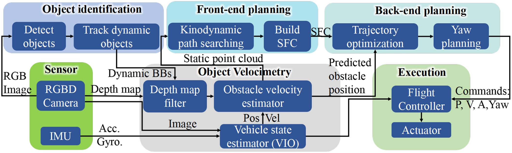
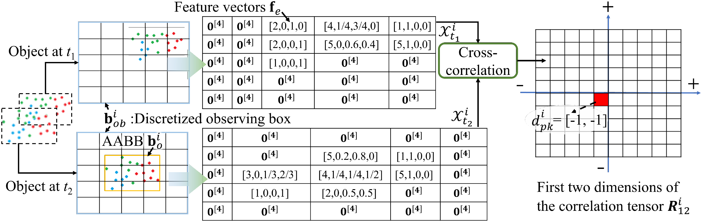
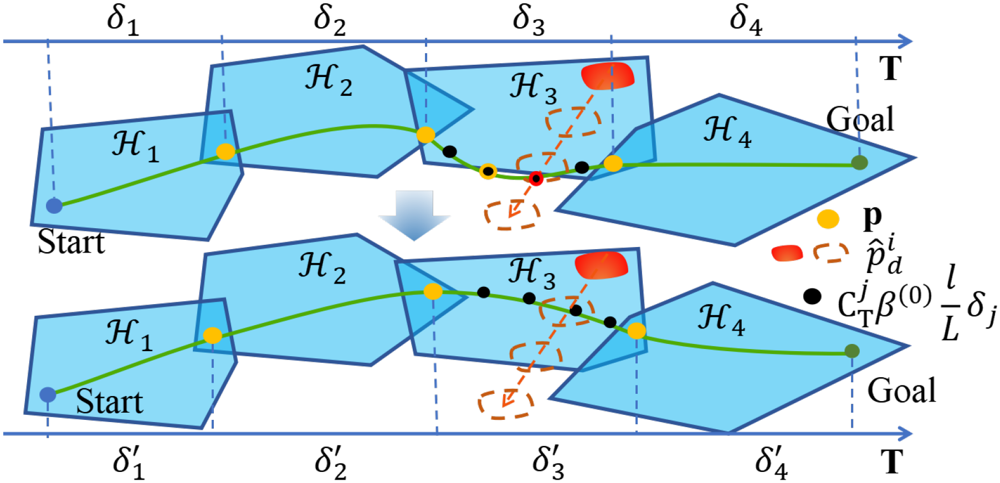
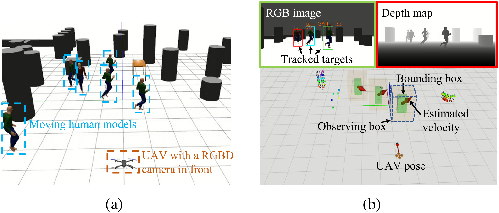
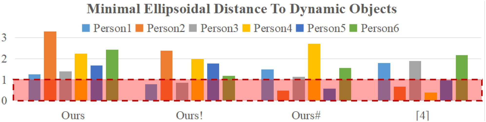
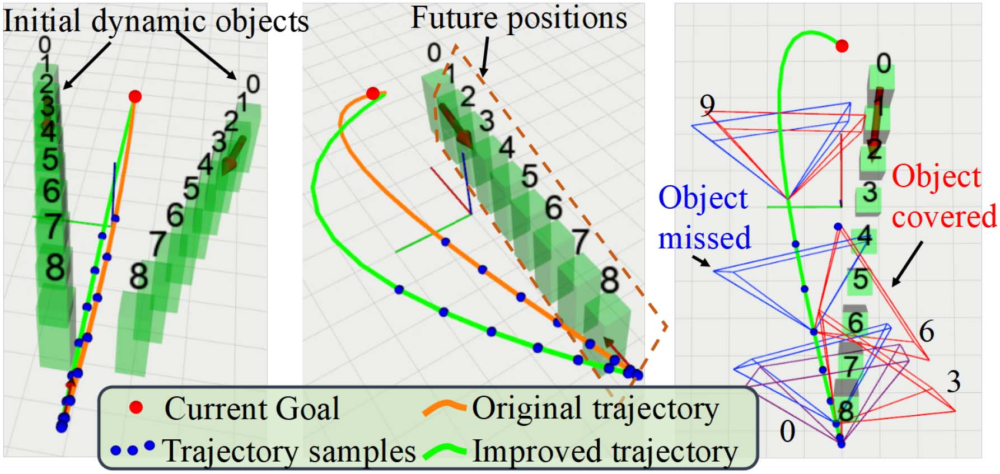
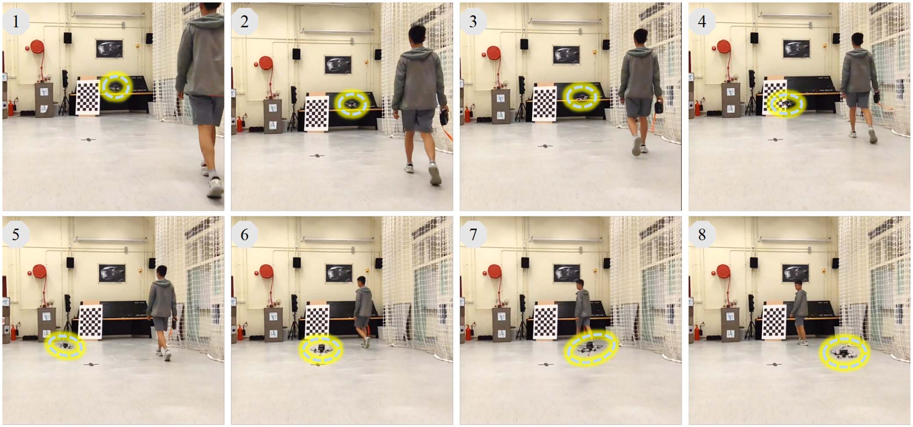
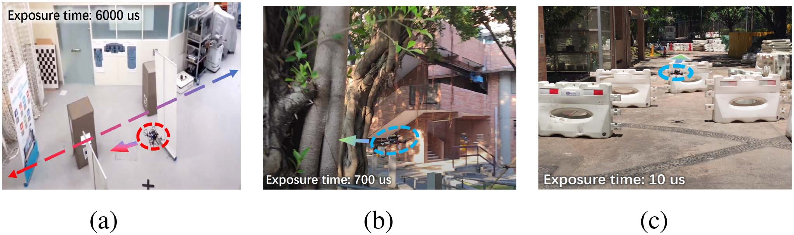

# 动态场景多目标测速与感知增强规划飞行（Flying in Dynamic Scenes With Multitarget Velocimetry and Perception-Enhanced Planning）：完整忠实学术翻译

> **原文标题**：Flying in Dynamic Scenes With Multitarget Velocimetry and Perception-Enhanced Planning  
> **作者**：> - 作者：Han Chen、Chih-Yung Wen、Fei Gao、Peng Lu  
> **发表信息**：> - 期刊：*IEEE/ASME Transactions on Mechatronics*，第 29 卷第 1 期，2024 年 2 月；在线发表时间为 2023 年 7 月  
> **原文 PDF**：[Flying in Dynamic Scenes With Multitarget Velocimetry and Perception-Enhanced Planning.pdf](../Flying in Dynamic Scenes With Multitarget Velocimetry and Perception-Enhanced Planning.pdf) ｜ **对应中文详解**：[17_动态场景多目标测速与感知增强规划飞行.md](../中文详解/17_动态场景多目标测速与感知增强规划飞行.md)  

---

## 原文第 1 页核心内容与翻译

**动态场景中的多目标测速与感知增强规划飞行**
**摘要**——微型无人机已广泛应用于航拍和环境探索等领域。由于存在拥挤障碍物和动态目标等诸多具有挑战性的场景，远程操控无人机对人类而言是一项重大挑战。因此，迫切需要高度自主的飞行能力。本文提出了一套能够在复杂动态环境中完全自主飞行的系统；该系统在真实世界测试中表现良好，并且在动态目标感知、飞行安全性和效率方面均优于现有最先进方法。本文提出一种基于互相关算法和局部点特征的轻量而有效的多目标测速方法，并以鲁棒的基于图像的目标分类器作为前端。同时，规划飞行轨迹时考虑相机视场以及动态目标恒速度模型中的不确定性。最后，进一步探索飞行器主动偏航控制在提升感知质量和飞行安全性方面的收益。
**索引词**——自主导航，动态障碍物，目标跟踪，点云。

## I. 引言
近年来，微型无人机已广泛应用于航拍，一些广为人知的商用航拍无人机产品包括 DJI Mavic 2 和 3DR Solo Drone。安全应当是首要考虑因素，但对于一些缺乏经验的用户而言，在复杂环境中飞行无人机颇具挑战且危险，例如在有人员聚集的狭窄室内场景中。因此，为了更好地保证安全，无人机在遇到紧急情况时应能够自动避障。此外，自主航空摄影（AAC）也是最新航拍无人机产品中的热门功能。一些消费者可能希望无人机在运动或驾车时跟随自己并拍摄视频。在执行航拍任务时，无人机可能需要在包含许多动态障碍物（如行人）的复杂环境中低空飞行。因此，迫切需要鲁棒的自主避障能力。

经过近年来持续的研究，在未知静态环境中实现鲁棒、敏捷的飞行已不再是关键挑战。然而，在复杂动态环境中进行自主导航仍被认为是当今机器人学面临的重大挑战之一 [1]。为了平稳避开动态障碍物，需要提前检测动态障碍物并预测其轨迹。本文仅考虑搭载单个 RGBD 相机作为环境传感器，因为与 lidar 相比，它在价格和重量方面更适合微型商用无人机产品，且已有许多工作证明单个 RGBD 相机足以应对大多数场景 [2]–[4]。尽管此前已有研究为微型无人机（UAV）提出了动态环境导航系统，但其中嵌入的动态目标感知方法并不适用于复杂动态场景，因为为避免沉重的计算负担，系统只使用深度信息 [4]、[5]。在这种条件下，动态目标与静态目标的分类只能依据目标的估计速度，而该速度容易受到深度图噪声和无人机状态估计不准确的影响。为解决这一问题，我们提出一种基于 RGB 图像的目标分类框架，能够输出鲁棒且连续的动态目标识别结果，并且计算开销低，可在微型机载计算机上实时运行。基于点云的目标速度估计模块接收目标分类结果，仅输出动态目标而非所有目标的速度，从而降低计算成本。

在轨迹规划方面，我们采用由前端运动学-动力学路径规划器和后端轨迹优化器组成的两阶段分层框架。尽管已有工作使用恒速度模型预测障碍物未来轨迹，但应注意该模型并不准确。此外，我们注意到目标跟踪持续时间较短是障碍物速度估计误差的主要原因，并探索主动偏航控制技术，以补偿单个相机视场（FOV）有限的问题。

总而言之，本文的主要贡献包括以下四个方面：

## 原文第 2 页核心内容与翻译

1. 提出一种基于点云序列的新型动态目标测速方法，克服了自遮挡问题 [5]，并具有更高精度。
2. 提出一种轨迹优化方法，在避开静态和动态障碍物并遵守飞行器运动学-动力学约束的同时，考虑动态目标速度估计之外的不确定性。
3. 提出偏航角规划算法，提升目标跟踪质量并改善飞行安全性。
4. 将所提算法集成到完整的航空系统中，并在仿真和实地测试中进行广泛测试，证明方法的可行性和实用性。

最后，我们完整公开航空平台的代码和硬件方案，供研究群体参考。¹

## II. 相关工作
### A. 动态环境感知
针对基于点云数据从环境中识别和跟踪运动障碍物，一些研究者为自动驾驶汽车开发了相关算法 [6]。然而，这些方法都依赖 lidar 提供的高质量点云和强大的图形处理器（GPU），并且只能从预定义类别中检测障碍物。通过点簇的全局特征匹配和跟踪目标，是增强动态目标检测通用性的一种实用思路 [7]。对于深度相机的点云，现有研究仍然较少。一种方法依据空间相似性匹配障碍物，并依赖 Kalman 滤波器（KF）预测动态障碍物从过去到当前的位置 [4]。但当某一障碍物的预测位置接近其他障碍物时，该方法可能失效；仅依据估计目标速度进行动态目标识别也不够鲁棒。使用基于图像的目标检测器检测运动障碍物是一种鲁棒方案 [8]，但早期多数基于学习的检测器计算代价高。令人鼓舞的是，面向边缘计算设备的实时检测器近年来受到更多关注，并取得了很大进展 [9]。事件相机能够区分静态目标和动态目标，使无人机在很短时间内避开动态目标 [10]。然而，事件相机对于低成本 UAV 而言过于昂贵，且稀疏事件会给静态障碍物避障带来危险。一些研究者使用相机原始图像，在测量深度前标记对应像素。[11] 使用基于块的运动估计方法识别运动障碍物，但背景复杂时效果较差。[12] 提出一种多用途方法，联合估计相机位姿、立体深度以及目标检测结果，并跟踪目标轨迹。基于特征的视觉系统依赖密集特征点检测动态目标 [13]，并不实用。[14] 提出了一种与本文相似的动态障碍物感知方法。然而，其采用的检测式跟踪方法对于微型机载计算机而言仍然计算开销过大，而且 Intersection over Union（IoU）匹配指标不适合密集场景。本文框架采用最轻量、同时具备目标检测和跟踪能力的算法来保证实时性，并将二者组合成高效的多目标检测与跟踪框架。

### B. 轨迹规划
多项已发表的自主 UAV 导航系统工作已在密集静态环境中展示了敏捷、可靠的飞行，并能够实时求解运动原语 [2]、[3]。对于导航任务中的运动障碍物避障，大多数研究工作基于地面车辆应用。禁行速度图 [15] 用于求解所有禁行的二维速度向量，并在图中表示为两个独立区域。人工势场方法通过考虑运动方向来避开运动障碍物 [16]、[17]。马尔可夫决策过程能够处理动态环境中的规划问题 [18]。近期已有研究提出面向拥挤动态环境中 UAV 导航的全局规划器 [19]、[20]。然而，这些方法假定已知所有障碍物状态，并不适合完全自主的航空平台。Wang 等人 [4] 首先利用 A* 算法寻找可行的初始轨迹，再使用参数化 B-spline 通过梯度优化轨迹。但该方法不优化飞行时间，也不考虑恒速度模型的不准确性，而本文方法会考虑这些因素。单个深度相机的狭窄 FOV 是自主视觉导航系统感知环境的障碍。为节约成本、减轻重量并降低机载计算机的计算负担，大多数研究者选择仅在无人机机架上固定一个相机作为环境传感器 [2]、[3]。弥补这一缺陷的一种合理方案是在规划偏航角的同时调整飞行器轨迹，使其在飞行过程中扫描更多未知空间 [21]。不过，该方法针对的是静态环境。安装在云台上的相机能够显著扩大狭窄 FOV [8]，从而提高飞行安全性；但这需要额外的硬件并增加机械复杂性。在 PANTHER [22] 中，作者将偏航角与三维轨迹一同优化，在图像中实现了良好的目标稳定性；然而，优化中只考虑了一个目标。本文提出一种不同的方法，根据精心设计的评分算法规划偏航角，并考虑多个目标的可见性。

## III. 动态目标感知
在动态环境中自主飞行时，动态目标感知结果对避障性能起着至关重要的作用。由于基于估计目标速度的分类会受到深度噪声的严重干扰，我们利用鲁棒的基于 RGB 图像的目标检测算法提供可靠类别。随后利用深度图输入估计动态目标速度，并通过 KFs 进一步优化速度。所提自主飞行框架的结构如图 1 所示。带有简要说明的黑色箭头表示信息流。



**图 1**：整个导航系统的流程图。

### A. 图像中的目标检测与跟踪
在 AAC 无人机的常见使用场景中，行人或汽车等动态目标也常见于日常生活。因此，可以借助通用目标检测器依据先验知识区分动态目标。我们列出若干潜在的动态目标类型；当图像中检测到的目标与列表匹配时，即判定发现动态目标，并将其对应的边界框（BB）传递给目标跟踪器。

目标跟踪器由目标检测器提供的 BB 初始化。由于目标跟踪框架面向多目标设计，对于 I 个动态目标，我们初始化 I∈N 个跟踪器 Timg={T0,…,TI}。Bimg={b0,…,bI} 是所有被跟踪目标 BB 的列表。考虑到目标跟踪器在短时遮挡后的迭代跟踪过程中可能失败，我们设计了跟踪失败恢复机制。当跟踪器无法利用最新图像更新时，目标检测器会再次运行一次，以重新获取所有可能的动态目标。随后，利用 IoU 将新检测到的目标与当前跟踪目标关联，以判断哪些目标是新出现的。新出现的目标用于初始化相应跟踪器并更新 Timg、Bimg 和 I；与此前跟踪目标（包括失败目标）匹配的检测目标则用于更新相应跟踪器的感兴趣区域。对于 Timg 中的每个跟踪器，在初始化时分配一个从 0 开始递增的唯一序列 ID，同时继承目标检测器给出的目标类型标签。基于图像的目标检测与跟踪框架见算法 1。liou 是判断检测目标对于已有目标是否为新目标的 IoU 阈值。

本文采用 YOLO 目标检测器系列的轻量化版本 YOLO-fastest-V2 [9]，因为其计算效率有显著提升。准确率略有牺牲，但在 CPU 上运行时，相比 YOLO4-tiny 运行时间缩短约 80%–90%，非常适合没有 GPU 的微型机载计算机。目标跟踪算法采用快速判别式尺度空间跟踪算法 [23]；与原始 kernelized correlation filters 方法 [24] 相比，该算法能够调整 BB 尺度，并且在本文机载计算机上的运行时间也很短。由于检测器运行时间远长于跟踪器，我们仅在任一跟踪器失败时调用检测器，并利用跟踪器填补检测器两次运行之间的“间隔”，输出连续跟踪结果，而不是采用“检测式跟踪”方法。跟踪器由新检测目标初始化后存储在容器中；每当输入新的 RGB 帧时，各跟踪器都会更新目标 BB 和置信度指标。如果置信度（目标相关矩阵的峰值）低于阈值，则认为跟踪器失败并将其从容器中删除。该框架（见算法 1）及其轻量多目标检测与跟踪模块的开源代码是本文贡献之一；在 848×480 RGB 图像分辨率下，双核四线程 2.9 GHz CPU 所需 CPU 资源仅为 5%–10%。

**算法 1：目标检测与跟踪。**

```text
输入：原始 RGB 图像 F
若为首次运行：
    用 F 检测动态目标，初始化 I 个跟踪器 Timg 和 BB 集合 Bimg
否则：
    用 F 更新 Timg 和 Bimg
    若 Timg 中有任一跟踪器失败：
        从 Timg 和 Bimg 中删除失败目标
        检测最新动态目标 -> B_hat_img
        对 B_hat_img 中的每个 b_hat_i：
            计算 b_hat_i 与 b_mc∈Bimg 的最大 IoU -> m_iou
            若 m_iou < l_iou：初始化新跟踪器并将 b_hat_i 加入 Timg、Bimg
            否则：用 b_hat_i 更新 b_mc 的跟踪器
输出：Bimg、序列号和目标类型
```

### B. 目标速度估计
借助深度信息可以估计目标速度。RGBD 相机能够提供与 RGB 图像对齐的深度图。深度图中每个像素的值对应真实深度乘以一个尺度因子。利用相机内参和深度图中的二维坐标，可以计算目标在相机坐标系中的三维位置。

用 Ft1 和 Ft2 分别表示前一时间戳 t1 和最新时间戳 t2 的两帧深度图。令 t2−t1=dt 且 dt>0。传感器运行时，Ft1 和 Ft2 持续更新。为充分利用目标分类结果并降低计算量，首先依据目标 BB 将深度图分割为不同动态目标和静态背景，再将其转换到 Earth 坐标系中的点云。因而不再需要对整个点云进行聚类 [4]、[5]，该过程耗时较大。Cd_t1={C0_t1,…,CI−1_t1} 和 Cd_t2={C0_t2,…,CI_t2} 分别表示 t1 和 t2 时刻动态目标的点簇。Cd_t1 按目标序列号与 Cd_t2 对齐；若 t1 帧中不存在与 Ci_t2 对应的目标，则在 Cd_t1 的第 i 个位置置为空点簇。对于每个点簇 Ci_t2，构造其三维轴对齐包围盒（AABB）bi_o，其原点为 oi_B∈R3，尺寸为 [li_x,li_y,li_z]。随后在 bi_o 外构造更宽的观测框 bi_ob，其原点 oi=oi_B−ldp，尺寸 li=[li_x,li_y,li_z]+2ldp。ldp∈R+3 是观测框的膨胀尺寸，与 dt 内目标可能达到的最大位移有关。

## 原文第 4 页核心内容与翻译



**图 2**：位移估计方法示意图。两个张量中显示的特征向量对应于落入离散观测框 bi_ob 各单元的点，并对应式（1）。红色网格是互相关张量中的峰值，其索引表示目标位移。在此例中，目标从 t1 到 t2 的位移为 [−1,−1]lv。

这里的观测框与原始粒子图像测速（PIV）方法中的“窗口”概念相似 [25]。我们平移 Ci_t2 的坐标并将其原点改为 oi，对 Ci_t1 进行同样处理。为使用 Ci_t2 和 Ci_t1 执行互相关算法并计算目标位移，需要将点簇转换到大小相同的离散空间。给定体素尺寸 lv，Ci_t1 或 Ci_t2 中任意点 p 的离散坐标计算为 floor((p−oi)/lv)。

本文方法与原始 PIV 方法最重要的区别在于：原始 PIV 用于估计物理存在的粒子速度，而点云中的点并不对应物理粒子。点由深度图生成，特定像素的深度值经过后处理（可能来自插值算法）。由于光照变化，深度图计算出的三维点深度在连续帧之间可能略有不同。因此，为使位移估计对深度噪声不那么敏感，我们将三维离散空间扩展为四维，用特征向量 fe∈RN 替换原始二值状态（0 表示该像素无粒子，1 表示有粒子）。N 是落入同一体素的点的局部特征数量。每个体素的特征向量对点云中的噪声和误差更鲁棒，仿真测试也证明了这一点。令 Cvx 表示离散空间 Bi_ob 中任意体素内的点，则特征向量定义如下：

$$fe(Cvx)=[len(Cvx),MC(Cvx)]\tag{1}$$

其中，len() 为输入点簇的大小，MC()∈R3 返回输入点各 RGB 值（归一化到 1）的均值，向量维度 N=4。用 Xi_t2 和 Xi_t1∈R[Ni_x×Ni_y×Ni_z×N] 分别表示与点簇 Ci_t2 和 Ci_t1 对应的三维离散空间中的全部特征向量。第 i 个目标的位移可通过互相关算法估计：

$$F^i_{t1}(\omega_x,\omega_y,\omega_z,\omega_f)=\frac{1}{2\pi}\iiiint X^i_{t1}e^{j(\omega_xx+\omega_yy+\omega_zz+\omega_ff)}d\omega^4$$
$$F^i_{t2}(\omega_x,\omega_y,\omega_z,\omega_f)=\frac{1}{2\pi}\iiiint X^i_{t2}e^{j(\omega_xx+\omega_yy+\omega_zz+\omega_ff)}d\omega^4$$
$$R^i_{12}(x,y,z,f)=\frac{1}{2\pi}\iiiint F^{i*}_{t1}F^i_{t2}e^{-j(\omega_xx+\omega_yy+\omega_zz+\omega_ff)}d\omega^4\tag{2}$$

其中，Fi_t1 和 Fi_t2∈C[Ni_x×Ni_y×Ni_z×N] 分别是 Xi_t1 和 Xi_t2 经快速 Fourier 变换得到的复张量。dω4 是 dωx dωy dωz dωf 的简写。Fi*_t1 是 Fi_t1 的共轭。Ri_12∈R[Ni_x×Ni_y×Ni_z] 是互相关函数，它计算 Fi*_t1Fi_t2 的逆快速 Fourier 变换；其峰值索引 di_pk 就是第 i 个目标以体素尺寸 lv 为单位的估计位移。图 2 用简单二维情况说明位移估计过程，而本文方法用于三维情况。随后可得速度 vi_t2=di_pklv/dt。该方法充分利用两个点簇的详细信息，包括目标三维形状和局部特征。相反，如 [5] 所述，自遮挡问题源于仅使用点簇中心进行估计，而点簇中心与目标质心之间的差异会发生变化。本文方法通过每个单元中的局部特征寻找能够最佳匹配两个点簇的位移，因此受目标自遮挡影响显著更小。

最后，我们根据序列号使用 KFs 跟踪每个动态目标，并输出每个目标的最优状态估计。状态转移方程采用恒速度模型。当没有最新观测值可用于更新 KF 时，KF 会在短时间内输出预测值，从而处理图像中某个目标因短时遮挡而跟踪中断的情况。如果图像跟踪能够在短时间内恢复，则可继续更新相应 KF。受篇幅限制，本文仅给出状态转移方程，省略 KF 细节：

$$\hat{x}^{i-}_{t}=F^i_t\hat{x}^{i}_{t-1},\quad x^i_t=\begin{bmatrix}p^i_{t2}\\v^i_{t2}\end{bmatrix},\quad F^i_t=\begin{bmatrix}1&\Delta t\\0&1\end{bmatrix}.\tag{3}$$

## 原文第 5 页核心内容与翻译

CHEN et al.: FLYING IN DYNAMIC SCENES WITH MULTITARGET VELOCIMETRY AND PERCEPTION-ENHANCED PLANNING
525
## IV. 轨迹规划
轨迹规划框架由三部分组成：前端路径规划、后端轨迹优化和偏航角规划。飞行开始时，首先运行前端路径规划（hybrid A*）算法，为无人机获得满足动力学约束的路径；随后根据该路径构建安全飞行走廊（SFC）。SFC 由首尾相连的一系列凸多面体组成，内部不含静态障碍物，可提供简洁的几何约束以便进行轨迹优化；优化后的轨迹应保持在 SFC 内，从而避开所有静态障碍物。动态目标的预测轨迹则转换为优化中的几何约束。最后，以给定频率规划轨迹上的偏航角，提高障碍物可见性，进而提升飞行安全性。
为重新规划轨迹，框架设计了分层安全检查机制，以减小计算负担。当前循环充分复用上一次规划的结果；仅当相应的安全检查失败（检测到碰撞）时，才调用 hybrid A* 和轨迹规划。hybrid A* 中的快速碰撞检查，以及对前端或后端上一条轨迹的安全检查，均采用 KD-tree。利用局部环境点云构建 KD-tree 的速度也很快 [26]。
A. FOV 约束的 Hybrid A* 算法
3-D hybrid A* 算法 [3] 能够高效搜索满足动力学约束的路径。该动力学路径包含预测飞行器未来任意时刻位置所需的粗略时空信息，因此也可以据此检查路径是否会与动态目标碰撞。
给定初始飞行器状态（位置和速度）以及目标状态，hybrid A* 算法采用加速度作为控制输入。在固定时间间隔 Tnode 和控制空间采样点的作用下，算法将初始状态转移到多个中间状态（节点）。在时间范围 Tnode 内，算法不断对节点进行控制采样和状态转移，直到某个节点足够接近目标状态。该算法继承了 A* 算法对 open list 和 close list 的类似操作，并采用启发式代价函数加快收敛。我们对原始 hybrid A* 算法 [3] 进行了修改，使其能够直接在存在动态目标的点云上工作，并将所得路径限制在相机 FOV 内，以增强安全性。
在节点扩展过程中，使用 CheckFeasible() 函数判断前向节点的状态是否可行，不可行节点将被放入 close list。原始文献 [3] 的算法 1 中修改后的 CheckFeasible() 函数如算法 2 所示。nsp 是一个节点扩展时间范围 Tnode 内的采样数。ds = rsum + ectl + ecam 是静态障碍物的安全裕度，由动态目标与飞行器的特征半径之和 rsum、整个控制系统的估计响应误差 ectl 以及估计深度测量误差 ecam 组成。dv = rsum + ectl + epos
算法 2：修改后的 CheckFeasible() 函数。
输入：当前状态（节点）[pc, ˙pc]、当前控制量 ac、KD-tree K、动态目标的位置 {p0
t2, . . . , pI
t2} and
速度 {v0
t2, . . . , vI
t2}.
1：tc ← 当前全局时间
2: for ts in [ Tnode
nsp , 2Tnode
nsp , . . . , Tnode] do
3:
查询位置 pa∗= pc + ˙pcts + act2
s/2 in K ,
dm ← 到最近邻的距离
4:
dobj ←∥pi
t2 + vi
t2(tc −t2 + ts) −pa∗∥for each
i ∈[0, I].
5:
if dm < ds ∨min(dobj) < dv ∨∥˙pc + acts∥> vmax
then
6:
返回 false
7: Return true
其中，dv 是动态障碍物的安全裕度；epos 是动态目标的位置估计误差，可根据 KF 的后验估计协方差矩阵 P i
t ∈ R3×3 进行估计。
epos =

P i
t [1, 1] + P i
t [2, 2]tf + P i
t [3, 3]t2
f/2（tf 是给定时间戳到 KF 中动态目标更新时间的时间间隔）。在路径搜索中，将相机 FOV 视为软约束；当节点位于当前相机 FOV 外部时，在原始 Heuristic() 函数 [3] 中增加较大的代价 cfov。相机 FOV 可用规则四棱锥表示。令相机当前位置 pc0 为棱锥的一个顶点，pc1–pc4 表示
other four vertexes, and pc0–pc4 are in the Earth coordinate. We
首先结合向量内积和外积，判断点 ptmp 位于某个平面的前侧还是后侧，具体如下：
df0 = (ptmp −pc0) · ((pc0 −pc1) × (pc0 −pc2)) .
(4)
若 df0 ∈ R 为负，则 ptmp 位于棱锥平面 △pc0pc1pc2 的内侧。按照式 (4) 计算其余四个侧面的 df1–df4；只要 df0–df4 中有一个为正，ptmp 就位于 FOV 外。若 ptmp 位于 FOV 外，则增加代价 hc = ¯hc + cfov。其中 hc 是本文采用的修正启发式代价，¯hc 是文献 [3] 中的原始代价。我们并不严格禁止规划路径超出 FOV，因为无人机可能正对着完全占据整个 FOV 的宽大障碍物。若条件允许，本文方法会寻找位于 FOV 内的路径；当 FOV 被完全占据时，则尝试搜索 FOV 外的未知空间。
B. 轨迹优化与时变安全裕度
假设已获得二阶动力学路径，首先将该路径离散为一系列航路点，并对航路点进行简化，记为 {wp1, wp2, . . . , wpm}。对于任意 wpm∗（0 < m∗ < m），线段 wpm∗−1wpm∗+1 与障碍物发生碰撞，而 wpm∗−1wpm∗ 和 wpm∗wpm∗+1 均不发生碰撞。在优化轨迹之前，需要构建安全走廊，为轨迹提供几何约束，以确保避开静态障碍物。本文使用多面体而非球体构建 SFC，原因是这样能够利用更多自由空间。
Authorized licensed use limited to: National Institute of Technology- Delhi. Downloaded on August 24,2026 at 05:46:40 UTC from IEEE Xplore.  Restrictions apply.

---

## 原文第 6 页核心内容与翻译

安全走廊的生成过程与文献 [27] 中所述相同。SFC 中的多面体 Hj（0 < j < m）定义如下：
Hj =

x ∈R3 |

x −ˆpk
j
T⃗nk
j ≤0, k = 1, 2, . . . , Nj
(5)
其中 Nj 是第 j 个多面体的面数，ˆpk
j 和⃗nk
j 分别是该面上的点及其对应的法向量。
得益于 MINCO（minimum control）类 [28]，我们可以直接控制轨迹的空间和时间轮廓，使带几何约束的轨迹优化非常高效。在三维空间的每个维度（x、y 和 z）上，我们使用 m 个多项式定义轨迹；第 j 个（0 < j < m）多项式段表示为
pj(t) = CT
j β (t −Tj−1) ,
Tj−1 ≤t < Tj
(6)
其中 Cj ∈ R6×3 是第 j 段的系数矩阵，β(t) = [1, t, . . . , t5]T 是时间向量。多项式阶数为 5，且各多项式段连接点处的加速度连续。因此，根据微分平坦性，四旋翼沿规划轨迹的机体姿态角也是连续的。由于相机固定在机架上，平滑变化的机体姿态角有利于感知和视觉惯性里程计（VIO）系统；机体姿态角的抖动会导致图像出现运动模糊。
优化问题形式定义如下：
min G = Se + ρ (Tm−1 −T0) + λvSv + λaSa+λcSc+λdSd
s.t. p[s]
j (Tj) = p[s]
j+1(0) = ¯pj
pj (Tj) ∈Hj ∩Hj+1, Tj −Tj−1 > 0
∀j ∈{1, . . . , m −1}
p[s]
1 (0) = ¯ps, p[s]
m−1 (Tm−1) = ¯pf
(7)
其中 ρ 是飞行时间的权重。[s] 表示最高阶数为 s 的导数集合。本文取 s = 2，因此多项式段连接点处的位置、速度和加速度均相等。¯pj ∈ R(s+1)×3 是区间条件，¯ps 和 ¯pf ∈ R(s+1)×3 分别是起始状态和最终状态。Se、Sv、Sa、Sc 和 Sd 分别是能量、最大速度约束、最大加速度约束、与安全走廊碰撞以及与动态目标碰撞的代价。λv、λa、λc 和 λd 是相应的权重。时间分配向量 T 定义如下：
T = (T1 −T0, T2 −T1, . . . , Tm−1 −Tm−2)T
= (δ1, δ2, . . . , δm−1)T ∈Rm−1
+
.
(8)
各项代价的详细定义如下：
Se =
m−1
j=1
L−1
l=0
CT
j β(3)
l
Lδj
2
2
δj
L
(9)
Sv =
m−1
j=1
L−1
l=0
C
CT
j β(1)
l
Lδj
2
2
−v2
max

δj
L
(10)
Sa =
m−1
j=1
L−1
l=0
C
CT
j β(2)
l
Lδj
2
2
−a2
max

δj
L
(11)
Sc =
m−1
j=1
L−1
l=0
Nj
k=1
C

CT
j β(0)
l
Lδj
−ˆpk
j
T⃗
nk
j +ds

δj
L
(12)
其中 L 是轨迹每一段上的采样数，C(x) = max(x, 0)3 是三次函数。vmax 和 amax 分别是速度幅值和加速度幅值的上限。
下面引入针对动态目标的时变安全半径。现有多数相关工作在规划轨迹时假设动态障碍物以恒定速度运动。然而，现实世界中的多数动态障碍物（例如行人）并不能精确符合恒速模型；尤其当人遇到飞行器时，其反应行为难以预测，因此必须认真考虑运动不确定性。为此，我们根据先验知识中的最大加速度，提出一种估计动态目标未来位置分布的方法。令 ad
max ∈ R3 表示某类目标能够达到的最大加速度。在时刻 t2 + Δt（Δt > 0），动态目标 i 的位置分布如下：
S i
t2+Δt =

x ∈R3 | |x[r] −ˆpi
d[r] −bi
o[r]| ≤ad
max[r](Δt2)
2

(13)
其中 r = 1、2、3 分别表示 x、y、z 坐标。动态目标的预测位置 ˆpi
d 根据其速度以及开始优化的全局时刻 topt 计算如下：
ˆpi
d = ˆpi
t2 + ˆvi
t2
⎛
⎝topt −t2 + l
Lδj +
j−1
q=1
δq
⎞
⎠.
(14)
若飞行器未来轨迹与 S i
t2+Δt 在时空上相交，则认为飞行器存在碰撞风险。该分布空间为长方体，其半边长为 li
Δt = ad
max(Δt2)/2 + li/2 ∈ R3。我们假设在时刻 t2 + Δt，越靠近 ˆpi
d 的位置被目标 i 占据的概率越高，并将 Sd 定义为（⊙ 为 Hadamard 乘积）
Sd =
m−1
j=1
L−1
l=0
I
i=1

λdsD(−li
Δt) + D(−ˆli)

δj
L
D(x ∈R3) = C

1 −∥vd ⊙x∥2
2

(15)
其中 −li
Δt 表示由 li
Δt 各元素倒数组成的向量，ˆli 同理。I 是动态目标的数量。为使公式更加简洁，定义距离向量 vd = CT
j β(0)( l
Lδj) − ˆpi
b。ˆli 是将上述安全裕度 dv 膨胀到 AABB 后得到的结果。
（该 AABB 是将上述安全裕度 dv 膨胀到目标原始三维 AABB 后得到的。）
Authorized licensed use limited to: National Institute of Technology- Delhi. Downloaded on August 24,2026 at 05:46:40 UTC from IEEE Xplore.  Restrictions apply.

---

## 原文第 7 页核心内容与翻译

CHEN et al.: FLYING IN DYNAMIC SCENES WITH MULTITARGET VELOCIMETRY AND PERCEPTION-ENHANCED PLANNING
527


**图 3**：轨迹优化过程。优化前（上图）轨迹上的采样点（黑点）位于 SFC 外部（黄色圆圈所示），并与动态目标（红色圆圈所示）发生碰撞。四个轨迹采样点分别对应四个预测的目标位置。优化后，碰撞代价降低，因此采样点被推入 SFC 内部并移到动态目标外部。

原始目标 3-D AABB 的尺寸为 ˆli = [li
x, li
y, li
z] + 2dv。我们使用椭球近似该盒体，以生成凸且可微的代价。λds ≪1 是 Sd 第一项在扩展位置分布区域内的代价软因子，而第二项起更严格的约束作用。当 SFC 中有足够空间避开动态障碍物时，优化后的轨迹将避开全部障碍物分布 S i
t2+Δt。如果动态障碍物较多且位置分布可能占据过大空间，则只能保证优化轨迹避开目标预测的 AABB，并尽可能远离预测的动态目标位置。此外，Se 本质上是多项式的积分，易于在每次优化迭代中计算其闭式值。代码中的其他代价则通过遍历轨迹上的采样点以离散形式累加。图 3 也展示了轨迹优化过程。轨迹上的所有采样点都会被推入 SFC 内部，并保证不会与预测的动态障碍物位置发生时空交集。优化后，轨迹的连接点（黄色点）和时间分配 T 会被调整，使轨迹变形并变得安全。
为高效求解优化问题，需要计算轨迹片段之间连接点 p 的梯度，记为 ∂G(p, T)/∂p；同时以 ∂G(p, T)/∂T 表示相对于时间向量 T 的梯度。根据梯度传播法则，可得到所需梯度：
∂G(p, T)
∂p
= ∂G
∂C
∂C
∂p , ∂G(p, T)
∂T
= ∂G
∂T + ∂G
∂C
∂C
∂T
(16)
其中，C 是表示
(CT
1 , CT
2 , . . . , CT
 m−1)T ∈R2(m−1)s×3。参照 [28] 可高效计算 ∂C/∂p 和 ∂C/∂T，并且根据式（9）–（12）和（15）中的代价定义推导 ∂G/∂C、∂G/∂T，
因此最终可以得到目标函数的梯度。此外，式（14）中的约束均可通过 [28] 中的方法消除。这样便可将优化问题转化为无约束问题，并使用 L-BFGS 等优化算法高效求解。



**图 4**：偏航角规划的重要性。dt 表示一段较短的时间间隔。

C. 感知增强规划
在相关工作中，无人机的期望偏航角通常被确定为期望速度的方向角。然而，动态感知与运动规划之间的潜在联系尚未得到充分利用。固定在无人机上的相机在目标发生相对运动时很容易丢失被跟踪目标。我们希望对具有较高碰撞概率的障碍物进行更长时间的跟踪，以便通过 KF 获得更精确的速度估计。图 4 展示了动态障碍物朝飞行器运动且已规划出一条“安全”轨迹的情形。该轨迹的安全性建立在目标速度估计精确这一假设上；但初始速度估计通常存在不可忽略的误差，除非经过多次 KF 迭代后对结果进行优化。若偏航角跟随飞行器速度 [29]（图 4 左图），目标在 FOV 中出现的时间很短，飞行器会因速度估计误差与动态障碍物碰撞。按照右图规划偏航角、主动跟踪目标后，目标被跟踪的时间更长，估计速度也更准确。因此，目标速度估计得到增强，规划轨迹的安全性得到提高。
令 ψty ∈[ψv
ty −ψmax, ψv
ty + ψmax] 表示未来时刻 ty ∈[ty0, Tm−1 + ty0] 待优化的偏航角（ty0 为偏航规划开始时的全局时间），ψv
ty 为时刻 ty 的飞行器期望速度方向角。首先，将时间范围 [ty0, Tm−1 + ty0] 内的轨迹均匀采样为 Nt 个样本
Ts = [ty0 + Tm−1
Nt , . . . , ty0 + Tm−1]，同时在 [−ψmax, ψmax] 范围内均匀采样偏航角，得到 Ny 个样本 Ψty
s =
[ψv
ty −ψmax, ψv
ty −ψmax + 2ψmax
Ny−1 , . . . , ψmax + ψv
ty]。对于任意
ψny
ty ∈Ψty
 s (0 < ny ≤Ny)，可得到相应的飞行器期望推力 Uty、俯仰角 θny
ty , and roll φny
ty 的飞行器期望推力 Uty、俯仰角 θny
ty 和滚转角 φny
ty 可根据期望加速度 aty = [ax
ty, ay
ty, az
ty] 以及已知的重力加速度 G 按如下方式计算：
θny
ty = arctan

ax
ty + ay
tytanψny
ty
(az
ty + G)(cosψny
ty + sinψny
ty tanψny
ty )

φny
ty = arccos

az
ty + G
Utycosθny
ty

, Uty = ∥aty∥2.
(17)
由于时刻 ty 的飞行器位置和姿态均已知，因此可以得到地球坐标系下 ty 时刻的 FOV 金字塔。pveh
ty
---

## 原文第 8 页核心内容与翻译

算法 3 的流程如下：利用 Nt 个时间样本预测飞行器和动态目标的位置；对每个时间样本及 Ψs 中的每个偏航角样本计算可见性得分 svis，并初始化节点 N。按时间顺序遍历各偏航角样本，将前一时间样本中累计得分最大的节点设为父节点，并加入偏航角间隔得分 sgap；若 sgap < 0，则不考虑该转移。在终点选择累计得分最大的节点，沿 parent 指针回溯得到累计得分最高的偏航角序列 ˆΨ。最后对 ˆΨ 线性插值，向飞行控制器发送期望偏航角以及期望位置、速度和加速度。

其中，目标可见性得分会为 FOV 内的每个动态目标增加 1；距离飞行器越近的目标还会获得 1/∥ˆpi_ty − pveh_ty∥ 的附加得分。状态转移得分为 sgap(ny, n*, ty) = Δψmax − |ψt−y − ψty|，用于抑制相邻时间样本间过大的偏航角跳变，因为大跳变可能超过飞行器动力学限制并干扰高度控制。节点 N 包含偏航角、得分及父节点指针等成员。

### A. 静态点记忆与复用
实现中采用 mapping toolkit2 存储静态点，并在规划时复用已记忆的静态障碍物。相机 FOV 较窄，静态障碍物可能因相机运动而离开当前视场；记忆先前出现过的静态点，可以在当前深度帧未捕获障碍物时继续避障。检测到动态障碍物后，删除其 3-D AABB 内及已通过空间的地图占用栅格，从而减小动态目标对静态点记忆的影响。

### B. 实验配置
整个软件系统先在 Robot Operation System/Gazebo 仿真环境中测试验证，再进行硬件实验。仿真使用 3DR IRIS 无人机和 PX4 1.12.3 固件，外环采用以期望位置、速度和加速度为输入的级联 PID 控制器。硬件实验使用 Q250 机架的自组装四旋翼和搭载 Intel m3-8100Y 处理器的 LattePanda Alpha 864 s。D435i 深度图和 RGB 图分辨率为 848×480，频率为 30 Hz，并采用 visual-inertial odometry toolkit3 获取无人机位姿。表 I 给出了仿真测试参数。

### C. 仿真测试
1）动态感知模块测试：在 Gazebo 中验证动态目标跟踪和速度估计的准确性。图 5(a) 的仿真世界包含 6 个移动人体模型以及桌子、箱子和柱子等静态物体；人体模型以 1.2–2.0 m/s 的恒定速度沿不同直线往返运动。相机固定在无人机头部，截断深度为 8 m，约为真实深度相机的有效范围。分别测试静态相机和运动相机：静态情况下无人机悬停于 (−6, 0, 1.2)，机头朝向地球坐标系 X 正方向；运动情况下选取 50 个随机目标，使用 minimum-snap 方法 [30] 生成轨迹，并通过插入中间航点保证不与静态障碍物碰撞。

算法 3：偏航角规划。
## 原文第 9 页核心内容与翻译

CHEN et al.: FLYING IN DYNAMIC SCENES WITH MULTITARGET VELOCIMETRY AND PERCEPTION-ENHANCED PLANNING
529



**图 5**：(a) 移动物体跟踪与速度估计测试的仿真环境。(b) 与 (a) 对应的静态场景下，机器人可视化工具（RVIZ）中的估计结果。RVIZ 窗口中的彩色方框表示存储的静态点，黑点表示当前深度图中的非动态点云。

表 II
障碍物状态估计对比

表 III
系统性能对比

车辆状态和动态模型状态的真实值数据，以及用于重复测试的 RGB 和深度图像。图 5(b) 展示了 RVIZ 中的可视化估计结果。

动态目标感知测试的数值结果见表 II，其中加粗项表示被比较方法在相应指标上的最佳性能（表 III 同理）。表中还将动态感知性能与 SOTA 方法进行了比较，采用 [31] 定义的多目标跟踪准确率（MOTA）指标。测试中还评估平均位置估计误差 errp（m）和速度误差 errv（m/s）。标有 * 的第二行表示未使用基于图像的目标检测器和跟踪器的本文方法。此时，我们将深度图转换为点云，并将点聚类为独立目标；先估计所有目标的速度，再以 0.3 m/s 为阈值将其分类为静态或动态目标。

Gazebo 仿真中的估计测试结果表明，我们的估计算法在静态和动态情况下都具有鲁棒性，适合应用于实际任务。与现有 SOTA 方法相比，本文方法有效提高了聚集环境中的估计精度和鲁棒性，尤其是在相机运动时。静态情况下的结果虽然接近，但对比使用和不使用前端目标检测器的本文方法可以发现，动态情况下 MOTA 得到了显著提升。相机运动对动态目标检测准确率影响很小，同时避免了对实际静态障碍物进行不准确的速度估计。本文方法的 MOTA 包含 7.5% 的漏检率（包括未检测到的动态目标）、0.3% 的误检率（将静态目标误分类为动态目标）和 1.1% 的匹配错误率。禁用基于图像的目标检测器后，误检率升至 7.1%，差异明显。

我们还验证偏航规划方法对状态估计结果的影响。无人机按照移动场景中的方式运动。表 II 第 3、4 行仅给出无人机 3 m 范围内动态障碍物的结果（以 + 标记），以突出偏航规划带来的改进，因为近距离目标关系到飞行安全。主动控制相机转向并跟踪近距离障碍物（Ours+）时，速度和位置误差显著降低，因为其跟踪持续时间长于不使用主动偏航控制功能的情况（Ours!+）。无人机 3 m 范围内每个目标的平均跟踪持续时间，Ours+ 为 1.32 s，而 Ours!+ 仅为 0.51 s。

为验证本文方法处理自遮挡问题的能力，我们设计了另一项测试。在 Gazebo 中，一个直径 1.5 m 的运动球以 1.0 m/s 的固定速度在点（−2, −4, 1）和（−2, 4, 1）之间往返运动；相机悬停在（−6, 0, 1.2）处，并朝向正 X 方向。自遮挡会导致球运动时估计的 X 坐标发生变化（而真实值始终为 −2），从而使估计的 X 轴速度不为零。我们在 60 s 数据包中记录 X 轴估计速度绝对值的最大值。本文方法仅为 0.09 m/s，能够很好地抑制自遮挡问题；相比之下，[4] 和 [5] 分别为 0.46 m/s 和 0.43 m/s。

2）系统测试：在独立验证并比较动态目标感知部分后，我们在仿真中测试完整导航系统。采用上述随机选取的同一组 50 个目标点，控制无人机逐一到达。飞行测试中还将规划部分替换为 [4] 提出的方法，以比较轨迹规划性能。最大飞行速度设为 2.5 m/s，最大推进加速度设为 20 m/s²，飞行高度限制在 2 m 以下以增加难度。采用总飞行时间 t_fly（s）、平均重新规划耗时 t_plan（ms）、实际最大速度 v_act（m/s）和碰撞次数 n_fail 作为指标，结果见表 III。# 表示本文的不考虑加速度不确定性导致的位置分布的轨迹规划方法，! 表示不使用偏航规划的本文方法。

## 原文第 10 页核心内容与翻译



**图 6**：各方法的最小归一化椭球距离。



**图 7**：左图和中图：轨迹优化中加入与不加入动态目标加速度不确定性代价时的轨迹差异。左图为多个动态目标的情况，中图为单个目标的情况。右图：感知增强偏航规划的可视化结果。相机原始 FOV 棱锥以蓝色表示，优化后的 FOV 以红色表示。黑色数字为随时间递增的序列号，样本间时间间隔为 0.5 s。

结果表明，本文方法最安全；轨迹优化中增加的目标加速度不确定性代价和偏航规划方法能够有效提高飞行安全性。与 [4] 相比，重新规划耗时也有所改善。由于本文方法基于 SFC 和高效的 MINCO 类，计算碰撞代价的负载低于 [4] 的控制点方法。此外，本文方法的总飞行时间更优，这得益于时空优化。优化后轨迹持续时间缩短，而 [4] 仅在轨迹优化后最大速度超过限制时手动放宽时间分配，这也使本文方法的实际最大飞行速度更高且更接近上限。图 6 还展示了各方法经过 50 次飞行后到每个动态目标的最小距离。我们采用归一化椭球距离（dix²/lix² + diy²/liy² + diz²/liz²，其中 dix、diy 和 diz 是飞行器与第 i 个动态目标在各轴上的距离）作为指标；本文方法始终保持距离 > 1，即未发生碰撞。Gazebo 仿真自主飞行测试的相关视频已在线上传。4

4https://youtu.be/jNgKS1dv38s,https://youtu.be/x6gSuTtKleA

图 7 直观展示了轨迹优化中加入和不加入动态目标加速度不确定性代价时的差异。在环境空间充足时，考虑加速度不确定性后轨迹会更加保守。当动态障碍物较多且自由空间不足时，碰撞代价的梯度会在每个未来时间采样点将轨迹“推向”动态障碍物之间的中间位置。图 7 还显示了感知增强偏航规划的结果，并将其与简单保持飞行器偏航角与速度方向一致的原始做法进行比较。可以看到，原始做法中相机 FOV 有时无法覆盖轨迹上的动态障碍物，而本文方法能在最大偏航范围 ψmax 内沿轨迹良好跟踪动态障碍物。因此，目标跟踪鲁棒性和目标速度估计精度都得到提升。

D. 外场测试

外场测试采用我们前一项工作 [5] 中介绍的同一硬件平台，此处从略。本文自主飞行基于机载 VIO 工具包，而非外部定位方法，体现了系统在真实任务中的应用价值。飞行高度不再受限，以充分展示三维空间中的避障能力。

首先，我们布置了一个只有静态障碍物的室内场地。由于实验室有效空间有限，初始位置与目标点之间的飞行距离不长，但让飞行器在两点之间往返多次，以展示鲁棒的飞行性能。我们将若干箱子和易拉宝放在地面作为障碍物，让无人机在场地两端之间反复飞行以验证飞行安全性。无人机到达目标点后悬停并转向下一个目标，然后重新调用规划器进行导航。飞行环境如图 9(a) 所示，相关视频已在线上传。5 视频中可以看到无人机灵活穿行于障碍物之间，飞行过程中机体姿态变化平滑，说明规划器在飞行时间和能量利用方面效率较高。本次测试中最大速度限制为 1.8 m/s，最大推进加速度设为 15 m/s²。

随后，为测试真实环境中的动态障碍物避障性能，我们让无人机在两点之间往返飞行，同时一名行人反复沿直线朝无人机走来。行人速度约为 1.5 m/s。最大巡航速度设为 1.5 m/s，避让动态目标时速度上限提高到 2.2 m/s。推进加速度上限为 16 m/s²，最大水平加速度约为 12.5 m/s²。图 8 给出了一次飞行试验的快照。无人机从远离摄像机的位置起飞，飞向靠近摄像机的目标点。可以看到无人机成功避开行人并保持了令人满意的安全距离，且没有影响行人的原有运动。相关视频中连续展示了五次成功避让。7

7https://youtu.be/O8O5hNGa2S8,https://youtu.be/x6gSuTtKleA

## 原文第 11 页核心内容与翻译

CHEN et al.: FLYING IN DYNAMIC SCENES WITH MULTITARGET VELOCIMETRY AND PERCEPTION-ENHANCED PLANNING
531



**图 8**：飞行过程中动态目标避让的快照。每个子图左上角的数字表示随时间增加的帧序列。



**图 9**：(a) 静态环境室内飞行测试的障碍物布局。(b) 林地中的自主飞行测试。(c) 路障之间的自主飞行测试。箭头指向目标点方向。

这表明，本文方法仅依靠机载视觉和计算设备即可在真实无人机上取得较高成功率，在实际应用中具有较大潜力。

最后，我们转向室外环境，在更大区域测试系统。我们在图 9(b) 和 (c) 所示的两种场景中测试自主 UAV 系统：一种位于林地，另一种位于有许多路障的硬质水泥路面。环境光照变化明显，飞行器需要穿过阴影和强烈阳光区域（光照强度相差约 70 倍），且林地中的障碍物形状复杂，但系统能够应对这些挑战，为导航任务实现安全飞行。在路障之间自主飞行时也取得了类似的成功结果。

## VI. 结论
本文提出了多动态目标测速、无地图路径规划、考虑不确定性的轨迹优化代价函数以及用于增强感知的主动航向算法等新技术。同时，我们构建了完整的自主飞行系统。与 SOTA 工作相比，仿真测试在多个方面取得进展：所提出动态目标跟踪系统具有更好的鲁棒性，自主飞行具有更高的安全性。仿真和真实环境中的全面飞行测试证明了所提系统的可行性与实用性，显示其有望处理复杂未知动态环境中的自主飞行任务并应用于实际场景。

## 参考文献
[1] G.-Z. Yang et al., “The grand challenges of science robotics,” Sci. Robot.,
vol. 3, no. 14, 2018, Art. no. eaar7650.
[2] X. Zhou, Z. Wang, H. Ye, C. Xu, and F. Gao, “EGO-planner: An ESDF-free
gradient-based local planner for quadrotors,” IEEE Robot. Autom. Lett.,
vol. 6, no. 2, pp. 478–485, Apr. 2021.
[3] B. Zhou, F. Gao, L. Wang, C. Liu, and S. Shen, “Robust and efficient
quadrotor trajectory generation for fast autonomous flight,” IEEE Robot.
Autom. Lett., vol. 4, no. 4, pp. 3529–3536, Oct. 2019.
[4] Y.Wang,J.Ji,Q.Wang,C.Xu,andF.Gao,“Autonomousflightsindynamic
environments with onboard vision,” in Proc. IEEE/RSJ Int. Conf. Intell.
Robots Syst., 2021, pp. 1966–1973.
[5] H. Chen and P. Lu, “Real-time identification and avoidance of simulta-
neous static and dynamic obstacles on point cloud for UAVs navigation,”
Robot. Auton. Syst., vol. 154, 2022, Art. no. 104124.
[6] S. Kraemer, C. Stiller, and M. E. Bouzouraa, “Lidar-based object tracking
and shape estimation using polylines and free-space information,” in Proc.
IEEE/RSJ Int. Conf. Intell. Robots Syst., 2018, pp. 4515–4522.
[7] H. Dong, C.-Y. Weng, C. Guo, H. Yu, and I.-M. Chen, “Real-time avoid-
ance strategy of dynamic obstacles via half model-free detection and
tracking with 2D lidar for mobile robots,” IEEE/ASME Trans. Mechatron.,
vol. 26, no. 4, pp. 2215–2225, Aug. 2021.
[8] G. Chen, W. Dong, X. Sheng, X. Zhu, and H. Ding, “An active sense and
avoid system for flying robots in dynamic environments,” IEEE/ASME
Trans. Mechatron., vol. 26, no. 2, pp. 668–678, Apr. 2021.
[9] M. Xuehao, “Yolo-fastestV2,” GitHub Repository, GitHub, San Fran-
cisco, CA, USA, 2021. [Online]. Available: https://github.com/dog-
qiuqiu/Yolo-FastestV2
[10] D. Falanga, K. Kleber, and D. Scaramuzza, “Dynamic obstacle avoidance
for quadrotors with event cameras,” Sci. Robot., vol. 5, no. 40, 2020,
Art. no. aaz9712.
[11] J. Kim and Y. Do, “Moving obstacle avoidance of a mobile robot using a
single camera,” Procedia Eng., vol. 41, pp. 911–916, 2012.
[12] A. Ess, B. Leibe, K. Schindler, and L. van Gool, “Moving obstacle
detection in highly dynamic scenes,” in Proc. IEEE Int. Conf. Robot.
Autom., 2009, pp. 4451–4458.
[13] I. A. Bârsan, P. Liu, M. Pollefeys, and A. Geiger, “Robust dense mapping
for large-scale dynamic environments,” in Proc. IEEE Int. Conf. Robot.
Autom., 2018, pp. 7510–7517.
[14] T. Eppenberger, G. Cesari, M. Dymczyk, R. Siegwart, and R. Dubé,
“Leveraging stereo-camera data for real-time dynamic obstacle detection
and tracking,” in Proc. IEEE/RSJ Int. Conf. Intell. Robots Syst., 2020,
pp. 10528–10535.
[15] B. Damas and J. Santos-Victor, “Avoiding moving obstacles: The forbid-
den velocity map,” in Proc. IEEE/RSJ Int. Conf. Intell. Robots Syst., 2009,
pp. 4393–4398.
[16] N. Malone, H.-T. Chiang, K. Lesser, M. Oishi, and L. Tapia, “Hybrid
dynamic moving obstacle avoidance using a stochastic reachable set-
based potential field,” IEEE Trans. Robot., vol. 33, no. 5, pp. 1124–1138,
Oct. 2017.
[17] H. Febbo, J. Liu, P. Jayakumar, J. L. Stein, and T. Ersal, “Moving obstacle
avoidance for large, high-speed autonomous ground vehicles,” in Proc.
Amer. Control Conf., 2017, pp. 5568–5573.
[18] X. Tao, N. Lang, H. Li, and D. Xu, “Path planning in uncertain environment
withmovingobstaclesusingwarmstartcrossentropy,”IEEE/ASMETrans.
Mechatron., vol. 27, no. 2, pp. 800–810, Apr. 2022.
[19] C. Cao, P. Trautman, and S. Iba, “Dynamic channel: A planning framework
for crowd navigation,” in Proc. IEEE Int. Conf. Robot. Autom., 2019,
pp. 5551–5557.
[20] D. Zhu, T. Zhou, J. Lin, Y. Fang, and M. Q.-H. Meng, “Online state-
time trajectory planning using timed-ESDF in highly dynamic envi-
ronments,” in Proc. Int. Conf. Robot. Automat., 2022, pp. 3949–3955,
doi: 10.1109/ICRA46639.2022.9812436.
[21] B. Zhou, Y. Zhang, X. Chen, and S. Shen, “FUEL: Fast UAV exploration
using incremental frontier structure and hierarchical planning,” IEEE
Robot. Autom. Lett., vol. 6, no. 2, pp. 779–786, Apr. 2021.
[22] J. Tordesillas and J. P. How, “Panther: Perception-aware trajectory planner
in dynamic environments,” IEEE Access, vol. 10, pp. 22662–22677, 2022.
[23] M. Danelljan, G. Häger, F. S. Khan, and M. Felsberg, “Discriminative
scale space tracking,” IEEE Trans. Pattern Anal. Mach. Intell., vol. 39,
no. 8, pp. 1561–1575, Aug. 2017.
[24] J. F. Henriques, R. Caseiro, P. Martins, and J. Batista, “High-speed tracking
with kernelized correlation filters,” IEEE Trans. Pattern Anal. Mach.
Intell., vol. 37, no. 3, pp. 583–596, Mar. 2015.
Authorized licensed use limited to: National Institute of Technology- Delhi. Downloaded on August 24,2026 at 05:46:40 UTC from IEEE Xplore.  Restrictions apply.

---

## 原文第 12 页核心内容与翻译

[25] M. Atkins, “Chapter 5 - velocity field measurement using particle image
velocimetry (PIV),” in Application of Thermo-Fluidic Measurement Tech-
niques, T. Kim, T. J. Lu, and S. J. Song, Eds. Oxford, U.K.:Butterworth-
Heinemann, 2016, pp. 125–166.
[26] J. L. Blanco and P. K. Rai, “Nanoflann: A C++ header-only fork of
FLANN, a library for nearest neighbor (NN) with KD-trees,” GitHub
Repository, GitHub, San Francisco, CA, USA, 2014. [Online]. Available:
https://github.com/jlblancoc/nanoflann
[27] S. Liu et al., “Planning dynamically feasible trajectories for quadrotors
using safe flight corridors in 3-D complex environments,” IEEE Robot.
Autom. Lett., vol. 2, no. 3, pp. 1688–1695, Jul. 2017.
[28] Z. Wang, X. Zhou, C. Xu, and F. Gao, “Geometrically constrained trajec-
tory optimization for multicopters,” IEEE Trans. Robot., vol. 38, no. 5,
pp. 3259–3278, 2022, doi: 10.1109/TRO.2022.3160022.
[29] H. Oleynikova, Z. Taylor, R. Siegwart, and J. Nieto, “Safe local exploration
for replanning in cluttered unknown environments for microaerial vehi-
cles,” IEEE Robot. Autom. Lett., vol. 3, no. 3, pp. 1474–1481, Jul. 2018.
[30] Z. Wang, H. Ye, C. Xu, and F. Gao, “Generating large-scale trajectories
efficiently using double descriptions of polynomials,” in Proc. IEEE Int.
Conf. Robot. Autom., 2021, pp. 7436–7442.
[31] K. Bernardin, A. Elbs, and R. Stiefelhagen, “Multiple object tracking
performance metrics and evaluation in a smart room environment,” in
Proc. IEEE 6th Int. Workshop Vis. Surveill., Conjunction ECCV, 2006,
vol. 90, pp. 1–7.
Han Chen received the Bachelor of Engineer-
ing degree in mechatronical engineering and
the Master of Science degree in armament
science and technology from the Beijing In-
stitute of Technology, Beijing, China, in 2016
and 2019, respectively, and the Ph.D. degree
in robotics control technology from the Depart-
ment of Aeronautical and Aviation Engineering,
The Hong Kong Polytechnic University, Hong
Kong, in 2023.
Chih-Yung Wen received the Bachelor of Sci-
ence degree in mechanical engineering from
the Department of Mechanical Engineering, Na-
tional Taiwan University, New Taipei, Taiwan, in
1986, and the Master of Science and Ph.D. de-
grees in fluid mechanics from the Department
of Aeronautics, California Institute of Technol-
ogy, Pasadena, CA, USA, in 1989 and 1994,
respectively.
In 2012, he joined as a Professor the De-
partment of Mechanical Engineering, the Hong
Kong Polytechnic University, where he became the Interim Head of the
Department of Aeronautical and Aviation Engineering in 2019.
Fei Gao (Member, IEEE) received the Ph.D.
degree in electronic and computer engineering
from the Hong Kong University of Science and
Technology, Hong Kong, in 2019.
He is currently an Assistant Professor with
the College of Control Science and Engineering,
Zhejiang University, Hangzhou, China, where
he codirects the field autonomous system and
computing lab and leads the Flying Autonomous
Robotics Group. His research interests include
aerial robots, swarms, autonomous navigation,
motion planning, and localization and mapping.
Peng Lu received the B.Sc. and M.Sc. degrees
in nonlinear flight control from Northwestern
Polytechnical University, Xi’an, China, in 2010
and 2013, respectively, and the Ph.D. degree in
flight control from the Delft University of Tech-
nology, Delft, The Netherlands, in 2016.
After that, he shifted a bit from flight con-
trol and started to explore control for ground/
construction robotics with ETH Zurich (ADRL
lab), Zurich, Switzerland, as a Postdoc Re-
searcher in 2016. Since 2020, he has been an
Assistant Professor with the Department of Mechanical Engineering,
University of Hong Kong, Hong Kong.
Authorized licensed use limited to: National Institute of Technology- Delhi. Downloaded on August 24,2026 at 05:46:40 UTC from IEEE Xplore.  Restrictions apply.

---
